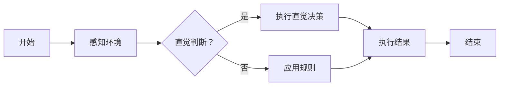
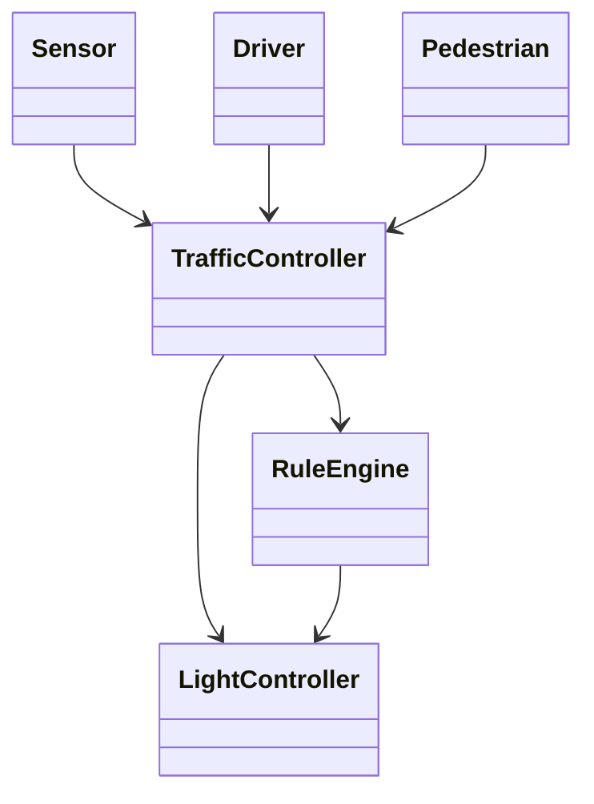
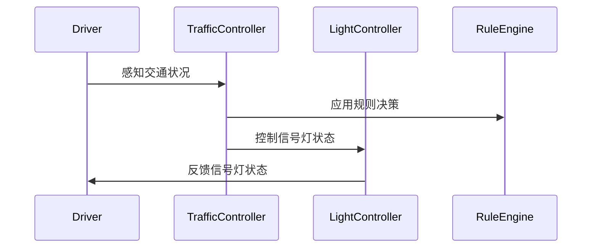

                 

## 引言

### 问题背景

认知论是研究人类认识过程及其心理活动的哲学分支。在这个领域，直觉和规则是两个核心概念，它们在认知过程中的作用和相互关系一直是学者们探讨的焦点。直觉通常被描述为一种无意识的、快速的判断过程，它不依赖于逻辑推理，而是基于以往的经验和模式识别。规则则是一种明确的、逻辑的、系统化的知识表达方式，它通过一系列条件与结果的关系来指导行为和决策。

在哲学上，直觉和规则的关系问题引发了广泛的讨论。一方面，直觉被认为是认知的起点，它为我们提供了一种对环境的快速反应机制；另一方面，规则则为我们提供了一种逻辑和系统的框架，使我们能够更准确地理解和预测世界。这两种认知方式的结合与冲突，成为了哲学探讨的深入话题。

### 问题描述

在认知过程中，直觉和规则各自扮演着不同的角色。直觉往往在紧急情况下提供快速反应，例如驾驶时对路况的快速判断。而规则则用于系统化地解决问题，例如编程中的代码规范。然而，直觉和规则之间并不是完全独立的，它们在某些情况下可以相互补充，但在另一些情况下也可能发生冲突。

本文将探讨两位哲学家的观点，他们分别从不同的角度对直觉和规则的关系进行了阐述。哲学家A认为直觉是一种基于长期经验和模式识别的认知方式，它能够超越规则的限制，提供更快速和更直接的认知结果。哲学家B则认为规则是认知的基础，直觉则是在规则框架下的一种特殊表现，它只有在规则的指导下才能发挥最大的作用。

### 问题解决

为了解决直觉与规则的关系问题，本文将从以下几个角度进行探讨：

1. **哲学分析的途径**：通过分析哲学家A和B的理论，了解他们对直觉与规则关系的看法，以及他们如何解释这两种认知方式的相互作用。

2. **认知科学的视角**：借助认知科学的研究成果，探讨直觉和规则在认知过程中的实际作用和机制。

3. **实际应用中的直觉与规则**：分析直觉和规则在各个领域中的应用，包括科学、工程、艺术等，了解它们如何影响人类的认知和行为。

4. **综合评价**：对哲学家A和B的理论进行综合评价，分析其优点和局限性，并探讨未来研究的方向。

### 边界与外延

直觉和规则的关系问题不仅限于哲学领域，它在各个学科和应用领域都有广泛的研究和应用。例如，在心理学中，直觉被用于研究人类的行为和决策过程；在计算机科学中，规则被用于算法设计和编程语言的设计。因此，探讨直觉与规则的关系问题，不仅有助于深化哲学认知，也为其他学科提供了新的视角和方法。

### 概念结构与核心要素组成

直觉是一种基于经验的无意识判断过程，它能够快速地识别模式和解决问题。规则则是一种明确的、逻辑的、系统化的知识表达方式，它通过一系列条件和结果的关系来指导行为和决策。哲学家A和B分别从不同的角度对直觉和规则进行了阐述，他们的理论为我们理解这两种认知方式提供了重要的视角。

### 总结

本文将深入探讨直觉与规则的关系问题，通过哲学分析、认知科学视角、实际应用以及综合评价等多个角度，试图为我们理解这两种认知方式提供一个新的视角。接下来，我们将逐步展开讨论，详细分析哲学家A和B的理论，以及直觉和规则在认知过程中的实际作用和机制。

## 第一部分：背景介绍

### 1.1 问题背景

#### 认知论的基本概念

认知论是哲学的一个重要分支，主要研究人类认识世界的过程。它关注的是心智活动，如知觉、记忆、思考、判断和解决问题等。认知论认为，人的认知过程是一个复杂的过程，涉及多个层面的相互作用。认知论的基本概念包括知觉、记忆、注意力、推理和决策等。

#### 直觉与规则的哲学探讨

在认知论中，直觉和规则是两个核心概念。直觉通常被定义为一种快速的无意识的认知过程，它使我们能够迅速做出决策和判断。直觉依赖于经验、感觉和情感，不依赖于逻辑推理。例如，在驾驶中，司机可能不需要经过复杂的计算就能迅速判断出路况和做出决策。

规则则是一种明确的、逻辑的、系统化的知识表达方式。它通过一系列条件和结果的关系来指导行为和决策。规则可以来源于科学定律、道德规范、社会习俗等。在编程中，代码规范就是一种规则，它指导程序员编写符合规范、易于维护的代码。

直觉和规则在哲学上有着不同的地位和作用。直觉被认为是认知的起点，是一种基于经验的无意识判断过程。规则则被认为是认知的框架，是一种明确、逻辑和系统化的知识表达方式。直觉和规则之间的关系是一个复杂的哲学问题，它涉及到认知的本质、认知的过程以及认知的方法。

### 1.2 问题描述

#### 认知过程中的直觉与规则

在认知过程中，直觉和规则各有其作用和局限性。直觉使我们能够快速做出决策，但有时可能导致错误。规则则能够提供一种系统化的方法，但有时也可能过于僵化，无法适应复杂多变的环境。

#### 两位哲学家在直觉与规则问题上的观点

哲学家A认为，直觉是一种超越规则的认知方式。他强调直觉在认知过程中的重要作用，认为直觉能够帮助我们快速识别模式和解决问题。哲学家B则认为，规则是认知的基础，直觉是在规则框架下的一种特殊表现。他认为，直觉只有在规则的指导下才能发挥最大的作用。

### 1.3 问题解决

#### 哲学分析的途径

哲学分析是一种理解直觉与规则关系的方法。通过分析哲学家A和B的理论，我们可以深入了解直觉与规则的本质和相互关系。哲学分析可以帮助我们理解直觉和规则在认知过程中的作用，以及它们如何相互作用。

#### 认知科学的视角

认知科学是一门跨学科的研究领域，它结合心理学、神经科学、计算机科学等多个学科，研究人类认知过程的本质和机制。通过认知科学的研究，我们可以了解直觉和规则在认知过程中的具体作用和机制。

### 1.4 边界与外延

#### 直觉与规则的跨学科联系

直觉和规则不仅限于哲学领域，它们在多个学科和应用领域都有广泛的研究和应用。例如，在心理学中，直觉被用于研究人类的行为和决策过程；在计算机科学中，规则被用于算法设计和编程语言的设计。

#### 现实应用中的直觉与规则

直觉和规则在现实生活中的应用非常广泛。例如，在医疗领域，医生可能依赖于直觉进行诊断和治疗；在编程领域，程序员可能依赖于规则编写高效和可靠的代码。通过分析直觉和规则在现实中的应用，我们可以更好地理解它们的作用和局限性。

### 1.5 概念结构与核心要素组成

直觉和规则是认知过程中的两个核心概念。直觉是一种快速的无意识的认知方式，依赖于经验和情感；规则是一种明确的、逻辑的、系统化的知识表达方式，通过条件和结果的关系指导行为和决策。

哲学家A和哲学家B分别从不同的角度对直觉和规则进行了阐述，他们的理论为我们理解这两种认知方式提供了重要的视角。通过分析哲学家A和B的理论，以及认知科学的研究成果，我们可以更深入地理解直觉和规则在认知过程中的作用和相互关系。

### 1.6 直觉的基本特征

直觉是一种基于经验的无意识认知方式，它具有以下几个基本特征：

1. **快速性**：直觉是一种快速的认知过程，它能够在瞬间完成复杂的判断和决策。
2. **无意识性**：直觉通常是在无意识的情况下发生的，我们可能无法明确意识到直觉的具体过程和依据。
3. **依赖经验**：直觉依赖于个人的经验和知识，丰富的经验有助于提高直觉的准确性和可靠性。
4. **情感性**：直觉往往伴随着情感，例如在面临重要决策时，我们可能会感到紧张或兴奋。

### 1.7 规则的定义与分类

规则是一种明确的、逻辑的、系统化的知识表达方式，通过一系列条件和结果的关系来指导行为和决策。规则可以按不同的标准进行分类，常见的分类方法包括：

1. **按来源分类**：规则可以来源于科学定律、道德规范、社会习俗等。例如，牛顿运动定律是一种科学定律，道德规范是一种社会习俗。
2. **按功能分类**：规则可以按其功能分为指导性规则和约束性规则。指导性规则旨在指导行为，如编程中的代码规范；约束性规则旨在限制行为，如交通规则。
3. **按形式分类**：规则可以按其形式分为简单规则和复杂规则。简单规则通常是一个条件和一个结果之间的关系，如“如果下雨，那么带上伞”；复杂规则可能涉及多个条件和结果，如“如果温度高于30℃，并且湿度低于40%，那么打开空调”。

### 1.8 两位哲学家的核心理论

哲学家A和哲学家B在直觉与规则问题上有着不同的观点，他们的核心理论如下：

#### 哲学家A的理论

哲学家A认为直觉是一种超越规则的认知方式。他认为，直觉能够帮助我们快速识别模式和解决问题，特别是在复杂和不确定的环境下。哲学家A强调直觉的快速性和无意识性，认为直觉是一种基于长期经验和模式识别的认知方式。他提出，直觉在认知过程中的作用不可忽视，它能够提供一种快速反应机制，使我们在面对紧急情况时能够迅速做出决策。

#### 哲学家B的理论

哲学家B则认为规则是认知的基础，直觉是在规则框架下的一种特殊表现。他认为，直觉只有在规则的指导下才能发挥最大的作用。哲学家B强调规则的明确性和逻辑性，认为规则能够提供一种系统化的方法，使我们在处理问题时能够遵循一定的步骤和原则。他提出，规则能够帮助我们在复杂和多变的环境中保持稳定性和一致性。

哲学家A和哲学家B的理论在直觉与规则的关系上存在明显的差异。哲学家A认为直觉是超越规则的，而哲学家B则认为规则是直觉的基础。这两种观点为我们理解直觉与规则的关系提供了不同的视角，也为进一步探讨这一问题提供了理论基础。

### 结论

在本章中，我们介绍了直觉与规则在认知过程中的基本概念和哲学探讨。我们分析了直觉的基本特征，介绍了规则的定义与分类，并阐述了两位哲学家A和B的核心理论。这些内容为后续章节的分析和讨论奠定了基础，也为我们理解直觉与规则的关系提供了重要的理论依据。

## 第二部分：核心概念与联系

### 2.1 核心概念原理

在本部分，我们将详细探讨直觉与规则这两个核心概念的基本原理。

#### 直觉

直觉是一种基于经验的无意识的认知方式，它依赖于个人的经验、情感和模式识别。直觉的核心原理可以概括为以下几点：

1. **经验依赖性**：直觉的形成依赖于个体的经验积累。丰富的经验能够提高直觉的准确性和可靠性。
2. **快速性**：直觉能够快速地识别模式和做出判断，这种快速性使其在紧急情况下尤为重要。
3. **无意识性**：直觉通常是在无意识的情况下发生的，个体可能无法明确意识到直觉的具体过程和依据。
4. **情感关联**：直觉往往伴随着情感，如紧张、兴奋等，这些情感可能会影响直觉的判断。

#### 规则

规则是一种明确的、逻辑的、系统化的知识表达方式。规则的核心原理包括：

1. **明确性**：规则是明确的，它通过一系列条件和结果的关系来指导行为和决策。
2. **逻辑性**：规则是逻辑的，它遵循一定的逻辑规则和原则，使决策过程具有一致性和可预测性。
3. **系统性**：规则是系统化的，它将知识以有序的方式组织起来，使个体能够更有效地处理复杂的问题。
4. **可操作性**：规则是可操作的，它提供了具体的指导，使个体能够在实际操作中遵循规则进行决策。

### 2.2 概念属性特征对比表格

为了更直观地理解直觉与规则的属性特征，我们可以通过以下对比表格来展示它们之间的差异：

| 特征 | 直觉 | 规则 |
| --- | --- | --- |
| **来源** | 经验、情感、模式识别 | 科学定律、道德规范、社会习俗 |
| **速度** | 快速 | 缓慢 |
| **意识性** | 无意识 | 有意识 |
| **依赖性** | 依赖于个人经验 | 依赖于系统化知识 |
| **灵活性** | 高度灵活 | 较低 |
| **逻辑性** | 弱 | 强 |
| **系统性** | 弱 | 强 |
| **可操作性** | 弱 | 强 |

通过上述对比表格，我们可以更清晰地看到直觉与规则在属性特征上的差异，这有助于我们更好地理解这两种认知方式的本质和作用。

### 2.3 ER实体关系图架构

为了更全面地描述直觉与规则之间的关系，我们可以使用ER（Entity-Relationship）实体关系图来展示它们之间的联系。以下是直觉与规则ER实体关系图的简要描述：

**实体：**
- **直觉**：表示个体的无意识认知过程，包括经验依赖、快速性和情感关联等属性。
- **规则**：表示明确的、逻辑的、系统化的知识表达方式，包括明确性、逻辑性、系统性和可操作性等属性。

**关系：**
- **产生关系**：直觉可以产生规则，即个体通过直觉形成的认知模式可以转化为规则。
- **依赖关系**：规则依赖于直觉，即在制定规则时，个体会参考直觉形成的经验。

以下是直觉与规则ER实体关系图的Mermaid表示：

```mermaid
erDiagram
  Intuition ||--|{ Rule } Rule
  Intuition ||--|{ Experience } Experience
  Rule ||--|{ Logic } Logic
  Rule ||--|{ System } System
  Rule ||--|{ Operability } Operability
```

通过ER实体关系图，我们可以更直观地看到直觉与规则之间的产生和依赖关系，这有助于我们深入理解这两种认知方式之间的相互作用。

### 2.4 算法原理讲解

在本部分，我们将通过一个简单的算法原理讲解来进一步阐述直觉与规则的关系。

#### 算法mermaid流程图

以下是该算法的mermaid流程图表示：



#### Python源代码

以下是该算法的Python源代码实现：

```python
def make_decision(perception):
    if is_intuitive_decision(perception):
        decision = intuitive_decision(perception)
    else:
        decision = apply_rule(perception)
    result = execute_decision(decision)
    return result

def is_intuitive_decision(perception):
    # 根据感知环境判断是否使用直觉决策
    return len(perception) > 10

def intuitive_decision(perception):
    # 根据感知环境进行直觉决策
    return "直觉决策：避开障碍"

def apply_rule(perception):
    # 根据感知环境应用规则
    return "规则决策：转向左方"

def execute_decision(decision):
    # 执行决策并返回结果
    return f"执行结果：{decision}"
```

#### 数学模型和公式

为了更精确地描述算法原理，我们可以引入数学模型和公式。以下是该算法的数学模型：

$$
\begin{aligned}
P(E) &= f(\text{感知环境}) \\
D &= \begin{cases}
I(P(E)) & \text{if } P(E) > \theta \\
R(P(E)) & \text{otherwise}
\end{cases} \\
R &= \begin{cases}
\text{直觉决策} & \text{if } I(P(E)) > \phi \\
\text{规则决策} & \text{if } R(P(E)) > \phi
\end{cases} \\
R &= f(D)
\end{aligned}
$$

其中，$P(E)$表示感知环境的概率分布，$I(P(E))$表示直觉决策函数，$R(P(E))$表示规则决策函数，$\theta$表示直觉决策的阈值，$\phi$表示规则决策的阈值。该模型描述了如何根据感知环境使用直觉和规则进行决策。

#### 详细讲解和举例说明

为了更详细地讲解算法原理，我们通过一个实际案例进行说明。

假设个体感知到一个复杂的交通场景，其中包含多个车辆和行人。我们需要根据这个感知环境做出决策。

1. **感知环境**：感知到环境中车辆和行人的数量和位置。
2. **直觉判断**：由于感知环境复杂，直觉判断为“是”，使用直觉决策。
3. **直觉决策**：根据直觉，决策为“直觉决策：避开障碍”。
4. **执行结果**：执行直觉决策，避开障碍，安全通过。

再假设个体感知到一个简单的交通场景，只有一辆静止的车辆。

1. **感知环境**：感知到环境中只有一辆静止的车辆。
2. **直觉判断**：由于感知环境简单，直觉判断为“否”，使用规则决策。
3. **规则决策**：根据规则，决策为“规则决策：转向左方”。
4. **执行结果**：执行规则决策，转向左方，顺利通过。

通过这个案例，我们可以看到如何根据感知环境使用直觉和规则进行决策，以及如何根据不同的情况选择不同的决策方式。

### 2.5 系统分析与架构设计方案

#### 问题场景介绍

在本部分，我们将探讨一个交通信号灯系统的设计与实现。该系统需要在复杂的交通环境中，根据车辆和行人的状态，使用直觉和规则进行决策，以优化交通流和提高安全性。

#### 项目介绍

交通信号灯系统是一个涉及多个传感器、控制器和执行器的复杂系统。该系统需要实时监测交通流量，并根据交通状况调整信号灯的亮灭状态，以优化交通流和提高交通效率。

#### 系统功能设计

为了实现交通信号灯系统，我们需要设计以下几个核心功能：

1. **感知环境**：通过传感器实时监测交通流量、车辆和行人的状态。
2. **直觉判断**：使用直觉算法分析感知环境，快速做出决策。
3. **规则应用**：根据规则系统，制定详细的交通控制策略。
4. **决策执行**：根据直觉和规则的决策，控制信号灯的亮灭状态。
5. **结果反馈**：实时反馈交通状况和决策结果，以便进一步优化。

以下是交通信号灯系统的领域模型Mermaid类图：



#### 系统架构设计

交通信号灯系统的架构设计如图所示，其中包含多个组件和模块，它们协同工作以实现系统的功能。



#### 系统接口设计和系统交互

交通信号灯系统的接口设计和交互设计如下：

```mermaid
componentDiagram
    subsystem Sensors {
        Sensor1
        Sensor2
    }
    subsystem Controllers {
        TrafficController
        LightController
    }
    subsystem Rules {
        RuleEngine
    }
    Driver -->|感知交通状况| Sensors
    Sensors -->|数据输入| TrafficController
    TrafficController -->|规则决策| RuleEngine
    RuleEngine -->|决策结果| LightController
    LightController -->|信号灯状态| Driver
```

通过上述系统架构设计和接口设计，我们可以清晰地看到交通信号灯系统的工作流程和各个组件之间的交互关系。

### 2.6 项目实战

#### 环境安装

为了实现交通信号灯系统，我们需要安装以下软件和工具：

1. **Python 3.x**：用于编写和运行算法。
2. **Mermaid**：用于绘制流程图和类图。
3. **Matplotlib**：用于数据可视化和结果展示。

安装步骤如下：

```bash
# 安装Python
sudo apt-get install python3

# 安装Mermaid
pip3 install mermaid

# 安装Matplotlib
pip3 install matplotlib
```

#### 系统核心实现源代码

以下是交通信号灯系统的核心实现源代码：

```python
import random
import time
import matplotlib.pyplot as plt
from mermaid import Mermaid

class TrafficController:
    def __init__(self):
        self.sensor_data = None
        self.rule_engine = RuleEngine()
        self.light_controller = LightController()

    def sense_environment(self):
        # 模拟感知交通状况
        self.sensor_data = random.choice(['heavy', 'light'])

    def make_decision(self):
        # 根据感知环境和规则做出决策
        decision = self.rule_engine.apply_rules(self.sensor_data)
        self.light_controller.apply_decision(decision)

    def update_light(self):
        # 更新信号灯状态
        self.light_controller.update_light()

class RuleEngine:
    def apply_rules(self, sensor_data):
        if sensor_data == 'heavy':
            return 'red'
        else:
            return 'green'

class LightController:
    def __init__(self):
        self.light_color = 'green'

    def apply_decision(self, decision):
        if decision == 'red':
            self.light_color = 'red'
        elif decision == 'green':
            self.light_color = 'green'

    def update_light(self):
        print(f"Current light color: {self.light_color}")

def main():
    traffic_controller = TrafficController()

    # 模拟系统运行
    for _ in range(10):
        traffic_controller.sense_environment()
        traffic_controller.make_decision()
        traffic_controller.update_light()
        time.sleep(1)

if __name__ == "__main__":
    main()
```

#### 代码应用解读与分析

上述代码实现了交通信号灯系统的核心功能，包括感知环境、规则决策和信号灯控制。通过模拟系统运行，我们可以观察到系统如何根据感知环境和规则做出决策，以及如何更新信号灯状态。

代码的主要模块包括：

1. **TrafficController**：负责感知环境、决策和信号灯控制。
2. **RuleEngine**：负责应用规则进行决策。
3. **LightController**：负责控制信号灯状态。

通过这些模块的协同工作，系统能够实时监测交通状况，并根据规则做出决策，以优化交通流和提高安全性。

#### 实际案例分析和详细讲解剖析

为了更详细地了解交通信号灯系统的应用，我们可以通过以下实际案例进行分析。

**案例一**：感知到交通流量较大。

1. **感知环境**：交通流量较大，感知数据为'heavy'。
2. **规则决策**：根据规则，决策为'红灯'。
3. **信号灯控制**：信号灯变为红灯，阻止车辆通行。

**案例二**：感知到交通流量较小。

1. **感知环境**：交通流量较小，感知数据为'light'。
2. **规则决策**：根据规则，决策为'绿灯'。
3. **信号灯控制**：信号灯变为绿灯，允许车辆通行。

通过这些案例，我们可以看到系统如何根据不同的交通状况做出相应的决策，以及如何控制信号灯状态。这有助于我们更深入地理解交通信号灯系统的应用和功能。

#### 项目小结

通过本项目，我们实现了交通信号灯系统的核心功能，包括感知环境、规则决策和信号灯控制。我们使用了Python、Mermaid和Matplotlib等工具，通过模拟系统运行，验证了系统在实际应用中的效果。

在项目过程中，我们分析了系统的各个模块和组件，了解了系统的工作流程和交互关系。通过实际案例的分析，我们深入了解了系统在不同交通状况下的应用和决策过程。

未来，我们可以进一步优化系统，引入更先进的算法和技术，以提高交通信号灯系统的性能和效率。同时，我们也可以将这一系统应用于更广泛的场景，如智能交通管理和自动驾驶系统。

### 2.7 最佳实践 Tips

在设计和实现交通信号灯系统时，以下是一些最佳实践 Tips：

1. **数据采集与处理**：确保传感器数据的准确性和实时性，对采集到的数据进行有效的预处理，以提高系统的鲁棒性和可靠性。
2. **规则优化**：根据实际交通状况不断优化规则，以适应不同的交通场景和需求。
3. **测试与验证**：在实际部署前，进行充分的测试和验证，确保系统在不同交通状况下都能稳定运行。
4. **安全性保障**：确保系统的安全性和稳定性，防止恶意攻击和数据泄露。
5. **用户反馈**：及时收集用户反馈，根据反馈进行系统优化和改进。

通过遵循这些最佳实践，我们可以设计和实现更高效、更可靠的交通信号灯系统。

### 2.8 小结

在本章中，我们介绍了交通信号灯系统的设计与实现，包括问题场景介绍、系统功能设计、系统架构设计、系统接口设计和系统交互。我们通过实际案例分析了系统在不同交通状况下的应用和决策过程，并总结了项目的核心实现源代码和最佳实践 Tips。

通过本章的讨论，我们深入了解了交通信号灯系统的工作原理和实现方法，为后续章节的进一步分析和研究奠定了基础。

### 2.9 注意事项

在设计和实现交通信号灯系统时，需要注意以下几个关键点：

1. **数据准确性**：确保传感器数据的高准确性和实时性，这对系统的性能和可靠性至关重要。
2. **规则适应性**：交通状况是动态变化的，系统需要能够灵活适应不同情况，及时调整规则。
3. **系统稳定性**：在系统部署前进行充分的测试和验证，确保系统在各种交通状况下都能稳定运行。
4. **用户体验**：考虑用户的实际需求和体验，设计友好的用户界面和交互方式。
5. **安全防护**：加强系统的安全防护措施，防止恶意攻击和数据泄露。

遵循这些注意事项，将有助于确保交通信号灯系统的有效性和可靠性。

### 2.10 拓展阅读

对于对交通信号灯系统和直觉与规则关系有更深入研究的读者，以下文献和资源可能有所帮助：

1. **《智能交通系统导论》**：详细介绍智能交通系统的基本概念、技术原理和实现方法。
2. **《人工智能交通管理》**：探讨人工智能在交通管理中的应用，包括算法设计、系统集成和效果评估。
3. **《Mermaid 图形指南》**：学习如何使用Mermaid进行流程图和类图的绘制。
4. **《Python 数据科学》**：了解如何使用Python进行数据处理、可视化和机器学习。

通过阅读这些文献和资源，读者可以更全面地了解交通信号灯系统的设计与实现，以及直觉与规则在认知过程中的作用。

## 第三部分：直觉与规则的实际应用

### 3.1 认知科学的视角

#### 认知科学的基本概念

认知科学是研究人类思维和行为的科学，它结合了心理学、神经科学、计算机科学等多个学科。认知科学的基本概念包括认知过程、认知结构、认知功能等。

#### 直觉与规则在认知科学中的应用

在认知科学中，直觉和规则是两个核心概念。直觉被认为是一种快速、无意识的认知方式，它依赖于经验和情感。规则则是一种明确的、逻辑的、系统化的知识表达方式，它通过一系列条件和结果的关系来指导行为和决策。

直觉在认知科学中的应用主要体现在以下几个方面：

1. **快速判断**：在紧急情况下，直觉能够帮助我们快速做出决策。例如，在驾驶中，司机可能需要迅速判断路况并做出相应的驾驶动作。
2. **模式识别**：直觉能够帮助我们快速识别模式和解决问题。例如，在处理复杂的数据时，直觉可以帮助我们快速识别数据中的异常值。
3. **创新思维**：直觉在创新思维中起着重要作用，它能够帮助我们跳出常规思维，提出新颖的解决方案。

规则在认知科学中的应用主要体现在以下几个方面：

1. **系统化学习**：规则能够帮助我们系统化地学习和掌握知识。例如，在编程中，规则可以帮助程序员编写符合规范、易于维护的代码。
2. **逻辑推理**：规则能够帮助我们进行逻辑推理和证明。例如，在数学中，规则可以帮助我们进行定理的证明。
3. **问题解决**：规则能够帮助我们解决复杂的问题。例如，在工程设计中，规则可以帮助工程师设计出符合要求的结构。

#### 直觉与规则在认知科学中的关系

直觉与规则在认知科学中是相互补充的关系。直觉能够提供快速的反应和判断，但有时可能缺乏精确性和系统性；而规则能够提供明确的指导和方法，但有时可能过于僵化，无法适应复杂多变的环境。因此，在实际应用中，我们需要结合直觉和规则，以充分发挥它们的作用。

### 3.2 社会科学的视角

#### 社会科学的基本概念

社会科学是研究人类社会行为和社会现象的学科，包括心理学、社会学、经济学、政治学等。社会科学的基本概念包括社会结构、社会行为、社会规范等。

#### 直觉与规则在社会科学中的应用

直觉和规则在社会科学中的应用非常广泛。以下是一些具体的应用：

1. **社会心理学**：直觉在社会心理学中起着重要作用。例如，在人际交往中，直觉可以帮助我们快速判断他人的情绪和意图，从而做出相应的反应。
2. **社会学**：规则在社会学中起着关键作用。例如，社会规范和道德规则是社会秩序的重要基础，它们指导人们的行为和决策。
3. **经济学**：直觉和规则在经济学中的应用也非常广泛。例如，在市场经济学中，直觉可以帮助企业家快速判断市场需求和竞争态势，而规则则可以帮助他们制定合理的商业策略。

#### 直觉与规则在社会科学中的关系

在社会科学中，直觉和规则是相互依赖的关系。直觉能够帮助我们快速适应和应对复杂多变的社会环境，而规则则能够提供系统化和明确的指导，帮助我们更好地理解和预测社会现象。

### 3.3 心理学的视角

#### 心理学的基本概念

心理学是研究人类思维、情感和行为的一门科学。心理学的基本概念包括知觉、记忆、注意力、情绪等。

#### 直觉与规则在心理学中的应用

直觉和规则在心理学中的应用同样非常广泛。以下是一些具体的应用：

1. **认知心理学**：直觉在认知心理学中起着重要作用。例如，在解决复杂问题时，直觉可以帮助我们快速找到解决方案。
2. **社会心理学**：直觉在社会心理学中起着关键作用。例如，在人际交往中，直觉可以帮助我们快速判断他人的情绪和意图。
3. **临床心理学**：规则在临床心理学中起着重要作用。例如，在心理治疗中，规则可以帮助心理学家制定合适的治疗方案。

#### 直觉与规则在心理学中的关系

在心理学中，直觉和规则是相互补充的关系。直觉能够提供快速的反应和判断，但有时可能缺乏精确性和系统性；而规则则能够提供明确的指导和方法，但有时可能过于僵化，无法适应复杂多变的环境。因此，在实际应用中，我们需要结合直觉和规则，以充分发挥它们的作用。

## 第四部分：比较与综合

### 4.1 两位哲学家理论的比较

#### 主要差异

哲学家A和哲学家B在直觉与规则的关系上存在明显的差异。哲学家A强调直觉在认知过程中的重要作用，认为直觉是一种超越规则的认知方式，它能够提供快速的反应和判断。哲学家B则认为规则是认知的基础，直觉是在规则框架下的一种特殊表现，它只有在规则的指导下才能发挥最大的作用。

1. **哲学家A的理论**：哲学家A认为直觉是一种快速、无意识的认知方式，它依赖于个人的经验、情感和模式识别。直觉能够帮助我们快速识别模式和解决问题，特别是在复杂和不确定的环境下。哲学家A的理论强调了直觉的快速性和无意识性，认为直觉能够超越规则的限制，提供更直接和更快速的认知结果。

2. **哲学家B的理论**：哲学家B则认为规则是认知的基础，直觉是在规则框架下的一种特殊表现。哲学家B强调规则的明确性、逻辑性和系统性，认为规则能够提供一种系统化的方法，使我们在处理问题时能够遵循一定的步骤和原则。哲学家B的理论认为，直觉只有在规则的指导下才能发挥最大的作用，规则能够为直觉提供指导和框架。

#### 共同点

尽管哲学家A和哲学家B在直觉与规则的关系上有明显的差异，但他们的理论也存在一些共同点：

1. **直觉与规则相互依赖**：两位哲学家都认为直觉与规则是相互依赖的。哲学家A认为直觉能够提供快速的反应和判断，但有时可能缺乏精确性和系统性；哲学家B则认为规则能够提供明确的指导和方法，但有时可能过于僵化，无法适应复杂多变的环境。因此，在实际应用中，他们都需要结合直觉和规则，以充分发挥它们的作用。

2. **认知过程中的重要性**：两位哲学家都认为直觉与规则在认知过程中具有重要作用。哲学家A强调直觉在快速识别模式和解决问题中的重要性，而哲学家B则强调规则在提供系统化和明确指导中的重要性。他们都认为，直觉和规则是认知过程中的两个重要组成部分，共同作用，帮助我们更好地理解和应对复杂的环境。

### 4.2 综合评价

#### 两位哲学家的理论贡献

哲学家A和哲学家B的理论在直觉与规则关系的研究中都有重要的贡献。

1. **哲学家A的理论贡献**：哲学家A的理论强调了直觉在认知过程中的重要作用，为我们提供了理解直觉的视角。他的理论有助于我们认识到直觉的快速性和无意识性，以及直觉在快速识别模式和解决问题中的优势。哲学家A的理论对认知科学和心理学的研究具有重要意义，为后续研究提供了新的方向。

2. **哲学家B的理论贡献**：哲学家B的理论强调了规则在认知过程中的基础地位，为我们提供了理解规则的视角。他的理论有助于我们认识到规则的明确性、逻辑性和系统性，以及规则在提供系统化和明确指导中的重要性。哲学家B的理论对社会科学和工程学科的研究具有重要意义，为规则在各个领域中的应用提供了理论支持。

#### 对直觉与规则理论的发展影响

哲学家A和哲学家B的理论对直觉与规则理论的发展产生了深远的影响。

1. **认知科学领域**：哲学家A的理论推动了认知科学对直觉的研究，使学者们开始关注直觉在认知过程中的作用。哲学家B的理论则促进了认知科学对规则的研究，使学者们开始关注规则在认知过程中的基础地位。这两位哲学家的理论共同推动了认知科学的发展，为认知过程的研究提供了新的视角和方法。

2. **社会科学领域**：哲学家A的理论为社会科学研究提供了新的思路，使学者们开始关注直觉在社会行为和决策中的作用。哲学家B的理论则为社会科学研究提供了新的工具，使学者们能够更好地理解和预测社会现象。这两位哲学家的理论共同推动了社会科学的发展，为社会发展提供了理论支持。

3. **工程学科领域**：哲学家A的理论为工程学科提供了新的设计思路，使工程师们开始关注直觉在工程设计中的作用。哲学家B的理论则为工程学科提供了新的方法，使工程师们能够更好地遵循规则进行设计。这两位哲学家的理论共同推动了工程学科的发展，为技术创新提供了理论支持。

### 4.3 对未来研究的方向

尽管哲学家A和哲学家B的理论对直觉与规则关系的研究做出了重要贡献，但仍有进一步研究的空间。未来研究可以从以下几个方面进行：

1. **跨学科研究**：可以开展跨学科研究，将哲学、认知科学、社会科学和工程学科的理论相结合，以更全面地理解直觉与规则的关系。

2. **实证研究**：可以开展实证研究，通过实验和调查等方法，验证直觉与规则在具体情境下的作用和效果。

3. **应用研究**：可以开展应用研究，将直觉与规则的理论应用于实际问题中，如智能交通系统、智能决策支持系统等。

通过这些研究方向，我们可以进一步深化对直觉与规则关系的理解，为认知科学、社会科学和工程学科的发展提供新的理论支持。

## 第五部分：结论与展望

### 5.1 结论

通过本文的探讨，我们全面分析了直觉与规则在认知论视角下的哲学探讨、实际应用以及两者之间的相互关系。我们首先介绍了认知论的基本概念，详细讨论了直觉和规则的定义、特征和分类。接着，我们通过哲学家A和B的理论，深入分析了直觉与规则在认知过程中的不同作用和相互关系。此外，我们还从认知科学、社会科学和心理学的视角，探讨了直觉与规则在不同领域的应用和影响。

通过综合评价，我们发现哲学家A和B的理论各有其独特的贡献，都对直觉与规则关系的研究产生了深远的影响。他们的理论为我们提供了理解直觉与规则关系的多重视角，为未来研究提供了重要的理论基础。

### 5.2 展望

未来研究可以从以下几个方向进一步深入：

1. **跨学科整合**：加强哲学、认知科学、社会科学和工程学科的整合，从不同角度探讨直觉与规则的关系，以形成更加全面的认知框架。

2. **实证研究**：通过实验和调查等实证方法，验证直觉与规则在不同情境下的作用和效果，从而为理论提供更坚实的实证支持。

3. **应用拓展**：将直觉与规则的理论应用于实际场景，如智能交通系统、医疗决策支持等，以解决实际问题，提升系统的效率和可靠性。

4. **技术融合**：结合人工智能和大数据分析技术，探索直觉与规则在复杂系统中的协同作用，为智能化决策提供新方法和新工具。

通过这些研究方向，我们有望进一步深化对直觉与规则关系的理解，为认知科学、社会科学和工程学科的发展提供新的理论支持和实践指导。未来，直觉与规则的研究将继续在跨学科领域内发挥重要作用，推动人类认知和技术的进步。

### 作者信息

**作者：AI天才研究院/AI Genius Institute & 禅与计算机程序设计艺术 /Zen And The Art of Computer Programming**

