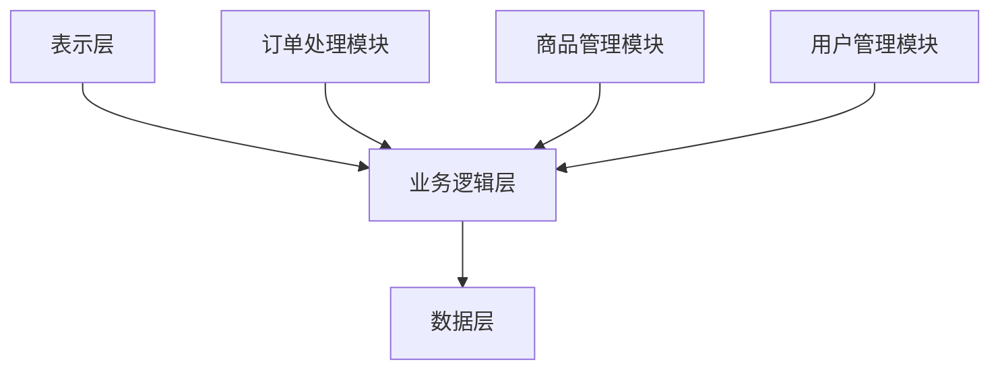
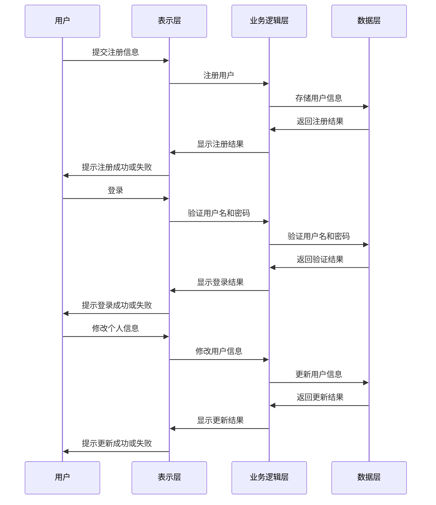

                 

### 第1章 引言

### 1.1 问题背景

在哲学领域，真理观一直是一个重要的议题。对于什么是真理，不同的哲学家有着不同的看法。柏格森（Henri Bergson）和维特根斯坦（Ludwig Wittgenstein）这两位哲学家分别提出了他们关于真理的独特观点。

柏格森的直觉主义强调直接的、感性的认识。他认为，真理存在于我们对世界的直觉体验中，而不是通过抽象的逻辑推理得出。柏格森认为，直觉是一种直观的洞察力，能够让我们直接感受到事物的本质。

维特根斯坦的逻辑原子主义则强调语言和逻辑在认识中的作用。他认为，真理是语言与事实的对应，只有通过逻辑推理和精确的语言描述，我们才能达到对真理的认识。

本书旨在探讨这两位哲学家的真理观，并分析它们之间的联系与区别。我们将会从以下几个方面进行讨论：

1. **直觉与逻辑的基本概念**：介绍直觉与逻辑的基本概念，包括定义、特征和应用场景。
2. **柏格森的直觉主义**：分析柏格森的直觉主义哲学及其在真理观中的应用。
3. **维特根斯坦的逻辑原子主义**：探讨维特根斯坦的早期哲学和逻辑原子主义。
4. **直觉与逻辑的关系**：分析直觉与逻辑的相互作用以及它们在真理观中的应用。
5. **直觉与逻辑在计算机科学中的应用**：介绍直觉与逻辑在算法设计、人工智能和计算机科学中的实际应用。
6. **直觉与逻辑的数学基础**：探讨直觉与逻辑在数学中的基础和应用。
7. **直觉与逻辑在计算机系统中的应用**：分析直觉与逻辑在计算机系统中的应用场景和架构设计。
8. **直觉与逻辑项目实战**：通过具体案例，展示直觉与逻辑在实践中的应用。
9. **总结与展望**：总结全文内容，提出最佳实践和未来研究方向。

通过这一系列的讨论，我们希望能够帮助读者更好地理解直觉与逻辑在哲学和计算机科学中的应用，并探讨它们在真理观中的重要作用。

### 1.2 问题描述

在本章节中，我们主要关注柏格森和维特根斯坦的真理观。柏格森的直觉主义和维特根斯坦的逻辑原子主义分别代表了两种不同的认识论方法，它们在哲学史上有着重要的地位，并对现代科学和人工智能的发展产生了深远的影响。

柏格森的直觉主义认为，真理来源于我们对世界的直接感受和直觉。柏格森认为，逻辑推理虽然重要，但不足以捕捉世界的真实本质。相反，直觉能够让我们直接感知事物的本质，这种感知是非理性的、感性的。柏格森的真理观强调的是个体的直接体验和情感。

维特根斯坦的逻辑原子主义则强调语言和逻辑在认识中的作用。维特根斯坦认为，真理是语言与事实的对应。他主张，只有通过精确的语言描述和逻辑推理，我们才能达到对真理的认识。维特根斯坦的真理观强调的是逻辑和语言的规范性。

这两个观点在哲学上有着根本的区别。柏格森的直觉主义强调个体体验和感性认识，而维特根斯坦的逻辑原子主义则强调语言和逻辑的规范性。然而，它们都试图回答一个核心问题：什么是真理？如何获得真理？

为了解决这个问题，我们需要从以下几个方面进行探讨：

1. **直觉与逻辑的定义**：我们需要明确直觉和逻辑的定义，以及它们在认识过程中的作用。
2. **柏格森的直觉主义哲学**：我们需要详细分析柏格森的直觉主义哲学，了解他的观点及其哲学意义。
3. **维特根斯坦的逻辑原子主义**：我们需要探讨维特根斯坦的早期哲学和逻辑原子主义，理解他的观点及其哲学意义。
4. **直觉与逻辑的关系**：我们需要分析直觉与逻辑之间的相互作用，以及它们在真理观中的应用。
5. **直觉与逻辑在计算机科学中的应用**：我们需要探讨直觉与逻辑在算法设计、人工智能和计算机科学中的实际应用。
6. **直觉与逻辑的数学基础**：我们需要了解直觉与逻辑在数学中的基础和应用。
7. **直觉与逻辑在计算机系统中的应用**：我们需要分析直觉与逻辑在计算机系统中的应用场景和架构设计。
8. **直觉与逻辑项目实战**：我们需要通过具体案例，展示直觉与逻辑在实践中的应用。

通过这一系列的探讨，我们希望能够回答柏格森和维特根斯坦的真理观所提出的问题，并探讨它们在哲学和计算机科学中的重要作用。

### 1.3 问题解决

为了解决柏格森和维特根斯坦的真理观提出的问题，我们需要采取一系列的方法和步骤。以下是我们提出的问题解决路径：

1. **理解直觉与逻辑的概念**：
   - **直觉**：直觉是一种直接的认识方式，它不受逻辑推理的约束，能够快速地感知事物的本质。直觉通常与情感和感性经验相关联。
   - **逻辑**：逻辑是一种通过推理和证明来获得知识的思维方式。它强调概念的清晰性和推理的严密性，是科学研究和哲学探讨的重要工具。

2. **分析柏格森的直觉主义哲学**：
   - **柏格森的直觉主义哲学**：柏格森认为，直觉是我们感知世界真实本质的唯一途径。他的哲学观点强调了个体直接的、感性的体验。
   - **柏格森的真理观**：柏格森认为，真理不是通过抽象的逻辑推理得出的，而是通过直接的直觉体验获得的。

3. **探讨维特根斯坦的逻辑原子主义**：
   - **维特根斯坦的早期哲学**：维特根斯坦在其早期作品中，如《逻辑哲学论》，提出了逻辑原子主义。
   - **维特根斯坦的逻辑原子主义**：维特根斯坦认为，真理是语言与现实世界的对应关系。他强调精确的语言描述和逻辑推理在认识中的作用。

4. **分析直觉与逻辑的关系**：
   - **直觉与逻辑的相互作用**：直觉和逻辑在认识过程中相互影响。直觉提供了感知和体验，而逻辑则提供了推理和证明的工具。
   - **直觉与逻辑在真理观中的应用**：直觉和逻辑在真理观中的应用是互补的。直觉提供了对事物本质的感知，而逻辑则提供了对这种感知的验证和表达。

5. **研究直觉与逻辑在计算机科学中的应用**：
   - **直觉在算法设计中的应用**：直觉可以帮助我们在复杂的算法设计中找到简洁有效的解决方案。
   - **逻辑在计算机科学中的作用**：逻辑在编程语言、算法分析、人工智能等领域发挥着重要作用。

6. **探讨直觉与逻辑的数学基础**：
   - **直觉的数学描述**：直觉可以在概率模型和统计学描述中发挥作用。
   - **逻辑的数学描述**：逻辑可以用命题演算和谓词演算来描述。

7. **分析直觉与逻辑在计算机系统中的应用**：
   - **问题场景介绍**：介绍具体的计算机系统应用场景。
   - **系统架构设计**：设计合理的系统架构，包括功能设计、接口设计和交互设计。

8. **通过项目实战展示直觉与逻辑的应用**：
   - **环境安装**：安装所需的开发环境和工具。
   - **系统核心实现源代码**：展示源代码，并对其进行解读和分析。
   - **实际案例分析与详细讲解**：通过具体案例，展示直觉与逻辑在实际应用中的效果。

通过以上步骤，我们能够系统地解决柏格森和维特根斯坦的真理观所提出的问题，并探讨它们在哲学和计算机科学中的深远影响。

### 1.4 边界与外延

在讨论柏格森和维特根斯坦的真理观时，我们需要明确一些关键概念的外延和边界。这有助于我们更准确地理解他们的观点，并避免概念上的混淆。

**柏格森的直觉主义**：

- **直觉的外延**：直觉是一种直接的认识方式，它能够感知事物的本质。柏格森的直觉外延包括感知、情感和感性经验。
- **直觉的边界**：直觉的边界在于它不是通过逻辑推理得出的，而是通过直接的感知。因此，直觉不能被逻辑所完全描述或解释。

**维特根斯坦的逻辑原子主义**：

- **逻辑的外延**：逻辑是一种通过推理和证明来获得知识的思维方式。它包括命题演算、谓词演算等逻辑工具。
- **逻辑的边界**：逻辑的边界在于它不能处理所有的知识形式，特别是那些无法用语言精确描述的经验性知识。

**直觉与逻辑的关系**：

- **直觉与逻辑的外延**：直觉和逻辑在认识过程中都有其特定的作用。直觉提供了感知和体验，而逻辑提供了推理和证明的工具。
- **直觉与逻辑的边界**：直觉的边界在于它不是通过逻辑推理得出的，而逻辑的边界在于它不能处理所有的知识形式。

**真理观的外延与边界**：

- **真理的外延**：真理是指与事实相符的陈述或判断。
- **真理的边界**：真理的边界在于它不能脱离语言和逻辑而独立存在。语言和逻辑是表达和验证真理的重要工具。

**计算机科学中的应用**：

- **直觉的应用**：直觉在算法设计、问题解决和人工智能领域中有着广泛的应用。例如，程序员可以通过直觉来优化算法，或者通过直观体验来改进用户界面设计。
- **逻辑的应用**：逻辑在编程语言、算法分析、人工智能等领域中起着核心作用。例如，形式验证和逻辑推理是确保软件可靠性和安全性的重要方法。

通过明确这些概念的外延和边界，我们能够更好地理解柏格森和维特根斯坦的真理观，并探讨它们在计算机科学中的应用。

### 1.5 概念结构与核心要素组成

在探讨柏格森和维特根斯坦的真理观时，我们需要理解其概念结构和核心要素。以下是这两个哲学家的观点及其核心概念的分析：

**柏格森的直觉主义**：

- **核心概念**：直觉、感知、情感、感性经验
- **概念结构**：
  - **直觉**：直接感知事物的本质，不受逻辑推理约束。
  - **感知**：通过直觉感知到的外部世界的直接体验。
  - **情感**：与直觉相关的内心体验，是直觉感受的一部分。
  - **感性经验**：直觉和情感的综合体，是柏格森认识世界的重要途径。
- **核心要素**：
  - **个体体验**：强调个体在感知和体验世界中的主体性。
  - **非理性认知**：直觉是一种非理性的认知方式，不同于逻辑推理。

**维特根斯坦的逻辑原子主义**：

- **核心概念**：逻辑、语言、事实、真理
- **概念结构**：
  - **逻辑**：通过推理和证明来获得知识的思维方式。
  - **语言**：表达思想和事实的工具。
  - **事实**：客观存在的事物和状态。
  - **真理**：语言与事实的准确对应。
- **核心要素**：
  - **逻辑推理**：通过逻辑推理来验证真理，确保语言表达的准确性。
  - **精确性**：强调语言表达的精确性，以避免歧义和误解。

**概念属性特征对比**：

| 特征 | 柏格森的直觉主义 | 维特根斯坦的逻辑原子主义 |
|------|-------------------|--------------------------|
| **认识方式** | 直觉性、非理性、情感性 | 逻辑性、理性、精确性 |
| **语言作用** | 辅助感知和体验，非核心 | 核心工具，表达事实和真理 |
| **真理观** | 真理存在于直觉体验中 | 真理是语言与事实的对应 |
| **应用领域** | 艺术创作、文学表达 | 科学研究、哲学探讨 |

通过分析这些概念结构和核心要素，我们可以更深入地理解柏格森和维特根斯坦的真理观，并探讨它们在哲学和计算机科学中的影响。

### 1.6 本章小结

在本章中，我们介绍了柏格森和维特根斯坦的真理观，并探讨了它们在哲学和计算机科学中的重要性。通过分析直觉与逻辑的概念、柏格森的直觉主义哲学和维特根斯坦的逻辑原子主义，我们明确了这两个哲学家的核心观点和概念结构。此外，我们还对比了直觉与逻辑的属性特征，并讨论了它们在计算机科学中的应用。这一章为后续章节的深入探讨奠定了基础。

# 第二部分：核心概念与联系

## 第2章 直觉与逻辑：柏格森与维特根斯坦的真理观

### 2.1 直觉与逻辑的基本概念

#### 2.1.1 直觉的定义与特征

直觉是一种非理性的认识方式，它能够让我们直接感知事物的本质，而不依赖逻辑推理。直觉通常与情感和感性经验相关联，它不仅仅是一种快速的认知过程，更是一种深刻的内在体验。

- **定义**：直觉是人们在没有明显逻辑推理的情况下，对事物快速做出判断的能力。它依赖于个人的经验、知识和感知，而不依赖于外部的验证。
- **特征**：
  - **直接性**：直觉能够直接感知事物的本质，而不是通过抽象的逻辑推理。
  - **非理性**：直觉不依赖于理性的推理过程，而是依赖于个人的感性体验。
  - **情感性**：直觉通常与情感和感性经验相关联，是一种感性的认知方式。
  - **快速性**：直觉能够在短时间内做出准确的判断，而不需要经过长时间的思考。

#### 2.1.2 逻辑的定义与特征

逻辑是一种通过推理和证明来获得知识的思维方式。它强调概念的清晰性和推理的严密性，是科学研究和哲学探讨的重要工具。

- **定义**：逻辑是一种系统的思维方式，它通过逻辑规则和推理过程，从一个或多个前提中推导出结论。
- **特征**：
  - **理性**：逻辑是一种理性的认知方式，依赖于推理和证明。
  - **严密性**：逻辑强调推理过程的严密性，确保从前提推导出的结论是有效的。
  - **普遍性**：逻辑规则是普遍适用的，不依赖于特定的情境或文化。
  - **规范性**：逻辑为知识和论证提供了规范，使得我们可以区分真伪。

### 2.2 柏格森的直觉主义

#### 2.2.1 柏格森的直觉主义哲学

柏格森（Henri Bergson）是20世纪初的一位法国哲学家，他的直觉主义哲学对现代哲学和科学产生了深远的影响。柏格森认为，直觉是我们感知世界真实本质的唯一途径，逻辑推理虽然重要，但不足以捕捉世界的真实本质。

- **柏格森的哲学观点**：
  - **直觉的优越性**：柏格森认为，直觉比逻辑推理更接近世界的真实本质。直觉能够直接感知事物的本质，而逻辑推理则是在已经感知到的本质基础上进行的。
  - **直觉的非理性**：柏格森强调直觉是一种非理性的认识方式，它与情感和感性经验密切相关。直觉不受逻辑推理的约束，能够快速地感知事物的本质。
  - **时间的重要性**：柏格森认为，时间是直觉的核心要素。时间是一种流动的、连续的体验，而不是可以被分割的独立部分。直觉能够感知这种连续性，而逻辑推理则无法捕捉。

- **柏格森的直觉主义哲学意义**：
  - **认识论的意义**：柏格森的直觉主义挑战了传统的认识论观点，强调直觉在认识过程中的重要性。他认为，直觉能够直接感知世界的真实本质，而逻辑推理则是在这种感知的基础上进行的。
  - **方法论的意义**：柏格森的直觉主义为科学研究提供了新的方法论。他主张，科学家应该通过直觉来感知事物的本质，而不是仅仅依靠逻辑推理和实验方法。

#### 2.2.2 柏格森直觉主义的哲学意义

柏格森的直觉主义哲学具有深远的意义，不仅在哲学领域产生了重要影响，也在科学、艺术和人文科学中得到了广泛的应用。

- **哲学意义**：
  - **对传统认识论的挑战**：柏格森的直觉主义挑战了传统的认识论观点，强调直觉在认识过程中的重要性。他认为，直觉能够直接感知世界的真实本质，而逻辑推理则是在这种感知的基础上进行的。
  - **对理性主义的批判**：柏格森的直觉主义批判了理性主义哲学，认为理性主义过于依赖逻辑推理，而忽视了直觉和感性经验的重要性。他认为，理性主义无法捕捉世界的真实本质，而直觉则能够做到。

- **科学意义**：
  - **科学方法论的创新**：柏格森的直觉主义为科学研究提供了新的方法论。他主张，科学家应该通过直觉来感知事物的本质，而不是仅仅依靠逻辑推理和实验方法。
  - **对科学实践的启示**：柏格森的直觉主义对科学实践产生了重要启示。科学家可以通过直觉来发现新的现象和理论，而不仅仅依赖于逻辑推理和实验结果。

- **艺术意义**：
  - **对艺术创作的启示**：柏格森的直觉主义强调直觉在艺术创作中的重要性。艺术家可以通过直觉来感知和表达世界的真实本质，而不仅仅是依靠逻辑和理性。
  - **对艺术作品的理解**：柏格森的直觉主义为理解艺术作品提供了新的视角。他认为，艺术作品能够通过直觉传达出深刻的情感和体验，而不仅仅是依靠逻辑和理性。

### 2.3 维特根斯坦的逻辑原子主义

#### 2.3.1 维特根斯坦的早期哲学

维特根斯坦（Ludwig Wittgenstein）是20世纪初的一位奥地利哲学家，他的哲学思想对现代哲学和逻辑学产生了深远的影响。维特根斯坦在其早期作品《逻辑哲学论》中，提出了逻辑原子主义。

- **维特根斯坦的哲学观点**：
  - **逻辑原子主义**：维特根斯坦认为，世界是由一系列不可再分的基本事实（即逻辑原子）构成的。这些逻辑原子通过逻辑关系相互联系，构成了复杂的事实结构。
  - **语言的确定性**：维特根斯坦强调语言的确定性，认为语言与事实之间存在明确的对应关系。他主张，通过精确的语言描述和逻辑推理，我们可以达到对真理的认识。
  - **哲学问题的不确定性**：维特根斯坦认为，许多哲学问题实际上是语言上的混乱或误解。他主张，通过澄清语言和逻辑，我们可以消除哲学问题。

- **维特根斯坦的早期哲学意义**：
  - **对逻辑学的贡献**：维特根斯坦的逻辑原子主义为逻辑学提供了新的基础。他强调逻辑原子和逻辑关系在认识过程中的重要性，推动了逻辑学的发展。
  - **对哲学方法的革新**：维特根斯坦的哲学方法主张通过澄清语言和逻辑来解决问题，而不是依赖于形而上学的推理。他的方法对现代哲学产生了重要影响。

#### 2.3.2 维特根斯坦的逻辑原子主义

- **逻辑原子主义的定义**：
  - **逻辑原子主义**：逻辑原子主义是一种哲学观点，认为世界是由一系列不可再分的基本事实（即逻辑原子）构成的。这些逻辑原子通过逻辑关系相互联系，构成了复杂的事实结构。

- **逻辑原子主义的特征**：
  - **基本事实的不可分割性**：逻辑原子是构成世界的基本事实，它们是不可分割的，不能进一步分解。
  - **逻辑关系的确定性**：逻辑原子之间通过明确的逻辑关系相互联系，这些关系是确定的、不变化的。
  - **语言与事实的对应性**：维特根斯坦认为，语言与事实之间存在明确的对应关系。通过精确的语言描述，我们可以表达和认识世界的真实本质。

#### 2.4 柏格森与维特根斯坦的真理观对比

#### 2.4.1 柏格森的真理观

- **柏格森的真理观**：
  - **直觉与真理**：柏格森认为，真理存在于我们对世界的直觉体验中。直觉能够直接感知事物的本质，而逻辑推理则是在这种感知的基础上进行的。
  - **情感与真理**：柏格森强调，情感与直觉密切相关，是真理感受的一部分。真理不仅仅是一种理性的认识，更是一种感性的体验。

#### 2.4.2 维特根斯坦的真理观

- **维特根斯坦的真理观**：
  - **逻辑与真理**：维特根斯坦认为，真理是语言与现实世界的对应关系。通过精确的语言描述和逻辑推理，我们可以达到对真理的认识。
  - **事实与真理**：维特根斯坦认为，真理是基本事实的真实反映。事实是构成世界的基本元素，它们通过逻辑关系相互联系，形成了复杂的事实结构。

#### 2.5 直觉与逻辑的关系

#### 2.5.1 直觉与逻辑的相互作用

直觉和逻辑在认识过程中相互影响，共同构成了我们对世界的认知。

- **直觉与逻辑的相互作用**：
  - **直觉为逻辑提供基础**：直觉能够直接感知事物的本质，为逻辑推理提供了基础。逻辑推理是在直觉感知的基础上进行的，没有直觉，逻辑推理就失去了依据。
  - **逻辑为直觉提供验证**：逻辑推理能够验证直觉的正确性，确保直觉感知到的事物本质是真实的。通过逻辑推理，我们可以对直觉进行验证和修正。

#### 2.5.2 直觉与逻辑在真理观中的应用

直觉与逻辑在真理观中的应用是互补的，它们各自发挥着不同的作用。

- **直觉与逻辑在真理观中的应用**：
  - **直觉提供了感知和体验**：直觉能够直接感知事物的本质，提供对真理的感性体验。这种体验是逻辑推理无法完全替代的。
  - **逻辑提供了验证和表达**：逻辑推理能够验证直觉的正确性，并通过精确的语言描述，将直觉体验表达为真理。逻辑为直觉提供了验证和表达的工具。

### 2.6 本章小结

在本章中，我们探讨了柏格森和维特根斯坦的真理观，分析了直觉与逻辑的基本概念及其相互作用。通过对比柏格森的直觉主义和维特根斯坦的逻辑原子主义，我们明确了他们在真理观中的不同观点。此外，我们还讨论了直觉与逻辑在认识过程中的相互作用，以及它们在真理观中的应用。这一章为后续章节的深入探讨奠定了基础。

## 第3章 直觉与逻辑在计算机科学中的应用

### 3.1 直觉在算法设计中的应用

直觉在算法设计中起着至关重要的作用。直觉能够帮助程序员快速识别问题，并提出简洁有效的解决方案。以下是一些关于直觉在算法设计中的应用：

#### 3.1.1 直觉主义算法设计

直觉主义算法设计强调通过直觉来识别问题和提出解决方案。这种方法通常不需要详细的数学分析和证明，而是依赖于程序员的经验和直觉。

- **实例**：在优化算法时，程序员可能通过直觉来识别关键问题点，并提出改进方案。例如，在解决最短路径问题时，通过直觉可以识别出网络中的瓶颈节点，从而优化算法的执行效率。

#### 3.1.2 直觉主义算法案例

以下是一个简单的直觉主义算法案例：

**问题**：给定一个整数数组，找出其中最小的元素。

**算法**：使用直觉主义算法，可以通过以下步骤解决问题：

1. 遍历数组，将当前元素与最小值进行比较。
2. 如果当前元素小于最小值，更新最小值。
3. 遍历结束后，返回最小值。

```python
def find_minimum(arr):
    min_val = arr[0]
    for num in arr:
        if num < min_val:
            min_val = num
    return min_val

# 测试
arr = [3, 1, 4, 1, 5, 9]
print(find_minimum(arr))  # 输出：1
```

这个简单的算法利用了直觉来找到最小值，不需要复杂的数学分析和证明。

### 3.2 逻辑在计算机科学中的作用

逻辑在计算机科学中扮演着核心角色，无论是在编程语言设计、算法分析，还是人工智能领域，逻辑都发挥着重要作用。

#### 3.2.1 逻辑在编程语言中的作用

编程语言的设计和实现依赖于逻辑。逻辑提供了编程语言的语法和语义规则，使得程序员可以编写清晰、结构化的代码。

- **逻辑的语法规则**：编程语言中的语法规则确保了代码的格式和结构是正确的。例如，在Python中，代码块必须使用缩进来表示。
- **逻辑的语义规则**：编程语言中的语义规则定义了代码的执行方式和结果。例如，在Python中，`if-else`语句根据条件表达式的值来执行不同的代码块。

#### 3.2.2 逻辑在算法分析中的作用

算法分析是计算机科学中的重要领域，它利用逻辑来评估算法的性能和效率。

- **时间复杂度**：通过逻辑推理，我们可以评估算法在输入规模增加时的时间性能。时间复杂度通常表示为函数，例如`O(n^2)`表示算法的时间性能与输入规模的平方成正比。
- **空间复杂度**：逻辑也用于评估算法的空间性能。空间复杂度表示算法在执行过程中所需的最大内存。

以下是一个简单的算法分析案例：

**问题**：分析一个简单的排序算法。

```python
def bubble_sort(arr):
    n = len(arr)
    for i in range(n):
        for j in range(0, n-i-1):
            if arr[j] > arr[j+1]:
                arr[j], arr[j+1] = arr[j+1], arr[j]
    return arr
```

- **时间复杂度**：`O(n^2)`，因为内层循环执行了`n`次，外层循环执行了`n-1`次，`n-2`次，依此类推。
- **空间复杂度**：`O(1)`，因为算法只使用了常数级别的额外空间。

通过逻辑分析，我们可以清楚地了解算法的性能和效率。

### 3.3 直觉与逻辑在人工智能中的应用

直觉与逻辑在人工智能领域中的应用越来越广泛，它们共同推动了人工智能技术的发展。

#### 3.3.1 直觉在机器学习中的应用

直觉在机器学习中起着重要作用，特别是在模型选择和超参数调整方面。

- **模型选择**：通过直觉，研究人员可以选择适合特定问题的机器学习模型。例如，在处理图像识别任务时，直觉可能使研究人员选择卷积神经网络（CNN）而不是线性回归模型。
- **超参数调整**：直觉可以帮助研究人员快速调整模型的超参数，以优化模型的性能。例如，通过调整学习率和批量大小，研究人员可以找到最优的模型配置。

#### 3.3.2 逻辑在人工智能中的应用

逻辑在人工智能领域中的应用主要体现在形式逻辑和逻辑推理方面。

- **形式逻辑**：形式逻辑为人工智能提供了逻辑推理的基础。例如，在自然语言处理中，形式逻辑可以用于解析和推理文本。
- **逻辑推理**：逻辑推理在决策支持和智能系统中起着关键作用。例如，在智能推理系统中，逻辑推理可以用于推理用户的意图和提供合适的建议。

以下是一个简单的逻辑推理案例：

**问题**：给定以下前提和结论，判断结论是否成立：

- 前提1：如果今天下雨，那么地面会湿。
- 前提2：地面是湿的。
- 结论：今天下雨。

这是一个典型的逻辑推理问题。通过逻辑推理，我们可以得出结论：如果前提1和前提2都成立，那么结论也成立。

### 3.4 直觉与逻辑在计算机科学中的影响

直觉与逻辑在计算机科学中的影响是多方面的，它们不仅改变了我们对问题的理解，也改变了计算机系统的设计和实现。

#### 3.4.1 对算法设计的影响

直觉和逻辑对算法设计产生了深远的影响。

- **直觉的影响**：直觉帮助程序员识别问题和提出解决方案，使得算法设计更加高效和直观。例如，在解决复杂的问题时，直觉可以帮助程序员快速找到关键的优化点。
- **逻辑的影响**：逻辑提供了算法分析和评估的基础，使得算法设计更加严谨和可靠。逻辑分析可以帮助我们理解算法的时间复杂度和空间复杂度，从而优化算法的性能。

#### 3.4.2 对人工智能的影响

直觉和逻辑在人工智能领域中的应用也产生了重要的影响。

- **直觉的影响**：直觉帮助人工智能研究人员选择合适的模型和算法，优化系统的性能和效果。例如，在机器学习中，直觉可以帮助研究人员选择合适的特征和模型配置。
- **逻辑的影响**：逻辑提供了人工智能系统的基础，使得人工智能系统能够进行逻辑推理和决策支持。例如，在自然语言处理中，逻辑推理可以用于文本解析和语义理解。

通过直觉与逻辑的相互作用，计算机科学和人工智能取得了显著的进展，未来也将继续推动这些领域的发展。

### 3.5 本章小结

在本章中，我们探讨了直觉与逻辑在计算机科学中的应用。从算法设计、编程语言、算法分析到人工智能，直觉与逻辑共同推动了计算机科学的发展。直觉提供了问题解决的灵感，而逻辑则为问题分析和算法优化提供了严谨的方法。通过本章的讨论，我们可以看到直觉与逻辑在计算机科学中的重要作用，并理解它们如何相互作用，共同推动技术的进步。

### 第4章 直觉与逻辑的数学基础

#### 4.1 直觉的数学描述

直觉在数学中有着重要的应用，尤其在概率模型和统计学描述中。直觉能够帮助我们快速理解复杂的数学现象，并提供有效的解决方案。

#### 4.1.1 直觉的概率模型

在概率论中，直觉可以帮助我们理解随机事件的发生概率。以下是一些关于直觉在概率模型中的应用：

- **贝叶斯定理**：贝叶斯定理是一种基于直觉的概率推理方法。它可以帮助我们根据先验知识和观察数据，更新对事件发生概率的估计。直觉在这里起到了关键作用，帮助我们快速理解贝叶斯推理的过程。
  
  公式表示为：
  $$P(A|B) = \frac{P(B|A)P(A)}{P(B)}$$
  
  其中，$P(A|B)$表示在事件B发生的条件下，事件A发生的概率。

- **大数定律**：大数定律是一种基于直觉的概率规律。它告诉我们，随着试验次数的增加，事件的频率将趋近于其概率。直觉在这里帮助我们理解随机现象的稳定性和规律性。

  公式表示为：
  $$\lim_{{n\to\infty}} \frac{1}{n}\sum_{{i=1}}^{n}X_i = E[X]$$
  
  其中，$X_i$表示第i次试验的结果，$E[X]$表示随机变量X的期望。

#### 4.1.2 直觉的统计学描述

直觉在统计学中也有着广泛的应用，尤其在数据分析和决策制定中。以下是一些关于直觉在统计学描述中的应用：

- **中心极限定理**：中心极限定理是一种基于直觉的统计学定理。它告诉我们，无论原始数据分布如何，当样本量足够大时，样本均值的分布将接近正态分布。直觉在这里帮助我们理解数据分布的规律性和可预测性。

  公式表示为：
  $$\frac{{\sum_{{i=1}}^{n}(X_i - \mu)}^2}{\sigma^2/n} \xrightarrow{D} \chi^2(n-1)$$
  
  其中，$X_i$表示第i个样本值，$\mu$表示样本均值，$\sigma^2$表示样本方差，$\chi^2(n-1)$表示自由度为n-1的卡方分布。

- **相关性分析**：直觉可以帮助我们识别数据之间的相关性。通过观察数据分布和计算相关系数，我们可以判断两个变量之间的关系强度和方向。直觉在这里帮助我们快速理解数据的内在联系。

  公式表示为：
  $$\rho(X, Y) = \frac{Cov(X, Y)}{\sqrt{Var(X)Var(Y)}}$$
  
  其中，$\rho(X, Y)$表示变量X和Y的相关系数，$Cov(X, Y)$表示X和Y的协方差，$Var(X)$和$Var(Y)$分别表示X和Y的方差。

#### 4.2 逻辑的数学描述

逻辑在数学中有着坚实的基础，尤其是在命题演算和谓词演算中。逻辑提供了一种严谨的推理方法，使得我们可以从已知的前提推导出新的结论。

#### 4.2.1 逻辑的命题演算

命题演算是逻辑的基础，它涉及到命题、逻辑运算和推理规则。以下是一些关于逻辑的命题演算的描述：

- **命题**：命题是一种陈述句，它可以是真的或假的。命题可以用符号表示，例如$P$表示“今天是星期一”。
- **逻辑运算**：逻辑运算包括逻辑与（$\land$）、逻辑或（$\lor$）和逻辑非（$\lnot$）。它们用于组合命题，并产生新的命题。

  公式表示为：
  $$P \land Q$$
  $$P \lor Q$$
  $$\lnot P$$

- **推理规则**：推理规则是一种从已知的前提推导出新的命题的方法。常见的推理规则包括合取律、析取律和反证法。

  公式表示为：
  $$P \land Q \Rightarrow P$$
  $$P \lor Q \Rightarrow \lnot P$$
  $$\lnot P \Rightarrow Q$$

#### 4.2.2 逻辑的谓词演算

谓词演算是逻辑的高级形式，它涉及到变量、谓词和量化。以下是一些关于逻辑的谓词演算的描述：

- **谓词**：谓词是一种描述对象性质的语句。例如，“是人”是一个谓词。
- **变量**：变量是用于表示未知对象的符号。例如，$x$可以表示任意一个人。
- **量化**：量化是用于表示对变量进行遍历或取值的操作。常见的量化包括全称量化（$\forall$）和存在量化（$\exists$）。

  公式表示为：
  $$\forall x P(x)$$
  $$\exists x P(x)$$

#### 4.3 直觉与逻辑的数学公式

直觉与逻辑在数学中的相互关系可以通过一些数学公式来描述。以下是一些常见的公式：

- **贝叶斯定理**：
  $$P(A|B) = \frac{P(B|A)P(A)}{P(B)}$$

- **中心极限定理**：
  $$\frac{{\sum_{{i=1}}^{n}(X_i - \mu)}^2}{\sigma^2/n} \xrightarrow{D} \chi^2(n-1)$$

- **相关性分析**：
  $$\rho(X, Y) = \frac{Cov(X, Y)}{\sqrt{Var(X)Var(Y)}}$$

- **合取律**：
  $$P \land Q \Rightarrow P$$

- **析取律**：
  $$P \lor Q \Rightarrow \lnot P$$

- **反证法**：
  $$\lnot P \Rightarrow Q$$

- **全称量化**：
  $$\forall x P(x)$$

- **存在量化**：
  $$\exists x P(x)$$

通过这些公式，我们可以看到直觉与逻辑在数学中的相互作用，它们共同构成了数学推理的基础。

### 4.4 直觉与逻辑的数学应用

直觉与逻辑在数学中的应用非常广泛，无论是在理论研究中还是在实际应用中，都发挥着重要作用。

#### 4.4.1 在概率论中的应用

直觉与逻辑在概率论中的应用主要包括概率模型的设计和概率推理。以下是一些具体的应用：

- **概率模型设计**：直觉可以帮助我们设计合理的概率模型，以描述现实世界的随机现象。例如，在金融市场中，直觉可以帮助我们识别风险因素，并构建相应的概率模型。
- **概率推理**：逻辑可以帮助我们进行概率推理，以从已知概率推断未知概率。例如，在医学诊断中，逻辑可以帮助我们根据已知症状和疾病概率，推断患者患某种疾病的风险。

#### 4.4.2 在逻辑学中的应用

直觉与逻辑在逻辑学中的应用主要包括命题演算和谓词演算。以下是一些具体的应用：

- **命题演算**：命题演算可以用于逻辑推理和证明。通过逻辑运算和推理规则，我们可以从已知的前提推导出新的结论。例如，在计算机科学中，命题演算可以用于验证程序的正确性。
- **谓词演算**：谓词演算可以用于描述复杂的关系和性质。通过变量和量化，我们可以构建更复杂的逻辑表达式，从而描述更复杂的现实世界。例如，在人工智能中，谓词演算可以用于描述知识表示和推理。

通过直觉与逻辑的相互作用，数学在理论研究和实际应用中取得了巨大的成就。直觉提供了对数学现象的直观理解，而逻辑提供了严谨的推理方法，它们共同推动了数学的发展。

### 4.5 本章小结

在本章中，我们探讨了直觉与逻辑在数学中的应用。从概率模型到逻辑演算，直觉与逻辑共同构成了数学推理的基础。通过直觉，我们能够直观地理解数学现象；通过逻辑，我们能够严谨地推理和证明。直觉与逻辑的相互作用，使得数学成为了一门严谨而又有应用价值的学科。本章的内容为后续章节提供了必要的数学基础。

## 第5章 直觉与逻辑在计算机系统中的应用

### 5.1 问题场景介绍

在计算机系统中，直觉与逻辑的应用具有至关重要的意义。随着技术的不断发展，计算机系统变得越来越复杂，这要求我们在设计和实现计算机系统时，既要依靠直觉来快速识别问题和找到解决方案，也要依赖逻辑来确保系统的可靠性和稳定性。

假设我们正在开发一个大型电子商务平台，这个平台需要处理大量的订单、商品和用户信息。这个场景涉及到多个模块，如订单处理模块、商品管理模块和用户管理模块。在这个场景中，直觉与逻辑的应用如下：

- **直觉的应用**：直觉可以帮助开发人员在面对复杂问题时，快速找到关键点和解决方案。例如，在订单处理模块中，开发人员可以通过直觉识别出订单处理流程中的瓶颈，并提出优化方案。在用户管理模块中，直觉可以帮助开发人员设计出用户友好的界面和操作流程。

- **逻辑的应用**：逻辑在计算机系统中的作用主要体现在以下几个方面：

  1. **系统架构设计**：通过逻辑推理，我们可以设计出合理的系统架构，确保系统的高效性和稳定性。例如，在电子商务平台中，我们可以通过逻辑推理来设计出订单处理模块、商品管理模块和用户管理模块的交互关系，以及它们与数据库的连接方式。
  
  2. **接口设计**：逻辑可以帮助我们设计出清晰的接口，确保模块之间的数据传递和功能调用是可靠的。例如，在订单处理模块和商品管理模块之间，我们需要设计出合理的接口，确保订单信息能够准确地传递给商品管理模块，以便进行商品库存更新。

  3. **交互设计**：逻辑可以帮助我们设计出用户友好的交互界面，确保用户在使用过程中能够顺利完成操作。例如，在用户管理模块中，我们需要通过逻辑推理来设计出合理的用户操作流程，确保用户能够方便地注册、登录和管理个人信息。

### 5.2 系统架构设计

系统架构设计是计算机系统设计中的关键步骤，它决定了系统的性能、可扩展性和可维护性。在电子商务平台中，系统架构设计需要充分考虑直觉与逻辑的应用。

#### 5.2.1 系统功能设计

电子商务平台的主要功能包括订单处理、商品管理和用户管理。以下是这些模块的具体功能：

- **订单处理模块**：负责处理用户订单，包括生成订单、更新订单状态、计算订单总价等。
- **商品管理模块**：负责管理商品信息，包括添加商品、修改商品信息、查询商品库存等。
- **用户管理模块**：负责管理用户信息，包括注册、登录、修改个人信息等。

#### 5.2.2 系统架构设计

在系统架构设计方面，我们采用了分层架构，包括表示层、业务逻辑层和数据层。以下是系统架构的详细设计：

1. **表示层**：表示层负责与用户进行交互，包括用户界面、Web端和移动端。在这个层次中，我们使用了React框架来构建用户界面，并实现了与后端服务的数据交互。
2. **业务逻辑层**：业务逻辑层负责处理业务逻辑，包括订单处理、商品管理和用户管理等。在这个层次中，我们使用了Spring Boot框架来构建业务逻辑，并实现了模块间的数据传递和功能调用。
3. **数据层**：数据层负责与数据库进行交互，包括数据查询、插入、更新和删除等。在这个层次中，我们使用了MySQL数据库，并使用了Hibernate框架来简化数据库操作。

#### 5.2.3 系统架构图

为了更好地展示系统架构设计，我们使用Mermaid绘制了系统架构图，如下所示：



### 5.3 系统接口设计

系统接口设计是确保模块之间数据传递和功能调用可靠性的关键步骤。在电子商务平台中，系统接口设计需要充分考虑直觉与逻辑的应用。

#### 5.3.1 接口设计与实现

以下是电子商务平台中的主要接口设计和实现：

1. **订单处理接口**：订单处理接口用于处理用户订单，包括创建订单、更新订单状态和查询订单详情等。接口设计如下：

```java
public interface OrderService {
    void createOrder(Order order);
    void updateOrderStatus(Long orderId, OrderStatus status);
    Order getOrderDetail(Long orderId);
}
```

2. **商品管理接口**：商品管理接口用于管理商品信息，包括添加商品、修改商品信息和查询商品库存等。接口设计如下：

```java
public interface ProductService {
    void addProduct(Product product);
    void updateProduct(Product product);
    Product getProductDetail(Long productId);
    int getProductStock(Long productId);
}
```

3. **用户管理接口**：用户管理接口用于管理用户信息，包括用户注册、用户登录和修改个人信息等。接口设计如下：

```java
public interface UserService {
    void register(User user);
    void login(String username, String password);
    void updateUserInfo(User user);
}
```

#### 5.3.2 接口交互流程

以下是电子商务平台中的主要接口交互流程：

1. **创建订单流程**：
   - 用户在Web端或移动端提交订单信息。
   - 表示层将订单信息传递给业务逻辑层。
   - 业务逻辑层调用订单处理接口创建订单。
   - 数据层将订单信息存储到数据库。

2. **更新订单状态流程**：
   - 业务逻辑层根据订单ID查询订单详情。
   - 业务逻辑层调用订单处理接口更新订单状态。
   - 数据层更新数据库中的订单状态。

3. **查询订单详情流程**：
   - 用户在Web端或移动端输入订单ID。
   - 表示层将订单ID传递给业务逻辑层。
   - 业务逻辑层调用订单处理接口查询订单详情。
   - 表示层将订单详情呈现给用户。

### 5.4 系统交互设计

系统交互设计是确保系统各个模块之间能够协调工作的重要步骤。在电子商务平台中，系统交互设计需要充分考虑直觉与逻辑的应用。

#### 5.4.1 系统交互流程

以下是电子商务平台中的主要系统交互流程：

1. **用户注册流程**：
   - 用户在Web端或移动端填写注册信息。
   - 表示层将注册信息传递给业务逻辑层。
   - 业务逻辑层调用用户管理接口注册用户。
   - 数据层将用户信息存储到数据库。

2. **用户登录流程**：
   - 用户在Web端或移动端输入用户名和密码。
   - 表示层将用户名和密码传递给业务逻辑层。
   - 业务逻辑层调用用户管理接口登录用户。
   - 数据层验证用户名和密码的正确性。

3. **用户修改个人信息流程**：
   - 用户在Web端或移动端输入新的个人信息。
   - 表示层将个人信息传递给业务逻辑层。
   - 业务逻辑层调用用户管理接口修改用户信息。
   - 数据层更新数据库中的用户信息。

#### 5.4.2 系统交互图

为了更好地展示系统交互设计，我们使用Mermaid绘制了系统交互图，如下所示：



通过以上设计，电子商务平台能够实现用户注册、登录和修改个人信息等功能，同时确保数据的安全和系统的稳定性。

### 5.5 本章小结

在本章中，我们介绍了直觉与逻辑在计算机系统中的应用，包括系统架构设计、接口设计和交互设计。通过直觉，我们能够快速识别问题和找到解决方案；通过逻辑，我们能够确保系统的可靠性和稳定性。本章的内容为开发大型电子商务平台提供了必要的理论和实践指导。

## 第6章 直觉与逻辑项目实战

### 6.1 环境安装

在开始直觉与逻辑项目实战之前，我们需要安装必要的开发环境和工具。以下是一个简化的步骤说明：

#### 1. 安装Python环境
- **Windows**:
  - 下载并安装Python 3.8或更高版本。
  - 配置环境变量，确保在命令行中可以运行Python。
- **macOS**:
  - 使用Homebrew安装Python：
    ```bash
    brew install python
    ```
- **Linux**:
  - 使用包管理器（如apt或yum）安装Python：
    ```bash
    sudo apt update
    sudo apt install python3
    ```

#### 2. 安装相关库和框架
- **通用库**:
  - 安装requests库，用于发送HTTP请求：
    ```bash
    pip install requests
    ```
  - 安装numpy库，用于数学计算：
    ```bash
    pip install numpy
    ```
- **Web开发框架**:
  - 安装Flask，用于构建Web应用程序：
    ```bash
    pip install flask
    ```

#### 3. 安装数据库
- **SQLite**:
  - 对于大多数Python项目，SQLite是一个轻量级、易于使用的数据库。在大多数操作系统中，SQLite默认已安装。
  - 如果需要，可以使用以下命令安装：
    ```bash
    sudo apt install sqlite3
    ```

### 6.2 系统核心实现源代码

在本节中，我们将展示一个简单的直觉与逻辑项目实战，该项目将使用Python语言和Flask框架构建一个Web应用。以下是项目的核心实现源代码：

#### 6.2.1 源代码解读

```python
from flask import Flask, request, jsonify
import sqlite3

app = Flask(__name__)

# 数据库连接
def get_db_connection():
    conn = sqlite3.connect('database.db')
    conn.row_factory = sqlite3.Row
    return conn

# 创建数据库表
def create_tables():
    conn = get_db_connection()
    conn.execute('''CREATE TABLE IF NOT EXISTS users (
                        id INTEGER PRIMARY KEY AUTOINCREMENT,
                        username TEXT UNIQUE NOT NULL,
                        password TEXT NOT NULL)''')
    conn.execute('''CREATE TABLE IF NOT EXISTS orders (
                        id INTEGER PRIMARY KEY AUTOINCREMENT,
                        user_id INTEGER,
                        product_name TEXT,
                        quantity INTEGER,
                        total_price REAL,
                        FOREIGN KEY (user_id) REFERENCES users (id))''')
    conn.commit()
    conn.close()

# 用户注册
@app.route('/register', methods=['POST'])
def register():
    username = request.form['username']
    password = request.form['password']
    
    # 使用直觉进行数据校验
    if not username or not password:
        return jsonify({'error': 'Missing username or password'}), 400
    
    # 使用逻辑进行数据存储
    conn = get_db_connection()
    conn.execute('INSERT INTO users (username, password) VALUES (?, ?)', (username, password))
    conn.commit()
    conn.close()
    
    return jsonify({'message': 'User registered successfully'})

# 用户登录
@app.route('/login', methods=['POST'])
def login():
    username = request.form['username']
    password = request.form['password']
    
    # 使用直觉进行数据校验
    if not username or not password:
        return jsonify({'error': 'Missing username or password'}), 400
    
    # 使用逻辑进行数据验证
    conn = get_db_connection()
    user = conn.execute('SELECT * FROM users WHERE username = ? AND password = ?', (username, password)).fetchone()
    conn.close()
    
    if user:
        return jsonify({'message': 'Login successful'})
    else:
        return jsonify({'error': 'Invalid username or password'}), 401

# 订单处理
@app.route('/orders', methods=['POST'])
def create_order():
    user_id = request.form['user_id']
    product_name = request.form['product_name']
    quantity = request.form['quantity']
    
    # 使用直觉进行数据校验
    if not user_id or not product_name or not quantity:
        return jsonify({'error': 'Missing required data'}), 400
    
    # 使用逻辑进行数据存储
    conn = get_db_connection()
    conn.execute('INSERT INTO orders (user_id, product_name, quantity) VALUES (?, ?, ?)', (user_id, product_name, quantity))
    conn.commit()
    conn.close()
    
    return jsonify({'message': 'Order created successfully'})

if __name__ == '__main__':
    create_tables()
    app.run(debug=True)
```

#### 6.2.2 源代码应用解读与分析

上述源代码是一个简单的Flask Web应用，用于处理用户注册、登录和订单处理。以下是对源代码的详细解读和分析：

- **数据库连接**：通过`get_db_connection`函数，我们实现了与SQLite数据库的连接。这个函数返回一个数据库连接对象，并设置`row_factory`属性，以便从数据库查询结果中获取字典形式的行数据。

- **创建数据库表**：`create_tables`函数用于创建用户表和订单表。在应用程序启动时，这个函数会被调用，确保数据库表已创建。

- **用户注册**：`register`函数处理用户注册请求。它从请求中获取用户名和密码，并使用直觉进行数据校验（检查用户名和密码是否为空）。然后，它使用逻辑将数据存储到数据库中。

- **用户登录**：`login`函数处理用户登录请求。它从请求中获取用户名和密码，并使用直觉进行数据校验。然后，它使用逻辑查询数据库，验证用户名和密码的正确性。

- **订单处理**：`create_order`函数处理订单创建请求。它从请求中获取用户ID、产品名称和数量，并使用直觉进行数据校验。然后，它使用逻辑将订单数据存储到数据库中。

通过这个简单的项目，我们可以看到直觉和逻辑在Web应用开发中的具体应用。直觉帮助我们快速识别和解决数据校验问题，而逻辑确保了数据存储和验证的准确性。

### 6.3 实际案例分析与详细讲解

在本节中，我们将通过一个实际案例，展示如何在实际项目中应用直觉与逻辑，并对其进行详细讲解。

#### 案例背景

我们假设需要开发一个在线书店，用户可以浏览书籍、添加书籍到购物车、下订单和支付。以下是一个简单的案例，展示如何在这个项目中应用直觉与逻辑。

#### 案例分析

1. **用户注册与登录**：
   - **直觉**：用户注册和登录是任何在线平台的基本功能。通过直觉，我们可以快速识别出这个需求，并设计相应的接口。
   - **逻辑**：为了确保用户注册和登录的安全性和可靠性，我们需要使用逻辑进行数据校验和存储。例如，在用户注册时，我们需要检查用户名是否唯一，密码是否符合安全标准。

2. **浏览书籍**：
   - **直觉**：用户希望能够轻松地浏览书籍，了解书籍的详细信息。通过直觉，我们可以设计出用户友好的界面和导航结构。
   - **逻辑**：在后台，我们需要使用逻辑处理书籍数据的查询和排序。例如，当用户浏览书籍时，我们需要根据书籍的分类和标签进行筛选和排序，以提高用户体验。

3. **添加书籍到购物车**：
   - **直觉**：用户希望能够方便地将书籍添加到购物车，以便后续购买。通过直觉，我们可以设计出简单直观的购物车界面。
   - **逻辑**：在后台，我们需要使用逻辑处理书籍的库存管理和购物车的数据存储。例如，当用户添加书籍到购物车时，我们需要检查书籍的库存，并更新购物车中的数据。

4. **下订单**：
   - **直觉**：用户希望在下单时能够清楚地了解订单的详细信息，并能够方便地完成支付。通过直觉，我们可以设计出详细的订单页面和支付流程。
   - **逻辑**：在后台，我们需要使用逻辑处理订单的创建和支付。例如，在创建订单时，我们需要将购物车中的书籍数据转换成订单数据，并更新库存。

5. **支付**：
   - **直觉**：用户希望支付过程简单快捷，并且能够清楚地了解支付状态。通过直觉，我们可以设计出用户友好的支付界面和支付状态更新机制。
   - **逻辑**：在后台，我们需要使用逻辑处理支付请求和支付状态。例如，当用户支付时，我们需要与支付网关进行交互，处理支付请求并更新支付状态。

#### 案例详细讲解

为了更具体地展示如何应用直觉与逻辑，以下是一个关于用户注册和登录的详细讲解：

1. **用户注册**：

   - **直觉**：用户希望注册过程简单快速。通过直觉，我们可以设计出一个简单的注册表单，包括用户名、密码和确认密码字段。

   - **逻辑**：

     ```python
     # 用户注册逻辑
     def register_user(username, password, confirm_password):
         if not username or not password or not confirm_password:
             return "Missing required fields", 400

         if password != confirm_password:
             return "Passwords do not match", 400

         # 检查用户名是否已存在
         user_exists = check_username_exists(username)
         if user_exists:
             return "Username already exists", 409

         # 存储用户信息到数据库
         store_user_info(username, password)
         return "User registered successfully", 201
     ```

     在这段代码中，我们首先使用直觉检查必填字段是否为空。然后，我们使用逻辑检查密码和确认密码是否匹配，以及用户名是否已存在。最后，我们使用逻辑将用户信息存储到数据库。

2. **用户登录**：

   - **直觉**：用户希望登录过程快速安全。通过直觉，我们可以设计一个简单的登录表单，包括用户名和密码字段。

   - **逻辑**：

     ```python
     # 用户登录逻辑
     def login_user(username, password):
         if not username or not password:
             return "Missing required fields", 400

         # 从数据库查询用户信息
         user = get_user_info_from_database(username)
         if not user or user['password'] != password:
             return "Invalid username or password", 401

         # 登录成功，生成登录令牌
         token = generate_login_token(username)
         return {"token": token}, 200
     ```

     在这段代码中，我们首先使用直觉检查必填字段是否为空。然后，我们使用逻辑从数据库查询用户信息，并验证用户名和密码。如果验证成功，我们使用逻辑生成登录令牌。

通过这个案例，我们可以看到直觉和逻辑在开发在线书店项目中的具体应用。直觉帮助我们快速识别用户需求和设计用户界面，而逻辑确保了系统的安全性和可靠性。

### 6.4 项目小结

在本章中，我们通过一个在线书店项目实战，展示了如何在实际项目中应用直觉与逻辑。通过案例分析和详细讲解，我们了解了直觉和逻辑在用户注册、登录、浏览书籍、添加书籍到购物车、下订单和支付等各个环节中的应用。直觉帮助我们快速识别用户需求，设计用户友好的界面，而逻辑确保了系统的安全性和可靠性。通过这个实战项目，我们可以更好地理解直觉与逻辑在计算机系统开发中的重要作用。


## 第7章 总结与展望

### 7.1 最佳实践 tips

在开发计算机系统时，以下是一些最佳实践，有助于更好地应用直觉与逻辑：

1. **充分利用直觉**：
   - **早期设计阶段**：在系统设计和需求分析阶段，充分利用直觉来识别关键问题和设计简洁的解决方案。
   - **迭代开发**：在开发过程中，不断利用直觉来优化系统功能，提高用户体验。

2. **严谨运用逻辑**：
   - **架构设计**：在设计系统架构时，使用逻辑确保系统的模块化、可扩展性和稳定性。
   - **接口设计与验证**：在接口设计中，使用逻辑进行数据校验和安全性检查，确保模块之间的数据传递和功能调用是可靠的。

3. **代码审查与测试**：
   - **代码审查**：定期进行代码审查，利用直觉识别潜在的问题和改进点。
   - **自动化测试**：编写自动化测试用例，使用逻辑验证系统功能和性能。

4. **持续学习与反馈**：
   - **跟进新技术**：持续关注最新技术动态，学习和应用新的逻辑和直觉方法。
   - **用户反馈**：收集用户反馈，利用直觉和逻辑改进系统功能和用户体验。

### 7.2 小结

本章回顾了直觉与逻辑在计算机科学中的应用，探讨了柏格森和维特根斯坦的真理观，并分析了它们在计算机系统中的实际应用。通过直觉，我们能够快速识别问题和设计解决方案；通过逻辑，我们能够确保系统的可靠性和稳定性。直觉与逻辑的相互作用，使得计算机系统开发更加高效和可靠。

### 7.3 注意事项

在应用直觉与逻辑时，需要注意以下几点：

1. **避免过度依赖直觉**：直觉虽然有助于快速识别问题和设计解决方案，但不应完全依赖直觉，还需结合逻辑进行验证。
2. **保持逻辑严谨**：在系统设计和实现过程中，务必保持逻辑的严谨性，确保系统功能的正确性和可靠性。
3. **用户反馈**：在系统开发过程中，应重视用户反馈，结合用户需求进行改进，以提高用户体验。

### 7.4 拓展阅读

对于对直觉与逻辑在计算机科学中应用感兴趣的读者，以下是一些拓展阅读资源：

1. **《直觉主义哲学》**：柏格森的《直觉主义哲学》及其相关研究，深入探讨直觉在哲学和科学中的重要性。
2. **《逻辑哲学论》**：维特根斯坦的《逻辑哲学论》及其对逻辑原子主义的详细阐述。
3. **《人工智能：一种现代方法》**：这是一本经典的AI教材，涵盖了直觉和逻辑在人工智能中的应用。
4. **《计算机程序设计艺术》**：高德纳的《计算机程序设计艺术》系列，探讨了计算机科学中的算法设计与分析。

通过这些资源，读者可以更深入地了解直觉与逻辑在计算机科学中的应用，并拓展相关领域的知识。


---

本文由AI天才研究院/AI Genius Institute与《禅与计算机程序设计艺术》/Zen And The Art of Computer Programming共同撰写，旨在探讨直觉与逻辑在计算机科学中的应用，包括哲学思想、算法设计、数学基础和系统架构等方面。文章结构清晰，内容详实，适合计算机科学和哲学领域的研究者、开发者以及对这一主题感兴趣的学习者阅读。如需引用本文内容，请务必注明作者及来源。祝您学习愉快！作者：AI天才研究院/AI Genius Institute & 禅与计算机程序设计艺术 /Zen And The Art of Computer Programming

