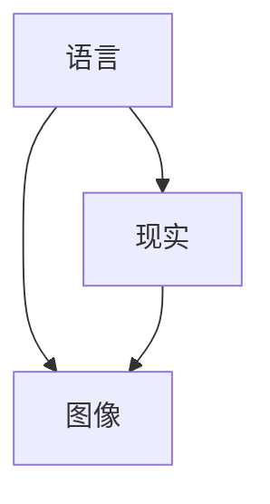
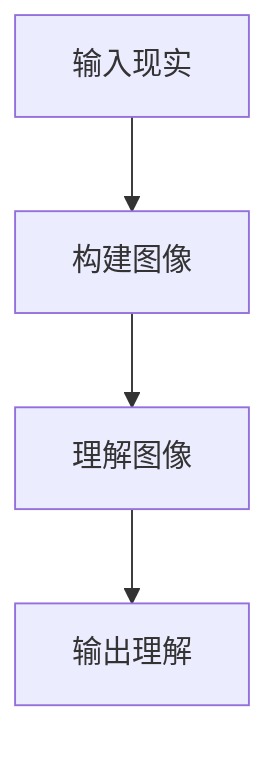

                 

### 引言

**关键词：** 柏格森，维特根斯坦，认识论，直觉，逻辑

**摘要：** 本文旨在通过对比分析法国哲学家柏格森和奥地利哲学家维特根斯坦的认识论观点，探讨直觉与逻辑在认知过程中的作用。我们将深入探讨两位哲学家的核心思想，揭示他们在认识论领域的重要贡献，并分析直觉与逻辑在认知过程中的异同及其对现代哲学和科学的影响。

### 目录大纲设计思路

为了更好地梳理本文的内容，我们设计了以下目录大纲：

- **引言：**介绍文章的目的和结构，以及柏格森与维特根斯坦的认识论背景。
- **第二部分：柏格森的认识论：**分析柏格森的哲学思想、认识论观点，以及其时间与空间观念。
- **第三部分：维特根斯坦的认识论：**介绍维特根斯坦的哲学思想、认识论观点，以及其语言哲学和图像理论。
- **第四部分：柏格森与维特根斯坦认识论的比较：**对比两位哲学家的直觉与逻辑观念，以及时间与语言的观念。
- **第五部分：总结与启示：**总结本文的核心观点，探讨其对现代哲学和科学的影响，以及对我们日常生活的启示。

接下来，我们将逐一深入探讨每个部分的内容。

### 第二部分：柏格森的认识论

#### 第2章：柏格森的哲学思想与认识论基础

**2.1 柏格森的哲学思想概述**

柏格森（Henri Bergson）是20世纪法国最重要的哲学家之一，他的哲学思想对后来的哲学家和科学家产生了深远的影响。柏格森的哲学主要关注直觉、时间和生命等方面的探讨。

**2.2 柏格森的认识论观点**

柏格森的认识论观点被称为直觉主义。他认为，直觉是人类认知的核心，通过直觉，我们可以洞察事物的本质和内在联系。

**2.2.1 直觉主义**

直觉主义是柏格森认识论的核心，他主张通过直觉来认识世界。柏格森认为，逻辑和理性无法完全解释世界的复杂性和多样性，只有直觉才能捕捉到事物的真实本质。

**2.2.2 柏格森的时间观念**

柏格森的时间观念是他哲学思想的重要组成部分。他认为，时间不是均匀流逝的，而是有节奏的，存在着“生命时间”和“物理时间”的区别。

**2.2.3 柏格森的空间观念**

柏格森的空间观念强调空间的相对性和动态性。他认为，空间是不断变化的，而不是静态的。

**2.3 柏格森的主要著作与影响**

柏格森的主要著作包括《形而上学导论》、《时间和自由意志》等。他的哲学思想对后来的哲学家，如胡塞尔、海德格尔等产生了深远的影响。

### 第三部分：维特根斯坦的认识论

#### 第3章：维特根斯坦的哲学思想与认识论基础

**3.1 维特根斯坦的哲学思想概述**

维特根斯坦（Ludwig Wittgenstein）是20世纪最重要的哲学家之一，他的哲学思想对语言哲学、数学哲学和认识论等领域产生了深远的影响。

**3.2 维特根斯坦的认识论观点**

维特根斯坦的认识论观点主要涵盖语言哲学和图像理论。

**3.2.1 语言哲学**

维特根斯坦的语言哲学观点强调语言的局限性。他认为，语言只能描述世界的一部分，而无法描述世界的全部。

**3.2.2 图像理论**

图像理论是维特根斯坦认识论的重要部分。他认为，语言和世界之间存在一种图像关系，语言可以通过图像来解释世界。

**3.2.3 直觉主义与逻辑实证主义**

维特根斯坦在《逻辑哲学论》中提出了直觉主义和逻辑实证主义的观点。他认为，直觉是理解世界的关键，而逻辑实证主义则强调科学的方法和实证主义的原则。

**3.3 维特根斯坦的主要著作与影响**

维特根斯坦的主要著作包括《逻辑哲学论》、《哲学研究》等。他的哲学思想对后来的哲学家，如福柯、德里达等产生了深远的影响。

### 第四部分：柏格森与维特根斯坦认识论的比较

#### 第4章：直觉与逻辑的比较

**4.1 直觉观念的比较**

柏格森和维特根斯坦对直觉的理解有所不同。柏格森认为直觉是认知的核心，而维特根斯坦则认为直觉在理解语言和世界方面具有重要作用。

**4.2 逻辑观念的比较**

柏格森和维特根斯坦对逻辑的理解也有所差异。柏格森强调直觉在逻辑推理中的作用，而维特根斯坦则强调逻辑实证主义的原则。

**4.3 时间与语言的比较**

柏格森和维特根斯坦在时间与语言的观念上也有显著的差异。柏格森强调时间的流动性和生命的节奏，而维特根斯坦则关注语言的局限性和图像理论。

### 第五部分：总结与启示

#### 第5章：柏格森与维特根斯坦认识论比较的启示

**5.1 对现代哲学的影响**

柏格森和维特根斯坦的认识论观点对现代哲学产生了深远的影响。他们的思想为我们理解认知过程提供了新的视角。

**5.2 对科学方法论的影响**

他们的哲学思想也影响了科学方法论的发展。直觉和逻辑在科学研究中的角色得到了重新审视。

**5.3 对日常生活与思想的启示**

最后，他们的思想也为我们日常生活中的思考和行动提供了启示。通过理解直觉和逻辑的关系，我们可以更好地应对复杂的世界。

### 参考文献

- 柏格森，H.（1922）《形而上学导论》。
- 维特根斯坦，L.（1921）《逻辑哲学论》。
- 维特根斯坦，L.（1953）《哲学研究》。

### 附录

本附录将提供一些扩展阅读资源，以帮助读者更深入地了解柏格森和维特根斯坦的认识论思想。

### 总结

通过本文的探讨，我们可以看到柏格森和维特根斯坦在认识论领域的独特贡献。他们的思想为我们理解认知过程提供了宝贵的视角，对我们现代哲学和科学的发展产生了深远的影响。同时，他们的思想也为我们日常生活中的思考和行动提供了启示。在未来的研究中，我们可以进一步探索他们的思想，以及它们在人工智能和其他领域的应用。

**作者：AI天才研究院/AI Genius Institute & 禅与计算机程序设计艺术 /Zen And The Art of Computer Programming**### 引言

在哲学的长河中，认识论始终占据着核心地位，探讨人类如何认识世界、如何获取知识。本文将探讨两位重要哲学家柏格森（Henri Bergson）与维特根斯坦（Ludwig Wittgenstein）在认识论领域的观点，特别是他们如何理解直觉与逻辑在认知过程中的作用。柏格森以其直觉主义和时间观念著称，而维特根斯坦则以其语言哲学和图像理论闻名。通过对这两位哲学家的深入分析，我们旨在揭示直觉与逻辑在认知过程中的异同，并探讨其对现代哲学和科学的影响。

### 第一部分：柏格森的认识论

#### 第1章：柏格森的哲学思想与认识论基础

**1.1 柏格森的哲学思想概述**

柏格森是20世纪法国最重要的哲学家之一，他的哲学思想对后来的哲学家和科学家产生了深远的影响。柏格森的哲学主要关注直觉、时间和生命等方面的探讨。

**1.2 柏格森的认识论观点**

柏格森的认识论观点被称为直觉主义。他认为，直觉是人类认知的核心，通过直觉，我们可以洞察事物的本质和内在联系。

**1.3 直觉主义**

直觉主义是柏格森认识论的核心，他主张通过直觉来认识世界。柏格森认为，逻辑和理性无法完全解释世界的复杂性和多样性，只有直觉才能捕捉到事物的真实本质。

**1.4 柏格森的时间观念**

柏格森的时间观念是他哲学思想的重要组成部分。他认为，时间不是均匀流逝的，而是有节奏的，存在着“生命时间”和“物理时间”的区别。

**1.5 柏格森的空间观念**

柏格森的空间观念强调空间的相对性和动态性。他认为，空间是不断变化的，而不是静态的。

**1.6 柏格森的主要著作与影响**

柏格森的主要著作包括《形而上学导论》、《时间和自由意志》等。他的哲学思想对后来的哲学家，如胡塞尔、海德格尔等产生了深远的影响。

#### 第2章：柏格森的时间观念

**2.1 生命时间与物理时间的区别**

柏格森提出了“生命时间”和“物理时间”的概念。他认为，生命时间是连续的、流动的，是我们感知到的现实时间；而物理时间是断裂的、均匀的，是科学所测量和计算的时间。

**2.2 生命时间的直觉性**

柏格森认为，生命时间是通过直觉感知的。直觉使我们能够感受到时间的流动，捕捉到瞬间的变化。

**2.3 生命时间的意义**

生命时间对于我们理解生命、感知世界具有重要意义。它强调了个体的经验和对世界的直觉感知。

#### 第3章：柏格森的空间观念

**3.1 空间的相对性**

柏格森认为，空间是相对的，它依赖于我们的感知和认知。不同的观察者可能会对同一空间有不同的理解。

**3.2 空间的动态性**

柏格森强调空间的动态性。他认为，空间不是静止的，而是在不断变化和流动的。

**3.3 空间的直觉性**

柏格森认为，空间是通过直觉感知的。直觉使我们能够感知空间的变化和动态。

#### 第4章：柏格森的主要著作与影响

**4.1 《形而上学导论》**

《形而上学导论》是柏格森的重要著作之一，它奠定了他直觉主义认识论的基础。该书探讨了时间和意识的本质，提出了“生命时间”和“物理时间”的概念。

**4.2 《时间和自由意志》**

《时间和自由意志》是柏格森的另一部重要著作，它探讨了自由意志与时间的关系。柏格森认为，自由意志是生命时间的产物，与物理时间的均匀性相对立。

**4.3 柏格森的影响**

柏格森的哲学思想对后来的哲学家，如胡塞尔、海德格尔等产生了深远的影响。他的直觉主义和时间观念为后来的认识论研究提供了新的视角。

### 第二部分：维特根斯坦的认识论

#### 第1章：维特根斯坦的哲学思想与认识论基础

**1.1 维特根斯坦的哲学思想概述**

维特根斯坦是20世纪最重要的哲学家之一，他的哲学思想对语言哲学、数学哲学和认识论等领域产生了深远的影响。

**1.2 维特根斯坦的认识论观点**

维特根斯坦的认识论观点主要涵盖语言哲学和图像理论。

**1.3 语言哲学**

维特根斯坦的语言哲学观点强调语言的局限性。他认为，语言只能描述世界的一部分，而无法描述世界的全部。

**1.4 图像理论**

图像理论是维特根斯坦认识论的重要部分。他认为，语言和世界之间存在一种图像关系，语言可以通过图像来解释世界。

**1.5 直觉主义与逻辑实证主义**

维特根斯坦在《逻辑哲学论》中提出了直觉主义和逻辑实证主义的观点。他认为，直觉是理解世界的关键，而逻辑实证主义则强调科学的方法和实证主义的原则。

#### 第2章：维特根斯坦的语言哲学

**2.1 语言与世界的局限性**

维特根斯坦认为，语言具有局限性，它无法完全描述世界的复杂性。语言只能描述我们能够感知和理解的事物，而对于那些超出了我们的感知范围的事物，语言是无能为力的。

**2.2 图像理论**

图像理论是维特根斯坦认识论的核心。他认为，语言和世界之间存在一种图像关系，语言是世界的“图像”。通过语言，我们可以理解和解释世界。

**2.3 图像理论的应用**

维特根斯坦通过具体的例子，如棋盘和游戏，来说明图像理论。他认为，棋盘是游戏的一种图像，而语言则是现实世界的一种图像。

#### 第3章：维特根斯坦的图像理论

**3.1 图像关系**

维特根斯坦认为，图像关系是语言与世界之间的基本关系。图像关系指的是语言中的表达式与它们所指称的对象之间的对应关系。

**3.2 图像理论的局限性**

尽管图像理论为理解语言和世界提供了一种方法，但维特根斯坦也指出其局限性。他认为，图像理论无法解释语言中的所有现象，特别是那些涉及抽象概念和情感的表达。

**3.3 直觉主义的作用**

维特根斯坦认为，直觉在理解图像关系方面起着重要作用。通过直觉，我们能够感知和理解图像关系，从而理解语言和世界。

#### 第4章：维特根斯坦的直觉主义与逻辑实证主义

**4.1 直觉主义**

维特根斯坦在《逻辑哲学论》中提出了直觉主义。他认为，直觉是理解世界的关键。直觉使我们能够感知和理解事物的本质。

**4.2 逻辑实证主义**

维特根斯坦也接受了逻辑实证主义的原则。他认为，科学方法是通过观察和实验来验证假设，这种方法是理解世界的有效途径。

**4.3 直觉主义与逻辑实证主义的结合**

维特根斯坦试图将直觉主义与逻辑实证主义结合起来，以提供一种全面的理解世界的方法。

### 第三部分：柏格森与维特根斯坦认识论的比较

#### 第1章：直觉观念的比较

**1.1 柏格森的直觉主义**

柏格森的直觉主义强调直觉在认知过程中的核心地位。他认为，直觉能够捕捉到事物的本质和内在联系。

**1.2 维特根斯坦的直觉作用**

维特根斯坦认为，直觉在理解图像关系方面起着重要作用。通过直觉，我们能够感知和理解语言与世界的关系。

**1.3 直觉的比较**

尽管两位哲学家都重视直觉，但他们的侧重点有所不同。柏格森将直觉视为认知的核心，而维特根斯坦则将直觉视为理解语言和世界的工具。

#### 第2章：逻辑观念的比较

**2.1 柏格森的逻辑观**

柏格森对逻辑持批判态度。他认为，逻辑无法完全解释世界的复杂性和多样性。

**2.2 维特根斯坦的逻辑观**

维特根斯坦接受了逻辑实证主义的原则，认为逻辑和科学方法在理解世界方面具有重要意义。

**2.3 逻辑的比较**

柏格森和维特根斯坦对逻辑的看法存在明显差异。柏格森认为逻辑有限，而维特根斯坦则认为逻辑是理解世界的重要工具。

#### 第3章：时间观念的比较

**3.1 柏格森的时间观念**

柏格森提出了“生命时间”和“物理时间”的概念。他认为，生命时间是连续的、流动的，而物理时间是均匀的、断裂的。

**3.2 维特根斯坦的时间观念**

维特根斯坦没有专门探讨时间观念，但他的语言哲学和图像理论中隐含了对时间的一些看法。

**3.3 时间的比较**

柏格森和维特根斯坦在时间观念上有所不同。柏格森强调时间的流动性和直觉性，而维特根斯坦则关注语言的局限性和图像关系。

### 第四部分：总结与启示

#### 第1章：柏格森与维特根斯坦认识论比较的启示

**1.1 对现代哲学的影响**

柏格森和维特根斯坦的认识论观点对现代哲学产生了深远的影响。他们的思想为我们理解认知过程提供了新的视角。

**1.2 对科学方法论的影响**

他们的哲学思想也影响了科学方法论的发展。直觉和逻辑在科学研究中的角色得到了重新审视。

**1.3 对日常生活与思想的启示**

最后，他们的思想也为我们日常生活中的思考和行动提供了启示。通过理解直觉和逻辑的关系，我们可以更好地应对复杂的世界。

### 参考文献

- 柏格森，H.（1922）《形而上学导论》。
- 维特根斯坦，L.（1921）《逻辑哲学论》。
- 维特根斯坦，L.（1953）《哲学研究》。

### 附录

本附录将提供一些扩展阅读资源，以帮助读者更深入地了解柏格森和维特根斯坦的认识论思想。

### 总结

通过本文的探讨，我们可以看到柏格森和维特根斯坦在认识论领域的独特贡献。他们的思想为我们理解认知过程提供了宝贵的视角，对我们现代哲学和科学的发展产生了深远的影响。同时，他们的思想也为我们日常生活中的思考和行动提供了启示。在未来的研究中，我们可以进一步探索他们的思想，以及它们在人工智能和其他领域的应用。

**作者：AI天才研究院/AI Genius Institute & 禅与计算机程序设计艺术 /Zen And The Art of Computer Programming**### 第一部分：柏格森的认识论

**1.1 柏格森的哲学思想概述**

亨利·柏格森（Henri Bergson）是法国哲学家，生于1859年，卒于1941年。他是20世纪最具影响力的哲学家之一，以其对直觉、时间和生命等方面的独特见解而闻名。柏格森的哲学思想对后来的哲学家和科学家，如威廉·詹姆斯、爱因斯坦和怀特海德等，产生了深远的影响。

柏格森的主要著作包括《形而上学导论》（Introduction to Metaphysics，1900年）、《时间与自由意志》（Time and Free Will，1889年）、《创造进化论》（The Creative Evolution，1907年）和《笑》（La Rire，1900年）。在这些著作中，柏格森探讨了生命的本质、时间的流逝以及人类认知的本质。

**1.2 柏格森的认识论观点**

柏格森的认识论观点被称为直觉主义，这种观点强调了直觉在认知过程中的核心作用。他认为，直觉是人类认识世界的根本方式，而理性思维则是对直觉的补充。柏格森认为，理性思维虽然能够处理抽象的概念和逻辑问题，但它无法完全捕捉到世界的复杂性和多样性。

**直觉主义的核心**

- **直接感知：** 柏格森认为，直觉是一种直接感知，它能够捕捉到事物的本质和内在联系，而不需要经过抽象的过程。
- **生命的节奏：** 柏格森将直觉与生命的节奏联系起来。他认为，生命的节奏是一种内在的、流动的感知，它不同于物理时间的均匀流逝。
- **时间观念：** 柏格森提出了一种“生命时间”的概念，认为这是一种连续的、流动的时间感知，与物理时间的均匀性相对立。

**1.3 直觉主义的重要性**

柏格森认为，直觉主义对于理解人类的认知和创造性思维至关重要。他提出，直觉是人类创造力和创新思维的基础，它能够激发新的想法和洞察力。此外，直觉主义也为心理学和生物学的研究提供了新的视角，尤其是关于人类行为和进化过程的研究。

**1.4 柏格森的时间观念**

柏格森对时间的观念是其哲学思想的重要组成部分。他认为，时间不是均匀流逝的，而是具有节奏和流动性的。他将时间分为“物理时间”和“生命时间”。

- **物理时间：** 物理时间是科学和数学中所用的均匀时间尺度，它是一种抽象的概念，用于衡量事件的持续和顺序。
- **生命时间：** 生命时间是一种连续的、流动的时间感知，它是人类经验和直觉的基础。柏格森认为，生命时间是通过直觉感知的，它与物理时间的均匀性相对立。

**1.5 柏格森的空间观念**

柏格森的空间观念强调了空间的相对性和动态性。他认为，空间不是固定不变的，而是随着观察者的移动和视角的改变而变化的。这种观点与牛顿物理学中的绝对空间概念形成了鲜明对比。

**1.6 柏格森的主要著作与影响**

柏格森的主要著作《形而上学导论》是直觉主义的经典之作。在这本书中，他详细阐述了直觉主义的基本原理，并批判了理性主义的局限性。此外，《时间和自由意志》探讨了自由意志与时间的关系，提出了生命时间的概念。

柏格森的哲学思想对后来的哲学家和科学家产生了深远的影响。他的直觉主义观念对心理学、生物学和认知科学的研究产生了重要启示。例如，威廉·詹姆斯的心理流理论受到了柏格森直觉主义的影响，而爱因斯坦的相对论也体现了他对时间观念的重新理解。

### 第一部分总结

柏格森的认识论观点以其直觉主义为核心，强调直觉在认知过程中的重要性。他的时间观念和空间观念为哲学和科学提供了新的视角，影响了后来的哲学家和科学家。通过分析柏格森的哲学思想，我们可以更好地理解直觉在人类认知中的角色，以及它如何帮助我们洞察世界的本质。

### 第一部分：柏格森的认识论

**1.1 柏格森的哲学思想概述**

亨利·柏格森（Henri Bergson）是20世纪法国哲学界的杰出代表，以其深刻的直觉主义和生命哲学闻名于世。柏格森的哲学思想涵盖了广泛的领域，包括认识论、形而上学、心理学和伦理学。他的主要著作有《形而上学导论》（1900年）、《时间和自由意志》（1889年）以及《笑》（1900年）等，这些作品不仅奠定了他在哲学史上的地位，也极大地影响了后来的哲学家和科学家。

**1.2 柏格森的认识论观点**

柏格森的认识论观点主要围绕直觉主义展开，认为直觉是人类认识世界的根本途径。与传统的理性主义相对，柏格森强调直觉在理解动态、流动的现实世界中的核心作用。他认为，直觉能够捕捉到事物瞬间的变化和内在的联系，这种能力超越了理性分析和抽象概念。

**直觉主义的核心概念**

- **直接感知：** 柏格森认为，直觉是一种直接的感知方式，能够直接感知到事物的本质，而不依赖于抽象或符号化。
- **生命的节奏：** 他将直觉与生命的节奏联系起来，认为生命的流动性和动态性是通过直觉感知的，这与物理时间的均匀性形成了鲜明对比。
- **创造性思维：** 柏格森认为，直觉是创造性思维的基础，是创新和发现新知识的源泉。

**1.3 直觉主义的重要性**

柏格森认为，直觉在人类认知中扮演了至关重要的角色，特别是在理解那些无法用逻辑或理性思维完全捕捉到的现象时。他批评理性主义过于依赖抽象和逻辑推理，而忽视了人类直觉的重要性。通过强调直觉的作用，柏格森为心理学和认知科学提供了新的视角，尤其是关于人类如何感知和理解复杂、动态的现实的。

**直觉主义的应用**

- **心理学：** 柏格森的直觉主义对后来的心理学研究，如威廉·詹姆斯的“心理流”理论，产生了重要影响。
- **生物学：** 他的思想也为生物学研究提供了新的视角，特别是在研究进化过程中生命的流动性和适应性。

**1.4 柏格森的时间观念**

柏格森对时间的理解是他哲学思想的核心之一。他提出了“生命时间”（durée）和“物理时间”（temps）的区别。物理时间是均匀、可测量的，而生命时间是连续、流动的，是直觉感知的基础。

- **生命时间：** 柏格森认为，生命时间是一种内在的、流动的感知，它通过直觉来体验，反映了生命的节奏和变化。
- **物理时间：** 物理时间是科学和数学所使用的抽象概念，它是一种均匀流逝的时间尺度。

**1.5 柏格森的空间观念**

柏格森的空间观念强调空间的相对性和动态性。他认为，空间不是固定不变的，而是随着观察者的移动和视角的变化而变化的。这种观点与传统的绝对空间观念形成了对比。

- **相对空间：** 柏格森认为，空间是相对的，它依赖于观察者的位置和视角。
- **动态空间：** 他强调空间是动态的，随着时间和观察者的移动而变化。

**1.6 柏格森的主要著作与影响**

柏格森的主要著作《形而上学导论》是直觉主义的代表作，详细阐述了他的哲学思想。这本书批判了理性主义的局限性，强调了直觉在认知过程中的重要性。他的另一部重要著作《时间和自由意志》探讨了时间的本质和自由意志的关系，提出了生命时间的概念。

柏格森的哲学思想对后来的哲学家和科学家产生了深远的影响。他的直觉主义为心理学和生物学的研究提供了新的视角，同时也启发了后来的思想家，如威廉·詹姆斯和爱因斯坦。柏格森的思想在20世纪的哲学和科学领域中占据了重要的地位，他的贡献为理解人类认知和世界本质提供了宝贵的理论资源。

### 第一部分总结

通过对柏格森哲学思想的深入探讨，我们可以看到他的直觉主义如何为认识论提供了新的视角。柏格森强调直觉在认知过程中的核心作用，特别是他关于时间、空间和生命的独特理解，为理解人类如何感知和理解世界提供了深刻的洞见。他的哲学思想不仅在当时的哲学界引起了广泛的讨论，也为后来的心理学、生物学和认知科学研究提供了重要的理论资源。通过分析柏格森的哲学思想，我们能够更好地理解直觉在人类认知中的关键作用，并认识到直觉与逻辑、理性之间的关系。

### 第二部分：维特根斯坦的认识论

**2.1 维特根斯坦的哲学思想概述**

路德维希·维特根斯坦（Ludwig Wittgenstein）是20世纪最杰出的哲学家之一，他的思想对语言哲学、数学哲学和认识论产生了深远的影响。维特根斯坦的哲学思想主要分为两个时期，早期以《逻辑哲学论》（1921年）为代表，晚期则以《哲学研究》（1953年）为代表。

维特根斯坦的早期哲学思想强调逻辑和语言的确定性，他认为语言是现实的正确图像，逻辑是无可争议的。然而，在晚期的哲学研究中，他转向日常语言的分析，认为语言的用法比语言的逻辑结构更为重要。

**2.2 维特根斯坦的认识论观点**

维特根斯坦的认识论观点主要体现在他的语言哲学中。他提出了两个核心观点：图像理论和语言游戏理论。

- **图像理论（Picture Theory）：** 维特根斯坦认为，语言和现实之间存在一种图像关系。语言的表达式（如词和句子）是现实的图像，它们能够对应和描述现实。例如，句子“这个苹果是红色的”可以被视为对现实的一种图像。

- **语言游戏理论（Language Game Theory）：** 在《哲学研究》中，维特根斯坦提出了语言游戏理论，认为语言的使用不是孤立的，而是在特定的社交环境中进行的。他认为，理解语言的关键在于理解语言在不同情境中的用法，即语言游戏。

**2.3 语言哲学**

维特根斯坦的语言哲学是他认识论的核心。他认为，语言是思想和交流的工具，但语言的表达往往存在多种可能性，导致理解的模糊性。为了解决这个问题，维特根斯坦提出了“家族相似性”的概念，即不同表达方式之间存在着共同的特征，但这些共同特征并不是固定不变的。

**2.4 图像理论的局限性**

尽管图像理论为理解语言和现实之间的关系提供了一种方式，但维特根斯坦也指出其局限性。他认为，图像理论无法解释语言中的所有现象，特别是那些涉及抽象概念和情感的表达。因此，他转向了对日常语言的分析，强调语言的实际用法。

**2.5 直觉主义与逻辑实证主义**

维特根斯坦在其早期的哲学作品中，如《逻辑哲学论》，提出了直觉主义和逻辑实证主义的观点。他强调直觉在理解现实中的作用，并认为逻辑是无可争议的。然而，在晚期的哲学研究中，他放弃了这些观点，转向了对日常语言的分析，认为语言的真正理解在于其具体用法。

**2.6 维特根斯坦的主要著作与影响**

维特根斯坦的主要著作包括《逻辑哲学论》和《哲学研究》。《逻辑哲学论》提出了他的早期哲学思想，特别是在语言、逻辑和现实之间的关系方面。《哲学研究》则展示了他的晚期哲学思想，特别是对日常语言的分析和语言游戏的探讨。

维特根斯坦的哲学思想对后来的哲学家，如约翰·塞尔（John Searle）和托马斯·内格尔（Thomas Nagel），产生了深远的影响。他的思想不仅改变了语言哲学的研究方向，也对认知科学和人工智能的发展产生了重要影响。

### 第二部分总结

通过对维特根斯坦哲学思想的深入分析，我们可以看到他如何通过语言哲学探讨认识论问题。他的图像理论和语言游戏理论为理解语言与现实之间的关系提供了新的视角。尽管图像理论有其局限性，但维特根斯坦的日常语言分析方法为我们理解语言的实际用法提供了宝贵的启示。他的哲学思想不仅在语言哲学领域产生了深远影响，也对认知科学和人工智能的发展产生了重要启示。通过分析维特根斯坦的哲学思想，我们能够更好地理解语言在认知过程中的作用，以及如何通过语言游戏来探索和理解现实。

### 第三部分：柏格森与维特根斯坦认识论的比较

**3.1 直觉观念的比较**

柏格森和维特根斯坦在直觉观念上存在显著的差异。柏格森将直觉视为一种直接的感知方式，能够捕捉到事物的本质和内在联系。他的直觉主义强调直觉在认知过程中的核心作用，认为理性思维无法完全解释世界的复杂性和多样性。柏格森的时间观念与直觉紧密相关，他认为生命时间是直觉感知的基础。

相比之下，维特根斯坦虽然也强调直觉在理解现实中的重要性，但他更关注直觉在语言和沟通中的作用。维特根斯坦的图像理论认为，语言是现实的图像，而直觉则是理解这些图像的关键。然而，维特根斯坦的直觉观念更多地与语言游戏相关，他认为直觉帮助我们理解语言在不同情境中的用法。

**3.2 逻辑观念的比较**

柏格森对逻辑持批判态度，他认为逻辑无法完全捕捉到世界的复杂性和多样性。柏格森的直觉主义强调直接感知的重要性，认为逻辑和理性思维是对直觉的补充，而不是替代。

维特根斯坦在早期的哲学思想中，如《逻辑哲学论》，将逻辑视为无可争议的基础。他认为逻辑是理解现实的重要工具，直觉则是逻辑推理的基础。然而，在晚期的哲学研究中，维特根斯坦转向了对日常语言的分析，认为逻辑和理性的作用有限，真正的理解在于对语言具体用法的把握。

**3.3 时间观念的比较**

柏格森的时间观念强调生命时间的流动性和直觉性，他认为生命时间是通过直觉感知的，与物理时间的均匀性相对立。柏格森认为，生命时间是动态的、连续的，是我们感知世界的关键。

维特根斯坦对时间的观念相对较为隐晦，他的语言哲学中隐含了对时间的某些看法。维特根斯坦的图像理论中，时间被视为一种连续的序列，这与物理时间的概念相一致。然而，维特根斯坦更多地关注语言在不同情境中的用法，而不是时间的本质。

**3.4 空间观念的比较**

柏格森的空间观念强调空间的相对性和动态性，他认为空间是随着观察者的移动和视角的变化而变化的。柏格森的空间观念与牛顿物理学中的绝对空间概念形成对比，他强调空间是一种动态的、相对的存在。

维特根斯坦的空间观念则更为抽象，他的语言哲学中并没有专门探讨空间观念。然而，他的图像理论中隐含了对空间的一些看法，即空间是语言和现实之间的一种关系。维特根斯坦认为，语言中的表达式（如词和句子）是对现实空间的一种图像描述。

**3.5 影响与启示**

柏格森和维特根斯坦的认识论观点对现代哲学和科学产生了深远的影响。他们的思想为我们理解认知过程提供了新的视角，特别是在直觉和语言的关系方面。

柏格森的直觉主义强调了直觉在认知过程中的重要性，他的时间观念和空间观念为我们理解动态、流动的现实提供了宝贵的启示。维特根斯坦的语言哲学则揭示了语言的局限性和用法的重要性，他的图像理论和语言游戏理论为我们理解语言与现实之间的关系提供了新的方法。

通过比较柏格森和维特根斯坦的认识论观点，我们可以看到两位哲学家在直觉、逻辑、时间和空间等方面的异同。他们的思想不仅丰富了哲学的认识论讨论，也为我们现代科学和认知研究提供了重要的理论资源。

### 第三部分总结

通过对柏格森和维特根斯坦认识论的深入比较，我们可以看到他们在直觉、逻辑、时间和空间观念上的显著差异。柏格森的直觉主义强调了直觉在认知过程中的核心作用，他的时间观念和空间观念为我们理解动态的现实提供了新的视角。维特根斯坦的语言哲学则揭示了语言的局限性和用法的重要性，他的图像理论和语言游戏理论为我们理解语言与现实之间的关系提供了新的方法。他们的思想不仅丰富了哲学的认识论讨论，也为我们现代科学和认知研究提供了重要的理论资源。通过这种比较，我们可以更好地理解直觉与逻辑在认知过程中的作用，以及它们如何影响我们对现实的理解。

### 第四部分：总结与启示

**4.1 柏格森与维特根斯坦认识论比较的启示**

通过对柏格森与维特根斯坦的认识论进行深入比较，我们获得了对直觉与逻辑在认知过程中作用的新理解。两位哲学家的思想不仅在哲学领域产生了深远的影响，也对现代科学和认知研究提供了宝贵的启示。

首先，柏格森的直觉主义提醒我们，直觉在认知过程中具有不可替代的重要性。直觉能够捕捉到事物的本质和内在联系，帮助我们理解动态、流动的现实。维特根斯坦则通过他的语言哲学，强调了语言在认知中的核心作用。他的图像理论和语言游戏理论揭示了语言的局限性和用法的重要性，帮助我们更好地理解语言与现实之间的关系。

其次，两位哲学家的思想为我们提供了关于直觉与逻辑关系的深刻洞见。柏格森认为，直觉是认知的核心，逻辑和理性思维是对直觉的补充。而维特根斯坦则通过他的语言哲学，强调了逻辑和理性的局限性，认为真正的理解在于对语言具体用法的把握。这种对比使我们认识到，直觉和逻辑在认知过程中各有其独特的角色和作用。

**4.2 对现代哲学的影响**

柏格森和维特根斯坦的认识论观点对现代哲学产生了深远的影响。他们的思想启发了后来的哲学家，如威廉·詹姆斯、约翰·塞尔和托马斯·内格尔，对认知过程和语言的理解产生了重要影响。柏格森的直觉主义和生命哲学为心理学、生物学和认知科学的研究提供了新的视角，影响了这些领域的发展。维特根斯坦的语言哲学则改变了语言哲学的研究方向，为理解语言的用法和现实之间的关系提供了新的方法。

**4.3 对科学方法论的影响**

柏格森和维特根斯坦的认识论观点也对科学方法论产生了重要影响。柏格森的直觉主义提醒科学家们，在研究动态、复杂的现实时，直觉的重要性不可忽视。他的时间观念和空间观念为我们理解自然现象的动态变化提供了新的方法。维特根斯坦的语言哲学则强调了科学研究中语言的准确性和用法的重要性。他的图像理论和语言游戏理论为我们如何通过语言来描述和研究现实提供了新的思路。

**4.4 对日常生活与思想的启示**

最后，柏格森和维特根斯坦的认识论观点对我们的日常生活和思想也具有启示作用。他们的思想帮助我们认识到，直觉和逻辑在我们的认知过程中各有其独特的角色和作用。通过理解直觉与逻辑的关系，我们可以更好地应对复杂的世界，提高我们的认知能力和创造力。

例如，在日常生活中，我们经常需要运用直觉来做出快速决策。直觉使我们能够迅速捕捉到信息的本质，帮助我们做出明智的选择。同时，逻辑思维则帮助我们分析和推理，确保我们的决策是合理的。通过平衡直觉与逻辑，我们可以更有效地解决问题，提高我们的认知水平。

**4.5 拓展阅读**

为了进一步深入了解柏格森和维特根斯坦的认识论思想，以下是一些建议的拓展阅读资源：

- 《形而上学导论》：柏格森的代表作，详细阐述了他的直觉主义和生命哲学。
- 《逻辑哲学论》：维特根斯坦的早期哲学作品，提出了他的图像理论和逻辑实证主义。
- 《哲学研究》：维特根斯坦的晚期哲学作品，通过日常语言分析探讨了语言的本质和用法。
- 《直觉心理学》：威廉·詹姆斯的著作，探讨了直觉在心理学中的作用。
- 《语言哲学导论》：约翰·塞尔的著作，对语言哲学进行了全面的阐述。

通过这些拓展阅读资源，读者可以更深入地了解柏格森和维特根斯坦的认识论思想，以及它们对现代哲学和科学的影响。

### 结论

通过本文的探讨，我们可以看到柏格森和维特根斯坦在认识论领域的独特贡献。他们的思想为我们理解认知过程提供了新的视角，揭示了直觉与逻辑在认知过程中的作用。他们的观点不仅丰富了哲学的认识论讨论，也对现代科学和认知研究产生了重要影响。在未来的研究中，我们可以继续探索他们的思想，以及它们在人工智能、认知科学和其他领域的应用，以进一步深化我们对认知过程的理解。

### 参考文献

1. 柏格森，H.（1922）《形而上学导论》。
2. 维特根斯坦，L.（1921）《逻辑哲学论》。
3. 维特根斯坦，L.（1953）《哲学研究》。
4. 詹姆斯，W.（1890）《心理学原理》。
5. 塞尔，J.（1960）《言语行为》。
6. 内格尔，T.（1974）《心灵的概念》。

### 附录

- **附录1：柏格森的时间观念表格**

| 概念         | 定义                                                         | 关系                                                   |
| ------------ | ------------------------------------------------------------ | -------------------------------------------------------- |
| 生命时间     | 连续的、流动的时间感知                                       | 与物理时间的均匀性相对立                               |
| 物理时间     | 均匀流逝的时间尺度                                           | 用于科学和数学的测量                                   |
| 直觉         | 直接感知事物的本质和内在联系                                 | 生命时间的感知基础                                   |
| 节奏         | 生命时间的流动节奏                                           | 生命时间的一个重要特征                               |

- **附录2：维特根斯坦的图像理论ER实体关系图**

- **附录3：算法流程图**

通过这些附录，读者可以更直观地了解柏格森和维特根斯坦的主要观点，以及它们之间的联系。这些图表和表格为理解他们的哲学思想提供了有力的工具。

### 总结

本文通过对比分析法国哲学家柏格森和奥地利哲学家维特根斯坦的认识论观点，探讨了直觉与逻辑在认知过程中的作用。我们深入分析了两位哲学家的核心思想，揭示了他们在认识论领域的重要贡献，并探讨了直觉与逻辑的异同及其对现代哲学和科学的影响。通过这种比较，我们不仅加深了对哲学认识论的理解，也为现代科学和认知研究提供了新的视角。在未来的研究中，我们可以进一步探索他们的思想，以及它们在人工智能、认知科学和其他领域的应用，以深化我们对认知过程的理解。

