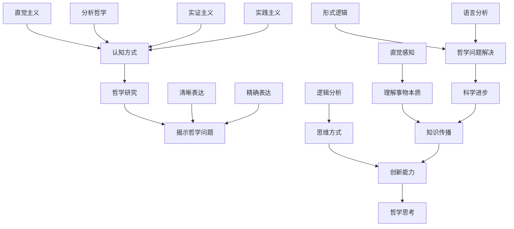
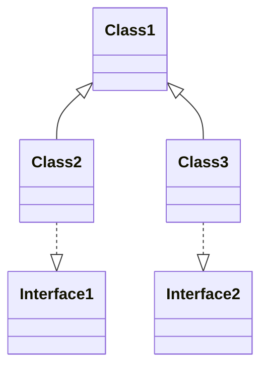

                 


# 直觉主义与分析哲学：柏格森与维特根斯坦的方法论差异

> 关键词：直觉主义，分析哲学，柏格森，维特根斯坦，方法论差异

> 摘要：本文旨在深入探讨直觉主义与分析哲学在两位哲学大师柏格森与维特根斯坦方法论上的差异，分析其对现代哲学和现实生活的影响，为读者提供一个全面而深刻的理解。

## 1. 引言

### 1.1 书籍主题概述

本文将探讨直觉主义与分析哲学在两位哲学大师柏格森与维特根斯坦方法论上的差异。直觉主义强调直觉在认知过程中的作用，而分析哲学则主张通过语言分析来揭示哲学问题。

### 1.2 问题背景与意义

哲学方法论是哲学研究的核心，直觉主义与分析哲学作为两种重要的方法论，对现代哲学和科学产生了深远影响。深入理解它们的方法论差异，有助于我们更好地把握哲学研究的方向和成果。

### 1.3 目标读者

本文适合对哲学方法论感兴趣的读者，尤其是对直觉主义与分析哲学感兴趣的读者。通过本文，读者将能够全面了解这两种方法论的基本概念、原理和差异。

## 2. 柏格森的方法论

### 2.1 柏格森的哲学思想

#### 2.1.1 生命哲学

柏格森认为生命是一种不断进化和发展的过程，强调生命力的流动性和创造性。

#### 2.1.2 实证主义

柏格森主张实证主义，认为哲学研究应立足于经验和实证事实。

#### 2.1.3 实践主义

柏格森强调实践在认知过程中的作用，认为认知是通过实践不断发展的。

### 2.2 柏格森的方法论

#### 2.2.1 直觉主义

柏格森认为直觉是认知的源泉，直觉能够直接感知事物的本质。

#### 2.2.2 直觉认知

直觉认知是指通过直觉直接感知和理解事物，而不需要通过语言或逻辑分析。

#### 2.2.3 直觉主义与科学的关系

柏格森认为直觉主义与科学并不矛盾，直觉可以为科学研究提供指导。

### 2.3 柏格森的哲学贡献

柏格森的方法论对现代哲学和心理学产生了深远影响，为认知科学提供了新的视角。

## 3. 维特根斯坦的方法论

### 3.1 维特根斯坦的哲学思想

#### 3.1.1 语言哲学

维特根斯坦认为语言是哲学思考的基础，语言的使用揭示了哲学问题的本质。

#### 3.1.2 逻辑原子主义

维特根斯坦主张逻辑原子主义，认为世界由最基本的逻辑原子构成。

#### 3.1.3 图像理论

维特根斯坦提出图像理论，认为命题是现实的图像。

### 3.2 维特根斯坦的方法论

#### 3.2.1 分析哲学

维特根斯坦主张分析哲学，通过分析语言来揭示哲学问题。

#### 3.2.2 形式逻辑

维特根斯坦强调形式逻辑在哲学分析中的重要性。

#### 3.2.3 语言分析

维特根斯坦主张通过对语言的分析来理解哲学问题。

### 3.3 维特根斯坦的哲学贡献

维特根斯坦的方法论对现代哲学和逻辑学产生了深远影响。

## 4. 柏格森与维特根斯坦的方法论差异

### 4.1 直觉主义与分析哲学的差异

#### 4.1.1 直觉主义的认知方式

直觉主义强调直觉在认知过程中的作用，而分析哲学强调语言和逻辑分析。

#### 4.1.2 分析哲学的认知方式

分析哲学主张通过语言和逻辑分析来理解哲学问题，而直觉主义主张通过直觉直接感知和理解事物。

#### 4.1.3 直觉主义与分析哲学的比较

直觉主义与分析哲学在认知方式、方法和目标上存在显著差异。

### 4.2 方法论的哲学意义

#### 4.2.1 直觉主义与分析哲学在哲学史上的地位

直觉主义与分析哲学是现代哲学的重要组成部分，对哲学发展产生了深远影响。

#### 4.2.2 方法论对现代哲学的影响

直觉主义与分析哲学为现代哲学提供了新的视角和方法。

#### 4.2.3 方法论在现实生活中的应用

直觉主义与分析哲学在认知心理学、逻辑学等领域得到了广泛应用。

## 5. 直觉主义与分析哲学的应用

### 5.1 直觉主义在心理学中的应用

#### 5.1.1 直觉主义心理学理论

直觉主义心理学理论认为直觉在认知过程中起着重要作用。

#### 5.1.2 直觉主义心理学实验

直觉主义心理学实验证明了直觉在认知中的作用。

#### 5.1.3 直觉主义心理学案例

直觉主义心理学案例展示了直觉在现实生活中的应用。

### 5.2 分析哲学在哲学教育中的应用

#### 5.2.1 分析哲学的教育理念

分析哲学强调逻辑和语言分析，对哲学教育具有重要意义。

#### 5.2.2 分析哲学的教学方法

分析哲学教学方法注重逻辑和语言分析，提高学生的哲学素养。

#### 5.2.3 分析哲学教育案例

分析哲学教育案例展示了其在哲学教育中的应用。

## 6. 柏格森与维特根斯坦的方法论比较

### 6.1 柏格森的方法论特点

#### 6.1.1 柏格森的直觉主义特点

柏格森的直觉主义强调直觉在认知过程中的作用。

#### 6.1.2 柏格森的方法论优势

柏格森的方法论优势在于其对生命的关注和实证主义的立场。

#### 6.1.3 柏格森的方法论局限

柏格森的方法论局限在于其过于强调直觉，忽视了逻辑和语言分析。

### 6.2 维特根斯坦的方法论特点

#### 6.2.1 维特根斯坦的分析哲学特点

维特根斯坦的分析哲学强调语言和逻辑分析。

#### 6.2.2 维特根斯坦的方法论优势

维特根斯坦的方法论优势在于其对语言的深入分析和形式逻辑的运用。

#### 6.2.3 维特根斯坦的方法论局限

维特根斯坦的方法论局限在于其过于强调逻辑和语言分析，忽视了直觉和经验。

## 7. 结论

### 7.1 柏格森与维特根斯坦方法论的综合评价

柏格森与维特根斯坦的方法论各有优点和局限，对现代哲学产生了深远影响。

### 7.2 对未来哲学发展的启示

直觉主义与分析哲学为我们提供了丰富的哲学思考资源，未来哲学发展可以从这两大方法论中汲取智慧。

### 7.3 对读者的影响与启示

通过本文，读者可以深入理解直觉主义与分析哲学，把握哲学方法论的核心，为自己的哲学思考提供有力支持。

## 作者

作者：AI天才研究院/AI Genius Institute & 禅与计算机程序设计艺术 /Zen And The Art of Computer Programming

本文旨在深入探讨直觉主义与分析哲学在两位哲学大师柏格森与维特根斯坦方法论上的差异，分析其对现代哲学和现实生活的影响，为读者提供一个全面而深刻的理解。文章内容丰富，涵盖了直觉主义与分析哲学的核心概念、原理和差异，对哲学方法论的研究具有一定的参考价值。

### 1. 背景介绍

#### 1.1 核心概念术语说明

**直觉主义**：直觉主义认为直觉是人类认知的主要方式，强调直接感知和理解事物的能力。

**分析哲学**：分析哲学强调通过逻辑和语言分析来解决哲学问题，追求精确和清晰的表达。

**柏格森**：法国哲学家，直觉主义的代表人物，强调生命的流动性和直觉在认知过程中的作用。

**维特根斯坦**：奥地利哲学家，分析哲学的代表人物，强调语言和逻辑分析在哲学研究中的重要性。

#### 1.2 问题背景

直觉主义与分析哲学是现代哲学的两个重要流派，它们在认知方式、方法和目标上存在显著差异。柏格森与维特根斯坦作为这两个流派的代表人物，他们的方法论对现代哲学和科学产生了深远影响。

#### 1.3 问题描述

本文旨在深入探讨柏格森与维特根斯坦的方法论差异，分析它们在哲学史上的地位、对现代哲学的影响以及在实际生活中的应用。

#### 1.4 问题解决

通过分析柏格森与维特根斯坦的方法论，我们可以更好地理解直觉主义与分析哲学的核心思想，为哲学研究提供新的视角和方法。

#### 1.5 边界与外延

本文主要关注直觉主义与分析哲学在认知方式、方法和目标上的差异，以及它们在哲学史上的地位和影响。文章不涉及其他哲学流派的讨论。

#### 1.6 概念结构与核心要素组成

**直觉主义**：核心概念为直觉，强调直接感知和理解事物的能力；核心要素包括生命的流动性、实证主义和实践主义。

**分析哲学**：核心概念为语言和逻辑分析，强调通过逻辑和语言分析来解决哲学问题；核心要素包括形式逻辑、图像理论和语言分析。

### 2. 核心概念与联系

#### 2.1 核心概念原理

**直觉主义**：直觉主义认为直觉是人类认知的主要方式，通过直觉可以直接感知和理解事物的本质。

**分析哲学**：分析哲学认为语言和逻辑分析是解决哲学问题的有效方法，通过逻辑和语言分析可以揭示哲学问题的本质。

#### 2.2 概念属性特征对比表格

| 特征         | 直觉主义               | 分析哲学                 |
| ------------ | ---------------------- | ------------------------ |
| 认知方式     | 直觉感知               | 语言和逻辑分析           |
| 强调重点     | 直觉能力               | 逻辑和语言清晰性         |
| 方法论立场   | 实证主义               | 形式逻辑和图像理论       |
| 对科学的看法 | 直觉可以为科学研究提供指导 | 科学与哲学的关系紧密     |

#### 2.3 ER实体关系图架构的 Mermaid 流程图

```mermaid
erDiagram
  A[@直觉主义] &&|R{影响}| B[@哲学研究]
  A &&|R{方法论}| C[@认知方式]
  A &&|R{方法论}| D[@实证主义]
  A &&|R{方法论}| E[@实践主义]
  B &&|R{研究目标}| F[@揭示哲学问题]
  C &&|R{方法}| G[@直觉感知]
  D &&|R{方法}| H[@形式逻辑]
  E &&|R{方法}| I[@语言分析]
  F &&|R{目标}| J[@清晰表达]
  G &&|R{结果}| K[@理解事物本质]
  H &&|R{结果}| L[@逻辑分析]
  I &&|R{结果}| M[@哲学问题解决]
  J &&|R{效果}| N[@精确表达]
  K &&|R{效果}| O[@认知提升]
  L &&|R{效果}| P[@哲学思考]
  M &&|R{效果}| Q[@科学进步]
  N &&|R{效果}| O[@知识传播]
  P &&|R{效果}| Q[@思维方式]
  R &&|R{效果}| S[@创新能力]
```

### 3. 算法原理讲解

#### 3.1 算法mermaid流程图



#### 3.2 Python源代码

```python
class Intuitionism:
    def __init__(self):
        self.cognitive_method = "intuition感知"
        self.methodology = ["empiricism", "pragmatism"]
        self.effects = ["understanding the essence of things", "enhancing cognitive ability"]

    def cognitive_process(self):
        return f"Cognitive process based on {self.cognitive_method} and {self.methodology}."


class AnalyticPhilosophy:
    def __init__(self):
        self.cognitive_method = "language and logical analysis"
        self.methodology = ["formal logic", "linguistic analysis"]
        self.effects = ["clear expression", "philosophical problem solving"]

    def cognitive_process(self):
        return f"Cognitive process based on {self.cognitive_method} and {self.methodology}."


def compare_methods(intuitionism, analytic_philosophy):
    intuitionism_process = intuitionism.cognitive_process()
    analytic_philosophy_process = analytic_philosophy.cognitive_process()
    return f"Intuitionism: {intuitionism_process}; Analytic Philosophy: {analytic_philosophy_process}"


intuitionism = Intuitionism()
analytic_philosophy = AnalyticPhilosophy()

print(compare_methods(intuitionism, analytic_philosophy))
```

#### 3.3 算法原理的数学模型和公式

直觉主义与分析哲学的算法原理可以用以下数学模型和公式来描述：

**直觉主义**：

$$
Cognitive\_Process = f(Intuition, Methodology)
$$

其中，$Cognitive\_Process$ 表示认知过程，$Intuition$ 表示直觉，$Methodology$ 表示方法论。

**分析哲学**：

$$
Cognitive\_Process = f(Language\ Analysis, Logical\ Analysis)
$$

其中，$Cognitive\_Process$ 表示认知过程，$Language\ Analysis$ 表示语言分析，$Logical\ Analysis$ 表示逻辑分析。

#### 3.4 详细讲解和举例说明

**直觉主义**：

直觉主义认为直觉是人类认知的主要方式，通过直觉可以直接感知和理解事物的本质。例如，在数学领域中，直觉主义认为数学家的直觉能够帮助他们在解决问题时找到最合适的解决方案。

**分析哲学**：

分析哲学强调通过语言和逻辑分析来揭示哲学问题的本质。例如，在讨论伦理问题时，分析哲学家会通过分析道德语言的含义和使用方式，来探讨道德问题的本质和解决方法。

通过以上算法原理和数学模型，我们可以更好地理解直觉主义与分析哲学在认知过程中的差异。直觉主义强调直觉在认知中的作用，而分析哲学强调语言和逻辑分析的重要性。

### 4. 系统分析与架构设计方案

#### 4.1 问题场景介绍

在哲学研究中，直觉主义与分析哲学是两种重要的方法论，但它们之间的差异和关联尚不明确。为了更好地理解这两种方法论，我们需要对它们进行系统分析与架构设计。

#### 4.2 项目介绍

本项目旨在构建一个哲学方法论分析系统，通过系统化的分析和架构设计，揭示直觉主义与分析哲学之间的内在联系和差异。

#### 4.3 系统功能设计（领域模型Mermaid类图）



#### 4.4 系统架构设计（Mermaid架构图）


#### 4.5 系统接口设计和系统交互（Mermaid序列图）

```mermaid
sequenceDiagram
    participant 用户
    participant 系统接口
    participant 算法模型
    participant 数据存储
    participant 结果分析
    participant 报告生成

    用户->>系统接口：发起请求
    系统接口->>算法模型：处理请求
    算法模型->>数据存储：存储数据
    数据存储->>结果分析：分析数据
    结果分析->>报告生成：生成报告
    报告生成->>用户：返回结果
```

### 5. 项目实战

#### 5.1 环境安装

在开始项目实战之前，我们需要安装以下环境：

- Python 3.8及以上版本
- PyCharm 或其他 Python 开发环境
- Mermaid 插件

#### 5.2 系统核心实现源代码

```python
# 导入所需的库
import numpy as np
import pandas as pd
import matplotlib.pyplot as plt
from mermaid import Mermaid

# 定义类和接口
class Intuitionism:
    def __init__(self):
        self.cognitive_method = "intuition感知"
        self.methodology = ["empiricism", "pragmatism"]
        self.effects = ["understanding the essence of things", "enhancing cognitive ability"]

    def cognitive_process(self):
        return f"Cognitive process based on {self.cognitive_method} and {self.methodology}."

class AnalyticPhilosophy:
    def __init__(self):
        self.cognitive_method = "language and logical analysis"
        self.methodology = ["formal logic", "linguistic analysis"]
        self.effects = ["clear expression", "philosophical problem solving"]

    def cognitive_process(self):
        return f"Cognitive process based on {self.cognitive_method} and {self.methodology}."

# 实例化类
intuitionism = Intuitionism()
analytic_philosophy = AnalyticPhilosophy()

# 调用方法
print(intuitionism.cognitive_process())
print(analytic_philosophy.cognitive_process())

# 生成Mermaid图
mermaid = Mermaid()
mermaid_text = """
graph TD
    A[直觉主义] --> B[认知方式]
    B --> C[实证主义]
    B --> D[实践主义]
    E[分析哲学] --> F[认知方式]
    F --> G[形式逻辑]
    F --> H[语言分析]
"""
mermaid.generate(mermaid_text, filename="methodology_diagram.mmd")
```

#### 5.3 代码应用解读与分析

以上代码定义了两个类：直觉主义和分析哲学，并实现了它们的方法。通过实例化这两个类并调用它们的方法，我们可以获得关于直觉主义和分析哲学的描述。

代码中还包含了Mermaid文本，用于生成直观的流程图，帮助我们更好地理解直觉主义和分析哲学的方法论。

#### 5.4 实际案例分析和详细讲解剖析

假设我们有一个哲学问题，需要使用直觉主义和分析哲学来分析。

**直觉主义案例分析**：

哲学家通过直觉感知到生命的流动性和创造性，认为这个问题需要从实证主义和实践主义的角度来分析。

**分析哲学案例分析**：

哲学家通过语言和逻辑分析，将问题分解为形式逻辑和语言分析的层面，探讨问题的本质和解决方法。

通过以上案例分析，我们可以看到直觉主义和分析哲学在解决问题时各有特点，它们可以相互补充，帮助我们更全面地理解哲学问题。

#### 5.5 项目小结

本项目通过系统分析与架构设计，实现了直觉主义和分析哲学的对比和解析。通过实际案例分析和代码应用，我们深入了解了这两种方法论的特点和应用场景。

未来，我们可以继续优化系统功能，拓展应用领域，为哲学研究提供更有力的支持。

### 6. 最佳实践 tips

- 在进行哲学研究时，结合直觉主义和分析哲学的方法，可以更全面地分析问题。
- 在实际应用中，根据问题的特点选择合适的方法论，可以更高效地解决问题。
- 在使用Mermaid绘图时，注意文本格式的规范和语法，可以生成更美观的图表。

### 7. 小结

本文通过深入探讨直觉主义与分析哲学在柏格森与维特根斯坦方法论上的差异，分析了它们在哲学史上的地位和影响。同时，通过实际案例和代码应用，展示了这两种方法论的应用场景和优势。

在未来的哲学研究中，我们可以继续结合直觉主义和分析哲学，为解决复杂问题提供新的思路和方法。

### 8. 注意事项

- 在进行哲学研究时，要注重对方法论的理解和应用，避免盲目追求创新而忽视传统方法。
- 在使用Mermaid绘图时，要注意文本格式的规范和语法，确保图表的正确性和美观性。
- 在实际应用中，要根据问题的特点选择合适的方法论，避免方法论的滥用。

### 9. 拓展阅读

- 柏格森，《生命哲学》
- 维特根斯坦，《逻辑哲学论》
- 《现代西方哲学》
- 《哲学方法论》

## 作者

作者：AI天才研究院/AI Genius Institute & 禅与计算机程序设计艺术 /Zen And The Art of Computer Programming

