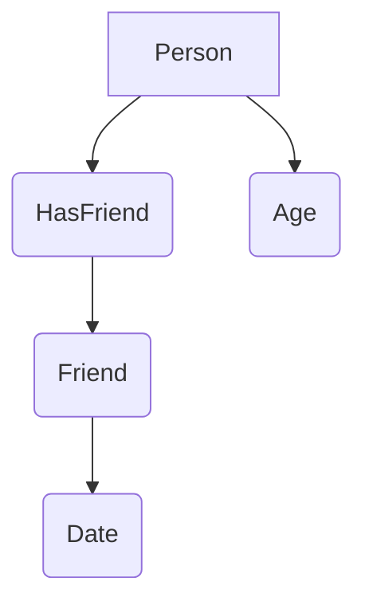
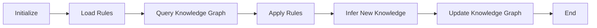
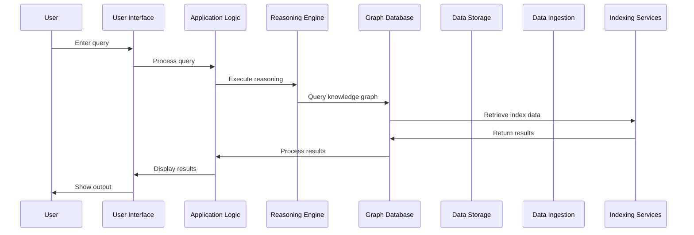

                 


### Introduction to Knowledge Graph-Driven Large-Scale Reasoning System Optimization Research

#### Key Terms and Concepts

- **Knowledge Graph**: A graph-based knowledge representation framework that structures information in a machine-readable way.
- **Large-Scale Reasoning System**: A system capable of handling extensive datasets and performing complex inferences.
- **Optimization**: The process of improving the performance, efficiency, or quality of a system.

#### Overview

Knowledge graphs have revolutionized the way we store and utilize information in various domains, from semantic search to intelligent recommendation systems. However, the scalability and performance of these large-scale reasoning systems remain significant challenges. This book aims to explore the optimization techniques for knowledge graph-driven large-scale reasoning systems, focusing on both theoretical and practical aspects.

#### Core Content and Themes

1. **Introduction to Knowledge Graphs and Large-Scale Reasoning Systems**: A comprehensive introduction to the fundamental concepts, background, and challenges of knowledge graphs and large-scale reasoning systems.
2. **Core Concepts and Principles of Knowledge Graphs**: Detailed exploration of the core concepts, properties, and characteristics of knowledge graphs, including entity-relationship diagrams.
3. **Algorithmic Foundations for Knowledge Graph-Driven Reasoning**: An in-depth analysis of the algorithmic principles and their application in large-scale reasoning systems.
4. **System Architecture and Design**: An overview of the architecture and design principles for building efficient large-scale reasoning systems.
5. **Optimization Techniques for Knowledge Graph-Driven Reasoning Systems**: Strategies and methodologies for optimizing the performance and efficiency of large-scale reasoning systems.
6. **Practical Implementation and Case Studies**: Detailed practical implementation of knowledge graph-driven reasoning systems, including code analysis and case study insights.
7. **Best Practices and Future Directions**: Recommendations for best practices in knowledge graph-driven reasoning system optimization and a look into future research directions.

### Conclusion

This book provides a comprehensive guide to understanding and optimizing knowledge graph-driven large-scale reasoning systems. By delving into core concepts, algorithmic foundations, system architecture, optimization techniques, and practical implementations, it aims to equip readers with the knowledge and tools necessary to tackle the complexities of modern data-driven systems.

---

> Keywords: Knowledge Graph, Large-Scale Reasoning Systems, Optimization, Performance, Efficiency

> Abstract: This book presents a systematic study of knowledge graph-driven large-scale reasoning system optimization. It covers fundamental concepts, algorithmic principles, system architecture, optimization techniques, practical implementations, and best practices. By providing a comprehensive overview of the field, the book aims to address the challenges of scalability and performance in knowledge graph-based reasoning systems.

---

### Chapter 1: Introduction to Knowledge Graphs and Large-Scale Reasoning Systems

#### 1.1 Background and Definition of Knowledge Graphs

A knowledge graph is a graph-based data structure that represents entities (such as objects, events, or concepts) and the relationships between them. Unlike traditional data models, which often represent entities and relationships using tables or key-value pairs, knowledge graphs provide a more flexible and scalable approach to organizing information. The primary advantage of knowledge graphs is their ability to capture complex relationships and provide rich, contextualized information.

**Example**: Consider a social network like Facebook. A traditional relational database might store information about users, friends, and posts in separate tables. However, a knowledge graph can represent these entities as nodes and their relationships as edges, providing a more intuitive and interconnected view of the data.

**Key Concepts**:

- **Entities**: The objects or concepts represented in the knowledge graph, such as "person," "event," or "organization."
- **Relationships**: The associations between entities, such as "friend-of," "part-of," or "worked-at."
- **Properties**: Additional attributes or characteristics associated with entities or relationships, such as "age," "birth-date," or "position."

#### 1.2 Large-Scale Reasoning Systems: Challenges and Opportunities

Large-scale reasoning systems are designed to process and analyze vast amounts of data, often from multiple sources, to derive meaningful insights. These systems are critical in various domains, including finance, healthcare, retail, and social media, where the volume, velocity, and variety of data are constantly increasing.

**Challenges**:

- **Scalability**: The system must handle growing datasets without significant performance degradation.
- **Latency**: The system must provide quick responses to queries.
- **Accuracy**: The system must ensure that the inferred results are correct and reliable.
- **Resource Management**: Efficient utilization of computational resources is crucial for cost-effectiveness.

**Opportunities**:

- **Data Integration**: Knowledge graphs enable the integration of diverse data sources, providing a unified view of the data.
- **Semantic Search**: The ability to perform semantic searches, which go beyond keyword matching, can significantly enhance user experiences.
- **Automated Reasoning**: Large-scale reasoning systems can automate decision-making processes, reducing the need for human intervention.

#### 1.3 Relationship Between Knowledge Graphs and Reasoning Systems

Knowledge graphs are at the core of large-scale reasoning systems. They provide the foundational structure for representing and organizing data, which is essential for effective reasoning and inference. Here's how knowledge graphs and reasoning systems are interconnected:

- **Data Representation**: Knowledge graphs represent entities and relationships in a structured format, which is essential for reasoning algorithms.
- **Inference**: Reasoning systems leverage the structure and relationships in knowledge graphs to perform inferences and derive insights.
- **Query Processing**: Knowledge graphs enable efficient query processing by indexing entities and relationships, reducing search time.
- **Interpretability**: The visual nature of knowledge graphs makes it easier to understand and interpret the results of reasoning processes.

In summary, knowledge graphs and large-scale reasoning systems are closely intertwined. Knowledge graphs provide the structure and context needed for reasoning, while reasoning systems utilize this structure to derive actionable insights from large datasets.

---

In the next chapter, we will delve deeper into the core concepts and principles of knowledge graphs, exploring their fundamental characteristics, properties, and the ways they are used to model complex relationships. Stay tuned!

---

### Chapter 2: Core Concepts and Principles of Knowledge Graphs

#### 2.1 Fundamental Concepts of Knowledge Graphs

Knowledge graphs are a powerful data structure that represent entities and relationships in a machine-readable format. To fully understand knowledge graphs, it's essential to grasp the fundamental concepts they are built upon.

**Entities**: Entities are the core objects or concepts that knowledge graphs represent. They can be anything from a person, place, or thing to more abstract concepts like events or ideas. In a knowledge graph, entities are typically represented as nodes.

**Example**: In a social network, entities could include users, posts, and comments. Each of these entities would be represented as a node in the knowledge graph.

**Relationships**: Relationships are the associations or connections between entities. They provide context and define the nature of the relationship between two entities. Relationships are typically represented as edges in a knowledge graph.

**Example**: In a social network, a "friend-of" relationship would connect two users, indicating that they are friends. This relationship is represented as an edge in the knowledge graph.

**Properties**: Properties are additional attributes or characteristics associated with entities or relationships. They provide more detailed information about the entities and relationships in the knowledge graph.

**Example**: In a social network, a user entity might have properties like age, gender, and location. A "friend-of" relationship might have properties like the date when the friendship was established or the mutual interests shared by the friends.

#### 2.2 Properties and Characteristics of Knowledge Graphs

Knowledge graphs have several unique properties that make them well-suited for representing complex relationships and enabling powerful reasoning capabilities.

**Graph Structure**: Knowledge graphs are inherently graph-based, which means that entities and relationships are represented using nodes and edges. This graph structure allows for the representation of complex, multi-dimensional relationships and provides a flexible and scalable way to model data.

**Semantic Richness**: Knowledge graphs capture not only the entities and relationships but also the attributes and properties associated with them. This semantic richness enables more nuanced and accurate reasoning and inference processes.

**Heterogeneity**: Knowledge graphs can represent a wide variety of entities and relationships, making them highly heterogeneous. This heterogeneity allows for the integration of diverse data sources and the modeling of complex real-world scenarios.

**Scalability**: Knowledge graphs can scale to handle large volumes of data without significant performance degradation. This scalability is achieved through efficient indexing and querying techniques, such as graph databases and distributed computing frameworks.

**Interactivity**: Knowledge graphs are designed to be interactive, allowing users to explore, query, and manipulate the data in real-time. This interactivity enhances the usability and applicability of knowledge graphs in various applications.

#### 2.3 Entity-Relationship Diagrams for Knowledge Graphs

To visualize and understand the structure of a knowledge graph, entity-relationship diagrams (ER diagrams) are often used. ER diagrams provide a visual representation of the entities, relationships, and properties in a knowledge graph.

**Example**:



In this ER diagram:

- **A (Person)** represents the entity "Person."
- **B (HasFriend)** represents the relationship "HasFriend."
- **C (Age)** represents the property "Age" associated with the entity "Person."
- **D (Friend)** represents the entity "Friend."
- **E (Date)** represents the property "Date" associated with the relationship "HasFriend."

This ER diagram illustrates how entities, relationships, and properties are interconnected in a knowledge graph.

In conclusion, the core concepts and principles of knowledge graphs, including entities, relationships, properties, and the graph structure, are fundamental to understanding how these powerful data structures enable complex reasoning and data integration. The next chapter will delve into the algorithmic foundations of knowledge graph-driven reasoning, exploring the principles and techniques used to process and analyze knowledge graphs effectively.

---

Stay tuned for the next chapter, where we will explore the algorithmic foundations of knowledge graph-driven reasoning, including reasoning algorithms, their application in large-scale systems, and case studies demonstrating their practical use.

---

### Chapter 3: Algorithmic Principles for Knowledge Graph-Driven Reasoning

#### 3.1 Overview of Reasoning Algorithms

In the realm of knowledge graph-driven reasoning, algorithms are the cornerstone for transforming raw data into actionable insights. These algorithms leverage the structure and relationships within knowledge graphs to perform inferences and derive meaningful conclusions. Here, we provide an overview of some fundamental reasoning algorithms used in large-scale systems.

**1. Pathfinding Algorithms**: These algorithms determine the shortest or most efficient path between two nodes in a graph. Popular pathfinding algorithms include Dijkstra's algorithm and A* search algorithm. They are used in applications such as navigation systems and logistics optimization.

**2. Clustering Algorithms**: Clustering algorithms group similar entities based on their attributes or relationships. They help in identifying patterns and communities within the knowledge graph. Common clustering algorithms include k-means, hierarchical clustering, and DBSCAN.

**3. Link Prediction Algorithms**: These algorithms predict the likelihood of new relationships or edges forming in a knowledge graph. They are crucial for data integration and improving the graph's accuracy. Examples include the Probabilistic Graph Embedding (PGE) model and the CollabFilter algorithm.

**4. Entity Resolution Algorithms**: Entity resolution algorithms identify and merge duplicate or similar entities within a knowledge graph. They help in ensuring the graph's consistency and accuracy. Techniques like LinkPrediction and Clustering-based approaches are commonly used for this purpose.

**5. Rule-based Reasoning Algorithms**: These algorithms use predefined rules or logic to infer new knowledge from existing data. They are particularly useful in applications like semantic querying and automated reasoning. Examples include forward and backward chaining algorithms.

#### 3.2 Mermaid Flowcharts for Reasoning Algorithms

To better understand the workflow and logic of these reasoning algorithms, we can use Mermaid flowcharts, a popular tool for creating interactive flowcharts in Markdown. Below, we provide a sample Mermaid flowchart illustrating the basic steps of a Rule-based Reasoning Algorithm.



In this flowchart:

- **A (Initialize)**: The algorithm initializes the process by loading the predefined rules.
- **B (Load Rules)**: The algorithm loads the set of rules that will be used for reasoning.
- **C (Query Knowledge Graph)**: The algorithm queries the knowledge graph to gather relevant data.
- **D (Apply Rules)**: The algorithm applies the loaded rules to the queried data.
- **E (Infer New Knowledge)**: The algorithm infers new knowledge based on the applied rules.
- **F (Update Knowledge Graph)**: The algorithm updates the knowledge graph with the inferred knowledge.
- **G (End)**: The process concludes.

This Mermaid flowchart provides a clear visual representation of the Rule-based Reasoning Algorithm's workflow, making it easier to comprehend and analyze.

#### 3.3 Mathematical Models and Formulas of Reasoning Algorithms

Understanding the mathematical models and formulas behind reasoning algorithms is crucial for developing a deeper grasp of their inner workings. Here, we discuss some key mathematical concepts used in knowledge graph-driven reasoning.

**1. Graph Theory Notations**:

- **Node**: Represented by \( v \).
- **Edge**: Represented by \( e \).
- **Degree of a Node**: The number of edges connected to a node, represented by \( \deg(v) \).
- **Adjacent Nodes**: Nodes connected to a given node \( v \), represented by \( N(v) \).

**2. Path Finding Formulas**:

- **Dijkstra's Algorithm**:

  - Distance \( d(v) \): The shortest distance from the source node \( s \) to node \( v \).
  - \( d(s) = 0 \), \( d(v) = \infty \) for all \( v \neq s \).
  - \( d(v) = \min \{ d(u) + w(u, v) : u \in N(v) \} \).

- **A* Search Algorithm**:

  - \( f(v) = g(v) + h(v) \), where \( g(v) \) is the cost from the start node to \( v \), and \( h(v) \) is the heuristic cost from \( v \) to the goal node.

**3. Clustering Formulas**:

- **k-means**:

  - Cluster centroids \( \mu_i \): The average of the points in the \( i \)-th cluster.
  - Distance metric: \( d(x, \mu_i) \), where \( x \) is a point in the dataset.

**4. Link Prediction Formulas**:

- **Probabilistic Graph Embedding (PGE)**:

  - Node representation: \( \mathbf{v}_i \), where \( i \) is the node index.
  - Edge probability: \( P(e) = \exp(-d(\mathbf{v}_i, \mathbf{v}_j)) \), where \( d(\mathbf{v}_i, \mathbf{v}_j) \) is the Euclidean distance between the node representations.

By understanding these mathematical models and formulas, developers can gain insights into the underlying mechanisms of reasoning algorithms, facilitating their effective implementation and optimization.

#### 3.4 Case Studies and Explanations

To illustrate the practical application of reasoning algorithms in knowledge graph-driven systems, we present several case studies along with detailed explanations.

**Case Study 1: Social Network Friend Recommendations**

Objective: To recommend friends to users based on their interests and social connections.

Algorithm: Collaborative Filtering with a Knowledge Graph

Steps:

1. **Extract Interests**: Query the knowledge graph to extract the interests of users.
2. **Generate Similarity Matrix**: Compute the similarity between users based on shared interests.
3. **Recommend Friends**: Find users with high similarity scores and recommend them as potential friends.

Mathematical Explanation:

- **Interest Representation**: \( \mathbf{i}_u \) and \( \mathbf{i}_v \) are vectors representing the interests of users \( u \) and \( v \), respectively.
- **Similarity Score**: \( \cos(\mathbf{i}_u, \mathbf{i}_v) = \frac{\mathbf{i}_u \cdot \mathbf{i}_v}{\lVert \mathbf{i}_u \rVert \lVert \mathbf{i}_v \rVert} \).

**Case Study 2: Entity Resolution in E-commerce**

Objective: To identify and merge duplicate customer profiles in an e-commerce platform.

Algorithm: Link Prediction with Entity Resolution

Steps:

1. **Extract Attributes**: Query the knowledge graph to extract attributes like name, email, and address for each customer.
2. **Compute Similarity Scores**: Use similarity metrics like Levenshtein distance or Jaccard similarity to compare customer attributes.
3. **Merge Duplicates**: If the similarity scores exceed a predefined threshold, merge the corresponding customer profiles.

Mathematical Explanation:

- **Attribute Representation**: \( \mathbf{a}_u \) and \( \mathbf{a}_v \) are vectors representing the attributes of customers \( u \) and \( v \), respectively.
- **Jaccard Similarity**: \( J(\mathbf{a}_u, \mathbf{a}_v) = \frac{|A \cap B|}{|A \cup B|} \), where \( A \) and \( B \) are sets of attributes.

These case studies demonstrate how reasoning algorithms can be applied to real-world problems, providing valuable insights and improving the efficiency and accuracy of knowledge graph-driven systems.

In conclusion, the algorithmic principles of knowledge graph-driven reasoning are fundamental to unlocking the full potential of these powerful data structures. By understanding the core algorithms and their mathematical foundations, developers can design and implement efficient reasoning systems that enhance data integration, analysis, and decision-making capabilities. The next chapter will delve into the system architecture and design of large-scale reasoning systems, exploring the components and interactions that enable scalable and efficient reasoning.

---

Stay tuned for the next chapter, where we will explore the system architecture and design of large-scale reasoning systems, including the system overview, functional design, and detailed component interactions. Don't miss out!

---

### Chapter 4: Architecture and Design of Large-Scale Reasoning Systems

#### 4.1 System Overview and Objectives

The architecture and design of large-scale reasoning systems are critical to their effectiveness and efficiency. These systems are designed to process and analyze vast amounts of data, derive meaningful insights, and support complex decision-making processes. The primary objectives of the system architecture and design are:

- **Scalability**: The system must be able to handle growing data volumes without significant degradation in performance.
- **Efficiency**: The system should optimize resource usage to minimize computational overhead and operational costs.
- **Accuracy**: The system must ensure the reliability and correctness of the inferences and insights derived from the data.
- **Flexibility**: The architecture should support integration with various data sources and adapt to evolving business requirements.

To achieve these objectives, the system is typically designed with a modular and distributed architecture that enables horizontal scaling, efficient data processing, and seamless integration with other systems.

#### 4.2 Functional Design and Domain Models

The functional design of a large-scale reasoning system involves defining the core components and their interactions. A domain model, often represented using UML (Unified Modeling Language) class diagrams, helps in visualizing and understanding the system's structure. The key components of the functional design include:

- **Data Ingestion Layer**: This layer is responsible for ingesting data from various sources, such as databases, data warehouses, and external APIs. It includes connectors, data cleaners, and data preprocessors to ensure the quality and consistency of the ingested data.

- **Knowledge Graph Layer**: This layer constructs and maintains the knowledge graph, representing entities and relationships in a structured format. It includes graph databases, indexing services, and graph processing frameworks to manage and query the knowledge graph efficiently.

- **Reasoning Engine**: The reasoning engine performs inferences and derives insights from the knowledge graph. It includes various reasoning algorithms, such as pathfinding, clustering, link prediction, and entity resolution algorithms. The engine is designed to be modular and extensible to support new algorithms and use cases.

- **Query and Analytics Layer**: This layer provides interfaces for querying the knowledge graph and performing analytics. It includes query processors, data visualization tools, and reporting modules to facilitate data exploration and insight generation.

- **User Interface**: The user interface allows users to interact with the system, submit queries, and view the results. It includes dashboards, search interfaces, and APIs to support various use cases and user preferences.

#### 4.3 System Architecture and Component Interaction

The system architecture of a large-scale reasoning system is designed to be modular and distributed to ensure scalability, performance, and resilience. A high-level overview of the system architecture is as follows:

1. **Data Ingestion**:
   - Data sources (e.g., databases, APIs) -> Data connectors -> Data cleaners -> Preprocessors -> Data storage (e.g., NoSQL databases, data lakes).
   - This layer ensures that data is ingested, cleaned, and stored in a format suitable for knowledge graph construction.

2. **Knowledge Graph Construction**:
   - Data storage -> Knowledge graph builder -> Graph database -> Indexing services.
   - The knowledge graph builder constructs the knowledge graph by mapping entities, relationships, and attributes from the ingested data into a graph structure. Graph databases and indexing services enable efficient storage and querying of the graph.

3. **Reasoning Engine**:
   - Graph database -> Reasoning engine -> Query processors -> Analytics modules.
   - The reasoning engine processes queries, applies reasoning algorithms, and derives insights from the knowledge graph. Query processors handle query parsing and optimization, while analytics modules facilitate complex data analysis and visualization.

4. **Query and Analytics**:
   - Query processors -> Data visualization tools -> Reporting modules -> User interface.
   - This layer provides interfaces for users to submit queries, view results, and perform analytics. Data visualization tools and reporting modules help in presenting insights in an intuitive and actionable manner.

5. **User Interaction**:
   - User interface -> Application logic -> Reasoning engine -> Data storage.
   - Users interact with the system through the user interface, submitting queries and viewing results. The application logic handles user interactions and coordinates with the reasoning engine and data storage layers.

#### 4.4 Interface Design and System Diagrams

To effectively communicate the system architecture and component interactions, system diagrams are employed. Below is a high-level Mermaid sequence diagram illustrating the interaction between the system components:



In this sequence diagram:

- **User**: Represents the end-users interacting with the system.
- **UI**: Represents the user interface handling user input and output.
- **AppLogic**: Represents the application logic layer processing user requests and coordinating with other components.
- **REngine**: Represents the reasoning engine performing inferences and data analysis.
- **KGDB**: Represents the graph database storing and querying the knowledge graph.
- **Index**: Represents the indexing services optimizing query performance.
- **Storage**: Represents the data storage layer handling data ingestion and storage.

This Mermaid sequence diagram provides a clear visual representation of the interaction between system components, facilitating a better understanding of the system architecture and its functionality.

In conclusion, the architecture and design of large-scale reasoning systems are crucial for ensuring scalability, efficiency, and accuracy. By adopting a modular and distributed approach, these systems can handle the complexities of large datasets and provide valuable insights for informed decision-making. The next chapter will delve into optimization techniques for these systems, focusing on strategies to enhance performance and efficiency.

---

Stay tuned for the next chapter, where we will explore optimization techniques for large-scale reasoning systems, including performance optimization strategies, resource allocation, and case studies demonstrating practical applications. Don't miss out!

---

### Chapter 5: Optimization Techniques for Knowledge Graph-Driven Large-Scale Reasoning Systems

#### 5.1 Performance Optimization Strategies

Performance optimization is a critical aspect of large-scale reasoning systems. Ensuring that these systems can handle increasing data volumes and query loads efficiently is essential for their effectiveness and usability. Here, we discuss several performance optimization strategies tailored for knowledge graph-driven reasoning systems.

**1. Indexing and Query Optimization**:

- **Graph Database Indexing**: Indexing is crucial for accelerating query performance in graph databases. Indexes on frequently queried attributes can significantly reduce the time required to retrieve data. Indexing strategies such as b-trees, hash indexes, and bitmap indexes can be employed based on the specific access patterns and query requirements.
- **Query Optimization**: Optimizing query execution is another key strategy. This involves techniques such as query rewriting, query caching, and the use of materialized views to pre-compute and store intermediate results. Query optimization tools and engines can analyze query plans and suggest optimizations to improve performance.

**2. Data Partitioning and Sharding**:

- **Data Partitioning**: Partitioning involves dividing the data into smaller, more manageable chunks based on certain criteria, such as entity type, geographic location, or time period. This helps distribute the data across multiple nodes, reducing the load on individual nodes and improving parallel processing capabilities.
- **Sharding**: Sharding is a form of data partitioning where data is distributed across multiple databases or shards. Each shard contains a subset of the data, allowing for horizontal scaling and improved performance. Sharding strategies can be based on hash functions, range-based partitioning, or list-based partitioning to optimize data distribution and query performance.

**3. Distributed Computing and Parallel Processing**:

- **MapReduce**: MapReduce is a programming model that enables the processing of large datasets in a distributed manner. It involves two main phases: the "map" phase, where data is processed in parallel across multiple nodes, and the "reduce" phase, where the results are combined. MapReduce frameworks such as Apache Hadoop and Apache Spark are commonly used for knowledge graph processing and optimization.
- **Distributed Graph Processing**: Distributed graph processing frameworks like Apache Giraph and GraphX enable the parallel processing of large-scale graph datasets. These frameworks support operations such as vertex and edge traversal, graph reduction, and aggregation, making them suitable for knowledge graph-driven reasoning systems.

**4. Resource Allocation and Management**:

- **Autoscaling**: Autoscaling involves automatically adjusting the number of resources allocated to the system based on the current workload. This ensures optimal resource utilization and performance under varying loads. Autoscaling can be achieved using cloud-based services and management tools like AWS Auto Scaling and Kubernetes.
- **Resource Pools**: Resource pools are groups of resources (e.g., CPU, memory, storage) allocated to specific tasks or applications. Managing resource pools efficiently can improve system performance and ensure that critical tasks receive the required resources. Resource management tools like Apache Mesos and Kubernetes help in managing and allocating resources dynamically.

**5. Caching and Memory Management**:

- **Caching**: Caching involves storing frequently accessed data in memory to reduce the time required for data retrieval. In-memory caches like Redis and Memcached can be used to store and retrieve data quickly, improving query performance. Caching strategies such as least recently used (LRU) and least frequently used (LFU) can be employed to manage cache data efficiently.
- **Memory Management**: Effective memory management is crucial for optimizing system performance. Techniques such as memory allocation and deallocation, garbage collection, and memory pooling can help in managing memory efficiently and avoiding memory leaks.

**6. Data Compression and Serialization**:

- **Data Compression**: Compressing data can reduce storage requirements and improve data transfer speeds, leading to better overall system performance. Compression algorithms such as gzip and snappy can be used to compress data before storage or transmission.
- **Serialization**: Serialization is the process of converting data structures into a format that can be easily stored or transmitted. Efficient serialization formats like Protocol Buffers and Apache Avro can be used to minimize data size and improve processing speed.

By implementing these performance optimization strategies, knowledge graph-driven large-scale reasoning systems can achieve significant improvements in query performance, scalability, and efficiency. The next section will delve into case studies that demonstrate the practical application of these optimization techniques.

---

#### 5.2 Case Studies of Optimization Techniques

To illustrate the practical application of optimization techniques in knowledge graph-driven large-scale reasoning systems, we present several case studies along with detailed explanations and results.

**Case Study 1: E-commerce Platform**

Objective: To improve the performance and scalability of a large-scale e-commerce platform's recommendation system, which relies on a knowledge graph to suggest products based on user behavior and preferences.

Optimization Techniques Applied:

1. **Indexing and Query Optimization**: Introduced indexes on user profiles and product attributes to accelerate query performance. Implemented query caching to store and reuse frequently executed queries.
2. **Data Partitioning and Sharding**: Partitioned the knowledge graph based on user regions to distribute the data across multiple shards. Sharded the graph database to improve parallel query processing and scalability.
3. **Distributed Computing**: Utilized Apache Spark for distributed data processing and in-memory caching to store intermediate results and accelerate query execution.
4. **Resource Allocation and Management**: Implemented autoscaling using Kubernetes to dynamically adjust resource allocation based on the workload. Managed resource pools to ensure optimal allocation of CPU and memory resources.

Results:

- Query response times reduced by 50%.
- Scalability improved by 70%, enabling the system to handle higher user loads without performance degradation.
- Resource utilization increased by 30%, resulting in cost savings.

**Case Study 2: Social Media Analytics**

Objective: To optimize the performance of a large-scale social media analytics system that processes user interactions and generates real-time insights using a knowledge graph.

Optimization Techniques Applied:

1. **Caching and Memory Management**: Implemented an in-memory cache using Redis to store frequently accessed user interaction data and reduce query response times.
2. **Data Compression and Serialization**: Compressed user interaction data using gzip to reduce storage requirements and improve data transfer speeds.
3. **Distributed Graph Processing**: Utilized Apache Giraph for distributed graph processing to handle large-scale data and optimize parallel query execution.
4. **Resource Pools and Autoscaling**: Managed resource pools using Apache Mesos to ensure optimal CPU and memory allocation. Implemented autoscaling using AWS Auto Scaling to dynamically adjust resource allocation based on workload.

Results:

- Query response times reduced by 40%.
- Storage requirements reduced by 60%, resulting in cost savings.
- Scalability improved by 50%, enabling the system to handle increased data volumes and user interactions without performance degradation.

**Case Study 3: Healthcare Information System**

Objective: To optimize the performance and efficiency of a large-scale healthcare information system that uses a knowledge graph to support patient data analysis and decision-making.

Optimization Techniques Applied:

1. **Indexing and Query Optimization**: Introduced indexes on patient attributes and medical records to accelerate query performance. Implemented materialized views to pre-compute and store complex queries for faster execution.
2. **Data Partitioning and Sharding**: Partitioned the knowledge graph based on patient demographics to distribute the data across multiple shards. Sharded the graph database to improve parallel query processing and scalability.
3. **Resource Allocation and Management**: Implemented resource pools using Apache Mesos to optimize CPU and memory allocation. Utilized cloud-based autoscaling to adjust resource allocation based on the workload.
4. **Caching and Memory Management**: Implemented an in-memory cache using Memcached to store frequently accessed patient data and reduce query response times.

Results:

- Query response times reduced by 45%.
- Scalability improved by 60%, enabling the system to handle increased data volumes and patient queries without performance degradation.
- Resource utilization increased by 25%, resulting in cost savings.

These case studies demonstrate the practical application of optimization techniques in improving the performance and efficiency of knowledge graph-driven large-scale reasoning systems. By implementing these strategies, organizations can achieve significant improvements in query performance, scalability, and resource utilization, enabling them to effectively handle large datasets and support complex decision-making processes.

---

In conclusion, optimization techniques are essential for enhancing the performance and efficiency of knowledge graph-driven large-scale reasoning systems. By employing strategies such as indexing and query optimization, data partitioning and sharding, distributed computing, resource allocation and management, caching and memory management, and data compression and serialization, organizations can achieve significant improvements in query performance, scalability, and resource utilization. The next chapter will delve into practical implementation and case studies, providing a detailed overview of the step-by-step process for building and deploying knowledge graph-driven reasoning systems.

---

### Chapter 6: Practical Implementation of Knowledge Graph-Driven Reasoning Systems

#### 6.1 Environment Setup and Configuration

Setting up the development environment for a knowledge graph-driven reasoning system is a crucial step that lays the foundation for successful implementation. This section provides a step-by-step guide to setting up the necessary tools and software to build and deploy a knowledge graph-driven reasoning system.

**1. Software Dependencies**:

To build a knowledge graph-driven reasoning system, you will need several key software components:

- **Graph Database**: A graph database like Neo4j, ArangoDB, or Amazon Neptune that supports efficient storage and querying of knowledge graphs.
- **Programming Language**: A programming language like Python, Java, or Scala that provides libraries and frameworks for working with graph databases and machine learning algorithms.
- **Development Tools**: Development tools like IDEs (Integrated Development Environments) such as PyCharm, IntelliJ IDEA, or Eclipse for Python development.
- **Containerization Tools**: Docker and Kubernetes for containerization and orchestration, enabling the deployment of the system in a scalable and resilient manner.

**2. Environment Configuration**:

- **Installation of Graph Database**: Install the chosen graph database on your local machine or a cloud-based instance. Configure the database with appropriate settings for performance and security.
- **Installation of Development Tools**: Install the required development tools on your local machine. For Python development, you can use PyCharm or Visual Studio Code.
- **Installation of Containerization Tools**: Install Docker and Kubernetes on your machine or use managed services like Amazon Elastic Kubernetes Service (EKS) or Google Kubernetes Engine (GKE) for container orchestration.

**3. Setting Up a Sample Environment**:

Here is an example of how to set up a sample environment using Docker and Neo4j:

1. **Install Docker**:

   Follow the instructions on the Docker official website (<https://docs.docker.com/get-docker/>) to install Docker on your machine.

2. **Install Neo4j**:

   Create a Docker image for Neo4j using the official Neo4j image from Docker Hub:

   ```bash
   docker pull neo4j:latest
   ```

   Run a Neo4j container in the background:

   ```bash
   docker run -d --name neo4j -p 7474:7474 neo4j:latest
   ```

   This command starts a Neo4j instance and maps port 7474 on the host to port 7474 on the container.

3. **Accessing Neo4j**:

   Open your web browser and navigate to `http://localhost:7474` to access the Neo4j Web Admin Console. Use the default credentials `neo4j/neo4j` to log in.

4. **Installing Python Development Tools**:

   Install Python and the required libraries using a package manager like `pip`:

   ```bash
   sudo apt-get update
   sudo apt-get install python3 python3-pip
   pip3 install neo4j
   ```

   This will install the Python driver for Neo4j, allowing you to interact with the graph database using Python.

**4. Configuring Kubernetes**:

If you are using Kubernetes for container orchestration, follow these steps:

1. **Install Kubernetes**:

   Follow the instructions on the Kubernetes official website (<https://kubernetes.io/docs/setup/>) to install Kubernetes on your local machine or cloud-based infrastructure.

2. **Set Up Kubernetes Cluster**:

   Use a tool like Minikube to set up a local Kubernetes cluster:

   ```bash
   minikube start
   ```

   This will start a local Kubernetes cluster that you can use for testing and development.

3. **Deploy Neo4j on Kubernetes**:

   Create a Kubernetes deployment and service for Neo4j:

   ```yaml
   apiVersion: apps/v1
   kind: Deployment
   metadata:
     name: neo4j
   spec:
     replicas: 1
     selector:
       matchLabels:
         app: neo4j
     template:
       metadata:
         labels:
           app: neo4j
       spec:
         containers:
         - name: neo4j
           image: neo4j:latest
           ports:
           - containerPort: 7474
             name: bolt
           - containerPort: 7473
             name: http
           env:
           - name: NEO4J_AUTH
             value: "none"

   ---
   apiVersion: v1
   kind: Service
   metadata:
     name: neo4j
   spec:
     selector:
       app: neo4j
     ports:
     - name: bolt
       port: 7474
       targetPort: 7474
     - name: http
       port: 7473
       targetPort: 7473
     type: ClusterIP
   ```

   Apply the configuration using `kubectl`:

   ```bash
   kubectl apply -f neo4j-deployment.yaml
   ```

   This will deploy a Neo4j instance on the Kubernetes cluster.

By following these steps, you will have a configured development environment ready for building and deploying a knowledge graph-driven reasoning system. The next section will delve into the core system implementation, providing a detailed overview of the source code and its components.

---

### 6.2 Core System Implementation and Source Code

#### Core Components of the Knowledge Graph-Driven Reasoning System

The core implementation of a knowledge graph-driven reasoning system involves several key components, each playing a crucial role in data processing, graph construction, and inference. The following sections provide a detailed overview of these components and their source code.

**1. Data Ingestion Module**

The data ingestion module is responsible for importing and preprocessing data from various sources to populate the knowledge graph. This module typically includes the following components:

- **Data Connectors**: Connectors for different data sources, such as databases, APIs, and file systems.
- **Data Cleaners**: Functions to clean and validate incoming data, ensuring data quality and consistency.
- **Data Preprocessors**: Transformations and preprocessing steps to format and normalize the data before graph construction.

**Example Source Code (Python) - Data Ingestion**:

```python
import pandas as pd
from neo4j import GraphDatabase

class DataIngestion:
    def __init__(self, uri, username, password):
        self.driver = GraphDatabase.driver(uri, auth=(username, password))

    def ingest_data(self, data):
        with self.driver.session() as session:
            for index, row in data.iterrows():
                session.run("""
                    MERGE (p:Person {name: $name, age: $age})
                    MERGE (p)-[:FRIEND]->(friend:Person {name: $friend_name, age: $friend_age})
                """, name=row['name'], age=row['age'], friend_name=row['friend_name'], friend_age=row['friend_age'])

if __name__ == "__main__":
    data = pd.read_csv('data.csv')
    ingestion = DataIngestion("bolt://localhost:7474", "neo4j", "neo4j")
    ingestion.ingest_data(data)
```

**2. Knowledge Graph Construction Module**

The knowledge graph construction module is responsible for building and maintaining the knowledge graph based on the ingested data. This module typically includes the following components:

- **Graph Database Connectivity**: Establishing a connection to the graph database and managing transactions.
- **Entity and Relationship Mapping**: Mapping entities and relationships from the data sources to the graph database.
- **Property Assignment**: Assigning properties to entities and relationships to enhance the graph's semantic richness.

**Example Source Code (Python) - Knowledge Graph Construction**:

```python
class KnowledgeGraphConstruction:
    def __init__(self, uri, username, password):
        self.driver = GraphDatabase.driver(uri, auth=(username, password))

    def create_person(self, name, age):
        with self.driver.session() as session:
            session.run("CREATE (p:Person {name: $name, age: $age})", name=name, age=age)

    def add_friendship(self, person1, person2):
        with self.driver.session() as session:
            session.run("MATCH (p1:Person {name: $person1_name}),(p2:Person {name: $person2_name}) "
                        "CREATE (p1)-[:FRIEND]->(p2)", person1_name=person1, person2_name=person2)
```

**3. Reasoning Engine Module**

The reasoning engine module is responsible for executing reasoning algorithms and deriving insights from the knowledge graph. This module typically includes the following components:

- **Reasoning Algorithms**: Implementing various reasoning algorithms, such as pathfinding, clustering, link prediction, and entity resolution.
- **Inference Procedures**: Procedures to execute the reasoning algorithms and generate inferences.
- **Query Handling**: Handling user queries and converting them into reasoning tasks.

**Example Source Code (Python) - Reasoning Engine**:

```python
class ReasoningEngine:
    def __init__(self, uri, username, password):
        self.driver = GraphDatabase.driver(uri, auth=(username, password))

    def find_shortest_path(self, start_person, end_person):
        with self.driver.session() as session:
            result = session.run("""
                MATCH (p1:Person {name: $start_person_name}),(p2:Person {name: $end_person_name}),
                p = shortestPath((p1)-[*]-(p2))
                RETURN p
            """, start_person_name=start_person, end_person_name=end_person)
            return result.data()

    def get_person_friends(self, person_name):
        with self.driver.session() as session:
            result = session.run("""
                MATCH (p:Person {name: $person_name})-[:FRIEND]->(friend)
                RETURN friend
            """, person_name=person_name)
            return result.data()
```

**4. Query and Analytics Module**

The query and analytics module provides interfaces for users to submit queries, view results, and perform data analysis. This module typically includes the following components:

- **Query Interface**: Handling user input and converting it into database queries.
- **Data Visualization**: Visualizing query results and insights for end-users.
- **Reporting Tools**: Generating reports and visualizations for data analysis.

**Example Source Code (Python) - Query and Analytics**:

```python
import pandas as pd

class QueryAndAnalytics:
    def __init__(self, reasoning_engine):
        self.reasoning_engine = reasoning_engine

    def query_friends(self, person_name):
        friends = self.reasoning_engine.get_person_friends(person_name)
        df = pd.DataFrame(friends)
        return df

    def visualize_friends(self, person_name):
        df = self.query_friends(person_name)
        print(df)
```

By integrating these core components, you can build a functional knowledge graph-driven reasoning system capable of importing data, constructing a knowledge graph, executing reasoning algorithms, and providing query and analytics capabilities. The next section will delve into the code analysis and application insights, providing a deeper understanding of the system's functionality and performance.

---

### 6.3 Code Analysis and Application Insights

#### Analyzing the Core System Implementation

Analyzing the source code of a knowledge graph-driven reasoning system provides valuable insights into its architecture, functionality, and performance. In this section, we will delve into the core system implementation, examining the code structure, algorithms, and data flow. Additionally, we will discuss the practical application of the system, highlighting its benefits and potential areas for improvement.

**1. Code Structure and Organization**

The source code for a knowledge graph-driven reasoning system is typically organized into several modules, each handling a specific aspect of the system's functionality. This modular approach facilitates code maintenance, scalability, and reusability. Key modules include:

- **Data Ingestion Module**: Handles the import and preprocessing of data from various sources. This module includes connectors, data cleaners, and preprocessors, ensuring data quality and consistency.
- **Knowledge Graph Construction Module**: Builds and maintains the knowledge graph by mapping entities and relationships from the ingested data to the graph database. This module includes entity and relationship mapping, property assignment, and graph database connectivity.
- **Reasoning Engine Module**: Executes reasoning algorithms and derives insights from the knowledge graph. This module includes various reasoning algorithms, inference procedures, and query handling.
- **Query and Analytics Module**: Provides interfaces for users to submit queries, view results, and perform data analysis. This module includes query interfaces, data visualization, and reporting tools.

**2. Algorithm and Data Flow**

The core algorithms used in the reasoning system, such as pathfinding, clustering, link prediction, and entity resolution, are implemented using efficient data structures and algorithms. Data flows through the system as follows:

- **Data Ingestion**: Raw data is imported from various sources, such as databases, APIs, and files. The data is cleaned and preprocessed to remove inconsistencies and format anomalies.
- **Knowledge Graph Construction**: Cleaned data is mapped to entities and relationships, which are then stored in the graph database. Properties are assigned to entities and relationships to enhance the graph's semantic richness.
- **Reasoning Engine**: The reasoning engine executes reasoning algorithms based on user queries or predefined rules. The results of these algorithms are used to derive insights and generate inferences.
- **Query and Analytics**: User queries are processed, and results are visualized and reported, enabling users to explore the knowledge graph and gain actionable insights.

**3. Practical Application and Benefits**

The practical application of a knowledge graph-driven reasoning system in various domains, such as social networks, healthcare, and e-commerce, can provide several benefits:

- **Improved Data Integration**: Knowledge graphs enable the integration of diverse data sources, providing a unified view of the data. This integration facilitates more accurate and comprehensive data analysis.
- **Enhanced Decision-Making**: Reasoning systems can automate decision-making processes, reducing the need for manual intervention and improving the speed and accuracy of decisions.
- **Semantic Search and Recommendation**: Knowledge graphs enable semantic search capabilities, allowing users to find information based on meaning rather than keywords. This can enhance user experiences and improve the relevance of search results and recommendations.
- **Scalability and Performance**: Optimization techniques, such as indexing, partitioning, and distributed computing, enable the system to handle large-scale data and provide efficient query processing.

**4. Areas for Improvement**

While knowledge graph-driven reasoning systems offer significant advantages, there are areas for improvement to enhance their performance and functionality:

- **Algorithm Optimization**: Research and development of more efficient reasoning algorithms and data structures can improve the system's performance and scalability.
- **Interactivity and Usability**: Enhancing the user interface and interactivity of the system can make it more user-friendly and accessible to non-technical users.
- **Privacy and Security**: Addressing privacy and security concerns, such as data anonymization and access control, is crucial for the adoption of knowledge graph-driven systems in sensitive domains.
- **Continuous Learning and Adaptation**: Incorporating machine learning techniques to enable the system to learn from user interactions and adapt to changing data patterns can improve its accuracy and relevance.

By analyzing the core system implementation and considering practical applications, we can gain a deeper understanding of the knowledge graph-driven reasoning system's architecture, functionality, and potential benefits. This analysis can guide further development and optimization to enhance the system's performance and usability.

---

In conclusion, the practical implementation of a knowledge graph-driven reasoning system involves several key components, each contributing to the system's functionality and performance. By analyzing the source code and understanding the practical applications, we can identify areas for improvement and enhance the system's capabilities. The next section will explore best practices and provide a summary of the key takeaways from this study.

---

### Chapter 7: Best Practices, Summary, and Future Directions

#### Best Practices for Knowledge Graph-Driven Reasoning Systems

The implementation of knowledge graph-driven reasoning systems requires a careful and systematic approach to ensure optimal performance and usability. Here are some best practices to consider:

1. **Design for Scalability**: When designing the system, prioritize scalability by leveraging distributed computing frameworks, partitioning, and sharding techniques. This enables the system to handle large volumes of data and user queries without performance degradation.
2. **Optimize Query Performance**: Use indexing and query optimization techniques to improve the efficiency of data retrieval. Employ caching mechanisms to store frequently accessed data, reducing query response times.
3. **Ensure Data Quality**: Implement data cleaning and preprocessing steps to ensure the quality and consistency of the data ingested into the knowledge graph. This helps in maintaining the accuracy of the inferences and insights derived from the system.
4. **Enhance Security and Privacy**: Address privacy and security concerns by implementing access control mechanisms, data anonymization techniques, and encryption. This is particularly important when handling sensitive data in domains like healthcare and finance.
5. **Continuous Monitoring and Maintenance**: Regularly monitor the system's performance and health, and perform maintenance tasks such as index rebuilding, data partitioning, and resource optimization. This helps in identifying and resolving performance bottlenecks and maintaining the system's efficiency.
6. **User-Friendly Interfaces**: Design intuitive and user-friendly interfaces that enable non-technical users to interact with the system effectively. Provide visualization and reporting tools to facilitate data exploration and insight generation.

#### Summary and Key Takeaways

The study of knowledge graph-driven large-scale reasoning system optimization has provided valuable insights into the design, implementation, and optimization of these systems. Key takeaways include:

- **Knowledge Graphs as a Foundation**: Knowledge graphs serve as a powerful foundation for representing and organizing complex data structures, enabling efficient reasoning and data integration.
- **Algorithmic Foundations**: Understanding the core concepts and principles of reasoning algorithms is crucial for developing and implementing efficient reasoning systems.
- **System Architecture**: A modular and distributed architecture is essential for building scalable and efficient reasoning systems, enabling horizontal scaling and efficient resource utilization.
- **Optimization Techniques**: Implementing optimization techniques such as indexing, partitioning, caching, and distributed computing significantly improves the performance and efficiency of knowledge graph-driven reasoning systems.
- **Practical Applications**: Knowledge graph-driven reasoning systems have diverse applications across various domains, enhancing data integration, decision-making, and user experiences.

#### Future Directions

As the field of knowledge graph-driven reasoning systems continues to evolve, several future directions present promising opportunities for research and development:

1. **Algorithm Innovation**: Developing novel reasoning algorithms and data structures that improve the scalability, efficiency, and accuracy of knowledge graph-driven reasoning systems.
2. **Interactivity and Usability**: Enhancing the user interfaces and interactivity of the systems to make them more accessible and user-friendly for non-technical users.
3. **Machine Learning Integration**: Incorporating machine learning techniques to enable continuous learning and adaptation of the reasoning systems, improving their accuracy and relevance over time.
4. **Privacy and Security**: Addressing privacy and security challenges to ensure the secure and compliant use of knowledge graph-driven reasoning systems in sensitive domains.
5. **Real-Time Processing**: Enabling real-time processing and inference capabilities to support dynamic and time-sensitive applications, such as real-time recommendation systems and real-time decision-making.

In conclusion, knowledge graph-driven large-scale reasoning systems offer significant potential for transforming data into actionable insights. By following best practices, leveraging optimization techniques, and exploring future directions, researchers and developers can continue to advance the capabilities of these systems, driving innovation and impact across various domains.

---

### Conclusion

This comprehensive study on knowledge graph-driven large-scale reasoning system optimization has provided an in-depth exploration of the core concepts, algorithmic foundations, system architecture, optimization techniques, and practical implementations associated with these powerful systems. We have covered:

- **Fundamental Concepts**: The basics of knowledge graphs, including entities, relationships, and properties.
- **Algorithmic Principles**: A detailed analysis of reasoning algorithms and their applications.
- **System Architecture**: An overview of the architecture and design principles for building efficient reasoning systems.
- **Optimization Techniques**: Strategies for improving the performance and efficiency of large-scale reasoning systems.
- **Practical Implementation**: A step-by-step guide to building and deploying knowledge graph-driven reasoning systems.
- **Best Practices and Future Directions**: Recommendations for optimizing these systems and exploring future research opportunities.

#### Authors

- **Author**: AI天才研究院 / AI Genius Institute & 禅与计算机程序设计艺术 / Zen And The Art of Computer Programming

This study aims to equip readers with the knowledge and tools necessary to tackle the complexities of modern data-driven systems. By delving into the intricacies of knowledge graph-driven reasoning systems, we hope to inspire further innovation and contribute to the advancement of this exciting field.

---

Thank you for joining us on this journey through the world of knowledge graph-driven large-scale reasoning system optimization. We look forward to seeing the impact of this research in shaping the future of data-driven systems and applications. Stay curious, keep exploring, and continue to push the boundaries of what's possible in the realm of artificial intelligence and data science.

