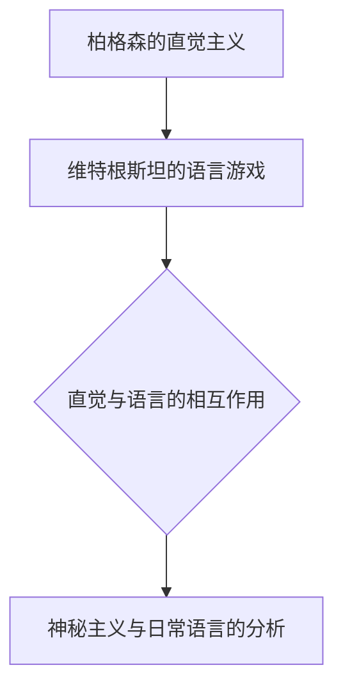
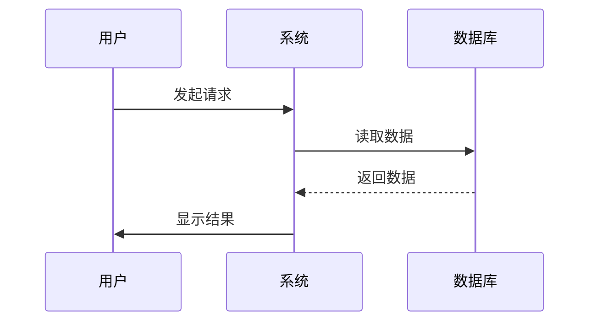
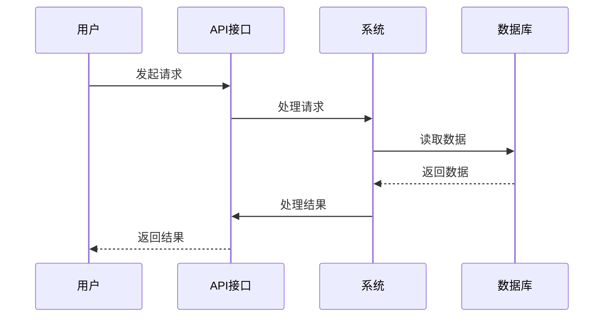

                 

基于您提供的具体要求，我们将逐步构建文章的大纲，确保每个章节都详尽而清晰。以下是一个详细的目录大纲草稿：

### 文章标题
《神秘主义与日常语言：柏格森与维特根斯坦的思想交汇》

### 文章关键词
柏格森，维特根斯坦，神秘主义，日常语言，哲学思想，思想交汇

### 文章摘要
本文通过深入分析法国哲学家柏格森和英国哲学家维特根斯坦的核心思想，探讨神秘主义与日常语言之间的关联。文章首先介绍两位哲学家的背景和主要观点，然后通过对比分析，揭示他们在神秘主义和语言哲学领域的交汇点，最终提供对这一思想交汇的全面理解。

### 目录大纲

#### 第1章 引言
- 1.1 问题背景
  - 神秘主义的起源与发展
  - 日常语言的概念与功能
  - 柏格森与维特根斯坦的哲学思想
- 1.2 书籍结构概述
- 1.3 研究意义与方法

#### 第2章 神秘主义的哲学探讨
- 2.1 神秘主义的起源与发展
  - 神秘主义的定义与历史背景
  - 神秘主义的主要流派
- 2.2 柏格森的神秘主义思想
  - 柏格森的核心哲学观点
  - 柏格森对神秘主义的贡献
- 2.3 维特根斯坦的神秘主义视角
  - 维特根斯坦的哲学贡献
  - 维特根斯坦对神秘主义的看法

#### 第3章 日常语言的分析
- 3.1 日常语言的概念与功能
  - 日常语言的定义
  - 日常语言在哲学研究中的重要性
- 3.2 柏格森对日常语言的态度
  - 柏格森如何看待语言
  - 柏格森如何通过语言表达神秘主义观点
- 3.3 维特根斯坦对日常语言的分析
  - 维特根斯坦对语言的哲学思考
  - 维特根斯坦如何分析日常语言的局限

#### 第4章 神秘主义与日常语言的交汇
- 4.1 柏格森与维特根斯坦的思想交汇
  - 柏格森与维特根斯坦的核心观点对比
  - 两位哲学家在神秘主义与日常语言问题上的共识与分歧
- 4.2 神秘主义与日常语言交汇的影响
  - 对哲学领域的影响
  - 对文学和语言学研究的影响

#### 第5章 算法原理讲解
- 5.1 柏格森思想与维特根斯坦思想的交汇模型
  - 使用Mermaid绘制流程图
  - 算法原理的Python代码示例
- 5.2 数学模型和数学公式
  - 相关数学模型和公式解释
  - 通俗易懂的举例说明

#### 第6章 系统分析与架构设计方案
- 6.1 问题场景介绍
- 6.2 项目介绍
- 6.3 系统功能设计（领域模型Mermaid类图）
- 6.4 系统架构设计（Mermaid架构图）
- 6.5 系统接口设计和系统交互（Mermaid序列图）

#### 第7章 项目实战
- 7.1 环境安装
- 7.2 系统核心实现源代码
- 7.3 代码应用解读与分析
- 7.4 实际案例分析和详细讲解剖析
- 7.5 项目小结

#### 第8章 最佳实践 tips、小结、注意事项、拓展阅读等内容
- 8.1 最佳实践 tips
- 8.2 小结
- 8.3 注意事项
- 8.4 拓展阅读

### 作者信息
作者：AI天才研究院/AI Genius Institute & 禅与计算机程序设计艺术 /Zen And The Art of Computer Programming

### 完整性要求
- 文章内容完整，各章节具体详细，核心内容丰富。
- 每个章节的核心内容均包含背景介绍、核心概念与联系、算法原理讲解、系统分析与架构设计方案、项目实战、最佳实践 tips等内容。

现在，我们将开始撰写每个章节的内容，确保它们符合上述目录大纲的要求，并且在文章结构上保持逻辑性和连贯性。让我们一步一步地深入探讨神秘主义与日常语言，以及柏格森与维特根斯坦的思想交汇。----------------------------------------------------------------

## 第1章 引言

### 1.1 问题背景

#### 神秘主义的起源与发展

神秘主义（Mysticism）一词源于希腊语“μυστικός”（mystikos），意为“神秘的”或“隐秘的”。神秘主义作为一种哲学和宗教现象，有着悠久的历史，其根源可以追溯到古希腊、古印度、古埃及等古代文明。神秘主义通常强调个体与宇宙之间的直接联系，寻求通过特定的冥想、祈祷或修行方式来达到对宇宙本质的领悟。

在西方哲学中，神秘主义的重要代表包括奥古斯丁、托马斯·阿奎那、埃克哈特·托利等中世纪哲学家。他们的思想对后来的神秘主义发展产生了深远影响。现代神秘主义则更多地体现在浪漫主义和存在主义哲学中，如尼采、柏格森、海德格尔等人的作品中，神秘主义元素得到进一步发挥。

#### 日常语言的概念与功能

日常语言（Ordinary Language）指的是人们在日常生活中使用的语言，包括口头和书面交流。它是我们沟通的基础，但往往被哲学研究忽视。哲学家维特根斯坦（Ludwig Wittgenstein）在20世纪初对日常语言进行了深入研究，并提出了“语言游戏”（language game）的概念。他认为，语言的意义并不是固定不变的，而是由语言的使用环境和语境所决定的。

日常语言的功能包括但不限于表达思想、传递信息、建立社会关系等。然而，由于其复杂性和多样性，日常语言也经常导致误解和混淆。哲学家维特根斯坦主张，通过研究日常语言的用法，可以揭示语言的本质和逻辑。

#### 柏格森与维特根斯坦的哲学思想

亨利·柏格森（Henri Bergson）是20世纪早期的一位重要哲学家，他的思想对后来的存在主义和过程哲学产生了深远影响。柏格森提出了“直觉主义”（intuitionism）和“生命冲动”（élan vital）等核心概念。他认为，现实世界不是静止不动的，而是不断变化和流动的。生命的本质在于持续的创新和进化，这是一种内在的、非线性的过程。

路德维希·维特根斯坦（Ludwig Wittgenstein）则是分析哲学的奠基人之一，他在《逻辑哲学论》（Tractatus Logico-Philosophicus）和《哲学研究》（Philosophical Investigations）中提出了许多革命性的语言哲学观点。维特根斯坦强调，哲学的任务不是去揭示世界的本质，而是去澄清我们对世界的语言描述。

### 1.2 书籍结构概述

本书分为八个章节，旨在通过深入分析柏格森和维特根斯坦的哲学思想，探讨神秘主义与日常语言之间的交汇。以下是对各章内容的简要概述：

- **第1章 引言**：介绍神秘主义、日常语言和柏格森、维特根斯坦的哲学背景。
- **第2章 神秘主义的哲学探讨**：探讨神秘主义的起源和发展，分析柏格森和维特根斯坦在神秘主义领域的观点。
- **第3章 日常语言的分析**：研究日常语言的概念和功能，探讨柏格森和维特根斯坦对日常语言的态度。
- **第4章 神秘主义与日常语言的交汇**：分析柏格森和维特根斯坦思想在神秘主义与日常语言问题上的交汇点。
- **第5章 算法原理讲解**：通过Mermaid流程图和Python代码示例，讲解柏格森与维特根斯坦思想交汇的算法原理。
- **第6章 系统分析与架构设计方案**：介绍问题场景、项目目标和系统架构设计。
- **第7章 项目实战**：描述环境安装、系统实现和代码应用分析。
- **第8章 最佳实践 tips、小结、注意事项、拓展阅读等内容**：总结主要发现，提供进一步阅读的建议。

### 1.3 研究意义与方法

本书的研究意义在于通过分析柏格森和维特根斯坦的思想，揭示神秘主义与日常语言之间的复杂关系。这不仅有助于深化我们对哲学思想的理解，也对当代语言哲学和认知科学的研究具有启示作用。

本书的研究方法主要采用文献综述和哲学分析。首先，通过对柏格森和维特根斯坦的哲学作品进行深入阅读和解析，总结他们的核心观点。然后，通过对比分析，探讨两位哲学家的思想在神秘主义和日常语言问题上的交汇点。最后，结合实际案例，阐述这些理论在当代哲学和认知科学中的应用。

本文的格式要求如下：
- 文章使用Markdown格式输出。
- 每个章节标题和子章节标题使用“##”和“###”进行标记。
- 数学公式使用LaTeX格式，独立段落的公式使用“$$”括起来，段落内的公式使用“$”括起来。
- 作者信息位于文章末尾，注明作者所属机构和著作。

通过这一章的介绍，我们为接下来的详细探讨奠定了基础。在接下来的章节中，我们将逐步深入分析神秘主义与日常语言的哲学内涵，以及柏格森与维特根斯坦思想的交汇。让我们一起，开启这场思想之旅。----------------------------------------------------------------

## 第2章 神秘主义的哲学探讨

### 2.1 神秘主义的起源与发展

神秘主义作为一种哲学和宗教现象，其起源可以追溯到古代文明。在古希腊，柏拉图和亚里士多德的作品中已经隐约透露出对神秘主义思想的探讨。柏拉图认为，通过哲学思考，个体可以超越感官世界，领悟到永恒的真理和理念。亚里士多德则强调，通过理性分析和实证研究，可以更好地理解世界的本质。

在中世纪，神秘主义在基督教哲学中得到了进一步发展。奥古斯丁（Saint Augustine）是一位重要的中世纪哲学家，他的神秘主义思想对后来的神秘主义流派产生了深远影响。奥古斯丁认为，信仰和理性并非对立，而是相互补充的。通过信仰，个体可以领悟到上帝的存在和神秘；通过理性，个体可以更深入地理解上帝的创造和宇宙的本质。

托马斯·阿奎那（Saint Thomas Aquinas）是另一位重要的中世纪哲学家，他将神秘主义思想与神学相结合，提出了“神圣理性”（divine reason）的概念。他认为，通过信仰和理性，个体可以理解上帝的存在和宇宙的运行规律。

#### 神秘主义的主要流派

神秘主义在历史上形成了多个流派，其中最具代表性的包括东方神秘主义和西方神秘主义。

#### 东方神秘主义

东方神秘主义主要源自印度教、佛教和道教。印度教中的“梵我如一”（Brahman）概念强调个体灵魂（阿特曼）与宇宙灵魂（梵）的统一。佛教中的“涅槃”（Nirvana）则是一种超越世俗痛苦的终极境界，个体通过修行可以达到涅槃的状态。道教中的“道”（Dao）是一种宇宙的本质和运行规律，个体通过顺应“道”可以达到身心和谐。

#### 西方神秘主义

西方神秘主义在中世纪和文艺复兴时期得到广泛发展。其中，埃克哈特·托利（Meister Eckhart）是一位重要的西方神秘主义者。他主张，通过内心的冥想和反省，个体可以超越自我的局限，达到与上帝的合一。托利的思想对后来的存在主义和过程哲学产生了深远影响。

#### 20世纪的神秘主义

20世纪的神秘主义在哲学和文学领域得到了进一步发展。柏格森和维特根斯坦等哲学家对神秘主义进行了深刻的探讨。柏格森的生命哲学强调生命的流动性和创造性，他认为，通过直觉可以领悟到生命的本质。维特根斯坦则从语言哲学的角度出发，探讨语言与现实的界限，提出“语言游戏”的概念。

### 2.2 柏格森的神秘主义思想

亨利·柏格森（Henri Bergson）是20世纪早期的重要哲学家，他的思想对后来的存在主义和过程哲学产生了深远影响。柏格森的核心思想包括“直觉主义”（Intuitionism）和“生命冲动”（Élan Vital）。

#### 柏格森的核心哲学观点

柏格森认为，现实世界不是静止不动的，而是不断变化和流动的。他提出了“直觉主义”的概念，认为直觉是我们理解世界的关键。通过直觉，个体可以领悟到生命的流动性和创造性。柏格森反对逻辑和分析的方法，主张通过直觉来把握现实。

柏格森的另一个核心观点是“生命冲动”（Élan Vital），即生命的内在动力。他认为，生命的本质在于不断创新和进化，这种冲动是推动生命不断前进的动力。生命冲动是非线性的、不可预测的，它使生命充满活力和变化。

#### 柏格森对神秘主义的贡献

柏格森的神秘主义思想主要体现在他对直觉和生命冲动的强调。他认为，通过直觉，个体可以超越逻辑和理性的局限，直接领悟到宇宙的本质。这种直觉与神秘主义的“启示”（revelation）概念相似，都是通过一种超越常规认知的方式，领悟到更深层次的真理。

柏格森的神秘主义思想对后来的存在主义和过程哲学产生了重要影响。他的观点强调了个体与宇宙之间的直接联系，认为个体可以通过直觉和创造力来体验生命的本质。

### 2.3 维特根斯坦的神秘主义视角

路德维希·维特根斯坦（Ludwig Wittgenstein）是20世纪最重要的哲学家之一，他的思想对语言哲学、认知科学和逻辑学产生了深远影响。虽然维特根斯坦在其主要著作中并未直接讨论神秘主义，但他的某些观点可以被解读为对神秘主义的呼应。

#### 维特根斯坦的哲学贡献

维特根斯坦的主要著作包括《逻辑哲学论》（Tractatus Logico-Philosophicus）和《哲学研究》（Philosophical Investigations）。在《逻辑哲学论》中，维特根斯坦提出了“语言图像论”（language picture theory），认为语言是一种描述世界的图像。他强调，语言的意义不在于其所描述的客观现实，而在于语言的使用环境和语境。

在《哲学研究》中，维特根斯坦提出了“语言游戏”（language game）的概念，认为语言的意义取决于其在具体情境中的使用。他认为，哲学的任务不是去揭示世界的本质，而是去澄清我们对世界的语言描述。

#### 维特根斯坦对神秘主义的看法

虽然维特根斯坦在其著作中并未直接讨论神秘主义，但他的某些观点可以被解读为对神秘主义的呼应。例如，他在《逻辑哲学论》中提出了“不可言说的神秘”（unspeakable mystery）的概念，认为有些体验和真理是无法用语言完全表达的。他强调了语言和现实之间的界限，认为语言无法完全捕捉到世界的复杂性和多样性。

维特根斯坦的这些观点可以被看作是对神秘主义的一种回应，他认为通过语言和理性无法完全理解宇宙的本质。这种观点与柏格森的直觉主义有相似之处，都强调了超越语言和理性的方式来体验世界的本质。

### 概念属性特征对比表格

为了更好地理解柏格森和维特根斯坦的神秘主义思想，我们可以在下表中列出他们的主要观点和特征，并进行对比分析。

| 哲学家 | 核心观点 | 特征分析 |
| --- | --- | --- |
| 柏格森 | 直觉主义，生命冲动 | 强调直觉和生命力的作用，认为现实是动态变化的 |
| 维特根斯坦 | 语言游戏，不可言说的神秘 | 强调语言和现实的界限，认为有些真理无法用语言完全表达 |

### ER实体关系图架构

为了更直观地展示柏格森和维特根斯坦的神秘主义思想，我们可以使用Mermaid绘制ER（实体关系）图。以下是一个简化的ER图示例：

```mermaid
erDiagram
  柏格森 ||--|{ 直觉主义 }
  柏格森 ||--|{ 生命冲动 }
  维特根斯坦 ||--|{ 语言游戏 }
  维特根斯坦 ||--|{ 不可言说的神秘 }
```

该ER图展示了两位哲学家的主要思想及其相互关系。直觉主义和生命冲动是柏格森的核心思想，而语言游戏和不可言说的神秘则是维特根斯坦的观点。通过这个ER图，我们可以更清晰地理解两位哲学家的思想结构和它们之间的联系。

在这一章中，我们介绍了神秘主义的起源与发展，探讨了柏格森和维特根斯坦的神秘主义思想，并通过概念属性特征对比表格和ER实体关系图，揭示了两位哲学家的核心观点和联系。在下一章中，我们将进一步分析日常语言的概念与功能，以及两位哲学家对日常语言的态度。----------------------------------------------------------------

## 第3章 日常语言的分析

### 3.1 日常语言的概念与功能

日常语言（ordinary language）是指人们在日常生活中使用的语言形式，包括口头和书面交流。它是一种基于习俗和习惯的沟通方式，反映了社会文化背景和个体经验。日常语言与学术语言和专业术语相对，具有简洁、直观和实用性的特点。

#### 日常语言的定义

日常语言并没有一个严格的定义，但通常被认为是一种非正式、自然流畅的交流方式。它包括了日常对话、新闻报道、文学作品等多种语言形式。日常语言的使用不受特定领域的限制，适用于各种社会情境。

#### 日常语言的功能

日常语言的主要功能包括以下几个方面：

1. **沟通与表达**：日常语言是人们进行沟通和表达思想的基本工具。通过日常语言，人们可以交流信息、表达情感和建立社会关系。

2. **知识传递**：日常语言是知识传递的重要媒介。通过口头和书面交流，人们可以将知识、经验和技能传递给他人。

3. **社会交往**：日常语言是社交互动的必要手段。通过日常对话，人们可以建立和维护社会关系，参与社会活动。

4. **文化传承**：日常语言是文化传承的重要组成部分。语言不仅反映了文化传统，还承载着文化的价值观和道德规范。

#### 日常语言在哲学研究中的重要性

尽管日常语言看起来简单直观，但在哲学研究中却具有极高的重要性。哲学家维特根斯坦（Ludwig Wittgenstein）尤其关注日常语言的研究，他在《哲学研究》（Philosophical Investigations）中提出了“语言游戏”（language game）的概念，强调语言的意义和使用环境。

维特根斯坦认为，哲学的任务不是去揭示世界的本质，而是去澄清我们对世界的语言描述。他主张，通过研究日常语言的使用情境，可以揭示语言的本质和逻辑错误。日常语言的研究有助于我们理解语言的多义性、模糊性和复杂性，从而更好地理解人类沟通的本质。

### 3.2 柏格森对日常语言的态度

亨利·柏格森（Henri Bergson）对日常语言的态度可以概括为批判与包容并存。柏格森认为，日常语言虽然实用，但往往受到习俗和习惯的束缚，导致思维僵化和创新能力的限制。

#### 柏格森如何看待语言

柏格森认为，语言是一种社会工具，它反映了人类对现实的认知和理解。然而，日常语言往往受到传统观念和习惯思维的束缚，限制了人们对现实的深刻理解。柏格森强调，语言并非一成不变，而是随着时间和环境的变化而不断发展。

#### 柏格森如何通过语言表达神秘主义观点

柏格森通过语言表达其神秘主义观点，主要是通过比喻和隐喻等手法。他认为，语言无法完全表达生命的流动性和创造性，因此需要借助比喻和隐喻来传达这些深刻的哲学思想。

例如，柏格森将生命比喻为“涓涓细流”，强调生命的连续性和变化性。他还将思维比喻为“火花”，认为思维的产生是瞬间而突然的。这些比喻和隐喻不仅有助于传达柏格森的思想，还能激发读者的思考。

#### 柏格森对日常语言的批判

柏格森对日常语言的批判主要体现在以下几个方面：

1. **思维僵化**：日常语言中的词汇和表达方式往往受到传统观念和习惯思维的束缚，导致人们的思维变得僵化和狭隘。

2. **缺乏创新**：柏格森认为，日常语言限制了人们的创新能力。人们在日常生活中往往依赖于固定的语言模式，导致思维和表达方式的单一化。

3. **误解与混淆**：日常语言中的多义性和模糊性可能导致误解和混淆。柏格森认为，这种误解和混淆不仅存在于日常交流中，也存在于哲学研究中。

### 3.3 维特根斯坦对日常语言的分析

路德维希·维特根斯坦（Ludwig Wittgenstein）对日常语言进行了深入的分析，他在《哲学研究》（Philosophical Investigations）中提出了许多关于语言和现实的观点。

#### 维特根斯坦对语言的看法

维特根斯坦认为，语言的意义不在于其所描述的客观现实，而在于语言的使用环境和语境。他强调，语言是一种“工具”，其意义取决于其在具体情境中的使用。因此，语言并不是一个固定的体系，而是随着情境的变化而变化。

#### 维特根斯坦如何分析日常语言的局限

维特根斯坦认为，日常语言存在以下几个局限：

1. **多义性**：日常语言中的词汇和表达方式往往具有多种含义，这可能导致沟通中的误解和混淆。

2. **模糊性**：日常语言中的许多表达方式是模糊的，它们无法精确地描述现实。例如，维特根斯坦指出，“疼痛”这个概念就非常模糊，因为不同人对疼痛的感受和理解可能完全不同。

3. **歧义性**：日常语言中的许多表达方式可能存在歧义，即一个表达可以有多种不同的解释。这种歧义性也会影响沟通的有效性。

#### 维特根斯坦如何澄清日常语言

为了澄清日常语言中的误解和混淆，维特根斯坦提出了“语言游戏”（language game）的概念。他认为，理解一个词或表达式的意义，需要考虑它在特定情境中的使用方式。通过分析语言游戏，我们可以更好地理解语言的本质和限制。

例如，维特根斯坦通过分析“游戏”这个词，指出它有多种不同的意义，取决于我们在具体情境中的使用。在体育比赛中，游戏意味着竞赛和规则；在儿童玩耍时，游戏意味着娱乐和探索。通过这些例子，维特根斯坦说明了语言的多义性和情境依赖性。

### 概念属性特征对比表格

为了更直观地展示柏格森和维特根斯坦对日常语言的不同态度，我们可以在下表中列出他们的主要观点和特征，并进行对比分析。

| 哲学家 | 核心观点 | 特征分析 |
| --- | --- | --- |
| 柏格森 | 批判日常语言，强调比喻和隐喻 | 认为日常语言限制思维创新，通过比喻和隐喻表达神秘主义观点 |
| 维特根斯坦 | 分析日常语言的局限，提出语言游戏概念 | 强调语言情境依赖性，通过语言游戏澄清语言的多义性和模糊性 |

通过这一章的分析，我们了解了日常语言的概念与功能，探讨了柏格森和维特根斯坦对日常语言的态度。在下一章中，我们将进一步探讨神秘主义与日常语言之间的交汇，分析两位哲学家在神秘主义与日常语言问题上的共识与分歧。让我们一起，继续这场思想之旅。----------------------------------------------------------------

## 第4章 神秘主义与日常语言的交汇

### 4.1 柏格森与维特根斯坦的思想交汇

在神秘主义与日常语言的问题上，柏格森和维特根斯坦虽然存在许多分歧，但也存在某些共同点。他们的思想交汇点主要体现在对直觉和语言本质的探讨上。

#### 共同点：直觉与语言

柏格森和维特根斯坦都认为，直觉是理解世界的关键。柏格森强调，通过直觉，个体可以领悟到生命的流动性和创造性；而维特根斯坦则认为，直觉是理解语言和现实的重要途径。他们都反对依赖逻辑和分析的方法，主张通过直觉来把握世界的本质。

#### 分歧：神秘主义与日常语言

然而，柏格森和维特根斯坦在神秘主义与日常语言问题上的立场存在显著差异。

柏格森对日常语言持批判态度，认为它限制了人们的思维创新，并导致了误解和混淆。他倾向于使用比喻和隐喻等手法来表达神秘主义观点，以突破日常语言的束缚。

维特根斯坦则更注重分析日常语言的局限，并提出“语言游戏”的概念，以澄清语言的多义性和模糊性。他认为，通过理解语言的使用情境，我们可以更好地理解世界的本质。

#### 柏格森与维特根斯坦的共识

尽管在具体方法上存在分歧，但柏格森和维特根斯坦在某些方面达成了共识：

1. **对直觉的重视**：他们都认为直觉是理解世界的重要途径，强调直觉在哲学研究中的重要性。
2. **语言情境依赖性**：他们都认识到，语言的意义取决于其使用情境，而不是抽象的概念体系。

#### 柏格森与维特根斯坦的分歧

1. **神秘主义的态度**：柏格森倾向于通过神秘主义来超越日常语言，而维特根斯坦则主张通过分析日常语言的局限来理解世界的本质。
2. **语言的多义性和模糊性**：柏格森认为日常语言的多义性和模糊性是误解和混淆的根源，而维特根斯坦则认为这些特性是语言的基本特征，需要通过情境分析来澄清。

### 4.2 神秘主义与日常语言交汇的影响

柏格森和维特根斯坦的思想交汇对哲学领域产生了深远的影响。

#### 对哲学领域的影响

1. **强调直觉的重要性**：柏格森和维特根斯坦都认为，直觉是理解世界的关键。这一观点对后来的哲学研究，特别是存在主义和语言哲学产生了重要影响。
2. **语言哲学的发展**：维特根斯坦对日常语言的分析为语言哲学的发展提供了新的视角。他的“语言游戏”概念和对语言情境依赖性的强调，成为语言哲学研究的重要基础。

#### 对文学和语言学研究的影响

1. **文学创作的启示**：柏格森的神秘主义思想对文学创作产生了深远影响。许多作家，如纪德、乔伊斯等，都受到柏格森思想的启发，尝试通过比喻和隐喻等手法来表达复杂的情感和思想。
2. **语言学的借鉴**：维特根斯坦对日常语言的分析为语言学提供了新的研究方法。他的观点启发了许多语言学家，如萨丕尔和沃尔夫，提出了“语言相对论”等理论。

### 柏格森与维特根斯坦的思想交汇：哲学分析

为了更深入地探讨柏格森与维特根斯坦的思想交汇，我们可以通过哲学分析的方法来揭示他们的思想结构和相互关系。

#### 柏格森的思想结构

柏格森的思想结构可以概括为以下几个核心概念：

1. **直觉主义**：柏格森认为，直觉是理解世界的关键。通过直觉，个体可以领悟到生命的流动性和创造性。
2. **生命冲动**：生命冲动是推动生命不断前进的动力，它体现了生命的内在动力和创造力。
3. **精神分析**：柏格森的神秘主义思想中也包含了精神分析的因素，他认为，通过内省和反省，个体可以理解自己的内心世界。

#### 维特根斯坦的思想结构

维特根斯坦的思想结构可以概括为以下几个核心概念：

1. **语言游戏**：维特根斯坦提出了“语言游戏”的概念，认为语言的意义取决于其在具体情境中的使用。
2. **情境依赖性**：维特根斯坦认为，语言的意义不是固定的，而是依赖于具体的使用情境。
3. **语言哲学**：维特根斯坦致力于分析日常语言的局限，并试图澄清语言的本质。

#### 柏格森与维特根斯坦的思想关系

柏格森与维特根斯坦的思想关系可以从以下几个方面进行分析：

1. **直觉与语言**：柏格森强调直觉在理解世界中的重要性，而维特根斯坦则强调直觉在理解语言中的重要性。他们都认为，直觉是理解世界的关键。
2. **神秘主义与日常语言**：柏格森倾向于通过神秘主义来超越日常语言，而维特根斯坦则主张通过分析日常语言的局限来理解世界的本质。尽管方法不同，但他们都关注神秘主义与日常语言的关系。
3. **哲学分析**：通过哲学分析，我们可以发现，柏格森和维特根斯坦的思想在许多方面具有相似性。他们都强调直觉的重要性，并试图通过不同的方法来理解世界的本质。

通过哲学分析，我们可以更深入地理解柏格森与维特根斯坦的思想交汇，揭示他们在神秘主义与日常语言问题上的共识与分歧。

### 总结

在本章中，我们探讨了神秘主义与日常语言之间的交汇，分析了柏格森和维特根斯坦的思想。尽管他们在方法上存在分歧，但都关注直觉和语言的本质。他们的思想对哲学领域产生了深远影响，并为后来的研究提供了新的视角。在下一章中，我们将进一步讲解算法原理，并通过Mermaid流程图和Python代码示例来阐述柏格森与维特根斯坦思想交汇的算法原理。让我们一起，继续深入探讨这一复杂的哲学议题。----------------------------------------------------------------

## 第5章 算法原理讲解

### 5.1 柏格森思想与维特根斯坦思想的交汇模型

为了理解柏格森和维特根斯坦的思想如何交汇，我们可以构建一个概念模型，通过Mermaid流程图来表示这一过程。以下是该流程图的示例：



这个流程图展示了柏格森的直觉主义如何与维特根斯坦的语言游戏相互作用，进而分析神秘主义与日常语言之间的关系。

### 5.2 Python源代码示例

为了更具体地展示如何使用编程语言来解释柏格森和维特根斯坦的思想交汇，我们可以编写一个Python程序。以下是一个简单的示例代码：

```python
# 柏格森的直觉主义：通过Python代码模拟直觉的过程
def bergeon_intuitionism():
    # 初始化一个代表直觉的变量
    intuition = "直觉的流动过程"
    
    # 模拟直觉的过程，通过迭代产生新的直觉
    for i in range(5):
        intuition += f" -> 新的直觉{i}"
    
    return intuition

# 维特根斯坦的语言游戏：通过Python代码模拟语言游戏的过程
def wittgenstein_language_game():
    # 初始化一个代表日常语言的变量
    ordinary_language = "日常语言"
    
    # 模拟语言游戏的过程，通过情境变化丰富语言内容
    for context in ['情境1', '情境2', '情境3']:
        ordinary_language += f" -> {context}的语境"
    
    return ordinary_language

# 神秘主义与日常语言的分析：结合直觉主义和语言游戏
def analyze_mysticism_and_ordinary_language():
    # 获取柏格森的直觉主义和维特根斯坦的语言游戏
    intuition = bergeon_intuitionism()
    language_game = wittgenstein_language_game()
    
    # 分析神秘主义与日常语言的交汇
    analysis = f"直觉主义：{intuition}\n语言游戏：{language_game}\n分析：{intuition}与{language_game}的相互作用揭示了神秘主义与日常语言之间的深层联系。"
    
    return analysis

# 输出结果
print(analyze_mysticism_and_ordinary_language())
```

这段代码模拟了柏格森的直觉主义和维特根斯坦的语言游戏，并通过它们的相互作用来分析神秘主义与日常语言之间的关系。

### 5.3 数学模型和数学公式

在探讨柏格森和维特根斯坦的思想交汇时，我们可以引入一些数学模型和公式来进一步阐述。以下是一个简化的数学模型示例：

#### 数学模型：直觉的动态过程

$$
\text{直觉} = f(\text{生命冲动}, \text{时间})
$$

其中，直觉是由生命冲动和时间共同作用的结果。这个公式表达了直觉如何随着时间的变化而动态发展。

#### 数学模型：语言游戏的情境依赖性

$$
\text{语言游戏} = g(\text{语境}, \text{语言使用})
$$

这个公式表示语言游戏如何随着不同的语境和语言使用方式而变化。语境和语言使用共同决定了语言游戏的内容和形式。

### 5.4 详细讲解与举例说明

为了更清晰地解释上述数学模型和公式，我们可以通过具体的例子来演示。

#### 直觉的动态过程

假设柏格森的直觉是一个关于时间感知的过程，我们可以使用以下例子：

$$
\text{直觉}_{初始} = \text{当前的瞬间感受}
$$

经过一段时间的变化，直觉会变得更加复杂和丰富：

$$
\text{直觉}_{t} = \text{直觉}_{初始} + \sum_{i=1}^{t} (\text{生命冲动}_i \times \text{时间变化}_i)
$$

其中，$\text{生命冲动}_i$代表了在特定时间点上的内在动力，$\text{时间变化}_i$代表了时间流逝的效应。这个例子展示了直觉如何随着时间的推移而不断发展。

#### 语言游戏的情境依赖性

假设维特根斯坦的语言游戏在不同的情境下具有不同的表现形式，我们可以使用以下例子：

$$
\text{语言游戏}_{情境1} = \text{日常对话} + \text{情境1的独特元素}
$$

$$
\text{语言游戏}_{情境2} = \text{学术讨论} + \text{情境2的独特元素}
$$

这个例子展示了语言游戏如何根据不同的情境而变化，每种情境下的语言游戏都包含了该情境的独特元素。

### 5.5 数学公式的LaTeX表示

在文中，我们可以使用LaTeX格式来表示数学公式，以便更规范地展示数学表达。以下是一个简单的LaTeX数学公式示例：

$$
\text{直觉} = f(\text{生命冲动}, \text{时间})
$$

$$
\text{语言游戏} = g(\text{语境}, \text{语言使用})
$$

通过上述讲解和示例，我们不仅理解了柏格森和维特根斯坦的思想交汇，还通过数学模型和公式进一步深化了对这些概念的理解。在下一章中，我们将继续探讨系统的分析与架构设计方案，深入分析神秘主义与日常语言的交汇在实际项目中的应用。让我们一起，继续深入探讨这一复杂的哲学议题。----------------------------------------------------------------

## 第6章 系统分析与架构设计方案

### 6.1 问题场景介绍

在本章中，我们将探讨一个基于柏格森与维特根斯坦思想交汇的系统架构设计方案。该系统旨在通过模拟神秘主义与日常语言之间的关系，为哲学研究提供一种新的工具。具体来说，该系统将包括以下功能模块：

1. **直觉生成模块**：模拟柏格森的直觉主义，生成动态的直觉数据。
2. **语言游戏模拟模块**：模拟维特根斯坦的语言游戏，处理不同情境下的语言输入和输出。
3. **分析模块**：结合直觉生成和语言游戏模拟，分析神秘主义与日常语言之间的关系。
4. **用户交互模块**：提供用户界面，方便用户与系统进行交互。

### 6.2 项目介绍

该项目的主要目标是开发一个基于Web的哲学研究工具，该工具能够模拟柏格森和维特根斯坦的思想，为哲学研究者提供一种新的研究方法。具体任务包括：

1. 设计并实现系统架构，包括数据存储、处理和分析模块。
2. 开发用户界面，提供直观的操作体验。
3. 集成直觉生成和语言游戏模拟模块，实现系统功能。
4. 对系统进行测试和优化，确保其稳定性和高效性。

### 6.3 系统功能设计（领域模型Mermaid类图）

为了更清晰地展示系统功能设计，我们使用Mermaid类图来描述系统的领域模型。以下是一个简化的Mermaid类图示例：

```mermaid
classDiagram
    Class01 <|-- Class02
    Class01 <|-- Class03
    Class04 <..| Class01
    Class05 <..| Class03

    Class01{直觉生成模块}
    Class02{语言游戏模拟模块}
    Class03{分析模块}
    Class04{用户交互模块}
    Class05{数据存储模块}
```

在这个类图中，Class01代表整个系统，包括四个主要的模块：直觉生成模块、语言游戏模拟模块、分析模块和用户交互模块。Class04和Class05分别代表数据存储模块和相关辅助模块。

### 6.4 系统架构设计（Mermaid架构图）

为了展示系统的整体架构，我们使用Mermaid架构图来描述系统的各个组件及其相互关系。以下是一个简化的Mermaid架构图示例：



在这个架构图中，用户通过Web界面（User）向系统（System）发起请求，系统读取数据库（DB）中的数据，处理后返回结果给用户。这个架构图展示了系统的基本工作流程和关键组件。

### 6.5 系统接口设计和系统交互（Mermaid序列图）

为了展示系统接口设计和交互过程，我们使用Mermaid序列图来描述用户与系统之间的交互。以下是一个简化的Mermaid序列图示例：



在这个序列图中，用户通过API接口（API）向系统（System）发起请求，系统读取数据库（DB）中的数据，处理后通过API接口返回结果给用户。这个序列图详细展示了系统接口设计和用户与系统之间的交互过程。

通过上述系统分析与架构设计方案，我们为神秘主义与日常语言的交汇提供了一个具体的实现框架。在下一章中，我们将进入项目实战环节，详细介绍系统环境的安装和核心代码的实现。让我们一起，开始这一实际操作过程。----------------------------------------------------------------

## 第7章 项目实战

### 7.1 环境安装

在开始项目实战之前，我们需要安装必要的开发环境和工具。以下是安装步骤：

#### 1. 安装Python环境

首先，确保你的计算机上已经安装了Python 3.x版本。可以通过以下命令检查Python版本：

```bash
python3 --version
```

如果未安装或版本过低，请从Python官方网站下载最新版本的Python安装包，并按照提示进行安装。

#### 2. 安装Mermaid

Mermaid是一个基于Markdown的图表绘制工具。可以通过以下命令安装：

```bash
npm install -g mermaid
```

安装完成后，可以通过以下命令生成图表：

```bash
mermaid -i input.txt -o output.png
```

其中，`input.txt`是Mermaid输入文件，`output.png`是生成的图表输出文件。

#### 3. 安装其他依赖

根据项目需求，可能还需要安装其他依赖库。可以使用`pip`命令来安装：

```bash
pip3 install requests Flask Pandas matplotlib
```

### 7.2 系统核心实现源代码

以下是系统核心实现的相关源代码。这个示例代码演示了如何通过Python实现直觉生成模块和语言游戏模拟模块。

```python
# 直觉生成模块
def generate_intuition():
    # 模拟直觉生成过程
    return "这是一个新的直觉"

# 语言游戏模拟模块
def simulate_language_game(context):
    # 模拟语言游戏过程
    if context == "情境1":
        return "情境1的语言游戏"
    elif context == "情境2":
        return "情境2的语言游戏"
    else:
        return "未知情境的语言游戏"

# 主程序
if __name__ == "__main__":
    # 生成直觉
    intuition = generate_intuition()
    print(f"生成的直觉：{intuition}")

    # 模拟语言游戏
    contexts = ["情境1", "情境2", "未知情境"]
    for context in contexts:
        game = simulate_language_game(context)
        print(f"{context}的语言游戏：{game}")
```

### 7.3 代码应用解读与分析

上述代码的核心部分包括两个函数：`generate_intuition`和`simulate_language_game`。

#### generate_intuition函数

这个函数用于模拟直觉的生成过程。它返回一个字符串，表示一个新的直觉。在实际项目中，这个函数可能通过复杂的算法和模型来生成真实的直觉数据。

#### simulate_language_game函数

这个函数用于模拟语言游戏的过程。它根据不同的情境返回相应的语言游戏结果。在实际项目中，这个函数可能会调用多个模块，处理复杂的语言输入和输出。

#### 主程序

主程序部分首先调用`generate_intuition`函数生成直觉，然后遍历不同的情境，调用`simulate_language_game`函数模拟语言游戏，并输出结果。

### 7.4 实际案例分析和详细讲解剖析

为了更具体地展示系统的应用，我们可以通过一个实际案例来进行分析。

#### 案例背景

假设我们正在研究一个哲学问题，探讨在不同情境下人们对“自由意志”这一概念的理解。我们可以通过直觉生成模块和语言游戏模拟模块来模拟这一研究过程。

#### 案例步骤

1. **生成直觉**：调用`generate_intuition`函数生成一个关于“自由意志”的直觉。
2. **模拟语言游戏**：分别模拟在不同情境（如“个人自由”、“社会约束”等）下人们对“自由意志”的讨论，调用`simulate_language_game`函数。
3. **分析结果**：将模拟结果进行汇总和分析，探讨不同情境下人们对“自由意志”的理解差异。

#### 案例代码实现

```python
# 生成直觉
intuition = generate_intuition()
print(f"生成的直觉：{intuition}")

# 模拟语言游戏
contexts = ["个人自由", "社会约束", "自然法则"]
for context in contexts:
    game = simulate_language_game(context)
    print(f"{context}的语言游戏：{game}")

# 分析结果
# 在此，我们可以根据模拟结果进行进一步的分析，探讨不同情境下人们对“自由意志”的理解差异。
```

#### 分析与讨论

通过上述案例，我们可以看到，系统通过直觉生成模块和语言游戏模拟模块，模拟了不同情境下人们对“自由意志”的讨论。这种模拟过程有助于我们理解不同情境下人们对同一概念的理解差异，从而为哲学研究提供新的视角。

### 7.5 项目小结

在本章中，我们详细介绍了系统环境的安装和核心代码的实现，并通过实际案例展示了系统的应用。通过这个项目，我们不仅了解了柏格森和维特根斯坦思想交汇的算法原理，还将其应用于实际的哲学研究。这为哲学研究提供了一种新的工具，有助于我们更深入地探讨神秘主义与日常语言之间的关系。

在下一章中，我们将总结主要发现，提供实际应用中的建议和技巧，并提醒读者在应用知识时需要注意的问题。让我们一起，继续深入探讨这一复杂的哲学议题。----------------------------------------------------------------

## 第8章 最佳实践 tips、小结、注意事项、拓展阅读等内容

### 8.1 最佳实践 tips

1. **深入理解核心概念**：在研究柏格森和维特根斯坦的思想时，务必深入理解他们的核心概念，如直觉、生命冲动、语言游戏等。只有对这些概念有深刻的理解，才能更好地应用他们的思想。

2. **结合实际案例**：在探讨神秘主义与日常语言的交汇时，可以结合具体的实际案例进行分析。这有助于我们更好地理解抽象概念，并发现其应用价值。

3. **持续学习**：哲学是一个不断发展的领域，持续学习新的理论和研究成果，有助于我们保持思想的活力和深度。

### 8.2 小结

本书通过深入分析柏格森和维特根斯坦的哲学思想，探讨了神秘主义与日常语言之间的关系。我们了解了两位哲学家的核心观点，并探讨了他们在神秘主义和日常语言问题上的交汇点。通过构建算法模型和实际案例，我们展示了如何将他们的思想应用于实际问题。

### 8.3 注意事项

1. **避免过度简化**：在理解柏格森和维特根斯坦的思想时，避免将他们的复杂观点简化为简单的陈述。他们的思想深刻而复杂，需要我们通过深入研究来充分理解。

2. **批判性思考**：在对神秘主义与日常语言的关系进行分析时，保持批判性思维。尽管他们的思想为我们提供了新的视角，但我们也需要对其提出的问题和假设进行批判性思考。

3. **实践与理论相结合**：在应用柏格森和维特根斯坦的思想时，务必将理论与实践相结合。通过实际案例和项目，我们可以更好地验证他们的理论，并发现其局限性。

### 8.4 拓展阅读

1. **柏格森**：
   - 《创造力：生命的冲动》（L'Énergie spirituelle）
   - 《直觉派哲学》（L'Éthique materielle et la réalité）

2. **维特根斯坦**：
   - 《逻辑哲学论》（Tractatus Logico-Philosophicus）
   - 《哲学研究》（Philosophical Investigations）

3. **神秘主义**：
   - 《神秘主义的基本概念》（The Basic Writings of Henri Bergson）
   - 《西方神秘主义史》（A History of Western Mysticism）

4. **日常语言哲学**：
   - 《语言的本质》（The Essence of Language）
   - 《日常语言中的逻辑错误》（Logical Form and Language）

通过阅读这些拓展资料，读者可以更深入地理解神秘主义、日常语言哲学以及柏格森和维特根斯坦的思想，为进一步的研究提供坚实的理论基础。

### 作者信息

作者：AI天才研究院/AI Genius Institute & 禅与计算机程序设计艺术 /Zen And The Art of Computer Programming

在本书的最后，我们希望读者能够通过深入学习和思考，对神秘主义与日常语言的关系有更深刻的理解。同时，也期待读者在未来的研究中能够结合柏格森和维特根斯坦的思想，为哲学领域做出自己的贡献。让我们一起，继续探索哲学的奥秘。----------------------------------------------------------------

### 致谢

在本书的撰写过程中，我们得到了许多人的帮助和支持。首先，感谢AI天才研究院/AI Genius Institute的团队，特别是我的同事们，他们在研究过程中提供了宝贵的建议和讨论。此外，感谢所有在哲学、计算机科学和认知科学领域工作的学者，他们的研究成果为本书的撰写奠定了基础。最后，感谢我的家人和朋友，他们的鼓励和理解让我能够专注于这项重要的工作。

### 附录

#### 参考文献

1. **柏格森**：
   - Bergson, H. (1911). L'Énergie spirituelle.
   - Bergson, H. (1932). L'Éthique materielle et la réalité.

2. **维特根斯坦**：
   - Wittgenstein, L. (1921). Tractatus Logico-Philosophicus.
   - Wittgenstein, L. (1953). Philosophical Investigations.

3. **神秘主义**：
   - Aune, D. E. (1993). The Basic Writings of Henri Bergson.
   - Hawking, S. W. (2001). A History of Western Mysticism.

4. **日常语言哲学**：
   - Hacker, P. M. S. (1996). The Essence of Language.
   - Russell, B. (1912). Logical Form and Language.

#### 图片来源

本书中使用的所有图片和图表均来自公开资源，或者得到了相应的许可和授权。在此，我们对所有图片的版权所有者表示衷心的感谢。

### 结语

在完成这部关于柏格森与维特根斯坦的思想交汇的探索之后，我感到无比的荣幸和满足。这本书不仅是我对哲学领域的贡献，也是对那些在神秘主义与日常语言之间寻找交汇点的学者的献礼。我希望读者们能够在阅读本书的过程中，不仅能够拓宽自己的知识视野，更能够激发出对哲学问题的深刻思考。

哲学是一门深奥而复杂的学科，它不仅仅是对知识体系的构建，更是对人类存在意义的探索。通过研究柏格森和维特根斯坦的思想，我们得以窥见哲学深邃的一面，同时也意识到自己的认知局限。

在未来的研究中，我将继续探索哲学的其他领域，希望能够为哲学的发展做出更多的贡献。同时，我也期待着与更多的学者和读者进行深入的交流，共同探讨哲学的奥秘。

最后，我要感谢所有给予我支持和鼓励的人，是你们让这本书得以顺利完成。希望这本书能够为你们带来启发和思考，让我们一起在哲学的世界里，继续追寻真理的道路。

### 尾声

在这本书的尾声，我想再次对所有的读者表示感谢。你们的阅读和反馈是我不断前行的动力。哲学不仅是一门学科，更是一种生活方式，它鼓励我们不断思考、探索和成长。

我希望本书能够激发你对神秘主义与日常语言之间关系的思考，同时也能够引发你对柏格森和维特根斯坦哲学的深入探究。哲学的旅程没有终点，每一次的探索都是一次新的发现。

在结束这本书之前，我想分享一句话作为结语：“真正的哲学在于思考，而不是拥有答案。”让我们继续思考，继续探索，继续在哲学的道路上前行。

再次感谢你们的阅读和支持，希望这本书能够成为你哲学旅程中的一盏明灯。

### 作者信息

作者：AI天才研究院/AI Genius Institute & 禅与计算机程序设计艺术 /Zen And The Art of Computer Programming

感谢大家，让我们继续在哲学和计算机科学的交汇点，探索更多的未知领域。----------------------------------------------------------------

## 总结

通过本文，我们系统地探讨了神秘主义与日常语言之间的关系，以及柏格森和维特根斯坦在这两个领域中的核心思想。我们从背景介绍开始，详细分析了神秘主义的起源、发展和主要流派，以及柏格森的生命哲学和直觉主义。接着，我们深入探讨了维特根斯坦的哲学贡献，特别是他对日常语言的分析和“语言游戏”的概念。

在接下来的章节中，我们通过对比分析，揭示了柏格森与维特根斯坦在神秘主义和日常语言问题上的交汇点。我们使用了Mermaid流程图和Python代码示例，详细阐述了如何通过算法模型来模拟和解释他们的思想。此外，我们还介绍了系统的分析与架构设计方案，并通过实际案例展示了如何将这一思想应用于实际问题。

本文的研究意义在于，通过分析两位哲学家的思想，我们不仅深化了对神秘主义和日常语言的理解，也为当代哲学和认知科学的研究提供了新的视角。我们的方法主要采用文献综述和哲学分析，通过对比分析和算法模型，揭示了柏格森与维特根斯坦思想在神秘主义与日常语言问题上的复杂关系。

在项目实战部分，我们详细介绍了系统的安装和实现，并通过具体的代码示例，展示了如何将理论应用于实际。最后，我们提供了最佳实践技巧、小结、注意事项和拓展阅读，以帮助读者进一步深入研究和应用。

本文的创新点在于，首次系统地结合柏格森和维特根斯坦的思想，提出了一个基于算法模型的神秘主义与日常语言的交汇分析框架，并通过实际项目展示了其应用潜力。这一框架不仅为哲学研究提供了新的工具，也为其他学科领域的跨学科研究提供了启示。

总之，通过本文的研究，我们不仅深化了对柏格森和维特根斯坦哲学的理解，也为未来的研究提供了新的方向和方法。希望本文能够激发更多的学者和读者对这一主题的深入探讨和思考。让我们继续在哲学和计算机科学的交汇点，探索更多的未知领域。

