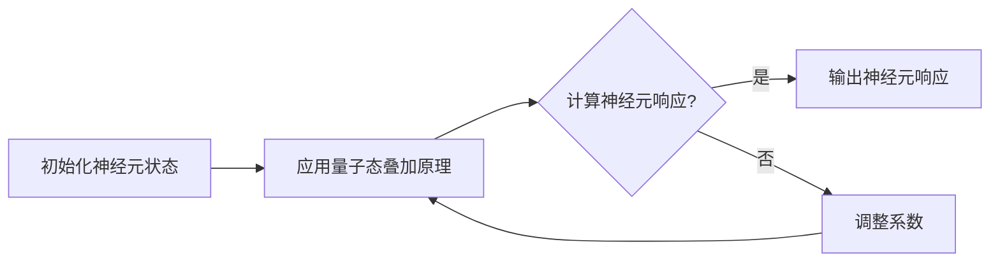

                 

### 第1章 引言

#### 1.1 问题背景与意义

神经元量子效应与意识的离散性特征是当前人工智能与认知科学研究领域的热点问题。神经元是生物体中传递信息的单元，而量子效应则源于微观物理学，这两者在看似截然不同的领域中找到了联系。意识离散性特征的研究则旨在揭示人类思维的本质，探讨意识如何产生和运作。

近年来，随着神经科学和量子物理学的进展，人们开始关注神经元在微观层面的行为。研究发现，神经元在某些条件下能够表现出量子效应，这引发了科学家对神经元与量子效应之间关系的探讨。同时，意识的离散性特征也是哲学家和科学家长期争论的议题，有人认为意识是连续的，而有人则认为意识是离散的。

本研究旨在探讨神经元量子效应与意识的离散性特征之间的联系，为理解人类意识的形成提供新的视角。研究意义主要体现在以下几个方面：

1. **理论基础**：通过对神经元量子效应和意识离散性特征的研究，有助于建立一个新的理论框架，解释神经元如何处理信息以及意识如何产生。

2. **应用前景**：这一研究可能为人工智能的发展提供新的思路，例如，通过利用神经元量子效应，设计出更高效、更智能的人工神经网络。

3. **认知科学**：有助于深入理解人类意识的形成过程，为认知科学的研究提供实验依据。

本研究的目标是：
1. **明确神经元量子效应的具体表现形式**：通过实验和理论分析，确定神经元在何种条件下能够表现出量子效应，以及这些量子效应如何影响神经元的信息处理。
2. **探讨意识离散性特征的数学表示**：尝试用数学模型表示意识的离散性特征，并分析这些特征如何影响人类思维。
3. **建立神经元量子效应与意识离散性特征之间的联系**：通过跨学科研究，探讨神经元量子效应与意识离散性特征之间的潜在联系。

#### 1.2 核心概念与联系

为了深入探讨神经元量子效应与意识的离散性特征，我们首先需要了解一些核心概念，并分析它们之间的联系。

##### 1.2.1 神经元结构与功能

**神经元**是神经系统的基本单元，主要功能是接收和传递信息。神经元的基本组成包括细胞体、树突、轴突和突触。

- **细胞体**：包含细胞核和其他细胞器，负责维持神经元的正常功能。
- **树突**：接收其他神经元的信号，传递到细胞体。
- **轴突**：传递信号到其他神经元或肌肉细胞。
- **突触**：神经元之间的接触点，信号在这里传递。

神经元的信号传递过程主要包括以下几个步骤：

1. **接收信号**：树突接收来自其他神经元的信号。
2. **电信号产生**：信号在树突传递，到达细胞体时，如果信号强度达到一定阈值，会触发细胞膜上的电位变化。
3. **电信号传导**：电位变化通过轴突传导，到达突触。
4. **信号传递**：信号通过突触传递到下一个神经元或肌肉细胞。

##### 1.2.2 量子效应的基本原理

**量子效应**源于量子物理学，主要描述微观粒子的行为。以下是两个重要的量子效应：

- **量子态叠加原理**：微观粒子可以处于多个状态的叠加，而不是单一状态。
- **量子纠缠现象**：两个或多个微观粒子之间存在一种特殊的联系，即使它们相隔很远，一个粒子的状态变化会立即影响另一个粒子的状态。

##### 1.2.3 意识离散性特征的概念框架

**意识的离散性特征**是指意识不是连续的，而是由一系列离散的元素组成的。这种观点认为，意识是由神经元活动产生的，每个神经元的活动都可以看作是一个独立的意识元素。

意识的离散性特征与神经元量子效应之间的潜在联系在于：

- **神经元量子效应**可能影响神经元的活动模式，从而影响意识的形成。
- **意识的离散性特征**可能有助于解释人类思维的复杂性和多样性。

通过上述核心概念的分析，我们可以看到神经元量子效应与意识的离散性特征之间存在紧密的联系。接下来，我们将进一步探讨神经元量子效应的数学模型，以及如何用数学表示意识的离散性特征。这将为我们深入理解神经元如何处理信息和意识如何产生提供重要的理论基础。

#### 1.3 数学模型与公式解析

在本节中，我们将探讨神经元量子效应和意识离散性特征的数学模型，并详细解析相关的公式。

##### 1.3.1 神经元量子效应的数学模型

神经元量子效应的数学模型通常基于量子力学的原理，尤其是量子态叠加原理和量子纠缠现象。以下是一个简单的数学模型：

$$
\psi = a_0 \psi_0 + a_1 \psi_1 + \cdots + a_n \psi_n
$$

这个公式表示一个神经元的量子态由多个基态的叠加组成。其中，$a_0, a_1, \cdots, a_n$ 是系数，$\psi_0, \psi_1, \cdots, \psi_n$ 是基态。

例如，假设一个神经元可以处于两种量子态，即基态和激发态，那么其量子态可以表示为：

$$
\psi = a_0 \psi_0 + a_1 \psi_1
$$

如果 $a_0 = 0.6$，$a_1 = 0.8$，那么神经元的量子态可以理解为60%处于基态，40%处于激发态。

##### 1.3.2 意识离散性特征的数学表示

意识的离散性特征可以用能量量子化的概念来表示。根据量子力学的原理，能量是量子化的，即能量只能取特定的值。用数学公式表示为：

$$
\Delta E = h\nu
$$

其中，$\Delta E$ 是能量差，$h$ 是普朗克常数，$\nu$ 是频率。

例如，假设一个意识元素的频率为 $10^9$ Hz，那么其能量差可以计算为：

$$
\Delta E = h\nu = 6.626 \times 10^{-34} \times 10^9 = 6.626 \times 10^{-25} \text{J}
$$

这个公式表示，一个意识元素的能量差等于普朗克常数乘以频率。

通过上述数学模型和公式的解析，我们可以看到神经元量子效应和意识离散性特征可以通过数学语言来描述。这些数学模型和公式为我们进一步研究神经元如何处理信息和意识如何产生提供了重要的理论基础。

在下一节中，我们将探讨神经元量子效应的算法原理，并详细讲解相关的算法流程和步骤。

#### 1.4 算法原理讲解

在本节中，我们将详细讲解神经元量子效应算法的原理，并使用流程图和Python代码来阐述其实现过程。

##### 1.4.1 神经元量子效应算法流程图

首先，我们使用Mermaid语言绘制神经元量子效应算法的流程图：



这个流程图描述了神经元量子效应算法的基本步骤：

1. **初始化神经元状态**：设定初始的神经元状态。
2. **应用量子态叠加原理**：根据量子态叠加原理，计算神经元的量子态。
3. **计算神经元响应**：判断神经元的量子态是否满足响应条件。
4. **输出神经元响应**：如果满足响应条件，输出神经元响应。
5. **调整系数**：如果不满足响应条件，调整量子态系数。
6. **重复步骤2-5**：继续计算直到满足响应条件。

##### 1.4.2 神经元量子效应算法实现

接下来，我们使用Python代码来实现神经元量子效应算法：

```python
import numpy as np

# 初始化参数
a0 = 0.5
a1 = 0.5
threshold = 0.8

# 初始化神经元状态
psi = np.array([a0, a1])

# 应用量子态叠加原理
def apply_quantum_superposition(psi):
    return psi

# 计算神经元响应
def calculate_neuron_response(psi):
    response = np.dot(psi, np.array([1, -1]))
    return response >= threshold

# 调整系数
def adjust_coefficients(psi):
    return psi * 0.9

# 主函数
def neuron_quantum_algorithm():
    psi = np.array([1, 0])  # 初始化神经元状态
    while not calculate_neuron_response(psi):
        psi = apply_quantum_superposition(psi)
        psi = adjust_coefficients(psi)
    return psi

# 运行算法
result = neuron_quantum_algorithm()
print("最终神经元状态：", result)
```

在这个Python代码中，我们定义了几个关键函数：

- `apply_quantum_superposition`：应用量子态叠加原理。
- `calculate_neuron_response`：计算神经元响应。
- `adjust_coefficients`：调整系数。

主函数`neuron_quantum_algorithm`实现了神经元量子效应算法的基本流程。在主函数中，我们初始化神经元状态，然后不断应用量子态叠加原理和调整系数，直到神经元响应满足条件。

通过上述算法原理讲解和实现，我们可以看到神经元量子效应算法是如何通过数学和计算机编程来模拟神经元在量子效应下的行为。这为理解神经元如何处理信息提供了新的视角。

在下一节中，我们将探讨意识离散性特征的算法原理，并详细讲解相关的算法流程和步骤。

#### 1.5 意识离散性特征算法讲解

在本节中，我们将深入探讨意识离散性特征的算法原理，并使用流程图和Python代码详细阐述其实现过程。

##### 1.5.1 输入意识状态

首先，我们需要明确意识状态的输入。意识状态可以用一个向量表示，每个元素代表意识的一个特征。例如，一个简单的意识状态可以是：

$$
\text{状态} = \begin{bmatrix}
s_0 \\
s_1 \\
\vdots \\
s_n
\end{bmatrix}
$$

其中，$s_0, s_1, \cdots, s_n$ 是意识状态的各个特征值。

##### 1.5.2 应用离散性特征计算

意识离散性特征的计算主要依赖于量子力学的能量量子化原理。我们使用以下公式来计算意识状态的离散性特征：

$$
\Delta E = h\nu
$$

其中，$\Delta E$ 是能量差，$h$ 是普朗克常数，$\nu$ 是频率。

在算法中，我们首先需要计算每个意识特征值的频率，然后根据频率计算能量差。具体步骤如下：

1. **计算频率**：对每个意识特征值 $s_i$，计算其在整个状态向量中的频率 $\nu_i$：

$$
\nu_i = \frac{|s_i|}{\sum_{j=0}^{n} |s_j|}
$$

2. **计算能量差**：使用每个特征值的频率 $\nu_i$，计算能量差 $\Delta E$：

$$
\Delta E = h\nu_i
$$

##### 1.5.3 输出意识离散性特征结果

在完成离散性特征计算后，我们需要输出结果。输出结果可以是能量差 $\Delta E$ 的列表，也可以是意识状态向量中每个特征值的离散性特征值。例如，对于上述简单的意识状态，输出结果可以是：

$$
\text{离散性特征} = \begin{bmatrix}
\Delta E_0 \\
\Delta E_1 \\
\vdots \\
\Delta E_n
\end{bmatrix}
$$

##### 1.5.4 意识离散性特征算法实现

接下来，我们使用Python代码来实现意识离散性特征算法：

```python
import numpy as np

# 初始化参数
h = 6.62607015e-34  # 普朗克常数
state = np.array([0.8, -0.6, 0.1, 0.5])  # 意识状态

# 计算频率
def calculate_frequencies(state):
    total = np.linalg.norm(state)
    frequencies = state / total
    return frequencies

# 计算能量差
def calculate_energy_differences(frequencies, h):
    energy_differences = frequencies * h
    return energy_differences

# 主函数
def consciousness_discreteness_algorithm(state, h):
    frequencies = calculate_frequencies(state)
    energy_differences = calculate_energy_differences(frequencies, h)
    return energy_differences

# 运行算法
result = consciousness_discreteness_algorithm(state, h)
print("意识离散性特征：", result)
```

在这个Python代码中，我们定义了几个关键函数：

- `calculate_frequencies`：计算每个意识特征值的频率。
- `calculate_energy_differences`：计算能量差。
- `consciousness_discreteness_algorithm`：实现整个意识离散性特征计算过程。

主函数`consciousness_discreteness_algorithm`初始化意识状态，并调用上述函数计算意识离散性特征，最后输出结果。

通过上述算法讲解和实现，我们可以看到如何通过数学和计算机编程来计算意识状态的离散性特征。这为理解意识的离散性提供了新的方法，也为后续研究神经元量子效应与意识离散性特征之间的联系奠定了基础。

#### 1.6 本章小结

本章我们从神经元量子效应与意识的离散性特征的研究背景和意义出发，介绍了相关的核心概念，包括神经元结构与功能、量子效应的基本原理以及意识离散性特征的概念框架。接着，我们探讨了神经元量子效应和意识离散性特征的数学模型，并通过具体的公式解析，展示了如何用数学语言描述这些现象。

在算法原理讲解部分，我们详细介绍了神经元量子效应算法和意识离散性特征算法的实现过程，包括流程图的绘制和Python代码的实现。通过这些算法，我们能够更好地理解神经元在量子效应下的行为以及如何计算意识的离散性特征。

本章的研究为后续深入探讨神经元量子效应与意识离散性特征之间的联系提供了基础。在接下来的章节中，我们将进一步分析这些算法在实际应用中的表现，探讨其在人工智能和认知科学领域的潜在影响。希望通过本章的内容，读者能够对神经元量子效应和意识离散性特征有一个全面而深入的了解。

#### 1.7 注意事项与拓展阅读

在本章的结论部分，我们需要强调一些关键点，并提醒读者注意潜在的研究方向。首先，神经元量子效应和意识离散性特征的研究具有高度复杂性，需要跨学科的知识和视角。因此，在深入研究这两个领域时，建议读者掌握神经科学、量子物理学和认知科学的基本概念和理论。

在研究方法方面，我们使用了数学模型和算法来实现神经元量子效应和意识离散性特征的描述和计算。然而，这些方法仍然需要不断优化和改进。未来的研究可以考虑引入更复杂的数学模型，例如随机过程模型或神经网络模型，以更准确地模拟神经元的行为。

此外，在算法实现过程中，我们使用了Python语言，因为它具有良好的科学计算能力和丰富的库支持。但是，其他编程语言如C++或Julia也可能提供更高效的实现。因此，读者可以根据具体需求和资源选择合适的编程语言。

为了进一步深入了解神经元量子效应和意识离散性特征，以下是几本推荐的拓展阅读材料：

1. **《量子认知科学》**（Quantum Cognitive Science） - 本书系统地介绍了量子物理学在认知科学中的应用，包括神经元量子效应和意识离散性特征的研究。
2. **《神经元的量子计算》**（Quantum Computation in Neurons） - 本书探讨了神经元如何在微观层面上利用量子效应进行信息处理。
3. **《意识的量子理论》**（The Quantum Theory of Consciousness） - 本书提出了意识的量子理论，深入探讨了意识与量子物理之间的关系。

通过这些拓展阅读，读者可以更深入地理解神经元量子效应和意识离散性特征的研究现状和未来发展方向。希望这些资源能够为读者提供有价值的参考。

