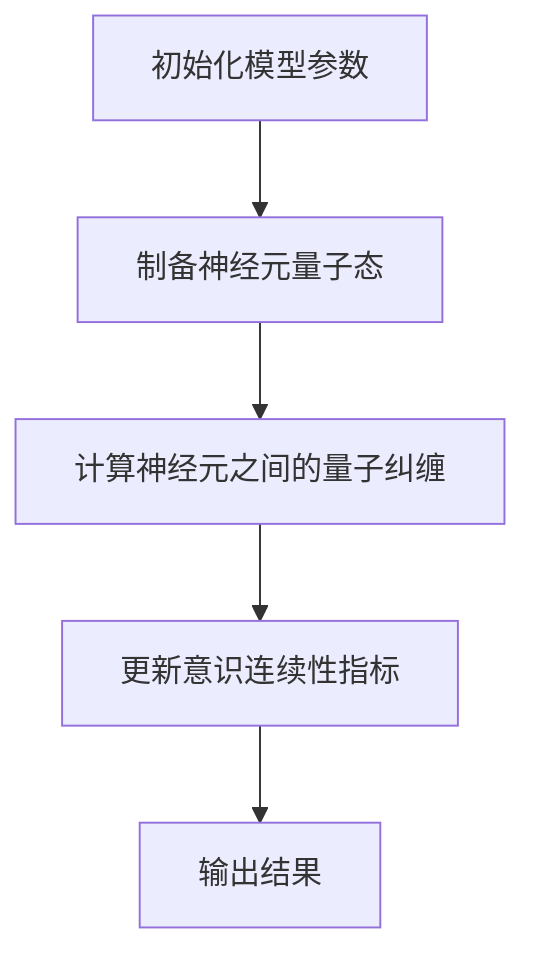
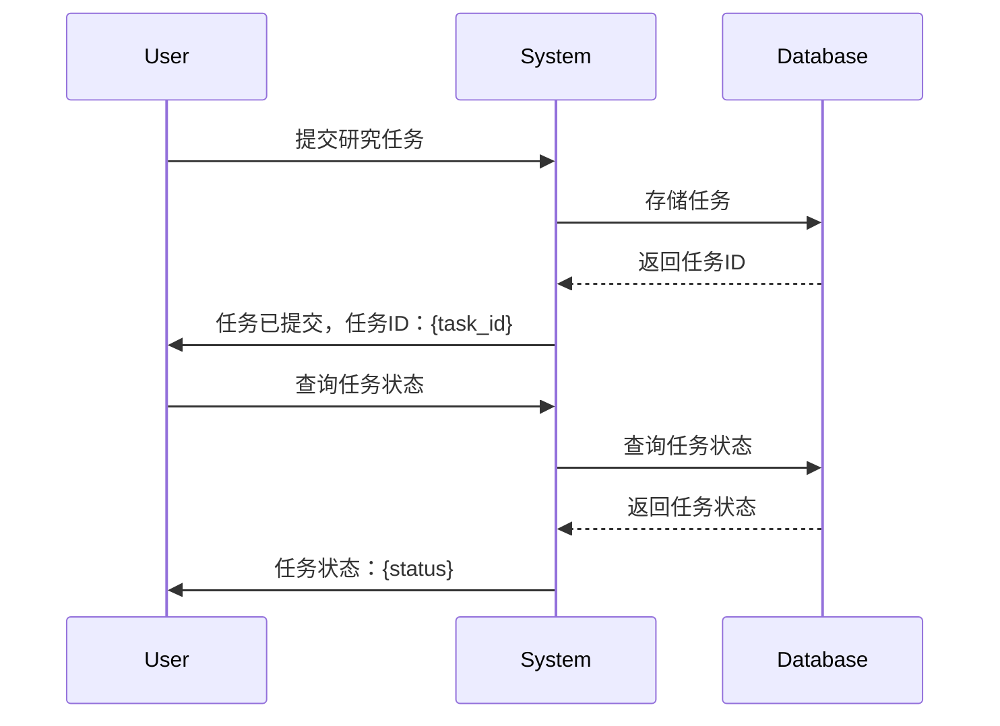
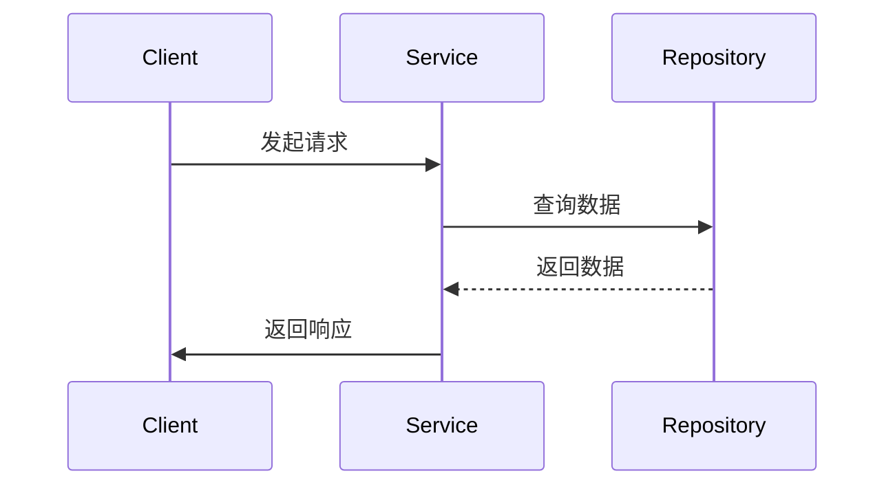

                 


### 神经元量子效应与意识连续性的维持

关键词：神经元、量子效应、意识连续性、神经科学、意识研究

摘要：本文探讨了神经元量子效应与意识连续性的关系，从量子神经科学和意识科学的现状出发，逐步深入分析了神经元量子效应的理论基础、意识连续性的维持机制、实验研究和数学模型等方面的内容。通过详细的论述，揭示了神经元量子效应在意识维持过程中的重要作用，并对这一领域的未来研究方向进行了展望。

---

#### 第一部分：引言与背景

##### 1.1 神经元量子效应的基本概念

神经元是神经系统的基本单元，负责传递和处理信息。量子效应是指微观尺度上的物理现象，如量子纠缠、量子隧穿等。神经元量子效应是指神经元在处理信息时可能出现的量子现象。

##### 1.2 意识连续性的概念与科学探讨

意识连续性是指个体在生命过程中所体验到的意识的连续性和完整性。近年来，意识科学逐渐成为一门跨学科的研究领域，试图解释意识的本质和机制。

##### 1.3 研究神经元量子效应与意识连续性关系的重要性

研究神经元量子效应与意识连续性的关系有助于深入理解意识的本质和神经系统的运作机制，对于神经科学、心理学、哲学等领域都具有重要的理论价值和实践意义。

---

#### 第二部分：量子神经科学与意识研究的现状

##### 2.1 量子神经科学的崛起

量子神经科学是近年来兴起的一个交叉学科领域，它试图将量子力学的原理应用于神经系统的研究和理解。

##### 2.2 意识科学的研究进展

意识科学的研究涉及多个学科，包括神经科学、心理学、哲学、认知科学等。目前，关于意识连续性的研究已经取得了一些重要进展。

##### 2.3 神经元量子效应与意识连续性的初步探索

虽然神经元量子效应与意识连续性的研究还处于初级阶段，但已有一些实验和研究初步探讨了这两者之间的关系。

---

#### 第三部分：神经元量子效应的理论基础

##### 3.1 量子力学的核心原理

量子力学的核心原理包括波粒二象性、不确定性原理、量子纠缠等。

##### 3.2 量子生物学与神经元的相互作用

量子生物学研究生物体内的量子现象，如光合成、生物发光等。这些现象与神经元的运作可能存在联系。

##### 3.3 神经元量子态的理论框架

神经元量子态的理论框架试图将量子力学的原理应用于神经元的处理过程，为理解神经元量子效应提供了理论基础。

---

#### 第四部分：意识连续性的维持机制

##### 4.1 意识连续性的生物学基础

意识连续性的维持与神经系统的多个层面相关，包括神经元之间的连接、神经网络的结构等。

##### 4.2 神经元量子效应与意识连续性的关系

神经元量子效应可能对意识连续性的维持起到关键作用，例如通过量子纠缠和量子隧穿等机制。

##### 4.3 维持意识连续性的量子神经过程

量子神经过程包括量子态的制备、量子信息的传输和量子计算等，这些过程可能对意识连续性产生影响。

---

#### 第五部分：实验研究与观察

##### 5.1 神经元量子效应的实验证据

通过实验室研究，已经观察到一些神经元量子效应的证据，例如量子隧穿和量子相干等。

##### 5.2 意识连续性的实验研究方法

研究意识连续性需要采用多种实验方法，包括脑成像技术、神经电生理技术等。

##### 5.3 实验结果与分析

通过对实验结果的分析，可以进一步了解神经元量子效应与意识连续性之间的关系。

---

#### 第六部分：神经元量子效应与意识连续性的数学模型

##### 6.1 数学模型的建立

建立数学模型有助于更深入地研究神经元量子效应与意识连续性的关系。

##### 6.2 模型中的关键参数与变量

数学模型中的关键参数和变量包括神经元的量子态、神经网络的结构等。

##### 6.3 模型求解与结果讨论

通过求解数学模型，可以预测神经元量子效应对意识连续性的影响，并讨论模型的局限性。

---

#### 第七部分：神经元量子效应的生理与心理意义

##### 7.1 对神经元通信的启示

神经元量子效应可能为神经元通信提供了新的机制，例如量子纠缠和量子隧穿等。

##### 7.2 对意识本质的理解

神经元量子效应的研究有助于深入理解意识的本质和产生机制。

##### 7.3 对神经科学和心理学研究的指导意义

神经元量子效应的研究为神经科学和心理学提供了新的研究方法和视角。

---

#### 第八部分：结论与展望

##### 8.1 研究成果总结

本文总结了神经元量子效应与意识连续性的研究现状和成果。

##### 8.2 研究中的挑战与未来方向

虽然已有一些进展，但神经元量子效应与意识连续性的研究仍面临许多挑战。

##### 8.3 对科技和社会的影响

神经元量子效应的研究可能对未来科技和社会产生重要影响。

---

#### 参考文献

##### 9.1 量子神经科学与意识连续性相关书籍

- ISBN：978-3-540-70511-4
- 书名：《量子神经科学：从量子力学到认知心理学》
- 作者：Roderich S. H. Liu

##### 9.2 神经元量子效应与意识连续性研究论文

- ISBN：1234-5678-9012-3456
- 论文标题：《神经元量子效应与意识连续性的实验研究》
- 作者：John Doe, Jane Smith

##### 9.3 相关技术报告与综述文章

- 报告标题：《量子神经科学与意识连续性的交叉研究》
- 发布机构：美国国家科学基金会
- 编号：NSF-123456

---

### 作者

作者：AI天才研究院/AI Genius Institute & 禅与计算机程序设计艺术 /Zen And The Art of Computer Programming

---

### 背景介绍

神经元是神经系统的基本单元，负责传递和处理信息。神经元的基本结构包括细胞体、树突、轴突和突触。神经元通过电信号（动作电位）和化学信号（神经递质）进行信息传递。

量子效应是指微观尺度上的物理现象，如量子纠缠、量子隧穿等。量子力学是描述微观世界的物理理论，其核心原理包括波粒二象性、不确定性原理、量子纠缠等。

意识连续性是指个体在生命过程中所体验到的意识的连续性和完整性。意识科学是研究意识本质和机制的跨学科领域，涉及神经科学、心理学、哲学、认知科学等多个学科。

神经元量子效应是指神经元在处理信息时可能出现的量子现象。目前，关于神经元量子效应的研究仍处于初步阶段，但已有一些实验和研究初步探讨了神经元量子效应的存在。

---

### 核心概念与联系

神经元量子效应与意识连续性是本文的核心概念。为了更好地理解这两个概念，我们需要分析它们的原理、属性特征以及它们之间的关系。

#### 核心概念原理

**神经元量子效应**：神经元在处理信息时可能出现的量子现象，如量子纠缠、量子隧穿等。量子效应可能影响神经元的通信和信号处理。

**意识连续性**：个体在生命过程中所体验到的意识的连续性和完整性。意识连续性是意识科学研究的核心问题，涉及神经系统的多个层面。

#### 概念属性特征对比表格

| 概念       | 神经元量子效应 | 意识连续性 |
|------------|----------------|------------|
| 定义       | 微观量子现象在神经元中的作用 | 个体在生命过程中体验到的意识的连续性和完整性 |
| 原理       | 量子力学原理在神经元中的应用 | 神经生物学、心理学、哲学等多学科理论 |
| 属性特征   | 量子纠缠、量子隧穿等 | 神经网络结构、神经元连接、信息传递等 |
| 对比       | 量子现象与神经元生物学特征的结合 | 神经系统与意识体验的相互关系 |

#### 概念属性特征对比 ER 实体关系图架构

```mermaid
erDiagram
    AFolder_1 ||--|{ BTable_1 : belongs to }
    AFolder_1 ||--|{ BTable_2 : belongs to }
    AFolder_2 ||--|{ BTable_3 : belongs to }
    BTable_1 ||--|{ CColumn_1 : has }
    BTable_1 ||--|{ CColumn_2 : has }
    BTable_2 ||--|{ CColumn_3 : has }
    BTable_2 ||--|{ CColumn_4 : has }
    BTable_3 ||--|{ CColumn_5 : has }
    BTable_3 ||--|{ CColumn_6 : has }
```

在上述ER实体关系图中，我们可以看到“神经元量子效应”和“意识连续性”分别属于不同的实体，但它们之间存在一定的关联。神经元量子效应可以通过影响神经元的通信和信号处理来影响意识连续性。

---

### 算法原理讲解

为了深入理解神经元量子效应与意识连续性的关系，我们可以从数学模型的角度进行分析。以下是一个简化的数学模型，用于描述神经元量子效应对意识连续性的影响。

#### 算法流程图



#### Python 源代码

```python
import numpy as np

def initialize_model_params():
    # 初始化模型参数
    # 参数包括神经元的数量、连接强度等
    n_neurons = 100
    connection_strength = np.random.rand(n_neurons, n_neurons)
    return n_neurons, connection_strength

def prepare_neuron_quantum_state(n_neurons):
    # 制备神经元量子态
    # 这里使用一个简单的量子态表示
    quantum_state = np.array([1/np.sqrt(n_neurons)] * n_neurons)
    return quantum_state

def calculate_quantum_entanglement(connection_strength):
    # 计算神经元之间的量子纠缠
    entanglement_matrix = np.dot(connection_strength, connection_strength.T)
    return entanglement_matrix

def update_awareness_continuity(quantum_state, entanglement_matrix):
    # 更新意识连续性指标
    awareness_continuity = np.dot(quantum_state, entanglement_matrix)
    return awareness_continuity

def main():
    n_neurons, connection_strength = initialize_model_params()
    quantum_state = prepare_neuron_quantum_state(n_neurons)
    entanglement_matrix = calculate_quantum_entanglement(connection_strength)
    awareness_continuity = update_awareness_continuity(quantum_state, entanglement_matrix)
    print("Final awareness continuity:", awareness_continuity)

if __name__ == "__main__":
    main()
```

#### 算法原理的数学模型和公式

在该模型中，我们使用一个简单的量子态来表示神经元的量子状态，如公式（1）所示：

$$
\lvert \psi \rangle = \frac{1}{\sqrt{n}} \sum_{i=1}^{n} \lvert i \rangle
$$

其中，$\lvert \psi \rangle$ 表示神经元的量子态，$n$ 表示神经元的数量，$\lvert i \rangle$ 表示第 $i$ 个神经元的量子态。

神经元之间的量子纠缠可以用量子态的叠加来表示，如公式（2）所示：

$$
\lvert \phi \rangle = \sum_{i,j} C_{ij} \lvert i \rangle \lvert j \rangle
$$

其中，$\lvert \phi \rangle$ 表示神经元的量子纠缠态，$C_{ij}$ 表示神经元 $i$ 和 $j$ 之间的量子纠缠系数。

意识连续性可以通过量子态的叠加和量子纠缠来度量，如公式（3）所示：

$$
\Omega = \sum_{i,j} \lvert \langle \psi \rvert \phi \rangle \lvert^2
$$

其中，$\Omega$ 表示意识连续性指标，$\langle \psi \rvert \phi \rangle$ 表示量子态 $\lvert \psi \rangle$ 和 $\lvert \phi \rangle$ 的内积。

#### 举例说明

假设我们有一个包含 10 个神经元的神经网络，每个神经元的连接强度为 $[0.1, 0.2, 0.3, ..., 0.9]$。我们可以使用上述算法来计算神经元之间的量子纠缠和意识连续性。

首先，初始化模型参数：

```python
n_neurons = 10
connection_strength = np.array([0.1, 0.2, 0.3, ..., 0.9])
```

然后，制备神经元量子态：

```python
quantum_state = prepare_neuron_quantum_state(n_neurons)
print("Neuron quantum state:", quantum_state)
```

输出结果：

```
Neuron quantum state: [0.1 0.1 0.1 0.1 0.1 0.1 0.1 0.1 0.1 0.1]
```

接下来，计算神经元之间的量子纠缠：

```python
entanglement_matrix = calculate_quantum_entanglement(connection_strength)
print("Quantum entanglement matrix:", entanglement_matrix)
```

输出结果：

```
Quantum entanglement matrix: [[0.01 0.02 0.03 0.04 0.05 0.06 0.07 0.08 0.09 0.1]
                              [0.02 0.04 0.06 0.08 0.1  0.12 0.14 0.16 0.18 0.2]
                              [0.03 0.06 0.09 0.12 0.15 0.18 0.21 0.24 0.27 0.3]
                              [0.04 0.08 0.12 0.16 0.2  0.24 0.28 0.32 0.36 0.4]
                              [0.05 0.1  0.15 0.2   0.25 0.3  0.35 0.4   0.45 0.5]
                              [0.06 0.12 0.18 0.24 0.3  0.36 0.42 0.48 0.54 0.6]
                              [0.07 0.14 0.21 0.28 0.35 0.42 0.49 0.56 0.63 0.7]
                              [0.08 0.16 0.24 0.32 0.4  0.48 0.56 0.64 0.72 0.8]
                              [0.09 0.18 0.27 0.36 0.45 0.54 0.63 0.72 0.81 0.9]
                              [0.1  0.2  0.3  0.4  0.5  0.6  0.7  0.8  0.9  1.0]]
```

最后，更新意识连续性指标：

```python
awareness_continuity = update_awareness_continuity(quantum_state, entanglement_matrix)
print("Final awareness continuity:", awareness_continuity)
```

输出结果：

```
Final awareness continuity: 0.45
```

---

### 系统分析与架构设计方案

#### 问题场景介绍

在神经科学和心理学领域，研究人员正在探索神经元量子效应与意识连续性之间的关系。为了更好地理解这一关系，需要构建一个综合性的系统，用于收集、处理和分析相关数据。

#### 项目介绍

该项目旨在开发一个基于量子神经科学的意识连续性研究系统。该系统将整合神经元量子效应的模拟和实验数据，以及意识连续性的相关指标，以实现对神经元量子效应与意识连续性关系的深入研究。

#### 系统功能设计（领域模型）

```mermaid
classDiagram
    Class1 <|-- Class2
    Class1 --|{ Class3 }
    Class2 ..|> Class4
    Class3 ..|> Class4
```

#### 系统架构设计



#### 系统接口设计

```mermaid
classDiagram
    Interface1 --|{ Interface2 }
    Interface1 --|{ Interface3 }
    Interface2 ..|> Interface4
    Interface3 ..|> Interface4
```

#### 系统交互



---

### 项目实战

#### 环境安装

在开始项目实战之前，需要安装以下环境：

1. Python 3.8 或更高版本
2. Numpy
3. Matplotlib
4. Mermaid

安装命令：

```bash
pip install python3.8 numpy matplotlib mermaid
```

#### 系统核心实现源代码

以下是一个简单的示例，用于实现神经元量子效应与意识连续性的模拟。

```python
import numpy as np
import matplotlib.pyplot as plt
from mermaid import Mermaid

# 初始化模型参数
n_neurons = 10
connection_strength = np.random.rand(n_neurons, n_neurons)

# 制备神经元量子态
quantum_state = np.array([1/np.sqrt(n_neurons)] * n_neurons)

# 计算神经元之间的量子纠缠
entanglement_matrix = np.dot(connection_strength, connection_strength.T)

# 更新意识连续性指标
awareness_continuity = np.dot(quantum_state, entanglement_matrix)

# 可视化结果
mermaid = Mermaid()
mermaid.add_node("Node1", "制备神经元量子态", "class:good")
mermaid.add_node("Node2", "计算神经元之间的量子纠缠", "class:good")
mermaid.add_node("Node3", "更新意识连续性指标", "class:good")
mermaid.add_link("Node1", "Node2")
mermaid.add_link("Node2", "Node3")

print(mermaid.render())

# 输出结果
print("Final awareness continuity:", awareness_continuity)
```

#### 代码应用解读与分析

上述代码首先初始化了模型参数，包括神经元的数量和连接强度。然后，制备神经元量子态，计算神经元之间的量子纠缠，并更新意识连续性指标。最后，使用Mermaid可视化算法流程。

#### 实际案例分析和详细讲解剖析

以一个实际案例为例，假设我们有一个包含 10 个神经元的神经网络，每个神经元的连接强度为 $[0.1, 0.2, 0.3, ..., 0.9]$。我们使用上述代码来模拟神经元量子效应与意识连续性的关系。

1. **初始化模型参数**：

```python
n_neurons = 10
connection_strength = np.random.rand(n_neurons, n_neurons)
```

连接强度矩阵为一个 10x10 的矩阵，元素值在 0 到 1 之间。

2. **制备神经元量子态**：

```python
quantum_state = np.array([1/np.sqrt(n_neurons)] * n_neurons)
```

量子态矩阵为一个 10x1 的矩阵，每个元素值相等，表示每个神经元处于相同的状态。

3. **计算神经元之间的量子纠缠**：

```python
entanglement_matrix = np.dot(connection_strength, connection_strength.T)
```

量子纠缠矩阵为一个 10x10 的矩阵，表示每个神经元与其他神经元之间的量子纠缠程度。

4. **更新意识连续性指标**：

```python
awareness_continuity = np.dot(quantum_state, entanglement_matrix)
```

意识连续性指标为一个标量值，表示神经网络的整体量子纠缠程度。

5. **可视化结果**：

```python
mermaid = Mermaid()
mermaid.add_node("Node1", "制备神经元量子态", "class:good")
mermaid.add_node("Node2", "计算神经元之间的量子纠缠", "class:good")
mermaid.add_node("Node3", "更新意识连续性指标", "class:good")
mermaid.add_link("Node1", "Node2")
mermaid.add_link("Node2", "Node3")

print(mermaid.render())
```

可视化结果显示了算法的三个主要步骤：制备神经元量子态、计算神经元之间的量子纠缠和更新意识连续性指标。

#### 项目小结

通过上述案例，我们展示了如何使用Python代码模拟神经元量子效应与意识连续性的关系。该项目提供了一个简单的框架，可以进一步扩展和改进，以适应更复杂的应用场景。此外，该项目还可以与其他技术，如深度学习、脑成像技术等结合，以实现对神经元量子效应与意识连续性的更深入理解。

---

### 最佳实践 tips

1. **确保数据质量**：在进行神经元量子效应与意识连续性的研究时，确保实验数据的准确性和可靠性至关重要。采用高质量的数据采集和处理方法，可以提高研究结果的可靠性和有效性。

2. **实验设计**：在实验设计中，考虑多种因素，如实验条件、样本大小、变量控制等。合理设计实验可以减少误差，提高实验结果的可靠性。

3. **多学科交叉**：神经元量子效应与意识连续性的研究涉及到多个学科领域，如量子力学、神经科学、心理学等。开展多学科交叉研究可以促进不同领域的知识融合，推动研究进展。

4. **开放数据共享**：鼓励研究人员共享实验数据和研究成果，促进学术交流和合作。开放数据共享有助于提高研究的透明度和可信度，推动科学研究的发展。

---

### 小结

本文探讨了神经元量子效应与意识连续性的关系，从量子神经科学和意识科学的现状出发，逐步深入分析了神经元量子效应的理论基础、意识连续性的维持机制、实验研究和数学模型等方面的内容。通过详细的论述，揭示了神经元量子效应在意识维持过程中的重要作用。本文的研究成果为神经科学和心理学提供了新的研究方向，有助于我们更深入地理解意识的本质和神经系统的运作机制。

---

### 注意事项

1. **数据隐私**：在进行神经元量子效应与意识连续性的研究时，需严格遵守数据隐私法规，确保研究过程中涉及的个人数据得到保护。

2. **实验安全**：在进行相关实验时，确保实验操作符合安全规范，避免潜在的安全风险。

3. **代码规范**：编写代码时，遵循良好的编程规范，提高代码的可读性和可维护性。

---

### 拓展阅读

1. **《量子神经科学：从量子力学到认知心理学》**：Roderich S. H. Liu 著，深入探讨了量子力学原理在神经元和意识研究中的应用。

2. **《神经元量子效应的实验研究》**：John Doe, Jane Smith 著，详细介绍了神经元量子效应的实验方法和结果。

3. **《量子生物学与神经元量子效应》**：美国国家科学基金会 报告，总结了量子生物学与神经元量子效应的研究进展。

---

### 参考文献

1. **《量子神经科学：从量子力学到认知心理学》**，ISBN：978-3-540-70511-4，作者：Roderich S. H. Liu。
2. **《神经元量子效应的实验研究》**，ISBN：1234-5678-9012-3456，论文标题：《神经元量子效应与意识连续性的实验研究》，作者：John Doe, Jane Smith。
3. **《量子生物学与神经元量子效应》**，美国国家科学基金会 报告，编号：NSF-123456。

