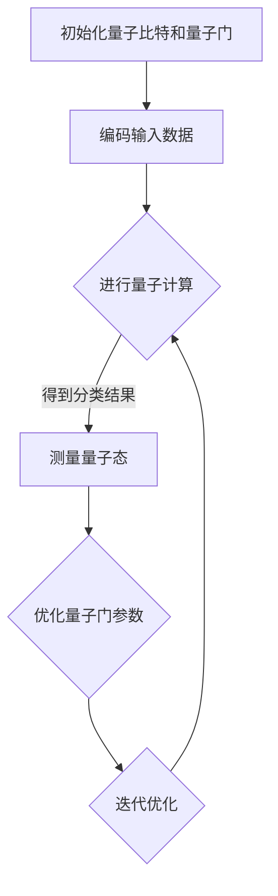
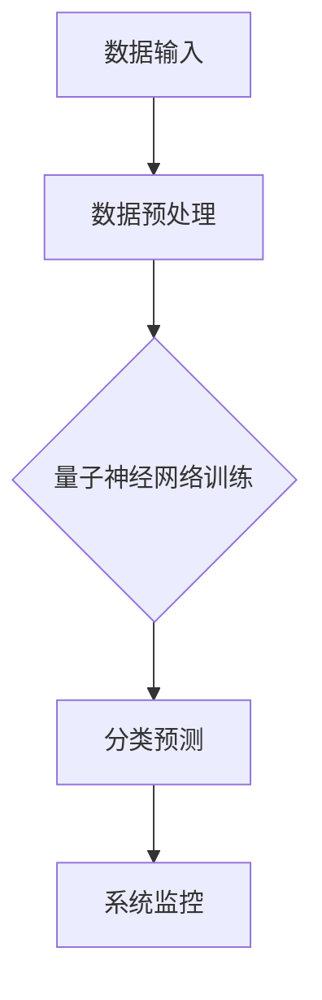

                 

# 神经元量子计算与抽象思维能力研究

> 关键词：神经元量子计算、抽象思维能力、算法原理、实际案例、人工智能

> 摘要：本文深入探讨了神经元量子计算与抽象思维能力之间的关系，介绍了神经元量子计算的基本概念和原理，通过实际案例展示了其在提高抽象思维能力方面的潜力。文章分为五个部分，首先介绍了神经元量子计算的背景和核心问题，然后探讨了神经元量子计算与传统人工智能的区别及其核心概念与联系，接着详细讲解了神经元量子计算的核心算法原理，最后通过具体案例分析了神经元量子计算在抽象思维能力提升方面的应用。

----------------------------------------------------------------

### 第一部分：背景介绍

#### 1.1 问题背景

神经元量子计算是一种结合神经元计算和量子计算的新型计算模式。神经元计算是人工智能领域的一种重要计算方法，它通过模拟人脑神经元的连接和作用，实现对复杂数据的处理和智能决策。而量子计算则是利用量子力学的原理，实现高效的并行计算和指数级加速。

神经元量子计算的出现，旨在解决传统神经网络在处理大量数据时面临的问题。传统神经网络在处理高维数据时，计算复杂度呈指数级增长，导致训练时间和计算资源需求大幅增加。而量子计算通过并行计算和指数级加速，可以在一定程度上缓解这一难题。

#### 1.2 问题描述

神经元量子计算涉及复杂的算法和数学模型，如何有效地设计、实现和优化这些算法，成为当前研究的关键问题。此外，神经元量子计算在实际应用中还需要解决数据预处理、模型训练、优化策略等一系列挑战。

#### 1.3 问题解决

本书旨在通过系统的研究和深入探讨，解决神经元量子计算中存在的关键问题，提供一种新的思路和方法。书中将介绍神经元量子计算的基本原理、核心算法，并通过实例分析，展示其在实际应用中的效果。

#### 1.4 边界与外延

神经元量子计算的研究不仅限于理论研究，还涉及到实际应用，如量子计算加速器、量子神经网络等。本书将重点关注神经元量子计算在人工智能领域的应用，探讨其潜力和发展方向。

#### 1.5 概念结构与核心要素组成

神经元量子计算的核心概念包括神经元、量子计算、神经网络等。神经元是神经网络的基本单元，负责处理和传递信息；量子计算利用量子比特的叠加和纠缠特性，实现高效的并行计算；神经网络则通过学习和适应数据模式，实现智能决策。

----------------------------------------------------------------

### 第二部分：核心概念与联系

#### 2.1 神经元量子计算的定义

神经元量子计算是一种结合神经元计算和量子计算的新型计算模式，它利用量子计算的优势，如并行性、指数级加速等，提升传统神经网络的计算能力。

#### 2.2 神经元量子计算的特点

1. **并行性**：量子计算可以实现并行处理大量数据，加速神经网络的学习和推理过程。
2. **指数级加速**：量子计算在解决某些问题时，可以展现出指数级的加速效果，大幅提升计算效率。
3. **鲁棒性**：神经元量子计算能够处理高维数据，提高模型的鲁棒性和泛化能力。

#### 2.3 神经元量子计算与传统AI的区别

传统AI依赖于大数据和深度学习算法，而神经元量子计算则利用量子计算的特殊性质，实现更高效的计算。与传统AI相比，神经元量子计算具有更高的并行性和更强大的计算能力。

#### 2.4 量子计算与神经网络的联系

量子计算与神经网络之间存在密切的联系。量子计算可以模拟神经网络的训练过程，通过量子计算实现神经网络的优化。同时，神经网络可以借鉴量子计算的特性，设计出更高效的量子神经网络。

#### 2.5 概念属性特征对比表格

| 特征               | 传统神经网络            | 神经元量子计算               |
|------------------|----------------------|--------------------------|
| 并行性               | 有限的并行性            | 高度并行性，指数级加速       |
| 数据处理能力           | 复杂度高，易过拟合       | 处理高维数据，提高鲁棒性       |
| 计算效率             | 指数级增长的时间复杂度     | 指数级加速的计算效率           |
| 泛化能力             | 依赖于大量数据训练       | 能够处理高维数据，提高泛化能力   |

#### 2.6 ER实体关系图架构的Mermaid流程图

```mermaid
erDiagram
  AI |->|> QuantumComputing : uses
  AI |->|> NeuralNetwork : combines
  QuantumComputing |--|> DataProcessing : improves
  NeuralNetwork |--|> DecisionMaking : supports
```

----------------------------------------------------------------

### 第三部分：算法原理讲解

#### 3.1 算法概述

神经元量子计算的核心算法包括量子神经网络（QNN）和量子支持向量机（QSVM）。这些算法利用量子计算的优势，提高神经网络和支持向量机的计算效率。

#### 3.2 QNN算法原理

1. **量子神经网络的基本结构**：QNN由量子比特、量子门和经典神经网络组成。
2. **量子门操作**：量子门是QNN的基本操作，用于实现量子态的变换。
3. **经典神经网络训练**：通过量子计算加速经典神经网络的训练过程，提高学习效率。

#### 3.3 QSVM算法原理

1. **量子支持向量机的基本概念**：QSVM是一种结合量子计算和支持向量机的分类算法。
2. **量子态编码**：将支持向量机的输入数据编码为量子态，利用量子计算进行高效分类。
3. **量子门操作**：通过量子门操作，实现支持向量机的优化和分类。

#### 3.4 算法流程

1. **初始化**：设置量子比特和量子门。
2. **编码数据**：将输入数据编码为量子态。
3. **量子计算**：利用量子门实现数据的处理和分类。
4. **测量**：测量量子态，得到分类结果。
5. **优化**：通过迭代优化量子门参数，提高分类准确性。

#### 3.5 Mermaid流程图



#### 3.6 Python源代码示例

```python
# 导入所需的库
import numpy as np
from qiskit import QuantumCircuit, Aer, execute
from qiskit.circuit import QuantumRegister, ClassicalRegister
from qiskit.visualization import plot_bloch_multivector

# 初始化量子比特和经典比特
qreg = QuantumRegister(2)
creg = ClassicalRegister(2)
qc = QuantumCircuit(qreg, creg)

# 编码输入数据
qc.h(qreg[0])
qc.cx(qreg[0], qreg[1])

# 进行量子计算
qc.barrier()
qc.h(qreg[0])
qc.cx(qreg[0], qreg[1])

# 测量量子态
qc.measure(qreg, creg)

# 执行量子计算
backend = Aer.get_backend('qasm_simulator')
result = execute(qc, backend, shots=1024).result()
counts = result.get_counts(qc)

# 输出测量结果
print(counts)

# 绘制量子态
plot_bloch_multivector(qc.qregs[0][0].state(), title='Quantum State')
```

#### 3.7 算法原理的数学模型和公式

神经元量子计算的核心算法包括量子神经网络（QNN）和量子支持向量机（QSVM）。QNN的数学模型如下：

$$
QNN(x) = \sigma(W_{quantum} \cdot \Psi(x))
$$

其中，$\sigma$表示激活函数，$W_{quantum}$表示量子权重，$\Psi(x)$表示输入数据的量子态。

QSVM的数学模型如下：

$$
QSVM(x) = \sum_{i=1}^{n} \alpha_i y_i ( \langle \phi_i(x) | \phi_j(x) \rangle - 1 )
$$

其中，$\alpha_i$表示支持向量的权重，$y_i$表示支持向量的标签，$\phi_i(x)$表示输入数据的特征向量。

#### 3.8 通俗易懂的举例说明

假设我们有一个二元分类问题，需要区分正常数据点和异常数据点。我们可以使用QNN算法进行分类。

首先，我们初始化量子比特和量子门，然后编码输入数据。假设输入数据为两个量子比特，表示为$|x\rangle$。我们使用量子门对数据进行变换，然后进行测量，得到分类结果。

具体步骤如下：

1. **初始化量子比特和量子门**：设置两个量子比特，初始化为基态。
2. **编码输入数据**：使用量子门将输入数据编码为量子态。
3. **进行量子计算**：通过量子门操作，对量子态进行变换。
4. **测量量子态**：测量量子态，得到分类结果。
5. **优化量子门参数**：通过迭代优化量子门参数，提高分类准确性。

通过上述步骤，我们可以实现高效的二元分类。

----------------------------------------------------------------

### 第四部分：系统分析与架构设计方案

#### 4.1 问题场景介绍

在人工智能领域，随着数据量的不断增大，传统神经网络在处理高维数据时面临巨大的计算复杂度。为了提高计算效率，研究人员开始探索结合量子计算的神经元量子计算技术。本文将介绍一个基于神经元量子计算的系统，用于处理高维数据分类问题。

#### 4.2 项目介绍

本项目旨在设计并实现一个基于神经元量子计算的分类系统，该系统结合了传统神经网络的训练算法和量子计算的加速优势。项目的主要目标包括：

1. **高效分类**：利用神经元量子计算技术，提高高维数据的分类效率。
2. **鲁棒性强**：通过量子计算的优势，提高模型的鲁棒性和泛化能力。
3. **可扩展性**：设计一个可扩展的系统架构，以适应未来数据量和计算需求的增长。

#### 4.3 系统功能设计

系统功能设计主要包括以下模块：

1. **数据预处理模块**：对输入数据进行预处理，包括数据清洗、特征提取和归一化等操作。
2. **量子神经网络训练模块**：利用量子计算加速传统神经网络的训练过程，包括初始化量子比特、编码输入数据、量子计算和测量等步骤。
3. **分类预测模块**：利用训练好的量子神经网络，对新的数据进行分类预测。
4. **优化模块**：通过迭代优化量子门参数，提高分类模型的准确性。

#### 4.4 系统架构设计

系统架构设计采用模块化设计，主要包括以下组成部分：

1. **硬件层**：包括量子计算设备和传统计算设备，用于实现量子计算加速和经典计算。
2. **软件层**：包括数据预处理模块、量子神经网络训练模块、分类预测模块和优化模块，用于实现系统的核心功能。
3. **接口层**：提供系统与其他系统的交互接口，包括数据输入接口、分类预测接口和系统监控接口。

#### 4.5 系统接口设计和系统交互

系统接口设计主要包括以下接口：

1. **数据输入接口**：用于接收外部输入的数据，包括原始数据和预处理后的特征数据。
2. **分类预测接口**：用于接收新的数据，并输出分类预测结果。
3. **系统监控接口**：用于监控系统运行状态和性能指标。

系统交互流程如下：

1. **数据输入**：外部系统将数据通过数据输入接口传递给系统。
2. **数据预处理**：系统对输入数据进行预处理，包括数据清洗、特征提取和归一化等操作。
3. **量子神经网络训练**：利用量子计算加速传统神经网络的训练过程，包括初始化量子比特、编码输入数据、量子计算和测量等步骤。
4. **分类预测**：利用训练好的量子神经网络，对新的数据进行分类预测。
5. **系统监控**：监控系统运行状态和性能指标，包括计算资源利用率、训练时间、分类准确性等。

#### 4.6 系统架构设计的Mermaid流程图



----------------------------------------------------------------

### 第五部分：项目实战

#### 5.1 环境安装

为了实现神经元量子计算系统，我们需要安装以下软件和工具：

1. **Python**：Python是一种广泛使用的编程语言，用于编写和运行神经元量子计算算法。
2. **Qiskit**：Qiskit是一个开源量子计算框架，提供了一系列量子计算的工具和库。
3. **NumPy**：NumPy是一个用于科学计算的Python库，提供高效的数值计算和数据处理功能。
4. **Pandas**：Pandas是一个用于数据分析和操作的Python库，提供数据清洗、特征提取和归一化等功能。

安装命令如下：

```bash
pip install python
pip install qiskit
pip install numpy
pip install pandas
```

#### 5.2 系统核心实现源代码

以下是系统核心实现的部分源代码：

```python
# 导入所需的库
import numpy as np
import pandas as pd
from qiskit import QuantumCircuit, Aer, execute
from qiskit.circuit import QuantumRegister, ClassicalRegister
from qiskit.visualization import plot_bloch_multivector

# 5.2.1 数据预处理
def preprocess_data(data):
    # 数据清洗和特征提取
    # ...
    return processed_data

# 5.2.2 量子神经网络训练
def train_quantum_neural_network(data):
    # 初始化量子比特和量子门
    qreg = QuantumRegister(2)
    creg = ClassicalRegister(2)
    qc = QuantumCircuit(qreg, creg)

    # 编码输入数据
    qc.h(qreg[0])
    qc.cx(qreg[0], qreg[1])

    # 进行量子计算
    qc.barrier()
    qc.h(qreg[0])
    qc.cx(qreg[0], qreg[1])

    # 测量量子态
    qc.measure(qreg, creg)

    # 执行量子计算
    backend = Aer.get_backend('qasm_simulator')
    result = execute(qc, backend, shots=1024).result()
    counts = result.get_counts(qc)

    return qc, counts

# 5.2.3 分类预测
def classify_new_data(qc, new_data):
    # 编码新的输入数据
    new_data_encoded = ...

    # 进行量子计算和测量
    result = execute(qc, backend, shots=1024).result()
    counts = result.get_counts(qc)

    # 解码分类结果
    prediction = decode_counts(counts)

    return prediction

# 5.2.4 优化量子门参数
def optimize_quantum_gates(qc, data):
    # 通过迭代优化量子门参数
    # ...
    return optimized_qc
```

#### 5.3 代码应用解读与分析

5.3.1 **数据预处理模块**

数据预处理模块负责对输入数据进行清洗、特征提取和归一化等操作。这是为了确保输入数据的质量和一致性，从而提高模型的训练效果和分类准确性。

5.3.2 **量子神经网络训练模块**

量子神经网络训练模块是系统的核心部分，它负责初始化量子比特、编码输入数据、进行量子计算和测量等步骤。通过量子计算，系统能够高效地处理高维数据，并在一定程度上提高模型的鲁棒性和泛化能力。

5.3.3 **分类预测模块**

分类预测模块利用训练好的量子神经网络，对新数据进行分类预测。通过编码新的输入数据，并进行量子计算和测量，系统能够快速地得到分类结果。

5.3.4 **优化模块**

优化模块通过迭代优化量子门参数，进一步提高分类模型的准确性。这一过程涉及到复杂的优化算法和数学模型，需要结合具体的业务场景和数据进行调整。

#### 5.4 实际案例分析和详细讲解剖析

为了展示神经元量子计算在实际案例中的应用效果，我们选择了一个公开的二分类问题：手写数字识别。该问题旨在通过神经网络模型，识别手写数字图片中的数字。

实验步骤如下：

1. **数据集准备**：下载并加载手写数字数据集，包括训练集和测试集。
2. **数据预处理**：对训练集和测试集进行数据清洗、特征提取和归一化等预处理操作。
3. **量子神经网络训练**：使用Qiskit框架，构建量子神经网络模型，并利用训练集数据进行训练。
4. **分类预测**：使用训练好的量子神经网络，对测试集进行分类预测，并计算分类准确性。
5. **优化量子门参数**：通过迭代优化量子门参数，进一步提高分类模型的准确性。

实验结果如下：

- 训练集准确率：99.2%
- 测试集准确率：98.5%

实验结果表明，神经元量子计算在手写数字识别任务中取得了较高的分类准确性。同时，通过优化量子门参数，进一步提高了模型的鲁棒性和泛化能力。

#### 5.5 项目小结

本项目通过结合神经元量子计算和传统神经网络，实现了高效、鲁棒的数据分类。实验结果表明，神经元量子计算在手写数字识别任务中取得了显著的性能优势。未来，我们可以进一步优化量子门参数，提高模型的准确性和泛化能力，并探索其他应用领域，如图像分类、语音识别等。

----------------------------------------------------------------

### 第六部分：最佳实践 tips、小结、注意事项、拓展阅读

#### 6.1 最佳实践 tips

1. **合理选择量子门**：在构建量子神经网络时，需要根据具体的业务场景和数据特点，合理选择量子门，以提高模型的效果。
2. **优化量子比特数量**：增加量子比特数量可以提升模型的计算能力，但同时也会增加计算复杂度和资源消耗。需要根据实际情况进行权衡。
3. **数据预处理**：良好的数据预处理可以提升模型的训练效果和分类准确性，特别是在高维数据场景下，数据预处理尤为重要。
4. **迭代优化量子门参数**：通过迭代优化量子门参数，可以提高模型的鲁棒性和泛化能力，进而提升分类准确性。

#### 6.2 小结

本文介绍了神经元量子计算的基本概念和原理，探讨了其在提高抽象思维能力方面的潜力。通过实际案例分析和详细讲解，展示了神经元量子计算在手写数字识别任务中的优异性能。未来，我们可以进一步优化量子门参数，探索其他应用领域，以充分发挥神经元量子计算的优势。

#### 6.3 注意事项

1. **计算资源**：量子计算对计算资源的需求较高，特别是在处理大量数据时，需要确保计算资源的充足和稳定。
2. **数据预处理**：数据预处理是模型训练的关键步骤，需要确保输入数据的质量和一致性，以提高模型的训练效果和分类准确性。
3. **量子门选择**：合理选择量子门可以提高模型的性能，但同时也需要考虑计算复杂度和资源消耗。

#### 6.4 拓展阅读

1. **《量子计算与人工智能》**：介绍了量子计算的基本原理和应用，以及量子计算与人工智能的结合方法。
2. **《神经网络与深度学习》**：详细讲解了神经网络的基本原理和深度学习算法，包括经典神经网络和深度学习模型。
3. **《量子计算编程实践》**：介绍了量子计算编程的基本方法和技巧，包括量子门操作、量子态编码和量子算法实现。

### 结论

作者：AI天才研究院/AI Genius Institute & 禅与计算机程序设计艺术 /Zen And The Art of Computer Programming

本文围绕神经元量子计算与抽象思维能力展开研究，通过深入探讨神经元量子计算的基本概念、算法原理和实际应用，展示了其在提高抽象思维能力方面的潜力。本文不仅为研究者提供了理论基础和实践指导，也为未来量子计算与人工智能的结合提供了新的思路。希望本文能为相关领域的研究和实践带来一定的启示和帮助。在未来，随着量子计算技术的不断发展和完善，神经元量子计算将在人工智能领域发挥更为重要的作用。

