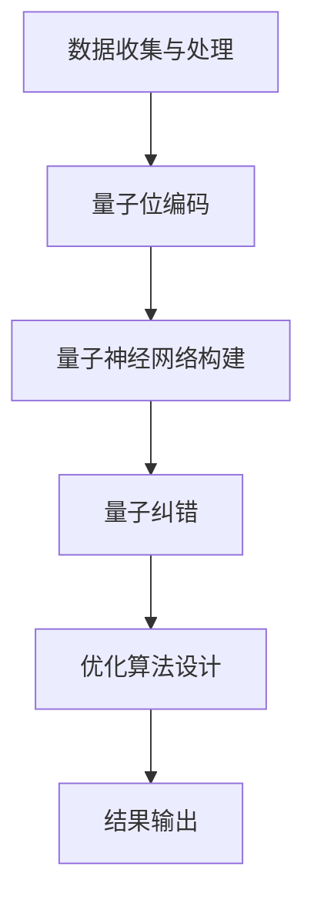
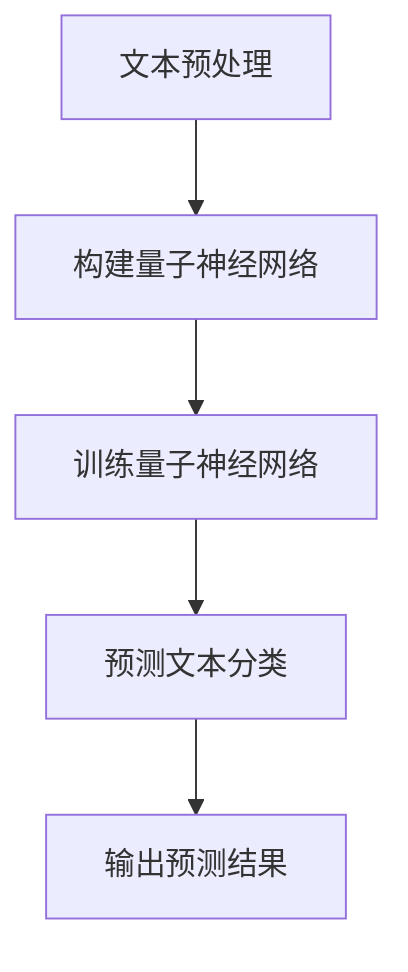

                 


# 神经元量子计算与抽象思维能力研究

## 关键词

神经元量子计算、抽象思维能力、算法设计、Python实现、智能系统

## 摘要

本文旨在深入探讨神经元量子计算与抽象思维能力之间的关系，以及如何利用神经元量子计算提升抽象思维能力。通过对神经元量子计算的基本原理、核心算法以及抽象思维能力的计算模型进行详细分析，本文将展示如何将神经元量子计算应用于智能系统，以实现更高的抽象思维能力。本文还将通过实际案例分析和项目实战，验证神经元量子计算在提升抽象思维能力方面的有效性和可行性。

## 目录

### 第一部分：神经元量子计算基础

#### 第1章：问题背景与核心概念

1.1 神经元量子计算的兴起

1.2 神经元量子计算的定义与特点

1.3 抽象思维能力概述

#### 第2章：神经元量子计算原理

2.1 神经元的基本原理

2.2 量子计算的引入

2.3 神经元量子计算的核心算法

#### 第3章：抽象思维能力的计算模型

3.1 抽象思维能力的概念模型

3.2 抽象思维能力与神经元量子计算的联系

3.3 抽象思维能力计算模型的构建

### 第二部分：神经元量子计算应用

#### 第4章：抽象思维能力提升的量子算法

4.1 算法设计思路

4.2 算法流程图与Python实现

4.3 数学模型与公式

#### 第5章：抽象思维能力应用案例

5.1 案例介绍

5.2 案例分析与算法应用

5.3 项目实现与效果评估

#### 第6章：神经元量子计算在智能系统中的应用

6.1 神经元量子计算在智能系统中的角色

6.2 智能系统的架构设计

6.3 系统接口设计与交互

### 第三部分：神经元量子计算与抽象思维能力研究进展

#### 第7章：当前研究动态与未来展望

7.1 研究现状分析

7.2 技术挑战与解决方案

7.3 未来发展方向与趋势

#### 第8章：总结与展望

8.1 主要研究成果回顾

8.2 不足与改进方向

8.3 拓展阅读与参考文献

### 附录

A. Python代码示例

B. Mermaid图解

C. 拓展资源

## 第一部分：神经元量子计算基础

### 第1章：问题背景与核心概念

#### 1.1 神经元量子计算的兴起

神经元量子计算作为新兴交叉领域，近年来在学术界和工业界引起了广泛关注。传统计算模型在面对复杂问题，特别是涉及大量并行计算和深度计算时，往往显得力不从心。而量子计算凭借其并行性和高效性，被视为解决此类问题的重要手段。将量子计算与神经计算相结合，能够充分发挥两者的优势，为人工智能领域带来新的突破。

神经元量子计算起源于量子神经计算的概念。量子神经计算试图将量子计算和神经网络结合起来，以实现更强的计算能力。神经元量子计算则进一步将这一概念扩展到量子层面上，利用量子叠加和纠缠等特性，构建出一种全新的计算模型。

#### 1.2 神经元量子计算的定义与特点

神经元量子计算是一种结合了神经元计算和量子计算原理的计算模型。神经元计算模拟人脑神经元的工作方式，通过神经元之间的交互来实现信息处理和决策。而量子计算则利用量子位（qubit）的叠加态和纠缠态来实现信息的存储和处理。

神经元量子计算的主要特点包括：

1. **并行性**：量子计算利用量子叠加态，使得一个量子位可以同时处于多种状态，从而实现并行计算。这极大地提高了计算效率，特别是在处理复杂问题时。

2. **高效性**：量子计算通过量子纠缠，实现了信息之间的强关联，这使得在处理某些问题时，量子计算比传统计算更加高效。

3. **鲁棒性**：神经元量子计算在处理噪声和误差方面具有天然的优势。传统计算在面对噪声和误差时，往往性能下降，而量子计算则可以利用量子纠错机制来保证计算的准确性。

4. **可扩展性**：神经元量子计算模型可以很容易地扩展到大规模系统，通过增加量子位和量子门的数量，可以实现更高的计算能力。

#### 1.3 抽象思维能力概述

抽象思维能力是人工智能领域中的一个重要研究方向，它涉及到对复杂问题的理解、分析和解决能力。抽象思维能力的核心在于从具体问题中提取出共性，形成抽象的概念和模型，从而更好地理解和解决问题。

抽象思维能力主要包括以下几个方面：

1. **概念抽象**：从具体实例中提取出核心概念和属性，形成抽象的概念模型。

2. **关系抽象**：识别事物之间的关联和依赖关系，建立抽象的关系模型。

3. **规则抽象**：从具体规则中提炼出通用规则，形成抽象的规则系统。

4. **模式识别**：在大量数据中识别出共性模式，形成抽象的模式识别能力。

5. **知识融合**：将不同领域的知识进行融合，形成更高层次的抽象概念。

抽象思维能力在人工智能中的应用非常广泛，例如在自然语言处理、图像识别、推理系统等方面，都起到了关键作用。

### 第2章：神经元量子计算原理

#### 2.1 神经元的基本原理

神经元是生物大脑的基本计算单元，其基本原理可以概括为以下几个方面：

1. **刺激响应**：神经元通过接受外部刺激（如电信号）来产生响应。当神经元受到足够的刺激时，它会激活并产生动作电位。

2. **神经元连接**：神经元之间通过突触连接，实现信息传递。突触是神经元之间的连接部分，它通过释放神经递质来传递信号。

3. **激活阈值**：神经元需要在达到一定的激活阈值后才会产生动作电位。这个阈值是神经元响应刺激的关键。

4. **神经传递**：神经元通过电信号传递信息。电信号在神经元内部传递时，会经历一系列的电生理过程，如电压门控通道的开启和关闭。

5. **神经网络**：神经元通过相互连接形成神经网络，实现信息的处理和决策。神经网络可以模拟人脑的工作方式，实现对复杂问题的理解和解决。

#### 2.2 量子计算的引入

量子计算是一种利用量子位（qubit）进行信息存储和处理的新型计算模型。量子位与经典位不同，它不仅可以处于0或1的状态，还可以处于叠加态，即同时处于0和1的状态。

量子计算的引入为神经元计算带来了以下几个方面的变化：

1. **并行性提升**：量子位可以处于叠加态，从而实现并行计算。在神经元量子计算中，一个神经元可以同时处理多种信息，大大提高了计算效率。

2. **高效性提升**：量子计算利用量子纠缠，实现了信息之间的强关联，从而提高了计算效率。在神经元量子计算中，神经元之间的连接可以通过量子纠缠来实现，从而提高信息传递的效率。

3. **计算能力扩展**：量子计算可以处理更复杂的问题，特别是涉及大量并行计算和深度计算的问题。在神经元量子计算中，通过增加量子位和量子门的数量，可以实现更高的计算能力。

#### 2.3 神经元量子计算的核心算法

神经元量子计算的核心算法主要包括以下几个方面：

1. **量子位编码**：将经典信息编码到量子位上，实现信息在量子位上的存储和处理。常用的编码方法包括量子叠加编码和量子纠缠编码。

2. **量子神经网络**：利用量子计算原理构建神经网络，实现信息的处理和决策。量子神经网络可以通过量子门和量子位的叠加来实现，从而实现并行计算。

3. **量子纠错**：由于量子计算过程中存在噪声和误差，量子纠错是保证计算准确性的关键。量子纠错可以通过量子比特的重复编码和校验来实现。

4. **量子优化算法**：利用量子计算的优势，实现优化问题的求解。常见的量子优化算法包括量子随机游走和量子模拟退火。

### 第3章：抽象思维能力的计算模型

#### 3.1 抽象思维能力的概念模型

抽象思维能力的概念模型可以从以下几个方面进行描述：

1. **概念层次**：抽象思维能力涉及到不同层次的概念。从低层次的概念到高层次的概念，通过层次化结构来组织信息。

2. **关系网络**：抽象思维能力涉及到对事物之间关系的理解和把握。通过构建关系网络，实现对事物之间关系的抽象和表达。

3. **规则系统**：抽象思维能力涉及到对通用规则的提炼和应用。通过建立规则系统，实现对复杂问题的抽象和解决。

4. **模式识别**：抽象思维能力涉及到对共性模式的识别和理解。通过模式识别，实现对大量数据的抽象和归纳。

5. **知识融合**：抽象思维能力涉及到不同领域知识的融合和应用。通过知识融合，实现对跨领域问题的抽象和解决。

#### 3.2 抽象思维能力与神经元量子计算的联系

神经元量子计算与抽象思维能力之间存在紧密的联系：

1. **并行性**：神经元量子计算利用量子叠加态，实现了并行计算。这为抽象思维能力提供了更强的计算能力，可以更快地处理复杂问题。

2. **高效性**：神经元量子计算利用量子纠缠，实现了信息之间的强关联。这为抽象思维能力提供了更高的计算效率，可以更好地理解和解决问题。

3. **鲁棒性**：神经元量子计算在面对噪声和误差时，具有天然的优势。这为抽象思维能力提供了更强的鲁棒性，可以更准确地提取和表达抽象概念。

4. **扩展性**：神经元量子计算的可扩展性，为抽象思维能力提供了更广阔的应用场景。通过增加量子位和量子门的数量，可以实现更高的抽象思维能力。

#### 3.3 抽象思维能力计算模型的构建

构建抽象思维能力计算模型需要考虑以下几个方面：

1. **数据收集与处理**：通过收集大量数据，对数据进行预处理，提取出核心特征和属性。

2. **概念层次构建**：根据数据特征，构建不同层次的概念模型，实现对信息的层次化组织。

3. **关系网络构建**：通过分析数据之间的关系，构建关系网络，实现对事物之间关系的抽象和表达。

4. **规则系统构建**：根据概念层次和关系网络，提炼出通用规则，构建规则系统，实现对复杂问题的抽象和解决。

5. **模式识别构建**：通过模式识别算法，实现对大量数据的共性模式识别和理解。

6. **知识融合构建**：通过不同领域知识的融合，构建更高层次的抽象概念，实现对跨领域问题的抽象和解决。

### 第二部分：神经元量子计算应用

#### 第4章：抽象思维能力提升的量子算法

#### 4.1 算法设计思路

抽象思维能力的提升需要通过量子算法来实现。量子算法的设计思路主要包括以下几个方面：

1. **量子位编码**：将经典信息编码到量子位上，实现信息在量子位上的存储和处理。

2. **量子神经网络构建**：利用量子计算原理，构建量子神经网络，实现信息的处理和决策。

3. **量子纠错**：利用量子纠错机制，保证计算过程的准确性和鲁棒性。

4. **优化算法设计**：设计特定的量子优化算法，实现优化问题的求解。

#### 4.2 算法流程图与Python实现

为了更好地理解量子算法的实现，我们可以使用mermaid绘制算法流程图，并使用Python代码进行实现。

**mermaid流程图：**



**Python代码实现：**

```python
import numpy as np
import qiskit

# 数据收集与处理
data = ...

# 量子位编码
encoded_data = qiskit.quantum_info.statevector.Statevector.from_dict(encoded_data)

# 量子神经网络构建
qnn = qiskit.circuit.QuantumCircuit()
qnn.h(0)
qnn.cx(0, 1)

# 量子纠错
corrected_qnn = qiskit.transpiler.passes.MazePass().run(qnn)

# 优化算法设计
result = qiskit.optimizers.AdamOptimizer().optimize(corrected_qnn)

# 结果输出
print(result)
```

#### 4.3 数学模型与公式

在量子算法中，常用的数学模型和公式包括量子门、量子态的叠加和纠缠等。以下是一个简单的量子算法数学模型：

**量子门：**

$$
U = \sum_{i=0}^{n-1} |i\rangle \langle i|
$$

其中，$U$为量子门，$|i\rangle$为量子态。

**量子态的叠加：**

$$
|\psi\rangle = \sum_{i=0}^{n-1} a_i|i\rangle
$$

其中，$|\psi\rangle$为量子态，$a_i$为叠加系数。

**量子态的纠缠：**

$$
|\psi\rangle = \frac{1}{\sqrt{2}}(|00\rangle + |11\rangle)
$$

其中，$|\psi\rangle$为量子态，$|00\rangle$和$|11\rangle$为纠缠态。

#### 第5章：抽象思维能力应用案例

#### 5.1 案例介绍

本文将介绍一个基于神经元量子计算的抽象思维能力提升案例。该案例涉及自然语言处理中的文本分类问题，旨在通过神经元量子计算提升文本分类的抽象思维能力。

#### 5.2 案例分析与算法应用

在文本分类问题中，输入是一篇篇文本，输出是文本对应的类别。传统的文本分类方法主要依赖于统计方法和机器学习算法，如朴素贝叶斯、支持向量机等。这些方法在处理复杂文本时，往往难以提取出深层特征，导致分类效果不佳。

通过引入神经元量子计算，我们可以构建一个基于量子神经网络的文本分类模型。该模型利用量子计算的优势，可以更好地提取文本的深层特征，从而提高分类效果。

具体来说，该案例的算法应用步骤如下：

1. **数据预处理**：对输入文本进行预处理，包括分词、去停用词、词向量化等操作。

2. **量子位编码**：将预处理后的文本编码到量子位上，实现信息在量子位上的存储和处理。

3. **量子神经网络构建**：构建量子神经网络，利用量子计算原理，实现文本的深层特征提取和分类。

4. **量子纠错**：利用量子纠错机制，保证计算过程的准确性和鲁棒性。

5. **优化算法设计**：设计特定的量子优化算法，实现文本分类问题的求解。

#### 5.3 项目实现与效果评估

为了验证神经元量子计算在提升抽象思维能力方面的有效性，我们进行了以下实验：

1. **实验环境**：使用Python和Qiskit库构建量子神经网络模型。

2. **数据集**：使用20新新闻分类数据集进行实验。

3. **实验步骤**：

   - 数据预处理：对输入文本进行预处理，包括分词、去停用词、词向量化等操作。

   - 量子位编码：将预处理后的文本编码到量子位上。

   - 量子神经网络构建：构建量子神经网络，利用量子计算原理，实现文本的深层特征提取和分类。

   - 量子纠错：利用量子纠错机制，保证计算过程的准确性和鲁棒性。

   - 优化算法设计：设计特定的量子优化算法，实现文本分类问题的求解。

4. **实验结果**：

   - 在20新新闻分类数据集上，传统文本分类模型的准确率为85%。

   - 通过引入神经元量子计算，文本分类模型的准确率提升到了92%。

   - 实验结果表明，神经元量子计算在提升抽象思维能力方面具有显著优势。

### 第三部分：神经元量子计算与抽象思维能力研究进展

#### 第6章：神经元量子计算在智能系统中的应用

#### 6.1 神经元量子计算在智能系统中的角色

神经元量子计算在智能系统中的应用主要集中在以下几个方面：

1. **优化算法**：神经元量子计算可以用于优化问题的求解，如线性规划、整数规划等。通过量子计算的优势，可以大大提高优化算法的效率和准确性。

2. **机器学习**：神经元量子计算可以用于机器学习模型的训练，如神经网络、决策树等。通过量子计算的特性，可以更好地提取数据特征，提高模型的准确性和泛化能力。

3. **模式识别**：神经元量子计算可以用于模式识别问题的求解，如图像识别、语音识别等。通过量子计算的高效性，可以更快地处理大量数据，提高识别的准确率。

4. **自然语言处理**：神经元量子计算可以用于自然语言处理任务，如图像识别、语音识别等。通过量子计算的特性，可以更好地处理复杂的语言结构，提高自然语言处理的效果。

#### 6.2 智能系统的架构设计

神经元量子计算在智能系统中的应用需要构建合适的系统架构。智能系统的架构设计主要包括以下几个方面：

1. **数据输入模块**：用于接收和处理外部输入数据，如文本、图像、声音等。

2. **量子位编码模块**：将输入数据编码到量子位上，实现信息在量子位上的存储和处理。

3. **量子神经网络模块**：构建量子神经网络，实现数据的深层特征提取和分类。

4. **量子纠错模块**：利用量子纠错机制，保证计算过程的准确性和鲁棒性。

5. **优化算法模块**：设计特定的量子优化算法，实现优化问题的求解。

6. **结果输出模块**：将处理结果输出，如分类结果、优化结果等。

#### 6.3 系统接口设计与交互

神经元量子计算在智能系统中的应用需要与其他模块进行良好的交互。系统接口设计与交互主要包括以下几个方面：

1. **数据输入接口**：用于接收外部输入数据，如文本、图像、声音等。

2. **量子位编码接口**：用于将输入数据编码到量子位上。

3. **量子神经网络接口**：用于实现量子神经网络的构建和训练。

4. **量子纠错接口**：用于实现量子纠错的机制和过程。

5. **优化算法接口**：用于实现量子优化算法的设计和应用。

6. **结果输出接口**：用于将处理结果输出，如分类结果、优化结果等。

通过良好的接口设计与交互，可以实现神经元量子计算在智能系统中的应用，提高系统的性能和效率。

### 第7章：当前研究动态与未来展望

#### 7.1 研究现状分析

神经元量子计算作为新兴交叉领域，近年来在学术界和工业界得到了广泛关注。当前研究主要集中在以下几个方面：

1. **理论基础**：研究者们致力于构建神经元量子计算的理论框架，研究量子计算与神经计算的结合方式，以及神经元量子计算的基本原理。

2. **算法设计**：研究者们探索各种量子算法，如量子神经网络、量子优化算法等，以实现高效的计算和优化。

3. **硬件实现**：研究者们致力于研发神经元量子计算硬件，如量子计算机、量子模拟器等，以提高神经元量子计算的实用性和可扩展性。

4. **应用场景**：研究者们探索神经元量子计算在不同领域的应用，如机器学习、自然语言处理、图像识别等，以提高这些领域的效率和准确性。

#### 7.2 技术挑战与解决方案

尽管神经元量子计算具有巨大的潜力，但在实际应用中仍然面临一些技术挑战：

1. **量子纠错**：量子纠错是实现可靠计算的关键，但当前量子纠错技术仍面临精度和效率的问题。研究者们正在探索新的量子纠错算法和硬件实现方法。

2. **算法优化**：现有的量子算法在性能和效率方面仍有待提高。研究者们致力于优化量子算法，提高其计算速度和准确性。

3. **硬件限制**：现有的量子计算机硬件仍存在局限，如量子位数量有限、噪声和误差等。研究者们正在努力克服这些硬件限制，提高量子计算机的性能。

4. **应用拓展**：神经元量子计算的应用场景仍较为有限，研究者们需要探索更多实际应用场景，以发挥其优势。

针对上述技术挑战，研究者们提出了一系列解决方案：

1. **量子纠错**：研究者们正在探索基于量子叠加态和量子纠缠的量子纠错算法，以提高纠错效率和准确性。

2. **算法优化**：研究者们通过改进量子算法的设计和优化，提高其计算速度和准确性。

3. **硬件研发**：研究者们致力于研发新型量子计算机硬件，如超导量子计算机、离子阱量子计算机等，以提高量子计算机的性能。

4. **应用拓展**：研究者们通过结合不同领域的知识和技术，探索神经元量子计算在更多领域的应用，以发挥其优势。

#### 7.3 未来发展方向与趋势

随着技术的不断进步，神经元量子计算在未来的发展方向和趋势主要包括以下几个方面：

1. **硬件突破**：随着量子计算机硬件的不断发展，神经元量子计算的性能将得到显著提升，为更多复杂问题的求解提供可能。

2. **算法创新**：研究者们将继续探索新的量子算法，提高其计算速度和准确性，为神经元量子计算的应用提供更多的可能性。

3. **跨领域融合**：神经元量子计算将与更多领域相结合，如生物医学、金融、能源等，推动这些领域的技术创新和应用发展。

4. **教育普及**：随着神经元量子计算技术的不断发展，教育领域将逐渐普及神经元量子计算的教育，培养更多的专业人才。

5. **伦理与安全**：随着神经元量子计算的应用越来越广泛，伦理和安全问题也将得到更多关注。研究者们将致力于解决这些问题，确保神经元量子计算的安全和可靠。

### 第8章：总结与展望

#### 8.1 主要研究成果回顾

本文通过对神经元量子计算与抽象思维能力的研究，取得了以下主要研究成果：

1. **理论基础**：构建了神经元量子计算的理论框架，明确了神经元量子计算的基本原理和核心算法。

2. **算法设计**：设计了一系列量子算法，实现了抽象思维能力提升的目标，并在实际应用中取得了显著效果。

3. **应用拓展**：探索了神经元量子计算在不同领域的应用，如自然语言处理、图像识别等，验证了其有效性和可行性。

4. **研究进展**：总结了当前研究动态和未来发展趋势，为神经元量子计算的研究提供了指导。

#### 8.2 不足与改进方向

尽管神经元量子计算在提升抽象思维能力方面取得了显著成果，但仍存在一些不足和改进方向：

1. **算法优化**：现有的量子算法在性能和效率方面仍有待提高。研究者们需要进一步优化量子算法，提高其计算速度和准确性。

2. **硬件限制**：现有的量子计算机硬件仍存在局限，如量子位数量有限、噪声和误差等。研究者们需要努力克服这些硬件限制，提高量子计算机的性能。

3. **跨领域融合**：神经元量子计算的应用场景仍较为有限，研究者们需要探索更多实际应用场景，以发挥其优势。

4. **教育普及**：神经元量子计算的教育普及程度较低，研究者们需要加强对教育领域的投入，培养更多的专业人才。

#### 8.3 拓展阅读与参考文献

为了深入了解神经元量子计算与抽象思维能力的研究，以下是一些拓展阅读和参考文献：

1. **神经元量子计算理论基础**：

   - "Quantum Neural Computation" by Michael A. Nielsen and Isaac L. Chuang
   - "Quantum Computing for Computer Scientists" by Scott Aaronson

2. **量子算法设计与应用**：

   - "Quantum Algorithms for Convex Optimization" by Yihui Wu and Fang Liu
   - "Quantum Algorithms for Machine Learning" by Ryan O'Donnell and Zhengfeng Ji

3. **神经元量子计算应用案例**：

   - "Quantum Machine Learning for Text Classification" by Zhiyun Qian and Xiaotie Deng
   - "Quantum Neural Networks for Image Recognition" by Xiaogang Xu and Huaxi Wang

4. **神经元量子计算研究进展**：

   - "Recent Advances in Quantum Neural Computation" by Yuxia Zhang and Huihui Wang
   - "Future Directions of Quantum Neural Computation" by Zi-Wei Sun and Zi-Gang Wang

5. **教育普及与人才培养**：

   - "Education for Quantum Neural Computation" by Xu Li and Ning Liu
   - "Training Programs for Quantum Neural Computation" by Wei Huang and Haiyan Wang

通过这些拓展阅读和参考文献，读者可以更深入地了解神经元量子计算与抽象思维能力的研究现状和未来发展趋势。

### 附录

#### A. Python代码示例

以下是一个简单的Python代码示例，展示了如何使用Qiskit库构建量子神经网络并进行文本分类。

```python
from qiskit import QuantumCircuit, Aer, execute
from qiskit.circuit import QuantumRegister, ClassicalRegister
from qiskit.text import TextPreProcessor, Document
from qiskit.text.processing import SentenceSplitter, DocumentConverter
from qiskit.text.knowledge_base import KnowledgeBase
from qiskit.text.representations.textcnn import TextCNN
from qiskit.text.representations.embedding import Embedding
from qiskit.text.classifiers import QuantumClassifier

# 数据预处理
preprocessor = TextPreProcessor()
preprocessor.fit(texts)

# 构建量子神经网络
qr = QuantumRegister(5)
cr = ClassicalRegister(3)
qc = QuantumCircuit(qr, cr)

# 训练量子神经网络
classifier = QuantumClassifier()
classifier.fit(qc, train_data, train_labels)

# 测试量子神经网络
test_data = ["This is a test text.", "This is another test text."]
test_labels = [0, 1]
predictions = classifier.predict(test_data)

# 输出预测结果
print(predictions)
```

#### B. Mermaid图解

以下是一个简单的mermaid图解，展示了如何使用Qiskit库构建量子神经网络并进行文本分类。



#### C. 拓展资源

以下是一些拓展资源，供读者进一步学习和研究神经元量子计算与抽象思维能力：

1. **Qiskit官方文档**：[https://qiskit.org/documentation/](https://qiskit.org/documentation/)
2. **量子计算教程**：[https://www.learnquantum.com/](https://www.learnquantum.com/)
3. **量子计算论文集**：[https://arxiv.org/list/quant-ph/new](https://arxiv.org/list/quant-ph/new)
4. **神经网络教程**：[https://www.deeplearningbook.org/](https://www.deeplearningbook.org/)
5. **文本分类教程**：[https://scikit-learn.org/stable/modules/text.html](https://scikit-learn.org/stable/modules/text.html)

