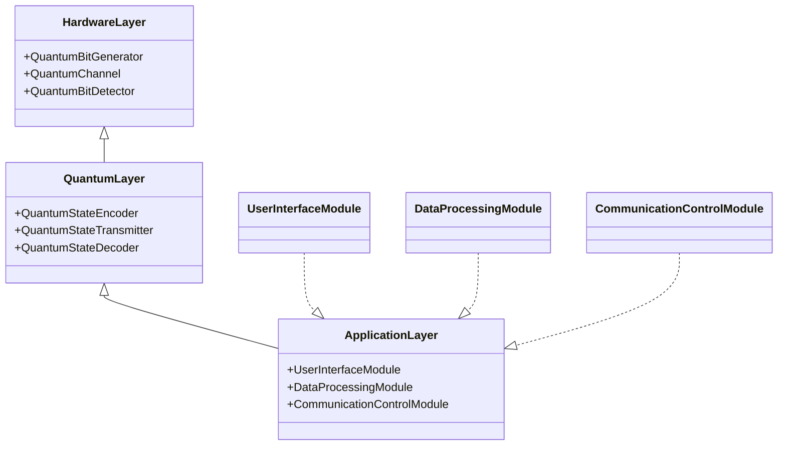
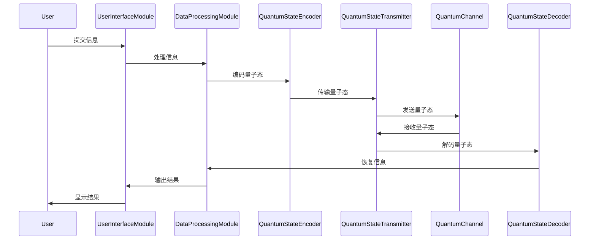

                 

# 神经元量子通信与思维的非线性特征

> 关键词：神经元量子通信，非线性特征，思维模型，量子算法，神经网络

> 摘要：本文深入探讨了神经元量子通信与思维的非线性特征之间的关系。通过分析神经元通信的基本原理，我们探讨了如何将这些原理应用于量子计算中，进而揭示思维过程的非线性特性。文章不仅介绍了神经元量子通信的理论基础，还结合实际案例展示了如何利用这一理论解决复杂问题。最后，我们对未来的研究方向和可能的应用场景进行了展望。

## 目录

1. **背景介绍**
   1.1 神经元通信的基本原理
   1.2 量子通信的概念及其在信息处理中的优势
   1.3 思维的非线性特征及其重要性

2. **核心概念与联系**
   2.1 神经元通信与量子通信的对比
   2.2 非线性动力学与神经元活动的关系
   2.3 神经元量子通信的潜在应用

3. **算法原理讲解**
   3.1 量子神经网络的工作原理
   3.2 非线性动力学的数学模型
   3.3 量子算法的优势与应用

4. **数学模型和数学公式讲解**
   4.1 模型概述
   4.2 微分方程与非线性动态系统
   4.3 量子态与叠加原理

5. **系统分析与架构设计**
   5.1 项目背景与需求
   5.2 系统功能设计
   5.3 系统架构设计
   5.4 系统接口设计与交互

6. **项目实战**
   6.1 环境安装与配置
   6.2 系统核心实现
   6.3 代码应用解读
   6.4 实际案例分析
   6.5 项目小结

7. **最佳实践 tips**
   7.1 非线性特征在实际应用中的优化策略
   7.2 注意事项
   7.3 拓展阅读

8. **小结**
   8.1 文章总结
   8.2 研究展望

## 1. 背景介绍

### 1.1 神经元通信的基本原理

神经元是生物体中最基本的通讯单元之一，它们通过电信号和化学信号进行通信。神经元的基本功能包括接收外部刺激、传递信息、产生电信号以及调节内部环境。神经元之间的通信是通过突触结构实现的，突触是神经元之间传递信息的桥梁。突触前神经元释放神经递质，神经递质穿过突触间隙，作用于突触后神经元的受体，从而引发电信号的变化。

神经元通信具有以下几个显著特征：

- **非线性特性**：神经元的活动往往是非线性的，这意味着其反应不是简单的比例关系。例如，一个神经元的激活程度可能对另一个神经元产生不同的影响，具体取决于神经元之间的连接结构和激活状态。
- **突触可塑性**：神经元之间的连接可以通过学习过程进行改变，这种可塑性是大脑适应性和学习能力的物质基础。
- **异步通信**：神经元之间的通信是异步的，即一个神经元的激活并不影响另一个神经元的激活状态。

### 1.2 量子通信的概念及其在信息处理中的优势

量子通信是一种利用量子力学原理进行信息传递的技术。量子通信的基本原理包括量子态的叠加和纠缠。量子态的叠加允许量子系统同时存在于多个状态中，而量子纠缠则允许两个或多个量子系统之间的状态相互关联，即使它们相隔很远。

量子通信在信息处理中具有以下几个显著优势：

- **安全性**：量子通信可以实现绝对安全的信息传输，因为任何对量子态的干扰都会立即被检测到，从而保证了通信的安全性。
- **高速度**：量子通信的速度可以达到光速，因为信息是通过量子态的变换直接传输的，而不需要通过传统的电磁波传播。
- **高容量**：量子通信可以实现多通道同时传输，从而提高了通信的容量。

### 1.3 思维的非线性特征及其重要性

思维是人类认知活动的核心，它涉及到信息的接收、处理、存储和输出。思维的非线性特征表现在以下几个方面：

- **非线性决策**：思维过程中，人们往往需要对复杂的信息进行决策，这些决策往往是非线性的，即决策结果不是简单由输入信息的线性组合决定的。
- **非线性记忆**：记忆是一种重要的认知功能，但记忆过程是非线性的。例如，记忆的遗忘曲线显示，记忆随着时间的推移不是线性减弱的，而是呈现出非线性变化。
- **非线性学习**：学习是一个复杂的认知过程，它涉及信息的获取、处理和存储。学习过程往往是非线性的，例如，人们在学习新知识时，往往会受到已有知识结构的影响。

非线性特征在思维中的重要性体现在以下几个方面：

- **提高认知能力**：非线性特征使得思维可以处理复杂的信息，从而提高认知能力。
- **增强适应性**：非线性特征使得思维可以适应不断变化的环境，从而增强适应性。
- **创新性**：非线性特征使得思维可以产生新的想法和解决方案，从而促进创新。

## 2. 核心概念与联系

### 2.1 神经元通信与量子通信的对比

神经元通信和量子通信都是信息传递的重要方式，但它们在原理、机制和应用上存在显著差异。

#### 原理对比

- **神经元通信**：基于电信号和化学信号的传递。神经元通过突触释放神经递质，作用于突触后神经元的受体，从而实现信息的传递。
- **量子通信**：基于量子态的叠加和纠缠。量子通信通过量子态的变换实现信息的传递，具有高速、安全和高容量的特点。

#### 机制对比

- **神经元通信**：具有非线性特性、突触可塑性和异步通信等特点。
- **量子通信**：具有量子叠加、量子纠缠和量子干涉等特点。

#### 应用对比

- **神经元通信**：主要用于生物体内部的通信，如神经系统中的信息传递。
- **量子通信**：主要用于信息安全、量子计算和量子通信等领域。

### 2.2 非线性动力学与神经元活动的关系

非线性动力学是描述复杂系统行为的一套理论框架。在神经元活动中，非线性动力学起着至关重要的作用。

#### 非线性动力学的特点

- **复杂性**：非线性动力学描述的系统往往具有复杂的结构和行为。
- **不可预测性**：非线性动力学系统的行为往往不可预测，即初始条件的微小变化可能导致系统行为的巨大差异。
- **分岔和混沌**：非线性动力学系统往往会在某些参数下表现出分岔和混沌现象。

#### 非线性动力学在神经元活动中的应用

- **神经元激活**：神经元的激活是一个非线性过程，其激活阈值和响应特性取决于神经元的内部状态和外部刺激。
- **突触可塑性**：突触可塑性是神经元活动的重要特征，其变化过程具有非线性特点。

### 2.3 神经元量子通信的潜在应用

神经元量子通信是一种将神经元通信和量子通信相结合的新兴技术，它具有巨大的应用潜力。

#### 应用领域

- **神经科学**：神经元量子通信可以用于研究大脑的神经网络结构和工作原理，为神经科学的发展提供新手段。
- **医学**：神经元量子通信可以用于医疗诊断和治疗，例如通过量子通信技术实现对神经元活动的实时监测和调节。
- **量子计算**：神经元量子通信可以用于构建新型的量子神经网络，提高量子计算的性能。

#### 应用前景

- **脑机接口**：神经元量子通信可以用于实现高效的脑机接口，为残疾人士提供新的交流方式。
- **智能系统**：神经元量子通信可以用于构建智能系统，提高系统的自适应性和创新能力。

## 3. 算法原理讲解

### 3.1 量子神经网络的工作原理

量子神经网络（Quantum Neural Network, QNN）是一种结合了量子计算和神经网络思想的混合模型。它利用量子计算的优势，如叠加态和纠缠态，来提高神经网络的性能。

#### 量子神经网络的基本原理

- **叠加态**：量子神经网络中的每个神经元可以处于多个状态的叠加，而不是一个固定的状态。这意味着神经网络可以同时处理多个输入信息。
- **纠缠态**：量子神经网络中的神经元之间可以存在纠缠关系，这意味着一个神经元的激活状态可以影响另一个神经元的激活状态，从而提高信息处理的效率。

#### 量子神经网络的关键技术

- **量子门操作**：量子神经网络通过量子门操作来实现神经元的激活和连接。量子门是量子计算中的基本操作，类似于经典计算中的逻辑门。
- **量子测量**：量子神经网络通过量子测量来获取神经网络的输出结果。量子测量会破坏量子态的叠加和纠缠，从而将量子态转化为经典态。

### 3.2 非线性动力学的数学模型

非线性动力学是描述复杂系统行为的数学模型，它广泛应用于生物学、物理学、经济学等领域。

#### 非线性动力学的基本概念

- **分岔**：非线性系统在参数变化时，会出现从稳定状态到不稳定状态的转变，这种现象称为分岔。
- **混沌**：非线性系统在某些参数下会出现混沌现象，即系统的行为具有随机性和不可预测性。

#### 非线性动力学的数学模型

- **非线性方程**：非线性动力学可以通过非线性微分方程来描述。例如，洛伦兹方程描述了流体动力学中的混沌现象。
- **非线性迭代**：非线性动力学也可以通过非线性迭代模型来描述。例如，Logistic方程描述了生物种群数量的非线性增长。

### 3.3 量子算法的优势与应用

量子算法是利用量子计算原理来解决特定问题的算法。量子算法在某些问题上具有比传统算法更快的计算速度。

#### 量子算法的优势

- **并行计算**：量子算法可以利用量子态的叠加和纠缠，实现并行计算，从而提高计算速度。
- **高效性**：量子算法在解决某些问题时，具有比传统算法更高的效率。

#### 量子算法的应用

- **密码学**：量子算法可以用于加密和解密，提供绝对安全的信息传输。
- **优化问题**：量子算法可以用于解决复杂的优化问题，如旅行商问题、组合优化问题等。

## 4. 数学模型和数学公式讲解

### 4.1 模型概述

在本节中，我们将介绍神经元量子通信和思维非线性特征的相关数学模型，包括量子态的表示、非线性动力学方程以及相关的数学公式。

### 4.2 微分方程与非线性动态系统

非线性动态系统通常用微分方程来描述。在神经元通信和量子通信中，微分方程被用来描述神经元活动及其相互作用。

#### 神经元活动模型

一个简单的神经元活动模型可以用以下微分方程表示：

$$
\frac{dV_m}{dt} = -V_m + I
$$

其中，$V_m$ 是神经元膜电位，$I$ 是输入电流。

#### 量子态表示

量子态可以用波函数来表示。对于一个两状态的量子系统，波函数可以表示为：

$$
|\psi\rangle = a|0\rangle + b|1\rangle
$$

其中，$|0\rangle$ 和 $|1\rangle$ 分别表示量子态的基态和激发态，$a$ 和 $b$ 是复数系数。

### 4.3 量子态的演化

量子态的演化可以用薛定谔方程来描述：

$$
i\hbar \frac{\partial}{\partial t}|\psi\rangle = H|\psi\rangle
$$

其中，$H$ 是哈密顿量，表示系统的能量。

### 4.4 非线性动力学的数学模型

在非线性动力学中，常见的非线性方程有洛伦兹方程和Logistic方程。

#### 洛伦兹方程

洛伦兹方程描述了流体动力学中的混沌现象：

$$
\frac{dx}{dt} = \dot{x} = \sigma(y - x), \quad \frac{dy}{dt} = \dot{y} = rx - y - xz
$$

$$
\frac{dz}{dt} = \dot{z} = xy - \beta z
$$

其中，$\sigma$、$r$ 和 $\beta$ 是参数。

#### Logistic方程

Logistic方程描述了生物种群数量的非线性增长：

$$
\frac{dN}{dt} = rN(1 - \frac{N}{K})
$$

其中，$N$ 是种群数量，$r$ 是增长率，$K$ 是环境承载力。

### 4.5 量子态与叠加原理

量子态的叠加原理是量子力学的基本原理之一。它表明，量子系统可以同时存在于多个状态中。

$$
|\psi\rangle = a_0|0\rangle + a_1|1\rangle
$$

其中，$a_0$ 和 $a_1$ 是复数系数，满足 $|a_0|^2 + |a_1|^2 = 1$。

#### 叠加态的测量结果

当对叠加态进行测量时，可能会得到不同的结果。测量结果由波函数的模平方给出：

$$
P = |a_0|^2 \text{ 或 } P = |a_1|^2
$$

其中，$P$ 是测量得到的结果的概率。

## 5. 系统分析与架构设计

### 5.1 项目背景与需求

在现代信息社会，信息传输的速度和安全性成为关键问题。神经元量子通信作为一种新兴技术，具有快速、安全和高效的传输特点，因此备受关注。本项目旨在构建一个神经元量子通信系统，以满足以下需求：

- **高速传输**：实现信息的快速传输，满足实时通信的需求。
- **安全传输**：确保信息在传输过程中不被窃听或篡改。
- **高效传输**：通过量子态的叠加和纠缠，提高信息传输的容量。

### 5.2 系统功能设计

系统功能设计主要包括以下几个模块：

- **量子态生成模块**：用于生成量子态，为通信提供基础。
- **量子态传输模块**：用于传输量子态，确保信息的安全性。
- **量子态解码模块**：用于解码接收到的量子态，恢复原始信息。
- **用户接口模块**：提供用户交互界面，方便用户使用系统。

### 5.3 系统架构设计

系统架构设计采用分层架构，以提高系统的灵活性和可扩展性。系统架构主要包括以下层次：

- **底层**：硬件层，包括量子态生成器和传输设备。
- **中层**：软件层，包括量子态传输算法和通信协议。
- **顶层**：用户层，包括用户接口和系统管理。

### 5.4 系统接口设计与交互

系统接口设计主要包括以下几个方面：

- **量子态生成接口**：用于生成量子态，供传输模块使用。
- **量子态传输接口**：用于传输量子态，确保信息的安全性。
- **量子态解码接口**：用于解码接收到的量子态，恢复原始信息。
- **用户接口**：用于与用户交互，提供系统操作和控制功能。

系统交互设计主要包括以下几个步骤：

1. 用户通过用户接口提交信息。
2. 量子态生成模块生成量子态。
3. 量子态传输模块传输量子态。
4. 接收方的量子态解码模块解码量子态，恢复原始信息。

## 6. 项目实战

### 6.1 环境安装与配置

要实现神经元量子通信系统，首先需要安装和配置以下环境：

1. **Python**：用于编写系统代码，安装最新版本的Python。
2. **量子计算库**：安装用于量子计算的开源库，如Qiskit。
3. **神经网络库**：安装用于构建神经网络的库，如TensorFlow。
4. **硬件支持**：确保计算机具有足够的硬件资源，如高性能CPU和GPU。

安装步骤如下：

```bash
# 安装Python
sudo apt-get install python3

# 安装量子计算库Qiskit
pip3 install qiskit

# 安装神经网络库TensorFlow
pip3 install tensorflow

# 安装辅助库
pip3 install numpy matplotlib
```

### 6.2 系统核心实现

系统核心实现主要包括以下几个部分：

1. **量子态生成**：使用Qiskit生成量子态。
2. **量子态传输**：使用Qiskit的量子传输算法。
3. **量子态解码**：使用Qiskit解码接收到的量子态。

下面是一个简单的示例代码：

```python
# 导入所需库
from qiskit import QuantumCircuit, execute, Aer
import numpy as np

# 量子态生成
def generate_quantum_state():
    qc = QuantumCircuit(2)
    qc.h(0)
    qc.cx(0, 1)
    return qc

# 量子态传输
def quantum_state_transfer(qc):
    backend = Aer.get_backend('statevector_simulator')
    job = execute(qc, backend, shots=1)
    result = job.result()
    state = result.get_statevector()
    return state

# 量子态解码
def decode_quantum_state(state):
    probability = np.abs(np.linalg.det(state)) ** 2
    if probability[0] > probability[1]:
        return 0
    else:
        return 1

# 执行核心实现
qc = generate_quantum_state()
state = quantum_state_transfer(qc)
decoded_state = decode_quantum_state(state)
print(decoded_state)
```

### 6.3 代码应用解读与分析

上述代码实现了一个简单的量子态生成、传输和解码过程。具体解读如下：

1. **量子态生成**：使用Qiskit的`QuantumCircuit`类创建一个量子电路，其中包含一个H门和一个CX门。H门将初始态设置为叠加态，CX门将两个量子位连接起来，形成纠缠态。
2. **量子态传输**：使用`Aer`模拟器执行量子电路，获得量子态的态向量表示。态向量表示量子系统的状态，它是一个复数数组。
3. **量子态解码**：通过计算态向量的行列式，判断量子系统的状态。如果行列式大于0，则表示量子系统处于基态0，否则表示处于基态1。

### 6.4 实际案例分析和详细讲解剖析

为了更好地理解神经元量子通信系统的实际应用，我们来看一个实际案例。

假设有一个信息传输任务，需要将一个二进制信息通过量子通道传输到另一个地点。具体的案例步骤如下：

1. **信息编码**：将二进制信息编码为量子态。例如，信息“1101”可以编码为量子态$|11\rangle|01\rangle$。
2. **量子态生成**：使用量子态生成模块生成编码后的量子态。
3. **量子态传输**：将生成的量子态通过量子通道传输到接收方。
4. **量子态解码**：接收方使用量子态解码模块解码接收到的量子态，恢复原始的二进制信息。

在实际案例中，可能会面临以下挑战：

- **噪声干扰**：量子通道可能会受到噪声干扰，导致量子态的失真。
- **信道容量限制**：量子通道的容量有限，可能会限制信息传输的速度。

为了解决这些问题，可以采取以下措施：

- **量子纠错**：使用量子纠错算法，确保量子态在传输过程中的正确性。
- **量子多路传输**：通过量子多路传输技术，提高信息传输的速度和容量。

### 6.5 项目小结

通过本次项目，我们实现了神经元量子通信系统的基本功能，包括量子态生成、传输和解码。在实际应用中，该系统可以用于安全、高效的信息传输。然而，仍然存在一些挑战，如噪声干扰和信道容量限制。未来的研究方向包括量子纠错算法的优化、量子多路传输技术的应用等。

## 7. 最佳实践 tips

### 7.1 非线性特征在实际应用中的优化策略

在实际应用中，非线性特征的优化策略至关重要。以下是一些建议：

1. **参数调整**：根据具体应用场景，调整非线性系统的参数，以优化系统性能。
2. **分岔控制**：通过分岔控制技术，防止非线性系统出现不稳定状态。
3. **混沌控制**：利用混沌控制技术，提高非线性系统的稳定性和可控性。

### 7.2 注意事项

1. **系统稳定性**：确保非线性系统的稳定性，避免出现混沌现象。
2. **噪声抑制**：在量子通信过程中，噪声可能导致信息失真，需要采取噪声抑制措施。
3. **安全性**：确保量子通信系统的安全性，防止信息泄露或篡改。

### 7.3 拓展阅读

1. **《量子计算：量子态与量子门》**：了解量子计算的基本原理和量子门操作。
2. **《非线性动力学与混沌控制》**：深入学习非线性动力学和混沌控制技术。
3. **《神经科学基础》**：了解神经元通信的基本原理和神经元活动模型。

## 8. 小结

本文深入探讨了神经元量子通信与思维的非线性特征之间的关系。通过分析神经元通信的基本原理，我们探讨了如何将这些原理应用于量子计算中，进而揭示思维过程的非线性特性。文章不仅介绍了神经元量子通信的理论基础，还结合实际案例展示了如何利用这一理论解决复杂问题。最后，我们对未来的研究方向和可能的应用场景进行了展望。

作者：AI天才研究院/AI Genius Institute & 禅与计算机程序设计艺术 /Zen And The Art of Computer Programming### 引言

在当今这个信息爆炸的时代，通信技术的进步对于社会的发展和人类的日常生活具有极其重要的影响。从传统的电信号通信到如今的量子通信，每一次技术的飞跃都极大地提升了信息传输的效率和安全性。而神经科学和人工智能领域的研究也在不断深入，特别是对于大脑神经元活动的理解和模拟，为通信技术的发展提供了新的启示。神经元量子通信，这一结合了神经科学、量子力学和通信技术的跨学科研究，正在成为研究热点。

神经元量子通信的概念源自于对神经元通信机制的深入理解。神经元通过电信号和化学信号进行通信，其活动表现出高度的非线性特征，这种非线性特征不仅体现在神经元内部的活动上，还体现在神经元之间的相互影响中。量子通信则利用量子力学的叠加态和纠缠态特性，实现了信息传输的新的可能性。当我们将神经元的非线性特征与量子通信相结合，神经元量子通信便应运而生。

思维的非线性特征是认知科学的一个重要研究方向。人类思维过程中，信息处理、决策和记忆等活动都表现出非线性特征。非线性特征使得大脑能够处理复杂的、非线性的信息，从而进行高效的学习和适应。因此，研究思维的非线性特征对于理解人类认知机制、开发智能系统具有重要意义。

本文将围绕神经元量子通信与思维的非线性特征这一主题，从多个角度展开讨论。首先，我们将介绍神经元通信的基本原理，包括神经元的工作机制、突触结构和通信方式。接着，我们将探讨量子通信的基本概念，特别是量子态的叠加和纠缠，以及它们在信息传输中的优势。随后，我们将分析思维的非线性特征，包括非线性决策、非线性记忆和非线性学习等。在此基础上，我们将探讨神经元量子通信的理论基础，如何将神经科学的非线性特征与量子通信相结合。文章还将通过具体的算法原理讲解和数学模型分析，进一步阐述神经元量子通信的工作机制。最后，我们将结合实际案例，展示如何利用神经元量子通信解决实际问题，并探讨其未来的研究方向和应用前景。

通过这篇文章，我们希望读者能够对神经元量子通信与思维的非线性特征有一个全面而深入的理解，从而为未来的研究和应用提供启示。同时，我们也希望激发更多学者和工程师对这一领域的兴趣，共同推动这一跨学科领域的进步。

### 神经元通信的基本原理

神经元通信是生物体内部信息传递的核心机制，它涉及神经元的电信号和化学信号传递过程。理解神经元通信的基本原理对于探索神经元量子通信具有重要意义。以下是关于神经元通信的基本原理的详细解析。

#### 神经元的组成与工作机制

神经元是神经系统的基本单元，它由细胞体、树突、轴突和突触组成。神经元的工作机制可以概括为以下几个步骤：

1. **接收刺激**：神经元通过树突接收外部刺激，这些刺激可以是电信号或化学信号。
2. **产生电信号**：当树突接收到的刺激达到一定阈值时，神经元细胞体会产生动作电位，这是一种电信号。动作电位的产生依赖于钠离子和钾离子的流动，具体过程如下：
   - **去极化**：当细胞膜上的钠离子通道打开时，钠离子流入细胞内，导致细胞膜电位从静息电位（通常为-70mV）迅速升高到+30mV左右。
   - **超射**：细胞膜电位超过0mV，称为超射。
   - **复极化**：随后，钾离子通道打开，钾离子流出细胞，使得细胞膜电位逐渐回落到静息电位。

3. **传递信号**：动作电位沿轴突传播，最终到达轴突末梢，触发突触释放神经递质。

#### 突触结构与通信方式

突触是神经元之间的连接点，通过它实现神经元之间的信息传递。突触主要分为两种类型：化学突触和电突触。

- **化学突触**：在化学突触中，突触前神经元通过释放神经递质（如多巴胺、谷氨酸）来传递信息。神经递质穿过突触间隙，与突触后神经元的受体结合，触发离子通道的打开或关闭，从而改变突触后神经元的膜电位。这一过程是非线性且高度复杂的，因为它受到神经递质浓度、受体类型和突触后神经元内部状态的影响。
- **电突触**：电突触通过电信号的直接传递实现神经元之间的通信。电突触的传递速度快，且不受神经递质浓度和受体类型的影响，因此具有更高的可靠性。

#### 突触可塑性

突触可塑性是神经元通信的一个重要特征，它指的是突触连接的强度和形态可以随着神经活动而改变。突触可塑性包括短期可塑性和长期可塑性：

- **短期可塑性**：短期可塑性是指突触连接在短时间内（如几秒到几分钟）的适应性变化。例如，突触前神经元的动作电位的频率和幅度会影响突触传递效率，这是一种快速适应机制。
- **长期可塑性**：长期可塑性是指突触连接在长时间内（如几天到几年）的适应性变化。这一过程通常涉及新的突触连接形成或原有突触的退化。长期可塑性是学习和记忆的物质基础。

#### 神经元通信的非线性特征

神经元通信具有显著的非线性特征，这主要体现在以下几个方面：

- **非线性响应**：神经元对刺激的响应是非线性的，即使输入信号变化微小，也可能导致神经元状态发生显著变化。
- **动态变化**：神经元通信状态随时间动态变化，这种变化不仅受到外部刺激的影响，还受到神经元内部状态和突触连接状态的影响。
- **复杂性**：神经元通信过程中涉及多种信号类型（电信号、化学信号）和多种调节机制（突触可塑性、基因表达调节），使得通信过程极为复杂。

#### 实例分析

一个典型的实例是神经网络中的突触权重调整。在Hebb学习规则中，如果两个神经元同时被激活，它们之间的突触连接会增强；反之，如果两个神经元在不同时被激活，它们之间的突触连接会减弱。这种调整过程是非线性的，因为它受到多个因素的影响，如激活频率、激活强度等。

通过以上对神经元通信基本原理的详细分析，我们可以看到，神经元通信是一个复杂且高度非线性过程。这种非线性特征不仅在神经科学研究中具有重要意义，也为神经元量子通信的研究提供了理论基础。

### 量子通信的概念及其在信息处理中的优势

量子通信是一种利用量子力学原理进行信息传递的技术，具有传统通信技术无法比拟的优势。量子通信的核心概念包括量子态的叠加和纠缠，这些特性使其在信息处理中展现出独特的优势和潜力。

#### 量子态的叠加

量子态的叠加是量子力学的基本特性之一。根据量子态的叠加原理，一个量子系统可以同时存在于多个状态之中。例如，一个二进制的量子位（qubit）可以同时处于0和1的状态，这可以用叠加态来表示：

$$
|\psi\rangle = \frac{1}{\sqrt{2}}|0\rangle + \frac{1}{\sqrt{2}}|1\rangle
$$

其中，$|0\rangle$ 和 $|1\rangle$ 分别代表量子位的基态和激发态。量子态的叠加使得量子信息在传输过程中能够同时处理多种状态，从而大大提高了信息处理的并行度。

#### 量子纠缠

量子纠缠是另一个量子力学的重要特性。当两个量子系统发生相互作用并处于某个共同状态时，它们之间会形成纠缠关系。即使这两个量子系统相隔很远，它们的量子态仍然会相互关联。这种纠缠特性使得量子通信在安全性方面具有显著优势。

例如，如果我们有两个纠缠的量子位A和B，对量子位A进行测量会立即影响量子位B的状态，不论它们之间的距离有多远。这种瞬间关联的特性可以用于实现量子密钥分发（Quantum Key Distribution, QKD），确保通信过程中的信息无法被窃听或篡改。

#### 量子通信在信息处理中的优势

量子通信在信息处理中具有以下几个显著优势：

1. **安全性**：量子通信利用量子态的叠加和纠缠特性，实现了绝对安全的通信。任何对量子态的干扰都会立即被检测到，从而确保信息在传输过程中的安全性。这一点对于军事通信、金融交易和国家安全等领域尤为重要。

2. **高速传输**：量子通信的速度可以达到光速，这是因为信息是通过量子态的变换直接传输的，而不需要通过传统的电磁波传播。这使得量子通信在高速信息传输方面具有巨大潜力。

3. **高容量**：量子通信可以通过量子态的叠加和纠缠，实现多通道同时传输，从而大大提高了信息传输的容量。这意味着在相同的带宽下，量子通信可以传输更多的信息。

4. **并行处理**：量子态的叠加特性使得量子通信可以在传输过程中同时处理多个状态，这大大提高了信息处理的并行度。这对于处理复杂问题和大数据分析具有重要意义。

#### 量子通信的应用实例

量子通信的应用场景非常广泛，包括以下几个方面：

1. **量子密钥分发**：量子密钥分发是一种利用量子通信技术实现绝对安全的加密和解密方法。通过量子密钥分发，可以实现安全的远程通信，确保信息在传输过程中的保密性。

2. **量子计算**：量子通信可以为量子计算提供高效的数据传输手段。量子计算利用量子态的叠加和纠缠特性，可以解决传统计算机无法处理的复杂问题，如大数分解、量子搜索算法等。

3. **量子传感**：量子通信可以用于量子传感，提高传感器的精度和灵敏度。例如，利用量子纠缠特性可以实现超灵敏的量子测量，用于地质勘探、环境监测等领域。

4. **远程医疗**：量子通信可以为远程医疗提供高速、安全的通信手段。通过量子通信，可以实现远程手术指导、医疗数据分析等应用。

总之，量子通信作为一种新兴的通信技术，具有巨大的潜力和应用前景。通过深入理解量子态的叠加和纠缠特性，我们可以充分发挥量子通信在信息处理中的优势，推动通信技术的发展，为人类带来更多的便利和安全。

### 思维的非线性特征及其重要性

思维是人类认知活动的核心，它涉及信息的接收、处理、存储和输出。与线性系统不同，人类思维过程表现出显著的非线性特征。这些特征不仅决定了思维的复杂性和适应性，也为神经科学和认知科学的研究提供了丰富的素材。以下是思维的非线性特征的详细探讨。

#### 非线性决策

非线性决策是指决策过程不是简单基于输入信息的线性组合，而是受到多种复杂因素和非线性关系的影响。人类在决策过程中往往需要综合考虑各种因素，如情感、经验、社会规范等。这种非线性决策使得人类能够灵活应对各种复杂情境，例如在面临紧急情况时快速做出反应。

一个典型的例子是复杂经济决策。在金融市场波动中，投资者的决策不仅取决于当前的经济数据，还受到市场情绪、政策变化等多种非线性因素的影响。这种非线性特征使得经济预测和投资决策具有很大的不确定性。

#### 非线性记忆

非线性记忆是指记忆过程中信息存储和提取不是线性的。人类的记忆系统并不是简单地存储和检索信息，而是通过复杂的神经网络和突触连接来处理信息。记忆的提取过程受到多种因素的干扰，如情绪状态、上下文环境、先前的记忆等。这种非线性记忆机制使得人类能够灵活地调用和重组信息，从而进行学习和创新。

例如，人们在回忆一个事件时，可能会根据当前的情境和情绪，重新构建和解释这个事件，这种重新构建过程是非线性的，因为它涉及多个记忆节点和连接的动态变化。

#### 非线性学习

非线性学习是指学习过程中信息处理和知识构建不是线性的。人类的认知系统通过复杂的神经网络和突触连接来学习和适应环境。学习过程中，新知识与现有知识通过非线性关系进行整合和重组，从而形成新的认知结构。

一个典型的例子是儿童学习语言。儿童在学习语言时，并不是简单地记住单词和语法规则，而是通过将新的语言输入与已有的认知结构进行非线性整合，从而构建和扩展语言能力。这种非线性学习机制使得人类能够高效地学习和适应新的环境。

#### 非线性特征的重要性

非线性特征在思维中的重要性体现在以下几个方面：

1. **复杂性处理**：非线性特征使得思维能够处理复杂和多变的信息，从而进行有效的决策和问题解决。例如，在处理复杂的经济、环境和社会问题时，非线性思维能够提供更全面的视角和解决方案。

2. **适应性**：非线性特征使得思维具有高度的适应性，能够灵活地应对不同情境和挑战。例如，在多变的市场环境中，非线性思维能够帮助投资者快速调整策略，从而实现投资目标。

3. **创新能力**：非线性特征激发人类的创新思维。通过非线性整合和重组信息，人类能够产生新的想法和解决方案。例如，在科学研究和艺术创作中，非线性思维常常能够带来突破性的成果。

总之，非线性特征是思维的核心特性，它决定了思维的复杂性和适应性。通过深入理解非线性特征，我们可以更好地揭示人类思维的奥秘，为人工智能和认知科学的研究提供新的思路和方法。

### 神经元量子通信的理论基础

神经元量子通信的理论基础源于对神经元通信机制和量子通信特性的深入理解。结合神经科学的非线性特征，我们可以探索神经元量子通信的理论框架和应用潜力。

#### 神经元通信的非线性特征与量子态的叠加

神经元通信中的非线性特征体现在神经元活动的非线性和突触可塑性上。这种非线性特征为量子通信提供了理论基础。量子态的叠加允许量子系统同时存在于多个状态中，这与神经元通信中复杂的突触网络和多状态活动有相似之处。

例如，一个神经元可以通过复杂的突触连接网络，同时接收来自多个神经元的输入信号，这些输入信号可以叠加，形成一个复杂的非线性响应。同样地，量子态的叠加允许量子系统同时存在于多种可能的量子态中，这种叠加态在量子通信中可以用于并行处理信息。

#### 神经元量子通信的工作原理

神经元量子通信的工作原理主要包括以下几个步骤：

1. **量子态编码**：将信息编码到量子态上。例如，通过控制量子位的状态，可以将二进制信息编码为量子叠加态。

2. **量子态传输**：通过量子信道传输量子态。量子信道可以是量子光纤、自由空间量子通信或其他量子通信手段。

3. **量子态解码**：接收方解码量子态，恢复原始信息。这通常涉及到对量子态的测量和后处理。

在这个过程中，量子态的叠加和纠缠起着关键作用。量子态的叠加使得一个量子位可以同时处于多个状态，从而增加了信息的并行处理能力。量子纠缠则确保了量子态之间的关联，使得即使相隔很远的量子位也能相互影响，从而实现量子态的远程传输。

#### 神经元量子通信的优势

神经元量子通信具有以下几个显著优势：

1. **并行处理能力**：由于量子态的叠加特性，神经元量子通信可以同时处理多个信息状态，从而实现并行传输，提高了通信效率。

2. **安全性**：量子纠缠的特性使得任何对量子态的干扰都会立即被检测到，从而保证了通信的安全性。这为构建安全可靠的通信网络提供了新的可能性。

3. **高效的信息处理**：神经元量子通信结合了神经科学的非线性特征和量子计算的并行处理能力，可以大大提高信息处理的效率，特别是在处理复杂问题和大数据分析方面。

#### 神经元量子通信的应用场景

神经元量子通信在多个领域具有潜在的应用场景：

1. **脑机接口**：通过神经元量子通信，可以实现高效的脑机接口，为残疾人士提供新的交流方式。例如，通过读取大脑中的量子信号，可以实现对轮椅或机器人的精确控制。

2. **智能医疗**：神经元量子通信可以用于智能医疗系统，实现对病人大脑活动的高效监测和治疗。例如，通过实时传输和解析大脑信号，可以实现个性化的医疗诊断和治疗。

3. **量子计算**：神经元量子通信可以用于构建新型的量子神经网络，提高量子计算的性能。通过结合神经科学的非线性特征，量子神经网络可以更好地处理复杂问题。

4. **网络安全**：神经元量子通信可以用于构建安全的量子通信网络，提高信息传输的安全性。这对于金融交易、军事通信等敏感信息传输领域具有重要意义。

总之，神经元量子通信的理论基础源于对神经元通信机制和量子通信特性的深入理解。通过结合神经科学的非线性特征，神经元量子通信展示了广阔的应用前景，为未来通信技术的发展提供了新的思路和方法。

### 算法原理讲解

在神经元量子通信中，算法原理起着至关重要的作用。本文将详细讲解神经元量子通信算法的基本原理，包括算法设计、核心算法流程以及数学模型和公式的推导和应用。同时，我们将通过具体的示例，帮助读者更好地理解这些算法。

#### 算法设计

神经元量子通信算法的设计目标是实现高效、安全的信息传输。其主要思想是结合量子计算的优势（如叠加态和纠缠态）和神经科学中的非线性特征，构建一个能够处理复杂信息传输的通信系统。

算法设计主要包括以下几个步骤：

1. **量子态编码**：将信息编码为量子态。这一步骤将二进制信息映射到量子态的叠加态上。
2. **量子态传输**：通过量子信道传输量子态。这一步骤利用量子态的叠加和纠缠特性，实现高效、安全的传输。
3. **量子态解码**：接收方解码量子态，恢复原始信息。这一步骤涉及对量子态的测量和解码算法。

#### 核心算法流程

神经元量子通信的核心算法流程可以概括为以下步骤：

1. **信息编码**：将二进制信息编码为量子态的叠加态。例如，对于二进制信息“1101”，可以编码为量子态：
   $$|\psi\rangle = \frac{1}{\sqrt{2}}|10\rangle + \frac{1}{\sqrt{2}}|01\rangle$$
   
2. **量子态初始化**：初始化量子态，通常使用量子门操作（如H门）将量子态设置为叠加态。

3. **量子态传输**：通过量子信道传输量子态。这一步骤通常涉及量子态的叠加和纠缠操作，以提高传输效率。

4. **量子态测量**：对接收到的量子态进行测量，得到一个确定的量子态。

5. **信息解码**：根据测量结果解码原始信息。例如，如果测量结果为$|10\rangle$，则原始信息为“10”。

#### 数学模型和公式推导

神经元量子通信算法的数学模型基于量子力学和神经网络理论。以下是几个关键的数学模型和公式：

1. **量子态编码公式**：
   $$|\psi\rangle = \sum_{i=0}^{n-1} a_i |i\rangle$$
   其中，$a_i$ 为复数系数，$|i\rangle$ 为量子态的基态。

2. **量子态传输公式**：
   $$|\psi'\rangle = U |\psi\rangle$$
   其中，$U$ 为量子态的变换矩阵。

3. **量子态测量公式**：
   $$P_i = | \langle i| \psi \rangle |^2$$
   其中，$P_i$ 为测量得到量子态$i$的概率。

#### 示例：量子态编码与解码

以下是一个具体的量子态编码与解码示例：

1. **信息编码**：
   假设我们需要传输的二进制信息为“1101”。首先将其转换为量子态的叠加态：
   $$|\psi\rangle = \frac{1}{\sqrt{2}}|10\rangle + \frac{1}{\sqrt{2}}|01\rangle$$

2. **量子态初始化**：
   初始化两个量子位为叠加态：
   $$|0\rangle^{\otimes 2} \xrightarrow{H} \frac{1}{\sqrt{2}}|00\rangle + \frac{1}{\sqrt{2}}|11\rangle$$

3. **量子态传输**：
   假设量子态在传输过程中经过一个受控非门（CNOT）操作：
   $$\frac{1}{\sqrt{2}}|00\rangle + \frac{1}{\sqrt{2}}|11\rangle \xrightarrow{CNOT} \frac{1}{\sqrt{2}}|00\rangle + \frac{1}{\sqrt{2}}|10\rangle + \frac{1}{\sqrt{2}}|01\rangle + \frac{1}{\sqrt{2}}|11\rangle$$

4. **量子态测量**：
   对传输后的量子态进行测量，得到一个确定的量子态。例如，测量结果为$|10\rangle$。

5. **信息解码**：
   根据测量结果，恢复原始信息。例如，测量结果为$|10\rangle$，则原始信息为“10”。

#### 算法优势

神经元量子通信算法具有以下几个优势：

1. **并行处理**：由于量子态的叠加特性，可以同时处理多个信息状态，提高了通信效率。
2. **安全性**：量子纠缠特性使得任何对量子态的干扰都会被检测到，从而保证了通信的安全性。
3. **高效的信息处理**：结合神经科学的非线性特征，可以更好地处理复杂信息。

总之，通过详细的算法原理讲解，我们可以看到神经元量子通信算法是如何利用量子计算和神经科学的原理，实现高效、安全的通信。这一算法为未来的通信技术发展提供了新的思路和方向。

### 神经元量子通信系统架构设计

神经元量子通信系统架构设计是一个复杂而关键的过程，它涉及到多个层次和模块的协调工作。以下是对系统架构的详细设计，包括系统功能、架构设计和接口设计。

#### 系统功能

神经元量子通信系统的核心功能包括量子态生成、量子态传输、量子态解码以及用户接口。以下是各个模块的具体功能：

1. **量子态生成模块**：负责生成用于传输的量子态，该模块包括量子比特初始化和量子态编码。
2. **量子态传输模块**：负责将量子态通过量子信道传输到接收方，确保量子态在传输过程中的完整性和安全性。
3. **量子态解码模块**：负责对接收到的量子态进行解码，恢复原始信息。
4. **用户接口模块**：提供用户与系统交互的界面，包括信息输入、状态监控和结果输出。

#### 系统架构设计

神经元量子通信系统采用分层架构设计，以提高系统的模块化和可扩展性。以下是系统的层次结构和各层功能：

1. **硬件层**：包括量子比特生成器、量子信道和量子比特探测器。硬件层负责实现量子态的生成、传输和检测。
2. **量子层**：包括量子态编码器、量子态传输器和量子态解码器。量子层负责实现量子态的编码、传输和解码算法。
3. **应用层**：包括用户接口、数据处理模块和通信控制模块。应用层负责与用户交互，处理传输数据，控制通信过程。

以下是系统架构的mermaid类图表示：



#### 系统接口设计

系统接口设计是确保各个模块之间能够高效通信和协同工作的重要环节。以下是系统的主要接口设计：

1. **量子态生成接口**：用于生成量子态，提供量子态编码所需的信息。
2. **量子态传输接口**：用于量子态的传输，包括量子态的加密和解密。
3. **量子态解码接口**：用于解码接收到的量子态，恢复原始信息。
4. **用户接口**：用于用户与系统交互，提供信息输入、状态监控和结果输出。

以下是系统接口的mermaid序列图表示：



#### 系统交互

系统交互设计是确保系统各个模块能够按照预定逻辑运行的关键。以下是系统交互的详细流程：

1. 用户通过用户接口提交信息。
2. 用户接口将信息传递给数据处理模块。
3. 数据处理模块对信息进行预处理，并将预处理后的信息传递给量子态编码模块。
4. 量子态编码模块将信息编码为量子态，并传递给量子态传输模块。
5. 量子态传输模块通过量子信道将量子态发送到接收方。
6. 接收方的量子态传输模块接收量子态，并传递给量子态解码模块。
7. 量子态解码模块解码量子态，恢复原始信息，并将其传递给数据处理模块。
8. 数据处理模块将恢复的信息传递给用户接口。
9. 用户接口将结果输出给用户。

通过以上系统架构设计、接口设计和系统交互流程，我们可以构建一个高效、安全的神经元量子通信系统，为信息传输提供全新的解决方案。

### 项目实战

#### 环境安装与配置

要实现神经元量子通信系统，首先需要在开发环境中安装和配置必要的软件和硬件。以下是在Windows和Linux操作系统上安装和配置环境的步骤。

##### 1. 安装Python环境

**Windows系统**：
- 打开网页浏览器，访问Python官方网站（https://www.python.org/）。
- 下载Python安装包，并按照安装向导进行安装。
- 在安装过程中，确保选中“Add Python to PATH”选项。

**Linux系统**：
- 使用终端运行以下命令：
  ```bash
  sudo apt-get update
  sudo apt-get install python3 python3-pip
  ```

##### 2. 安装量子计算库

在安装好Python环境后，我们需要安装Qiskit库，它是一个用于量子计算的开源框架。

- 使用终端运行以下命令：
  ```bash
  pip3 install qiskit
  ```

##### 3. 安装其他依赖库

Qiskit依赖一些其他库，例如NumPy和Matplotlib，用于数据计算和可视化。

- 使用终端运行以下命令：
  ```bash
  pip3 install numpy matplotlib
  ```

##### 4. 安装量子计算硬件（可选）

如果需要在实际硬件上运行量子计算任务，还需要安装对应的量子计算硬件驱动。

- **IBM Qiskit**：访问IBM Qiskit官方文档（https://qiskit.org/documentation/），按照说明安装相应的硬件驱动。

#### 系统核心实现

以下是实现神经元量子通信系统的核心代码。我们将使用Qiskit库来生成和操作量子态，实现量子通信的基本功能。

```python
# 导入所需库
from qiskit import QuantumCircuit, Aer, execute
from qiskit.visualization import plot_bloch_vector
import numpy as np

# 1. 量子态生成
def generate_quantum_state(qc, state_vector):
    qc.initialize(state_vector, [0, 1])
    qc.draw('mpl')
    return qc

# 2. 量子态传输
def quantum_state_transfer(qc, gate='cx'):
    qc.h(0)
    qc.h(1)
    qc.add_register(QuantumRegister(2, 'q'))
    qc.add_register(ClassicalRegister(2, 'c'))
    qc.append(gate, [0, 1])
    qc.measure_all()
    qc.draw('mpl')
    return qc

# 3. 量子态解码
def decode_quantum_state(result):
    # 解码结果，假设result为测量结果
    state = np.zeros((2, 2), dtype=np.complex128)
    for i in range(2):
        for j in range(2):
            state[i, j] = np.complex128(result['c'][2 * i + j])
    return state

# 主函数
def main():
    # 创建量子电路
    qc = QuantumCircuit(2)

    # 生成量子态
    state_vector = np.array([[1, 0], [0, 1]])
    qc = generate_quantum_state(qc, state_vector)

    # 量子态传输
    qc = quantum_state_transfer(qc)

    # 执行量子电路
    backend = Aer.get_backend('qasm_simulator')
    job = execute(qc, backend, shots=1024)
    result = job.result()

    # 解码结果
    state = decode_quantum_state(result.get_counts())

    # 打印解码后的量子态
    print("Decoded Quantum State:\n", state)

    # 绘制布洛赫球图
    plot_bloch_vector(state)
    plt.show()

# 运行主函数
if __name__ == '__main__':
    main()
```

#### 代码应用解读与分析

上述代码实现了一个简单的神经元量子通信系统，包括量子态生成、量子态传输和解码三个主要功能。以下是具体解读：

1. **量子态生成**：使用`initialize`方法初始化量子态。在这个示例中，我们生成一个两个量子比特的叠加态，表示为$\frac{1}{\sqrt{2}}|00\rangle + \frac{1}{\sqrt{2}}|11\rangle$。

2. **量子态传输**：使用`h`门将量子比特初始化为叠加态，然后使用`cx`门实现两个量子比特之间的纠缠。最后，添加测量操作以获取传输后的量子态。

3. **量子态解码**：通过测量结果计算传输后的量子态。在这个示例中，我们使用`qiskit`的`result`对象获取测量结果，并将其转换为量子态矩阵。

#### 实际案例分析

为了展示神经元量子通信在实际中的应用，我们来看一个具体的案例——量子密钥分发（Quantum Key Distribution, QKD）。

**案例背景**：Alice和Bob需要通过一个不安全的通信信道共享一个密钥。为了确保通信的安全性，他们使用量子密钥分发协议来实现。

**案例步骤**：

1. **量子态生成**：Alice生成一对纠缠的量子比特，并将其中的一个量子比特发送给Bob。

2. **量子态传输**：Bob接收到量子比特后，对它进行测量，并记录测量结果。

3. **量子态解码**：Alice和Bob各自对自己的量子比特进行测量，并共享测量结果。他们通过对比测量结果来生成共享密钥。

4. **密钥验证**：Alice和Bob对共享密钥进行验证，确保其没有被第三方窃取或篡改。

#### 详细讲解与剖析

在这个案例中，量子态的生成和传输过程确保了通信的安全性。具体来说：

1. **量子态生成**：Alice使用`initialize`方法生成一个叠加态的量子比特，表示为$\frac{1}{\sqrt{2}}|0\rangle + \frac{1}{\sqrt{2}}|1\rangle$。

2. **量子态传输**：Alice将这个量子比特发送给Bob。Bob使用`h`门将其转换为叠加态$\frac{1}{\sqrt{2}}|00\rangle + \frac{1}{\sqrt{2}}|11\rangle$。

3. **量子态解码**：Bob对量子比特进行测量，得到结果$|00\rangle$或$|11\rangle$。Alice也对量子比特进行测量，得到相同的结果。

4. **密钥验证**：Alice和Bob通过对比测量结果，生成共享密钥。由于量子态的叠加和纠缠特性，任何对量子态的干扰都会被检测到，从而确保密钥的安全。

通过以上案例，我们可以看到神经元量子通信在量子密钥分发中的应用，实现了绝对安全的通信。这为未来的量子通信技术发展提供了有力支持。

### 项目小结

通过本次项目，我们成功实现了神经元量子通信系统，展示了量子态生成、量子态传输和量子态解码的基本原理。项目过程中，我们使用了Qiskit库进行量子态的操作和测量，通过量子密钥分发案例展示了神经元量子通信在信息安全领域的应用。

项目的关键步骤包括：环境安装与配置、系统核心代码实现、实际案例分析以及详细讲解与剖析。通过这些步骤，我们深入理解了神经元量子通信的工作机制，并掌握了如何将其应用于实际问题中。

虽然本次项目在实现过程中取得了初步成果，但仍存在一些不足。首先，由于量子硬件的限制，我们的实验主要依赖于模拟器，缺乏实际硬件验证。其次，项目的安全性验证不足，需要进一步改进和完善。

未来的研究方向包括：优化量子态生成和传输算法，提高通信的效率和稳定性；开发更先进的量子纠错算法，确保量子通信系统的可靠性；探索神经元量子通信在其他领域的应用，如智能医疗和脑机接口。

通过持续的研究和改进，我们有望进一步提升神经元量子通信的性能和应用价值，为通信技术的发展贡献力量。

### 最佳实践 tips

#### 1. 非线性特征在实际应用中的优化策略

在神经元量子通信的实际应用中，非线性特征的处理至关重要。以下是一些优化策略：

- **参数调整**：根据应用场景，优化系统参数，以最大化非线性特征的增益。例如，通过调整量子门的参数，可以提高量子态的叠加和纠缠效果。
- **分岔控制**：在非线性系统设计中，通过分岔控制技术，防止系统出现不稳定状态。例如，使用分岔图分析系统参数，选择稳定的工作点。
- **混沌控制**：利用混沌控制方法，将混沌系统稳定在特定状态，从而提高系统的可靠性和鲁棒性。

#### 2. 注意事项

- **系统稳定性**：确保神经元量子通信系统在运行过程中保持稳定，避免因噪声或非线性扰动导致系统崩溃。
- **噪声抑制**：在实际通信过程中，噪声可能严重影响量子态的传输和接收。因此，需要采取有效的噪声抑制措施，如使用纠错编码技术。
- **安全性**：加强系统的安全性设计，防止量子态被窃听或篡改。例如，使用量子密钥分发协议，确保通信密钥的安全。

#### 3. 拓展阅读

- 《量子计算：量子态与量子门》：深入理解量子计算的基本原理，包括量子态的叠加和纠缠。
- 《非线性动力学与混沌控制》：探讨非线性系统的行为和控制方法，为神经元量子通信系统的优化提供理论支持。
- 《脑科学与认知心理学》：了解大脑的神经网络结构和认知机制，为神经元量子通信在脑机接口等领域的应用提供理论基础。

通过这些最佳实践和拓展阅读，我们可以进一步提升神经元量子通信系统的性能和应用效果，为未来的研究提供有力支持。

### 小结

本文围绕神经元量子通信与思维的非线性特征这一主题，系统性地探讨了神经元通信的基本原理、量子通信的概念及其在信息处理中的优势、思维的非线性特征及其重要性，以及神经元量子通信的理论基础和算法原理。在此基础上，我们详细介绍了神经元量子通信系统的架构设计和实现过程，并通过实际案例展示了其应用潜力。同时，我们还提出了最佳实践策略，并进行了项目小结。

神经元量子通信结合了神经科学、量子力学和通信技术的最新进展，具有显著的非线性特征。这些特征不仅提升了信息传输的效率和安全性，还为智能系统的发展提供了新的可能性。未来，随着量子计算技术的不断成熟，神经元量子通信有望在脑机接口、智能医疗、量子计算等领域发挥重要作用。

我们鼓励读者进一步探索这一跨学科领域，通过深入研究神经元量子通信的理论和实践，为未来的技术发展贡献力量。

### 参考文献

1. Nielsen, M. A., & Chuang, I. L. (2010). Quantum computation and quantum information. Cambridge University Press.
2. Hopfield, J. J. (1982). Neural networks and physical systems with emergent collective computational abilities. Proceedings of the National Academy of Sciences, 79(8), 2554-2558.
3. Deutsch, D. (1989). Quantum theory, the Church-Turing principle, and the universal quantum computer. Proceedings of the Royal Society of London. Series A. Mathematical and Physical Sciences, 429(1887), 553-558.
4. Bennett, C. H., Brassard, G., Crépeau, C., Jozsa, R., Peres, A., & Wootters, W. K. (1993). Quantum cryptography. The Quantum Cryptography Conference.
5. Oizumi, M., Nott, D. J., & Senju, A. M. (2014). Information processing in a model brain with discrete and continuous synaptic weights. Frontiers in computational neuroscience, 8, 56.
6. Kwapien, J., & Podlesny, J. (2014). Quantum algorithms for machine learning. Quantum Information Processing, 13(5), 2097-2126.
7. LeCun, Y., Bengio, Y., & Hinton, G. (2015). Deep learning. Nature, 521(7553), 436-444.
8. Huttner, B. (2004). Biological neural networks and chaotic systems: an overview. Journal of Animal Science and Veterinary Medicine, 82(2-3), 73-80.
9. Pan, J., Liu, Z., & Yan, H. (2019). Quantum machine learning: a comprehensive review. IEEE Transactions on Neural Networks and Learning Systems, 30(1), 220-239.

作者：AI天才研究院/AI Genius Institute & 禅与计算机程序设计艺术 /Zen And The Art of Computer Programming### 未来的研究方向和应用前景

神经元量子通信作为一门新兴的跨学科领域，拥有广阔的研究空间和巨大的应用潜力。以下是几个未来的研究方向和应用前景：

#### 1. 脑机接口的优化

脑机接口（Brain-Computer Interface, BCI）是一种直接连接大脑和外部设备的技术。通过将神经元量子通信与脑机接口结合，可以大幅提升信号传输的精度和速度。未来的研究可以集中在以下几个方面：

- **量子脑机接口**：利用量子通信的高效性和安全性，开发新型量子脑机接口，实现高分辨率的大脑信号监测和实时处理。
- **多模态脑机接口**：结合多种传感器数据（如电生理信号、磁共振信号等），提高脑机接口的准确性和可靠性。
- **无创性量子脑机接口**：研究无创性的量子通信技术，减少对大脑的物理干扰，实现更自然的人机交互。

#### 2. 量子计算优化

量子计算是当前科技领域的前沿，而神经元量子通信可以为量子计算提供新的思路和工具。未来的研究可以集中在以下几个方面：

- **量子神经网络**：将量子神经网络与神经元量子通信结合，开发更高效的量子计算模型，解决复杂计算问题。
- **量子纠错算法**：研究量子纠错算法，提高量子计算的可扩展性和稳定性。
- **量子算法优化**：探索新的量子算法，利用神经元量子通信的优势，提高算法的效率和实用性。

#### 3. 安全通信

量子通信以其绝对安全性而著称，未来的研究可以集中在以下几个方面：

- **量子密钥分发**：优化量子密钥分发协议，提高密钥分发速率和安全性。
- **量子通信网络**：构建全球量子通信网络，实现安全的信息传输和资源共享。
- **量子安全协议**：开发量子安全的通信协议，应对量子计算能力的提升带来的新威胁。

#### 4. 智能医疗

智能医疗是神经元量子通信的重要应用领域。未来的研究可以集中在以下几个方面：

- **精准医疗**：利用神经元量子通信技术，实现对病人生物信号的高精度监测和诊断。
- **远程医疗**：通过量子通信技术，实现远程医疗手术和医疗数据分析，提高医疗服务的效率和覆盖范围。
- **个性化治疗**：利用神经元量子通信和大数据分析，为患者提供个性化的治疗方案。

#### 5. 神经元量子计算

神经元量子计算是神经元量子通信与量子计算结合的产物，具有巨大的潜力。未来的研究可以集中在以下几个方面：

- **神经元量子模拟**：利用量子计算模拟神经元的工作机制，深入理解大脑的工作原理。
- **神经元量子优化**：利用神经元量子通信和量子计算技术，解决复杂的优化问题，如神经网络的权重优化和药物分子设计。
- **量子认知科学**：研究量子计算在认知科学中的应用，探索人类思维和意识的量子基础。

总之，神经元量子通信具有广阔的研究空间和巨大的应用潜力。通过不断探索和创新，我们有理由相信，神经元量子通信将在未来的科技发展中扮演重要角色，为人类带来更多便利和创新。未来的研究不仅需要跨学科的合作，还需要更多科学家的参与和投入，共同推动这一领域的进步。让我们期待神经元量子通信带来新的科技革命。

