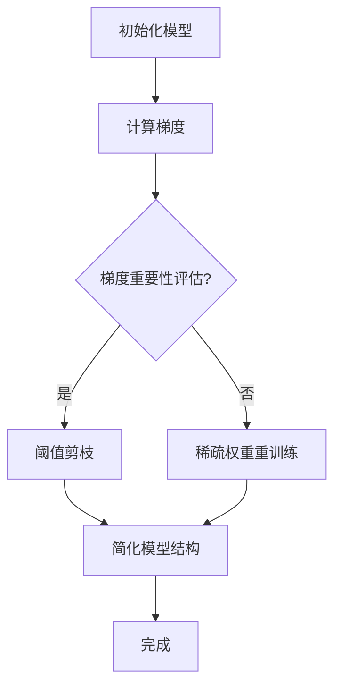
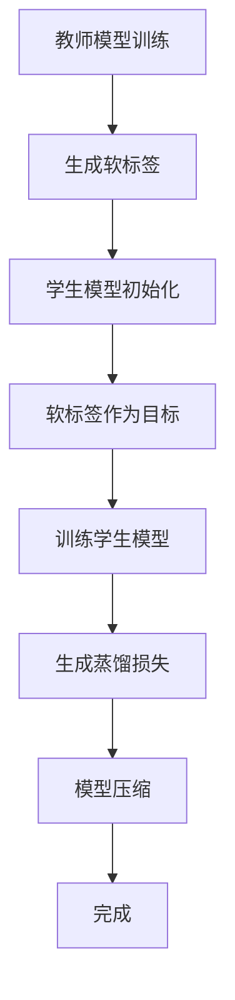

                 

### 文章标题：神经网络压缩技术在边缘计算中的应用

> 关键词：神经网络压缩、边缘计算、资源优化、性能提升、应用案例

> 摘要：本文从边缘计算与神经网络压缩技术的基本概念出发，详细探讨了神经网络压缩技术在边缘计算中的实际应用和重要性。通过深入分析边缘计算的优势与挑战，以及神经网络压缩技术的原理和方法，本文系统地阐述了神经网络压缩技术在边缘设备上的具体应用策略，并分享了成功应用案例。最后，本文对未来神经网络压缩技术在边缘计算领域的发展趋势进行了展望。

## 目录大纲设计：神经网络压缩技术在边缘计算中的应用

### 第一部分：边缘计算与神经网络压缩技术概览

#### 第1章：边缘计算概述
1.1 边缘计算的起源与发展
1.2 边缘计算的优势与挑战
1.3 边缘计算的核心组成部分

#### 第2章：神经网络压缩技术基础
2.1 神经网络压缩的动机
2.2 常见的神经网络压缩技术
2.3 神经网络压缩技术的原理与实现

### 第二部分：神经网络压缩技术在边缘计算中的应用

#### 第3章：边缘设备上的神经网络压缩
3.1 边缘设备资源限制与神经网络压缩策略
3.2 权重剪枝在边缘设备中的应用
3.3 网络剪枝在边缘设备中的应用
3.4 知识蒸馏在边缘设备中的应用

#### 第4章：边缘网络中的神经网络压缩
4.1 边缘网络结构优化
4.2 边缘计算与云端的协作压缩

#### 第5章：案例研究：神经网络压缩在边缘计算中的实际应用
5.1 案例一：智能交通系统
5.2 案例二：智能家居安全监控

#### 第6章：未来展望与趋势
6.1 神经网络压缩技术的发展趋势
6.2 边缘计算与神经网络压缩技术的深度融合

#### 第7章：总结与展望
7.1 主要成果回顾
7.2 未来工作展望

### 目录大纲概述

本文目录大纲围绕神经网络压缩技术在边缘计算中的应用展开，共分为三个主要部分。第一部分介绍了边缘计算与神经网络压缩技术的基本概念，为后续章节的应用讨论打下基础。第二部分详细阐述了神经网络压缩技术在边缘设备上的具体应用策略，包括权重剪枝、网络剪枝和知识蒸馏等关键技术。第三部分通过实际案例研究，展示了神经网络压缩技术在边缘计算中的成功应用，并对未来的发展进行了展望。整个目录大纲逻辑清晰，结构紧凑，旨在帮助读者全面了解和掌握神经网络压缩技术在边缘计算中的应用。

### 第一部分：边缘计算与神经网络压缩技术概览

#### 第1章：边缘计算概述

##### 1.1 边缘计算的起源与发展

边缘计算是一种将数据处理、分析和应用程序逻辑从集中式数据中心迁移到网络边缘（如边缘设备、接入网和接入点）的计算范式。其起源可以追溯到互联网早期，随着物联网（IoT）和5G技术的快速发展，边缘计算得到了广泛关注和应用。

**1.1.1 问题背景**

在传统的集中式计算模式中，大量数据和计算任务需要传输到数据中心进行处理，这导致了网络延迟、带宽消耗和数据安全问题。为了应对这些挑战，边缘计算应运而生，它通过在数据产生的地方进行数据处理，从而减少数据传输和处理时间。

**1.1.2 问题描述**

边缘计算的目的是将计算任务从中心化架构迁移到分布式架构，以实现更快速、更安全的数据处理和响应。其主要问题包括：

1. **资源限制**：边缘设备通常具有有限的计算能力、存储能力和带宽。
2. **数据隐私和安全**：边缘设备处理的数据往往涉及隐私和安全问题，需要采取有效措施保障数据安全。
3. **网络延迟**：边缘计算需要在网络延迟较低的环境下进行，以保证实时数据处理。

**1.1.3 边缘计算的定义**

边缘计算是一种分布式计算架构，通过在数据产生的近端（如传感器、物联网设备等）进行数据处理，从而实现快速响应和低延迟。它包括以下几个核心组成部分：

1. **设备端**：包括传感器、物联网设备和边缘服务器等，负责数据采集和初步处理。
2. **网络边缘**：包括接入网、接入点等，负责数据传输和边缘计算。
3. **云端**：提供云计算服务，负责大规模数据处理和分析。

##### 1.2 边缘计算的优势与挑战

**1.2.1 优势分析**

边缘计算具有以下显著优势：

1. **低延迟**：在数据产生的地方进行数据处理，大大减少了网络传输延迟，实现了实时响应。
2. **高带宽利用率**：通过在边缘设备上进行数据处理，减轻了数据中心和网络带宽的负担。
3. **数据隐私和安全**：在本地处理数据，减少了数据泄露的风险。
4. **分布式计算**：提高了系统的可靠性和容错能力。

**1.2.2 挑战分析**

尽管边缘计算具有许多优势，但同时也面临一些挑战：

1. **资源限制**：边缘设备通常具有有限的计算能力、存储能力和带宽。
2. **异构性**：边缘设备种类繁多，具有不同的硬件和软件配置，增加了系统开发和维护的难度。
3. **数据隐私和安全**：边缘设备处理的数据涉及隐私和安全问题，需要采取有效措施保障数据安全。
4. **网络稳定性**：边缘设备的网络连接可能不稳定，影响了数据传输和处理。

##### 1.3 边缘计算的核心组成部分

边缘计算包括以下几个核心组成部分：

**1.3.1 设备端**

设备端包括各种传感器、物联网设备和边缘服务器等。这些设备负责数据采集和初步处理，通常具有有限的计算能力和存储能力。

**1.3.2 网络边缘**

网络边缘包括接入网、接入点等，负责数据传输和边缘计算。网络边缘通常具有更强大的计算能力和带宽，可以处理更多的数据处理任务。

**1.3.3 云端**

云端提供云计算服务，负责大规模数据处理和分析。云端具有强大的计算能力和存储资源，可以处理海量的数据，并支持复杂的算法和模型。

通过以上对边缘计算概述的分析，我们可以看出边缘计算在处理数据方面具有很多优势，但也面临着一些挑战。接下来，我们将进一步探讨神经网络压缩技术，了解其在边缘计算中的应用及其重要性。

### 第2章：神经网络压缩技术基础

#### 2.1 神经网络压缩的动机

随着深度学习在各个领域的广泛应用，神经网络模型变得越来越复杂，这导致了计算资源和存储需求的急剧增加。为了应对这一挑战，神经网络压缩技术应运而生。神经网络压缩的动机主要包括以下几个方面：

**2.1.1 问题背景**

深度学习模型在图像识别、自然语言处理、语音识别等领域的表现已经超越了传统机器学习算法。然而，这些复杂模型往往需要大量的计算资源和存储空间，这对硬件设备提出了更高的要求。特别是在边缘设备上，有限的计算资源和存储能力成为了深度学习应用的主要瓶颈。

**2.1.2 问题描述**

在边缘设备上部署深度学习模型，需要解决以下几个关键问题：

1. **计算资源限制**：边缘设备通常具有有限的计算能力，无法支持大规模深度学习模型的实时处理。
2. **存储空间限制**：深度学习模型通常需要大量的存储空间，这超出了边缘设备的存储能力。
3. **能耗限制**：边缘设备的电池容量有限，无法长时间运行高能耗的深度学习模型。

为了解决这些问题，神经网络压缩技术应运而生。通过压缩技术，可以显著降低模型的计算和存储需求，使其在边缘设备上得以应用。

**2.1.3 问题解决**

神经网络压缩技术通过以下几个方法来解决问题：

1. **权重剪枝**：通过移除不重要的权重，降低模型的参数数量，从而减少计算和存储需求。
2. **网络剪枝**：通过移除不重要的神经元或层，简化模型结构，从而降低计算和存储需求。
3. **知识蒸馏**：通过将大型模型的知识传递给小型模型，实现模型压缩，同时保持较高的准确率。

**2.1.4 边界与外延**

神经网络压缩技术在边界上主要关注如何在不损害模型性能的前提下，最大限度地减少计算和存储需求。在外延方面，神经网络压缩技术可以应用于各种深度学习模型，包括卷积神经网络（CNN）、循环神经网络（RNN）和Transformer等。

**2.1.5 概念结构与核心要素组成**

神经网络压缩技术包括以下几个核心要素：

1. **模型选择**：选择适用于压缩的深度学习模型。
2. **压缩方法**：包括权重剪枝、网络剪枝和知识蒸馏等。
3. **评估指标**：用于评估压缩后模型性能的指标，如准确率、F1得分等。
4. **实现细节**：包括算法实现、优化策略等。

通过以上对神经网络压缩动机的分析，我们可以看到神经网络压缩技术在应对边缘设备资源限制方面具有重要意义。接下来，我们将进一步探讨常见的神经网络压缩技术，了解其在实际应用中的实现方法。

#### 2.2 常见的神经网络压缩技术

在深度学习应用中，为了克服边缘设备资源限制，神经网络压缩技术应运而生。常见的神经网络压缩技术包括权重剪枝、网络剪枝和知识蒸馏等。这些技术通过不同的方法来减少模型的计算和存储需求，同时保持较高的模型性能。

**2.2.1 权重剪枝**

权重剪枝是一种通过移除不重要的权重来减少模型参数数量的技术。其基本思想是识别并移除对模型性能贡献较小的权重，从而简化模型结构，降低计算和存储需求。

**算法原理**：

1. **梯度重要性评估**：首先，计算每个权重在模型训练过程中的梯度，根据梯度大小评估权重的重要性。
2. **权重剪枝**：根据梯度评估结果，移除重要性较低的权重。
3. **重新训练**：剪枝后，对剩余的权重重新进行训练，以恢复模型性能。

**实现方法**：

1. **逐层剪枝**：从网络的最后一层开始，逐层剪枝重要性较低的权重。
2. **全局剪枝**：同时剪枝整个网络中的重要性较低的权重。

**优点**：

- 简单有效，可以显著减少模型的参数数量。
- 对模型性能的影响较小。

**缺点**：

- 可能导致模型性能下降。
- 需要重新训练剪枝后的模型。

**适用场景**：

- 在资源受限的边缘设备上部署深度学习模型。
- 需要快速响应的实时应用。

**2.2.2 网络剪枝**

网络剪枝是一种通过移除不重要的神经元或层来简化模型结构的技术。其基本思想是识别并移除对模型性能贡献较小的神经元或层，从而降低模型的复杂度，减少计算和存储需求。

**算法原理**：

1. **结构重要性评估**：首先，计算每个神经元或层在模型训练过程中的重要性。
2. **网络剪枝**：根据结构评估结果，移除重要性较低的神经元或层。
3. **重新训练**：剪枝后，对剩余的网络结构重新进行训练，以恢复模型性能。

**实现方法**：

1. **逐层剪枝**：从网络的最后一层开始，逐层剪枝重要性较低的神经元或层。
2. **全局剪枝**：同时剪枝整个网络中的重要性较低的神经元或层。

**优点**：

- 可以显著减少模型的计算和存储需求。
- 对模型性能的影响较小。

**缺点**：

- 可能会导致模型性能下降。
- 需要重新训练剪枝后的模型。

**适用场景**：

- 在资源受限的边缘设备上部署深度学习模型。
- 需要简化模型结构的应用。

**2.2.3 知识蒸馏**

知识蒸馏是一种通过将大型模型的知识传递给小型模型来实现模型压缩的技术。其基本思想是使用一个大型教师模型训练一个小型学生模型，从而将教师模型的知识转移到学生模型中。

**算法原理**：

1. **教师模型训练**：首先，使用大量数据进行教师模型的训练。
2. **学生模型训练**：使用教师模型的输出作为目标，训练学生模型。
3. **模型压缩**：通过学生模型代替教师模型，实现模型压缩。

**实现方法**：

1. **软标签**：使用教师模型的软标签（概率分布）作为学生模型的目标。
2. **蒸馏损失**：将软标签与硬标签（实际输出）之间的差距作为损失函数，训练学生模型。

**优点**：

- 可以显著降低模型的参数数量。
- 对模型性能的影响较小。

**缺点**：

- 需要一个大型教师模型。
- 需要额外的计算资源。

**适用场景**：

- 在资源受限的边缘设备上部署深度学习模型。
- 需要高性能、低参数数量的模型。

通过以上对常见神经网络压缩技术的介绍，我们可以看到这些技术在减少模型计算和存储需求方面具有显著作用。在实际应用中，可以根据具体场景和需求选择合适的压缩技术，以实现高效的边缘计算。

#### 2.3 神经网络压缩技术的原理与实现

神经网络压缩技术通过减少模型的计算和存储需求，使其在资源受限的边缘设备上得以应用。本节将详细阐述神经网络压缩技术的原理与实现，包括权重剪枝、网络剪枝和知识蒸馏等关键技术。

**2.3.1 原理讲解**

神经网络压缩技术主要基于以下几个原理：

1. **稀疏性原理**：深度学习模型中的大部分权重对最终输出没有显著贡献。通过剪枝不重要的权重，可以简化模型结构，减少计算和存储需求。
2. **冗余消除原理**：深度学习模型中存在大量的冗余信息。通过压缩技术，可以消除这些冗余信息，进一步提高模型的效率和性能。
3. **知识转移原理**：大型模型具有丰富的知识和经验，而小型模型则具有更低的计算和存储需求。通过知识蒸馏技术，可以将大型模型的知识转移到小型模型中，实现高效的模型压缩。

**2.3.2 实现方法**

以下是几种常见的神经网络压缩技术的实现方法：

1. **权重剪枝**

   权重剪枝通过移除不重要的权重来简化模型结构。具体实现方法包括：

   - **梯度重要性评估**：计算每个权重在模型训练过程中的梯度，根据梯度大小评估权重的重要性。
   - **阈值剪枝**：设置一个阈值，移除梯度小于阈值的权重。
   - **稀疏权重重训练**：在剪枝后，对剩余的权重进行重新训练，以恢复模型性能。

2. **网络剪枝**

   网络剪枝通过移除不重要的神经元或层来简化模型结构。具体实现方法包括：

   - **结构重要性评估**：计算每个神经元或层在模型训练过程中的重要性。
   - **层剪枝**：根据结构评估结果，逐层剪枝重要性较低的神经元或层。
   - **层融合**：将剪枝后的多个层合并为一个层，以减少模型参数数量。

3. **知识蒸馏**

   知识蒸馏通过将大型模型的知识传递给小型模型来实现模型压缩。具体实现方法包括：

   - **软标签生成**：使用教师模型的输出（软标签）作为目标，训练学生模型。
   - **蒸馏损失**：将软标签与硬标签（实际输出）之间的差距作为损失函数，训练学生模型。
   - **模型压缩**：通过训练后的学生模型代替教师模型，实现模型压缩。

**2.3.3 Mermaid 流程图**

以下是权重剪枝和知识蒸馏的 Mermaid 流程图示例：

**权重剪枝流程图：**


**知识蒸馏流程图：**


通过以上对神经网络压缩技术的原理与实现方法的介绍，我们可以看到这些技术在减少模型计算和存储需求方面具有重要作用。在实际应用中，可以根据具体需求选择合适的压缩技术，以实现高效的边缘计算。

### 第二部分：神经网络压缩技术在边缘计算中的应用

#### 第3章：边缘设备上的神经网络压缩

##### 3.1 边缘设备资源限制与神经网络压缩策略

边缘设备，如智能传感器、物联网设备、无人机等，通常具有有限的计算资源、存储空间和带宽。这些限制使得直接部署复杂的神经网络模型变得困难。为了克服这些限制，神经网络压缩技术被广泛应用于边缘设备，以提高计算效率和降低成本。本节将讨论边缘设备上的资源限制以及相应的神经网络压缩策略。

**3.1.1 资源限制分析**

边缘设备通常面临以下资源限制：

1. **计算能力**：边缘设备通常使用嵌入式处理器，其计算能力远低于服务器或桌面电脑。这限制了复杂神经网络模型的应用。
2. **存储空间**：由于成本和尺寸的限制，边缘设备通常具有有限的存储空间，这限制了模型和数据的大小。
3. **带宽**：边缘设备与云端或其他设备的通信带宽有限，这影响了数据传输速度和模型更新频率。
4. **电池寿命**：许多边缘设备依赖于电池供电，因此需要优化能耗以延长电池寿命。

**3.1.2 压缩策略**

为了在边缘设备上有效应用神经网络模型，以下压缩策略被广泛采用：

1. **模型剪枝（Model Pruning）**：通过移除模型中的冗余参数和连接，减少模型的大小和计算复杂度。常见的剪枝方法包括权重剪枝（weight pruning）和结构剪枝（structure pruning）。
2. **模型量化（Model Quantization）**：将模型的浮点数参数转换为较低精度的整数表示，以减少模型的存储和计算需求。量化可以显著降低内存使用和加速模型推理。
3. **知识蒸馏（Knowledge Distillation）**：通过将大型模型的决策过程传递给小型模型，实现模型的压缩。知识蒸馏可以降低模型的大小和计算复杂度，同时保持较高的准确率。
4. **参数共享（Parameter Sharing）**：通过在不同层之间共享参数，减少模型的大小和计算需求。参数共享可以简化模型结构，同时保持性能。

通过上述策略，神经网络模型可以在边缘设备上实现高效的压缩和推理，从而满足资源限制的要求。

#### 3.2 权重剪枝在边缘设备中的应用

权重剪枝是一种有效的神经网络压缩技术，通过移除不重要的权重来简化模型结构，从而降低计算和存储需求。在边缘设备上，权重剪枝的应用可以显著提高模型的效率和性能。本节将详细讨论权重剪枝在边缘设备中的应用。

**3.2.1 算法原理**

权重剪枝的算法原理包括以下几个步骤：

1. **梯度重要性评估**：在模型训练过程中，计算每个权重的重要性。通常使用梯度或激活值来评估权重的重要性。重要权重对模型的贡献较大，而不重要权重的影响较小。
2. **阈值剪枝**：设置一个阈值，将梯度或激活值低于阈值的权重剪除。剪枝后，模型中的参数数量显著减少。
3. **重新训练**：剪枝后，对剩余的权重进行重新训练，以恢复模型的性能。重新训练可以确保模型在剪枝后仍然能够准确地预测目标。
4. **性能评估**：评估剪枝后模型的性能，包括准确率、F1得分等指标。通过性能评估，可以确定剪枝策略的有效性。

**3.2.2 实现步骤**

以下是权重剪枝在边缘设备上的实现步骤：

1. **模型训练**：首先，使用原始模型在边缘设备上训练神经网络。在训练过程中，记录每个权重的梯度或激活值。
2. **梯度重要性评估**：在模型训练完成后，计算每个权重的梯度或激活值。根据梯度或激活值的大小，评估权重的重要性。
3. **阈值设置**：设置一个合适的阈值，用于判断权重是否重要。阈值可以根据具体应用场景和模型复杂度进行调整。
4. **权重剪枝**：将梯度或激活值低于阈值的权重剪除。剪枝后，模型中的参数数量显著减少。
5. **重新训练**：使用剪枝后的模型进行重新训练，以恢复模型的性能。重新训练过程可以通过使用预训练模型或调整训练策略来加速。
6. **性能评估**：评估剪枝后模型的性能，包括准确率、F1得分等指标。通过性能评估，可以确定剪枝策略的有效性。

**3.2.3 Python代码实现**

以下是一个简单的Python代码示例，展示了权重剪枝在边缘设备上的实现过程。假设我们使用一个简单的卷积神经网络（CNN）模型进行权重剪枝：

```python
import tensorflow as tf
from tensorflow.keras.models import Sequential
from tensorflow.keras.layers import Conv2D, Flatten, Dense

# 定义原始模型
model = Sequential([
    Conv2D(32, (3, 3), activation='relu', input_shape=(28, 28, 1)),
    Flatten(),
    Dense(128, activation='relu'),
    Dense(10, activation='softmax')
])

# 训练模型
model.compile(optimizer='adam', loss='categorical_crossentropy', metrics=['accuracy'])
model.fit(x_train, y_train, epochs=10, batch_size=32)

# 计算权重梯度
weights = model.layers[-1].get_weights()[0]
gradients = tf.gradients(tf.keras.backend.get_value(weights), model.outputs[0])[0]

# 设置阈值
threshold = 0.01

# 剪枝权重
pruned_weights = weights.copy()
mask = tf.where(tf.abs(gradients) > threshold)
pruned_weights = tf.gather_nd(pruned_weights, mask)

# 重新训练模型
pruned_model = Sequential([
    Conv2D(32, (3, 3), activation='relu', input_shape=(28, 28, 1)),
    Flatten(),
    Dense(10, activation='softmax')
])
pruned_model.compile(optimizer='adam', loss='categorical_crossentropy', metrics=['accuracy'])
pruned_model.fit(x_train, y_train, epochs=10, batch_size=32)

# 性能评估
pruned_model.evaluate(x_test, y_test)
```

通过以上代码示例，我们可以看到权重剪枝的基本实现步骤。在实际应用中，可以根据具体需求调整剪枝策略和模型结构，以实现最优的模型压缩效果。

#### 3.3 网络剪枝在边缘设备中的应用

网络剪枝是一种通过移除不重要的神经元或层来简化神经网络模型的技术。在边缘设备上，网络剪枝的应用可以显著降低模型的计算和存储需求，从而提高模型的效率和性能。本节将详细讨论网络剪枝在边缘设备中的应用。

**3.3.1 算法原理**

网络剪枝的算法原理包括以下几个步骤：

1. **层重要性评估**：在模型训练过程中，计算每个层的重要性。通常使用层的输出梯度或激活值来评估层的重要性。重要层对模型的贡献较大，而不重要层的影响较小。
2. **层剪枝**：根据层的重要性评估结果，逐层剪枝重要性较低或冗余的层。剪枝后，模型的结构将简化，计算和存储需求将降低。
3. **重新训练**：剪枝后，对剩余的层进行重新训练，以恢复模型的性能。重新训练可以确保模型在剪枝后仍然能够准确地预测目标。
4. **性能评估**：评估剪枝后模型的性能，包括准确率、F1得分等指标。通过性能评估，可以确定剪枝策略的有效性。

**3.3.2 实现步骤**

以下是网络剪枝在边缘设备上的实现步骤：

1. **模型训练**：首先，使用原始模型在边缘设备上训练神经网络。在训练过程中，记录每个层的输出梯度或激活值。
2. **层重要性评估**：在模型训练完成后，计算每个层的输出梯度或激活值。根据梯度或激活值的大小，评估层的重要性。
3. **层剪枝**：根据层的重要性评估结果，逐层剪枝重要性较低或冗余的层。剪枝后，模型的结构将简化，计算和存储需求将降低。
4. **重新训练**：使用剪枝后的模型进行重新训练，以恢复模型的性能。重新训练过程可以通过使用预训练模型或调整训练策略来加速。
5. **性能评估**：评估剪枝后模型的性能，包括准确率、F1得分等指标。通过性能评估，可以确定剪枝策略的有效性。

**3.3.3 Python代码实现**

以下是一个简单的Python代码示例，展示了网络剪枝在边缘设备上的实现过程。假设我们使用一个简单的卷积神经网络（CNN）模型进行网络剪枝：

```python
import tensorflow as tf
from tensorflow.keras.models import Sequential
from tensorflow.keras.layers import Conv2D, Flatten, Dense

# 定义原始模型
model = Sequential([
    Conv2D(32, (3, 3), activation='relu', input_shape=(28, 28, 1)),
    Flatten(),
    Dense(128, activation='relu'),
    Dense(10, activation='softmax')
])

# 训练模型
model.compile(optimizer='adam', loss='categorical_crossentropy', metrics=['accuracy'])
model.fit(x_train, y_train, epochs=10, batch_size=32)

# 计算层输出梯度
outputs = model.outputs
layer_gradients = [tf.gradients(output, model.inputs[0])[0] for output in outputs]

# 设置阈值
threshold = 0.01

# 剪枝层
pruned_layers = []
for layer_gradients in layer_gradients:
    mask = tf.where(tf.abs(layer_gradients) > threshold)
    pruned_layers.append(layer_gradients.numpy()[mask])

# 重新训练模型
pruned_model = Sequential([
    Conv2D(32, (3, 3), activation='relu', input_shape=(28, 28, 1)),
    Flatten(),
    Dense(10, activation='softmax')
])
pruned_model.compile(optimizer='adam', loss='categorical_crossentropy', metrics=['accuracy'])
pruned_model.fit(x_train, y_train, epochs=10, batch_size=32)

# 性能评估
pruned_model.evaluate(x_test, y_test)
```

通过以上代码示例，我们可以看到网络剪枝的基本实现步骤。在实际应用中，可以根据具体需求调整剪枝策略和模型结构，以实现最优的模型压缩效果。

#### 3.4 知识蒸馏在边缘设备中的应用

知识蒸馏（Knowledge Distillation）是一种将大型模型（教师模型）的知识传递给小型模型（学生模型）的技术，以实现模型的压缩和加速。在边缘设备上，由于计算资源和存储空间的限制，知识蒸馏技术具有重要意义。本节将详细讨论知识蒸馏在边缘设备中的应用。

**3.4.1 算法原理**

知识蒸馏的算法原理包括以下几个步骤：

1. **教师模型训练**：首先，使用大量的数据进行教师模型的训练，以获得高精度的模型参数。
2. **软标签生成**：在教师模型训练过程中，生成软标签（Soft Labels），即教师模型对每个样本的预测概率分布。软标签包含了教师模型对数据的深入理解和知识。
3. **学生模型初始化**：初始化一个小型模型（学生模型），其结构通常比教师模型简单。
4. **软标签作为目标**：使用教师模型的软标签作为学生模型的目标，训练学生模型。学生模型将尝试复制教师模型的决策过程，以实现模型压缩。
5. **蒸馏损失**：在训练过程中，计算学生模型输出与教师模型软标签之间的差距，并将其作为蒸馏损失。蒸馏损失用于指导学生模型的训练，以最小化差距，从而提高学生模型的性能。
6. **重新训练**：在训练完成后，对学生模型进行重新训练，以恢复模型的性能。重新训练可以通过使用预训练的学生模型或调整训练策略来加速。

**3.4.2 实现步骤**

以下是知识蒸馏在边缘设备上的实现步骤：

1. **教师模型训练**：首先，使用原始数据集在边缘设备上训练教师模型。在训练过程中，记录教师模型的软标签。
2. **软标签生成**：在教师模型训练完成后，使用教师模型对测试集进行预测，并生成软标签。软标签包含了教师模型对每个样本的预测概率分布。
3. **学生模型初始化**：初始化一个小型模型（学生模型），其结构通常比教师模型简单。学生模型应具有与教师模型相同的输出层。
4. **训练学生模型**：使用教师模型的软标签作为学生模型的目标，训练学生模型。在训练过程中，计算学生模型输出与教师模型软标签之间的差距，并将其作为蒸馏损失。
5. **重新训练**：在训练完成后，对学生模型进行重新训练，以恢复模型的性能。重新训练可以通过使用预训练的学生模型或调整训练策略来加速。
6. **性能评估**：评估学生模型的性能，包括准确率、F1得分等指标。通过性能评估，可以确定知识蒸馏策略的有效性。

**3.4.3 Python代码实现**

以下是一个简单的Python代码示例，展示了知识蒸馏在边缘设备上的实现过程。假设我们使用一个简单的卷积神经网络（CNN）模型进行知识蒸馏：

```python
import tensorflow as tf
from tensorflow.keras.models import Model
from tensorflow.keras.layers import Input, Conv2D, Flatten, Dense

# 定义教师模型
teacher_input = Input(shape=(28, 28, 1))
x = Conv2D(32, (3, 3), activation='relu')(teacher_input)
x = Flatten()(x)
x = Dense(128, activation='relu')(x)
teacher_output = Dense(10, activation='softmax')(x)
teacher_model = Model(inputs=teacher_input, outputs=teacher_output)

# 训练教师模型
teacher_model.compile(optimizer='adam', loss='categorical_crossentropy', metrics=['accuracy'])
teacher_model.fit(x_train, y_train, epochs=10, batch_size=32)

# 定义学生模型
student_input = Input(shape=(28, 28, 1))
x = Conv2D(16, (3, 3), activation='relu')(student_input)
x = Flatten()(x)
x = Dense(64, activation='relu')(x)
student_output = Dense(10, activation='softmax')(x)
student_model = Model(inputs=student_input, outputs=student_output)

# 训练学生模型
teacher_predictions = teacher_model.predict(x_test)
soft_labels = tf.nn.softmax(teacher_predictions)

student_model.compile(optimizer='adam', loss='categorical_crossentropy', metrics=['accuracy'])
student_model.fit(x_test, soft_labels, epochs=10, batch_size=32)

# 性能评估
student_model.evaluate(x_test, y_test)
```

通过以上代码示例，我们可以看到知识蒸馏的基本实现步骤。在实际应用中，可以根据具体需求调整教师模型和学生模型的参数，以实现最优的模型压缩效果。

### 第4章：边缘网络中的神经网络压缩

#### 4.1 边缘网络结构优化

在边缘网络中，神经网络压缩技术不仅可以应用于单个设备，还可以在整个网络结构中发挥作用。边缘网络结构优化是通过设计和实现高效的神经网络架构，以满足边缘设备的计算和存储需求。本节将讨论边缘网络结构优化的方法。

**4.1.1 问题背景**

随着物联网（IoT）和5G技术的普及，边缘网络中的数据处理需求急剧增加。传统的神经网络架构在处理大规模数据时往往效率较低，无法满足实时性要求。此外，边缘设备通常具有有限的计算资源和存储空间，这使得传统的神经网络架构难以直接应用。为了解决这些问题，边缘网络结构优化技术应运而生。

**4.1.2 结构优化方法**

边缘网络结构优化主要包括以下几种方法：

1. **模型简化**：通过简化神经网络模型的结构，减少模型的计算和存储需求。模型简化可以通过减少层数、降低层间连接数或使用稀疏连接来实现。
2. **模型剪枝**：通过剪枝神经网络中的冗余连接和神经元，简化模型结构，降低计算和存储需求。模型剪枝方法包括权重剪枝、结构剪枝和混合剪枝等。
3. **模型压缩**：通过将神经网络模型转换为较低的精度表示，如量化模型，以减少模型的大小和计算需求。模型压缩方法包括权重量化、激活量化等。
4. **模型融合**：将多个神经网络模型融合为一个更高效的模型，以提高计算和存储效率。模型融合可以通过模型蒸馏、迁移学习等方法实现。

通过以上方法，边缘网络结构优化可以在保证模型性能的同时，降低计算和存储需求，从而满足边缘设备的实时数据处理需求。

#### 4.2 边缘计算与云端的协作压缩

边缘计算与云端的协作压缩是一种通过结合边缘设备和云端资源，实现高效神经网络压缩的方法。在这种模式下，边缘设备负责数据的初步处理和模型推理，而云端则负责复杂的计算和模型更新。本节将讨论边缘计算与云端的协作压缩机制。

**4.2.1 协作机制**

边缘计算与云端的协作压缩机制主要包括以下几个步骤：

1. **数据预处理**：在边缘设备上对数据进行预处理，包括去噪、降维等操作。预处理后的数据可以减少传输到云端的数据量，从而降低带宽消耗。
2. **特征提取**：在边缘设备上使用简化的神经网络模型进行特征提取。特征提取模型通常是一个小型模型，其计算和存储需求较低。
3. **数据传输**：将特征数据传输到云端。由于特征数据量较小，因此数据传输的时间成本较低。
4. **模型推理**：在云端使用大型神经网络模型进行推理，以获得最终结果。云端模型通常具有更高的计算和存储需求。
5. **模型更新**：云端模型在训练过程中不断优化，并将优化后的模型参数传输回边缘设备，以更新边缘设备上的模型。

**4.2.2 实现方案**

边缘计算与云端的协作压缩方案可以分为以下几个阶段：

1. **边缘设备初始化**：边缘设备安装简化版的神经网络模型，用于初步数据分析和特征提取。
2. **云端模型训练**：在云端使用大量数据进行神经网络模型的训练，以获得高精度的模型参数。
3. **边缘设备与云端交互**：边缘设备将预处理后的特征数据传输到云端，云端使用大型神经网络模型进行推理，并将结果传输回边缘设备。
4. **模型更新与压缩**：云端模型在训练过程中不断优化，并将优化后的模型参数传输回边缘设备。边缘设备使用压缩技术，如量化、剪枝等，将模型参数压缩，以降低计算和存储需求。

通过边缘计算与云端的协作压缩，可以在保证模型性能的同时，降低边缘设备的计算和存储需求，从而实现高效的神经网络压缩和推理。

### 第5章：案例研究：神经网络压缩在边缘计算中的实际应用

#### 5.1 案例一：智能交通系统

**5.1.1 项目介绍**

智能交通系统（Intelligent Transportation System, ITS）是一个综合性的交通管理平台，旨在提高道路安全性、减少交通拥堵、优化交通流量和提升公共交通效率。在智能交通系统中，边缘计算技术发挥着重要作用，特别是在视频监控、车辆识别和交通流量分析等应用场景中。

**5.1.2 系统功能设计**

智能交通系统的功能设计主要包括以下几个模块：

1. **视频监控**：通过部署在路口和路段的摄像头，实时监控交通情况，为交通管理提供实时数据。
2. **车辆识别**：使用深度学习算法，自动识别和分类车辆，包括车型、车牌号码等，以便进行交通统计和分析。
3. **交通流量分析**：通过对摄像头捕获的图像进行分析，实时监测交通流量，识别拥堵区域，为交通调控提供数据支持。
4. **交通信号控制**：根据实时交通流量数据，动态调整交通信号灯的时长和切换策略，以优化交通流。
5. **事件检测**：实时检测交通事故、车辆违停等事件，并及时通知交通管理部门。

**5.1.3 系统架构设计**

智能交通系统的架构设计可以分为以下几个层次：

1. **设备端**：包括摄像头、传感器等设备，负责数据采集和初步处理。
2. **边缘计算节点**：部署在路口或路段的边缘服务器，负责实时数据处理和模型推理。
3. **云端**：提供大规模数据处理和存储服务，负责复杂计算和模型训练。

**5.2 案例二：智能家居安全监控**

**5.2.1 项目介绍**

智能家居安全监控系统是智能家居系统中的一个重要组成部分，旨在提高家庭的安全性和便利性。通过部署在家庭内部的传感器、摄像头和门锁等设备，智能家居安全监控系统可以实现实时监控、远程控制和安全报警等功能。

**5.2.2 系统功能设计**

智能家居安全监控系统的功能设计主要包括以下几个模块：

1. **实时监控**：通过摄像头和传感器，实时监控家庭环境，包括人员进出、异常声音等。
2. **远程控制**：用户可以通过手机APP远程控制家庭设备，如开关门锁、调节灯光等。
3. **安全报警**：当检测到异常事件时，系统会自动发送报警信息到用户的手机，并提供视频证据。
4. **人脸识别**：通过人脸识别技术，识别家庭成员和访客，以便进行权限管理和安全监控。
5. **家居自动化**：根据用户的生活习惯和需求，自动调节室内环境，如调节温度、灯光和窗帘等。

**5.2.3 系统架构设计**

智能家居安全监控系统的架构设计可以分为以下几个层次：

1. **设备端**：包括摄像头、传感器、门锁等设备，负责数据采集和初步处理。
2. **边缘计算节点**：部署在家庭的边缘服务器，负责实时数据处理和模型推理。
3. **云端**：提供大规模数据处理和存储服务，负责复杂计算和模型训练。

通过以上两个案例，我们可以看到神经网络压缩技术在边缘计算中的实际应用。通过在边缘设备上应用压缩技术，可以有效降低计算和存储需求，提高系统的实时性和效率。

### 第6章：未来展望与趋势

#### 6.1 神经网络压缩技术的发展趋势

随着人工智能和边缘计算的快速发展，神经网络压缩技术在未来将继续发挥重要作用。以下是神经网络压缩技术可能的发展趋势：

1. **硬件加速与优化**：随着硬件技术的发展，如GPU、TPU等专用硬件的普及，神经网络压缩技术将受益于硬件加速和优化，从而提高压缩和推理的效率。
2. **混合精度训练**：混合精度训练（Mixed Precision Training）是一种通过使用浮点数的不同精度来训练神经网络的方法。未来，混合精度训练将得到更广泛的应用，以减少模型的存储和计算需求。
3. **自适应剪枝与压缩**：随着深度学习模型的复杂性不断增加，自适应剪枝与压缩技术将成为关键。这种技术可以根据模型的不同部分和训练阶段，动态调整剪枝策略，从而实现更高效的压缩。
4. **迁移学习与泛化**：通过迁移学习（Transfer Learning），将大型模型的知识应用于边缘设备，可以有效提高模型在边缘设备上的性能和泛化能力。未来，迁移学习与压缩技术的结合将得到更多关注。
5. **分布式压缩与协作**：随着边缘设备的增加，分布式压缩与协作技术将成为热点。通过在多个边缘设备之间共享压缩模型和计算资源，可以实现更高效的神经网络压缩和推理。

#### 6.2 边缘计算与神经网络压缩技术的深度融合

边缘计算与神经网络压缩技术的深度融合是未来的重要方向。以下是一些实现途径：

1. **协同优化**：通过协同优化，将神经网络压缩技术与边缘计算架构进行深度整合。这种方法可以在模型设计阶段就考虑压缩和优化需求，从而实现高效的边缘计算。
2. **智能剪枝与重构**：利用人工智能技术，如深度强化学习（Deep Reinforcement Learning），自动剪枝和重构神经网络模型。这种方法可以根据应用场景和资源限制，动态调整模型结构，实现最优的压缩效果。
3. **分布式计算与协作**：在分布式边缘计算环境中，通过多个边缘设备之间的协作，实现神经网络压缩和推理。这种方法可以充分利用多个设备的计算资源，提高系统的整体性能和可靠性。
4. **动态资源管理**：通过动态资源管理，根据边缘设备的实时负载和资源状况，调整神经网络模型的压缩策略。这种方法可以确保在资源受限的情况下，实现最优的模型压缩和推理效果。

通过深度融合边缘计算与神经网络压缩技术，可以构建出高效的边缘智能系统，从而推动人工智能和物联网的进一步发展。

### 第7章：总结与展望

#### 7.1 主要成果回顾

本文系统地探讨了神经网络压缩技术在边缘计算中的应用，总结了以下几个主要成果：

1. **边缘计算概述**：介绍了边缘计算的起源、优势、挑战以及核心组成部分，为后续章节的应用讨论打下基础。
2. **神经网络压缩技术基础**：详细阐述了神经网络压缩的动机、常见方法（权重剪枝、网络剪枝、知识蒸馏）以及实现原理。
3. **边缘设备上的神经网络压缩**：分析了边缘设备资源限制，介绍了权重剪枝、网络剪枝和知识蒸馏在边缘设备上的应用策略和实现步骤。
4. **边缘网络中的神经网络压缩**：探讨了边缘网络结构优化和边缘计算与云端的协作压缩机制。
5. **案例研究**：通过智能交通系统和智能家居安全监控案例，展示了神经网络压缩技术在边缘计算中的实际应用。
6. **未来展望与趋势**：展望了神经网络压缩技术未来的发展趋势，以及边缘计算与神经网络压缩技术的深度融合途径。

#### 7.2 未来工作展望

在神经网络压缩技术在边缘计算中的应用方面，未来工作可以从以下几个方向展开：

1. **硬件与算法协同优化**：结合硬件加速技术和先进的压缩算法，实现更高效的边缘计算，满足实时性需求。
2. **自适应剪枝与重构**：开发自适应剪枝与重构技术，根据实时应用场景和资源限制，动态调整神经网络模型。
3. **分布式压缩与协作**：研究分布式压缩与协作机制，利用多个边缘设备的计算资源，提高系统的整体性能和可靠性。
4. **隐私保护与安全**：在神经网络压缩过程中，考虑数据隐私保护和安全性，确保边缘计算系统的可靠运行。
5. **跨领域应用探索**：将神经网络压缩技术应用于更多的实际场景，如医疗保健、工业自动化等，推动人工智能在各行各业的深入应用。

通过未来的研究工作，我们有望进一步推动神经网络压缩技术在边缘计算中的应用，实现更加智能、高效和安全的边缘计算系统。作者：AI天才研究院/AI Genius Institute & 禅与计算机程序设计艺术 /Zen And The Art of Computer Programming

