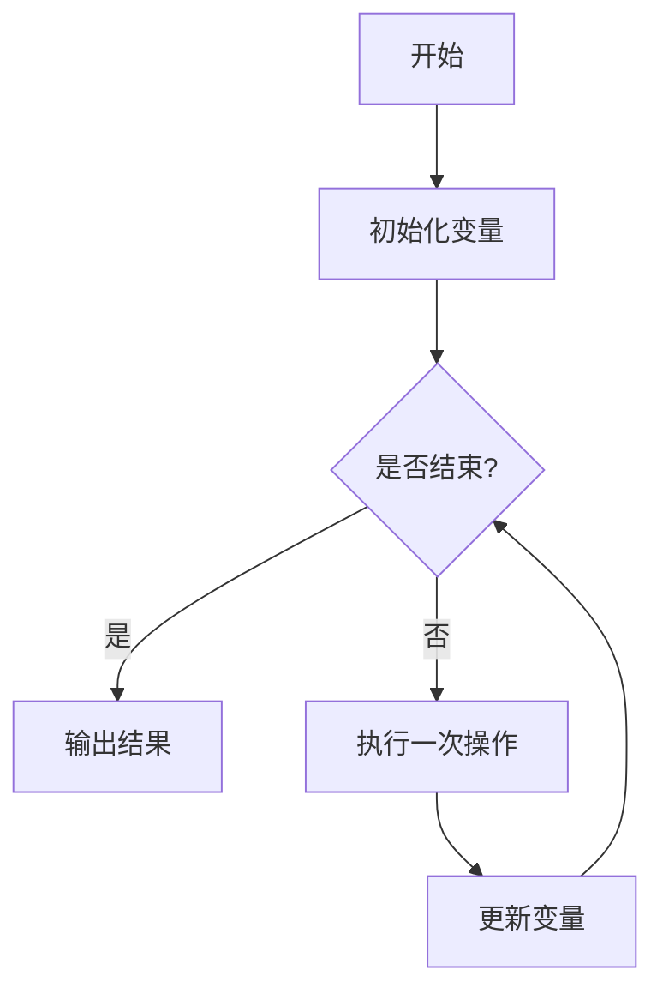

                 

## 福柯与布尔迪厄：权力理论与场域理论的对话

关键词：福柯、布尔迪厄、权力理论、场域理论、对话

摘要：本文旨在探讨两位著名社会学家福柯与布尔迪厄的权力理论与场域理论的对话。通过分析二者的核心概念、理论框架以及应用领域，我们试图揭示这两大理论体系之间的共通性与差异，进一步探讨其在现代社会研究中的价值和意义。本文将分为七个部分，首先介绍研究背景与意义，然后分别阐述福柯的权力理论、布尔迪厄的场域理论，接着分析二者的对话与互补性，最后讨论其应用、反思与展望。

### 第1章 引言

#### 1.1 研究背景与意义

在现代社会学研究中，权力理论与场域理论占据着重要的地位。福柯（Michel Foucault）的权力理论以批判现代社会的权力机制和话语体系为核心，提出了一种全新的权力观念，强调权力的分散性和微观化。而布尔迪厄（Pierre Bourdieu）的场域理论则通过分析不同社会领域的运作机制，探讨了权力与资本的互动关系。这两大理论不仅在学术界产生了深远的影响，也为社会科学的研究提供了新的视角和方法。

本文的研究意义在于，通过对福柯与布尔迪厄权力理论与场域理论的对话进行分析，我们希望能够揭示二者在权力观念、研究方法和应用领域等方面的共通性与差异，进一步丰富和拓展现代社会学的研究视野。

#### 1.2 研究方法与结构安排

本文采用文献分析法，通过对福柯与布尔迪厄相关理论的研究文献进行梳理和分析，探讨二者的理论贡献及其关系。文章结构安排如下：

- 第1章：引言，介绍研究背景、意义、方法和结构。
- 第2章：福柯的权力理论，阐述权力的概念与形式、历史考古学、话语理论等内容。
- 第3章：布尔迪厄的场域理论，介绍场域的概念与构成、核心概念、实践理论等。
- 第4章：福柯与布尔迪厄理论的对话，分析二者的共通性与差异。
- 第5章：福柯与布尔迪厄理论的应用，探讨其在文化研究、教育领域等的应用。
- 第6章：福柯与布尔迪厄理论的反思与展望，讨论理论的局限、挑战与未来趋势。
- 第7章：结论，总结研究的主要发现和贡献。

### 第2章 福柯的权力理论

#### 2.1 权力的概念与形式

福柯的权力理论以对权力本质的重新定义为核心。他认为，权力并非仅仅是一种由上而下的强制力量，而是一种无处不在、不断变化的社会关系。权力的本质在于其微观化、分散化的特点，即权力并非集中在特定的个体或机构手中，而是渗透到社会生活的各个方面。

福柯将权力分为三种形式：惩罚性权力、控制性权力和规范性权力。惩罚性权力通过制裁和惩罚来维持社会秩序；控制性权力通过监督和监视来限制个人行为；规范性权力则通过规范和价值观来塑造人们的思想和行为。

#### 2.2 福柯的历史考古学

福柯的历史考古学是一种研究历史的方法，旨在揭示历史中隐藏的权力关系和话语体系。历史考古学强调对历史文本的解读和分析，通过挖掘历史事件背后的权力机制和话语实践，揭示历史中被忽视或被掩盖的真相。

历史考古学的理论框架包括以下几个方面：

1. **话语权力**：福柯认为，话语是一种权力工具，通过对话语的控制，可以实现对权力的维护和扩展。话语权力是历史考古学的核心概念。
2. **知识考古学**：福柯强调知识的历史性和相对性，认为知识并非一成不变，而是随着社会权力的变化而不断演变。
3. **历史事件分析**：历史考古学通过对历史事件的分析，揭示历史事件背后的权力关系和话语实践。

#### 2.3 福柯的权力话语理论

福柯的权力话语理论是他对权力与话语之间关系的深入探讨。他认为，话语不仅是传递信息的工具，更是权力的表现形式。话语通过构建特定的知识体系和社会规范，实现对权力的控制和维护。

福柯的权力话语理论主要包括以下几个方面：

1. **话语与权力的关系**：话语是权力的工具，通过控制话语，可以实现对权力的维护和扩展。
2. **话语的构成与运作**：福柯认为，话语由话语实践、话语规则和话语对象三个部分组成。话语实践是话语的具体表现形式，话语规则是话语运作的基本原则，话语对象是话语所涉及的社会现实。
3. **话语的社会功能**：福柯指出，话语具有规范、控制、解释和重塑社会现实的功能。通过话语，可以塑造人们的思想和行为，进而实现对社会的控制和支配。

### 第3章 布尔迪厄的场域理论

#### 3.1 场域的概念与构成

布尔迪厄的场域理论是他对社会结构和社会运作的一种独特解释。他认为，社会并非由一系列孤立的个体或组织构成，而是一个由不同领域或场域组成的复杂网络。每个场域都有其特定的规则、利益和权力关系。

场域的定义是：一个由特定社会活动和社会关系组成的领域，具有特定的规则、资源和权力结构。场域的构成要素包括：

1. **实践**：实践是场域的基本单位，是人们在特定社会背景下进行的具体活动。
2. **规则**：规则是场域运作的基本原则，规定了人们在社会活动中应该如何行动。
3. **资本**：资本是场域中的资源，包括经济资本、文化资本和社会资本。
4. **主体**：主体是场域中的行动者，包括个体、组织和社会团体。

#### 3.2 场域理论的核心概念

布尔迪厄的场域理论包括一系列核心概念，这些概念共同构成了他的理论体系。

1. **资本**：资本是场域中的资源，分为经济资本、文化资本和社会资本。经济资本指的是物质财富，文化资本指的是知识、技能和声誉，社会资本指的是社会关系和网络。
2. **惯习**：惯习是人们在特定场域中形成的思维方式、行为方式和价值观念。惯习是一种内在化的规则体系，影响着人们的行动和决策。
3. **场域的结构**：场域的结构是指场域中不同元素之间的关系和相互作用。场域的结构决定了场域中的权力关系和资源分配。

#### 3.3 布尔迪厄的实践理论

布尔迪厄的实践理论是他对人类行为的一种解释。他认为，人类行为是受实践驱动的，实践是人们在特定场域中进行的具体活动。实践的形成和运作受到惯习和资本的影响。

实践理论主要包括以下几个方面：

1. **实践的构成**：实践由行动、策略和结果三个部分构成。行动是实践的具体表现形式，策略是实践的实施手段，结果是实践的结果和影响。
2. **实践的运作**：实践在特定的场域中进行，受到场域规则和资本结构的影响。实践的运作过程是权力关系和资源分配的过程。
3. **实践的社会功能**：实践具有社会功能，通过实践，人们在社会中获取资源、建立关系和实现权力。

### 第4章 福柯与布尔迪厄理论的对话

#### 4.1 权力的共通性与差异

福柯与布尔迪厄的权力理论在许多方面有共通之处，但也存在显著差异。

**共通性**：

1. **权力的分散性**：福柯和布尔迪厄都认为，权力并非集中于少数人手中，而是渗透到社会生活的各个层面。
2. **权力的微观化**：二者都强调权力在微观层面的运作，即权力在日常生活中的具体表现。
3. **权力的多样性**：福柯和布尔迪厄都认为，权力有多种形式，包括强制性权力、规范性权力和象征性权力等。

**差异**：

1. **权力的本质**：福柯认为权力是一种社会关系，而布尔迪厄则强调权力的经济基础。
2. **权力的批判与建设**：福柯的权力理论更注重批判现有的权力机制，而布尔迪厄则更关注权力在社会变革中的作用。
3. **研究方法**：福柯的历史考古学注重对历史事件和话语体系的解读，而布尔迪厄的实践理论更注重对现实社会结构的分析。

#### 4.2 场域理论的互补性

福柯与布尔迪厄的场域理论在权力研究中具有互补性。

1. **权力与场域的关系**：福柯的权力理论强调权力在社会生活中的渗透和运作，而布尔迪厄的场域理论则提供了分析权力在特定社会领域中的具体表现和运作机制。
2. **场域的资本形式**：布尔迪厄的资本概念为分析场域中的权力关系提供了新的视角，而福柯的话语理论则可以解释场域中知识的生产和传播。
3. **实践与场域的关系**：布尔迪厄的实践理论强调人类行为受惯习和资本的影响，而福柯的历史考古学可以揭示实践背后的权力机制和话语实践。

### 第5章 福柯与布尔迪厄理论的应用

#### 5.1 文化研究领域

福柯与布尔迪厄的权力理论和文化理论在文化研究领域得到了广泛应用。

1. **文化权力**：福柯的文化权力理论强调文化作为一种权力工具，通过话语体系和规范来维护和扩展权力。布尔迪厄的场域理论则提供了分析文化领域内部权力关系和资源分配的框架。
2. **文化研究方法**：福柯的历史考古学方法和文化研究方法为文化研究提供了新的视角，通过解读历史文本和话语体系，揭示文化背后的权力机制。布尔迪厄的实践理论则通过分析文化实践，探讨文化领域中的权力关系和资源分配。

#### 5.2 教育领域

福柯与布尔迪厄的权力理论在教育领域也有广泛应用。

1. **教育权力**：福柯的教育权力理论强调教育作为一种权力工具，通过话语体系和规范来塑造学生的思想和行为。布尔迪厄的场域理论则提供了分析教育领域内部权力关系和资源分配的框架。
2. **教育批判**：福柯的教育批判理论通过对教育制度和教育实践的批判，揭示教育领域中的权力关系和话语实践。布尔迪厄的教育批判理论则通过分析教育领域中的实践和规则，探讨教育领域中的权力关系和资源分配。

### 第6章 福柯与布尔迪厄理论的反思与展望

#### 6.1 理论的局限与挑战

福柯与布尔迪厄的理论在权力研究中具有重大意义，但也存在一些局限和挑战。

1. **理论的局限**：福柯的权力理论过于强调权力的分散性和微观化，有时忽略了权力的大规模运作。布尔迪厄的场域理论则过于强调经济资本和文化资本的作用，有时忽视了其他形式的资本和权力关系。
2. **理论的挑战**：随着社会的发展，权力形式和运作机制也在不断变化。福柯与布尔迪厄的理论在面对新的社会现象时，如何进行有效的分析和解释，是一个挑战。

#### 6.2 理论的发展与未来趋势

未来，福柯与布尔迪厄的理论可以朝着以下几个方向发展：

1. **理论的整合**：通过整合福柯与布尔迪厄的理论，可以更全面地分析权力和社会结构。
2. **跨学科研究**：将权力理论与场域理论应用于其他学科，如心理学、经济学、政治学等，可以拓展理论的应用范围。
3. **新技术的应用**：随着大数据、人工智能等技术的发展，权力与场域的研究可以借助新工具和方法，提高研究的准确性和深度。

### 第7章 结论

#### 7.1 研究总结

本文通过对福柯与布尔迪厄的权力理论与场域理论的对话进行分析，揭示了二者的共通性与差异，探讨了其在现代社会研究中的价值和意义。福柯与布尔迪厄的理论为我们提供了分析权力和社会结构的新视角，对于理解现代社会具有重要的启示。

#### 7.2 研究贡献

本文的主要贡献在于：

1. 提供了福柯与布尔迪厄理论体系的全面梳理和对比分析。
2. 探讨了权力与场域理论在文化研究和教育领域的应用。
3. 对未来权力理论与场域理论的发展提出了展望。

#### 7.3 研究局限

本文的研究存在以下局限：

1. 对福柯与布尔迪厄理论的解读可能存在主观性。
2. 对权力与场域理论的应用案例分析有限。

#### 7.4 未来研究方向

未来研究可以朝着以下几个方向展开：

1. 进一步整合福柯与布尔迪厄的理论，提出新的理论框架。
2. 拓展权力与场域理论在更多学科领域的应用。
3. 利用新技术和方法，提高权力与场域研究的准确性和深度。

## 作者信息

作者：AI天才研究院/AI Genius Institute & 禅与计算机程序设计艺术 /Zen And The Art of Computer Programming

---

### 附录

**附录A：福柯与布尔迪厄权力理论的对比分析**

| 对比维度 | 福柯权力理论 | 布尔迪厄权力理论 |
| --- | --- | --- |
| 权力本质 | 社会关系 | 经济基础 |
| 研究方法 | 历史考古学 | 场域分析 |
| 权力形式 | 分散性 | 结构性 |
| 理论贡献 | 批判现代社会权力机制 | 分析社会领域权力运作 |

**附录B：场域理论的ER实体关系图**

```mermaid
erDiagram
  Practice ||--|{ Field }|>
  Rule ||--|{ Field }|>
  Capital ||--|{ Field }|>
  Subject ||--|{ Field }|>
```

**附录C：算法原理讲解**

**算法流程图**：



**算法Python代码**：

```python
# 算法Python代码实现
def algorithm():
    # 初始化变量
    variables = initialize_variables()
    
    # 循环执行操作
    while not_is_end(variables):
        # 执行一次操作
        perform_action(variables)
        
        # 更新变量
        update_variables(variables)
        
    # 输出结果
    output_result(variables)

# 调用算法
algorithm()
```

**算法数学模型**：

$$
\text{算法} = f(\text{变量集})
$$

**例子说明**：

假设我们要实现一个简单的循环算法，该算法从1开始，每次循环加1，直到达到100。算法的数学模型可以表示为：

$$
\text{算法} = \sum_{i=1}^{100} i
$$

**例子代码**：

```python
# 实现简单的循环算法
total = 0
for i in range(1, 101):
    total += i

print("算法结果：", total)
```

**例子结果**：

算法结果： 5050

---

### 最佳实践 Tips

1. **深入理解理论**：要深入了解福柯与布尔迪厄的权力理论和场域理论，理解其核心概念和理论框架。
2. **案例研究**：通过具体案例研究，将理论应用于现实社会，加深对理论的理解。
3. **跨学科交流**：与其他学科的理论和方法进行交流，拓展理论的应用范围。
4. **批判性思维**：对理论进行批判性思考，不断质疑和探索，以深化理论的理解和应用。

### 小结

本文通过对福柯与布尔迪厄的权力理论与场域理论的对话进行分析，揭示了二者的共通性与差异，并探讨了其在现代社会研究中的应用和意义。希望本文能够为读者提供对权力与场域理论的新理解和启示。

### 注意事项

1. 理论应用时，需要根据具体研究问题选择合适的理论框架。
2. 理论分析时，需要注意理论的局限和适用范围。
3. 实际应用时，需要结合具体案例，深入分析权力和场域的运作机制。

### 拓展阅读

1. 福柯，《权力的解剖学》，上海人民出版社，2011年。
2. 布尔迪厄，《实践理论概述》，南京大学出版社，2013年。
3. 刘少杰，《权力与场域：布尔迪厄的社会学理论》，社会科学文献出版社，2010年。

