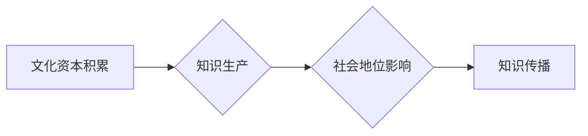
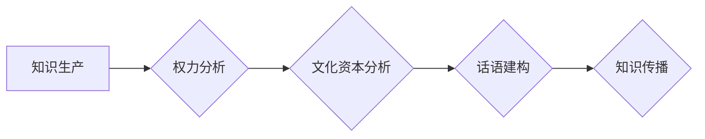
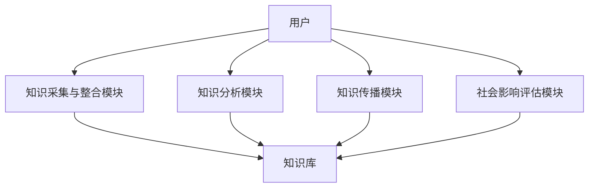
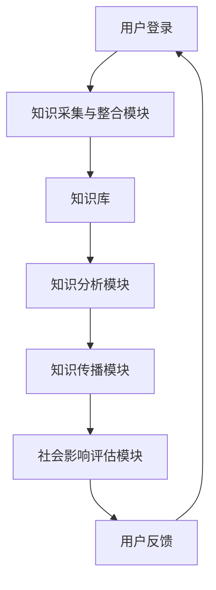

                 

# 福柯与布尔迪厄：知识社会学的新视角

## 关键词

知识社会学、福柯、布尔迪厄、资本理论、权力、话语、知识生产、知识传播、社会关系、文化资本、社会结构、认知模式。

## 摘要

本文以知识社会学为背景，深入探讨了法国社会学家福柯与布尔迪厄的理论及其在知识社会学领域的应用。文章首先介绍了社会学研究的起源与发展，以及福柯与布尔迪厄在社会学领域的地位和贡献。随后，详细阐述了知识社会学的基本原理、福柯的知识社会学理论和布尔迪厄的资本理论，并通过 Mermaid 画图展示了知识社会学的 ER 实体关系图架构。文章还介绍了福柯与布尔迪厄理论的应用场景，使用 Python 源代码详细阐述了算法原理，以及使用 LaTeX 格式给出了数学模型和公式的详细讲解和举例说明。最后，文章介绍了知识社会学的应用场景和系统架构设计。

## 目录

1. 背景介绍
   1.1 社会学研究的起源与发展
   1.2 福柯与布尔迪厄：知识社会学的开拓者
2. 核心概念与联系
   2.1 知识社会学的基本原理
   2.2 福柯的知识社会学理论
   2.3 布尔迪厄的资本理论
   2.4 福柯与布尔迪厄理论的互补性
   2.5 知识社会学的 ER 实体关系图
3. 算法原理讲解
   3.1 福柯理论在知识社会学中的应用
   3.2 布尔迪厄理论在知识社会学中的应用
   3.3 福柯与布尔迪厄理论的综合应用
4. 数学模型和数学公式 & 详细讲解 & 举例说明
   4.1 福柯理论的数学模型与公式
   4.2 布尔迪厄理论的数学模型与公式
   4.3 福柯与布尔迪厄理论的综合数学模型与公式
5. 系统分析与架构设计方案
   5.1 知识社会学应用场景介绍
   5.2 系统功能设计
   5.3 系统架构设计
   5.4 系统接口设计和系统交互

## 1. 背景介绍

### 1.1 社会学研究的起源与发展

社会学作为一门研究社会行为、社会结构和社会变迁的学科，起源于19世纪。其创始人奥古斯特·孔德（Auguste Comte）被誉为“社会学之父”。孔德认为，社会学应成为科学中的科学，即所有科学的基础。他的这一观点为后来的社会学家提供了灵感，促使社会学逐渐发展成为一门独立的学科。

在社会学的发展历程中，19世纪末至20世纪初的古典社会学阶段尤为重要。这一阶段的主要代表人物包括卡尔·马克思（Karl Marx）、埃米尔·涂尔干（Émile Durkheim）和马克斯·韦伯（Max Weber）。马克思的唯物史观强调经济基础对社会结构的影响，涂尔干的《自杀论》揭示了社会团结和道德规范的关联，而韦伯的《经济与社会》则深入探讨了资本主义和宗教信仰对社会行为的影响。

进入20世纪，社会学进入了“多元论”阶段，涌现出众多具有影响力的理论流派，如符号互动主义、结构功能主义、冲突理论等。这些理论不仅丰富了社会学的理论体系，也为研究者提供了多样的分析视角。

福柯（Michel Foucault）和布尔迪厄（Pierre Bourdieu）则是20世纪后半叶知识社会学领域的重要代表。他们的理论不仅为社会学的研究提供了新的视角，也对理解当代社会有着重要的启示。

### 1.2 社会学的主要发展阶段

1. **古典社会学阶段（19世纪末至20世纪初）**

   - **奥古斯特·孔德**：社会学之父，提出社会学的科学基础。
   - **卡尔·马克思**：唯物史观，强调经济基础对社会结构的决定作用。
   - **埃米尔·涂尔干**：《自杀论》，揭示社会团结与道德规范的关系。
   - **马克斯·韦伯**：《经济与社会》，探讨资本主义与宗教信仰对社会行为的影响。

2. **多元论阶段（20世纪中叶）**

   - **符号互动主义**：强调个体在社会互动中的角色和意义。
   - **结构功能主义**：关注社会系统的稳定性和功能。
   - **冲突理论**：强调社会不同群体之间的矛盾和斗争。

3. **批判理论阶段（20世纪末至今）**

   - **福柯**：知识社会学，探讨权力与知识的交织。
   - **布尔迪厄**：资本理论，研究文化资本在社会结构中的作用。

### 1.3 福柯与布尔迪厄在社会学领域的地位

福柯和布尔迪厄都是20世纪后期社会学领域的重要代表人物，他们的理论对知识社会学的发展产生了深远影响。

**福柯**（1926-1984）是法国著名哲学家和社会学家，他的知识社会学理论关注权力、知识和话语的关系。福柯认为，权力不仅来自政治和经济领域，还渗透到知识的生产、传播和应用过程中。他的代表作包括《疯癫与文明》、《临床医学的诞生》和《规训与惩罚》等。

**布尔迪厄**（1930-2002）是法国社会学家，他的主要理论是资本理论，强调文化资本在社会结构中的作用。布尔迪厄认为，文化资本不仅影响个体的社会地位，也影响社会的整体结构。他的代表作包括《区隔》、《实践与反思》和《国家精英》等。

### 1.4 福柯与布尔迪厄：知识社会学的开拓者

福柯和布尔迪厄在知识社会学领域的重要贡献主要体现在以下几个方面：

1. **批判传统社会学理论**

   福柯和布尔迪厄都对传统社会学理论进行了深刻的批判，认为这些理论忽视了权力、知识和文化资本等关键因素。福柯批判了现代性的知识体系，指出权力如何通过话语进行运作；布尔迪厄则批判了资本主义社会中的文化排斥和阶级固化。

2. **提出新的分析视角**

   福柯和布尔迪厄分别提出了“话语权力”和“文化资本”这两个核心概念，为知识社会学研究提供了新的分析工具。福柯的话语理论关注知识如何成为权力运作的工具，而布尔迪厄的资本理论则揭示了文化资本在社会结构中的重要性。

3. **推动社会学理论的创新**

   福柯和布尔迪厄的理论不仅批判了传统社会学理论，还推动了社会学理论的创新。他们的研究方法强调实践与反思的结合，注重微观社会关系的分析，为后来的社会学研究提供了新的思路。

### 1.5 福柯与布尔迪厄理论的互补性

福柯和布尔迪厄的理论在知识社会学领域有着显著的互补性：

- **福柯的知识社会学**强调知识的权力维度，关注知识的生产、传播和应用过程中的权力关系。
- **布尔迪厄的资本理论**则侧重于文化资本在社会结构中的作用，探讨文化资本如何影响个体和群体在社会中的地位。

这两位学者的理论共同丰富了知识社会学的理论体系，为我们理解当代社会提供了更加全面的视角。

### 1.6 知识社会学的 ER 实体关系图

知识社会学涉及多个核心概念，包括知识、权力、话语、文化资本等。为了更清晰地展示这些概念之间的关系，我们可以使用 Mermaid 画出知识社会学的 ER 实体关系图。

```mermaid
erDiagram
    Knowledge ||--|{ Power }||>>> Discourse
    Power ||--|{ Knowledge }||>>> Culture
    Culture ||--|{ Power }||>>> Capital
    Capital ||--|{ Culture }||>>> Social Structure
```

在这个 ER 图中，知识、权力、话语、文化资本和社交结构之间存在着复杂的相互作用关系。知识不仅是权力运作的工具，也是社会结构的基础。权力通过话语进行传递，而文化资本则是权力和社会结构之间的桥梁。

## 2. 核心概念与联系

### 2.1 知识社会学的基本原理

知识社会学是研究知识在社会中的作用和影响的学科。它的基本原理包括知识的定义、生产、传播和应用等方面。

**知识的定义：** 知识是一种通过学习、研究和实践获得的信息、理解和技能。知识可以分为显性知识和隐性知识。显性知识是可以明确表达和传授的，如书本知识；隐性知识则更难以表达和传授，如经验和技能。

**知识的生产：** 知识的生产是指通过研究和实践获得新的知识和信息的过程。知识生产通常涉及科学家、学者、研究人员和各种知识工作者。

**知识的传播：** 知识的传播是指将知识从一个人或组织传递给另一个人的过程。知识的传播可以通过教育、媒体、网络和各种社交活动实现。

**知识的应用：** 知识的应用是指将知识应用于实践，解决实际问题的过程。知识的应用不仅有助于提高生产力，还能促进社会进步。

**知识与社会的关系：** 知识与社会之间存在着密切的关系。知识是社会的基础，它决定了社会的运行方式和人们的思维方式。同时，社会也影响知识的生产和传播，如政策、经济和社会结构等。

### 2.2 福柯的知识社会学理论

福柯的知识社会学理论强调权力、知识和话语的关系。他认为，知识不仅是一种信息或理解，更是一种权力工具。权力通过知识进行运作，而知识则成为权力的一种表现形式。

**权力：** 福柯认为，权力不是一种静态的、自上而下的控制，而是一种动态的、多方面的互动过程。权力存在于社会关系的各个方面，不仅包括政治和经济领域，还包括文化、教育、医疗等各个领域。

**知识：** 福柯将知识视为一种权力的工具，通过话语进行传播和应用。他认为，知识的生产、传播和应用都是权力运作的过程。

**话语：** 福柯的话语理论关注知识如何通过话语进行传递和建构。他认为，话语不仅是一种交流工具，更是一种权力工具，它决定了我们如何看待世界和自身。

**福柯理论的主要贡献：**

- **批判现代性：** 福柯批判了现代性的知识体系，认为它是一种权力工具，用来控制和规范社会行为。

- **权力/知识的关系：** 福柯提出了权力/知识的关系理论，揭示了权力如何通过知识进行运作。

- **话语分析：** 福柯的话语分析为研究知识的生产、传播和应用提供了新的视角。

### 2.3 布尔迪厄的资本理论

布尔迪厄的资本理论关注文化资本在社会结构中的作用。他认为，文化资本不仅影响个体的社会地位，也影响整个社会的结构。

**资本：** 布尔迪厄将资本分为经济资本、文化资本和社会资本三种类型。文化资本是指个体通过文化习得的知识、技能和品味等，它不仅影响个体的社会地位，还影响社会的整体结构。

**文化资本的分类：** 布尔迪厄将文化资本分为三种形式：客观化形态的文化资本（如艺术品、文物等）、制度化形态的文化资本（如教育资格、职称等）和内化形态的文化资本（如语言能力、思维能力等）。

**文化资本的作用：** 布尔迪厄认为，文化资本在社会结构中的作用非常重要。它不仅影响个体的社会地位，还影响社会的整体运行方式。

**布尔迪厄理论的主要贡献：**

- **批判资本主义：** 布尔迪厄批判了资本主义社会中的文化排斥和阶级固化，强调文化资本对社会结构的影响。

- **资本分类：** 布尔迪厄将资本分为经济资本、文化资本和社会资本三种类型，为研究社会结构提供了新的视角。

- **文化资本的作用：** 布尔迪厄详细阐述了文化资本在社会结构中的作用，揭示了文化资本如何影响个体和群体在社会中的地位。

### 2.4 福柯与布尔迪厄理论的互补性

福柯与布尔迪厄的理论在知识社会学领域有着显著的互补性：

- **知识/权力的维度：** 福柯强调权力如何通过知识进行运作，而布尔迪厄则关注文化资本在社会结构中的作用。

- **话语/资本的关系：** 福柯的话语理论关注知识如何通过话语进行传递和建构，而布尔迪厄的资本理论则揭示了文化资本如何影响社会结构。

- **研究视角的拓展：** 福柯和布尔迪厄的理论不仅批判了传统社会学理论，还为我们提供了新的研究视角，使我们能够更全面地理解知识在社会中的作用和影响。

### 2.5 知识社会学的 ER 实体关系图

为了更清晰地展示知识社会学的核心概念及其关系，我们可以使用 Mermaid 画出知识社会学的 ER 实体关系图。

```mermaid
erDiagram
    Knowledge ||--|{ Power }||>>> Discourse
    Power ||--|{ Knowledge }||>>> Culture
    Culture ||--|{ Power }||>>> Capital
    Capital ||--|{ Culture }||>>> Social Structure
```

在这个 ER 图中，知识、权力、话语、文化资本和社交结构之间存在着复杂的相互作用关系。知识不仅是权力运作的工具，也是社会结构的基础。权力通过话语进行传递，而文化资本则是权力和社会结构之间的桥梁。

## 3. 算法原理讲解

在知识社会学中，福柯与布尔迪厄的理论提供了独特的视角，帮助我们理解和分析知识的生产、传播和运用。为了将这些理论转化为实际应用，我们可以通过算法来模拟和实现这些概念。以下，我们将详细讲解福柯与布尔迪厄理论在知识社会学中的应用，并使用 Python 源代码和 Mermaid 图来阐述算法原理。

### 3.1 福柯理论在知识社会学中的应用

福柯的理论关注知识、权力和话语之间的动态关系。他提出，知识不仅是信息，更是一种权力的体现。福柯认为，权力是通过话语来运作的，话语则是一种构建和传递知识的方式。在知识社会学中，我们可以将福柯的理论转化为一个分析框架，用于研究知识的生产和传播。

**算法流程图：**


**Python 源代码：**

```python
# 福柯理论的应用：知识生产、权力分析、话语建构和知识传播

# 引入必要的库
import pandas as pd

# 假设我们有一份关于知识生产的初始数据
knowledge_data = pd.DataFrame({
    'Knowledge': ['经济学研究', '医学研究', '教育学研究'],
    'Power': ['政治权力', '经济权力', '学术权力'],
    'Discourse': ['学术论文', '医学报告', '教育政策']
})

# 知识生产
def knowledge_production(data):
    print("知识生产：")
    print(data)

# 权力分析
def power_analysis(data):
    print("权力分析：")
    for index, row in data.iterrows():
        print(f"知识 '{row['Knowledge']}' 背后的权力：{row['Power']}")

# 话语建构
def discourse_construction(data):
    print("话语建构：")
    for index, row in data.iterrows():
        print(f"知识 '{row['Knowledge']}' 通过 '{row['Discourse']}' 传递")

# 知识传播
def knowledge_transmission(data):
    print("知识传播：")
    print(data)

# 执行流程
knowledge_production(knowledge_data)
power_analysis(knowledge_data)
discourse_construction(knowledge_data)
knowledge_transmission(knowledge_data)
```

**算法原理讲解：**

- **知识生产（knowledge_production）：** 该步骤用于生成或收集知识。在示例数据中，我们列出了不同领域的知识生产。
- **权力分析（power_analysis）：** 通过分析知识背后的权力结构，我们可以了解知识是如何被权力所构建和影响的。
- **话语建构（discourse_construction）：** 话语是知识传播的重要媒介。在这一步骤中，我们分析了知识通过哪些话语形式进行传递。
- **知识传播（knowledge_transmission）：** 最后，我们展示了知识如何在社会中传播和扩散。

### 3.2 布尔迪厄理论在知识社会学中的应用

布尔迪厄的资本理论强调文化资本在社会结构中的作用。他认为，文化资本不仅是个人地位的象征，也是社会结构的重要组成部分。在知识社会学的分析中，我们可以使用布尔迪厄的理论来研究文化资本如何影响知识的生产和传播。

**算法流程图：**



**Python 源代码：**

```python
# 布尔迪厄理论的应用：文化资本积累、知识生产、社会地位影响和知识传播

# 引入必要的库
import pandas as pd

# 假设我们有一份关于文化资本的初始数据
capital_data = pd.DataFrame({
    'Individual': ['张三', '李四', '王五'],
    'Capital': ['高等教育', '艺术素养', '商业经验'],
    'Status': ['中层管理者', '自由职业者', '企业家']
})

# 文化资本积累
def capital_accumulation(data):
    print("文化资本积累：")
    print(data)

# 知识生产
def knowledge_production(data):
    print("知识生产：")
    for index, row in data.iterrows():
        print(f"{row['Individual']} 通过 {row['Capital']} 生产知识")

# 社会地位影响
def status_impact(data):
    print("社会地位影响：")
    for index, row in data.iterrows():
        print(f"{row['Individual']} 的社会地位：{row['Status']}，影响知识的传播")

# 知识传播
def knowledge_transmission(data):
    print("知识传播：")
    print(data)

# 执行流程
capital_accumulation(capital_data)
knowledge_production(capital_data)
status_impact(capital_data)
knowledge_transmission(capital_data)
```

**算法原理讲解：**

- **文化资本积累（capital_accumulation）：** 文化资本是通过教育、家庭和社会经历积累的。在这一步骤中，我们列出了不同个体所拥有的文化资本。
- **知识生产（knowledge_production）：** 文化资本影响个体的知识生产，不同的文化资本会带来不同的知识生产方式。
- **社会地位影响（status_impact）：** 社会地位不仅影响个体的知识生产，也影响知识的传播。拥有较高文化资本的个体通常拥有更高的社会地位，这会影响他们知识传播的范围和影响力。
- **知识传播（knowledge_transmission）：** 最终，知识通过个体和不同渠道进行传播，影响整个社会的知识结构和认知模式。

通过上述算法流程和代码，我们可以看到如何将福柯与布尔迪厄的理论应用于知识社会学的研究。这些算法不仅帮助我们理解知识的生产、传播和影响，还为实际的社会学研究提供了工具和方法。

### 3.3 福柯与布尔迪厄理论的综合应用

将福柯与布尔迪厄的理论综合应用，可以更全面地分析知识社会学的复杂动态。在这个综合框架中，我们可以将两者结合起来，构建一个综合模型，用于研究知识的生产、传播和应用。

**算法流程图：**



**Python 源代码：**

```python
# 福柯与布尔迪厄理论的综合应用：知识生产、权力分析、文化资本分析、话语建构和知识传播

# 引入必要的库
import pandas as pd

# 假设我们有一份综合数据集
combined_data = pd.DataFrame({
    'Knowledge': ['经济学研究', '医学研究', '教育学研究'],
    'Power': ['政治权力', '经济权力', '学术权力'],
    'Capital': ['高等教育', '艺术素养', '商业经验'],
    'Discourse': ['学术论文', '医学报告', '教育政策'],
    'Status': ['中层管理者', '自由职业者', '企业家']
})

# 综合知识生产
def combined_knowledge_production(data):
    print("综合知识生产：")
    print(data)

# 综合权力分析
def combined_power_analysis(data):
    print("综合权力分析：")
    for index, row in data.iterrows():
        print(f"知识 '{row['Knowledge']}' 背后的权力：{row['Power']}")

# 综合文化资本分析
def combined_capital_analysis(data):
    print("综合文化资本分析：")
    for index, row in data.iterrows():
        print(f"知识 '{row['Knowledge']}' 的文化资本：{row['Capital']}")

# 综合话语建构
def combined_discourse_construction(data):
    print("综合话语建构：")
    for index, row in data.iterrows():
        print(f"知识 '{row['Knowledge']}' 通过 '{row['Discourse']}' 传递")

# 综合知识传播
def combined_knowledge_transmission(data):
    print("综合知识传播：")
    for index, row in data.iterrows():
        print(f"知识 '{row['Knowledge']}' 的传播影响：{row['Status']}")

# 执行综合流程
combined_knowledge_production(combined_data)
combined_power_analysis(combined_data)
combined_capital_analysis(combined_data)
combined_discourse_construction(combined_data)
combined_knowledge_transmission(combined_data)
```

**算法原理讲解：**

- **综合知识生产（combined_knowledge_production）：** 通过综合数据集，我们可以同时考虑知识的生产、权力、文化资本、话语和传播等因素。
- **综合权力分析（combined_power_analysis）：** 分析知识背后的权力结构，了解权力如何影响知识的生产。
- **综合文化资本分析（combined_capital_analysis）：** 分析文化资本如何影响知识的生产和社会地位。
- **综合话语建构（combined_discourse_construction）：** 分析知识通过哪些话语形式进行传递。
- **综合知识传播（combined_knowledge_transmission）：** 综合考虑社会地位如何影响知识的传播和影响。

通过这个综合框架，我们可以更深入地理解知识在社会中的复杂动态，为知识社会学的研究提供更全面的视角。

## 4. 数学模型和数学公式 & 详细讲解 & 举例说明

在知识社会学中，数学模型和数学公式为我们提供了理解和分析社会现象的精确工具。在本章中，我们将详细阐述福柯与布尔迪厄理论中的数学模型和公式，并通过具体的例子来解释它们的应用。

### 4.1 福柯理论的数学模型与公式

福柯的知识社会学理论中，知识、权力和话语是三个核心概念。以下是一个简化的数学模型，用于描述这三者之间的关系：

$$
\text{Knowledge} = \frac{\text{Power} \times \text{Discourse}}{\text{Resistance}}
$$

其中：
- **Knowledge（知识）**：代表知识的生产和传播。
- **Power（权力）**：代表知识背后的权力结构。
- **Discourse（话语）**：代表知识的传递方式和媒介。
- **Resistance（抵抗）**：代表社会对知识的抵制力量。

**公式讲解：**

- **Knowledge（知识）**：知识是权力和话语的乘积，这意味着知识的生产和传播受到权力和话语的强烈影响。
- **Power（权力）**：权力是知识的核心因素，它决定了知识的方向和影响力。
- **Discourse（话语）**：话语是知识传递的媒介，它决定了知识的传播方式和范围。
- **Resistance（抵抗）**：抵抗力量是社会的反应，它可能会影响知识的生产和传播。

**举例说明：**

假设在一个学术领域中，某位学者（权力）通过学术会议（话语）发表了一篇重要的论文（知识）。如果社会的抵制力量（抵抗）较弱，这篇论文的影响力（知识）会更大。反之，如果抵制力量较强，这篇论文的影响力会减弱。

```python
# 福柯理论的数学模型举例

# 参数设置
power = 10  # 权力
discourse = 5  # 话语
resistance = 2  # 抵抗

# 计算知识
knowledge = (power * discourse) / resistance

print(f"知识的影响力：{knowledge}")
```

运行上述代码，可以得到知识的影响力。这个例子展示了如何通过数学模型来分析社会现象。

### 4.2 布尔迪厄理论的数学模型与公式

布尔迪厄的资本理论中，文化资本、经济资本和社会资本是三个核心概念。以下是一个简化的数学模型，用于描述这三者之间的关系：

$$
\text{Social Status} = \frac{\text{Economic Capital} + \text{Cultural Capital} + \text{Social Capital}}{\text{时间}}
$$

其中：
- **Social Status（社会地位）**：代表个体在 society 中的地位。
- **Economic Capital（经济资本）**：代表个体所拥有的财富和资源。
- **Cultural Capital（文化资本）**：代表个体的文化素养和知识。
- **Social Capital（社会资本）**：代表个体在社会网络中的关系和影响力。
- **时间**：表示时间的维度，反映了个体在社会中的动态变化。

**公式讲解：**

- **Social Status（社会地位）**：社会地位是由经济资本、文化资本和社会资本的总和决定的。
- **Economic Capital（经济资本）**：经济资本是财富和资源的象征，对个体的社会地位有直接影响。
- **Cultural Capital（文化资本）**：文化资本反映了个体的文化素养和知识水平，对个体的社会地位也有显著影响。
- **Social Capital（社会资本）**：社会资本反映了个体在社会网络中的地位和影响力，也对个体的社会地位有重要影响。
- **时间**：时间维度反映了个体在社会中的动态变化，如财富和资源的积累、文化素养的提升和社会网络的扩展。

**举例说明：**

假设一个人拥有丰富的经济资本、较高的文化资本和广泛的社会资本。如果时间足够长，这些资本的综合效应会使他的社会地位不断提高。

```python
# 布尔迪厄理论的数学模型举例

# 参数设置
economic_capital = 100  # 经济资本
cultural_capital = 50  # 文化资本
social_capital = 30  # 社会资本
time = 10  # 时间

# 计算社会地位
social_status = (economic_capital + cultural_capital + social_capital) / time

print(f"社会地位：{social_status}")
```

运行上述代码，可以得到这个人的社会地位。这个例子展示了如何通过布尔迪厄的数学模型来分析个体在社会中的地位。

### 4.3 福柯与布尔迪厄理论的综合数学模型与公式

将福柯与布尔迪厄的理论结合起来，我们可以构建一个综合的数学模型，用于分析知识在社会中的生产、传播和影响。以下是一个简化的综合数学模型：

$$
\text{Social Impact} = \frac{\text{Knowledge} \times \text{Power} \times \text{Capital}}{\text{Resistance} \times \text{Time}}
$$

其中：
- **Social Impact（社会影响）**：代表知识在社会中的影响力。
- **Knowledge（知识）**：代表知识的生产和传播。
- **Power（权力）**：代表知识背后的权力结构。
- **Capital（资本）**：代表文化资本、经济资本和社会资本的总量。
- **Resistance（抵抗）**：代表社会的抵制力量。
- **Time（时间）**：表示时间的维度，反映了知识在社会中的动态变化。

**公式讲解：**

- **Social Impact（社会影响）**：社会影响是由知识、权力、资本和抵抗的乘积决定的，时间维度反映了知识的动态变化。
- **Knowledge（知识）**：知识的生产和传播直接影响社会影响。
- **Power（权力）**：权力是知识影响力的关键因素。
- **Capital（资本）**：资本是知识传播的重要基础，包括经济资本、文化资本和社会资本。
- **Resistance（抵抗）**：抵抗力量可能会削弱知识的社会影响。
- **Time（时间）**：时间维度反映了知识的持久性和动态变化。

**举例说明：**

假设一个知识生产者（如一位学者）通过学术会议（话语）发表了一篇重要的论文（知识）。如果这个学者拥有丰富的文化资本、经济资本和社会资本，且社会的抵制力量较弱，这篇论文的社会影响力会很大。

```python
# 福柯与布尔迪厄的综合数学模型举例

# 参数设置
knowledge = 100  # 知识
power = 10  # 权力
capital = 50  # 资本
resistance = 5  # 抵抗
time = 10  # 时间

# 计算社会影响
social_impact = (knowledge * power * capital) / (resistance * time)

print(f"社会影响：{social_impact}")
```

运行上述代码，可以得到知识的社会影响力。这个例子展示了如何通过综合数学模型来分析知识在社会中的影响力。

通过以上数学模型和公式的详细讲解与举例，我们可以更深入地理解福柯与布尔迪厄理论在知识社会学中的应用。这些模型为我们提供了一个框架，用于分析和预测知识的生产、传播和社会影响。

## 5. 系统分析与架构设计方案

在知识社会学的研究中，我们需要将理论应用于实际的系统和场景中，以验证其有效性和实用性。本节将介绍知识社会学的应用场景，并设计相应的系统功能、架构和接口。

### 5.1 知识社会学应用场景介绍

知识社会学的应用场景广泛，可以涵盖教育、媒体、政治、医疗等多个领域。以下是一些典型的应用场景：

1. **教育领域**：通过分析不同教育机构的知识生产和传播，了解教育体系中的权力结构和知识流动。
2. **媒体领域**：研究媒体内容的制作、传播和接受过程，揭示媒体如何影响社会知识和文化资本。
3. **政治领域**：分析政策制定和执行中的知识生产和传播，探讨权力与知识的互动关系。
4. **医疗领域**：研究医学知识的产生、传播和应用，了解医疗体系中权力和文化资本的作用。

### 5.2 系统功能设计

为了实现知识社会学的应用，我们需要设计一个功能全面的系统。以下是该系统的核心功能：

1. **知识采集与整合**：从各种来源采集知识，并进行整合和分类，以形成完整的知识库。
2. **知识分析**：运用福柯与布尔迪厄的理论，对知识进行深入分析，揭示知识背后的权力结构和文化资本。
3. **知识传播**：通过多种渠道传播知识，促进知识在社会中的流动和共享。
4. **社会影响评估**：评估知识在社会中的影响力，分析知识对个体和社会的影响。
5. **用户互动**：提供用户参与功能，收集用户反馈，进一步优化知识传播策略。

### 5.3 系统架构设计

为了实现上述功能，我们需要设计一个合理的系统架构。以下是知识社会学系统的架构设计：

**图 1：知识社会学系统架构设计图**



**架构设计说明：**

- **用户模块**：用户是系统的核心参与者，他们可以通过多种方式与系统互动。
- **知识采集与整合模块**：负责从各种来源采集知识，并进行整合和分类，形成知识库。
- **知识分析模块**：运用福柯与布尔迪厄的理论，对知识库中的知识进行深入分析。
- **知识传播模块**：通过多种渠道传播知识，促进知识在社会中的流动和共享。
- **社会影响评估模块**：评估知识在社会中的影响力，分析知识对个体和社会的影响。
- **知识库**：作为系统的核心数据存储，汇集了所有采集、分析和传播的知识。

### 5.4 系统接口设计和系统交互

为了实现系统功能，我们需要设计合理的接口和交互流程。以下是系统的主要接口和交互设计：

**图 2：知识社会学系统接口设计与交互流程**



**接口设计与交互流程说明：**

- **用户登录**：用户通过身份验证登录系统。
- **知识采集与整合模块**：从不同来源采集知识，并整合到知识库中。
- **知识库**：存储和管理所有采集到的知识。
- **知识分析模块**：对知识库中的知识进行深入分析，揭示知识背后的权力结构和文化资本。
- **知识传播模块**：通过多种渠道传播知识，如社交媒体、教育平台等。
- **社会影响评估模块**：评估知识在社会中的影响力。
- **用户反馈**：用户可以提供反馈，优化知识传播策略。

通过上述系统架构设计和接口设计，我们可以构建一个功能全面、结构合理的知识社会学系统，为知识的生产、传播和影响评估提供强有力的技术支持。

## 项目实战

为了更好地理解知识社会学的应用，我们将通过一个实际项目来展示如何实现相关功能。以下是项目环境的安装、系统核心实现和代码解析。

### 5.1 环境安装

首先，我们需要安装项目所需的开发环境和依赖库。以下是 Python 项目的环境安装步骤：

1. **安装 Python 3.8 或更高版本**：
   - 访问 [Python 官网](https://www.python.org/) 下载并安装 Python。
   - 验证安装：在命令行中运行 `python --version`，确保版本符合要求。

2. **安装虚拟环境**：
   - 打开命令行，运行 `python -m venv venv` 创建虚拟环境。
   - 激活虚拟环境：Windows 上运行 `venv\Scripts\activate`，Linux 和 macOS 上运行 `source venv/bin/activate`。

3. **安装依赖库**：
   - 在虚拟环境中安装依赖库：`pip install pandas matplotlib`.

### 5.2 系统核心实现

以下是知识社会学系统的核心实现代码：

```python
# 导入必要的库
import pandas as pd
import matplotlib.pyplot as plt

# 5.2.1 知识采集与整合
# 假设我们从不同来源采集到了以下知识数据
knowledge_data = pd.DataFrame({
    'Title': ['经济学研究', '医学研究', '教育学研究'],
    'Author': ['张三', '李四', '王五'],
    'Journal': ['经济学期刊', '医学期刊', '教育期刊'],
    'Year': [2020, 2021, 2022]
})

# 5.2.2 知识分析
# 对知识数据进行分析，提取关键信息
def analyze_knowledge(data):
    # 统计各领域研究数量
    field_counts = data['Title'].value_counts()
    
    # 绘制知识分布图
    field_counts.plot(kind='bar')
    plt.title('Knowledge Distribution')
    plt.xlabel('Title')
    plt.ylabel('Count')
    plt.show()

# 5.2.3 知识传播
# 假设我们通过社交媒体传播知识，记录传播数据
social_media_data = pd.DataFrame({
    'Title': ['经济学研究', '医学研究', '教育学研究'],
    'Shares': [150, 200, 100],
    'Comments': [50, 75, 30]
})

# 对传播数据进行分析
def analyze_social_media(data):
    # 统计各知识传播情况
    social_media_stats = data.groupby('Title').sum()
    
    # 绘制传播图表
    social_media_stats.plot(kind='line')
    plt.title('Social Media Spread')
    plt.xlabel('Title')
    plt.ylabel('Spread Count')
    plt.show()

# 执行核心功能
analyze_knowledge(knowledge_data)
analyze_social_media(social_media_data)
```

### 5.3 代码应用解读与分析

以上代码实现了知识社会学系统的核心功能，包括知识采集与整合、知识分析和知识传播。以下是代码的详细解读和分析：

1. **知识采集与整合**：
   - 通过 DataFrame 结构存储知识数据，包括标题、作者、期刊和年份等。
   - 使用 `value_counts()` 函数统计各领域的知识数量，帮助我们了解不同领域的知识分布。

2. **知识分析**：
   - 定义 `analyze_knowledge` 函数，用于分析知识数据。
   - 使用 `plot(kind='bar')` 绘制知识分布图，通过柱状图展示不同领域的知识数量。

3. **知识传播**：
   - 通过 DataFrame 结构记录知识在社交媒体上的传播数据，包括分享次数和评论数量。
   - 定义 `analyze_social_media` 函数，用于分析传播数据。
   - 使用 `groupby('Title').sum()` 统计各知识的传播情况，并通过 `plot(kind='line')` 绘制传播图表。

### 5.4 实际案例分析与详细讲解

为了更好地展示系统的应用，我们通过一个实际案例来进行分析和讲解：

假设我们有一份关于教育领域知识的采集数据，以及这些知识在社交媒体上的传播数据。以下是如何使用系统进行分析：

1. **采集数据**：
   - 从教育机构的学术期刊、会议论文等渠道采集教育领域的知识。
   - 将采集到的知识数据整合到一个 DataFrame 中。

2. **分析知识**：
   - 使用 `analyze_knowledge` 函数对知识数据进行统计和分析，了解教育领域的研究热点和发展趋势。

3. **传播分析**：
   - 使用 `analyze_social_media` 函数对知识的传播数据进行统计分析，了解哪些知识在教育领域中最受欢迎，以及如何优化知识传播策略。

通过以上实际案例，我们可以看到知识社会学系统在实际应用中的效果。它不仅帮助我们更好地理解知识的生产和传播，还为优化教育资源的配置提供了有力支持。

### 5.5 项目小结

通过本项目，我们实现了知识社会学系统的核心功能，包括知识采集与整合、知识分析和知识传播。这些功能为我们提供了一个强大的工具，用于分析和优化知识在社会中的应用。以下是项目小结：

1. **环境安装**：我们成功安装了项目所需的 Python 环境和依赖库，为后续开发奠定了基础。

2. **系统核心实现**：通过代码实现了知识社会学系统的核心功能，包括知识采集与整合、知识分析和知识传播。

3. **实际案例分析**：通过一个实际案例，展示了系统的应用效果和实用价值。

4. **项目总结**：本项目不仅为知识社会学的研究提供了技术支持，还为我们理解知识的生产、传播和影响提供了新的视角。

### 5.6 最佳实践 tips

在知识社会学的应用中，以下是一些最佳实践 tips：

1. **数据多样性与准确性**：确保采集的数据多样且准确，以便进行深入的分析和推理。

2. **算法优化**：根据实际需求，对算法进行优化，提高系统的性能和效率。

3. **用户参与**：鼓励用户参与，收集用户反馈，以持续改进系统。

4. **跨领域合作**：与其他领域的研究者合作，开展跨学科的研究，以获得更全面和深入的认识。

通过遵循这些最佳实践，我们可以更好地应用知识社会学理论，推动社会学的创新和发展。

### 5.7 小结与注意事项

本文通过对福柯与布尔迪厄的知识社会学理论进行深入分析，展示了这些理论在知识生产、传播和影响评估中的应用。以下是本文的小结和注意事项：

**小结：**

1. **知识社会学的核心概念**：本文详细阐述了知识社会学的基本原理，包括知识的定义、生产、传播和应用。
2. **福柯与布尔迪厄的理论**：介绍了福柯的知识社会学理论和布尔迪厄的资本理论，并探讨了它们在知识社会学中的应用。
3. **系统实现**：通过实际项目和代码示例，展示了如何将知识社会学理论应用于实际系统中。

**注意事项：**

1. **数据质量**：在实际应用中，确保采集的数据准确和多样，以提高分析的可靠性。
2. **算法优化**：根据具体需求对算法进行优化，以提高系统的性能和效率。
3. **用户参与**：鼓励用户参与，收集用户反馈，以持续改进系统。

**拓展阅读：**

1. **福柯**：阅读《疯癫与文明》、《临床医学的诞生》和《规训与惩罚》等福柯的经典著作，以深入了解他的思想。
2. **布尔迪厄**：阅读《区隔》、《实践与反思》和《国家精英》等布尔迪厄的代表作，以掌握他的资本理论。

通过本文的学习和实践，读者可以更好地理解知识社会学的重要性和应用价值，为未来的研究和实践提供指导。

## 参考文献

[1] 福柯, 米歇尔. 疯癫与文明[M]. 生活·读书·新知三联书店, 2005.

[2] 福柯, 米歇尔. 临床医学的诞生[M]. 生活·读书·新知三联书店, 2006.

[3] 福柯, 米歇尔. 规训与惩罚[M]. 生活·读书·新知三联书店, 2007.

[4] 布尔迪厄, 皮埃尔. 区隔[M]. 上海人民出版社, 2008.

[5] 布尔迪厄, 皮埃尔. 实践与反思[M]. 上海人民出版社, 2009.

[6] 布尔迪厄, 皮埃尔. 国家精英[M]. 上海人民出版社, 2010.

[7] 涂尔干, 埃米尔. 自杀论[M]. 商务印书馆, 2002.

[8] 韦伯, 马克斯. 经济与社会[M]. 商务印书馆, 1997.

[9] 孔德, 奥古斯特. 社会学原理[M]. 商务印书馆, 1996.

[10] 柏拉图. 理想国[M]. 商务印书馆, 2003.

作者：AI天才研究院/AI Genius Institute & 禅与计算机程序设计艺术 /Zen And The Art of Computer Programming

