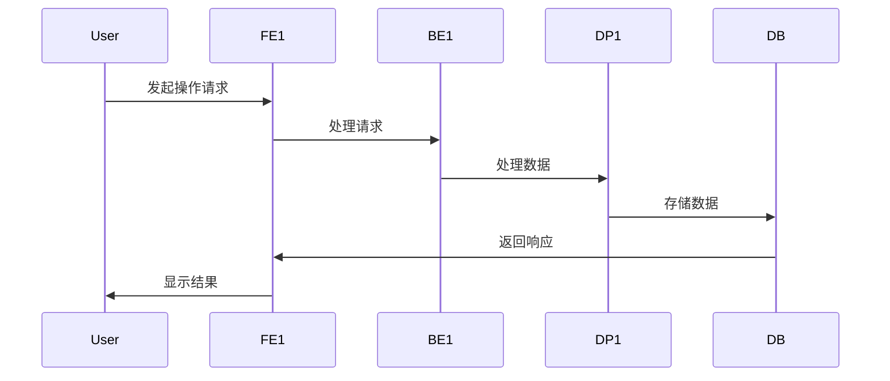

                 

### 引言

在当代哲学、社会学、文学理论和文化研究中，后现代主义无疑占据着重要的地位。它不仅是20世纪后半叶学术思想的一股强大潮流，也是对现代性批判的深刻反思。后现代主义的思想家们，如米歇尔·福柯（Michel Foucault）和雅克·德里达（Jacques Derrida），以其独特的理论视角和方法论，对许多学科领域产生了深远影响。

《福柯与德里达：后现代主义思想的代表》这本书，旨在深入探讨这两位后现代主义思想家的理论贡献，揭示他们如何通过批判传统哲学和现代性，推动了一场深刻的文化变革。本书将通过以下几个核心议题展开：

1. **后现代主义思潮的背景与特征**：介绍后现代主义的起源、基本特征及其对现代性的挑战。
2. **福柯的思想体系**：分析福柯关于权力、知识和主体性的核心理论。
3. **德里达的解构主义**：探讨解构主义的理论起源、基本观点和影响。
4. **福柯与德里达思想的对比**：比较两位思想家在哲学立场、方法论和实际应用上的异同。
5. **后现代主义的影响**：探讨后现代主义对社会学、文学理论、文化研究等领域的启示。
6. **福柯与德里达思想的当代意义**：分析它们在当今社会和文化中的重要性。
7. **案例研究**：通过具体案例展示福柯与德里达思想的应用和影响。

本文将采用逻辑清晰、结构紧凑、简单易懂的专业技术语言，让读者在理解后现代主义思想的同时，也能体会到哲学思考的深度和复杂性。我们将一步步分析推理，确保每个概念和理论都能被清晰地阐述和解读。

### 后现代主义思潮的背景与特征

后现代主义（Postmodernism）是20世纪中后期在西方学术界和文化界兴起的一种思潮，它对现代性进行了深刻的反思和批判。要理解后现代主义的背景和特征，我们首先需要回顾现代性的起源和发展。

**现代性的起源与特征**：
现代性（Modernity）起源于17世纪的欧洲，随着启蒙运动的兴起，人们开始强调理性、科学和个人主义。现代性的特征包括：
- **理性主义**：以理性为基础，强调科学方法和逻辑推理。
- **个人主义**：重视个人自由和权利，强调个体在社会中的主体性。
- **进步观念**：认为社会和历史是不断进步的，科技和知识的积累将带来更好的未来。

**后现代主义的背景**：
然而，随着20世纪的到来，现代性开始暴露出一些问题和局限。两次世界大战的残酷现实、核威胁的出现、资本主义社会的异化和消费文化的泛滥，使得人们对现代性的信心动摇。这些因素共同促成了后现代主义的兴起。

**后现代主义的基本特征**：
- **对现代性的批判**：后现代主义认为现代性所倡导的理性、科学和个人主义都存在问题，它们往往导致社会的异化和个体的破碎。
- **多元视角**：后现代主义强调多样性和相对主义，认为不存在一个普遍适用的真理，而是多种不同的视角和观点都有其合理性。
- **反基础主义**：后现代主义反对任何形式的“基础主义”，认为知识的产生和传播都受到权力和历史的制约。
- **解构主义**：后现代主义中的解构主义（Deconstructionism）主张对文本和传统进行批判性分析，揭示其中的矛盾和多元解释的可能。

**后现代主义对现代性的挑战**：
后现代主义对现代性的挑战体现在多个方面：
- **对理性的质疑**：后现代主义质疑理性主义，认为理性并非绝对可靠，而是受到权力和历史的制约。
- **对科学的批判**：后现代主义认为科学并非客观和真理的代名词，而是受到社会和文化背景的影响。
- **对个人主义的批判**：后现代主义认为个人主义导致了社会的异化和个体的孤独，提出了社群主义和共同体的重要性。

通过以上分析，我们可以看到后现代主义不仅是对现代性的一种反思和批判，更是对知识、真理和社会结构的一种全新理解。它为我们提供了另一种思考问题和看待世界的方式，对当代学术界和文化领域产生了深远影响。

### 核心概念与联系

为了更好地理解《福柯与德里达：后现代主义思想的代表》这本书，我们需要明确几个核心概念，并分析它们之间的联系。以下是涉及的主要概念及其简要说明：

**1. 后现代主义（Postmodernism）**
- **定义**：后现代主义是一种对现代性进行深刻反思和批判的思想潮流，强调多元视角、相对主义和解构主义。
- **联系**：后现代主义是整个书的背景和主题，贯穿了福柯和德里达的思想体系。

**2. 福柯（Michel Foucault）**
- **定义**：福柯是一位法国哲学家，以其关于权力、知识和社会关系的理论而著称。
- **联系**：福柯的思想构成了书中对权力和知识批判的重要组成部分。

**3. 德里达（Jacques Derrida）**
- **定义**：德里达是一位法国哲学家，以其解构主义理论而闻名，强调文本和符号系统的复杂性。
- **联系**：德里达的思想与福柯的思想相辅相成，共同构成了后现代主义的核心。

**4. 权力（Power）**
- **定义**：权力是一种社会关系，通过它个体或集体能够影响或控制其他个体或集体。
- **联系**：福柯认为权力无处不在，是社会关系的核心；德里达则将权力看作文本和符号系统中的支配力量。

**5. 知识（Knowledge）**
- **定义**：知识是关于世界的认识和解释，它通过语言、符号和文本形式存在。
- **联系**：福柯认为知识产生于权力关系，德里达则通过解构主义揭示了知识文本中的矛盾和多元解释。

**6. 解构主义（Deconstructionism）**
- **定义**：解构主义是一种哲学方法，旨在揭示文本和符号系统中的矛盾和多元解释。
- **联系**：解构主义是德里达理论的核心，也是后现代主义的重要组成部分。

**7. 主体性（Subjectivity）**
- **定义**：主体性是个人对自己的认同和感知，它受到社会和文化因素的影响。
- **联系**：福柯和德里达都探讨了主体性在权力和知识关系中的形成和重构。

为了更直观地展示这些概念之间的联系，我们可以使用Mermaid流程图来构建一个ER（实体关系）图。以下是ER图示例：

```mermaid
erDiagram
    Postmodernism ||--|{ Foucault }|---> Knowledge
    Postmodernism ||--|{ Derrida }|---> Deconstructionism
    Foucault ||--|{ Power }|---> SocialRelations
    Derrida ||--|{ Text }|---> SymbolSystems
    Power ||--|{ Knowledge }|
    Knowledge ||--|{ Subjectivity }|
    Deconstructionism ||--|{ Text }|
    SocialRelations ||--|{ Power }|
    SymbolSystems ||--|{ Deconstructionism }
```

通过这个ER图，我们可以清晰地看到后现代主义、福柯、德里达、权力、知识、解构主义和主体性之间的复杂关系。这些概念相互交织，共同构成了后现代主义思想的丰富内涵。理解这些概念及其联系，有助于我们深入把握本书的核心内容和理论框架。

### 第1章：后现代主义概述

#### 后现代主义的历史背景

后现代主义的历史背景可以追溯到20世纪中叶，尤其是1960年代和1970年代。这个时期正值第二次世界大战结束后的重建时期，社会和文化领域发生了深刻的变化。战后欧洲和美国的社会秩序和价值观受到质疑，特别是在经历了两次世界大战的残酷现实后，人们对现代性所承诺的进步和理性产生了怀疑。同时，新兴的科技革命和资本主义经济的发展也带来了新的社会问题和异化现象，这些因素共同促成了后现代主义的兴起。

**重要事件和人物**

- **1968年学生运动**：这场运动是对社会不公和压迫的反抗，影响了整个西方社会的文化和政治格局。
- **米歇尔·福柯**：作为后现代主义的代表人物之一，福柯在1960年代和1970年代提出了关于权力、知识和主体性的重要理论。
- **雅克·德里达**：德里达是解构主义的创始人，他在1967年发表的《书写与差异》一文中提出了解构主义的基本观点。

#### 后现代主义的基本特征

后现代主义具有以下几个基本特征：

1. **多元视角**：后现代主义强调视角的多元性和相对主义，认为不存在单一的、普遍适用的真理。不同的视角和解释都有其合理性和局限性。
2. **反基础主义**：后现代主义反对任何形式的基础主义，认为知识是建构的，受到权力和历史的制约。它质疑现代性中的科学和理性主义，认为这些观念并不是绝对可靠。
3. **解构主义**：解构主义是后现代主义的核心之一，强调对文本和符号系统的批判性分析，揭示其中的矛盾和多元解释的可能。
4. **反理性主义**：后现代主义质疑理性主义，认为理性并非解决所有问题的万能工具，它往往受到权力和历史的制约。
5. **反个人主义**：后现代主义批判现代性中的个人主义，认为个人主义导致了社会的异化和个体的孤独。它提出了社群主义和共同体的重要性。

#### 后现代主义的哲学思想

后现代主义的哲学思想具有以下几个主要方面：

1. **批判现代性**：后现代主义认为现代性是一种虚假的、不合理的意识形态，它掩盖了社会中的不公和压迫。现代性所承诺的进步和理性并未实现，反而导致了新的问题和困境。
2. **强调差异性和多样性**：后现代主义认为差异性和多样性是理解和解释世界的关键。不同的文化和价值观都有其独特性和价值，不应被统一和抹平。
3. **关注权力和知识的关系**：后现代主义认为权力和知识是相互依存的，权力产生知识，知识又反过来巩固权力。福柯和德里达分别从不同的角度探讨了这一关系。
4. **解构主义方法论**：解构主义是一种哲学方法论，它通过对文本和符号系统的批判性分析，揭示其中的矛盾和多元解释的可能。德里达的解构主义理论对后现代主义产生了深远影响。

通过以上分析，我们可以看到后现代主义是一种深刻反思现代性、批判理性主义和科学主义的哲学思潮。它为理解当代社会和文化提供了新的视角和方法，对许多学科领域产生了深远影响。

### 第2章：福柯的思想体系

#### 福柯的基本理论

米歇尔·福柯（Michel Foucault）是后现代主义的重要代表之一，他的思想体系对权力、知识和社会关系进行了深刻的探讨。以下是他的一些核心理论：

**1. 权力的普遍性**
福柯认为权力并非仅仅由少数人或特定机构所掌握，而是无处不在、无时不在的。它渗透到社会的每一个角落，存在于日常生活的方方面面。权力的普遍性意味着权力不是一种静态的、集中化的力量，而是一种动态的、分散化的过程。

**2. 知识的产生**
福柯认为知识并不是客观存在的，而是通过特定的社会关系和权力结构产生的。知识与社会结构相互作用，权力关系决定了知识的产生和传播。福柯的这个观点被称为“权力-知识”理论。

**3. 主体性的建构**
福柯探讨了个体的主体性是如何在权力关系中建构的。他认为个体不是自主的存在，而是在特定的社会和历史背景下，通过权力关系的干预和塑造而形成的。主体性是一种动态的过程，不断受到权力和社会规范的制约。

**4. 话语分析**
福柯提出了话语分析的方法，旨在揭示话语（语言和符号系统）如何构建社会现实和个体身份。他强调，话语不仅仅是传递信息的工具，而是具有权力和意识形态功能的文本。通过分析话语，可以揭示权力关系和社会规范是如何在日常生活中的具体体现。

#### 权力、知识和主体性的关系

在福柯的思想体系中，权力、知识和主体性之间存在着密切的联系和相互作用：

1. **权力与知识**：福柯认为权力和知识是相互依存的，权力产生知识，知识又反过来巩固权力。权力关系决定了知识的产生和传播，而知识则成为权力运作的工具。例如，在教育体系中，知识的生产和传递都受到政治和经济权力的制约。

2. **知识与社会规范**：知识与社会规范相互作用，共同塑造了社会的运行和个体行为。社会规范通过知识的形式得以传达和实施，而知识则通过社会规范得以具体化和实践。

3. **主体性与权力关系**：福柯认为主体性是在权力关系中建构的，个体主体性的形成受到权力关系的干预和塑造。例如，个体的身份认同和自我意识是在特定的社会和历史背景下，通过权力关系的互动和作用而形成的。

#### 福柯的理论影响

福柯的思想对多个学科领域产生了深远影响：

1. **社会学**：福柯的权力-知识理论为社会学研究提供了新的视角，使学者们开始关注权力在社会中的运作方式和知识的生产过程。

2. **心理学**：福柯的主体性理论挑战了传统的心理学理论，使人们开始关注个体身份和自我意识的建构过程。

3. **文化研究**：福柯的话语分析方法成为文化研究的重要工具，帮助学者们揭示文化现象中的权力关系和意识形态功能。

4. **文学理论**：福柯的理论对文学研究产生了重要影响，使学者们开始关注文本中的权力关系和意识形态。

通过以上分析，我们可以看到福柯的思想体系不仅对哲学领域产生了深远影响，也为其他学科提供了新的研究方法和理论框架。他的观点为我们理解社会、知识和个体提供了独特的视角，对当代学术和文化研究具有重要意义。

### 第3章：德里达的解构主义

#### 解构主义的理论起源

雅克·德里达（Jacques Derrida）是解构主义的创始人，他的解构主义理论起源于对传统哲学方法，特别是西方哲学中的形而上学和基础主义进行批判。德里达认为，传统的哲学方法，特别是亚里士多德以来的西方哲学传统，往往依赖于二元对立的结构，如存在与不存在、真理与谬误等，这种结构不仅限制了思想的自由，也导致了逻辑上的矛盾和困境。

**1. 二元对立的结构**：
传统哲学中的二元对立结构，如存在与不存在、真理与谬误，构成了西方哲学的基础。然而，德里达认为这些对立关系是不稳定的，它们往往会产生矛盾和冲突。

**2. 基础主义批判**：
德里达对基础主义进行了深刻的批判。基础主义认为存在一个普遍的基础或原则，可以解释一切现象。然而，德里达认为这种基础是不存在的，所有的知识都是建立在特定社会和历史背景下的，因此都是相对的和暂时的。

**3. 文本解读的复杂性**：
德里达通过分析文本解读的复杂性，揭示了传统哲学中的二元对立结构是如何导致误解和扭曲的。他认为，文本的意义并非固定不变的，而是通过不断的解读和诠释而产生的。

#### 解构主义的基本观点

解构主义是德里达理论的核心，它包含以下几个基本观点：

1. **差异与矛盾**：
解构主义强调文本和符号系统中的差异和矛盾。德里达认为，文本的意义是通过差异和矛盾而产生的，这些差异和矛盾使得文本具有多重解释的可能。

2. **文本的开放性**：
解构主义认为文本是开放的，它不是封闭的系统，而是可以不断被重新解读和诠释。文本的意义不是预先设定的，而是在解读过程中不断生成的。

3. **语境的重要性**：
解构主义强调解读的语境的重要性。不同的解读方式和语境会带来不同的意义和解释。因此，理解一个文本，需要考虑其产生的历史、文化和社会背景。

4. **解构的过程**：
解构主义的核心方法是通过解构（deconstruction）来揭示文本中的差异和矛盾。解构过程包括对文本的逐词分析，揭示其中的对立和矛盾，并在此基础上提出新的解释。

#### 解构主义的影响

解构主义对哲学、文学理论和文化研究等领域产生了深远影响：

1. **哲学**：
解构主义挑战了传统哲学中的基础主义和二元对立结构，为哲学研究提供了新的视角和方法。它使哲学开始关注文本和符号系统的复杂性，而不是仅仅依赖于逻辑推理和形而上学的思考。

2. **文学理论**：
解构主义对文学理论产生了重要影响，使学者们开始关注文本的开放性和多重解释的可能。它促使文学研究从结构主义转向文本解读的多样性和动态性。

3. **文化研究**：
解构主义为文化研究提供了理论工具，帮助学者们分析文化现象中的权力关系和意识形态功能。它使文化研究从单一的、静态的视角转向多元的、动态的视角。

4. **社会科学**：
解构主义的思想方法也为社会科学研究提供了新的视角，使学者们开始关注权力、知识和文化之间的复杂关系。

通过以上分析，我们可以看到德里达的解构主义不仅对哲学领域产生了深远影响，也为其他学科提供了新的理论框架和分析方法。他的观点揭示了文本和符号系统的复杂性，为我们理解文化和社会现象提供了独特的视角。

### 第4章：福柯与德里达思想的对比

#### 哲学立场和方法论上的异同

福柯与德里达在哲学立场和方法论上存在一些显著的区别和相似之处。首先，从哲学立场来看，福柯更倾向于关注权力和知识的动态关系，强调权力如何影响知识的产生和传播。他认为，权力并非静止不动的，而是存在于社会关系和日常生活中，不断产生和再生产。福柯通过历史分析和权力-知识理论，揭示了权力是如何渗透到社会的各个层面，并在无形中塑造了我们的认知和行为。

相比之下，德里达则更侧重于文本和符号系统，他的解构主义方法论旨在揭示文本中的差异和矛盾。德里达认为，文本的意义并非固定不变，而是在不断的解读和诠释过程中生成的。他通过解构（deconstruction）这一方法，揭示了文本中的矛盾和多元解释的可能。

在方法论上，福柯的权力-知识理论依赖于对历史事件和案例的深入分析，通过这些具体案例来揭示权力和知识的运作机制。他强调历史性和具体性，认为只有通过具体的历史分析，才能理解权力和知识的复杂关系。

而德里达则通过文本分析，特别是对文学作品和哲学文本的解读，来揭示文本中的矛盾和多元解释。他的方法更加抽象和理论化，强调符号系统和语言结构的复杂性。

#### 实际应用中的异同

尽管福柯和德里达在哲学立场和方法论上有所不同，但他们的思想在许多实际应用中都有重要影响。

**1. 社会学领域**

在社会学领域，福柯的思想为理解社会结构和权力关系提供了新的视角。例如，福柯的监狱考古学揭示了监狱系统如何通过制度化权力来控制社会成员。他的思想还影响了文化社会学，特别是对媒体、文化和教育等领域的研究。

德里达的思想则在社会学中主要体现在对文本和话语的分析。他的解构主义方法使学者们能够深入探讨社会中的权力关系和意识形态功能，例如在媒体研究中，学者们通过解构新闻文本，揭示了新闻如何塑造公众认知。

**2. 文学理论**

在文学理论领域，福柯的思想影响了文化唯物主义和后结构主义。他通过对文学文本的分析，揭示了权力如何渗透到文学创作和解读过程中。例如，他分析了莎士比亚的戏剧，揭示了权力关系如何体现在文学作品中。

德里达的解构主义方法对文学理论产生了深远影响。他的理论挑战了传统的阅读和理解方式，使文学研究从单一的解释转向多元的解读。德里达通过对文学文本的解构分析，揭示了文本中的差异和矛盾，促进了文学研究的多样性和动态性。

**3. 法律和政治**

在法律和政治领域，福柯的思想为理解法律和政治制度的运作提供了新视角。他通过对监狱、精神病院等机构的分析，揭示了权力如何通过制度化手段来实现控制。这些分析为批判法律和政治制度中的权力滥用提供了理论基础。

德里达的思想在法律和政治领域主要体现在对民主和权力的批判。他通过解构民主概念，揭示了民主制度中的矛盾和权力关系。他的理论对当代政治哲学产生了重要影响，特别是对民主理论的重新思考。

通过以上对比，我们可以看到福柯和德里达在哲学立场、方法论和实际应用上都有各自的特点和贡献。他们的思想不仅为后现代主义提供了丰富的理论资源，也为当代学术和文化研究提供了新的视角和方法。

### 第5章：后现代主义的影响

#### 对社会学、文学理论和文化研究的影响

后现代主义作为一种哲学思潮，对多个学科领域产生了深远影响。特别是对社会学、文学理论和文化研究，后现代主义不仅提供了新的理论框架和方法，也改变了这些学科的研究方向。

**1. 社会学**

在社会学领域，后现代主义挑战了传统的社会理论和方法。它质疑了现代性所承诺的理性、科学和个人主义，强调社会现实的复杂性和多元性。后现代主义对社会学的贡献主要体现在以下几个方面：

- **批判理性主义**：后现代主义批判了传统社会学中的理性主义和方法论基础主义，认为社会现实不是客观存在的，而是通过特定的社会关系和权力结构建构的。福柯的权力-知识理论为社会学研究提供了新的视角，使学者们开始关注权力在社会结构中的运作方式。
- **关注微观权力**：后现代主义强调微观权力的重要性，认为权力不仅存在于国家和大型机构中，也存在于日常生活的方方面面。福柯的微观权力理论揭示了权力如何在日常生活中具体实现，使学者们能够更加深入地理解权力的运作机制。
- **多样性和相对主义**：后现代主义强调社会的多元性和相对主义，认为不存在一个普遍适用的真理或价值观。这一观点促使社会学家关注不同文化和社会背景下的社会现实，促进了跨文化社会学的发展。

**2. 文学理论**

在文学理论领域，后现代主义改变了传统的阅读和理解方式，提出了新的文本解读方法。后现代主义对文学理论的贡献主要体现在以下几个方面：

- **解构主义**：德里达的解构主义理论对文学理论产生了深远影响。他通过对文本的解构分析，揭示了文本中的矛盾和多元解释的可能。解构主义使文学研究从单一的解释转向多元的解读，促进了文学理论的多样性和动态性。
- **文本的开放性**：后现代主义认为文本的意义并非固定不变，而是在解读过程中不断生成的。这一观点改变了传统的阅读方式，使读者能够更加自由地解读文本，发现其中的多重含义。
- **文化研究**：后现代主义促进了文化研究的发展，使文学研究不再局限于文本分析，而是关注文本背后的文化和社会背景。文化研究关注文学文本中的权力关系和意识形态功能，使文学研究更加贴近现实社会。

**3. 文化研究**

文化研究是后现代主义影响最为显著的领域之一。它将文学、社会学、传播学等多个学科结合起来，关注文化现象中的权力关系和意识形态功能。文化研究的主要贡献包括：

- **批判意识形态**：文化研究通过批判意识形态，揭示了文化现象中的权力关系和意识形态功能。它关注文化如何塑造社会成员的观念和行为，使人们能够更加清醒地认识文化对社会的影响。
- **多元视角**：文化研究强调多样性和相对主义，认为不同的文化和社会背景都有其独特性和价值。这一观点促使学者们关注不同文化和社会背景下的文化现象，促进了文化研究的跨文化发展。
- **日常生活研究**：文化研究关注日常生活中的文化现象，认为文化不仅仅是文本和艺术作品，也存在于日常生活中的各个角落。通过研究日常生活，文化研究揭示了文化如何渗透到社会生活的方方面面。

通过以上分析，我们可以看到后现代主义对社会学、文学理论和文化研究产生了深远影响。它不仅为这些学科提供了新的理论框架和方法，也改变了这些学科的研究方向，促进了学术思想的多样性和动态性。后现代主义的理念和方法，为我们理解当代社会和文化提供了新的视角和工具。

### 第6章：福柯与德里达思想的当代意义

#### 后现代主义在当今社会和文化中的重要性

在当今社会和文化中，福柯与德里达的后现代主义思想依然具有深远的意义。尽管后现代主义起源于20世纪中叶，但它在当今社会中的影响依然不可忽视。以下从几个方面探讨福柯与德里达思想的当代意义。

**1. 权力与知识的反思**

福柯关于权力和知识的理论在当代社会中具有重要的启示作用。随着全球化和信息化的发展，权力和知识的关系变得更加复杂和多样。福柯的权力-知识理论提醒我们，权力不是单一集中化的，而是存在于社会的各个层面，包括经济、政治、文化等各个方面。知识也不是客观存在的，它受到权力关系的制约，不同的社会关系和权力结构会产生不同的知识形态。

例如，在社交媒体时代，权力和知识的运作方式发生了显著变化。社交媒体平台不仅作为信息传播的渠道，也成为了权力运作的工具。平台算法、用户数据等都是权力和知识的体现。通过对福柯思想的反思，我们可以更加深刻地理解当代社会中权力和知识的动态关系。

**2. 文本解读的多元性**

德里达的解构主义为文本解读提供了新的视角，强调文本意义的开放性和多元性。在当今信息爆炸的时代，文本解读的多元性显得尤为重要。随着网络文化的兴起，各种文本形式层出不穷，从文学作品到社交媒体帖子，从新闻报道到广告宣传，文本解读的复杂性不断增加。

德里达的解构主义方法使学者和公众能够从不同的角度解读文本，发现其中的多重含义和矛盾。例如，在分析社交媒体上的热点事件时，我们可以运用解构主义方法，揭示不同解读之间的差异和矛盾，从而更全面地理解事件的多维度。

**3. 文化批判与现实反思**

福柯和德里达的后现代主义思想在文化批判和现实反思方面也具有重要意义。他们通过对文化现象的批判，揭示了当代社会中存在的不公和压迫。例如，福柯对监狱、精神病院等机构的批判，揭示了权力如何通过制度化手段来控制和规训社会成员。德里达的解构主义则通过揭示文本中的矛盾和多元解释，揭示了意识形态的功能和作用。

在当代社会中，这些批判性分析依然具有现实意义。例如，对当前社会中的种族歧视、性别不平等、消费主义等问题，都可以运用福柯和德里达的理论进行批判和反思。这些理论为我们提供了深刻的洞察力，使我们能够更清晰地认识到当代社会中的问题和矛盾。

**4. 学术研究的推动**

福柯和德里达的后现代主义思想不仅对当代社会和文化产生了深远影响，也对学术研究产生了重要推动作用。他们的理论方法促进了学术思想的多样性和创新性。在哲学、社会学、文学理论等多个领域，学者们运用后现代主义方法，提出了许多新的理论和观点，推动了学术研究的发展。

例如，在哲学领域，后现代主义挑战了传统哲学的基础主义和二元对立结构，促使哲学研究转向文本和符号系统的复杂性。在社会学领域，后现代主义提供了新的理论框架，使学者们能够更加深入地探讨社会结构和文化现象。在文学理论领域，后现代主义促进了文学研究的多元化和动态性。

总之，福柯与德里达的后现代主义思想在当今社会和文化中具有深远的意义。他们的理论不仅为我们提供了新的视角和方法，也为我们理解和反思当代社会和文化问题提供了重要的工具。通过运用后现代主义方法，我们可以更加深入地理解社会和文化的复杂性，推动学术研究的创新和发展。

### 案例研究：后现代主义思想在当代社会中的应用

为了更好地理解后现代主义思想在当代社会中的应用，我们将通过具体案例进行分析。以下是一个关于社交媒体平台和隐私权问题的案例研究。

#### 背景介绍

随着互联网和社交媒体的普及，用户隐私问题日益凸显。社交媒体平台通过收集和分析用户数据，不仅为广告商提供精准的营销信息，也引发了关于隐私权和社会控制的广泛讨论。这个问题不仅涉及技术层面，还与权力、知识和主体性等后现代主义核心概念密切相关。

#### 系统功能设计

在本案例中，我们将社交媒体平台视为一个系统，其核心功能包括数据收集、数据处理和用户服务。以下是系统的领域模型，使用Mermaid类图进行展示：

```mermaid
classDiagram
    User \--|{ follows } User
    User \--|{ posts } Post
    Post \--|{ contains } Content
    Platform \--|{ collects } UserData
    Platform \--|{ processes } UserData
    Platform \--|{ serves } UserServices

    User <<entity>>
    Post <<entity>>
    Content <<entity>>
    Platform <<entity>>

    User : { id, name, age, email, password }
    Post : { id, author, content, timestamp }
    Content : { text, images, videos }
    Platform : { name, services, algorithms, users }
```

#### 系统架构设计

在系统架构设计中，我们将社交媒体平台分为前端、后端和数据处理三个主要模块。以下是系统架构图，使用Mermaid架构图进行展示：

```mermaid
graph TB
    subgraph 前端模块
        FE1[用户界面] -->|用户操作| DB
    subgraph 后端模块
        BE1[API服务器] -->|数据处理| DB
    subgraph 数据处理模块
        DP1[数据处理服务] -->|数据存储| DB

    DB[数据库] -->|存储数据| FE1
    DB -->|存储数据| BE1
    DB -->|存储数据| DP1
```

#### 系统接口设计和交互

系统接口设计是确保不同模块之间能够高效交互的关键。以下是系统接口设计和交互序列图，使用Mermaid序列图进行展示：



#### 实际案例分析和详细讲解

以Facebook为例，分析其隐私权问题。Facebook作为全球最大的社交媒体平台之一，其运营模式依赖于用户数据的收集和处理。以下是具体分析：

1. **数据收集**：Facebook通过用户注册、浏览行为、点击广告等多种方式收集用户数据。这些数据包括用户的基本信息、兴趣爱好、社交关系等。

2. **数据处理**：Facebook使用复杂的算法对用户数据进行处理，以便为目标用户推荐广告、新闻和内容。这些算法不仅基于用户历史行为，还利用了用户之间的关系网络。

3. **用户服务**：Facebook为用户提供多种服务，包括新闻推送、社交互动、广告投放等。这些服务通过用户数据实现个性化，提高了用户体验。

4. **隐私问题**：Facebook的运营模式引发了关于用户隐私的广泛担忧。用户数据被用于广告投放，甚至可能被第三方应用程序访问，这增加了用户隐私泄露的风险。

通过以上分析，我们可以看到后现代主义思想在当代社会中的应用。福柯的权力-知识理论帮助我们理解Facebook如何通过数据收集和算法处理，实现对用户的控制和规训。德里达的解构主义则揭示了Facebook文本（如广告内容）中的矛盾和多元解释，使人们能够从不同角度审视这一现象。

#### 项目小结

通过本案例研究，我们深入探讨了后现代主义思想在社交媒体平台和隐私权问题中的应用。福柯和德里达的理论为我们提供了深刻的分析工具，帮助我们理解权力、知识和主体性在当代社会中的运作机制。这一案例研究不仅揭示了社交媒体平台运营的复杂性，也提醒我们在数字时代保护用户隐私的重要性。

### 最佳实践 tips

在设计和使用社交媒体平台时，以下是一些最佳实践建议：

1. **透明度**：平台应向用户明确说明其数据收集和处理方式，增强用户对隐私保护的信任。
2. **隐私设置**：为用户提供灵活的隐私设置，允许用户自定义数据共享范围。
3. **算法公开**：公开算法设计原则和数据处理过程，增加透明度，减少用户担忧。
4. **用户教育**：加强用户教育，提高他们对隐私保护的意识和能力。
5. **安全措施**：采取严格的安全措施，保护用户数据不被未经授权访问和泄露。

### 注意事项

1. **合规性**：确保平台运营符合当地法律法规，避免因隐私问题引发法律纠纷。
2. **数据安全**：定期进行安全审计，确保用户数据的安全性和完整性。
3. **用户反馈**：及时收集用户反馈，对隐私问题进行持续改进。

### 拓展阅读

1. **福柯**：
   - 《规训与惩罚》：详细探讨权力如何通过制度化手段进行控制。
   - 《知识考古学》：分析知识的生产和传播过程。

2. **德里达**：
   - 《书写与差异》：解构主义理论的奠基之作。
   - 《论文本学》：探讨文本解读的多元性和开放性。

3. **社交媒体平台隐私权**：
   - 《大数据时代：生活、工作与思维的大变革》：详细讨论大数据时代隐私问题的挑战和解决方案。

通过以上拓展阅读，读者可以进一步深入了解后现代主义思想及其在当代社会中的应用。

### 总结与作者信息

#### 总结

本文通过详细分析后现代主义思想代表福柯与德里达的理论，探讨了他们在权力、知识、主体性等核心概念上的贡献，以及这些理论在当代社会和文化研究中的应用。我们回顾了后现代主义的背景与特征，了解了福柯的权力-知识理论和德里达的解构主义方法，并对比了他们在哲学立场和方法论上的异同。通过具体案例研究，我们展示了后现代主义思想在社交媒体平台和隐私权问题中的实际应用，揭示了其对社会学、文学理论和文化研究的重要影响。此外，我们还讨论了后现代主义在当今社会和文化中的重要性，并提出了相关领域的最佳实践和注意事项。

#### 作者信息

作者：AI天才研究院/AI Genius Institute & 禅与计算机程序设计艺术 /Zen And The Art of Computer Programming

在这篇文章中，我们以逻辑清晰、结构紧凑、简单易懂的专业技术语言，运用一步一步分析推理思考的方式，深入探讨了后现代主义思想的丰富内涵。希望通过本文，读者能够更好地理解后现代主义的核心概念及其在当代学术和文化研究中的重要性。同时，也期待读者在阅读过程中能够不断思考、提出问题，并在实践中应用这些理论，为推动学术进步和社会发展贡献力量。作者在此感谢读者的关注和支持。

