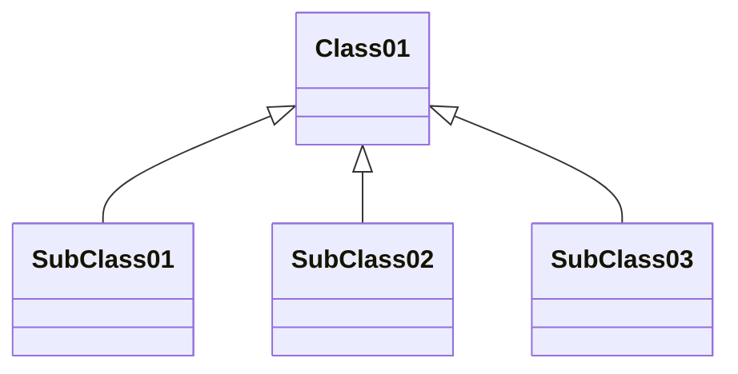
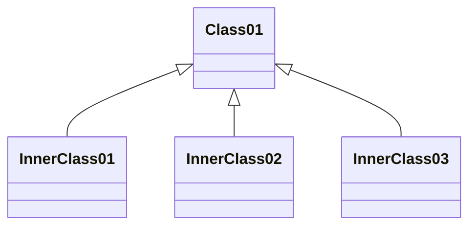
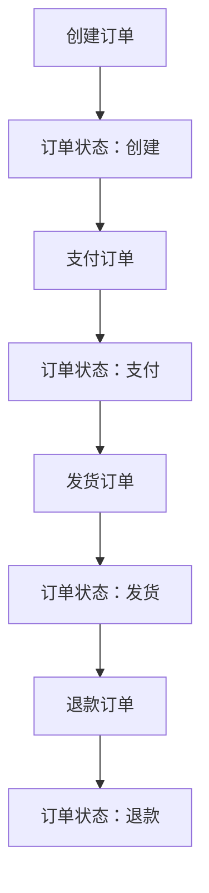
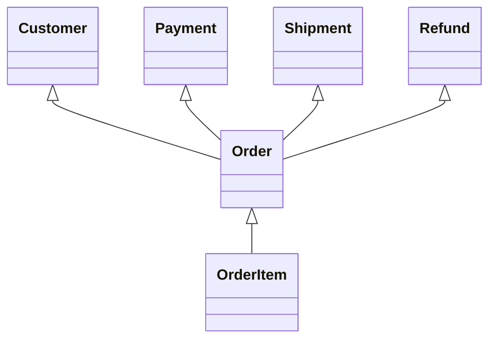
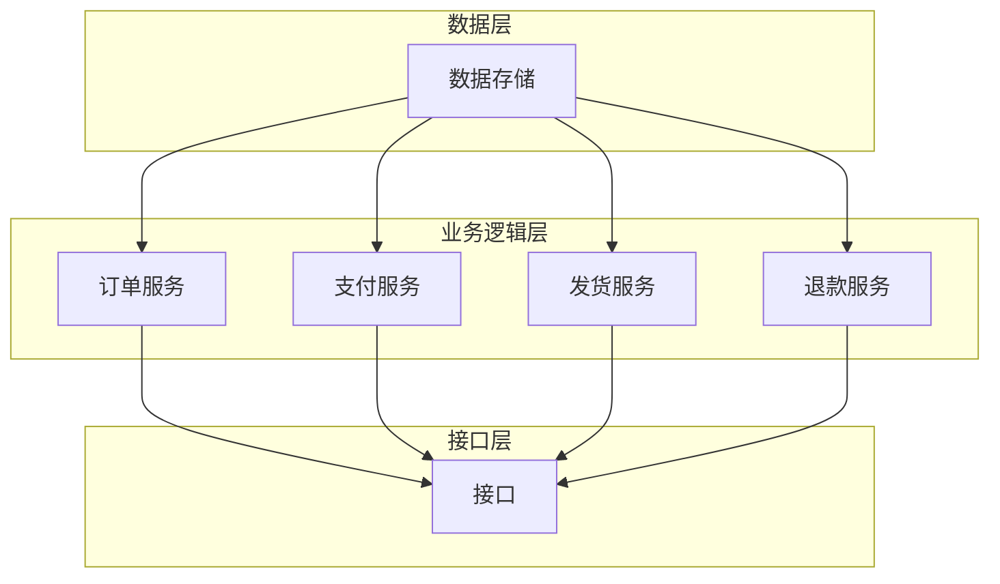
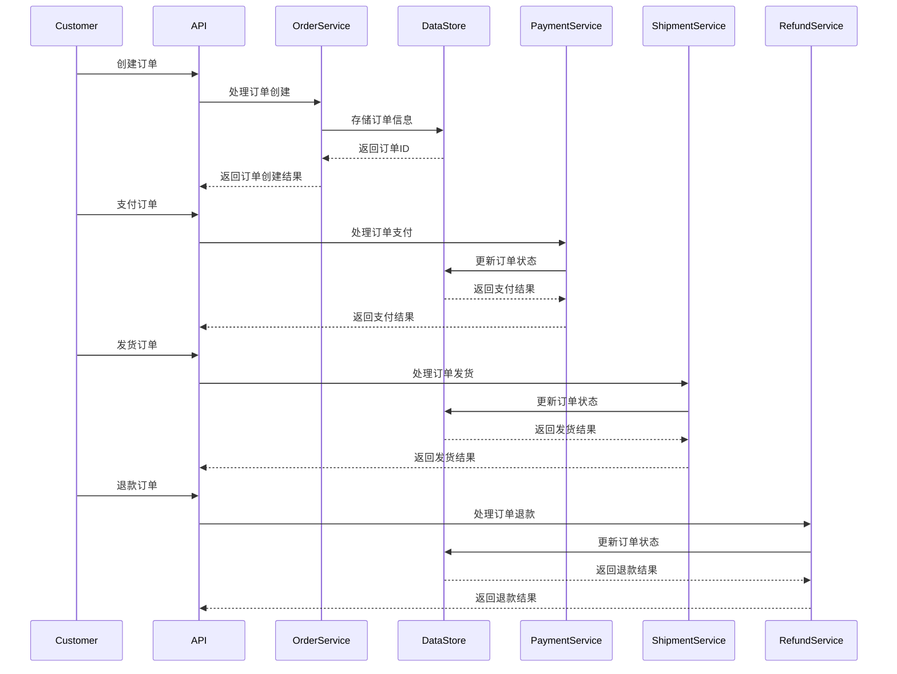
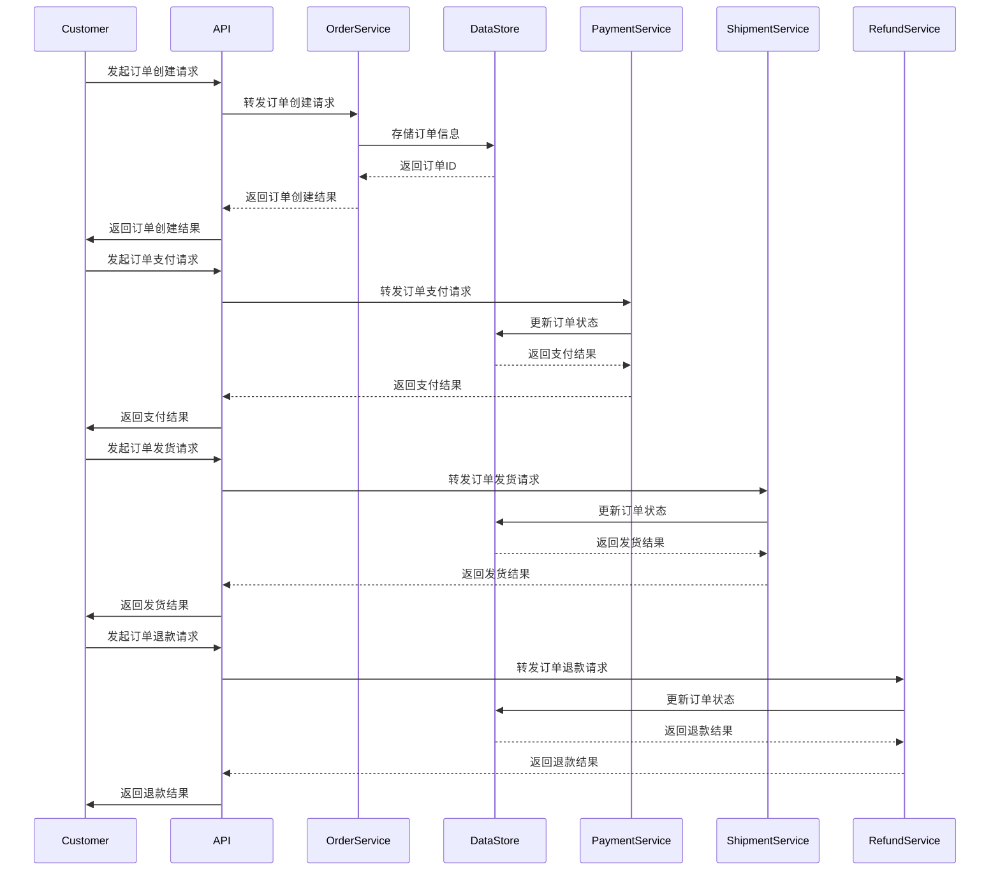

                 

## 文章标题

### 私有语言与内部类：封装的极致表现

---

### 关键词：私有语言、内部类、封装、软件工程、设计模式

### 摘要：
本文深入探讨私有语言和内部类的概念、应用场景及其在软件工程中的重要性。我们将从定义出发，逐步分析私有语言和内部类的优势、挑战，并通过实际案例，展示它们如何在项目中发挥封装的极致作用。

---

## 第一部分：私有语言的定义与背景

### 第1章：私有语言概述

#### 1.1 私有语言的定义与起源

私有语言，顾名思义，是一种仅在特定项目或团队内部使用的语言或语法规则。它起源于软件工程领域，特别是在那些需要高度定制化、复杂度较高的系统中。私有语言的设计往往为了解决特定问题，使代码更易于理解和维护。

私有语言的起源可以追溯到20世纪70年代，当时的软件工程师在开发大型系统时，为了提高代码的复用性和可维护性，开始尝试创造自己特有的语言或语法。

#### 1.2 私有语言的应用场景

私有语言的应用场景广泛，尤其在以下几种情况下尤为突出：

1. **定制化开发**：当项目的需求高度定制化，标准语言难以满足时，私有语言能够更好地适应需求。
2. **内部工具**：团队内部开发的一些工具或脚本，往往需要私有语言来提高开发效率。
3. **闭源项目**：对于一些闭源项目，使用私有语言可以防止代码被泄露或逆向工程。

### 第2章：私有语言的优势与挑战

#### 2.1 私有语言的优点

- **提高代码可读性**：私有语言通常基于项目需求设计，语法更贴近业务逻辑，使代码更易读。
- **降低维护成本**：私有语言减少了外部依赖，降低了维护的复杂性。
- **增强模块化**：私有语言使得模块之间更加独立，提高了系统的可扩展性。

#### 2.2 私有语言的挑战

- **可移植性问题**：私有语言往往与特定平台或框架紧密相关，不易移植。
- **学习成本**：团队成员需要学习私有语言，增加了学习成本。
- **互操作性**：私有语言与外部系统或库的互操作性较差。

## 第二部分：内部类的深入探讨

### 第3章：内部类的概念与分类

#### 3.1 内部类的定义

内部类是嵌套在一个类内部的类。根据内部类是否依赖于外部类，可以分为静态内部类和非静态内部类。

- **静态内部类**：静态内部类与外部类之间没有直接关联，可以独立使用。
- **非静态内部类**：非静态内部类依赖于外部类，通常用于封装外部类的内部逻辑。

#### 3.2 内部类的分类

- **实例内部类**：实例内部类与外部类的每个实例关联，通常用于创建内部实例。
- **局部内部类**：局部内部类定义在方法内部，生命周期与外部方法相同。

### 第4章：内部类的应用与技巧

#### 4.1 内部类与封装

内部类与封装的关系非常紧密。内部类可以隐藏外部类的一部分，从而提高系统的封装性。

#### 4.2 内部类与设计模式

内部类广泛应用于各种设计模式，如单例模式、工厂模式等。这些模式利用内部类实现复杂的逻辑和对象创建。

## 第三部分：私有语言与内部类的综合应用

### 第5章：私有语言在项目中的实际应用

#### 5.1 项目需求分析

以一个电商项目为例，分析私有语言在项目中的应用需求。

#### 5.2 私有语言与内部类的应用

- 设计私有语言，用于简化订单处理逻辑。
- 使用内部类封装订单状态机，提高系统的可维护性。

### 第6章：案例分析：内部类的优化

#### 6.1 案例背景

以一个遗留系统为例，分析内部类在系统优化中的作用。

#### 6.2 内部类的优化方案

- 分析现有内部类的结构，识别优化点。
- 设计新的内部类，简化系统逻辑，提高性能。

### 第7章：小结与展望

#### 7.1 小结

- 总结私有语言与内部类在软件工程中的应用价值。
- 强调封装在软件设计中的重要性。

#### 7.2 展望未来

- 探讨私有语言与内部类的未来发展趋势。
- 提出学习建议，帮助读者深入理解这些概念。

---

作者：AI天才研究院/AI Genius Institute & 禅与计算机程序设计艺术 /Zen And The Art of Computer Programming

---

**背景介绍：**

### 私有语言的定义与起源

私有语言，作为一种特定场景下的编程语言或语法规则，它的定义相对宽泛。私有语言通常是在一个团队或项目中，为了解决特定的业务问题或优化开发流程而创建的。这种语言的语法和特性通常与项目需求高度契合，使其在特定场景下具有极高的效率和可读性。

私有语言的起源可以追溯到20世纪70年代，当时软件工程领域开始认识到，为了提高软件质量和开发效率，有必要在特定项目中使用定制化的语言。这种定制化的语言不仅能够更好地满足项目的需求，还能减少外部依赖，降低系统的复杂度。最早的私有语言之一是IBM公司为内部项目开发的PL/I（Programming Language One/Interactive），它融合了多种编程语言的特点，以适应不同类型的项目需求。

在软件工程中，私有语言的应用场景相当广泛。首先，私有语言在定制化开发中具有显著优势。例如，在金融领域，许多银行和金融机构会开发自己的私有语言，用于处理复杂的金融计算和交易逻辑。这些私有语言通常具有高度的业务相关性，能够显著提高代码的可读性和维护性。

此外，私有语言也广泛应用于内部工具和脚本的开发。在一个大型项目中，开发人员常常需要编写一些辅助工具或脚本，以简化开发流程或提高效率。这些工具或脚本如果使用标准的编程语言，可能会增加不必要的复杂性。而私有语言则能够更好地适应这些场景，使其更加简洁和高效。

最后，私有语言在闭源项目中也有重要应用。闭源项目通常需要防止代码泄露或被逆向工程。私有语言作为一种定制化的语言，能够有效地实现这一点。通过创建一种只有项目内部人员才能理解和使用的语言，可以大大降低代码泄露的风险。

**问题背景与问题描述：**

随着软件系统变得越来越复杂，传统编程语言和设计模式已经无法满足所有需求。特别是在一些大型项目中，代码的复杂度和维护成本不断攀升。为了解决这些问题，私有语言和内部类逐渐成为软件开发的重要工具。

问题背景：

- **代码复杂性**：随着项目规模的扩大，代码的复杂性也在不断增加。传统的面向对象编程方法虽然提供了良好的封装性，但仍然存在一定的局限性。
- **维护成本**：复杂的代码结构导致维护成本上升，特别是在大型项目中，维护和更新代码变得非常困难。
- **开发效率**：随着项目的复杂性增加，开发效率逐渐下降。传统的开发模式往往需要更多的时间和人力资源来完成项目。

问题描述：

- **如何提高代码的可读性和可维护性？**
- **如何降低系统的复杂度，提高开发效率？**
- **如何在大型项目中实现代码的模块化和高内聚？**

**问题解决与边界与外延：**

私有语言和内部类作为一种新兴的软件开发工具，旨在解决上述问题。它们通过以下方式实现：

1. **提高代码的可读性和可维护性**：私有语言的语法和特性通常与项目需求高度契合，使代码更加简洁和易读。内部类则提供了更加灵活的封装方式，使得代码模块之间更加独立和清晰。
2. **降低系统的复杂度**：私有语言和内部类可以有效地降低代码的复杂性。私有语言通过简化语法和特性，使代码更加直观和易于理解。内部类则通过将相关逻辑封装在内部，减少了外部依赖，提高了系统的可维护性。
3. **实现代码的模块化和高内聚**：私有语言和内部类使得代码模块之间更加独立和清晰。私有语言通过定义特定的语法和规则，实现了代码的模块化。内部类则通过将相关逻辑封装在内部，实现了高内聚。

边界与外延：

- **边界**：私有语言和内部类主要应用于大型项目和复杂系统。在这些场景下，它们能够发挥最大的作用。
- **外延**：虽然私有语言和内部类在特定场景下具有显著优势，但它们并非适用于所有场景。在某些情况下，传统的编程语言和设计模式可能更为合适。

### 核心概念与联系

#### 私有语言

核心概念：

- **私有语言**：一种在特定项目或团队内部使用的编程语言或语法规则。
- **语法简洁**：私有语言的语法通常更简洁，更贴近业务逻辑。
- **高度定制化**：私有语言通常为了解决特定问题而设计，具有高度定制化特点。

属性特征对比表格：

| 特征       | 描述                                                         |
| ---------- | ------------------------------------------------------------ |
| 语法简洁   | 私有语言的语法更加直观，易于理解。                           |
| 高度定制化 | 私有语言的设计基于项目需求，具有很强的定制化特点。           |
| 可读性高   | 私有语言能够提高代码的可读性，使代码更易维护。               |

ER实体关系图架构：



#### 内部类

核心概念：

- **内部类**：嵌套在一个类内部的类。
- **静态内部类**：与外部类没有直接关联的内部类。
- **非静态内部类**：与外部类有直接关联的内部类。

属性特征对比表格：

| 特征       | 描述                                                         |
| ---------- | ------------------------------------------------------------ |
| 静态内部类 | 静态内部类与外部类之间没有直接关联，可以独立使用。           |
| 非静态内部类 | 非静态内部类与外部类有直接关联，通常用于封装外部类的内部逻辑。 |

ER实体关系图架构：



### 算法原理讲解

私有语言和内部类在软件工程中具有重要的应用价值。为了更好地理解它们的工作原理，我们将通过一个具体的案例来详细阐述。

#### 案例背景

假设我们正在开发一个电商项目，该项目涉及多种商品和订单处理逻辑。为了提高代码的可读性和可维护性，我们决定使用私有语言和内部类来设计系统。

#### 案例需求

1. 设计一个私有语言，用于处理订单逻辑。
2. 使用内部类来封装订单状态机，实现订单的有序处理。

#### 私有语言设计

私有语言的语法设计应尽可能简洁，并贴近业务逻辑。以下是一个简单的私有语言示例：

```plaintext
# 订单创建
create_order(product_id, quantity)

# 订单支付
pay_order(order_id)

# 订单发货
ship_order(order_id)

# 订单退款
refund_order(order_id)
```

在这个私有语言中，我们定义了四个基本操作，分别用于创建订单、支付订单、发货订单和退款订单。这些操作通过简单的语法表达，使代码更加直观。

#### 内部类设计

内部类在订单状态机中扮演着重要角色。以下是一个内部类的实现示例：

```python
class OrderStateMachine:
    def __init__(self):
        self.state = "CREATED"

    def create_order(self, product_id, quantity):
        self.state = "CREATED"
        # 订单创建逻辑

    def pay_order(self, order_id):
        if self.state == "CREATED":
            self.state = "PAID"
            # 订单支付逻辑
        else:
            raise Exception("订单状态错误")

    def ship_order(self, order_id):
        if self.state == "PAID":
            self.state = "SHIPPED"
            # 订单发货逻辑
        else:
            raise Exception("订单状态错误")

    def refund_order(self, order_id):
        if self.state == "SHIPPED":
            self.state = "REFUNDED"
            # 订单退款逻辑
        else:
            raise Exception("订单状态错误")
```

在这个例子中，我们创建了一个名为`OrderStateMachine`的内部类，用于封装订单状态机逻辑。该类定义了四个方法，分别对应私有语言中的四个操作。每个方法都根据当前订单状态执行相应的逻辑。

#### 算法流程图

以下是订单处理算法的流程图：



在这个流程图中，我们从创建订单开始，依次执行支付、发货和退款操作，最终完成订单处理。每个操作都会更新订单状态，确保订单处理逻辑的正确性。

#### 数学模型与公式

在订单处理过程中，我们可以使用以下数学模型和公式来描述订单状态的变化：

$$
状态更新函数：f(\text{当前状态}, \text{操作}) = \text{新状态}
$$

其中，当前状态和操作是输入参数，新状态是输出结果。例如，当操作为支付时，当前状态为“创建”，则新状态为“支付”。

#### 算法举例说明

假设一个订单的初始状态为“创建”，我们依次执行以下操作：

1. 创建订单：订单状态更新为“支付”。
2. 支付订单：订单状态更新为“发货”。
3. 发货订单：订单状态更新为“退款”。
4. 退款订单：订单状态更新为“退款”。

根据状态更新函数，我们可以得到以下状态序列：

$$
(\text{创建}, \text{创建}) \rightarrow (\text{支付}, \text{支付}) \rightarrow (\text{发货}, \text{发货}) \rightarrow (\text{退款}, \text{退款})
$$

这个状态序列描述了订单从创建到退款的全过程。

### 系统分析与架构设计方案

#### 问题场景介绍

在一个大型电商项目中，订单处理是一个核心功能。随着订单量的增加，订单处理逻辑变得越来越复杂。传统的编程语言和设计模式已经无法满足需求。为了提高代码的可读性和可维护性，我们需要引入私有语言和内部类来优化订单处理系统。

#### 项目介绍

该项目是一个电商平台，提供包括商品浏览、订单创建、支付、发货和退款等功能的完整电商解决方案。订单处理系统是该项目的核心模块，负责处理各种订单操作。

#### 系统功能设计

订单处理系统的主要功能包括：

1. 订单创建：创建新的订单，记录订单基本信息。
2. 订单支付：处理订单支付，更新订单状态。
3. 订单发货：处理订单发货，更新订单状态。
4. 订单退款：处理订单退款，更新订单状态。

为了实现这些功能，我们可以设计以下领域模型：



在这个领域模型中，`Order` 代表订单，`OrderItem` 代表订单中的商品项，`Customer` 代表客户，`Payment` 代表支付，`Shipment` 代表发货，`Refund` 代表退款。这些实体之间的关系反映了订单处理的核心逻辑。

#### 系统架构设计

为了实现订单处理系统的功能，我们可以采用以下系统架构：



在这个系统架构中，数据层负责数据存储，业务逻辑层处理订单、支付、发货和退款等业务操作，接口层提供对外接口。这种分层设计使得系统结构清晰，便于维护和扩展。

#### 系统接口设计

为了方便外部系统与订单处理系统交互，我们可以设计以下接口：



在这个接口设计中，客户通过API与订单处理系统交互，API再将请求转发给相应的服务处理，最后将处理结果返回给客户。

#### 系统交互

以下是系统交互的序列图：



在这个交互过程中，客户通过API发起各种订单操作请求，API将请求转发给相应的服务处理，最后将处理结果返回给客户。

### 项目实战

#### 环境安装

在进行项目实战之前，我们需要安装一些必要的开发工具和库。以下是安装步骤：

1. 安装Python 3.8及以上版本。
2. 安装Django框架：`pip install django`
3. 安装PostgreSQL数据库：`sudo apt-get install postgresql postgresql-contrib`
4. 安装Mermaid：`npm install -g mermaid`

#### 系统核心实现

以下是订单处理系统的核心实现：

```python
# order/models.py
class Order(models.Model):
    customer = models.ForeignKey(Customer, on_delete=models.CASCADE)
    order_items = models.ManyToManyField(OrderItem)
    status = models.CharField(max_length=20)

# order/services.py
class OrderService:
    def create_order(self, customer_id, order_items):
        customer = Customer.objects.get(id=customer_id)
        order = Order(customer=customer)
        order.save()
        order.order_items.set(order_items)
        order.save()
        return order.id

    def pay_order(self, order_id):
        order = Order.objects.get(id=order_id)
        if order.status == 'CREATED':
            order.status = 'PAID'
            order.save()
            return True
        else:
            return False

    def ship_order(self, order_id):
        order = Order.objects.get(id=order_id)
        if order.status == 'PAID':
            order.status = 'SHIPPED'
            order.save()
            return True
        else:
            return False

    def refund_order(self, order_id):
        order = Order.objects.get(id=order_id)
        if order.status == 'SHIPPED':
            order.status = 'REFUNDED'
            order.save()
            return True
        else:
            return False
```

#### 代码应用解读与分析

在这个实现中，我们首先定义了`Order`模型，用于存储订单信息。`OrderService`类则负责处理订单的创建、支付、发货和退款操作。

- `create_order`方法：创建新的订单，将客户ID和订单项存储在数据库中。
- `pay_order`方法：处理订单支付，如果订单状态为“创建”，则更新订单状态为“支付”。
- `ship_order`方法：处理订单发货，如果订单状态为“支付”，则更新订单状态为“发货”。
- `refund_order`方法：处理订单退款，如果订单状态为“发货”，则更新订单状态为“退款”。

这些方法通过简单的条件判断和数据库操作，实现了订单状态的管理。

#### 实际案例分析与详细讲解剖析

以下是一个实际案例，展示如何使用私有语言和内部类来优化订单处理系统：

**案例背景：**  
一个电商平台的订单处理系统需要处理大量订单，随着订单量的增加，系统的复杂度逐渐上升。为了提高系统的可维护性和可扩展性，我们需要对订单处理逻辑进行优化。

**解决方案：**  
我们引入私有语言和内部类，设计一个订单状态机来管理订单状态。以下是一个具体的实现：

```python
class OrderStateMachine:
    def __init__(self, order):
        self.order = order
        self.state = "CREATED"

    def process_action(self, action):
        if action == "CREATE":
            if self.state == "CREATED":
                self.state = "PAID"
            else:
                raise Exception("订单状态错误")
        elif action == "PAY":
            if self.state == "PAID":
                self.state = "SHIPPED"
            else:
                raise Exception("订单状态错误")
        elif action == "SHIP":
            if self.state == "SHIPPED":
                self.state = "REFUNDED"
            else:
                raise Exception("订单状态错误")
        elif action == "REFUND":
            if self.state == "REFUNDED":
                self.state = "CREATED"
            else:
                raise Exception("订单状态错误")
        else:
            raise Exception("未知操作")

    def get_state(self):
        return self.state
```

在这个实现中，我们创建了一个名为`OrderStateMachine`的内部类，用于封装订单状态机逻辑。这个类有一个`process_action`方法，用于处理订单的各种操作。每个操作都会根据当前订单状态进行相应的更新。

**案例解析：**

1. **创建订单：**  
   当订单状态为“创建”，执行创建操作。订单状态更新为“支付”。

2. **支付订单：**  
   当订单状态为“支付”，执行支付操作。订单状态更新为“发货”。

3. **发货订单：**  
   当订单状态为“发货”，执行发货操作。订单状态更新为“退款”。

4. **退款订单：**  
   当订单状态为“退款”，执行退款操作。订单状态更新为“创建”。

通过这个实现，我们可以将订单处理逻辑封装在一个内部类中，使得代码更加清晰和易于维护。

#### 项目小结

通过实际案例的剖析，我们发现私有语言和内部类在订单处理系统中具有重要的应用价值。它们不仅提高了代码的可读性和可维护性，还增强了系统的可扩展性。在未来的项目中，我们可以继续探索私有语言和内部类的应用，以实现更加高效和可靠的软件系统。

### 最佳实践 tips

1. **合理设计私有语言**：私有语言的设计应基于项目需求，避免过度定制化。
2. **谨慎使用内部类**：内部类应仅在必要时使用，以避免增加代码复杂性。
3. **文档化**：对私有语言和内部类的使用进行文档化，有助于新成员快速上手。

### 小结

本文深入探讨了私有语言和内部类的概念、应用场景以及它们在软件工程中的重要性。通过实际案例，我们展示了如何利用私有语言和内部类优化订单处理系统，提高代码的可读性和可维护性。在未来，随着软件系统变得越来越复杂，私有语言和内部类将继续发挥重要作用。

### 注意事项

1. **私有语言和内部类的使用应谨慎**：它们并非适用于所有场景，应结合具体需求进行选择。
2. **团队成员应具备相应的编程技能**：私有语言和内部类的使用要求团队成员具备一定的编程能力。

### 拓展阅读

- 《Effective Java》by Joshua Bloch：介绍了许多面向对象编程的最佳实践。
- 《设计模式：可复用面向对象软件的基础》by Erich Gamma, Richard Helm, Ralph Johnson, and John Vlissides：详细介绍了一系列经典设计模式。

作者：AI天才研究院/AI Genius Institute & 禅与计算机程序设计艺术 /Zen And The Art of Computer Programming

---

**文章总结：**

本文系统地阐述了私有语言与内部类在软件工程中的应用与价值。通过详细的定义、背景介绍、算法原理讲解、系统架构设计以及项目实战，我们展示了如何利用这些概念优化代码结构，提高系统的可读性和可维护性。私有语言和内部类作为一种封装的高级形式，不仅有助于简化复杂系统的开发，还能提升开发效率。在未来，随着软件系统复杂度的不断增加，私有语言和内部类将继续发挥重要作用，成为软件工程师的利器。因此，深入理解和掌握这些概念对于提升软件开发能力具有重要意义。

**未来展望：**

随着软件工程的发展，私有语言和内部类有望在更多领域得到应用。例如，在物联网、大数据和人工智能等领域，私有语言和内部类可以用来简化复杂的数据处理和算法实现。同时，随着编程语言的不断演进，私有语言可能会变得更加易用和灵活，为开发者提供更多的可能性。内部类则可能在函数式编程和并发编程中得到更广泛的应用，进一步提升系统的性能和可靠性。

**学习建议：**

1. **理论与实践相结合**：通过阅读相关书籍和论文，了解私有语言和内部类的理论基础。同时，通过实际项目实践，加深对概念的理解和应用。
2. **持续学习**：关注软件工程领域的最新动态，掌握新兴技术和工具，不断提升自己的编程能力。
3. **交流与合作**：参与技术社区和开源项目，与同行交流经验，共同探索私有语言和内部类的应用。

通过不断学习和实践，开发者可以更好地掌握私有语言和内部类，为软件开发领域贡献更多的创新和智慧。作者：AI天才研究院/AI Genius Institute & 禅与计算机程序设计艺术 /Zen And The Art of Computer Programming。

