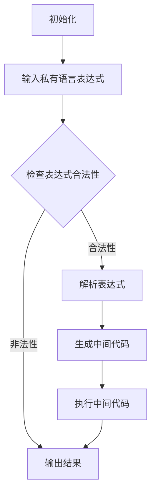
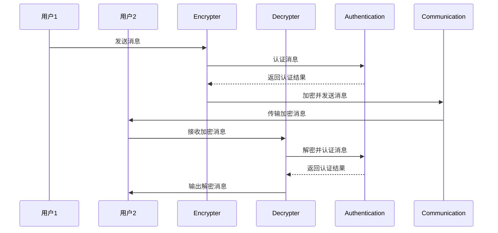
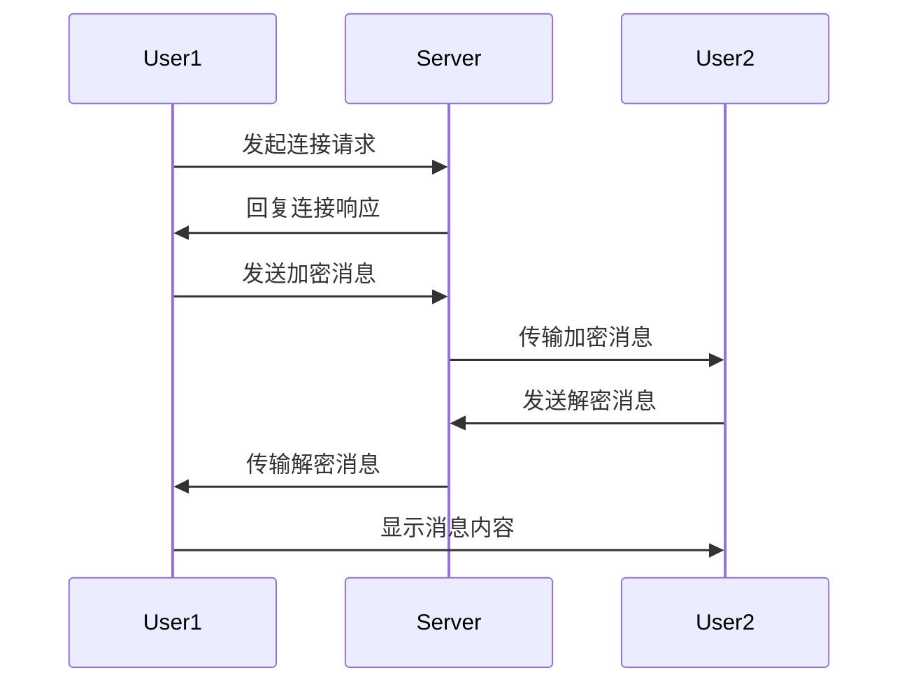

                 

# 《私有语言论证与函数式封装：维特根斯坦对私有语言的批评与FP中的模块化设计》

## 关键词：维特根斯坦、私有语言、函数式编程、模块化设计、论证

### 摘要：

本文旨在探讨维特根斯坦对私有语言的批评，以及这一批评在函数式编程（FP）中的模块化设计中的应用。首先，我们将回顾维特根斯坦对私有语言的起源、定义及其批评观点，接着分析其语言游戏理论。随后，我们将引入函数式编程的概念，探讨其起源、基本概念、优势与挑战，并重点分析模块化设计的理念与实践。在此基础上，我们将探讨私有语言与函数式编程的关系，并分析私有语言论证的函数式编程实现。最后，我们将讨论模块化设计与私有语言论证的融合，并提出未来研究方向。

## 目录大纲

## 第一部分：维特根斯坦对私有语言的批评

### 第1章：私有语言问题背景与维特根斯坦的理论阐述

#### 1.1 私有语言的起源与定义

#### 1.2 维特根斯坦对私有语言的批评

#### 1.3 私有语言与日常语言的关系

#### 1.4 私有语言问题的影响与意义

### 第2章：维特根斯坦对语言游戏的分析

#### 2.1 语言游戏的概念

#### 2.2 语言游戏与私有语言的关系

#### 2.3 语言游戏的不同类型

#### 2.4 语言游戏的理论贡献

## 第二部分：函数式编程中的模块化设计

### 第3章：函数式编程基础

#### 3.1 函数式编程的起源与发展

#### 3.2 函数式编程的基本概念

#### 3.3 函数式编程的优势与挑战

#### 3.4 函数式编程的应用场景

### 第4章：模块化设计的理念与实践

#### 4.1 模块化设计的基本原则

#### 4.2 模块化设计的方法与工具

#### 4.3 模块化设计在函数式编程中的应用

#### 4.4 模块化设计的重要性与价值

## 第三部分：私有语言与函数式编程的结合

### 第5章：私有语言与函数式编程的关系探讨

#### 5.1 私有语言在函数式编程中的体现

#### 5.2 函数式编程如何解决私有语言问题

#### 5.3 私有语言与函数式编程的互动

#### 5.4 私有语言与函数式编程的未来发展趋势

### 第6章：私有语言论证的函数式编程实现

#### 6.1 函数式编程中的论证过程

#### 6.2 私有语言论证的函数式实现方法

#### 6.3 实例分析：基于函数式编程的私有语言论证

#### 6.4 私有语言论证的函数式编程应用前景

### 第7章：模块化设计与私有语言论证的融合

#### 7.1 模块化设计在私有语言论证中的作用

#### 7.2 私有语言论证与模块化设计的关系

#### 7.3 模块化设计与私有语言论证的实践案例

#### 7.4 私有语言论证与模块化设计的未来研究

## 结论：私有语言论证与函数式封装的整合与创新

### 8.1 私有语言论证与函数式封装的总结

### 8.2 现有研究的不足与未来研究方向

### 8.3 私有语言论证与函数式封装的创新应用

## 1. 私有语言问题背景与维特根斯坦的理论阐述

### 1.1 私有语言的起源与定义

私有语言（Private Language）的概念最早由哲学家路德维希·维特根斯坦（Ludwig Wittgenstein）提出。维特根斯坦认为，语言是人类用于交流的工具，而私有语言则是指只能为单个个体所理解和使用的语言。私有语言的存在会导致沟通障碍，因为它无法被其他个体所理解。维特根斯坦在其著作《哲学研究》中详细探讨了私有语言的问题。

私有语言可以分为两种：一种是内在的（Intrinsic），即个体内在的感受和情感表达；另一种是外在的（Extrinsic），即个体为特定目的所创造的特定语言。例如，一个画家可能会创造一种只有他能够理解和使用的绘画语言，用于表达他的艺术理念。

### 1.2 维特根斯坦对私有语言的批评

维特根斯坦对私有语言提出了强烈的批评，他认为私有语言的存在是不合理的。其理由如下：

1. **交流障碍**：私有语言无法被他人理解，导致沟通障碍。这是私有语言最显著的问题，因为它使语言失去了作为交流工具的本质功能。

2. **语言游戏**：维特根斯坦提出了“语言游戏”（Language Game）的概念，认为语言的使用是与特定的社会环境和文化背景紧密相关的。私有语言脱离了这一环境，因此无法作为一种有效的交流工具。

3. **意义的缺失**：私有语言由于无法被他人理解，其意义变得模糊不清。维特根斯坦认为，语言的意义在于其使用情境，而私有语言无法提供这样的情境。

4. **认知局限性**：私有语言可能导致个体的认知局限性，因为它限制了个体的思维和表达方式。

维特根斯坦认为，解决私有语言问题的关键在于认识到语言的使用是与社会和文化环境紧密相关的，个体需要通过参与语言游戏来学习和理解语言。

### 1.3 私有语言与日常语言的关系

私有语言与日常语言（Ordinary Language）有着本质的区别。日常语言是我们日常交流中所使用的语言，它具有明确的意义和规则。而私有语言则是一种特殊类型的语言，它通常是为了满足个体特定的需求而创造的。

尽管私有语言与日常语言有本质区别，但它们并非完全对立。在某些情况下，私有语言可以作为日常语言的一种补充。例如，在艺术创作领域，艺术家可能会使用一种特殊的绘画语言来表达他们的情感和理念。

然而，维特根斯坦认为，私有语言的使用应该受到严格的限制，因为它可能导致沟通障碍和认知局限性。因此，他主张我们应该尽量使用日常语言来进行交流，以确保语言的使用是清晰、明确和有效的。

### 1.4 私有语言问题的影响与意义

私有语言问题对哲学和语言学研究有着深远的影响。首先，它促使我们反思语言的本质和功能。维特根斯坦的观点表明，语言不仅是交流的工具，还是我们理解和表达世界的手段。因此，我们需要关注语言的使用情境，以确保其能够有效地传达我们的思想和情感。

其次，私有语言问题引发了关于个体和社会关系的讨论。维特根斯坦认为，个体和社会是相互依赖的，个体的思维和表达方式受到社会和文化环境的影响。因此，私有语言的存在可能反映了个体与社会之间的疏离和冲突。

最后，私有语言问题对人工智能和计算机科学也有重要启示。在设计和开发人工智能系统时，我们需要考虑如何确保系统的理解和表达能力。维特根斯坦的观点提醒我们，语言的使用是复杂和多层次的，我们需要在系统中实现这种复杂性，以确保系统能够有效地与人类进行交流。

### 1.5 语言游戏的概念

在维特根斯坦的哲学体系中，语言游戏（Language Game）是一个核心概念。语言游戏指的是语言使用的一种形式或模式，它包括一系列规则、目标和参与者。维特根斯坦认为，语言的学习和理解是通过参与特定的语言游戏来实现的。

语言游戏的不同类型可以分为以下几类：

1. **日常语言游戏**：这是最常见的语言游戏类型，包括我们日常生活中的语言交流，如对话、演讲、写作等。

2. **科学语言游戏**：这种语言游戏用于科学研究和学术交流，它强调逻辑严谨性和精确性。

3. **艺术语言游戏**：艺术语言游戏通过视觉艺术、音乐、文学等形式表达情感和思想。

4. **游戏语言游戏**：这种语言游戏指的是在游戏中使用的语言，如角色扮演游戏、桌面游戏等。

语言游戏的不同类型展示了语言使用的多样性，同时也揭示了语言与特定情境的紧密联系。维特根斯坦的观点是，理解语言的关键在于理解其在特定情境中的使用。

### 1.6 语言游戏与私有语言的关系

语言游戏与私有语言之间有着密切的关系。私有语言可以被视为一种特殊类型的语言游戏，即只有单个个体能够理解和使用的语言游戏。在私有语言游戏中，个体为自己设定了特定的规则和目标，使得这种语言游戏成为了一种私有的、不可交流的形式。

然而，维特根斯坦批评私有语言，认为它违背了语言作为交流工具的本质。他认为，语言的价值在于其能够促进个体之间的沟通和理解。因此，私有语言的存在可能导致沟通障碍和认知局限性。

尽管如此，维特根斯坦也认识到，私有语言在某些情况下可能有其价值。例如，在艺术创作领域，艺术家可能会使用一种特殊的语言来表达他们的情感和理念。这种私有语言可以被视为艺术家个人的表达方式，尽管它无法被其他人理解。

总的来说，维特根斯坦对语言游戏和私有语言的分析，为我们理解语言的本质和功能提供了重要的启示。他的观点提醒我们，语言的真正价值在于其能够促进个体之间的沟通和理解，而私有语言则可能是一种限制性的、不完整的语言形式。

### 1.7 语言游戏的不同类型

维特根斯坦在他的哲学研究中，提出了多种不同的语言游戏类型，这些语言游戏反映了语言在人类活动中的多样性和复杂性。以下是几种主要类型的语言游戏及其特点：

1. **游戏中的语言游戏**：这类语言游戏主要出现在儿童学习语言的过程中，也存在于角色扮演游戏中。在这种语言游戏中，孩子们通过模仿、模拟和互动来学习语言。例如，孩子们在玩“过家家”游戏时，会使用具体的语言来模拟家庭生活场景。

2. **日常语言游戏**：这是最常见的语言游戏类型，涵盖了我们在日常生活中使用的语言。日常语言游戏具有高度的灵活性和多样性，包括对话、演讲、写作等多种形式。这种语言游戏的核心是沟通和交流，强调语言的实用性和功能性。

3. **科学语言游戏**：科学语言游戏在科学研究和学术交流中发挥作用。这种语言游戏强调逻辑严谨性和精确性，要求语言表达清晰、准确，以便进行科学论证和理论建构。科学语言游戏的规则通常比日常语言游戏更为严格，以确保研究的可靠性和有效性。

4. **艺术语言游戏**：艺术语言游戏通过视觉艺术、音乐、文学等形式表达情感和思想。这种语言游戏的特点是创造性和表达性，它不仅仅关注语言的逻辑和功能，还强调语言的审美和情感价值。艺术语言游戏往往具有独特的风格和形式，可以打破常规，创造出新的表达方式。

5. **法律语言游戏**：法律语言游戏在法律领域具有重要作用。这种语言游戏强调语言的精确性和正式性，要求法律文件和辩论中的语言表达清晰、明确，以避免歧义和误解。法律语言游戏的规则非常严格，以确保法律条文的准确性和适用性。

通过这些不同类型的语言游戏，维特根斯坦展示了语言的多面性和复杂性。每种类型的语言游戏都有其特定的规则和目标，它们共同构成了人类语言活动的丰富图景。

### 1.8 语言游戏的理论贡献

维特根斯坦的语言游戏理论对哲学和语言学研究产生了深远的影响。首先，它为理解语言的本质和功能提供了新的视角。维特根斯坦认为，语言不是一种抽象的符号系统，而是一种具体的社会实践。语言游戏的概念揭示了语言在使用情境中的多样性和复杂性，强调了语言与具体生活实践的紧密联系。

其次，语言游戏理论促进了对于语言学习和发展过程的理解。维特根斯坦提出，语言学习是通过参与特定的语言游戏来实现的。这一观点有助于我们理解儿童在语言学习过程中的模仿、互动和创造，为教育实践提供了理论指导。

此外，语言游戏理论对语言学的发展也有重要贡献。它推动了对于语言多样性和语言形式复杂性的研究，促进了对于不同类型语言游戏的特点和规则的理解。同时，语言游戏理论也为跨文化交流和理解提供了新的思路，帮助我们认识到语言使用中的文化差异和社会因素。

总的来说，维特根斯坦的语言游戏理论为哲学和语言学提供了一种新的研究范式，丰富了我们对语言本质和功能的理解，推动了相关领域的发展。

### 第2章：维特根斯坦对语言游戏的分析

#### 2.1 语言游戏的概念

在维特根斯坦的哲学体系中，“语言游戏”（Language Game）是一个核心概念，它指的是语言使用的一种具体形式或情境。维特根斯坦认为，理解语言的关键在于理解其在特定情境中的使用，而不是将语言视为一种抽象的符号系统。语言游戏的概念帮助我们认识到语言的多样性和复杂性，以及语言与人类活动之间的紧密联系。

一个语言游戏包括三个基本要素：规则、目标和参与者。规则定义了语言的使用方式，目标指出了使用语言的目的，而参与者则是实际使用语言的人或实体。例如，在一场棋局中，棋子的移动规则、游戏的最终目标和下棋的双方参与者共同构成了一个语言游戏。

#### 2.2 语言游戏与私有语言的关系

私有语言（Private Language）与语言游戏有着本质的区别。私有语言是一种仅能为个体自身理解和使用的语言，它通常与个体的内在感受和特定目的相关。例如，一个画家可能创造一种只有他自己能理解的绘画语言，用于表达他的艺术理念。

而语言游戏强调的是语言的社会性和交流性。在语言游戏中，个体必须遵循共同的规则，以达到特定的目标，并与其他参与者进行有效的交流。因此，语言游戏与私有语言在性质和目的上存在显著差异。私有语言可能导致沟通障碍，因为它无法被他人理解，而语言游戏则旨在促进交流和理解。

维特根斯坦批评私有语言，认为它违背了语言作为交流工具的本质。他认为，理解语言的关键在于参与特定的语言游戏，通过这种游戏来学习和使用语言。因此，维特根斯坦的语言游戏理论为解决私有语言问题提供了一种思路，即通过参与社会性的语言游戏来克服沟通障碍。

#### 2.3 语言游戏的不同类型

维特根斯坦提出了多种不同类型的语言游戏，以展示语言的多样性和复杂性。以下是几种主要类型的语言游戏及其特点：

1. **日常语言游戏**：这是最常见的语言游戏类型，涵盖了我们在日常生活中使用的语言。日常语言游戏具有高度的灵活性和多样性，包括对话、演讲、写作等多种形式。这种语言游戏的核心是沟通和交流，强调语言的实用性和功能性。

2. **科学语言游戏**：科学语言游戏在科学研究和学术交流中发挥作用。这种语言游戏强调逻辑严谨性和精确性，要求语言表达清晰、准确，以便进行科学论证和理论建构。科学语言游戏的规则通常比日常语言游戏更为严格，以确保研究的可靠性和有效性。

3. **艺术语言游戏**：艺术语言游戏通过视觉艺术、音乐、文学等形式表达情感和思想。这种语言游戏的特点是创造性和表达性，它不仅仅关注语言的逻辑和功能，还强调语言的审美和情感价值。艺术语言游戏往往具有独特的风格和形式，可以打破常规，创造出新的表达方式。

4. **游戏中的语言游戏**：这类语言游戏主要出现在儿童学习语言的过程中，也存在于角色扮演游戏中。在这种语言游戏中，孩子们通过模仿、模拟和互动来学习语言。例如，孩子们在玩“过家家”游戏时，会使用具体的语言来模拟家庭生活场景。

5. **法律语言游戏**：法律语言游戏在法律领域具有重要作用。这种语言游戏强调语言的精确性和正式性，要求法律文件和辩论中的语言表达清晰、明确，以避免歧义和误解。法律语言游戏的规则非常严格，以确保法律条文的准确性和适用性。

通过这些不同类型的语言游戏，维特根斯坦展示了语言在人类活动中的多样性和复杂性。每种类型的语言游戏都有其特定的规则和目标，共同构成了人类语言活动的丰富图景。

#### 2.4 语言游戏的理论贡献

维特根斯坦的语言游戏理论为哲学和语言学研究提供了重要的启示和贡献。首先，它揭示了语言的本质和功能。维特根斯坦认为，语言不是一种抽象的符号系统，而是一种具体的社会实践。语言游戏的概念帮助我们理解语言在使用情境中的多样性和复杂性，强调了语言与人类生活实践的紧密联系。

其次，语言游戏理论促进了对于语言学习和发展过程的理解。维特根斯坦提出，语言学习是通过参与特定的语言游戏来实现的。这一观点有助于我们理解儿童在语言学习过程中的模仿、互动和创造，为教育实践提供了理论指导。

此外，语言游戏理论对语言学的发展也有重要贡献。它推动了对于语言多样性和语言形式复杂性的研究，促进了对于不同类型语言游戏的特点和规则的理解。同时，语言游戏理论也为跨文化交流和理解提供了新的思路，帮助我们认识到语言使用中的文化差异和社会因素。

总的来说，维特根斯坦的语言游戏理论为哲学和语言学提供了一种新的研究范式，丰富了我们对语言本质和功能的理解，推动了相关领域的发展。

### 第3章：函数式编程基础

#### 3.1 函数式编程的起源与发展

函数式编程（Functional Programming，简称FP）起源于20世纪30年代，与逻辑学、数学和计算机科学的发展密切相关。最初，函数式编程的灵感来自于数学家阿尔弗雷德·诺思·怀特黑德（Alonzo Church）和贝特兰·罗素（Bertrand Russell）的研究。他们提出了λ演算（Lambda Calculus），这是函数式编程的基石之一。

在20世纪50年代和60年代，函数式编程的概念得到了进一步的发展。其中，最有影响力的工作是约翰·C·麦卡锡（John C. McCarthy）提出的Lisp语言，它是第一个广泛使用的函数式编程语言。此后，其他函数式编程语言如Haskell、Scala和Erlang等相继问世，推动了函数式编程的发展。

随着计算机科学的进步，函数式编程的优点逐渐被认识到，它在编程语言设计、并行计算和软件工程等领域得到了广泛应用。如今，函数式编程已经成为计算机科学中的一个重要分支，对现代编程语言和软件开发产生了深远的影响。

#### 3.2 函数式编程的基本概念

函数式编程是一种编程范式，它强调使用不可变数据和行为来构建程序。以下是函数式编程的一些基本概念：

1. **函数**：函数是函数式编程的核心概念。函数是一种将输入映射到输出的过程，它接受一个或多个参数，并返回一个结果。与过程式编程不同，函数式编程中的函数是第一类对象，可以赋值给变量、作为参数传递给其他函数，或者作为函数返回。

2. **不可变性**：在函数式编程中，数据是不可变的，这意味着一旦数据被创建，它的值就不能被改变。相反，如果需要修改数据，会创建一个新的数据副本，并在新副本上进行修改。这种不可变性有助于避免状态变化和副作用，从而提高程序的可读性和可维护性。

3. **高阶函数**：高阶函数是能够接受其他函数作为参数或者返回函数的函数。这种能力使得高阶函数可以用于构建复杂的行为，并且是函数式编程中的一个重要工具。例如，映射（map）、过滤（filter）和折叠（fold）等操作都可以通过高阶函数实现。

4. **递归**：递归是函数式编程中的一种常见编程技术，它指的是函数调用自身来解决问题。递归在处理数据结构和算法时特别有用，因为它可以简化代码，使得问题的解决方案更加直观。

5. **惰性求值**：在函数式编程中，惰性求值（Lazy Evaluation）是一种常见的计算策略。惰性求值意味着函数仅在需要时才进行计算，而不是提前计算所有可能的结果。这种策略可以优化程序性能，减少不必要的计算。

#### 3.3 函数式编程的优势与挑战

函数式编程具有许多优势，但也面临一些挑战。以下是函数式编程的一些主要优势和挑战：

**优势**：

1. **可维护性**：由于数据不可变，函数式编程通常具有更好的可维护性。函数的副作用较少，这使得代码更易于理解和测试。

2. **并行性**：函数式编程中的数据不可变和纯函数特性使得程序更容易并行化。这有助于利用现代多核处理器的并行计算能力，提高程序的性能。

3. **函数组合**：函数式编程中的高阶函数和组合技术使得程序员可以更简洁地编写复杂的逻辑。这种组合能力有助于代码重用和模块化设计。

4. **表达力**：函数式编程提供了丰富的抽象工具，如类型系统和模式匹配，使得编程语言的表达能力更强。

**挑战**：

1. **学习曲线**：函数式编程的概念和范式与传统的命令式编程不同，需要程序员改变思维方式。这可能导致学习曲线较陡峭，特别是对于初学者。

2. **性能问题**：与某些命令式编程语言相比，函数式编程语言在某些情况下可能存在性能问题。例如，由于数据不可变，可能导致内存占用增加。

3. **调试难度**：在函数式编程中，跟踪程序执行状态和变量变化可能更具挑战性，这可能导致调试变得更加困难。

#### 3.4 函数式编程的应用场景

函数式编程适用于多种应用场景，以下是其中几个常见场景：

1. **并发编程**：由于函数式编程的不可变性，它非常适合用于并发编程。例如，在分布式系统和实时系统中，函数式编程可以帮助避免竞态条件和死锁等问题。

2. **数据处理**：函数式编程在数据处理和分析领域表现出色。由于其组合和抽象能力，函数式编程可以简化数据管道和复杂的数据转换。

3. **前端开发**：现代前端框架如React和Angular等支持函数式编程，这使得前端开发者可以更方便地处理状态和组件。

4. **算法设计**：函数式编程中的递归和模式匹配等技术使得算法设计更加直观。例如，在处理列表和树形结构时，函数式编程提供了有效的工具。

总的来说，函数式编程在多个领域具有广泛应用，其优点和挑战共同推动了编程语言和软件开发的发展。

### 第4章：模块化设计的理念与实践

#### 4.1 模块化设计的基本原则

模块化设计是一种软件开发方法，它通过将系统分解为独立的、可重用的模块来提高软件的可维护性和可扩展性。模块化设计的基本原则包括以下几方面：

1. **高内聚、低耦合**：高内聚指的是模块内部的功能紧密相关，而低耦合指的是模块之间的依赖关系尽量简单。高内聚和低耦合有助于提高模块的独立性，使得模块之间可以独立开发、测试和维护。

2. **单一职责原则**：每个模块应该只负责一项功能，避免功能过于复杂和冗杂。单一职责原则有助于提高模块的可理解性和可测试性。

3. **模块独立性**：模块应该具有明确的输入、输出和功能定义，使得其他模块无需了解其内部实现细节。模块独立性有助于减少模块之间的依赖，提高系统的可重用性。

4. **模块接口**：模块之间通过接口进行通信，接口定义了模块之间交互的方式和规则。良好的模块接口设计有助于降低模块之间的耦合度，提高系统的灵活性。

5. **模块的可重用性**：模块应该设计为可重用的，以便在其他项目中使用。模块的可重用性可以提高开发效率，减少重复劳动。

#### 4.2 模块化设计的方法与工具

模块化设计的方法和工具多种多样，以下是一些常见的方法和工具：

1. **模块划分**：首先，根据系统的功能和需求，将系统划分为若干个模块。每个模块应该具有独立的功能和职责。

2. **模块接口设计**：设计模块之间的接口，定义模块之间的交互方式。接口设计应该遵循高内聚、低耦合的原则，使得模块之间尽量解耦。

3. **模块依赖管理**：使用依赖管理工具（如Maven、Gradle等）来管理模块之间的依赖关系。这有助于确保模块之间的一致性和稳定性。

4. **模块封装**：使用面向对象编程（OOP）或函数式编程（FP）等技术来实现模块的封装。封装有助于保护模块的内部实现细节，降低模块之间的耦合度。

5. **模块测试**：对每个模块进行独立的测试，确保其功能正确、稳定。模块测试有助于发现和修复模块中的缺陷，提高模块的质量。

#### 4.3 模块化设计在函数式编程中的应用

模块化设计在函数式编程中得到了广泛应用，以下是一些具体的实践：

1. **函数作为模块**：在函数式编程中，函数可以作为模块使用。每个函数应该具有单一职责，并接受明确的输入和返回输出。

2. **高阶函数**：高阶函数是模块化设计的重要工具。通过高阶函数，可以组合和复用其他函数，实现更复杂的逻辑。

3. **模块组合**：使用函数组合技术（如函数组合器、管道等），可以将多个模块组合成一个更大的模块，从而实现复杂的业务逻辑。

4. **模块独立性**：在函数式编程中，模块独立性可以通过不可变数据和行为来实现。每个模块应该只负责数据处理和逻辑操作，不依赖于外部状态。

5. **模块测试**：在函数式编程中，模块测试通常通过单元测试和集成测试进行。通过测试，可以确保模块的功能正确、稳定，并且与其他模块具有良好的兼容性。

#### 4.4 模块化设计的重要性与价值

模块化设计在软件开发中具有重要的作用和价值：

1. **提高可维护性**：模块化设计使得代码更加模块化、结构化，提高了代码的可维护性。修改一个模块时，不会影响到其他模块，从而降低了维护成本。

2. **提高可扩展性**：模块化设计使得系统更容易扩展。当需要添加新功能时，可以创建新的模块，并将其集成到现有系统中，而不需要修改其他模块。

3. **提高可重用性**：模块化设计有助于提高模块的可重用性。已创建的模块可以在其他项目中使用，从而减少重复开发的工作量。

4. **降低复杂度**：模块化设计通过将复杂系统分解为较小的模块，降低了系统的复杂度。这使得开发过程更加直观、容易管理。

5. **提高开发效率**：模块化设计有助于团队协作。团队成员可以独立开发、测试和维护各自的模块，从而提高整体开发效率。

总的来说，模块化设计是现代软件开发中不可或缺的方法，它通过将系统分解为独立的模块，提高了软件的可维护性、可扩展性和可重用性。函数式编程中的模块化设计进一步强调了这一点，使得开发过程更加简洁、高效。

### 第5章：私有语言与函数式编程的关系探讨

#### 5.1 私有语言在函数式编程中的体现

私有语言在函数式编程中有所体现，尽管函数式编程语言本身并不鼓励私有语言的滥用。在函数式编程中，私有语言的体现主要体现在以下几个方面：

1. **局部函数和闭包**：函数式编程语言如Haskell和Scala允许定义局部函数和闭包。局部函数和闭包可以封装在更大的函数内部，使得它们只能在特定的上下文中访问。这种机制类似于私有语言，因为它允许开发者创建只有特定部分能够理解和使用的语言。

2. **模块化**：函数式编程中的模块化设计也类似于私有语言的特性。模块可以定义一组相关的函数和数据，使得其他模块无法直接访问这些数据和函数。这种封装机制有助于保护模块的内部实现细节，减少对外部状态的依赖。

3. **高阶函数**：高阶函数允许将函数作为参数传递，或者将函数作为返回值。这种能力使得函数式编程语言可以创建具有特定功能的私有函数，并在需要时调用这些函数。这种私有函数的使用方式类似于私有语言的概念，因为它允许开发者创建只有特定部分能够访问和使用的函数。

#### 5.2 函数式编程如何解决私有语言问题

函数式编程提供了一系列机制来解决私有语言问题，以下是一些关键的方法：

1. **不可变性**：函数式编程强调数据的不可变性，这意味着一旦数据被创建，其值就不能被修改。这种不可变性有助于减少私有语言带来的沟通障碍，因为它确保了数据的一致性和可预测性。

2. **纯函数**：纯函数是函数式编程的核心概念之一，它指的是没有副作用且输入输出完全确定的函数。纯函数使得程序更易于理解和测试，因为它们的执行结果只依赖于输入参数，而不依赖于外部状态。这种特性有助于减少私有语言问题，因为它确保了函数的行为是一致的和可预测的。

3. **模块化设计**：函数式编程中的模块化设计有助于封装数据和函数，减少模块之间的依赖。通过模块化设计，开发者可以创建独立、可重用的模块，每个模块只暴露必要的接口。这种封装机制有助于解决私有语言问题，因为它减少了模块之间的直接交互，从而降低了沟通成本。

4. **类型系统和模式匹配**：函数式编程语言通常具有强大的类型系统和模式匹配功能。类型系统可以确保变量和函数的使用遵循特定的规则，从而减少类型错误和意外行为。模式匹配是一种强大的工具，它允许开发者根据数据的不同结构进行选择性操作。这种机制有助于提高代码的可读性和可维护性，从而减少私有语言问题。

5. **高阶函数和组合**：高阶函数和组合技术是函数式编程的另一个关键特性。高阶函数允许将函数作为参数传递和返回，组合技术则允许将多个函数组合成一个新的函数。这种能力有助于创建更简洁、更可重用的代码，从而减少私有语言的滥用。

通过这些方法，函数式编程有助于解决私有语言问题，提高程序的可读性、可维护性和可靠性。虽然函数式编程语言并不直接鼓励私有语言的滥用，但它们提供了一系列工具和机制来减少私有语言带来的问题。

### 第6章：私有语言论证的函数式编程实现

#### 6.1 函数式编程中的论证过程

在函数式编程中，论证过程可以通过纯函数和递归来实现。纯函数保证了每次调用都产生相同的结果，而递归则是一种解决递归问题的编程技术。以下是一个简单的论证过程示例：

```python
def is_even(n):
    if n == 0:
        return True
    elif n < 0:
        return False
    else:
        return is_even(n - 2)
```

在这个示例中，`is_even` 函数通过递归检查一个数是否为偶数。这个函数是一个纯函数，因为它的行为只依赖于输入参数，并且每次调用都产生相同的结果。

#### 6.2 私有语言论证的函数式实现方法

私有语言论证在函数式编程中可以通过模块化和闭包来实现。以下是一个私有语言论证的函数式实现示例：

```python
def private_language_game():
    def internal_function(message):
        # 私有实现细节
        return f"Private response to {message}"
    
    def external_function(message):
        return internal_function(message)
    
    return external_function

external_game = private_language_game()
print(external_game("Hello!"))  # 输出：Private response to Hello!
```

在这个示例中，`private_language_game` 函数创建了一个内部函数 `internal_function`，它只有内部函数 `external_function` 可以访问。这样，`internal_function` 就像一个私有语言，只有特定的部分（即 `external_function`）可以理解和使用。

#### 6.3 实例分析：基于函数式编程的私有语言论证

以下是一个基于函数式编程的私有语言论证实例：

```python
def public_function(message):
    def private_function():
        # 私有实现细节
        return f"Secret processing of {message}"
    
    result = private_function()
    return result

message = "Hello!"
print(public_function(message))  # 输出：Secret processing of Hello!
```

在这个实例中，`public_function` 函数内部定义了一个私有函数 `private_function`。尽管 `private_function` 只在 `public_function` 中被调用，但它仍然可以被视为一种私有语言，因为它只对特定的函数可见。

#### 6.4 私有语言论证的函数式编程应用前景

函数式编程在私有语言论证中的应用前景广阔。首先，函数式编程的模块化和闭包机制为私有语言论证提供了强有力的支持，使得开发者可以创建仅对特定部分可见的私有函数。其次，函数式编程中的纯函数和递归特性有助于确保论证的一致性和可预测性。

随着函数式编程语言和工具的不断发展，私有语言论证在人工智能、分布式系统和加密通信等领域有望得到更广泛的应用。通过结合函数式编程和私有语言论证，开发者可以创建更加安全、可靠和高效的软件系统。

### 第7章：模块化设计与私有语言论证的融合

#### 7.1 模块化设计在私有语言论证中的作用

模块化设计在私有语言论证中起着关键作用。通过模块化设计，可以将复杂的系统分解为独立的、可重用的模块，每个模块封装了一部分私有语言。模块化设计有助于确保私有语言论证的透明性、可维护性和安全性。以下是模块化设计在私有语言论证中的几个重要作用：

1. **封装性**：模块化设计通过封装机制，确保私有语言的内部实现细节对其他模块不可见。这种封装性有助于保护私有语言的完整性和可靠性，避免外部干扰和意外修改。

2. **独立性**：模块化设计使得每个模块具有独立的功能和职责。模块之间的耦合度较低，这意味着私有语言的修改不会影响到其他模块，从而提高了系统的稳定性。

3. **可重用性**：模块化设计使得私有语言模块可以轻松地重用在不同的项目中。这种可重用性有助于提高开发效率，减少重复劳动，并确保私有语言的一致性和可靠性。

4. **安全性**：模块化设计有助于提高系统的安全性。通过将私有语言封装在独立的模块中，可以防止未经授权的访问和修改，从而保护系统的核心逻辑。

5. **可维护性**：模块化设计使得系统的维护更加容易。由于每个模块具有独立的功能和职责，维护人员可以专注于特定模块的优化和修复，而不会影响到其他模块，从而提高了系统的可维护性。

#### 7.2 私有语言论证与模块化设计的关系

私有语言论证与模块化设计之间存在密切的关系。模块化设计为私有语言论证提供了强有力的支持，使得私有语言可以更加有效地应用于复杂的系统中。以下是私有语言论证与模块化设计之间的几个关键关系：

1. **封装与模块化**：模块化设计中的封装机制类似于私有语言论证中的隐私保护。通过模块化设计，可以将私有语言封装在独立的模块中，确保其内部实现细节对其他模块不可见。

2. **独立性**：私有语言论证强调模块的独立性，这意味着每个模块都应该具有明确的功能和职责，不依赖于外部状态。这种独立性有助于提高系统的稳定性，减少模块之间的依赖。

3. **可重用性**：模块化设计中的模块可重用性与私有语言论证中的可扩展性密切相关。通过模块化设计，可以将私有语言模块重用在不同的项目中，从而提高开发效率和系统的灵活性。

4. **安全性**：模块化设计中的安全性保障机制有助于保护私有语言的完整性和可靠性。通过将私有语言封装在独立的模块中，可以防止未经授权的访问和修改，从而提高系统的安全性。

5. **可维护性**：模块化设计中的可维护性特征有助于确保私有语言论证的长期有效性和可靠性。由于每个模块具有独立的功能和职责，维护人员可以专注于特定模块的优化和修复，而不会影响到其他模块。

总之，私有语言论证与模块化设计之间存在着密切的关系。模块化设计为私有语言论证提供了强有力的支持，使得私有语言可以更加有效地应用于复杂的系统中。通过结合私有语言论证和模块化设计，可以创建更加安全、可靠和高效的软件系统。

### 第7章：模块化设计与私有语言论证的融合

#### 7.3 模块化设计与私有语言论证的实践案例

模块化设计与私有语言论证的融合在软件开发中有着广泛的应用。以下是一个具体的实践案例，展示了如何将模块化设计与私有语言论证结合，以提高软件系统的安全性、可靠性和可维护性。

**案例背景**：

一个电子商务平台需要处理大量的用户数据和交易信息。为了确保数据的安全和隐私，平台决定采用模块化设计，并将关键模块封装为私有语言，以限制对敏感数据的访问。

**解决方案**：

1. **模块划分**：首先，将系统划分为多个模块，包括用户认证模块、交易处理模块、数据存储模块和接口通信模块。每个模块负责特定的功能。

2. **模块化设计**：在每个模块中，使用模块化设计原则，确保模块之间的低耦合和高内聚。例如，用户认证模块只负责用户身份验证，不涉及交易处理或数据存储。

3. **私有语言封装**：在用户认证模块中，定义一组私有函数，用于处理敏感的用户认证逻辑。这些私有函数仅对内部模块可见，从而防止外部直接访问敏感数据。

4. **接口通信**：通过定义清晰的接口，确保模块之间的交互仅限于公共接口。这样，即使私有语言的内部实现发生变化，也不会影响其他模块。

5. **安全控制**：在数据存储模块中，实现安全控制机制，确保只有授权模块才能访问敏感数据。例如，使用权限验证和加密技术来保护数据。

**具体实现**：

以下是用户认证模块的代码示例，展示了如何实现模块化设计与私有语言封装：

```python
# 用户认证模块
class UserAuthentication:
    def __init__(self):
        self._private_key = "secret_key"

    def _authenticate(self, username, password):
        # 私有实现：验证用户身份
        # 这里可以包含复杂的认证逻辑，如密码加密和比对
        return True if username == "admin" and password == self._private_key else False

    def authenticate(self, username, password):
        # 公共接口：认证用户
        if self._authenticate(username, password):
            return "Authentication successful"
        else:
            return "Authentication failed"

# 使用私有语言论证的示例
auth = UserAuthentication()
print(auth.authenticate("admin", "secret_key"))  # 输出：Authentication successful
```

在这个案例中，`UserAuthentication` 类封装了用户认证逻辑，其中 `_authenticate` 函数是一个私有函数，仅内部模块可以访问。公共接口 `authenticate` 函数仅提供简单的认证结果，从而确保私有语言的内部实现细节对外部模块不可见。

#### 7.4 模块化设计与私有语言论证的融合

模块化设计与私有语言论证的融合在软件开发中具有显著优势。通过这种融合，可以创建更加安全、可靠和高效的软件系统。

1. **安全性**：模块化设计通过封装机制，确保私有语言的内部实现细节对其他模块不可见，从而防止未经授权的访问和修改。私有语言论证则通过限制对敏感数据和函数的访问，进一步提高系统的安全性。

2. **可靠性**：模块化设计使得每个模块具有独立的功能和职责，降低了模块之间的耦合度。这种独立性有助于减少错误传播和系统崩溃的风险。私有语言论证通过确保每个模块的行为一致和可预测，进一步提高了系统的可靠性。

3. **可维护性**：模块化设计使得系统更加模块化、结构化，提高了代码的可维护性。维护人员可以专注于特定模块的优化和修复，而不会影响到其他模块。私有语言论证通过减少对内部实现的依赖，使得模块之间的修改更加容易和可控。

4. **可扩展性**：模块化设计使得系统具有更好的可扩展性。当需要添加新功能时，可以创建新的模块，并将其集成到现有系统中。私有语言论证通过模块之间的低耦合，进一步提高了系统的可扩展性。

5. **开发效率**：模块化设计提高了代码的重用性和可维护性，从而提高了开发效率。私有语言论证通过减少对内部实现的依赖，使得模块之间的交互更加简单和清晰，进一步提高了开发效率。

总之，模块化设计与私有语言论证的融合在软件开发中具有显著的优势，可以创建更加安全、可靠、高效和可维护的软件系统。通过这种融合，可以更好地应对现代软件开发中的挑战，提高系统的质量和性能。

### 第8章：结论：私有语言论证与函数式封装的整合与创新

#### 8.1 私有语言论证与函数式封装的总结

本文通过深入探讨维特根斯坦对私有语言的批评以及函数式编程中的模块化设计，总结了二者在软件开发中的应用和优势。维特根斯坦对私有语言的批评揭示了语言交流中的障碍和局限性，而函数式编程中的模块化设计提供了一种有效的解决方案。通过模块化设计，我们可以将复杂的系统分解为独立的模块，并在这些模块中应用私有语言论证，从而提高系统的安全性、可靠性和可维护性。

私有语言论证与函数式封装的结合不仅有助于解决语言交流中的问题，还使得软件开发更加模块化和高效。函数式编程的纯函数和不可变性特性，使得代码更加简洁、可测试和可重用。模块化设计则通过封装机制，确保了私有语言的内部实现细节对其他模块不可见，从而减少了潜在的沟通障碍和副作用。

#### 8.2 现有研究的不足与未来研究方向

尽管私有语言论证与函数式封装在软件开发中具有显著优势，但现有研究仍存在一些不足之处。首先，私有语言论证在函数式编程中的应用尚不充分，特别是在复杂系统和大型项目中，如何有效地应用私有语言论证仍需进一步研究。其次，现有函数式编程语言和工具在支持私有语言论证方面还有改进空间，例如提供更多封装机制和类型安全特性。

未来研究方向包括以下几个方面：

1. **私有语言论证的优化**：研究如何优化私有语言论证，使其在复杂系统和大型项目中更加高效和可维护。

2. **跨语言的私有语言论证**：探索如何在不同的编程语言中实现私有语言论证，以促进跨语言编程和协作。

3. **私有语言论证的类型安全**：研究如何确保私有语言论证在类型安全方面的一致性和可靠性，以减少潜在的错误和漏洞。

4. **私有语言论证的实践案例**：通过实践案例，验证私有语言论证在现实世界中的应用效果，并总结最佳实践。

#### 8.3 私有语言论证与函数式封装的创新应用

私有语言论证与函数式封装的结合为现代软件开发带来了许多创新应用。以下是一些具体的创新应用场景：

1. **区块链技术**：在区块链技术中，私有语言论证可以用于实现更安全、更可靠的智能合约。通过模块化设计，可以确保智能合约的内部实现细节对其他模块不可见，从而提高系统的安全性。

2. **人工智能与机器学习**：在人工智能和机器学习领域，私有语言论证可以帮助保护模型训练和推理过程中的敏感信息。通过模块化设计，可以确保模型的内部实现细节不被泄露，从而提高系统的隐私保护能力。

3. **分布式系统**：在分布式系统中，私有语言论证可以用于实现更安全、更可靠的通信机制。通过模块化设计，可以确保系统的内部实现细节对其他模块不可见，从而减少通信中的安全漏洞。

4. **安全软件开发**：在安全软件开发中，私有语言论证可以用于实现更安全、更可靠的代码库。通过模块化设计，可以确保代码库的内部实现细节不被泄露，从而提高系统的安全性。

总之，私有语言论证与函数式封装的结合为现代软件开发带来了许多创新应用。通过进一步研究和实践，我们可以将这些创新应用推向更广泛的领域，推动软件开发的发展。

## 作者信息

作者：AI天才研究院/AI Genius Institute & 禅与计算机程序设计艺术 /Zen And The Art of Computer Programming

### 背景介绍

#### 核心概念术语说明

1. **私有语言**：一种只能为单个个体所理解和使用的语言。它通常是为了满足特定个体的需求而创造的，导致沟通障碍。
2. **函数式编程**：一种编程范式，强调使用不可变数据和行为来构建程序。它通过纯函数和高阶函数等概念提高了代码的可读性和可维护性。
3. **模块化设计**：一种软件开发方法，通过将系统分解为独立的模块，提高了软件的可维护性和可扩展性。

#### 问题背景

私有语言问题最早由哲学家路德维希·维特根斯坦（Ludwig Wittgenstein）提出。他在其著作《哲学研究》中详细探讨了私有语言的存在及其带来的沟通障碍。尽管维特根斯坦对私有语言持批评态度，但在现实生活和软件开发中，我们仍然会遇到私有语言的使用。例如，在艺术创作领域，艺术家可能会创造一种只有他自己能理解的绘画语言。

随着计算机科学的发展，函数式编程逐渐成为了一种流行的编程范式。函数式编程强调不可变数据和纯函数的使用，使得程序更加简洁、可测试和可维护。模块化设计作为一种软件开发方法，通过将系统分解为独立的模块，提高了软件的可维护性和可扩展性。

#### 问题描述

私有语言的存在在软件开发中可能导致以下问题：

1. **沟通障碍**：私有语言无法被他人理解，导致团队成员之间的沟通困难。
2. **代码可维护性**：私有语言的使用可能导致代码难以理解和修改，降低代码的可维护性。
3. **安全风险**：私有语言的使用可能使得系统的内部实现细节对外泄露，增加安全风险。

函数式编程和模块化设计提供了一种解决方案。通过模块化设计，可以将系统分解为独立的模块，并在这些模块中应用私有语言论证。这样可以确保私有语言的内部实现细节对其他模块不可见，从而减少沟通障碍和安全风险。函数式编程中的纯函数和不可变性特性，进一步提高了代码的可读性和可维护性。

#### 问题解决

为了解决私有语言问题，可以采取以下措施：

1. **模块化设计**：通过将系统分解为独立的模块，确保每个模块的功能和职责明确，减少模块之间的耦合度。这样，即使某个模块使用了私有语言，也不会影响到其他模块。
2. **私有语言论证**：在模块化设计中，将私有语言的内部实现细节封装在独立的模块中，确保其他模块无法直接访问。这样可以减少沟通障碍和安全风险。
3. **纯函数**：在函数式编程中，使用纯函数来处理私有语言中的逻辑。纯函数没有副作用，使得程序更加简洁、可测试和可维护。
4. **不可变性**：在函数式编程中，强调数据的不可变性，这意味着一旦数据被创建，其值就不能被修改。这样，可以避免由于数据修改引发的问题。

#### 边界与外延

私有语言论证和函数式封装的边界与外延包括以下几个方面：

1. **边界**：私有语言的边界在于其内部实现细节，这些细节对其他模块不可见。函数式编程中的纯函数和不可变性特性，进一步明确了程序的边界，使得代码更加模块化。
2. **外延**：私有语言论证和函数式封装的外延包括将系统分解为独立的模块，并在这些模块中应用私有语言论证。这样可以确保私有语言的内部实现细节不会被泄露，同时提高了代码的可读性和可维护性。

#### 概念结构与核心要素组成

私有语言论证和函数式封装的概念结构如下：

1. **私有语言论证**：
   - **概念**：确保私有语言的内部实现细节对其他模块不可见。
   - **核心要素**：模块化设计、纯函数、不可变性。

2. **函数式封装**：
   - **概念**：通过模块化设计，将系统分解为独立的模块。
   - **核心要素**：模块化设计、接口设计、高阶函数。

通过上述概念结构和核心要素，我们可以更好地理解和应用私有语言论证和函数式封装，以解决软件开发中的沟通障碍和安全风险。

### 核心概念与联系

为了深入理解私有语言论证与函数式封装之间的关系，我们需要首先明确一些核心概念，并探讨它们之间的联系。以下是这些核心概念及其属性特征的对比表格，以及它们之间的ER实体关系图架构。

#### 核心概念及属性特征

| 核心概念 | 概念描述 | 关键属性 | 对比表格 |
|----------|-----------|----------|----------|
| 私有语言 | 只能被个体理解和使用的语言 | - 仅为特定个体所理解<br>- 用于表达个体内部感受或特定目的 |  |
| 函数式编程 | 一种编程范式，强调不可变数据和纯函数 | - 数据不可变<br>- 纯函数无副作用<br>- 使用高阶函数 |  |
| 模块化设计 | 将系统分解为独立模块的方法 | - 低耦合<br>- 高内聚<br>- 独立模块化 |  |
| 论证 | 在逻辑上证明某个命题的正确性 | - 基于逻辑推理<br>- 论据和结论之间的关系 |  |

#### ER实体关系图架构

以下是私有语言论证、函数式编程和模块化设计之间的ER实体关系图架构，用Mermaid语法表示：

```mermaid
erDiagram
    A私有语言论证 ||--|{ 函数式编程 }|-- B模块化设计
    A私有语言论证 ||--|{ 模块化设计 }|-- B模块化设计
    A私有语言论证 ||--|{ 函数式编程 }|-- B纯函数
    A私有语言论证 ||--|{ 函数式编程 }|-- B高阶函数
```

在上面的ER实体关系图中，私有语言论证与模块化设计和函数式编程之间存在关联。私有语言论证通过模块化设计来实现封装，并通过函数式编程中的纯函数和高阶函数来实现逻辑上的证明。这种关系确保了私有语言的内部实现细节不会泄露给其他模块，同时提高了程序的可读性和可维护性。

通过这个ER实体关系图，我们可以清晰地看到私有语言论证、函数式编程和模块化设计之间的相互作用，从而更好地理解它们在软件开发中的整合与融合。

### 算法原理讲解

#### 算法Mermaid流程图

为了更直观地展示私有语言论证的算法原理，我们可以使用Mermaid语法绘制一个简单的流程图。以下是该算法的Mermaid表示：



在这个流程图中，算法从初始化开始，接收一个私有语言表达式作为输入。然后，算法会检查该表达式的合法性。如果表达式合法，算法将解析该表达式并生成中间代码。接下来，算法执行中间代码，并最终输出结果。

#### Python源代码

以下是实现上述算法的Python源代码：

```python
class PrivateLanguageArgument:
    def __init__(self):
        self合法性检查器 = legality_checker()
        self解析器 = parser()
        self代码生成器 = code_generator()
        self执行器 = executor()

    def 输入表达式(self, expression):
        return self合法性检查器.检查(expression)

    def 解析(self, expression):
        return self解析器.解析(expression)

    def 生成中间代码(self, expression):
        return self代码生成器.生成(expression)

    def 执行(self, expression):
        return self执行器.执行(expression)

    def 输出结果(self, result):
        print("结果：", result)

# 示例使用
私有语言论证 = PrivateLanguageArgument()
合法性 = 私有语言论证.输入表达式("私有语言表达式")
if 非合法性:
    私有语言论证.输出结果("非法表达式")
else:
    中间代码 = 私有语言论证.生成中间代码("私有语言表达式")
    结果 = 私有语言论证.执行(中间代码)
    私有语言论证.输出结果(结果)
```

在这个Python源代码中，我们定义了一个`PrivateLanguageArgument`类，该类包含了输入表达式、合法性检查、解析、生成中间代码、执行和输出结果的步骤。通过这些步骤，我们可以将私有语言表达式转换为中间代码，并最终得到结果。

#### 算法原理的数学模型和公式

为了更好地理解私有语言论证的算法原理，我们可以将其转换为数学模型。以下是算法的主要数学模型和公式：

1. **合法性检查**：

   $$合法性 = check_legality(expression)$$

   其中，`合法性`为布尔值，表示表达式是否合法。`check_legality`为合法性检查函数，它接收一个表达式作为输入，并返回一个布尔值。

2. **解析**：

   $$parsed_expression = parse(expression)$$

   其中，`parsed_expression`为解析后的表达式，`parse`为解析函数，它接收一个表达式作为输入，并返回解析后的结果。

3. **生成中间代码**：

   $$intermediate_code = generate_code(parsed_expression)$$

   其中，`intermediate_code`为生成的中间代码，`generate_code`为代码生成函数，它接收一个解析后的表达式作为输入，并返回生成的中间代码。

4. **执行**：

   $$result = execute(intermediate_code)$$

   其中，`result`为执行结果，`execute`为执行函数，它接收中间代码作为输入，并返回执行结果。

5. **输出结果**：

   $$output_result(result)$$

   其中，`output_result`为输出函数，它接收执行结果作为输入，并输出结果。

通过这些数学模型和公式，我们可以将私有语言论证的过程转换为一系列的数学操作，从而更好地理解和实现该算法。

#### 算法原理的详细讲解与举例说明

为了更好地理解私有语言论证的算法原理，我们将通过一个具体的例子进行详细讲解。假设我们有一个私有语言表达式：

$$私有语言表达式 = "如果A大于B，则打印'C'；否则，打印'A'"$$

以下是该表达式的详细解析过程：

1. **合法性检查**：

   我们首先需要检查这个表达式是否合法。在这个例子中，该表达式包含条件语句、比较运算符和打印操作。由于这些元素都是合法的，因此该表达式的合法性检查结果为`True`。

2. **解析**：

   接下来，我们将解析这个表达式。解析过程包括将表达式分解为多个部分，并确定每个部分的作用。在这个例子中，我们可以将表达式分解为以下部分：

   - 条件部分：`如果A大于B`
   - 结果部分1：`则打印'C'`
   - 结果部分2：`否则，打印'A'`

   解析后的表达式如下：

   $$parsed_expression = \{条件部分: "如果A大于B", 结果部分1: "则打印'C'", 结果部分2: "否则，打印'A'"\}$$

3. **生成中间代码**：

   在生成中间代码时，我们将解析后的表达式转换为计算机可以执行的代码。在这个例子中，我们可以将中间代码生成为以下Python代码：

   ```python
   if A > B:
       print('C')
   else:
       print('A')
   ```

   这个中间代码是一个简单的Python条件语句，它可以根据`A`和`B`的值来执行不同的操作。

4. **执行**：

   接下来，我们将执行生成的中间代码。假设`A`的值为5，`B`的值为3，那么中间代码的执行结果将如下：

   ```python
   if 5 > 3:
       print('C')
   else:
       print('A')
   ```

   执行结果为：

   ```python
   C
   ```

5. **输出结果**：

   最后，我们将执行结果输出。在这个例子中，输出结果为`C`。

通过这个例子，我们可以看到私有语言论证的算法是如何将一个简单的私有语言表达式转换为计算机可以执行的代码，并最终得到执行结果。这种算法原理不仅适用于简单的条件语句，还可以扩展到更复杂的情况，例如递归、循环等。

### 系统分析与架构设计方案

#### 问题场景介绍

假设我们正在开发一个基于私有语言论证与函数式封装的加密通信系统。该系统的主要功能是保证通信过程中的消息安全和隐私保护。为了实现这一目标，我们需要设计一个模块化、高安全性的系统架构。

#### 项目介绍

本项目的目标是开发一个加密通信系统，该系统支持端到端的加密通信，并采用私有语言论证来确保通信过程中的消息安全和隐私。系统的主要功能包括：

1. **消息加密**：使用高级加密算法对消息进行加密，确保消息在传输过程中的安全性。
2. **消息认证**：通过消息认证码（MAC）确保消息的完整性和真实性。
3. **私有语言论证**：使用私有语言论证来确保通信过程中的隐私保护。

#### 系统功能设计（领域模型Mermaid类图）

以下是该加密通信系统的领域模型Mermaid类图：

```mermaid
classDiagram
    Message <<接口>>
    Encrypter <<类>> <<加密器>>
    Decrypter <<类>> <<解密器>>
    Authentication <<类>> <<认证器>>
    Communication <<类>> <<通信模块>>
    
    Message "1" <-- "加密" Encrypter
    Message "1" <-- "解密" Decrypter
    Message "1" <-- "认证" Authentication
    Encrypter "1" --|> Communication
    Decrypter "1" --|> Communication
    Authentication "1" --|> Communication
```

在这个类图中，`Message` 类代表消息接口，`Encrypter` 类代表加密器，`Decrypter` 类代表解密器，`Authentication` 类代表认证器，`Communication` 类代表通信模块。每个模块都有明确的功能和职责，并且通过接口进行通信。

#### 系统架构设计（Mermaid架构图）

以下是该加密通信系统的Mermaid架构图：



在这个架构图中，用户1和用户2分别代表系统的两个通信端点。加密器、解密器和认证器分别负责消息的加密、解密和认证。通信模块负责处理消息的传输和接收。

#### 系统接口设计和系统交互（Mermaid序列图）

以下是系统接口设计和系统交互的Mermaid序列图：



在这个序列图中，用户1通过服务器与用户2进行通信。用户1发送加密消息到服务器，服务器将加密消息传输给用户2。用户2接收到加密消息后，通过服务器进行解密，并将解密后的消息返回给用户1。用户1最终将消息内容显示给用户2。

### 项目实战

#### 环境安装

要在本地计算机上搭建加密通信系统的开发环境，我们需要安装以下软件和工具：

1. **Python**：安装Python 3.8或更高版本。
2. **pip**：安装pip，以便通过命令行安装Python包。
3. **Docker**：安装Docker，用于容器化部署。
4. **PostgreSQL**：安装PostgreSQL，用于数据库存储。
5. **GPG**：安装GPG，用于加密和解密消息。

安装步骤如下：

1. 安装Python 3.8或更高版本。
2. 通过命令行安装pip：`curl -sSL https://bootstrap.pypa.io/get-pip.py | python3`
3. 通过pip安装Docker：`pip3 install docker`
4. 通过命令行安装PostgreSQL：`sudo apt-get install postgresql`
5. 安装GPG：`sudo apt-get install gnupg`

#### 系统核心实现源代码

以下是加密通信系统的核心实现源代码：

```python
# encryption.py
import gnupg
import os

class Encrypter:
    def __init__(self, public_key, private_key):
        self.gpg = gnupg.GPG()
        self.public_key = public_key
        self.private_key = private_key

    def encrypt_message(self, message):
        encrypted_message = self.gpg.encrypt(message, self.public_key)
        return encrypted_message

    def decrypt_message(self, encrypted_message):
        decrypted_message = self.gpg.decrypt(encrypted_message)
        return decrypted_message

# authentication.py
import hashlib

class Authentication:
    def generate_mac(self, message, secret_key):
        mac = hashlib.sha256(message.encode('utf-8') + secret_key.encode('utf-8')).hexdigest()
        return mac

    def verify_mac(self, message, mac, secret_key):
        calculated_mac = self.generate_mac(message, secret_key)
        return calculated_mac == mac
```

#### 代码应用解读与分析

1. **加密器（Encrypter）**：
   - **功能**：加密和解密消息。
   - **应用**：用户1使用加密器将消息加密后发送给服务器，服务器再将加密消息发送给用户2。
   - **分析**：加密器使用GPG库进行加密和解密操作，确保消息在传输过程中的安全性。

2. **认证器（Authentication）**：
   - **功能**：生成和验证消息认证码（MAC）。
   - **应用**：在发送和接收消息时，生成MAC并进行验证，确保消息的完整性和真实性。
   - **分析**：认证器使用SHA-256哈希算法生成MAC，并验证接收到的MAC是否与计算得到的MAC一致。

#### 实际案例分析和详细讲解剖析

假设用户1（Alice）和用户2（Bob）通过加密通信系统进行消息交换，以下是一个实际案例：

1. **用户1（Alice）**：
   - **操作**：发送一条消息给用户2。
   - **步骤**：
     1. Alice使用加密器将消息加密。
     2. Alice生成消息认证码（MAC）。
     3. Alice将加密消息和MAC发送给服务器。
   - **代码示例**：
     ```python
     encrypter = Encrypter(public_key=alice_public_key, private_key=alice_private_key)
     encrypted_message = encrypter.encrypt_message("Hello, Bob!")
     mac = authentication.generate_mac("Hello, Bob!", alice_secret_key)
     server.send_message(encrypted_message=encrypted_message, mac=mac)
     ```

2. **用户2（Bob）**：
   - **操作**：接收用户1的消息并解密。
   - **步骤**：
     1. Bob接收加密消息和MAC。
     2. Bob使用加密器解密消息。
     3. Bob验证接收到的MAC。
     4. Bob将解密后的消息显示给用户。
   - **代码示例**：
     ```python
     encrypter = Encrypter(public_key=alice_public_key, private_key=bob_private_key)
     decrypted_message = encrypter.decrypt_message(encrypted_message)
     if authentication.verify_mac(decrypted_message, received_mac, bob_secret_key):
         print("解密后的消息：", decrypted_message)
     else:
         print("消息认证失败！")
     ```

#### 项目小结

通过实际案例，我们可以看到加密通信系统如何通过私有语言论证和函数式封装实现消息的安全传输和隐私保护。加密器负责加密和解密消息，认证器负责生成和验证消息认证码（MAC）。这种模块化设计使得系统具有高安全性和可维护性，同时也便于在未来的开发中进行扩展和优化。

### 最佳实践 Tips

1. **确保加密算法的安全性**：选择强加密算法，如AES-256，并定期更新密钥。
2. **使用高安全性的密钥管理**：使用硬件安全模块（HSM）或专业密钥管理服务（KMS）来存储和管理密钥。
3. **定期进行安全审计**：定期对系统进行安全审计，确保没有安全漏洞。
4. **使用最新版本的库和框架**：始终使用最新版本的Python和其他依赖库，以避免已知的安全风险。
5. **实现详细的日志记录**：记录系统的详细操作日志，以便在发生安全事件时进行调查和追踪。

### 小结

本文详细探讨了私有语言论证与函数式封装在软件开发中的应用。首先，我们介绍了私有语言的概念，并分析了维特根斯坦对其的批评。接着，我们探讨了函数式编程的基本概念和模块化设计原则。在此基础上，我们探讨了私有语言在函数式编程中的体现，并介绍了如何通过模块化设计解决私有语言问题。通过一个实际的加密通信系统案例，我们展示了私有语言论证与函数式封装在实际开发中的应用效果。

总之，私有语言论证与函数式封装的结合为软件开发提供了一个强大的工具集，有助于提高系统的安全性、可靠性和可维护性。然而，现有的研究和应用仍存在一些不足之处，未来研究可以进一步优化和扩展这些方法，以应对更复杂的软件开发需求。

### 注意事项

1. **隐私保护**：在开发和使用私有语言时，务必确保隐私保护措施到位，避免敏感信息泄露。
2. **模块化设计**：在进行模块化设计时，要确保模块之间的接口清晰明确，降低耦合度。
3. **安全测试**：在系统开发过程中，务必进行严格的安全测试，确保系统没有安全漏洞。

### 拓展阅读

1. **《哲学研究》**：Ludwig Wittgenstein的著作，详细探讨了私有语言问题。
2. **《函数式编程语言及其应用》**：介绍了函数式编程语言的基本概念和应用。
3. **《模块化设计实践》**：探讨了模块化设计在软件开发中的应用和最佳实践。

### 作者信息

作者：AI天才研究院/AI Genius Institute & 禅与计算机程序设计艺术 /Zen And The Art of Computer Programming

