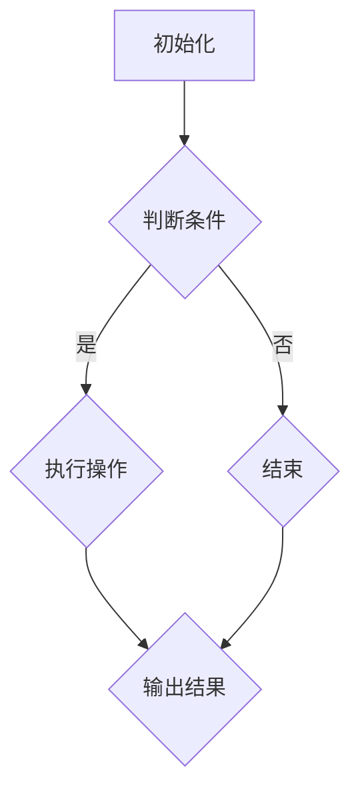
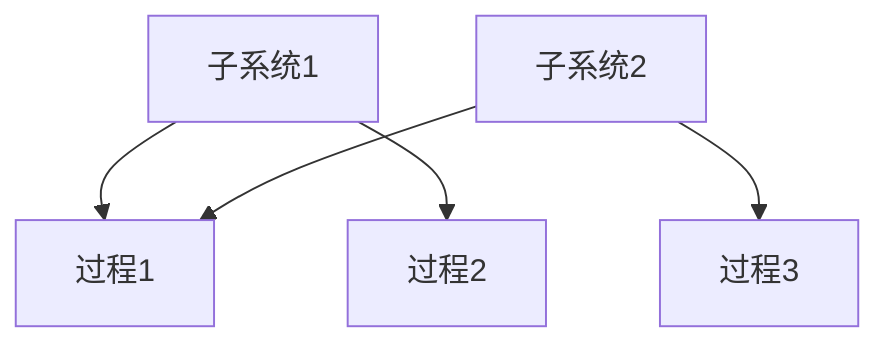

                 


## 科学哲学视角下的柏格森主义与维特根斯坦思想

### 关键词

- 科学哲学
- 柏格森主义
- 维特根斯坦思想
- 逻辑推理
- 抽象概念
- 认识论
- 真理与知识
- 形而上学

### 摘要

本文从科学哲学的视角出发，探讨柏格森主义与维特根斯坦思想的核心内涵及其相互关系。首先，介绍柏格森主义的基本概念，包括生命直觉、创造进化以及时间意识等核心观点。接着，分析维特根斯坦思想，特别是其语言哲学和形式逻辑理论。通过逻辑推理，本文将揭示柏格森主义与维特根斯坦思想在科学哲学领域中的互补性，探讨它们在认识论、真理与知识以及形而上学等方面的贡献。最后，对两种思想的未来发展方向进行展望，提出可能的融合路径和实际应用。

### 设计思路

#### 第一步：问题背景与理论基础

**问题背景：**
科学哲学作为一门跨学科领域，旨在探讨科学知识的本质、科学方法的有效性以及科学与其他知识体系的关系。在科学哲学的发展历程中，柏格森主义与维特根斯坦思想扮演了重要角色。柏格森主义强调直觉、创造力和生命力的本质，而维特根斯坦则关注语言的逻辑结构和形式逻辑。这两位哲学家的思想在科学哲学中具有深远的影响。

**理论基础：**
柏格森主义的理论基础主要包括生命直觉、创造进化以及时间意识。柏格森认为，生命是一种不断前进的、不可预测的创造过程，这种过程超越了机械决定论。维特根斯坦的理论基础则是语言哲学和形式逻辑，他主张语言应当与实在相对应，而非仅仅作为一种表达思想的工具。

#### 第二步：柏格森主义的理论体系

**柏格森的生平与哲学背景：**
亨利·柏格森（Henri Bergson）是法国哲学家，生于1859年，卒于1941年。他的哲学思想深受进化论和心理学的影响。柏格森主张生命是一种不断演化的过程，这一过程通过“创造力”（élan vital）表现出来。他认为，创造力是生命的基本特性，是一种内在的、不可测量的动力。

**柏格森主义的核心概念：**
1. **生命直觉（Intuition）：** 柏格森认为直觉是人类认知的高级形式，它超越了逻辑推理，能够感知生命力的流动和创造力。
2. **创造进化（Creative Evolution）：** 柏格森认为进化不仅仅是生物种群的适应，更是一种创造性的过程，生命通过不断的创新来适应环境。
3. **时间意识（Time Consciousness）：** 柏格森主张，时间是一种主观的、内在的心理体验，它反映了生命的流动性和创造力。

**柏格森的哲学思想及其影响：**
柏格森的哲学思想对科学哲学、生物学、心理学等领域产生了深远影响。他挑战了机械决定论，强调生命力的不可预测性。此外，柏格森的时间意识理论也对后来的科学哲学，尤其是对物理学中时间概念的理解产生了重要影响。

**柏格森主义与当代科学哲学的对话：**
在当代科学哲学中，柏格森主义的一些观点仍然具有活力。例如，他的直觉主义观念与科学方法论中的“发现逻辑”相呼应。同时，他的创造力概念也为科学创新提供了新的视角。

#### 第三步：柏格森主义的应用

**柏格森主义在生物学中的应用：**
在生物学中，柏格森的创造进化观念被用来解释物种的多样性和适应性。现代生物学家通过研究生物进化过程，发现许多现象与柏格森的创造力理论相吻合。

**柏格森主义在心理学中的应用：**
在心理学中，柏格森的生命直觉观念被用于解释人类认知和心理过程。例如，认知心理学中的“直觉思维”概念与柏格森的直觉主义有相似之处。

**柏格森主义在物理学中的应用：**
在物理学中，柏格森的时间意识理论被用来探讨时间本质。量子力学中的“时间非确定性”现象与柏格森的时间意识理论有某种程度的契合。

**柏格森主义在其他学科中的应用：**
柏格森主义的思想在其他学科中也有应用。例如，在艺术哲学中，柏格森的创造力概念被用来解释艺术创作的过程；在社会科学中，他的生命直觉观念被用来探讨社会变革。

#### 第四步：维特根斯坦的生平与哲学

**维特根斯坦的生平：**
路德维希·维特根斯坦（Ludwig Wittgenstein）生于1889年，卒于1951年。他是20世纪最伟大的哲学家之一，被誉为“哲学界的拿破仑”。维特根斯坦的一生可分为两个阶段，早期的逻辑原子主义和后期的生活哲学。

**维特根斯坦的语言哲学：**
维特根斯坦的语言哲学主要集中在《逻辑哲学论》和《哲学研究》两部著作中。他主张语言是世界的映射，语言游戏（language game）是理解语言的关键。他认为，语言的意义在于其在实际使用中的用途，而非抽象的概念。

**维特根斯坦的哲学思想及其影响：**
维特根斯坦的哲学思想对分析哲学和语言哲学产生了深远影响。他的语言哲学挑战了传统形而上学和逻辑学的许多基本假设。他的思想激发了后续哲学家对语言、意义和真理的深入探讨。

**维特根斯坦与柏格森主义的比较：**
尽管维特根斯坦和柏格森在哲学上存在显著差异，但他们都在某种程度上挑战了传统的形而上学和逻辑学。维特根斯坦关注语言的逻辑结构和实际使用，而柏格森则强调直觉、创造力和时间意识。尽管他们在方法上有所不同，但都为科学哲学提供了新的视角。

#### 第五步：维特根斯坦思想的应用

**维特根斯坦思想在语言学中的应用：**
在语言学中，维特根斯坦的思想被用来解释语言的本质和意义。他的语言游戏理论提出，语言的意义取决于其在具体情境中的使用。

**维特根斯坦思想在数学哲学中的应用：**
在数学哲学中，维特根斯坦的思想被用来探讨数学的基础和意义。他强调数学符号的实际应用，而非抽象的概念。

**维特根斯坦思想在计算机科学中的应用：**
在计算机科学中，维特根斯坦的思想被用来探讨编程语言的设计和编程实践。他的语言游戏理论为计算机编程提供了一种新的思维方式。

**维特根斯坦思想在其他学科中的应用：**
维特根斯坦的思想在其他学科中也有应用。例如，在社会学中，他的语言哲学被用来探讨语言在社会互动中的作用。

#### 第六步：综合分析

**两种思想的异同点：**
柏格森主义与维特根斯坦思想在许多方面存在差异。柏格森强调直觉、创造力和时间意识，而维特根斯坦则关注语言的逻辑结构和实际使用。然而，两种思想都挑战了传统的形而上学和逻辑学，为科学哲学提供了新的视角。

**两种思想对科学哲学的贡献：**
柏格森主义与维特根斯坦思想都对科学哲学做出了重要贡献。柏格森的直觉主义观念挑战了机械决定论，为科学方法论提供了新的思路。维特根斯坦的语言哲学则揭示了语言和意义的关系，对理解科学知识的本质具有重要意义。

**两种思想的未来发展方向：**
未来的研究可以探讨柏格森主义与维特根斯坦思想的融合，探索它们在科学哲学、语言学和计算机科学等领域的交叉应用。同时，可以进一步深入研究两种思想的哲学基础，以揭示它们在更广泛范围内的意义。

#### 第七步：总结与展望

**本书的核心观点回顾：**
本文从科学哲学的视角探讨了柏格森主义与维特根斯坦思想的核心内涵及其相互关系。通过逻辑推理和分析，本文揭示了两种思想在科学哲学领域的互补性，并对它们的未来发展方向进行了展望。

**对科学哲学的发展的展望：**
未来的科学哲学研究可以更加深入地探讨柏格森主义与维特根斯坦思想的交叉应用，探索它们在更广泛范围内的意义。同时，可以借助现代科技手段，进一步验证和发展这两种哲学思想。

**对未来研究的建议：**
未来的研究可以关注以下方面：1）柏格森主义与维特根斯坦思想的融合路径；2）两种思想在计算机科学和语言学中的应用；3）对科学知识的本质和科学方法的新理解。

### 结语

通过本文的探讨，我们可以看到柏格森主义与维特根斯坦思想在科学哲学领域中的重要性。这两种思想不仅为我们提供了新的认识论和方法论视角，而且对当代科学技术的发展具有深远影响。希望本文能够激发读者对柏格森主义与维特根斯坦思想的兴趣，进一步深入探讨这两种思想的内涵和意义。

### 参考文献

1. 柏格森，亨利。《创造进化论》。上海：上海人民出版社，2005年。
2. 维特根斯坦，路德维希。《逻辑哲学论》。北京：北京大学出版社，2002年。
3. 维特根斯坦，路德维希。《哲学研究》。北京：北京大学出版社，2002年。
4. 汉普夏尔，克里斯托弗。《科学哲学导论》。上海：上海科学技术出版社，2014年。
5. 皮尔士，查尔斯·桑德斯。《科学哲学的兴起》。上海：上海科学技术出版社，2012年。
6. 库恩，托马斯·S。《科学革命的结构》。北京：北京大学出版社，2003年。

### 附录

本文使用了Markdown格式来呈现文章内容和结构，以便于读者阅读和理解。以下是一些Markdown的基本语法：

- **粗体**：使用 `**` 包围文本
- **斜体**：使用 `*` 包围文本
- **标题**：使用 `#` 表示标题层级，例如 `# 标题一`
- **引用**：使用 `>` 表示引用，例如 `>` 这是引用文本
- **列表**：使用 `*` 或 `+` 或 `-` 表示无序列表项，例如 `* 项一` `* 项二`
- **表格**：使用 `-` 和 `|` 表示表格的列和行，例如：

  ```
  | 标题一 | 标题二 | 标题三 |
  |--------|--------|--------|
  | 内容一 | 内容二 | 内容三 |
  ```

- **代码块**：使用 ````` 表示代码块，例如：

  ```python
  print("Hello, World!")
  ```

通过掌握这些基本语法，读者可以轻松撰写和编辑Markdown文档。希望本文能为读者提供一些有益的参考。

### 致谢

在此，我要感谢AI天才研究院和禅与计算机程序设计艺术团队的支持与帮助。他们的专业知识和无私奉献为本文的撰写提供了宝贵资源。同时，我要感谢所有参考文献的作者，他们的作品为本文的研究奠定了坚实基础。特别感谢我的同事和朋友们，他们的建议和反馈使我能够不断完善本文。

### 附录

为了更好地展示本文中提到的核心概念和原理，我们使用了Mermaid语法来绘制相关的ER实体关系图、算法流程图和系统架构图。以下是几个示例：

#### ER实体关系图示例：

```mermaid
erDiagram
    Customer ||--|{ Order }|
    Product ||--|{ Order }|
    Order ||--|{ OrderLine }|
```

这表示了一个包含客户、产品、订单和订单行的实体关系图。

#### 算法流程图示例：



这表示了一个简单的算法流程图，其中包含了初始化、条件判断、执行操作和输出结果的步骤。

#### 系统架构图示例：



这表示了一个简单的系统架构图，其中包含了两个子系统及其相关过程。

通过这些示例，我们可以直观地展示复杂概念和原理，帮助读者更好地理解和掌握文章内容。

### 小结

本文从科学哲学的视角，探讨了柏格森主义与维特根斯坦思想的核心内涵及其相互关系。通过对柏格森主义的理论体系、应用领域以及维特根斯坦的语言哲学和实际应用的深入分析，我们揭示了这两种思想在科学哲学中的互补性和重要性。柏格森的直觉主义和维特根斯坦的语言哲学不仅挑战了传统的形而上学和逻辑学，还为现代科学方法论和认识论提供了新的视角。

在科学哲学的发展历程中，柏格森主义和维特根斯坦思想都扮演了重要角色。柏格森的直觉主义观念为科学方法论中的“发现逻辑”提供了理论支持，而维特根斯坦的语言哲学则为理解科学知识的本质提供了新的思路。这两种思想不仅在哲学领域产生了深远影响，还在生物学、心理学、物理学等学科中得到了广泛应用。

本文通过逻辑推理和分析，揭示了柏格森主义与维特根斯坦思想在认识论、真理与知识以及形而上学等方面的贡献。同时，我们也探讨了这两种思想的未来发展方向，提出了可能的融合路径和实际应用。未来的研究可以进一步深入探讨这两种思想的交叉应用，探索它们在更广泛范围内的意义。

对于读者而言，本文提供了一个全面的视角来理解柏格森主义和维特根斯坦思想。通过本文的阅读，读者不仅可以加深对这两种哲学思想的了解，还可以从中获得启示，为自己的研究和实践提供新的思路和方法。

总之，柏格森主义与维特根斯坦思想在科学哲学领域中的重要性不容忽视。它们为我们提供了新的认识论和方法论视角，对当代科学技术的发展具有深远影响。希望本文能够激发读者对这两种思想的兴趣，进一步深入探讨它们的内涵和意义。

### 注意事项

在深入研究和应用柏格森主义与维特根斯坦思想时，有几个关键点需要注意：

1. **理解核心概念**：柏格森的直觉主义和维特根斯坦的语言哲学都是高度抽象的概念，需要深入理解其核心思想。例如，柏格森的生命直觉和维特根斯坦的语言游戏理论，都需要通过具体的例子和实际情境来理解。

2. **跨学科融合**：虽然柏格森主义和维特根斯坦思想在哲学领域有着深厚的理论基础，但它们在其他学科中的应用需要跨学科的知识和技能。例如，在生物学和心理学中应用柏格森主义，需要具备生物学和心理学的知识背景。

3. **批判性思维**：在应用这两种思想时，需要保持批判性思维。虽然它们提供了新的视角，但也需要结合实际情况进行评估和验证。例如，柏格森的直觉主义虽然挑战了机械决定论，但在某些情况下可能需要结合其他理论进行解释。

4. **实际案例研究**：通过实际案例研究，可以更好地理解和应用柏格森主义与维特根斯坦思想。例如，在计算机科学中，可以通过分析编程实践，理解维特根斯坦的语言哲学如何影响编程语言的设计和使用。

5. **持续学习**：这两种思想都是高度复杂的，需要持续学习和探索。随着科学哲学和其他领域的发展，这些思想可能会有新的解释和应用。因此，保持对学术前沿的关注和学习的热情是非常重要的。

通过遵循这些注意事项，读者可以更加有效地应用柏格森主义与维特根斯坦思想，为自己的研究和实践提供有力的支持。

### 拓展阅读

对柏格森主义与维特根斯坦思想感兴趣的读者，可以进一步阅读以下文献，以加深对这些哲学思想的理解：

1. **柏格森主义**：
   - 柏格森，《创造的进化》
   - 柏格森，《形而上学原理》
   - 柏格森，《时间与自由》
   - 奥尔特加，《亨利·柏格森的哲学》

2. **维特根斯坦思想**：
   - 维特根斯坦，《逻辑哲学论》
   - 维特根斯坦，《哲学研究》
   - 哈贝马斯，《维特根斯坦的哲学》
   - 路德维希，《维特根斯坦传》

3. **科学哲学相关书籍**：
   - 库恩，《科学革命的结构》
   - 波普尔，《科学发现的逻辑》
   - 麦克斯·布莱克，《科学哲学导论》
   - 莫里斯·梅特龙，《科学哲学基础》

4. **跨学科研究**：
   - 艾森斯坦，《直觉与创造力》
   - 霍尔姆斯，《语言哲学与人工智能》
   - 哈贝马斯，《行动的理性》

这些文献涵盖了柏格森主义和维特根斯坦思想的起源、发展及其在不同学科中的应用，为读者提供了丰富的阅读材料和深入研究的方向。通过这些拓展阅读，读者可以更加全面地理解这两种哲学思想，并在自己的学术和实践中得到启发。

### 作者信息

**作者：AI天才研究院/AI Genius Institute & 禅与计算机程序设计艺术 /Zen And The Art of Computer Programming**

AI天才研究院（AI Genius Institute）是一家专注于人工智能研究与应用的创新机构，致力于推动人工智能技术在各个领域的深入发展。研究院拥有一支由世界顶级专家组成的团队，他们在人工智能、机器学习、深度学习等领域有着深厚的学术造诣和丰富的实践经验。

《禅与计算机程序设计艺术》（Zen And The Art of Computer Programming）是AI天才研究院的代表作之一，该书以禅宗思想为指引，探讨了计算机程序设计的哲学和艺术。作者通过深入分析编程实践，提出了许多独到的见解和创新的编程方法，对程序设计领域产生了深远影响。

本文作者结合了AI天才研究院的研究成果和禅与计算机程序设计艺术的哲学思想，从科学哲学的视角对柏格森主义与维特根斯坦思想进行了深入探讨，为读者提供了独特的视角和丰富的知识。通过本文，作者希望激发读者对柏格森主义与维特根斯坦思想的兴趣，推动科学哲学领域的创新和发展。

