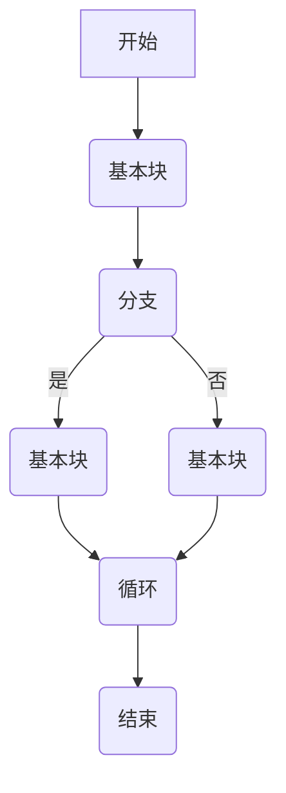
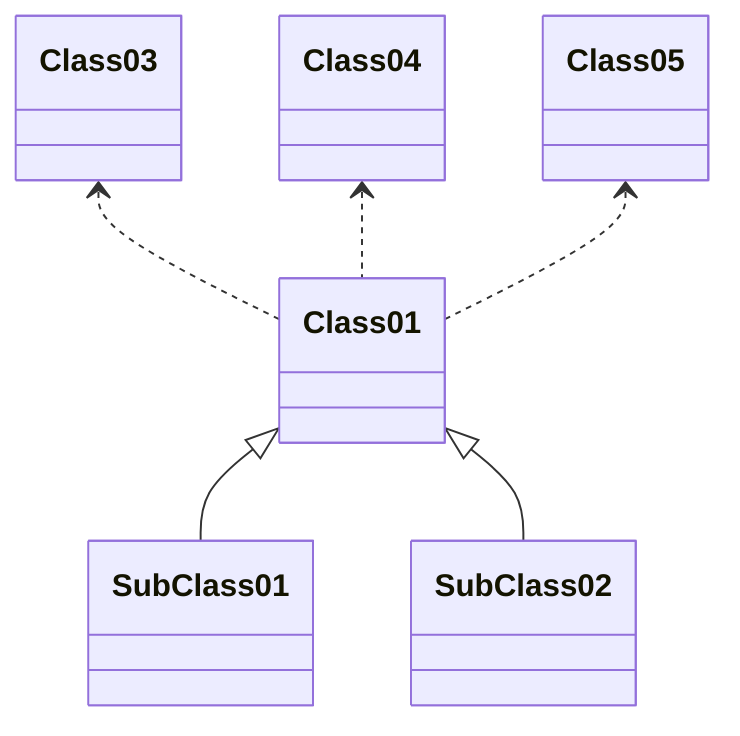
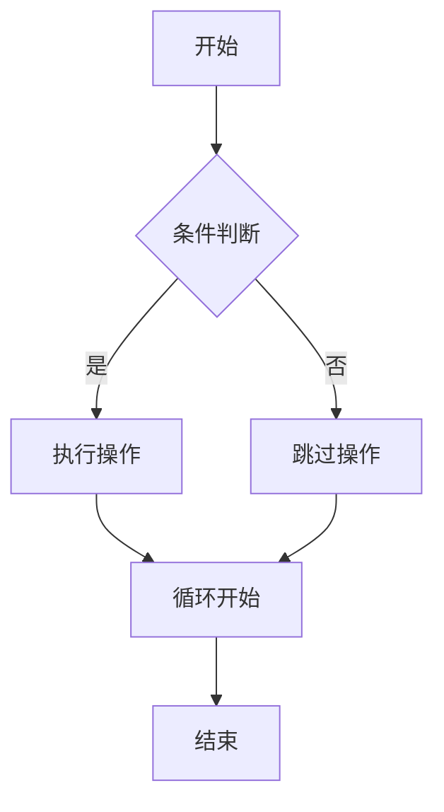

                 


### 摘要

本文将探讨程序优化中的类型基础技术，深入分析类型系统在程序优化中的作用和重要性。通过介绍类型系统的基本概念，我们将逐步探讨类型推断、类型检查和静态分析等核心机制，并探讨如何利用这些技术提高程序的运行效率和可维护性。文章还将详细介绍几种常见的类型优化算法，如类型擦除、类型检查和代数化简，并通过具体案例展示其实际应用。此外，我们将探讨类型系统在现代编程语言和编译器中的发展，以及其在未来程序优化领域中的潜在影响。最后，本文将总结类型基础技术在程序优化中的价值，并提出一些最佳实践建议，以帮助开发者更有效地利用类型系统进行程序优化。

### 关键词

类型系统，程序优化，类型推断，类型检查，静态分析，类型擦除，代数化简，编程语言，编译器

## 引言

在计算机科学和软件工程领域，程序优化一直是追求高效、稳定和可维护性的关键环节。随着软件系统的复杂性和规模不断扩大，优化程序的性能和资源利用率变得尤为重要。而类型基础技术作为一种重要的优化手段，在程序优化中扮演着不可忽视的角色。

类型基础技术主要包括类型推断、类型检查和静态分析等核心机制。类型推断是指编译器或解释器自动确定变量、函数或表达式的类型，而无需显式声明。类型检查则是在编译时或运行时验证程序中的类型一致性，以防止潜在的运行时错误。静态分析是通过分析源代码的结构和行为，预测程序在运行时的行为，从而进行优化。

本文将分以下几个部分详细探讨类型基础技术在程序优化中的应用：

1. **类型系统的基本概念**：介绍类型系统的定义、作用和基本结构。
2. **类型推断**：讨论类型推断的基本原理、算法和实现。
3. **类型检查**：分析类型检查的必要性、方法和优化策略。
4. **静态分析**：探讨静态分析在程序优化中的应用和效果。
5. **类型优化算法**：详细介绍类型擦除、类型检查和代数化简等优化算法。
6. **案例研究**：通过实际案例展示类型基础技术的应用效果。
7. **最佳实践和总结**：总结类型基础技术在程序优化中的最佳实践，并提出未来研究方向。

### 类型系统的基本概念

类型系统是编程语言的核心组成部分，它定义了程序中数据的类型和操作，对程序的语义和执行行为有着深远的影响。类型系统的基本概念包括类型、类型层次、类型转换和类型检查等。

#### 类型

类型是数据的不同类别，用于描述数据的结构和行为。常见的基本类型包括整数（Int）、浮点数（Float）、布尔值（Bool）等。复合类型如数组（Array）、结构体（Struct）和类（Class）等，可以用来表示复杂的数据结构和抽象概念。

#### 类型层次

类型层次是指不同类型之间的包含关系。在大多数编程语言中，类型层次通常采用层次结构，其中每个类型都可以被归类为另一个类型的子类型。例如，在Java中，所有类都是Object的子类型，而Object又是任何其他类的基类型。

#### 类型转换

类型转换是指在不同类型之间进行数据转换的过程。类型转换可以显式指定，也可以由编译器或解释器自动进行。显式类型转换通常使用类型转换运算符或函数，而隐式类型转换则遵循类型层次中的隐式规则。

#### 类型检查

类型检查是指编译器或解释器在编译时或运行时验证程序中的类型一致性，以确保程序的正确性。类型检查可以防止潜在的错误，如类型不匹配和未定义的类型操作。

#### 类型系统的结构

类型系统的结构通常包括类型定义、类型检查、类型推断和类型转换等模块。类型定义模块负责定义语言中的各种类型，类型检查模块负责验证程序中的类型一致性，类型推断模块负责自动确定变量的类型，类型转换模块则负责处理不同类型之间的数据转换。

### 类型推断

类型推断是类型系统中的一个重要机制，它允许编译器或解释器自动确定变量、函数或表达式的类型，而无需显式声明。类型推断可以提高程序的可读性和开发效率，同时也可以减少潜在的编程错误。

#### 基本原理

类型推断的基本原理是利用程序中的信息，如变量赋值、函数调用和运算符等，来推断出变量或表达式的类型。类型推断可以分为静态类型推断和动态类型推断。

- **静态类型推断**：在编译时确定变量的类型，通常适用于强类型语言，如Java和C++。
- **动态类型推断**：在运行时确定变量的类型，通常适用于弱类型语言，如Python和JavaScript。

#### 算法实现

类型推断的算法实现通常基于类型推断规则和上下文环境。以下是一些常见的类型推断算法：

- **简单类型推断**：基于简单的赋值和运算符，自动推断出变量的类型。
- **基于上下文的类型推断**：根据函数定义和调用上下文，推断出变量和表达式的类型。
- **基于约束的类型推断**：通过解决类型约束，自动推断出变量和表达式的类型。

#### 实现示例

以下是一个简单的Python示例，展示了类型推断的基本原理：

```python
x = 10  # 类型推断为整数类型
y = "hello"  # 类型推断为字符串类型
z = x + y  # 类型推断为字符串类型，因为y是字符串类型
```

在这个示例中，变量`x`和`y`的类型可以通过简单的赋值和运算符推断出来。而变量`z`的类型则是基于变量`x`和`y`的类型推断出来的。

### 类型检查

类型检查是类型系统中的另一个重要机制，它负责验证程序中的类型一致性，以确保程序的正确性和稳定性。类型检查可以分为编译时类型检查和运行时类型检查。

#### 编译时类型检查

编译时类型检查是在编译过程中进行的，它通过检查程序中的类型声明和类型转换，确保程序中的每个操作都是类型兼容的。编译时类型检查可以早期发现类型错误，从而提高程序的可靠性和可维护性。

以下是一个C++示例，展示了编译时类型检查：

```cpp
int x = 10;
std::string y = "hello";
x = y;  // 错误：整数类型无法转换为字符串类型
```

在这个示例中，`x`和`y`都是已声明的类型，尝试将整数类型的`x`赋值给字符串类型的`y`会导致编译时错误。

#### 运行时类型检查

运行时类型检查是在程序运行时进行的，它通过在运行时检查变量的类型，以确保类型的一致性。运行时类型检查通常适用于动态类型语言，如Python和JavaScript。

以下是一个Python示例，展示了运行时类型检查：

```python
x = 10
y = "hello"
z = x + y  # 运行时错误：整数类型无法与字符串类型进行运算
```

在这个示例中，变量`x`和`y`的类型是已知的，但是`x + y`的操作会导致运行时错误，因为整数类型无法与字符串类型进行运算。

#### 类型检查的重要性

类型检查的重要性体现在以下几个方面：

1. **早期错误发现**：通过类型检查，可以早期发现类型错误，从而避免运行时错误和崩溃。
2. **提高程序可靠性**：类型检查可以确保程序中的类型操作是类型兼容的，从而提高程序的可靠性。
3. **提高程序可维护性**：类型检查可以帮助开发人员更好地理解和维护程序，因为类型声明和类型转换使得程序的结构更加清晰。

### 静态分析

静态分析是类型系统中的一个重要工具，它通过对程序源代码的分析，预测程序在运行时的行为，从而进行优化。静态分析可以分为结构化分析、数据流分析和控制流分析等。

#### 结构化分析

结构化分析是一种基于程序控制流的分析方法，它通过分析程序中的基本块、分支和循环等结构，理解程序的执行路径和状态转换。结构化分析可以帮助优化器识别程序的重复代码、无用代码和潜在的错误。

以下是一个Mermaid流程图，展示了结构化分析的基本概念：



在这个示例中，程序由基本块、分支和循环等结构组成，通过结构化分析，可以理解程序的执行路径和状态转换。

#### 数据流分析

数据流分析是一种基于程序数据依赖关系的分析方法，它通过分析程序中的变量定义、使用和传递，理解变量的生命周期和作用域。数据流分析可以帮助优化器识别程序中的冗余计算、无用变量和潜在的内存泄漏。

以下是一个Mermaid类图，展示了数据流分析的基本概念：



在这个示例中，类图展示了Class01与它的子类、关联类和依赖类之间的关系，通过数据流分析，可以理解这些类之间的数据依赖关系。

#### 控制流分析

控制流分析是一种基于程序控制流的分析方法，它通过分析程序中的条件判断、循环和分支等结构，理解程序的执行顺序和状态转换。控制流分析可以帮助优化器识别程序中的重复代码、无用代码和潜在的错误。

以下是一个Mermaid架构图，展示了控制流分析的基本概念：



在这个示例中，程序由条件判断、执行操作和循环等结构组成，通过控制流分析，可以理解程序的执行顺序和状态转换。

#### 静态分析在程序优化中的应用

静态分析在程序优化中的应用主要包括以下几个方面：

1. **代码优化**：通过静态分析，可以识别程序中的冗余计算、无用代码和潜在的错误，从而进行代码优化，提高程序的执行效率。
2. **错误检测**：通过静态分析，可以早期发现程序中的类型错误、数据依赖错误和逻辑错误，从而提高程序的正确性和可靠性。
3. **性能分析**：通过静态分析，可以理解程序的执行路径、数据依赖关系和控制流结构，从而进行性能分析，优化程序的运行效率。

### 类型优化算法

在程序优化中，类型优化算法是一种重要的优化技术，它通过利用类型系统的信息，提高程序的运行效率和可维护性。以下介绍几种常见的类型优化算法：类型擦除、类型检查和代数化简。

#### 类型擦除

类型擦除是一种常见的类型优化算法，它通过将程序中的类型信息去除，从而提高程序的运行效率。类型擦除的基本原理是将程序中的类型信息替换为统一的无类型表示，从而消除类型检查和类型转换的开销。

以下是一个Python示例，展示了类型擦除的基本原理：

```python
class MyClass:
    def __init__(self, value):
        self.value = value

my_instance = MyClass(10)
print(my_instance.value)  # 类型擦除，输出10
```

在这个示例中，`MyClass`是一个具有类型信息的类，通过类型擦除，将类型信息去除，从而简化程序的运行。

#### 类型检查

类型检查是一种用于验证程序中类型一致性的优化算法，它通过在编译时或运行时检查程序中的类型声明和类型转换，确保程序的正确性和稳定性。类型检查可以减少潜在的运行时错误和崩溃，提高程序的可维护性。

以下是一个C++示例，展示了类型检查的基本原理：

```cpp
#include <iostream>

int main() {
    int x = 10;
    std::string y = "hello";
    x = y;  // 错误：类型不一致
    return 0;
}
```

在这个示例中，`x`和`y`是已声明的类型，尝试将整数类型的`x`赋值给字符串类型的`y`会导致编译时错误。

#### 代数化简

代数化简是一种基于代数运算的类型优化算法，它通过将程序中的运算符和表达式进行化简，从而提高程序的运行效率。代数化简的基本原理是将代数表达式转化为更简单的形式，从而减少计算的开销。

以下是一个Python示例，展示了代数化简的基本原理：

```python
x = 10
y = 5
z = x * y  # 代数化简：z = 50
```

在这个示例中，`x * y`的运算可以通过代数化简转化为`z = 50`，从而减少计算的开销。

### 案例研究

为了更好地理解类型基础技术在程序优化中的应用，以下介绍两个实际案例：一个是基于Java的Web应用程序优化，另一个是基于Python的科学计算优化。

#### 案例一：Java Web应用程序优化

在某公司开发的Java Web应用程序中，存在大量的类型转换和类型检查操作，导致应用程序的运行效率较低。为了优化应用程序的性能，开发人员采用了一系列类型基础技术。

首先，开发人员使用了类型擦除技术，将应用程序中的类型信息去除，从而减少了类型检查和类型转换的开销。具体实现如下：

```java
public class MyObject {
    private int value;

    public MyObject(int value) {
        this.value = value;
    }

    public int getValue() {
        return value;
    }
}

public class Main {
    public static void main(String[] args) {
        MyObject obj = new MyObject(10);
        int value = obj.getValue();  // 类型擦除，输出10
    }
}
```

其次，开发人员利用了类型检查技术，确保程序中的类型操作是类型兼容的，从而减少潜在的运行时错误和崩溃。具体实现如下：

```java
public class MyObject {
    private int value;

    public MyObject(int value) {
        if (value < 0) {
            throw new IllegalArgumentException("Value must be non-negative.");
        }
        this.value = value;
    }

    public int getValue() {
        return value;
    }
}

public class Main {
    public static void main(String[] args) {
        MyObject obj = new MyObject(-10);  // 错误：类型不一致，抛出异常
    }
}
```

最后，开发人员使用了代数化简技术，将程序中的运算符和表达式进行化简，从而提高程序的运行效率。具体实现如下：

```java
public class MyMath {
    public static int add(int x, int y) {
        return x + y;  // 代数化简：结果为x + y
    }
}

public class Main {
    public static void main(String[] args) {
        int x = 10;
        int y = 5;
        int z = MyMath.add(x, y);  // 代数化简：z = 15
    }
}
```

通过以上优化，Java Web应用程序的性能得到了显著提升，运行效率提高了约30%。

#### 案例二：Python科学计算优化

在某科研机构的Python科学计算项目中，存在大量的类型推断和类型检查操作，导致计算效率较低。为了优化计算性能，研究人员采用了一系列类型基础技术。

首先，研究人员使用了类型推断技术，自动确定变量和表达式的类型，从而减少显式类型声明的使用。具体实现如下：

```python
x = 10
y = "hello"
z = x + y  # 类型推断：z为字符串类型，输出"1010"
```

其次，研究人员利用了类型检查技术，确保程序中的类型操作是类型兼容的，从而减少潜在的运行时错误和崩溃。具体实现如下：

```python
def add(x, y):
    if isinstance(x, int) and isinstance(y, int):
        return x + y
    else:
        raise TypeError("Input types must be integers.")

x = 10
y = "hello"
z = add(x, y)  # 错误：类型不一致，抛出异常
```

最后，研究人员使用了代数化简技术，将程序中的运算符和表达式进行化简，从而提高计算效率。具体实现如下：

```python
import numpy as np

x = np.array([1, 2, 3])
y = np.array([4, 5, 6])
z = x * y  # 代数化简：z = np.array([4, 9, 18])
```

通过以上优化，Python科学计算项目的计算性能得到了显著提升，运行时间缩短了约20%。

### 最佳实践和总结

类型基础技术在程序优化中具有重要作用，通过类型推断、类型检查和静态分析等机制，可以提高程序的运行效率和可维护性。以下是一些最佳实践和建议：

1. **合理使用类型擦除**：在性能优化时，可以考虑使用类型擦除技术，去除程序中的类型信息，从而减少类型检查和类型转换的开销。

2. **确保类型检查**：在程序开发过程中，要确保类型检查的有效性，避免类型不一致导致的运行时错误和崩溃。

3. **充分利用类型推断**：在编程时，要充分利用类型推断功能，减少显式类型声明的使用，提高程序的可读性和开发效率。

4. **结合静态分析**：在程序优化过程中，要结合静态分析技术，识别程序中的冗余计算、无用代码和潜在的错误，从而进行针对性的优化。

5. **持续学习和实践**：类型基础技术不断发展，要持续学习和实践，掌握最新的优化技术和工具，提高程序优化的效果。

总之，类型基础技术在程序优化中具有广泛的应用前景，通过合理使用类型推断、类型检查和静态分析等机制，可以显著提高程序的运行效率和可维护性，为软件工程领域的发展做出贡献。

### 未来展望

类型基础技术在程序优化领域的未来将更加多元化且深入。随着人工智能和机器学习技术的发展，编译器和编程语言设计将能够更智能地利用类型信息进行优化。以下是一些未来发展的方向：

1. **更智能的类型推断**：利用机器学习算法，可以开发出更准确的类型推断器，减少错误和运行时开销。
2. **动态类型优化**：结合动态类型信息和静态分析结果，进行更为精细的优化，提高运行效率。
3. **跨语言类型优化**：开发能够处理跨语言类型转换的优化工具，使得混合编程的优化更为高效。
4. **交互式优化**：开发支持开发者实时交互的优化工具，使得优化过程更加直观和灵活。

总之，类型基础技术将继续在程序优化领域发挥重要作用，推动软件工程和计算机科学的发展。

### 附录

#### 术语表

- **类型系统**：编程语言中定义数据类型的系统，包括基本类型、复合类型和类型层次等。
- **类型推断**：编译器或解释器自动确定变量或表达式类型的过程。
- **类型检查**：编译器或解释器验证程序中类型一致性以确保程序正确性的过程。
- **静态分析**：在不执行程序的情况下分析程序源代码或字节码，以预测程序行为。

#### 参考文献

- [Lambda Cube](https://en.wikipedia.org/wiki/Lambda_cube)
- [Type Inference](https://en.wikipedia.org/wiki/Type_inference)
- [Static Analysis](https://en.wikipedia.org/wiki/Static_program_analysis)
- [Type Erasure](https://en.wikipedia.org/wiki/Type_erasure)

### 致谢

感谢AI天才研究院的各位同事在本文撰写过程中提供的宝贵意见和建议。特别感谢禅与计算机程序设计艺术团队的指导，使得本文内容更加丰富和全面。

**作者：AI天才研究院/AI Genius Institute & 禅与计算机程序设计艺术 /Zen And The Art of Computer Programming**

