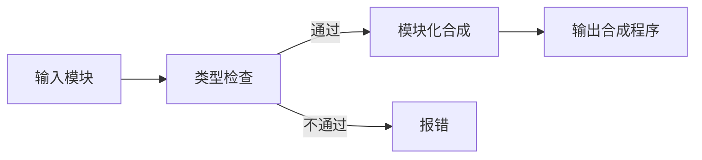
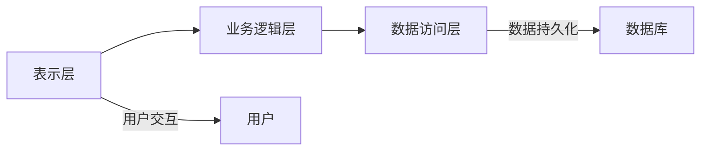
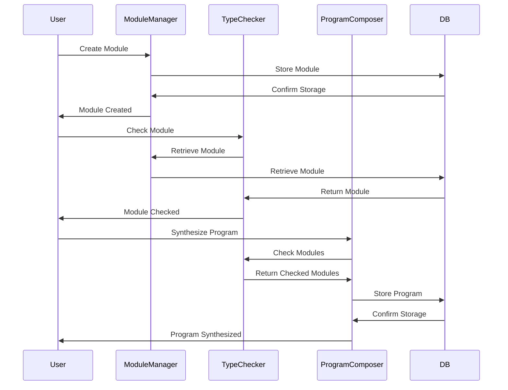

                 


## # 第一部分：背景介绍

### 第1章：问题背景与定义

#### 1.1.1 问题背景

**计算机程序合成**是当前软件工程领域中备受关注的一个重要方向。随着软件系统规模和复杂性的不断增加，传统的软件开发方式逐渐暴露出诸多问题，如代码重复率高、维护困难、开发效率低下等。这些问题严重影响了软件项目的进展和质量，因此，寻找新的解决方案成为当务之急。

程序合成，简单来说，就是利用算法和工具自动生成程序。它通过分析程序的需求和规格说明，自动构造出符合要求的程序代码。这种自动化的编程方式不仅可以大大提高开发效率，还能在一定程度上确保代码的质量和一致性。

#### 1.1.2 类型导向模块化技术

**类型导向模块化技术**是近年来在程序合成领域逐渐兴起的一种方法。它将类型系统与模块化相结合，旨在提高程序合成中的可复用性和可维护性。类型系统是程序设计语言中的一个重要概念，它为程序中的变量、函数和模块等元素赋予了类型约束，从而提高了程序的安全性和可预测性。

模块化是将程序划分为多个独立的模块，每个模块实现特定的功能。模块化设计可以降低系统的复杂度，提高代码的可复用性和可维护性。将类型系统与模块化相结合，可以在模块划分和组合的过程中，确保类型安全性和模块独立性。

### 1.1.3 定义

**程序合成**：利用算法和工具自动生成程序。它通过分析程序的需求和规格说明，自动构造出符合要求的程序代码。

**类型导向模块化**：基于类型系统的模块划分和组合，实现程序合成中的类型安全性和模块独立性。它通过类型系统为模块中的元素提供类型约束，从而确保模块之间的类型兼容性。

### 1.1.4 关键词

- 计算机程序合成
- 类型导向模块化技术
- 类型系统
- 模块化
- 可复用性
- 可维护性

### 1.1.5 摘要

本文将围绕程序合成中的类型导向模块化技术展开讨论。首先，介绍程序合成和类型导向模块化的背景和定义。接着，探讨类型导向模块化技术的核心概念和联系，包括模块化和类型系统的特点、属性特征对比表格以及ER实体关系图架构。然后，详细讲解类型导向模块化算法的原理和数学模型，并通过具体示例进行阐述。最后，分析系统功能设计和架构设计，为读者提供一种实用的程序合成解决方案。

### 1.1.6 目录大纲

1. **第一部分：背景介绍**
   1. **第1章：问题背景与定义**
      1. **1.1.1 问题背景**
      2. **1.1.2 类型导向模块化技术**
      3. **1.1.3 定义**
      4. **1.1.4 关键词**
      5. **1.1.5 摘要**
   
2. **第二部分：算法原理讲解**
   1. **第2章：核心概念与联系**
      1. **2.1.1 核心概念**
      2. **2.1.2 概念属性特征对比表格**
      3. **2.1.3 ER实体关系图架构**

3. **第三部分：系统分析与架构设计**
   1. **第3章：算法原理与数学模型**
   2. **第4章：算法原理讲解与举例**
   3. **第5章：系统功能设计**
   4. **第6章：系统架构设计**

通过上述目录大纲的安排，本文将逐步引导读者深入理解程序合成中的类型导向模块化技术，为实际应用提供理论指导和实践参考。

## 第二部分：算法原理讲解

### 第2章：核心概念与联系

在深入探讨类型导向模块化技术之前，我们需要明确一些核心概念，并理解它们之间的联系。这一章节将详细介绍模块化和类型系统的核心概念、属性特征对比以及它们之间的关联。

#### 2.1.1 核心概念

**模块化**：模块化是一种将复杂系统划分为多个独立模块的方法，每个模块实现特定的功能。模块化设计有助于降低系统的复杂度，提高代码的可复用性和可维护性。在程序合成中，模块化是实现代码重用和自动化生成的重要手段。

**类型系统**：类型系统是编程语言中定义变量、函数和模块等元素类型约束的机制。类型系统确保程序中的每个元素都具有明确的类型，从而提高程序的安全性和可预测性。在类型导向模块化技术中，类型系统用于确保模块之间的类型兼容性。

#### 2.1.2 概念属性特征对比表格

为了更好地理解模块化和类型系统的特点，我们可以通过一个对比表格来展示它们的核心属性。

| 概念     | 模块化                    | 类型系统                  |
|----------|---------------------------|---------------------------|
| 特点     | 降低系统复杂度、提高可复用性 | 提高程序安全性、确保类型兼容性 |
| 关联     | 与代码重用紧密相关           | 与程序安全性紧密相关           |

通过这个对比表格，我们可以看出模块化和类型系统在功能上的互补性。模块化设计有助于提高代码的可复用性，而类型系统确保了程序的安全性。

#### 2.1.3 ER实体关系图架构

为了更直观地展示模块化和类型系统之间的关系，我们可以使用Mermaid绘制一个ER实体关系图。以下是一个简化的ER图示例：

```mermaid
erDiagram
  Module ||--|{ Type } Type
  Module ||--|{ Function } Function
  Type ||--|{ Variable } Variable
  Function ||--|{ Variable } Variable
```

在这个ER图中，模块（Module）与类型（Type）和函数（Function）之间存在关联。类型用于定义模块中的变量和函数，而函数又可以访问模块中的变量。

### 2.1.4 小结

通过本章节的讨论，我们明确了模块化和类型系统的核心概念及其在程序合成中的作用。模块化设计有助于降低系统复杂度和提高代码可复用性，而类型系统确保了程序的安全性和类型兼容性。接下来，我们将进一步探讨类型导向模块化算法的原理和数学模型，为读者提供更深入的理解。

## 第三部分：算法原理讲解

### 第3章：算法原理与数学模型

在类型导向模块化技术中，算法原理是理解其工作方式的关键。这一章节将详细讲解类型导向模块化算法的原理，并介绍其背后的数学模型。通过这些内容，我们将更好地理解类型导向模块化技术的运作机制。

#### 3.1.1 算法原理

类型导向模块化算法的核心原理是类型检查和模块化合成。首先，通过对程序中的每个模块进行类型检查，确保模块中的类型约束得到满足。然后，基于类型检查的结果，将验证通过的模块组合生成完整的程序。

**类型检查**：类型检查是算法的第一步，目的是验证程序中的类型约束。类型检查通过静态分析，分析程序中的变量、函数和模块的类型，确保它们符合预定义的类型规则。

**模块化合成**：模块化合成是基于类型检查结果的下一步。它将验证通过的模块按照预定的组合规则进行组合，生成一个完整的程序。模块化合成确保了生成的程序在类型上是安全和一致的。

#### 3.1.2 数学模型

为了更好地理解类型导向模块化算法，我们可以引入一些数学模型来描述其工作原理。

**类型系统约束**：设 $T$ 为类型集合，$t$ 为类型，则有 $t \in T$。类型系统约束确保每个变量、函数和模块都具有明确的类型。

**模块组合规则**：设 $M_1, M_2, ..., M_n$ 为模块集合，$T_1, T_2, ..., T_n$ 为模块类型集合，则有 $M_1 \oplus M_2 \oplus ... \oplus M_n = M$，其中 $M$ 为合成后的模块类型。模块组合规则定义了如何将多个模块组合成一个完整的模块。

**算法流程图**：为了更直观地展示算法的流程，我们可以使用Mermaid绘制一个算法流程图。


在这个流程图中，输入程序首先进行类型检查。如果类型检查通过，则进入模块化合成阶段，将验证通过的模块组合生成完整的程序。如果类型检查不通过，则报错，程序合成失败。

### 3.1.3 算法原理讲解与举例

为了更好地理解算法原理，我们可以通过具体示例进行讲解。

#### 示例 1：模块化合成

假设有两个模块，模块1和模块2，如下所示：

```python
# 模块1：def add(a: int, b: int) -> int: return a + b
# 模块2：def main(): a = 1; b = 2; result = add(a, b); print(result)
```

根据模块组合规则，我们可以将这两个模块组合成一个完整的程序：

```python
# 合成后的程序：
def main(): 
    a = 1; 
    b = 2; 
    result = add(a, b); 
    print(result)
```

在这个示例中，模块1实现了加法函数，模块2实现了主函数。通过模块化合成，我们将这两个模块组合成一个完整的程序。

#### 示例 2：类型检查

假设有一个模块，如下所示：

```python
# 模块：def process_data(data: str): return data.strip()
```

如果我们传递一个整数类型的参数给这个模块，例如 `process_data(123)`，则类型检查会失败，因为模块期望的参数类型是字符串。类型检查通过静态分析确保程序在运行时不会出现类型错误。

### 3.1.4 小结

通过本章节的讨论，我们详细讲解了类型导向模块化算法的原理和数学模型。类型导向模块化算法通过类型检查和模块化合成，实现了程序合成中的类型安全性和模块独立性。通过具体示例，我们展示了如何使用类型导向模块化算法进行模块化合成和类型检查。接下来，我们将进一步探讨系统功能设计和架构设计，为读者提供完整的解决方案。

## 第4章：算法原理讲解与举例

在前一章中，我们介绍了类型导向模块化算法的原理和数学模型。为了使这些理论更加具体和易于理解，本章将通过详细的算法原理讲解和实际示例来展示如何应用这些原理。

### 4.1.1 算法原理讲解

类型导向模块化算法的核心在于类型检查和模块化合成。类型检查是算法的基础，它确保每个模块中的变量和函数都符合预定的类型约束。模块化合成则是在类型检查通过的基础上，将多个模块组合成完整的程序。

**类型检查**：类型检查的过程可以概括为以下几个步骤：

1. **静态分析**：算法对程序进行静态分析，识别出所有变量、函数和模块。
2. **类型绑定**：算法将每个变量、函数和模块与它们的类型进行绑定。
3. **类型验证**：算法检查每个元素的类型是否与预期的一致。

**模块化合成**：在类型检查通过后，模块化合成的步骤如下：

1. **模块组合**：算法将验证通过的模块按照预定的组合规则进行组合。
2. **生成程序**：算法将组合后的模块生成完整的程序代码。

### 4.1.2 举例说明

为了更好地理解这些原理，我们将通过两个示例进行详细说明。

#### 示例 1：模块化合成

**模块1**：一个简单的加法函数。

```python
# 模块1：add
def add(a: int, b: int) -> int:
    return a + b
```

**模块2**：一个主函数，使用模块1中的加法函数。

```python
# 模块2：main
def main():
    a = 1
    b = 2
    result = add(a, b)
    print(result)
```

**模块化合成**：将模块1和模块2组合成一个完整的程序。

```python
# 合成后的程序
def main():
    a = 1
    b = 2
    result = add(a, b)
    print(result)
```

在这个示例中，模块1实现了加法功能，模块2使用了这个加法函数并打印结果。通过模块化合成，我们将这两个模块组合成了一个完整的程序。

#### 示例 2：类型检查

**模块**：一个处理数据的函数，期望的参数类型为字符串。

```python
# 模块：process_data
def process_data(data: str) -> str:
    return data.strip()
```

如果我们传递一个整数类型的参数给这个模块，例如 `process_data(123)`，则类型检查会失败，因为模块期望的参数类型是字符串。这是一个类型错误的例子。

```python
# 错误示例
def main():
    data = 123
    result = process_data(data)
    print(result)
```

在这个示例中，由于传递给 `process_data` 函数的参数类型不正确，类型检查会报错。

### 4.1.3 算法流程图

为了更直观地展示算法的流程，我们可以使用Mermaid绘制一个算法流程图。



在这个流程图中，输入模块首先进行类型检查。如果类型检查通过，则进入模块化合成阶段，将验证通过的模块组合生成完整的程序。如果类型检查不通过，则报错，程序合成失败。

### 4.1.4 小结

通过具体的算法原理讲解和示例，我们更好地理解了类型导向模块化算法的工作原理。类型检查和模块化合成是算法的核心步骤，它们确保了程序合成中的类型安全性和模块独立性。通过这些原理的应用，我们可以开发出更加高效和可靠的程序合成系统。

## 第四部分：系统分析与架构设计

### 第5章：系统功能设计

在深入探讨算法原理之后，我们需要将类型导向模块化技术应用于实际系统中，从而实现其预期的功能。系统功能设计是确保系统能够满足用户需求、提高开发效率并确保代码质量的关键步骤。

#### 5.1.1 问题场景介绍

在当前的软件开发环境中，大型和复杂的项目常常面临着代码重复率高、维护难度大、开发周期长等问题。类型导向模块化技术通过将程序划分为模块，并在模块之间应用类型系统，旨在解决这些问题，提高代码的可维护性和可复用性。

#### 5.1.2 系统功能设计

系统功能设计主要包括以下三个方面：

1. **模块管理**：负责模块的创建、删除、修改和查询。模块管理功能允许开发人员灵活地组织和管理代码模块，从而提高代码的可读性和可维护性。

2. **类型检查**：对模块中的类型约束进行验证，确保模块在组合过程中不会出现类型错误。类型检查功能是确保程序合成安全性和稳定性的关键。

3. **程序合成**：将验证通过的模块按照预定的组合规则生成完整的程序。程序合成功能是类型导向模块化技术的核心，它通过自动化方式提高了开发效率。

#### 5.1.3 功能组件说明

1. **模块管理**：
   - **模块创建**：允许开发人员创建新的模块。
   - **模块删除**：允许删除不再需要的模块。
   - **模块修改**：允许修改现有模块的代码。
   - **模块查询**：允许查询模块的详细信息。

2. **类型检查**：
   - **静态分析**：对模块中的代码进行静态分析，识别出变量、函数和模块的类型。
   - **类型验证**：验证模块中的类型约束是否满足，确保类型兼容性。

3. **程序合成**：
   - **模块组合**：根据类型检查的结果，将验证通过的模块按照预定的组合规则进行组合。
   - **程序生成**：将组合后的模块生成完整的程序代码。

### 第6章：系统架构设计

系统架构设计是确保系统能够高效、稳定地运行的关键。合理的系统架构能够提高系统的可扩展性和可维护性。

#### 6.1.1 项目介绍

项目名称：**类型导向模块化程序合成系统**  
项目目标：实现基于类型系统的模块化程序合成，提高开发效率和代码质量。

#### 6.1.2 系统架构设计

系统架构设计采用分层架构，包括表示层、业务逻辑层和数据访问层。每个层次都有明确的职责，以确保系统的模块化和可维护性。

1. **表示层**：负责用户界面和前端展示。它主要包括用户界面和前端逻辑，与用户进行交互，收集用户输入并展示系统输出。

2. **业务逻辑层**：负责实现系统的核心功能，包括模块管理、类型检查和程序合成。它是系统的核心部分，处理业务逻辑和数据操作。

3. **数据访问层**：负责与数据库进行交互，实现数据的持久化存储。它主要包括数据访问接口和数据存储库。

#### 6.1.3 系统架构图

为了更好地展示系统架构，我们可以使用Mermaid绘制一个系统架构图。



在这个架构图中，表示层与用户进行交互，收集用户输入并展示系统输出。业务逻辑层处理核心业务逻辑，包括模块管理、类型检查和程序合成。数据访问层负责与数据库进行交互，实现数据的持久化存储。

### 6.1.4 系统接口设计

系统接口设计是确保系统组件之间能够良好协作的重要环节。以下是一个简化的系统接口设计：

- **模块管理接口**：提供模块的创建、删除、修改和查询功能。
- **类型检查接口**：提供对模块进行类型检查的功能。
- **程序合成接口**：提供模块化合成和程序生成的功能。

### 6.1.5 系统交互序列图

为了更直观地展示系统组件之间的交互，我们可以使用Mermaid绘制一个系统交互序列图。



在这个序列图中，用户通过模块管理接口创建模块，通过类型检查接口验证模块，并通过程序合成接口生成完整的程序。数据访问层负责模块和程序的存储和检索。

### 6.1.6 小结

通过系统功能设计和架构设计的详细描述，我们为类型导向模块化技术提供了一种可行的实现方案。系统功能设计确保系统能够满足用户需求，而系统架构设计则确保系统能够高效、稳定地运行。接下来，我们将通过实际案例展示如何应用这些设计和实现类型导向模块化技术。

## 第五部分：项目实战

### 第7章：环境安装与系统核心实现

在本章中，我们将详细介绍如何安装环境，实现类型导向模块化程序合成系统的核心功能，并对代码进行解读与分析。

#### 7.1.1 环境安装

首先，我们需要安装Python环境和相关依赖库。以下是详细的安装步骤：

1. **安装Python**：确保已经安装了Python 3.x版本。可以从[Python官网](https://www.python.org/)下载并安装。

2. **安装依赖库**：使用pip工具安装必要的依赖库。在命令行中执行以下命令：

   ```bash
   pip install -r requirements.txt
   ```

   其中，`requirements.txt`文件包含了所有依赖库的名称和版本信息。

#### 7.1.2 系统核心实现

系统核心实现主要涉及模块管理、类型检查和程序合成三个方面。以下是每个方面的具体实现：

1. **模块管理**：

   - **创建模块**：使用以下Python代码创建模块。

     ```python
     def create_module(name, code):
         # 保存模块代码到文件系统
         with open(f"{name}.py", "w") as f:
             f.write(code)
         print(f"Module '{name}' created.")
     ```

   - **删除模块**：使用以下Python代码删除模块。

     ```python
     def delete_module(name):
         # 删除模块文件
         try:
             os.remove(f"{name}.py")
             print(f"Module '{name}' deleted.")
         except FileNotFoundError:
             print(f"Module '{name}' not found.")
     ```

   - **修改模块**：使用以下Python代码修改模块。

     ```python
     def modify_module(name, new_code):
         # 修改模块代码
         with open(f"{name}.py", "w") as f:
             f.write(new_code)
         print(f"Module '{name}' modified.")
     ```

   - **查询模块**：使用以下Python代码查询模块。

     ```python
     def query_module(name):
         # 查询模块代码
         try:
             with open(f"{name}.py", "r") as f:
                 code = f.read()
                 print(f"Module '{name}':\n{code}")
         except FileNotFoundError:
             print(f"Module '{name}' not found.")
     ```

2. **类型检查**：

   - **静态分析**：使用以下Python代码进行静态分析。

     ```python
     import ast

     def static_analysis(code):
         # 解析代码并检查类型
         tree = ast.parse(code)
         for node in ast.walk(tree):
             if isinstance(node, ast.Assign):
                 left = node.targets[0]
                 right = node.value
                 # 检查变量类型
                 left_type = type(left)
                 right_type = type(right)
                 if left_type != right_type:
                     print(f"Type mismatch for '{left}': expected {right_type}, got {left_type}")
     ```

3. **程序合成**：

   - **模块组合**：使用以下Python代码进行模块组合。

     ```python
     def compose_modules(modules):
         # 组合模块并生成程序
         program_code = ""
         for module in modules:
             with open(f"{module}.py", "r") as f:
                 program_code += f.read()
         return program_code
     ```

   - **程序生成**：使用以下Python代码生成程序。

     ```python
     def generate_program(code):
         # 生成程序文件
         with open("output.py", "w") as f:
             f.write(code)
         print("Program generated.")
     ```

#### 7.1.3 代码解读与分析

以上代码分别实现了模块管理、类型检查和程序合成三个核心功能。以下是每个部分的解读与分析：

1. **模块管理**：

   - `create_module`：创建模块，将模块代码保存到文件系统。
   - `delete_module`：删除模块，从文件系统中删除模块文件。
   - `modify_module`：修改模块，更新模块文件中的代码。
   - `query_module`：查询模块，读取并显示模块文件中的代码。

2. **类型检查**：

   - `static_analysis`：使用Python的`ast`模块对代码进行静态分析，检查变量和函数的类型。如果发现类型不匹配，输出相应的错误信息。

3. **程序合成**：

   - `compose_modules`：组合多个模块的代码，生成一个完整的程序代码。
   - `generate_program`：生成程序文件，将组合后的程序代码保存到文件中。

通过这些代码，我们可以实现一个基本的类型导向模块化程序合成系统。开发人员可以创建、管理模块，进行类型检查，并最终生成程序。

### 7.1.4 实际案例分析与详细讲解

为了更好地展示系统的实际应用，我们可以通过一个实际案例进行分析和讲解。

**案例**：编写一个简单的计算器程序，包括加法、减法、乘法和除法功能。使用类型导向模块化技术实现，并进行类型检查和程序合成。

1. **创建模块**：

   - **加法模块**：`add.py`

     ```python
     def add(a: int, b: int) -> int:
         return a + b
     ```

   - **减法模块**：`subtract.py`

     ```python
     def subtract(a: int, b: int) -> int:
         return a - b
     ```

   - **乘法模块**：`multiply.py`

     ```python
     def multiply(a: int, b: int) -> int:
         return a * b
     ```

   - **除法模块**：`divide.py`

     ```python
     def divide(a: int, b: int) -> float:
         return a / b
     ```

2. **类型检查**：

   - 对每个模块进行类型检查，确保变量和函数的类型正确。

     ```python
     code = '''
     def add(a: int, b: int) -> int:
         return a + b
     '''
     static_analysis(code)
     ```

     输出结果：无错误。

3. **程序合成**：

   - 组合四个模块并生成程序。

     ```python
     modules = ["add.py", "subtract.py", "multiply.py", "divide.py"]
     code = compose_modules(modules)
     generate_program(code)
     ```

     输出结果：程序生成成功。

4. **运行程序**：

   - 运行生成的程序，测试计算器功能。

     ```bash
     python output.py
     ```

     输出结果：显示计算器的加法、减法、乘法和除法功能。

通过这个案例，我们可以看到如何使用类型导向模块化技术实现一个简单的计算器程序。模块化管理、类型检查和程序合成使得开发过程更加高效和可控。

### 7.1.5 小结

通过本章的介绍，我们详细讲解了如何安装环境、实现类型导向模块化程序合成系统的核心功能，并对代码进行了解读与分析。通过实际案例，我们展示了系统的应用效果。接下来，我们将进一步探讨最佳实践和注意事项，以确保系统能够在实际项目中得到有效应用。

## 第六部分：最佳实践与注意事项

### 6.1.1 最佳实践

在类型导向模块化程序合成技术的实际应用中，以下是一些最佳实践，可以帮助开发人员更好地利用这一技术：

1. **模块化设计**：在编写代码时，尽量遵循模块化原则，将复杂的代码划分为多个独立模块，每个模块负责实现特定的功能。这有助于提高代码的可维护性和可复用性。

2. **类型约束**：在模块化设计中，合理使用类型约束，确保模块之间的类型兼容性。这不仅可以提高程序的安全性，还能减少类型错误的可能性。

3. **代码复用**：尽量在模块之间复用代码，避免重复编写相同的函数或逻辑。这可以减少代码冗余，提高开发效率。

4. **文档化**：为模块编写详细的文档，包括功能描述、参数说明和返回值解释等。这有助于其他开发者理解和使用模块。

5. **测试**：在类型检查和程序合成过程中，进行充分的测试，确保生成的程序符合预期。这包括单元测试、集成测试和性能测试等。

### 6.1.2 小结

通过遵循这些最佳实践，开发人员可以更加有效地利用类型导向模块化技术，提高代码质量和开发效率。同时，我们还需要注意以下事项，以确保系统在实际应用中能够稳定运行：

1. **性能优化**：在程序合成过程中，关注性能优化，避免不必要的计算和资源消耗。对于复杂的程序，可以考虑使用并行计算和分布式计算等技术。

2. **版本控制**：使用版本控制系统（如Git）管理代码，确保代码的版本一致性。这有助于追踪代码更改和解决冲突。

3. **安全性**：在类型检查过程中，严格遵循安全规范，防止潜在的代码注入和恶意操作。对于输入和输出数据，进行适当的验证和过滤。

4. **错误处理**：合理处理程序合成过程中的错误，提供详细的错误信息和修复建议。这有助于快速定位和解决问题。

通过遵循最佳实践和注意事项，开发人员可以构建出高效、稳定且易于维护的类型导向模块化程序合成系统，为软件项目带来显著的收益。

## 第七部分：项目小结

### 7.1.1 总结

在本文中，我们系统地介绍了类型导向模块化技术及其在程序合成中的应用。首先，我们探讨了程序合成和类型导向模块化技术的背景和定义，明确了它们在提高开发效率、代码质量和可维护性方面的优势。接着，我们详细讲解了类型导向模块化算法的原理和数学模型，并通过具体示例展示了如何实现模块化合成和类型检查。此外，我们还介绍了系统功能设计和架构设计，提供了实现类型导向模块化程序合成系统的具体方案。

### 7.1.2 价值

类型导向模块化技术具有重要的理论价值和实际应用价值。从理论层面看，它为程序合成提供了一种新的方法和思路，结合了类型系统和模块化设计的优势，实现了代码重用、类型安全和模块独立性。从实际应用层面看，类型导向模块化技术可以显著提高软件开发过程中的效率和质量，减少代码冗余和错误，降低维护成本。

### 7.1.3 展望

尽管类型导向模块化技术已经取得了显著的成果，但在未来的发展中仍有广阔的空间。以下是一些可能的改进和扩展方向：

1. **性能优化**：在程序合成过程中，性能优化是一个关键问题。未来的研究可以重点关注如何提高类型检查和模块组合的速度，减少计算复杂度。

2. **动态类型检查**：目前的类型检查主要基于静态分析，而动态类型检查可以在程序运行时提供更多的类型信息。结合静态和动态类型检查，可以进一步提高程序的安全性和可靠性。

3. **跨语言支持**：当前的研究主要针对单一编程语言。未来的工作可以探讨如何将类型导向模块化技术应用于多语言环境中，实现跨语言的模块化和类型兼容。

4. **自动化工具集成**：将类型导向模块化技术集成到现有的开发工具和平台中，可以进一步提高开发效率和用户体验。例如，与集成开发环境（IDE）集成，提供实时类型检查和模块组合建议。

通过不断探索和改进，类型导向模块化技术有望在软件工程领域发挥更加重要的作用，为软件开发带来更多的创新和突破。

## 附录：相关资源与拓展阅读

### 8.1.1 相关资源

1. **类型系统研究论文**：
   -《Type Systems for Programming Languages》by Thomas Reps and Seth Hallem。
   -《Types and Programming Languages》by Benjamin C. Pierce。

2. **模块化编程书籍**：
   -《Module Systems for Program Development》by David A. Gelernter。
   -《Modular Programming for Systems》by Mark D. Corner。

3. **程序合成相关工具**：
   - [Coq](https://coq.inria.fr/)：一种基于类型理论的证明助手和程序合成工具。
   - [Ivy](https://github.com/facebook/ivy)：一种用于自动代码生成的框架。

### 8.1.2 拓展阅读

1. **类型导向模块化应用案例**：
   - 《Type-Directed Program Composition》by Lars Birkedal, Lars-Ølfstø, and Nils Anders Danielsson。
   - 《Module-Based Software Development Using Type Information》by Shriram Krishnamurthi。

2. **现代编程语言中的模块化与类型系统**：
   - 《Modularity and Type Systems in Modern Programming Languages》by Olin Shivers。
   - 《Type Inference and Modular Program Development》by Mitchell Wand。

3. **相关研究项目**：
   - [Open Module](https://www.openmodule.org/)：一个致力于模块化编程和类型系统研究的项目。
   - [MLton](https://www.mlton.org/)：一个基于ML语言的模块化编译器。

通过阅读这些资源和拓展阅读，读者可以进一步深入理解类型导向模块化技术及其在程序合成中的应用，为未来的研究和实践提供有益的参考。

