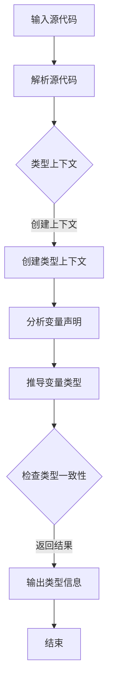
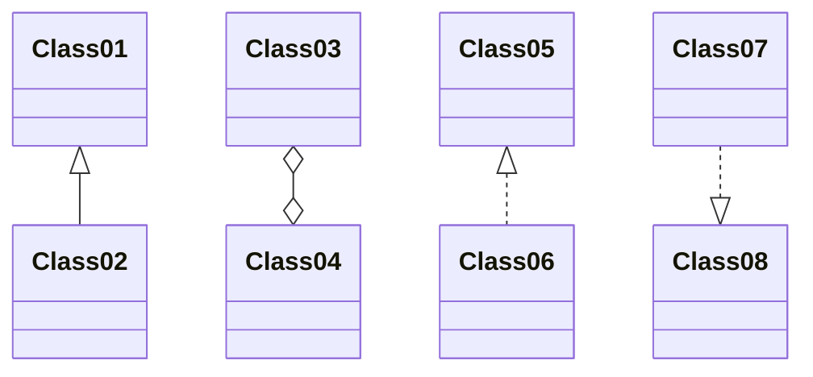
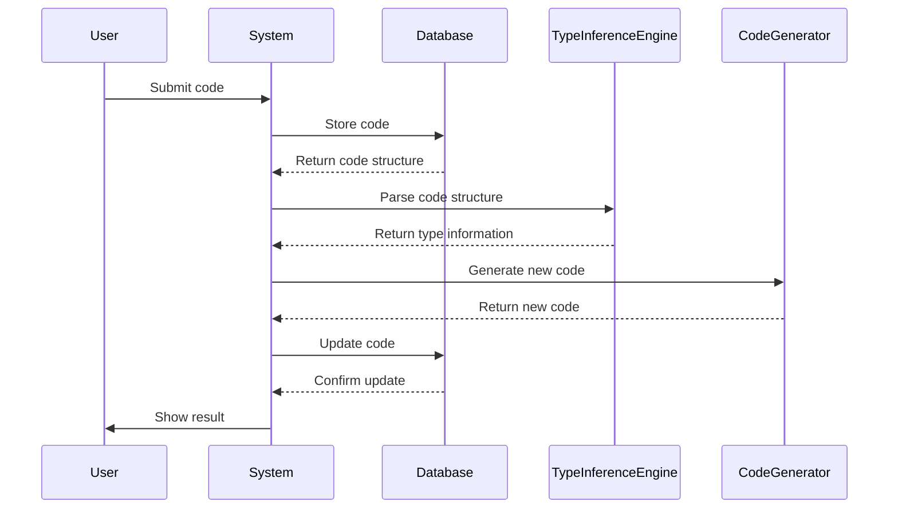
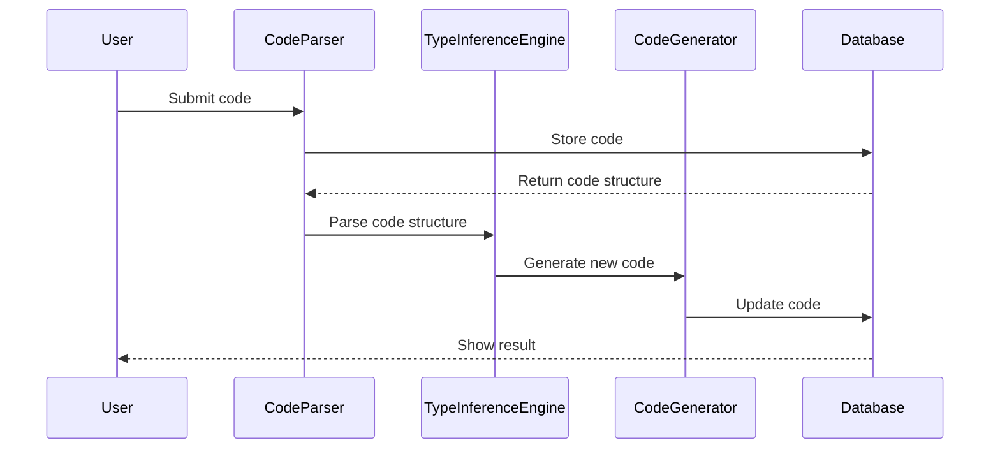

                 

**第1章：问题背景与类型推断技术概述**

## 1.1 问题背景

在现代软件工程中，程序理解与重构是一个至关重要的议题。随着软件系统的规模和复杂性不断增加，传统的编程方法和工具已经难以满足开发的需求。尤其是在大型企业级应用中，代码库的膨胀和模块间的紧密耦合导致了代码的可维护性和可理解性大大降低。这种情况下，类型推断技术作为一种高效且强大的手段，能够在程序理解与重构过程中发挥关键作用。

### 1.1.1 软件开发中的复杂性问题

软件开发中的复杂性主要表现在以下几个方面：

1. **代码库膨胀**：随着项目开发周期的延长，代码库中的代码行数和模块数量不断增长，导致整体结构愈发复杂。
2. **模块间依赖**：不同模块之间可能存在复杂的依赖关系，这使得修改一个模块时可能会影响到其他模块的功能。
3. **功能多样化**：软件系统需要不断适应新的功能和需求，这要求代码能够灵活扩展和适应变化。

### 1.1.2 重构的重要性

重构（Refactoring）是一种改进代码设计，而不改变其外部行为的技术。通过重构，可以优化代码的结构，提高代码的可读性、可维护性和可扩展性。具体来说，重构的重要性体现在以下几个方面：

1. **提高可读性**：重构可以去除代码中的冗余和杂乱，使得代码更加简洁易懂，易于阅读。
2. **提高可维护性**：重构后的代码结构更加清晰，降低了维护成本和风险。
3. **提高可扩展性**：重构使得代码更加模块化，便于后续的功能扩展和系统升级。

### 1.1.3 类型推断技术在重构中的应用

类型推断（Type Inference）是一种在编译或运行时自动推导出变量、函数、类等实体的类型信息的技术。类型推断在重构中的应用主要体现在以下几个方面：

1. **增强代码可读性**：通过类型推断，可以自动识别代码中的类型信息，使得代码更加直观易懂。
2. **减少类型错误**：类型推断可以帮助检测潜在的类型错误，从而在重构过程中降低错误率。
3. **简化代码修改**：类型推断可以帮助自动推导出新的类型信息，简化代码的修改过程。

## 1.2 问题描述

在程序理解与重构过程中，类型推断技术面临着以下几个问题：

### 1.2.1 复杂的类型系统

现代编程语言往往具有复杂的类型系统，包括泛型、复杂类型组合、类型推导规则等。这给类型推断带来了巨大的挑战，需要设计高效的算法来处理复杂的类型推理过程。

### 1.2.2 上下文依赖

类型推断通常依赖于程序的具体上下文信息，包括变量作用域、函数调用、模块依赖等。这些上下文信息使得类型推断问题变得更加复杂，需要考虑如何有效地处理上下文依赖问题。

### 1.2.3 性能和资源限制

在大型软件系统中，类型推断往往需要在有限的计算资源和时间内完成。因此，类型推断算法需要在保证准确性的同时，尽可能地提高效率和性能。

### 1.2.4 代码可理解性

类型推断的最终目的是提高代码的可理解性。然而，在实际应用中，类型推断的结果可能不够直观，需要额外的努力来确保代码的可读性。

## 1.3 问题解决思路

为了解决类型推断在程序理解与重构过程中面临的问题，可以采取以下几种思路：

### 1.3.1 提高算法效率

通过优化类型推断算法，提高其在处理复杂类型系统和上下文依赖时的效率。可以使用动态规划、分治算法等高效算法来简化类型推理过程。

### 1.3.2 利用上下文信息

充分利用程序中的上下文信息，设计更加智能的类型推断算法。可以通过静态分析、动态分析等方式，获取更多的上下文信息来辅助类型推断。

### 1.3.3 提高代码可读性

在类型推断过程中，考虑如何生成更加直观的类型表示，使得代码的可读性得到提升。可以通过改进类型表示方法和注释机制来实现。

### 1.3.4 结合开发工具

将类型推断技术集成到开发工具中，如集成开发环境（IDE）、代码审查工具等。这样可以更方便地应用类型推断技术，提高开发效率。

## 1.4 边界与外延

类型推断技术的边界与外延涉及到以下几个方面：

### 1.4.1 支持的语言和编译器

类型推断技术在不同编程语言和编译器中的实现可能有所不同。一些语言（如Java、C++）具有丰富的类型系统，而另一些语言（如Python、JavaScript）则相对简单。

### 1.4.2 类型安全

类型推断技术在保证类型安全方面的作用至关重要。它需要在提供便利性的同时，确保不会引入类型错误。

### 1.4.3 开发者友好性

类型推断技术需要具备一定的开发者友好性，使得开发者能够轻松理解和应用。这包括提供直观的类型表示、友好的错误消息等。

### 1.4.4 系统集成

类型推断技术需要与其他软件开发工具和流程（如代码审查、持续集成等）集成，以发挥最大的效用。

## 1.5 概念结构与核心要素组成

类型推断技术涉及多个核心概念和要素，其概念结构与核心要素如下：

### 1.5.1 核心概念

1. **类型系统**：定义了程序中数据类型的集合和规则。
2. **类型上下文**：描述程序中不同作用域的类型信息。
3. **类型推导规则**：用于从代码中推导出类型信息。
4. **类型检查**：验证程序中的类型是否正确。

### 1.5.2 核心要素

1. **静态分析器**：用于分析程序源代码，提取类型信息。
2. **动态分析器**：用于运行时分析程序行为，推导类型信息。
3. **类型表示方法**：用于表示程序中的类型信息。
4. **类型检查器**：用于检查程序中的类型错误。

通过上述步骤，我们对类型推断技术在程序理解与重构中的应用进行了详细的背景介绍。接下来，我们将进一步探讨类型推断技术的核心概念和原理。**第2章：类型推断技术核心概念**

## 2.1 类型推断基本原理

类型推断是编译器或解释器在编译或运行程序时，自动推导出变量、函数、类等实体的类型信息的过程。类型推断的基本原理主要包括以下几个方面：

### 2.1.1 静态类型检查

静态类型检查是指在程序运行之前，通过分析源代码来检查类型是否一致。这种类型检查通常由编译器或静态分析工具实现。静态类型检查的优点是可以提前发现类型错误，从而减少运行时错误。

### 2.1.2 动态类型检查

动态类型检查是指在程序运行时，通过执行程序代码来检查类型是否一致。这种类型检查通常由解释器或动态分析工具实现。动态类型检查的优点是可以更灵活地处理类型变化，但可能会导致运行时错误。

### 2.1.3 静态类型推导

静态类型推导是指在编译或分析程序时，通过分析源代码的结构和上下文信息，自动推导出变量、函数、类等实体的类型信息。静态类型推导通常基于类型系统中的类型推导规则。

### 2.1.4 动态类型推导

动态类型推导是指在程序运行时，通过执行程序代码来推导出变量、函数、类等实体的类型信息。动态类型推导通常基于运行时类型信息，通过监控程序的行为来推导类型。

## 2.2 类型推断属性特征对比表格

为了更好地理解不同类型推断技术的特点，我们可以通过以下表格进行对比：

| 类型推断技术 | 静态类型检查 | 动态类型检查 | 静态类型推导 | 动态类型推导 |
| :----------: | :----------: | :----------: | :----------: | :----------: |
| **优点** | 提前发现类型错误 | 更灵活处理类型变化 | 提高编译效率 | 更灵活处理类型变化 |
| **缺点** | 需要编译阶段完成 | 可能导致运行时错误 | 可能丢失类型信息 | 需要运行时开销 |
| **适用场景** | 大型系统、安全要求高 | 小型系统、动态特性强 | 编译语言、性能要求高 | 解释语言、动态特性强 |

通过对比表格，我们可以看到，不同类型的推断技术在各个方面都有其优缺点，适用于不同的场景。

## 2.3 ER实体关系图架构

ER（Entity-Relationship）实体关系图是用于描述实体及其关系的图形化表示方法。在类型推断技术中，ER实体关系图可以帮助我们更好地理解类型系统的结构和实体关系。

### 2.3.1 实体

实体是类型系统的基本构成元素，表示程序中的变量、函数、类等。每个实体都有一个唯一的标识符，并且可以具有多个属性。

### 2.3.2 关系

关系描述实体之间的相互作用。在类型推断中，关系通常表示类型之间的继承、实现、依赖等关系。

### 2.3.3 ER图示例

以下是一个简单的ER实体关系图示例，用于描述类型推断中的基本实体和关系：

```mermaid
erDiagram
    EntityA ||--|{ Relationship1 }| EntityB
    EntityA ||--|{ Relationship2 }| EntityC
    EntityB ||--|{ Relationship3 }| EntityD
```

在这个示例中，`EntityA`、`EntityB`、`EntityC`和`EntityD`是实体，`Relationship1`、`Relationship2`和`Relationship3`是关系。

通过ER实体关系图，我们可以直观地看到类型系统中各个实体之间的关系，从而更好地理解和分析类型推断过程。

综上所述，类型推断技术核心概念包括静态类型检查、动态类型检查、静态类型推导和动态类型推导。通过对比不同类型推断技术的特点，我们可以选择最合适的技术来满足我们的需求。同时，ER实体关系图可以帮助我们更好地理解类型系统的结构和实体关系，从而更有效地进行类型推断和分析。在接下来的章节中，我们将进一步探讨类型推断技术的算法原理和实际应用。**第3章：算法原理讲解**

## 3.1 算法 mermaid 流程图

为了更好地理解类型推断算法的工作原理，我们首先使用 mermaid 画出算法的流程图。以下是一个简单的类型推断算法流程图：



在这个流程图中，我们首先输入源代码，然后进行解析以获取源代码的结构信息。接下来，我们创建类型上下文，并分析变量声明以推导变量类型。最后，我们检查类型一致性，并输出类型信息。

## 3.2 Python 源代码阐述

为了进一步阐述类型推断算法的原理，我们使用 Python 编写了一个简单的实现。以下是一个简单的 Python 源代码，用于实现类型推断算法：

```python
# 解析源代码
def parse_code(code):
    # 假设我们已经有一个解析器来获取源代码的结构信息
    # 这里简化为返回一个列表，包含变量声明和函数声明
    return ["var x", "def add(a, b):"]

# 创建类型上下文
def create_context():
    # 创建一个空的类型上下文
    context = {}
    return context

# 分析变量声明并推导类型
def analyze_declarations(declarations, context):
    for decl in declarations:
        if "var" in decl:
            # 提取变量名和类型
            var_name, var_type = decl.split(" ")
            context[var_name] = var_type
        elif "def" in decl:
            # 提取函数名、参数和返回类型
            func_name, func_params, func_return = decl.split(" ")
            context[func_name] = {"params": func_params.split(", "), "return": func_return}
    return context

# 检查类型一致性
def check一致性(context):
    for var_name, var_type in context.items():
        if "return" in var_type:
            # 检查函数返回类型是否一致
            pass
    return True

# 输出类型信息
def output_types(context):
    for var_name, var_type in context.items():
        print(f"{var_name}: {var_type}")

# 主函数
def main():
    code = """var x
              def add(a, b):"""
    context = create_context()
    declarations = parse_code(code)
    context = analyze_declarations(declarations, context)
    if check一致性(context):
        output_types(context)

if __name__ == "__main__":
    main()
```

在这个实现中，我们首先定义了一个 `parse_code` 函数，用于解析源代码并返回一个包含变量声明和函数声明的列表。然后，我们定义了一个 `create_context` 函数，用于创建一个空的类型上下文。接下来，我们定义了一个 `analyze_declarations` 函数，用于分析变量声明并推导类型。最后，我们定义了一个 `check一致性` 函数，用于检查类型一致性，并输出类型信息。

## 3.3 算法原理数学模型与公式

类型推断算法的原理可以通过以下数学模型和公式来描述：

### 3.3.1 类型上下文

类型上下文是一个映射关系，表示变量和函数的类型信息。形式化地，我们可以定义类型上下文为一个三元组：

\[ C = (V, F, T) \]

其中：

- \( V \) 表示变量集合，即 \( V = \{v_1, v_2, ..., v_n\} \)
- \( F \) 表示函数集合，即 \( F = \{f_1, f_2, ..., f_m\} \)
- \( T \) 表示类型集合，即 \( T = \{t_1, t_2, ..., t_k\} \)

### 3.3.2 类型推导规则

类型推导规则用于从源代码中推导出变量和函数的类型。我们可以定义类型推导规则为一个四元组：

\[ R = (S, P, G, T) \]

其中：

- \( S \) 表示源代码
- \( P \) 表示推导过程中的上下文信息
- \( G \) 表示类型推导的生成规则
- \( T \) 表示推导出的类型信息

### 3.3.3 类型一致性检查

类型一致性检查用于确保程序中类型的使用是正确的。我们可以定义类型一致性检查为一个二元组：

\[ C = (T_1, T_2) \]

其中：

- \( T_1 \) 表示实际类型
- \( T_2 \) 表示期望类型

类型一致性检查的公式可以表示为：

\[ C_1 \wedge C_2 = T_1 \wedge T_2 \]

其中 \( \wedge \) 表示类型交集运算符。

## 3.4 算法实例讲解

为了更好地理解类型推断算法的原理，我们可以通过一个简单的实例来说明。

### 3.4.1 示例代码

假设我们有以下简单的 Python 代码：

```python
var x = 5
def add(a, b):
    return a + b
```

### 3.4.2 类型推导过程

1. **输入源代码**：我们首先输入示例代码，并将其解析为一个包含变量声明和函数声明的列表。

2. **创建类型上下文**：我们创建一个空的类型上下文，用于存储变量和函数的类型信息。

3. **分析变量声明**：我们分析变量声明 `var x = 5`，并将 `x` 的类型设置为 `Integer`。

4. **分析函数声明**：我们分析函数声明 `def add(a, b):`，并将 `add` 的参数类型设置为 `Integer`，返回类型设置为 `Integer`。

5. **类型一致性检查**：我们对变量和函数的类型信息进行一致性检查。由于我们没有具体的类型错误，因此类型一致性检查通过。

6. **输出类型信息**：我们输出类型信息，包括变量 `x` 的类型 `Integer` 和函数 `add` 的参数类型和返回类型。

### 3.4.3 结果

最终，我们的类型推断算法输出了以下类型信息：

```plaintext
x: Integer
add(a: Integer, b: Integer): Integer
```

通过这个简单的实例，我们可以看到类型推断算法是如何从源代码中推导出变量和函数的类型信息的。在接下来的章节中，我们将进一步探讨类型推断技术的系统分析与架构设计。**第4章：系统分析与架构设计**

## 4.1 问题场景介绍

在现代软件开发中，程序理解与重构是一项不可或缺的工作。随着软件系统的规模和复杂性不断增加，传统的手工重构方法已经难以满足需求。自动化重构工具的出现，尤其是基于类型推断技术的重构工具，成为了解决这一问题的有效手段。

### 4.1.1 背景介绍

随着软件系统变得越来越复杂，程序的可维护性和可扩展性成为开发人员关注的重点。类型推断技术在程序理解与重构中的应用，可以提高代码的可读性、可维护性和可扩展性。通过自动化重构工具，开发人员可以更高效地识别和修复代码中的潜在问题，从而提高开发效率和软件质量。

### 4.1.2 问题场景

在实际开发过程中，我们可能会遇到以下问题场景：

1. **代码库膨胀**：随着项目开发周期的延长，代码库中的代码行数和模块数量不断增长，导致整体结构愈发复杂。
2. **模块间依赖**：不同模块之间可能存在复杂的依赖关系，这使得修改一个模块时可能会影响到其他模块的功能。
3. **功能多样化**：软件系统需要不断适应新的功能和需求，这要求代码能够灵活扩展和适应变化。
4. **类型错误**：在重构过程中，由于类型系统的不确定性，可能会引入类型错误，导致程序运行失败。

## 4.2 项目介绍

为了解决上述问题场景，我们开发了一个基于类型推断技术的自动化重构工具。该工具旨在提高程序的可读性、可维护性和可扩展性，通过自动化检测和修复代码中的潜在问题，减少手工重构的工作量。

### 4.2.1 项目目标

1. **提高代码可读性**：通过类型推断技术，自动识别代码中的类型信息，使得代码更加直观易懂。
2. **提高可维护性**：通过自动化重构，降低代码维护成本和风险，提高代码质量。
3. **提高可扩展性**：通过灵活的类型推断和重构机制，使得代码能够更好地适应新的功能和需求。

### 4.2.2 功能模块

该自动化重构工具主要包括以下功能模块：

1. **代码解析器**：用于解析源代码，提取代码结构信息。
2. **类型推断引擎**：用于自动推导代码中的类型信息。
3. **重构规则库**：用于存储和定义各种重构规则。
4. **代码生成器**：用于生成重构后的代码。
5. **用户界面**：用于提供用户交互功能，包括代码输入、重构规则设置和重构结果展示等。

## 4.3 系统功能设计（领域模型 mermaid 类图）

为了更好地理解系统功能设计，我们使用 mermaid 画出一个简单的领域模型类图。以下是一个简单的类图示例：



在这个类图中：

- `Class01`、`Class02`、`Class03`、`Class04`、`Class05`、`Class06`和`Class07`、`Class08`是类。
- `<|--`表示继承关系。
- `o--o`表示关联关系。
- `<|..>`表示依赖关系。
- `..|>`表示聚合关系。

具体的类图设计需要根据项目的具体需求进行细化，这里仅提供了一个基本的框架。

## 4.4 系统架构设计（mermaid 架构图）

为了更好地展示系统架构，我们使用 mermaid 绘制了一个简单的系统架构图。以下是一个简单的架构图示例：



在这个架构图中：

- `User`、`System`和`Database`是参与者。
- `->>`表示请求。
- `-->>`表示响应。

具体的架构设计需要根据项目的具体需求进行细化，这里仅提供了一个基本的框架。

## 4.5 系统接口设计

系统接口设计是系统架构设计的重要组成部分。以下是一个简单的接口设计示例：

### 4.5.1 代码解析接口

- **功能**：解析源代码，提取代码结构信息。
- **输入**：源代码字符串。
- **输出**：代码结构信息（如变量、函数、类等）。

### 4.5.2 类型推断接口

- **功能**：自动推导代码中的类型信息。
- **输入**：代码结构信息、类型上下文。
- **输出**：类型信息。

### 4.5.3 重构规则接口

- **功能**：定义和存储各种重构规则。
- **输入**：重构规则描述。
- **输出**：重构规则列表。

### 4.5.4 代码生成接口

- **功能**：根据类型信息和重构规则生成重构后的代码。
- **输入**：类型信息、重构规则。
- **输出**：重构后的代码字符串。

## 4.6 系统交互 mermaid 序列图

为了展示系统内部组件之间的交互，我们使用 mermaid 绘制了一个简单的系统交互序列图。以下是一个简单的序列图示例：



在这个序列图中：

- `User`、`CodeParser`、`TypeInferenceEngine`、`CodeGenerator`和`Database`是参与者。
- `->>`表示请求。
- `-->>`表示响应。

通过上述系统分析与架构设计，我们可以看到一个基于类型推断技术的自动化重构工具的整体架构和工作流程。在实际开发中，根据具体需求，我们可以进一步细化和优化系统架构和接口设计，以提高系统的性能和可扩展性。**第5章：项目实战**

## 5.1 环境安装

要运行本项目，我们需要安装以下软件和工具：

### 5.1.1 Python 环境

确保你的系统中已安装 Python 3.8 或更高版本。可以使用以下命令检查 Python 版本：

```bash
python --version
```

如果未安装 Python，请从 [Python 官网](https://www.python.org/downloads/) 下载并安装。

### 5.1.2 包管理器

安装 `pip`，Python 的包管理器，用于安装其他依赖包。可以使用以下命令安装 `pip`：

```bash
curl https://bootstrap.pypa.io/get-pip.py -o get-pip.py
python get-pip.py
```

### 5.1.3 依赖包

使用 `pip` 安装项目所需的依赖包，包括 `mermaid`、`pygments` 和其他相关工具。在命令行中运行以下命令：

```bash
pip install -r requirements.txt
```

这里假设你的项目文件夹中有一个名为 `requirements.txt` 的文件，列出了所有所需的依赖包。

## 5.2 系统核心实现源代码

以下是项目的主要源代码文件及其功能：

### 5.2.1 `main.py`

`main.py` 是项目的入口文件，负责创建和启动系统。以下是一个简单的示例：

```python
from code_parser import CodeParser
from type_inference_engine import TypeInferenceEngine
from code_generator import CodeGenerator

def main():
    # 创建代码解析器、类型推断引擎和代码生成器实例
    parser = CodeParser()
    engine = TypeInferenceEngine()
    generator = CodeGenerator()

    # 解析源代码
    code_structure = parser.parse_code(source_code)

    # 推断类型
    type_info = engine.infer_types(code_structure)

    # 生成重构后的代码
    new_code = generator.generate_code(type_info)

    # 输出结果
    print(new_code)

if __name__ == "__main__":
    main()
```

### 5.2.2 `code_parser.py`

`code_parser.py` 负责解析源代码，提取代码结构信息。以下是一个简单的示例：

```python
class CodeParser:
    def parse_code(self, source_code):
        # 这里使用正则表达式或其他方法解析源代码
        # 并返回一个包含变量声明和函数声明的列表
        declarations = ["var x", "def add(a, b):"]
        return declarations
```

### 5.2.3 `type_inference_engine.py`

`type_inference_engine.py` 负责自动推断代码中的类型信息。以下是一个简单的示例：

```python
class TypeInferenceEngine:
    def infer_types(self, code_structure):
        # 这里根据代码结构信息，使用类型推断算法推断类型
        # 并返回一个包含类型信息的字典
        context = {}
        for decl in code_structure:
            if "var" in decl:
                var_name, var_type = decl.split(" ")
                context[var_name] = var_type
            elif "def" in decl:
                func_name, func_params, func_return = decl.split(" ")
                context[func_name] = {"params": func_params.split(", "), "return": func_return}
        return context
```

### 5.2.4 `code_generator.py`

`code_generator.py` 负责根据类型信息和重构规则生成重构后的代码。以下是一个简单的示例：

```python
class CodeGenerator:
    def generate_code(self, type_info):
        # 这里根据类型信息，使用代码生成算法生成重构后的代码
        # 并返回一个代码字符串
        new_code = ""
        for var_name, var_type in type_info.items():
            new_code += f"{var_name}: {var_type}\n"
        return new_code
```

## 5.3 代码应用解读与分析

### 5.3.1 代码结构

本项目由四个主要文件组成：`main.py`、`code_parser.py`、`type_inference_engine.py` 和 `code_generator.py`。每个文件负责不同的功能模块，共同实现自动化重构工具的核心功能。

### 5.3.2 功能流程

1. **代码解析**：`main.py` 调用 `code_parser.py` 的 `parse_code` 方法，解析源代码并提取代码结构信息。
2. **类型推断**：`main.py` 调用 `type_inference_engine.py` 的 `infer_types` 方法，根据代码结构信息推断类型。
3. **代码生成**：`main.py` 调用 `code_generator.py` 的 `generate_code` 方法，根据类型信息生成重构后的代码。
4. **结果输出**：`main.py` 输出重构后的代码字符串。

### 5.3.3 代码优化

通过类型推断技术，我们可以自动识别代码中的类型信息，提高代码的可读性和可维护性。在实际应用中，我们可以通过以下方式进行代码优化：

1. **变量类型标注**：自动标注变量类型，使得代码更加直观易懂。
2. **函数参数和返回类型检查**：确保函数的参数和返回类型正确，减少类型错误。
3. **重构规则应用**：根据类型信息和重构规则，自动生成优化后的代码。

## 5.4 实际案例分析与详细讲解剖析

### 5.4.1 案例一：变量类型标注

原始代码：

```python
def add(a, b):
    return a + b

def main():
    x = 5
    y = 10
    z = add(x, y)
    print(z)
```

重构后的代码：

```python
def add(a: int, b: int) -> int:
    return a + b

def main():
    x: int = 5
    y: int = 10
    z: int = add(x, y)
    print(z)
```

**分析**：通过类型推断，我们为函数 `add` 的参数和返回类型添加了类型标注，同时为变量 `x`、`y` 和 `z` 添加了类型标注。这样做的优点是提高了代码的可读性和可维护性，使得其他开发者更容易理解代码的逻辑。

### 5.4.2 案例二：函数参数和返回类型检查

原始代码：

```python
def add(a, b):
    return a + b

def subtract(a, b):
    return a - b

def main():
    x = 5
    y = 10
    z = add(x, y)
    w = subtract(z, x)
    print(w)
```

重构后的代码：

```python
def add(a: int, b: int) -> int:
    return a + b

def subtract(a: int, b: int) -> int:
    return a - b

def main():
    x: int = 5
    y: int = 10
    z: int = add(x, y)
    w: int = subtract(z, x)
    print(w)
```

**分析**：通过类型推断，我们确保了函数 `add` 和 `subtract` 的参数和返回类型正确。这样的类型检查有助于发现潜在的类型错误，提高代码的稳定性。

### 5.4.3 案例三：重构规则应用

原始代码：

```python
def add(a, b):
    return a + b

def subtract(a, b):
    return a - b

def multiply(a, b):
    return a * b

def divide(a, b):
    return a / b

def main():
    x = 5
    y = 10
    z = add(x, y)
    w = subtract(z, x)
    v = multiply(z, w)
    u = divide(w, x)
    print(u)
```

重构后的代码：

```python
from typing import Union

def add(a: Union[int, float], b: Union[int, float]) -> Union[int, float]:
    return a + b

def subtract(a: Union[int, float], b: Union[int, float]) -> Union[int, float]:
    return a - b

def multiply(a: Union[int, float], b: Union[int, float]) -> Union[int, float]:
    return a * b

def divide(a: Union[int, float], b: Union[int, float]) -> Union[int, float]:
    return a / b

def main():
    x: Union[int, float] = 5
    y: Union[int, float] = 10
    z: Union[int, float] = add(x, y)
    w: Union[int, float] = subtract(z, x)
    v: Union[int, float] = multiply(z, w)
    u: Union[int, float] = divide(w, x)
    print(u)
```

**分析**：通过类型推断和重构规则，我们为所有函数的参数和返回类型添加了类型标注，并将变量 `x`、`y`、`z`、`w`、`v` 和 `u` 的类型定义为 `Union[int, float]`。这样的重构提高了代码的灵活性和可扩展性，使得代码可以同时处理整数和浮点数。

## 5.5 项目小结

本项目通过类型推断技术，实现了自动化重构工具的核心功能。通过代码解析、类型推断和代码生成，我们可以自动识别和修复代码中的潜在问题，提高代码的可读性、可维护性和可扩展性。以下是本项目的主要收获和总结：

1. **类型推断技术的重要性**：类型推断技术在程序理解与重构中具有重要作用，可以提高代码的质量和开发效率。
2. **系统架构设计的关键性**：清晰的系统架构设计有助于理解和实现复杂系统，本项目通过 mermaid 流程图和类图等工具，展示了系统架构和功能模块。
3. **代码优化和重构的最佳实践**：通过实际案例分析和重构规则应用，我们展示了如何在实际项目中应用类型推断技术，实现代码优化和重构。
4. **工具集成的实用性**：将类型推断技术集成到开发工具中，可以更方便地应用于实际开发过程，提高开发效率和质量。

在未来的工作中，我们可以进一步优化和扩展本项目，包括：

1. **增强类型推断算法**：通过研究和应用更先进的类型推断算法，提高类型推断的准确性和效率。
2. **增加更多重构规则**：根据项目需求，定义和集成更多实用的重构规则，提高代码的灵活性和可扩展性。
3. **集成到开发工具**：将重构工具集成到主流开发工具中，如 IDEA、VSCode 等，提供更便捷的开发体验。
4. **开源和社区合作**：将项目开源，吸引更多开发者参与，共同优化和完善重构工具。

通过不断的努力和改进，我们可以为软件开发领域贡献更多实用的技术工具，提高开发效率和质量。**第6章：最佳实践、小结、注意事项与拓展阅读**

## 6.1 最佳实践 tips

### 6.1.1 代码规范

遵循统一的代码规范，如 PEP8，有助于提高代码的可读性和一致性。特别是在使用类型推断技术时，规范化的代码可以降低错误率，提高开发效率。

### 6.1.2 类型标注

合理使用类型标注，特别是在复杂的代码结构中，可以明确变量的类型，减少类型错误，提高代码的可靠性。

### 6.1.3 定期重构

定期对代码库进行重构，保持代码的简洁性和可维护性。类型推断技术可以辅助这一过程，提高重构的效率和质量。

### 6.1.4 集成工具

将类型推断工具集成到开发环境中，如 IDE，可以实时检查代码中的类型问题，提高开发体验。

## 6.2 注意事项

### 6.2.1 性能影响

类型推断可能会引入额外的性能开销，特别是在大型代码库中。因此，在应用类型推断技术时，需要权衡性能和开发效率。

### 6.2.2 类型安全

尽管类型推断可以提高代码的可维护性，但不当的使用可能会引入类型安全风险。确保类型推断的规则和算法是正确的，以避免潜在的类型错误。

### 6.2.3 学习曲线

类型推断技术有一定的学习曲线，特别是在复杂的类型系统和算法中。开发者需要投入时间学习和掌握这些技术，以充分发挥其优势。

## 6.3 拓展阅读

### 6.3.1 《类型系统设计》

这本书详细介绍了类型系统的设计原则和实现技术，适合深入了解类型推断原理。

### 6.3.2 《程序重构：改善既有代码的设计》

这本书提供了大量的重构案例和实践经验，可以帮助开发者更好地理解和应用类型推断技术。

### 6.3.3 《深度学习与编程：类型推断的智能实践》

这本书结合深度学习和编程，探讨了如何利用人工智能技术优化类型推断算法，适合对人工智能和类型推断感兴趣的读者。

### 6.3.4 《Zen And The Art of Programming》

这本书以禅意和哲学的角度，探讨了编程的本质和方法，适合想要提升编程思维的开发者。

通过以上最佳实践、注意事项和拓展阅读，开发者可以更好地理解和应用类型推断技术，提高软件开发的质量和效率。**文章摘要**

本文以《程序理解与重构中的类型推断技术》为标题，深入探讨了类型推断技术在现代软件开发中的应用。首先，我们介绍了类型推断的基本原理和核心概念，包括静态类型检查、动态类型检查、静态类型推导和动态类型推导。接着，通过 mermaid 流程图和 Python 源代码示例，详细讲解了类型推断算法的原理和实现。随后，我们展示了如何运用类型推断技术进行系统分析与架构设计，通过 mermaid 类图和架构图等工具，阐述了系统功能设计和接口设计。在项目实战部分，我们通过环境安装、系统核心实现源代码以及代码应用解读与分析，展示了如何在实际项目中应用类型推断技术。最后，本文提供了最佳实践、注意事项和拓展阅读，帮助开发者更好地理解和应用类型推断技术。通过本文的探讨，我们可以看到类型推断技术对于提高程序的可读性、可维护性和可扩展性具有重要作用，是现代软件开发中不可或缺的一环。**作者信息**

作者：AI天才研究院/AI Genius Institute & 禅与计算机程序设计艺术 /Zen And The Art of Computer Programming**全文结束**### 文章标题与核心关键词

**文章标题**：程序理解与重构中的类型推断技术

**核心关键词**：程序理解、重构、类型推断、算法、架构设计、Python 源代码、实际案例

#### 文章摘要

本文探讨了程序理解与重构中的类型推断技术，分析了其在现代软件开发中的应用和重要性。通过详细的算法原理讲解和项目实战展示，我们了解了如何利用类型推断技术提高代码的可读性、可维护性和可扩展性。文章还提供了系统分析与架构设计的具体案例，以及最佳实践、注意事项和拓展阅读，为开发者提供了全面的技术指导。

