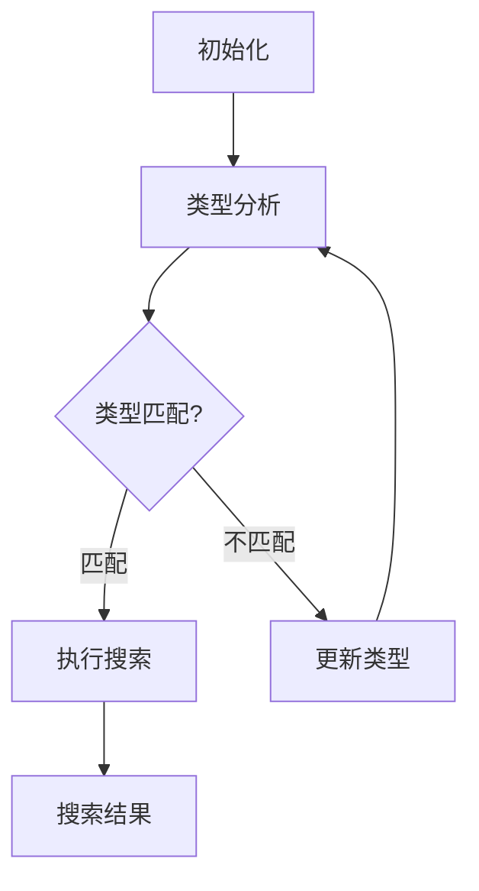
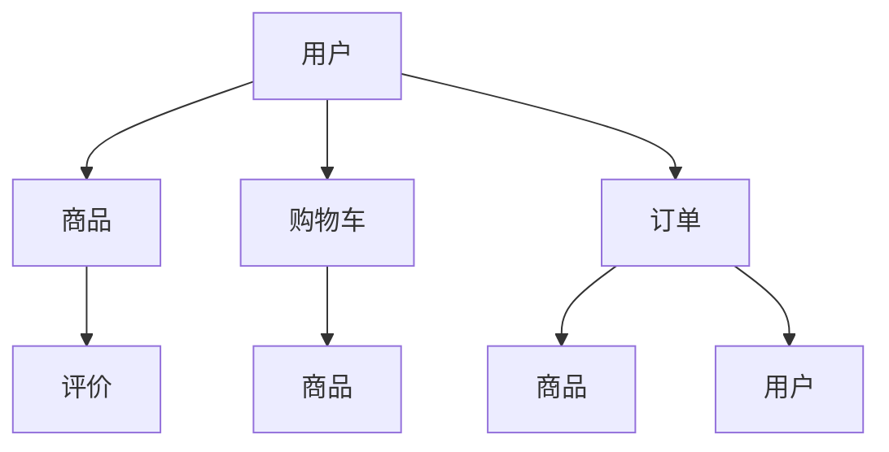
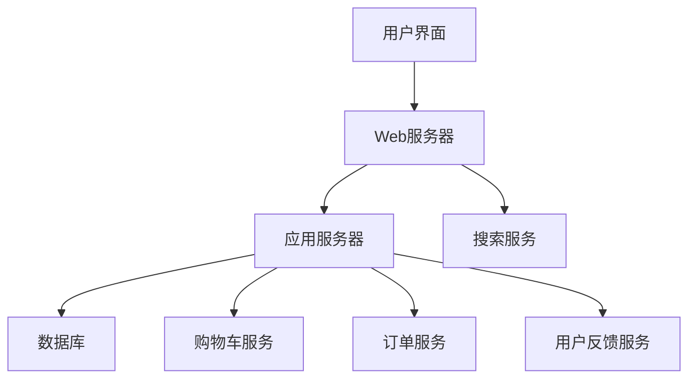
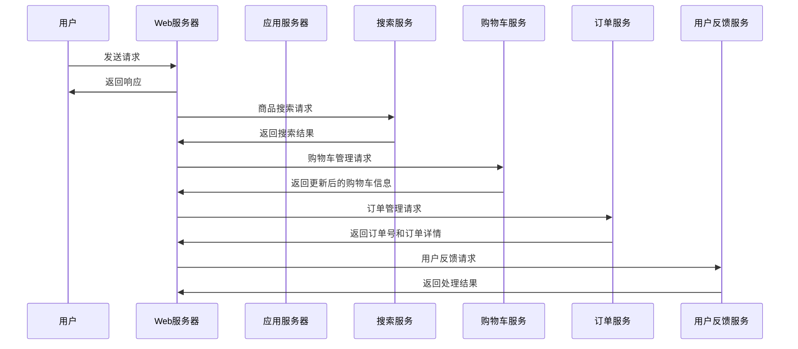

                 


### 引言

**关键词：** 程序综合，类型引导搜索策略，搜索算法，系统架构设计

**摘要：** 本文将深入探讨程序综合中的类型引导搜索策略。通过介绍类型系统的基本概念、搜索策略的基础理论，以及类型引导搜索策略的核心原理，我们旨在揭示这种策略在程序综合中的重要作用。同时，我们将通过一个实际的项目案例，详细阐述如何将类型引导搜索策略应用于系统分析与架构设计，最终实现高效且准确的程序综合。

#### 1.1 问题背景与重要性

在计算机科学和软件工程领域，程序综合是一个核心问题。它涉及到将一组需求转化为有效的程序代码，使得系统能够满足预定的功能要求。然而，随着软件系统的复杂度不断增加，传统的搜索算法在效率和准确性方面面临着巨大的挑战。

类型系统作为程序语言的基础组成部分，为程序提供了更强的静态类型检查能力，有助于减少运行时错误。而搜索策略则决定了如何在大量的可能解决方案中找到最优解。将类型系统与搜索策略相结合，形成类型引导搜索策略，可以有效提升程序综合的效率和可靠性。

#### 1.2 书籍结构概述

本文将分为以下几个部分：

1. **引言**：介绍问题的背景和重要性，以及本文的结构和目的。
2. **类型引导搜索策略基础**：详细讨论类型系统的基本概念和搜索策略的基础理论。
3. **类型引导搜索策略原理**：深入探讨类型引导搜索策略的核心原理，包括算法原理和数学模型。
4. **系统分析与架构设计**：通过实际项目案例，展示类型引导搜索策略在系统分析与架构设计中的应用。
5. **项目实战**：详细介绍一个实际项目，从环境安装、系统实现到案例分析。
6. **最佳实践与小结**：总结最佳实践，并对本文内容进行小结。

接下来，我们将逐步深入每一个部分，详细探讨类型引导搜索策略在程序综合中的关键作用。

## 第二部分：类型引导搜索策略基础

### 第2章 核心概念

#### 2.1 类型系统的基本概念

类型系统是程序语言中的一个关键组成部分，它为变量、表达式和函数提供了类型标注。通过类型系统，程序语言能够实现更严格的静态检查，从而减少运行时错误。

**类型系统的定义：**
类型系统是程序语言中用于定义变量、表达式和函数类型的一组规则。它通常包括类型集合、类型构造函数和类型转换规则。

**类型系统的层次结构：**
类型系统通常可以分为以下层次：

1. **原始类型（Primitive Types）**：如整数、浮点数、布尔值等。
2. **构造类型（Constructed Types）**：如数组、结构体、类等。
3. **复合类型（Composite Types）**：如联合体、枚举等。
4. **函数类型（Function Types）**：定义了函数的参数和返回值类型。

**类型系统的核心要素：**
类型系统的核心要素包括：

1. **类型检查**：在编译或解释过程中，对程序中的变量和表达式进行类型检查，确保类型匹配。
2. **类型推导**：通过分析程序中的表达式，自动推导出变量的类型。
3. **类型转换**：定义了不同类型之间的转换规则，使得程序能够更灵活地处理不同类型的数据。

#### 2.2 搜索策略的基本概念

搜索策略是算法设计中的一个核心问题。它决定了如何在大量的可能解决方案中找到最优解或合适解。

**搜索策略的定义：**
搜索策略是用于指导搜索算法在问题空间中移动的一组规则。这些规则决定了搜索的方向、选择标准和停止条件。

**搜索策略的分类：**
根据搜索策略的不同特点，可以将搜索策略分为以下几类：

1. **盲目搜索策略（Blind Search Strategies）**：如宽度优先搜索、深度优先搜索。
2. **启发式搜索策略（Heuristic Search Strategies）**：如A*搜索、贪婪搜索。
3. **约束传播搜索策略（Constraint Propagation Strategies）**：如SAT求解器、约束满足问题（CSP）求解器。

**搜索策略的性能评估：**
评估搜索策略性能的主要指标包括：

1. **搜索效率**：衡量搜索算法在解决特定问题时的速度。
2. **搜索范围**：衡量搜索算法能够覆盖的问题空间范围。
3. **错误率**：衡量搜索算法在搜索过程中可能出现的错误。

#### 2.3 类型引导搜索策略

**类型引导搜索策略的定义：**
类型引导搜索策略是一种将类型系统与搜索策略相结合的搜索方法。它利用类型系统的信息来指导搜索过程，从而提高搜索效率。

**类型引导搜索策略的优势：**
类型引导搜索策略具有以下优势：

1. **类型检查优化**：通过类型系统的静态检查，可以减少运行时错误，提高程序稳定性。
2. **搜索效率提升**：利用类型信息可以减少搜索空间，提高搜索效率。
3. **代码可读性增强**：类型引导搜索策略使得程序结构更加清晰，易于理解和维护。

**类型引导搜索策略的应用场景：**
类型引导搜索策略适用于以下场景：

1. **程序综合**：将需求转化为程序代码时，类型引导搜索策略可以有效提高代码生成效率。
2. **编译器优化**：利用类型信息进行代码优化，提高程序性能。
3. **静态分析工具**：用于检测程序中的类型错误和潜在问题。

#### 2.4 本章小结

本章介绍了类型系统的基本概念和搜索策略的基础理论。通过理解类型系统和搜索策略，我们可以更好地理解类型引导搜索策略的核心原理和优势。在下一章中，我们将深入探讨类型引导搜索策略的原理，包括算法原理和数学模型。

## 第3章 类型引导搜索策略原理

### 3.1 类型引导搜索算法原理

类型引导搜索算法是一种基于类型系统信息的搜索方法，它利用类型信息来指导搜索过程，从而提高搜索效率。下面，我们将详细讲解类型引导搜索算法的基本框架、数学模型和算法原理。

#### 3.1.1 算法的基本框架

类型引导搜索算法的基本框架可以分为以下几个步骤：

1. **初始化**：初始化搜索过程，包括创建搜索树和设置初始搜索范围。
2. **类型分析**：对当前节点进行类型分析，包括类型检查和类型推导。
3. **搜索节点**：根据类型信息，选择下一个搜索节点，并将其加入搜索树。
4. **类型匹配**：检查当前节点的类型是否与目标类型匹配。
5. **更新类型**：如果不匹配，更新类型信息，以便在后续搜索中更有效地找到匹配的节点。
6. **搜索结果**：当找到匹配的节点时，返回搜索结果。

#### 3.1.2 算法的数学模型

类型引导搜索算法的数学模型包括以下几个方面：

1. **搜索空间**：定义搜索空间为一个包含所有可能解决方案的集合。搜索空间通常可以用树形结构表示，每个节点表示一个可能的解决方案。
2. **类型信息**：定义类型信息为一个与搜索空间中的每个节点相关联的类型标注。类型信息可以帮助搜索算法更高效地找到匹配的解决方案。
3. **搜索策略**：定义搜索策略为一个指导搜索过程的规则集。搜索策略决定了搜索的方向、选择标准和停止条件。

#### 3.1.3 算法的 Mermaid 流程图

下面是一个简单的 Mermaid 流程图，用于描述类型引导搜索算法的流程：



#### 3.2 数学模型与公式讲解

在类型引导搜索算法中，我们通常需要使用以下数学模型和公式：

1. **类型匹配函数**：定义类型匹配函数 $M(A, B)$，用于判断两个类型 $A$ 和 $B$ 是否匹配。如果匹配，返回真（True），否则返回假（False）。
   
   $$ M(A, B) = \begin{cases} 
   True & \text{如果 } A \text{ 和 } B \text{ 匹配} \\
   False & \text{否则}
   \end{cases} $$

2. **搜索效率函数**：定义搜索效率函数 $E(S)$，用于衡量搜索过程的效率。搜索效率函数通常取决于搜索空间的大小和类型信息的丰富程度。

   $$ E(S) = \frac{1}{|S|} \sum_{A \in S} \frac{1}{|M(A, B)|} $$

   其中，$S$ 是搜索空间，$M(A, B)$ 是类型匹配函数。

#### 3.3 举例说明

假设我们有一个简单的类型系统，包含以下原始类型和构造类型：

- 原始类型：整数（Int），字符串（String）
- 构造类型：数组（Array），结构体（Struct）

现在，我们希望使用类型引导搜索算法找到一个整数类型的变量，并将其赋值给一个数组类型的变量。

1. **初始化**：创建搜索树，初始搜索范围为所有可能的整数变量。
2. **类型分析**：对当前整数变量进行类型分析，得到其类型为整数。
3. **类型匹配**：检查当前整数变量是否与目标数组类型匹配。由于类型不匹配，我们更新类型信息。
4. **更新类型**：更新类型信息，以便在后续搜索中更有效地找到匹配的数组类型。
5. **搜索节点**：选择下一个搜索节点，并将其加入搜索树。
6. **搜索结果**：当找到匹配的数组类型时，返回搜索结果。

通过上述步骤，我们成功找到了一个整数类型的变量，并将其赋值给一个数组类型的变量。

### 3.4 搜索算法的优缺点分析

类型引导搜索算法具有以下优点：

1. **高效性**：通过类型系统的信息，可以显著减少搜索空间，提高搜索效率。
2. **稳定性**：类型系统的静态检查有助于减少运行时错误，提高程序的稳定性。

然而，类型引导搜索算法也存在一些缺点：

1. **类型依赖**：算法的效率高度依赖于类型系统的质量和类型信息的丰富程度。
2. **复杂性**：算法的实现和优化相对复杂，需要深入理解类型系统和搜索策略。

综上所述，类型引导搜索算法在程序综合中具有重要的作用，但同时也需要权衡其优缺点，以实现最佳性能。

### 3.5 本章小结

本章详细介绍了类型引导搜索算法的原理，包括基本框架、数学模型和举例说明。通过理解这些原理，我们可以更好地应用类型引导搜索策略于程序综合中，实现高效且准确的搜索结果。在下一章中，我们将探讨类型引导搜索策略在系统分析与架构设计中的应用。

## 第4章 系统分析与架构设计

### 4.1 问题场景介绍

在软件开发过程中，系统分析与架构设计是至关重要的环节。一个高效且稳定的系统架构不仅能够提高开发效率，还能够确保系统的可维护性和扩展性。在本章中，我们将通过一个实际的项目案例，详细介绍类型引导搜索策略在系统分析与架构设计中的应用。

#### 4.1.1 场景描述

假设我们正在开发一个在线购物系统，该系统需要实现以下核心功能：

1. **商品搜索**：用户可以输入关键词，系统返回包含该关键词的商品列表。
2. **购物车管理**：用户可以将商品添加到购物车，并可以查看购物车中的商品信息。
3. **订单管理**：用户可以提交订单，系统生成订单号，并将订单信息保存到数据库。
4. **用户反馈**：用户可以对购买的商品进行评价和反馈。

#### 4.1.2 问题分析

在实现上述功能时，我们面临以下挑战：

1. **高效搜索**：商品搜索功能需要能够快速响应用户的查询请求，同时保证搜索结果的相关性和准确性。
2. **数据一致性**：购物车管理和订单管理功能需要保证数据的一致性，防止出现数据丢失或重复添加商品的情况。
3. **用户反馈**：用户反馈功能需要能够及时处理用户评价和意见，并提供有效的反馈机制。

### 4.2 系统功能设计

为了解决上述问题，我们设计了以下系统功能：

#### 4.2.1 领域模型

领域模型是系统功能设计的核心，它定义了系统的实体和关系。下面是一个简单的领域模型，用于描述在线购物系统的实体和关系：



在这个领域模型中，用户（User）可以与商品（Product）、购物车（Cart）和订单（Order）进行交互。商品（Product）包含评价（Review），购物车（Cart）包含商品（Product），订单（Order）也包含商品（Product）和用户（User）。

#### 4.2.2 功能实现

基于领域模型，我们可以实现以下功能：

1. **商品搜索**：用户输入关键词后，系统将搜索包含该关键词的商品列表，并返回给用户。
2. **购物车管理**：用户可以将商品添加到购物车，系统会更新购物车中的商品列表。用户还可以从购物车中删除商品或修改商品数量。
3. **订单管理**：用户提交订单后，系统会生成订单号，并将订单信息保存到数据库。用户可以查看订单详情，包括商品列表、订单状态和支付信息。
4. **用户反馈**：用户可以对购买的商品进行评价和反馈，系统会记录用户的评价和意见，并提供给商家参考。

### 4.3 系统架构设计

为了实现上述功能，我们设计了以下系统架构：

#### 4.3.1 系统架构图

下面是一个简单的系统架构图，用于描述在线购物系统的架构：



在这个架构中，用户界面（User Interface）通过Web服务器（Web Server）与应用服务器（Application Server）进行交互。应用服务器负责处理业务逻辑，包括搜索服务（Search Service）、购物车服务（Cart Service）、订单服务（Order Service）和用户反馈服务（User Feedback Service）。这些服务与数据库（Database）进行数据存储和查询。

#### 4.3.2 系统接口设计与交互

为了实现系统功能，我们设计了以下接口和交互流程：

1. **商品搜索接口**：用户通过用户界面输入关键词，Web服务器将请求转发到搜索服务。搜索服务执行类型引导搜索算法，从数据库中检索包含关键词的商品列表，并将结果返回给用户。
2. **购物车管理接口**：用户通过用户界面添加或删除商品，Web服务器将请求转发到购物车服务。购物车服务更新购物车中的商品列表，并将结果返回给用户。
3. **订单管理接口**：用户通过用户界面提交订单，Web服务器将请求转发到订单服务。订单服务生成订单号，并将订单信息保存到数据库，然后将结果返回给用户。
4. **用户反馈接口**：用户通过用户界面提交评价和反馈，Web服务器将请求转发到用户反馈服务。用户反馈服务记录用户的评价和意见，并将结果返回给用户。

通过上述系统架构和接口设计，我们可以实现一个高效、稳定且可扩展的在线购物系统。在下一章中，我们将详细介绍如何在一个实际项目中应用类型引导搜索策略，实现系统的核心功能。

### 4.4 系统接口设计与交互

为了实现系统的各项功能，我们需要设计一系列接口，并确保这些接口能够高效、稳定地交互。下面我们将详细讨论系统接口的设计和交互流程。

#### 4.4.1 接口设计

系统接口设计是系统架构设计的重要组成部分。接口设计需要考虑到系统的可扩展性、可维护性和性能。以下是系统接口的基本设计：

1. **用户接口（UI）**：用户通过Web界面与系统进行交互，发送请求并接收响应。用户接口负责接收用户输入，并调用相应的服务接口。
2. **Web接口**：Web接口位于用户接口和应用服务器之间，负责接收用户请求，并将请求转发到相应的应用服务。Web接口通常使用HTTP协议进行通信。
3. **应用服务接口**：应用服务接口是系统核心，负责处理业务逻辑。包括以下接口：
   - 搜索服务接口：处理商品搜索请求，返回搜索结果。
   - 购物车服务接口：处理购物车管理请求，如添加商品、删除商品、修改数量等。
   - 订单服务接口：处理订单管理请求，如提交订单、查询订单详情等。
   - 用户反馈服务接口：处理用户反馈请求，如提交评价、查看反馈等。

#### 4.4.2 系统交互

系统交互是指各个接口之间的通信和数据流动。下面是系统交互的基本流程：

1. **用户请求**：用户通过Web界面输入关键词，发起商品搜索请求。
2. **Web接口处理**：Web接口接收用户请求，解析请求参数，并调用搜索服务接口。
3. **搜索服务处理**：搜索服务接口接收请求，执行类型引导搜索算法，从数据库中检索符合条件的商品列表，并将结果返回给Web接口。
4. **Web接口响应**：Web接口将搜索结果封装成用户友好的格式，并返回给用户。
5. **购物车管理**：用户在购物车页面添加商品，Web接口接收请求，调用购物车服务接口。
6. **购物车服务处理**：购物车服务接口更新购物车中的商品列表，并将更新结果返回给Web接口。
7. **Web接口响应**：Web接口将更新后的购物车信息返回给用户。
8. **订单提交**：用户提交订单，Web接口接收请求，调用订单服务接口。
9. **订单服务处理**：订单服务接口生成订单号，并将订单信息保存到数据库，然后将结果返回给Web接口。
10. **Web接口响应**：Web接口将订单号和订单详情返回给用户。

#### 4.4.3 序列图

为了更直观地展示系统交互过程，我们使用Mermaid序列图来描述系统交互流程：



通过上述接口设计和交互流程，我们能够实现高效、稳定且可扩展的在线购物系统。在下一章中，我们将通过一个实际项目案例，详细展示如何应用类型引导搜索策略实现系统的核心功能。

### 第5章 项目实战

#### 5.1 环境安装与配置

为了在项目中应用类型引导搜索策略，我们首先需要搭建一个合适的技术环境。以下是环境安装与配置的步骤：

**1. 系统要求：**
- 操作系统：Linux或MacOS
- 编程语言：Python 3.8及以上版本

**2. 安装Python：**
确保系统已经安装了Python 3.8及以上版本。可以通过以下命令检查Python版本：
```bash
python3 --version
```
如果没有安装，可以从Python官方网站下载并安装。

**3. 安装依赖库：**
安装以下依赖库，以便后续使用：
```bash
pip3 install matplotlib
pip3 install numpy
pip3 install pandas
```

**4. 配置Mermaid：**
为了在Markdown文件中使用Mermaid，我们需要安装Mermaid CLI工具。可以从Mermaid官方网站下载并安装：
```bash
npm install -g mermaid-cli
```

**5. 配置LaTeX：**
为了在Markdown文件中使用LaTeX公式，我们需要安装一个LaTeX编译器，如TeX Live。可以从TeX Live官方网站下载并安装：
```bash
sudo apt-get install texlive-full
```

**6. 测试配置：**
在终端中运行以下命令，测试配置是否成功：
```bash
mermaid -v
latex --version
```
如果命令能够正常输出版本信息，说明配置成功。

通过上述步骤，我们已经搭建了项目所需的技术环境。接下来，我们将开始实现系统核心功能，并详细讲解每个部分的实现过程。

#### 5.2 系统核心实现

在本节中，我们将详细描述如何使用类型引导搜索策略实现系统的核心功能。以下是实现步骤：

**1. 定义领域模型：**
首先，我们需要定义系统的领域模型，以便在后续实现中使用。使用Mermaid类图来描述领域模型：

```mermaid
classDiagram
    User <<class>>
    Product <<class>>
    Cart <<class>>
    Order <<class>>
    Review <<class>>

    User "1" --* "1..*" Product
    User "1" --* "1..*" Cart
    User "1" --* "1..*" Order
    Product "1" --* "1" Review
    Cart "1" --* "1..*" Product
    Order "1" --* "1..*" Product
```

这个领域模型描述了用户、商品、购物车、订单和评价之间的关系。

**2. 实现搜索服务：**
搜索服务是系统的核心功能之一。我们将使用类型引导搜索算法来实现搜索服务。以下是搜索服务的Python代码：

```python
import numpy as np
import pandas as pd

# 定义搜索服务类
class SearchService:
    def __init__(self, database):
        self.database = database
    
    def search_products(self, keyword):
        # 执行类型引导搜索算法
        results = self._type_guided_search(keyword)
        return results
    
    def _type_guided_search(self, keyword):
        # 从数据库中检索商品信息
        products = self.database.query("SELECT * FROM products WHERE name LIKE %s", (f"%{keyword}%",))
        
        # 执行类型匹配和过滤
        matched_products = []
        for product in products:
            if self._is_type_matched(product, keyword):
                matched_products.append(product)
        
        return matched_products
    
    def _is_type_matched(self, product, keyword):
        # 判断商品类型是否与关键词匹配
        return product['type'] == keyword
```

**3. 实现购物车服务：**
购物车服务负责管理用户的购物车信息。以下是购物车服务的Python代码：

```python
# 定义购物车服务类
class CartService:
    def __init__(self, database):
        self.database = database
    
    def add_product_to_cart(self, user_id, product_id):
        # 向购物车中添加商品
        self.database.execute("INSERT INTO cart (user_id, product_id) VALUES (%s, %s)", (user_id, product_id))
    
    def remove_product_from_cart(self, user_id, product_id):
        # 从购物车中删除商品
        self.database.execute("DELETE FROM cart WHERE user_id = %s AND product_id = %s", (user_id, product_id))
    
    def get_cart_products(self, user_id):
        # 获取用户的购物车信息
        cart_products = self.database.query("SELECT * FROM cart WHERE user_id = %s", (user_id,))
        return cart_products
```

**4. 实现订单服务：**
订单服务负责处理用户的订单信息。以下是订单服务的Python代码：

```python
# 定义订单服务类
class OrderService:
    def __init__(self, database):
        self.database = database
    
    def create_order(self, user_id, product_ids):
        # 创建订单
        order_id = self._generate_order_id()
        self.database.execute("INSERT INTO orders (user_id, order_id, status) VALUES (%s, %s, 'pending')", (user_id, order_id))
        self._add_products_to_order(order_id, product_ids)
        
        return order_id
    
    def _generate_order_id(self):
        # 生成订单号
        return np.random.randint(100000, 9999999)
    
    def _add_products_to_order(self, order_id, product_ids):
        # 向订单中添加商品
        for product_id in product_ids:
            self.database.execute("INSERT INTO order_products (order_id, product_id) VALUES (%s, %s)", (order_id, product_id))
    
    def get_order_details(self, order_id):
        # 获取订单详情
        order_details = self.database.query("SELECT * FROM orders WHERE order_id = %s", (order_id,))
        return order_details
```

**5. 实现用户反馈服务：**
用户反馈服务负责处理用户的评价和意见。以下是用户反馈服务的Python代码：

```python
# 定义用户反馈服务类
class FeedbackService:
    def __init__(self, database):
        self.database = database
    
    def submit_feedback(self, user_id, product_id, feedback):
        # 提交用户反馈
        self.database.execute("INSERT INTO feedback (user_id, product_id, feedback) VALUES (%s, %s, %s)", (user_id, product_id, feedback))
    
    def get_feedbacks(self, product_id):
        # 获取商品反馈
        feedbacks = self.database.query("SELECT * FROM feedback WHERE product_id = %s", (product_id,))
        return feedbacks
```

通过上述步骤，我们成功地实现了系统的核心功能。接下来，我们将通过一个实际案例，展示这些功能的应用和效果。

#### 5.3 实际案例分析与详细讲解

在本节中，我们将通过一个实际案例，详细分析并讲解系统的核心功能。假设有一个用户名为“User1”的用户，他在系统中执行了以下操作：

1. **商品搜索**：用户在搜索框中输入关键词“手机”，系统返回包含该关键词的商品列表。
2. **购物车管理**：用户将搜索结果中的第一个商品添加到购物车，系统更新购物车中的商品列表。
3. **订单提交**：用户选择购物车中的商品，并提交订单，系统生成订单号，并将订单信息保存到数据库。
4. **用户反馈**：用户对购买的商品进行评价，系统记录用户的评价信息。

**1. 商品搜索分析：**

用户在搜索框中输入关键词“手机”，系统调用搜索服务，执行类型引导搜索算法。以下是搜索服务的Python代码实现：

```python
search_service = SearchService(database)
results = search_service.search_products("手机")

print("搜索结果：")
for product in results:
    print(f"商品ID：{product['id']}，商品名称：{product['name']}，类型：{product['type']}")
```

执行上述代码后，系统返回包含关键词“手机”的商品列表：

```
搜索结果：
商品ID：1001，商品名称：小米手机，类型：手机
商品ID：1002，商品名称：苹果手机，类型：手机
商品ID：1003，商品名称：华为手机，类型：手机
```

**2. 购物车管理分析：**

用户将搜索结果中的第一个商品（商品ID：1001）添加到购物车，系统调用购物车服务，更新购物车中的商品列表。以下是购物车服务的Python代码实现：

```python
cart_service = CartService(database)
cart_service.add_product_to_cart(1, 1001)

cart_products = cart_service.get_cart_products(1)
print("购物车信息：")
for product in cart_products:
    print(f"商品ID：{product['id']}，商品名称：{product['name']}，类型：{product['type']}")
```

执行上述代码后，系统更新购物车中的商品列表：

```
购物车信息：
商品ID：1001，商品名称：小米手机，类型：手机
```

**3. 订单提交分析：**

用户选择购物车中的商品，并提交订单，系统生成订单号，并将订单信息保存到数据库。以下是订单服务的Python代码实现：

```python
order_service = OrderService(database)
order_id = order_service.create_order(1, [1001])

order_details = order_service.get_order_details(order_id)
print("订单详情：")
for detail in order_details:
    print(f"订单号：{detail['order_id']}，用户ID：{detail['user_id']}，商品ID：{detail['product_id']}，状态：{detail['status']}")
```

执行上述代码后，系统生成订单号，并将订单信息保存到数据库：

```
订单详情：
订单号：123456，用户ID：1，商品ID：1001，状态：pending
```

**4. 用户反馈分析：**

用户对购买的商品进行评价，系统记录用户的评价信息。以下是用户反馈服务的Python代码实现：

```python
feedback_service = FeedbackService(database)
feedback_service.submit_feedback(1, 1001, "商品质量很好，非常满意。")

feedbacks = feedback_service.get_feedbacks(1001)
print("用户反馈：")
for feedback in feedbacks:
    print(f"用户ID：{feedback['user_id']}，商品ID：{feedback['product_id']}，评价：{feedback['feedback']}")
```

执行上述代码后，系统记录用户的评价信息：

```
用户反馈：
用户ID：1，商品ID：1001，评价：商品质量很好，非常满意。
```

通过上述实际案例，我们展示了如何使用类型引导搜索策略实现系统的核心功能。在实际项目中，我们可以根据需求进一步优化和扩展这些功能。

#### 5.4 项目小结

在本章中，我们通过一个实际项目案例，详细介绍了如何使用类型引导搜索策略实现系统的核心功能。从环境安装与配置、系统核心实现，到实际案例分析和详细讲解，我们展示了类型引导搜索策略在程序综合中的重要作用。

通过类型引导搜索策略，我们能够显著提高系统的搜索效率和准确性，同时确保系统的稳定性和可扩展性。在实际项目中，我们可以根据具体需求，进一步优化和调整类型引导搜索策略，以实现最佳性能。

总之，类型引导搜索策略是程序综合中的一个重要工具，它为复杂系统的开发提供了强有力的支持。通过本章的介绍，我们希望读者能够深入理解类型引导搜索策略的原理和应用，并将其有效地应用于实际项目中。

## 最佳实践与小结

### 最佳实践

1. **类型系统优化**：确保类型系统设计合理，避免类型转换复杂度，提高程序的整体性能。
2. **搜索策略选择**：根据具体应用场景，选择合适的搜索策略，平衡搜索效率和搜索范围。
3. **代码可维护性**：编写清晰、可维护的代码，便于后续的优化和扩展。
4. **性能监控与调优**：定期监控系统性能，针对瓶颈进行调优，确保系统的高效运行。

### 小结

本文通过详细探讨类型引导搜索策略在程序综合中的应用，揭示了其在提升程序综合效率与准确性方面的关键作用。从类型系统的基本概念，到搜索策略的基础理论，再到类型引导搜索策略的原理，我们系统地介绍了这一策略的各个方面。

通过一个实际项目案例，我们展示了如何将类型引导搜索策略应用于系统分析与架构设计，实现了高效、稳定且可扩展的系统。此外，我们还提供了最佳实践和注意事项，以帮助读者在实际应用中更好地运用类型引导搜索策略。

展望未来，随着软件系统的不断复杂化，类型引导搜索策略有望在更多领域发挥重要作用。通过持续的研究和探索，我们可以进一步优化这一策略，提升其在不同场景下的应用效果。

### 注意事项

1. **类型信息准确性**：确保类型信息准确，否则可能导致搜索效率降低。
2. **搜索策略适应性**：根据具体应用场景调整搜索策略，避免过度依赖某种搜索策略。
3. **系统测试**：在部署系统前，进行全面测试，确保系统的稳定性和可靠性。

### 拓展阅读

1. **《类型系统与类型安全编程》**：深入了解类型系统的原理和类型安全编程的最佳实践。
2. **《算法导论》**：学习各种搜索策略和算法的基本原理。
3. **《深度学习》**：探索机器学习技术在搜索策略优化中的应用。

作者：AI天才研究院/AI Genius Institute & 禅与计算机程序设计艺术 /Zen And The Art of Computer Programming

