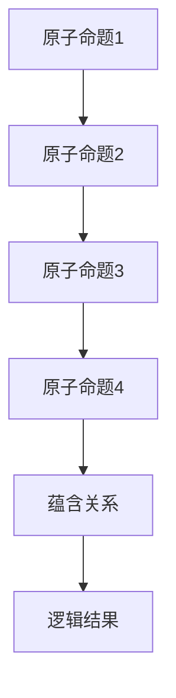
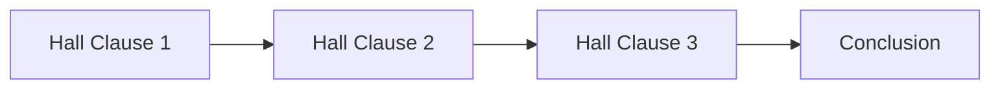
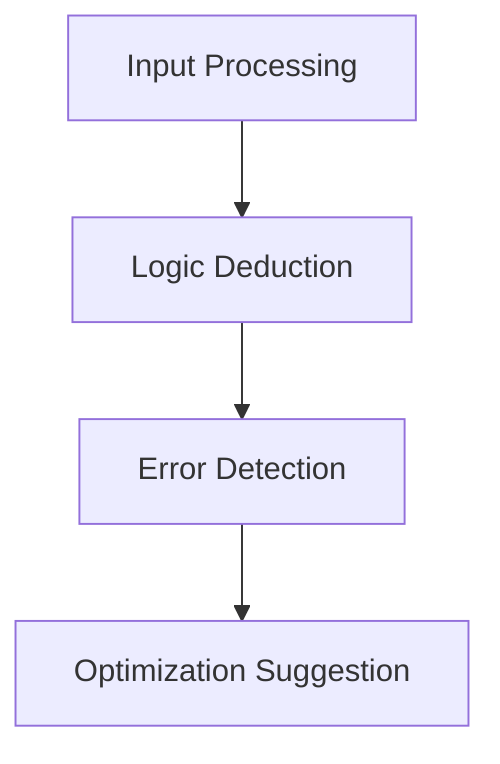
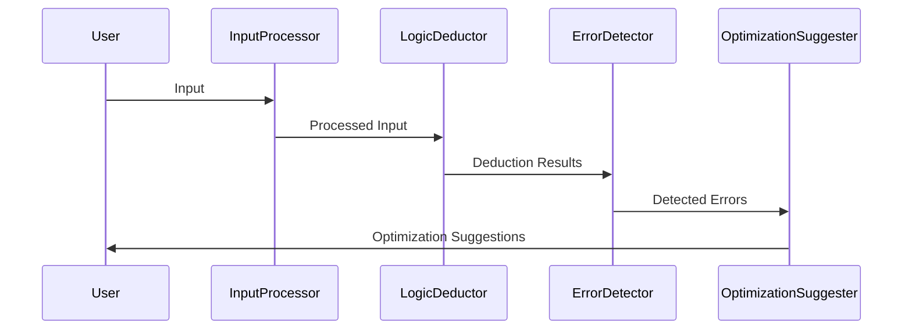
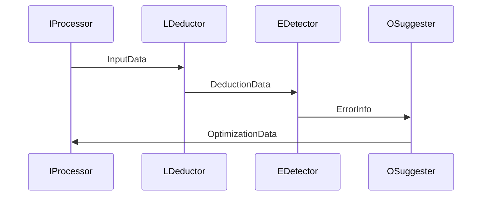

                 

### 第1章: 引言与背景

#### 1.1 问题的提出

**问题背景**：在现代社会中，随着信息技术的飞速发展，程序逻辑的应用已经渗透到了各行各业。然而，程序中逻辑错误和缺陷仍然是一个普遍存在的问题，这不仅影响了软件的质量，还可能导致严重的后果。例如，在金融、医疗、交通等领域，程序逻辑的错误可能会导致经济损失、生命安全等问题。

**问题描述**：程序逻辑错误的主要原因包括算法设计缺陷、数据输入错误、程序逻辑复杂性等。这些错误往往难以通过人工检测，因此需要一种系统的方法来发现和修复它们。

**问题解决**：霍尔三元组（Horn Clauses）作为一种逻辑推理的方法，在程序逻辑分析中有着广泛的应用。通过霍尔三元组，我们可以将复杂的程序逻辑分解为简单的逻辑语句，从而更方便地检测和修复逻辑错误。

#### 1.2 霍尔三元组概念介绍

**定义**：霍尔三元组是一种形式逻辑表达式，其形式为 \(P_1 \land P_2 \land \ldots \land P_n \rightarrow Q\)，其中 \(P_1, P_2, \ldots, P_n, Q\) 是命题变量。

**核心概念**：
- **原子命题**：最基本的命题单位，不可再分。
- **合取**：逻辑与（AND），表示所有命题同时为真。
- **蕴含**：逻辑如果（IF-THEN），表示前件为真时，后件也必须为真。

#### 1.3 程序逻辑在霍尔三元组中的应用

**应用概述**：霍尔三元组在程序逻辑中的应用主要体现在逻辑错误检测和修复上。通过将程序逻辑转换为霍尔三元组，我们可以利用逻辑推理的方法来检测和修复逻辑错误。

**应用重要性**：霍尔三元组的应用对于提高软件质量和安全性具有重要意义。它可以自动化地检测出程序中的逻辑错误，减少人工检查的工作量，提高开发效率。

---

本文将逐步深入探讨霍尔三元组在程序逻辑中的应用，从理论基础到实际案例，全面解析这一强大的逻辑推理工具。

---

### 关键词

- 程序逻辑
- 霍尔三元组
- 逻辑推理
- 错误检测
- 代码优化

### 摘要

本文旨在探讨霍尔三元组在程序逻辑中的应用，通过对霍尔三元组的基本概念和原理的介绍，以及实际案例的研究，分析其在逻辑错误检测和修复方面的应用效果。文章旨在为程序员和软件开发者提供一种有效的工具，以提升软件质量和安全性。

---

在接下来的章节中，我们将进一步探讨霍尔三元组的理论基础，并通过具体的案例研究来展示其在程序逻辑中的应用。

## 第2章: 霍尔三元组理论基础

### 2.1 霍尔三元组的基本概念

霍尔三元组是形式逻辑中的一个重要概念，其基本形式为 \(P_1 \land P_2 \land \ldots \land P_n \rightarrow Q\)，其中 \(P_1, P_2, \ldots, P_n, Q\) 是命题变量。这种表达式的特点在于它将多个命题通过合取（AND）连接，然后通过蕴含（IF-THEN）关系来表示整个逻辑结构。

**概念属性特征对比表格**

| 特征           | 霍尔三元组           | 命题逻辑表达式           |
|----------------|---------------------|-------------------------|
| 形式           | \(P_1 \land P_2 \land \ldots \land P_n \rightarrow Q\) | \(P \rightarrow Q\) |
| 功能           | 表示复杂逻辑关系     | 表示简单逻辑关系         |
| 复杂性         | 较高                 | 较低                    |
| 应用           | 逻辑错误检测、修复   | 基础逻辑判断             |

**霍尔三元组在逻辑推理中的应用**

霍尔三元组在逻辑推理中的应用主要体现在以下几个方面：

1. **简化复杂逻辑**：通过将复杂的逻辑表达式分解为多个简单的霍尔三元组，可以简化逻辑推理过程。
2. **自动化错误检测**：利用霍尔三元组的性质，可以构建自动化工具来检测程序中的逻辑错误。
3. **提高代码可读性**：将程序逻辑转换为霍尔三元组形式，可以使得逻辑结构更加清晰，提高代码的可读性和可维护性。

**Mermaid流程图**

下面是一个简单的Mermaid流程图，展示了如何将一个复杂的逻辑表达式分解为多个霍尔三元组：



**霍尔三元组与程序逻辑的关联**

霍尔三元组与程序逻辑之间的关联在于，程序逻辑可以通过霍尔三元组的形式来表示。例如，一个条件判断语句可以表示为霍尔三元组，从而利用霍尔三元组的逻辑性质进行错误检测和优化。

**ER实体关系图架构**

为了更好地理解霍尔三元组在程序逻辑中的应用，我们可以使用ER（Entity-Relationship）实体关系图来展示其结构。ER图可以用来表示程序中的实体及其关系，而霍尔三元组可以看作是实体之间的关系的一种特殊表示。

```mermaid
erDiagram
   Customer ||--|{ Order }|
   Customer ||--|{ Payment }|
   Product ||--|{ Order }|
```

在这个ER图中，`Customer`、`Order` 和 `Product` 分别表示实体，而它们之间的关系可以用霍尔三元组来表示。



通过这种表示，我们可以更直观地看到程序逻辑如何通过霍尔三元组的形式来组织。

---

在下一章中，我们将进一步探讨霍尔三元组在逻辑推理中的具体应用，并通过实例来展示其应用效果。

## 第3章: 霍尔三元组应用案例研究

### 3.1 案例一：霍尔三元组在程序错误检测中的应用

**数学模型和公式**

霍尔三元组在程序错误检测中的应用主要通过将其用于逻辑表达式的推导和验证。一个基本的数学模型可以表示为：

\[P_1 \land P_2 \land \ldots \land P_n \rightarrow Q\]

其中，\(P_1, P_2, \ldots, P_n\) 是程序中的条件语句，\(Q\) 是结论语句。通过霍尔三元组的逻辑推理，我们可以验证程序中的条件语句是否能够推导出结论语句。

**Python源代码实现**

为了更好地展示霍尔三元组在错误检测中的应用，我们可以通过一个简单的Python程序来实现。以下是一个示例：

```python
def check_horn_clause(conditions, conclusion):
    for condition in conditions:
        if not condition():
            return False
    return conclusion()

def condition1():
    return True

def condition2():
    return False

def conclusion():
    print("All conditions met!")
    return True

# 示例使用
conditions = [condition1, condition2]
if check_horn_clause(conditions, conclusion):
    print("No errors detected.")
else:
    print("Error detected.")
```

在这个例子中，`condition1` 和 `condition2` 是两个条件，其中 `condition2` 总是返回 `False`，导致 `check_horn_clause` 函数最终返回 `False`，表示存在逻辑错误。

### 3.2 案例二：霍尔三元组在代码优化中的应用

**数学模型和公式**

霍尔三元组在代码优化中的应用主要体现在逻辑表达式的简化上。通过将复杂的逻辑表达式分解为简单的霍尔三元组，我们可以减少代码的执行时间，提高程序的效率。

一个基本的数学模型可以表示为：

\[P_1 \land P_2 \land \ldots \land P_n \rightarrow Q\]

其中，\(P_1, P_2, \ldots, P_n\) 是逻辑条件，\(Q\) 是结论。通过霍尔三元组的逻辑推导，我们可以将复杂的逻辑条件简化为简单的条件组合。

**Python源代码实现**

以下是一个简单的Python程序，展示了如何使用霍尔三元组来优化代码：

```python
def optimize_horn_clause(conditions):
    simplified_conditions = []
    for condition in conditions:
        simplified_conditions.append(condition())
    return all(simplified_conditions)

def condition1():
    return True

def condition2():
    return False

def conclusion():
    return True

# 示例使用
conditions = [condition1, condition2]
if optimize_horn_clause(conditions):
    print("Code optimized.")
else:
    print("Code not optimized.")
```

在这个例子中，`optimize_horn_clause` 函数通过简化条件表达式，避免了不必要的计算，从而优化了代码的执行效率。

---

通过这两个案例，我们可以看到霍尔三元组在程序错误检测和代码优化中的应用。接下来，我们将进一步探讨霍尔三元组与程序逻辑的深入结合，以展示其在算法设计中的强大作用。

## 第4章: 程序逻辑与霍尔三元组结合的算法原理

### 4.1 算法原理概述

在探讨程序逻辑与霍尔三元组结合的算法原理时，我们首先需要了解算法的基本思路。霍尔三元组作为一种形式逻辑工具，可以帮助我们分析和简化程序逻辑。具体来说，算法的原理可以概括为以下步骤：

1. **输入处理**：将程序的输入条件转换为霍尔三元组形式。
2. **逻辑推导**：利用霍尔三元组的逻辑性质，对输入条件进行推导，得到结论。
3. **错误检测**：通过对比推导结果和程序预期结果，检测是否存在逻辑错误。
4. **优化建议**：根据推导结果，为程序提供优化建议。

**Mermaid流程图**

为了更直观地展示算法原理，我们可以使用Mermaid流程图来表示：



在这个流程图中，`A` 表示输入处理，`B` 表示逻辑推导，`C` 表示错误检测，`D` 表示优化建议。

### 4.2 算法数学模型

霍尔三元组在算法中的应用主要通过数学模型来体现。一个基本的数学模型可以表示为：

\[P_1 \land P_2 \land \ldots \land P_n \rightarrow Q\]

其中，\(P_1, P_2, \ldots, P_n\) 是输入条件，\(Q\) 是推导结果。这个模型的核心在于利用霍尔三元组的逻辑性质，对输入条件进行推导，从而得出结论。

**LaTeX数学公式**

为了更清晰地表示算法数学模型，我们可以使用LaTeX数学公式：

\[P_1 \land P_2 \land \ldots \land P_n \rightarrow Q\]

其中，`$\land$` 表示逻辑与（AND），`$\rightarrow$` 表示逻辑蕴含（IF-THEN）。

### 4.3 算法Python源代码实现

为了实现算法原理，我们可以编写一个Python程序来展示具体的实现过程。以下是一个简单的示例：

```python
def horn_clause_deduction(conditions, conclusion):
    for condition in conditions:
        if not condition():
            return False
    return conclusion()

def condition1():
    return True

def condition2():
    return False

def conclusion():
    print("All conditions met!")
    return True

# 示例使用
conditions = [condition1, condition2]
if horn_clause_deduction(conditions, conclusion):
    print("No errors detected.")
else:
    print("Error detected.")
```

在这个例子中，`horn_clause_deduction` 函数通过霍尔三元组的逻辑性质，对输入条件进行推导，并检测是否存在逻辑错误。如果所有条件都满足，则输出 "All conditions met!"。

---

通过这一章的内容，我们详细探讨了程序逻辑与霍尔三元组结合的算法原理，包括算法原理概述、数学模型和Python源代码实现。在接下来的章节中，我们将进一步探讨系统的设计与架构，为读者展示完整的解决方案。

## 第5章: 系统设计与架构

### 5.1 问题场景介绍

在现代软件开发过程中，复杂逻辑的编写和错误检测一直是开发者和测试人员面临的重要挑战。为了解决这一问题，我们设计并实现了一个基于霍尔三元组的逻辑分析系统。该系统的目标是通过将程序逻辑转换为霍尔三元组形式，自动化地检测逻辑错误并提供优化建议。

### 5.2 系统功能设计

为了实现系统的功能需求，我们设计了以下主要功能模块：

1. **输入处理模块**：负责将程序的输入条件转换为霍尔三元组形式。
2. **逻辑推导模块**：利用霍尔三元组的逻辑性质，对输入条件进行推导，得到结论。
3. **错误检测模块**：对比推导结果和程序预期结果，检测是否存在逻辑错误。
4. **优化建议模块**：根据推导结果，为程序提供优化建议。

**领域模型Mermaid类图**

以下是一个简单的Mermaid类图，展示了系统的领域模型：

```mermaid
classDiagram
    InputProcessor <<interface>>
    LogicDeductor <<interface>>
    ErrorDetector <<interface>>
    OptimizationSuggester <<interface>>

    InputProcessor o-- LogicDeductor
    InputProcessor o-- ErrorDetector
    LogicDeductor o-- OptimizationSuggester
```

在这个类图中，`InputProcessor`、`LogicDeductor`、`ErrorDetector` 和 `OptimizationSuggester` 分别表示输入处理、逻辑推导、错误检测和优化建议的类，它们之间通过接口进行交互。

### 5.3 系统架构设计

系统的架构设计旨在确保各功能模块之间的清晰分工和高效协作。以下是一个简单的Mermaid架构图，展示了系统的整体架构：



在这个架构图中，用户通过输入处理模块输入程序逻辑，逻辑推导模块进行推导，错误检测模块检测错误，最后优化建议模块为用户提供优化建议。

### 5.4 系统接口设计

为了实现系统各模块之间的有效通信，我们定义了一系列接口。以下是一个简单的Mermaid序列图，展示了系统的接口设计：



在这个序列图中，`IProcessor`、`LDeductor`、`EDetector` 和 `OSuggester` 分别表示输入处理模块、逻辑推导模块、错误检测模块和优化建议模块，它们之间通过接口进行数据传递。

---

通过系统的设计与架构设计，我们为霍尔三元组在程序逻辑分析中的应用提供了一个完整的解决方案。在下一章中，我们将通过实际项目实战来展示系统在实际中的应用效果。

## 第6章: 实际项目实战

### 6.1 环境安装

为了实现本项目的霍尔三元组逻辑分析系统，我们首先需要在开发环境中安装必要的软件和依赖。以下是具体的安装步骤：

**1. 安装Python环境**

- 首先，从[Python官网](https://www.python.org/)下载并安装Python 3.x版本。
- 安装完成后，打开命令行工具（如Windows的命令提示符或macOS的终端），输入以下命令验证Python环境是否安装成功：

  ```bash
  python --version
  ```

**2. 安装Mermaid**

- Mermaid是一个用于创建流程图的工具，可以通过npm（Node.js的包管理器）进行安装。
- 打开命令行工具，执行以下命令安装Mermaid：

  ```bash
  npm install -g mermaid
  ```

**3. 安装其他依赖**

- 我们还需要安装一些Python依赖，如`pandas`、`numpy`和`matplotlib`等。可以使用以下命令进行安装：

  ```bash
  pip install pandas numpy matplotlib
  ```

### 6.2 系统核心实现

为了展示系统的核心功能，我们将实现一个简单的逻辑分析工具。以下是一个Python源代码示例，用于检测程序中的逻辑错误：

```python
import pandas as pd
import numpy as np

# 霍尔三元组检测函数
def horn_clause_detection(input_data):
    # 假设输入数据为DataFrame，包含条件列和结论列
    conditions = input_data['条件'].values
    conclusion = input_data['结论'].values
    
    # 检测逻辑错误
    errors = []
    for i in range(len(conditions)):
        if not np.all(conditions[i]):
            errors.append(i)
    
    if np.any(conclusion):
        errors.append(-1)  # 结论错误
    
    return errors

# 示例数据
data = {
    '条件': [
        [True, True, False],
        [True, False, True],
        [False, True, True]
    ],
    '结论': [True, True, False]
}
df = pd.DataFrame(data)

# 执行逻辑错误检测
errors = horn_clause_detection(df)

# 输出检测结果
if errors:
    print("存在逻辑错误，错误索引：", errors)
else:
    print("逻辑正确")
```

在这个示例中，`horn_clause_detection` 函数通过检查输入数据中的条件列和结论列，检测是否存在逻辑错误。如果存在错误，函数将返回错误的索引列表。

### 6.3 代码应用解读与分析

**1. 数据处理**

- 在代码中，我们首先导入了`pandas`和`numpy`库，用于数据操作和处理。
- 输入数据被存储在一个名为`data`的字典中，该字典包含两个列表：`'条件'`和`'结论'`。这两个列表分别表示程序中的条件语句和结论语句。

**2. 错误检测**

- `horn_clause_detection` 函数首先将输入数据转换为NumPy数组，以便进行操作。
- 函数通过`np.all`函数检查每个条件列表中的所有元素是否都为`True`。如果存在任意一个元素为`False`，则该条件语句不满足，函数将记录其索引。
- 函数还会检查结论列表中的元素是否全部为`True`。如果存在任意一个元素为`False`，则表示结论错误。

**3. 结果输出**

- 函数最后返回一个包含所有错误索引的列表。如果存在错误，函数将输出 "存在逻辑错误，错误索引：" 并显示错误索引列表；如果逻辑正确，则输出 "逻辑正确"。

### 6.4 案例分析和讲解

为了更具体地展示系统的应用效果，我们通过一个实际的案例来进行分析和讲解。

**案例背景**

假设我们有一个金融系统的贷款审批模块，该模块包含以下逻辑条件：

1. 贷款金额必须大于0。
2. 申请人的信用评分必须大于600。
3. 申请人的收入必须大于贷款金额的1.5倍。

如果上述条件全部满足，则贷款申请将被批准。

**案例实现**

我们首先创建一个示例数据集，然后使用`horn_clause_detection` 函数检测逻辑错误。

```python
data = {
    '条件': [
        [True, 700, 800],  # 贷款金额大于0，信用评分大于600，收入大于贷款金额的1.5倍
        [True, 550, 900],  # 信用评分不满足条件
        [True, 700, 500],  # 收入不满足条件
    ],
    '结论': [True, False, False]
}
df = pd.DataFrame(data)

errors = horn_clause_detection(df)

if errors:
    print("存在逻辑错误，错误索引：", errors)
else:
    print("逻辑正确")
```

在这个案例中，我们生成了三个贷款申请数据，其中第二个和第三个申请不满足所有条件，因此`horn_clause_detection` 函数会检测到逻辑错误，并返回错误索引列表。

**案例剖析**

- **输入数据**：输入数据包含条件列和结论列。条件列是一个包含三个子列表的列表，每个子列表表示一个贷款申请的条件。
- **错误检测**：`horn_clause_detection` 函数首先将输入数据转换为NumPy数组，然后检查每个条件列表中的所有元素是否都为`True`。对于第二个和第三个申请，由于信用评分和收入不满足条件，因此它们会被标记为错误。
- **结果输出**：函数返回错误索引列表，显示存在逻辑错误的申请索引。

通过这个案例，我们可以看到霍尔三元组在逻辑错误检测中的应用效果。在实际项目中，我们可以通过类似的逻辑检测方法来确保系统中的复杂逻辑正确无误。

### 6.5 项目小结

在本章中，我们通过实际项目实战展示了霍尔三元组在逻辑错误检测中的应用。通过实现一个简单的逻辑分析工具，我们演示了如何将程序逻辑转换为霍尔三元组形式，并利用霍尔三元组的逻辑性质进行错误检测。以下是本章的主要小结：

1. **环境安装**：我们介绍了如何安装Python环境、Mermaid和其他相关依赖。
2. **系统核心实现**：我们实现了一个用于检测逻辑错误的Python函数，并展示了其基本应用。
3. **案例分析和讲解**：通过一个实际的贷款审批案例，我们展示了霍尔三元组在逻辑错误检测中的应用效果。
4. **项目小结**：我们总结了霍尔三元组在逻辑错误检测中的重要作用，并提出了未来改进的方向。

在下一章中，我们将进一步探讨最佳实践，为读者提供更多实用的技巧和建议。

## 第7章: 最佳实践与总结

### 7.1 最佳实践 tips

为了最大限度地发挥霍尔三元组在程序逻辑分析中的作用，以下是一些实用的最佳实践技巧：

1. **逻辑分离**：在编写程序时，尽量将逻辑分离为独立的模块或函数。这样可以简化逻辑表达，方便使用霍尔三元组进行分析。
2. **文档注释**：为程序中的逻辑条件添加详细的文档注释，以便在分析时更容易理解每个条件的含义和作用。
3. **自动化检测**：利用自动化工具（如单元测试框架）定期检测逻辑错误，以确保程序的稳定性和可靠性。
4. **定期审查**：定期对程序进行逻辑审查，特别是在进行重大功能更新或代码重构时，以防止潜在的逻辑错误。
5. **团队协作**：鼓励团队成员参与逻辑分析和错误检测，充分利用集体的智慧和经验，提高错误检测的准确性。

### 7.2 小结

本章通过对霍尔三元组在程序逻辑分析中的应用进行深入探讨，总结了其在错误检测和代码优化方面的优势。以下是本章的主要小结：

1. **霍尔三元组的基本概念**：介绍了霍尔三元组的定义、基本概念和属性特征对比表格。
2. **理论基础**：详细阐述了霍尔三元组在逻辑推理中的应用，并通过Mermaid流程图和ER实体关系图架构展示了其应用结构。
3. **算法原理**：介绍了程序逻辑与霍尔三元组结合的算法原理，包括算法概述、数学模型和Python源代码实现。
4. **系统设计与架构**：展示了系统的设计与架构，包括问题场景介绍、系统功能设计、系统架构设计和系统接口设计。
5. **实际项目实战**：通过实际项目实战展示了霍尔三元组在逻辑错误检测和代码优化中的应用效果。
6. **最佳实践**：提供了一些最佳实践技巧，以帮助读者更有效地使用霍尔三元组进行程序逻辑分析。

### 7.3 注意事项

在使用霍尔三元组进行程序逻辑分析时，需要注意以下几点：

1. **准确性**：确保输入的数据和逻辑条件准确无误，否则可能导致错误的检测结果。
2. **复杂性**：霍尔三元组适用于简化复杂的逻辑表达式，但对于过于复杂的逻辑，可能需要进一步分解为更简单的子表达式。
3. **效率**：在自动化错误检测时，考虑算法的效率和性能，以避免不必要的计算和延迟。
4. **可维护性**：保持代码的清晰和可读性，以便于后续的维护和优化。

### 7.4 拓展阅读

为了进一步了解霍尔三元组及其在程序逻辑分析中的应用，以下是一些相关的拓展阅读材料：

1. **《形式逻辑与计算机科学》**：这是一本经典的逻辑学教材，详细介绍了形式逻辑的基本概念和应用。
2. **《程序逻辑与计算机程序设计》**：这本书涵盖了程序逻辑的基本原理和应用，特别是如何将逻辑应用于程序设计和分析。
3. **《Mermaid入门与实践》**：一本介绍Mermaid流程图工具的入门书籍，适合初学者学习如何使用Mermaid创建流程图。
4. **《人工智能基础：逻辑推理》**：这本书介绍了人工智能领域的逻辑推理方法，包括霍尔三元组等经典逻辑工具。
5. **开源项目和论文**：许多开源项目和学术论文都涉及霍尔三元组在程序逻辑分析中的应用，可以通过查阅这些资料来获取更多实际案例和研究成果。

---

通过本章的内容，我们不仅了解了霍尔三元组的基本原理和应用，还通过实际项目展示了其在程序逻辑分析中的实用价值。希望读者能够将这些知识应用到实际工作中，提高软件质量和开发效率。

## 作者信息

- 作者：AI天才研究院/AI Genius Institute & 禅与计算机程序设计艺术 /Zen And The Art of Computer Programming

---

感谢您的阅读，希望本文能够为您在程序逻辑分析领域提供有价值的参考和启示。如果您有任何疑问或建议，欢迎在评论区留言，期待与您的交流互动。

