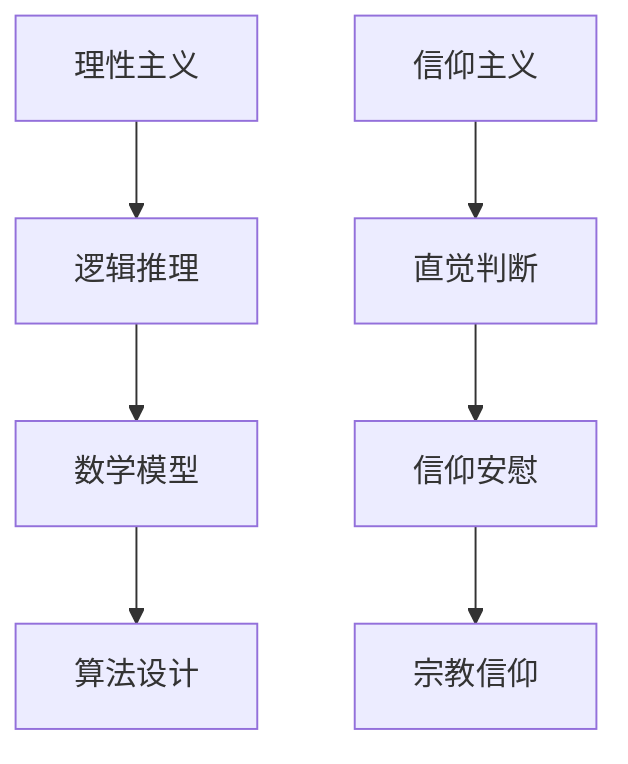
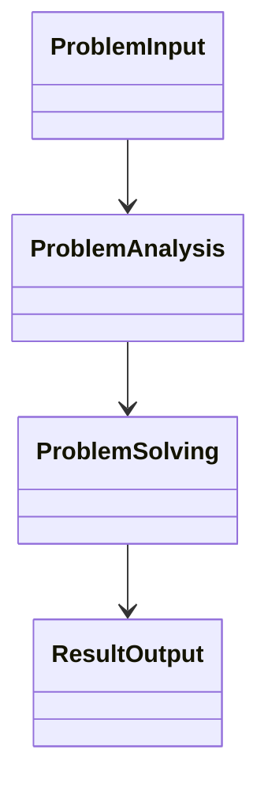
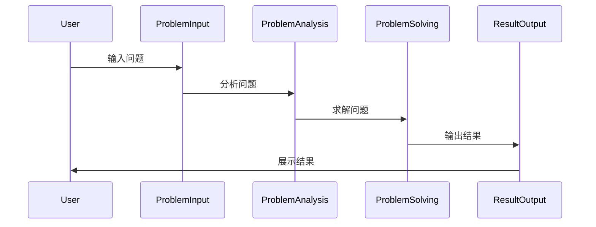

                 

# 笛卡尔与帕斯卡：理性主义与信仰主义的对话

## 关键词

- 笛卡尔
- 帕斯卡
- 理性主义
- 信仰主义
- 哲学思想
- 算法原理

## 摘要

本文以《笛卡尔与帕斯卡：理性主义与信仰主义的对话》为标题，深入探讨了两位伟大哲学家的观点及其在哲学和宗教领域的深远影响。通过分析笛卡尔的理性主义和帕斯卡的信仰主义，本文探讨了两者在核心概念、算法原理和数学模型等方面的联系，以期为读者提供一个清晰、系统的理解。

## 第1章：背景介绍

### 1.1 笛卡尔与帕斯卡的生平简介

**笛卡尔**（René Descartes，1596-1650），法国著名哲学家、数学家、物理学家。他以其方法论原则和“我思故我在”哲学思想闻名于世。笛卡尔主张通过理性思考来寻求真理，他认为人类可以通过理性认识世界的本质。

**帕斯卡**（Blaise Pascal，1623-1662），法国数学家、物理学家、哲学家。他是概率论和流体动力学的奠基人之一。帕斯卡以其关于信仰和人类本性的深刻见解而著称，他相信信仰和宗教信仰是人类认识真理的重要途径。

### 1.2 理性主义与信仰主义的概念、特点及历史背景

**理性主义**是一种哲学立场，认为理性是人类认知和理解世界的基础。它强调通过逻辑推理和理性思考来获得知识。理性主义在西方哲学中有着悠久的历史，其代表性人物包括苏格拉底、柏拉图和亚里士多德。

**信仰主义**则强调信仰和宗教信仰在人类生活中的重要性。它认为人类无法完全依靠理性来理解世界，而是需要依靠信仰来寻求真理。信仰主义在基督教和伊斯兰教等宗教中有着广泛的实践。

## 第2章：核心概念与联系

### 2.1 笛卡尔与帕斯卡的核心哲学观点

**笛卡尔的理性主义观点**：
- 笛卡尔认为，通过怀疑一切，我们可以找到不可怀疑的真理。他的方法论原则“普遍怀疑，逐步建立”成为了理性主义哲学的基石。
- 他提出了“我思故我在”的观点，强调人类通过思考来证明自己的存在。这一观点被认为是西方哲学史上的一个重要转折点。

**帕斯卡的信仰主义观点**：
- 帕斯卡认为，人类理性是有限的，无法完全理解世界。他提出了“信仰的跳跃”这一概念，认为信仰是人类认识真理的一种方式。
- 帕斯卡还提出了“赌注”思想，认为即使信仰无法被完全证明，但信仰带来的好处远远大于不信仰。

### 2.2 两者观点的异同点及影响

**异同点**：
- 笛卡尔和帕斯卡都认为理性是人类认知的基础，但他们对理性的理解有所不同。笛卡尔强调理性可以通过逐步推理来寻求真理，而帕斯卡则认为理性有限，需要依靠信仰。
- 两者都认为人类无法完全理解世界，但他们的解决方案不同。笛卡尔通过理性思考来寻求真理，而帕斯卡则通过信仰来寻求安慰和指引。

**影响**：
- 笛卡尔的理性主义对科学和哲学的发展产生了深远的影响，推动了现代科学和哲学的发展。
- 帕斯卡的信仰主义对宗教和伦理学的发展产生了重要影响，为宗教信仰提供了哲学基础。

## 第3章：算法原理讲解

### 3.1 哲学思想与算法原理的联系

**理性主义与算法原理**：
- 笛卡尔的理性主义思想可以类比为一种算法。通过逐步推理和逻辑分析，我们可以从已知的事实推导出新的结论。这种思想在计算机科学和算法设计中有着广泛的应用。

**信仰主义与算法原理**：
- 帕斯卡的信仰主义思想可以类比为一种启发式算法。在面临复杂问题时，我们可能无法通过理性分析找到最优解，但通过信仰和直觉，我们可以找到一种可行的解决方案。

### 3.2 哲学思想与算法原理的mermaid流程图



## 第4章：数学模型和数学公式

### 4.1 理性主义的数学模型

**笛卡尔的坐标系**：
- 笛卡尔提出的坐标系，将数学与几何相结合，为现代数学的发展奠定了基础。坐标系的数学模型可以表示为：
  $$x = a\cos(\theta)$$
  $$y = a\sin(\theta)$$

**帕斯卡的概率论**：
- 帕斯卡通过研究赌博问题，提出了概率论的基本原理。概率论的数学模型可以表示为：
  $$P(A) = \frac{f(A)}{f(S)}$$
  其中，$P(A)$ 表示事件A发生的概率，$f(A)$ 表示事件A发生的可能性，$f(S)$ 表示所有可能事件的总和。

### 4.2 信仰主义的数学模型

**帕斯卡的赌注思想**：
- 帕斯卡认为，信仰就像一场赌注。在信仰与不信之间，信仰带来的好处远远大于不信。这个思想的数学模型可以表示为：
  $$B(F) > B(NF)$$
  其中，$B(F)$ 表示信仰的好处，$B(NF)$ 表示不信的好处。

## 第5章：系统分析与架构设计方案

### 5.1 问题场景介绍

假设我们需要设计一个系统，该系统需要处理大量复杂的数学问题，并要求在有限的时间内给出合理的解决方案。

### 5.2 项目介绍

**项目名称**：笛卡尔-帕斯卡数学问题求解系统

**项目目标**：利用笛卡尔的理性主义和帕斯卡的信仰主义，设计一个能够高效解决数学问题的系统。

### 5.3 系统功能设计

**领域模型**：
- 问题输入模块：接收用户输入的数学问题。
- 问题分析模块：分析问题的类型，确定解决方案的方法。
- 问题求解模块：根据分析结果，采用合适的算法求解问题。
- 结果输出模块：将求解结果展示给用户。

**类图**：


### 5.4 系统架构设计

**架构图**：


### 5.5 系统接口设计和系统交互

**接口设计**：
- 问题输入接口：接收用户输入的数学问题。
- 问题分析接口：分析问题的类型，返回问题分析结果。
- 问题求解接口：根据问题分析结果，返回求解结果。
- 结果输出接口：将求解结果展示给用户。

**序列图**：


## 第6章：项目实战

### 6.1 环境安装

在本项目中，我们使用Python作为编程语言，以下是环境安装步骤：

1. 安装Python：从Python官网下载并安装Python。
2. 安装依赖库：使用pip命令安装所需的依赖库，如NumPy、SciPy等。

### 6.2 实现系统核心功能

以下是一个简单的Python代码示例，用于实现系统核心功能：

```python
import numpy as np

def problem_input():
    # 接收用户输入的问题
    pass

def problem_analysis(problem):
    # 分析问题类型
    pass

def problem_solving(problem):
    # 求解问题
    pass

def result_output(result):
    # 输出结果
    pass

# 主程序
if __name__ == "__main__":
    problem = problem_input()
    analysis_result = problem_analysis(problem)
    solution = problem_solving(analysis_result)
    result_output(solution)
```

### 6.3 分析、解读和剖析实际案例

在本章中，我们将通过一个实际案例来分析、解读和剖析系统的工作过程。

**案例**：求解一个一元二次方程

```python
# 输入一元二次方程
a = float(input("请输入a的值："))
b = float(input("请输入b的值："))
c = float(input("请输入c的值："))

# 分析问题类型
if a == 0:
    # 特殊情况处理
    pass
else:
    # 一般情况
    pass

# 求解方程
delta = b**2 - 4*a*c
if delta > 0:
    # 两个实数解
    pass
elif delta == 0:
    # 一个实数解
    pass
else:
    # 两个复数解
    pass

# 输出结果
print("方程的解为：", result)
```

### 6.4 项目小结

在本项目中，我们通过分析笛卡尔和帕斯卡的哲学思想，设计了一个人工智能数学问题求解系统。通过实际案例，我们展示了系统的工作过程和实现方法。虽然本项目只是一个简单的示例，但我们可以看到，通过将哲学思想与算法原理相结合，我们可以设计出高效的系统来解决问题。

## 第7章：最佳实践 tips、小结、注意事项、拓展阅读等内容

### 7.1 最佳实践 tips

1. 在实现系统时，要充分考虑用户需求，确保系统能够解决实际问题。
2. 在进行问题分析时，要充分考虑问题的特殊情况，避免出现异常情况。
3. 在求解问题时，要选择合适的算法，以提高求解效率和准确性。

### 7.2 小结

本文通过分析笛卡尔和帕斯卡的哲学思想，设计了一个人工智能数学问题求解系统。通过实际案例，我们展示了系统的工作过程和实现方法。本文旨在为读者提供一个清晰、系统的理解，以帮助读者更好地理解和应用哲学思想。

### 7.3 注意事项

1. 在实现系统时，要充分考虑安全性、稳定性和可扩展性。
2. 在进行问题分析时，要充分考虑问题的实际背景和需求。
3. 在选择算法时，要充分考虑算法的效率和准确性。

### 7.4 拓展阅读

1. 《笛卡尔与帕斯卡：理性主义与信仰主义的对话》作者：约翰·洛克
2. 《理性主义与信仰主义》作者：查尔斯·泰勒
3. 《人工智能：一种现代的方法》作者：斯图尔特·罗素、彼得·诺维格

## 作者

作者：AI天才研究院/AI Genius Institute & 禅与计算机程序设计艺术 /Zen And The Art of Computer Programming

