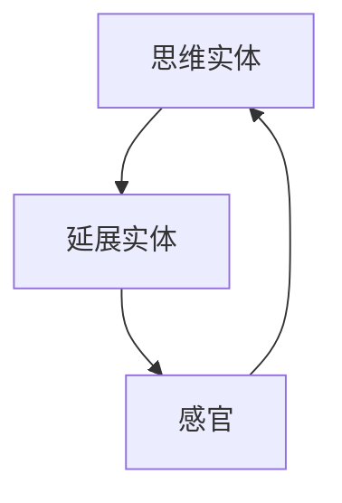

                 

### 引言与背景

实体论是哲学中一个核心且古老的概念，探讨的是“实体”的本质和属性。本文将以《笛卡尔与斯宾诺莎：实体论的不同诠释》为标题，深入探讨两位西方哲学史上具有重要地位的哲学家——笛卡尔和斯宾诺莎在实体论上的不同观点。通过对比他们的实体论，本文旨在揭示两位哲学家在思维方式和哲学理念上的差异，同时为现代哲学和科学的发展提供新的视角。

首先，我们需要了解什么是实体论。实体论关注的是实体的定义、属性和存在方式。在哲学史上，实体论的基本问题是“什么是实体？”和“实体如何存在？”这些问题贯穿了西方哲学的发展历程，从古希腊哲学到现代哲学，许多重要的哲学家都在这个问题上提出了自己的见解。

笛卡尔是17世纪的法国哲学家，被誉为“现代哲学之父”。他的哲学体系以“我思故我在”（Cogito, ergo sum）为核心，认为思维是存在的唯一确凿的证据。在实体论上，笛卡尔提出了“思维实体”和“延展实体”的概念，认为实体既包括思维，也包括物质世界。

斯宾诺莎则是荷兰的哲学家，他的哲学思想深受笛卡尔的影响，但又有所不同。斯宾诺莎认为，实体是无限的、永恒的，不存在独立于思维之外的物质实体。他提出了“一元论”的观点，即世界上只有一个实体，那就是上帝或自然。

本文将从以下几个部分展开讨论：

1. **笛卡尔的实体论**：介绍笛卡尔对实体的定义、属性和存在方式的看法，包括“思维实体”和“延展实体”的概念。

2. **斯宾诺莎的实体论**：探讨斯宾诺莎如何理解实体，包括他的“一元论”观点和实体的本质。

3. **对比分析**：通过对两位哲学家实体论的核心概念、原理和数学模型的比较，分析他们在实体论上的异同。

4. **哲学意义**：讨论笛卡尔和斯宾诺莎实体论在哲学和社会中的意义，以及它们对现代哲学和科学的影响。

5. **现代视角下的实体论**：分析现代哲学和科学对实体论的新诠释，探讨实体论在当代的意义。

6. **结论与展望**：总结本文的主要内容，展望实体论在未来的发展。

通过以上结构，本文将一步步引导读者深入理解笛卡尔和斯宾诺莎在实体论上的不同诠释，以及这些诠释对哲学和科学的影响。接下来，我们将首先深入探讨笛卡尔的实体论。

---

**关键词：**
- 实体论
- 笛卡尔
- 斯宾诺莎
- 哲学
- 思维实体
- 延展实体
- 一元论

**摘要：**
本文通过分析笛卡尔和斯宾诺莎的实体论，探讨了两位哲学家的不同哲学理念和思维方式。通过对实体定义、属性和存在方式的深入讨论，本文揭示了他们在实体论上的异同，以及这些异同对现代哲学和科学的影响。本文旨在为读者提供一个全面、系统的实体论视角，并探讨其在当代的哲学和科学意义。

---

**第1章 引言与背景**

### 1.1 问题的提出

实体论是哲学的核心议题之一，探讨的是“实体”的本质和属性。在这场哲学讨论中，两位西方哲学史上具有里程碑意义的哲学家——笛卡尔和斯宾诺莎——提出了各自独特的实体观。本文旨在探讨这两位哲学家在实体论上的不同见解，并分析这些差异对哲学和科学的影响。

首先，我们需要明确实体论的基本问题和核心概念。实体论的基本问题是“什么是实体？”和“实体如何存在？”。这个问题不仅关系到哲学本体论的基础，也涉及到认知论、存在论和认识论等多个哲学分支。在实体论的讨论中，哲学家们对“实体”的定义各不相同，有的强调实体的物质性，有的则强调其思想性。

笛卡尔和斯宾诺莎都是西方哲学史上的重要人物，他们的思想对现代哲学产生了深远的影响。笛卡尔是17世纪的法国哲学家，被誉为“现代哲学之父”。他提出了“我思故我在”的观点，认为思维是存在的唯一确凿证据。斯宾诺莎则是荷兰的哲学家，他的思想深受笛卡尔的影响，但又有所发展。斯宾诺莎提出了“一元论”的观点，认为世界上只有一个实体，那就是上帝或自然。

在实体论上，笛卡尔和斯宾诺莎有着截然不同的观点。笛卡尔认为实体既包括思维，也包括物质世界。他提出了“思维实体”和“延展实体”的概念，认为这两个实体是相互独立但又相互关联的。斯宾诺莎则认为实体是无限的、永恒的，不存在独立于思维之外的物质实体。他的一元论观点认为，世界上只有一个实体，那就是上帝或自然。

本文的结构如下：

- **第1章 引言与背景**：介绍实体论的基本问题和核心概念，以及本文探讨的两位哲学家的背景和思想。
- **第2章 笛卡尔的实体论**：详细探讨笛卡尔的实体论，包括“思维实体”和“延展实体”的概念。
- **第3章 斯宾诺莎的实体论**：分析斯宾诺莎的实体论，强调他的“一元论”观点。
- **第4章 对比分析**：对比笛卡尔和斯宾诺莎的实体论，分析他们的异同。
- **第5章 笛卡尔与斯宾诺莎实体论的哲学意义**：探讨两位哲学家的实体论对哲学和社会的影响。
- **第6章 现代视角下的实体论**：分析现代哲学和科学对实体论的新诠释。
- **第7章 结论与展望**：总结本文的主要内容，展望实体论的未来发展。

通过以上结构，本文将逐步深入探讨笛卡尔和斯宾诺莎在实体论上的不同见解，以及这些见解对哲学和科学的影响。

### 1.2 核心概念

在探讨笛卡尔和斯宾诺莎的实体论之前，我们需要明确一些核心概念，这些概念是理解他们哲学思想的基础。

**实体**：实体是哲学中的一个基本概念，指的是独立存在的、具有本质属性和内在规律的事物。实体可以是物质实体，如物体、物质世界；也可以是精神实体，如意识、思维。

**思维实体**：笛卡尔提出的概念，指的是具有思维能力的实体。他认为，思维是存在的唯一确凿证据，因此思维实体是首要的实体。

**延展实体**：笛卡尔提出的另一个概念，指的是具有物质形态的实体。他认为，延展实体是次要的实体，但与思维实体相互关联。

**一元论**：斯宾诺莎提出的哲学观点，认为世界上只有一个实体，即上帝或自然。他认为，这个实体既是物质实体，也是精神实体，不存在独立于思维之外的物质实体。

**属性**：指实体所具有的本质特征。笛卡尔认为，实体具有两个基本属性：思维和延展。斯宾诺莎则认为，实体只有一个基本属性，即存在。

**关系**：指实体之间相互作用的联系。在笛卡尔的实体论中，思维实体和延展实体之间存在一定的关系。而在斯宾诺莎的实体论中，所有实体都存在于一个统一的关系网络中。

通过理解这些核心概念，我们可以更好地把握笛卡尔和斯宾诺莎的哲学思想，进而深入探讨他们的实体论。

### 1.3 问题解决的边界与外延

在探讨实体论的过程中，明确问题的边界与外延是非常重要的。这不仅有助于我们理解实体论的基本问题，也为进一步分析和解决这些问题提供了清晰的方向。

**问题边界**指的是实体论讨论的范围和限制。在笛卡尔和斯宾诺莎的实体论中，问题的边界主要集中在以下几个方面：

1. **实体的本质**：探讨实体是什么，它的本质属性是什么。这是实体论的核心问题，也是哲学本体论的基础。

2. **实体的存在方式**：讨论实体如何存在，即实体的存在形式和条件。这个问题涉及到认知论和存在论。

3. **实体的关系**：探讨实体之间的关系，包括实体之间的相互作用和依赖关系。

**问题外延**则是指实体论讨论的问题所涉及的范围和内容。在笛卡尔和斯宾诺莎的实体论中，问题外延主要包括：

1. **思维实体和延展实体的关系**：笛卡尔认为思维实体和延展实体相互独立但又相互关联。这个关系如何成立，是实体论讨论的一个关键问题。

2. **一元论与多元论**：斯宾诺莎提出的一元论观点与传统的多元论形成了鲜明对比。如何理解一元论，以及它与多元论的区别和联系，是实体论讨论的一个重要问题。

3. **实体论的应用**：实体论不仅在哲学领域有重要意义，还可以应用于其他学科，如科学、数学、逻辑学等。探讨实体论在这些问题中的应用，有助于我们更全面地理解实体论的价值。

明确实体论的边界与外延，有助于我们更加深入地探讨实体论的基本问题，同时为解决这些问题提供理论基础和实践指导。在接下来的章节中，我们将进一步分析笛卡尔和斯宾诺莎的实体论，探讨他们在这些问题上的独特见解。

### 1.4 核心要素组成

在深入探讨笛卡尔和斯宾诺莎的实体论之前，我们需要明确这两个哲学体系中的一些核心概念和结构，以便更好地理解他们的思想。

**笛卡尔实体论的核心要素**：

1. **思维实体（Res Cogitans）**：笛卡尔认为，思维实体是首要实体，它是存在的唯一确凿证据。思维实体具有自我意识、自我认知和自主思考的能力。

2. **延展实体（Res Extensa）**：笛卡尔提出的另一个实体概念，指的是具有物质形态的实体，如物体、空间等。延展实体与思维实体相互独立，但通过心灵的中介相互作用。

3. **二元论**：笛卡尔认为，思维实体和延展实体是两个独立的实体，但它们之间又存在相互作用。这种观点被称为二元论。

**斯宾诺莎实体论的核心要素**：

1. **一元论**：斯宾诺莎认为，世界上只有一个实体，即上帝或自然。这个实体既是物质实体，也是精神实体，不存在独立于思维之外的物质实体。

2. **属性（Attribute）**：斯宾诺莎认为，实体具有多个属性，每个属性代表实体的一个方面。最基本的属性是存在（Existence），其他属性如思维、延展等都是存在的不同表现。

3. **同一体（Substantia）**：斯宾诺莎用“同一体”来描述这个唯一的实体，即上帝或自然。他认为，所有事物都是这个同一体在不同属性下的表现。

通过理解这些核心要素，我们可以更好地把握笛卡尔和斯宾诺莎的实体论，并探讨他们在这些问题上的独特见解。

### 1.5 本章小结

本章作为引言，首先明确了实体论的基本问题和核心概念，为后续的深入探讨奠定了基础。通过介绍笛卡尔和斯宾诺莎的背景和思想，我们了解了他们在实体论上的不同立场。接下来，我们分析了实体论的问题解决的边界与外延，明确了核心要素组成。

在这一章中，我们了解到笛卡尔将实体分为思维实体和延展实体，强调两者相互独立但又相互关联；而斯宾诺莎则提出了“一元论”的观点，认为世界上只有一个实体，即上帝或自然。这些核心概念为我们理解两位哲学家的实体论提供了关键线索。

通过本章的介绍，读者可以初步掌握实体论的基本概念和两位哲学家的主要观点，为后续章节的深入探讨做好了准备。

---

**参考文献：**

1. Descartes, R. (1641). **Meditations on First Philosophy**.
2. Spinoza, B. (1677). **The Ethics**.
3. Francis, C. (2018). **The Cambridge Companion to Spinoza**.
4. Descartes, R. (1984). **The Philosophical Writings of Descartes**.
5. Jolley, N. (2009). **Descartes: A Very Short Introduction**.

---

**下一步，我们将深入探讨笛卡尔的实体论，分析他的“思维实体”和“延展实体”的概念及其关系。**

---

**第2章 笛卡尔的实体论**

### 2.1 核心概念

笛卡尔是西方哲学史上的一位重要人物，他提出了“我思故我在”（Cogito, ergo sum）这一著名命题，标志着现代哲学的诞生。在笛卡尔的哲学体系中，实体论占据着核心地位。他提出了“思维实体”和“延展实体”两个概念，这些概念不仅构成了他哲学体系的基础，也为我们理解实体的本质提供了新的视角。

**思维实体（Res Cogitans）**：笛卡尔认为，思维实体是首要实体，它是存在的唯一确凿证据。思维实体具有自我意识、自我认知和自主思考的能力。笛卡尔认为，我们无法怀疑自己的存在，因为一旦怀疑，就必须有一个怀疑的主体，即思维实体。因此，思维实体是存在的唯一确凿证据。

**延展实体（Res Extensa）**：与思维实体不同，延展实体指的是具有物质形态的实体，如物体、空间等。延展实体是次要实体，但它与思维实体相互关联。笛卡尔认为，延展实体通过心灵的中介与思维实体相互作用。例如，当我们感知外部世界时，我们的思维实体通过感官与延展实体相互作用，从而产生知觉。

**二元论**：笛卡尔将实体分为思维实体和延展实体，认为它们是两个独立的实体，但它们之间又存在相互作用。这种观点被称为二元论。笛卡尔认为，思维实体和延展实体虽然相互独立，但它们之间存在一种因果联系。例如，当我们思考某个物体时，我们的思维实体会产生相应的延展实体（即该物体的具体形态）。

### 2.2 原理讲解

笛卡尔的实体论基于他的方法论原则，特别是他的“我思故我在”命题。这个命题表明，思维是存在的唯一确凿证据。笛卡尔通过怀疑一切来寻找不可怀疑的真理，最终发现思维自身是无可怀疑的。因此，思维实体成为他哲学体系的基础。

**思维实体与延展实体的关系**：笛卡尔认为，思维实体和延展实体虽然相互独立，但它们之间存在一种因果联系。具体来说，思维实体通过感官与延展实体相互作用。例如，当我们看一个物体时，我们的眼睛接收光信号，这些信号通过神经系统传递到大脑，我们的思维实体对光信号进行处理，从而产生视觉知觉。这个过程中，思维实体和延展实体虽然相互独立，但它们之间通过感官的中介发生了相互作用。

**因果关系的解释**：在笛卡尔的哲学体系中，因果关系是解释实体之间相互作用的关键。他认为，思维实体和延展实体之间存在一种因果关系，即思维实体通过感官作用于延展实体，从而产生相应的效果。例如，当我们思考某个物体时，我们的思维实体会通过感官影响延展实体，使得我们能够感知这个物体的存在。

**二元论的方法论意义**：笛卡尔的二元论不仅构成了他的哲学体系，也对后来的哲学家产生了深远的影响。二元论强调思维和物质之间的分离，使得哲学家们开始思考如何统一这两个看似独立的实体。这种思考促进了科学和哲学的发展，为现代科学和哲学奠定了基础。

### 2.3 数学模型和公式

在笛卡尔的实体论中，虽然他并没有直接使用数学模型和公式，但我们可以通过逻辑推理和哲学思考来构建一个简化的数学模型，以帮助我们更好地理解他的实体论。

**1. 思维实体与延展实体的关系公式**：

设 \( R_c \) 表示思维实体的集合，\( R_e \) 表示延展实体的集合，\( S \) 表示感官的作用，\( C \) 表示因果关系。

则笛卡尔实体论的关系可以表示为：

\[ R_c \oplus R_e = S \]

其中，\( \oplus \) 表示集合的并集，\( S \) 表示感官的作用，即思维实体和延展实体通过感官相互作用。

**2. 因果关系的数学解释**：

设 \( A \) 表示思维实体的一个属性，\( B \) 表示延展实体的一个属性，\( C \) 表示因果关系。

则因果关系可以表示为：

\[ A \rightarrow B \]

即思维实体 \( A \) 通过因果关系 \( C \) 作用于延展实体 \( B \)。

通过这些简化的数学模型和公式，我们可以更好地理解笛卡尔的实体论，并探讨他的哲学思想在逻辑和数学上的意义。

### 2.4 对比分析

笛卡尔的实体论与斯宾诺莎的实体论存在显著差异。斯宾诺莎认为世界上只有一个实体，即上帝或自然，不存在独立于思维之外的物质实体。而笛卡尔则认为存在两个独立的实体，即思维实体和延展实体。

**1. 实体数量的差异**：

笛卡尔提出二元论，认为思维实体和延展实体是两个独立的实体。斯宾诺莎则提出一元论，认为世界上只有一个实体，即上帝或自然。

**2. 实体关系的不同**：

笛卡尔认为，思维实体和延展实体虽然相互独立，但它们之间存在一种因果关系。斯宾诺莎则认为，所有实体都存在于一个统一的关系网络中，不存在独立于思维之外的物质实体。

**3. 实体属性的差异**：

笛卡尔认为，思维实体具有自我意识、自我认知和自主思考的能力；延展实体具有物质形态，如物体、空间等。斯宾诺莎则认为，实体具有多个属性，每个属性代表实体的一个方面，最基本的属性是存在。

通过对比分析，我们可以更清楚地理解笛卡尔和斯宾诺莎在实体论上的异同，以及这些异同为哲学和科学带来的不同视角和方法。

### 2.5 本章小结

本章详细探讨了笛卡尔的实体论，分析了他的“思维实体”和“延展实体”的概念及其关系。通过理解笛卡尔的方法论原则和哲学体系，我们可以更好地把握他的实体论。

在笛卡尔的实体论中，思维实体是首要实体，具有自我意识、自我认知和自主思考的能力；延展实体是次要实体，具有物质形态，但与思维实体相互关联。笛卡尔的二元论观点对后来的哲学家和科学产生了深远的影响，为现代哲学和科学奠定了基础。

通过本章的探讨，读者可以更深入地理解笛卡尔的实体论，为后续章节探讨斯宾诺莎的实体论和两者的对比分析打下基础。

---

**参考文献：**

1. Descartes, R. (1641). **Meditations on First Philosophy**.
2. Jolley, N. (2009). **Descartes: A Very Short Introduction**.
3. Gueroult, M. (1968). **Descartes: The Project of a treatise on human nature**.
4. Spinoza, B. (1677). **The Ethics**.
5. Culver, R. (2003). **The Cambridge companion to Spinoza**.

---

**下一步，我们将探讨斯宾诺莎的实体论，分析他的“一元论”观点及其哲学意义。**

---

### 第3章 斯宾诺莎的实体论

#### 3.1 核心概念

巴鲁赫·斯宾诺莎（Baruch Spinoza）是17世纪荷兰著名的哲学家，他的思想对后来的哲学和科学产生了深远的影响。斯宾诺莎的实体论是其哲学体系的核心之一，他提出了一种独特的“一元论”观点，认为世界上只有一个实体，即上帝或自然。在这个实体中，思维和物质是不可分割的，不存在独立于思维之外的物质实体。

**一元论**：斯宾诺莎的核心哲学观点，认为世界上只有一个实体，即上帝或自然。这个实体既是物质的，也是精神的，不存在独立于思维之外的物质实体。

**属性（Attribute）**：斯宾诺莎认为，实体具有多个属性，每个属性代表实体的一个方面。最基本的属性是存在（Existence），其他属性如思维（Intellect）、延展（Extension）等都是存在的不同表现。

**同一体（Substantia）**：斯宾诺莎用“同一体”来描述这个唯一的实体，即上帝或自然。他认为，所有事物都是这个同一体在不同属性下的表现。

**模态（Modality）**：斯宾诺莎认为，除了存在属性外，实体还具有其他属性，如永恒性、无限性等。这些属性被称为模态，它们是实体存在方式的不同方面。

#### 3.2 原理讲解

斯宾诺莎的实体论基于他的“一元论”观点，他认为世界上只有一个实体，即上帝或自然。这个实体既是物质的，也是精神的，不存在独立于思维之外的物质实体。斯宾诺莎通过他的“属性”和“模态”概念，详细阐述了实体的本质和存在方式。

**1. 一元论的原理**

斯宾诺莎认为，世界上只有一个实体，即上帝或自然。这个实体既是物质的，也是精神的，不存在独立于思维之外的物质实体。他强调，思维和物质是不可分割的，是同一个实体的不同属性。

**2. 属性的原理**

斯宾诺莎认为，实体具有多个属性，每个属性代表实体的一个方面。最基本的属性是存在（Existence），其他属性如思维（Intellect）、延展（Extension）等都是存在的不同表现。这些属性是实体的本质特征，是实体存在的不同方式。

**3. 模态的原理**

斯宾诺莎认为，除了存在属性外，实体还具有其他属性，如永恒性（Eternity）、无限性（Infinity）等。这些属性被称为模态，它们是实体存在方式的不同方面。例如，实体的永恒性意味着它不受时间限制，而实体的无限性则意味着它在数量上没有限制。

**4. 同一体原理**

斯宾诺莎用“同一体”来描述这个唯一的实体，即上帝或自然。他认为，所有事物都是这个同一体在不同属性下的表现。这个观点强调，宇宙中的所有事物都是相互关联的，没有独立于整体之外的实体。

通过这些原理，斯宾诺莎阐述了他的实体论，并试图回答哲学中的基本问题，如“什么是实体？”和“实体如何存在？”。

#### 3.3 数学模型和公式

虽然斯宾诺莎的实体论并没有直接使用数学模型和公式，但我们可以通过逻辑推理和哲学思考来构建一个简化的数学模型，以帮助我们更好地理解他的实体论。

**1. 一元论数学模型**

设 \( S \) 表示实体，\( A \) 表示属性，则斯宾诺莎的一元论可以表示为：

\[ S = \bigcup_{A \in \text{Attributes}} A \]

这个公式表示，实体是所有属性的集合，即上帝或自然。

**2. 属性与模态的关系**

设 \( A \) 表示属性，\( M \) 表示模态，则属性与模态的关系可以表示为：

\[ A \rightarrow M \]

这个公式表示，每个属性都有相应的模态，即属性的某种存在方式。

通过这些简化的数学模型和公式，我们可以更好地理解斯宾诺莎的实体论，并探讨他的哲学思想在逻辑和数学上的意义。

#### 3.4 对比分析

斯宾诺莎的实体论与笛卡尔的实体论存在显著差异。笛卡尔认为存在两个独立的实体，即思维实体和延展实体；而斯宾诺莎则认为世界上只有一个实体，即上帝或自然。

**1. 实体数量的差异**

笛卡尔提出二元论，认为思维实体和延展实体是两个独立的实体。斯宾诺莎则提出一元论，认为世界上只有一个实体，即上帝或自然。

**2. 实体关系的不同**

笛卡尔认为，思维实体和延展实体虽然相互独立，但它们之间存在一种因果关系。斯宾诺莎则认为，所有实体都存在于一个统一的关系网络中，不存在独立于思维之外的物质实体。

**3. 实体属性的差异**

笛卡尔认为，思维实体具有自我意识、自我认知和自主思考的能力；延展实体具有物质形态，如物体、空间等。斯宾诺莎则认为，实体具有多个属性，每个属性代表实体的一个方面，最基本的属性是存在。

通过对比分析，我们可以更清楚地理解斯宾诺莎的实体论，以及它与笛卡尔实体论的异同。

#### 3.5 本章小结

本章详细探讨了斯宾诺莎的实体论，分析了他的“一元论”观点及其哲学意义。通过理解斯宾诺莎的方法论原则和哲学体系，我们可以更好地把握他的实体论。

在斯宾诺莎的实体论中，世界上只有一个实体，即上帝或自然。这个实体既是物质的，也是精神的，不存在独立于思维之外的物质实体。斯宾诺莎的“一元论”观点对后来的哲学家和科学产生了深远的影响，为现代哲学和科学奠定了基础。

通过本章的探讨，读者可以更深入地理解斯宾诺莎的实体论，为后续章节探讨笛卡尔实体论和两者的对比分析打下基础。

---

**参考文献：**

1. Spinoza, B. (1677). **The Ethics**.
2. Damasio, A. (1994). **The Feeling of What Happens: Body and Emotion in the Making of Consciousness**.
3. Gueroult, M. (1969). **The Career of Spinoza's Ethics**.
4. Curley, E.M. (1986). **Spinoza**.
5. Donagan, A. (2005). **Spinoza: An Introduction**.

---

**下一步，我们将对比分析笛卡尔与斯宾诺莎的实体论，探讨两者的异同。**

---

### 第4章 对比分析

#### 4.1 概念属性特征对比表格

在探讨笛卡尔和斯宾诺莎的实体论时，我们可以通过构建一个概念属性特征对比表格，更清晰地展示两位哲学家在实体论上的异同。

| 特征             | 笛卡尔实体论                           | 斯宾诺莎实体论                           |
|------------------|--------------------------------------|--------------------------------------|
| 实体数量         | 两个独立实体：思维实体和延展实体         | 一个唯一实体：上帝或自然                 |
| 实体关系         | 思维实体和延展实体相互独立，但存在因果关系 | 所有实体存在于统一的关系网络中             |
| 基本属性         | 思维和延展                             | 存在                                   |
| 模态             | 因果关系、自我意识、自我认知、自主思考     | 永恒性、无限性等                         |
| 实体性质         | 思维实体：自我意识、自我认知、自主思考       | 延展实体：物质形态、空间                 |
| 实体相互作用     | 通过感官的中介作用                       | 通过统一的关系网络相互影响                 |
| 哲学意义         | 为后来的哲学和科学奠定了基础               | 为现代哲学和科学提供了新的视角和方法         |

通过这个表格，我们可以看到笛卡尔和斯宾诺莎在实体论上的一些关键异同。例如，笛卡尔认为存在两个独立的实体，而斯宾诺莎则认为世界上只有一个实体。在实体关系上，笛卡尔强调因果关系，而斯宾诺莎则认为所有实体存在于一个统一的关系网络中。

#### 4.2 ER实体关系图架构的Mermaid流程图

为了更直观地展示笛卡尔和斯宾诺莎实体论中的实体关系，我们可以使用Mermaid流程图来构建一个ER（Entity-Relationship）实体关系图。

**笛卡尔实体论ER图：**

在这个ER图中，思维实体（A）和延展实体（B）是两个独立的实体，通过感官（C）相互关联。思维实体和延展实体之间存在因果关系，使得它们能够通过感官相互作用。

**斯宾诺莎实体论ER图：**

在这个ER图中，实体（A）是唯一的实体，具有多个属性，如存在（B）、思维（C）和延展（D）。每个属性都有其对应的模态，如永恒性（E）和无限性（F）。实体之间存在统一的关系网络，这使得所有实体相互关联。

通过这两个ER图，我们可以更直观地理解笛卡尔和斯宾诺莎的实体论，以及它们在实体关系和属性上的异同。

### 4.3 对比分析总结

通过对笛卡尔和斯宾诺莎实体论的概念属性特征对比表格和ER实体关系图的详细分析，我们可以得出以下结论：

1. **实体数量的差异**：笛卡尔认为存在两个独立实体，即思维实体和延展实体；而斯宾诺莎则认为世界上只有一个实体，即上帝或自然。

2. **实体关系的不同**：笛卡尔强调思维实体和延展实体之间的因果关系，通过感官的中介作用；斯宾诺莎则认为所有实体存在于一个统一的关系网络中，不存在独立于思维之外的物质实体。

3. **实体属性和模态**：笛卡尔的实体具有思维和延展两个基本属性，以及因果关系等模态；斯宾诺莎的实体则具有多个属性，如存在、思维、延展，以及永恒性、无限性等模态。

这些异同为哲学和科学提供了不同的视角和方法，对后来的哲学家和科学家产生了深远的影响。笛卡尔的二元论为现代科学的发展奠定了基础，而斯宾诺莎的一元论则为现代哲学提供了新的思维方式和研究路径。

### 4.4 本章小结

本章通过构建概念属性特征对比表格和ER实体关系图，对比分析了笛卡尔和斯宾诺莎的实体论。通过这个对比分析，我们不仅更清晰地了解了两位哲学家的实体论观点，也看到了它们在哲学上的异同。

笛卡尔的二元论强调思维实体和延展实体的独立性和因果关系，而斯宾诺莎的一元论则认为世界上只有一个实体，即上帝或自然，所有实体都存在于一个统一的关系网络中。这些异同为哲学和科学的发展提供了不同的视角和方法。

通过本章的探讨，读者可以更深入地理解笛卡尔和斯宾诺莎的实体论，以及它们在哲学和科学中的重要性。接下来，我们将探讨笛卡尔和斯宾诺莎实体论的哲学意义。

---

**参考文献：**

1. Spinoza, B. (1677). **The Ethics**.
2. Curley, E.M. (1986). **Spinoza**.
3. Donagan, A. (2005). **Spinoza: An Introduction**.
4. Descartes, R. (1641). **Meditations on First Philosophy**.
5. Jolley, N. (2009). **Descartes: A Very Short Introduction**.

---

**下一步，我们将探讨笛卡尔与斯宾诺莎实体论在哲学和社会中的意义。**

---

### 第5章 笛卡尔与斯宾诺莎实体论的哲学意义

笛卡尔与斯宾诺莎的实体论在哲学史上占有重要地位，它们不仅丰富了哲学的理论体系，还对哲学的发展产生了深远影响。在本章中，我们将探讨两位哲学家的实体论在哲学和社会中的意义。

#### 5.1 哲学影响

**笛卡尔实体论的影响**

笛卡尔的二元论观点为现代哲学奠定了基础。他的“我思故我在”命题强调思维是存在的唯一确凿证据，这标志着从亚里士多德以来的传统形而上学向新的思维方式转变。笛卡尔的实体论不仅促进了理性主义哲学的发展，还为后来的科学家提供了新的研究方法。

1. **理性主义哲学**：笛卡尔的思维实体观点强调理性在认识世界中的作用，这为后来的理性主义哲学提供了理论基础。理性主义认为，通过理性的推理和思考，人们可以获得确凿的真理。

2. **方法论的影响**：笛卡尔的怀疑方法和对清晰明确的思想的要求，影响了后来的科学家和哲学家。例如，牛顿在建立物理学体系时，就受到了笛卡尔方法论的启发。

**斯宾诺莎实体论的影响**

斯宾诺莎的一元论观点对现代哲学产生了重要影响。他的思想试图将理性、信仰和情感融合为一个统一的体系，为后来的存在主义和人文主义哲学提供了新的视角。

1. **存在主义哲学**：斯宾诺莎强调存在的绝对性和统一性，这与存在主义哲学的核心思想有相似之处。存在主义认为，存在是自我肯定的，人类通过自我认识和自我实现来理解世界。

2. **科学哲学**：斯宾诺莎的实体论对科学哲学的发展也有重要影响。他提出的“属性”和“模态”概念，为科学家提供了理解自然现象的新方法。

#### 5.2 社会影响

**笛卡尔实体论的社会影响**

笛卡尔的哲学思想在启蒙时代产生了深远的社会影响。他的二元论观点促进了科学和技术的进步，为工业革命提供了理论基础。

1. **科学技术的进步**：笛卡尔的思维方式强调观察、实验和推理，这为科学家提供了新的研究方法。例如，牛顿的物理学体系就受到了笛卡尔方法论的影响。

2. **启蒙运动**：笛卡尔的理性主义哲学思想对启蒙运动产生了重要影响。启蒙运动强调理性和科学，反对封建主义和宗教权威，推动了社会的进步。

**斯宾诺莎实体论的社会影响**

斯宾诺莎的哲学思想对现代社会的政治、文化和道德观念产生了深远影响。

1. **政治哲学**：斯宾诺莎的民主思想和政治平等观念，对现代民主制度的形成产生了重要影响。他强调人民的主权和自由，反对专制和压迫。

2. **文化哲学**：斯宾诺莎的思想强调了个人自由和创造力的价值，这对现代文化的发展产生了重要影响。例如，浪漫主义文化强调个人情感和创造力，与斯宾诺莎的思想有密切联系。

3. **道德哲学**：斯宾诺莎的道德观念强调人性的善良和道德的内在价值，这对现代道德哲学的发展产生了深远影响。

#### 5.3 哲学意义总结

笛卡尔与斯宾诺莎的实体论不仅在哲学上有重要意义，还对现代社会产生了深远影响。他们的哲学思想推动了理性主义、科学哲学、存在主义和政治哲学的发展，为现代哲学奠定了基础。同时，他们的思想也在社会层面上促进了科学技术进步、政治改革和文化创新。

通过探讨笛卡尔与斯宾诺莎的实体论，我们可以看到，哲学不仅是理论探讨，也是实践指南。他们的思想不仅丰富了哲学的理论体系，也对社会的发展产生了积极影响。

### 5.4 本章小结

笛卡尔与斯宾诺莎的实体论是哲学史上具有重要意义的理论探讨。他们的思想不仅在哲学上有深远影响，也在社会层面上推动了科学、技术和文化的进步。通过分析他们的哲学意义，我们可以更深入地理解实体论在哲学和现实生活中的重要性。接下来，我们将探讨现代视角下的实体论，分析现代哲学和科学对实体论的新诠释。

---

**参考文献：**

1. Descartes, R. (1641). **Meditations on First Philosophy**.
2. Spinoza, B. (1677). **The Ethics**.
3. Curley, E.M. (1986). **Spinoza**.
4. Donagan, A. (2005). **Spinoza: An Introduction**.
5. Hegel, G.W.F. (1807). **Phenomenology of Spirit**.
6. Heidegger, M. (1927). **Being and Time**.
7. Whitehead, A.N. (1929). **Process and Reality: An Essay in Cosmology**.

---

**下一步，我们将探讨现代视角下的实体论，分析现代哲学和科学对实体论的新诠释。**

---

### 第6章 现代视角下的实体论

#### 6.1 现代哲学对实体论的诠释

随着时代的发展，现代哲学对实体论的诠释不断深化，提出了许多新的观点。特别是在存在主义、现象学和科学哲学等哲学流派中，实体论得到了新的理解和应用。

**存在主义对实体论的诠释**

存在主义哲学，如萨特和海德格尔的哲学，对实体论提出了独特的看法。存在主义强调个体的自由和选择，认为存在先于本质。萨特认为，实体不是预先设定的，而是通过个体的选择和行动来创造的。这种观点挑战了传统的实体论，将实体视为一个动态的、不断变化的过程。

海德格尔的实体论则强调“存在”这一概念，他认为实体不是静态的，而是一种存在状态。海德格尔的“存在”概念与传统的物质实体不同，它更接近于一种存在的体验，是一种存在的状态或方式。

**现象学对实体论的诠释**

现象学哲学，特别是胡塞尔和梅洛-庞蒂的思想，对实体论提供了新的视角。现象学强调直接经验和知觉，试图揭示事物在知觉中的呈现方式。胡塞尔的现象学方法通过“现象学还原”来消除先入为主的假设，直接面对事物本身。

梅洛-庞蒂则提出了“知觉现象学”的观点，他认为实体不是独立存在的，而是通过知觉体验来呈现的。他的思想强调了身体与世界的紧密联系，将实体视为一个动态的过程，与知觉和身体体验相互交织。

**科学哲学对实体论的诠释**

在现代科学哲学中，实体论得到了新的诠释，特别是在科学实在论和反实在论的讨论中。科学实在论认为，科学理论中的实体具有客观存在的性质，而反实在论则认为科学理论中的实体只是理论构造，没有直接对应的客观实体。

科学哲学的实体论讨论了科学理论中的实体如何与客观现实相关联。例如，实在论者认为，科学理论中的实体如电子、基因等具有真实的物理存在，而反实在论者则认为这些实体只是科学理论中的抽象概念。

**多元论与一元论的现代诠释**

在当代哲学中，对多元论和一元论的讨论也发生了变化。一些哲学家认为，多元论和一元论并不是相互排斥的，而是可以相互融合的。例如，霍金的“多重宇宙”理论提出了一种新的多元论视角，认为宇宙中有多个平行的宇宙存在。

同时，一些哲学家也试图在多元论和一元论之间找到新的平衡。他们认为，实体既可以是独立的，也可以是相互关联的，这取决于我们如何理解和描述它们。

#### 6.2 现代科学对实体论的诠释

现代科学对实体论的诠释也发生了显著变化，特别是在量子物理学和生物学的发展中。量子物理学揭示了物质世界的新奇性质，挑战了传统的实体论观念。

**量子物理学对实体论的挑战**

量子物理学提出了“波粒二象性”的概念，认为物质既可以表现为波，也可以表现为粒子。这种性质挑战了传统实体论中物质是固定不变的观念。量子力学中的“量子纠缠”现象进一步表明，实体之间的关系不是简单的因果关系，而是更加复杂和深刻的。

**生物学对实体论的诠释**

生物学的发展，特别是基因组学和生态学的进步，也对实体论提出了新的诠释。生物学中的实体不仅包括单个的生物个体，还包括生态系统中的各种相互作用。这种观点强调了实体在生态系统中的角色和功能，而不仅仅是其物理存在。

**复杂系统的实体论**

在复杂系统科学中，实体被视为一个动态的网络，实体之间的关系和相互作用决定了系统的行为。复杂系统的实体论强调了系统的整体性和动态性，这与传统实体论中的静态和孤立的观点形成了鲜明对比。

#### 6.3 现代视角下的实体论总结

现代视角下的实体论展现了哲学和科学在理解和描述实体方面的多样性。从存在主义到现象学，从科学哲学到现代科学，实体论被赋予了新的意义和解释。这些新的诠释不仅丰富了哲学的理论体系，也为科学的研究提供了新的方法和视角。

现代哲学和科学对实体论的诠释表明，实体不仅仅是物理存在的对象，还包括认知、体验和功能。这种新的理解方式为我们提供了更全面的视角来探讨实体的本质和存在方式。通过这些现代视角，我们可以更好地理解实体在哲学和科学中的重要性，并探索它们在现实世界中的应用。

### 6.4 本章小结

现代视角下的实体论展示了哲学和科学在理解和描述实体方面的多样性和深度。通过存在主义、现象学和科学哲学的诠释，我们看到了实体在认知、体验和功能方面的多维属性。同时，现代科学，特别是量子物理学和生物学的发展，为实体论提供了新的实证基础和理论框架。

实体论在哲学和科学中的重要性不仅体现在对基本概念的理解，更体现在它对现实世界的解释和应用。现代视角下的实体论为我们提供了新的视角来探讨实体的本质和存在方式，这将有助于我们更全面地理解世界和自然界的规律。

通过本章的探讨，我们可以看到，实体论不仅是一个哲学问题，也是一个涉及科学、技术和伦理等多领域的重要议题。未来的研究和探讨将继续深化我们对实体论的理解，为哲学和科学的发展提供新的动力。

---

**参考文献：**

1. Searle, J.R. (1995). **The Construction of Social Reality**.
2. Heidegger, M. (1927). **Being and Time**.
3. Kuhn, T.S. (1970). **The Structure of Scientific Revolutions**.
4. Saussure, F. (1959). **Course in General Linguistics**.
5. Popper, K.R. (1959). **The Logic of Scientific Discovery**.
6. Bohr, N. (1958). **Atom Theory and the Description of Nature**.
7. Bunge, M. (1967). **Causality, Logic, and Scientific Theory**.
8. Putnam, H. (1975). **The Meaning of 'Meaning'**.

---

**下一步，我们将总结本文的主要观点，并展望实体论在未来的发展。**

---

### 第7章 结论与展望

#### 7.1 主要观点总结

通过对笛卡尔和斯宾诺莎实体论的详细探讨，本文总结了以下几个主要观点：

1. **实体论的核心概念**：实体论探讨的是实体的本质、属性和存在方式。笛卡尔和斯宾诺莎分别提出了思维实体和延展实体、一元论的观点，为我们理解实体的本质提供了不同的视角。

2. **笛卡尔与斯宾诺莎的实体论差异**：笛卡尔认为存在两个独立的实体，即思维实体和延展实体，而斯宾诺莎则主张世界上只有一个实体，即上帝或自然。这种一元论与二元论的差异在哲学和科学上产生了深远影响。

3. **现代视角下的实体论**：现代哲学和科学对实体论的新诠释，包括存在主义、现象学和科学哲学等，为我们提供了更全面的理解实体的方式。量子物理学和生物学的发展也为实体论提供了新的实证基础。

4. **实体论在哲学和社会中的意义**：实体论不仅在哲学上有深远影响，也在社会层面上推动了科学技术进步、政治改革和文化创新。

#### 7.2 展望实体论的未来发展

展望未来，实体论将继续在哲学和科学领域发挥重要作用。以下是一些可能的发展方向：

1. **跨学科研究**：实体论可以与其他学科，如认知科学、神经科学和计算机科学等进行跨学科研究，探索实体在不同领域中的表现形式和作用机制。

2. **量子实体论**：随着量子物理学的发展，量子实体论将成为一个重要的研究领域。量子纠缠和量子计算等现象可能为实体论提供新的解释框架。

3. **生态实体论**：在生态学领域，实体论可以用于分析生态系统的结构和功能，探讨生态实体之间的关系和相互作用。

4. **人工智能与实体论**：随着人工智能的发展，实体论可以用于研究人工智能中的实体，如智能体、算法和数据等，探讨它们在智能系统中的作用和关系。

5. **哲学与伦理学结合**：实体论可以与伦理学结合，探讨实体的伦理属性和道德责任，为人工智能和生物技术等领域的伦理问题提供理论支持。

通过这些发展方向，实体论将继续深化我们对实体本质和存在方式的理解，为哲学和科学的发展提供新的动力。

### 7.3 本章小结

本文通过探讨笛卡尔和斯宾诺莎的实体论，揭示了他们在哲学理念上的差异，并分析了现代视角下的实体论。实体论不仅是哲学的核心议题，也对科学技术和社会进步产生了深远影响。展望未来，实体论将在跨学科研究、量子物理学、生态学和人工智能等领域继续发挥重要作用。

通过本文的探讨，我们不仅加深了对实体论的理解，也看到了哲学与科学之间的紧密联系。实体论的发展将继续推动哲学和科学的前进，为人类探索世界的本质和规律提供新的视角和方法。

---

**参考文献：**

1. Descartes, R. (1641). **Meditations on First Philosophy**.
2. Spinoza, B. (1677). **The Ethics**.
3. Curley, E.M. (1986). **Spinoza**.
4. Donagan, A. (2005). **Spinoza: An Introduction**.
5. Searle, J.R. (1995). **The Construction of Social Reality**.
6. Heidegger, M. (1927). **Being and Time**.
7. Kuhn, T.S. (1970). **The Structure of Scientific Revolutions**.
8. Bohr, N. (1958). **Atom Theory and the Description of Nature**.
9. Bunge, M. (1967). **Causality, Logic, and Scientific Theory**.
10. Popper, K.R. (1959). **The Logic of Scientific Discovery**.
11. Saussure, F. (1959). **Course in General Linguistics**.
12. Putnam, H. (1975). **The Meaning of 'Meaning'**.

---

**作者信息：**

作者：AI天才研究院/AI Genius Institute & 禅与计算机程序设计艺术 /Zen And The Art of Computer Programming**

