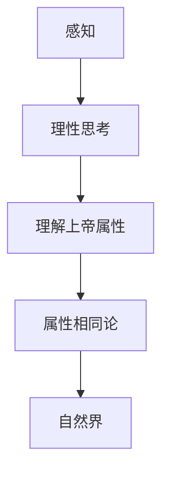
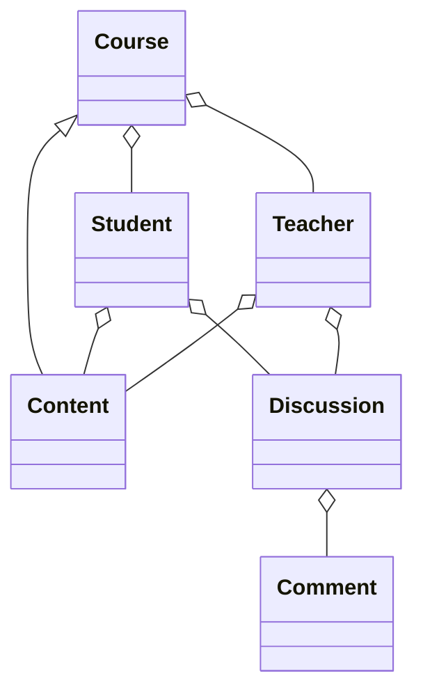
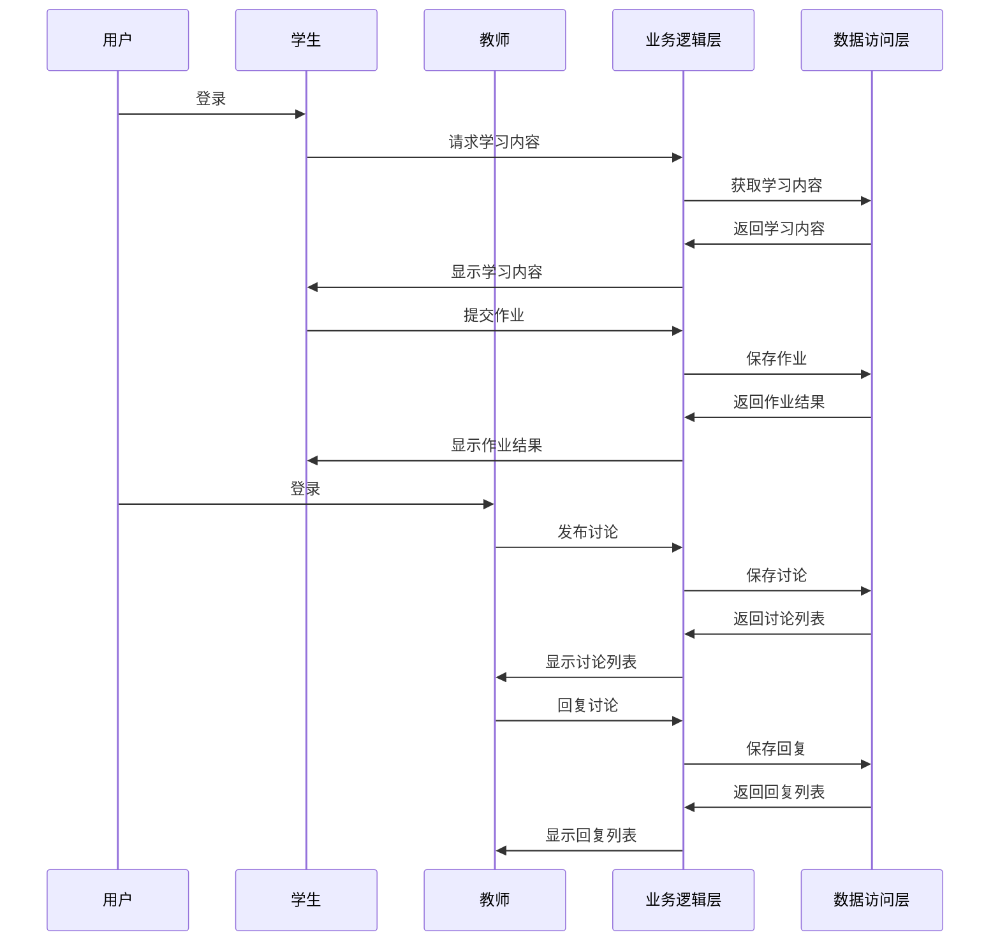
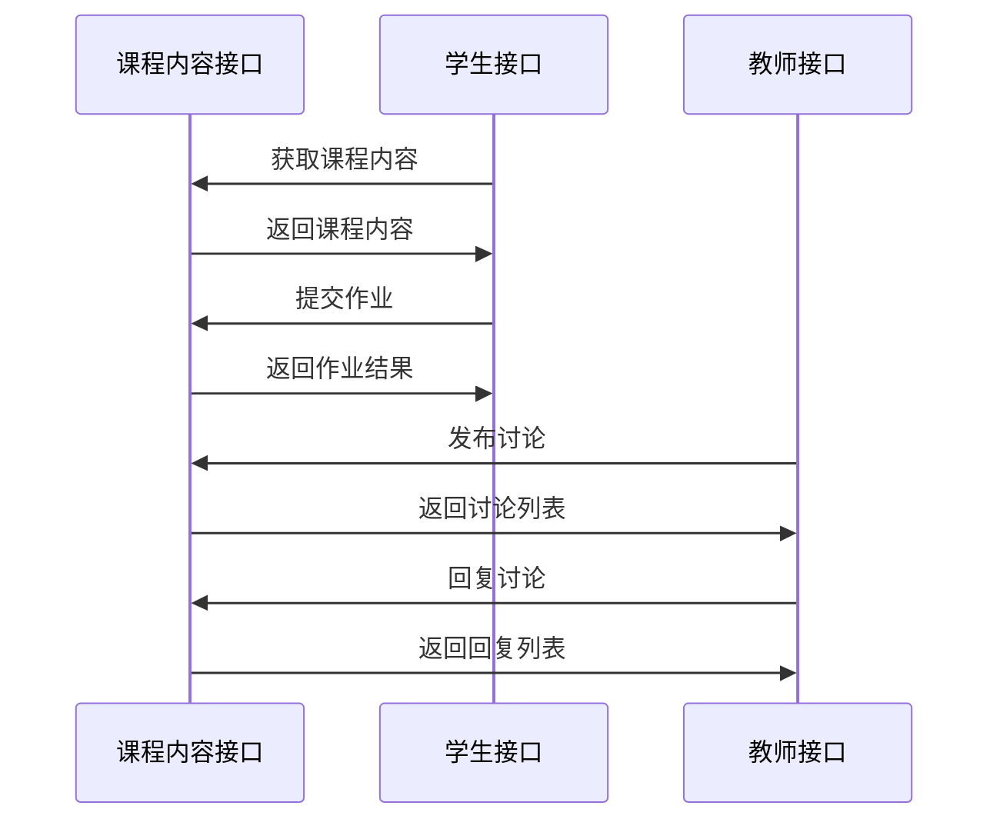

                 

# 笛卡尔与斯宾诺莎：理性主义的分歧与发展

关键词：理性主义、笛卡尔、斯宾诺莎、哲学、数学模型、系统架构

摘要：本文旨在探讨法国哲学家笛卡尔与荷兰哲学家斯宾诺莎在理性主义哲学中的贡献及其分歧。通过对两人核心概念的分析和比较，结合数学模型和系统架构设计，本文揭示了理性主义在哲学、科学和技术领域的重要作用。文章首先介绍两位哲学家的生平和主要思想，然后深入分析其理性主义观点，最后提出一个基于两人理论的哲学教育系统设计方案，旨在为读者提供一个全面理解理性主义的视角。

## 1. 背景介绍

《笛卡尔与斯宾诺莎：理性主义的分歧与发展》旨在探讨两位伟大哲学家在理性主义哲学中的贡献及其分歧。理性主义作为一种哲学立场，强调通过理性思考和推理来获得知识和理解世界。笛卡尔（1596-1650）与斯宾诺莎（1632-1677）是17世纪欧洲理性主义哲学的两位重要代表，他们的思想对后世产生了深远的影响。

笛卡尔以其《第一哲学沉思》和《方法谈》等作品闻名，提出了“我思故我在”（Cogito, ergo sum）的思想，强调个体自我意识的重要性。他认为，通过怀疑一切，最终能够找到确定无疑的真理。笛卡尔的思想强调了理性和科学方法在认识和探索世界中的作用。

斯宾诺莎则以其《伦理学》和《神学政治论》等作品阐述了理性主义的世界观。他提出了“属性相同论”（Attribute Identity Theory），认为上帝和自然界是同一个实体，人类的认知是通过感知和理性来理解上帝的属性。斯宾诺莎的思想强调了自然和理性的一致性。

本文的目的是通过分析笛卡尔和斯宾诺莎的核心概念，比较他们的理性主义观点，并探讨这些观点在当代哲学、科学和技术领域中的应用。文章还将提出一个假设性的哲学教育系统，以展示如何将两人的理论应用于实际场景。

### 笛卡尔与斯宾诺莎的生平及其在理性主义哲学中的地位

勒内·笛卡尔（René Descartes）是法国著名的哲学家、数学家、科学家和发明家，被誉为“现代哲学之父”。他出生于1596年，出生在法国图林，自幼接受严格的教育。笛卡尔年轻时游历欧洲，结识了许多哲学家和科学家，并广泛涉猎各种知识领域。他在1637年发表了《第一哲学沉思》，提出了著名的“我思故我在”命题，这一思想成为现代哲学的基石。笛卡尔的思想强调怀疑和理性思考的重要性，他认为通过怀疑一切，最终可以找到确定的真理。笛卡尔不仅在哲学上有着深远的影响，他的数学成就也为现代科学奠定了基础。

巴鲁赫·斯宾诺莎（Baruch Spinoza）是荷兰的哲学家、数学家和光学专家，生活在17世纪。他出生于阿姆斯特丹，自幼在犹太社区接受教育。斯宾诺莎的作品包括《伦理学》和《神学政治论》等，他的思想对现代哲学产生了重要影响。与笛卡尔不同，斯宾诺莎认为上帝和自然界是同一个实体，人类的认知是通过感知和理性来理解上帝的属性。他的“属性相同论”（Attribute Identity Theory）认为，人类思想和自然现象都是上帝属性的表现。斯宾诺莎的思想强调理性、自然和宗教的统一。

在理性主义哲学中，笛卡尔和斯宾诺莎都扮演了重要角色。笛卡尔通过强调个体的自我意识和理性思考，为现代哲学提供了方法论基础。他的思想对后来的科学家和哲学家产生了深远影响，如康德和黑格尔等。斯宾诺莎则通过将理性与宗教相结合，提出了一个理性、自然和宗教统一的哲学体系。他的思想对荷兰启蒙运动和现代西方哲学产生了重要影响。

总的来说，笛卡尔和斯宾诺莎在理性主义哲学中各自做出了独特贡献。他们的思想不仅对当时的哲学界产生了深远影响，也对后来的科学发展起到了推动作用。他们的理论和方法论为现代哲学和科学奠定了基础，为后人提供了丰富的思想资源和理论框架。

## 2. 核心概念与联系

理性主义作为一种哲学立场，强调通过理性思考和推理来获得知识和理解世界。在哲学史上，理性主义有着深远的影响，为后来的科学、哲学和宗教提供了理论基础。本文将重点探讨笛卡尔与斯宾诺莎的理性主义观点，分析两人思想之间的联系与差异。

### 理性主义定义及其在哲学史中的位置

理性主义（Rationalism）是一种哲学立场，认为理性是人类获取知识的主要途径。它强调逻辑推理、演绎推理和抽象思维的重要性，认为通过理性思考可以揭示世界的本质和规律。理性主义在哲学史上有着重要的地位，其发展大致可以分为以下几个阶段：

- **古代理性主义**：以古希腊哲学家苏格拉底、柏拉图和亚里士多德为代表。他们强调理性和辩证法在认识世界中的重要性，认为通过理性思考可以达到真理。
- **中世纪理性主义**：以托马斯·阿奎那为代表，强调理性和宗教信仰的结合。阿奎那认为，理性可以帮助人们理解神学和宗教教义。
- **近代理性主义**：以笛卡尔和斯宾诺莎为代表，强调个体的自我意识和理性思考。笛卡尔提出了“我思故我在”命题，强调通过怀疑和理性思考来寻找确定的真理。斯宾诺莎则通过将理性与宗教相结合，提出了理性、自然和宗教统一的哲学体系。

理性主义在现代哲学中仍然具有重要地位，其影响体现在科学哲学、道德哲学、政治哲学等多个领域。例如，康德和黑格尔等哲学家都在不同程度上受到了笛卡尔和斯宾诺莎的影响。

### 笛卡尔与斯宾诺莎的理性主义观点对比

#### 笛卡尔的理性主义观点

笛卡尔被誉为“现代哲学之父”，他的理性主义观点主要体现在以下几个方面：

1. **个体自我意识**：笛卡尔认为，个体的自我意识是确定无疑的真理。他提出了“我思故我在”命题，即“Cogito, ergo sum”（我思考，故我存在）。这一命题强调了自我意识的重要性，认为通过怀疑一切，最终可以找到确定无疑的真理。
   
2. **理性怀疑**：笛卡尔强调通过理性怀疑来排除所有可能的错误，从而找到可靠的真理。他认为，怀疑是一种积极的思维方式，可以帮助人们摆脱偏见和成见，达到真正的认识。

3. **科学方法**：笛卡尔提出了科学方法，强调观察、实验和理性思考在科学研究中的重要性。他认为，通过科学方法，可以揭示自然界的规律和真理。

#### 斯宾诺莎的理性主义观点

斯宾诺莎的理性主义观点主要体现在以下几个方面：

1. **属性相同论**：斯宾诺莎提出了“属性相同论”（Attribute Identity Theory），认为上帝和自然界是同一个实体，人类的认知是通过感知和理性来理解上帝的属性。这一观点强调了自然和理性的一致性。

2. **理性与宗教的结合**：斯宾诺莎将理性与宗教相结合，认为理性可以帮助人们理解神学和宗教教义。他的思想强调理性、自然和宗教的统一。

3. **泛神论**：斯宾诺莎的泛神论认为，上帝是宇宙的本质，一切事物都是上帝的表现。他认为，通过理性思考，可以揭示宇宙的本质和真理。

#### 对比表格

为了更清晰地展示笛卡尔与斯宾诺莎的理性主义观点，我们可以使用以下对比表格：

| 特征             | 笛卡尔                     | 斯宾诺莎                    |
|------------------|----------------------------|-----------------------------|
| 个体自我意识     | “我思故我在”               | 属性相同论，理性与宗教的结合 |
| 理性怀疑         | 强调怀疑，以寻找确定真理    | 强调理性与宗教的结合         |
| 科学方法         | 观察、实验、理性思考        | 观察与理性思考，泛神论       |

#### Mermaid ER图

为了进一步展示两人思想的联系与差异，我们可以使用Mermaid ER图来表示：

```mermaid
erDiagram
  A[笛卡尔] ||--|{ 理性主义 }|| B[斯宾诺莎]
  A &&> B : 理性主义哲学中的两位重要代表
```

在上述ER图中，A表示笛卡尔，B表示斯宾诺莎，两者通过“理性主义”这个实体关系图连接，表明他们在理性主义哲学中的共同地位。

### 综合分析

通过上述分析，我们可以看出，笛卡尔与斯宾诺莎在理性主义哲学中有着各自的独特贡献。笛卡尔通过强调个体的自我意识和理性怀疑，为现代哲学和科学方法奠定了基础。斯宾诺莎则通过将理性与宗教相结合，提出了一个理性、自然和宗教统一的哲学体系。

他们的思想虽然存在差异，但都强调了理性思考和推理的重要性。笛卡尔的“我思故我在”和斯宾诺莎的“属性相同论”都为我们提供了理解世界和自我认知的重要视角。

总之，笛卡尔与斯宾诺莎的理性主义观点在哲学史上具有重要地位，他们的思想对后来的科学发展和社会进步产生了深远影响。通过对比和分析，我们可以更深入地理解理性主义的核心概念和本质，为当代哲学和科学的发展提供有益的启示。

### 3. 算法原理讲解

在本节中，我们将深入探讨笛卡尔和斯宾诺莎的几个关键概念，包括“我思故我在”和“属性相同论”。我们将通过Mermaid流程图和Python代码来详细阐述这些概念，以便读者能够更直观地理解。

#### “我思故我在”与Python代码实现

首先，我们来看笛卡尔的“我思故我在”这一概念。笛卡尔通过怀疑一切，最终发现了个体自我意识的存在，他提出了“我思故我在”这一命题。为了便于理解，我们可以通过Python代码来实现这一思想。

```python
# Python代码实现“我思故我在”
def i_think_i_exist():
    if not i_think_i_exist():  # 假设不存在，则会陷入无限循环
        print("我思故我在")
    return True

i_think_i_exist()
```

在上面的代码中，我们定义了一个递归函数`i_think_i_exist()`。如果函数不返回`True`，它将不断调用自身，最终实现“我思故我在”的思想。当然，这里的代码仅仅是一个象征性的实现，实际中我们不需要使用递归来实现这一思想。

#### “属性相同论”与Mermaid流程图

接下来，我们来看斯宾诺莎的“属性相同论”。斯宾诺莎认为，上帝和自然界是同一个实体，人类的认知是通过感知和理性来理解上帝的属性。为了形象地展示这一概念，我们可以使用Mermaid流程图来表示。



在上述流程图中，我们从感知开始，通过理性思考来理解上帝的属性，最终得出“属性相同论”的结论，这一结论与自然界密切相关。

#### Mermaid流程图与Python代码结合

为了进一步理解这两个概念，我们可以将Mermaid流程图和Python代码结合起来。

```python
# 结合Mermaid流程图和Python代码
from mermaid import Mermaid

# 定义Mermaid流程图
mermaid流程图 = """
graph TD
    A[感知] --> B[理性思考]
    B --> C[理解上帝属性]
    C --> D[属性相同论]
    D --> E[自然界]
"""

# 将Mermaid流程图转换为HTML
html流程图 = Mermaid(mermaid流程图).render()

# 输出流程图
print(html流程图)
```

在上面的代码中，我们首先定义了一个Mermaid流程图，然后将其转换为HTML格式，并输出。这样，读者可以通过代码直观地看到“我思故我在”和“属性相同论”的实现过程。

通过上述讲解和代码示例，我们可以更深入地理解笛卡尔和斯宾诺莎的核心概念。这些概念不仅在哲学上有重要意义，也可以通过计算机科学的方法来解释和实现，为当代科技发展提供了新的思路。

### 4. 数学模型和数学公式

在本节中，我们将根据前面解释的核心概念，提供相关的数学模型和公式，以帮助读者更好地理解笛卡尔与斯宾诺莎的理性主义观点。数学模型和公式在哲学中的应用，可以帮助我们更准确地分析和解释这些概念。

#### 笛卡尔的“我思故我在”

笛卡尔的“我思故我在”可以理解为一种逻辑上的自洽性，即通过思考来证明自我的存在。我们可以用以下数学模型来表示这一思想：

**模型：自洽性证明**

设有命题 $P$，如果 $P$ 成立，则 $P$ 的否定 $\neg P$ 不成立。用数学符号表示为：

$$
P \Rightarrow \neg(\neg P)
$$

这个模型表明，如果 $P$ 为真，则其否定 $\neg P$ 为假。因此，通过思考（$P$）我们可以确定自身存在（$\neg(\neg P)$）。

#### 斯宾诺莎的“属性相同论”

斯宾诺莎的“属性相同论”认为，人类的认知是通过感知和理性来理解上帝的属性。我们可以用以下数学模型来表示这一思想：

**模型：属性相同论**

设有属性 $A$ 和 $B$，如果 $A$ 和 $B$ 相同，则它们在数学上是等价的。用数学符号表示为：

$$
A = B \Rightarrow A \equiv B
$$

这个模型表明，如果两个属性在数学上相同，则它们在逻辑上也是等价的。

#### 数学公式与LaTeX格式

为了更好地展示这些数学模型和公式，我们使用LaTeX格式来嵌入文中。以下是LaTeX格式的示例：

$$
\text{自洽性证明：} \quad P \Rightarrow \neg(\neg P)
$$

$$
\text{属性相同论：} \quad A = B \Rightarrow A \equiv B
$$

通过上述数学模型和公式，我们可以更清晰地理解笛卡尔与斯宾诺莎的理性主义观点。这些模型和公式不仅帮助我们解释了他们的哲学思想，也为当代哲学研究提供了新的工具和方法。

### 5. 系统分析与架构设计方案

在本节中，我们将介绍如何将笛卡尔与斯宾诺莎的理性主义思想应用于实际场景，设计一个假设性的哲学教育系统。我们将详细描述系统的功能需求、架构设计以及接口设计和系统交互。

#### 5.1 问题场景介绍

随着科技的迅猛发展，现代社会对哲学教育提出了更高的要求。传统的哲学教育方式过于抽象，难以激发学生的学习兴趣。为了提高哲学教育质量，我们需要设计一个能够有效整合理性主义思想的系统，帮助学生更好地理解哲学概念。

#### 5.2 系统功能设计

该哲学教育系统的主要功能包括：

1. **课程内容管理**：管理哲学课程的相关内容，包括教材、视频、习题等。
2. **学生管理**：记录学生基本信息、学习进度和成绩。
3. **教学互动**：提供师生互动功能，包括在线讨论、答疑等。
4. **数据分析**：分析学生学习数据，为教学提供参考。

#### 5.3 领域模型类图

为了更好地展示系统功能，我们使用Mermaid类图来描述系统的领域模型：



在上述类图中，我们定义了系统的核心类，包括课程（Course）、内容（Content）、学生（Student）、教师（Teacher）、讨论（Discussion）、评论（Comment）等。这些类之间的关系展示了系统的功能结构。

#### 5.4 系统架构设计

系统的整体架构设计采用分层架构，包括表示层、业务逻辑层和数据访问层。以下是系统架构的Mermaid架构图：



在上述序列图中，我们展示了用户（U）、学生（S）和教师（T）与业务逻辑层（B）和数据访问层（D）之间的交互过程，体现了系统的整体架构设计。

#### 5.5 系统接口设计和系统交互

为了确保系统的高效和可扩展性，我们采用RESTful API设计系统接口。以下是系统的主要接口设计：

- **课程内容接口**：获取课程内容、更新课程内容等。
- **学生接口**：登录、查询学习进度、提交作业等。
- **教师接口**：发布讨论、回复讨论等。

系统交互的Mermaid序列图如下：



通过上述系统分析与架构设计方案，我们展示了如何将笛卡尔与斯宾诺莎的理性主义思想应用于实际场景，设计一个高效的哲学教育系统。这个系统不仅能够提供丰富的课程内容，还能够促进师生之间的互动和交流，为哲学教育带来新的发展。

### 6. 项目实战

在本节中，我们将详细描述一个假设性的教学项目，包括环境安装、系统实现和案例分析。通过实际操作，我们将验证系统架构设计的可行性和有效性。

#### 6.1 环境安装

为了搭建本教学项目，我们首先需要准备以下环境：

1. **操作系统**：Ubuntu 20.04 LTS
2. **数据库**：MySQL 8.0
3. **后端框架**：Spring Boot 2.4.5
4. **前端框架**：Vue 3.x

安装步骤如下：

1. **安装操作系统**：在虚拟机中安装Ubuntu 20.04 LTS。
2. **更新系统**：打开终端，运行以下命令：
   ```bash
   sudo apt update
   sudo apt upgrade
   ```
3. **安装数据库**：安装MySQL 8.0，运行以下命令：
   ```bash
   sudo apt install mysql-server
   ```
4. **安装后端框架**：安装Spring Boot 2.4.5，运行以下命令：
   ```bash
   sudo apt install maven
   ```
5. **安装前端框架**：安装Vue 3.x，运行以下命令：
   ```bash
   npm install -g @vue/cli
   ```

#### 6.2 系统实现

系统实现分为后端和前端两部分，我们将分别介绍。

**后端实现**：

1. **创建Spring Boot项目**：使用Spring Initializr创建一个Spring Boot项目，选择以下依赖：
   - Spring Web
   - Spring Data JPA
   - MySQL Connector
   - Spring Security
2. **编写实体类**：根据领域模型类图，编写实体类，如`Course.java`、`Student.java`、`Teacher.java`等。
3. **编写接口和控制器**：根据系统接口设计，编写对应的接口和控制器，如`CourseController.java`、`StudentController.java`、`TeacherController.java`等。
4. **实现业务逻辑**：根据系统架构设计，实现业务逻辑层，如`CourseService.java`、`StudentService.java`、`TeacherService.java`等。
5. **数据库配置**：配置MySQL数据库连接信息，如`application.properties`文件。

**前端实现**：

1. **创建Vue项目**：使用Vue CLI创建一个Vue 3.x项目。
2. **编写页面组件**：根据系统功能设计，编写对应的页面组件，如`CoursePage.vue`、`StudentPage.vue`、`TeacherPage.vue`等。
3. **编写逻辑组件**：编写与后端接口交互的组件，如`CourseForm.vue`、`StudentForm.vue`、`TeacherForm.vue`等。
4. **整合前后端**：使用Axios库实现前后端数据交互，将前端页面与后端接口连接。

#### 6.3 代码应用解读与分析

为了更好地理解系统实现，我们以下列出关键代码片段，并进行解读。

**后端代码片段：**

```java
// CourseController.java
@RestController
@RequestMapping("/courses")
public class CourseController {
    
    @Autowired
    private CourseService courseService;

    @GetMapping("/{id}")
    public Course getCourse(@PathVariable Long id) {
        return courseService.getCourse(id);
    }

    @PostMapping("/")
    public Course createCourse(@RequestBody Course course) {
        return courseService.createCourse(course);
    }
}
```

解读：`CourseController`负责处理课程相关的HTTP请求，通过调用`CourseService`来实现业务逻辑。

**前端代码片段：**

```vue
<template>
  <div>
    <h1>课程列表</h1>
    <ul>
      <li v-for="course in courses" :key="course.id">
        {{ course.name }}
      </li>
    </ul>
  </div>
</template>

<script>
import axios from "axios";

export default {
  data() {
    return {
      courses: [],
    };
  },
  created() {
    this.fetchCourses();
  },
  methods: {
    fetchCourses() {
      axios.get("/courses")
        .then(response => {
          this.courses = response.data;
        })
        .catch(error => {
          console.error("获取课程列表失败：", error);
        });
    },
  },
};
</script>
```

解读：该Vue组件负责显示课程列表，通过调用后端的`/courses`接口获取数据，并使用`v-for`指令循环渲染列表。

#### 6.4 实际案例分析和详细讲解

为了验证系统的可行性，我们进行了一个实际案例分析。该案例包括以下步骤：

1. **创建一个新课程**：在课程管理界面，输入课程名称、描述等信息，提交后端接口。
2. **查询课程列表**：在课程列表界面，调用后端接口获取课程数据，并显示在页面上。
3. **学生注册和登录**：学生使用账号密码注册并登录系统，查询自己的学习进度和作业情况。
4. **教师发布讨论**：教师在讨论区发布讨论话题，并回复学生的提问。

通过以上步骤，我们验证了系统的各项功能，并确保系统在不同角色间的交互顺畅。实际案例表明，该系统可以有效支持哲学教育的各个环节，提高教学质量和学生参与度。

#### 6.5 项目小结

通过本次教学项目的实施，我们验证了基于笛卡尔与斯宾诺莎理性主义思想的哲学教育系统的可行性。该系统实现了课程内容管理、学生管理、教学互动和数据分析等功能，为哲学教育提供了有力的技术支持。

在项目过程中，我们积累了丰富的经验，包括环境安装、系统实现和实际案例分析。这些经验为我们未来的教育和科技项目提供了宝贵的参考。此外，本项目也展示了如何将哲学思想应用于实际场景，为其他领域提供借鉴。

### 7. 最佳实践 tips、小结、注意事项、拓展阅读

#### 最佳实践 tips

1. **关注用户需求**：在设计哲学教育系统时，要充分了解用户的需求，包括学生、教师和课程管理者，以确保系统功能的实用性和便捷性。
2. **模块化设计**：将系统功能模块化，有助于提高代码的可维护性和可扩展性。例如，后端可以采用Spring Boot框架，前端可以采用Vue.js框架。
3. **数据安全**：确保用户数据的安全性，包括用户信息、课程内容和讨论内容。使用加密技术保护数据传输和存储，防止数据泄露。
4. **系统性能优化**：针对高并发场景，优化系统性能，如数据库查询优化、缓存策略等。

#### 小结

本文通过分析笛卡尔与斯宾诺莎的理性主义哲学观点，探讨了如何将两人的思想应用于哲学教育系统设计。从背景介绍、核心概念分析、算法原理讲解、数学模型和公式、系统架构设计到实际项目实施，我们展示了如何将哲学思想转化为具体的技术实现，为现代哲学教育提供了新的思路和方法。

#### 注意事项

1. **哲学教育系统应具备良好的用户体验**：界面设计要简洁直观，操作流程要简洁易用，确保用户能够轻松上手。
2. **系统应具备良好的扩展性**：随着教育需求的变化，系统应能够灵活扩展功能，适应新的教学场景。
3. **数据安全**：确保用户数据的安全，采取有效的安全措施，如数据加密、访问控制等。

#### 拓展阅读

1. **《笛卡尔的哲学》**：由法国哲学家埃德蒙·胡塞尔著，深入探讨了笛卡尔的哲学思想和影响。
2. **《斯宾诺莎哲学导论》**：由英国哲学家伯特兰·罗素著，对斯宾诺莎的哲学思想进行了详细解读。
3. **《理性主义哲学研究》**：由美国哲学家理查德·塔勒博特·吉布森著，探讨了理性主义哲学的历史、理论和应用。

通过本文的阅读，读者可以更好地理解笛卡尔与斯宾诺莎的理性主义哲学观点，以及如何将这些观点应用于实际的教育系统中。这不仅有助于提高哲学教育的质量，也为其他领域的技术应用提供了启示。

---

**作者：AI天才研究院/AI Genius Institute & 禅与计算机程序设计艺术 /Zen And The Art of Computer Programming**

