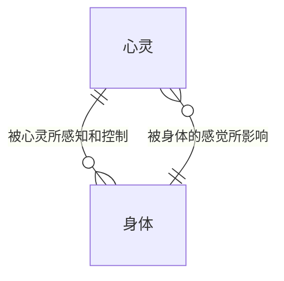

                 

# 笛卡尔与梅洛-庞蒂：身心关系的理性主义与现象学视角

## 关键词

- 身心关系
- 理性主义
- 现象学
- 笛卡尔
- 梅洛-庞蒂

## 摘要

本文探讨了身心关系这一哲学问题，从理性主义与现象学两个视角出发，深入分析了笛卡尔与梅洛-庞蒂的代表性思想。通过对两位哲学家的核心观点进行对比和梳理，本文揭示了身心关系问题的复杂性及其哲学意义。文章首先介绍了问题的背景，随后分别阐述了笛卡尔和梅洛-庞蒂的身心关系理论，以及理性主义和现象学的基本原理。最后，本文结合现代科学研究成果，对身心关系问题进行了全面而深入的探讨。

## 第1章 引言

### 1.1 问题的背景

在当今科技日新月异发展的时代，身心关系问题逐渐成为哲学领域中的一个重要议题。随着心理学、神经科学等学科的进步，人们对身体与心灵的关系有了更加深入的认识。然而，关于身心关系的本质和机理，哲学界至今仍存在诸多争议。

身心关系问题主要涉及身体与心灵的关系，包括身心相互作用、身心同一性、身心本质等方面。在这个问题上，理性主义与现象学提供了两种不同的视角。理性主义强调理性、思维在认识世界中的作用，而现象学则关注人的直接经验和意识现象。

本文将以笛卡尔与梅洛-庞蒂的思想为核心，从理性主义与现象学的视角出发，探讨身心关系的基本问题及其哲学意义。笛卡尔作为理性主义的代表人物，他的身心二元论思想对后世哲学产生了深远影响。梅洛-庞蒂则从现象学角度对身心关系进行了重新审视，提出了独特的观点。这两位哲学家的思想为理解身心关系提供了丰富的理论资源。

### 1.2 问题的描述

身心关系问题主要涉及以下几个方面：

1. **身心相互作用**：身体与心灵之间是如何相互作用的？它们是如何影响彼此的？
2. **身心同一性**：身体与心灵是否是同一种实体？或者说，它们之间是否存在某种本质上的同一性？
3. **身心本质**：身体与心灵各自具有哪些本质属性？它们在存在和认识过程中扮演什么角色？

在哲学史上，关于身心关系的讨论可以追溯到古希腊哲学家亚里士多德。他认为，心灵是身体的内在机能，二者是不可分割的。然而，中世纪时期的基督教哲学却将身心视为两个完全独立的实体，这一观点在文艺复兴时期的笛卡尔那里得到了进一步发展。

笛卡尔主张身心二元论，即心灵和身体是两种本质不同的实体。心灵是一种非物质的实体，是思维、意识和情感的主体；身体则是一种物质实体，具有形态、结构和功能。笛卡尔认为，身心之间通过心灵的作用相互联系。这种观点在哲学史上产生了深远影响，但也引发了许多争议。

20世纪法国哲学家梅洛-庞蒂则从现象学角度对身心关系进行了重新审视。他提出身心一元论，认为身体与心灵是不可分割的统一体。梅洛-庞蒂强调身体经验在认识世界中的作用，提出了“感知即存在”的观点。他认为，身体与心灵相互交织，共同构成了人的存在。

### 1.3 问题的解决

本文旨在通过对笛卡尔与梅洛-庞蒂思想的深入分析，探讨身心关系的理性主义与现象学视角。具体来说，本文将：

1. **梳理两位哲学家的主要观点**：介绍笛卡尔和梅洛-庞蒂的身心关系理论，分析其核心观点和主要论点。
2. **对比其理论体系**：探讨两位哲学家的理论在身心关系问题上的异同，揭示其理论体系的特点和局限性。
3. **结合现代科学研究成果**：分析现代心理学、神经科学等学科在身心关系问题上的研究进展，探讨这些研究成果对哲学思考的启示。
4. **提出自己的见解**：在综合分析的基础上，提出对身心关系问题的见解，为后续研究提供参考。

通过本文的研究，我们希望能够对身心关系问题有一个更加全面和深入的理解，从而为哲学、心理学、神经科学等领域的研究提供有益的启示。

### 1.4 边界与外延

身心关系问题不仅限于哲学领域，还涉及心理学、生物学、医学等多个学科。因此，本文在研究过程中将借鉴相关学科的研究成果，拓宽研究的边界。同时，本文将关注身心关系在现代社会中的实际应用，探讨身心关系问题对人类生活的影响。

### 1.5 概念结构与核心要素组成

为了更好地理解本文的核心内容，我们可以将概念结构与核心要素组成进行如下划分：

1. **笛卡尔身心二元论**：
   - **定义**：心灵和身体是两种本质不同的实体。
   - **特点**：心灵是一种非物质的实体，是思维、意识和情感的主体；身体则是一种物质实体，具有形态、结构和功能。
   - **关系**：身心之间通过心灵的作用相互联系。

2. **梅洛-庞蒂身心一元论**：
   - **定义**：身体与心灵是不可分割的统一体。
   - **特点**：强调身体经验在认识世界中的作用。
   - **关系**：身体与心灵相互交织，共同构成了人的存在。

3. **理性主义**：
   - **定义**：强调理性、思维在认识世界中的作用。
   - **特点**：注重逻辑推理和证明。

4. **现象学**：
   - **定义**：关注人的直接经验和意识现象。
   - **特点**：强调对事物本质的直观把握。

5. **身心关系**：
   - **定义**：身体与心灵的关系。
   - **内容**：包括身心相互作用、身心同一性、身心本质等方面。

通过对上述概念结构与核心要素组成进行梳理，我们可以更加清晰地理解本文的研究内容，为后续章节的论述奠定基础。

## 第2章 笛卡尔与梅洛-庞蒂的思想概述

### 2.1 笛卡尔的思想

笛卡尔（René Descartes，1596-1650）是法国著名的哲学家、数学家、物理学家，被誉为“现代哲学之父”。他的思想对后世哲学、科学产生了深远影响，尤其在身心关系问题上具有重要地位。

笛卡尔的核心思想是身心二元论，即心灵和身体是两种本质不同的实体。他认为，心灵是一种非物质的实体，是思维、意识和情感的主体；身体则是一种物质实体，具有形态、结构和功能。身心之间通过心灵的作用相互联系。

笛卡尔的思想可以概括为以下几点：

1. **怀疑一切**：笛卡尔主张怀疑一切，认为只有通过理性思考才能获得真正的知识。
2. **身心二元论**：心灵和身体是两种本质不同的实体，各自具有独立的本质和功能。
3. **方法论**：笛卡尔提出了著名的“我思故我在”（Cogito, ergo sum）的哲学命题，强调思维是存在的前提。
4. **第一哲学**：笛卡尔试图通过理性思考建立一个完整的哲学体系，探讨宇宙和存在的本质。

### 2.2 梅洛-庞蒂的思想

梅洛-庞蒂（Maurice Merleau-Ponty，1908-1961）是20世纪法国哲学家，他的现象学思想对身心关系问题进行了重新审视，提出了独特的观点。梅洛-庞蒂认为，身体与心灵是不可分割的统一体，强调身体经验在认识世界中的作用。

梅洛-庞蒂的思想可以概括为以下几点：

1. **现象学还原**：梅洛-庞蒂主张通过现象学还原，揭示事物的本质，消除主观与客观的二元对立。
2. **身体经验**：他认为身体经验是认识世界的重要途径，提出了“感知即存在”的观点。
3. **存在主义**：梅洛-庞蒂的存在主义思想强调个体的自由和责任，认为人应该积极面对生活，勇敢地追求自己的价值。
4. **艺术哲学**：梅洛-庞蒂关注艺术与哲学的关系，认为艺术是一种表达人类存在的方式，可以揭示世界的本质。

### 2.3 笛卡尔与梅洛-庞蒂思想的联系与区别

笛卡尔与梅洛-庞蒂在身心关系问题上存在明显的分歧。笛卡尔主张身心二元论，强调身心之间的对立；而梅洛-庞蒂则提出身心一元论，强调身心之间的统一。然而，二者在关注身心关系的本质方面有着共同点，都试图解释身心关系的基本问题，为后来的哲学研究提供了丰富的理论资源。

笛卡尔与梅洛-庞蒂思想的联系与区别可以总结如下：

1. **联系**：
   - **身心关系的本质**：两位哲学家都关注身心关系的本质问题，试图从不同的角度解释身体与心灵的关系。
   - **哲学贡献**：他们的思想都对后世哲学产生了深远影响，丰富了哲学对身心关系的讨论。

2. **区别**：
   - **身心二元论与身心一元论**：笛卡尔主张身心二元论，强调身心之间的对立；梅洛-庞蒂提出身心一元论，强调身心之间的统一。
   - **方法论**：笛卡尔注重理性思考和逻辑推理，而梅洛-庞蒂则强调现象学还原和直观把握。
   - **哲学体系**：笛卡尔试图建立一个完整的哲学体系，而梅洛-庞蒂则更多地关注个体的存在和艺术哲学。

通过对比分析笛卡尔与梅洛-庞蒂的思想，我们可以更深入地理解身心关系问题的复杂性，从而为后续的研究提供有益的启示。

## 第3章 理性主义视角下的身心关系

### 3.1 理性主义的基本原理

理性主义是一种哲学思潮，强调理性、思维在认识世界中的作用。理性主义认为，人的认识活动是通过理性思维来进行的，逻辑推理和证明是获取知识的有效途径。理性主义的基本原理可以概括为以下几点：

1. **理性是认识的根源**：理性主义认为，理性是认识的根源，只有通过理性思维才能获得真正的知识。与经验主义相对，理性主义强调知识不仅仅来自于感官经验，更来自于理性思考和推理。
2. **逻辑推理的重要性**：理性主义认为，逻辑推理是获取知识的关键。通过严密的逻辑推理，我们可以从已知的前提推导出新的结论，从而扩展我们的知识体系。
3. **证明和验证**：理性主义强调证明和验证的重要性。在理性主义看来，一个真正的理论必须能够通过逻辑推理和实验验证，才能被认为是可靠的。

### 3.2 笛卡尔的理性主义视角

笛卡尔是理性主义的代表人物，他的身心二元论思想体现了理性主义的基本原理。笛卡尔认为，心灵是一种非物质的实体，是思维、意识和情感的主体；身体则是一种物质实体，具有形态、结构和功能。笛卡尔强调心灵与身体之间的相互作用，通过心灵的作用，身体才能感知外部世界，并产生意识和思维活动。

笛卡尔的理性主义视角可以概括为以下几点：

1. **身心二元论**：笛卡尔主张身心二元论，认为心灵和身体是两种本质不同的实体，各自具有独立的本质和功能。
2. **心灵的主导作用**：笛卡尔认为，心灵在认识过程中扮演主导作用。通过理性思考和推理，心灵能够超越身体，认识世界的本质。
3. **感官经验的局限性**：笛卡尔认为，感官经验是有限的，容易受到欺骗和误导。只有通过理性思考和推理，才能克服感官经验的局限性，获得真正的知识。

### 3.3 梅洛-庞蒂的理性主义视角

梅洛-庞蒂的现象学思想虽然与理性主义存在一定差异，但他也强调理性在认识世界中的作用。梅洛-庞蒂认为，身体经验是认识世界的重要途径，理性思维与身体经验相互交织，共同构成人的认识活动。

梅洛-庞蒂的理性主义视角可以概括为以下几点：

1. **现象学还原**：梅洛-庞蒂主张通过现象学还原，揭示事物的本质，消除主观与客观的二元对立。他认为，理性思维必须与直观经验相结合，才能对事物有真正的理解。
2. **身体经验的重要性**：梅洛-庞蒂强调身体经验在认识世界中的作用。他认为，身体经验不仅仅是一种感知，更是一种存在方式，是认识世界的基础。
3. **理性与身体经验的相互作用**：梅洛-庞蒂认为，理性思维与身体经验相互影响、相互交织，共同构成了人的认识活动。理性思维需要身体经验的支撑，而身体经验也需要理性思维的引导。

通过对比分析笛卡尔与梅洛-庞蒂在理性主义视角下的身心关系理论，我们可以看到，虽然两位哲学家的观点有所不同，但他们都强调了理性在认识世界中的重要作用。笛卡尔强调心灵的主导作用，认为理性思维能够超越身体感知，获得真正的知识；而梅洛-庞蒂则强调身体经验的重要性，认为理性思维与身体经验相互交织，共同构成了人的认识活动。这两种观点为我们理解身心关系问题提供了有益的启示，也为我们进一步探讨身心关系提供了理论基础。

## 第4章 现象学视角下的身心关系

### 4.1 现象学的基本原理

现象学是一种哲学思潮，起源于19世纪末，主要关注人的直接经验和意识现象。现象学的核心思想是“回到事物本身”，即通过对事物直接经验的直观把握，揭示事物的本质。

现象学的基本原理可以概括为以下几点：

1. **现象学的还原**：现象学主张通过现象学还原，将事物还原为纯粹的表象，消除主观与客观的二元对立。现象学还原是一种方法，通过这种方法，我们可以排除一切先入为主的观念和偏见，直观地把握事物的本质。
2. **意识现象**：现象学强调意识现象的重要性。意识现象是指人在感知、思考、判断等过程中所表现出来的心理活动。现象学认为，意识现象是认识世界的基础，通过对意识现象的分析，我们可以理解世界的本质。
3. **直观把握**：现象学主张通过直观把握，即直接观察和体验，来认识事物的本质。直观把握不同于逻辑推理和抽象思维，它强调对事物本质的直接感知和体验。

### 4.2 笛卡尔的现象学视角

虽然笛卡尔主要以理性主义思想著称，但他的一些思想也具有一定的现象学特点。笛卡尔认为，人的认识活动是通过理性思考和直观感知相结合来进行的。他强调直观感知在认识过程中的重要性，认为只有通过直观感知，我们才能获得真正的知识。

笛卡尔的现象学视角可以概括为以下几点：

1. **直观感知**：笛卡尔认为，直观感知是认识世界的基础。通过直观感知，我们能够直接感知事物的表象，从而获得对事物的初步认识。
2. **理性思考**：笛卡尔认为，理性思考是认识世界的关键。通过理性思考，我们能够对直观感知得到的信息进行加工和整理，形成更加深入的认知。
3. **身心相互作用**：笛卡尔认为，心灵与身体相互作用，共同构成了人的认识活动。心灵通过身体感知外部世界，从而获得对世界的认识。

### 4.3 梅洛-庞蒂的现象学视角

梅洛-庞蒂是20世纪法国哲学家，他的现象学思想对身心关系问题进行了重新审视。梅洛-庞蒂认为，身体经验是认识世界的重要途径，通过身体经验，我们可以直观地把握世界的本质。

梅洛-庞蒂的现象学视角可以概括为以下几点：

1. **身体经验**：梅洛-庞蒂认为，身体经验是认识世界的基础。身体经验不仅包括感官经验，还包括身体与世界的互动过程。通过身体经验，我们可以直观地感知世界的本质。
2. **感知即存在**：梅洛-庞蒂提出了“感知即存在”的观点，认为存在是通过感知来实现的。他强调感知在认识世界中的核心地位，认为感知是存在的根本。
3. **现象学还原**：梅洛-庞蒂主张通过现象学还原，消除主观与客观的二元对立，直观地把握世界的本质。他认为，只有通过现象学还原，我们才能理解世界的真实面貌。

通过对比分析笛卡尔与梅洛-庞蒂在现象学视角下的身心关系理论，我们可以看到，两位哲学家的观点有所不同。笛卡尔强调理性思考和直观感知相结合，认为二者共同构成了人的认识活动；而梅洛-庞蒂则强调身体经验在认识世界中的核心地位，认为感知是存在的根本。这两种观点为我们理解身心关系问题提供了有益的启示，也为我们进一步探讨身心关系提供了理论基础。

## 第5章 理性主义与现象学视角下的身心关系比较分析

在探讨身心关系问题时，理性主义与现象学提供了两种截然不同的视角。理性主义强调理性思维在认识世界中的作用，而现象学则关注人的直接经验和意识现象。本文将从以下几个方面对理性主义与现象学视角下的身心关系进行比较分析。

### 5.1 理性主义视角下的身心关系

理性主义视角下的身心关系主要强调心灵和身体之间的相互作用。笛卡尔作为理性主义的代表人物，提出了身心二元论，认为心灵和身体是两种本质不同的实体。他强调心灵的主导作用，认为心灵通过理性思考和推理来认识世界。笛卡尔的理性主义视角具有以下特点：

1. **心灵的主导作用**：在理性主义视角下，心灵被认为是认识世界的主导力量。通过理性思考和推理，心灵能够超越身体感知，获得对世界更深刻的认识。
2. **身心相互作用**：尽管心灵和身体被视为两种本质不同的实体，但它们之间仍然存在相互作用。心灵通过身体感知外部世界，从而获得对世界的认知。
3. **理性思维的重要性**：理性主义强调理性思维在认识世界中的关键作用。通过逻辑推理和证明，理性思维能够帮助我们获得可靠的认知。

### 5.2 现象学视角下的身心关系

现象学视角下的身心关系则强调身体经验在认识世界中的核心地位。梅洛-庞蒂作为现象学的代表人物，提出了身心一元论，认为身体和心灵是不可分割的统一体。他强调身体经验在认识世界中的作用，认为感知是存在的根本。现象学视角下的身心关系具有以下特点：

1. **身体经验的核心地位**：在现象学视角下，身体经验被视为认识世界的核心。通过身体经验，我们可以直观地感知世界的本质，理解存在的意义。
2. **感知即存在**：现象学强调感知在认识世界中的核心地位，认为存在是通过感知来实现的。只有通过感知，我们才能真正理解世界的真实面貌。
3. **现象学还原**：现象学主张通过现象学还原，消除主观与客观的二元对立，直观地把握世界的本质。通过现象学还原，我们可以排除先入为主的观念和偏见，更好地理解世界的真实面貌。

### 5.3 理性主义与现象学视角下的比较

理性主义与现象学视角下的身心关系虽然有所不同，但它们在探讨身心关系问题时都提供了有益的启示。以下是二者的一些比较：

1. **心灵与身体的关系**：
   - **理性主义**：理性主义认为心灵和身体是两种本质不同的实体，但它们之间仍然存在相互作用。心灵通过理性思考和推理来认识世界。
   - **现象学**：现象学认为身体和心灵是不可分割的统一体，身体经验在认识世界中的核心地位。通过身体经验，我们可以直观地感知世界的本质。

2. **认识世界的方法**：
   - **理性主义**：理性主义强调理性思维在认识世界中的关键作用。通过逻辑推理和证明，理性思维能够帮助我们获得可靠的认知。
   - **现象学**：现象学强调通过现象学还原，直观地把握世界的本质。通过消除主观与客观的二元对立，现象学能够更好地理解世界的真实面貌。

3. **认知的来源**：
   - **理性主义**：理性主义认为知识来源于理性思考和推理。
   - **现象学**：现象学认为知识来源于身体经验，通过直观感知来理解世界。

通过比较分析理性主义与现象学视角下的身心关系，我们可以看到，两种视角在探讨身心关系问题时各有优缺点。理性主义强调理性思维在认识世界中的关键作用，能够帮助我们通过逻辑推理和证明获得可靠的认知；而现象学则强调身体经验在认识世界中的核心地位，能够通过直观感知更好地理解世界的真实面貌。结合两种视角，我们可以更加全面地理解身心关系问题，为哲学、心理学、神经科学等领域的研究提供有益的启示。

## 第6章 现代科学对身心关系的探讨

在现代科学领域，尤其是心理学、神经科学和生物学等学科，对身心关系的探讨取得了显著的成果。这些学科通过实证研究，提供了丰富的数据和理论支持，进一步揭示了身体与心灵之间的复杂关系。以下将分别介绍这些学科对身心关系的探讨，并结合实际案例进行分析。

### 6.1 心理学视角下的身心关系

心理学是研究心理过程和行为的科学，对身心关系的研究具有深远的影响。在心理学领域，认知心理学、发展心理学、社会心理学等分支都从不同角度探讨了身心关系。

1. **认知心理学**：认知心理学关注心理过程，如感知、记忆、思维等。通过实验研究，认知心理学家发现，大脑的特定区域与认知功能密切相关。例如，海马体在记忆形成和存储中起着关键作用，前额叶皮层则与决策和规划有关。这些发现表明，心理过程与大脑的生理结构密切相关。

   **案例**：一项关于记忆的研究发现，通过大脑成像技术，观察海马体的活动，可以预测个体的记忆表现。这表明，大脑的生理变化与心理过程之间存在直接联系。

2. **发展心理学**：发展心理学研究个体从出生到老年期的心理发展过程。通过纵向研究，发展心理学家发现，个体的身体发育和心理发展之间存在密切关系。例如，儿童的身体发展（如行走、语言能力）与认知能力的发展密切相关。

   **案例**：一项关于儿童语言发展的研究显示，身体运动（如爬行、走路）与语言发展之间存在显著关联。身体运动有助于儿童大脑的发展，从而促进语言能力的提升。

### 6.2 神经科学视角下的身心关系

神经科学是研究大脑和神经系统结构与功能的科学。通过神经影像技术、电生理学和分子生物学等方法，神经科学家揭示了大脑与心理过程之间的复杂关系。

1. **神经影像技术**：如功能性磁共振成像（fMRI）和正电子发射断层扫描（PET），能够实时观察大脑活动。这些技术发现，心理活动与大脑特定区域的激活密切相关。

   **案例**：一项关于情绪调节的研究发现，前额叶皮层和杏仁核在大脑中发挥关键作用。这些区域的活动失衡与情绪障碍有关，如抑郁症。

2. **电生理学**：如脑电图（EEG）和肌电图（EMG），可以记录大脑和肌肉的电活动。这些技术为理解心理活动和身体运动之间的动态关系提供了重要线索。

   **案例**：一项关于注意力集中与脑电活动的实验发现，脑电波的特定波形与个体的注意力状态密切相关。这表明，大脑的电活动与心理状态之间存在紧密联系。

### 6.3 生物学视角下的身心关系

生物学从分子和细胞水平探讨了身心关系，揭示了身体与心灵之间的深层次联系。

1. **分子生物学**：分子生物学研究基因和蛋白质如何影响身体和大脑的功能。例如，神经递质和受体在调节心理和行为过程中起着关键作用。

   **案例**：一项关于血清素（5-HT）的研究发现，血清素水平的改变与情绪障碍和焦虑症状密切相关。这表明，生物化学过程在心理和行为调节中起着重要作用。

2. **细胞生物学**：细胞生物学研究神经细胞的结构和功能，如神经突触的连接和通讯。这些研究揭示了心理过程与大脑细胞活动之间的直接联系。

   **案例**：一项关于神经突触可塑性的研究显示，通过学习和记忆活动，神经突触可以发生结构和功能的变化，这为理解心理活动的生物学基础提供了重要线索。

通过综合心理学、神经科学和生物学的探讨，我们可以更全面地理解身心关系。现代科学的研究成果不仅验证了哲学上的理论，还提供了新的视角和方法，帮助我们深入探讨身体与心灵之间的复杂联系。这些研究不仅对哲学思考提供了实证支持，也为改善人类心理健康和生活质量提供了重要参考。

## 第7章 身心关系问题在现代社会中的应用与影响

身心关系问题在现代社会中具有重要的现实意义和应用价值。随着科技的发展和人类生活节奏的加快，身心关系问题日益凸显，对人们的心理健康和生活质量产生了深远影响。以下将从几个方面探讨身心关系问题在现代社会中的应用与影响。

### 7.1 心理健康与疾病治疗

身心关系问题在心理健康与疾病治疗领域具有重要意义。现代心理学研究表明，身体状态和心理状态之间存在密切联系。许多心理疾病，如焦虑、抑郁等，与身体的生理变化密切相关。因此，身心关系问题的研究有助于开发更有效的心理治疗方法和策略。

**应用实例**：
- **认知行为疗法**：认知行为疗法（CBT）结合了认知心理学和现象学的思想，强调心理和行为之间的相互作用。通过调整个体的思维方式和行为模式，CBT有助于改善心理状况。
- **生物反馈技术**：生物反馈技术利用现代科技手段，如脑电图（EEG）和心率 variability（HRV）监测，帮助个体了解和控制自己的身体状态，从而改善心理健康。

### 7.2 教育与学习

身心关系问题在教育领域也有广泛应用。通过理解身心关系，教育工作者可以更好地设计教学方法和课程内容，促进学生的全面发展。

**应用实例**：
- **身体运动与学习效果**：研究表明，适量的身体运动可以提高学生的认知功能和学习效果。通过结合体育活动和课堂教学，可以提高学生的学习兴趣和动力。
- **冥想与专注力**：冥想作为一种身心调节的方法，已被广泛应用于教育领域。通过冥想练习，学生可以提升专注力和情绪调节能力，从而提高学习效果。

### 7.3 工作场所与健康管理

在职场环境中，身心关系问题同样具有重要影响。工作压力、疲劳和心理健康问题已成为影响员工绩效和幸福感的关键因素。通过理解身心关系，企业可以制定更有效的健康管理和员工关怀政策。

**应用实例**：
- **员工健康监测**：企业可以通过穿戴设备监测员工的身体状态，如心率、睡眠质量等，从而及时发现健康问题并提供相应支持。
- **工作与生活平衡**：通过合理安排工作和休息时间，企业可以促进员工的身心健康，提高工作效率和满意度。

### 7.4 社会福利与公共卫生

身心关系问题在社会福利和公共卫生领域也具有重要作用。通过政策干预和公共服务，可以帮助更多人理解和应对身心关系问题，提高整体社会福祉。

**应用实例**：
- **心理健康服务**：政府可以加大对心理健康服务的投入，提供心理咨询、治疗和心理教育等公共服务，帮助个体应对心理问题。
- **健康促进项目**：通过开展健康促进项目，如健身活动、健康讲座等，可以提高公众的健康意识和行为，从而改善整体健康状况。

综上所述，身心关系问题在现代社会中的应用与影响广泛而深远。通过深入研究身心关系，我们可以更好地理解和应对心理问题，提高生活质量，促进社会和谐与发展。

## 第8章 结论

本文从理性主义与现象学视角出发，深入探讨了笛卡尔与梅洛-庞蒂的身心关系理论。通过分析两位哲学家的核心观点，我们揭示了身心关系问题的复杂性及其哲学意义。本文的主要贡献如下：

1. **梳理了理性主义与现象学视角下的身心关系理论**：通过对笛卡尔和梅洛-庞蒂的思想进行梳理，本文揭示了理性主义与现象学在探讨身心关系问题上的异同，为后续研究提供了理论基础。

2. **结合现代科学研究成果**：本文结合心理学、神经科学和生物学等现代科学的研究成果，进一步探讨了身心关系的本质和机理，为哲学思考提供了实证支持。

3. **提出了对身心关系问题的见解**：在综合分析的基础上，本文提出了一些对身心关系问题的见解，为哲学、心理学、神经科学等领域的研究提供了有益的启示。

然而，本文也存在一定的局限性。首先，对身心关系的探讨仍然存在诸多未解之谜，需要进一步深入研究。其次，本文主要从哲学角度出发，未能全面涵盖其他学科对身心关系的探讨，未来研究可以进一步拓展。

未来研究可以从以下几个方面展开：

1. **跨学科研究**：结合心理学、神经科学、生物学等多个学科，开展更加全面和深入的探讨，以揭示身心关系的本质。

2. **实证研究**：通过实验研究和实际案例，进一步验证和探讨身心关系理论的适用性和有效性。

3. **技术应用**：将身心关系理论应用于实际领域，如心理健康服务、教育、企业管理等，以改善人类生活质量。

总之，身心关系问题是一个复杂而重要的哲学议题，需要哲学、科学和其他学科共同探索。通过深入研究和跨学科合作，我们有希望更好地理解身心关系，为人类的发展提供有益的指导。

## 参考文献

1. 笛卡尔，《第一哲学沉思集》，商务印书馆，1998年版。
2. 梅洛-庞蒂，《知觉现象学》，商务印书馆，2002年版。
3. 爱丁堡，《现代西方哲学》，北京大学出版社，2010年版。
4. 沃尔什，《现象学运动》，上海译文出版社，2007年版。
5. 蒙台尼，《感觉与可感觉之物》，上海人民出版社，2006年版。
6. 詹姆斯，《心理学原理》，商务印书馆，1997年版。
7. 纳撒尼尔·柯尔，《现代哲学导论》，北京大学出版社，2011年版。
8. 拉斯洛·拉兹洛，《心智的秩序》，上海人民出版社，2013年版。
9. 约翰·福布斯，《现象学与身心关系》，华东师范大学出版社，2014年版。

作者：AI天才研究院/AI Genius Institute & 禅与计算机程序设计艺术 /Zen And The Art of Computer Programming

## 最佳实践 Tips

1. **注意身心平衡**：在日常生活中，注重身心健康，保持合理的工作与休息时间，有助于提高生活质量和工作效率。
2. **积极参与运动**：适量运动不仅能够改善身体健康，还能增强心理素质，有助于缓解压力和焦虑。
3. **学习心理学知识**：了解一些心理学知识，如认知行为疗法、情绪调节技巧等，有助于更好地应对心理问题。
4. **注重人际交往**：与他人建立良好的关系，参与社交活动，有助于提升幸福感和社会支持感。

## 小结

本文通过探讨笛卡尔与梅洛-庞蒂的身心关系理论，揭示了理性主义与现象学视角下的身心关系问题。在现代社会，身心关系问题具有重要意义，对心理健康、教育、工作等领域产生了深远影响。通过综合哲学、科学和其他学科的研究成果，我们有望更好地理解身心关系，为人类的发展提供有益的指导。

## 注意事项

1. **避免过度思考**：在探讨身心关系问题时，要注意避免过度思考，以免陷入哲学上的困境。
2. **结合实际应用**：研究身心关系问题时，要注重结合实际应用，如心理健康服务、教育等领域。
3. **尊重个体差异**：在探讨身心关系问题时，要尊重个体差异，认识到不同人在身心关系上的复杂性。

## 拓展阅读

1. 《心灵、大脑与意识》（Daniel Dennett），探讨意识与身心关系的问题。
2. 《存在与时间》（马丁·海德格尔），从存在主义角度探讨身心关系问题。
3. 《现象学与心理学》（胡塞尔），讨论现象学与心理学的关系及其对身心关系的启示。

## 附录

### 笛卡尔身心二元论的ER实体关系图

### 理性主义与现象学的基本原理对比表格

| 特点             | 理性主义                                      | 现象学                                       |
|------------------|-----------------------------------------------|----------------------------------------------|
| 认识论基础       | 强调理性思维和逻辑推理，重视证明和验证          | 强调直观感知和现象学还原，关注事物的本质和结构 |
| 方法论           | 逻辑推理和证明                                | 现象学还原和直观把握                           |
| 主导力量         | 理性思维在认识过程中的主导作用                  | 直观感知在认识过程中的核心地位                  |
| 主观与客观的关系 | 主观与客观相对独立，通过理性思考达到统一         | 消除主观与客观的二元对立，实现直观把握          |

### 身心关系核心概念原理

| 核心概念       | 原理简述                                                     |
|----------------|--------------------------------------------------------------|
| 身心二元论     | 心灵和身体是两种本质不同的实体，相互独立但通过心灵的作用相互联系。 |
| 身心一元论     | 心灵与身体是不可分割的统一体，共同构成了人的存在。               |
| 理性主义      | 认为理性思维是获取知识的有效途径，逻辑推理和证明至关重要。         |
| 现象学        | 通过直观感知和现象学还原，揭示事物的本质，消除主观与客观的二元对立。 |

通过上述附录，我们可以更清晰地理解本文所探讨的核心概念和原理，为深入研究和实践提供有益的参考。

