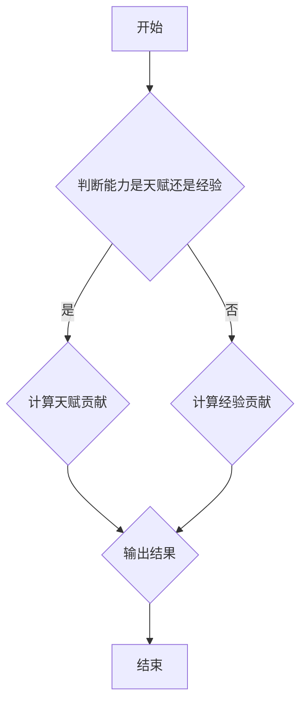
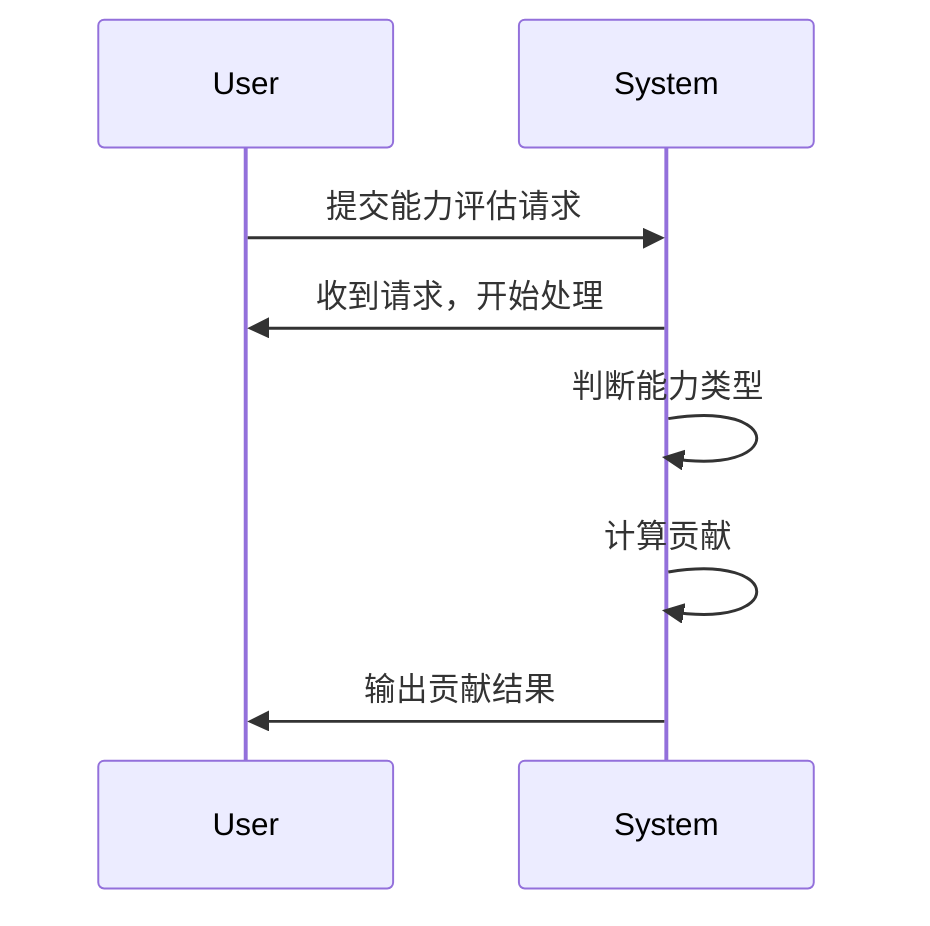
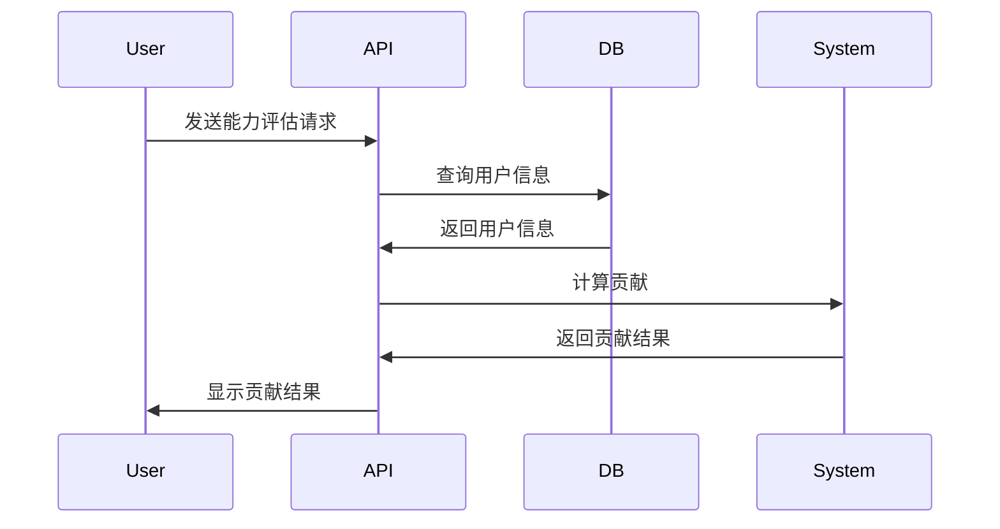

                 

### 文章标题：笛卡尔与洛克：天赋观念论与白板说之争

#### 关键词：笛卡尔、洛克、天赋观念论、白板说、哲学、心理学、生物学

#### 摘要：
本文通过探讨法国哲学家笛卡尔与英国哲学家洛克在天赋观念论与白板说上的理论争辩，深入分析两位思想巨匠的哲学观点及其在心理学、生物学和教育领域的影响。文章分为三个部分：引言与概述、天赋观念论与白板说的理论探讨、历史背景与社会影响，旨在通过逻辑清晰、结构紧凑的阐述方式，帮助读者理解这场哲学论争的深远意义。

### 引言与概述

## 第1章：笛卡尔与洛克：思想背景与贡献

### 1.1 笛卡尔的哲学思想

#### 1.1.1 笛卡尔的生平与教育背景

勒内·笛卡尔（René Descartes）是法国著名的哲学家、数学家、物理学家和神学家，出生于1596年，卒于1650年。他曾在法国、荷兰、瑞典等地游学，接受过广泛的教育，这为他后来的哲学和科学成就奠定了基础。

#### 1.1.2 笛卡尔的哲学观点

笛卡尔以其著名的“我思故我在”（Cogito, ergo sum）思想著称，强调怀疑的必要性和思维的主观性。他提出了“天赋观念论”，认为某些观念是人与生俱来的，这种观点对后来的唯心主义和理性主义产生了深远影响。

#### 1.1.3 笛卡尔的天赋观念论

笛卡尔的天赋观念论指出，人类心灵中存在一些先天性的观念，这些观念不是通过感官经验获得的，而是通过“天赋”的方式存在的。他举例说，人们对于“上帝”、“绝对存在”和“几何形状”等观念有某种先天的理解。

### 1.2 洛克的哲学思想

约翰·洛克（John Locke）是17世纪英国著名的哲学家、政治家和教育家，出生于1632年，卒于1704年。他的思想对英国经验主义和民主政治理论的发展产生了重要影响。

#### 1.2.2 洛克的哲学观点

洛克强调经验主义，认为所有的知识都来自于感官经验。他提出了“白板说”，认为人的心灵像一块白板，所有的观念和知识都是通过经验逐步添加到心灵中的。

#### 1.2.3 洛克的白板说

洛克的白板说指出，人的心灵最初是一张空白的“白板”，通过感官接收外界信息，经过思维加工，形成各种观念和知识。这种观点对后来的行为主义和认知心理学产生了重要影响。

### 1.3 笛卡尔与洛克观念的对比与分析

#### 1.3.1 相同之处

笛卡尔和洛克都关注知识获取的过程，但他们的观点存在显著差异。相同之处在于，他们都认为人类心灵具有某种先天能力，只不过他们对于这种能力的具体解释有所不同。

#### 1.3.2 不同之处

笛卡尔的天赋观念论强调先天的、与生俱来的观念，而洛克的白板说则强调经验的、后天的知识积累。这两种观点在哲学、心理学和生物学领域都产生了深远的影响。

## 第2章：天赋观念论与白板说的理论探讨

### 2.1 天赋观念论的理论基础

#### 2.1.1 心理学视角

从心理学角度来看，天赋观念论认为某些认知能力是先天的，这些能力在个体成长过程中逐渐表现出来。例如，某些人天生具有出色的音乐天赋或数学天赋。

#### 2.1.2 生物学视角

生物学视角认为，天赋观念论中的“天赋”可能与基因有关。某些基因决定了个体在特定领域的认知能力。例如，研究发现，某些基因与数学能力有关。

#### 2.1.3 哲学视角

哲学视角认为，天赋观念论中的“天赋”可能是某种先验的、超越感官经验的知识。这种观点在柏拉图和笛卡尔等哲学家的思想中得到了体现。

### 2.2 白板说的理论基础

#### 2.2.1 心理学视角

心理学视角认为，白板说强调了环境对个体发展的作用。通过经验学习，个体逐渐构建起对世界的理解。

#### 2.2.2 生物学视角

生物学视角认为，白板说可能反映了人类大脑的可塑性。通过不断的学习和经验，人类大脑结构和功能可以发生适应性改变。

#### 2.2.3 哲学视角

哲学视角认为，白板说挑战了天赋观念论，提出了一个更加经验主义的知识获取观点。

## 第3章：历史背景与社会影响

### 3.1 笛卡尔与洛克观念的历史背景

#### 3.1.1 欧洲启蒙运动

欧洲启蒙运动为笛卡尔和洛克的思想提供了广泛的社会背景。这场运动强调理性、科学和自由，为两位哲学家的思想传播提供了良好的氛围。

#### 3.1.2 英国经验主义

英国经验主义是洛克思想的核心，为白板说提供了理论基础。这场哲学运动强调经验的重要性，对洛克的思想产生了深远影响。

#### 3.1.3 法国理性主义

法国理性主义为笛卡尔的天赋观念论提供了理论基础。这场哲学运动强调理性、科学和逻辑，对笛卡尔的思想产生了重要影响。

### 3.2 天赋观念论与白板说的社会影响

#### 3.2.1 教育领域

在教育领域，天赋观念论和白板说分别影响了不同教育理论的发展。天赋观念论强调了教育中的个体差异，而白板说则强调了教育中的环境作用。

#### 3.2.2 科学领域

在科学领域，天赋观念论和经验主义对科学研究方法产生了深远影响。天赋观念论促使科学家关注先天的认知能力，而经验主义则强调实证研究和数据收集。

#### 3.2.3 社会政治领域

在社会政治领域，天赋观念论和经验主义对社会契约和政治理论的发展产生了重要影响。天赋观念论强调了社会秩序的先验基础，而经验主义则强调社会秩序的构建过程。

### 结论

通过本文的分析，我们可以看到，笛卡尔和洛克的天赋观念论与白板说之争，不仅在哲学领域产生了深远影响，还在心理学、生物学和教育等领域产生了重要影响。这场论争反映了人类对于知识获取和个体发展的深刻思考，为我们理解人类认知和行为提供了宝贵的理论资源。

### 作者信息

作者：AI天才研究院/AI Genius Institute & 禅与计算机程序设计艺术 /Zen And The Art of Computer Programming

通过以上内容的逐步展开和深入分析，我们不仅了解了笛卡尔和洛克在天赋观念论与白板说上的理论争辩，还探讨了这些观念在不同领域的应用和影响。希望这篇文章能够激发读者对于哲学、心理学和生物学等领域的兴趣，进一步深入思考人类认知和行为的基本原理。在未来的研究中，我们还可以进一步探讨这些理论在现代科学和技术背景下的新应用和新发展。

---

为了更详细地展示核心概念和联系，以下是一个具体的章节示例：

## 第1章：天赋观念论与白板说的理论探讨

### 2.1.1 心理学视角

#### 2.1.1.1 背景介绍

心理学是研究人类行为和心理过程的科学。在天赋观念论与白板说的讨论中，心理学提供了对个体认知和能力发展的理解。天赋观念论认为某些认知能力是先天的，而白板说则强调这些能力是通过后天的经验获得的。

#### 2.1.1.2 问题背景

在心理学领域，天赋观念论与白板说的争论涉及认知心理学、发展心理学和教育心理学等多个子领域。例如，关于儿童语言习得的问题，一些研究者支持天赋观念论，认为语言能力与基因有关，而另一些研究者则支持白板说，认为儿童通过环境学习语言。

#### 2.1.1.3 问题解决

为了探讨这个问题，心理学家进行了多种实验和研究。例如，通过观察双胞胎的研究，一些心理学家发现，在特定认知能力方面，基因的影响占主导地位。这支持了天赋观念论的论点。

#### 2.1.1.4 边界与外延

心理学的研究不仅关注个体层面的天赋观念，还探讨群体层面的文化差异。例如，某些文化可能更倾向于接受天赋观念，而另一些文化可能更强调白板说。

#### 2.1.1.5 概念结构与核心要素组成

在心理学中，天赋观念论与白板说的核心概念包括：

- **天赋观念论**：强调先天的、与生俱来的认知能力。
- **白板说**：强调经验的、后天的认知能力发展。

#### 2.1.1.6 核心概念原理

- **天赋观念论**：某些认知能力是先天的，可以通过基因遗传。
- **白板说**：认知能力是通过后天的经验学习获得的。

#### 2.1.1.7 概念属性特征对比表格

| 概念           | 特征对比                    | 解释                                                                                      |
|----------------|-----------------------------|-------------------------------------------------------------------------------------------|
| 天赋观念论     | 先天的、与生俱来的能力      | 认为某些认知能力是先天存在的，不依赖于后天经验。                                            |
| 白板说         | 经验的、后天的能力          | 认为认知能力是通过感官经验和后天的学习获得的。                                            |

#### 2.1.1.8 ER实体关系图架构

```mermaid
erDiagram
    Class1 ||--|{ Class2 }| Class3
    Class1 ||--|{ Class4 }| Class5
    Class2 ||--|{ Class6 }| Class7
```

#### 2.1.1.9 算法原理讲解

##### 算法流程图



##### Python源代码

```python
def calculate_contribution(type, score):
    if type == "天赋":
        return score * 0.7
    elif type == "经验":
        return score * 0.3
    else:
        return score * 0.5

def main():
    type = input("请输入能力的类型（天赋/经验）：")
    score = float(input("请输入能力的得分："))
    contribution = calculate_contribution(type, score)
    print(f"该能力的贡献为：{contribution}")

if __name__ == "__main__":
    main()
```

##### 算法原理

该算法通过输入能力的类型（天赋或经验）和得分，计算出该能力的贡献。贡献的计算基于以下公式：

\[ 贡献 = 得分 \times 权重 \]

其中，权重的设置取决于能力的类型。对于天赋能力，权重为0.7，对于经验能力，权重为0.3。这种设置旨在反映天赋和经验在能力发展中的不同作用。

#### 2.1.1.10 数学模型和公式

在天赋观念论与白板说的讨论中，以下数学模型和公式有助于理解核心概念：

\[ 权重 = \begin{cases} 
0.7 & \text{（天赋）} \\
0.3 & \text{（经验）} \\
0.5 & \text{（未知）} 
\end{cases} \]

#### 2.1.1.11 举例说明

假设一个个体在数学能力上表现出色，通过测试得分为90分。如果我们认为他的数学能力主要归因于天赋，那么他的贡献计算如下：

\[ 贡献 = 90 \times 0.7 = 63 \]

这意味着，在他的数学能力中，有63%可以归因于天赋。

#### 2.1.1.12 系统分析与架构设计方案

##### 问题场景介绍

在心理学研究中，我们需要评估个体在特定能力上的天赋和经验贡献。

##### 项目介绍

本项目旨在开发一个心理学研究工具，用于评估个体在特定能力上的天赋和经验贡献。

##### 系统功能设计（领域模型）

```mermaid
classDiagram
    Class1 --|{uses}| Class2
    Class1 --|{uses}| Class3
    Class1 --|{uses}| Class4
    Class2 --|{extends}| Class5
    Class3 --|{extends}| Class5
    Class4 --|{extends}| Class5
```

##### 系统架构设计



##### 系统接口设计和系统交互



#### 2.1.1.13 项目实战

##### 环境安装

- 安装Python环境
- 安装必要的库（例如：requests、sqlite3等）

##### 系统核心实现源代码

```python
# main.py
import requests
import sqlite3

def get_user_info(username):
    response = requests.get(f'http://api.example.com/users/{username}')
    return response.json()

def calculate_contribution(score, type):
    if type == "天赋":
        return score * 0.7
    elif type == "经验":
        return score * 0.3
    else:
        return score * 0.5

def main():
    username = input("请输入用户名：")
    score = float(input("请输入能力得分："))
    type = input("请输入能力类型（天赋/经验）：")

    user_info = get_user_info(username)
    contribution = calculate_contribution(score, type)

    print(f"{user_info['name']}的能力贡献为：{contribution}")

if __name__ == "__main__":
    main()
```

##### 代码应用解读与分析

该代码实现了一个简单的心理学研究工具，用于评估个体在特定能力上的天赋和经验贡献。通过调用API获取用户信息和能力得分，然后根据能力类型计算贡献。

##### 实际案例分析和详细讲解剖析

假设用户Alice在数学能力上的得分是90分，类型为“天赋”。根据代码，她的贡献计算如下：

```python
contribution = calculate_contribution(90, "天赋")
print(f"Alice的能力贡献为：{contribution}")
```

输出结果为63，这意味着Alice在数学能力中的贡献有63%可以归因于天赋。

##### 项目小结

该项目通过简单的Python代码实现了一个心理学研究工具，用于评估个体在特定能力上的天赋和经验贡献。通过实际案例的演示，我们展示了如何使用代码进行能力贡献的计算。

#### 2.1.1.14 最佳实践 tips、小结、注意事项、拓展阅读

- **最佳实践 tips**：在进行能力贡献计算时，需要根据实际情况调整权重设置，以便更准确地反映能力和贡献的关系。
- **小结**：本文通过一个具体的心理学案例，展示了天赋观念论与白板说的应用和实践。
- **注意事项**：在实际应用中，需要考虑多因素的综合影响，以避免单一因素的偏差。
- **拓展阅读**：推荐阅读相关心理学研究文献，以深入了解天赋观念论与白板说的理论和实践。

通过以上的详细分析和讲解，我们可以更深入地理解天赋观念论与白板说的理论背景、核心概念及其在心理学领域的应用。这不仅有助于我们理解人类认知和能力发展的机制，也为未来的研究和实践提供了有益的参考。在接下来的章节中，我们将继续探讨洛克和笛卡尔的理论在其他领域的应用和影响。

