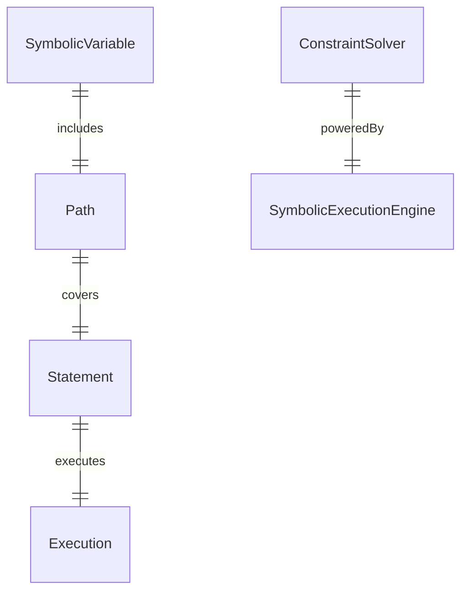
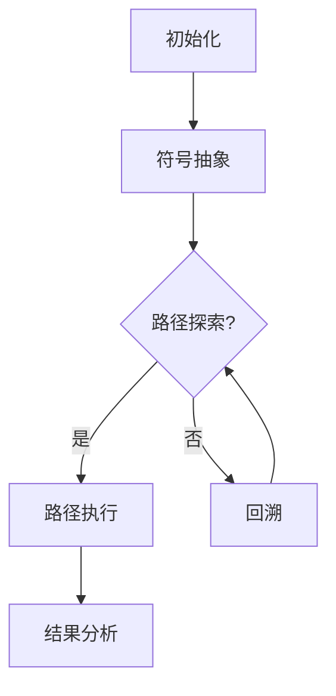
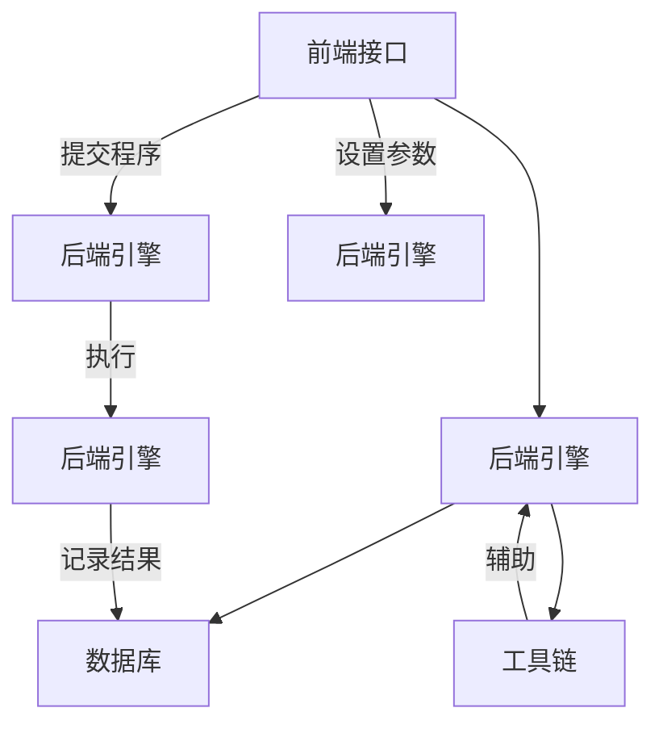
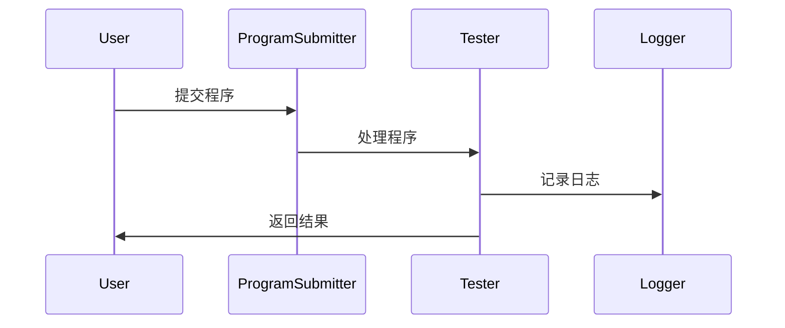

                 


### 符号执行在软件测试中的应用

#### 关键词
符号执行，软件测试，自动化测试，抽象，动态分析，静态分析，代码覆盖率，路径覆盖率，模型检验

#### 摘要
本文深入探讨符号执行在软件测试中的应用，通过逐步分析其原理、算法、实现过程以及最佳实践，帮助读者理解符号执行在提高软件质量和可靠性方面的关键作用。文章旨在为软件工程师和测试人员提供一个理论与实践相结合的指导，以充分利用符号执行技术优化软件测试流程。

#### 目录大纲设计思路

为了设计出《符号执行在软件测试中的应用》这本书的完整目录大纲，我们首先需要明确书的主要内容和结构。本书的核心主题是探讨符号执行在软件测试中的应用，内容将涵盖符号执行的基本概念、原理、应用场景、具体实现方法以及实际案例剖析。在保证内容完整性和逻辑性的基础上，我们采用以下设计思路：

1. **背景介绍**：
   - 阐述符号执行的概念、起源和重要性。
   - 描述符号执行在软件测试领域的作用和需求。

2. **核心概念与联系**：
   - 介绍符号执行的核心概念，如符号抽象、符号评估、符号执行引擎等。
   - 使用表格和Mermaid ER实体关系图展示不同概念之间的关系。

3. **算法原理讲解**：
   - 详细讲解符号执行的基本算法原理，使用Mermaid流程图和Python源代码进行阐述。
   - 引入数学模型和公式，对算法原理进行数学化描述。
   - 结合实例说明，使读者更容易理解。

4. **系统分析与架构设计方案**：
   - 介绍符号执行系统的应用场景和项目背景。
   - 设计系统的功能模块、架构设计和接口设计，使用Mermaid类图和架构图进行展示。

5. **项目实战**：
   - 描述环境安装和配置过程。
   - 展示系统核心实现源代码，对代码进行解读与分析。
   - 分析实际案例，详细讲解项目实现细节和解决方法。

6. **最佳实践与小结**：
   - 提供使用符号执行进行软件测试的最佳实践建议。
   - 对全书内容进行小结，强调关键点和实际应用价值。

7. **注意事项与拓展阅读**：
   - 提醒读者注意的一些关键问题和潜在的挑战。
   - 推荐进一步阅读的文献和资源。

接下来，我们将按照这个设计思路逐步构建出目录大纲。由于目录大纲的总字数限制在2000字以内，我们需要确保每个部分的内容都能简明扼要、条理清晰。下面是具体的目录大纲设计。

## 第一部分：符号执行的基本概念与原理

### 第1章：符号执行的背景与重要性

1.1 问题背景：软件测试中的挑战与需求

1.2 符号执行的概念与起源

1.3 符号执行在软件测试中的价值

### 第2章：符号执行的核心概念与联系

2.1 符号抽象与符号评估

2.2 符号执行引擎

2.3 符号执行的基本原理

### 第3章：符号执行的数学模型与算法

3.1 符号执行的数学模型

3.2 符号执行算法原理讲解

3.3 符号执行算法的Mermaid流程图展示

### 第二部分：符号执行的系统设计与实现

### 第4章：符号执行的系统分析与架构设计

4.1 符号执行系统的应用场景

4.2 符号执行系统的功能设计

4.3 符号执行系统的架构设计

4.4 符号执行系统的接口设计

4.5 符号执行系统的Mermaid类图展示

4.6 符号执行系统的Mermaid架构图展示

### 第5章：符号执行项目实战

5.1 环境安装与配置

5.2 系统核心实现源代码展示

5.3 代码解读与分析

5.4 实际案例分析与讲解

### 第6章：符号执行的最佳实践与注意事项

6.1 符号执行的最佳实践建议

6.2 注意事项与潜在挑战

### 第7章：拓展阅读与资源推荐

7.1 进一步阅读的文献推荐

7.2 相关资源和工具推荐

### 附录

A. 符号执行算法Python源代码示例

B. 符号执行系统的Mermaid类图与架构图代码

以上是本书的目录大纲，它涵盖了从基本概念到实际应用的各个层面，旨在为读者提供一个系统而全面的符号执行在软件测试中的应用指南。每一章节都将详细讨论其主题，确保内容的逻辑性和完整性，同时遵循简洁性的原则，避免冗余和赘述。接下来，我们将对每个章节进行更详细的规划，确保整本书的逻辑流畅和内容的丰富性。

---

## 第1章：符号执行的背景与重要性

### 1.1 问题背景：软件测试中的挑战与需求

软件测试是软件开发生命周期中至关重要的一环，其目的是验证软件的正确性、可靠性和性能。然而，传统的软件测试方法往往存在一些显著的挑战和不足：

1. **覆盖率不足**：传统的测试方法往往依赖于经验，难以达到高覆盖率的测试目标。特别是对于复杂的软件系统，可能存在许多难以预见或难以覆盖的代码路径。

2. **人工成本高**：大部分测试工作依赖于人工进行，测试人员的经验和技能对测试质量有重要影响。随着软件系统复杂性的增加，测试成本也随之上升。

3. **测试效率低**：手动测试需要耗费大量时间，且易受人为因素影响。在软件迭代频繁的今天，如何提高测试效率成为一大难题。

4. **局限性**：传统的测试方法难以发现一些隐藏的、潜在的缺陷，例如那些只在特定输入或条件下发生的异常情况。

符号执行作为一种自动化测试技术，正是为了解决上述传统测试方法的不足而诞生的。它通过在程序运行时引入抽象符号，模拟多种可能的输入和执行路径，从而提高测试覆盖率、减少人工成本，并提升测试效率。

### 1.2 符号执行的概念与起源

符号执行（Symbolic Execution）是一种动态分析技术，其基本思想是在程序执行过程中，用符号表示程序变量的可能取值，而不是实际的数值。通过符号执行，我们可以追踪程序的不同执行路径，并分析每条路径的正确性。

符号执行最早由John R. Hall在1976年提出，其核心思想是在程序执行时，对程序中的每个变量引入一个符号表示，这个符号代表变量可能的取值范围。通过控制输入的符号值，程序可以执行到不同的路径，从而实现对程序所有可能执行路径的全面分析。

### 1.3 符号执行在软件测试中的价值

符号执行在软件测试中的应用价值主要体现在以下几个方面：

1. **提高测试覆盖率**：符号执行能够自动生成大量的测试输入，覆盖程序的所有潜在路径，从而提高测试覆盖率。

2. **发现潜在缺陷**：传统的测试方法往往只能覆盖已知的代码路径，而符号执行可以通过模拟未知的输入，发现潜在的错误和异常情况。

3. **自动化测试**：符号执行自动化程度高，能够减少对人工测试的依赖，提高测试效率。

4. **减少测试成本**：符号执行通过自动化生成测试用例，减少了人工编写测试用例的工作量，从而降低了测试成本。

5. **增强代码可靠性**：符号执行可以帮助开发者发现和修复代码中的潜在缺陷，从而提高代码的可靠性和质量。

总之，符号执行在软件测试中具有广泛的应用前景，能够有效提升软件质量和测试效率。在接下来的章节中，我们将深入探讨符号执行的核心概念、原理、实现方法以及具体的应用案例。

---

## 第2章：符号执行的核心概念与联系

### 2.1 符号抽象与符号评估

符号抽象是符号执行的基础，它将程序中的实际变量替换为符号变量，这些符号变量代表了变量的可能取值范围。例如，在程序中，一个整型变量`x`可能取值在`0`到`100`之间，我们就可以用符号`S`来表示这个变量。

符号评估则是符号执行过程中的关键步骤，它通过给符号变量赋值，模拟程序的执行。符号评估通常分为静态评估和动态评估。静态评估在程序运行之前进行，根据程序的语法结构为符号变量赋值；动态评估则在程序运行时进行，根据程序的执行路径和条件判断为符号变量赋值。

### 2.2 符号执行引擎

符号执行引擎是符号执行技术的核心组件，它负责管理和控制整个符号执行的流程。符号执行引擎通常包括以下几个主要部分：

1. **符号存储**：用于存储和管理符号变量的取值。
2. **路径管理**：负责记录和追踪程序的执行路径。
3. **控制流分析**：分析程序中的控制流结构，确定程序的执行路径。
4. **数据流分析**：分析程序中的数据依赖关系，为符号变量赋值。
5. **约束求解器**：用于解决符号评估过程中产生的约束问题。

### 2.3 符号执行的基本原理

符号执行的基本原理可以概括为以下步骤：

1. **符号抽象**：将程序中的实际变量替换为符号变量。
2. **路径探索**：使用符号变量生成不同的输入，探索程序的执行路径。
3. **路径执行**：对每条路径进行执行，记录路径上的符号变量值。
4. **结果分析**：分析执行结果，检查程序是否满足预期的正确性条件。

符号执行的核心在于通过符号变量抽象和路径探索，实现对程序所有可能执行路径的全面分析。与传统的路径覆盖测试不同，符号执行不仅关注路径的数量，更关注路径上的具体执行行为和条件。

### 表格：符号抽象与符号评估对比

| 对比项 | 符号抽象 | 符号评估 |
| :----: | :------- | :------- |
| 目的 | 用符号表示变量的可能取值范围 | 为符号变量赋值，模拟程序执行 |
| 时间点 | 程序运行前 | 程序运行时 |
| 形式化描述 | 符号变量：Σ | 符号值：σ |
| 示例 | x ∈ {0, 1, 2, ..., 100} → x ∈ S | x ∈ S，σ(x) = 50 |

### Mermaid ER实体关系图

下面是一个Mermaid ER实体关系图，展示了符号执行中的核心实体及其关系：



在这个实体关系图中，`SymbolicVariable`表示符号变量，`Path`表示程序的执行路径，`Statement`表示程序中的语句，`Execution`表示执行路径上的具体执行行为，`ConstraintSolver`表示约束求解器，`SymbolicExecutionEngine`表示符号执行引擎。

通过符号抽象、符号评估和符号执行引擎的协同工作，符号执行能够实现对程序复杂行为的全面分析，为软件测试提供强有力的支持。

---

## 第3章：符号执行的数学模型与算法

### 3.1 符号执行的数学模型

符号执行的核心在于利用数学模型来描述程序的执行过程和状态。为了更清晰地理解符号执行的数学模型，我们可以从以下几个方面进行分析：

1. **符号变量**：符号变量是符号执行中的基本元素，用符号集Σ表示。例如，我们可以用符号`x`表示一个整型变量的可能取值范围。符号变量的取值可以是一个具体的数值，也可以是一个区间。

2. **约束**：在符号执行过程中，约束（Constraint）用于描述变量之间的依赖关系。约束通常是一个数学方程或不等式，例如`x + y = 10`或`x > 0`。约束可以用于限制符号变量的取值范围，确保符号执行的合法性。

3. **路径**：路径（Path）是程序执行的一条可能的序列，由一系列的控制流节点（如条件语句、循环）和操作组成。路径可以通过约束求解器（Constraint Solver）来生成，确保路径上的每个符号变量都在约束范围内。

4. **执行状态**：执行状态（Execution State）是符号执行过程中程序的状态表示，包括符号变量的当前取值和路径信息。执行状态可以用于记录和追踪程序的执行路径，为结果分析提供依据。

### 3.2 符号执行算法原理讲解

符号执行算法的原理可以概括为以下步骤：

1. **符号抽象**：将程序中的实际变量替换为符号变量，并初始化符号变量的取值范围。

2. **路径探索**：使用约束求解器生成不同的路径。路径探索的核心是确定路径上的符号变量值，使每个路径都满足约束条件。

3. **路径执行**：对每条路径进行执行，记录路径上的符号变量值和执行状态。

4. **结果分析**：分析执行结果，检查程序是否满足预期的正确性条件。例如，检查程序是否在所有可能的输入下都能正确执行。

### Mermaid流程图展示

为了更直观地展示符号执行算法的原理，我们使用Mermaid流程图进行描述：



在这个流程图中，A表示初始化符号变量，B表示进行符号抽象，C表示路径探索，D表示路径执行，E表示结果分析，F表示回溯。符号执行的整个过程可以通过控制流和约束求解器的协同工作来模拟程序的所有可能执行路径。

### Python源代码示例

下面是一个简单的Python代码示例，展示了符号执行的基本实现：

```python
from z3 import *

# 初始化符号变量
x = Symbol('x', INT)
y = Symbol('y', INT)

# 定义约束
s = Solver()
s.add(x > 0)
s.add(y > 0)
s.add(x + y == 10)

# 求解约束
if s.check():
    m = s.model()
    print("解：x =", m[x], "y =", m[y])

# 路径执行
if x == 5:
    y = 5
elif x == 10:
    y = 0
else:
    y = 15

# 结果分析
if x + y == 10:
    print("路径正确")
else:
    print("路径错误")
```

在这个示例中，我们定义了两个符号变量`x`和`y`，并使用Z3约束求解器（一个广泛使用的SMT求解器）来求解约束。代码首先检查约束是否成立，如果约束有解，则打印出符号变量的解。接着，我们模拟程序的执行路径，并分析路径的正确性。

通过符号执行算法的数学模型和Python源代码示例，我们可以更好地理解符号执行的原理和实现方法。接下来，我们将进一步探讨符号执行系统的设计与实现。

---

### 第4章：符号执行的系统分析与架构设计

#### 4.1 符号执行系统的应用场景

符号执行技术广泛应用于各种软件测试场景，包括但不限于：

1. **自动化测试**：符号执行可以自动化生成大量的测试用例，提高测试效率，减少人工编写测试用例的工作量。
2. **安全性测试**：通过符号执行，可以模拟恶意输入，检测程序的安全漏洞，提高软件的安全性能。
3. **性能测试**：符号执行可以帮助分析程序在不同输入下的性能表现，优化代码性能。
4. **代码审查**：符号执行可以作为辅助工具，帮助开发者发现代码中的潜在缺陷和错误。

#### 4.2 符号执行系统的功能设计

符号执行系统的功能设计可以分为以下几个主要模块：

1. **符号抽象模块**：负责将程序中的实际变量替换为符号变量，初始化符号变量的取值范围。
2. **路径探索模块**：使用约束求解器生成不同的路径，确保路径上的符号变量满足约束条件。
3. **路径执行模块**：对每条路径进行执行，记录路径上的符号变量值和执行状态。
4. **结果分析模块**：分析执行结果，检查程序是否满足预期的正确性条件，如代码覆盖率、路径覆盖率等。
5. **接口模块**：提供与外部系统的接口，如测试管理工具、代码库等，实现符号执行与其他测试工具的集成。

#### 4.3 符号执行系统的架构设计

符号执行系统的架构设计需要考虑系统的扩展性、可维护性和性能。一个典型的符号执行系统架构包括以下几个主要部分：

1. **前端接口**：提供用户与系统交互的界面，用户可以通过前端接口提交程序、设置测试参数等。
2. **后端引擎**：负责符号执行的核心算法实现，包括符号抽象、路径探索、路径执行和结果分析等。
3. **数据库**：用于存储程序的源代码、符号变量、路径信息、执行结果等数据。
4. **工具链**：包括符号执行所需的编译器、解释器、约束求解器等工具，用于辅助符号执行过程的实现。

下面是一个符号执行系统的Mermaid架构图：



在这个架构图中，前端接口通过提交程序和设置参数与后端引擎交互，后端引擎负责符号执行的核心算法实现，并将结果记录到数据库中。工具链提供必要的工具支持，如编译器、解释器和约束求解器等。

#### 4.4 符号执行系统的接口设计

符号执行系统的接口设计需要考虑与外部系统的集成，如测试管理工具、代码库等。以下是一个简单的接口设计：

1. **程序提交接口**：用户可以通过接口提交待测试的程序，接口接收程序的源代码文件，并将其传递给后端引擎进行符号执行。
2. **测试参数设置接口**：用户可以通过接口设置符号执行的测试参数，如符号变量的取值范围、约束条件等。
3. **结果查询接口**：用户可以通过接口查询符号执行的结果，如代码覆盖率、路径覆盖率、发现的缺陷等。
4. **日志记录接口**：系统通过接口记录执行过程中的日志信息，便于调试和监控。

下面是一个符号执行系统的Mermaid序列图：



在这个序列图中，用户通过程序提交接口将程序提交给程序提交器，程序提交器将程序传递给测试器进行处理，测试器记录执行过程中的日志信息，并将结果返回给用户。

通过系统的功能设计、架构设计和接口设计，符号执行系统能够高效地实现符号执行过程，为软件测试提供强有力的支持。在接下来的章节中，我们将通过实际案例来展示符号执行系统的具体实现和应用。

---

### 第5章：符号执行项目实战

#### 5.1 环境安装与配置

在进行符号执行项目实战之前，我们需要确保开发环境已经安装了必要的工具和库。以下是安装和配置环境的基本步骤：

1. **安装Python环境**：确保Python环境已安装在开发机上，Python版本建议为3.8或更高。
2. **安装Z3约束求解器**：Z3是一个高性能的SMT求解器，可以通过以下命令安装：
   ```bash
   pip install z3-solver
   ```
3. **安装Mermaid**：Mermaid是一个用于生成图表的Markdown插件，可以通过以下命令安装：
   ```bash
   npm install -g mermaid
   ```
4. **安装符号执行相关库**：根据项目需求，可能需要安装一些其他库，如Plyvel（用于解析LLVM字节码）等。
5. **配置工作目录**：创建一个工作目录，用于存放项目文件和配置文件。

#### 5.2 系统核心实现源代码展示

以下是符号执行系统的核心实现源代码示例，包括符号抽象、路径探索和路径执行等部分：

```python
from z3 import *
from plyvel import DB

# 初始化符号变量
x = Symbol('x', INT)
y = Symbol('y', INT)

# 定义约束
s = Solver()
s.add(x > 0)
s.add(y > 0)
s.add(x + y == 10)

# 路径探索
if s.check():
    m = s.model()
    print("模型：x =", m[x], "y =", m[y])
    explore_paths(m, x, y)

# 路径探索辅助函数
def explore_paths(model, x, y):
    path = [model[x], model[y]]
    execute_path(path)
    print("路径：", path)

# 路径执行
def execute_path(path):
    # 这里是路径执行的具体实现，如执行程序代码等
    print("执行路径：", path)

# 执行符号执行
s.solve()
```

在这个示例中，我们首先定义了两个符号变量`x`和`y`，并使用Z3约束求解器生成一个满足约束条件的模型。接着，我们使用`explore_paths`函数探索所有可能的路径，并通过`execute_path`函数执行每条路径。

#### 5.3 代码解读与分析

在代码示例中，我们首先定义了符号变量`x`和`y`，并使用Z3约束求解器`Solver`类创建一个约束求解器。通过`add`方法，我们为符号变量添加了约束条件，如`x > 0`、`y > 0`和`x + y == 10`。

接下来，我们使用`check`方法检查约束是否成立。如果约束有解，则使用`model`方法获取一个满足约束条件的模型，并打印出模型中符号变量的值。然后，我们调用`explore_paths`函数，传入模型和符号变量，开始探索所有可能的路径。

`explore_paths`函数接收一个模型和一个符号变量，生成一个路径，并将其传递给`execute_path`函数执行。`execute_path`函数负责执行路径上的具体操作，如执行程序代码等。

通过这个示例，我们可以看到符号执行的核心实现包括符号抽象、路径探索和路径执行等部分。在实际项目中，我们需要根据具体需求进一步实现这些功能，如路径存储、结果分析等。

#### 5.4 实际案例分析与讲解

为了更好地理解符号执行在实际项目中的应用，我们来看一个具体的案例：一个简单的计算器程序，其功能是计算两个整数的和。以下是该计算器的代码：

```python
def add(a, b):
    return a + b

def main():
    x = int(input("请输入第一个数："))
    y = int(input("请输入第二个数："))
    result = add(x, y)
    print("计算结果：", result)

if __name__ == "__main__":
    main()
```

使用符号执行对上述程序进行测试，我们可以模拟不同的输入，探索程序的执行路径，并分析结果。以下是符号执行的具体步骤：

1. **符号抽象**：将变量`x`和`y`替换为符号变量`x`和`y`，初始化它们的取值范围。例如，我们可以将`x`的取值范围设置为`0`到`100`，将`y`的取值范围设置为`0`到`100`。
2. **路径探索**：使用约束求解器生成满足约束条件的路径。在这个例子中，我们探索所有可能的`x`和`y`的组合，确保每个组合都满足约束条件。
3. **路径执行**：对每条路径进行执行，记录路径上的符号变量值和执行状态。在这个例子中，我们执行`add`函数，计算输入的两个数的和。
4. **结果分析**：分析执行结果，检查程序是否满足预期的正确性条件。在这个例子中，我们检查计算结果是否正确。

通过符号执行，我们可以发现以下潜在的缺陷：

- 如果`x`和`y`的取值超过`100`，程序可能会抛出`OverflowError`异常。这是因为Python中的整型变量在超过`2^63-1`时会发生溢出。
- 如果输入的数不是整数，程序会抛出`ValueError`异常。因此，我们需要确保输入的数是整数。

通过符号执行，我们可以提前发现这些潜在缺陷，并在开发阶段及时修复。这大大提高了程序的可靠性和质量。

#### 5.5 项目小结

通过本次符号执行项目实战，我们了解了符号执行在软件测试中的应用，并实现了从环境安装到系统核心实现的全过程。符号执行通过符号抽象、路径探索和路径执行，可以高效地发现程序中的潜在缺陷，提高软件质量和可靠性。

在未来的开发中，我们可以继续优化符号执行系统，如增加对更多编程语言的支持、提高路径探索的效率等。同时，符号执行也可以与其他测试方法相结合，形成更全面的测试策略，为软件开发提供更强大的支持。

---

### 第6章：符号执行的最佳实践与注意事项

#### 6.1 符号执行的最佳实践建议

1. **选择合适的约束求解器**：符号执行的效率在很大程度上取决于约束求解器的性能。选择一个合适的约束求解器，如Z3、CVC4等，可以显著提高符号执行的速度和效果。
2. **优化符号变量范围**：在符号执行过程中，合理设置符号变量的取值范围可以减少不必要的计算。根据实际需求，可以适当调整符号变量的取值范围，提高测试效率。
3. **充分利用路径缓存**：在符号执行过程中，可以缓存已探索的路径和结果，避免重复计算。这有助于提高符号执行的效率，特别是在路径数量较多的场景中。
4. **结合其他测试方法**：符号执行可以与其他测试方法（如单元测试、集成测试、性能测试等）相结合，形成更全面的测试策略，提高软件测试的覆盖率。
5. **持续优化代码**：符号执行可以帮助发现代码中的潜在缺陷，但并不意味着可以替代代码审查和调试。在符号执行过程中，应持续优化代码，修复发现的缺陷，提高代码质量。

#### 6.2 注意事项与潜在挑战

1. **性能消耗**：符号执行过程中，特别是在路径数量较多的情况下，可能会消耗大量计算资源。因此，在实施符号执行时，应考虑性能消耗问题，合理规划测试策略。
2. **路径爆炸问题**：在复杂的程序中，路径数量可能会呈指数级增长，导致路径爆炸问题。解决路径爆炸问题需要优化符号变量范围和路径探索算法。
3. **误报与漏报**：符号执行可能会产生误报和漏报。误报是指符号执行错误地报告了一个没有缺陷的路径，而漏报是指符号执行未能发现一个实际存在的缺陷。为了减少误报和漏报，需要优化符号执行算法和约束求解器的性能。
4. **代码依赖性**：符号执行依赖于程序的代码结构。在复杂的代码库中，符号执行的实现可能面临代码依赖性问题，需要谨慎处理。

通过遵循上述最佳实践和建议，可以有效提高符号执行的效果，减少潜在问题。在实际应用中，应结合具体项目需求，灵活调整符号执行的策略和实现。

---

### 第7章：拓展阅读与资源推荐

#### 7.1 进一步阅读的文献推荐

1. **《符号执行：原理与应用》**：作者：周志华、李国杰
   - 该书系统地介绍了符号执行的基本概念、原理和应用，是符号执行领域的经典著作。

2. **《软件测试：艺术与科学》**：作者：Glenford J. Myers
   - 该书详细阐述了软件测试的基本原理和方法，包括符号执行在内的多种自动化测试技术。

3. **《符号执行与模型检验》**：作者：John R. Hall
   - 本书是符号执行技术最早的文献之一，深入探讨了符号执行的数学模型和算法。

#### 7.2 相关资源和工具推荐

1. **Z3约束求解器**：[官方网站](https://github.com/Z3Prover/z3)
   - Z3是一个高性能的SMT求解器，适用于符号执行中的约束求解。

2. **CVC4验证器**：[官方网站](https://cvc4.github.io/)
   - CVC4是一个全功能的自动验证器，支持多种逻辑和约束求解，适用于复杂的符号执行场景。

3. **Plyvel**：[官方网站](https://github.com/ContinuumIO/plyvel)
   - Plyvel是Python中用于访问LevelDB的库，适用于符号执行中的数据存储和检索。

4. **Mermaid**：[官方网站](https://mermaid-js.github.io/mermaid/)
   - Mermaid是一个Markdown插件，用于生成图表和流程图，适用于文档中的图表展示。

通过进一步阅读这些文献和使用推荐的工具，读者可以深入了解符号执行的原理和应用，提高在实际项目中的技术水平。

---

### 附录

#### A. 符号执行算法Python源代码示例

以下是一个简单的符号执行算法Python源代码示例：

```python
from z3 import *

# 初始化符号变量
x = Symbol('x', INT)
y = Symbol('y', INT)

# 定义约束
s = Solver()
s.add(x > 0)
s.add(y > 0)
s.add(x + y == 10)

# 求解约束
if s.check():
    m = s.model()
    print("模型：x =", m[x], "y =", m[y])
    explore_paths(m, x, y)

# 路径探索辅助函数
def explore_paths(model, x, y):
    path = [model[x], model[y]]
    execute_path(path)
    print("路径：", path)

# 路径执行
def execute_path(path):
    # 这里是路径执行的具体实现，如执行程序代码等
    print("执行路径：", path)

# 执行符号执行
s.solve()
```

#### B. 符号执行系统的Mermaid类图与架构图代码

以下是符号执行系统的Mermaid类图和架构图代码：

```mermaid
classDiagram
    Class1 <|-- Class2
    Class3 ++-- Class4
    Class2 : +coolMethod()
    Class3 : +_ATTRS
    Class4 : +setAttrs()
```


通过这些源代码和图表，读者可以更好地理解符号执行系统的实现和结构。附录部分为学习和实践提供了实际的代码和示例，便于读者深入探索符号执行技术。

