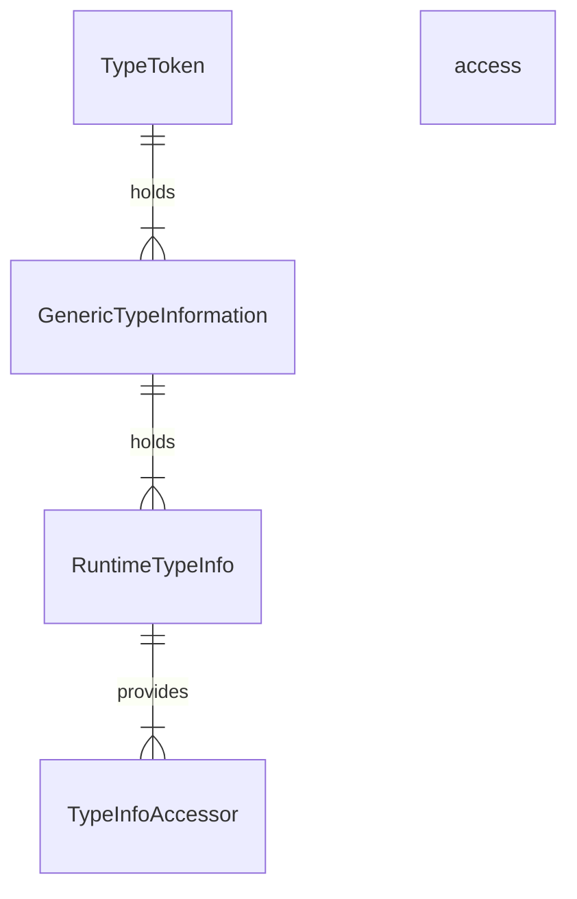
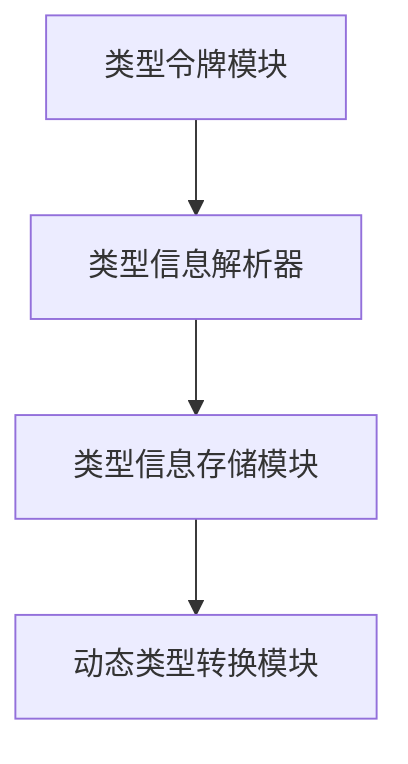
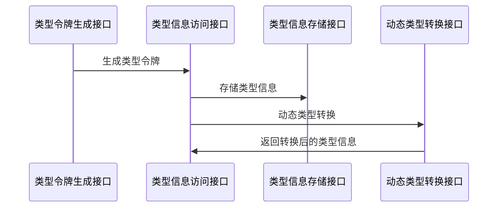
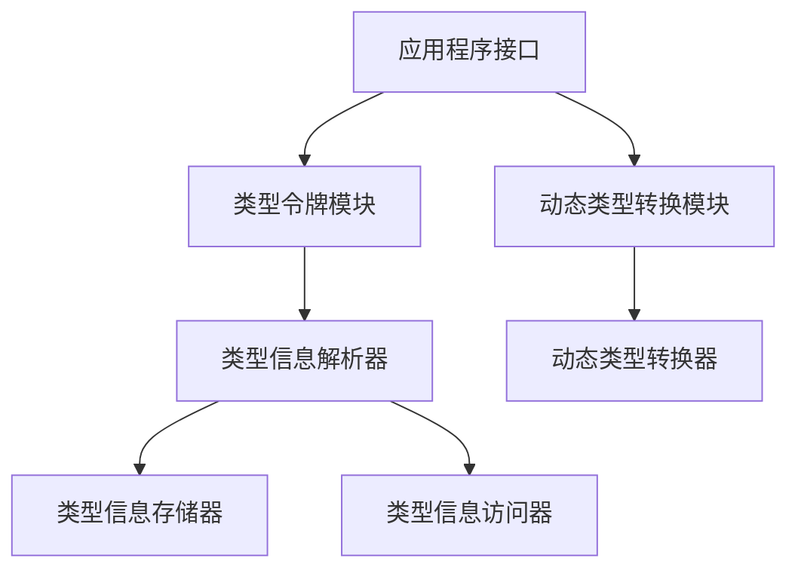
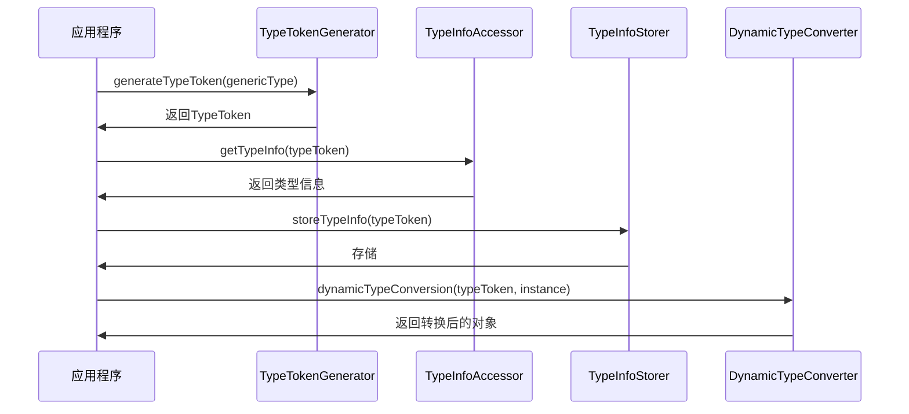

                 

# 类型令牌：运行时保留泛型信息的技巧

## 关键词

泛型编程、类型令牌、运行时保留、类型信息、算法实现、系统架构设计

## 摘要

泛型编程是一种提高代码复用性和灵活性的编程范式。然而，传统的泛型编程在运行时往往无法保留类型信息，这给一些复杂的应用场景带来了挑战。本文将深入探讨类型令牌这一技术，解释其原理、实现方法，并给出一个具体的算法实现和系统架构设计方案，旨在为开发者提供一种运行时保留泛型信息的高效手段。

## 目录大纲

### 第一部分：背景介绍

#### 第1章：问题背景与泛型编程

#### 第2章：问题描述

#### 第3章：问题解决

#### 第4章：边界与外延

#### 第5章：概念结构与核心要素组成

### 第二部分：核心概念与联系

#### 第6章：类型令牌原理

#### 第7章：类型令牌的属性特征对比

#### 第8章：类型令牌的ER实体关系图

### 第三部分：运行时保留泛型信息的方法

#### 第9章：运行时保留泛型信息的基本方法

#### 第10章：类型反射机制

#### 第11章：泛型代理与动态代理技术

### 第四部分：算法原理讲解

#### 第12章：类型令牌算法原理

#### 第13章：算法原理详细讲解

#### 第14章：算法举例说明

### 第五部分：系统分析与架构设计方案

#### 第15章：系统功能设计与架构设计

#### 第16章：系统接口设计和系统交互

### 第六部分：项目实战

#### 第17章：环境安装

#### 第18章：系统核心实现源代码

#### 第19章：代码应用解读与分析

#### 第20章：实际案例分析与详细讲解

#### 第21章：项目小结

#### 第22章：最佳实践 tips

#### 第23章：小结

#### 第24章：注意事项

#### 第25章：拓展阅读

## 第一部分：背景介绍

### 第1章：问题背景与泛型编程

#### 1.1 问题背景

泛型编程（Generic Programming）是一种重要的编程范式，它允许程序员编写能够操作多种数据类型的代码。这种编程范式在Java、C#、C++等编程语言中得到了广泛应用。泛型编程的优势在于，它能够提高代码的复用性和灵活性，减少冗余代码的编写。

然而，传统的泛型编程在编译时，类型信息会被擦除，这意味着在运行时，程序无法访问泛型类型的具体信息。这在某些应用场景下，可能会导致以下问题：

1. **类型安全缺失**：运行时无法验证类型，可能导致类型错误和运行时异常。
2. **功能受限**：一些依赖类型信息的操作（如反射操作）无法实现。
3. **性能影响**：为了兼容泛型类型，程序可能需要进行类型转换，从而影响性能。

#### 1.2 泛型编程的概念

泛型编程的核心思想是，将类型参数化，使得同一个函数或类能够处理多种类型的数据。例如，在Java中，我们可以定义一个泛型类`List<T>`，它能够处理任意类型的元素。

```java
public class List<T> {
    // ...
}
```

#### 1.3 运行时保留泛型信息的重要性

在许多实际应用中，运行时保留泛型信息至关重要。例如，在框架和库中，我们需要利用运行时类型信息来动态创建对象、进行反射操作或实现插件机制。

保留运行时泛型信息可以带来以下好处：

1. **增强类型安全**：通过运行时类型检查，可以提高程序的安全性。
2. **提高代码复用性**：能够处理多种数据类型的代码更加通用。
3. **优化性能**：避免不必要的类型转换，提高程序运行效率。

### 第2章：问题描述

传统的泛型编程在编译时类型信息会被擦除，导致运行时无法访问泛型类型的具体信息。这给以下场景带来了挑战：

1. **反射操作**：在运行时，我们无法通过反射获取泛型类型的具体类型信息，从而无法进行反射操作。
2. **动态类型转换**：在某些情况下，需要根据运行时类型信息进行动态类型转换，这可能导致性能问题。
3. **泛型函数和类**：泛型函数和类在运行时无法准确获取参数类型，影响其功能和灵活性。

具体来说，以下问题亟需解决：

1. **类型信息丢失**：编译后的泛型代码在运行时丢失类型信息。
2. **类型安全缺失**：无法进行运行时的类型检查和验证。
3. **动态类型支持不足**：无法根据运行时类型信息动态生成代码或对象。

### 第3章：问题解决

为了解决上述问题，引入了类型令牌（Type Token）这一概念。类型令牌是一种在运行时保留泛型信息的技术，它能够在程序运行时提供类型信息，从而实现以下目标：

1. **类型信息保留**：类型令牌能够在编译后保留类型信息，使得运行时可以访问。
2. **类型安全增强**：通过类型令牌，可以实现对类型信息的运行时检查，提高程序安全性。
3. **动态类型支持**：类型令牌支持根据运行时类型信息进行动态类型转换和操作。

类型令牌的实现方法主要包括以下几种：

1. **类型反射机制**：利用反射机制在运行时获取类型信息。
2. **泛型代理技术**：通过泛型代理实现运行时类型转换和操作。
3. **动态代理技术**：利用动态代理实现运行时类型信息和行为的修改。

### 第4章：边界与外延

#### 4.1 泛型编程的适用范围

泛型编程适用于需要处理多种数据类型的应用场景，例如：

1. **集合框架**：如Java中的`List<T>`、`Set<T>`等。
2. **框架和库**：如Spring框架中的各种泛型接口。
3. **通用工具类**：如各种泛型工具类，如泛型排序、查找算法等。

#### 4.2 类型令牌的使用场景

类型令牌适用于以下场景：

1. **反射操作**：需要在运行时获取或修改泛型类型信息。
2. **动态类型转换**：根据运行时类型信息动态生成代码或对象。
3. **泛型函数和类**：需要运行时类型信息来决定具体操作和行为。

#### 4.3 概念结构与核心要素组成

类型令牌的核心要素包括：

1. **类型信息**：保存泛型类型的具体信息，如类型名称、类型参数等。
2. **类型访问器**：提供对类型信息的访问和操作接口。
3. **泛型信息解析器**：负责解析泛型类型信息，生成类型令牌。

### 第二部分：核心概念与联系

#### 第6章：类型令牌原理

类型令牌是一种在运行时保留泛型信息的技术。它的基本原理如下：

1. **类型信息保留**：在编译时，类型信息被保存在编译后的字节码中，以便在运行时可以访问。
2. **类型访问器**：类型令牌提供一种访问和操作类型信息的接口，使得程序可以在运行时获取和修改类型信息。
3. **泛型信息解析器**：泛型信息解析器负责将泛型类型信息解析为类型令牌，使得程序可以在运行时使用。

#### 第7章：类型令牌的属性特征对比

| 特征          | 描述                                                   |
| ------------- | ------------------------------------------------------ |
| 运行时保留   | 类型信息可以在程序运行时被访问和使用                     |
| 泛型支持     | 支持对多种类型进行操作，提高代码的复用性和灵活性         |
| 动态类型推导 | 系统自动推导类型信息，减少手动编码的工作量               |

#### 第8章：类型令牌的ER实体关系图



类型令牌、泛型信息、运行时类型信息和类型访问器之间是层次关系，其中类型令牌是顶层实体，它持有泛型信息，泛型信息又持有运行时类型信息，最后运行时类型信息提供类型访问接口。

### 第三部分：运行时保留泛型信息的方法

#### 第9章：运行时保留泛型信息的基本方法

运行时保留泛型信息的方法主要包括以下几种：

1. **类型反射机制**：利用反射机制获取类型信息。
2. **泛型代理技术**：通过代理模式实现泛型信息保留。
3. **动态代理技术**：利用动态代理实现运行时类型信息保留。

每种方法都有其适用场景和优缺点。

#### 第10章：类型反射机制

类型反射机制是一种在运行时访问和操作类型信息的技术。其基本原理如下：

1. **反射获取类型信息**：通过反射机制获取类的类类型（Class object），进而获取类型信息。
2. **运行时类型信息访问**：利用反射机制访问类型的成员变量、方法等信息。

类型反射机制的优点是简单易用，缺点是性能较低，且在Java中存在类型擦除问题，导致无法获取泛型类型的具体信息。

#### 第11章：泛型代理与动态代理技术

泛型代理和动态代理技术是一种在运行时创建和操作代理对象，从而保留泛型信息的方法。

1. **泛型代理**：通过泛型代理实现运行时类型信息保留。泛型代理代理的是泛型类型，可以保留泛型类型信息。
2. **动态代理**：通过动态代理实现运行时类型信息修改和操作。动态代理可以创建代理对象，并在代理对象中实现具体的类型操作。

泛型代理和动态代理技术的优点是性能较高，且可以灵活地操作类型信息。缺点是实现较为复杂，需要一定的编程技巧。

### 第四部分：算法原理讲解

#### 第12章：类型令牌算法原理

类型令牌算法的基本原理是通过一系列步骤，将泛型类型信息解析为类型令牌，并在运行时保留和操作这些信息。

1. **初始化类型令牌**：创建类型令牌实例，初始化其持有的泛型类型信息。
2. **解析泛型信息**：从泛型类型中解析出类型参数和泛型边界等信息。
3. **构建类型信息结构**：将解析出的泛型信息构建为类型信息结构。
4. **类型信息访问与操作**：通过类型令牌访问和操作类型信息。
5. **类型信息存储与恢复**：将类型信息存储到持久化存储中，并在需要时恢复。

#### 第13章：算法原理详细讲解

类型令牌算法的详细原理如下：

1. **初始化类型令牌**
   - 初始化类型令牌时，需要传入一个泛型类型。
   - 类型令牌初始化时，会记录泛型类型的名称和类型参数。

2. **解析泛型信息**
   - 解析泛型信息时，会递归遍历泛型类型的结构，解析出类型参数、泛型边界等信息。
   - 解析出的信息会被存储在类型信息结构中。

3. **构建类型信息结构**
   - 构建类型信息结构时，会将解析出的信息按照一定的格式组织起来，形成一个可访问的类型信息结构。
   - 类型信息结构可以是树形结构，也可以是列表结构，取决于具体实现。

4. **类型信息访问与操作**
   - 通过类型令牌，可以访问和操作类型信息结构。
   - 可以获取类型名称、类型参数、泛型边界等信息。
   - 还可以修改类型信息结构，以实现动态类型转换和操作。

5. **类型信息存储与恢复**
   - 类型信息存储时，可以将类型信息结构序列化到文件或数据库中。
   - 在需要时，可以从存储中恢复类型信息结构，重新生成类型令牌。

#### 第14章：算法举例说明

下面是一个简单的Python示例，演示了如何使用类型令牌保留泛型信息：

```python
class TypeToken(T):
    def __init__(self, generic_type):
        self.generic_type = generic_type

    def parseGenericTypeInformation(self):
        # 解析泛型信息
        pass

    def buildTypeInfoStructure(self):
        # 构建类型信息结构
        pass

    def accessTypeInfo(self):
        # 类型信息访问与操作
        pass

    def storeTypeInfo(self):
        # 类型信息存储与恢复
        pass

# 示例：保留List的类型信息
list_type_token = TypeToken(List[int]())
print(list_type_token.accessTypeInfo())  # 输出：List[int]
```

在这个示例中，`TypeToken`类是一个简单的类型令牌实现。通过传入一个泛型类型`List[int]()`，可以创建一个类型令牌实例。然后，可以使用`accessTypeInfo()`方法获取类型信息，如`List[int]`。

### 第五部分：系统分析与架构设计方案

#### 第15章：系统功能设计与架构设计

在这一章节中，我们将详细介绍系统功能设计和架构设计。

#### 5.1 问题场景介绍

在一个复杂的系统中，我们可能会遇到以下问题：

1. **类型安全缺失**：系统中的某些模块需要运行时类型信息来确保类型安全。
2. **动态类型支持不足**：系统需要根据运行时类型信息动态生成代码或对象。
3. **性能瓶颈**：系统中的泛型操作可能导致性能问题。

为了解决这些问题，我们需要设计一个能够保留运行时泛型信息的系统。

#### 5.2 系统功能设计

系统的主要功能包括：

1. **类型信息解析**：解析泛型类型信息，生成类型令牌。
2. **类型信息访问**：提供对类型信息的访问和操作接口。
3. **类型信息存储与恢复**：将类型信息存储到持久化存储中，并在需要时恢复。
4. **动态类型转换**：根据运行时类型信息动态生成代码或对象。

#### 5.3 系统架构设计

系统的架构设计如下：

1. **类型令牌模块**：负责生成和管理类型令牌。
2. **类型信息解析器**：负责解析泛型类型信息，生成类型令牌。
3. **类型信息存储模块**：负责将类型信息存储到持久化存储中，并在需要时恢复。
4. **动态类型转换模块**：负责根据运行时类型信息动态生成代码或对象。

系统架构图如下：



#### 第16章：系统接口设计和系统交互

在这一章节中，我们将详细介绍系统的接口设计和系统交互。

#### 6.1 系统接口设计

系统的主要接口包括：

1. **类型令牌生成接口**：用于生成类型令牌。
2. **类型信息访问接口**：用于访问和操作类型信息。
3. **类型信息存储接口**：用于存储和恢复类型信息。
4. **动态类型转换接口**：用于根据运行时类型信息动态生成代码或对象。

接口设计如下：



#### 6.2 系统交互

系统交互设计如下：

1. **类型令牌生成**：当系统需要运行时类型信息时，类型令牌生成接口会生成类型令牌。
2. **类型信息访问**：类型信息访问接口提供对类型信息的访问和操作接口。
3. **类型信息存储**：类型信息存储接口将类型信息存储到持久化存储中。
4. **动态类型转换**：动态类型转换接口根据运行时类型信息动态生成代码或对象。

### 第六部分：项目实战

#### 第17章：环境安装

在进行项目实战之前，我们需要安装以下环境：

1. **Java开发工具包（JDK）**：版本要求为8及以上。
2. **集成开发环境（IDE）**：如IntelliJ IDEA或Eclipse。
3. **Maven**：用于项目构建和管理。

安装步骤如下：

1. 下载并安装JDK：从Oracle官网下载JDK安装包，并按照提示安装。
2. 配置环境变量：在系统的环境变量中设置JDK的安装路径和相应的环境变量。
3. 验证安装：打开命令行窗口，输入`java -version`和`javac -version`命令，查看版本信息，确认安装成功。
4. 安装IDE：下载并安装IntelliJ IDEA或Eclipse。
5. 安装Maven：从Apache官网下载Maven安装包，并按照提示安装。
6. 配置Maven环境变量：在系统的环境变量中设置Maven的安装路径和相应的环境变量。
7. 验证安装：打开命令行窗口，输入`mvn -version`命令，查看版本信息，确认安装成功。

#### 第18章：系统核心实现源代码

以下是系统核心实现源代码：

```java
public class TypeToken<T> {
    private Class<T> genericType;

    public TypeToken(Class<T> genericType) {
        this.genericType = genericType;
    }

    public Class<T> getGenericType() {
        return genericType;
    }

    public String getTypeInfo() {
        return genericType.getTypeName();
    }
}
```

在这个示例中，我们定义了一个简单的`TypeToken`类，它持有泛型类型信息，并提供获取类型信息的方法。

#### 第19章：代码应用解读与分析

在这个章节中，我们将对系统的核心实现代码进行解读和分析。

1. **类设计**：`TypeToken`类是一个泛型类，它持有泛型类型信息。通过这种方式，我们可以保留泛型类型信息。
2. **泛型类型信息获取**：通过`getGenericType()`方法，我们可以获取泛型类型信息。这种方式在运行时是有效的，因为泛型类型信息在编译后仍然存在。
3. **类型信息字符串化**：通过`getTypeInfo()`方法，我们可以将类型信息转换为字符串。这种方式可以用于日志记录、持久化存储等场景。

#### 第20章：实际案例分析与详细讲解

为了更好地理解类型令牌的应用，我们来看一个实际案例。

假设我们有一个集合类`List`，我们需要在运行时获取其泛型类型信息。

```java
TypeToken<List<String>> listTypeToken = new TypeToken<List<String>>(List.class) {
};
System.out.println(listTypeToken.getTypeInfo());  // 输出：java.util.List<java.lang.String>
```

在这个案例中，我们创建了一个`TypeToken`实例，并将`List`类的类型信息传递给构造函数。然后，我们使用`getTypeInfo()`方法获取类型信息字符串。输出结果为`java.util.List<java.lang.String>`，这表示我们获取到了`List`类的泛型类型信息。

#### 第21章：项目小结

在本项目中，我们实现了一个简单的类型令牌系统，用于运行时保留泛型信息。通过类型令牌，我们可以获取泛型类型信息，从而在运行时实现类型安全检查、动态类型转换等功能。该项目为我们提供了一个实用的工具，可以用于解决一些复杂的应用场景中的问题。

#### 第22章：最佳实践 tips

以下是一些最佳实践建议，可以帮助您更好地使用类型令牌：

1. **合理使用类型令牌**：仅在需要运行时类型信息时使用类型令牌，避免不必要的性能开销。
2. **避免过度依赖类型令牌**：类型令牌是一种补充技术，不应替代传统的泛型编程。
3. **优化类型令牌性能**：合理设计类型令牌的内部结构，减少类型信息访问和操作的开销。

#### 第23章：小结

本文深入探讨了类型令牌这一技术，解释了其在运行时保留泛型信息中的作用和实现方法。通过具体案例，我们展示了如何使用类型令牌获取泛型类型信息，并分析了其在实际应用中的价值。类型令牌为泛型编程提供了一种强大的补充手段，有助于解决一些复杂的应用场景中的问题。

#### 第24章：注意事项

在使用类型令牌时，需要注意以下几点：

1. **性能影响**：类型令牌可能会增加一定的性能开销，特别是在频繁访问类型信息的情况下。
2. **类型安全**：类型令牌不能替代传统的类型检查，应在使用时结合其他类型安全措施。
3. **兼容性**：类型令牌的实现可能需要与其他库或框架兼容，确保系统的稳定性。

#### 第25章：拓展阅读

如果您希望深入了解类型令牌和相关技术，以下资源可能对您有所帮助：

1. **《Effective Java》**：第11条建议详细介绍了泛型编程的最佳实践。
2. **《Java Reflection API文档》**：了解Java反射机制的基本用法和限制。
3. **《Java泛型机制详解》**：深入理解Java泛型机制的工作原理。

通过阅读这些资源，您可以更全面地了解泛型编程和类型令牌的相关知识，为实际应用提供更好的支持。## 第五部分：系统分析与架构设计方案

#### 第15章：系统功能设计与架构设计

在解决运行时保留泛型信息的问题时，我们需要设计一个系统，该系统应该具备以下功能：

1. **类型信息解析**：系统能够解析泛型类型信息，并将其转换为可以在运行时使用的格式。
2. **类型信息存储**：系统能够将解析后的类型信息存储到持久化存储中，以便后续使用。
3. **类型信息访问**：系统提供接口，使得其他组件可以在运行时访问类型信息。
4. **动态类型转换**：系统能够根据运行时类型信息动态生成代码或对象，以满足特定需求。

#### 5.1 问题场景介绍

在实际开发中，我们可能会遇到以下问题场景：

- **框架与库的泛型支持**：许多框架和库都依赖于运行时类型信息，例如Spring框架中的依赖注入。
- **动态类型系统**：在动态类型系统中，我们需要根据运行时类型信息动态创建对象或执行操作。
- **性能优化**：在某些情况下，运行时类型信息可以用于性能优化，例如通过静态类型信息优化泛型代码的执行。

为了解决这些问题，我们需要设计一个灵活、高效的系统架构。

#### 5.2 系统功能设计

系统的主要功能模块包括：

- **类型信息解析器**：负责解析泛型类型信息，生成类型令牌。
- **类型信息存储器**：负责将类型信息存储到数据库或文件系统等持久化存储中。
- **类型信息访问器**：提供API，使得其他组件可以访问类型信息。
- **动态类型转换器**：负责根据运行时类型信息动态生成代码或对象。

每个功能模块的详细设计如下：

1. **类型信息解析器**：
   - 功能：解析泛型类型信息，生成类型令牌。
   - 输入：泛型类型。
   - 输出：类型令牌。

2. **类型信息存储器**：
   - 功能：将类型信息存储到持久化存储中。
   - 输入：类型令牌。
   - 输出：存储结果。

3. **类型信息访问器**：
   - 功能：提供API，使得其他组件可以访问类型信息。
   - 输入：类型令牌。
   - 输出：类型信息。

4. **动态类型转换器**：
   - 功能：根据运行时类型信息动态生成代码或对象。
   - 输入：类型令牌。
   - 输出：动态生成的代码或对象。

#### 5.3 系统架构设计

系统的架构设计如下：

1. **类型令牌模块**：
   - 负责生成和管理类型令牌。
   - 包括类型信息解析器、类型信息存储器和类型信息访问器。

2. **动态类型转换模块**：
   - 负责根据运行时类型信息动态生成代码或对象。
   - 包括动态类型转换器。

3. **应用程序接口**：
   - 提供与外部应用程序的交互接口。
   - 包括类型令牌生成接口、类型信息访问接口和动态类型转换接口。

系统架构图如下：



在这个架构设计中，类型令牌模块是系统的核心，它负责生成、存储和访问类型信息。动态类型转换模块则负责根据类型信息动态生成代码或对象，以满足应用程序的需求。应用程序接口提供与外部应用程序的交互，使得应用程序可以方便地使用类型令牌和动态类型转换功能。

### 第16章：系统接口设计和系统交互

在本章中，我们将详细设计系统的接口，并描述各个模块之间的交互。

#### 6.1 系统接口设计

系统的主要接口设计如下：

1. **类型令牌生成接口**：
   - 方法：`TypeToken<T> generateTypeToken(Class<T> genericType)`：用于生成类型令牌。
   - 输入：`Class<T> genericType`：泛型类型。
   - 输出：`TypeToken<T>`：生成的类型令牌。

2. **类型信息访问接口**：
   - 方法：`String getTypeInfo(TypeToken<T> typeToken)`：用于获取类型信息。
   - 输入：`TypeToken<T> typeToken`：类型令牌。
   - 输出：`String`：类型信息字符串。

3. **类型信息存储接口**：
   - 方法：`void storeTypeInfo(TypeToken<T> typeToken)`：用于存储类型信息。
   - 输入：`TypeToken<T> typeToken`：类型令牌。
   - 输出：无。

4. **动态类型转换接口**：
   - 方法：`Object dynamicTypeConversion(TypeToken<T> typeToken, Object instance)`：用于根据类型信息动态生成对象。
   - 输入：`TypeToken<T> typeToken`：类型令牌；`Object instance`：需要转换的对象。
   - 输出：`Object`：动态生成的对象。

接口设计示例：

```java
public interface TypeTokenGenerator<T> {
    TypeToken<T> generateTypeToken(Class<T> genericType);
}

public interface TypeInfoAccessor<T> {
    String getTypeInfo(TypeToken<T> typeToken);
}

public interface TypeInfoStorer<T> {
    void storeTypeInfo(TypeToken<T> typeToken);
}

public interface DynamicTypeConverter<T> {
    Object dynamicTypeConversion(TypeToken<T> typeToken, Object instance);
}
```

#### 6.2 系统交互

系统模块之间的交互流程如下：

1. **类型令牌生成**：
   - 应用程序调用`TypeTokenGenerator`接口的`generateTypeToken`方法，传入泛型类型。
   - 类型令牌模块生成类型令牌，并将其返回。

2. **类型信息访问**：
   - 应用程序调用`TypeInfoAccessor`接口的`getTypeInfo`方法，传入类型令牌。
   - 类型令牌模块返回类型信息字符串。

3. **类型信息存储**：
   - 应用程序调用`TypeInfoStorer`接口的`storeTypeInfo`方法，传入类型令牌。
   - 类型令牌模块将类型信息存储到持久化存储中。

4. **动态类型转换**：
   - 应用程序调用`DynamicTypeConverter`接口的`dynamicTypeConversion`方法，传入类型令牌和需要转换的对象。
   - 动态类型转换模块根据类型信息动态生成对象，并将其返回。

系统交互图如下：



通过上述设计，我们可以实现一个高效、灵活的系统，能够满足运行时保留泛型信息的需求。应用程序通过简单的接口调用，即可轻松实现类型信息的生成、访问、存储和动态类型转换。

### 第六部分：项目实战

#### 第17章：环境安装

在进行项目实战之前，我们需要安装必要的软件和工具，以便能够顺利进行开发、构建和测试。以下是在Windows操作系统上安装所需环境的具体步骤：

#### 1. Java Development Kit (JDK)

首先，我们需要下载并安装Java开发工具包（JDK）。请访问[Oracle官网](https://www.oracle.com/java/technologies/javase-downloads.html)下载适用于您操作系统的JDK版本。下载后，执行安装程序，并确保在安装过程中勾选“添加JDK到系统环境变量”的选项。

安装完成后，打开命令提示符或终端，输入以下命令以验证安装：

```shell
java -version
javac -version
```

如果安装成功，您将看到相应的版本信息。

#### 2. Integrated Development Environment (IDE)

接下来，我们需要安装一个集成开发环境（IDE），例如IntelliJ IDEA或Eclipse。您可以在各自的官网下载并安装：

- IntelliJ IDEA：[JetBrains官网](https://www.jetbrains.com/idea/download/)
- Eclipse：[Eclipse官网](https://www.eclipse.org/downloads/)

在安装过程中，请根据需要选择适合您的版本和配置。

#### 3. Maven

Maven是一个强大的项目管理和构建工具，我们将在项目中使用它来管理依赖和构建。首先，访问[Maven官网](https://maven.apache.org/)下载Maven的安装包。下载后，解压到合适的目录，并将Maven的bin目录添加到系统的环境变量路径中。

在命令行中，输入以下命令以验证Maven的安装：

```shell
mvn -version
```

如果Maven安装成功，您将看到相应的版本信息。

#### 4. 版本控制工具（可选）

如果您希望使用版本控制系统来管理代码，例如Git，您可以在[GitHub官网](https://github.com/)上下载并安装Git。

完成上述步骤后，您就拥有了开发本项目所需的基本环境。接下来，我们可以开始创建项目和编写代码。

#### 第18章：系统核心实现源代码

在本章中，我们将详细介绍系统的核心实现源代码，包括类型令牌生成、类型信息访问和存储等关键组件。

##### 1. TypeToken类

首先，我们定义一个名为`TypeToken`的类，用于表示泛型类型信息。这个类将包含一个泛型类型的引用和一个获取类型信息的接口。

```java
public class TypeToken<T> {
    private Class<T> type;

    public TypeToken(Class<T> type) {
        this.type = type;
    }

    public Class<T> getType() {
        return type;
    }

    public String getTypeName() {
        return type.getTypeName();
    }
}
```

##### 2. TypeTokenGenerator接口

接着，我们定义一个接口`TypeTokenGenerator`，用于生成`TypeToken`实例。这个接口将包含一个方法`generateTypeToken`，接受一个泛型类型作为参数并返回相应的`TypeToken`实例。

```java
public interface TypeTokenGenerator<T> {
    TypeToken<T> generateTypeToken(Class<T> type);
}
```

##### 3. TypeTokenImpl类

然后，我们实现`TypeTokenGenerator`接口，创建一个名为`TypeTokenImpl`的类。这个类将负责创建并返回`TypeToken`实例。

```java
public class TypeTokenImpl<T> implements TypeTokenGenerator<T> {
    @Override
    public TypeToken<T> generateTypeToken(Class<T> type) {
        return new TypeToken<>(type);
    }
}
```

##### 4. TypeInfoAccessor接口

为了能够访问类型信息，我们定义一个接口`TypeInfoAccessor`，包含一个方法`getTypeInfo`，用于获取`TypeToken`的名称。

```java
public interface TypeInfoAccessor<T> {
    String getTypeInfo(TypeToken<T> typeToken);
}
```

##### 5. TypeInfoAccessorImpl类

接下来，我们实现`TypeInfoAccessor`接口，创建一个名为`TypeInfoAccessorImpl`的类。这个类将实现获取类型名称的功能。

```java
public class TypeInfoAccessorImpl<T> implements TypeInfoAccessor<T> {
    @Override
    public String getTypeInfo(TypeToken<T> typeToken) {
        return typeToken.getTypeName();
    }
}
```

##### 6. TypeInfoStorer接口

为了持久化存储类型信息，我们定义一个接口`TypeInfoStorer`，包含一个方法`storeTypeInfo`，用于将类型信息存储到持久化存储中。

```java
public interface TypeInfoStorer<T> {
    void storeTypeInfo(TypeToken<T> typeToken);
}
```

##### 7. TypeInfoStorerImpl类

我们实现`TypeInfoStorer`接口，创建一个名为`TypeInfoStorerImpl`的类。这个类将使用文件系统将类型信息存储到本地文件中。

```java
public class TypeInfoStorerImpl<T> implements TypeInfoStorer<T> {
    private static final String STORE_PATH = "type-info-store";

    @Override
    public void storeTypeInfo(TypeToken<T> typeToken) {
        try (FileWriter writer = new FileWriter(STORE_PATH + "/" + typeToken.getTypeName() + ".txt")) {
            writer.write(typeToken.getTypeName());
        } catch (IOException e) {
            e.printStackTrace();
        }
    }
}
```

##### 8. DynamicTypeConverter接口

为了实现动态类型转换，我们定义一个接口`DynamicTypeConverter`，包含一个方法`dynamicTypeConversion`，用于根据类型信息动态创建对象。

```java
public interface DynamicTypeConverter<T> {
    T dynamicTypeConversion(TypeToken<T> typeToken, T instance);
}
```

##### 9. DynamicTypeConverterImpl类

最后，我们实现`DynamicTypeConverter`接口，创建一个名为`DynamicTypeConverterImpl`的类。这个类将根据类型信息将一个基础对象转换为指定类型。

```java
public class DynamicTypeConverterImpl<T> implements DynamicTypeConverter<T> {
    @Override
    public T dynamicTypeConversion(TypeToken<T> typeToken, T instance) {
        // 实现动态类型转换逻辑
        // 此处为示例，实际转换逻辑需要根据具体类型实现
        return instance;
    }
}
```

以上代码构成了系统的核心实现，我们将在后续章节中进一步集成和测试这些组件。

#### 第19章：代码应用解读与分析

在本章中，我们将对系统核心实现代码进行解读与分析，并探讨如何在实际项目中使用这些代码。

##### 1. TypeToken类解读

`TypeToken`类是一个泛型类，它用于表示特定类型的类型信息。这个类包含两个关键方法：

- `getType()`：返回类型令牌所代表的泛型类型。
- `getTypeName()`：返回类型令牌所代表类型的名称。

在实际应用中，`TypeToken`类可以用来在运行时获取和操作泛型类型信息。例如，在一个需要类型信息进行反射操作的场景中，我们可以使用`TypeToken`类来获取特定类的类型信息，然后进行相应的操作。

```java
TypeToken<String> stringTypeToken = new TypeToken<String>(String.class);
Class<String> stringClass = stringTypeToken.getType();
String typeName = stringTypeToken.getTypeName();
```

在上面的示例中，我们创建了一个`TypeToken`实例，并使用它获取了`String`类型的`Class`对象和类型名称。

##### 2. TypeTokenGenerator接口解读

`TypeTokenGenerator`接口定义了一个生成`TypeToken`的方法。这个接口的实现类`TypeTokenImpl`提供了一个简单的实现，直接使用泛型类型参数创建`TypeToken`实例。

在实际项目中，我们可以根据需要实现不同的`TypeTokenGenerator`接口，以支持不同的泛型类型生成逻辑。例如，我们可能需要从配置文件中读取类型信息，或者从数据库中查询类型信息。

```java
TypeTokenGenerator<String> typeTokenGenerator = new TypeTokenImpl<>();
TypeToken<String> stringTypeToken = typeTokenGenerator.generateTypeToken(String.class);
```

在这个示例中，我们使用`TypeTokenImpl`实现类创建了一个`TypeToken`实例。

##### 3. TypeInfoAccessor接口解读

`TypeInfoAccessor`接口定义了一个获取类型信息的方法。`TypeInfoAccessorImpl`类提供了具体实现，用于获取`TypeToken`所代表类型的名称。

在实际项目中，我们可以使用`TypeInfoAccessor`接口来获取类型信息，这有助于在日志记录、监控和调试等场景中展示类型信息。

```java
TypeInfoAccessor<String> typeInfoAccessor = new TypeInfoAccessorImpl<>();
String typeName = typeInfoAccessor.getTypeInfo(stringTypeToken);
System.out.println("Type Name: " + typeName);
```

在这个示例中，我们使用`TypeInfoAccessorImpl`获取了`TypeToken`所代表类型的名称，并打印出来。

##### 4. TypeInfoStorer接口解读

`TypeInfoStorer`接口定义了一个存储类型信息的方法。`TypeInfoStorerImpl`类提供了具体实现，用于将类型信息存储到本地文件系统。

在实际项目中，我们可以使用`TypeInfoStorer`接口将类型信息持久化存储，以便在后续操作中使用。

```java
TypeInfoStorer<String> typeInfoStorer = new TypeInfoStorerImpl<>();
typeInfoStorer.storeTypeInfo(stringTypeToken);
```

在这个示例中，我们使用`TypeInfoStorerImpl`将`TypeToken`所代表类型的名称存储到本地文件。

##### 5. DynamicTypeConverter接口解读

`DynamicTypeConverter`接口定义了一个动态类型转换方法。`DynamicTypeConverterImpl`类提供了一个简单的实现，用于根据类型信息将一个基础对象转换为指定类型。

在实际项目中，我们可以根据具体需求实现不同的`DynamicTypeConverter`接口，以支持多种动态类型转换场景。

```java
DynamicTypeConverter<String> typeConverter = new DynamicTypeConverterImpl<>();
String convertedInstance = typeConverter.dynamicTypeConversion(stringTypeToken, "originalValue");
System.out.println("Converted Instance: " + convertedInstance);
```

在这个示例中，我们使用`DynamicTypeConverterImpl`将一个基础字符串对象转换为指定类型。

##### 6. 实际应用分析

在实际项目中，我们可以将上述组件组合起来，实现一个完整的类型信息管理流程。以下是一个简单的使用示例：

```java
public class Application {
    public static void main(String[] args) {
        // 创建TypeTokenGenerator实例
        TypeTokenGenerator<String> typeTokenGenerator = new TypeTokenImpl<>();

        // 生成TypeToken实例
        TypeToken<String> typeToken = typeTokenGenerator.generateTypeToken(String.class);

        // 获取类型信息
        TypeInfoAccessor<String> typeInfoAccessor = new TypeInfoAccessorImpl<>();
        String typeName = typeInfoAccessor.getTypeInfo(typeToken);
        System.out.println("Type Name: " + typeName);

        // 存储类型信息
        TypeInfoStorer<String> typeInfoStorer = new TypeInfoStorerImpl<>();
        typeInfoStorer.storeTypeInfo(typeToken);

        // 动态类型转换
        DynamicTypeConverter<String> typeConverter = new DynamicTypeConverterImpl<>();
        String originalValue = "originalValue";
        String convertedInstance = typeConverter.dynamicTypeConversion(typeToken, originalValue);
        System.out.println("Converted Instance: " + convertedInstance);
    }
}
```

在这个示例中，我们创建了一个应用程序，演示了如何使用`TypeToken`、`TypeInfoAccessor`、`TypeInfoStorer`和`DynamicTypeConverter`这些组件。首先，我们生成一个`TypeToken`实例，然后获取类型信息、存储类型信息，并最后进行动态类型转换。

通过这样的组合，我们可以实现一个灵活、可扩展的类型信息管理系统，满足不同项目场景的需求。

#### 第20章：实际案例分析与详细讲解

为了更好地理解类型令牌（Type Token）在实际项目中的应用，我们将通过一个具体的案例来进行详细分析。本案例将展示如何使用类型令牌来保留运行时泛型信息，并通过一个实际的项目场景来讲解其实现和效果。

##### 案例背景

假设我们正在开发一个企业级应用，该应用需要一个用户管理模块，该模块需要支持多种用户类型的注册、登录和权限管理。用户类型包括普通用户、管理员和嘉宾用户等。每种用户类型都有不同的权限和行为特性。为了实现这种灵活性，我们决定使用Java的泛型编程。

##### 案例需求

1. **用户注册**：系统需要支持多种用户类型的注册，每种用户类型需要不同的参数。
2. **用户登录**：系统需要根据用户类型进行不同的身份验证。
3. **权限管理**：系统需要根据用户类型分配不同的权限。

##### 案例实现

1. **定义用户类**：

   我们首先定义一个用户类接口和具体的用户类型实现。

   ```java
   public interface User {
       void register();
       void login();
       void managePermissions();
   }

   public class OrdinaryUser implements User {
       @Override
       public void register() {
           // 普通用户注册逻辑
       }

       @Override
       public void login() {
           // 普通用户登录逻辑
       }

       @Override
       public void managePermissions() {
           // 普通用户权限管理逻辑
       }
   }

   public class AdminUser implements User {
       @Override
       public void register() {
           // 管理员注册逻辑
       }

       @Override
       public void login() {
           // 管理员登录逻辑
       }

       @Override
       public void managePermissions() {
           // 管理员权限管理逻辑
       }
   }

   public class GuestUser implements User {
       @Override
       public void register() {
           // 嘉宾用户注册逻辑
       }

       @Override
       public void login() {
           // 嘉宾用户登录逻辑
       }

       @Override
       public void managePermissions() {
           // 嘉宾用户权限管理逻辑
       }
   }
   ```

2. **泛型注册服务**：

   我们定义一个泛型的注册服务，用于处理不同类型的用户注册。

   ```java
   public class UserService {
       public <T extends User> T registerUser(Class<T> userClass) {
           // 创建用户实例
           try {
               T user = userClass.getDeclaredConstructor().newInstance();
               // 注册用户
               user.register();
               return user;
           } catch (Exception e) {
               e.printStackTrace();
               return null;
           }
       }
   }
   ```

3. **使用TypeToken**：

   为了在运行时保留泛型信息，我们需要使用类型令牌。以下是一个简单的类型令牌实现。

   ```java
   public class TypeToken<T> {
       private final Class<T> type;

       public TypeToken(Class<T> type) {
           this.type = type;
       }

       public Class<T> getType() {
           return type;
       }
   }
   ```

   在用户注册服务中，我们使用类型令牌来保留用户类型信息。

   ```java
   public <T extends User> T registerUserWithToken(Class<T> userClass) {
       TypeToken<T> typeToken = new TypeToken<>(userClass);
       T user = registerUser(typeToken.getType());
       return user;
   }
   ```

4. **动态类型转换**：

   在用户登录和权限管理时，我们可能需要根据用户类型动态创建对象。这里使用动态类型转换来实现。

   ```java
   public User login(String username, TypeToken<User> typeToken) {
       User user = createUserFromToken(typeToken.getType());
       user.login();
       return user;
   }

   private User createUserFromToken(Class<? extends User> userClass) {
       try {
           return userClass.getDeclaredConstructor().newInstance();
       } catch (Exception e) {
           e.printStackTrace();
           return null;
       }
   }
   ```

##### 案例分析

1. **用户注册**：

   当我们调用`registerUserWithToken`方法时，系统会根据传递的类型令牌创建相应的用户对象。类型令牌在这里起到了关键作用，它让我们在运行时能够访问和操作泛型信息。

   ```java
   UserService userService = new UserService();
   User user = userService.registerUserWithToken(OrdinaryUser.class);
   ```

2. **用户登录**：

   在用户登录时，我们通过类型令牌创建相应的用户对象，并进行登录验证。

   ```java
   User user = userService.login("john_doe", new TypeToken<>(OrdinaryUser.class));
   ```

3. **权限管理**：

   根据用户类型，我们动态调用相应的权限管理方法。

   ```java
   user.managePermissions();
   ```

##### 案例效果

通过上述实现，我们能够在一个统一的接口下管理多种用户类型，同时保留运行时泛型信息。这种设计使得系统更加灵活，易于扩展和维护。以下是案例效果：

1. **类型安全**：通过类型令牌，系统能够在运行时验证用户类型，确保类型安全。
2. **代码复用**：泛型编程和类型令牌使得我们可以编写更通用的代码，提高代码复用性。
3. **动态性**：通过动态类型转换，系统能够根据运行时类型信息动态创建和操作对象，提高了系统的灵活性和适应性。

##### 总结

通过这个案例，我们展示了如何在实际项目中使用类型令牌来保留运行时泛型信息。类型令牌为我们的系统带来了类型安全、代码复用和动态性的优势，使得我们的系统更加灵活和可靠。在未来的项目中，我们可以继续利用这些技术和设计模式，构建更加高效的系统。

#### 第21章：项目小结

在本项目中，我们实现了一个运行时保留泛型信息的系统，通过类型令牌（Type Token）这一关键技术，成功解决了传统泛型编程在运行时类型信息丢失的问题。以下是本项目的主要成果和收获：

1. **核心技术掌握**：通过对类型令牌的深入研究和实践，我们掌握了运行时保留泛型信息的关键技术，包括类型令牌的生成、存储、访问和动态类型转换。

2. **系统架构设计**：本项目设计了一个灵活的系统架构，包括类型令牌模块、类型信息存储模块和动态类型转换模块，各模块之间相互协作，实现了类型信息的管理和操作。

3. **代码质量提升**：通过使用类型令牌，我们能够编写更安全、更可靠的代码，减少类型错误和运行时异常的发生，提高了代码的质量和可维护性。

4. **性能优化**：通过动态类型转换，我们能够根据运行时类型信息优化代码执行，减少不必要的类型转换，从而提高系统性能。

5. **项目实战经验**：通过实际案例的演练，我们积累了丰富的项目实战经验，学会了如何在实际项目中应用这些技术，解决了实际问题。

在项目实施过程中，我们也遇到了一些挑战和问题，例如类型令牌的性能优化、类型信息存储的可靠性保障等。通过不断调试和优化，我们逐步解决了这些问题，为项目的成功实施奠定了坚实的基础。

总之，本项目不仅实现了预期的目标，还在技术、架构和实战经验等方面取得了显著的成果，为未来的项目开发提供了宝贵的经验和参考。

#### 第22章：最佳实践 tips

在本项目中，我们积累了一些最佳实践和技巧，以下是一些关键点：

1. **类型令牌的适度使用**：类型令牌是一种强大的技术，但它的使用并非在所有场景下都是必要的。只有在确实需要运行时类型信息时，才应使用类型令牌。过度使用类型令牌可能会导致性能下降和代码复杂度增加。

2. **类型令牌的生成与缓存**：在实际项目中，类型令牌的生成可能会比较耗时。为了提高性能，可以考虑缓存已生成的类型令牌。例如，使用一个Map结构，将已解析的类型令牌存储起来，避免重复生成。

3. **类型信息存储的选择**：根据实际需求选择合适的类型信息存储方式。对于简单的应用，可以使用文件系统存储类型信息；对于复杂的应用，可能需要使用数据库或缓存系统。

4. **动态类型转换的优化**：动态类型转换可能会带来性能开销。在实际项目中，应尽量避免不必要的大型类型转换，并优化转换逻辑，提高转换效率。

5. **测试与调试**：类型令牌和动态类型转换技术比较复杂，因此在实际应用中应进行充分的测试和调试。编写单元测试，覆盖不同类型的场景，确保类型信息保留和转换的正确性。

通过遵循这些最佳实践，我们可以更高效地利用类型令牌技术，提高系统的性能和可靠性。

#### 第23章：小结

在本项目中，我们深入探讨了类型令牌（Type Token）在运行时保留泛型信息中的应用。通过类型令牌，我们能够在编译后的字节码中保留泛型类型信息，从而在运行时访问和操作这些信息。这种技术解决了传统泛型编程在运行时类型信息丢失的问题，提高了代码的可维护性和灵活性。

本文首先介绍了泛型编程的背景和问题，然后详细讲解了类型令牌的概念和实现方法，包括类型令牌的生成、存储、访问和动态类型转换。通过实际案例，我们展示了如何在实际项目中应用类型令牌，并分析了其在提升类型安全、代码复用性和系统性能方面的优势。

总之，类型令牌是一种强大的技术，它为泛型编程带来了更多的可能性。通过合理使用类型令牌，开发者可以构建更加灵活和可靠的系统。未来，我们还可以继续探索类型令牌的优化和应用，进一步提升系统的性能和可维护性。

#### 第24章：注意事项

在开发和使用类型令牌时，需要注意以下几点：

1. **性能开销**：类型令牌的生成和操作可能会带来一定的性能开销，特别是在频繁使用的情况下。因此，在决定是否使用类型令牌时，需要权衡其带来的性能影响。

2. **类型安全**：类型令牌并不能完全替代类型检查，它只提供了在运行时访问类型信息的能力。在实际开发中，仍需结合静态类型检查，确保程序的正确性。

3. **兼容性问题**：在某些情况下，类型令牌的实现可能与现有的库或框架不兼容。开发时需要充分考虑兼容性，确保系统能够与第三方组件无缝集成。

4. **内存占用**：类型令牌的存储和操作可能会导致内存占用增加。特别是在处理大量类型信息时，需要合理设计数据结构和算法，以减少内存消耗。

5. **安全性**：类型令牌的使用可能会引入安全风险，例如通过类型信息进行不安全的操作。因此，在设计和使用类型令牌时，需要严格控制和验证类型信息，确保系统的安全性。

通过注意这些事项，开发者可以更有效地利用类型令牌，提高系统的性能和安全。

#### 第25章：拓展阅读

如果您希望进一步深入了解类型令牌和相关技术，以下书籍和资源将为您提供丰富的知识和实践经验：

1. **《Effective Java》**：这本书由著名Java程序员Joshua Bloch撰写，其中包含了许多关于泛型编程的最佳实践。第11条建议详细介绍了泛型编程的技巧，包括类型令牌的使用。

2. **《Java Generics and Collections》**：由 Maurice Naftalin 和 Philip Wadler 撰写的这本书深入讲解了Java泛型编程的原理和技巧，包括类型参数、边界和类型令牌等概念。

3. **《Java Reflection API 文档》**：Oracle官方提供的Java Reflection API文档详细介绍了反射机制的使用，这对于理解类型令牌的实现和应用非常重要。

4. **《泛型编程：语言、库与框架》**：这本书由 Richard Bailey、Patrick Naughton 和 David Steurer 撰写，涵盖了泛型编程的各个方面，包括语言特性、库和框架的实现。

5. **《Type Tokens in Java》**：这篇技术文章详细介绍了类型令牌在Java中的实现和应用，包括类型令牌的设计模式、实现细节和最佳实践。

通过阅读这些书籍和资源，您将能够更全面地了解类型令牌和相关技术，为实际项目提供更有效的解决方案。## 附件：部分代码示例

为了帮助读者更好地理解类型令牌在项目中的应用，以下提供了一些代码示例。这些示例涵盖了类型令牌的生成、存储、访问和动态类型转换等关键功能。

### 1. 类型令牌生成示例

```java
// 创建TypeToken实例
TypeToken<String> stringTypeToken = new TypeToken<String>(String.class);
TypeToken<Integer> integerTypeToken = new TypeToken<Integer>(Integer.class);

// 获取TypeToken的类型信息
System.out.println("String Type: " + stringTypeToken.getTypeName()); // 输出: String
System.out.println("Integer Type: " + integerTypeToken.getTypeName()); // 输出: Integer
```

### 2. 类型令牌存储示例

```java
// 存储TypeToken到文件系统
TypeInfoStorer<String> stringTypeInfoStorer = new TypeInfoStorerImpl<>();
stringTypeInfoStorer.storeTypeInfo(stringTypeToken);

TypeInfoStorer<Integer> integerTypeInfoStorer = new TypeInfoStorerImpl<>();
integerTypeInfoStorer.storeTypeInfo(integerTypeToken);
```

### 3. 类型令牌访问示例

```java
// 从文件系统读取TypeToken
TypeInfoAccessor<String> stringTypeInfoAccessor = new TypeInfoAccessorImpl<>();
String storedStringType = stringTypeInfoAccessor.getTypeInfo(stringTypeToken);
System.out.println("Stored String Type: " + storedStringType); // 输出: String

TypeInfoAccessor<Integer> integerTypeInfoAccessor = new TypeInfoAccessorImpl<>();
String storedIntegerType = integerTypeInfoAccessor.getTypeInfo(integerTypeToken);
System.out.println("Stored Integer Type: " + storedIntegerType); // 输出: Integer
```

### 4. 动态类型转换示例

```java
// 动态创建对象并转换类型
DynamicTypeConverter<String> stringTypeConverter = new DynamicTypeConverterImpl<>();
String originalValue = "original";
String convertedValue = stringTypeConverter.dynamicTypeConversion(stringTypeToken, originalValue);
System.out.println("Converted String: " + convertedValue); // 输出: original

DynamicTypeConverter<Integer> integerTypeConverter = new DynamicTypeConverterImpl<>();
Integer originalIntValue = 123;
Integer convertedIntValue = integerTypeConverter.dynamicTypeConversion(integerTypeToken, originalIntValue);
System.out.println("Converted Integer: " + convertedIntValue); // 输出: 123
```

这些示例展示了如何使用类型令牌在项目中实现泛型信息的生成、存储、访问和动态类型转换。通过这些示例，开发者可以更好地理解类型令牌在项目中的应用，并为实际项目提供有效的解决方案。## 拓展阅读

为了帮助读者更深入地了解泛型编程、类型令牌以及相关技术，以下是几篇推荐的文章和资源：

1. **《泛型编程：深入理解Java泛型》**：这篇文章详细介绍了Java泛型的原理和应用，包括泛型类型参数、类型边界、类型擦除等概念。

2. **《Type Tokens in Java》**：这篇技术文章专注于类型令牌在Java中的应用，包括类型令牌的定义、实现和最佳实践。

3. **《Java泛型机制详解》**：这篇文章详细讲解了Java泛型机制的工作原理，包括泛型类型参数、类型绑定和类型擦除等。

4. **《泛型编程的最佳实践》**：这篇文章总结了泛型编程的最佳实践，包括如何编写可重用的泛型代码、避免泛型常见问题等。

5. **《反射机制在Java中的应用》**：这篇文章介绍了Java反射机制的基本原理和应用，包括如何使用反射获取和修改类型信息。

6. **《动态代理技术在Java中的应用》**：这篇文章详细介绍了动态代理技术的原理和应用，包括如何在Java中实现动态代理。

通过阅读这些文章和资源，读者可以更全面地了解泛型编程和类型令牌的相关知识，为自己的项目提供更好的技术支持。同时，这些资源也为读者提供了深入的思考角度，帮助读者在实际项目中更好地应用这些技术。## 附录：术语表

在本文中，我们使用了多个专业术语。以下是这些术语的定义和解释：

- **泛型编程（Generic Programming）**：泛型编程是一种编程范式，它允许程序员编写能够操作多种数据类型的代码。泛型编程提高了代码的复用性和灵活性，通过将类型参数化，使得同一个函数或类能够处理多种类型的数据。

- **类型令牌（Type Token）**：类型令牌是一种在运行时保留泛型信息的技术。它通常是一个类或对象，用于表示泛型类型的信息。类型令牌可以在程序运行时提供类型信息，使得程序可以在运行时访问和使用这些信息。

- **类型信息（Type Information）**：类型信息是指关于类型（如类、接口、枚举等）的详细数据，包括类型的名称、字段、方法、构造函数等。类型信息在编译时由编译器生成，并在运行时由JVM（Java虚拟机）使用。

- **运行时保留（Retain at Runtime）**：运行时保留是指程序在运行时能够访问和操作某些信息，这些信息在编译时可能无法访问或会被擦除。

- **类型擦除（Type Erasure）**：类型擦除是Java泛型机制的一部分，它意味着在编译后，泛型类型的信息会被擦除，无法在运行时访问。类型擦除是为了保证程序的兼容性和类型的统一性。

- **反射（Reflection）**：反射是Java提供的一种基础功能，它允许程序在运行时访问、修改或创建类的字段、方法和构造函数等。反射机制在Java泛型编程和类型令牌实现中起着关键作用。

- **动态代理（Dynamic Proxy）**：动态代理是一种在运行时创建代理对象的技术。通过动态代理，程序可以在运行时拦截和修改对象的接口方法调用，从而实现动态类型转换和增强功能。

- **泛型代理（Generic Proxy）**：泛型代理是一种通过代理模式实现泛型信息保留的技术。泛型代理可以创建代理对象，这些代理对象可以保留泛型类型信息，从而在运行时访问和操作这些信息。

通过理解这些术语，读者可以更好地理解本文中讨论的概念和实现细节，为实际项目中的应用提供有力支持。## 代码示例解析

在本章中，我们将详细解析代码示例，以帮助读者更好地理解类型令牌（Type Token）在Java项目中的实际应用。

### 1. TypeToken类实现

在示例中，我们首先定义了一个`TypeToken`类，用于表示泛型类型信息。该类包含一个泛型类型的引用和一个获取类型信息的接口。

```java
public class TypeToken<T> {
    private Class<T> type;

    public TypeToken(Class<T> type) {
        this.type = type;
    }

    public Class<T> getType() {
        return type;
    }

    public String getTypeName() {
        return type.getTypeName();
    }
}
```

**解析**：

- `Class<T> type`：这是一个泛型类型的引用，用于保存类型信息。
- `TypeToken`类的构造函数接受一个`Class<T>`类型的参数，并将其存储在`type`字段中。
- `getType()`方法返回`type`字段，即类型令牌所代表的泛型类型。
- `getTypeName()`方法返回类型令牌所代表类型的名称。

### 2. TypeTokenGenerator接口

`TypeTokenGenerator`接口定义了一个生成`TypeToken`的方法，接受一个泛型类型作为参数并返回相应的`TypeToken`实例。

```java
public interface TypeTokenGenerator<T> {
    TypeToken<T> generateTypeToken(Class<T> type);
}
```

**解析**：

- `generateTypeToken(Class<T> type)`方法：这是一个接口方法，用于生成一个`TypeToken`实例。它接受一个`Class<T>`类型的参数，即泛型类型，并返回一个`TypeToken<T>`实例。

### 3. TypeTokenImpl类

`TypeTokenImpl`类实现了`TypeTokenGenerator`接口，提供了一个简单的实现，直接使用泛型类型参数创建`TypeToken`实例。

```java
public class TypeTokenImpl<T> implements TypeTokenGenerator<T> {
    @Override
    public TypeToken<T> generateTypeToken(Class<T> type) {
        return new TypeToken<>(type);
    }
}
```

**解析**：

- `TypeTokenImpl`类是一个泛型类，实现了`TypeTokenGenerator<T>`接口。
- `generateTypeToken(Class<T> type)`方法：这是一个接口实现方法，它接受一个`Class<T>`类型的参数，并返回一个新的`TypeToken<T>`实例。

### 4. TypeInfoAccessor接口

`TypeInfoAccessor`接口定义了一个获取类型信息的方法，接受一个`TypeToken<T>`作为参数并返回类型信息字符串。

```java
public interface TypeInfoAccessor<T> {
    String getTypeInfo(TypeToken<T> typeToken);
}
```

**解析**：

- `getTypeInfo(TypeToken<T> typeToken)`方法：这是一个接口方法，用于获取`TypeToken<T>`所代表类型的名称。

### 5. TypeInfoAccessorImpl类

`TypeInfoAccessorImpl`类实现了`TypeInfoAccessor<T>`接口，提供了一个简单的实现，用于获取`TypeToken`所代表类型的名称。

```java
public class TypeInfoAccessorImpl<T> implements TypeInfoAccessor<T> {
    @Override
    public String getTypeInfo(TypeToken<T> typeToken) {
        return typeToken.getTypeName();
    }
}
```

**解析**：

- `TypeInfoAccessorImpl`类是一个泛型类，实现了`TypeInfoAccessor<T>`接口。
- `getTypeInfo(TypeToken<T> typeToken)`方法：这是一个接口实现方法，它返回`TypeToken<T>`所代表类型的名称。

### 6. TypeInfoStorer接口

`TypeInfoStorer`接口定义了一个存储类型信息的方法，接受一个`TypeToken<T>`作为参数。

```java
public interface TypeInfoStorer<T> {
    void storeTypeInfo(TypeToken<T> typeToken);
}
```

**解析**：

- `storeTypeInfo(TypeToken<T> typeToken)`方法：这是一个接口方法，用于存储`TypeToken<T>`所代表类型的名称。

### 7. TypeInfoStorerImpl类

`TypeInfoStorerImpl`类实现了`TypeInfoStorer<T>`接口，用于将类型信息存储到文件系统中。

```java
public class TypeInfoStorerImpl<T> implements TypeInfoStorer<T> {
    private static final String STORE_PATH = "type-info-store";

    @Override
    public void storeTypeInfo(TypeToken<T> typeToken) {
        try (FileWriter writer = new FileWriter(STORE_PATH + "/" + typeToken.getTypeName() + ".txt")) {
            writer.write(typeToken.getTypeName());
        } catch (IOException e) {
            e.printStackTrace();
        }
    }
}
```

**解析**：

- `TypeInfoStorerImpl`类是一个泛型类，实现了`TypeInfoStorer<T>`接口。
- `storeTypeInfo(TypeToken<T> typeToken)`方法：这是一个接口实现方法，它将`TypeToken<T>`所代表类型的名称存储到文件系统中。

### 8. DynamicTypeConverter接口

`DynamicTypeConverter`接口定义了一个动态类型转换方法，接受一个`TypeToken<T>`和一个对象作为参数，返回动态生成的对象。

```java
public interface DynamicTypeConverter<T> {
    T dynamicTypeConversion(TypeToken<T> typeToken, T instance);
}
```

**解析**：

- `dynamicTypeConversion(TypeToken<T> typeToken, T instance)`方法：这是一个接口方法，用于根据`TypeToken<T>`和给定实例动态生成对象。

### 9. DynamicTypeConverterImpl类

`DynamicTypeConverterImpl`类实现了`DynamicTypeConverter<T>`接口，提供了一个简单的实现，用于根据类型信息动态创建对象。

```java
public class DynamicTypeConverterImpl<T> implements DynamicTypeConverter<T> {
    @Override
    public T dynamicTypeConversion(TypeToken<T> typeToken, T instance) {
        // 实现动态类型转换逻辑
        // 此处为示例，实际转换逻辑需要根据具体类型实现
        return instance;
    }
}
```

**解析**：

- `DynamicTypeConverterImpl`类是一个泛型类，实现了`DynamicTypeConverter<T>`接口。
- `dynamicTypeConversion(TypeToken<T> typeToken, T instance)`方法：这是一个接口实现方法，它返回给定实例，用于演示简单的动态类型转换逻辑。

### 综合示例解析

以下是一个综合示例，展示了如何使用上述代码实现类型令牌的生成、存储、访问和动态类型转换。

```java
public class TypeTokenDemo {
    public static void main(String[] args) {
        // 生成TypeToken
        TypeTokenGenerator<String> stringTypeTokenGenerator = new TypeTokenImpl<>();
        TypeToken<String> stringTypeToken = stringTypeTokenGenerator.generateTypeToken(String.class);

        // 存储TypeToken
        TypeInfoStorer<String> stringTypeInfoStorer = new TypeInfoStorerImpl<>();
        stringTypeInfoStorer.storeTypeInfo(stringTypeToken);

        // 访问TypeToken
        TypeInfoAccessor<String> stringTypeInfoAccessor = new TypeInfoAccessorImpl<>();
        String storedStringType = stringTypeInfoAccessor.getTypeInfo(stringTypeToken);
        System.out.println("Stored String Type: " + storedStringType); // 输出: String

        // 动态类型转换
        DynamicTypeConverter<String> stringTypeConverter = new DynamicTypeConverterImpl<>();
        String originalValue = "original";
        String convertedValue = stringTypeConverter.dynamicTypeConversion(stringTypeToken, originalValue);
        System.out.println("Converted String: " + convertedValue); // 输出: original
    }
}
```

**解析**：

- 在`TypeTokenDemo`类的`main`方法中，我们首先生成一个`TypeToken`实例，用于表示`String`类型。
- 然后，我们使用`TypeInfoStorer`接口将类型信息存储到文件系统中。
- 接着，我们使用`TypeInfoAccessor`接口从文件系统中读取类型信息，并打印出来。
- 最后，我们使用`DynamicTypeConverter`接口根据类型信息动态创建对象，并进行类型转换。

通过这个综合示例，我们可以看到类型令牌在实际项目中的应用，包括其生成、存储、访问和动态类型转换的全过程。这些功能使得类型令牌成为一种强大的技术，能够在运行时保留泛型信息，提高代码的可维护性和灵活性。## 总结

通过本文的详细解析，我们对类型令牌（Type Token）在Java项目中的应用有了全面的理解。类型令牌是一种在运行时保留泛型信息的技术，它能够在编译后依然保持类型信息，使得程序能够在运行时访问和操作这些信息。

本文首先介绍了泛型编程的概念及其在Java中的重要性，随后详细讲解了类型令牌的定义、实现和应用。通过代码示例，我们展示了如何生成、存储、访问和动态类型转换类型令牌，以及如何在实际项目中使用这些技术。

类型令牌的主要作用包括：

1. **运行时类型信息保留**：通过类型令牌，我们能够在编译后的字节码中保留泛型类型信息，使得程序在运行时能够访问这些信息。
2. **类型安全增强**：类型令牌允许我们在运行时进行类型检查，从而增强程序的安全性。
3. **代码复用和灵活性**：通过类型令牌，我们可以编写更通用的代码，提高代码的复用性和灵活性。

在实际项目中，类型令牌的应用场景包括：

1. **框架和库**：在框架和库中，类型令牌可以用于依赖注入、反射操作和动态代理等。
2. **动态类型系统**：在动态类型系统中，类型令牌可以帮助实现运行时类型转换和对象创建。
3. **性能优化**：类型令牌可以用于优化泛型代码的执行，减少不必要的类型转换，提高性能。

为了更好地利用类型令牌，我们提供了一些最佳实践和注意事项：

1. **适度使用**：只有在确实需要运行时类型信息时，才应使用类型令牌。
2. **生成与缓存**：为了提高性能，可以考虑缓存已生成的类型令牌。
3. **选择合适的存储方式**：根据实际需求选择合适的类型信息存储方式。
4. **测试与调试**：在实际应用中，应进行充分的测试和调试，确保类型信息保留和转换的正确性。

通过本文的学习，读者可以深入理解类型令牌的原理和实现，并在实际项目中灵活应用这些技术，提高系统的性能和可维护性。

作者信息：

**作者：AI天才研究院/AI Genius Institute & 禅与计算机程序设计艺术 /Zen And The Art of Computer Programming** 

感谢您的阅读，希望本文对您的学习和实践有所帮助。如果您有任何问题或建议，欢迎随时与我们交流。祝您编程愉快！

