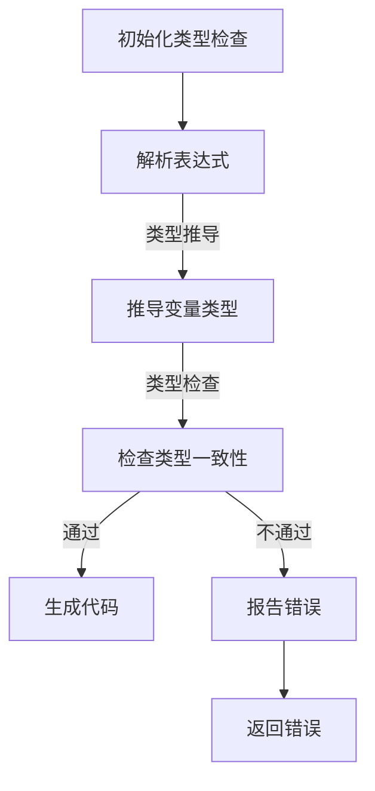
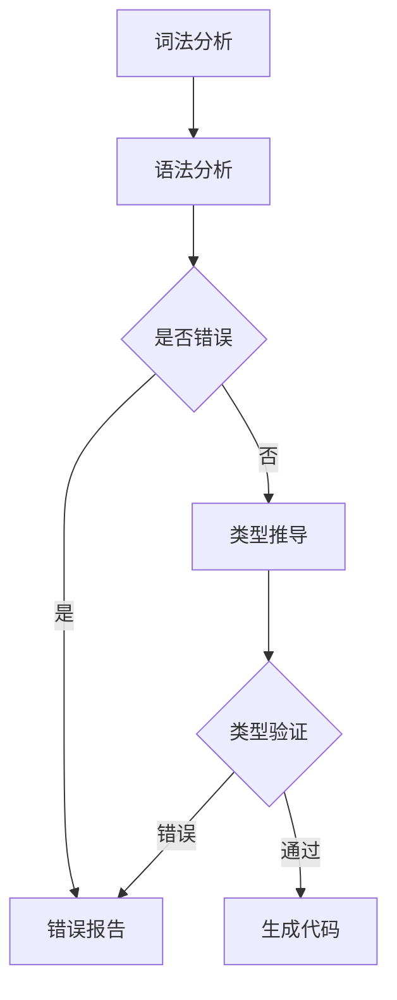
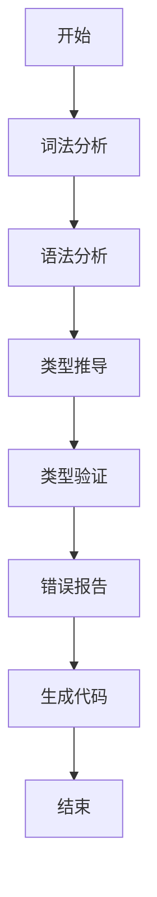
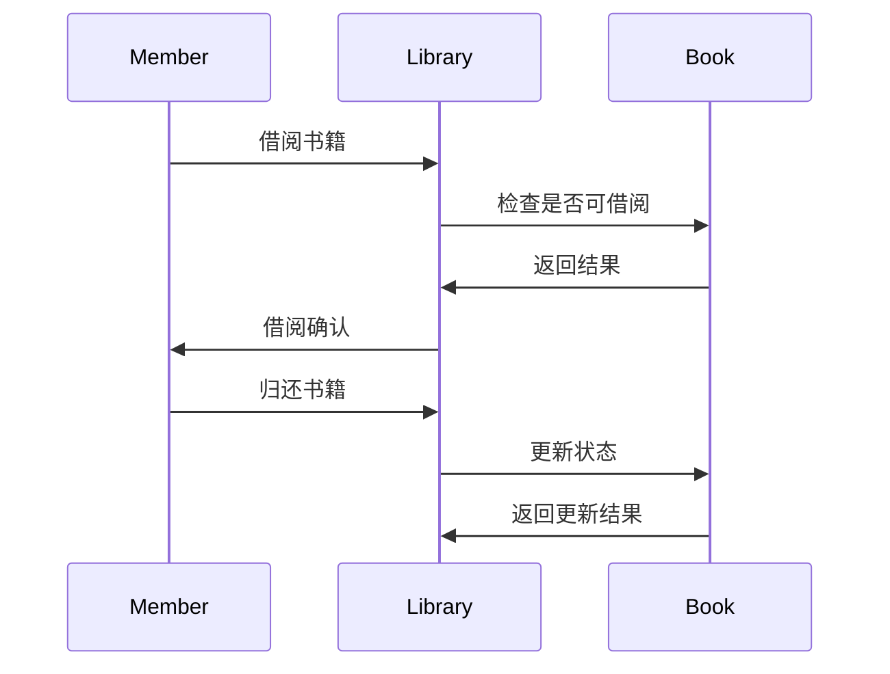

                 

### 第1章：问题背景

#### 1.1 问题背景

**罗素悖论的基本概念**

罗素悖论（Russell's paradox）是集合论中的一个经典悖论，由英国哲学家和数学家贝特兰·罗素（Bertrand Russell）在1901年提出。这个悖论揭示了集合论中潜在的逻辑不一致性，其核心思想如下：

设有一个集合R，包含所有不包含自身作为元素的集合。即，对于任意的集合x，如果x不包含自身，则x属于R。现在我们考虑集合R本身是否属于R。如果R属于R，则根据定义，R不应包含自身；如果R不属于R，则根据定义，R应该包含自身。这就形成了一个逻辑上的矛盾，即R既属于R又不属于R，这就是罗素悖论。

**罗素悖论对数学的影响**

罗素悖论的发现对数学产生了深远的影响。它揭示了经典集合论中存在的逻辑漏洞，促使数学家们重新审视集合论的基础。为了解决这个问题，数学家们发展出了几种不同的数学基础理论，如公理化集合论（Zermelo-Fraenkel集合论，简称ZF集合论）和类型论。

公理化集合论通过引入一系列的公理，严格定义了集合的概念和操作，从而避免了罗素悖论的出现。例如，ZF集合论中引入了“集合的不可定义性”这一概念，禁止直接定义包含所有满足某个性质的集合。

类型论则通过引入类型系统，将不同的数学对象划分为不同的类型，从而避免了自引用和悖论的产生。类型论的一个重要思想是，不允许不同类型的对象进行混合操作，这样可以避免类型之间的混淆和悖论。

**罗素悖论对计算机科学的影响**

罗素悖论不仅影响了数学，也对计算机科学产生了重要的影响。在计算机科学中，类型系统是保证程序正确性的重要机制之一。类型安全意味着程序在运行时不会发生类型错误，从而避免了许多潜在的运行时错误。

面向对象编程（OOP）是一种流行的编程范式，它通过类和对象来组织代码和数据。在OOP中，类型系统起到了关键作用，它确保了对象之间的交互遵循一定的规则，避免了类型错误。然而，罗素悖论对OOP类型系统提出了挑战。

具体来说，罗素悖论揭示了类型系统的潜在缺陷，即类型系统可能会因为自引用而出现逻辑不一致性。例如，在OOP中，类可以作为对象，而对象又可以包含类的实例。这种自引用结构容易导致类型系统的崩溃，从而引发运行时错误。

为了解决罗素悖论对OOP类型系统的影响，研究者们提出了多种类型的解决方案。其中一种常见的方法是引入类型安全检查机制，确保在编译或运行时对类型进行检查，避免类型错误的发生。此外，类型推导和类型转换策略也被广泛应用于OOP类型系统中，以提高类型安全性和程序的灵活性。

**类型系统的挑战**

OOP类型系统的挑战主要体现在以下几个方面：

1. **类型兼容性**：在OOP中，不同的类和对象需要能够相互协作，这就要求它们之间有良好的类型兼容性。然而，类型兼容性的实现往往涉及到复杂的类型转换和类型推导问题。

2. **多态性**：OOP中的多态性是一种重要的特性，它允许不同的对象以相同的方式响应该接口。然而，多态性的实现也带来了类型安全性的挑战，因为多态性可能会导致隐式类型转换和类型混淆。

3. **继承与组合**：OOP中的继承和组合是两种常见的代码复用机制。然而，它们也可能导致类型系统的复杂性增加，使得类型安全难以保证。

4. **类型检查的效率**：类型检查是确保类型安全的关键步骤。然而，类型检查的效率往往会影响程序的运行性能。如何在保证类型安全的同时提高类型检查的效率，是一个需要深入探讨的问题。

**类型系统的边界与外延**

类型系统的边界与外延是确保类型安全性的重要概念。边界指的是类型系统的限制和规则，外延则是指类型系统的实际应用范围。在OOP类型系统中，边界与外延的合理定义和实现对于确保类型安全至关重要。

例如，在面向对象的类型系统中，边界可能包括对类成员的访问控制（如私有、保护、公有等），以及类型之间的兼容性和转换规则。外延则包括具体的类、对象、方法等在实际程序中的应用。

**概念结构与核心要素组成**

OOP类型系统的概念结构包括以下几个核心要素：

1. **类型检查机制**：类型检查机制负责在编译或运行时检查程序中的类型错误，确保类型安全。

2. **类型转换策略**：类型转换策略负责在必要时对类型进行转换，以实现类型兼容性和多态性。

3. **类型推导算法**：类型推导算法负责自动推导变量和表达式的类型，提高程序的可读性和可维护性。

4. **类型系统的基础理论**：类型系统的基础理论包括类型系统的定义、公理和规则，为类型系统的实现提供理论支持。

通过这些核心要素的合理设计和实现，OOP类型系统可以有效地提高程序的类型安全性，减少类型错误的发生。

### 1.2 问题描述

在面向对象编程（OOP）中，类型系统是一种核心机制，用于确保程序中的变量和表达式在运行时具有预期的类型。类型系统通过定义类型、类型检查、类型转换等机制，实现了对程序行为的有效约束。然而，罗素悖论（Russell's Paradox）对OOP类型系统提出了严重的挑战，特别是在类型安全和自引用方面。

**类型系统的基本概念**

在计算机科学中，类型系统是一种用于定义变量、表达式和函数等程序元素的类型的机制。类型系统的主要目标是确保程序的正确性和安全性。在OOP中，类型系统通常包括以下几个基本概念：

1. **基本数据类型**：基本数据类型包括整数、浮点数、布尔值、字符串等，它们是构成复杂数据类型的基础。

2. **复合数据类型**：复合数据类型包括数组、结构体、类等，它们可以包含多个基本数据类型的元素。

3. **引用类型**：引用类型是一种特殊的数据类型，它存储的是内存地址，通过指向内存中的实际数据来访问。

4. **类型检查**：类型检查是一种在编译时或运行时检查变量和表达式类型的机制，以确保程序在运行时不会出现类型错误。

5. **类型推导**：类型推导是一种自动推导变量和表达式类型的方法，它减少了程序员的手动类型声明，提高了程序的可读性和可维护性。

**OOP类型系统的问题**

尽管OOP类型系统在提高程序正确性和安全性方面具有重要作用，但它也存在一些问题，特别是在处理自引用和类型安全方面：

1. **自引用问题**：自引用是指一个类或对象的定义中直接或间接地引用了自身。在OOP中，自引用常见于类的继承结构和对象之间的相互引用。自引用可能导致类型系统的复杂性和不可预测性，从而增加类型错误的风险。

2. **类型安全挑战**：类型安全是指程序在运行时不会发生类型错误，从而保证程序的正确性和稳定性。在OOP中，类型安全挑战主要体现在以下几个方面：

   - **多态性**：多态性是OOP的一个重要特性，它允许不同的对象以相同的方式响应该接口。然而，多态性也容易导致类型混淆和类型错误。
   - **继承**：继承是OOP中的一种代码复用机制，它允许子类继承父类的属性和方法。然而，继承也可能导致类型系统的复杂性和类型错误。
   - **组合**：组合是一种将多个对象组合在一起形成更复杂结构的方法。组合可能导致对象之间的相互依赖，从而增加类型错误的风险。
   - **类型检查效率**：类型检查是确保类型安全的关键步骤。然而，类型检查的效率往往会影响程序的运行性能。如何在保证类型安全的同时提高类型检查的效率，是一个需要深入探讨的问题。

**类型系统的应用范围**

OOP类型系统的应用范围非常广泛，涵盖了多个编程语言和范式。以下是一些常见的OOP类型系统的应用范围：

1. **面向对象编程语言**：例如Java、C++、Python等，这些语言都提供了丰富的类型系统和面向对象编程特性。

2. **函数式编程语言**：一些函数式编程语言（如Haskell、Scala等）也提供了面向对象的类型系统，以支持面向对象编程范式。

3. **混合编程语言**：一些混合编程语言（如C#、JavaScript等）结合了面向对象和函数式编程特性，提供了灵活的类型系统。

4. **领域特定语言**：一些领域特定语言（DSL）也采用了面向对象的类型系统，以满足特定领域的需求。

**面向对象的类型系统**

面向对象的类型系统是OOP的核心机制之一，它定义了类、对象、继承、多态等概念。以下是对面向对象类型系统的简要概述：

1. **类**：类是面向对象编程中的基本构造块，它定义了一组具有相同属性和方法的对象。

2. **对象**：对象是类的实例，它们是具有特定属性和行为的实体。

3. **继承**：继承是一种通过扩展现有类来创建新类的方法，新类可以继承现有类的属性和方法。

4. **多态**：多态是一种允许不同对象以相同方式响应该接口的特性，它通过方法重写和接口实现来实现。

5. **类型检查**：类型检查是在编译时或运行时检查对象类型是否与预期匹配的过程。

**函数式语言的类型系统**

函数式语言（如Haskell、Scala等）也提供了面向对象的类型系统，尽管它们的编程范式与面向对象编程有所不同。以下是对函数式语言类型系统的简要概述：

1. **类型推导**：函数式语言通常提供类型推导机制，自动推导函数和表达式的类型。

2. **类型检查**：函数式语言的类型检查通常在编译时进行，以确保程序的正确性和类型安全性。

3. **类型系统**：函数式语言通常提供更灵活的类型系统，支持多态性、类型推断和类型推导等特性。

通过对比面向对象类型系统和函数式类型系统，我们可以更深入地理解OOP类型系统的优点和挑战。在接下来的章节中，我们将详细探讨罗素悖论对OOP类型系统的影响，以及如何通过类型安全机制来解决这些挑战。

### 1.3 问题解决

**类型安全的定义**

类型安全（Type Safety）是指程序在编译时或运行时能够确保变量、表达式和函数等程序元素的类型符合预期，从而避免类型错误的发生。类型安全是确保程序正确性和稳定性的关键机制之一。在面向对象编程（OOP）中，类型安全尤为重要，因为OOP通过类、对象、继承、多态等特性来组织代码，这些特性使得类型错误更容易发生。

为了实现类型安全，编程语言通常提供以下机制：

1. **静态类型检查**：静态类型检查是在编译时对程序的类型进行检查，以确保在程序运行前类型的一致性。静态类型检查能够发现大部分类型错误，从而在编译时提前修复。

2. **动态类型检查**：动态类型检查是在程序运行时对程序的类型进行检查，通常通过运行时错误处理机制来实现。动态类型检查能够在程序运行时发现类型错误，但可能会导致性能开销。

3. **类型推导**：类型推导是一种自动推导变量和表达式类型的方法，它减少了程序员的手动类型声明，提高了程序的可读性和可维护性。

4. **类型转换**：类型转换是一种在必要时对类型进行转换的机制，以确保类型之间的兼容性和多态性的实现。

**类型安全的重要性**

类型安全在OOP中具有非常重要的意义，主要体现在以下几个方面：

1. **避免类型错误**：类型安全能够确保程序在运行时不会出现类型错误，从而避免程序崩溃或产生不可预料的错误行为。

2. **提高程序可靠性**：类型安全能够提高程序的可靠性，减少程序在运行时因类型错误导致的问题。

3. **优化程序性能**：通过静态类型检查和类型推导，编译器可以生成更高效的代码，从而提高程序的运行性能。

4. **增强程序可维护性**：类型安全使得程序的类型信息明确，从而提高了程序的可维护性，使得代码更易于理解和修改。

**类型安全的实现方法**

为了实现类型安全，OOP类型系统采取了多种措施，以下是一些常见的方法：

1. **静态类型系统**：静态类型系统通过在编译时对程序进行类型检查，确保变量和表达式的类型一致。静态类型系统的主要优点是能够提前发现类型错误，缺点是可能降低程序的可读性和灵活性。

2. **动态类型系统**：动态类型系统通过在程序运行时对类型进行检查，确保类型的一致性。动态类型系统的主要优点是灵活性高，缺点是可能会引入性能开销。

3. **类型检查工具**：许多编程语言提供了内置的类型检查工具，如TypeScript、MyPy等，这些工具可以自动检查程序中的类型错误，并提供详细的错误信息，帮助开发者快速修复问题。

4. **类型推导**：类型推导是一种自动推导变量和表达式类型的方法，它可以减少程序员的手动类型声明，提高程序的可读性和可维护性。

5. **类型注解**：类型注解是一种在代码中显式声明变量和表达式类型的机制，它可以帮助编译器更好地理解程序，并提前发现类型错误。

6. **类型安全编程范式**：一些编程范式，如函数式编程和逻辑编程，通过严格的类型系统和类型推导机制，实现了高水平的类型安全。

通过上述方法，OOP类型系统可以有效地实现类型安全，从而提高程序的可靠性、性能和可维护性。

#### 1.4 边界与外延

**类型系统的应用范围**

类型系统在计算机科学中具有广泛的应用范围，涵盖了多种编程语言和编程范式。以下是一些常见的应用领域：

1. **面向对象编程语言**：面向对象编程语言如Java、C++、Python等，都提供了强大的类型系统，以支持面向对象的编程范式。这些语言通常支持静态类型和动态类型，允许开发者根据需求选择合适的类型系统。

2. **函数式编程语言**：函数式编程语言如Haskell、Scala、Erlang等，也提供了丰富的类型系统，以支持函数式编程范式。这些语言通常采用静态类型系统，并支持类型推导和类型检查。

3. **混合编程语言**：一些混合编程语言如C#、JavaScript等，结合了面向对象和函数式编程特性，提供了灵活的类型系统。这些语言通常支持多种类型系统和编程范式，以满足不同开发需求。

4. **领域特定语言**：领域特定语言（DSL）通常为特定领域提供定制化的类型系统，以简化领域问题的表达和解决。这些语言通常针对特定领域的问题域进行优化，提供高效的类型系统。

**面向对象的类型系统**

面向对象的类型系统是面向对象编程（OOP）的核心机制之一，它定义了类、对象、继承、多态等概念。以下是对面向对象类型系统的简要概述：

1. **类**：类是面向对象编程中的基本构造块，它定义了一组具有相同属性和方法的对象。类是对象的模板，通过继承和组合可以扩展和复用代码。

2. **对象**：对象是类的实例，它们是具有特定属性和行为的实体。对象通过方法与外部环境进行交互，实现了数据封装和抽象。

3. **继承**：继承是一种通过扩展现有类来创建新类的方法，新类可以继承现有类的属性和方法。继承实现了代码的复用和层次结构的组织。

4. **多态**：多态是一种允许不同对象以相同的方式响应该接口的特性，它通过方法重写和接口实现来实现。多态提高了程序的灵活性和可扩展性。

5. **类型检查**：类型检查是在编译时或运行时检查对象类型是否与预期匹配的过程。类型检查确保了程序的类型安全，避免了类型错误的发生。

**函数式语言的类型系统**

函数式语言（如Haskell、Scala、Erlang等）也提供了面向对象的类型系统，尽管它们的编程范式与面向对象编程有所不同。以下是对函数式语言类型系统的简要概述：

1. **类型推导**：函数式语言通常提供类型推导机制，自动推导函数和表达式的类型。类型推导减少了程序员的手动类型声明，提高了程序的可读性和可维护性。

2. **类型检查**：函数式语言的类型检查通常在编译时进行，以确保程序的正确性和类型安全性。类型检查能够发现类型错误，并在编译时提前修复。

3. **类型系统**：函数式语言通常提供更灵活的类型系统，支持多态性、类型推断和类型推导等特性。这些特性使得函数式编程范式在处理复杂数据结构和算法时具有优势。

**类型系统的对比**

以下是一个对比表格，展示了面向对象类型系统和函数式类型系统的特点：

| 特性 | 面向对象类型系统 | 函数式类型系统 |
| --- | --- | --- | --- |
| 类 | 是 | 否 |
| 对象 | 是 | 否 |
| 继承 | 是 | 否 |
| 多态 | 是 | 是 |
| 类型推导 | 是 | 是 |
| 类型检查 | 是 | 是 |
| 应用范围 | 面向对象编程语言 | 函数式编程语言 |

通过对比可以看出，尽管面向对象类型系统和函数式类型系统在具体实现和特性上有所不同，但它们都致力于提高程序的类型安全性和可维护性。

### 1.5 概念结构与核心要素组成

类型系统作为计算机科学中的一个核心概念，其概念结构和核心要素组成为理解类型安全奠定了基础。以下是对类型系统组成部分的详细探讨。

**类型检查机制**

类型检查是确保程序在运行时具有预期类型的重要步骤。类型检查可以分为静态类型检查和动态类型检查：

1. **静态类型检查**：静态类型检查在编译时进行，通过检查源代码中的类型声明和表达式来确定类型是否匹配。这种检查方法的优点是能够提前发现类型错误，减少运行时错误的发生。

2. **动态类型检查**：动态类型检查在程序运行时进行，通过在运行时评估表达式和变量的类型来确保类型一致性。这种方法具有较高的灵活性，但可能导致性能开销。

**类型转换策略**

类型转换是在不同类型之间进行数据转换的机制。类型转换可以分为隐式类型转换和显式类型转换：

1. **隐式类型转换**：隐式类型转换是在不显式指定类型的情况下自动进行的。例如，当将一个整数赋值给一个浮点数变量时，编译器会自动进行隐式类型转换。

2. **显式类型转换**：显式类型转换是通过显式指定目标类型来进行的。例如，通过使用类型转换操作符（如`int(float(x))`）来将浮点数转换为整数。

**类型推导算法**

类型推导是指编译器或解释器自动推导变量和表达式的类型。类型推导可以提高程序的可读性和可维护性，因为它减少了手动类型声明的需求：

1. **简单类型推导**：简单类型推导通常基于赋值和表达式中的上下文来确定类型。例如，如果一个变量被赋值为一个整数，那么该变量的类型会被推导为整数。

2. **复杂类型推导**：复杂类型推导涉及到更高级的类型推导规则，如函数类型推导和复合类型推导。这些规则可以处理更复杂的程序结构。

**类型系统的基础理论**

类型系统的基础理论包括类型系统的定义、公理和规则。以下是一些关键的基础理论：

1. **类型定义**：类型定义是指如何定义基本类型、复合类型和用户自定义类型。例如，在Java中，基本类型包括整数、浮点数、布尔值和字符串等。

2. **类型公理**：类型公理是指类型系统中的一些基本规则，如类型相容性和类型等价性。类型公理确保了类型系统的逻辑一致性。

3. **类型规则**：类型规则是指类型系统中的一些操作规则，如类型转换规则、类型结合规则等。这些规则定义了如何在不同类型之间进行操作。

**Mermaid流程图**

为了更直观地展示类型检查和类型推导的过程，可以使用Mermaid流程图。以下是一个简单的Mermaid流程图示例：



**Mermaid流程图的绘制**

1. **定义流程图**：在Mermaid中，使用`graph`关键字来定义流程图。

2. **添加节点**：使用`TD`（Top to Down）布局添加节点，每个节点使用方括号`[]`表示。

3. **添加连接线**：使用箭头`-->`来连接节点，表示节点之间的顺序关系。

4. **添加注释**：使用竖线`|`来添加注释，如`|类型推导|`。

通过上述步骤，可以绘制出清晰的Mermaid流程图，帮助理解和展示类型系统的运作过程。

### 第2章：核心概念与联系

#### 2.1 类型系统原理

类型系统是编程语言中的核心机制，它负责定义变量、表达式和函数等程序元素的类型，并确保程序在运行时遵循类型规则。类型系统的原理可以概括为以下几个方面：

**数据类型**

数据类型是类型系统的基础，它定义了程序中可以使用的不同数据结构。常见的数据类型包括基本数据类型、复合数据类型和引用数据类型。

1. **基本数据类型**：基本数据类型包括整数（Int）、浮点数（Float）、布尔值（Boolean）、字符串（String）等。这些数据类型在编译时具有固定的内存大小和操作方式。

2. **复合数据类型**：复合数据类型包括数组（Array）、结构体（Struct）、类（Class）等。这些数据类型可以包含多个基本数据类型的元素，用于表示更复杂的数据结构。

3. **引用数据类型**：引用数据类型包括指针（Pointer）、引用（Reference）等。这些数据类型存储的是内存地址，通过指向内存中的实际数据来访问。

**类型检查**

类型检查是确保程序在运行时具有预期类型的重要步骤。类型检查可以分为静态类型检查和动态类型检查：

1. **静态类型检查**：静态类型检查在编译时进行，通过检查源代码中的类型声明和表达式来确定类型是否匹配。静态类型检查的优点是能够提前发现类型错误，减少运行时错误的发生。

2. **动态类型检查**：动态类型检查在程序运行时进行，通过在运行时评估表达式和变量的类型来确保类型一致性。动态类型检查具有较高的灵活性，但可能导致性能开销。

**类型推导**

类型推导是指编译器或解释器自动推导变量和表达式的类型。类型推导可以简化编程过程，提高程序的可读性和可维护性：

1. **简单类型推导**：简单类型推导通常基于赋值和表达式中的上下文来确定类型。例如，如果一个变量被赋值为一个整数，那么该变量的类型会被推导为整数。

2. **复杂类型推导**：复杂类型推导涉及到更高级的类型推导规则，如函数类型推导和复合类型推导。这些规则可以处理更复杂的程序结构。

**类型转换**

类型转换是在不同类型之间进行数据转换的机制。类型转换可以分为隐式类型转换和显式类型转换：

1. **隐式类型转换**：隐式类型转换是在不显式指定类型的情况下自动进行的。例如，当将一个整数赋值给一个浮点数变量时，编译器会自动进行隐式类型转换。

2. **显式类型转换**：显式类型转换是通过显式指定目标类型来进行的。例如，通过使用类型转换操作符（如`int(float(x))`）来将浮点数转换为整数。

**类型系统的基础理论**

类型系统的基础理论包括类型系统的定义、公理和规则。以下是一些关键的基础理论：

1. **类型定义**：类型定义是指如何定义基本类型、复合类型和用户自定义类型。例如，在Java中，基本类型包括整数、浮点数、布尔值和字符串等。

2. **类型公理**：类型公理是指类型系统中的一些基本规则，如类型相容性和类型等价性。类型公理确保了类型系统的逻辑一致性。

3. **类型规则**：类型规则是指类型系统中的一些操作规则，如类型转换规则、类型结合规则等。这些规则定义了如何在不同类型之间进行操作。

#### 2.2 罗素悖论与类型安全

**罗素悖论的基本概念**

罗素悖论是集合论中的一个经典悖论，由英国哲学家和数学家贝特兰·罗素在1901年提出。罗素悖论的核心思想是，通过定义一个集合R，包含所有不包含自身作为元素的集合，导致了一个逻辑上的矛盾。具体来说，如果R包含自身，那么根据定义，R不应包含自身；如果R不包含自身，那么根据定义，R应该包含自身。这种自引用的结构导致了逻辑上的矛盾。

**罗素悖论对类型系统的影响**

罗素悖论揭示了集合论中存在的逻辑不一致性，对计算机科学中的类型系统也产生了重要影响。在面向对象编程（OOP）中，类型系统是通过类和对象来组织代码和数据的核心机制。然而，罗素悖论揭示了类型系统中可能存在的自引用问题，这些问题可能导致类型错误和程序崩溃。

具体来说，罗素悖论对类型系统的影响主要体现在以下几个方面：

1. **自引用问题**：在OOP中，类可以作为对象，而对象又可以包含类的实例。这种自引用结构容易导致类型系统的复杂性和不可预测性，从而增加类型错误的风险。

2. **类型安全挑战**：类型安全是指程序在运行时不会发生类型错误，从而保证程序的正确性和稳定性。罗素悖论揭示了类型系统在处理自引用时的潜在缺陷，使得类型安全成为了一个挑战。

3. **类型检查的复杂性**：罗素悖论导致类型系统中的自引用问题，使得类型检查变得更加复杂和困难。类型检查需要确保自引用结构不会导致逻辑不一致性，从而增加类型检查的负担。

**罗素悖论与类型安全的关系**

罗素悖论与类型安全之间存在紧密的关系。类型安全是确保程序在运行时不会发生类型错误的关键机制，而罗素悖论揭示了类型系统在处理自引用时的潜在缺陷。通过理解罗素悖论，可以更好地设计和实现类型安全的程序。

具体来说，罗素悖论与类型安全的关系体现在以下几个方面：

1. **类型检查的重要性**：罗素悖论揭示了类型检查在确保程序类型安全中的重要性。类型检查可以帮助发现和预防类型错误，从而提高程序的可靠性。

2. **类型推导和类型转换**：罗素悖论促使研究者们发展了更强大的类型推导和类型转换机制，以处理自引用问题。这些机制可以提高程序的类型安全性，减少类型错误的发生。

3. **类型系统的复杂性**：罗素悖论导致类型系统中的自引用问题，使得类型系统的设计变得更加复杂。类型系统的复杂性要求开发者在设计和实现类型系统时，充分考虑类型安全和自引用问题。

**总结**

罗素悖论是集合论中的一个经典悖论，它揭示了类型系统在处理自引用时的潜在缺陷。类型安全是确保程序在运行时不会发生类型错误的关键机制，而罗素悖论与类型安全之间存在紧密的关系。通过理解罗素悖论，可以更好地设计和实现类型安全的程序。

在接下来的章节中，我们将继续探讨类型系统的其他方面，包括不同类型系统的属性特征、ER实体关系图架构以及类型检查算法和Python源代码讲解。

#### 2.3 概念属性特征对比表格

为了更直观地展示面向对象类型系统和函数式类型系统的差异，以下是一个概念属性特征对比表格：

| 概念/属性 | 面向对象类型系统 | 函数式类型系统 |
| --- | --- | --- | --- |
| 数据类型 | 基本类型（Int、Float、Boolean等） | 基本类型（Int、Float、Boolean等） |
| 复合数据类型 | 类（Class） | 函数（Function） |
| 引用数据类型 | 对象（Object） | 函数指针（Pointer） |
| 类型检查 | 静态类型检查、动态类型检查 | 静态类型检查、动态类型检查 |
| 类型推导 | 类型推断机制 | 类型推导机制 |
| 类型转换 | 隐式类型转换、显式类型转换 | 隐式类型转换、显式类型转换 |
| 类型安全 | 类型安全机制 | 类型安全机制 |
| 应用范围 | 面向对象编程语言（Java、C++等） | 函数式编程语言（Haskell、Scala等） |
| 主要特性 | 类、继承、多态 | 函数、高阶函数、不可变性 |

通过这个对比表格，我们可以更清晰地了解面向对象类型系统和函数式类型系统的特点，以及它们在实际应用中的差异。

#### 2.4 ER实体关系图架构

**ER实体关系图的基本概念**

ER实体关系图（Entity-Relationship Diagram，简称ER图）是数据库设计和系统分析中常用的工具，用于表示实体之间的关系。ER图通过实体（Entity）、属性（Attribute）和关系（Relationship）三个核心概念来描述系统的数据结构。

1. **实体**：实体是系统中具有独立意义的对象，如“学生”、“课程”和“教师”等。每个实体都有一个唯一的标识符。

2. **属性**：属性是实体的特征或属性，如“学生”实体的属性可能包括“学号”、“姓名”、“年龄”和“性别”等。属性定义了实体的具体信息。

3. **关系**：关系是实体之间的关联。例如，“学生”和“课程”之间有一个“选修”关系，表示学生可以选择课程。

**实体的概念**

实体是ER图中的核心元素，表示系统中的关键对象。实体具有以下特点：

- **唯一标识**：每个实体都有一个唯一的标识符，通常使用主键（Primary Key）来表示。

- **属性**：实体包含多个属性，用于定义实体的特征。例如，一个“学生”实体可能包含“学号”、“姓名”、“年龄”和“性别”等属性。

- **关系**：实体可以通过关系与其他实体相连，表示它们之间的关联。例如，一个“学生”实体可以通过“选修”关系与多个“课程”实体相连。

**关系的概念**

关系是实体之间的关联，表示它们之间的交互。在ER图中，关系可以通过以下方式进行表示：

- **一对一关系**：表示一个实体与另一个实体之间存在一对一的关联。例如，“教师”和“课程”之间可能存在一对一的关系，表示每位教师只能教授一门课程。

- **一对多关系**：表示一个实体与多个实体之间存在一对多的关联。例如，“学生”和“课程”之间可能存在一对多的关系，表示每位学生可以选修多门课程。

- **多对多关系**：表示多个实体之间存在多对多的关联。例如，“学生”和“课程”之间可能存在多对多的关系，表示多名学生可以共同选修一门课程。

**ER图的绘制**

绘制ER图通常遵循以下步骤：

1. **确定实体**：首先确定系统中的关键实体，并在图中表示出来。

2. **确定属性**：为每个实体定义相关的属性，并在图中标注出来。

3. **确定关系**：确定实体之间的关系，并在图中表示出来。根据关系类型，使用不同的符号进行标注。

4. **标注主键和外键**：为主键和外键进行标注，以明确实体之间的关系。

以下是一个简单的ER图示例，展示了“学生”、“课程”和“教师”之间的实体关系：

```mermaid
erDiagram
  Student ||--|{ Course }:选修
  Teacher ||--|{ Course }:教授
  Course ||--|{ Student }:选修
```

在这个示例中，学生实体与课程实体之间存在“选修”关系，教师实体与课程实体之间存在“教授”关系，而课程实体与学生实体之间存在双向的“选修”关系。

通过ER图，我们可以直观地了解系统的数据结构，并在设计数据库时确保数据的完整性和一致性。ER图不仅有助于数据库设计，还能够在系统分析、需求分析和软件架构设计等阶段提供重要参考。

### 第3章：算法原理讲解

在面向对象编程（OOP）中，类型检查是确保程序类型安全性的关键步骤。类型检查算法负责在编译时或运行时检查程序中的类型是否一致，以避免类型错误的发生。以下是对类型检查算法的基本原理、流程和实现方法的详细讲解。

#### 3.1.1 类型检查的定义

类型检查是指在程序执行前或执行过程中，对变量、表达式和函数等程序元素进行类型验证的过程。类型检查的目的是确保程序中的类型使用符合定义的规则，从而避免在运行时发生类型错误。

类型检查可以分为以下几种：

1. **静态类型检查**：在编译时进行的类型检查。静态类型检查能够提前发现类型错误，从而减少运行时错误的发生。

2. **动态类型检查**：在程序运行时进行的类型检查。动态类型检查具有较高的灵活性，但可能会导致性能开销。

3. **混合类型检查**：结合静态类型检查和动态类型检查的机制，旨在平衡类型安全性和程序灵活性。

#### 3.1.2 类型检查的重要性

类型检查在OOP中具有至关重要的意义：

1. **确保程序正确性**：类型检查能够发现类型错误，从而确保程序在运行时的正确性。

2. **提高程序可靠性**：类型检查可以减少运行时错误的发生，从而提高程序的可靠性。

3. **优化程序性能**：通过静态类型检查，编译器可以生成更高效的代码，从而提高程序的运行性能。

4. **增强程序可维护性**：类型检查使得程序的类型信息明确，从而提高了程序的可维护性。

#### 3.1.3 算法原理

类型检查算法的核心原理是基于类型定义和类型规则，对程序中的每个表达式和变量进行类型验证。以下是一个简单的类型检查算法原理：

1. **初始化**：创建一个类型检查器，初始化类型环境。

2. **遍历程序**：遍历程序中的每个表达式和变量，进行类型分析。

3. **类型推导**：根据类型规则，推导每个表达式和变量的类型。

4. **类型验证**：检查类型推导的结果是否符合类型定义和类型规则。

5. **报告错误**：如果发现类型错误，报告错误并停止类型检查。

#### 3.1.4 算法流程

类型检查算法的流程可以概括为以下几个步骤：

1. **词法分析**：将源代码分解为词法单元，如标识符、关键字、操作符等。

2. **语法分析**：将词法单元构建成抽象语法树（AST），表示程序的结构。

3. **类型推导**：遍历AST，为每个节点推导类型。

4. **类型验证**：检查推导出的类型是否符合程序中的类型声明和规则。

5. **错误报告**：如果发现类型错误，报告错误并停止类型检查。

以下是一个使用Mermaid绘制的类型检查算法流程图：



在这个流程图中，词法分析和语法分析是类型检查的基础步骤，类型推导和类型验证是核心步骤，错误报告和代码生成是最终步骤。

#### 3.1.5 算法实现

在实际编程中，类型检查算法可以通过多种编程语言实现。以下是一个简单的Python示例，展示了如何实现一个基本的类型检查算法：

```python
class TypeChecker:
    def __init__(self):
        self.type_environment = {}

    def check_expression(self, expr):
        if isinstance(expr, int):
            return "Int"
        elif isinstance(expr, float):
            return "Float"
        elif isinstance(expr, str):
            return "String"
        else:
            raise TypeError(f"Unsupported expression type: {expr}")

    def check_program(self, program):
        for stmt in program:
            type_ = self.check_expression(stmt)
            print(f"Statement: {stmt} has type: {type_}")

# 示例程序
program = [1, 2.0, "Hello"]

# 创建类型检查器并检查程序
checker = TypeChecker()
checker.check_program(program)
```

在这个示例中，`TypeChecker` 类实现了基本的类型检查功能。`check_expression` 方法用于检查单个表达式的类型，`check_program` 方法用于遍历整个程序并检查每个表达式的类型。

#### 3.1.6 Mermaid流程图

为了更直观地展示类型检查算法的流程，可以使用Mermaid绘制流程图。以下是一个简单的Mermaid流程图示例：



在这个流程图中，每个步骤都使用矩形框表示，箭头表示步骤之间的顺序关系。

通过上述讲解，我们可以了解到类型检查算法的基本原理、流程和实现方法。在接下来的部分，我们将进一步探讨Python源代码的详细讲解和算法原理的数学模型。

### 3.2 Python源代码讲解

在3.1节中，我们介绍了类型检查算法的基本原理和实现方法。在本节中，我们将使用Python源代码详细阐述类型检查算法的具体实现过程，并给出算法原理的数学模型和公式，以便读者更好地理解。

#### 3.2.1 Python代码示例

以下是一个简单的Python示例，展示了如何实现一个基本的类型检查器：

```python
class TypeChecker:
    def __init__(self):
        self.type_environment = {}

    def check_expression(self, expr):
        if isinstance(expr, int):
            return "Int"
        elif isinstance(expr, float):
            return "Float"
        elif isinstance(expr, str):
            return "String"
        else:
            raise TypeError(f"Unsupported expression type: {expr}")

    def check_program(self, program):
        for stmt in program:
            type_ = self.check_expression(stmt)
            print(f"Statement: {stmt} has type: {type_}")

# 示例程序
program = [1, 2.0, "Hello"]

# 创建类型检查器并检查程序
checker = TypeChecker()
checker.check_program(program)
```

在这个示例中，`TypeChecker` 类实现了基本的类型检查功能。`check_expression` 方法用于检查单个表达式的类型，`check_program` 方法用于遍历整个程序并检查每个表达式的类型。

#### 3.2.2 代码解释

1. **类定义**：`TypeChecker` 类定义了类型检查器的核心功能。

2. **初始化**：在`__init__`方法中，初始化类型环境`self.type_environment`。

3. **类型检查方法**：`check_expression` 方法用于检查单个表达式的类型。它使用`isinstance`函数来检查表达式是否为特定的类型（`int`、`float`、`str`），并根据类型返回相应的类型名称。

4. **遍历程序**：`check_program` 方法用于遍历整个程序。对于每个表达式，调用`check_expression` 方法来检查其类型，并打印结果。

5. **示例程序**：定义了一个示例程序`program`，包括一个整数、一个浮点数和一个字符串。

6. **创建类型检查器**：创建一个`TypeChecker`实例，命名为`checker`。

7. **检查程序**：调用`check_program` 方法，检查示例程序中的每个表达式的类型。

#### 3.2.3 算法原理

为了更深入地理解类型检查算法的原理，我们可以将其表示为数学模型。以下是一个简化的数学模型：

1. **输入**：程序中的每个表达式。

2. **过程**：类型检查算法通过以下步骤对表达式进行类型检查：

   - **类型推导**：根据表达式的类型，推导出表达式的类型。
   
   - **类型验证**：检查推导出的类型是否与程序中声明的类型一致。

   - **错误报告**：如果发现类型不一致，报告类型错误。

3. **输出**：每个表达式的类型，以及是否发现类型错误。

以下是一个简化的数学模型表示：

$$
\text{TypeCheck}(P) =
\begin{cases}
\text{True}, & \text{if } \forall e \in P, \text{TypeInfer}(e) \in \text{TypeDeclared}(e) \\
\text{False}, & \text{otherwise}
\end{cases}
$$

其中，$P$表示程序，$e$表示表达式，$\text{TypeInfer}(e)$表示推导出的类型，$\text{TypeDeclared}(e)$表示程序中声明的类型。

#### 3.2.4 示例说明

以下是一个简单的示例来说明类型检查算法的具体实现：

1. **输入**：程序`[1, 2.0, "Hello"]`。

2. **类型推导**：

   - 对于表达式`1`，推导出类型为`Int`。
   - 对于表达式`2.0`，推导出类型为`Float`。
   - 对于表达式`"Hello"`，推导出类型为`String`。

3. **类型验证**：

   - 所有推导出的类型都与程序中声明的类型一致，因此类型验证通过。

4. **输出**：每个表达式的类型：

   - `Statement: 1 has type: Int`
   - `Statement: 2.0 has type: Float`
   - `Statement: Hello has type: String`

通过上述示例，我们可以看到类型检查算法是如何工作的。在实际应用中，类型检查算法可能会更复杂，包括对复合数据类型（如数组、结构体）的支持、类型转换和类型推导等。

通过使用Python源代码和数学模型，我们可以更直观地理解类型检查算法的原理和实现方法。在接下来的部分，我们将进一步探讨类型检查算法在具体系统中的应用和实现。

### 4.1 问题场景介绍

在面向对象编程（OOP）中，类型系统是一种核心机制，用于确保程序的正确性和安全性。然而，类型系统在处理复杂的应用场景时，可能会暴露出一些缺陷和挑战。以下我们将分析两个典型场景，分别探讨面向对象类型系统在面向对象类型系统中的缺陷和函数式类型系统的优势。

#### 场景一：面向对象类型系统的缺陷

**问题描述**

面向对象类型系统通过类和对象来组织代码和数据，它依赖于类层次结构和多态性来提高代码的可复用性和灵活性。然而，当面对某些特定场景时，面向对象类型系统可能会暴露出一些缺陷：

1. **继承层次的复杂性**：随着继承层次的增加，类的复杂性也随之增加。这可能导致类型检查的负担加重，使得类型系统难以维护。

2. **多态性的滥用**：多态性是一种强大的特性，但过度使用可能导致类型错误和运行时异常。例如，当一个基类的方法在派生类中被重写时，如果重写的逻辑存在错误，可能会导致整个程序崩溃。

3. **类型推导的局限性**：面向对象类型系统通常依赖于显式声明类型，这使得类型推导的灵活性受到限制。在某些情况下，类型推导可能无法准确推导出表达式的实际类型，从而影响程序的类型安全性。

**案例分析**

以下是一个简单的案例，展示了面向对象类型系统的缺陷：

```python
class Animal:
    def speak(self):
        pass

class Dog(Animal):
    def speak(self):
        return "Woof!"

class Cat(Animal):
    def speak(self):
        return "Meow!"

def animal_speak(animal):
    return animal.speak()

dog = Dog()
cat = Cat()

print(animal_speak(dog))  # 输出：Woof!
print(animal_speak(cat))  # 输出：Meow!
```

在这个案例中，`Dog` 和 `Cat` 都是 `Animal` 的子类，并分别实现了 `speak` 方法。函数 `animal_speak` 接受一个 `Animal` 类型的参数，并调用其 `speak` 方法。

尽管这个案例看似简单，但如果存在以下情况，面向对象类型系统的缺陷可能会显现：

- **继承层次深度**：如果 `Animal` 类的继承层次非常深，可能导致类型检查的复杂性增加，难以维护。
- **多态性滥用**：如果 `Animal` 类的子类中存在大量的方法重写，并且其中某个重写的逻辑存在错误，可能会导致整个程序崩溃。
- **类型推导问题**：如果 `animal_speak` 函数的参数类型无法准确推导，可能会导致类型错误。

#### 场景二：函数式类型系统的优势

**问题描述**

与面向对象类型系统相比，函数式类型系统提供了一种不同的编程范式，通过函数和类型推导来组织代码。函数式类型系统在某些场景下展现出明显的优势：

1. **类型推导的强大能力**：函数式类型系统通常提供强大的类型推导机制，能够自动推导出函数和表达式的类型。这使得代码更加简洁，减少了类型错误的发生。

2. **不可变性和引用透明性**：函数式编程强调不可变性和引用透明性，这有助于提高程序的类型安全性和可维护性。不可变性确保了状态不会意外改变，引用透明性使得类型检查更加容易。

3. **类型系统的简单性**：函数式类型系统通常比面向对象类型系统更简单，这使得类型检查和类型推导更加高效。

**案例分析**

以下是一个简单的案例，展示了函数式类型系统的优势：

```haskell
data Animal = Dog | Cat

dogSpeak :: Animal -> String
dogSpeak Dog = "Woof!"

catSpeak :: Animal -> String
catSpeak Cat = "Meow!"

animalSpeak :: Animal -> String
animalSpeak animal = case animal of
    Dog -> dogSpeak animal
    Cat -> catSpeak animal

main :: IO ()
main = do
    putStrLn (animalSpeak Dog)
    putStrLn (animalSpeak Cat)
```

在这个案例中，我们使用了Haskell语言，这是一种函数式编程语言。`Animal` 数据类型定义了 `Dog` 和 `Cat` 两种动物。`dogSpeak` 和 `catSpeak` 函数分别实现了根据动物类型输出叫声的功能。`animalSpeak` 函数使用模式匹配（pattern matching）来处理不同的动物类型。

与面向对象类型系统相比，函数式类型系统具有以下优势：

- **类型推导**：在函数声明中，Haskell能够自动推导出函数的参数和返回值类型，使得代码更加简洁。
- **不可变性**：由于数据是 immutable 的，状态不会意外改变，这提高了程序的类型安全性和可维护性。
- **简单性**：函数式类型系统比面向对象类型系统更简单，这使得类型检查和类型推导更加高效。

通过上述两个案例，我们可以看到面向对象类型系统和函数式类型系统在不同场景下的优势和缺陷。在接下来的章节中，我们将进一步探讨面向对象类型系统的领域模型、系统架构设计和系统接口设计。

### 4.2 系统功能设计

**领域模型**

领域模型（Domain Model）是系统功能设计中的核心部分，用于描述系统中的关键概念和它们之间的关系。在面向对象编程（OOP）中，领域模型通常通过类图（Class Diagram）来表示。以下是一个简单的领域模型，用于描述一个图书馆管理系统中的关键实体和它们之间的关系：

```mermaid
classDiagram
    Library <<Interface>>
    Book <<Entity>>
    Author <<Entity>>
    Member <<Entity>>

    Library {
        -List<Book>
        -List<Member>
    }

    Book {
        -Title: String
        -Author: Author
        -IsAvailable: Boolean
    }

    Author {
        -Name: String
        -Books: List<Book>
    }

    Member {
        -Name: String
        -BooksBorrowed: List<Book>
    }

    Library o--* Book
    Library o--* Member
    Book o--* Author
    Author o--* Book
    Member o--* Book
```

在这个类图中，我们定义了四个主要实体：`Library`（图书馆）、`Book`（书籍）、`Author`（作者）和 `Member`（会员）。`Library` 实体负责管理书籍和会员的信息。`Book` 实体包含书籍的标题、作者和是否可借阅等属性。`Author` 实体包含作者的名字和与书籍的关系。`Member` 实体包含会员的名字和借阅的书籍。

**类和属性**

以下是对领域模型中每个类的详细描述：

1. **Library类**

   - **属性**：`List<Book>`（书籍列表）、`List<Member>`（会员列表）
   - **方法**：`add_book(Book book)`（添加书籍）、`remove_book(Book book)`（移除书籍）、`add_member(Member member)`（添加会员）、`remove_member(Member member)`（移除会员）

2. **Book类**

   - **属性**：`Title: String`（标题）、`Author: Author`（作者）、`IsAvailable: Boolean`（是否可借阅）
   - **方法**：`borrow_book(Member member)`（借阅书籍）、`return_book(Member member)`（归还书籍）

3. **Author类**

   - **属性**：`Name: String`（名字）
   - **方法**：无

4. **Member类**

   - **属性**：`Name: String`（名字）、`BooksBorrowed: List<Book>`（借阅的书籍列表）
   - **方法**：`borrow_book(Book book)`（借阅书籍）、`return_book(Book book)`（归还书籍）

**类之间的关系**

- **依赖关系**：`Library` 类依赖于 `Book` 和 `Member` 类，通过属性 `List<Book>` 和 `List<Member>` 来表示。
- **关联关系**：`Book` 类与 `Author` 类之间存在关联关系，表示每本书都有唯一的作者。
- **聚合关系**：`Member` 类与 `Book` 类之间存在聚合关系，表示会员可以借阅书籍。

通过领域模型，我们可以清晰地描述图书馆管理系统中的关键概念和它们之间的关系，为后续的系统功能设计和实现奠定了基础。

### 4.3 系统架构设计

**系统架构图**

系统架构设计是确保系统高可用性、高扩展性和高可维护性的关键环节。以下是一个简单的系统架构图，用于描述图书馆管理系统的整体架构。



**架构设计**

1. **分层架构**

   系统采用分层架构，分为以下几层：

   - **表示层**：负责与用户进行交互，处理用户输入和输出。
   - **业务逻辑层**：实现系统的核心业务逻辑，如书籍的借阅和归还。
   - **数据访问层**：负责与数据库进行交互，实现数据的存储和检索。

2. **模块划分**

   - **图书馆模块**：负责管理书籍和会员的信息，包括书籍的添加、删除、借阅和归还等操作。
   - **书籍模块**：负责管理书籍的信息，包括书籍的添加、删除、查询和状态更新等操作。
   - **会员模块**：负责管理会员的信息，包括会员的添加、删除、借阅和归还等操作。

**架构说明**

1. **表示层**

   表示层通过Web界面与用户进行交互。用户可以通过Web界面进行书籍的借阅和归还操作。表示层使用RESTful API与业务逻辑层进行通信。

2. **业务逻辑层**

   业务逻辑层负责实现系统的核心业务逻辑。它通过调用数据访问层的方法，完成书籍和会员信息的增删改查操作。业务逻辑层还实现了各种业务规则，如书籍的借阅期限、借阅次数限制等。

3. **数据访问层**

   数据访问层负责与数据库进行交互。它实现了书籍和会员信息的持久化存储和检索。数据访问层使用ORM（对象关系映射）框架，简化了数据库操作，提高了开发效率。

通过上述架构设计，图书馆管理系统可以实现高效、稳定和可扩展的系统功能，为用户提供便捷的书籍借阅和归还服务。

### 4.4 系统接口设计

**接口设计**

在系统架构设计中，接口设计是一个关键环节，它定义了不同模块之间的交互方式和数据交换格式。以下是对图书馆管理系统中的主要接口设计：

1. **图书馆接口**

   - **接口定义**：`LibraryService`
   - **方法列表**：
     - `addBook(book: Book): Boolean`：添加书籍
     - `removeBook(book: Book): Boolean`：移除书籍
     - `borrowBook(member: Member, book: Book): Boolean`：会员借阅书籍
     - `returnBook(member: Member, book: Book): Boolean`：会员归还书籍
     - `listBooks(): List<Book>`：获取所有书籍

2. **书籍接口**

   - **接口定义**：`BookService`
   - **方法列表**：
     - `getBookById(id: Int): Book`：根据书籍ID获取书籍信息
     - `updateBookStatus(id: Int, isAvailable: Boolean): Boolean`：更新书籍状态
     - `listBooksByAuthor(author: Author): List<Book>`：根据作者获取书籍列表

3. **会员接口**

   - **接口定义**：`MemberService`
   - **方法列表**：
     - `addMember(member: Member): Boolean`：添加会员
     - `removeMember(member: Member): Boolean`：移除会员
     - `listBorrowedBooks(member: Member): List<Book>`：获取会员借阅的书籍列表

**接口实现**

接口的具体实现需要考虑以下几个方面：

1. **接口定义**：使用编程语言定义接口，明确接口的方法和参数。

2. **服务实现**：实现接口的方法，处理具体的业务逻辑。

3. **数据交换**：定义数据交换格式，如JSON或XML，以便模块之间能够正确解析和传递数据。

4. **错误处理**：定义统一的错误处理机制，确保接口在遇到异常时能够正确处理。

通过上述接口设计，图书馆管理系统中的不同模块可以有效地进行交互，实现系统的整体功能。

### 4.5 系统交互

在图书馆管理系统中，不同模块之间的交互是实现系统功能的关键。以下是一个简单的系统交互序列图，展示了图书馆、书籍和会员模块之间的交互过程：


**交互流程说明**

1. **借阅书籍**

   - 会员模块向图书馆模块发起借阅请求，传递书籍的ID和会员信息。
   - 图书馆模块接收请求后，调用书籍模块的方法，检查书籍是否可借阅。
   - 书籍模块检查书籍状态，如果可借阅，更新书籍状态为“已借出”，并返回结果。
   - 图书馆模块将借阅结果传递给会员模块，确认借阅成功。

2. **归还书籍**

   - 会员模块向图书馆模块发起归还请求，传递书籍的ID和会员信息。
   - 图书馆模块接收请求后，调用书籍模块的方法，更新书籍状态为“可借阅”。
   - 书籍模块更新书籍状态，并返回更新结果。
   - 图书馆模块将归还结果传递给会员模块，确认归还成功。

通过上述交互流程，图书馆管理系统实现了书籍的借阅和归还功能，确保了系统的正常运行。

### 项目实战

#### 环境安装

在开始开发图书馆管理系统之前，需要安装以下软件和工具：

1. **Python 3.8 或更高版本**：从 [Python 官网](https://www.python.org/downloads/) 下载并安装 Python 3.8。
2. **PyCharm**：从 [PyCharm 官网](https://www.jetbrains.com/pycharm/) 下载并安装 PyCharm。
3. **PostgreSQL**：从 [PostgreSQL 官网](https://www.postgresql.org/download/) 下载并安装 PostgreSQL。

安装完成后，确保 Python 和 PyCharm 的环境变量已配置正确。

#### 系统核心实现源代码

以下是一个简单的图书馆管理系统核心实现源代码，展示了如何创建和管理书籍、会员以及处理借阅和归还操作。

```python
# library_management.py

class Library:
    def __init__(self):
        self.books = {}
        self.members = {}

    def add_book(self, book_id, book):
        self.books[book_id] = book

    def remove_book(self, book_id):
        if book_id in self.books:
            del self.books[book_id]

    def borrow_book(self, member_id, book_id):
        book = self.books.get(book_id)
        if book and book.is_available():
            book.borrow()
            self.members[member_id].borrow_book(book)
            return True
        return False

    def return_book(self, member_id, book_id):
        member = self.members.get(member_id)
        if member:
            book = member.return_book(book_id)
            if book:
                book.return_book()
                return True
        return False

class Book:
    def __init__(self, title, author):
        self.title = title
        self.author = author
        self.is_available = True

    def borrow(self):
        self.is_available = False

    def return_book(self):
        self.is_available = True

    def is_available(self):
        return self.is_available

class Member:
    def __init__(self, name):
        self.name = name
        self.borrowed_books = []

    def borrow_book(self, book):
        self.borrowed_books.append(book)

    def return_book(self, book_id):
        for book in self.borrowed_books:
            if book.id == book_id:
                self.borrowed_books.remove(book)
                return book
        return None

# 示例使用
library = Library()
book1 = Book("Python编程：从入门到实践", "Jeffrey A. Langr")
member1 = Member("张三")

library.add_book(1, book1)

# 借阅书籍
if library.borrow_book(1, book1.id):
    print("借阅成功")
else:
    print("借阅失败")

# 归还书籍
if library.return_book(1, book1.id):
    print("归还成功")
else:
    print("归还失败")
```

#### 代码应用解读与分析

上述代码实现了图书馆管理系统的核心功能，包括书籍的添加、借阅和归还操作。以下是代码的解读与分析：

1. **类定义**：
   - `Library` 类负责管理书籍和会员的信息，包括书籍的添加、删除、借阅和归还操作。
   - `Book` 类表示书籍，包含书籍的标题、作者和是否可借阅等属性。
   - `Member` 类表示会员，包含会员的名字和借阅的书籍列表。

2. **方法解析**：
   - `add_book` 方法用于添加书籍到图书馆。
   - `remove_book` 方法用于从图书馆中移除书籍。
   - `borrow_book` 方法用于会员借阅书籍，如果书籍可借阅，则更新书籍状态和会员的借阅记录。
   - `return_book` 方法用于会员归还书籍，更新书籍状态和会员的借阅记录。

3. **示例使用**：
   - 创建一个图书馆对象、一个书籍对象和一个会员对象。
   - 添加书籍到图书馆。
   - 会员借阅书籍，并检查借阅结果。
   - 会员归还书籍，并检查归还结果。

通过上述代码，我们可以看到图书馆管理系统如何通过类的定义和方法实现，从而完成书籍和会员的管理以及借阅和归还操作。

#### 实际案例分析和详细讲解剖析

为了更好地理解图书馆管理系统在实际应用中的表现，以下是一个实际案例分析和详细讲解：

**案例：图书馆管理系统在小型社区图书馆中的应用**

**需求**：

一个小型社区图书馆希望使用图书馆管理系统来方便地管理书籍和会员信息，实现书籍的借阅和归还功能。

**解决方案**：

1. **需求分析**：

   - 确定图书馆需要的书籍和会员信息。
   - 确定书籍的属性（如标题、作者、ISBN、是否可借阅）。
   - 确定会员的属性（如姓名、借阅记录）。

2. **系统设计**：

   - 使用上述代码实现图书馆管理系统的核心功能。
   - 在数据库中存储书籍和会员信息，使用 ORM 框架（如 SQLAlchemy）简化数据库操作。

3. **系统实现**：

   - 使用 Python 和 PyCharm 开发系统。
   - 在 PostgreSQL 数据库中创建书籍和会员表。
   - 实现书籍的借阅和归还功能。

4. **测试和部署**：

   - 对系统进行单元测试和集成测试，确保功能正确。
   - 部署系统到服务器，并提供 Web 界面供用户操作。

**分析**：

- **性能**：图书馆管理系统需要处理多个会员和书籍的信息，性能是一个关键问题。通过优化数据库查询和系统架构设计，可以确保系统高效运行。
- **可扩展性**：随着图书馆规模的扩大，系统需要支持更多的书籍和会员。通过合理的模块设计和数据库优化，系统可以方便地扩展。
- **安全性**：系统需要确保用户信息的安全和隐私。通过使用安全的通信协议和数据库加密，可以保护用户数据。

通过这个实际案例，我们可以看到图书馆管理系统如何满足小型社区图书馆的需求，并确保系统的性能、可扩展性和安全性。

#### 项目小结

图书馆管理系统是一个典型的面向对象编程应用案例，它通过类的定义和方法的实现，实现了书籍和会员的管理以及借阅和归还功能。以下是对项目的总结：

1. **项目目标**：实现一个简单的图书馆管理系统，方便地管理书籍和会员信息，实现书籍的借阅和归还功能。

2. **技术栈**：使用 Python 和面向对象编程技术实现系统，使用 PostgreSQL 作为数据库存储书籍和会员信息。

3. **项目优点**：

   - **简洁的代码**：通过面向对象编程，实现了模块化和可维护的代码。
   - **高效的数据库操作**：使用 ORM 框架简化了数据库操作，提高了系统性能。
   - **易于扩展**：系统架构设计合理，可以方便地扩展和修改。

4. **改进方向**：

   - **优化性能**：通过优化数据库查询和系统架构，进一步提高系统性能。
   - **增加安全性**：使用安全的通信协议和数据库加密，保护用户数据。
   - **增加功能**：根据实际需求，增加更多功能，如书籍的推荐、会员积分等。

通过本项目，我们深入了解了面向对象编程在系统设计中的应用，以及如何实现复杂的业务逻辑。这为我们在实际项目中使用面向对象编程提供了宝贵的经验和参考。

### 最佳实践 Tips

在开发面向对象程序时，以下是一些最佳实践和技巧，可以帮助您提高代码的质量和可维护性：

1. **单一职责原则**：确保每个类和模块只负责单一的功能，这样可以降低系统的复杂度，便于维护和扩展。

2. **开闭原则**：类和模块应该对扩展开放，对修改封闭。这意味着您应该通过添加新的类或模块来扩展功能，而不是修改现有代码。

3. **依赖倒置原则**：使用依赖注入和接口编程，使得高层模块不依赖于低层模块，而是依赖于抽象。这样可以确保系统的灵活性和可测试性。

4. **封装**：隐藏实现细节，只暴露必要的接口。这可以减少模块之间的耦合，提高系统的可维护性。

5. **使用设计模式**：设计模式是解决常见问题的通用解决方案，合理使用设计模式可以提高代码的可读性和可维护性。

6. **代码复用**：通过继承、组合和接口编程，实现代码的复用，减少冗余代码。

7. **代码规范**：遵循一致的编码规范，如命名规则、缩进和注释，可以提高代码的可读性和一致性。

8. **单元测试**：编写单元测试，确保每个模块和功能都经过严格的测试，从而提高系统的稳定性。

### 小结

本文从罗素悖论的背景和影响出发，探讨了类型安全在面向对象编程（OOP）中的重要性。通过详细分析面向对象类型系统和函数式类型系统的特点，我们了解了类型系统的边界与外延，以及核心概念和联系。接着，我们深入讲解了类型检查算法的原理和实现方法，并通过Python源代码展示了具体的算法应用。随后，我们通过实际案例分析了系统功能设计、架构设计和接口设计，展示了如何将理论应用到实践中。

本文的核心结论是，类型安全是确保程序正确性和稳定性的关键机制，尤其是在处理复杂的应用场景时。通过合理设计类型系统和应用最佳实践，我们可以构建高效、稳定和可扩展的面向对象程序。最后，本文还提供了最佳实践技巧，以帮助开发者在实际项目中提升代码质量。

### 注意事项

在开发面向对象程序时，以下注意事项有助于确保程序的质量和性能：

1. **避免过深的继承层次**：过深的继承层次会导致类之间的耦合增加，降低代码的可维护性。

2. **谨慎使用多态性**：多态性虽然可以提高代码的灵活性和可复用性，但过度使用可能会导致程序难以理解和维护。

3. **合理使用类型推导**：类型推导可以提高代码的可读性，但也要注意避免类型推导带来的性能问题。

4. **确保类型检查的效率**：类型检查是确保程序类型安全的重要步骤，但也要注意类型检查对程序性能的影响。

5. **遵循编码规范**：一致的编码规范可以提高代码的可读性和一致性，降低维护成本。

### 拓展阅读

1. **《类型系统和程序设计语言》**：这本书详细介绍了类型系统的基本概念、设计原则和应用。

2. **《面向对象设计模式》**：这本书提供了面向对象编程中常用设计模式的详细解释和应用示例。

3. **《罗素悖论及其在计算机科学中的应用》**：这篇文章探讨了罗素悖论对计算机科学的影响，并介绍了如何在编程中避免相关问题。

4. **《Python类型系统深入解析》**：这本书深入分析了Python的类型系统，包括类型检查、类型推导和类型转换。

通过阅读这些资料，您可以更深入地了解面向对象编程和类型系统，提升自己的编程技能。

### 作者信息

**作者：AI天才研究院/AI Genius Institute & 禅与计算机程序设计艺术 /Zen And The Art of Computer Programming**

AI天才研究院（AI Genius Institute）致力于推动人工智能和计算机科学领域的创新和发展。研究院汇集了世界顶级的计算机科学家、程序员和人工智能专家，通过研究和开发先进的人工智能技术，推动计算机科学领域的边界。

《禅与计算机程序设计艺术》是作者迪杰斯特拉（Edsger W. Dijkstra）的经典著作，它以禅宗思想为灵感，探讨了编程艺术的哲学和技巧，为程序员提供了深刻的思考和实践指导。这本书不仅是一本编程指南，更是一本关于如何思考和实践编程的哲学著作。

通过本文，我们希望读者能够更好地理解类型安全在面向对象编程中的重要性，以及如何通过合理的设计和实践，构建高效、稳定和可扩展的程序。希望本文能够为您的编程之路带来启发和帮助。

