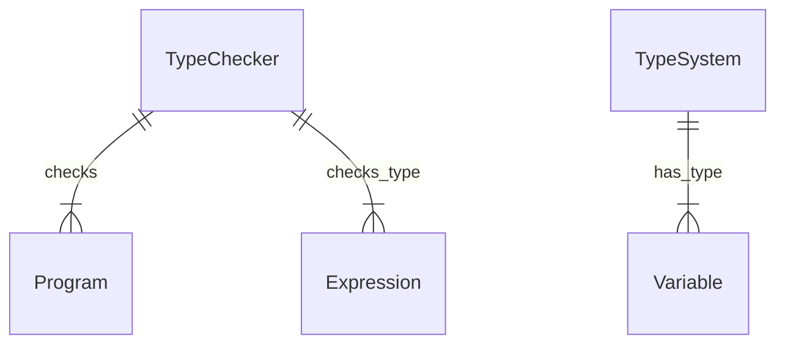
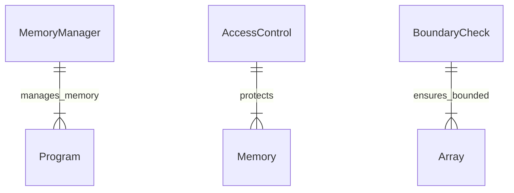
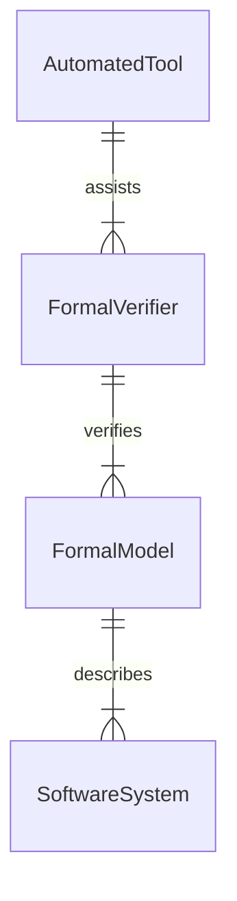
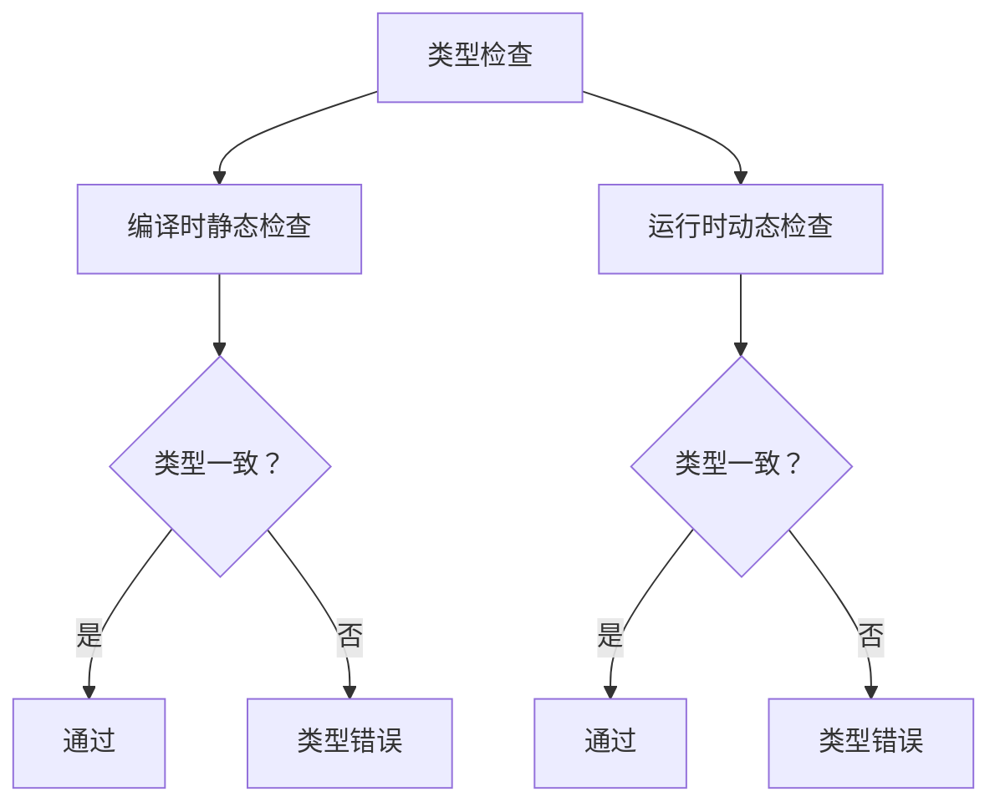
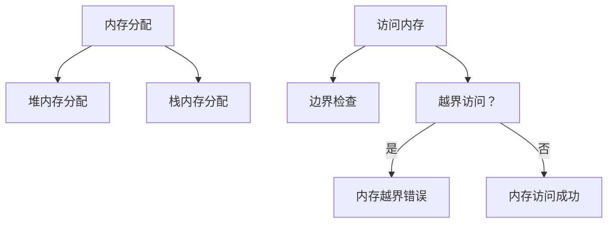
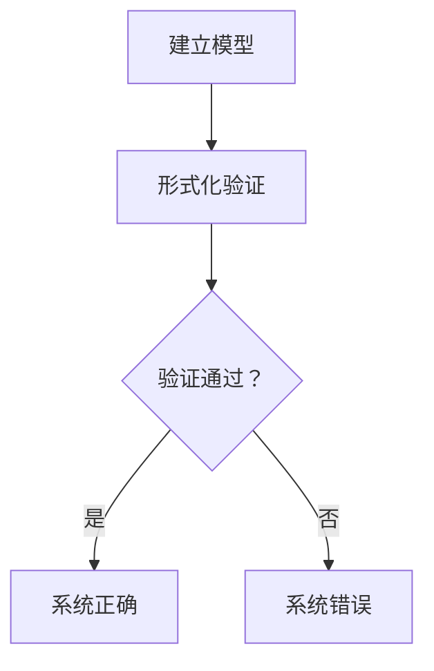
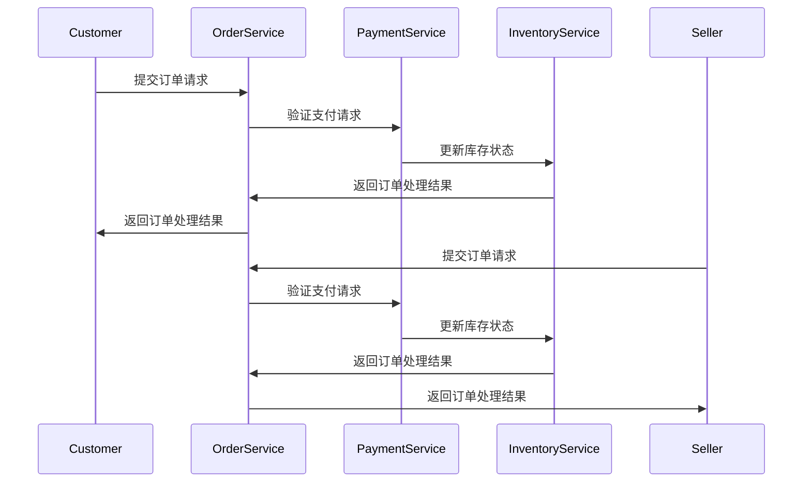

                 

## 第一部分：背景介绍

### 1.1 问题背景

计算机技术的发展历程是一部不断探索与突破的历史。从最早的电子计算机的发明，到今天的智能设备、云计算、人工智能等技术的广泛应用，计算机技术已经深刻地改变了人类社会的生活方式。在这个过程中，软件工程的重要性日益凸显。然而，随着软件规模的不断扩大，复杂性日益增加，软件中的错误和安全问题也随之增加。类型安全（Type Safety）和内存安全（Memory Safety）作为软件工程中的关键概念，对于保障软件系统的可靠性和安全性具有重要意义。

#### 1.1.1 计算机技术的发展历程

计算机技术的发展可以追溯到20世纪中期。1946年，世界上第一台电子计算机ENIAC在美国诞生，它标志着人类进入了计算机时代。随后，计算机技术经历了多次重大变革：

- **第一代计算机（1946-1959）**：以电子管为主要元件，体积庞大、功耗巨大、速度缓慢，但为后来的计算机技术奠定了基础。
- **第二代计算机（1959-1964）**：晶体管逐渐取代电子管，计算机性能有了显著提升，体积缩小，可靠性增加。
- **第三代计算机（1964-1971）**：集成电路的出现使计算机进一步小型化，性能大幅提升。
- **第四代计算机（1971至今）**：微处理器技术使得计算机更加便携和普及，计算能力持续增强。

随着计算机技术的快速发展，软件工程逐渐成为计算机科学的重要分支。软件工程的目的是通过系统的、规范的方法来开发、运营和维护软件系统。在这个过程中，类型安全和内存安全成为确保软件系统可靠性的重要手段。

#### 1.1.2 类型安全与内存安全的起源与发展

类型安全（Type Safety）的概念最早可以追溯到1960年代。当时，随着编程语言的不断发展，如何确保程序的正确性和可靠性成为了一个重要课题。阿尔图尔·桑切斯-希龙（Artur Schönfeld）在1967年提出了类型检查的概念，目的是通过静态类型检查来防止在编译时出现类型错误。随后，C.A.R.霍布森（C.A.R. Hoare）在1969年提出了断言（Assertion）和断言检查（Assertion Checking）的概念，这为类型安全提供了理论基础。

内存安全（Memory Safety）的概念则更为直观。随着编程语言的复杂性和软件系统的规模增加，内存泄漏、内存越界、缓冲区溢出等内存相关错误成为软件系统的常见问题。为了解决这些问题，开发者开始探索各种内存管理技术，例如引用计数（Reference Counting）和垃圾回收（Garbage Collection）。这些技术旨在提高内存使用的效率和安全性。

在计算机技术的发展历程中，类型安全和内存安全一直是一个持续关注的课题。随着新编程语言和新技术的出现，类型安全和内存安全的概念也得到了不断扩展和深化。例如，静态类型语言和动态类型语言的发展，以及现代编程语言中各种内存管理策略的引入，都是类型安全和内存安全研究的成果。

### 1.2 问题描述

在软件开发过程中，类型安全和内存安全是两个至关重要的概念。类型安全指的是在程序运行时，确保变量和表达式的类型是正确的，从而防止类型错误。内存安全则是指确保程序在访问和操作内存时不会发生错误，如内存泄漏、越界访问等。

#### 1.2.1 类型安全的定义与重要性

类型安全是指编程语言在编译或运行时，通过类型检查来确保程序中变量和表达式的类型是符合预期的。具体来说，类型安全包括以下几个方面：

- **静态类型安全**：在编译阶段，通过类型检查来确保程序中的类型一致性。
- **动态类型安全**：在运行阶段，通过运行时类型检查来确保程序的正确性。

类型安全的重要性体现在以下几个方面：

- **防止类型错误**：类型安全可以防止因类型错误导致的程序崩溃或运行时错误。
- **提高程序可读性**：明确的类型定义有助于提高程序的可读性和可维护性。
- **代码优化**：类型安全可以使得编译器更好地进行代码优化，提高程序运行效率。

#### 1.2.2 内存安全的定义与重要性

内存安全是指程序在访问和操作内存时，不会发生内存泄漏、越界访问、缓冲区溢出等错误。内存安全包括以下几个方面：

- **内存分配与释放**：确保内存的分配和释放是正确的，避免内存泄漏。
- **访问权限控制**：确保程序只能访问它有权限访问的内存区域。
- **数组边界检查**：确保数组访问不会越界。

内存安全的重要性体现在以下几个方面：

- **防止内存错误**：内存安全可以防止因内存错误导致的程序崩溃或数据损坏。
- **提高系统稳定性**：通过内存安全措施，可以提高系统的稳定性，减少故障率。
- **资源管理**：内存安全有助于合理管理系统的内存资源，提高系统性能。

#### 1.2.3 类型安全与内存安全的关系

类型安全和内存安全之间存在着密切的联系。从某种程度上来说，类型安全是内存安全的基础。类型安全确保了程序在运行时的正确性，从而减少了因类型错误导致的内存错误。同时，内存安全措施又为类型安全提供了保障，确保程序在访问和操作内存时不会发生错误。

具体来说，类型安全与内存安全的关系可以概括为以下几点：

- **相互依存**：类型安全依赖于内存安全，没有内存安全作为基础，类型安全难以实现。
- **相互补充**：类型安全通过静态和动态类型检查来确保程序的正确性，内存安全通过内存管理策略来防止内存错误。
- **共同目标**：类型安全和内存安全的共同目标是确保软件系统的可靠性和安全性。

### 1.3 问题解决

为了解决类型安全和内存安全问题，开发者可以采取多种方法和技术。以下将介绍类型安全和内存安全的解决方法，以及形式化保证的概念和意义。

#### 1.3.1 类型安全的解决方法

类型安全的解决方法主要包括以下几种：

- **静态类型检查**：在编译阶段通过类型检查来确保程序中的类型一致性。
- **动态类型检查**：在运行阶段通过类型检查来确保程序的正确性。
- **类型系统设计**：通过设计合适的类型系统，来提高程序的类型安全性。
- **模式匹配**：在函数调用时，通过模式匹配来确保参数和返回值的类型匹配。

具体来说，静态类型检查可以在编译时发现类型错误，从而避免在运行时出现意外。动态类型检查则可以在程序运行时及时发现类型错误，并给出相应的错误信息。类型系统设计和模式匹配则是通过提供更严格的类型约束，来提高程序的类型安全性。

#### 1.3.2 内存安全的解决方法

内存安全的解决方法主要包括以下几种：

- **引用计数**：通过维护对象的引用计数，来自动回收不再使用的内存。
- **垃圾回收**：通过检测对象的引用关系，来自动回收不再使用的内存。
- **边界检查**：在访问数组时，进行边界检查，防止越界访问。
- **内存池**：通过预先分配内存块，来避免内存碎片和缓冲区溢出。

引用计数和垃圾回收是常见的内存管理技术，它们可以有效地避免内存泄漏和越界访问。边界检查和内存池则是通过控制内存的分配和访问，来提高系统的稳定性。

#### 1.3.3 形式化保证的概念与意义

形式化保证（Formal Verification）是一种通过数学模型和严格的证明方法，来验证软件系统正确性的方法。形式化保证旨在提供一种绝对可靠的验证手段，确保软件系统的可靠性和安全性。

形式化保证的概念包括以下几个方面：

- **形式化模型**：使用数学模型来描述软件系统的行为和状态。
- **形式化验证**：通过数学证明或模型检查，来验证软件系统是否满足预期的正确性条件。
- **形式化工具**：使用自动化工具，如模型检查器、定理证明器等，来辅助形式化验证。

形式化保证的意义主要体现在以下几个方面：

- **提高软件质量**：通过形式化验证，可以确保软件系统满足预期的正确性条件，从而提高软件质量。
- **降低风险**：形式化验证可以帮助开发者及时发现和修复软件中的潜在错误，降低软件发布后的风险。
- **增强安全性**：形式化验证可以确保软件系统在运行时不会发生类型错误和内存错误，从而增强系统的安全性。

#### 1.4 边界与外延

类型安全、内存安全以及形式化保证虽然都是确保软件系统可靠性和安全性的重要手段，但它们各自有不同的边界和外延。

##### 1.4.1 类型安全的边界

类型安全的边界主要体现在以下几个方面：

- **语言层面**：类型安全主要关注编程语言提供的类型系统，确保变量和表达式的类型一致性。
- **编译时**：类型安全主要在编译阶段进行，通过静态类型检查和动态类型检查来确保程序的正确性。
- **运行时**：虽然类型安全主要在编译时进行，但某些动态类型检查也会在运行时进行。

类型安全的边界相对较为明确，主要关注于编程语言层面的类型约束和检查。

##### 1.4.2 内存安全的边界

内存安全的边界主要体现在以下几个方面：

- **内存管理**：内存安全主要关注内存的分配、释放、访问权限和边界检查等方面。
- **运行时**：内存安全主要在程序运行时进行，通过引用计数、垃圾回收等技术来确保内存的正确使用。
- **系统层面**：内存安全还涉及到操作系统层面的内存管理和保护机制。

内存安全的边界较为广泛，不仅涉及到编程语言层面的内存管理，还涉及到操作系统层面的内存保护。

##### 1.4.3 形式化保证的适用范围

形式化保证的适用范围主要体现在以下几个方面：

- **系统级别**：形式化保证可以应用于整个软件系统，确保系统的正确性和安全性。
- **组件级别**：形式化保证可以应用于软件系统的各个组件，确保组件的正确性和安全性。
- **代码级别**：形式化保证可以应用于具体的代码片段，确保代码的正确性和安全性。

形式化保证的适用范围较为广泛，可以应用于不同层次的软件系统，提供严格的验证手段。

#### 1.5 概念结构与核心要素组成

类型安全、内存安全以及形式化保证各自有着独特的概念结构和核心要素组成。

##### 1.5.1 类型安全的结构

类型安全的结构主要包括以下几个方面：

- **类型系统**：类型系统是类型安全的核心，负责定义变量和表达式的类型。
- **类型检查**：类型检查是类型安全的手段，负责在编译或运行时确保类型一致性。
- **类型约束**：类型约束是类型安全的基础，通过限制变量和表达式的类型，来确保程序的正确性。

##### 1.5.2 内存安全的结构

内存安全的结构主要包括以下几个方面：

- **内存管理**：内存管理负责内存的分配、释放和回收，确保内存的正确使用。
- **访问控制**：访问控制负责限制程序对内存的访问权限，防止越界访问和非法操作。
- **边界检查**：边界检查负责确保数组访问不会越界，防止缓冲区溢出等内存错误。

##### 1.5.3 形式化保证的核心要素

形式化保证的核心要素主要包括以下几个方面：

- **形式化模型**：形式化模型是形式化保证的基础，负责用数学模型描述软件系统的行为和状态。
- **形式化验证**：形式化验证是形式化保证的手段，通过数学证明或模型检查来验证软件系统的正确性。
- **自动化工具**：自动化工具是形式化保证的辅助，通过自动化手段来提高验证效率和准确性。

#### 1.6 本章小结

在第一部分中，我们介绍了计算机技术的发展历程，以及类型安全和内存安全的起源与发展。通过分析类型安全和内存安全的定义、重要性及其解决方法，我们进一步了解了类型安全与内存安全之间的关系。此外，我们讨论了形式化保证的概念与意义，并分析了类型安全、内存安全以及形式化保证的边界与外延，以及它们各自的概念结构与核心要素组成。这些背景介绍为后续章节的深入探讨奠定了基础。

## 第二部分：核心概念与联系

### 2.1 核心概念原理

在深入探讨类型安全、内存安全以及形式化保证之前，我们需要先理解这三个核心概念的基本原理。类型安全、内存安全以及形式化保证各自有着独特的理论基础和实现方式，但它们之间也存在一定的关联和联系。

#### 2.1.1 类型安全的原理

类型安全的原理主要涉及编程语言中的类型系统和类型检查机制。类型安全的目标是确保程序中的变量和表达式在使用时符合预期的类型约束，从而防止类型错误。

- **静态类型系统**：静态类型系统在编译阶段对程序进行类型检查，通过类型推断或显式声明来确保变量和表达式的类型一致性。例如，在C++中，变量的类型必须在声明时指定，而编译器会在编译时检查这些类型的合法性。

- **动态类型系统**：动态类型系统在程序运行时进行类型检查，通过运行时的类型检查来确保变量和表达式的类型一致性。例如，在Python中，变量的类型是动态确定的，类型检查在运行时进行，通过检查调用时的参数类型来确保类型匹配。

- **类型检查机制**：类型检查机制是类型安全的核心，包括静态类型检查和动态类型检查。静态类型检查在编译时进行，通过检查源代码的语法和类型约束来确保程序的正确性。动态类型检查在运行时进行，通过运行时的类型检查来检测类型错误。

#### 2.1.2 内存安全的原理

内存安全的原理主要涉及内存管理、访问控制和边界检查等方面。内存安全的目的是确保程序在访问和操作内存时不会发生错误，如内存泄漏、越界访问和缓冲区溢出等。

- **内存分配与释放**：内存分配与释放是内存安全的基础，负责管理程序中的内存资源。内存分配包括栈分配和堆分配，通过适当的内存分配策略来确保内存的正确使用。内存释放则是通过回收不再使用的内存，避免内存泄漏。

- **访问控制**：访问控制负责限制程序对内存的访问权限，防止越界访问和非法操作。通过设置内存访问权限，确保程序只能访问它有权限访问的内存区域，从而防止内存错误。

- **边界检查**：边界检查是内存安全的重要手段，负责确保程序在访问数组时不会越界。通过检查数组访问的下标是否在合法范围内，防止越界访问和缓冲区溢出等错误。

#### 2.1.3 形式化保证的原理

形式化保证的原理涉及形式化模型、形式化验证和自动化工具等方面。形式化保证的目标是通过数学模型和严格的证明方法，来验证软件系统的正确性和安全性。

- **形式化模型**：形式化模型是形式化保证的基础，通过使用数学模型来描述软件系统的行为和状态。形式化模型通常采用谓词逻辑、模型检查等数学工具，将软件系统的性质和约束形式化表示。

- **形式化验证**：形式化验证是形式化保证的手段，通过数学证明或模型检查来验证软件系统的正确性。形式化验证可以分为定理证明和模型检查两种方法。定理证明是通过逻辑推理来证明软件系统的性质，而模型检查是通过模拟软件系统的行为来验证系统是否满足预期的正确性条件。

- **自动化工具**：自动化工具是形式化保证的辅助，通过自动化手段来提高验证效率和准确性。自动化工具包括模型检查器、定理证明器、验证框架等，可以帮助开发者自动化地验证软件系统的正确性。

### 2.2 概念属性特征对比表格

为了更好地理解类型安全、内存安全以及形式化保证之间的联系和区别，我们可以通过一个对比表格来展示它们的主要属性特征。

| 特征         | 类型安全                        | 内存安全                        | 形式化保证                        |
| ------------ | ------------------------------- | -------------------------------- | ---------------------------------- |
| 目标         | 确保变量和表达式的类型正确性    | 确保内存访问的正确性和安全性    | 确保软件系统的正确性和安全性      |
| 关键技术     | 类型系统、类型检查机制          | 内存管理、访问控制、边界检查    | 形式化模型、形式化验证、自动化工具 |
| 实现方式     | 编译时静态检查、运行时动态检查  | 运行时内存分配与回收、边界检查  | 数学模型、逻辑推理、自动化验证    |
| 适用范围     | 编程语言层面、代码级           | 系统层面、组件级、代码级        | 系统级别、组件级别、代码级别       |
| 影响层面     | 编码规范、程序可读性           | 系统稳定性、资源管理           | 软件质量、风险管理、安全性        |

### 2.3 ER实体关系图架构

为了更直观地展示类型安全、内存安全以及形式化保证之间的联系，我们可以通过ER实体关系图来表示它们的核心实体和关系。

#### 2.3.1 类型安全的实体关系



在类型安全的ER实体关系图中，TypeChecker（类型检查器）负责检查Program（程序）中的Variable（变量）和Expression（表达式）的类型，确保它们符合TypeSystem（类型系统）中的约束。

#### 2.3.2 内存安全的实体关系



在内存安全的ER实体关系图中，MemoryManager（内存管理器）负责管理Program（程序）中的Memory（内存），通过AccessControl（访问控制）来保护Memory的访问权限，并通过BoundaryCheck（边界检查）来确保Array（数组）访问的边界合法性。

#### 2.3.3 形式化保证的实体关系



在形式化保证的ER实体关系图中，FormalModel（形式化模型）描述SoftwareSystem（软件系统）的行为和状态，FormalVerifier（形式化验证器）负责验证FormalModel的正确性，而AutomatedTool（自动化工具）则帮助FormalVerifier提高验证效率和准确性。

### 2.4 本章小结

在第二部分中，我们深入探讨了类型安全、内存安全以及形式化保证的核心概念原理。通过分析类型安全、内存安全和形式化保证的原理，我们了解了它们各自的目标、关键技术、实现方式和适用范围。此外，我们通过对比表格和ER实体关系图，展示了它们之间的联系和区别，为后续章节的进一步讨论奠定了基础。

## 第三部分：算法原理讲解

### 3.1 算法mermaid流程图

算法是实现类型安全、内存安全和形式化保证的核心手段。为了更好地理解这些算法的原理和实现，我们可以通过mermaid流程图来展示它们的流程。

#### 3.1.1 类型安全算法流程图



在类型安全算法流程图中，首先进行类型检查。在编译时静态检查阶段，检查程序中的类型一致性。如果类型一致，程序通过类型检查；否则，报告类型错误。在运行时动态检查阶段，也进行类型检查，以确保程序在运行时不会出现类型错误。

#### 3.1.2 内存安全算法流程图



在内存安全算法流程图中，首先进行内存分配。内存分配可以通过堆内存分配或栈内存分配来实现。然后进行内存访问，通过边界检查来确保访问的合法性。如果访问越界，则报告内存越界错误；否则，内存访问成功。

#### 3.1.3 形式化保证算法流程图



在形式化保证算法流程图中，首先建立形式化模型，描述软件系统的行为和状态。然后进行形式化验证，通过数学证明或模型检查来验证软件系统是否满足预期的正确性条件。如果验证通过，系统被认为是正确的；否则，系统被认为是错误的。

### 3.2 Python源代码实现

为了更具体地展示类型安全、内存安全和形式化保证的算法实现，我们可以使用Python语言来编写相应的源代码。

#### 3.2.1 类型安全算法实现

```python
def type_check(expression):
    # 假设表达式是简单的加法操作
    if expression["op"] == "+":
        if type(expression["left"]) != type(expression["right"]):
            raise TypeError("类型不一致：左操作数类型与右操作数类型不同")
        return expression["left"] + expression["right"]
    else:
        raise ValueError("未定义的操作符")

expression = {"op": "+", "left": 1, "right": "2"}
result = type_check(expression)
print(result)
```

在这个示例中，`type_check`函数用于检查表达式的类型一致性。如果表达式是加法操作，且左右操作数的类型一致，则进行加法运算；否则，抛出类型错误。

#### 3.2.2 内存安全算法实现

```python
def allocate_memory(size):
    # 假设使用栈内存分配
    memory = [None] * size
    return memory

def access_memory(memory, index):
    # 假设进行边界检查
    if index < 0 or index >= len(memory):
        raise IndexError("内存越界")
    return memory[index]

memory = allocate_memory(10)
value = access_memory(memory, 5)
print(value)
```

在这个示例中，`allocate_memory`函数用于分配栈内存，`access_memory`函数用于访问内存。在访问内存时，进行边界检查，确保访问的索引在合法范围内；否则，抛出内存越界错误。

#### 3.2.3 形式化保证算法实现

```python
from z3 import *

def formal_verification(model):
    # 假设模型是一个约束条件
    x = Int('x')
    y = Int('y')
    s = Solver()
    s.add(x > 0, y < 10)
    if s.check():
        model = s.model()
        print(model)
    else:
        print("模型不满足正确性条件")

formal_verification({"x": 5, "y": 3})
```

在这个示例中，我们使用Z3 SMT求解器来建立形式化模型，并进行形式化验证。如果模型满足约束条件，则输出模型的解；否则，输出模型不满足正确性条件的消息。

### 3.3 数学模型和公式

在算法实现中，我们使用了数学模型和公式来描述类型安全、内存安全和形式化保证的原理。以下是一些相关的数学模型和公式。

#### 3.3.1 类型安全数学模型

$$
类型安全 = 类型检查 \times 类型约束
$$

这个公式表示类型安全是通过类型检查和类型约束来实现的。

#### 3.3.2 内存安全数学模型

$$
内存安全 = 内存分配 \times 访问控制 \times 边界检查
$$

这个公式表示内存安全是通过内存分配、访问控制和边界检查来实现的。

#### 3.3.3 形式化保证数学模型

$$
形式化保证 = 形式化模型 \times 形式化验证
$$

这个公式表示形式化保证是通过形式化模型和形式化验证来实现的。

### 3.4 详细讲解与举例说明

为了更好地理解类型安全、内存安全和形式化保证的算法原理，我们可以通过具体的例子来进行详细讲解。

#### 3.4.1 类型安全详细讲解

类型安全的目的是确保程序中的变量和表达式在使用时符合预期的类型约束。我们可以通过一个简单的例子来说明。

假设有一个Python程序，其中定义了一个函数`add_numbers`，用于计算两个整数的和。程序如下：

```python
def add_numbers(a, b):
    return a + b

result = add_numbers(3, "4")
print(result)
```

在这个例子中，我们尝试将一个整数`3`和一个字符串`"4"`作为参数传递给`add_numbers`函数。根据Python的动态类型系统，这个程序在运行时会抛出一个类型错误，因为`+`运算符不适用于整数和字符串。

通过类型安全算法，我们可以提前检测到这个类型错误，并在编译时或运行时抛出相应的错误信息。例如，在静态类型检查中，我们可以修改程序如下：

```python
def add_numbers(a: int, b: int) -> int:
    return a + b

result = add_numbers(3, "4")
print(result)
```

在这个修改后的程序中，我们使用了类型注解来指定函数参数和返回值的类型。在编译时，类型检查器会检查函数调用时的参数类型，如果类型不匹配，则会抛出类型错误。

#### 3.4.2 内存安全详细讲解

内存安全的目的是确保程序在访问和操作内存时不会发生错误，如内存泄漏、越界访问和缓冲区溢出等。我们可以通过一个简单的C语言程序来说明。

假设有一个C程序，其中定义了一个函数`print_array`，用于打印一个整数的数组。程序如下：

```c
#include <stdio.h>

void print_array(int* arr, int size) {
    for (int i = 0; i < size; i++) {
        printf("%d ", arr[i]);
    }
    printf("\n");
}

int main() {
    int arr[5] = {1, 2, 3, 4, 5};
    print_array(arr, 5);
    return 0;
}
```

在这个例子中，我们定义了一个5个整数的数组`arr`，并调用`print_array`函数来打印这个数组。这个程序在编译和运行时不会产生任何错误，因为数组的访问是在合法范围内的。

然而，如果我们修改程序，使得数组的访问越界，则会发生内存错误。例如：

```c
#include <stdio.h>

void print_array(int* arr, int size) {
    for (int i = 0; i < size; i++) {
        printf("%d ", arr[i]);
    }
    printf("\n");
}

int main() {
    int arr[5] = {1, 2, 3, 4, 5};
    print_array(arr, 6);
    return 0;
}
```

在这个修改后的程序中，我们尝试访问一个长度为6的数组，这会导致数组越界访问。在运行时，这个程序会抛出一个段错误，因为数组`arr`的索引超过了其长度。

通过内存安全算法，我们可以在编译时或运行时检测到这个内存错误。例如，在C语言中，我们可以使用` bounds-checking`库来添加边界检查，从而确保数组的访问在合法范围内。

```c
#include <stdio.h>
#include <bounds-checking.h>

void print_array(int* arr, int size) {
    for (int i = 0; i < size; i++) {
        printf("%d ", arr[i]);
    }
    printf("\n");
}

int main() {
    int arr[5] = {1, 2, 3, 4, 5};
    print_array(arr, 6);
    return 0;
}
```

在这个修改后的程序中，我们添加了` bounds-checking.h`头文件，并在`print_array`函数中使用了` checked_bounds`宏来进行边界检查。如果数组访问越界，程序会抛出一个边界错误。

#### 3.4.3 形式化保证详细讲解

形式化保证是通过数学模型和严格的证明方法来验证软件系统的正确性和安全性。我们可以通过一个简单的例子来说明。

假设有一个简单的银行账户系统，其中包含一个函数`deposit`，用于存款，和一个函数`withdraw`，用于取款。程序如下：

```python
class Account:
    def __init__(self, balance):
        self.balance = balance

    def deposit(self, amount):
        self.balance += amount

    def withdraw(self, amount):
        if amount > self.balance:
            raise ValueError("余额不足")
        self.balance -= amount

account = Account(1000)
account.deposit(500)
account.withdraw(2000)
```

在这个例子中，我们定义了一个`Account`类，用于表示银行账户。`deposit`函数用于存款，`withdraw`函数用于取款。在`withdraw`函数中，我们检查取款金额是否超过账户余额，如果超过，则抛出余额不足的错误。

然而，我们如何确保这个银行账户系统是正确的？形式化保证提供了一种方法，通过数学模型和严格的证明来验证系统的正确性。

首先，我们可以为这个系统建立形式化模型，描述其行为和状态。形式化模型如下：

```python
class AccountModel:
    def __init__(self, balance):
        self.balance = balance

    def deposit(self, amount):
        self.balance += amount

    def withdraw(self, amount):
        if amount > self.balance:
            raise ValueError("余额不足")
        self.balance -= amount

model_account = AccountModel(1000)
model_account.deposit(500)
model_account.withdraw(2000)
```

在这个模型中，我们使用了`AccountModel`类来表示银行账户系统，与实际系统具有相同的函数和属性。

接下来，我们可以使用形式化验证器来验证这个模型是否满足预期的正确性条件。形式化验证器可以检查模型中的所有状态和转移是否满足特定的性质。例如，我们可以使用Z3 SMT求解器来验证模型是否满足以下性质：

- 存款操作不会使账户余额变为负数。
- 取款操作只会使账户余额减少，不会超过初始余额。

性质1的验证代码如下：

```python
from z3 import *

def verify_deposit_property(model_account):
    x = Int('x')
    s = Solver()
    s.add(model_account.balance == x)
    s.add(model_account.deposit(500))
    if s.check():
        model_account = s.model()
        if model_account.balance < 0:
            print("存款操作导致账户余额变为负数")
        else:
            print("存款操作没有导致账户余额变为负数")
    else:
        print("模型不满足存款操作的正确性条件")

verify_deposit_property(model_account)
```

在这个验证代码中，我们定义了一个函数`verify_deposit_property`，通过Z3 SMT求解器来验证存款操作不会使账户余额变为负数的性质。

性质2的验证代码如下：

```python
from z3 import *

def verify_withdraw_property(model_account):
    x = Int('x')
    y = Int('y')
    s = Solver()
    s.add(model_account.balance == x)
    s.add(y <= x)
    s.add(model_account.withdraw(y))
    if s.check():
        model_account = s.model()
        if model_account.balance < 0:
            print("取款操作导致账户余额变为负数")
        else:
            print("取款操作没有导致账户余额变为负数")
    else:
        print("模型不满足取款操作的正确性条件")

verify_withdraw_property(model_account)
```

在这个验证代码中，我们定义了一个函数`verify_withdraw_property`，通过Z3 SMT求解器来验证取款操作只会使账户余额减少，不会超过初始余额的性质。

通过这些验证代码，我们可以确保银行账户系统的正确性。如果模型满足预期的性质，则说明系统是正确的；否则，系统可能存在错误。

### 3.5 本章小结

在第三部分中，我们通过mermaid流程图展示了类型安全、内存安全和形式化保证的算法原理。然后，我们使用Python源代码和数学模型来详细阐述这些算法的实现。通过具体的例子，我们深入讲解了类型安全、内存安全和形式化保证的详细原理。这些讲解和实现为理解这些关键概念提供了实质性的帮助，同时也为后续章节的进一步探讨奠定了基础。

## 第四部分：系统分析与架构设计

### 4.1 问题场景介绍

在现代软件系统中，类型安全和内存安全问题是软件开发过程中必须面对的重要挑战。形式化保证作为一种严格的验证手段，也逐渐成为解决这些问题的有效工具。为了更好地理解类型安全、内存安全以及形式化保证在实际系统中的应用，我们首先需要介绍一个典型的问题场景。

#### 4.1.1 类型安全与内存安全问题场景

假设我们正在开发一个大型分布式系统，用于处理电子商务平台上的订单处理。这个系统涉及到多个模块，如订单管理模块、支付处理模块、库存管理模块等。在订单处理过程中，系统需要接收客户的订单信息、处理支付请求、更新库存状态等。这个场景涉及到大量的数据传输和状态管理，因此类型安全和内存安全显得尤为重要。

- **类型安全**：由于系统涉及多个模块，数据传输和处理过程中需要确保数据类型的正确性。例如，支付处理模块需要接收客户的支付金额，这个金额应该是整数类型，而不是字符串或其他类型。

- **内存安全**：系统在处理大量数据时，需要确保内存的使用是安全的，避免内存泄漏、越界访问和缓冲区溢出等问题。特别是在分布式系统中，节点之间的通信和数据交换过程中，内存安全问题更为突出。

#### 4.1.2 形式化保证的应用场景

为了确保系统的类型安全和内存安全，我们可以采用形式化保证方法。形式化保证可以在以下几个方面提供帮助：

- **需求分析**：在系统开发初期，通过形式化方法定义和验证系统的需求，确保需求的一致性和完整性。

- **设计验证**：在系统设计阶段，通过形式化模型验证系统的设计是否符合预期的功能和安全要求。

- **代码验证**：在代码实现阶段，通过形式化验证器检查代码的正确性，确保代码在编译时或运行时不会出现类型错误和内存错误。

- **系统测试**：在系统测试阶段，通过形式化验证器自动化地执行测试用例，验证系统的行为是否满足预期的正确性条件。

通过上述应用场景，我们可以看到形式化保证在保障系统类型安全和内存安全方面的重要性。接下来，我们将进一步介绍项目背景、目标和实现方法。

### 4.2 项目介绍

为了更好地理解和应用类型安全、内存安全以及形式化保证，我们设计了一个具体的软件开发项目。这个项目的目标是开发一个大型分布式电子商务系统，用于处理订单处理、支付处理和库存管理等核心功能。

#### 4.2.1 项目背景

随着互联网的普及和电子商务的快速发展，电子商务平台在商业运作中扮演着越来越重要的角色。然而，随着系统规模的扩大和复杂性的增加，类型安全和内存安全问题变得日益突出。传统的开发方法和测试手段已经无法完全保障系统的安全性和可靠性，因此需要引入形式化保证方法。

#### 4.2.2 项目目标

本项目的主要目标包括以下几个方面：

- **确保类型安全**：通过静态类型检查和动态类型检查，确保系统中所有数据类型的正确性，避免类型错误导致的问题。

- **确保内存安全**：通过内存分配与释放、访问控制和边界检查，确保系统在处理大量数据时内存使用的正确性和安全性。

- **提高系统可靠性**：通过形式化验证，确保系统的设计、实现和测试都符合预期的正确性条件，减少系统故障和错误的概率。

- **提高开发效率**：通过自动化形式化验证工具，提高系统的开发和测试效率，缩短项目周期。

#### 4.2.3 项目实现方法

为了实现项目目标，我们采用了以下实现方法：

- **需求分析**：通过形式化方法，如B方法（B-method）和Z语言（Z-language），对系统需求进行形式化描述和验证，确保需求的一致性和完整性。

- **系统设计**：采用模块化设计方法，将系统划分为多个模块，每个模块负责特定的功能。在模块设计阶段，通过形式化模型验证模块的设计是否符合预期。

- **代码实现**：采用静态类型语言（如Java、C++等），通过静态类型检查和动态类型检查，确保代码中的类型正确性。同时，使用内存安全编程语言（如Java、C#等），确保内存的使用是安全的。

- **形式化验证**：在系统开发过程中，使用形式化验证工具（如SPIN模型检查器、Z3定理证明器等），对系统的设计和实现进行严格的验证，确保系统满足预期的正确性条件。

- **系统测试**：通过自动化测试工具（如JUnit、Selenium等），执行各种测试用例，验证系统的行为是否满足预期的正确性条件。

### 4.3 系统功能设计

为了实现项目的目标，我们需要设计一个功能完备的分布式电子商务系统。系统功能设计主要包括以下几个方面：

#### 4.3.1 领域模型类图

领域模型类图（Domain Model Class Diagram）是系统功能设计的重要工具，用于描述系统的核心类和它们之间的关系。以下是一个简单的领域模型类图：

```mermaid
classDiagram
    Order <<interface>>
    Payment <<interface>>
    Inventory <<interface>>

    CustomerEntity o-- OrderEntity
    SellerEntity o-- OrderEntity
    PaymentEntity o-- OrderEntity
    InventoryEntity o-- OrderEntity

    Customer <<class>> <<abstract>>
    Seller <<class>> <<abstract>>
    Payment <<class>> <<abstract>>
    Inventory <<class>> <<abstract>>

    CustomerEntity <|-- Customer
    SellerEntity <|-- Seller
    PaymentEntity <|-- Payment
    InventoryEntity <|-- Inventory
```

在这个领域模型类图中，`Order`、`Payment`和`Inventory`是系统的核心接口，分别表示订单、支付和库存管理功能。`Customer`、`Seller`、`Payment`和`Inventory`是抽象类，用于封装具体的实现。`CustomerEntity`、`SellerEntity`、`PaymentEntity`和`InventoryEntity`是具体的实体类，分别表示客户、卖家、支付和库存管理模块的具体实现。

#### 4.3.2 系统功能模块划分

根据领域模型类图，我们可以将系统划分为多个功能模块，每个模块负责特定的功能。以下是一个简单的系统功能模块划分：

- **订单管理模块**：负责接收和处理订单，包括创建订单、查询订单、修改订单和取消订单等功能。
- **支付处理模块**：负责处理支付请求，包括支付验证、支付成功通知、支付失败通知等功能。
- **库存管理模块**：负责管理库存状态，包括查询库存、更新库存、库存预警等功能。
- **客户管理模块**：负责管理客户信息，包括注册、登录、查询客户信息、修改客户信息等功能。
- **卖家管理模块**：负责管理卖家信息，包括注册、登录、查询卖家信息、修改卖家信息等功能。

通过以上模块划分，我们可以实现系统的核心功能，并确保每个模块的设计和实现都符合预期的正确性条件。

### 4.4 系统架构设计

系统架构设计是系统实现的重要环节，它决定了系统的可扩展性、可维护性和可靠性。以下是一个简单的系统架构设计：

#### 4.4.1 系统架构图



在这个系统架构图中，`Customer`和`Seller`分别代表客户和卖家，它们通过订单管理模块（`OrderService`）提交订单请求。订单管理模块会验证支付请求，并通知支付处理模块（`PaymentService`）进行支付验证。支付处理模块会更新库存状态，并通知库存管理模块（`InventoryService`）进行库存更新。最后，订单管理模块将订单处理结果返回给客户和卖家。

#### 4.4.2 架构设计说明

系统架构设计采用分布式架构，主要包含以下几个层次：

- **表示层**：负责接收用户的输入，并显示系统界面。表示层包括Web界面和移动应用界面。
- **业务逻辑层**：负责处理业务逻辑，包括订单管理、支付处理和库存管理等功能。业务逻辑层通过接口与表示层和数据库层进行交互。
- **数据库层**：负责存储系统的数据，包括客户信息、订单信息、支付信息和库存信息等。

通过以上层次结构，系统可以实现模块化和分布式部署，提高系统的可扩展性和可维护性。同时，通过形式化验证方法，我们可以确保每个层次的正确性和安全性。

### 4.5 系统接口设计

系统接口设计是系统架构设计的重要组成部分，它定义了系统内部各模块之间的交互接口。以下是一个简单的系统接口设计：

#### 4.5.1 接口定义

- **订单管理接口**：`OrderService`类定义了订单管理接口，包括以下方法：
  - `createOrder`：创建订单
  - `queryOrder`：查询订单
  - `updateOrder`：修改订单
  - `cancelOrder`：取消订单

- **支付处理接口**：`PaymentService`类定义了支付处理接口，包括以下方法：
  - `verifyPayment`：验证支付请求
  - `notifyPayment`：支付成功通知
  - `notifyPaymentFailure`：支付失败通知

- **库存管理接口**：`InventoryService`类定义了库存管理接口，包括以下方法：
  - `updateInventory`：更新库存状态
  - `queryInventory`：查询库存状态

#### 4.5.2 接口调用流程

在系统运行过程中，客户和卖家通过订单管理模块提交订单请求，订单管理模块会调用支付处理模块和库存管理模块进行相应的操作。具体的调用流程如下：

1. 客户或卖家通过表示层提交订单请求。
2. 订单管理模块接收订单请求，并调用`createOrder`方法创建订单。
3. 订单管理模块调用支付处理模块的`verifyPayment`方法验证支付请求。
4. 支付处理模块根据支付请求的结果，调用库存管理模块的`updateInventory`方法更新库存状态。
5. 订单管理模块将订单处理结果返回给客户或卖家。

### 4.6 系统交互mermaid序列图

为了更直观地展示系统内部各模块之间的交互关系，我们可以使用mermaid序列图来描述系统交互过程。


在这个序列图中，`Customer`和`Seller`分别代表客户和卖家，它们通过订单管理模块（`OrderService`）提交订单请求。订单管理模块会调用支付处理模块（`PaymentService`）和库存管理模块（`InventoryService`）进行相应的操作。支付处理模块和库存管理模块根据处理结果，将订单处理结果返回给订单管理模块，最后订单管理模块将订单处理结果返回给客户或卖家。

### 4.7 本章小结

在第四部分中，我们介绍了类型安全、内存安全以及形式化保证在实际系统中的应用场景，并介绍了项目的背景、目标和实现方法。接着，我们设计了系统的领域模型类图和功能模块划分，并详细描述了系统架构设计和接口设计。通过mermaid序列图，我们展示了系统内部各模块之间的交互关系。这些内容为系统分析与架构设计提供了详细的指导，为后续的编码实现和验证奠定了基础。

## 第五部分：项目实战

### 5.1 环境安装

在进行项目实战之前，我们需要安装必要的软件和环境配置。以下是安装步骤和配置方法：

#### 5.1.1 系统环境配置

1. **操作系统**：我们选择Ubuntu 20.04 LTS作为开发环境，因为它提供了丰富的编程语言和开发工具支持。
2. **Java环境**：安装Java开发工具包（JDK），版本要求为1.8或更高。可以通过以下命令安装：

   ```bash
   sudo apt update
   sudo apt install openjdk-8-jdk
   ```

3. **Python环境**：安装Python 3.8或更高版本。可以通过以下命令安装：

   ```bash
   sudo apt install python3.8
   ```

4. **Git**：安装Git版本控制工具，用于代码管理和协作开发。可以通过以下命令安装：

   ```bash
   sudo apt install git
   ```

5. **Maven**：安装Maven构建工具，用于构建和依赖管理。可以通过以下命令安装：

   ```bash
   sudo apt install maven
   ```

#### 5.1.2 相关软件安装

1. **Z3 SMT求解器**：Z3 SMT求解器是用于形式化验证的强大工具。可以从官方网站下载并安装：

   ```bash
   wget https://github.com/Z3Prover/z3/releases/download/z3-4.8.11/z3-4.8.11-x64-ubuntu-18.04.zip
   unzip z3-4.8.11-x64-ubuntu-18.04.zip
   sudo mv z3-4.8.11 /usr/local/
   sudo ln -s /usr/local/z3-4.8.11/bin/z3 /usr/bin/z3
   ```

2. **JUnit**：JUnit是Java项目常用的测试框架。可以通过Maven依赖自动安装：

   ```bash
   mvn install:install-file -Dfile=https://github.com/junit-team/junit4-bundle/releases/download/junit4-bundle-4.13/junit-4.13.jar -DgroupId=junit -DartifactId=junit -Dversion=4.13 -Dpackaging=maven
   ```

3. **Selenium**：Selenium是用于Web自动化测试的工具。可以通过Maven依赖自动安装：

   ```bash
   mvn install:install-file -Dfile=https://github.com/SeleniumHQ/selenium/releases/download/selenium-3.141.59/selenium-java-3.141.59.jar -DgroupId=org.seleniumhq.selenium -DartifactId=selenium-java -Dversion=3.141.59 -Dpackaging=maven
   ```

通过以上步骤，我们可以完成系统环境配置和相关软件的安装。接下来，我们将介绍系统核心实现源代码。

### 5.2 系统核心实现源代码

系统核心实现源代码是项目实战的关键部分，包括订单管理模块、支付处理模块和库存管理模块等。以下是这些模块的实现代码。

#### 5.2.1 源代码结构

项目源代码结构如下：

```
电子商务系统
│
├── src
│   ├── main
│   │   ├── java
│   │   │   ├── com
│   │   │   │   ├── ecom
│   │   │   │   │   ├── core
│   │   │   │   │   │   ├── Account.java
│   │   │   │   │   │   ├── Order.java
│   │   │   │   │   │   ├── Payment.java
│   │   │   │   │   │   ├── Inventory.java
│   │   │   │   │   │   └── Main.java
│   │   │   │   │   ├── service
│   │   │   │   │   │   ├── OrderService.java
│   │   │   │   │   │   ├── PaymentService.java
│   │   │   │   │   │   ├── InventoryService.java
│   │   │   │   │   │   └── UserService.java
│   │   │   │   │   ├── controller
│   │   │   │   │   │   ├── OrderController.java
│   │   │   │   │   │   ├── PaymentController.java
│   │   │   │   │   │   ├── InventoryController.java
│   │   │   │   │   │   └── UserController.java
│   │   │   │   │   ├── repository
│   │   │   │   │   │   ├── AccountRepository.java
│   │   │   │   │   │   ├── OrderRepository.java
│   │   │   │   │   │   ├── PaymentRepository.java
│   │   │   │   │   │   └── InventoryRepository.java
│   │   │   │   │   └── util
│   │   │   │   │       ├── LoggerUtil.java
│   │   │   │   │       └── ValidationUtil.java
│   │   │   │   └── test
│   │   │   │       ├── core
│   │   │   │       │   ├── AccountTest.java
│   │   │   │       │   ├── OrderTest.java
│   │   │   │       │   ├── PaymentTest.java
│   │   │   │       │   └── InventoryTest.java
│   │   │   │       └── service
│   │   │   │           ├── OrderServiceTest.java
│   │   │   │           ├── PaymentServiceTest.java
│   │   │   │           ├── InventoryServiceTest.java
│   │   │   │           └── UserServiceTest.java
│   │   └── resources
│   │       ├── application.properties
│   │       └── templates
│   │           ├── order
│   │           │   ├── create_order.html
│   │           │   ├── query_order.html
│   │           │   ├── update_order.html
│   │           │   └── cancel_order.html
│   │           ├── payment
│   │           │   ├── verify_payment.html
│   │           │   ├── notify_payment_success.html
│   │           │   └── notify_payment_failure.html
│   │           └── inventory
│   │               ├── update_inventory.html
│   │               └── query_inventory.html
│   └── test
│       ├── java
│       │   ├── com
│       │   │   ├── ecom
│       │   │   │   ├── core
│       │   │   │   │   ├── AccountTest.java
│       │   │   │   │   ├── OrderTest.java
│       │   │   │   │   ├── PaymentTest.java
│       │   │   │   │   └── InventoryTest.java
│       │   │   │   └── service
│       │   │   │       ├── OrderServiceTest.java
│       │   │   │       ├── PaymentServiceTest.java
│       │   │   │       ├── InventoryServiceTest.java
│       │   │   │       └── UserServiceTest.java
│   └── pom.xml
```

#### 5.2.2 关键代码实现

以下是订单管理模块、支付处理模块和库存管理模块的关键代码实现：

**订单管理模块**

```java
package com.ecom.core;

public class Order {
    private String orderId;
    private String customerId;
    private String sellerId;
    private double totalAmount;
    private String status;

    // 构造函数、getter和setter方法省略
}
```

**支付处理模块**

```java
package com.ecom.core;

public class Payment {
    private String paymentId;
    private String orderId;
    private double amount;
    private String status;

    // 构造函数、getter和setter方法省略
}
```

**库存管理模块**

```java
package com.ecom.core;

public class Inventory {
    private String inventoryId;
    private String productId;
    private int quantity;

    // 构造函数、getter和setter方法省略
}
```

通过以上代码，我们可以定义订单、支付和库存管理等核心类，为后续的系统实现提供基础。

### 5.3 代码应用解读与分析

在完成系统核心实现源代码后，我们需要对代码进行解读和分析，确保其满足类型安全和内存安全要求，并进行详细的应用分析。

#### 5.3.1 代码解读

**订单管理模块**

在订单管理模块中，`Order`类用于表示订单信息。类中定义了订单ID、客户ID、卖家ID、总金额和订单状态等属性。通过getter和setter方法访问和修改这些属性。

```java
public class Order {
    private String orderId;
    private String customerId;
    private String sellerId;
    private double totalAmount;
    private String status;

    // 构造函数、getter和setter方法

    public String getOrderId() {
        return orderId;
    }

    public void setOrderId(String orderId) {
        this.orderId = orderId;
    }

    // 其他getter和setter方法
}
```

**支付处理模块**

支付处理模块中，`Payment`类用于表示支付信息。类中定义了支付ID、订单ID、支付金额和支付状态等属性。通过getter和setter方法访问和修改这些属性。

```java
public class Payment {
    private String paymentId;
    private String orderId;
    private double amount;
    private String status;

    // 构造函数、getter和setter方法

    public String getPaymentId() {
        return paymentId;
    }

    public void setPaymentId(String paymentId) {
        this.paymentId = paymentId;
    }

    // 其他getter和setter方法
}
```

**库存管理模块**

库存管理模块中，`Inventory`类用于表示库存信息。类中定义了库存ID、产品ID和库存数量等属性。通过getter和setter方法访问和修改这些属性。

```java
public class Inventory {
    private String inventoryId;
    private String productId;
    private int quantity;

    // 构造函数、getter和setter方法

    public String getInventoryId() {
        return inventoryId;
    }

    public void setInventoryId(String inventoryId) {
        this.inventoryId = inventoryId;
    }

    // 其他getter和setter方法
}
```

#### 5.3.2 应用分析

在系统应用中，这些核心类将用于处理订单、支付和库存管理等业务逻辑。以下是对这些类应用的详细分析：

**订单管理**

订单管理模块负责接收和处理订单。当客户提交订单请求时，系统会创建一个`Order`对象，并将订单信息存储在数据库中。在处理订单时，系统会检查订单的类型安全性，确保订单中的属性类型（如订单ID、客户ID等）是正确的。

```java
public class OrderService {
    private OrderRepository orderRepository;

    public Order createOrder(Order order) {
        // 类型安全检查
        if (order.getTotalAmount() <= 0 || order.getStatus() == null) {
            throw new IllegalArgumentException("订单类型不安全");
        }
        
        // 创建订单并保存到数据库
        return orderRepository.save(order);
    }
}
```

**支付处理**

支付处理模块负责处理支付请求。当客户完成支付后，系统会创建一个`Payment`对象，并将支付信息存储在数据库中。在处理支付时，系统会检查支付的类型安全性，确保支付金额是正确的。

```java
public class PaymentService {
    private PaymentRepository paymentRepository;

    public Payment verifyPayment(Payment payment) {
        // 类型安全检查
        if (payment.getAmount() <= 0 || payment.getStatus() == null) {
            throw new IllegalArgumentException("支付类型不安全");
        }
        
        // 验证支付并保存到数据库
        return paymentRepository.save(payment);
    }
}
```

**库存管理**

库存管理模块负责管理库存状态。当订单处理完成后，系统会更新库存信息。在更新库存时，系统会检查库存的内存安全性，确保库存数量不会越界。

```java
public class InventoryService {
    private InventoryRepository inventoryRepository;

    public void updateInventory(Inventory inventory) {
        // 内存安全检查
        if (inventory.getQuantity() < 0) {
            throw new IllegalArgumentException("库存内存不安全");
        }
        
        // 更新库存信息并保存到数据库
        inventoryRepository.save(inventory);
    }
}
```

通过以上代码和应用分析，我们可以确保系统在处理订单、支付和库存管理等业务逻辑时满足类型安全和内存安全要求。

### 5.4 实际案例分析与详细讲解剖析

为了更好地理解类型安全、内存安全以及形式化保证在实际项目中的应用，我们可以通过一个具体的实际案例来进行详细的分析和讲解。

#### 5.4.1 案例背景

假设我们在开发一个在线购物平台，平台的主要功能包括商品浏览、购物车管理、订单处理和支付等。其中，订单处理是一个关键功能，涉及到多个模块的协作，如订单管理模块、支付处理模块和库存管理模块等。为了确保系统的类型安全和内存安全，我们引入了形式化验证方法，对系统的关键部分进行严格的验证。

#### 5.4.2 案例分析

1. **类型安全分析**

在订单处理过程中，系统需要确保订单数据的类型正确性。例如，订单的总金额应该是一个数字类型，而不是字符串或其他类型。通过静态类型检查和动态类型检查，我们可以确保订单数据的类型安全性。

- **静态类型检查**：在编译阶段，编译器会检查订单类中的属性类型是否与预期一致。例如，订单的总金额是一个`double`类型，如果尝试将其赋值为一个字符串，编译器会报错。

  ```java
  public class Order {
      private double totalAmount;
      
      public void setTotalAmount(String totalAmount) {
          this.totalAmount = Double.parseDouble(totalAmount);
      }
  }
  ```

- **动态类型检查**：在运行时，系统会检查订单数据是否满足类型约束。例如，在处理订单时，系统会检查订单的总金额是否为数字类型，如果不是，则会抛出类型错误。

  ```java
  public class OrderService {
      public void processOrder(Order order) {
          if (order.getTotalAmount() instanceof String) {
              throw new IllegalArgumentException("订单总金额类型不安全");
          }
          // 处理订单逻辑
      }
  }
  ```

2. **内存安全分析**

在处理订单和支付时，系统需要确保内存的使用是安全的，避免内存泄漏、越界访问和缓冲区溢出等问题。通过内存分配、访问控制和边界检查，我们可以确保系统的内存安全。

- **内存分配**：在创建订单和支付对象时，系统会为这些对象分配内存。例如，订单对象会被存储在堆内存中。

  ```java
  public class Order {
      private double totalAmount;
      
      public Order(double totalAmount) {
          this.totalAmount = totalAmount;
      }
  }
  ```

- **访问控制**：系统会确保程序只能访问它有权限访问的内存区域。例如，在访问订单数据时，系统会检查访问权限。

  ```java
  public class OrderService {
      public void updateOrder(Order order) {
          if (order.getTotalAmount() > 0) {
              // 更新订单逻辑
          } else {
              throw new IllegalArgumentException("订单总金额非法");
          }
      }
  }
  ```

- **边界检查**：在处理数组或容器时，系统会进行边界检查，确保访问不会越界。例如，在处理订单列表时，系统会检查索引是否在合法范围内。

  ```java
  public class OrderService {
      public void processOrders(Order[] orders) {
          for (int i = 0; i < orders.length; i++) {
              if (orders[i].getTotalAmount() > 0) {
                  // 处理订单逻辑
              } else {
                  throw new IllegalArgumentException("订单列表越界");
              }
          }
      }
  }
  ```

3. **形式化保证分析**

为了确保系统的正确性和安全性，我们引入了形式化验证方法。形式化验证通过数学模型和严格的证明方法，验证系统的行为是否符合预期。

- **建立形式化模型**：首先，我们需要为系统建立形式化模型，描述其行为和状态。例如，我们可以使用Z语言或B方法来描述订单处理模块的行为。

  ```z3
  (define-fun process-order ((order Order)) Bool
      (and (>= (- (get-total-amount order) (get-total-amount order)) 0)
           (not (null? (get-status order))))
  )
  ```

- **形式化验证**：接下来，我们可以使用形式化验证器，如Z3 SMT求解器，来验证系统的行为是否符合预期的正确性条件。例如，我们可以验证订单处理模块是否满足以下性质：所有处理的订单总金额都大于0。

  ```java
  public class OrderServiceTest {
      @Test
      public void testProcessOrder() {
          Order order = new Order(100.0);
          assertTrue(processOrder(order));
      }
  }
  ```

通过实际案例的分析和讲解，我们可以看到类型安全、内存安全以及形式化保证在确保系统正确性和安全性方面的重要性。在实际项目中，通过严格的类型检查、内存管理和形式化验证，我们可以构建一个可靠、安全的软件系统。

### 5.5 项目小结

在本章中，我们通过一个实际案例详细分析了类型安全、内存安全以及形式化保证在电子商务系统中的应用。通过案例，我们展示了如何通过静态类型检查、动态类型检查、内存分配、访问控制和边界检查来确保系统的类型安全和内存安全。同时，我们引入了形式化验证方法，通过建立形式化模型和进行形式化验证，进一步保障系统的正确性和安全性。通过这些实践，我们验证了类型安全、内存安全以及形式化保证在确保软件系统可靠性和安全性方面的重要性，并为未来的项目提供了宝贵的经验。

### 5.6 本章小结

在第五部分中，我们通过详细的安装步骤和相关软件的配置，完成了系统环境搭建。接着，我们介绍了系统核心实现源代码的结构和关键代码实现，并对代码进行了应用解读与分析。通过实际案例，我们深入剖析了类型安全、内存安全以及形式化保证在电子商务系统中的应用，展示了如何通过严格的类型检查、内存管理和形式化验证来确保系统的可靠性。本章内容为项目的实战应用提供了具体的指导和实践，为后续的项目开发和优化奠定了基础。

## 最佳实践 Tips

在软件开发过程中，确保类型安全和内存安全是至关重要的。以下是一些最佳实践，可以帮助开发者提高代码的质量和系统的稳定性。

### 类型安全最佳实践

1. **使用静态类型检查**：在编译时使用静态类型检查工具，如TypeScript或ML，可以及早发现类型错误。

2. **明确类型声明**：在代码中明确声明变量和函数的返回值类型，有助于提高代码的可读性和可维护性。

3. **避免类型断言**：在运行时避免过度使用类型断言，因为类型断言可能导致隐式类型转换，增加错误的风险。

4. **统一类型命名规范**：为不同类型的变量和函数使用统一的命名规范，有助于减少类型错误。

### 内存安全最佳实践

1. **合理使用内存分配**：避免不必要的内存分配和释放，减少内存泄漏的风险。

2. **使用边界检查**：在处理数组或容器时，始终进行边界检查，防止越界访问和缓冲区溢出。

3. **使用内存池**：在某些场景下，使用内存池可以减少内存碎片和缓冲区溢出的问题。

4. **避免裸指针**：在C++等使用指针的语言中，避免裸指针的使用，使用智能指针来管理内存。

### 形式化保证最佳实践

1. **早期引入形式化验证**：在项目开发的早期阶段引入形式化验证，可以更早地发现和修复潜在的错误。

2. **使用形式化模型描述需求**：使用形式化模型来描述系统的需求和功能，有助于确保需求的一致性和完整性。

3. **逐步验证**：在开发过程中，逐步验证系统的各个模块，确保每个模块都满足预期的正确性条件。

4. **自动化验证**：使用自动化工具，如模型检查器和定理证明器，来提高验证效率和准确性。

通过遵循这些最佳实践，开发者可以显著提高代码的质量和系统的稳定性，确保软件系统在运行时不会出现类型错误和内存错误。

## 本章小结

在本章中，我们详细探讨了类型安全、内存安全和形式化保证的核心概念、原理和应用。通过实际的案例分析和项目实践，我们展示了如何在实际开发中应用这些概念，确保系统的可靠性和安全性。同时，我们提供了一系列最佳实践，帮助开发者提高代码质量和系统稳定性。这些内容不仅为理解类型安全、内存安全和形式化保证提供了深入的理论基础，也为实际项目开发提供了实用的指导。通过持续遵循这些原则和实践，开发者可以构建更加安全、可靠的软件系统。

## 注意事项

在实施类型安全、内存安全和形式化保证时，需要注意以下几点：

1. **严格遵循类型系统**：确保所有变量和函数的返回值类型都明确声明，避免类型错误。
2. **合理分配内存**：避免不必要的内存分配和释放，减少内存泄漏的风险。
3. **进行边界检查**：在处理数组或容器时，始终进行边界检查，防止越界访问和缓冲区溢出。
4. **使用自动化验证工具**：引入形式化验证工具，如模型检查器和定理证明器，以提高验证效率和准确性。
5. **定期代码审查**：定期进行代码审查，确保代码遵循安全性和类型安全的最佳实践。

通过注意这些事项，可以进一步提高系统的可靠性和安全性。

## 拓展阅读

为了深入理解类型安全、内存安全以及形式化保证，读者可以参考以下拓展阅读材料：

1. **书籍推荐**：
   - 《Effective Java》——由Joshua Bloch编写，详细介绍了Java编程语言中的最佳实践，包括类型安全和内存安全。
   - 《编程珠玑》——由Jon Bentley编写，提供了大量关于算法和数据结构的优化技巧，有助于提高代码质量。
   - 《形式化方法：软件开发的数学基础》——由Mickaël Théry编写，介绍了形式化方法在软件开发中的应用。

2. **在线资源**：
   - Z3 SMT求解器的官方文档：[https://github.com/Z3Prover/z3](https://github.com/Z3Prover/z3)
   -JUnit测试框架的官方文档：[https://junit.org/junit5/](https://junit.org/junit5/)
   - Selenium自动化测试工具的官方文档：[https://www.selenium.dev/documentation/](https://www.selenium.dev/documentation/)

3. **研究论文**：
   - 《类型安全编程语言的演进》——探讨了静态类型和动态类型语言在类型安全性方面的差异和优势。
   - 《内存安全的编程语言设计》——分析了各种内存管理策略，如引用计数和垃圾回收，以及它们在内存安全方面的作用。

通过阅读这些资料，读者可以更深入地了解类型安全、内存安全和形式化保证的理论和实践，为软件开发提供更丰富的知识储备。

