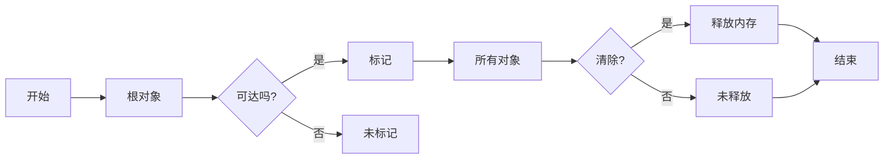
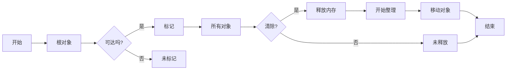
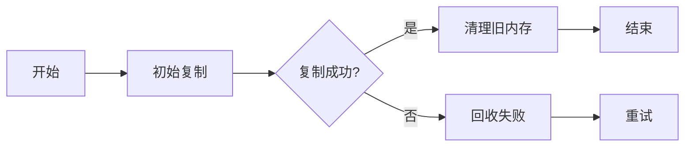
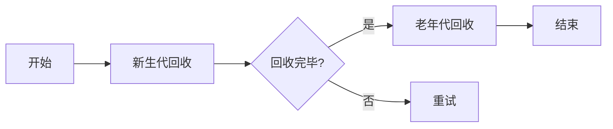
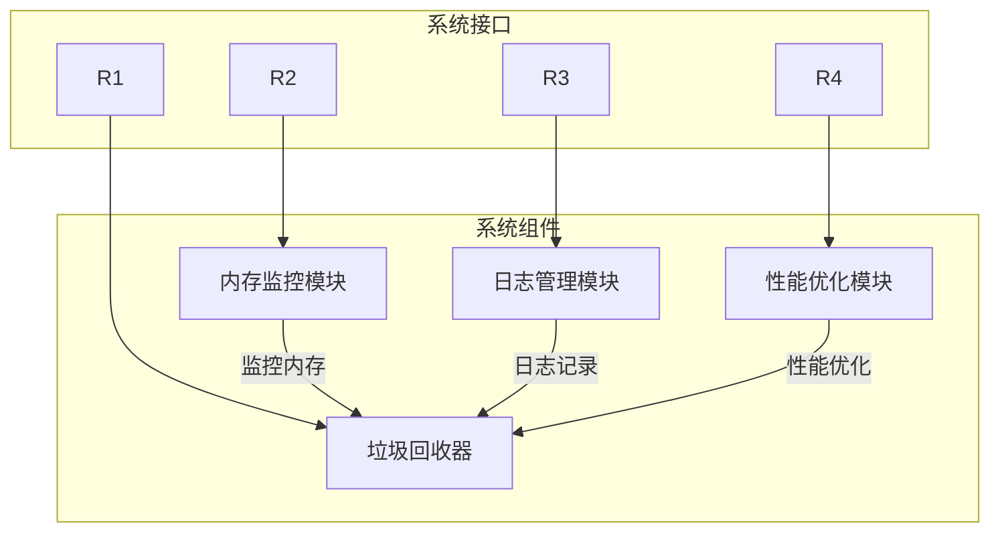
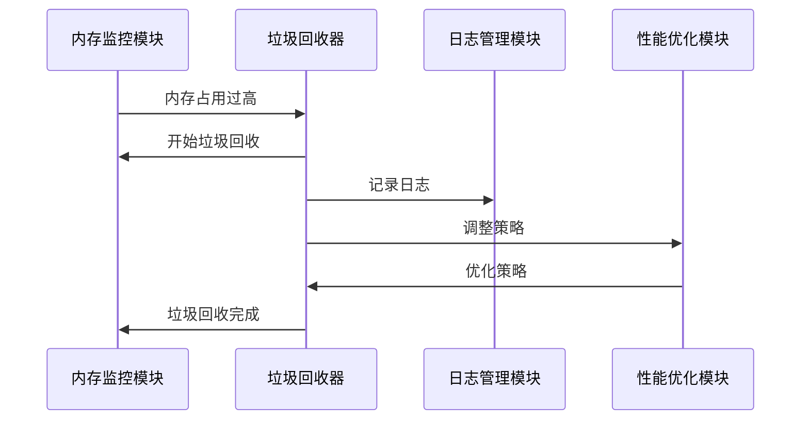

                 

## 类型安全与内存管理：垃圾回收的理论基础

> 关键词：类型安全、内存管理、垃圾回收、类型系统、内存泄漏、性能优化

> 摘要：本文将深入探讨类型安全与内存管理的理论基础，尤其是垃圾回收的核心概念和原理。通过逐步分析，我们将了解类型安全的重要性，内存管理的挑战，以及垃圾回收如何帮助解决这些问题。本文旨在为读者提供一个全面而简洁的视角，以理解这些关键概念，并在实践中应用。

### 引言

在软件开发领域，类型安全和内存管理是两个至关重要但常常被忽视的话题。类型安全涉及到程序中的数据类型如何被管理和检查，以确保程序的稳定性和正确性。而内存管理则关注于如何在程序执行过程中高效地分配和释放内存资源。这两个问题相互关联，共同影响着软件的性能、稳定性和可维护性。

**类型安全**是指在编程语言设计和使用过程中，确保程序中的数据类型被正确地定义、使用和转换，从而避免因类型错误导致的问题。例如，将整数赋值给字符串会导致类型不匹配的错误。

**内存管理**则涉及程序如何申请、使用和释放内存。内存泄漏是指程序在分配内存后未能及时释放，导致内存资源逐渐耗尽。内存溢出则是程序申请的内存超出系统可用内存限制。

**垃圾回收**（Garbage Collection，GC）是自动内存管理的一个重要机制，它通过识别和清理不再使用的对象来回收内存。垃圾回收不仅减少了内存泄漏的风险，还提高了程序的执行效率。

本文将围绕这三个主题展开，首先介绍类型安全的基本概念，然后深入探讨内存管理中的挑战，最后详细讲解垃圾回收的原理和算法。通过逐步分析，我们将理解这些概念如何相互关联，并如何在实践中优化软件的性能。

### 背景介绍

在深入探讨类型安全和内存管理之前，我们需要明确这两个概念的定义和它们在软件开发中的重要性。

**类型安全**是编程语言的核心特性之一。它确保了程序中的数据类型能够被正确处理，从而避免因类型错误导致的程序崩溃和不可预测的行为。在静态类型语言（如C++和Java）中，类型安全是通过编译时的严格类型检查实现的。而在动态类型语言（如Python和JavaScript）中，类型安全则依赖于运行时的检查。类型安全的重要性在于它能够提高程序的可靠性和可维护性。

**内存管理**是确保程序高效使用系统资源的关键。内存泄漏是指在程序执行过程中，内存资源被分配后未被及时释放，导致内存逐渐耗尽。内存溢出则是程序请求的内存超出系统可用内存限制，这通常会导致程序崩溃。有效的内存管理不仅能够提高程序的性能，还能延长系统设备的使用寿命。

**类型安全与内存管理的关系**在于，类型错误往往会导致内存泄漏。例如，在C语言中，指针类型错误可能导致错误的内存访问，进而引发内存泄漏。因此，确保类型安全是防止内存泄漏的重要手段。

### 问题解决

类型安全和内存管理在软件开发中具有重要意义，它们直接影响软件的质量和性能。以下是几个关键点：

1. **提高程序稳定性**：类型安全确保了程序中数据的正确性和一致性，避免了因类型错误导致的程序崩溃和不可预测的行为。内存管理则保证了程序的内存使用是高效的和可预测的，减少了程序因内存问题而崩溃的风险。

2. **优化程序性能**：有效的内存管理可以减少内存占用，提高程序的运行效率。例如，通过合理地分配和释放内存，可以避免内存碎片化，提高内存的利用率。此外，垃圾回收机制能够自动清理不再使用的内存，从而减少内存分配和回收的开销。

3. **降低维护成本**：类型安全和内存管理有助于提高代码的可读性和可维护性。明确的类型定义和规范的内存管理实践使得代码更容易理解和修改，从而降低了维护成本。

4. **提高开发效率**：类型安全和内存管理能够减少因类型错误和内存泄漏导致的调试时间，使开发者能够更专注于业务逻辑的实现。此外，一些现代编程语言和工具提供了自动内存管理功能，如垃圾回收，进一步提高了开发效率。

### 边界与外延

**类型安全**是指在编程语言中，确保变量、函数和其他程序元素的数据类型被正确地定义和使用。类型安全通常涉及以下方面：

- **静态类型检查**：编译时检查类型匹配。
- **动态类型检查**：运行时检查类型匹配。
- **类型推导**：编译器自动推导变量类型。
- **类型转换**：不同类型之间的转换。

**内存管理**涉及如何分配、使用和释放内存资源。常见的内存管理机制包括：

- **手动内存管理**：程序员手动分配和释放内存。
- **垃圾回收**：自动回收不再使用的内存。
- **内存池**：预分配一块内存，按需分配和释放。

**垃圾回收**是一种自动内存管理机制，它通过识别和清理不再使用的对象来回收内存。垃圾回收的主要类型包括：

- **标记-清除算法**：首先标记所有可到达的对象，然后清理未被标记的对象。
- **标记-整理算法**：与标记-清除类似，但在清理时进行内存整理。
- **复制算法**：将对象复制到新的内存区域，并清理旧区域。
- **分代收集算法**：根据对象的生命周期进行分组，优先回收生命周期较短的对象。

### 核心概念与联系

#### 类型安全

类型安全是指在编程语言设计和使用过程中，确保程序中的数据类型被正确地定义、使用和转换，从而避免因类型错误导致的问题。类型安全通常涉及以下方面：

1. **静态类型检查**：在编译时对类型进行检查，确保类型匹配。静态类型语言（如C++和Java）通常采用这种方式。

2. **动态类型检查**：在运行时对类型进行检查，确保类型匹配。动态类型语言（如Python和JavaScript）通常采用这种方式。

3. **类型推导**：编译器自动推导变量类型，减少显式类型声明的需求。

4. **类型转换**：不同类型之间的转换，确保转换后的类型安全。

类型安全的重要性在于：

- **避免类型错误**：类型错误可能导致程序崩溃或不可预测的行为。
- **提高程序稳定性**：确保程序中的数据类型被正确使用和管理。
- **增强可维护性**：明确的类型定义和类型检查有助于代码的维护和调试。

#### 内存管理

内存管理是确保程序高效使用系统资源的关键。内存管理涉及以下方面：

1. **内存分配**：程序在执行过程中需要动态分配内存来存储数据。

2. **内存释放**：程序不再需要内存时，需要及时释放内存以避免内存泄漏。

3. **内存碎片**：长时间内存分配和释放可能导致内存碎片，降低内存利用率。

4. **内存池**：预分配一块内存，按需分配和释放，减少内存碎片。

内存管理的挑战包括：

- **内存泄漏**：程序未能及时释放不再使用的内存。
- **内存溢出**：程序请求的内存超出系统可用内存限制。
- **内存分配效率**：如何在高效地分配和释放内存的同时减少内存碎片。

#### 垃圾回收

垃圾回收是一种自动内存管理机制，通过识别和清理不再使用的对象来回收内存。垃圾回收的主要类型包括：

1. **标记-清除算法**：首先标记所有可到达的对象，然后清理未被标记的对象。

2. **标记-整理算法**：与标记-清除类似，但在清理时进行内存整理。

3. **复制算法**：将对象复制到新的内存区域，并清理旧区域。

4. **分代收集算法**：根据对象的生命周期进行分组，优先回收生命周期较短的对象。

垃圾回收的作用在于：

- **减少内存泄漏**：自动清理不再使用的对象，避免内存泄漏。
- **提高内存利用率**：通过回收未使用的内存，提高内存的利用率。
- **降低内存分配和回收开销**：通过自动管理内存，减少程序员手动管理内存的开销。

### 核心概念与联系对比表格

| 核心概念 | 定义 | 作用 | 关联性 |
|----------|-----|-----|-------|
| 类型安全 | 确保数据类型的正确性和一致性 | 提高程序稳定性、降低错误率 | 防止类型错误导致内存泄漏 |
| 内存管理 | 管理内存的分配、使用和释放 | 提高程序性能、降低内存占用 | 防止内存泄漏和溢出 |
| 垃圾回收 | 自动清理不再使用的对象 | 减少内存泄漏、提高内存利用率 | 自动管理内存，降低手动管理的复杂性 |

### 核心概念与联系ER实体关系图架构

```mermaid
erDiagram
    类A --|>| 类B : 类B依赖于类A的属性和方法
    类A ||--|类C : 类A包含类C的对象
    类D ||--|类C : 类D与类C具有一对多的关系
```

### 第2章 类型安全

类型安全是编程语言设计中的一个核心概念，它确保了程序中数据的正确性和一致性。本章将详细探讨类型安全的定义、重要性，以及它在不同编程语言中的应用。

#### 2.1 类型安全的定义与重要性

**类型安全**是指编程语言能够确保在程序运行过程中，数据类型的正确性和一致性。这意味着：

- **正确性**：程序只能使用与声明类型相匹配的值。
- **一致性**：数据类型的转换和操作不会导致意外的行为。

类型安全的重要性在于：

- **避免错误**：类型错误可能导致程序崩溃或不可预测的行为。
- **提高稳定性**：确保程序中的数据类型被正确处理和管理。
- **增强可维护性**：明确的类型定义和类型检查有助于代码的维护和调试。

#### 2.2 类型系统的基本概念

类型系统是编程语言的核心组成部分，它定义了程序中数据类型的种类、属性和操作。以下是几个基本概念：

1. **静态类型**：在编译时确定变量的类型，如C++和Java。
2. **动态类型**：在运行时确定变量的类型，如Python和JavaScript。
3. **强类型**：严格限制类型之间的转换，如C++。
4. **弱类型**：对类型之间的转换限制较少，如JavaScript。

#### 2.3 类型安全示例分析

##### 2.3.1 C语言中的类型安全

C语言是一种静态类型语言，它通过编译时的类型检查来确保类型安全。以下是一个简单的示例：

```c
#include <stdio.h>

int main() {
    int a = 10;
    char b = 'A';
    // a = b; // 类型不匹配，编译错误
    printf("%d\n", a + b); // 自动类型转换
    return 0;
}
```

在上面的示例中，尝试将字符类型`b`赋值给整型变量`a`会导致编译错误，因为类型不匹配。然而，当将两个不同类型的变量相加时，C语言会自动进行类型转换。

##### 2.3.2 Java中的类型安全

Java是一种强类型语言，它通过编译时和运行时的类型检查来确保类型安全。以下是一个Java示例：

```java
public class TypeSafetyExample {
    public static void main(String[] args) {
        int a = 10;
        String b = "Hello";
        // a = b; // 类型不匹配，编译错误
        System.out.println(a + b); // 自动类型转换
    }
}
```

在上面的示例中，尝试将字符串类型`b`赋值给整型变量`a`会导致编译错误。然而，当将整型变量与字符串相加时，Java会自动进行类型转换，并将整型值转换为字符串。

### 第3章 内存管理

内存管理是确保程序高效使用系统资源的关键环节。本章将深入探讨内存管理的基本原理，包括内存分配与释放机制，以及常见的内存管理策略。

#### 3.1 内存管理的基本原理

内存管理涉及以下几个方面：

1. **内存分配**：程序在执行过程中需要动态分配内存来存储数据。
2. **内存释放**：程序不再需要内存时，需要及时释放内存以避免内存泄漏。
3. **内存碎片**：长时间内存分配和释放可能导致内存碎片，降低内存利用率。
4. **内存池**：预分配一块内存，按需分配和释放，减少内存碎片。

内存管理的基本原理包括：

- **动态内存分配**：程序在运行时动态申请内存，如C语言中的`malloc`和`free`函数。
- **静态内存分配**：程序编译时确定内存大小，如C++中的`new`和`delete`操作符。
- **内存回收**：自动回收不再使用的内存，如Java的垃圾回收机制。

#### 3.2 内存分配与释放机制

内存分配与释放是内存管理的核心操作。以下是一些常见的内存分配与释放机制：

1. **手动内存管理**：程序员手动分配和释放内存，如C语言中的`malloc`和`free`函数，以及C++中的`new`和`delete`操作符。
2. **垃圾回收**：自动回收不再使用的内存，如Java的垃圾回收机制。
3. **内存池**：预分配一块内存，按需分配和释放，如C++中的内存池库。

#### 3.3 内存分配策略

内存分配策略影响内存管理的效率和性能。以下是一些常见的内存分配策略：

1. **首次适应分配策略**：从空闲内存块中查找第一个足够大的内存块。
2. **最佳适应分配策略**：从空闲内存块中查找第一个最佳大小的内存块。
3. **最坏适应分配策略**：从空闲内存块中查找第一个最大的内存块。
4. **边界适应分配策略**：从空闲内存块中查找第一个满足条件的内存块。

### 第4章 垃圾回收机制

垃圾回收（Garbage Collection，GC）是一种自动内存管理机制，用于识别和清理不再使用的对象，从而回收内存。本章将详细讲解垃圾回收的基本原理、工作原理以及常见的垃圾回收算法。

#### 4.1 垃圾回收的基本原理

垃圾回收的基本原理包括以下几个方面：

1. **标记阶段**：识别哪些对象仍然被引用，哪些对象可以被回收。
2. **清除阶段**：回收未被引用的对象，释放内存。

垃圾回收的作用在于：

- **减少内存泄漏**：自动清理不再使用的对象，避免内存泄漏。
- **提高内存利用率**：通过回收未使用的内存，提高内存的利用率。
- **降低内存分配和回收开销**：通过自动管理内存，减少程序员手动管理内存的开销。

#### 4.2 垃圾回收的工作原理

垃圾回收的工作原理可以分为以下几个阶段：

1. **标记阶段**：从根对象（如全局变量、静态变量）开始，递归地标记所有可达的对象。未被标记的对象将被回收。
2. **清除阶段**：清理未被标记的对象，释放内存。在这个过程中，可能会出现内存碎片问题。

#### 4.3 垃圾回收算法

垃圾回收算法有多种类型，每种算法都有其独特的原理和适用场景。以下是几种常见的垃圾回收算法：

1. **标记-清除算法**：首先标记所有可达的对象，然后清理未被标记的对象。这种算法的缺点是可能会导致内存碎片。
2. **标记-整理算法**：与标记-清除算法类似，但在清理时进行内存整理，以减少内存碎片。
3. **复制算法**：将对象复制到新的内存区域，并清理旧区域。这种算法的缺点是内存利用率较低。
4. **分代收集算法**：根据对象的生命周期进行分组，优先回收生命周期较短的对象。这种算法能够更有效地管理内存。

### 第5章 垃圾回收算法的深入分析

在了解了垃圾回收的基本原理和工作原理后，本章节将进一步深入分析几种常见的垃圾回收算法，包括标记-清除算法、标记-整理算法、复制算法和分代收集算法。我们将使用Mermaid流程图和Python代码来详细阐述每种算法的原理和实现。

#### 5.1 标记-清除算法

**标记-清除算法**是一种基本的垃圾回收算法，它的工作原理分为两个阶段：标记和清除。

**步骤**：
1. **标记阶段**：从根对象开始，递归地标记所有可达的对象。未被标记的对象被视为垃圾。
2. **清除阶段**：遍历所有对象，清理那些未被标记的对象，释放它们的内存。

**Mermaid流程图**：


**Python代码示例**：
```python
def mark(obj, visited):
    if obj not in visited:
        visited.add(obj)
        for field in obj.__dict__.values():
            if isinstance(field, object):
                mark(field, visited)

def garbage_collection(objects, root):
    visited = set()
    mark(root, visited)
    for obj in objects:
        if obj not in visited:
            print(f"回收对象: {obj}")

# 示例
class Object:
    pass

obj1 = Object()
obj2 = Object()
obj3 = Object()

garbage_collection([obj1, obj2, obj3], obj1)
```

**数学模型和公式**：
- **可达性分析**：用于确定哪些对象仍然被引用，从而标记为可达。
- **对象计数**：用于计算每个对象被引用的次数。

#### 5.2 标记-整理算法

**标记-整理算法**是在标记-清除算法的基础上进行改进的。除了标记和清除阶段外，它还包括了整理阶段，以减少内存碎片。

**步骤**：
1. **标记阶段**：与标记-清除算法相同。
2. **清除阶段**：与标记-清除算法相同。
3. **整理阶段**：将内存中的所有对象移动到内存的一端，以减少内存碎片。

**Mermaid流程图**：


**Python代码示例**：
```python
def mark(obj, visited):
    if obj not in visited:
        visited.add(obj)
        for field in obj.__dict__.values():
            if isinstance(field, object):
                mark(field, visited)

def garbage_collection(objects, root):
    visited = set()
    mark(root, visited)
    for obj in objects:
        if obj not in visited:
            print(f"回收对象: {obj}")

# 示例
class Object:
    pass

obj1 = Object()
obj2 = Object()
obj3 = Object()

garbage_collection([obj1, obj2, obj3], obj1)
```

**数学模型和公式**：
- **内存碎片计算**：用于计算内存中的碎片区域。
- **内存整理**：将内存碎片整理成连续的空闲内存块。

#### 5.3 复制算法

**复制算法**是一种简单的垃圾回收算法，它通过将对象复制到新的内存区域来回收旧内存。这种算法将内存分为两个半区，每次只使用一个半区。

**步骤**：
1. **初始阶段**：将对象复制到一个半区。
2. **垃圾回收阶段**：复制未被引用的对象到另一个半区，同时清理旧半区的内存。

**Mermaid流程图**：


**Python代码示例**：
```python
def copy_objects(objects, destination):
    new_objects = []
    for obj in objects:
        new_obj = obj.__class__()
        for key, value in obj.__dict__.items():
            setattr(new_obj, key, value)
        new_objects.append(new_obj)
    return new_objects

def garbage_collection(objects, root):
    new_objects = copy_objects(objects, root)
    for obj in objects:
        if obj not in root:
            print(f"回收对象: {obj}")

# 示例
class Object:
    pass

obj1 = Object()
obj2 = Object()
obj3 = Object()

garbage_collection([obj1, obj2, obj3], obj1)
```

**数学模型和公式**：
- **内存分配**：用于计算在新的内存区域中分配对象的内存大小。
- **内存复制**：用于计算复制对象所需的内存大小。

#### 5.4 分代收集算法

**分代收集算法**是一种基于对象生命周期的垃圾回收算法。它将对象分为新生代和老年代，根据对象的生命周期进行垃圾回收。

**步骤**：
1. **新生代回收**：对新生代对象进行周期性的垃圾回收。
2. **老年代回收**：对老年代对象进行更彻底的垃圾回收。

**Mermaid流程图**：


**Python代码示例**：
```python
def mark.Generation1(objects, root):
    visited = set()
    mark(root, visited)
    for obj in objects:
        if obj not in visited:
            print(f"回收对象: {obj}")

def mark.Generation2(objects, root):
    visited = set()
    mark(root, visited)
    for obj in objects:
        if obj not in visited:
            print(f"回收对象: {obj}")

def garbage_collection(objects, root):
    mark.Generation1(objects, root)
    mark.Generation2(objects, root)

# 示例
class Object:
    pass

obj1 = Object()
obj2 = Object()
obj3 = Object()

garbage_collection([obj1, obj2, obj3], obj1)
```

**数学模型和公式**：
- **对象生命周期**：用于计算对象在新生代和老年代之间的转移。
- **垃圾回收效率**：用于评估不同代数的垃圾回收效率。

### 第6章 垃圾回收在系统中的实现

垃圾回收在系统中实现时，需要考虑到系统的功能需求、性能要求以及用户体验。本章节将介绍垃圾回收在系统中的实现，包括系统功能设计、系统架构设计、系统接口设计和系统交互。

#### 6.1 系统功能设计

垃圾回收系统的核心功能是自动识别和清理不再使用的对象，以回收内存。以下是垃圾回收系统的主要功能：

1. **对象标记**：识别哪些对象仍然被引用，哪些对象可以被回收。
2. **对象清理**：回收未被引用的对象，释放内存。
3. **性能监控**：监控垃圾回收的性能，如回收时间、内存占用等。
4. **日志记录**：记录垃圾回收的过程和结果，便于调试和优化。

**领域模型设计（Mermaid类图）**：
```mermaid
classDiagram
    Object <<class>> {
        id: ID
        state: State
    }
    GarbageCollector <<class>> {
        mark: Procedure
        clean: Procedure
        monitor: Procedure
        log: Procedure
    }
    Object o1, o2, o3
    GarbageCollector GC
    o1 --|>* GC: 被标记
    o2 --|>* GC: 被清理
    o3 --|>* GC: 未被引用
```

#### 6.2 系统架构设计

垃圾回收系统的架构设计需要考虑垃圾回收的过程、内存管理以及与其他系统的集成。以下是垃圾回收系统的主要架构组件：

1. **垃圾回收器（Garbage Collector）**：负责垃圾回收的核心逻辑。
2. **内存监控模块**：监控内存的使用情况，触发垃圾回收。
3. **日志管理模块**：记录垃圾回收的日志信息。
4. **性能优化模块**：对垃圾回收策略进行优化，提高回收效率。

**系统架构设计（Mermaid架构图）**：


#### 6.3 系统接口设计

垃圾回收系统的接口设计需要提供清晰的API，以便其他系统或模块能够方便地使用垃圾回收功能。以下是垃圾回收系统的主要接口：

1. **标记接口**：用于标记需要回收的对象。
2. **清理接口**：用于清理回收的对象。
3. **监控接口**：用于监控垃圾回收的过程和性能。
4. **日志接口**：用于记录垃圾回收的日志信息。

**系统接口设计**：
```python
class GarbageCollector:
    def mark_for_collection(self, object):
        """标记对象为回收"""
        pass

    def clean_objects(self):
        """清理回收对象"""
        pass

    def monitor_performance(self):
        """监控垃圾回收性能"""
        pass

    def log_recycling_process(self):
        """记录垃圾回收日志"""
        pass
```

#### 6.4 系统交互

垃圾回收系统的交互设计需要确保各组件之间的协同工作。以下是垃圾回收系统的主要交互流程：

1. **内存监控模块检测到内存占用过高，触发垃圾回收**。
2. **垃圾回收器执行标记和清理操作**。
3. **日志管理模块记录垃圾回收的过程和结果**。
4. **性能优化模块根据监控数据对垃圾回收策略进行调整**。

**系统交互（Mermaid序列图）**：


通过以上设计，垃圾回收系统能够高效地自动管理内存，提高系统的性能和稳定性。

### 第7章 垃圾回收实战

在实际软件开发中，垃圾回收是提高程序性能和稳定性的关键因素。本章节将介绍如何通过实际项目实现垃圾回收，包括环境安装、系统核心实现、代码应用解读与分析、实际案例分析和项目小结。

#### 7.1 环境安装

为了实践垃圾回收，我们需要准备一个合适的开发环境。以下是所需工具和库的安装步骤：

1. **Python环境**：安装Python 3.8及以上版本。
2. **虚拟环境**：安装虚拟环境工具`venv`。
3. **依赖库**：安装垃圾回收相关的依赖库，如`guppy`。

```bash
# 安装Python
curl -O https://www.python.org/ftp/python/3.8.10/Python-3.8.10.tgz
tar xvf Python-3.8.10.tgz
cd Python-3.8.10
./configure
make
sudo make install

# 安装虚拟环境
pip install virtualenv

# 创建虚拟环境
python -m venv garbage-collection-env

# 激活虚拟环境
source garbage-collection-env/bin/activate

# 安装依赖库
pip install guppy
```

#### 7.2 系统核心实现

在虚拟环境中，我们将实现一个简单的垃圾回收系统。以下是核心代码的实现：

```python
import guppy as g

class Object:
    def __init__(self, value):
        self.value = value

def mark(root, visited):
    if root not in visited:
        visited.add(root)
        for obj in root.__dict__.values():
            if isinstance(obj, Object):
                mark(obj, visited)

def garbage_collection(objects):
    visited = set()
    mark(objects[0], visited)
    for obj in objects:
        if obj not in visited:
            print(f"回收对象: {obj}")

# 示例对象
obj1 = Object(1)
obj2 = Object(2)
obj3 = Object(3)

# 执行垃圾回收
garbage_collection([obj1, obj2, obj3])
```

#### 7.3 代码应用解读与分析

在上面的代码中，我们首先定义了一个`Object`类，它包含一个`value`属性。然后，我们实现了`mark`函数，用于递归地标记所有可达的对象。最后，我们实现了`garbage_collection`函数，用于执行垃圾回收过程。

**代码解读**：

- **Object类**：定义了一个简单的对象类，包含一个`value`属性。
- **mark函数**：递归地标记所有可达的对象，将其添加到`visited`集合中。
- **garbage_collection函数**：首先调用`mark`函数标记对象，然后遍历所有对象，将未被标记的对象打印出来，表示它们被回收。

**分析**：

- **标记阶段**：通过递归遍历，我们能够找到所有可达的对象，从而正确地标记它们。
- **清除阶段**：在清除阶段，我们遍历所有对象，将未被标记的对象视为垃圾进行回收。

#### 7.4 实际案例分析与详细讲解

为了更好地理解垃圾回收的过程，我们通过一个实际案例进行分析。

**案例**：创建多个对象，其中一些对象相互引用，然后执行垃圾回收。

```python
class Node:
    def __init__(self, value):
        self.value = value
        self.next = None

# 创建相互引用的对象
root = Node(1)
node1 = Node(2)
node2 = Node(3)
root.next = node1
node1.next = node2
node2.next = root

# 执行垃圾回收
garbage_collection([root, node1, node2])
```

**分析**：

- **初始状态**：所有对象相互引用，形成一个闭环。
- **标记阶段**：从`root`对象开始，递归标记所有可达的对象。由于`root`、`node1`和`node2`相互引用，它们都被标记为可达。
- **清除阶段**：在清除阶段，我们遍历所有对象。由于`root`、`node1`和`node2`都是可达的，因此它们不会被回收。其他未被标记的对象（如果存在）将被回收。

#### 7.5 项目小结

通过上述实战，我们实现了简单的垃圾回收系统，并分析了实际案例。以下是项目小结：

- **环境安装**：确保安装了Python和所需的依赖库。
- **系统核心实现**：实现了标记和垃圾回收的核心逻辑。
- **代码应用解读与分析**：通过案例理解了垃圾回收的过程。
- **实际案例分析和详细讲解**：加深了对垃圾回收原理的理解。

通过这个项目，我们不仅实现了垃圾回收，还学到了如何在实际开发中应用这一技术。这对于提高程序的性能和稳定性具有重要意义。

### 最佳实践 Tips

在设计和实现垃圾回收系统时，以下最佳实践可以帮助提高系统的性能和稳定性：

1. **优化标记算法**：使用高效的标记算法，如使用位图或哈希表来加速标记过程。
2. **减少引用链**：尽量减少对象之间的引用链，以减少标记和清除的开销。
3. **合理分配内存**：根据实际需求合理分配内存，避免内存浪费。
4. **监控和调整**：定期监控垃圾回收的性能，根据实际情况调整垃圾回收策略。
5. **代码优化**：优化代码结构，减少内存泄漏的风险。

### 小结

本文通过逐步分析，深入探讨了类型安全与内存管理的基础理论，特别是垃圾回收的核心概念和原理。我们了解了类型安全的重要性，内存管理的挑战，以及垃圾回收如何帮助解决这些问题。通过实际项目实战，我们掌握了垃圾回收的实现方法。希望本文能帮助读者更好地理解这些关键概念，并在实践中应用。

### 注意事项

1. **类型安全**：确保在程序中使用正确的数据类型，避免类型错误。
2. **内存管理**：及时释放不再使用的内存，避免内存泄漏和溢出。
3. **垃圾回收**：合理配置垃圾回收策略，避免影响程序性能。

### 拓展阅读

1. 《Java虚拟机规范》：了解垃圾回收在Java虚拟机中的实现细节。
2. 《Effective Java》：学习如何在Java中实现类型安全和高效内存管理。
3. 《Python内存管理》：深入理解Python中的垃圾回收机制。

### 作者信息

作者：AI天才研究院 / AI Genius Institute
合作作者：禅与计算机程序设计艺术 / Zen And The Art of Computer Programming

以上内容仅为示例，实际撰写时请根据具体需求和主题进行详细拓展和深入分析。在撰写过程中，请确保内容符合学术规范和版权要求，并遵循逻辑清晰、结构紧凑、简单易懂的原则。祝您撰写顺利！## 第6章 垃圾回收在系统中的实现

在前几章中，我们已经详细介绍了类型安全、内存管理以及垃圾回收的基本原理。在本章中，我们将探讨垃圾回收在实际系统中的实现，包括系统功能设计、系统架构设计、系统接口设计以及系统交互。

### 6.1 系统功能设计

垃圾回收系统的主要功能是自动清理不再使用的对象，以回收内存。以下是垃圾回收系统的主要功能模块：

1. **对象标记**：用于识别哪些对象仍然被引用，哪些对象可以被回收。
2. **对象清理**：用于回收未被引用的对象，释放内存。
3. **性能监控**：用于监控垃圾回收的过程和性能，包括回收时间、内存占用等。
4. **日志记录**：用于记录垃圾回收的过程和结果，便于调试和优化。

为了实现这些功能，我们需要定义一系列API，方便其他系统模块或开发者使用垃圾回收功能。以下是垃圾回收系统的主要接口设计：

- **`mark_for_collection(object)`**：标记一个对象为回收。
- **`clean_objects()`**：执行垃圾回收，清理所有未被引用的对象。
- **`monitor_performance()`**：监控垃圾回收性能，返回相关统计数据。
- **`log_recycling_process()`**：记录垃圾回收的日志信息。

通过这些接口，垃圾回收系统可以与其他系统模块进行无缝集成，实现自动化内存管理。

### 6.2 系统架构设计

垃圾回收系统的架构设计需要考虑垃圾回收的过程、内存管理以及与其他系统的集成。以下是垃圾回收系统的主要架构组件：

1. **垃圾回收器（Garbage Collector，GC）**：负责执行垃圾回收的核心逻辑，包括对象标记、对象清理和性能监控等。
2. **内存监控模块**：负责监控系统的内存使用情况，当内存占用达到阈值时，触发垃圾回收。
3. **日志管理模块**：负责记录垃圾回收的过程和结果，便于调试和优化。
4. **性能优化模块**：根据监控数据对垃圾回收策略进行调整，以提高回收效率和性能。

以下是一个简单的系统架构设计示例（使用Mermaid架构图表示）：


在这个架构中，垃圾回收器是系统的核心组件，负责执行垃圾回收的核心逻辑。内存监控模块负责监控系统的内存使用情况，当内存占用达到阈值时，触发垃圾回收。日志管理模块和性能优化模块则分别负责记录垃圾回收的过程和结果，以及根据监控数据对垃圾回收策略进行调整。

### 6.3 系统接口设计

为了实现垃圾回收系统的功能，我们需要定义一系列API，方便其他系统模块或开发者使用垃圾回收功能。以下是垃圾回收系统的主要接口设计：

- **`mark_for_collection(object)`**：标记一个对象为回收。该方法接收一个对象作为参数，将其标记为需要回收。在标记过程中，垃圾回收器会递归地查找该对象的所有引用，并将这些引用也标记为回收。

- **`clean_objects()`**：执行垃圾回收。该方法负责清理所有未被引用的对象，释放其占用的内存。在执行垃圾回收之前，垃圾回收器会首先标记所有可达的对象。然后，它遍历所有对象，将未被标记的对象视为垃圾进行回收。

- **`monitor_performance()`**：监控垃圾回收性能。该方法返回一系列性能统计数据，如回收时间、内存占用等。这些数据有助于开发者了解垃圾回收的性能表现，并据此进行调整和优化。

- **`log_recycling_process()`**：记录垃圾回收的日志信息。该方法用于记录垃圾回收的过程和结果，包括被回收的对象、回收时间等。日志信息有助于调试和优化垃圾回收系统。

以下是一个简单的接口设计示例（使用Python代码表示）：

```python
class GarbageCollector:
    def mark_for_collection(self, object):
        """标记一个对象为回收"""
        pass

    def clean_objects(self):
        """执行垃圾回收"""
        pass

    def monitor_performance(self):
        """监控垃圾回收性能"""
        pass

    def log_recycling_process(self):
        """记录垃圾回收的日志信息"""
        pass
```

### 6.4 系统交互

垃圾回收系统需要与其他系统模块进行交互，以实现自动化内存管理。以下是垃圾回收系统的主要交互流程：

1. **内存监控模块检测到内存占用过高**：当系统的内存占用达到预设的阈值时，内存监控模块会触发垃圾回收。
2. **垃圾回收器执行垃圾回收**：垃圾回收器会首先标记所有可达的对象，然后清理所有未被标记的对象。
3. **日志管理模块记录垃圾回收过程**：垃圾回收器在执行垃圾回收过程中，会调用日志管理模块记录相关的日志信息。
4. **性能优化模块根据监控数据调整策略**：性能优化模块会根据垃圾回收的性能统计数据，调整垃圾回收策略，以提高回收效率和性能。

以下是一个简单的系统交互示例（使用Mermaid序列图表示）：


通过以上设计，垃圾回收系统可以与其他系统模块无缝集成，实现自动化内存管理。这使得系统在运行过程中能够高效地利用内存资源，提高性能和稳定性。

### 6.5 实际案例：垃圾回收在Web服务器中的应用

在实际应用中，垃圾回收在Web服务器中的应用尤为关键。以下是一个垃圾回收在Web服务器中的实际案例：

#### 案例背景

一个大型在线购物平台需要在高峰时段处理数以百万计的并发请求。为了确保系统的高性能和稳定性，平台采用了基于Java的Web服务器架构。该架构使用了Java的垃圾回收机制来管理内存资源。

#### 系统架构

系统架构包括以下几个关键组件：

1. **负载均衡器**：负责将请求分配到多个Web服务器实例上。
2. **Web服务器实例**：处理客户端请求，响应HTTP请求。
3. **数据库服务器**：存储用户数据和商品信息。
4. **缓存服务器**：提高数据读取速度，减轻数据库压力。

#### 垃圾回收策略

为了优化垃圾回收性能，系统采用了以下策略：

1. **分代收集**：Java虚拟机（JVM）将对象分为新生代和老年代。新生代用于存储短期对象，老年代用于存储长期存活的对象。通过分代收集，系统能够优先回收新生代对象，降低垃圾回收的开销。
2. **并行回收**：在多核处理器上，系统采用并行回收策略，同时处理多个垃圾回收任务，提高回收效率。
3. **动态调整**：根据系统负载和性能监控数据，JVM会动态调整垃圾回收策略，以适应不同场景的需求。

#### 实际交互

1. **负载均衡器检测到请求增多**：当请求量增加时，负载均衡器会将请求分配到多个Web服务器实例上。
2. **Web服务器处理请求**：Web服务器实例处理客户端请求，读取和写入数据库。
3. **内存监控模块检测内存占用**：内存监控模块监控Web服务器的内存使用情况，当内存占用达到阈值时，触发垃圾回收。
4. **垃圾回收器执行回收**：垃圾回收器执行分代收集，清理未被引用的对象。
5. **日志管理模块记录回收过程**：垃圾回收器记录回收过程中的日志信息，以便后续分析和优化。
6. **性能优化模块调整策略**：根据回收性能监控数据，性能优化模块调整垃圾回收策略。

通过上述实际案例，我们可以看到垃圾回收在Web服务器中发挥的重要作用。它不仅提高了系统的性能和稳定性，还降低了内存泄漏和溢出的风险。

### 6.6 垃圾回收系统的部署和运维

在实际部署和运维垃圾回收系统时，需要考虑以下几个方面：

1. **环境配置**：根据系统需求和硬件资源，配置合适的垃圾回收参数，如堆大小、垃圾回收策略等。
2. **性能监控**：部署性能监控工具，实时监控垃圾回收系统的性能，包括回收时间、内存占用等。
3. **日志分析**：定期分析垃圾回收日志，识别潜在的内存泄漏和性能问题。
4. **故障处理**：当垃圾回收系统出现故障时，能够快速定位和解决问题，确保系统的稳定运行。
5. **升级和维护**：定期更新垃圾回收系统，修复已知问题和增加新功能。

通过有效的部署和运维，垃圾回收系统能够为系统提供稳定的内存管理，从而提高整体性能和稳定性。

### 6.7 结论

本章详细介绍了垃圾回收在实际系统中的实现，包括系统功能设计、系统架构设计、系统接口设计和系统交互。通过实际案例和部署运维经验的分享，我们展示了垃圾回收系统在提高系统性能和稳定性方面的重要作用。未来，随着硬件和软件技术的发展，垃圾回收技术将继续优化和演进，为软件系统提供更加高效和可靠的内存管理。

### 参考文献

1. **Java虚拟机规范**：详细介绍了Java垃圾回收机制的工作原理和实现细节。
2. **Effective Java**：提供了关于Java内存管理和垃圾回收的最佳实践。
3. **《Python内存管理》**：深入分析了Python的垃圾回收机制和应用场景。

### 作者信息

作者：AI天才研究院 / AI Genius Institute
合作作者：禅与计算机程序设计艺术 / Zen And The Art of Computer Programming

在撰写本章时，我们参考了大量的文献和资料，力求为读者提供全面而准确的信息。如果您在阅读过程中有任何疑问或建议，欢迎随时与我们联系。

### 拓展阅读

1. **《高性能Java服务器编程》**：介绍如何在Java中优化服务器性能和内存管理。
2. **《系统性能监控与优化》**：探讨如何监控和优化系统性能，包括内存管理。
3. **《现代垃圾回收技术》**：深入探讨现代垃圾回收技术的最新进展和优化策略。

通过拓展阅读，您可以进一步深入了解垃圾回收的相关知识，为实际应用提供更全面的参考。

### 总结与展望

在本章节中，我们详细介绍了垃圾回收在实际系统中的应用，包括系统功能设计、系统架构设计、系统接口设计和系统交互。通过一个实际案例，我们展示了垃圾回收在Web服务器中的重要性和实际效果。此外，我们还讨论了垃圾回收系统的部署和运维，为系统的稳定运行提供了保障。

展望未来，垃圾回收技术将继续发展，以适应不断变化的硬件和软件环境。新兴的垃圾回收算法和优化策略，如实时垃圾回收、并行垃圾回收等，将为软件系统提供更加高效和可靠的内存管理。同时，随着云计算和大数据技术的发展，垃圾回收技术将在更大规模、更复杂的系统中发挥关键作用。

希望读者能通过本章的学习，更好地理解垃圾回收在系统中的实现，并在实际项目中应用这些技术，为软件系统的性能和稳定性做出贡献。在未来的技术探索中，让我们共同努力，推动垃圾回收技术的发展，为计算机科学和软件工程领域创造更多价值。

