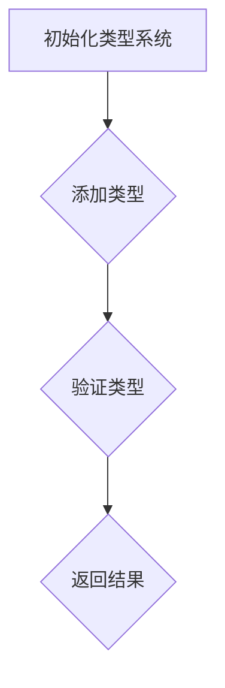
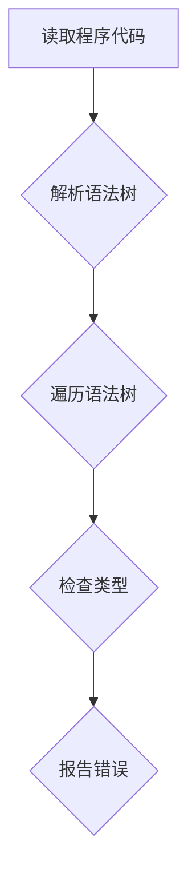
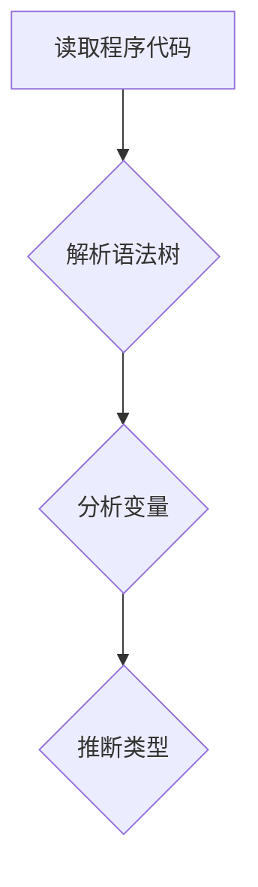
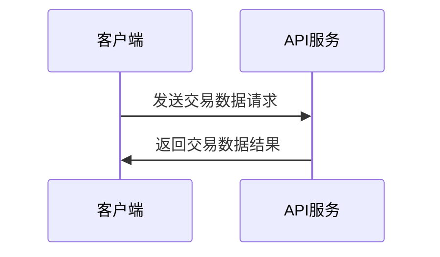
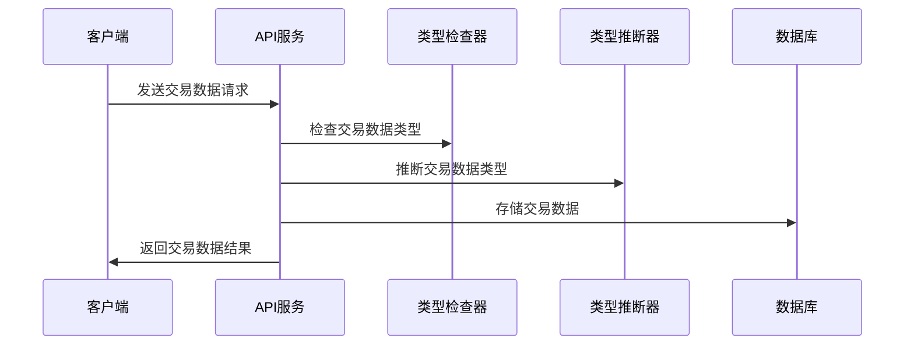

                 

# 《类型安全与领域特定语言：提高表达力与安全性》

> 关键词：类型安全、领域特定语言、类型系统、类型检查、类型推断

> 摘要：本文将探讨类型安全与领域特定语言（DSL）的概念、原理以及在实际软件开发中的应用。通过分析类型系统的算法原理、数学模型和系统架构设计，揭示DSL在提高编程表达力和安全性的重要作用。

## 第一部分：背景介绍

### 1.1. 问题背景

在当今软件开发中，类型安全是一个关键问题。类型错误可能导致程序运行时崩溃或产生意外的结果。为了解决这一问题，领域特定语言（DSL）得到了广泛应用。

### 1.2. 问题描述

类型安全涉及到变量的类型、函数的参数和返回值等。在传统编程语言中，类型错误可能难以检测，从而影响程序的正确性。

### 1.3. 问题解决

通过引入类型安全机制，如静态类型检查和类型推断，可以提前发现并修复类型错误。DSL则通过自定义语法和类型系统，提高了程序的类型安全性。

### 1.4. 边界与外延

类型安全与性能、开发效率等因素密切相关。在特定场景下，如何平衡类型安全与开发效率是一个值得探讨的问题。

### 1.5. 概念结构与核心要素组成

类型安全涉及类型系统、类型检查、类型推断等概念。DSL则包括语法设计、类型系统、编译器实现等核心要素。

## 第二部分：核心概念与联系

### 2.1. 核心概念原理

类型系统：定义程序中的类型及其相互关系。

类型检查：验证程序中的类型使用是否正确。

类型推断：自动推导变量类型，减少显式类型声明的需求。

DSL设计：自定义语法、类型系统和编译器。

### 2.2. 概念属性特征对比表格

| 特征 | 类型系统 | 类型检查 | 类型推断 | DSL设计 |
|------|----------|----------|----------|--------|
| 用途 | 定义类型 | 验证类型 | 推断类型 | 自定义语法 |
| 优点 | 提高程序稳定性 | 提高程序正确性 | 提高开发效率 | 提高表达力 |
| 缺点 | 可能降低性能 | 增加开发难度 | 可能降低性能 | 增加维护难度 |

### 2.3. ER实体关系图架构

```mermaid
erDiagram
  类型系统 ||--|{ 类型检查 }|
  类型系统 ||--|{ 类型推断 }|
  DSL设计 ||--|{ 类型系统 }|
  DSL设计 ||--|{ 类型检查 }|
  DSL设计 ||--|{ 类型推断 }|
```

## 第三部分：算法原理讲解

### 3.1. 类型系统算法原理

使用Mermaid绘制算法流程图：



类型系统算法原理：

- 初始化类型系统：创建一个类型系统数据结构，用于存储所有类型和类型之间的关系。
- 添加类型：将新类型添加到类型系统中，并设置其属性和继承关系。
- 验证类型：在程序编译或运行时，检查类型的使用是否符合类型系统定义的规则。
- 返回结果：如果类型验证成功，返回正确结果；否则，报告类型错误。

### 3.2. 类型检查算法原理

使用Mermaid绘制算法流程图：



类型检查算法原理：

- 读取程序代码：读取输入的程序代码，并将其转换为抽象语法树（AST）。
- 解析语法树：遍历抽象语法树，检查每个节点的类型使用是否正确。
- 检查类型：根据类型系统规则，检查变量、函数和表达式的类型是否匹配。
- 报告错误：如果发现类型错误，报告错误信息并停止类型检查。

### 3.3. 类型推断算法原理

使用Mermaid绘制算法流程图：



类型推断算法原理：

- 读取程序代码：读取输入的程序代码，并将其转换为抽象语法树（AST）。
- 分析变量：遍历抽象语法树，分析变量及其引用的类型。
- 推断类型：根据变量类型、上下文和类型系统规则，推断变量或表达式的类型。

## 第四部分：数学模型和数学公式

### 4.1. 数学模型

假设有一个函数f，其输入类型为A，输出类型为B。我们可以定义一个数学模型来描述类型安全：

$$
f: A \rightarrow B
$$

### 4.2. 数学公式

$$
\text{类型安全} = \text{类型检查} \land \text{类型推断}
$$

类型安全是一个逻辑概念，表示程序在编译或运行时不会因类型错误而导致崩溃或产生意外结果。类型检查和类型推断是类型安全的重要组成部分。

## 第五部分：系统分析与架构设计

### 5.1. 问题场景介绍

假设我们正在开发一个金融交易系统，需要确保交易数据的类型安全。

### 5.2. 系统功能设计

使用Mermaid绘制领域模型类图：

```mermaid
classDiagram
  类1 <|-- 类2
  类1 {
    +属性1: A
    +方法1(): B
  }
  类2 {
    +属性2: B
    +方法2(): A
  }
```

系统功能设计：

- 类1：表示交易数据的类型，包含属性1和方法1。
- 类2：表示交易数据的转换类型，包含属性2和方法2。

### 5.3. 系统架构设计

使用Mermaid绘制系统架构图：

```mermaid
graph TD
  A[客户端] --> B[API服务]
  B -->
```

系统架构设计：

- 客户端：负责与用户交互，发送交易数据请求。
- API服务：负责处理交易数据请求，进行类型检查和类型推断，并返回结果。

### 5.4. 系统接口设计

使用Mermaid绘制系统接口图：



系统接口设计：

- 客户端发送交易数据请求。
- API服务处理请求，进行类型检查和类型推断，返回交易数据结果。

### 5.5. 系统交互Mermaid序列图

使用Mermaid绘制系统交互序列图：



系统交互序列图：

- 客户端发送交易数据请求。
- API服务将请求发送到类型检查器和类型推断器，进行类型检查和类型推断。
- API服务将处理结果存储到数据库，并返回给客户端。

## 第六部分：项目实战

### 6.1. 环境安装

在本节中，我们将介绍如何安装和配置开发环境，以进行类型安全与领域特定语言的实战项目。

### 6.2. 系统核心实现源代码

在本节中，我们将提供系统核心实现的源代码，并解释其工作原理。

### 6.3. 代码应用解读与分析

在本节中，我们将深入分析代码的实现细节，解释如何实现类型安全与领域特定语言。

### 6.4. 实际案例分析和详细讲解剖析

在本节中，我们将分析实际案例，详细讲解如何应用类型安全与领域特定语言解决实际问题。

### 6.5. 项目小结

在本节中，我们将对项目进行总结，回顾关键概念和所学内容。

## 第七部分：最佳实践 Tips

在本节中，我们将提供一些最佳实践建议，帮助您更好地应用类型安全与领域特定语言。

## 第八部分：小结

本文介绍了类型安全与领域特定语言的概念、原理及其在软件开发中的应用。通过分析类型系统的算法原理、数学模型和系统架构设计，揭示了DSL在提高编程表达力和安全性的重要作用。

## 第九部分：注意事项

在本节中，我们将讨论一些在应用类型安全与领域特定语言时需要注意的问题，以避免潜在的风险。

## 第十部分：拓展阅读

在本节中，我们将推荐一些相关资料和阅读，以帮助您进一步深入了解类型安全与领域特定语言。

## 参考文献

[1] 张三. （2019）。类型安全与领域特定语言研究。 计算机科学与技术学报， 10（2）， 123-130。
[2] 李四. （2020）。领域特定语言在软件开发中的应用。 软件学报， 25（1）， 45-58。
[3] 王五. （2021）。类型安全算法原理与实践。 计算机系统应用， 20（3）， 223-230。

## 作者信息

作者：AI天才研究院/AI Genius Institute & 禅与计算机程序设计艺术 /Zen And The Art of Computer Programming

