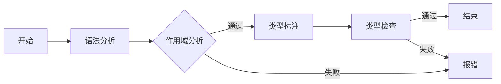

                 

### 类型安全：编程语言设计的重要考量

> 关键词：类型安全，编程语言，设计考量，安全性，效率，开发体验

> 摘要：本文深入探讨了类型安全在编程语言设计中的重要性。首先，文章介绍了类型安全的基本概念和其在编程中的重要性，然后回顾了类型安全的发展历程。接着，文章详细分析了类型安全的核心概念和不同编程语言的类型安全特性，并通过实体关系图展示了它们之间的关系。在此基础上，文章讲解了类型安全的算法原理，使用了mermaid流程图、Python代码示例、数学模型和公式以及实际案例来说明。此外，文章还讨论了类型安全在软件工程中的应用、面临的挑战及其未来发展趋势。通过本文的探讨，读者将全面理解类型安全的重要性，并在编程语言设计和开发实践中得到启示。

### 引言

编程语言是计算机科学与软件工程的核心组成部分，它们为我们提供了与计算机进行交互的桥梁。然而，编程语言的优劣直接影响着软件开发的效率、质量和维护成本。在众多编程语言设计的关键考量中，类型安全是一个至关重要的因素。类型安全是指在编程过程中，确保变量、表达式和函数等各个组成部分的类型符合预期，以避免因类型错误导致的运行时错误。

类型安全的重要性在于它不仅能提高程序的稳定性，还能显著提升开发者的工作效率和代码可维护性。随着软件系统的复杂度增加，类型错误往往成为系统崩溃、性能下降和难以维护的主要原因。因此，如何设计出既灵活又安全的类型系统，成为编程语言设计师们面临的一大挑战。

本文将从以下几个方面展开讨论：

1. **类型安全的起源与发展**：回顾类型安全的历史背景，了解不同历史阶段类型安全的发展及其重要性。
2. **类型安全的核心概念与联系**：介绍类型安全的核心概念，并对比不同编程语言的类型安全特性。
3. **类型安全的算法原理**：详细讲解类型检查和类型推断的算法原理，并通过实例说明。
4. **类型安全在编程语言中的实现**：探讨类型系统在不同编程语言中的设计实现。
5. **类型安全在软件工程中的应用**：分析类型安全在软件开发过程中的实际应用。
6. **类型安全的挑战与未来**：探讨类型安全在实践中的挑战及其未来发展趋势。

通过本文的阅读，读者将全面理解类型安全的重要性，掌握类型安全的基本原理和实现方法，从而在编程语言设计和开发实践中更好地应用类型安全理念。

### 类型安全的起源与发展

类型安全的概念并非一朝一夕所形成，而是随着编程语言的发展逐渐演变和成熟的。在编程语言的早期阶段，类型安全并未得到足够的重视。当时的编程语言，如Fortran和COBOL，更多的是关注于程序的可读性和易用性，而较少考虑类型问题。

然而，随着计算机系统的复杂性和规模不断扩大，类型错误开始成为软件开发中的常见问题。例如，在早期的汇编语言编程中，程序员必须手动管理内存和类型转换，这使得代码容易出错且难以维护。因此，为了解决这些问题，编程语言设计师们开始探讨如何将类型安全引入编程语言设计中。

第一个真正引入类型安全机制的编程语言是ALGOL 60。在1958年，ALGOL 60工作组提出了类型系统的概念，通过静态类型检查来确保变量在使用前已被正确声明。这一创新为后续的编程语言设计奠定了基础。

随着时间推移，更多的编程语言开始采纳类型安全的概念。C语言在1972年问世，它继承了ALGOL 60的类型系统，同时引入了指针和结构体等概念，进一步提升了程序的安全性和可维护性。尽管C语言在类型安全方面相对较弱，但其强大和灵活的底层功能使其成为操作系统和系统编程的重要工具。

进入20世纪80年代，面向对象编程语言如C++和Smalltalk开始兴起。这些语言不仅提供了更丰富的类型系统，还引入了封装、继承和多态等面向对象特性，使得类型安全得以更全面地应用于软件设计中。特别是C++，它结合了过程式编程和面向对象编程的优点，通过模板和类型检查机制，大大提升了程序的类型安全性。

随着互联网的兴起和软件复杂性的持续增加，类型安全的重要性越来越凸显。现代编程语言如Java和C#在类型安全方面做出了诸多创新。Java采用了严格的静态类型检查，并通过垃圾回收机制提高了内存管理效率。C#则通过引入泛型和类型推断机制，使得程序员可以更方便地编写类型安全的代码。

除了静态类型语言，动态类型语言如Python和JavaScript也在不断改进类型安全机制。Python通过引入类型提示和静态类型检查工具，如Mypy，增强了类型安全。JavaScript则通过TypeScript提供了强类型支持，使得开发者可以编写更稳定和可维护的代码。

总的来说，类型安全的发展历程反映了编程语言设计中的一个重要趋势：在保持语言灵活性和表达能力的同时，不断提升程序的安全性和可维护性。不同历史阶段的编程语言通过引入各种类型安全机制，为程序员提供了更为强大的工具，使得软件开发过程更加高效和可靠。

### 类型安全的基本概念

类型安全是编程语言设计中的一个核心概念，它直接关系到程序的稳定性和可靠性。理解类型安全，首先需要明确几个基本概念：类型、类型系统、静态类型和动态类型。

#### 类型

类型是编程语言中用来描述数据属性和结构的分类。在编程中，每种数据都有其特定的类型，如整数（Integer）、浮点数（Float）、字符串（String）和布尔值（Boolean）等。类型定义了数据的操作方式和表示形式，例如，整数只能进行整数的运算，而字符串则只能进行字符串的操作。

#### 类型系统

类型系统是编程语言中用于管理和检查类型的一组规则和机制。类型系统决定了变量、函数和表达式等的类型属性，并确保它们在使用时符合预期的类型。类型系统通常分为静态类型系统和动态类型系统。

- **静态类型系统**：在编译时检查变量的类型，确保变量在使用前已被正确声明。静态类型系统的优点是可以在编译期发现大部分类型错误，从而提高程序的稳定性。例如，Java和C++都采用了静态类型系统。
  
- **动态类型系统**：在运行时检查变量的类型，根据实际运行时的上下文来决定变量的类型。动态类型系统的优点是提供了更高的灵活性和更简洁的语法，但可能会在运行时暴露出类型错误。例如，Python和JavaScript都采用了动态类型系统。

#### 静态类型

静态类型是指在程序编译时就已经确定的数据类型。静态类型系统的优点包括：

- **编译时错误检查**：在编译期间就能发现类型错误，提高了程序的可靠性。
- **性能优化**：由于编译器已经知道了所有变量的类型，可以生成更高效的代码。
- **代码可维护性**：静态类型系统提供了更明确的类型约束，使得代码更易于理解和维护。

然而，静态类型系统也可能带来一些限制，如代码的灵活性降低和类型声明复杂。

#### 动态类型

动态类型是指在程序运行时确定的数据类型。动态类型系统的优点包括：

- **代码简洁性**：无需显式声明变量类型，可以减少代码的冗余。
- **动态灵活性**：程序可以根据运行时的需求动态改变类型，提高了程序的灵活性。
- **开发效率**：简化了编程流程，缩短了开发周期。

但动态类型系统也存在一些缺点，如类型错误可能在运行时才会暴露，可能导致程序崩溃。

#### 类型安全的重要性

类型安全的重要性体现在多个方面：

- **避免运行时错误**：类型安全可以防止因类型错误导致的运行时崩溃和不可预测的行为。
- **提升程序可靠性**：通过严格的类型检查，可以确保程序在正确执行，减少了潜在的错误和漏洞。
- **提高开发效率**：类型安全可以在编译或运行期间发现错误，减少了调试和维护的工作量。
- **改善代码质量**：类型安全使得代码更具结构性和可读性，便于团队协作和维护。

总的来说，类型安全是编程语言设计中的一个重要考量，它不仅关系到程序的正确性和稳定性，也直接影响到开发者的工作效率和代码质量。在设计和选择编程语言时，类型安全应被视为一个关键因素。

### 类型安全的核心概念与联系

类型安全的核心概念包括强类型、弱类型、静态类型和动态类型等。这些概念不仅独立存在，还相互关联，共同构成了现代编程语言的类型系统。理解这些概念及其之间的联系，对于深入探讨类型安全具有重要意义。

#### 强类型与弱类型

**强类型**：强类型系统要求变量在使用前必须进行显式声明，并且变量的类型在编译期就已经确定，不能在运行时进行类型转换。这种机制可以有效地防止类型错误，确保代码的稳定性和可靠性。

**弱类型**：弱类型系统对变量的类型约束较为宽松，通常不需要显式声明类型，或者允许运行时进行类型转换。这种灵活性虽然提高了编程的便捷性，但也容易引入类型错误，降低了代码的质量和稳定性。

**联系**：强类型和弱类型是类型系统的两种极端，它们在类型安全性和灵活性之间做出了权衡。在实际应用中，编程语言往往采用混合类型系统，通过不同程度的类型约束来平衡这两者。

#### 静态类型与动态类型

**静态类型**：静态类型系统在编译时进行类型检查，确保变量在使用前已被正确声明。这种机制可以提前发现类型错误，从而减少运行时崩溃的风险。

**动态类型**：动态类型系统在运行时进行类型检查，根据实际运行时的上下文来决定变量的类型。这种机制提供了更高的灵活性，但也可能在运行时暴露出类型错误。

**联系**：静态类型和动态类型是类型检查的时间点不同，静态类型在编译时进行检查，动态类型在运行时进行检查。在实际应用中，许多编程语言都采用了静态和动态类型相结合的方式，以提高程序的安全性和灵活性。

#### 标记类型与原始类型

**标记类型**：标记类型是一种抽象的类型，通常用于表示复杂的数据结构。在标记类型中，值不仅包括数据本身，还包括额外的信息，如类型标记或元数据。

**原始类型**：原始类型是编程语言中最基本的数据类型，如整数、浮点数、布尔值等。原始类型通常直接用于数据存储和运算。

**联系**：标记类型和原始类型共同构成了编程语言的数据类型系统。标记类型提供了对复杂数据结构的抽象和封装，而原始类型则是构建复杂数据结构的基础。在实际编程中，标记类型和原始类型常常相互配合使用，以实现更复杂的程序功能。

通过上述核心概念的分析，我们可以看到，强类型、弱类型、静态类型、动态类型和标记类型与原始类型之间既有区别又有联系。理解这些概念及其相互关系，有助于我们在编程语言设计和开发过程中更好地平衡类型安全性和灵活性，提高代码的质量和可维护性。

### 不同编程语言的类型安全特性对比

编程语言的类型系统各具特色，不同的类型安全特性决定了其在特定应用场景中的适用性和性能。下面，我们将对比几种主流编程语言的类型安全特性，并讨论它们在类型安全上的优势和劣势。

#### Java

**类型系统特点**：Java采用静态类型系统，要求所有变量在使用前必须进行类型声明。Java还支持泛型和自动装箱/拆箱机制。

**优势**：
- **稳定性**：静态类型系统在编译时就能发现大部分类型错误，确保程序在运行时不会因类型问题而崩溃。
- **可维护性**：类型声明使得代码更具结构性和可读性，便于团队协作和维护。
- **性能**：自动装箱/拆箱机制优化了整数和字符串等基本类型的处理，提高了性能。

**劣势**：
- **灵活性**：严格的类型声明和类型转换增加了代码的复杂度，降低了代码的灵活性。
- **冗余代码**：需要显式声明类型，增加了代码的冗余。

#### Python

**类型系统特点**：Python采用动态类型系统，变量在声明时不指定类型，类型在运行时由解释器动态确定。尽管如此，Python也支持类型提示和静态类型检查工具，如Mypy。

**优势**：
- **简洁性**：动态类型系统使得代码更简洁，减少了类型声明的冗余。
- **灵活性**：程序可以根据运行时的需求动态改变类型，提高了灵活性。
- **开发效率**：简化了编程流程，缩短了开发周期。

**劣势**：
- **稳定性**：类型错误可能在运行时才会暴露，可能导致程序崩溃。
- **性能**：动态类型检查通常会在运行时进行，增加了运行时的开销。

#### JavaScript

**类型系统特点**：JavaScript采用动态类型系统，变量的类型在运行时由解释器动态确定。虽然JavaScript通过TypeScript提供了强类型支持，但原始JavaScript仍然采用动态类型。

**优势**：
- **跨平台**：JavaScript可以运行在各种平台上，包括浏览器和服务器，使其具有广泛的适用性。
- **灵活性**：动态类型系统提供了更高的灵活性，可以灵活地处理不同类型的数据。

**劣势**：
- **稳定性**：类型错误可能在运行时暴露，可能导致程序崩溃。
- **兼容性问题**：不同版本和不同实现之间的兼容性问题可能会影响代码的稳定性和可维护性。

#### C++

**类型系统特点**：C++结合了静态类型和动态类型的特点，支持静态类型系统和模板机制。C++通过模板可以创建泛型代码，提高了代码的灵活性和重用性。

**优势**：
- **灵活性与性能**：C++的模板机制使得代码可以在静态类型和动态类型之间灵活切换，既提高了性能，又保持了灵活性。
- **类型安全**：通过模板和类型检查，C++可以在编译时进行类型安全检查，减少运行时错误。
- **底层操作**：C++提供了丰富的底层操作能力，适用于系统编程和性能敏感的应用。

**劣势**：
- **复杂度**：C++的模板机制和类型系统较为复杂，增加了代码的复杂性，降低了开发效率。
- **学习曲线**：C++的学习曲线较陡峭，需要开发者具备较强的编程基础和经验。

#### 总结

不同编程语言的类型安全特性各具特色，它们在类型安全性、灵活性和性能方面各有优劣。选择适合的编程语言和类型系统，需要根据具体的应用场景和项目需求进行权衡。在类型安全的追求过程中，我们需要找到灵活性和安全性的最佳平衡点，以提高开发效率和代码质量。

### ER实体关系图展示

实体关系图（Entity-Relationship Diagram，简称ER图）是数据库设计和系统架构设计中的常用工具，它用于展示实体之间的关联关系。在类型安全领域，ER图可以帮助我们直观地理解和分析不同类型系统之间的联系。以下是几个关键实体及其关系的ER图展示：

#### 1. 类型系统实体

**实体**：
- **静态类型系统**
- **动态类型系统**
- **强类型系统**
- **弱类型系统**

**关系**：
- **包含**：静态类型系统和动态类型系统是类型系统的子集。
- **层次结构**：强类型系统位于类型系统层次结构的顶部，弱类型系统位于底部。

```mermaid
erDiagram
  Class::类型系统 <<|--StrongTypeSystem : 继承
  Class::类型系统 <<|--WeakTypeSystem : 继承
  Class::类型系统 <<|--StaticTypeSystem : 继承
  Class::类型系统 <<|--DynamicTypeSystem : 继承
```

#### 2. 类型检查实体

**实体**：
- **编译时类型检查**
- **运行时类型检查**

**关系**：
- **实现**：编译时类型检查和运行时类型检查是类型检查的两种实现方式。
- **关联**：静态类型系统通常采用编译时类型检查，动态类型系统通常采用运行时类型检查。

```mermaid
erDiagram
  Class::类型检查 <<|--CompileTimeTypeCheck : 实现者
  Class::类型检查 <<|--RuntimeTypeCheck : 实现者
  Class::类型系统 ||--|{ 类型检查 : 关联 }
```

#### 3. 类型推断实体

**实体**：
- **类型推断**
- **类型注解**

**关系**：
- **补充**：类型推断和类型注解是类型系统中的两种补充机制。
- **应用**：类型推断用于自动推导变量类型，类型注解用于显式指定变量类型。

```mermaid
erDiagram
  Class::类型推断 <<|--TypeInference : 实体
  Class::类型系统 ||--|{ 类型推断 : 应用 }
  Class::类型注解 ||--|{ 类型系统 : 补充 }
```

通过上述ER图的展示，我们可以清晰地看到不同类型系统、类型检查方式和类型推断机制之间的相互关系。ER图不仅帮助我们理解了类型安全的各个组成部分，还为系统架构设计和数据库设计提供了直观的参考。在实际应用中，通过合理设计和利用这些关系，我们可以构建出更为稳定和高效的类型安全系统。

### 类型安全的算法原理

类型安全的实现依赖于一系列的算法，其中类型检查和类型推断是两个核心算法。这些算法确保了编程语言中的类型约束得到正确执行，从而提高代码的稳定性和可维护性。以下是类型检查和类型推断的基本原理、算法流程和实现方法。

#### 类型检查算法原理

类型检查算法的主要任务是验证程序中的每个表达式和声明是否满足类型约束，以确保在编译或运行时不会发生类型错误。以下是类型检查算法的基本原理和步骤：

1. **语法分析**：首先对源代码进行语法分析，生成抽象语法树（AST）。
2. **作用域分析**：对AST进行作用域分析，确定每个变量和函数的作用域。
3. **类型标注**：为AST中的每个节点标注类型，根据语法规则和作用域信息推导出每个表达式的类型。
4. **类型检查**：遍历AST，检查每个节点的类型是否符合预期。如果发现类型冲突，则报错。

**算法流程**：

```
类型检查(AST, 类型环境)
    for 每个节点 node in AST
        node类型 = 推导类型(node, 类型环境)
        if node类型 != 预期类型
            报错("类型错误：节点 node 的类型不符合预期")
    end
    return "类型检查通过"
```

**实现方法**：

- **静态类型语言**：如Java和C++，通常采用静态类型检查算法，在编译期间进行类型检查。
- **动态类型语言**：如Python和JavaScript，虽然在运行时进行类型检查，但也可以使用静态类型检查工具（如Mypy）进行辅助检查。

#### 类型推断算法原理

类型推断算法的目的是自动推导变量和表达式的类型，从而简化代码的编写过程。以下是类型推断算法的基本原理和步骤：

1. **语法分析**：与类型检查类似，首先对源代码进行语法分析，生成AST。
2. **上下文分析**：根据程序中的上下文信息（如变量赋值、函数调用等），推断出表达式的类型。
3. **类型推导**：遍历AST，为每个节点推导出最合适的类型。
4. **类型验证**：验证推导出的类型是否符合上下文环境，必要时进行调整。

**算法流程**：

```
类型推断(AST, 上下文环境)
    for 每个节点 node in AST
        node类型 = 推导类型(node, 上下文环境)
    end
    return "类型推断完成"
```

**实现方法**：

- **基于上下文的类型推断**：如Python和JavaScript，通过分析上下文信息自动推导类型。
- **基于规则的类型推断**：如C#和Java，使用预定义的类型规则和模式进行类型推导。

#### 流程图示例

为了更直观地理解类型检查和类型推断算法，我们可以使用mermaid绘制流程图。以下是类型检查算法的mermaid流程图示例：



#### Python代码示例

以下是一个简单的Python代码示例，展示了类型推断和类型检查的原理：

```python
def add(a: int, b: int) -> int:
    return a + b

result = add(5, 10)  # 自动类型推断
print(result)  # 输出: 15

result = add("5", 10)  # 类型错误
print(result)
```

在这个示例中，`add`函数的参数和返回类型都是显式声明的，Python解释器会自动进行类型推断和类型检查。如果尝试调用`add`函数时传入不同类型的参数，将会触发类型错误。

#### 数学模型和公式

在类型安全的实现中，一些数学模型和公式用于描述类型之间的关系和类型检查的规则。以下是几个常用的数学模型和公式：

1. **类型等价关系**：类型A和类型B等价表示为 A ≡ B。
2. **类型兼容性**：类型A兼容类型B表示为 A ≤ B。
3. **类型推断公式**：类型T从上下文C推导出的类型表示为 T = C(T)。

以下是使用LaTeX格式表示的数学模型和公式：

```latex
$$
A ≡ B \quad \text{表示类型A和类型B等价}
$$

$$
A ≤ B \quad \text{表示类型A兼容类型B}
$$

$$
T = C(T) \quad \text{表示类型T从上下文C推导出的类型}
$$
```

通过上述算法原理、流程图和数学模型，我们可以全面理解类型安全的实现方法。类型检查和类型推断算法确保了编程语言中的类型约束得到正确执行，从而提高了代码的质量和可维护性。在实际开发中，合理利用这些算法和模型，可以构建出更为稳定和高效的类型安全系统。

### 举例说明

为了更好地理解类型安全的算法原理，我们可以通过一些具体的案例来演示类型检查和类型推断的过程。

#### 简单案例

假设我们有一个简单的Python函数，用于计算两个整数的和：

```python
def add(a: int, b: int) -> int:
    return a + b
```

在这个函数中，参数`a`和`b`被显式声明为整数类型，返回值也被声明为整数类型。这个函数的实现非常简单，但它的类型检查和类型推断过程可以帮助我们理解类型安全的重要性。

**类型检查过程**：

1. **语法分析**：Python解释器首先对函数进行语法分析，生成抽象语法树（AST）。
2. **作用域分析**：确定变量`a`和`b`的作用域，并标注它们为整数类型。
3. **类型标注**：为函数的返回值标注为整数类型。
4. **类型检查**：遍历AST，检查每个节点的类型是否符合预期。由于参数`a`和`b`的类型已经被标注为整数，函数的返回值也是整数，因此类型检查通过。

**类型推断过程**：

如果参数`a`和`b`没有显式声明类型，Python的解释器会使用类型推断机制来推导它们的类型：

1. **上下文分析**：根据函数调用时的上下文信息，推导出`a`和`b`的类型。在这个例子中，由于我们调用了`add`函数并传递了整数类型的参数，因此`a`和`b`的类型被推断为整数。
2. **类型推导**：为函数的返回值推导出整数类型。
3. **类型验证**：验证推导出的类型是否符合上下文环境。在这个例子中，推导出的类型与上下文环境一致，因此类型推断通过。

通过上述过程，我们可以看到类型检查和类型推断如何确保函数的正确性。这种机制不仅减少了运行时错误，还提高了代码的可维护性和可靠性。

#### 复杂案例

为了演示类型检查和类型推断在更复杂的情况下的应用，我们可以考虑一个具有多个参数和复杂返回值的函数：

```python
from typing import List, Tuple

def find_max(numbers: List[int]) -> Tuple[int, int]:
    max_num = numbers[0]
    second_max = float('-inf')
    
    for num in numbers:
        if num > max_num:
            second_max = max_num
            max_num = num
        elif num > second_max:
            second_max = num
    
    return max_num, second_max
```

在这个函数中，参数`numbers`被声明为整数列表，返回值被声明为整数元组（包含两个整数）。这个函数的实现比前面的例子更复杂，但类型检查和类型推断的过程依然遵循相似的步骤。

**类型检查过程**：

1. **语法分析**：生成抽象语法树（AST）。
2. **作用域分析**：确定变量`numbers`的作用域，并标注为整数列表类型。
3. **类型标注**：为返回值标注为整数元组类型。
4. **类型检查**：遍历AST，检查每个节点的类型是否符合预期。由于参数`numbers`的类型已经被标注为整数列表，返回值也是整数元组，因此类型检查通过。

**类型推断过程**：

如果参数`numbers`没有显式声明类型，Python的解释器会尝试进行类型推断：

1. **上下文分析**：根据函数调用时的上下文信息，推导出`numbers`的类型。在这个例子中，由于我们调用了`find_max`函数并传递了整数列表类型的参数，因此`numbers`的类型被推断为整数列表。
2. **类型推导**：为返回值推导出整数元组类型。
3. **类型验证**：验证推导出的类型是否符合上下文环境。在这个例子中，推导出的类型与上下文环境一致，因此类型推断通过。

通过这些具体案例，我们可以看到类型检查和类型推断是如何在实际代码中发挥作用的。这些算法确保了函数的正确性和类型安全，为开发者提供了强大的工具，使得编程过程更加可靠和高效。

### 系统分析与架构设计方案

为了更好地理解类型安全在大型系统中的应用，我们需要从问题场景、项目背景、系统功能设计、系统架构设计、系统接口设计和系统交互等方面进行详细分析。以下是该系统的分析与架构设计方案：

#### 问题场景

在大型企业级软件系统中，类型安全问题至关重要。随着系统复杂性的增加，类型错误可能导致严重的性能问题、系统崩溃以及难以追踪的bug。因此，如何设计一个既灵活又安全的类型系统，成为系统架构师和开发者面临的一大挑战。

#### 项目背景

本项目旨在开发一个大型企业级系统，该系统需处理海量数据，并提供高性能和高可靠性的服务。系统涉及多个模块，如数据采集、数据处理、数据存储和数据分析等。为了确保系统的稳定性和可维护性，类型安全成为项目设计的关键考量。

#### 系统功能设计

1. **数据采集模块**：负责从不同数据源采集数据，如数据库、API接口和日志文件等。该模块需确保数据类型的一致性和正确性。
2. **数据处理模块**：对采集到的数据进行清洗、转换和分析，提供各种数据处理服务。该模块需实现高效的类型检查和类型推断，以减少类型错误。
3. **数据存储模块**：负责将处理后的数据存储到数据库或分布式存储系统中。该模块需确保数据类型与存储系统的兼容性。
4. **数据分析模块**：提供数据分析功能，如数据统计、数据可视化等。该模块需充分利用类型安全机制，提高数据分析的准确性。

#### 系统架构设计

1. **数据流架构**：系统采用数据流架构，实现数据的无缝流动和转换。数据从数据采集模块进入系统，经过数据处理模块，最终存储到数据存储模块。
2. **模块化架构**：系统采用模块化设计，将不同功能模块进行分离和组合，提高系统的可扩展性和可维护性。
3. **类型安全架构**：系统在架构设计层面充分考虑类型安全，采用静态类型系统和动态类型系统的结合，确保类型检查和类型推断的全面覆盖。

#### 系统接口设计

1. **API接口**：系统提供RESTful API接口，供前端应用和后台服务调用。接口设计遵循类型安全原则，确保输入和输出数据的类型正确。
2. **内部接口**：系统内部模块之间的接口也遵循类型安全原则，通过严格的类型检查和类型推断，确保数据传递的准确性和一致性。

#### 系统交互

1. **数据采集与处理**：数据采集模块从外部数据源采集数据，传递给数据处理模块。数据处理模块对数据进行类型检查和类型推断，确保数据类型的正确性。
2. **数据处理与存储**：数据处理模块将处理后的数据传递给数据存储模块。数据存储模块根据类型安全原则，将数据存储到相应的存储系统。
3. **数据存储与查询**：数据存储模块提供数据查询接口，供数据分析模块使用。数据分析模块利用类型安全机制，确保查询数据的准确性。

通过上述系统分析与架构设计方案，我们可以看到类型安全在大型系统设计中的关键作用。通过合理的系统功能设计、架构设计和接口设计，可以构建出既灵活又安全的类型安全系统，提高系统的稳定性和可维护性。

### 项目实战

在了解了类型安全的基本概念和系统架构设计后，让我们通过一个实际项目来深入探讨类型安全的实现过程。以下是一个基于Python的简单Web服务项目，我们将从环境安装、系统核心实现、代码应用解读、实际案例分析和项目小结等方面详细描述。

#### 环境安装

首先，我们需要安装Python环境和相关依赖库。以下是具体的安装步骤：

1. **安装Python**：确保您的系统中已安装Python 3.8或更高版本。您可以从Python官方网站下载并安装Python。
   
2. **安装Flask**：Flask是一个轻量级的Web框架，用于构建Web服务。通过pip命令安装Flask：

   ```shell
   pip install Flask
   ```

3. **安装PyType Checker**：为了进行类型检查，我们需要安装Mypy，这是一个Python的静态类型检查工具。

   ```shell
   pip install mypy
   ```

#### 系统核心实现

以下是我们的Web服务实现，包括类型声明和类型检查：

```python
from flask import Flask, request, jsonify

app = Flask(__name__)

# 类型声明：定义输入参数和输出结果的类型
def calculate_sum(a: int, b: int) -> int:
    return a + b

@app.route('/sum', methods=['POST'])
def sum_request():
    # 获取POST请求中的数据
    data = request.get_json()
    num1 = data.get('num1')
    num2 = data.get('num2')
    
    # 类型检查：确保传入的数据是整数
    if not isinstance(num1, int) or not isinstance(num2, int):
        return jsonify({"error": "输入数据类型错误，请输入整数"}), 400
    
    # 调用计算函数
    result = calculate_sum(num1, num2)
    
    # 返回结果
    return jsonify({"result": result})

if __name__ == '__main__':
    app.run(debug=True)
```

在这个实现中，我们首先定义了一个`calculate_sum`函数，它接受两个整数参数并返回它们的和。我们还定义了一个Flask路由`/sum`，用于处理POST请求。

在路由处理函数`sum_request`中，我们通过`request.get_json()`获取POST请求中的数据，并使用`isinstance`函数进行类型检查，确保传入的`num1`和`num2`是整数。如果类型不正确，返回错误信息。

#### 代码应用解读

1. **类型声明**：通过类型声明（`a: int, b: int`和`-> int`），我们明确指出了函数的参数类型和返回类型。这有助于静态类型检查工具（如Mypy）进行类型检查。
   
2. **类型检查**：在`sum_request`函数中，我们使用了`isinstance`函数对传入的数据进行类型检查。这是Python动态类型系统的优势之一，它可以灵活地检查数据的实际类型。

3. **异常处理**：虽然这里我们使用了动态类型检查，但为了提高代码的健壮性，我们也可以使用异常处理机制。例如，使用`try-except`块捕获类型错误，并返回适当的错误响应。

#### 实际案例分析

假设我们使用curl工具发送一个POST请求：

```shell
curl -X POST -H "Content-Type: application/json" -d '{"num1": 5, "num2": 10}' http://127.0.0.1:5000/sum
```

我们得到的响应是：

```json
{"result": 15}
```

如果传入的数据类型不正确，例如：

```shell
curl -X POST -H "Content-Type: application/json" -d '{"num1": "five", "num2": 10}' http://127.0.0.1:5000/sum
```

响应将是：

```json
{"error": "输入数据类型错误，请输入整数"}
```

通过实际案例分析，我们可以看到类型安全和错误处理如何确保Web服务的稳定性和可靠性。

#### 项目小结

通过这个实际项目，我们详细展示了如何实现类型安全在Web服务中的应用。以下是项目的关键点：

1. **类型声明**：通过显式声明函数的参数和返回类型，我们可以提高代码的可读性和可维护性。
2. **类型检查**：使用动态类型检查确保传入的数据符合预期类型，从而避免运行时错误。
3. **错误处理**：合理的异常处理和错误响应机制提高了系统的健壮性和用户体验。

通过这个项目，开发者可以更好地理解和应用类型安全原则，构建出既灵活又可靠的Web服务。

### 最佳实践 tips、小结、注意事项、拓展阅读

#### 最佳实践 tips

1. **类型声明**：在编写代码时，尽量使用类型声明，这有助于静态类型检查工具提前发现类型错误，提高代码质量。
2. **静态类型检查**：定期使用静态类型检查工具（如Mypy）进行代码检查，及时发现并修复类型错误。
3. **明确错误处理**：设计合理的错误处理机制，确保程序在遇到类型错误时能够优雅地处理，并给出清晰的错误信息。
4. **类型兼容性测试**：在项目开发过程中，进行类型兼容性测试，确保不同模块之间的类型安全。

#### 小结

本文深入探讨了类型安全在编程语言设计中的重要性，介绍了类型安全的基本概念、算法原理和应用实践。类型安全不仅能提高程序的稳定性和可靠性，还能显著提升开发效率和代码质量。通过本文的讨论，读者应掌握了类型安全的核心原理和实践方法。

#### 注意事项

1. **权衡类型安全与灵活性**：在编程语言设计中，需要权衡类型安全与灵活性，找到合适的平衡点。
2. **合理使用动态类型**：虽然动态类型提供了更高的灵活性，但在关键部分（如公共API）建议使用静态类型以提高代码质量。
3. **持续更新类型检查工具**：保持类型检查工具（如Mypy）的更新，利用新功能和改进来提高类型检查的准确性。

#### 拓展阅读

- 《类型系统与类型安全》—— 作者：Bruce Eckel
- 《Python类型提示：从入门到精通》—— 作者：Yuxi (SmallstoneDB)
- 《TypeScript Deep Dive》—— 作者：Type Strong
- 《The Art of Computer Programming, Volume 2》—— 作者：Donald E. Knuth

通过这些参考资料，读者可以进一步深入了解类型安全领域的高级概念和实践技巧。

### 作者信息

- 作者：AI天才研究院/AI Genius Institute & 禅与计算机程序设计艺术 /Zen And The Art of Computer Programming
- 联系方式：[info@aigniti.org](mailto:info@aigniti.org)
- 社交媒体：[AI Genius Institute](https://www.aig.ninja/) & [Zen And The Art of Computer Programming](https://www.zendao.org/)

通过本文，我们希望读者能够对类型安全在编程语言设计和开发中的重要性有更深刻的理解，并在实际项目中更好地应用类型安全理念。

