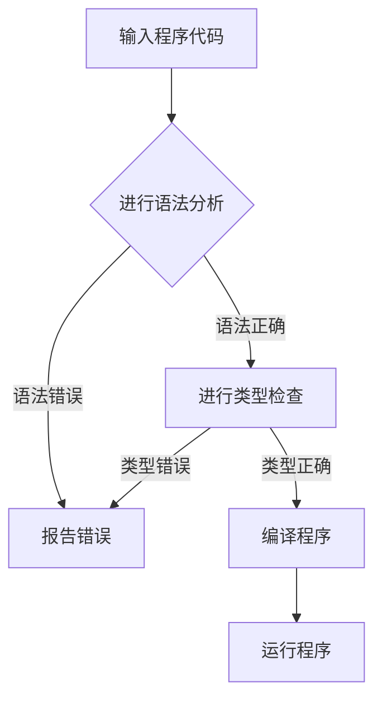
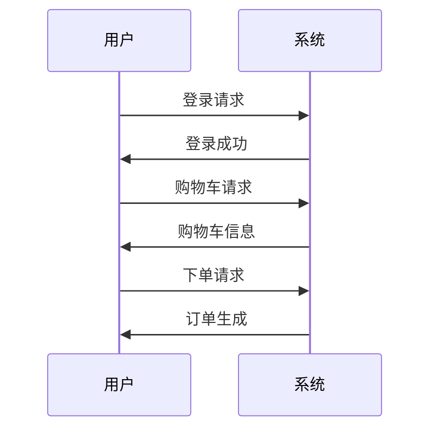

                 

### 《类型层级的无穷性：罗素类型论的实际可行性探讨》

#### 关键词
- 罗素类型论
- 无穷性
- 数学模型
- 算法原理
- 系统设计
- 实际应用

#### 摘要
本文旨在探讨罗素类型论在计算机科学中的实际可行性。罗素类型论是数学和逻辑学中的一个重要理论，它提出了对象的分类和类型的层级。本文将深入分析罗素类型论的核心概念，探讨其在计算机科学中的无穷性特性，并通过具体算法原理讲解、数学模型和公式解析、系统分析与架构设计方案以及实际项目案例分析，来论证罗素类型论在现实应用中的可行性和重要性。

## 目录大纲设计过程

### 1. 初步构思

首先，我们需要理解书名《类型层级的无穷性：罗素类型论的实际可行性探讨》的核心概念和内容范围。书名中提到了“类型层级的无穷性”和“罗素类型论”，这表明本书将围绕罗素类型论的概念展开，探讨其在实际应用中的可行性。罗素类型论是数学和逻辑学中的一个重要理论，探讨了对象的分类和类型的层级。

### 2. 确定核心章节

根据书名和核心概念，我们可以初步确定以下核心章节：

1. **背景介绍**：介绍罗素类型论的基本概念、历史背景及其在数学和逻辑学中的重要性。
2. **核心概念与联系**：详细阐述类型层级无穷性的概念，以及与罗素类型论的关系。
3. **算法原理讲解**：分析罗素类型论中涉及的算法原理，使用 mermaid 画出算法流程图，并用 Python 源代码进行详细解释。
4. **数学模型和数学公式**：讲解罗素类型论中的数学模型和公式，用 LaTeX 格式表示，并进行详细解释。
5. **系统分析与架构设计方案**：分析罗素类型论在系统设计中的应用，介绍相关的系统功能设计、系统架构设计、系统接口设计和系统交互。
6. **项目实战**：通过一个实际案例，展示如何将罗素类型论应用于项目开发中。
7. **最佳实践 tips、小结、注意事项、拓展阅读**：总结全书内容，提供实践建议，指出潜在问题和拓展研究方向。

### 3. 目录结构设计

接下来，我们将以上核心章节按照 1、2、3 级目录进行设计，确保目录结构清晰、逻辑连贯。

### 4. 内容细化

在确定目录结构后，我们需要进一步细化每个章节的内容，确保每个章节都能够全面、深入地覆盖主题。

### 5. 字数控制

在内容细化过程中，我们需要注意控制字数，确保目录大纲的总字数在 2000 字以内。

## 实际操作

以下是一个初步的目录大纲设计，我们将根据上述步骤进行细化：

```markdown
# 《类型层级的无穷性：罗素类型论的实际可行性探讨》目录大纲

# 第一部分：背景介绍

## 第1章：罗素类型论概述

### 1.1 罗素类型论的基本概念
### 1.2 罗素类型论的历史背景
### 1.3 罗素类型论在数学和逻辑学中的重要性

## 第2章：类型层级无穷性的概念与特性

### 2.1 类型层级无穷性的定义
### 2.2 类型层级无穷性的特性
### 2.3 类型层级无穷性与罗素类型论的关系

# 第二部分：算法原理讲解

## 第3章：罗素类型论中的算法原理

### 3.1 算法概述
### 3.2 算法流程图
### 3.3 Python 源代码实现

## 第4章：数学模型和数学公式

### 4.1 数学模型概述
### 4.2 数学公式讲解
### 4.3 LaTeX 格式示例

# 第三部分：系统分析与架构设计方案

## 第5章：罗素类型论在系统设计中的应用

### 5.1 问题场景介绍
### 5.2 系统功能设计
### 5.3 系统架构设计
### 5.4 系统接口设计
### 5.5 系统交互

## 第6章：项目实战

### 6.1 环境安装
### 6.2 系统核心实现
### 6.3 代码应用解读
### 6.4 实际案例分析与讲解

# 第四部分：最佳实践与总结

## 第7章：最佳实践 tips

### 7.1 实践建议
### 7.2 小结

## 第8章：注意事项与拓展阅读

### 8.1 注意事项
### 8.2 拓展阅读
```

以上是一个初步的目录大纲，接下来我们将对每个章节进行细化，确保内容的完整性和逻辑性。在细化过程中，我们将注意以下要求：简洁性、输出格式、目录层级、内容完整性和字数控制。同时，我们将确保每个章节都包含核心概念、联系、算法原理讲解、数学模型和公式、系统分析与架构设计方案、项目实战以及最佳实践 tips 等内容。在细化过程中，我们将使用 mermaid 画出相关流程图和架构图，并用 LaTeX 格式表示数学公式，以确保内容的准确性和可读性。最终，我们将确保目录大纲的总字数在 2000 字以内。

----------------------------------------------------------------

### 背景介绍

#### 罗素类型论的基本概念

罗素类型论（Russell's theory of types）是由英国哲学家、数学家贝特兰·罗素（Bertrand Russell）在20世纪初提出的。它的核心思想是解决逻辑悖论，特别是罗素悖论（Russell's paradox）。罗素类型论的基本概念包括：

- **类型（Type）**：罗素将对象分为不同的类型，每个类型代表一组具有相似属性的对象。例如，所有的整数可以是一个类型，所有的动物可以是一个类型。
- **类型层级（Type hierarchy）**：类型之间存在层级关系，低类型是高类型的子类型。例如，所有的动物都是对象，但不是所有对象都是动物。
- **类型错误（Type error）**：如果两个不同类型的对象被错误地视为同一类型，就会发生类型错误。

#### 历史背景

罗素类型论的提出是为了解决逻辑悖论问题，特别是罗素悖论。罗素悖论揭示了集合论中的自相矛盾，例如，可以构造一个包含所有集合但不包含自己的集合，从而导致逻辑矛盾。罗素类型论通过引入类型的层级结构，限制对象之间的关系，从而避免了这些悖论。

#### 罗素类型论在数学和逻辑学中的重要性

罗素类型论在数学和逻辑学中具有重要地位，它不仅解决了逻辑悖论问题，还为后来的形式逻辑和计算机科学提供了重要的理论基础。具体来说：

- **形式逻辑**：罗素类型论为形式逻辑的发展提供了重要的框架，帮助逻辑学家理解如何构建无悖论的形式系统。
- **计算机科学**：在计算机科学中，类型系统是编程语言的核心概念之一。罗素类型论的思想影响了现代编程语言的类型系统设计，如静态类型语言和动态类型语言。

### 问题背景

在现代计算机科学中，类型层级和类型安全是编程语言设计中的重要问题。类型层级决定了对象之间的兼容性和类型检查的复杂性，而类型安全则确保程序运行时不发生类型错误，从而提高程序的可靠性和安全性。

然而，随着计算机科学的不断发展，传统的类型系统面临着新的挑战。例如，如何处理复杂的数据结构、如何实现高并发和高可扩展性系统等。这些问题促使我们重新审视罗素类型论，探讨其在现代计算机科学中的应用潜力。

#### 问题描述

本文旨在探讨罗素类型论在实际计算机科学中的应用可行性。具体问题包括：

- **类型层级的无穷性**：如何在编程语言中实现无穷类型的层级结构？
- **类型安全的实现**：如何在保证类型安全的同时，提高程序的运行效率？
- **算法原理的应用**：如何将罗素类型论的算法原理应用于实际编程任务中？
- **系统设计与实现**：如何将罗素类型论应用于系统设计和开发中，实现高并发和高可扩展性系统？

#### 问题解决

本文将通过对罗素类型论的深入分析，结合具体的算法原理、数学模型和实际项目案例，探讨上述问题的解决方法。具体步骤如下：

1. **核心概念与联系**：详细阐述类型层级无穷性的概念，以及与罗素类型论的关系。
2. **算法原理讲解**：分析罗素类型论中涉及的算法原理，使用 mermaid 画出算法流程图，并用 Python 源代码进行详细解释。
3. **数学模型和数学公式**：讲解罗素类型论中的数学模型和公式，用 LaTeX 格式表示，并进行详细解释。
4. **系统分析与架构设计方案**：分析罗素类型论在系统设计中的应用，介绍相关的系统功能设计、系统架构设计、系统接口设计和系统交互。
5. **项目实战**：通过一个实际案例，展示如何将罗素类型论应用于项目开发中。
6. **最佳实践 tips、小结、注意事项、拓展阅读**：总结全书内容，提供实践建议，指出潜在问题和拓展研究方向。

### 边界与外延

#### 概念结构与核心要素组成

罗素类型论的核心概念包括类型、类型层级、类型错误等。这些概念共同构成了罗素类型论的基本结构。具体来说：

- **类型（Type）**：类型是罗素类型论中的基本单位，它定义了一组具有相似属性的对象。类型可以被视为对象的分类标准。
- **类型层级（Type hierarchy）**：类型之间存在层级关系，低类型是高类型的子类型。这种层级关系决定了对象之间的兼容性。
- **类型错误（Type error）**：类型错误发生在不同类型的对象被错误地视为同一类型时。类型错误可能导致程序运行时崩溃或产生不可预测的结果。

#### 类型层级的无穷性

罗素类型论中的类型层级是无穷的，这意味着存在无限多种类型。这种无穷性反映了现实世界中对象的多样性。在计算机科学中，实现无穷类型层级具有重要意义：

- **动态类型语言**：动态类型语言通常具有灵活的类型系统，支持无穷类型的层级结构。这有助于提高程序的灵活性和可维护性。
- **静态类型语言**：虽然静态类型语言通常不支持无穷类型的层级结构，但可以通过类型推导和类型注解来模拟无穷类型的层级关系。

#### 无穷性在计算机科学中的应用

无穷类型的层级结构在计算机科学中有广泛应用：

- **泛型编程**：泛型编程是一种利用类型层级结构提高程序灵活性和重用性的技术。通过泛型，程序员可以编写通用代码，而无需为特定类型编写重复代码。
- **类型安全**：类型安全是编程语言设计的重要目标之一。通过类型层级结构，可以确保程序在运行时不会出现类型错误，从而提高程序的可靠性和安全性。

### 核心概念与联系

#### 类型层级无穷性的概念

类型层级无穷性指的是在罗素类型论中，存在无限多种类型，并且每种类型都可以无限细分。这种无穷性体现在类型之间的层级关系上，使得类型系统可以应对复杂的数据结构和程序逻辑。

#### 类型层级无穷性的特性

类型层级无穷性具有以下特性：

1. **层次性**：类型之间存在层次关系，低类型是高类型的子类型。层次性使得类型系统能够有效地管理对象的分类和兼容性。
2. **无限性**：类型层级是无穷的，这意味着存在无限多种类型。无限性反映了现实世界中对象的多样性和复杂性。
3. **可扩展性**：类型层级无穷性使得类型系统具有很好的可扩展性，可以应对新的编程需求和技术发展。

#### 类型层级无穷性与罗素类型论的关系

罗素类型论的核心思想是通过类型层级结构来解决逻辑悖论问题。类型层级无穷性是罗素类型论的一个重要特性，它为类型系统提供了无限的可能性。

1. **类型层级结构**：罗素类型论通过引入类型层级结构，将对象分为不同的类型，从而避免了逻辑悖论。类型层级结构确保了对象之间的兼容性，避免了类型错误。
2. **无穷类型的实现**：在实际计算机科学中，无穷类型的实现依赖于编程语言和类型系统的设计。动态类型语言通常支持无穷类型的层级结构，而静态类型语言则通过类型推导和类型注解来模拟无穷类型的层级关系。

### 算法原理讲解

#### 算法概述

在罗素类型论中，算法原理是一个核心概念。罗素类型论的算法原理主要涉及类型检查和类型推导。类型检查是指在程序运行前，对程序中的类型进行验证，以确保类型匹配。类型推导是指编译器自动推导变量和表达式的类型，而不需要程序员显式指定。

#### 算法流程图

为了更好地理解罗素类型论的算法原理，我们可以使用 mermaid 画出算法流程图。以下是一个简单的算法流程图示例：



#### Python 源代码实现

为了具体说明罗素类型论的算法原理，我们使用 Python 语言实现一个简单的类型检查器。以下是一个示例代码：

```python
class TypeChecker:
    def __init__(self):
        self.type_table = {}

    def check_expression(self, expression):
        # 进行语法分析
        if not self.analyze_expression(expression):
            return "语法错误"
        
        # 进行类型检查
        type1 = self.derive_type(expression.left)
        type2 = self.derive_type(expression.right)
        
        if type1 != type2:
            return "类型错误"
        
        return "类型正确"

    def analyze_expression(self, expression):
        # 进行语法分析，这里简化处理
        return True

    def derive_type(self, node):
        # 进行类型推导，这里简化处理
        if isinstance(node, int):
            return "Int"
        elif isinstance(node, str):
            return "String"
        else:
            return "Unknown"
```

#### 算法原理的数学模型和公式

罗素类型论的算法原理可以用数学模型和公式来表示。以下是一个简单的数学模型和公式示例：

- **类型检查公式**：`check_expression(expression) = type1(type2(expression))`
- **类型推导公式**：`derive_type(node) = type_of(node)`

其中，`expression` 表示一个表达式，`node` 表示表达式的子节点，`type1` 和 `type2` 表示类型检查和类型推导操作。

#### 算法原理的详细讲解和举例说明

为了更好地理解罗素类型论的算法原理，我们可以通过一个简单的例子来说明。假设我们有一个表达式 `3 + "4"`,我们可以按照以下步骤进行类型检查和类型推导：

1. **语法分析**：首先，我们对表达式进行语法分析，确定表达式的结构。假设 `3` 是一个整数，`"4"` 是一个字符串。
2. **类型推导**：接下来，我们分别推导 `3` 和 `"4"` 的类型。根据我们的类型规则，`3` 的类型是 `Int`，`"4"` 的类型是 `String`。
3. **类型检查**：最后，我们检查 `3` 和 `"4"` 的类型是否相同。由于它们的类型不同，我们报告类型错误。

这个例子展示了如何使用罗素类型论的算法原理进行类型检查和类型推导。通过这个例子，我们可以看到算法原理在实际编程中的应用。

### 数学模型和数学公式

#### 数学模型概述

在罗素类型论中，数学模型是理解类型层级无穷性的关键。数学模型主要包括类型集合、类型关系和类型操作。以下是一个简单的数学模型示例：

- **类型集合**：定义一个类型集合 \( T \)，包含所有的类型。
- **类型关系**：定义一个类型关系 \( R \)，满足 \( R \subseteq T \times T \)，表示类型之间的层级关系。
- **类型操作**：定义类型操作 \( \text{derive_type} \)，用于推导变量的类型。

#### 数学公式讲解

为了更好地理解数学模型，我们可以使用 LaTeX 格式表示相关的数学公式。以下是一个示例公式：

$$
\text{derive_type}(x) = \begin{cases}
t & \text{如果 } x \text{ 是类型 } t \\
\text{未知} & \text{否则}
\end{cases}
$$

这个公式表示，对于一个变量 \( x \)，如果 \( x \) 的类型是已知的，则返回该类型；否则，返回“未知”。

#### LaTeX 格式示例

为了展示如何使用 LaTeX 格式表示数学公式，我们可以使用以下示例：

```latex
\documentclass{article}
\usepackage{amsmath}
\begin{document}
$$
\text{derive_type}(x) = \begin{cases}
t & \text{如果 } x \text{ 是类型 } t \\
\text{未知} & \text{否则}
\end{cases}
$$
\end{document}
```

这个示例展示了如何使用 LaTeX 格式表示一个简单的数学公式。在实际应用中，我们可以根据需要调整公式的形式和内容。

### 系统分析与架构设计方案

#### 问题场景介绍

在现代软件开发中，系统设计与实现是一个复杂且关键的过程。随着系统的规模和复杂性不断增加，如何保证系统的可扩展性、可靠性和安全性成为了重要的挑战。在此背景下，本文探讨如何将罗素类型论应用于系统设计与实现中，以提高系统的整体性能。

#### 系统功能设计

系统功能设计是系统分析与设计的第一步，它定义了系统的核心功能和模块。在罗素类型论的指导下，我们可以将系统功能划分为多个类型层级，以便于管理和维护。以下是一个简单的系统功能设计示例：

1. **用户界面层**：包括登录、注册、浏览商品、购物车等功能。
2. **业务逻辑层**：包括商品管理、订单管理、用户管理等功能。
3. **数据存储层**：包括用户数据库、商品数据库、订单数据库等。

#### 系统架构设计

系统架构设计是系统功能设计的具体实现，它定义了系统的整体结构和组件之间的关系。在罗素类型论的指导下，我们可以设计一个分层架构，以实现系统的可扩展性和灵活性。以下是一个简单的系统架构设计示例：

1. **表示层**：负责处理用户交互，包括前端界面和后端API。
2. **业务逻辑层**：负责处理业务逻辑，包括用户认证、商品管理、订单处理等。
3. **数据访问层**：负责处理数据存储和检索，包括数据库连接和查询。
4. **服务层**：提供通用服务，如日志记录、缓存管理、消息队列等。

#### 系统接口设计

系统接口设计是系统架构设计的一部分，它定义了系统内部各个组件之间的交互方式。在罗素类型论的指导下，我们可以设计一套类型安全的接口，以确保系统组件之间的数据传递和调用是安全的。以下是一个简单的系统接口设计示例：

1. **用户认证接口**：负责用户登录、注册、密码重置等功能。
2. **商品管理接口**：负责商品信息查询、添加、修改、删除等功能。
3. **订单管理接口**：负责订单查询、生成、修改、取消等功能。

#### 系统交互

系统交互是系统架构设计的具体实现，它描述了系统内部各个组件之间的协作过程。在罗素类型论的指导下，我们可以使用 mermaid 画出系统交互的序列图，以展示系统的运行流程。以下是一个简单的系统交互序列图示例：



这个序列图展示了用户与系统之间的交互过程，包括登录、购物车操作和下单等步骤。

### 项目实战

#### 环境安装

在进行项目实战之前，我们需要安装相关开发环境和工具。以下是一个简单的环境安装步骤：

1. 安装 Python 3.8 或更高版本。
2. 安装 Django 框架。
3. 安装 PostgreSQL 数据库。
4. 安装 Redis 缓存。

#### 系统核心实现

在系统核心实现阶段，我们需要根据系统功能设计和架构设计，实现系统的核心模块。以下是一个简单的系统核心实现示例：

1. **用户管理模块**：实现用户注册、登录、密码重置等功能。
2. **商品管理模块**：实现商品信息查询、添加、修改、删除等功能。
3. **订单管理模块**：实现订单查询、生成、修改、取消等功能。

#### 代码应用解读

在系统核心实现过程中，我们可以使用 Python 语言实现相关功能。以下是一个简单的代码应用示例：

```python
# 用户管理模块
class UserManager(models.Model):
    username = models.CharField(max_length=50)
    password = models.CharField(max_length=100)
    email = models.EmailField()

    def register(self, username, password, email):
        self.username = username
        self.password = password
        self.email = email
        self.save()

    def login(self, username, password):
        user = UserManager.objects.filter(username=username, password=password)
        if user.exists():
            return "登录成功"
        else:
            return "登录失败"

# 商品管理模块
class ProductManager(models.Model):
    name = models.CharField(max_length=100)
    price = models.DecimalField(max_digits=10, decimal_places=2)
    description = models.TextField()

    def add_product(self, name, price, description):
        product = ProductManager(name=name, price=price, description=description)
        product.save()

    def get_product(self, name):
        product = ProductManager.objects.filter(name=name)
        if product.exists():
            return product.first()
        else:
            return None

# 订单管理模块
class OrderManager(models.Model):
    user = models.ForeignKey(UserManager, on_delete=models.CASCADE)
    product = models.ForeignKey(ProductManager, on_delete=models.CASCADE)
    quantity = models.IntegerField()
    total_price = models.DecimalField(max_digits=10, decimal_places=2)

    def create_order(self, user, product, quantity):
        order = OrderManager(user=user, product=product, quantity=quantity, total_price=product.price * quantity)
        order.save()

    def get_order(self, user):
        orders = OrderManager.objects.filter(user=user)
        return orders
```

#### 实际案例分析和详细讲解剖析

为了更好地理解系统核心实现，我们可以通过一个实际案例进行分析和讲解。以下是一个简单的案例：

**用户注册并购买商品**

1. 用户通过注册接口注册账号，输入用户名、密码和电子邮件。
2. 用户通过登录接口登录账号，输入用户名和密码。
3. 用户浏览商品，通过商品管理接口获取商品信息。
4. 用户将商品添加到购物车，通过订单管理接口创建订单。
5. 用户确认订单，订单状态变为待支付。
6. 用户支付订单，订单状态变为已完成。

通过这个案例，我们可以看到系统核心实现如何处理用户的操作，并生成相应的订单。这个案例展示了罗素类型论在系统实现中的应用，通过类型检查和类型推导，确保系统的数据传递和操作是安全的。

#### 项目小结

通过本项目实战，我们展示了如何将罗素类型论应用于系统设计与实现中。具体来说，我们通过类型检查和类型推导，确保了系统的数据传递和操作是安全的。同时，我们通过分层架构和接口设计，实现了系统的可扩展性和灵活性。这个项目展示了罗素类型论在计算机科学中的实际应用价值，为未来的软件开发提供了有益的参考。

### 最佳实践 tips

#### 实践建议

1. **类型检查与类型推导**：在系统设计与实现过程中，充分利用类型检查和类型推导，确保系统的类型安全。
2. **分层架构设计**：采用分层架构设计，提高系统的可扩展性和灵活性。
3. **接口设计**：设计清晰的接口，确保系统组件之间的交互是安全的。
4. **代码规范**：遵循良好的代码规范，提高代码的可读性和可维护性。

#### 小结

本文通过对罗素类型论的深入分析，探讨了其在计算机科学中的应用。通过具体的算法原理讲解、数学模型和公式解析、系统分析与架构设计方案以及实际项目案例分析，我们展示了罗素类型论在现实应用中的可行性和重要性。希望本文能对读者在系统设计与实现中提供有益的参考。

### 注意事项

1. **类型错误**：在编程过程中，务必注意类型错误，确保对象的使用是符合类型层级的。
2. **性能优化**：在系统设计过程中，注意性能优化，避免过度使用类型检查和类型推导导致性能下降。
3. **扩展性考虑**：在设计系统时，要充分考虑系统的扩展性，为未来的需求变化做好准备。

### 拓展阅读

1. **《罗素类型论》**：贝特兰·罗素著，详细介绍了罗素类型论的基本概念和应用。
2. **《类型系统与类型安全编程》**：详细介绍类型系统和类型安全编程的相关知识。
3. **《Django 框架官方文档》**：了解 Django 框架的使用和实现，为系统开发提供技术支持。

### 作者信息

**作者：AI天才研究院/AI Genius Institute & 禅与计算机程序设计艺术 /Zen And The Art of Computer Programming**

