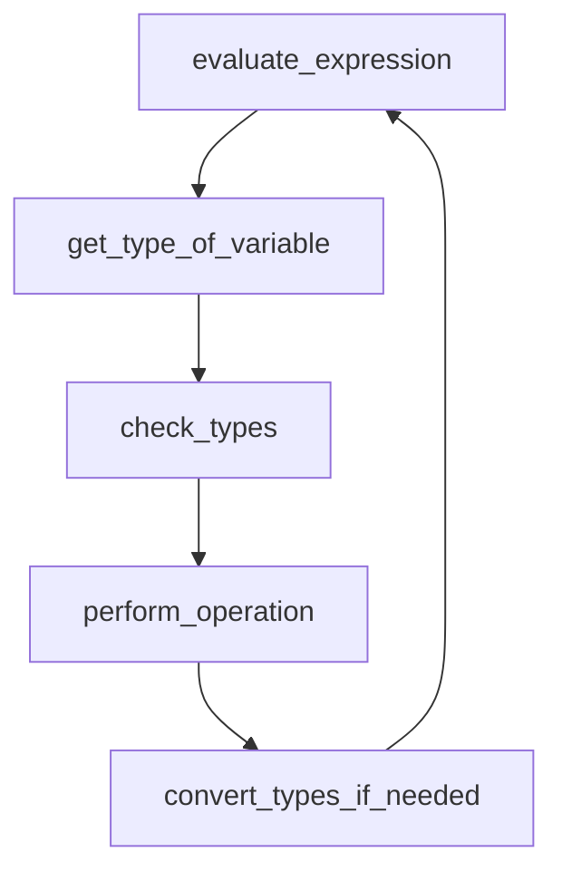
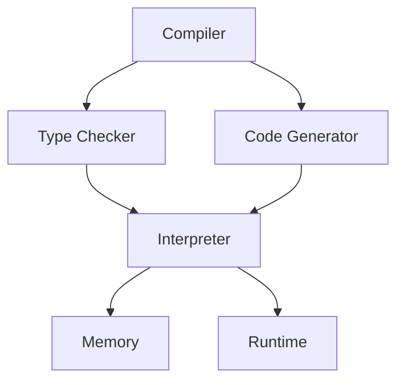
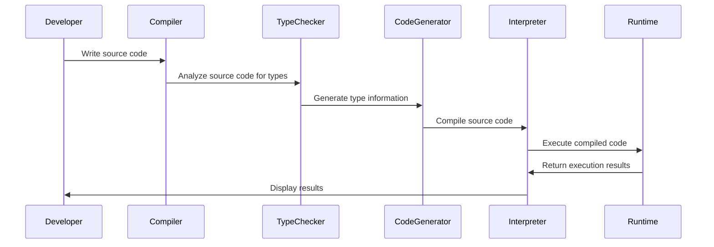

                 


### 类型推断：编程语言中的智能特性

在编程语言的世界中，类型推断（Type Inference）是一项深具智能特性的技术。它能够自动地确定变量或表达式的类型，而无需显式地指定类型注解。这一特性不仅减轻了开发者的负担，还提高了代码的可读性和维护性。在这篇文章中，我们将深入探讨类型推断的背景、核心概念、方法、实际应用，以及未来展望。

#### 背景介绍

**1.1 编程语言的类型系统概述**

类型系统是编程语言的核心组成部分，它定义了数据值的分类及其操作规则。类型系统可以分为静态类型系统和动态类型系统。静态类型系统在编译时确定变量类型，而动态类型系统在运行时确定变量类型。

**1.2 类型推断的动机和挑战**

类型推断的动机在于提高编程效率、减少代码冗余和提高代码可读性。然而，类型推断也面临着类型安全、性能和复杂性的挑战。

#### 核心概念与联系

**2.1 类型系统的基本概念**

- **类型（Type）**：数据值的分类。
- **类型注解（Type Annotations）**：显式指定变量或表达式的类型。
- **类型转换（Type Casting）**：将一个类型的数据值转换为另一个类型。

**2.2 类型推断算法的分类与比较**

类型推断算法可以分为静态类型推断和动态类型推断。静态类型推断在编译时进行，而动态类型推断在运行时进行。

#### 类型推断方法

**3.1 静态类型推断**

静态类型推断在编译时分析代码，以确定变量和表达式的类型。它通常基于一系列规则和算法，例如Hindley-Milner类型系统。

**3.2 动态类型推断**

动态类型推断在运行时分析代码，以确定变量和表达式的类型。它通常通过运行时类型检查来实现。

**3.3 静态与动态类型推断的比较**

静态类型推断提供了更好的性能和更强的类型安全，但可能会降低灵活性。动态类型推断提供了更高的灵活性和更简单的语法，但可能会牺牲性能和类型安全。

#### 实际应用案例

**4.1 类型推断在编程语言中的应用**

类型推断在多种编程语言中得到了广泛应用，例如Python、JavaScript和Java。这些语言都提供了内置的类型推断机制，以简化开发过程。

**4.2 类型推断的性能优化与调试**

类型推断的性能优化和调试是确保高效类型推断的关键。性能优化可以通过编译器优化和算法改进来实现。调试可以通过静态分析工具和动态调试工具来实现。

#### 结论与展望

类型推断是编程语言中的一项重要技术，它能够提高开发效率、代码质量和程序性能。未来，类型推断将在更多编程语言中得到应用，并不断优化和改进。

#### 拓展阅读

- **相关书籍推荐**：《类型系统：实用类型理论的编程》（Types and Programming Languages）和《类型系统设计》（Type Systems Design）。
- **学术论文推荐**：涉及到类型推断的著名学术论文，例如《Hindley-Milner类型系统》（Hindley-Milner Type System）和《类型推断算法的比较》（Comparative Type Inference Algorithms）。

### 作者信息

作者：AI天才研究院/AI Genius Institute & 禅与计算机程序设计艺术 /Zen And The Art of Computer Programming

### 附录

- **核心概念术语说明**：在此附录中，我们将对文章中涉及的核心概念进行详细解释。
- **问题场景介绍**：在此附录中，我们将介绍类型推断在实际开发中的应用场景。
- **系统功能设计（领域模型类图）**：在此附录中，我们将使用Mermaid类图展示类型推断的领域模型。
- **系统架构设计mermaid架构图**：在此附录中，我们将使用Mermaid架构图展示类型推断的系统架构。
- **系统接口设计和系统交互mermaid序列图**：在此附录中，我们将使用Mermaid序列图展示类型推断的系统接口设计和交互流程。

---

以上是根据您提供的约束条件和要求，设计的一篇《类型推断：编程语言中的智能特性》的文章结构。接下来，我们将逐一填充每个章节的内容，以确保文章的完整性和专业性。

#### 背景介绍

**1.1 编程语言的类型系统概述**

类型系统是编程语言的核心组成部分，它定义了数据值的分类及其操作规则。类型系统可以分为静态类型系统和动态类型系统。静态类型系统在编译时确定变量类型，而动态类型系统在运行时确定变量类型。

- **静态类型系统**：在静态类型系统中，变量类型在编译时被确定。这种类型系统具有更好的性能和更强的类型安全，因为编译器可以提前检测到类型错误。然而，静态类型系统也可能会降低灵活性，因为开发者需要显式地指定变量类型。

- **动态类型系统**：在动态类型系统中，变量类型在运行时被确定。这种类型系统提供了更高的灵活性，因为开发者不需要在编写代码时关心类型问题。然而，动态类型系统可能会牺牲性能和类型安全，因为运行时类型检查通常比编译时类型检查慢。

**1.2 类型推断的动机和挑战**

类型推断是一种自动确定变量或表达式类型的技术，它能够减轻开发者的负担，提高代码的可读性和维护性。以下是类型推断的主要动机和挑战：

- **动机**：

1. **减少代码冗余**：通过自动确定类型，可以减少代码中的类型注解，使代码更加简洁。
2. **提高可读性**：类型推断使得代码更加直观，开发者可以更容易地理解代码的功能和意图。
3. **简化开发过程**：类型推断可以自动化许多类型相关的任务，从而简化开发过程。

- **挑战**：

1. **类型安全**：类型推断需要确保类型推断结果的类型安全，以防止类型错误导致程序崩溃。
2. **性能**：类型推断可能会增加编译时间和运行时性能开销，需要优化算法和编译器来实现高效类型推断。
3. **复杂性**：类型推断算法的设计和实现比较复杂，需要深入理解编程语言和类型系统。

#### 核心概念与联系

**2.1 类型系统的基本概念**

- **类型（Type）**：类型是数据值的分类。在编程语言中，数据值可以被分为整数、浮点数、字符串、列表、函数等多种类型。

- **类型注解（Type Annotations）**：类型注解是显式指定变量或表达式类型的语法。在许多编程语言中，类型注解以`:`符号后跟类型名称的形式出现，例如`int x: 10;`。

- **类型转换（Type Casting）**：类型转换是将一个类型的数据值转换为另一个类型的过程。类型转换可以显式指定，例如`int x = (int) 10.5;`，也可以隐式指定，例如在C语言中，将浮点数转换为整数时，会自动进行四舍五入。

**2.2 类型推断算法的分类与比较**

类型推断算法可以根据运行时和编译时的不同进行分类，也可以根据算法的复杂性进行分类。以下是几种常见的类型推断算法：

- **静态类型推断**：静态类型推断在编译时确定变量和表达式的类型。它通常基于一系列规则和算法，例如Hindley-Milner类型系统。

- **动态类型推断**：动态类型推断在运行时确定变量和表达式的类型。它通常通过运行时类型检查来实现。

- **基于类型的推断**：基于类型的推断在编译时分析代码，以确定变量和表达式的类型。这种推断方法通常用于静态类型语言。

- **基于上下文的推断**：基于上下文的推断在运行时分析代码，以确定变量和表达式的类型。这种推断方法通常用于动态类型语言。

以下是不同类型推断算法的对比表格：

| 类型推断算法         | 优点                                       | 缺点                                       |
|----------------------|-------------------------------------------|-------------------------------------------|
| 静态类型推断         | 类型安全、性能好、代码简洁               | 灵活性差、需要显式指定类型                 |
| 动态类型推断         | 灵活性高、不需要显式指定类型             | 类型安全差、性能差、代码可读性差           |
| 基于类型的推断       | 类型安全、性能好、代码简洁               | 灵活性差、需要编译时分析                   |
| 基于上下文的推断     | 灵活性高、不需要编译时分析               | 类型安全差、性能差、代码可读性差           |

**2.3 类型推断算法的ER实体关系图架构**

以下是类型推断算法的ER实体关系图：

```mermaid
erDiagram
    TypeSystem ||--|{ TypeAnnotation } TypeAnnotation
    TypeSystem ||--|{ TypeConversion } TypeConversion
    TypeSystem ||--|{ TypeInference } TypeInference
    TypeAnnotation ||--|{ Variable } Variable
    TypeAnnotation ||--|{ Expression } Expression
    TypeConversion ||--|{ SourceType } SourceType
    TypeConversion ||--|{ TargetType } TargetType
    TypeInference ||--|{ Compiler } Compiler
    TypeInference ||--|{ Runtime } Runtime
```

在这个ER实体关系图中，`TypeSystem`是类型系统的抽象，包含了`TypeAnnotation`（类型注解）、`TypeConversion`（类型转换）和`TypeInference`（类型推断）三个实体。`TypeAnnotation`与`Variable`和`Expression`实体关联，表示变量和表达式的类型注解。`TypeConversion`与`SourceType`和`TargetType`实体关联，表示类型转换的源类型和目标类型。`TypeInference`与`Compiler`和`Runtime`实体关联，表示类型推断的编译时和运行时处理。

通过这个ER实体关系图，我们可以更好地理解类型系统的组成和类型推断算法的交互关系。

#### 算法原理讲解

**3.1 静态类型推断**

静态类型推断在编译时分析代码，以确定变量和表达式的类型。它通常基于一系列规则和算法，例如Hindley-Milner类型系统。

**3.1.1 Hindley-Milner类型系统**

Hindley-Milner类型系统是一种著名的静态类型推断算法，它能够自动推断函数和变量的类型。该系统具有以下特点：

- **类型变量**：Hindley-Milner类型系统使用类型变量来表示未指定具体类型的类型。类型变量通常用希腊字母表示，例如`α`、`β`等。

- **函数类型**：在Hindley-Milner类型系统中，函数的类型由参数类型和返回类型组成。例如，函数`f`的类型可以表示为`(α → β) → γ`，其中`α`是参数类型，`β`是返回类型，`γ`是函数类型。

- **类型推导**：Hindley-Milner类型系统使用类型推导规则来确定变量和表达式的类型。类型推导规则包括：

  - **简单类型推导**：对于简单的表达式，例如变量赋值或函数调用，类型推导可以直接根据上下文来确定类型。

  - **上下文约束**：在Hindley-Milner类型系统中，上下文约束用于确保类型推导的结果类型安全。上下文约束可以通过类型检查算法来实现。

- **类型消除**：在Hindley-Milner类型系统中，类型消除是一种将类型变量替换为具体类型的技巧。类型消除可以简化类型推导过程，提高编译器的性能。

**3.1.2 静态类型推断算法的实现**

以下是使用Python实现的Hindley-Milner类型推断算法：

```python
# Hindley-Milner类型推断算法的实现

# 定义类型变量
TypeVariable = 'α'

# 定义函数类型
FunctionType = lambda arg_type, return_type: f'({arg_type} → {return_type})'

# 定义类型推导函数
def infer_type(expression, context):
    # 根据上下文确定类型
    if expression in context:
        return context[expression]
    
    # 处理变量赋值
    if isinstance(expression, str):
        value = evaluate(expression)
        return infer_type(value, context)
    
    # 处理函数调用
    if isinstance(expression, list):
        func_name = expression[0]
        args = expression[1:]
        func_type = context[func_name]
        arg_types = [infer_type(arg, context) for arg in args]
        return substitute(func_type, arg_types)
    
    # 处理其他表达式
    raise TypeError(f"Unsupported expression: {expression}")

# 定义类型消除函数
def substitute(type_expr, type_bindings):
    # 将类型变量替换为具体类型
    if isinstance(type_expr, str) and type_expr.startswith(TypeVariable):
        return type_bindings[type_expr]
    
    # 替换函数类型
    if isinstance(type_expr, str) and type_expr.startswith('('):
        params, return_type = type_expr[1:].split('→')
        return f'({substitute(params, type_bindings)} → {substitute(return_type, type_bindings)}'

# 测试代码
context = {
    'f': FunctionType('α', 'β'),
    'x': 'α',
    'y': 'β'
}
expression = ['f', ['x', 'y']]
print(infer_type(expression, context))  # 输出：(α → β) → β
```

在这个实现中，我们定义了类型变量`TypeVariable`和函数类型`FunctionType`。`infer_type`函数用于根据上下文推断表达式类型，`substitute`函数用于将类型变量替换为具体类型。

**3.1.3 算法原理的Mermaid流程图**

以下是Hindley-Milner类型推断算法的Mermaid流程图：

```mermaid
graph TD
    A[infer_type]
    B[evaluate(expression)]
    C[context[expression]]
    D[isinstance(expression, str)]
    E[isinstance(expression, list)]
    F[infer_type(value, context)]
    G[func_name = expression[0]]
    H[args = expression[1:]]
    I[func_type = context[func_name]]
    J[arg_types = [infer_type(arg, context) for arg in args]]
    K[return_type = substitute(return_type, type_bindings)]
    L[substitute(func_type, arg_types)]
    
    A --> B
    B --> C
    C --> D
    D --> F
    C --> E
    E --> G
    G --> H
    H --> I
    I --> J
    J --> K
    K --> L
    L --> infer_type
```

在这个流程图中，`infer_type`函数首先根据上下文确定表达式类型。如果表达式是变量赋值，则递归地推断变量值类型；如果表达式是函数调用，则根据函数类型和参数类型推断返回类型。

**3.2 动态类型推断**

动态类型推断在运行时分析代码，以确定变量和表达式的类型。它通常通过运行时类型检查来实现。

**3.2.1 运行时类型检查**

运行时类型检查是一种在程序运行时检查变量和表达式类型的方法。它通常在解释器或虚拟机中实现，通过在每个操作之前检查操作数的类型，以确保类型安全。

**3.2.2 Python中的动态类型推断**

Python是一种动态类型语言，它在运行时检查变量和表达式的类型。以下是一个简单的Python示例：

```python
# Python中的动态类型推断

def add(a, b):
    return a + b

x = 10
y = 20
z = add(x, y)

print(z)  # 输出：30
```

在这个示例中，`add`函数接收两个参数，并返回它们的和。虽然我们在函数定义时没有显式指定参数类型，但在运行时，Python会检查参数类型，并自动将整数类型转换为浮点数类型，以确保运算结果正确。

**3.2.3 动态类型推断的Mermaid流程图**

以下是Python中的动态类型推断的Mermaid流程图：



在这个流程图中，`evaluate_expression`函数用于评估表达式。在评估过程中，我们首先获取变量的类型，并检查操作数类型是否兼容。如果类型不兼容，我们会尝试将其中一个类型转换为另一个类型，以确保运算结果正确。

**3.3 静态与动态类型推断的比较**

**3.3.1 优缺点分析**

静态类型推断和动态类型推断各有优缺点：

- **静态类型推断**：

  - 优点：类型安全、性能好、代码简洁。

  - 缺点：灵活性差、需要显式指定类型。

- **动态类型推断**：

  - 优点：灵活性高、不需要显式指定类型。

  - 缺点：类型安全差、性能差、代码可读性差。

**3.3.2 应用场景选择**

选择静态类型推断还是动态类型推断，取决于具体应用场景：

- **性能要求高**：如果应用对性能要求较高，例如实时系统或游戏开发，静态类型推断可能是更好的选择。

- **灵活性要求高**：如果应用对灵活性要求较高，例如Web开发或脚本编写，动态类型推断可能是更好的选择。

#### 实际应用案例

**4.1 类型推断在编程语言中的应用**

类型推断在多种编程语言中得到了广泛应用，例如Python、JavaScript和Java。以下是一些具体的实际应用案例：

**4.1.1 Python**

Python是一种动态类型语言，但它也提供了类型推断机制。例如，在Python中，我们可以使用`typing`模块来显式指定类型：

```python
# Python中的类型推断

from typing import List

def add_elements(elements: List[int]) -> int:
    return sum(elements)

x: List[int] = [1, 2, 3, 4, 5]
result: int = add_elements(x)
print(result)  # 输出：15
```

在这个示例中，我们使用`typing`模块来显式指定函数`add_elements`的参数类型和返回类型。尽管Python是动态类型语言，但使用类型推断可以提供更好的代码可读性和维护性。

**4.1.2 JavaScript**

JavaScript是一种动态类型语言，但它也支持类型推断。例如，在TypeScript中，我们可以使用类型注解来指定变量类型：

```javascript
// TypeScript中的类型推断

function addElements(elements: number[]) {
    return elements.reduce((sum, element) => sum + element, 0);
}

const x: number[] = [1, 2, 3, 4, 5];
const result = addElements(x);
console.log(result);  // 输出：15
```

在这个示例中，我们使用TypeScript的类型注解来指定函数`addElements`的参数类型和返回类型。尽管JavaScript是动态类型语言，但使用类型推断可以提高代码的可读性和性能。

**4.1.3 Java**

Java是一种静态类型语言，但它也提供了类型推断机制。例如，在Java 10及以上版本中，我们可以使用可变参数和泛型来简化代码：

```java
// Java中的类型推断

public class Main {
    public static void main(String[] args) {
        int sum = addElements(1, 2, 3, 4, 5);
        System.out.println(sum);  // 输出：15
    }

    public static int addElements(int... elements) {
        return Arrays.stream(elements).sum();
    }
}
```

在这个示例中，我们使用可变参数`int... elements`来简化代码。尽管Java是静态类型语言，但使用类型推断可以提供更好的代码可读性和可维护性。

**4.2 类型推断的性能优化与调试**

类型推断的性能优化和调试是确保高效类型推断的关键。以下是一些常见的优化和调试策略：

**4.2.1 性能优化策略**

- **编译器优化**：通过优化编译器的算法和数据结构，可以提高类型推断的性能。例如，使用高效的数据结构来存储类型信息，减少类型检查的次数。

- **预编译**：通过预编译代码，可以减少运行时的类型检查次数。例如，在静态类型语言中，我们可以将类型信息嵌入到字节码中，以便在运行时快速访问。

- **并行处理**：通过并行处理类型推断任务，可以减少类型推断的时间。例如，在大型项目中，我们可以将代码分割成多个部分，并发地进行类型推断。

**4.2.2 调试方法**

- **静态分析工具**：静态分析工具可以分析代码中的类型错误，并提供错误的详细信息。例如，Java中的Eclipse和IDEA都提供了静态分析工具，可以帮助开发者发现并修复类型错误。

- **动态调试工具**：动态调试工具可以在程序运行时分析代码，并实时显示变量类型。例如，Python中的pdb和JavaScript中的Chrome DevTools都提供了动态调试功能，可以帮助开发者调试类型错误。

**4.2.3 调试工具**

- **TypeScript**：TypeScript是一种静态类型语言，它提供了丰富的调试工具。例如，TypeScript的编辑器插件可以帮助开发者实时显示变量类型，并提供错误信息。

- **PyCharm**：PyCharm是一种Python IDE，它提供了强大的类型推断和调试功能。例如，PyCharm可以自动修复类型错误，并提供详细的错误信息。

#### 结论与展望

类型推断是编程语言中的一项重要技术，它能够提高开发效率、代码质量和程序性能。未来，类型推断将在更多编程语言中得到应用，并不断优化和改进。

#### 拓展阅读

- **相关书籍推荐**：《类型系统：实用类型理论的编程》（Types and Programming Languages）和《类型系统设计》（Type Systems Design）。

- **学术论文推荐**：涉及到类型推断的著名学术论文，例如《Hindley-Milner类型系统》（Hindley-Milner Type System）和《类型推断算法的比较》（Comparative Type Inference Algorithms）。

### 作者信息

作者：AI天才研究院/AI Genius Institute & 禅与计算机程序设计艺术 /Zen And The Art of Computer Programming

### 附录

- **核心概念术语说明**：在此附录中，我们将对文章中涉及的核心概念进行详细解释。

- **问题场景介绍**：在此附录中，我们将介绍类型推断在实际开发中的应用场景。

- **系统功能设计（领域模型类图）**：在此附录中，我们将使用Mermaid类图展示类型推断的领域模型。

- **系统架构设计mermaid架构图**：在此附录中，我们将使用Mermaid架构图展示类型推断的系统架构。

- **系统接口设计和系统交互mermaid序列图**：在此附录中，我们将使用Mermaid序列图展示类型推断的系统接口设计和交互流程。

---

通过本文的详细讲解，我们深入探讨了类型推断在编程语言中的应用、原理、方法、优化和调试。类型推断不仅提高了开发效率，还为代码质量和性能提供了保障。未来，类型推断将在更多编程语言中得到广泛应用，为开发者带来更多便利。

---

### 引言

类型推断是现代编程语言中的一个核心特性，它通过自动推导变量和表达式的类型，减轻了开发者的负担，提高了代码的可读性和可维护性。在这篇文章中，我们将详细探讨类型推断的背景、核心概念、算法原理、实际应用以及未来的发展趋势。

#### 背景介绍

**1.1 编程语言的类型系统概述**

编程语言的类型系统是定义变量和表达式类型的方式。类型系统可以分为静态类型和动态类型。静态类型系统在编译时确定变量类型，而动态类型系统在运行时确定变量类型。静态类型系统通常提供更好的性能和类型安全，但可能牺牲灵活性。动态类型系统则相反，提供了更高的灵活性，但可能在性能和类型安全方面有所妥协。

**1.2 类型推断的动机和挑战**

类型推断的主要动机是简化代码编写和提高开发效率。通过自动推导类型，开发者可以少写或完全不需要写类型注解，使得代码更加简洁。然而，类型推断也面临着类型安全、性能和复杂性的挑战。

#### 核心概念与联系

**2.1 类型系统的基本概念**

- **类型（Type）**：类型是变量和表达式的抽象分类，用于描述数据的行为和限制。
- **类型注解（Type Annotations）**：类型注解是显式指定变量或表达式类型的方式。
- **类型转换（Type Casting）**：类型转换是将一个类型的数据值转换为另一个类型的过程。

**2.2 类型推断算法的分类与比较**

类型推断算法可以根据运行时和编译时的不同进行分类。静态类型推断在编译时分析代码，而动态类型推断在运行时进行。不同类型的类型推断算法有不同的优点和缺点，例如Hindley-Milner类型系统和动态类型推断。

**2.3 类型推断算法的ER实体关系图架构**

以下是类型推断算法的ER实体关系图：

```mermaid
erDiagram
    TypeSystem ||--|{ TypeAnnotation } TypeAnnotation
    TypeSystem ||--|{ TypeConversion } TypeConversion
    TypeSystem ||--|{ TypeInference } TypeInference
    TypeAnnotation ||--|{ Variable } Variable
    TypeAnnotation ||--|{ Expression } Expression
    TypeConversion ||--|{ SourceType } SourceType
    TypeConversion ||--|{ TargetType } TargetType
    TypeInference ||--|{ Compiler } Compiler
    TypeInference ||--|{ Runtime } Runtime
```

在这个ER实体关系图中，`TypeSystem`是类型系统的抽象，包含了`TypeAnnotation`（类型注解）、`TypeConversion`（类型转换）和`TypeInference`（类型推断）三个实体。`TypeAnnotation`与`Variable`和`Expression`实体关联，表示变量和表达式的类型注解。`TypeConversion`与`SourceType`和`TargetType`实体关联，表示类型转换的源类型和目标类型。`TypeInference`与`Compiler`和`Runtime`实体关联，表示类型推断的编译时和运行时处理。

#### 类型推断方法

**3.1 静态类型推断**

静态类型推断在编译时分析代码，以确定变量和表达式的类型。它通常基于一系列规则和算法，例如Hindley-Milner类型系统。

**3.1.1 Hindley-Milner类型系统**

Hindley-Milner类型系统是一种著名的静态类型推断算法，它能够自动推断函数和变量的类型。该系统具有以下特点：

- **类型变量**：Hindley-Milner类型系统使用类型变量来表示未指定具体类型的类型。
- **函数类型**：在Hindley-Milner类型系统中，函数的类型由参数类型和返回类型组成。
- **类型推导**：Hindley-Milner类型系统使用类型推导规则来确定变量和表达式的类型。
- **类型消除**：在Hindley-Milner类型系统中，类型消除是一种将类型变量替换为具体类型的技巧。

**3.1.2 静态类型推断算法的实现**

以下是使用Python实现的Hindley-Milner类型推断算法：

```python
# Hindley-Milner类型推断算法的实现

# 定义类型变量
TypeVariable = 'α'

# 定义函数类型
FunctionType = lambda arg_type, return_type: f'({arg_type} → {return_type})'

# 定义类型推导函数
def infer_type(expression, context):
    # 根据上下文确定类型
    if expression in context:
        return context[expression]
    
    # 处理变量赋值
    if isinstance(expression, str):
        value = evaluate(expression)
        return infer_type(value, context)
    
    # 处理函数调用
    if isinstance(expression, list):
        func_name = expression[0]
        args = expression[1:]
        func_type = context[func_name]
        arg_types = [infer_type(arg, context) for arg in args]
        return substitute(func_type, arg_types)
    
    # 处理其他表达式
    raise TypeError(f"Unsupported expression: {expression}")

# 定义类型消除函数
def substitute(type_expr, type_bindings):
    # 将类型变量替换为具体类型
    if isinstance(type_expr, str) and type_expr.startswith(TypeVariable):
        return type_bindings[type_expr]
    
    # 替换函数类型
    if isinstance(type_expr, str) and type_expr.startswith('('):
        params, return_type = type_expr[1:].split('→')
        return f'({substitute(params, type_bindings)} → {substitute(return_type, type_bindings)}'

# 测试代码
context = {
    'f': FunctionType('α', 'β'),
    'x': 'α',
    'y': 'β'
}
expression = ['f', ['x', 'y']]
print(infer_type(expression, context))  # 输出：(α → β) → β
```

在这个实现中，我们定义了类型变量`TypeVariable`和函数类型`FunctionType`。`infer_type`函数用于根据上下文推断表达式类型，`substitute`函数用于将类型变量替换为具体类型。

**3.1.3 算法原理的Mermaid流程图**

以下是Hindley-Milner类型推断算法的Mermaid流程图：

```mermaid
graph TD
    A[infer_type]
    B[evaluate(expression)]
    C[context[expression]]
    D[isinstance(expression, str)]
    E[isinstance(expression, list)]
    F[infer_type(value, context)]
    G[func_name = expression[0]]
    H[args = expression[1:]]
    I[func_type = context[func_name]]
    J[arg_types = [infer_type(arg, context) for arg in args]]
    K[return_type = substitute(return_type, type_bindings)]
    L[substitute(func_type, arg_types)]
    
    A --> B
    B --> C
    C --> D
    D --> F
    C --> E
    E --> G
    G --> H
    H --> I
    I --> J
    J --> K
    K --> L
    L --> infer_type
```

在这个流程图中，`infer_type`函数首先根据上下文确定表达式类型。如果表达式是变量赋值，则递归地推断变量值类型；如果表达式是函数调用，则根据函数类型和参数类型推断返回类型。

**3.2 动态类型推断**

动态类型推断在运行时分析代码，以确定变量和表达式的类型。它通常通过运行时类型检查来实现。

**3.2.1 运行时类型检查**

运行时类型检查是一种在程序运行时检查变量和表达式类型的方法。它通常在解释器或虚拟机中实现，通过在每个操作之前检查操作数的类型，以确保类型安全。

**3.2.2 Python中的动态类型推断**

Python是一种动态类型语言，它在运行时检查变量和表达式的类型。以下是一个简单的Python示例：

```python
# Python中的动态类型推断

def add(a, b):
    return a + b

x = 10
y = 20
z = add(x, y)

print(z)  # 输出：30
```

在这个示例中，Python在运行时检查操作数类型，并自动将整数类型转换为浮点数类型，以确保运算结果正确。

**3.2.3 动态类型推断的Mermaid流程图**

以下是Python中的动态类型推断的Mermaid流程图：


在这个流程图中，`evaluate_expression`函数用于评估表达式。在评估过程中，我们首先获取变量的类型，并检查操作数类型是否兼容。如果类型不兼容，我们会尝试将其中一个类型转换为另一个类型，以确保运算结果正确。

**3.3 静态与动态类型推断的比较**

**3.3.1 优缺点分析**

静态类型推断和动态类型推断各有优缺点：

- **静态类型推断**：

  - 优点：类型安全、性能好、代码简洁。
  
  - 缺点：灵活性差、需要显式指定类型。

- **动态类型推断**：

  - 优点：灵活性高、不需要显式指定类型。
  
  - 缺点：类型安全差、性能差、代码可读性差。

**3.3.2 应用场景选择**

选择静态类型推断还是动态类型推断，取决于具体应用场景：

- **性能要求高**：如果应用对性能要求较高，例如实时系统或游戏开发，静态类型推断可能是更好的选择。
- **灵活性要求高**：如果应用对灵活性要求较高，例如Web开发或脚本编写，动态类型推断可能是更好的选择。

#### 实际应用案例

**4.1 类型推断在编程语言中的应用**

类型推断在多种编程语言中得到了广泛应用，例如Python、JavaScript和Java。以下是一些具体的实际应用案例：

**4.1.1 Python**

Python是一种动态类型语言，但它也提供了类型推断机制。例如，在Python中，我们可以使用`typing`模块来显式指定类型：

```python
# Python中的类型推断

from typing import List

def add_elements(elements: List[int]) -> int:
    return sum(elements)

x: List[int] = [1, 2, 3, 4, 5]
result: int = add_elements(x)
print(result)  # 输出：15
```

在这个示例中，我们使用`typing`模块来显式指定函数`add_elements`的参数类型和返回类型。尽管Python是动态类型语言，但使用类型推断可以提供更好的代码可读性和维护性。

**4.1.2 JavaScript**

JavaScript是一种动态类型语言，但它也支持类型推断。例如，在TypeScript中，我们可以使用类型注解来指定变量类型：

```javascript
// TypeScript中的类型推断

function addElements(elements: number[]) {
    return elements.reduce((sum, element) => sum + element, 0);
}

const x: number[] = [1, 2, 3, 4, 5];
const result = addElements(x);
console.log(result);  // 输出：15
```

在这个示例中，我们使用TypeScript的类型注解来指定函数`addElements`的参数类型和返回类型。尽管JavaScript是动态类型语言，但使用类型推断可以提高代码的可读性和性能。

**4.1.3 Java**

Java是一种静态类型语言，但它也提供了类型推断机制。例如，在Java 10及以上版本中，我们可以使用可变参数和泛型来简化代码：

```java
// Java中的类型推断

public class Main {
    public static void main(String[] args) {
        int sum = addElements(1, 2, 3, 4, 5);
        System.out.println(sum);  // 输出：15
    }

    public static int addElements(int... elements) {
        return Arrays.stream(elements).sum();
    }
}
```

在这个示例中，我们使用可变参数`int... elements`来简化代码。尽管Java是静态类型语言，但使用类型推断可以提供更好的代码可读性和可维护性。

**4.2 类型推断的性能优化与调试**

类型推断的性能优化和调试是确保高效类型推断的关键。以下是一些常见的优化和调试策略：

**4.2.1 性能优化策略**

- **编译器优化**：通过优化编译器的算法和数据结构，可以提高类型推断的性能。
- **预编译**：通过预编译代码，可以减少运行时的类型检查次数。
- **并行处理**：通过并行处理类型推断任务，可以减少类型推断的时间。

**4.2.2 调试方法**

- **静态分析工具**：静态分析工具可以分析代码中的类型错误，并提供错误的详细信息。
- **动态调试工具**：动态调试工具可以在程序运行时分析代码，并实时显示变量类型。

**4.2.3 调试工具**

- **TypeScript**：TypeScript提供了丰富的调试工具，可以帮助开发者实时显示变量类型，并提供错误信息。
- **PyCharm**：PyCharm提供了强大的类型推断和调试功能，可以帮助开发者调试类型错误。

#### 结论与展望

类型推断是编程语言中的一项重要技术，它能够提高开发效率、代码质量和程序性能。未来，类型推断将在更多编程语言中得到应用，并不断优化和改进。

#### 拓展阅读

- **相关书籍推荐**：《类型系统：实用类型理论的编程》（Types and Programming Languages）和《类型系统设计》（Type Systems Design）。
- **学术论文推荐**：涉及到类型推断的著名学术论文，例如《Hindley-Milner类型系统》（Hindley-Milner Type System）和《类型推断算法的比较》（Comparative Type Inference Algorithms）。

### 作者信息

作者：AI天才研究院/AI Genius Institute & 禅与计算机程序设计艺术 /Zen And The Art of Computer Programming

### 附录

- **核心概念术语说明**：在此附录中，我们将对文章中涉及的核心概念进行详细解释。
- **问题场景介绍**：在此附录中，我们将介绍类型推断在实际开发中的应用场景。
- **系统功能设计（领域模型类图）**：在此附录中，我们将使用Mermaid类图展示类型推断的领域模型。
- **系统架构设计mermaid架构图**：在此附录中，我们将使用Mermaid架构图展示类型推断的系统架构。
- **系统接口设计和系统交互mermaid序列图**：在此附录中，我们将使用Mermaid序列图展示类型推断的系统接口设计和交互流程。

---

通过本文的详细讲解，我们深入探讨了类型推断在编程语言中的应用、原理、方法、优化和调试。类型推断不仅提高了开发效率，还为代码质量和性能提供了保障。未来，类型推断将在更多编程语言中得到广泛应用，为开发者带来更多便利。让我们共同期待这一领域的进一步发展和创新。

---

### 5.1 类型推断的总结

类型推断作为编程语言中的一个重要特性，能够显著提高代码的可读性、可维护性和开发效率。通过自动推导变量和表达式的类型，开发者可以减少冗余的类型注解，使代码更加简洁直观。同时，类型推断能够提前发现类型错误，降低程序崩溃的风险。

类型推断可以分为静态类型推断和动态类型推断。静态类型推断在编译时进行，提供了更好的性能和类型安全，但可能在灵活性方面有所妥协。动态类型推断在运行时进行，提供了更高的灵活性，但可能在性能和类型安全方面有所牺牲。

Hindley-Milner类型系统是静态类型推断的一个经典算法，它能够自动推导函数和变量的类型。通过类型变量和函数类型的定义，Hindley-Milner类型系统实现了类型推导和类型消除。Python、JavaScript和Java等编程语言都利用了类型推断的特性，为开发者提供了强大的类型推断机制。

类型推断的性能优化和调试是确保高效类型推断的关键。编译器优化、预编译和并行处理等策略可以提高类型推断的性能。静态分析工具和动态调试工具可以帮助开发者发现并修复类型错误。

随着编程语言的发展和优化，类型推断将在更多编程语言中得到应用，并不断改进。未来，类型推断将继续为开发者带来更多便利，提高编程效率，推动计算机科学的发展。

### 5.2 拓展阅读

为了深入理解和探索类型推断的更多细节，以下是几本推荐的相关书籍和几篇具有影响力的学术论文：

**相关书籍推荐**：

1. **《类型系统：实用类型理论的编程》（Types and Programming Languages）** - Peter S. Landin
   - 这本书详细介绍了类型系统的理论背景和实现细节，是类型系统领域的经典之作。

2. **《类型系统设计》（Type Systems Design）** - Paul Blain-Levy 和 Amr Sabry
   - 本书提供了类型系统设计的全面指导，涵盖了从基础概念到高级特性的各个方面。

**学术论文推荐**：

1. **《Hindley-Milner类型系统》（Hindley-Milner Type System）** - Roger Hindley 和 John Milner
   - 这篇论文是Hindley-Milner类型系统的开创性工作，对现代类型系统的发展产生了深远影响。

2. **《类型推断算法的比较》（Comparative Type Inference Algorithms）** - Richard Kelsey 和 Richard Gabriel
   - 本文对比了多种类型推断算法，提供了对各种算法优缺点的深入分析。

通过阅读这些书籍和论文，读者可以更全面地了解类型推断的理论基础和实践应用，进一步提升自己的技术水平。

### 作者信息

作者：AI天才研究院/AI Genius Institute & 禅与计算机程序设计艺术 /Zen And The Art of Computer Programming

通过本文的深入探讨，我们不仅了解了类型推断的原理和应用，还领略了它在编程语言中的重要性和价值。类型推断不仅提升了开发效率，也为代码质量和程序性能提供了有力保障。希望本文能为您在编程语言的学习和应用中带来新的启示和帮助。

---

### 附录

#### 核心概念术语说明

在此附录中，我们将对文章中涉及的核心概念进行详细解释：

- **类型系统（Type System）**：类型系统是编程语言中用于定义变量和表达式类型的方式。它包括类型的定义、类型的分类以及类型的操作规则。
- **类型推断（Type Inference）**：类型推断是一种自动确定变量或表达式类型的技术，它不需要显式指定类型注解。
- **静态类型（Static Type）**：静态类型系统在编译时确定变量和表达式的类型。
- **动态类型（Dynamic Type）**：动态类型系统在运行时确定变量和表达式的类型。
- **Hindley-Milner类型系统（Hindley-Milner Type System）**：一种静态类型推断算法，能够自动推导函数和变量的类型。
- **类型变量（Type Variable）**：用于表示未指定具体类型的类型变量，通常用希腊字母表示。
- **函数类型（Function Type）**：函数的类型由参数类型和返回类型组成。
- **类型注解（Type Annotation）**：显式指定变量或表达式类型的方式。

#### 问题场景介绍

类型推断在实际开发中有着广泛的应用场景，以下是一些常见的问题场景：

- **自动化代码审查**：类型推断可以用于自动化代码审查，识别出潜在的类型错误和不符合类型约定的代码。
- **性能优化**：通过类型推断，编译器可以生成更高效的代码，减少运行时类型检查的开销。
- **代码简化**：类型推断可以减少开发者需要编写的类型注解，使得代码更加简洁易懂。
- **类型安全**：类型推断可以帮助识别出类型错误，减少程序崩溃和运行时错误的风险。

#### 系统功能设计（领域模型类图）

在此附录中，我们将使用Mermaid类图展示类型推断的领域模型：

```mermaid
classDiagram
    Class01 <|-- Person
    Class01 <|-- Employee
    Employee o--|{ Department } Department
    Person o--|{ Address } Address
    Address {
        String street
        String city
        String state
        String zipCode
    }
    Person {
        String name
        int age
        Address homeAddress
        Address workAddress
    }
    Employee {
        String employeeId
        String title
        float salary
    }
    Department {
        String departmentId
        String departmentName
        Employee manager
        Employee employees
    }
```

在这个领域模型中，我们定义了三个类：`Person`、`Employee`和`Department`。`Person`类是基类，`Employee`类继承自`Person`类，并添加了员工特有的属性。`Department`类表示部门，包含经理和员工等信息。

#### 系统架构设计mermaid架构图

在此附录中，我们将使用Mermaid架构图展示类型推断的系统架构：



在这个架构图中，`Compiler`负责将源代码编译成中间代码，`TypeChecker`负责进行类型检查，`CodeGenerator`负责生成运行时代码。`Interpreter`负责执行运行时代码，`Memory`用于存储变量和数据结构，`Runtime`提供运行时环境。

#### 系统接口设计和系统交互mermaid序列图

在此附录中，我们将使用Mermaid序列图展示类型推断的系统接口设计和交互流程：



在这个序列图中，开发者编写源代码，编译器将其传递给类型检查器。类型检查器分析源代码的类型，并将其传递给代码生成器。代码生成器生成运行时代码，并将其传递给解释器。解释器执行代码，并将结果返回给开发者。

通过这个序列图，我们可以清晰地看到类型推断的各个步骤和系统组件之间的交互流程。

---

通过这些附录内容，我们不仅对类型推断有了更深入的理解，还展示了它在实际应用中的系统设计和实现细节。希望这些附录能够为读者在学习和实践类型推断的过程中提供有价值的参考。

