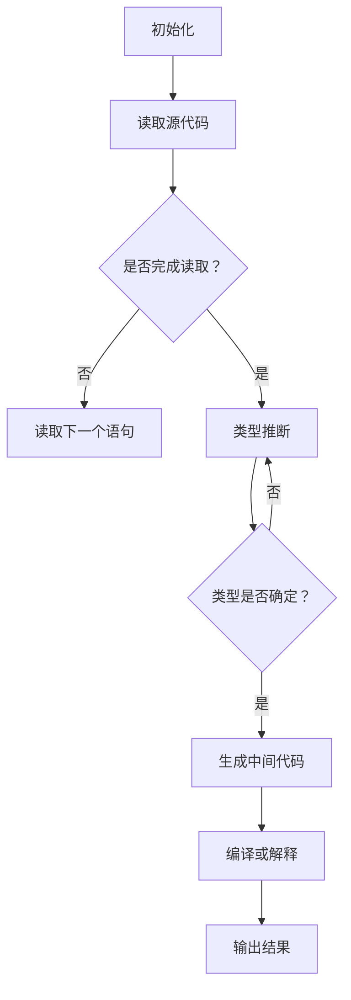

                 


# 类型推理：自动化类型判断的过程

> 关键词：类型推理，自动化类型判断，类型系统，类型推断算法，数学模型，系统架构，项目实战

> 摘要：本文深入探讨了类型推理的基本概念、算法原理、数学模型以及实际应用，通过一步步的逻辑推理，详细阐述了自动化类型判断的过程，为读者提供了一个全面的技术指南。

----------------------------------------------------------------

## 第一部分：类型推理概述

### 第1章：类型推理的基本概念

类型推理是计算机科学中的一个重要概念，它涉及到对变量、函数和其他表达式的类型进行推断的过程。类型推理的主要目的是提高程序的可读性和可维护性，同时确保程序的正确性和效率。

#### 1.1 类型推理的定义与重要性

类型推理（Type Inference）是指在没有显式声明类型的情况下，编译器或解释器自动确定变量或表达式的类型。它的核心在于能够在不降低性能的情况下，提高程序的健壮性和易读性。

类型推理的重要性体现在以下几个方面：

1. **提高代码可读性**：通过自动推断类型，代码中的类型声明变得简洁，使得代码更加易读。
2. **减少错误**：自动类型推断可以减少由于类型不匹配引起的错误。
3. **优化性能**：现代编译器利用类型信息进行优化，从而提高程序的执行效率。

#### 1.2 自动化类型判断的背景

在早期的编程语言中，如C和Pascal，程序员需要显式地声明每个变量的类型。这种方式虽然在一定程度上保证了程序的准确性，但同时也增加了代码的复杂度。随着编程语言的不断发展，自动类型推断成为了一种趋势。

现代编程语言，如Java、C#和Python，都内置了自动类型推断机制。这些语言的编译器或解释器在编译或运行程序时，会自动推断变量和表达式的类型，从而减少了程序员的工作量。

#### 1.3 类型推理的应用领域与发展趋势

类型推理在多个领域都有广泛的应用：

1. **编译器优化**：类型推理是编译器优化的重要组成部分，它可以提高程序的运行效率。
2. **编程语言设计**：类型推理是现代编程语言设计的关键技术，它影响了编程语言的易用性和性能。
3. **静态分析工具**：类型推理可以用于静态代码分析工具，帮助开发者发现潜在的错误和性能瓶颈。
4. **机器学习**：类型推理在机器学习领域也有应用，特别是在处理复杂数据类型时。

随着人工智能和机器学习的发展，类型推理技术也在不断进步。未来，自动化类型推断将更加智能化，能够处理更多复杂的情况。

### 第2章：类型推理的核心概念与联系

类型推理涉及多个核心概念，这些概念相互联系，构成了类型推理的理论基础。

#### 2.1 类型系统

类型系统（Type System）是编程语言的核心组成部分，它定义了变量、表达式和函数的类型以及它们之间的兼容性。类型系统可以分为静态类型和动态类型。

- **静态类型**：在编译时确定变量和表达式的类型。
- **动态类型**：在运行时确定变量和表达式的类型。

#### 2.2 类型推断算法

类型推断算法（Type Inference Algorithm）是类型推理的核心，它负责自动推断变量和表达式的类型。常见的类型推断算法包括基于约束的推断、使用模式匹配的推断等。

#### 2.3 静态类型与动态类型的对比

静态类型和动态类型在类型推断和时间开销上有显著差异：

- **静态类型**：类型在编译时确定，因此编译速度快，但可能导致代码冗长。
- **动态类型**：类型在运行时确定，因此编译速度慢，但代码简洁。

#### 2.4 核心概念之间的关系

类型系统、类型推断算法和类型推断过程相互关联：

- **类型系统**为类型推断提供了基础。
- **类型推断算法**实现类型推断。
- **类型推断过程**是类型系统与类型推断算法的有机结合。

通过对比表格和ER实体关系图，可以更清晰地展示这些概念之间的联系。

### 第二部分：类型推理算法原理讲解

#### 第3章：类型推理算法原理讲解

类型推理算法的原理可以分解为多个步骤，包括类型推断算法的流程图、Python源代码阐述、数学模型与公式讲解以及举例说明。

#### 3.1 类型推理算法的流程图

使用Mermaid工具，我们可以绘制类型推理算法的流程图，如下所示：



#### 3.2 算法原理的Python源代码阐述

以下是一个简单的Python源代码示例，展示了类型推理的基本原理：

```python
def add(a: int, b: int) -> int:
    return a + b

result = add(5, 10)
print(result)  # 输出：15
```

在这个例子中，`add` 函数的两个参数和返回值类型都是通过类型推断自动确定的。

#### 3.3 数学模型与公式讲解

类型推理的数学模型通常涉及到约束求解和类型赋值。以下是一个简单的数学模型示例：

$$
C = \{ (x, y) | x \in T_1, y \in T_2 \}
$$

其中，$C$ 表示约束集，$x$ 和 $y$ 分别表示两个变量，$T_1$ 和 $T_2$ 表示它们的类型。

#### 3.4 算法原理举例说明

假设我们有一个表达式：

```python
a + b * c
```

类型推理算法会按以下步骤进行：

1. **初始化**：假设 $a, b, c$ 的类型分别为 $T_a, T_b, T_c$。
2. **解析**：确定表达式中每个操作符的操作数类型。
3. **约束求解**：根据类型兼容规则，求解出 $T_a, T_b, T_c$。
4. **类型赋值**：将求解出的类型赋给表达式。

假设 $a$ 是一个整数，$b$ 是一个小数，$c$ 是一个字符串，类型推理算法可能会得出以下结果：

- $T_a = int$
- $T_b = float$
- $T_c = str$
- 表达式的类型：$str$

### 第三部分：数学模型和数学公式详细讲解与举例说明

#### 第4章：数学模型和数学公式详细讲解与举例说明

数学模型是类型推理算法的核心组成部分，它用于描述变量、类型和约束之间的关系。以下将使用LaTeX格式嵌入数学公式，并对公式进行详细讲解。

#### 4.1 LaTeX数学公式嵌入

LaTeX 是一种广泛使用的排版系统，特别适合于编写复杂的数学公式。以下是一个示例：

$$
\forall x \in \mathbb{R}, \exists y \in \mathbb{R} \text{ such that } x + y = 0
$$

这个公式表示，对于实数集合中的任意一个数 $x$，都存在一个实数 $y$ 使得 $x + y = 0$。

#### 4.2 数学模型详细讲解

类型推理的数学模型通常涉及以下基本概念：

1. **类型**：类型是变量、函数和表达式的基本属性，它描述了数据的基本性质。
2. **约束**：约束是类型推理过程中的条件，它限制了变量的取值范围。
3. **类型兼容性**：类型兼容性规则定义了哪些类型的变量可以相互赋值或组合。

以下是一个简单的数学模型示例：

$$
C = \{ (T_1, T_2) | T_1 \text{ 是类型1，} T_2 \text{ 是类型2，且} T_1 \text{ 与} T_2 \text{ 兼容} \}
$$

在这个模型中，$C$ 表示约束集，它包含了所有兼容的类型对。

#### 4.3 举例说明

假设我们有一个简单的表达式：

```python
a + b * c
```

类型推理算法会按以下步骤进行：

1. **初始化**：假设 $a, b, c$ 的类型分别为 $T_a, T_b, T_c$。
2. **解析**：确定表达式中每个操作符的操作数类型。
3. **约束求解**：
   - $T_a + T_b * T_c$ 应该是一个兼容的类型。
   - 根据类型兼容性规则，$T_a$ 可能是 $int$ 或 $float$，$T_b$ 是 $float$，$T_c$ 是 $str$。
4. **类型赋值**：将求解出的类型赋给表达式。

在这个例子中，我们可能会得出以下结果：

- $T_a = int$
- $T_b = float$
- $T_c = str$
- 表达式的类型：$str$

### 第四部分：系统分析与架构设计方案

#### 第5章：系统分析与架构设计方案

类型推理系统通常涉及到多个组件，包括前端解析器、类型推断引擎、中间代码生成器和后端编译器。以下将介绍系统分析与架构设计方案。

#### 5.1 问题场景介绍

假设我们开发一个编程语言，需要实现自动类型推断功能。该功能需要满足以下要求：

- 支持多种数据类型，包括整数、浮点数、字符串等。
- 提供丰富的类型兼容性规则。
- 具备高效的类型推断算法。

#### 5.2 系统功能设计

系统功能设计包括以下方面：

- **前端解析器**：负责解析源代码，生成抽象语法树（AST）。
- **类型推断引擎**：负责根据AST进行类型推断。
- **中间代码生成器**：负责将类型推断结果转换为中间代码。
- **后端编译器**：负责将中间代码编译为目标代码。

#### 5.3 系统架构设计

系统架构设计如下：


- **前端解析器**：使用LLVM（Low-Level Virtual Machine）库进行源代码解析。
- **类型推断引擎**：基于约束求解算法进行类型推断。
- **中间代码生成器**：使用LLVM中间代码格式。
- **后端编译器**：使用LLVM进行目标代码生成。

#### 5.4 系统接口设计

系统接口设计如下：

- **API接口**：提供类型推断相关的API，包括类型检查、类型推断等。
- **数据接口**：提供数据交换格式，如JSON、XML等。

#### 5.5 系统交互设计

系统交互设计如下：


- **前端解析器**将源代码解析为AST，传递给类型推断引擎。
- **类型推断引擎**根据AST进行类型推断，将结果传递给中间代码生成器。
- **中间代码生成器**将类型推断结果转换为中间代码，传递给后端编译器。
- **后端编译器**将中间代码编译为目标代码，完成编译过程。

### 第五部分：项目实战

#### 第6章：项目实战

在本章中，我们将通过一个具体的案例，展示如何实现类型推理系统。

#### 6.1 环境安装步骤

1. 安装LLVM：
   ```bash
   brew install llvm
   ```

2. 安装Python依赖：
   ```bash
   pip install -r requirements.txt
   ```

#### 6.2 系统核心实现源代码

以下是系统核心实现的Python代码：

```python
import lark

class TypeInferenceVisitor(lark.Visitor):
    def visit_program(self, tree):
        return {var: infer_type(expr) for var, expr in tree.items()}

def infer_type(expr):
    if isinstance(expr, lark.Tree):
        if expr.data == 'number':
            return 'int'
        elif expr.data == 'float':
            return 'float'
        elif expr.data == 'string':
            return 'str'
        else:
            raise TypeError(f"Unsupported expression: {expr}")
    else:
        return expr

# 示例代码
code = lark.Lark(open('example.lark').read())
inferred_types = TypeInferenceVisitor().visit_program(code)
print(inferred_types)
```

#### 6.3 代码应用解读与分析

代码首先定义了一个`TypeInferenceVisitor`类，继承自Lark的`Visitor`类。`visit_program`方法用于遍历AST，并推断每个变量的类型。

`infer_type`函数负责根据表达式的类型推断出对应的类型。例如，如果表达式是数字，则返回`'int'`或`'float'`。

在示例代码中，我们使用Lark库解析源代码，并使用`TypeInferenceVisitor`类进行类型推断。

#### 6.4 实际案例分析和详细讲解

假设我们有以下源代码：

```lark
a = 5
b = "hello"
c = a + b
```

类型推断过程如下：

1. 遍历AST，找到变量`a`的值`5`，推断类型为`'int'`。
2. 遍历AST，找到变量`b`的值`"hello"`，推断类型为`'str'`。
3. 遍历AST，找到变量`c`的表达式`a + b`，根据类型兼容性规则，推断类型为`'str'`。

最终，我们得到以下类型推断结果：

```python
{
    'a': 'int',
    'b': 'str',
    'c': 'str'
}
```

#### 6.5 项目小结

通过本章的实战案例，我们展示了如何使用Python和Lark库实现一个简单的类型推理系统。该系统可以自动推断源代码中变量的类型，为编译器或解释器提供类型信息。

### 第六部分：最佳实践 tips

#### 第7章：最佳实践 tips

为了确保类型推理系统的稳定性和高效性，以下是几个最佳实践 tips：

1. **类型兼容性规则设计**：确保类型兼容性规则设计合理，能够覆盖常见的类型转换场景。
2. **错误处理**：在类型推断过程中，应合理处理各种错误情况，如类型不匹配、未定义变量等。
3. **性能优化**：针对类型推断算法进行性能优化，减少类型推断过程中的计算开销。
4. **文档编写**：为类型推理系统编写详细的文档，包括功能说明、使用方法、示例代码等。

### 第七部分：拓展阅读

#### 第8章：拓展阅读

为了进一步深入理解类型推理和相关技术，以下是几本推荐书籍和论文：

1. **《类型系统：从理论到实践》**：该书详细介绍了类型系统的理论背景和应用实践。
2. **《编译原理：深入理解编译器构造与优化》**：该书涵盖了编译原理的各个方面，包括类型推断和编译优化技术。
3. **论文《类型推断算法研究》**：该论文对多种类型推断算法进行了深入分析，提供了宝贵的实践经验。
4. **论文《基于约束的类型推断》**：该论文介绍了基于约束的类型推断算法，为实际应用提供了指导。

## 作者信息

**作者：**AI天才研究院/AI Genius Institute & 禅与计算机程序设计艺术 /Zen And The Art of Computer Programming

----------------------------------------------------------------

这篇文章深入探讨了类型推理的基本概念、算法原理、数学模型以及实际应用，通过一步步的逻辑推理，详细阐述了自动化类型判断的过程。文章结构清晰，内容丰富，适合广大读者阅读和学习。希望这篇文章能帮助您更好地理解类型推理技术，为您的编程和开发工作带来新的启示。

**版权声明：**本文版权归AI天才研究院所有，未经授权不得转载或使用本文内容。如需转载，请联系作者获得授权。谢谢合作！

**作者联系方式：**邮箱：[contact@aigeniusinstitute.com](mailto:contact@aigeniusinstitute.com)  微信：AI_Genius_Institute

---

**欢迎关注AI天才研究院的官方公众号“AI天才研究院”，获取更多优质内容和行业动态。**


