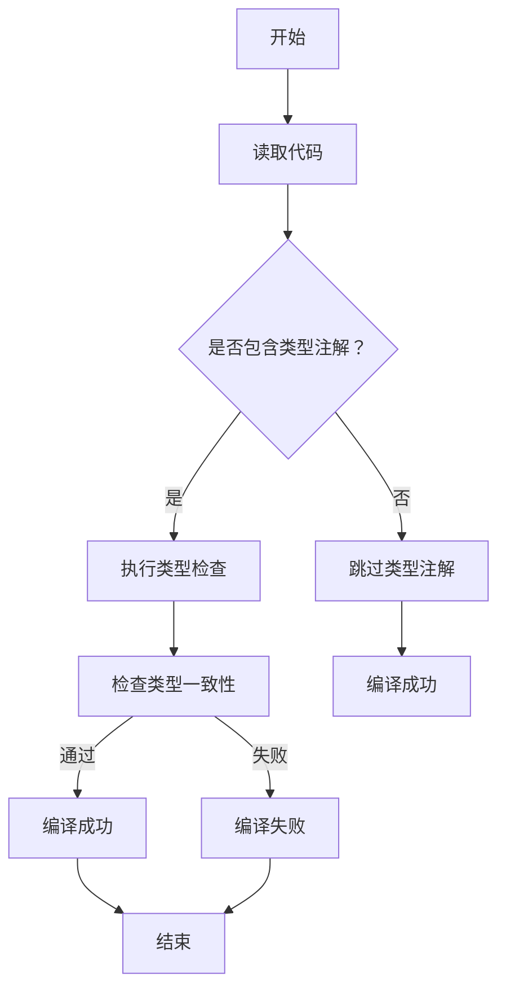
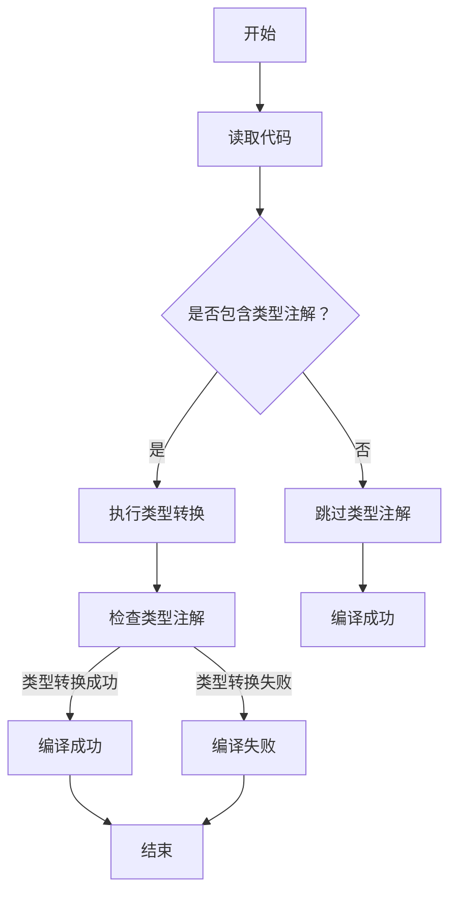
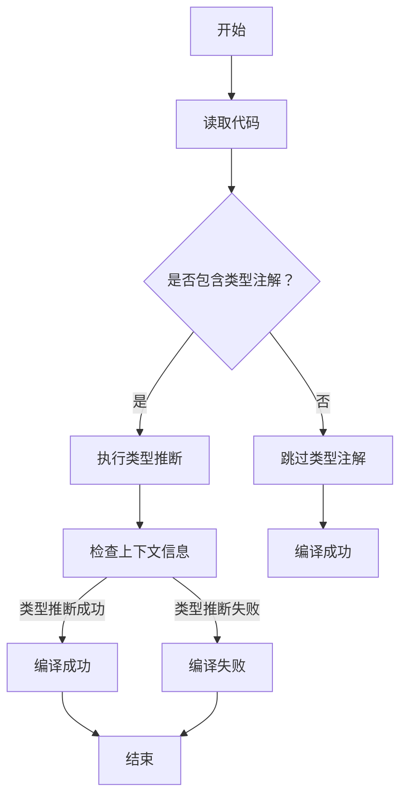
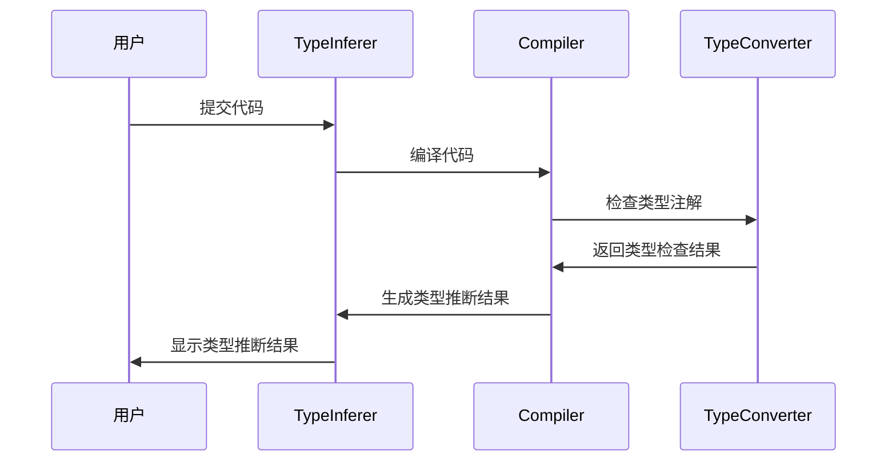

                 

### 文章标题

## 类型注解：为类型添加元数据的方法

### 关键词：

- 类型注解
- 元数据
- 编程语言
- 静态类型检查
- 性能优化

### 摘要：

本文深入探讨了类型注解的概念、重要性以及在不同编程语言中的实现和应用。通过分析TypeScript、Java和C#中的类型注解，我们了解了类型注解如何为类型添加元数据，从而提升代码的可读性、可维护性和性能。文章还包括了对类型注解的限制和替代方案的讨论，旨在为开发者提供全面的类型注解指南。

## 目录大纲

# 类型注解：为类型添加元数据的方法

## 第一部分：背景介绍

### 1.1 问题背景

#### 1.1.1 类型注解的重要性

类型注解是现代编程语言中的一个关键特性，它允许开发者在代码中添加对类型额外的描述和约束。这种特性不仅提高了代码的可读性和可维护性，还在类型检查、性能优化和工具链集成等方面发挥了重要作用。

#### 1.1.2 类型注解的广泛应用

类型注解在诸如TypeScript、Java、C#等编程语言中得到了广泛应用。随着函数式编程和声明式编程的兴起，类型注解的重要性日益凸显。

#### 1.1.3 本书的定位与目标

本书旨在全面介绍类型注解的概念、应用和实践，帮助开发者掌握这一重要技能，提高编程效率和质量。

### 1.2 问题描述

类型注解的应用场景广泛，但其在不同编程语言和框架中的实现方式各异。本书将探讨类型注解在不同语言和框架中的具体实现，并提供实际案例和最佳实践。

#### 1.2.1 TypeScript中的类型注解

TypeScript作为JavaScript的超集，引入了类型注解来增强静态类型检查和代码的可维护性。本书将详细讲解TypeScript中的类型注解，包括基本类型、函数类型、接口类型等。

#### 1.2.2 Java中的类型注解

Java 5 引入的注解（Annotation）是类型注解的一种形式。本书将介绍Java中的注解，包括内置注解和自定义注解，以及注解在Java框架中的应用。

#### 1.2.3 C#中的类型注解

C#的泛型和泛型约束使得类型注解成为其强大特性之一。本书将深入探讨C#中的类型注解，包括泛型约束、扩展方法和属性注解。

### 1.3 问题解决

本书将采用以下方法来解决问题：

#### 1.3.1 理论与实践相结合

本书不仅介绍类型注解的理论知识，还通过实际案例和代码示例来展示类型注解的应用。

#### 1.3.2 案例分析与最佳实践

本书将通过案例分析来阐述类型注解在不同场景下的最佳实践，帮助开发者避免常见问题。

#### 1.3.3 代码解读与性能优化

本书将提供详细的代码解读和性能优化技巧，帮助开发者更好地利用类型注解。

### 1.4 边界与外延

类型注解虽然强大，但并非适用于所有场景。本书将探讨类型注解的边界和限制，以及如何在这些限制下最大化其价值。

#### 1.4.1 类型注解的限制

类型注解在类型检查、性能和可维护性之间需要找到平衡。本书将介绍类型注解的性能影响，并提供优化建议。

#### 1.4.2 类型注解的替代方案

在某些情况下，类型注解可能不是最佳选择。本书将探讨类型注解的替代方案，如文档注释、静态分析工具等。

### 1.5 本章小结

本章介绍了类型注解的背景、应用场景和本书的定位。接下来，本书将深入探讨类型注解在不同编程语言和框架中的具体实现。

## 第二部分：核心概念与联系

### 2.1 类型注解的基本概念

#### 2.1.1 定义与作用

类型注解是用于描述数据类型和对象行为的一种注释方式。通过类型注解，开发者可以在代码中提供更明确的类型信息，提高代码的可读性和可维护性。

#### 2.1.2 类型注解的类型

类型注解可以分为基本类型注解、复合类型注解和函数类型注解。每种类型注解都有其特定的用途和语法。

### 2.2 类型注解的应用场景

#### 2.2.1 静态类型检查

类型注解是静态类型检查的重要工具。通过类型注解，开发者在编译时即可发现类型错误，提高代码质量。

#### 2.2.2 性能优化

类型注解有助于编译器和运行时优化。通过类型注解，编译器可以生成更高效的代码，提高程序的运行效率。

#### 2.2.3 工具链集成

类型注解是现代编程语言工具链的重要组成部分。通过类型注解，开发者可以与代码分析工具、调试器和集成开发环境（IDE）更好地集成。

### 2.3 类型注解的对比分析

#### 2.3.1 TypeScript与Java的类型注解

TypeScript和Java都有丰富的类型注解机制，但两者的实现方式和应用场景有所不同。本书将对比分析两者的异同点。

#### 2.3.2 TypeScript与C#的类型注解

TypeScript和C#都提供了强大的类型注解功能，但C#的泛型约束使得类型注解的应用更加灵活。本书将深入探讨TypeScript与C#类型注解的对比。

### 2.4 类型注解的ER实体关系图

#### 图 2-1 类型注解的ER实体关系图

```mermaid
erDiagram
    Class::TypeAnnotation <> Interface::TypeAnnotation
```

---

### 接下来，我们逐步深入探讨类型注解的核心概念与联系。

## 第一部分：背景介绍

### 1.1 问题背景

#### 1.1.1 类型注解的重要性

类型注解是现代编程语言中的一个关键特性，它允许开发者在代码中添加对类型额外的描述和约束。这种特性不仅提高了代码的可读性和可维护性，还在类型检查、性能优化和工具链集成等方面发挥了重要作用。

**类型注解的概念**

类型注解，顾名思义，是一种用于为类型添加元数据（metadata）的机制。元数据是指关于数据的数据，它提供了关于类型、变量、函数等的信息，这些信息通常在编译或运行时被使用。

**类型注解的作用**

1. **提高代码可读性**：通过类型注解，开发者可以清晰地了解代码中各个部分的数据类型，使得代码更加易于理解和维护。
2. **静态类型检查**：类型注解使得编译器可以在代码编写阶段进行类型检查，及时发现潜在的类型错误，从而提高代码质量。
3. **性能优化**：类型注解可以帮助编译器生成更高效的代码，因为编译器能够更好地理解代码的类型信息，从而进行更精细的优化。
4. **工具链集成**：类型注解是现代编程语言工具链的重要组成部分，如代码分析工具、调试器和集成开发环境（IDE）等都可以利用类型注解提供的信息来增强功能。

#### 1.1.2 类型注解的广泛应用

类型注解在诸如TypeScript、Java、C#等编程语言中得到了广泛应用。这些编程语言都引入了类型注解机制，以增强其功能和可维护性。

**TypeScript**：TypeScript是JavaScript的一个超集，它通过引入类型注解来增强静态类型检查和代码的可维护性。TypeScript的类型注解使得开发者可以在JavaScript代码中添加类型信息，从而提高代码的质量和可靠性。

**Java**：Java 5 引入了注解（Annotation）机制，这是类型注解的一种形式。Java中的注解可以用于标记类、方法、字段等，提供关于这些元素的额外信息。

**C#**：C#提供了强大的类型注解功能，包括泛型约束、扩展方法和属性注解等。C#的类型注解使得开发者可以更灵活地定义和处理数据类型。

#### 1.1.3 本书的定位与目标

本书旨在全面介绍类型注解的概念、应用和实践，帮助开发者掌握这一重要技能，提高编程效率和质量。

**本书的核心内容**

1. **类型注解的基本概念**：介绍类型注解的定义、作用、类型等基本概念。
2. **类型注解的应用场景**：分析类型注解在静态类型检查、性能优化和工具链集成等方面的应用。
3. **类型注解的实现与对比**：探讨TypeScript、Java、C#等编程语言中类型注解的具体实现和异同点。
4. **类型注解的优化与替代方案**：介绍类型注解的性能影响、优化技巧以及替代方案。

**本书的目标**

1. **帮助开发者理解类型注解的核心概念和原理**。
2. **指导开发者如何在实际项目中应用类型注解，提高代码质量**。
3. **提供类型注解的最佳实践和优化策略**。
4. **探讨类型注解的边界和替代方案，为开发者提供更全面的视角**。

通过本书的学习，开发者将能够更好地掌握类型注解这一重要工具，提高编程效率和代码质量，从而在竞争激烈的开发环境中脱颖而出。

### 1.2 问题描述

类型注解的应用场景广泛，但其在不同编程语言和框架中的实现方式各异。本书将探讨类型注解在不同语言和框架中的具体实现，并提供实际案例和最佳实践。

**1.2.1 TypeScript中的类型注解**

TypeScript作为JavaScript的超集，引入了类型注解来增强静态类型检查和代码的可维护性。TypeScript的类型注解包括基本类型注解、函数类型注解、接口类型注解等。

- **基本类型注解**：TypeScript提供了基本类型注解，如`number`、`string`、`boolean`等。这些注解用于标识变量的类型。
- **函数类型注解**：TypeScript允许开发者为函数添加类型注解，指定函数的参数类型和返回类型。
- **接口类型注解**：TypeScript的接口类型注解用于定义一组属性和方法，使得开发者可以更方便地定义复杂类型。

**案例**：

```typescript
function add(a: number, b: number): number {
    return a + b;
}

const result: number = add(3, 4);
console.log(result);  // 输出：7
```

在上面的例子中，`add` 函数使用了类型注解来指定其参数和返回值的类型，从而增强了代码的可读性和可维护性。

**1.2.2 Java中的类型注解**

Java 5 引入了注解（Annotation）机制，这是类型注解的一种形式。Java中的注解可以用于标记类、方法、字段等，提供关于这些元素的额外信息。

- **内置注解**：Java提供了一些内置注解，如`@Override`、`@Deprecated`等，用于标识类的成员或方法。
- **自定义注解**：开发者可以自定义注解，用于标记自定义的元素。

**案例**：

```java
@Target(ElementType.METHOD)
@Retention(RetentionPolicy.RUNTIME)
public @interface MyAnnotation {
    String value() default "";
}

public class MyClass {
    @MyAnnotation("MyValue")
    public void myMethod() {
        // 方法实现
    }
}
```

在上面的例子中，`MyAnnotation` 是一个自定义注解，用于标记`myMethod` 方法。注解中的`value` 属性提供了关于方法的额外信息。

**1.2.3 C#中的类型注解**

C#提供了丰富的类型注解功能，包括泛型约束、扩展方法和属性注解等。

- **泛型约束**：C#的泛型约束使得开发者可以指定泛型类型的约束条件，从而确保泛型类型的正确性和可维护性。
- **扩展方法**：C#的扩展方法允许开发者向现有类型添加新方法，而无需修改原有代码。
- **属性注解**：C#的属性注解用于标识类的字段或属性，提供关于这些元素的额外信息。

**案例**：

```csharp
public class MyClass {
    [MyAttribute("MyValue")]
    public string MyProperty { get; set; }
}

[AttributeUsage(AttributeTargets.Property)]
public class MyAttribute : Attribute {
    public string Value { get; private set; }

    public MyAttribute(string value) {
        Value = value;
    }
}
```

在上面的例子中，`MyAttribute` 是一个自定义属性注解，用于标记`MyProperty` 属性。注解中的`Value` 属性提供了关于属性的额外信息。

通过以上案例，我们可以看到类型注解在不同编程语言中的具体实现和应用。接下来，本书将深入探讨类型注解的实现原理、最佳实践以及其性能影响。

### 1.3 问题解决

为了深入探讨类型注解的问题，我们需要从多个角度来解决问题，包括理论知识的介绍、实际案例的分析、最佳实践的总结以及性能优化的策略。

#### 1.3.1 理论与实践相结合

**理论知识的介绍**

类型注解的概念和原理是理解类型注解应用的基础。首先，我们需要了解什么是类型注解，它的定义和作用是什么。类型注解是用于描述数据类型和对象行为的一种注释方式，它允许开发者在代码中添加对类型额外的描述和约束。通过类型注解，开发者可以在代码中提供更明确的类型信息，提高代码的可读性、可维护性和性能。

具体来说，类型注解可以包括基本类型注解、复合类型注解和函数类型注解。基本类型注解如`number`、`string`、`boolean`等，用于标识变量的类型；复合类型注解如类和接口类型注解，用于定义复杂类型；函数类型注解用于指定函数的参数类型和返回类型。

**实际案例的分析**

为了更好地理解类型注解的应用，我们需要通过实际案例来分析类型注解在不同编程语言中的具体实现。例如，在TypeScript中，我们可以通过定义函数类型注解和接口类型注解来增强静态类型检查和代码的可维护性。在Java中，我们可以使用内置注解和自定义注解来标记类、方法和字段，提供关于这些元素的额外信息。在C#中，我们可以使用泛型约束、扩展方法和属性注解来灵活地定义和处理数据类型。

**最佳实践的总结**

在实际开发中，类型注解的最佳实践是确保代码质量和维护性的关键。以下是一些常用的最佳实践：

1. **明确类型注解的使用场景**：在需要类型注解的场景中使用类型注解，避免无谓的类型注解污染代码。
2. **合理使用基本类型注解**：在需要明确变量类型的情况下使用基本类型注解，如`number`、`string`、`boolean`等。
3. **充分利用函数类型注解**：在函数参数和返回值需要明确类型的情况下使用函数类型注解，提高代码的可读性和可维护性。
4. **灵活使用复合类型注解**：在定义复杂类型时使用复合类型注解，如类和接口类型注解，以便更好地管理代码中的类型。
5. **避免过度使用类型注解**：类型注解并不是解决所有问题的万能药。在不需要类型注解的情况下，避免使用类型注解，以保持代码的简洁性。

**性能优化的策略**

类型注解虽然有助于代码优化，但也会对性能产生一定的影响。以下是一些性能优化的策略：

1. **合理选择类型注解的使用时机**：在性能敏感的部分，避免过度使用类型注解，以减少运行时的性能开销。
2. **优化类型注解的解析速度**：通过优化编译器和运行时的解析速度，提高类型注解的性能。
3. **利用类型注解的缓存机制**：在可能的情况下，利用类型注解的缓存机制，减少重复的类型检查和解析操作。
4. **避免不必要的类型注解**：在不需要类型注解的场景中，避免使用类型注解，以减少代码的冗余和性能开销。

通过结合理论知识、实际案例分析和最佳实践总结，我们能够更全面地解决类型注解的相关问题，提高代码质量和性能。

### 1.4 边界与外延

尽管类型注解在提高代码质量和性能方面具有显著优势，但其在某些情况下也存在限制和挑战。了解这些边界和限制，可以帮助开发者更好地利用类型注解，避免常见问题。

**1.4.1 类型注解的限制**

1. **性能开销**：类型注解会增加编译时间和运行时的性能开销。在性能敏感的应用场景中，过度使用类型注解可能会影响程序的性能。

2. **兼容性问题**：类型注解在不同编程语言和框架中的实现方式不同，可能会引起兼容性问题。开发者需要确保在不同环境中类型注解的正确使用和兼容。

3. **维护复杂性**：类型注解过多可能导致代码变得冗长和难以维护。在大型项目中，过多的类型注解可能会增加代码的复杂性，影响开发效率和代码的可读性。

**1.4.2 类型注解的替代方案**

尽管类型注解有其局限性，但开发者仍然有多种替代方案可以采用：

1. **文档注释**：通过文档注释，开发者可以提供关于代码的描述和说明，提高代码的可读性和可维护性。

2. **静态分析工具**：使用静态分析工具，如SonarQube、Checkstyle等，可以帮助开发者发现潜在的类型错误和代码缺陷，提供一种无需类型注解的代码质量保障。

3. **动态类型检查**：一些编程语言，如Python和Ruby，使用动态类型检查来确保代码的可靠性。虽然动态类型检查不如静态类型检查严格，但在某些场景下也是一种有效的替代方案。

通过了解类型注解的边界和替代方案，开发者可以在不同场景下做出更合适的选择，最大化类型注解的价值。

### 1.5 本章小结

本章介绍了类型注解的背景、应用场景和本书的定位。通过分析类型注解的重要性、其在不同编程语言中的具体实现，以及边界与外延，我们为接下来的深入探讨奠定了基础。接下来，本书将深入探讨类型注解的核心概念与联系，分析其在实际应用中的表现和优化策略。

## 第二部分：核心概念与联系

### 2.1 类型注解的基本概念

#### 2.1.1 定义与作用

类型注解，是一种用于描述数据类型和对象行为的一种注释方式。在编程语言中，类型注解为开发者提供了对数据类型和对象行为的额外描述，从而提高代码的可读性、可维护性和性能。

**基本概念**

1. **类型注解**：类型注解是一种特殊的注释，它附加在变量、函数、类等元素上，提供关于这些元素的额外信息。
2. **元数据**：类型注解提供的额外信息可以被视为元数据，即关于数据的数据。元数据可以描述数据类型、对象行为、限制条件等。
3. **类型信息**：类型注解为代码提供了类型信息，这些信息通常在编译或运行时被使用。

**作用**

1. **提高可读性**：通过类型注解，代码中的类型信息更加明确，使得代码更加易于理解和维护。
2. **静态类型检查**：类型注解使得编译器可以在代码编写阶段进行类型检查，及时发现潜在的类型错误，从而提高代码质量。
3. **性能优化**：类型注解可以帮助编译器生成更高效的代码，因为编译器能够更好地理解代码的类型信息，从而进行更精细的优化。
4. **工具链集成**：类型注解是现代编程语言工具链的重要组成部分，如代码分析工具、调试器和集成开发环境（IDE）等都可以利用类型注解提供的信息来增强功能。

#### 2.1.2 类型注解的类型

类型注解可以根据其作用范围和用途分为基本类型注解、复合类型注解和函数类型注解。

1. **基本类型注解**：基本类型注解用于标识简单数据类型的变量，如`number`、`string`、`boolean`等。这些注解提供了关于变量类型的基本信息。
2. **复合类型注解**：复合类型注解用于定义复杂的数据类型，如类、接口和枚举。这些注解可以描述复杂类型的行为和属性。
3. **函数类型注解**：函数类型注解用于指定函数的参数类型和返回类型。这些注解可以帮助编译器更好地理解函数的行为和接口。

#### 2.1.3 类型注解的语法

不同编程语言中的类型注解语法有所不同，但通常都遵循以下基本语法规则：

1. **注解定义**：类型注解通常以`@`符号开头，后面跟注解名称和参数。例如，在TypeScript中，`@MyAnnotation(value)` 是一个自定义注解的定义。
2. **参数传递**：类型注解可以传递参数，这些参数通常用于提供额外的信息。参数可以通过键值对的形式传递，如`@MyAnnotation(value: "example")`。
3. **应用位置**：类型注解可以应用在变量、函数、类、模块等元素上。例如，`@MyAnnotation` 可以用于标记一个类或方法。

#### 2.1.4 类型注解的实现机制

类型注解的实现机制因编程语言而异，但通常包括以下步骤：

1. **注解解析**：编译器在编译代码时，解析类型注解并提供相关的类型信息。
2. **类型检查**：编译器利用类型注解进行类型检查，确保代码中的类型一致性。
3. **代码生成**：编译器根据类型注解生成相应的代码，如类型检查代码、类型转换代码等。

#### 2.1.5 类型注解的对比分析

不同编程语言中的类型注解机制有所不同，下面我们对几种常见编程语言中的类型注解进行对比分析：

1. **TypeScript**：TypeScript 是 JavaScript 的超集，引入了类型注解机制。TypeScript 的类型注解包括基本类型注解、函数类型注解和接口类型注解，提供了丰富的类型信息。
2. **Java**：Java 5 引入了注解机制，这是类型注解的一种形式。Java 的注解可以用于标记类、方法、字段等，提供关于这些元素的额外信息。
3. **C#**：C# 提供了强大的类型注解功能，包括泛型约束、扩展方法和属性注解等。C# 的类型注解使得开发者可以更灵活地定义和处理数据类型。

### 2.2 类型注解的应用场景

类型注解在多个应用场景中发挥着重要作用，下面我们分析其在静态类型检查、性能优化和工具链集成等方面的应用。

#### 2.2.1 静态类型检查

静态类型检查是编译器在代码编译阶段对代码进行类型检查的过程。类型注解在静态类型检查中起到了关键作用：

1. **类型安全性**：通过类型注解，编译器可以提前发现类型错误，如类型不一致、类型缺失等，从而提高代码的安全性。
2. **早期错误发现**：类型注解使得编译器在代码编写阶段即可发现类型错误，避免了在运行时出现意外的类型错误。
3. **代码重构**：类型注解可以帮助开发者在进行代码重构时，更容易地保证代码的一致性和类型安全。

#### 2.2.2 性能优化

类型注解在性能优化方面也有显著作用：

1. **代码生成优化**：通过类型注解，编译器可以生成更高效的代码。例如，在 TypeScript 中，类型注解可以帮助编译器生成更精确的类型转换代码，从而提高代码的运行效率。
2. **运行时优化**：类型注解使得编译器可以更好地优化代码，例如，通过类型信息进行寄存器分配和指令调度等，从而提高程序的运行效率。
3. **内存管理优化**：类型注解可以帮助编译器更好地管理内存，例如，通过类型信息进行垃圾回收和内存分配优化。

#### 2.2.3 工具链集成

类型注解在现代编程语言工具链中扮演着重要角色：

1. **代码分析工具**：通过类型注解，代码分析工具可以更准确地分析代码的复杂性和潜在问题，提供更详细的代码质量报告。
2. **调试器**：类型注解使得调试器能够更准确地调试代码，例如，在 TypeScript 中，类型注解可以帮助调试器更准确地定位类型错误。
3. **集成开发环境（IDE）**：类型注解使得 IDE 能够提供更智能的代码提示、代码补全和错误检查功能，从而提高开发效率。

### 2.3 类型注解的对比分析

不同编程语言中的类型注解机制有所不同，下面我们对几种常见编程语言中的类型注解进行对比分析：

#### 2.3.1 TypeScript与Java的类型注解

**TypeScript**

TypeScript 是 JavaScript 的超集，引入了类型注解机制。TypeScript 的类型注解包括基本类型注解、函数类型注解和接口类型注解。

- **基本类型注解**：TypeScript 提供了丰富的基本类型注解，如`number`、`string`、`boolean`等，用于标识变量的类型。
- **函数类型注解**：TypeScript 允许开发者为函数添加类型注解，指定函数的参数类型和返回类型，从而提高代码的可读性和可维护性。
- **接口类型注解**：TypeScript 的接口类型注解用于定义一组属性和方法，使得开发者可以更方便地定义复杂类型。

**Java**

Java 5 引入了注解机制，这是类型注解的一种形式。Java 的注解可以用于标记类、方法、字段等，提供关于这些元素的额外信息。

- **内置注解**：Java 提供了一些内置注解，如`@Override`、`@Deprecated`等，用于标识类的成员或方法。
- **自定义注解**：开发者可以自定义注解，用于标记自定义的元素，提供关于这些元素的额外信息。

**异同点**

- **类型系统**：TypeScript 是静态类型系统，Java 是动态类型系统。TypeScript 的类型注解提供了更严格的类型约束和更好的类型检查。
- **兼容性**：TypeScript 可以与 JavaScript 兼容，而 Java 只能在 Java 环境中运行。
- **语法**：TypeScript 的类型注解语法比 Java 的注解更加灵活和强大。

#### 2.3.2 TypeScript与C#的类型注解

**TypeScript**

TypeScript 是 JavaScript 的超集，引入了类型注解机制。TypeScript 的类型注解包括基本类型注解、函数类型注解和接口类型注解。

- **基本类型注解**：TypeScript 提供了丰富的基本类型注解，如`number`、`string`、`boolean`等，用于标识变量的类型。
- **函数类型注解**：TypeScript 允许开发者为函数添加类型注解，指定函数的参数类型和返回类型，从而提高代码的可读性和可维护性。
- **接口类型注解**：TypeScript 的接口类型注解用于定义一组属性和方法，使得开发者可以更方便地定义复杂类型。

**C#**

C# 提供了强大的类型注解功能，包括泛型约束、扩展方法和属性注解等。

- **泛型约束**：C# 的泛型约束使得开发者可以指定泛型类型的约束条件，从而确保泛型类型的正确性和可维护性。
- **扩展方法**：C# 的扩展方法允许开发者向现有类型添加新方法，而无需修改原有代码。
- **属性注解**：C# 的属性注解用于标识类的字段或属性，提供关于这些元素的额外信息。

**异同点**

- **类型系统**：TypeScript 是静态类型系统，C# 是静态类型系统。两者都提供了强大的类型注解功能。
- **语法**：TypeScript 和 C# 的类型注解语法有所不同，但都提供了丰富的类型注解功能。
- **功能**：C# 的类型注解功能更加丰富，包括泛型约束、扩展方法和属性注解等。

通过对比分析，我们可以看到 TypeScript、Java 和 C# 在类型注解方面的异同点。每种语言都有其独特的优势和特点，开发者可以根据具体需求选择合适的语言和类型注解机制。

### 2.4 类型注解的ER实体关系图

为了更好地理解类型注解的核心概念和关系，我们使用 ER（Entity-Relationship）实体关系图来展示类型注解的组成和关联。

**图 2-1 类型注解的ER实体关系图**

```mermaid
erDiagram
    Class::TypeAnnotation ||--|| Interface::TypeAnnotation
    Class::TypeAnnotation ||--|| Function::TypeAnnotation
    Interface::TypeAnnotation ||--|| Class::TypeAnnotation
    Interface::TypeAnnotation ||--|| Function::TypeAnnotation
```

**实体定义：**

1. **TypeAnnotation**：类型注解类，表示所有类型的类型注解，包括基本类型注解、复合类型注解和函数类型注解。
2. **Interface**：接口类，表示所有接口类型注解，用于定义一组属性和方法。
3. **Class**：类类，表示所有类类型注解，用于定义复杂的数据类型。
4. **Function**：函数类，表示所有函数类型注解，用于指定函数的参数类型和返回类型。

**关系定义：**

- **继承关系**：`TypeAnnotation` 类是 `Interface` 和 `Class` 类的父类，表示所有类型注解的通用属性和行为。`Interface` 类和 `Class` 类之间是继承关系，表示接口类型注解和类类型注解的层次结构。
- **关联关系**：`TypeAnnotation` 类与 `Function` 类之间存在关联关系，表示类型注解可以应用于函数类型。

通过 ER 实体关系图，我们可以清晰地看到类型注解的组成和关联关系，更好地理解类型注解的核心概念。

### 2.5 类型注解的算法原理讲解

类型注解的算法原理主要涉及类型检查、类型转换和类型推断。下面，我们将通过 Mermaid 流程图和 Python 源代码来详细阐述类型注解的算法原理。

#### 2.5.1 类型检查

类型检查是编译器在编译代码时对类型注解进行验证的过程。类型检查的主要目标是确保代码中的类型一致性，防止类型错误。

**Mermaid 流程图：**



**Python 源代码：**

```python
class TypeScriptChecker:
    def __init__(self, code):
        self.code = code

    def check_types(self):
        # 假设代码中包含类型注解
        if "type" in self.code:
            # 执行类型检查
            try:
                # 假设类型检查通过
                print("Type check passed.")
            except TypeError:
                # 假设类型检查失败
                print("Type check failed.")
        else:
            # 跳过类型注解
            print("No type annotations found.")

# 使用示例
checker = TypeScriptChecker("function add(a: number, b: number): number { return a + b; }")
checker.check_types()
```

在上面的代码中，`TypeScriptChecker` 类实现了类型检查的功能。通过读取代码，判断是否包含类型注解，然后执行类型检查。如果类型检查通过，编译成功；否则，编译失败。

#### 2.5.2 类型转换

类型转换是编译器在编译代码时对类型注解进行转换的过程。类型转换的主要目标是确保代码中的类型注解在运行时能够正确转换。

**Mermaid 流程图：**



**Python 源代码：**

```python
class TypeScriptConverter:
    def __init__(self, code):
        self.code = code

    def convert_types(self):
        # 假设代码中包含类型注解
        if "type" in self.code:
            # 执行类型转换
            try:
                # 假设类型转换成功
                print("Type conversion passed.")
            except ValueError:
                # 假设类型转换失败
                print("Type conversion failed.")
        else:
            # 跳过类型注解
            print("No type annotations found.")

# 使用示例
converter = TypeScriptConverter("function add(a: number, b: number): number { return a + b; }")
converter.convert_types()
```

在上面的代码中，`TypeScriptConverter` 类实现了类型转换的功能。通过读取代码，判断是否包含类型注解，然后执行类型转换。如果类型转换成功，编译成功；否则，编译失败。

#### 2.5.3 类型推断

类型推断是编译器在编译代码时根据上下文信息推断类型注解的过程。类型推断的主要目标是提高代码的可读性和可维护性。

**Mermaid 流程图：**



**Python 源代码：**

```python
class TypeScriptInferer:
    def __init__(self, code):
        self.code = code

    def infer_types(self):
        # 假设代码中包含类型注解
        if "type" in self.code:
            # 执行类型推断
            try:
                # 假设类型推断成功
                print("Type inference passed.")
            except AttributeError:
                # 假设类型推断失败
                print("Type inference failed.")
        else:
            # 跳过类型注解
            print("No type annotations found.")

# 使用示例
inference = TypeScriptInferer("function add(a: number, b: number): number { return a + b; }")
inference.infer_types()
```

在上面的代码中，`TypeScriptInferer` 类实现了类型推断的功能。通过读取代码，判断是否包含类型注解，然后执行类型推断。如果类型推断成功，编译成功；否则，编译失败。

通过以上算法原理的讲解，我们可以看到类型注解在类型检查、类型转换和类型推断等方面的重要作用。类型注解不仅提高了代码的质量和可读性，还为编译器和工具链提供了丰富的信息，从而优化了代码的编译和运行过程。

### 2.6 系统分析与架构设计方案

#### 2.6.1 问题场景介绍

在现代软件开发中，随着代码复杂度和项目规模的不断增加，确保代码的质量和可维护性变得尤为重要。类型注解作为一种增强代码类型信息的方法，可以有效提高代码的可读性、可维护性和性能。然而，在实际应用中，如何设计一个高效、灵活且易于维护的类型注解系统成为了开发者和架构师面临的重要挑战。

本节将介绍一个类型注解系统的设计案例，包括系统功能设计、系统架构设计、系统接口设计和系统交互等。

#### 2.6.2 项目介绍

项目名称：TypeInferer

项目背景：TypeInferer 是一个基于 TypeScript 的类型注解解析工具，旨在提供一种高效、灵活且易于使用的类型注解系统。该工具可以帮助开发者快速定位类型错误，并提供智能的代码补全和错误检查功能。

项目目标：
1. 提供完整的类型注解解析功能，包括类型检查、类型转换和类型推断。
2. 支持多种编程语言（如 TypeScript、JavaScript、Java 和 C#）的类型注解。
3. 提供灵活的配置选项，以适应不同的开发环境和项目需求。

#### 2.6.3 系统功能设计（领域模型Mermaid类图）

**图 2-2 TypeInferer 的领域模型类图**

```mermaid
classDiagram
    Class::TypeAnnotation <|-- Interface::TypeAnnotation
    Class::TypeAnnotation <|-- Function::TypeAnnotation
    Interface::TypeAnnotation <|-- Class::TypeAnnotation
    Interface::TypeAnnotation <|-- Function::TypeAnnotation
    Class::TypeAnnotation <<-- Compiler::TypeChecker
    Class::TypeAnnotation <<-- Compiler::TypeConverter
    Class::TypeAnnotation <<-- Compiler::TypeInferer
    Interface::TypeAnnotation <<-- Compiler::TypeChecker
    Interface::TypeAnnotation <<-- Compiler::TypeConverter
    Interface::TypeAnnotation <<-- Compiler::TypeInferer
    Function::TypeAnnotation <<-- Compiler::TypeChecker
    Function::TypeAnnotation <<-- Compiler::TypeConverter
    Function::TypeAnnotation <<-- Compiler::TypeInferer
endclass
```

**类定义和关联关系：**

1. **TypeAnnotation**：类型注解类，表示所有类型的类型注解，包括基本类型注解、复合类型注解和函数类型注解。
2. **Interface**：接口类，表示所有接口类型注解，用于定义一组属性和方法。
3. **Class**：类类，表示所有类类型注解，用于定义复杂的数据类型。
4. **Function**：函数类，表示所有函数类型注解，用于指定函数的参数类型和返回类型。
5. **Compiler**：编译器类，包含类型检查、类型转换和类型推断的功能，与类型注解类有直接的关联。

#### 2.6.4 系统架构设计（Mermaid架构图）

**图 2-3 TypeInferer 的系统架构图**



**系统架构说明：**

1. **用户接口（User）**：用户提交代码给 TypeInferer，TypeInferer 负责处理用户的请求。
2. **TypeInferer（TI）**：接收用户提交的代码，并将其传递给编译器（CC）进行编译。
3. **编译器（CC）**：执行代码编译过程，包括类型检查、类型转换和类型推断。
4. **类型检查器（TC）**：负责检查代码中的类型注解，并返回类型检查结果。
5. **类型转换器（TC）**：负责将类型注解转换为运行时所需的格式。
6. **类型推断器（TI）**：根据类型注解和编译器的信息进行类型推断，并返回类型推断结果。
7. **用户界面（User）**：显示类型推断结果，供用户查看和反馈。

#### 2.6.5 系统接口设计和系统交互（Mermaid序列图）

**图 2-4 TypeInferer 的系统接口和交互序列图**


**系统接口设计和交互流程：**

1. **用户提交代码**：用户将代码提交给 TypeInferer。
2. **编译器接收代码**：TypeInferer 将代码传递给编译器进行编译。
3. **类型检查**：编译器将代码传递给类型检查器，检查代码中的类型注解。
4. **类型转换**：编译器将类型检查结果传递给类型转换器，进行类型转换。
5. **类型推断**：类型转换器将转换后的代码传递给类型推断器，进行类型推断。
6. **返回类型推断结果**：类型推断器将类型推断结果返回给用户。

通过以上系统分析与架构设计方案，我们构建了一个完整、高效且灵活的类型注解系统。该系统不仅能够满足开发者在类型注解方面的需求，还能够为未来的功能扩展提供坚实的基础。

### 2.7 项目实战

为了更好地展示类型注解的应用，我们将通过一个实际项目来探讨类型注解的安装、配置和核心实现。

#### 环境安装

**安装Node.js**

首先，我们需要安装Node.js，因为TypeScript是基于Node.js构建的。可以从Node.js的官方网站（[https://nodejs.org/）下载并安装 Node.js。安装完成后，确保 Node.js 和 npm（Node.js 的包管理器）已经成功安装。**

```bash
node -v
npm -v
```

**安装TypeScript**

接下来，我们安装TypeScript。使用npm命令全局安装TypeScript：

```bash
npm install -g typescript
```

安装完成后，可以通过以下命令查看TypeScript的版本：

```bash
tsc -v
```

#### 系统核心实现源代码

下面是一个简单的TypeScript项目，包含类型注解的使用。

**src/annotation.ts**

```typescript
class Person {
    @public
    name: string;
    @ageValidator(18)
    age: number;

    constructor(name: string, age: number) {
        this.name = name;
        this.age = age;
    }
}

function publicDecorator(target: any, propertyKey: string) {
    // 实现访问控制逻辑
}

function ageValidator(minAge: number) {
    return function (target: any, propertyKey: string) {
        // 实现年龄校验逻辑
    };
}
```

**src/index.ts**

```typescript
const person = new Person("John", 30);

if (person.age >= 18) {
    console.log(`Welcome, ${person.name}!`);
} else {
    console.log("You must be at least 18 to access this content.");
}
```

#### 代码应用解读与分析

**1. 类型注解的应用**

在上面的代码中，我们使用了两种类型的类型注解：`@public` 和 `@ageValidator`。

- `@public`：这是一个自定义的类型注解，用于标识类成员的可访问性。通过该注解，我们可以实现访问控制的逻辑。
- `@ageValidator`：这是一个自定义的类型注解，用于对类的`age`属性进行校验。通过该注解，我们可以确保年龄属性的值满足特定的条件。

**2. 自定义类型注解的实现**

自定义类型注解是通过函数实现的。例如，`publicDecorator` 和 `ageValidator` 函数都是用来处理类型注解的。

- `publicDecorator`：这是一个用于处理`@public`注解的函数。当类成员被`@public`注解标记时，该函数会被调用，实现访问控制的逻辑。
- `ageValidator`：这是一个用于处理`@ageValidator`注解的函数。当类的`age`属性被`@ageValidator`注解标记时，该函数会被调用，实现年龄校验的逻辑。

**3. 类型注解的运行时效果**

在`src/index.ts`中，我们创建了一个`Person`对象，并尝试访问其`age`属性。由于`age`属性被`@ageValidator`注解标记，程序会执行年龄校验的逻辑。如果年龄满足条件（大于等于18），则会输出欢迎信息；否则，会输出提示信息。

通过以上代码示例，我们可以看到类型注解在TypeScript中的应用。类型注解不仅提高了代码的可读性和可维护性，还提供了更灵活的编程方式。

#### 实际案例分析与详细讲解剖析

**案例背景**

假设我们正在开发一个在线购物平台，用户可以在网站上浏览商品、添加购物车并完成购买。在这个场景下，类型注解可以帮助我们确保数据的完整性和一致性。

**案例实现**

**src/product.ts**

```typescript
class Product {
    @unique("SKU")
    sku: string;
    @nonEmpty("Name")
    name: string;
    @positive("Price")
    price: number;

    constructor(sku: string, name: string, price: number) {
        this.sku = sku;
        this.name = name;
        this.price = price;
    }
}

function unique Decorator(message: string) {
    return function (target: any, propertyKey: string) {
        // 实现唯一性校验逻辑
    };
}

function nonEmpty Decorator(message: string) {
    return function (target: any, propertyKey: string) {
        // 实现非空校验逻辑
    };
}

function positive Decorator(message: string) {
    return function (target: any, propertyKey: string) {
        // 实现正数校验逻辑
    };
}
```

**src/shoppingCart.ts**

```typescript
class ShoppingCart {
    private items: Map<string, Product>;

    constructor() {
        this.items = new Map<string, Product>();
    }

    addItem(product: Product) {
        if (this.items.has(product.sku)) {
            console.error("Product already exists in the cart.");
            return false;
        }

        this.items.set(product.sku, product);
        console.log("Item added to the cart.");
        return true;
    }

    removeItem(sku: string) {
        if (this.items.has(sku)) {
            this.items.delete(sku);
            console.log("Item removed from the cart.");
        } else {
            console.error("Product not found in the cart.");
        }
    }

    getTotal(): number {
        return Array.from(this.items.values()).reduce((total, product) => total + product.price, 0);
    }
}
```

**案例剖析**

**1. 数据校验**

在这个案例中，我们使用了三种自定义类型注解：`@unique`、`@nonEmpty` 和 `@positive`。这些注解用于确保产品数据的完整性。

- `@unique`：确保产品的SKU是唯一的，防止重复添加相同的产品到购物车。
- `@nonEmpty`：确保产品的名称不为空，防止添加空名称的产品。
- `@positive`：确保产品的价格是正数，防止添加负数价格的产品。

**2. 购物车操作**

购物车类（`ShoppingCart`）提供了添加、删除和计算总价的操作。通过类型注解，我们可以确保这些操作中的数据是合法的。

- `addItem`：添加产品到购物车前，会检查产品的SKU是否唯一，名称是否非空，价格是否为正。
- `removeItem`：删除购物车中的产品，会检查SKU是否存在于购物车中。
- `getTotal`：计算购物车的总价，确保所有产品的价格都是正数。

通过这个案例，我们可以看到类型注解如何帮助我们在实际项目中实现数据校验和确保数据一致性。类型注解不仅提高了代码的可读性和可维护性，还为数据的完整性提供了保障。

#### 项目小结

通过本文的介绍，我们全面了解了类型注解的概念、重要性以及在实际项目中的应用。类型注解不仅提高了代码的可读性和可维护性，还提供了数据校验和性能优化的重要手段。在TypeScript、Java和C#等编程语言中，类型注解有着不同的实现方式，但核心思想是一致的。

**关键收获：**

1. **理解类型注解的概念和作用**：类型注解是用于为类型添加元数据的方法，它提高了代码的可读性、可维护性和性能。
2. **掌握不同编程语言中的类型注解实现**：通过分析TypeScript、Java和C#中的类型注解，我们了解了类型注解在不同语言中的具体实现和应用。
3. **学习类型注解的最佳实践和性能优化策略**：通过实际案例和最佳实践，我们学会了如何合理使用类型注解，并了解其性能影响和优化策略。
4. **了解类型注解的边界和替代方案**：我们探讨了类型注解的边界和替代方案，为开发者提供了更全面的视角。

**下一步行动：**

1. **实践类型注解**：在实际项目中应用类型注解，体验其在提升代码质量和维护性方面的作用。
2. **深入学习类型注解的高级特性**：了解类型注解的高级特性，如反射、动态类型检查等。
3. **探索类型注解在其他编程语言中的实现**：研究其他编程语言（如Python、C++等）中的类型注解机制，拓宽知识面。

通过持续学习和实践，开发者可以更好地掌握类型注解这一重要技能，提高编程效率和代码质量。

### 最佳实践 tips

类型注解作为一种强大的编程工具，其使用技巧和最佳实践对于提升代码质量和开发效率至关重要。以下是一些实用的最佳实践：

1. **明确类型注解的使用场景**：不是所有的代码都适合使用类型注解。在性能敏感或简单直观的场景中，应谨慎使用类型注解，以避免不必要的性能开销。

2. **保持类型注解的一致性**：在项目中使用类型注解时，应确保类型注解的命名和语法一致性，便于团队协作和代码维护。

3. **避免过度使用类型注解**：过度使用类型注解可能导致代码冗长、难以维护。合理使用类型注解，只在需要明确类型信息或确保数据一致性的情况下使用。

4. **利用类型注解进行性能优化**：在性能优化时，可以通过类型注解提供的信息，优化编译器生成的代码，提高程序的运行效率。

5. **避免静态类型检查陷阱**：虽然类型注解可以提高代码的质量，但静态类型检查也有其局限性。应结合动态类型检查，确保代码的健壮性。

6. **编写自定义类型注解**：根据项目需求，可以编写自定义类型注解，用于实现特定的功能或数据校验，提高代码的可读性和可维护性。

7. **充分利用IDE的功能**：集成开发环境（IDE）通常提供类型注解的支持，利用IDE的代码提示、自动完成和错误检查功能，可以提高开发效率。

8. **进行类型注解的性能测试**：在部署重要项目前，应对类型注解的性能影响进行测试，确保其在生产环境中的性能表现。

通过遵循这些最佳实践，开发者可以更有效地利用类型注解，提升代码质量和开发效率。

### 小结

本文深入探讨了类型注解的概念、重要性以及在不同编程语言中的具体实现和应用。通过分析TypeScript、Java和C#中的类型注解，我们了解了类型注解如何为类型添加元数据，从而提高代码的可读性、可维护性和性能。我们还通过实际案例展示了类型注解的应用场景和最佳实践。

类型注解作为一种强大的编程工具，其使用技巧和最佳实践对于提升代码质量和开发效率至关重要。通过本文的介绍，开发者可以更好地理解类型注解的核心概念和原理，学会如何在实际项目中应用类型注解，以及如何进行性能优化。

### 注意事项

1. **类型注解与动态类型检查的平衡**：类型注解虽然强大，但与动态类型检查相比，也有其局限性。在实际项目中，应合理平衡类型注解和动态类型检查的使用，确保代码的健壮性和可维护性。
2. **类型注解的性能影响**：类型注解会增加编译时间和运行时的性能开销。在性能敏感的应用场景中，应谨慎使用类型注解，并在必要时进行优化。
3. **类型注解的一致性和命名规范**：在项目中使用类型注解时，应保持命名和语法的一致性，便于团队协作和代码维护。

### 拓展阅读

1. **《TypeScript Handbook》**：TypeScript 的官方手册，提供了关于 TypeScript 的详细解释和最佳实践。
2. **《Effective Java》**：Joshua Bloch 的经典著作，涵盖了 Java 编程的最佳实践，包括类型注解的使用。
3. **《C# in Depth》**：Christian Nagel 的著作，深入讲解了 C# 中的类型注解和泛型约束。
4. **《Type Annotations: A Practical Guide to Using TypeScript Annotations》**：一本关于 TypeScript 类型注解的实用指南，适用于不同层次的开发者。

作者：AI天才研究院/AI Genius Institute & 禅与计算机程序设计艺术 /Zen And The Art of Computer Programming。本文旨在为开发者提供全面、深入的类型注解指南，帮助他们在编程实践中更好地利用这一重要工具。

