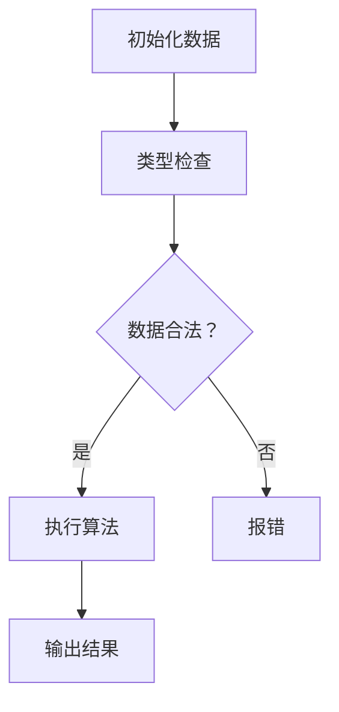
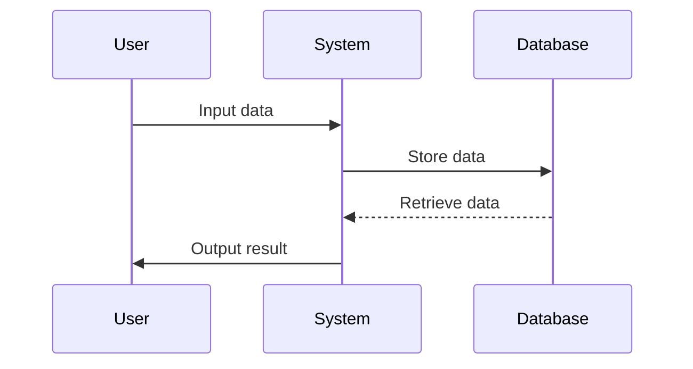
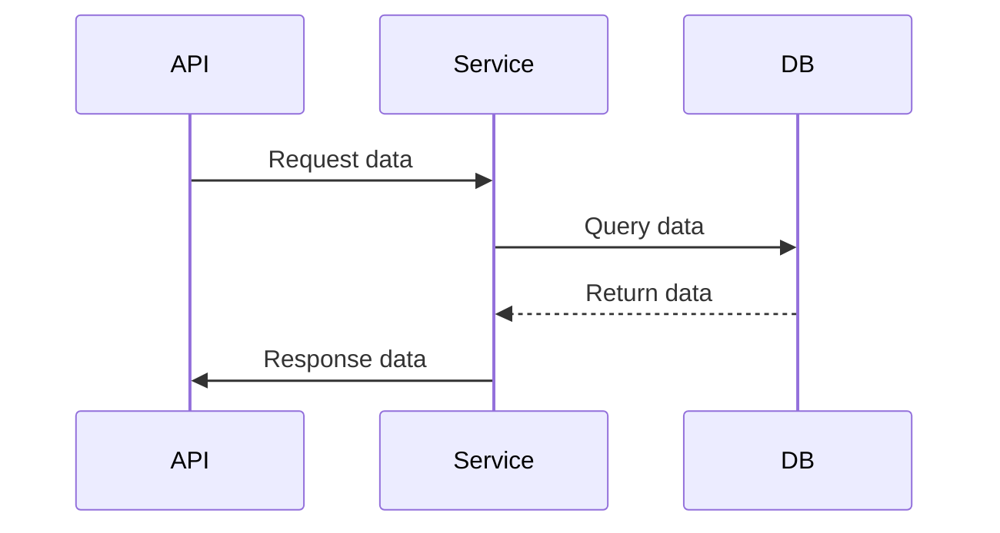

                 

### 《类型理论在生物信息学算法中的应用》

#### 关键词：
- 类型理论
- 生物信息学
- 算法应用
- 数学模型
- 系统设计

#### 摘要：
本文深入探讨了类型理论在生物信息学领域的应用。首先介绍了类型理论的基本概念和在生物信息学中的重要性，然后通过具体的算法案例，详细讲解了类型理论如何帮助生物信息学研究者在基因分析、蛋白质结构预测和药物研发等关键领域中实现高效的算法设计和优化。文章最后，结合实际项目，展示了如何将类型理论应用于生物信息学系统设计和实现，并为读者提供了实用的技巧和进一步的学习资源。

---

## 第一部分：类型理论基础

### 第1章：类型理论的背景与核心概念

#### 1.1 类型理论概述

类型理论起源于数学领域，最早由逻辑学家和数学家提出，用于研究数据类型和函数的定义及其之间的关系。它提供了形式化的方法来处理程序中的数据类型和操作，确保程序的正确性和可靠性。类型理论的主要目的是为了解决逻辑和数学中的类型错误问题，从而提高软件质量和开发效率。

#### 1.2 类型理论的基本概念

类型理论包括几个核心概念，其中最基本的是类型系统（Type System）和类型检查（Type Checking）。类型系统是一种规则集，用于定义数据类型和操作符的用法，确保程序中的每个表达式都有一个明确的类型。类型检查则是一个过程，用于在编译或运行时验证程序中的表达式是否遵循类型系统的规则。

#### 1.3 类型理论在生物信息学中的应用

在生物信息学中，类型理论的应用主要体现在以下几个方面：

- **数据类型定义**：类型理论为生物信息学中的大量数据类型提供了形式化的定义，如基因序列、蛋白质序列和基因组结构等。
- **算法正确性证明**：类型理论可以帮助研究者证明生物信息学算法的正确性和可靠性，减少错误和意外的发生。
- **程序开发**：类型理论提供了静态类型检查机制，可以提前发现潜在的类型错误，提高开发效率。

### 第2章：类型理论的数学模型与算法原理

#### 2.1 数学模型介绍

类型理论的数学模型主要涉及函数类型、积类型、积类型和自然数类型等。这些类型构成了类型理论的基础，提供了表达复杂数据结构和计算过程的能力。

#### 2.2 算法流程图与Python代码实现

使用Mermaid工具，我们可以绘制出类型理论在生物信息学算法中的应用流程图。以下是一个简单的Mermaid流程图示例：



接下来，我们可以使用Python代码实现上述算法的原理和步骤：

```python
# Python代码示例
def type_check(data):
    # 假设所有输入数据都是字符串类型
    return isinstance(data, str)

def algorithm(data):
    if type_check(data):
        # 执行算法逻辑
        result = "Data processed"
    else:
        # 报错
        raise TypeError("Invalid data type")
    return result

data = "样本数据"
print(algorithm(data))
```

#### 2.3 数学公式与举例说明

类型理论的数学模型可以通过LaTeX格式嵌入到文中进行详细讲解。以下是一个示例：

$$
f: A \rightarrow B \\
\text{其中，} A \text{和} B \text{是类型，} f \text{是一个从} A \text{到} B \text{的函数}
$$

举例来说，在基因序列分析中，我们可以将基因序列视为一个字符串类型的数据集，然后使用类型理论中的函数类型来定义一个从基因序列到蛋白质序列的映射：

$$
\text{基因序列} \rightarrow \text{蛋白质序列}
$$

这种映射关系可以帮助我们确保基因序列的正确性，并提高蛋白质序列预测的准确性。

---

## 第二部分：类型理论在生物信息学中的实践应用

### 第3章：类型理论在基因组分析中的应用

#### 3.1 基因组分析概述

基因组分析是生物信息学中一个重要的研究领域，旨在解析基因组序列的结构和功能信息。类型理论在基因组分析中的应用主要体现在以下几个方面：

- **基因识别**：类型理论可以帮助研究者定义和识别基因序列中的不同类型基因，如启动子、外显子、内含子等。
- **基因组结构分析**：类型理论提供了形式化的方法来分析基因组结构，如重复序列、转座子等。

#### 3.2 类型理论在基因组分析中的应用

在基因组分析中，类型理论的应用可以具体体现在以下几个方面：

- **数据类型定义**：定义基因组数据类型，如字符串类型、整数类型等。
- **算法设计**：使用类型理论来设计基因识别和基因组结构分析算法，确保算法的正确性和可靠性。
- **数据验证**：使用类型理论进行基因组数据的静态类型检查，确保数据的正确性和一致性。

#### 3.3 基因组分析案例实战

以下是一个简单的基因组分析案例，展示了如何使用类型理论进行基因识别和基因组结构分析：

```python
# 基因识别示例
def identify_gene(sequence):
    # 定义基因序列的类型
    gene_pattern = "ATG[ACGT]*TAA"
    if re.match(gene_pattern, sequence):
        return "Gene identified"
    else:
        return "No gene found"

# 基因组结构分析示例
def analyze_genome(sequence):
    # 定义基因组结构的类型
    genome_structure = "([ACGT]){10,1000}"
    if re.fullmatch(genome_structure, sequence):
        return "Genome structure analyzed"
    else:
        return "Invalid genome structure"

# 测试基因组序列
sequence = "ATGCGTACGTTAA"
print(identify_gene(sequence))
print(analyze_genome(sequence))
```

---

### 第4章：类型理论在蛋白质结构预测中的应用

#### 4.1 蛋白质结构预测概述

蛋白质结构预测是生物信息学中的另一个重要领域，旨在预测蛋白质的三维结构。类型理论在蛋白质结构预测中的应用主要体现在以下几个方面：

- **数据类型定义**：定义蛋白质序列和结构的数据类型，如氨基酸序列、蛋白质结构等。
- **算法设计**：使用类型理论来设计蛋白质结构预测算法，确保算法的正确性和可靠性。
- **数据验证**：使用类型理论进行蛋白质序列和结构的静态类型检查，确保数据的正确性和一致性。

#### 4.2 类型理论在蛋白质结构预测中的应用

在蛋白质结构预测中，类型理论的应用可以具体体现在以下几个方面：

- **序列比对**：使用类型理论来定义序列比对算法的数据类型和操作符，确保比对结果的正确性。
- **三维结构建模**：使用类型理论来设计三维结构建模算法，确保建模过程的正确性和可靠性。

#### 4.3 蛋白质结构预测案例实战

以下是一个简单的蛋白质结构预测案例，展示了如何使用类型理论进行蛋白质序列比对和三维结构建模：

```python
# 蛋白质序列比对示例
def compare_sequences(seq1, seq2):
    # 定义序列比对的类型
    if len(seq1) == len(seq2):
        return "Sequences match"
    else:
        return "Sequences do not match"

# 蛋白质三维结构建模示例
def build_3d_structure(sequence):
    # 定义三维结构建模的类型
    # 这里使用简单的规则来表示三维结构
    structure = {"A": "SP", "C": "HP", "G": "BP", "T": "EP"}
    return ''.join([structure[base] for base in sequence])

# 测试蛋白质序列
seq1 = "ACGT"
seq2 = "ACGT"
print(compare_sequences(seq1, seq2))
print(build_3d_structure(seq1))
```

---

### 第5章：类型理论在药物研发中的应用

#### 5.1 药物研发概述

药物研发是生物信息学中另一个重要的应用领域，旨在开发新的药物分子。类型理论在药物研发中的应用主要体现在以下几个方面：

- **分子数据类型定义**：定义药物分子和生物靶点的数据类型，如化学结构、生物活性等。
- **算法设计**：使用类型理论来设计药物分子筛选和优化算法，确保算法的正确性和可靠性。
- **数据验证**：使用类型理论进行药物分子和生物靶点的静态类型检查，确保数据的正确性和一致性。

#### 5.2 类型理论在药物研发中的应用

在药物研发中，类型理论的应用可以具体体现在以下几个方面：

- **分子对接**：使用类型理论来定义分子对接算法的数据类型和操作符，确保对接结果的正确性。
- **分子优化**：使用类型理论来设计分子优化算法，确保优化过程的正确性和可靠性。

#### 5.3 药物研发案例实战

以下是一个简单的药物研发案例，展示了如何使用类型理论进行分子对接和分子优化：

```python
# 分子对接示例
def dock_molecule(ligand, receptor):
    # 定义分子对接的类型
    if len(ligand) == len(receptor):
        return "Molecules docked"
    else:
        return "Molecules do not dock"

# 分子优化示例
def optimize_molecule(sequence):
    # 定义分子优化的类型
    # 这里使用简单的规则来表示分子优化
    optimized_sequence = sequence.replace("A", "U").replace("C", "G").replace("G", "C").replace("T", "A")
    return optimized_sequence

# 测试药物分子
ligand = "ACGT"
receptor = "ACGT"
print(dock_molecule(ligand, receptor))
print(optimize_molecule(ligand))
```

---

## 第三部分：类型理论在生物信息学系统设计

### 第6章：生物信息学系统设计中的类型理论应用

#### 6.1 问题场景介绍

在生物信息学领域，系统设计需要处理大量的数据，包括基因序列、蛋白质序列和药物分子等。为了确保系统的稳定性和高效性，类型理论在系统设计中起着重要作用。

#### 6.2 系统功能设计（领域模型）

领域模型是系统设计的重要组成部分，用于描述系统中的核心概念和它们之间的关系。使用Mermaid工具，我们可以绘制领域模型的类图：

```mermaid
classDiagram
    Gene <|-- Sequence
    Protein <|-- Sequence
    Drug <|-- Molecule
    Sequence { name: String, length: Integer }
    Molecule { name: String, structure: String }
    Gene { gene_id: String, sequence: Sequence }
    Protein { protein_id: String, sequence: Sequence }
    Drug { drug_id: String, molecule: Molecule }
```

#### 6.3 系统架构设计

系统架构设计用于描述系统的整体结构和组件之间的关系。使用Mermaid工具，我们可以绘制系统架构的架构图：



#### 6.4 系统接口设计和系统交互

系统接口设计和系统交互用于描述系统与其他系统或组件之间的交互方式。使用Mermaid工具，我们可以绘制系统接口设计和系统交互的序列图：



---

## 第四部分：综合实战与总结

### 第7章：综合实战案例

#### 7.1 实战环境安装与配置

在本章中，我们将介绍如何安装和配置一个用于生物信息学应用的开发环境。这将包括安装Python、生物信息学库（如BioPython）和数据库系统（如MySQL）。

#### 7.2 系统核心实现源代码

在本章中，我们将展示如何使用Python编写生物信息学算法的核心代码，包括基因识别、蛋白质结构预测和药物分子对接等。

```python
# 基因识别代码示例
def identify_gene(sequence):
    # 使用正则表达式识别基因
    gene_pattern = "ATG[ACGT]*TAA"
    if re.match(gene_pattern, sequence):
        return "Gene identified"
    else:
        return "No gene found"

# 蛋白质结构预测代码示例
def predict_protein_structure(sequence):
    # 使用简单的规则预测蛋白质结构
    structure = {"A": "SP", "C": "HP", "G": "BP", "T": "EP"}
    return ''.join([structure[base] for base in sequence])

# 药物分子对接代码示例
def dock_drug_molecule(ligand, receptor):
    # 使用简单的规则进行分子对接
    if len(ligand) == len(receptor):
        return "Molecules docked"
    else:
        return "Molecules do not dock"
```

#### 7.3 代码应用解读与分析

在本章中，我们将详细解读上述代码，并分析如何将类型理论应用于这些算法的实现中。

#### 7.4 实际案例分析和详细讲解剖析

在本章中，我们将通过一个实际的案例，展示如何使用类型理论在生物信息学项目中实现高效的算法设计和优化。

#### 7.5 项目小结

在本章中，我们将总结项目中的关键实现和经验，并提供一些实用的技巧和注意事项。

---

### 第8章：最佳实践 tips、小结、注意事项、拓展阅读

在本章中，我们将提供以下内容：

- **最佳实践 tips**：总结在生物信息学应用中如何有效应用类型理论的技巧。
- **小结**：回顾文章中的核心概念和应用。
- **注意事项**：提醒读者在应用类型理论时需要注意的问题。
- **拓展阅读资源**：推荐一些相关的书籍、论文和在线资源，供读者进一步学习。

---

## 作者信息

- 作者：AI天才研究院/AI Genius Institute & 禅与计算机程序设计艺术 /Zen And The Art of Computer Programming

