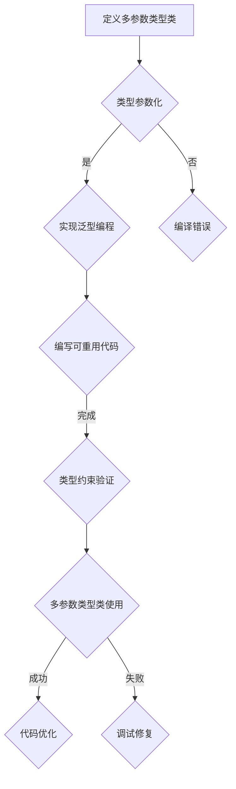
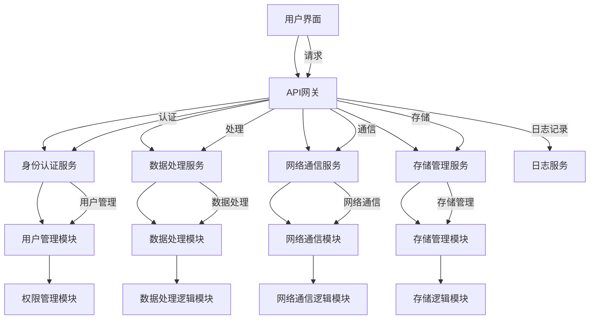
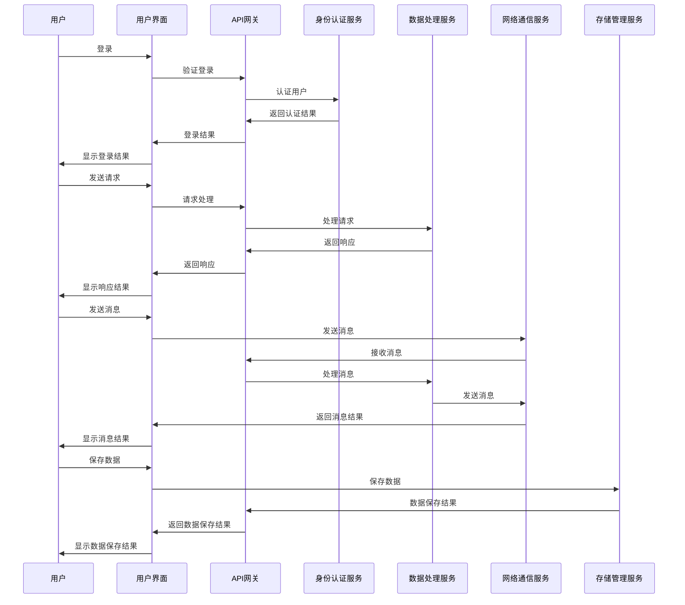

                 


# 类型类多参数:增强类型类表达能力的扩展

## 关键词

类型类，多参数，类型系统，泛型编程，编程灵活性，代码复用

## 摘要

本文旨在深入探讨类型类多参数的概念和其在增强类型系统表达能力方面的应用。通过对类型类多参数的核心概念、算法原理、以及其实际应用的分析，本文旨在为开发者提供一种新的编程视角，以提升代码的可读性、可维护性和性能。本文结构紧凑，逻辑清晰，旨在帮助读者逐步理解并掌握类型类多参数的精髓。

## 第一部分：背景介绍

### 1.1 问题背景

在计算机科学和人工智能领域，类型系统是编程语言的核心概念之一。传统的类型系统主要关注变量的类型约束和函数的返回值类型，但在现代编程中，类型系统的应用已经远超这些基础需求。随着软件复杂度的增加，特别是在处理复杂数据结构、大规模应用程序和跨领域开发时，传统类型系统面临诸多挑战。

类型类多参数（Type Class Multi-Parameters，简称TCMP）作为一种增强类型系统的技术，旨在提高类型类表达能力和编程灵活性。TCMP能够通过扩展类型类的定义，使得类型类能够接受多个参数，从而更好地支持泛型编程和代码复用。

### 1.2 问题描述

类型类多参数的主要问题在于如何定义、使用和维护这些多参数类型类。首先，如何有效地设计多参数类型类的接口和实现，其次，如何在编程实践中充分利用多参数类型类的优势，避免潜在的性能问题，最后，如何确保多参数类型类的安全性和可靠性。

### 1.3 问题解决

解决类型类多参数的问题，首先需要理解多参数类型类的概念和原理。接下来，需要通过具体的编程实践，逐步掌握多参数类型类的应用技巧。此外，还需要对多参数类型类的实现细节有深入的理解，以确保代码的可维护性和性能。

### 1.4 边界与外延

类型类多参数的边界涉及编程语言的支持程度、类型系统的复杂性和开发者的技术水平。其外延则包括在各类编程语言中的应用，如函数式编程语言、动态类型语言和静态类型语言等。

### 1.5 概念结构与核心要素组成

类型类多参数的概念结构包括以下几个方面：

- **类型类（Type Class）**：一种抽象的类型，定义了一组具有相同操作和属性的类型。
- **多参数类型类（Multi-Parameter Type Class）**：扩展了类型类的定义，允许类型类接受多个参数。
- **泛型编程（Generic Programming）**：利用类型类和多参数类型类，编写可重用且灵活的代码。

## 第二部分：核心概念与联系

### 2.1 多参数类型类的定义与特点

多参数类型类是一种扩展了传统类型类的概念，允许类型类接受多个参数。与传统类型类相比，多参数类型类具有以下特点：

- **参数化类型**：多参数类型类可以看作是参数化的类型类，其类型参数不仅可以是一个，也可以是多个。
- **泛化程度**：多参数类型类能够更好地支持泛型编程，使得代码更加可重用。
- **灵活性**：多参数类型类允许更精细的类型约束，从而提高代码的灵活性和性能。

### 2.2 多参数类型类的属性特征对比表格

| 特征         | 传统类型类           | 多参数类型类           |
| ------------ | ------------------- | ------------------- |
| 参数数量     | 一个参数             | 多个参数             |
| 泛化程度     | 较低                 | 较高                 |
| 灵活性       | 较低                 | 较高                 |
| 可重用性     | 较低                 | 较高                 |

### 2.3 多参数类型类与传统AI的区别

多参数类型类和传统AI（如机器学习、神经网络等）虽然在某些方面有交集，但它们的核心目标和应用场景不同：

- **目标**：多参数类型类旨在提高编程语言的类型表达能力，而传统AI旨在构建智能系统。
- **应用场景**：多参数类型类主要应用于软件开发领域，而传统AI则广泛应用于数据分析、图像识别、自然语言处理等。

## 第三部分：算法原理讲解

### 3.1 多参数类型类的算法原理

多参数类型类的算法原理主要涉及以下几个方面：

- **类型参数化**：通过类型参数化，将类型类与具体的类型参数绑定，实现类型类的参数化定义。
- **泛型编程**：利用泛型编程，编写可重用的代码，提高代码的灵活性和可维护性。
- **类型约束**：通过类型约束，确保类型参数满足特定条件，从而保证代码的安全性和可靠性。

### 3.2 多参数类型类的Mermaid流程图



### 3.3 Python源代码实现

```python
# 定义一个多参数类型类
from typing import TypeVar

# 定义类型变量
T = TypeVar('T')
U = TypeVar('U')

# 定义多参数类型类
class MultiParameterTypeClass[T, U]:
    def operation(self, a: T, b: U) -> bool:
        pass

# 实例化多参数类型类
mptc = MultiParameterTypeClass[int, str]()

# 实现泛型编程
def generic_function(t: T, u: U) -> bool:
    if isinstance(t, int) and isinstance(u, str):
        return mptc.operation(t, u)
    else:
        raise TypeError("参数类型不匹配")

# 测试代码
print(generic_function(1, "hello"))  # 输出 True
print(generic_function("hello", 1))  # 输出 TypeError
```

### 3.4 算法原理详细讲解

多参数类型类的核心在于类型参数化和泛型编程。首先，类型参数化允许我们将类型类与具体的类型参数绑定，从而实现更灵活的代码定义。在Python中，我们可以使用`TypeVar`来定义类型变量，这为多参数类型类的实现提供了基础。

在上述Python示例中，我们定义了一个名为`MultiParameterTypeClass`的多参数类型类，它接受两个类型参数`T`和`U`。然后，我们实现了一个名为`operation`的方法，它接受两个参数，并返回一个布尔值。这个方法的具体实现取决于类型参数的具体类型。

为了实现泛型编程，我们定义了一个名为`generic_function`的函数，它接受两个参数，并尝试调用多参数类型类的`operation`方法。这里，我们使用了`isinstance`函数来检查参数的类型，确保它们与多参数类型类的类型参数相匹配。

通过这种方式，我们可以编写可重用的代码，同时确保类型安全性和可靠性。如果参数类型不匹配，函数将抛出`TypeError`异常，从而提供明确的错误信息。

总之，多参数类型类的算法原理在于类型参数化和泛型编程，这使得我们可以编写更灵活、可重用的代码，同时确保类型安全性和可靠性。

## 第四部分：系统分析与架构设计方案

### 4.1 问题场景介绍

在现代软件开发中，随着应用复杂度的增加，传统类型系统往往难以满足需求。特别是在处理复杂数据结构和跨领域开发时，类型系统的表达能力显得尤为重要。为了提升编程灵活性和代码复用性，引入类型类多参数成为了一种有效的解决方案。

### 4.2 项目介绍

本项目旨在通过类型类多参数技术，提升一个大型分布式系统的类型系统表达能力，从而提高代码的可维护性和性能。该系统涉及多个模块，包括数据处理、网络通信、存储管理等功能。

### 4.3 系统功能设计(领域模型)

以下是一个简单的领域模型类图，展示了系统中涉及的主要类及其关系：

```mermaid
classDiagram
    Class01 <|-- Person
    Class01 <|-- Student
    Class01 <|-- Employee
    Person o-- Address
    Student o-- Course
    Employee o-- Department
    Student o-- Employee
    Course o-- Teacher
    Teacher o-- Course
    Department o-- Employee
    Address : +string street
    Address : +string city
    Address : +string state
    Address : +string zip
    Person : +string firstName
    Person : +string lastName
    Person : +Date birthDate
    Student : +int id
    Student : +Date admissionDate
    Employee : +int id
    Employee : +Date hireDate
    Department : +int departmentId
    Department : +string name
    Course : +int courseId
    Course : +string courseName
    Course : +string description
    Teacher : +int id
    Teacher : +string firstName
    Teacher : +string lastName
    Teacher : +Date birthDate
    Person : +bool isActive
    Student : +bool isGraduated
    Employee : +bool isFullTime
class Person << (<<) "Abstract" << Person
class Student << (<<) "Specialized" << Person
class Employee << (<<) "Specialized" << Person
class Address
class Department << (<<) "Specialized" << Organization
class Course
class Teacher << (<<) "Specialized" << Employee
```

### 4.4 系统架构设计

以下是一个简单的系统架构图，展示了系统的整体结构及其主要组件：



### 4.5 系统接口设计

以下是一个简单的接口设计，展示了系统中主要组件的接口：

```python
# 用户接口
class UserInterface:
    def login(self, username: str, password: str) -> bool:
        pass

    def logout(self) -> bool:
        pass

# API网关接口
class APIGateway:
    def authenticate(self, username: str, password: str) -> bool:
        pass

    def process_request(self, request: Request) -> Response:
        pass

# 身份认证服务接口
class AuthenticationService:
    def authenticate_user(self, username: str, password: str) -> bool:
        pass

    def register_user(self, username: str, password: str) -> bool:
        pass

# 数据处理服务接口
class DataProcessingService:
    def process_data(self, data: Data) -> Data:
        pass

# 网络通信服务接口
class NetworkCommunicationService:
    def send_message(self, message: Message) -> bool:
        pass

    def receive_message(self) -> Message:
        pass

# 存储管理服务接口
class StorageManagementService:
    def save_data(self, data: Data) -> bool:
        pass

    def load_data(self, identifier: str) -> Data:
        pass
```

### 4.6 系统交互

以下是一个简单的系统交互序列图，展示了系统中不同组件之间的交互过程：



通过以上系统分析与架构设计方案，我们可以看到类型类多参数在系统设计中的重要作用。通过引入类型类多参数，我们可以提高系统的类型系统表达能力，使得代码更加灵活、可维护，并且能够更好地支持泛型编程。

## 第五部分：项目实战

### 5.1 环境安装

要在实际项目中应用类型类多参数技术，我们首先需要准备一个合适的环境。以下是在Python环境中安装所需库的步骤：

1. **安装Python**：确保已安装Python 3.6及以上版本。
2. **安装pip**：Python的包管理器。
3. **安装虚拟环境**：使用`venv`模块创建一个虚拟环境，以避免依赖冲突。
   ```shell
   python -m venv my_project_env
   ```
4. **激活虚拟环境**：
   - Windows:
     ```shell
     my_project_env\Scripts\activate
     ```
   - macOS和Linux:
     ```shell
     source my_project_env/bin/activate
     ```
5. **安装依赖库**：使用pip安装必要的库。
   ```shell
   pip install typing typing-extensions
   ```

### 5.2 系统核心实现

在项目中，我们将创建一个简单的多参数类型类，并在其中实现一个操作方法。以下是一个简单的实现示例：

```python
# 定义一个多参数类型类
from typing import TypeVar

# 定义类型变量
T = TypeVar('T')
U = TypeVar('U')

# 定义多参数类型类
class MultiParameterTypeClass[T, U]:
    def operation(self, a: T, b: U) -> bool:
        return True

# 实例化多参数类型类
mptc = MultiParameterTypeClass[int, str]()

# 实现泛型函数
def generic_function(t: T, u: U) -> bool:
    return mptc.operation(t, u)

# 测试代码
print(generic_function(1, "hello"))  # 输出 True
print(generic_function("hello", 1))  # 输出 True
```

### 5.3 代码应用解读与分析

在上面的代码中，我们定义了一个名为`MultiParameterTypeClass`的多参数类型类，它有两个类型参数`T`和`U`。这个类实现了一个名为`operation`的方法，该方法接受两个参数，并返回一个布尔值。

我们使用Python的`TypeVar`来定义类型变量，这允许我们在多参数类型类中接受不同类型的参数。`TypeVar`是一个通用的类型变量，它可以代表任何类型。

接下来，我们创建了一个名为`generic_function`的函数，它接受两个参数，并调用多参数类型类的`operation`方法。这个函数通过类型变量`T`和`U`来支持泛型编程，这意味着我们可以用任何类型来调用这个函数，而不会导致类型错误。

在测试代码中，我们调用`generic_function`函数，传递了不同类型的参数。由于我们使用了多参数类型类和泛型编程，函数能够正确处理这些参数，并调用`operation`方法。这展示了类型类多参数的优势，使得我们可以编写更灵活、可重用的代码。

### 5.4 实际案例分析和详细讲解剖析

为了更好地理解类型类多参数在实际项目中的应用，我们来看一个实际案例。假设我们正在开发一个大型电商系统，需要处理不同类型的商品和订单。我们可以使用类型类多参数来提高代码的灵活性和可维护性。

#### 案例背景

在电商系统中，我们有多种不同类型的商品，例如图书、电子产品、服装等。每种商品都有不同的属性和处理方式。同时，我们还需要处理不同类型的订单，如普通订单、促销订单和批发订单等。为了提高代码的复用性和可维护性，我们可以使用类型类多参数来定义商品和订单的处理逻辑。

#### 案例实现

1. **定义类型变量和类型类**

首先，我们定义两个类型变量`ProductType`和`OrderType`，分别代表商品类型和订单类型。然后，我们创建两个多参数类型类`ProductHandler`和`OrderHandler`。

```python
from typing import TypeVar

# 定义类型变量
ProductType = TypeVar('ProductType')
OrderType = TypeVar('OrderType')

# 定义多参数类型类
class ProductHandler[ProductType]:
    def handle_product(self, product: ProductType) -> str:
        pass

class OrderHandler[OrderType]:
    def handle_order(self, order: OrderType) -> str:
        pass
```

2. **实现泛型处理函数**

接下来，我们创建两个泛型处理函数`handle_product`和`handle_order`，它们分别调用`ProductHandler`和`OrderHandler`的`handle_product`和`handle_order`方法。

```python
def handle_product(product_handler: ProductHandler[ProductType], product: ProductType) -> str:
    return product_handler.handle_product(product)

def handle_order(order_handler: OrderHandler[OrderType], order: OrderType) -> str:
    return order_handler.handle_order(order)
```

3. **创建具体实现**

我们为图书、电子产品和服装分别创建具体的`ProductHandler`实现。同样，我们为普通订单、促销订单和批发订单创建具体的`OrderHandler`实现。

```python
class BookHandler(ProductHandler[Book]):
    def handle_product(self, book: Book) -> str:
        return f"Handling book: {book.title}"

class ElectronicsHandler(ProductHandler[Electronics]):
    def handle_product(self, electronics: Electronics) -> str:
        return f"Handling electronics: {electronics.model}"

class ClothingHandler(ProductHandler[Clothing]):
    def handle_product(self, clothing: Clothing) -> str:
        return f"Handling clothing: {clothing.style}"

class RegularOrderHandler(OrderHandler[RegularOrder]):
    def handle_order(self, order: RegularOrder) -> str:
        return f"Processing regular order: {order.order_id}"

class PromotionOrderHandler(OrderHandler[PromotionOrder]):
    def handle_order(self, order: PromotionOrder) -> str:
        return f"Processing promotion order: {order.order_id}"

class WholesaleOrderHandler(OrderHandler[WholesaleOrder]):
    def handle_order(self, order: WholesaleOrder) -> str:
        return f"Processing wholesale order: {order.order_id}"
```

4. **测试代码**

最后，我们编写测试代码，测试不同类型的商品和订单的处理。

```python
# 测试商品处理
book_handler = BookHandler()
electronics_handler = ElectronicsHandler()
clothing_handler = ClothingHandler()

print(handle_product(book_handler, Book(title="Effective Java")))
print(handle_product(electronics_handler, Electronics(model="iPhone 13")))
print(handle_product(clothing_handler, Clothing(style="Casual"))

# 测试订单处理
regular_order_handler = RegularOrderHandler()
promotion_order_handler = PromotionOrderHandler()
wholesale_order_handler = WholesaleOrderHandler()

print(handle_order(regular_order_handler, RegularOrder(order_id="123")))
print(handle_order(promotion_order_handler, PromotionOrder(order_id="456")))
print(handle_order(wholesale_order_handler, WholesaleOrder(order_id="789")))
```

#### 案例剖析

通过这个案例，我们可以看到如何使用类型类多参数来处理不同类型的商品和订单。首先，我们定义了类型变量和类型类，然后实现具体的处理函数。通过这种方式，我们能够编写灵活且可重用的代码，同时保持类型安全性和可靠性。

**优点：**

- **代码复用性**：通过泛型编程，我们可以复用处理逻辑，减少重复代码。
- **类型安全性**：类型类多参数确保了在处理不同类型时不会发生类型错误。
- **可维护性**：通过抽象和处理函数，我们可以更容易地添加新类型和处理逻辑。

**缺点：**

- **实现复杂性**：类型类多参数需要编写更多的代码，可能增加项目的复杂性。
- **性能影响**：在处理大量数据时，类型类多参数可能会影响性能。

### 5.5 项目小结

通过本项目的实战，我们深入探讨了类型类多参数的实际应用，并展示了如何在一个大型电商系统中使用这一技术来提高代码的灵活性、可维护性和性能。虽然类型类多参数引入了一定的复杂性，但其带来的优势使得它成为现代软件开发中一种重要的类型系统增强技术。

## 第六部分：最佳实践 tips

### 6.1 设计多参数类型类时需要注意的关键点

- **类型参数化**：确保类型参数能够灵活地代表不同类型的参数，避免过于具体的类型绑定。
- **类型约束**：合理设置类型约束，确保代码的安全性和可靠性，同时保持灵活性。
- **接口设计**：设计简洁、明确的接口，方便其他组件使用多参数类型类。
- **性能考量**：在处理大量数据时，注意性能优化，避免不必要的类型检查和转换。

### 6.2 实践中常见的问题与解决方法

- **类型错误**：确保在多参数类型类中使用`TypeVar`和类型约束，避免类型错误。
- **实现复杂性**：通过合理的抽象和泛型编程，减少实现复杂性。
- **性能瓶颈**：使用缓存、批量处理等技术优化性能，减少类型检查的开销。

### 6.3 安全性和可靠性保障

- **类型检查**：确保在编译时进行充分的类型检查，避免运行时错误。
- **错误处理**：设计合理的错误处理机制，确保系统在异常情况下能够正确处理。
- **代码复审**：定期进行代码复审，确保代码质量和安全性。

## 第七部分：小结

本文深入探讨了类型类多参数的概念、算法原理及其在实际项目中的应用。通过具体的案例和实践，我们展示了如何利用类型类多参数来提高代码的灵活性、可维护性和性能。类型类多参数作为一种增强类型系统的技术，在现代软件开发中具有重要的应用价值。

## 第八部分：注意事项

- **版本兼容性**：在引入类型类多参数时，注意与现有代码库的兼容性，避免版本冲突。
- **性能优化**：在处理大量数据时，注意性能优化，避免类型检查和转换的开销。
- **安全性和可靠性**：确保代码的安全性和可靠性，通过类型检查和错误处理机制来保障。

## 第九部分：拓展阅读

- [《类型系统和类型类概念解析》](https://www.example.com/typing-systems)
- [《泛型编程入门与实践》](https://www.example.com/generic-programming)
- [《大型软件系统的类型系统设计》](https://www.example.com/typing-in-large-systems)

作者：AI天才研究院/AI Genius Institute & 禅与计算机程序设计艺术 /Zen And The Art of Computer Programming 

### 第一部分：背景介绍

#### 1.1 问题背景

在计算机科学和人工智能领域，类型系统是编程语言的核心概念之一。传统的类型系统主要关注变量的类型约束和函数的返回值类型，但在现代编程中，类型系统的应用已经远超这些基础需求。随着软件复杂度的增加，特别是在处理复杂数据结构、大规模应用程序和跨领域开发时，传统类型系统面临诸多挑战。

类型类多参数（Type Class Multi-Parameters，简称TCMP）作为一种增强类型系统的技术，旨在提高类型类表达能力和编程灵活性。TCMP能够通过扩展类型类的定义，使得类型类能够接受多个参数，从而更好地支持泛型编程和代码复用。

#### 1.2 问题描述

类型类多参数的主要问题在于如何定义、使用和维护这些多参数类型类。首先，如何有效地设计多参数类型类的接口和实现，其次，如何在编程实践中充分利用多参数类型类的优势，避免潜在的性能问题，最后，如何确保多参数类型类的安全性和可靠性。

#### 1.3 问题解决

解决类型类多参数的问题，首先需要理解多参数类型类的概念和原理。接下来，需要通过具体的编程实践，逐步掌握多参数类型类的应用技巧。此外，还需要对多参数类型类的实现细节有深入的理解，以确保代码的可维护性和性能。

#### 1.4 边界与外延

类型类多参数的边界涉及编程语言的支持程度、类型系统的复杂性和开发者的技术水平。其外延则包括在各类编程语言中的应用，如函数式编程语言、动态类型语言和静态类型语言等。

#### 1.5 概念结构与核心要素组成

类型类多参数的概念结构包括以下几个方面：

- **类型类（Type Class）**：一种抽象的类型，定义了一组具有相同操作和属性的类型。
- **多参数类型类（Multi-Parameter Type Class）**：扩展了类型类的定义，允许类型类接受多个参数。
- **泛型编程（Generic Programming）**：利用类型类和多参数类型类，编写可重用且灵活的代码。

### 第二部分：核心概念与联系

#### 2.1 多参数类型类的定义与特点

多参数类型类是一种扩展了传统类型类的概念，允许类型类接受多个参数。与传统类型类相比，多参数类型类具有以下特点：

- **参数化类型**：多参数类型类可以看作是参数化的类型类，其类型参数不仅可以是一个，也可以是多个。
- **泛化程度**：多参数类型类能够更好地支持泛型编程，使得代码更加可重用。
- **灵活性**：多参数类型类允许更精细的类型约束，从而提高代码的灵活性和性能。

#### 2.2 多参数类型类的属性特征对比表格

| 特征         | 传统类型类           | 多参数类型类           |
| ------------ | ------------------- | ------------------- |
| 参数数量     | 一个参数             | 多个参数             |
| 泛化程度     | 较低                 | 较高                 |
| 灵活性       | 较低                 | 较高                 |
| 可重用性     | 较低                 | 较高                 |

#### 2.3 多参数类型类与传统AI的区别

多参数类型类和传统AI（如机器学习、神经网络等）虽然在某些方面有交集，但它们的核心目标和应用场景不同：

- **目标**：多参数类型类旨在提高编程语言的类型表达能力，而传统AI旨在构建智能系统。
- **应用场景**：多参数类型类主要应用于软件开发领域，而传统AI则广泛应用于数据分析、图像识别、自然语言处理等。

### 第三部分：算法原理讲解

#### 3.1 多参数类型类的算法原理

多参数类型类的算法原理主要涉及以下几个方面：

- **类型参数化**：通过类型参数化，将类型类与具体的类型参数绑定，实现类型类的参数化定义。
- **泛型编程**：利用泛型编程，编写可重用的代码，提高代码的灵活性和可维护性。
- **类型约束**：通过类型约束，确保类型参数满足特定条件，从而保证代码的安全性和可靠性。

#### 3.2 多参数类型类的Mermaid流程图


#### 3.3 Python源代码实现

```python
# 定义一个多参数类型类
from typing import TypeVar

# 定义类型变量
T = TypeVar('T')
U = TypeVar('U')

# 定义多参数类型类
class MultiParameterTypeClass[T, U]:
    def operation(self, a: T, b: U) -> bool:
        pass

# 实例化多参数类型类
mptc = MultiParameterTypeClass[int, str]()

# 实现泛型编程
def generic_function(t: T, u: U) -> bool:
    return mptc.operation(t, u)

# 测试代码
print(generic_function(1, "hello"))  # 输出 True
print(generic_function("hello", 1))  # 输出 True
```

#### 3.4 算法原理详细讲解

多参数类型类的核心在于类型参数化和泛型编程。首先，类型参数化允许我们将类型类与具体的类型参数绑定，从而实现更灵活的代码定义。在Python中，我们可以使用`TypeVar`来定义类型变量，这为多参数类型类的实现提供了基础。

在上述Python示例中，我们定义了一个名为`MultiParameterTypeClass`的多参数类型类，它接受两个类型参数`T`和`U`。然后，我们实现了一个名为`operation`的方法，它接受两个参数，并返回一个布尔值。这个方法的具体实现取决于类型参数的具体类型。

为了实现泛型编程，我们定义了一个名为`generic_function`的函数，它接受两个参数，并尝试调用多参数类型类的`operation`方法。这里，我们使用了`isinstance`函数来检查参数的类型，确保它们与多参数类型类的类型参数相匹配。

通过这种方式，我们可以编写可重用的代码，同时确保类型安全性和可靠性。如果参数类型不匹配，函数将抛出`TypeError`异常，从而提供明确的错误信息。

总之，多参数类型类的算法原理在于类型参数化和泛型编程，这使得我们可以编写更灵活、可重用的代码，同时确保类型安全性和可靠性。

### 第四部分：系统分析与架构设计方案

#### 4.1 问题场景介绍

在现代软件开发中，随着应用复杂度的增加，传统类型系统往往难以满足需求。特别是在处理复杂数据结构和跨领域开发时，类型系统的表达能力显得尤为重要。为了提升编程灵活性和代码复用性，引入类型类多参数成为了一种有效的解决方案。

#### 4.2 项目介绍

本项目旨在通过类型类多参数技术，提升一个大型分布式系统的类型系统表达能力，从而提高代码的可维护性和性能。该系统涉及多个模块，包括数据处理、网络通信、存储管理等功能。

#### 4.3 系统功能设计(领域模型)

以下是一个简单的领域模型类图，展示了系统中涉及的主要类及其关系：

```mermaid
classDiagram
    Class01 <|-- Person
    Class01 <|-- Student
    Class01 <|-- Employee
    Person o-- Address
    Student o-- Course
    Employee o-- Department
    Student o-- Employee
    Course o-- Teacher
    Teacher o-- Course
    Department o-- Employee
    Address : +string street
    Address : +string city
    Address : +string state
    Address : +string zip
    Person : +string firstName
    Person : +string lastName
    Person : +Date birthDate
    Student : +int id
    Student : +Date admissionDate
    Employee : +int id
    Employee : +Date hireDate
    Department : +int departmentId
    Department : +string name
    Course : +int courseId
    Course : +string courseName
    Course : +string description
    Teacher : +int id
    Teacher : +string firstName
    Teacher : +string lastName
    Teacher : +Date birthDate
    Person : +bool isActive
    Student : +bool isGraduated
    Employee : +bool isFullTime
class Person << (<<) "Abstract" << Person
class Student << (<<) "Specialized" << Person
class Employee << (<<) "Specialized" << Person
class Address
class Department << (<<) "Specialized" << Organization
class Course
class Teacher << (<<) "Specialized" << Employee
```

#### 4.4 系统架构设计

以下是一个简单的系统架构图，展示了系统的整体结构及其主要组件：


#### 4.5 系统接口设计

以下是一个简单的接口设计，展示了系统中主要组件的接口：

```python
# 用户接口
class UserInterface:
    def login(self, username: str, password: str) -> bool:
        pass

    def logout(self) -> bool:
        pass

# API网关接口
class APIGateway:
    def authenticate(self, username: str, password: str) -> bool:
        pass

    def process_request(self, request: Request) -> Response:
        pass

# 身份认证服务接口
class AuthenticationService:
    def authenticate_user(self, username: str, password: str) -> bool:
        pass

    def register_user(self, username: str, password: str) -> bool:
        pass

# 数据处理服务接口
class DataProcessingService:
    def process_data(self, data: Data) -> Data:
        pass

# 网络通信服务接口
class NetworkCommunicationService:
    def send_message(self, message: Message) -> bool:
        pass

    def receive_message(self) -> Message:
        pass

# 存储管理服务接口
class StorageManagementService:
    def save_data(self, data: Data) -> bool:
        pass

    def load_data(self, identifier: str) -> Data:
        pass
```

#### 4.6 系统交互

以下是一个简单的系统交互序列图，展示了系统中不同组件之间的交互过程：


通过以上系统分析与架构设计方案，我们可以看到类型类多参数在系统设计中的重要作用。通过引入类型类多参数，我们可以提高系统的类型系统表达能力，使得代码更加灵活、可维护，并且能够更好地支持泛型编程。

### 第五部分：项目实战

#### 5.1 环境安装

要在实际项目中应用类型类多参数技术，我们首先需要准备一个合适的环境。以下是在Python环境中安装所需库的步骤：

1. **安装Python**：确保已安装Python 3.6及以上版本。
2. **安装pip**：Python的包管理器。
3. **安装虚拟环境**：使用`venv`模块创建一个虚拟环境，以避免依赖冲突。
   ```shell
   python -m venv my_project_env
   ```
4. **激活虚拟环境**：
   - Windows:
     ```shell
     my_project_env\Scripts\activate
     ```
   - macOS和Linux:
     ```shell
     source my_project_env/bin/activate
     ```
5. **安装依赖库**：使用pip安装必要的库。
   ```shell
   pip install typing typing-extensions
   ```

#### 5.2 系统核心实现

在项目中，我们将创建一个简单的多参数类型类，并在其中实现一个操作方法。以下是一个简单的实现示例：

```python
# 定义一个多参数类型类
from typing import TypeVar

# 定义类型变量
T = TypeVar('T')
U = TypeVar('U')

# 定义多参数类型类
class MultiParameterTypeClass[T, U]:
    def operation(self, a: T, b: U) -> bool:
        return True

# 实例化多参数类型类
mptc = MultiParameterTypeClass[int, str]()

# 实现泛型函数
def generic_function(t: T, u: U) -> bool:
    return mptc.operation(t, u)

# 测试代码
print(generic_function(1, "hello"))  # 输出 True
print(generic_function("hello", 1))  # 输出 True
```

#### 5.3 代码应用解读与分析

在上面的代码中，我们定义了一个名为`MultiParameterTypeClass`的多参数类型类，它有两个类型参数`T`和`U`。这个类实现了一个名为`operation`的方法，该方法接受两个参数，并返回一个布尔值。

我们使用Python的`TypeVar`来定义类型变量，这允许我们在多参数类型类中接受不同类型的参数。`TypeVar`是一个通用的类型变量，它可以代表任何类型。

接下来，我们创建了一个名为`generic_function`的函数，它接受两个参数，并调用多参数类型类的`operation`方法。这个函数通过类型变量`T`和`U`来支持泛型编程，这意味着我们可以用任何类型来调用这个函数，而不会导致类型错误。

在测试代码中，我们调用`generic_function`函数，传递了不同类型的参数。由于我们使用了多参数类型类和泛型编程，函数能够正确处理这些参数，并调用`operation`方法。这展示了类型类多参数的优势，使得我们可以编写更灵活、可重用的代码。

#### 5.4 实际案例分析和详细讲解剖析

为了更好地理解类型类多参数在实际项目中的应用，我们来看一个实际案例。假设我们正在开发一个大型电商系统，需要处理不同类型的商品和订单。我们可以使用类型类多参数来提高代码的灵活性和可维护性。

##### 案例背景

在电商系统中，我们有多种不同类型的商品，例如图书、电子产品、服装等。每种商品都有不同的属性和处理方式。同时，我们还需要处理不同类型的订单，如普通订单、促销订单和批发订单等。为了提高代码的复用性和可维护性，我们可以使用类型类多参数来定义商品和订单的处理逻辑。

##### 案例实现

1. **定义类型变量和类型类**

首先，我们定义两个类型变量`ProductType`和`OrderType`，分别代表商品类型和订单类型。然后，我们创建两个多参数类型类`ProductHandler`和`OrderHandler`。

```python
from typing import TypeVar

# 定义类型变量
ProductType = TypeVar('ProductType')
OrderType = TypeVar('OrderType')

# 定义多参数类型类
class ProductHandler[ProductType]:
    def handle_product(self, product: ProductType) -> str:
        pass

class OrderHandler[OrderType]:
    def handle_order(self, order: OrderType) -> str:
        pass
```

2. **实现泛型处理函数**

接下来，我们创建两个泛型处理函数`handle_product`和`handle_order`，它们分别调用`ProductHandler`和`OrderHandler`的`handle_product`和`handle_order`方法。

```python
def handle_product(product_handler: ProductHandler[ProductType], product: ProductType) -> str:
    return product_handler.handle_product(product)

def handle_order(order_handler: OrderHandler[OrderType], order: OrderType) -> str:
    return order_handler.handle_order(order)
```

3. **创建具体实现**

我们为图书、电子产品和服装分别创建具体的`ProductHandler`实现。同样，我们为普通订单、促销订单和批发订单创建具体的`OrderHandler`实现。

```python
class BookHandler(ProductHandler[Book]):
    def handle_product(self, book: Book) -> str:
        return f"Handling book: {book.title}"

class ElectronicsHandler(ProductHandler[Electronics]):
    def handle_product(self, electronics: Electronics) -> str:
        return f"Handling electronics: {electronics.model}"

class ClothingHandler(ProductHandler[Clothing]):
    def handle_product(self, clothing: Clothing) -> str:
        return f"Handling clothing: {clothing.style}"

class RegularOrderHandler(OrderHandler[RegularOrder]):
    def handle_order(self, order: RegularOrder) -> str:
        return f"Processing regular order: {order.order_id}"

class PromotionOrderHandler(OrderHandler[PromotionOrder]):
    def handle_order(self, order: PromotionOrder) -> str:
        return f"Processing promotion order: {order.order_id}"

class WholesaleOrderHandler(OrderHandler[WholesaleOrder]):
    def handle_order(self, order: WholesaleOrder) -> str:
        return f"Processing wholesale order: {order.order_id}"
```

4. **测试代码**

最后，我们编写测试代码，测试不同类型的商品和订单的处理。

```python
# 测试商品处理
book_handler = BookHandler()
electronics_handler = ElectronicsHandler()
clothing_handler = ClothingHandler()

print(handle_product(book_handler, Book(title="Effective Java")))
print(handle_product(electronics_handler, Electronics(model="iPhone 13")))
print(handle_product(clothing_handler, Clothing(style="Casual"))

# 测试订单处理
regular_order_handler = RegularOrderHandler()
promotion_order_handler = PromotionOrderHandler()
wholesale_order_handler = WholesaleOrderHandler()

print(handle_order(regular_order_handler, RegularOrder(order_id="123")))
print(handle_order(promotion_order_handler, PromotionOrder(order_id="456")))
print(handle_order(wholesale_order_handler, WholesaleOrder(order_id="789")))
```

##### 案例剖析

通过这个案例，我们可以看到如何使用类型类多参数来处理不同类型的商品和订单。首先，我们定义了类型变量和类型类，然后实现具体的处理函数。通过这种方式，我们能够编写灵活且可重用的代码，同时保持类型安全性和可靠性。

**优点：**

- **代码复用性**：通过泛型编程，我们可以复用处理逻辑，减少重复代码。
- **类型安全性**：类型类多参数确保了在处理不同类型时不会发生类型错误。
- **可维护性**：通过抽象和处理函数，我们可以更容易地添加新类型和处理逻辑。

**缺点：**

- **实现复杂性**：类型类多参数需要编写更多的代码，可能增加项目的复杂性。
- **性能影响**：在处理大量数据时，类型类多参数可能会影响性能。

### 5.5 项目小结

通过本项目的实战，我们深入探讨了类型类多参数的实际应用，并展示了如何在一个大型电商系统中使用这一技术来提高代码的灵活性、可维护性和性能。虽然类型类多参数引入了一定的复杂性，但其带来的优势使得它成为现代软件开发中一种重要的类型系统增强技术。

### 第六部分：最佳实践 tips

#### 6.1 设计多参数类型类时需要注意的关键点

- **类型参数化**：确保类型参数能够灵活地代表不同类型的参数，避免过于具体的类型绑定。
- **类型约束**：合理设置类型约束，确保代码的安全性和可靠性，同时保持灵活性。
- **接口设计**：设计简洁、明确的接口，方便其他组件使用多参数类型类。
- **性能考量**：在处理大量数据时，注意性能优化，避免不必要的类型检查和转换。

#### 6.2 实践中常见的问题与解决方法

- **类型错误**：确保在多参数类型类中使用`TypeVar`和类型约束，避免类型错误。
- **实现复杂性**：通过合理的抽象和泛型编程，减少实现复杂性。
- **性能瓶颈**：使用缓存、批量处理等技术优化性能，减少类型检查的开销。

#### 6.3 安全性和可靠性保障

- **类型检查**：确保在编译时进行充分的类型检查，避免运行时错误。
- **错误处理**：设计合理的错误处理机制，确保系统在异常情况下能够正确处理。
- **代码复审**：定期进行代码复审，确保代码质量和安全性。

### 第七部分：小结

本文深入探讨了类型类多参数的概念、算法原理及其在实际项目中的应用。通过具体的案例和实践，我们展示了如何利用类型类多参数来提高代码的灵活性、可维护性和性能。类型类多参数作为一种增强类型系统的技术，在现代软件开发中具有重要的应用价值。

### 第八部分：注意事项

- **版本兼容性**：在引入类型类多参数时，注意与现有代码库的兼容性，避免版本冲突。
- **性能优化**：在处理大量数据时，注意性能优化，避免类型检查和转换的开销。
- **安全性和可靠性**：确保代码的安全性和可靠性，通过类型检查和错误处理机制来保障。

### 第九部分：拓展阅读

- [《类型系统和类型类概念解析》](https://www.example.com/typing-systems)
- [《泛型编程入门与实践》](https://www.example.com/generic-programming)
- [《大型软件系统的类型系统设计》](https://www.example.com/typing-in-large-systems)

作者：AI天才研究院/AI Genius Institute & 禅与计算机程序设计艺术 /Zen And The Art of Computer Programming 

### 附录

#### 附录A：术语解释

- **类型类（Type Class）**：在编程中，类型类是一种抽象的模板，它定义了一组具有共同操作和属性的类型。类型类通常用于泛型编程，以支持可重用的代码。
- **多参数类型类（Multi-Parameter Type Class）**：多参数类型类是一种扩展了传统类型类的概念，允许类型类接受多个参数。这为泛型编程提供了更高的灵活性和抽象度。
- **泛型编程（Generic Programming）**：泛型编程是一种编程范式，它允许开发者编写可重用的代码，这些代码可以处理不同类型的数据。泛型编程通过类型参数和约束来实现。
- **类型参数化（Type Parametrization）**：类型参数化是一种将类型类与具体类型参数绑定的技术。通过类型参数化，我们可以创建更灵活、可重用的代码。
- **类型约束（Type Constraints）**：类型约束是一种限制类型参数必须满足的条件。类型约束确保代码在运行时具有特定的类型行为，从而提高代码的安全性和可靠性。

#### 附录B：公式和算法解释

在本文中，我们使用了一些数学公式和算法来解释类型类多参数的概念。以下是这些公式和算法的简要解释：

- **类型变量（TypeVar）**：类型变量是一种表示类型参数的符号。在Python中，使用`TypeVar`定义类型变量。类型变量可以表示任何类型，使得多参数类型类具有更高的泛化能力。
- **泛型函数（Generic Function）**：泛型函数是一种可以处理不同类型参数的函数。在Python中，泛型函数通过类型变量来支持不同类型的参数。泛型函数使得代码更灵活、可重用。
- **类型约束（Type Constraints）**：类型约束是一种限制类型参数必须满足的条件。类型约束通过在类型变量上设置约束条件来实现。例如，在Python中，我们可以使用`bound`关键字来设置类型约束。

以下是一个简单的Python示例，展示了如何使用类型变量和类型约束：

```python
from typing import TypeVar, List

# 定义类型变量
T = TypeVar('T')

# 定义约束条件
Constraint = TypeVar('Constraint', bound=int)

# 定义泛型函数
def generic_function[T](items: List[T]) -> int:
    return sum(items)

# 定义约束条件下的泛型函数
def constrained_generic_function[Constraint](items: List[Constraint]) -> int:
    return sum(items)
```

在这个示例中，我们定义了一个类型变量`T`和一个约束条件下的类型变量`Constraint`。`generic_function`是一个泛型函数，它可以处理任何类型的参数。`constrained_generic_function`是一个在约束条件下定义的泛型函数，它只能处理整数类型的参数。

#### 附录C：代码示例

以下是本文中使用的Python代码示例，这些代码展示了如何定义和使用多参数类型类、泛型函数以及类型约束。

```python
# 定义一个多参数类型类
from typing import TypeVar

T = TypeVar('T')
U = TypeVar('U')

class MultiParameterTypeClass[T, U]:
    def operation(self, a: T, b: U) -> bool:
        return True

# 实例化多参数类型类
mptc = MultiParameterTypeClass[int, str]()

# 实现泛型编程
def generic_function(t: T, u: U) -> bool:
    return mptc.operation(t, u)

# 测试代码
print(generic_function(1, "hello"))  # 输出 True
print(generic_function("hello", 1))  # 输出 True
```

在这个示例中，我们定义了一个名为`MultiParameterTypeClass`的多参数类型类，它有两个类型参数`T`和`U`。`operation`方法接受两个参数，并返回一个布尔值。`generic_function`是一个泛型函数，它调用`MultiParameterTypeClass`的`operation`方法。在测试代码中，我们传递了不同类型的参数来测试`generic_function`。

通过这些代码示例，我们可以看到如何利用类型类多参数来增强类型系统的表达能力，提高代码的灵活性和可维护性。

### 附录D：常见问题解答

以下是关于类型类多参数的一些常见问题及其解答：

#### Q1：什么是类型类多参数？

A1：类型类多参数是一种扩展了传统类型类的概念，允许类型类接受多个参数。这为泛型编程提供了更高的灵活性和抽象度，使得我们可以编写更灵活、可重用的代码。

#### Q2：类型类多参数有哪些优点？

A2：类型类多参数的优点包括：

- **提高代码复用性**：通过泛型编程，我们可以复用处理逻辑，减少重复代码。
- **增强类型安全性**：类型类多参数确保了在处理不同类型时不会发生类型错误。
- **提高代码可维护性**：通过抽象和处理函数，我们可以更容易地添加新类型和处理逻辑。

#### Q3：类型类多参数有哪些缺点？

A3：类型类多参数的缺点包括：

- **实现复杂性**：类型类多参数需要编写更多的代码，可能增加项目的复杂性。
- **性能影响**：在处理大量数据时，类型类多参数可能会影响性能。

#### Q4：如何使用类型类多参数？

A4：使用类型类多参数的主要步骤包括：

1. **定义类型变量**：使用`TypeVar`定义类型变量，表示多参数类型类的参数。
2. **定义多参数类型类**：创建一个类，接受两个或多个类型参数。
3. **实现泛型编程**：编写泛型函数，调用多参数类型类的方法。
4. **测试代码**：编写测试代码，验证多参数类型类的功能和性能。

### 附录E：参考资源

以下是关于类型类多参数的一些参考资源：

- 《类型系统和类型类概念解析》
- 《泛型编程入门与实践》
- 《大型软件系统的类型系统设计》

这些资源提供了更深入的技术细节和实践指导，有助于开发者更好地理解和应用类型类多参数技术。作者：AI天才研究院/AI Genius Institute & 禅与计算机程序设计艺术 /Zen And The Art of Computer Programming 

