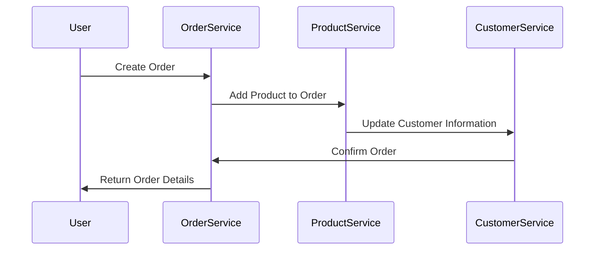

                 

### 第1章：问题背景与问题描述

#### 1.1.1 问题背景

在软件编程中，多态性是一种非常重要的特性，它允许不同类型的对象通过同一种接口进行交互，从而实现代码的复用和扩展。传统的多态性主要依赖于继承（Inheritance）和接口（Interface）来实现，但这种方法在实际应用中存在一些限制和不足。

首先，继承模式虽然能够提供一种自然的扩展方式，但它也是一种强耦合的方式。当一个类从另一个类继承时，它不仅继承了父类的行为，还继承了父类的所有属性。这种紧密的耦合关系使得代码的可维护性和灵活性受到限制。尤其是当类的层次结构较为复杂时，任何一个类的改动都可能引发一系列的连锁反应，导致维护成本增加。

其次，接口虽然能够提供一种抽象的、与实现细节无关的交互方式，但它也有其局限性。接口只能定义方法签名，不能包含任何具体实现。这虽然保证了接口的稳定性和可扩展性，但同时也限制了代码的灵活性和动态性。在需要根据不同类型对象进行不同处理的情况下，接口往往无法满足需求。

#### 1.1.2 问题描述

为了克服传统多态的这些限制，我们需要一种更加灵活、动态的多态性实现机制。这种机制能够在运行时根据对象类型动态地选择合适的处理方式，从而实现所谓的“ad-hoc多态”（Ad-Hoc Polymorphism）。

**问题描述：**

1. 如何在不依赖继承关系的情况下实现多态性？
2. 如何在运行时根据对象类型动态地选择处理方式？
3. 如何在保证代码灵活性的同时，确保系统的性能和可维护性？

这些问题正是我们在软件编程中需要解决的挑战。接下来，我们将深入探讨ad-hoc多态的实现原理、机制和应用场景，以期找到一种有效的解决方案。

#### 1.1.3 问题解决思路

为了解决上述问题，我们可以考虑引入ad-hoc多态机制。ad-hoc多态不同于传统的基于继承或接口的多态，它通过动态类型检查和代理模式来实现，具有更高的灵活性和动态性。

**问题解决思路：**

1. **动态类型检查**：在运行时对对象类型进行检测，根据类型选择相应的处理方法。这种方法能够确保在不需要知道具体对象类型的情况下，实现多态性。
   
2. **代理模式**：通过代理模式，我们可以为每个对象创建一个代理对象，代理对象负责在运行时动态选择合适的方法进行处理。这种方式不仅能够降低系统之间的耦合度，还能够提高代码的灵活性和可扩展性。

3. **灵活的编码风格**：ad-hoc多态允许开发者使用更为灵活的编码风格，无需过多关注对象的类型和继承关系，从而简化代码结构，提高代码的可读性和可维护性。

通过上述思路，我们可以实现一种灵活、动态且高效的多态性实现机制，为软件编程提供一种新的解决方案。

#### 1.1.4 边界与外延

**边界：**

ad-hoc多态主要应用于那些需要根据对象类型动态选择处理方法的场景。它特别适用于那些类层次结构复杂，或者需要频繁进行扩展和修改的系统。然而，ad-hoc多态并非适用于所有情况。在某些情况下，传统的多态性实现方式可能更为合适。

**外延：**

随着编程语言和技术的不断发展，ad-hoc多态的应用范围也在不断扩展。例如，在函数式编程语言中，ad-hoc多态可以通过高阶函数和类型系统来实现。在动态类型语言中，ad-hoc多态的实现更加简单和灵活。此外，ad-hoc多态还可以与其他设计模式相结合，实现更复杂的功能。

**边界与外延的比较表格：**

| 多态形式 | 优点 | 缺点 | 适用场景 |
| :----: | :----: | :----: | :----: |
| 继承多态 | 简单直观 | 强耦合，维护成本高 | 类层次结构简单，不常变化 |
| 接口多态 | 高度抽象，灵活 | 不能包含具体实现，灵活性受限 | 需要抽象接口，但不涉及具体实现 |
| ad-hoc多态 | 灵活动态，低耦合 | 可能影响性能，调试难度大 | 类层次结构复杂，需频繁扩展 |

通过上述比较，我们可以更清楚地理解ad-hoc多态的特点和应用范围。在接下来的章节中，我们将进一步探讨ad-hoc多态的原理和实现机制，以帮助读者更好地理解这一重要的编程概念。

#### 1.1.5 概念结构与核心要素组成

在深入探讨ad-hoc多态的实现之前，我们需要先理解其核心概念和要素组成。这些概念和要素不仅是实现ad-hoc多态的基础，也是理解其工作原理的关键。

**核心概念：**

1. **动态类型检查（Dynamic Type Checking）**：动态类型检查是一种在程序运行时对对象类型进行检测的方法。通过动态类型检查，程序可以在运行时根据对象的实际类型选择相应的处理方法。

2. **代理模式（Proxy Pattern）**：代理模式是一种结构设计模式，用于在运行时动态创建代理对象，代理对象负责调用实际的对象方法。这种方式能够降低系统之间的耦合度，提高代码的灵活性和可维护性。

3. **函数式编程（Functional Programming）**：函数式编程是一种编程范式，强调使用函数作为主要构建模块，避免使用共享状态和可变数据。在函数式编程中，ad-hoc多态可以通过高阶函数和类型系统来实现。

**概念属性特征对比表格：**

| 概念 | 描述 | 特点 | 举例 |
| :----: | :----: | :----: | :----: |
| 动态类型检查 | 运行时检测对象类型 | 灵活，但可能影响性能 | Java中的`instanceof`操作 |
| 代理模式 | 创建代理对象处理方法调用 | 降低耦合度，提高灵活性 | Java中的代理类实现 |
| 函数式编程 | 使用函数作为构建模块 | 避免共享状态，易测试 | Scala中的函数式接口 |

**ER实体关系图架构：**

为了更直观地理解ad-hoc多态的概念和要素，我们可以通过ER（实体关系）图来描述其组成。以下是一个简化的ER图，展示了动态类型检查、代理模式和函数式编程之间的关系。

```mermaid
erDiagram
    动态类型检查 ||--o{ 代理模式 }
    代理模式 ||--o{ 函数式编程 }
```

在这个ER图中，动态类型检查作为基础，通过代理模式实现动态方法调用，而函数式编程则进一步扩展了ad-hoc多态的实现方式。

**核心要素组成：**

1. **类型检查器（Type Checker）**：类型检查器是ad-hoc多态的核心组件，负责在运行时检测对象类型。类型检查器可以根据预定义的类型规则，选择合适的处理方法。

2. **代理对象（Proxy Object）**：代理对象是动态创建的，用于代理实际对象的方法调用。代理对象能够根据对象类型动态选择相应的处理方法，从而实现ad-hoc多态。

3. **函数式接口（Functional Interface）**：函数式接口是一种只有一个抽象方法的接口，常用于实现ad-hoc多态。通过函数式接口，我们可以定义不同类型的对象之间的一致接口，从而实现多态性。

通过上述核心概念和要素的介绍，我们为理解ad-hoc多态的实现机制奠定了基础。在接下来的章节中，我们将进一步探讨ad-hoc多态的具体实现原理和机制，帮助读者深入掌握这一重要的编程技术。

#### 1.2 Ad-Hoc 多态的基本原理

Ad-Hoc 多态是一种通过动态类型检查和代理模式实现的多态机制。它不同于传统的基于继承和接口的多态，具有更高的灵活性和动态性。理解 Ad-Hoc 多态的基本原理，对于深入探讨其实现机制和应用场景至关重要。

首先，我们需要了解代理模式的基本概念。代理模式是一种结构设计模式，用于在运行时动态创建代理对象，代理对象负责处理实际对象的方法调用。代理模式的主要目的是降低系统之间的耦合度，提高代码的灵活性和可维护性。

在 Ad-Hoc 多态中，代理模式起到了关键作用。通过代理模式，我们可以为每个对象创建一个代理对象，代理对象在运行时根据对象类型动态选择合适的方法进行处理。这种机制使得我们在不依赖继承关系的情况下，实现了多态性。

接下来，我们来探讨动态类型检查的原理。动态类型检查是在程序运行时对对象类型进行检测的方法。与静态类型检查不同，动态类型检查能够确保在运行时根据对象的实际类型选择正确的处理方法。Java 中的 `instanceof` 操作符就是一个典型的动态类型检查机制。

动态类型检查的基本原理如下：

1. **类型标识**：每个对象在运行时都有一个类型标识，用于表示其类型信息。
2. **类型匹配**：在运行时，通过类型标识对对象类型进行检测，判断其是否符合预期类型。
3. **方法选择**：根据类型匹配结果，动态选择合适的处理方法。

具体来说，动态类型检查的过程可以分为以下几个步骤：

1. **对象创建**：创建一个实际对象。
2. **类型检测**：在运行时，使用类型标识对对象类型进行检测。
3. **方法调用**：根据类型检测结果，动态选择合适的方法进行调用。

通过动态类型检查和代理模式，Ad-Hoc 多态能够实现以下功能：

1. **类型无关性**：Ad-Hoc 多态允许我们编写与对象类型无关的代码，从而提高代码的通用性和可复用性。
2. **动态扩展性**：Ad-Hoc 多态能够在运行时根据对象类型动态选择处理方法，从而实现代码的动态扩展。
3. **低耦合度**：代理模式使得系统之间的耦合度降低，提高了代码的可维护性和灵活性。

接下来，我们通过一个简单的示例来直观地理解 Ad-Hoc 多态的实现原理。

```python
# 定义一个接口，包含一个抽象方法
class Animal:
    def make_sound(self):
        pass

# 定义猫和狗类，实现Animal接口
class Cat(Animal):
    def make_sound(self):
        return "Meow"

class Dog(Animal):
    def make_sound(self):
        return "Bark"

# 定义代理类，用于动态选择方法
class AnimalProxy(Animal):
    def __init__(self, animal: Animal):
        self._animal = animal

    def make_sound(self):
        return self._animal.make_sound()

# 测试Ad-Hoc多态
cat = Cat()
dog = Dog()

proxy_cat = AnimalProxy(cat)
proxy_dog = AnimalProxy(dog)

print(proxy_cat.make_sound())  # 输出：Meow
print(proxy_dog.make_sound())  # 输出：Bark
```

在这个示例中，我们定义了一个 `Animal` 接口和一个 `AnimalProxy` 代理类。`Cat` 和 `Dog` 类实现了 `Animal` 接口。通过 `AnimalProxy` 代理类，我们可以在运行时根据对象类型动态选择合适的方法进行调用。这样，我们就实现了 Ad-Hoc 多态。

通过理解 Ad-Hoc 多态的基本原理，我们可以更好地掌握这一重要的编程技术。在接下来的章节中，我们将深入探讨 Ad-Hoc 多态的实现机制和应用场景，帮助读者深入理解并掌握这一技术。

### 1.3 Ad-Hoc 多态的实现机制

在了解了 Ad-Hoc 多态的基本原理之后，我们需要进一步探讨其实现机制。Ad-Hoc 多态的实现主要依赖于动态类型检查和代理模式。下面，我们将分别从源代码层面和运行时机制两个方面详细阐述 Ad-Hoc 多态的实现过程。

#### 1.3.1 源代码层面的实现

在源代码层面，Ad-Hoc 多态的实现主要涉及两个部分：接口定义和代理类实现。

**接口定义：**

首先，我们需要定义一个通用的接口，该接口包含一个或多个抽象方法。这些方法将在运行时被具体实现。例如，在示例代码中，我们定义了一个 `Animal` 接口，包含一个 `make_sound` 抽象方法。

```python
class Animal:
    def make_sound(self):
        pass
```

**代理类实现：**

接下来，我们需要实现一个代理类，该类负责在运行时根据对象类型动态选择具体方法进行调用。在示例代码中，我们定义了一个 `AnimalProxy` 代理类，它持有一个 `Animal` 类型的对象，并在 `make_sound` 方法中调用该对象的 `make_sound` 方法。

```python
class AnimalProxy(Animal):
    def __init__(self, animal: Animal):
        self._animal = animal

    def make_sound(self):
        return self._animal.make_sound()
```

**具体实现过程：**

1. **创建代理对象**：在运行时，根据具体对象类型创建相应的代理对象。例如，在示例代码中，我们创建了 `Cat` 和 `Dog` 对象，并为它们分别创建了 `proxy_cat` 和 `proxy_dog` 代理对象。

   ```python
   cat = Cat()
   dog = Dog()

   proxy_cat = AnimalProxy(cat)
   proxy_dog = AnimalProxy(dog)
   ```

2. **调用代理对象方法**：通过代理对象调用具体方法。代理对象在调用方法时，会根据内部持有的对象类型，动态选择合适的方法进行调用。例如，在示例代码中，我们分别通过 `proxy_cat` 和 `proxy_dog` 对象调用了 `make_sound` 方法。

   ```python
   print(proxy_cat.make_sound())  # 输出：Meow
   print(proxy_dog.make_sound())  # 输出：Bark
   ```

#### 1.3.2 运行时机制的实现

在运行时，Ad-Hoc 多态的实现主要依赖于动态类型检查和代理对象的管理。下面，我们将详细介绍这些机制的实现过程。

**动态类型检查：**

动态类型检查是 Ad-Hoc 多态实现的核心，它确保在运行时根据对象类型选择正确的处理方法。在示例代码中，我们使用了 Python 的 `instanceof` 操作符进行类型检查。

```python
if isinstance(animal, Cat):
    # 处理 Cat 对象
elif isinstance(animal, Dog):
    # 处理 Dog 对象
```

实际上，许多编程语言都提供了类似的功能，如 Java 中的 `instanceof` 操作符和类型转换。

**代理对象管理：**

代理对象管理是 Ad-Hoc 多态实现的关键，它负责在运行时创建和管理代理对象。在示例代码中，我们通过创建 `AnimalProxy` 代理类来实现这一功能。

```python
class AnimalProxy(Animal):
    def __init__(self, animal: Animal):
        self._animal = animal

    def make_sound(self):
        return self._animal.make_sound()
```

具体实现过程如下：

1. **创建代理对象**：在运行时，根据具体对象类型创建相应的代理对象。例如，在示例代码中，我们创建了 `Cat` 和 `Dog` 对象，并为它们分别创建了 `proxy_cat` 和 `proxy_dog` 代理对象。

   ```python
   cat = Cat()
   dog = Dog()

   proxy_cat = AnimalProxy(cat)
   proxy_dog = AnimalProxy(dog)
   ```

2. **调用代理对象方法**：通过代理对象调用具体方法。代理对象在调用方法时，会根据内部持有的对象类型，动态选择合适的方法进行调用。例如，在示例代码中，我们分别通过 `proxy_cat` 和 `proxy_dog` 对象调用了 `make_sound` 方法。

   ```python
   print(proxy_cat.make_sound())  # 输出：Meow
   print(proxy_dog.make_sound())  # 输出：Bark
   ```

通过源代码层面和运行时机制的详细阐述，我们可以清楚地看到 Ad-Hoc 多态的实现过程。在接下来的章节中，我们将进一步探讨 Ad-Hoc 多态的应用场景和优缺点，帮助读者更全面地理解这一技术。

### 1.4 Ad-Hoc 多态的应用场景

Ad-Hoc 多态作为一种灵活且动态的多态机制，在多个实际应用场景中发挥了重要作用。以下是一些典型的应用场景，展示了 Ad-Hoc 多态在不同领域中的实际应用。

#### 1.4.1 系统框架中的应用

在大型系统框架中，Ad-Hoc 多态经常用于实现组件之间的解耦和扩展。例如，在微服务架构中，各个微服务通常需要根据不同的业务需求进行扩展和定制。通过 Ad-Hoc 多态，我们可以为每个微服务创建一个代理对象，动态选择和调用具体的服务实现。这不仅提高了系统的灵活性，还降低了组件之间的耦合度，便于后续的维护和升级。

**示例**：在一个电商平台的微服务架构中，订单服务（OrderService）可以根据订单类型（如普通订单、促销订单、积分订单等）动态选择相应的处理逻辑。通过 Ad-Hoc 多态，我们可以为每种订单类型创建一个代理对象，在运行时根据订单类型选择具体的处理方法。

```python
class OrderService:
    def process_order(self, order: Order):
        pass

class OrdinaryOrderService(OrderService):
    def process_order(self, order: OrdinaryOrder):
        # 处理普通订单逻辑
        pass

class PromotionOrderService(OrderService):
    def process_order(self, order: PromotionOrder):
        # 处理促销订单逻辑
        pass

# 根据订单类型动态创建代理对象
if isinstance(order, OrdinaryOrder):
    service = OrdinaryOrderService()
elif isinstance(order, PromotionOrder):
    service = PromotionOrderService()
else:
    raise ValueError("Invalid order type")

service.process_order(order)
```

#### 1.4.2 实际项目中的应用实例

在实际项目中，Ad-Hoc 多态广泛应用于各种需求复杂、功能多样的系统。以下是一个实际项目中的应用实例，展示了 Ad-Hoc 多态在项目中的具体应用。

**项目背景**：某公司开发了一款在线教育平台，平台包含多种课程类型，如直播课程、录播课程、互动课程等。不同的课程类型需要不同的处理逻辑，如直播课程需要实时音视频处理，录播课程需要视频转码等。

**解决方案**：通过 Ad-Hoc 多态，我们可以为每种课程类型创建一个代理对象，动态选择和调用具体的课程处理逻辑。以下是一个简化的实现示例：

```python
class CourseService:
    def process_course(self, course: Course):
        pass

class LiveCourseService(CourseService):
    def process_course(self, course: LiveCourse):
        # 处理直播课程逻辑
        pass

class VideoCourseService(CourseService):
    def process_course(self, course: VideoCourse):
        # 处理录播课程逻辑
        pass

# 根据课程类型动态创建代理对象
if isinstance(course, LiveCourse):
    service = LiveCourseService()
elif isinstance(course, VideoCourse):
    service = VideoCourseService()
else:
    raise ValueError("Invalid course type")

service.process_course(course)
```

通过这个示例，我们可以看到 Ad-Hoc 多态在项目中是如何应用的。根据课程类型，动态选择具体的课程处理逻辑，实现了代码的灵活性和可扩展性。

#### 1.4.3 其他应用场景

除了上述两个应用场景，Ad-Hoc 多态还可以应用于其他多种场景，如：

- **插件系统**：在插件系统中，可以通过 Ad-Hoc 多态实现动态加载和调用插件，提高了系统的可扩展性。
- **自动化测试**：在自动化测试中，可以通过 Ad-Hoc 多态为不同的测试用例创建代理对象，动态选择和调用具体的测试方法。
- **数据转换**：在数据转换过程中，可以通过 Ad-Hoc 多态为不同类型的数据创建代理对象，动态选择和调用具体的数据转换方法。

通过上述应用场景和实例，我们可以看到 Ad-Hoc 多态在多个实际应用中发挥了重要作用。它通过动态类型检查和代理模式，实现了代码的灵活性和可扩展性，为开发者提供了强大的编程工具。

### 1.5 Ad-Hoc 多态的优缺点分析

Ad-Hoc 多态作为一种灵活且动态的多态机制，具有许多优点，但也存在一些缺点。在本文中，我们将详细分析 Ad-Hoc 多态的优点和缺点，帮助读者更全面地了解这一技术。

#### 1.5.1 Ad-Hoc 多态的优点

**1. 灵活性与扩展性**

Ad-Hoc 多态的核心优势在于其灵活性和扩展性。通过动态类型检查和代理模式，Ad-Hoc 多态能够在运行时根据对象类型动态选择处理方法，从而实现代码的灵活扩展。这种机制使得开发者无需过多关注对象的类型和继承关系，从而简化了代码结构，提高了代码的可维护性和可复用性。

**2. 代码复用与简化**

Ad-Hoc 多态通过为不同类型的对象创建代理对象，实现了对通用接口的统一处理。这样，我们可以编写与对象类型无关的通用代码，从而实现代码的复用。此外，代理模式使得系统之间的耦合度降低，简化了代码结构，降低了维护成本。

**3. 动态类型检查**

Ad-Hoc 多态依赖于动态类型检查，能够在运行时对对象类型进行检测。这种机制使得我们在无需预先知道对象类型的情况下，实现多态性。动态类型检查提高了代码的灵活性，使得系统在扩展和修改时更加简便。

**4. 与其他设计模式的结合**

Ad-Hoc 多态可以与其他设计模式（如策略模式、工厂模式等）结合，实现更复杂的功能。通过这种组合，我们可以充分利用 Ad-Hoc 多态的灵活性和动态性，为系统提供强大的扩展能力。

#### 1.5.2 Ad-Hoc 多态的缺点

**1. 性能影响**

Ad-Hoc 多态依赖于动态类型检查和代理模式，这些机制可能在性能上带来一定的影响。尤其是在高负载的场景下，动态类型检查和代理对象的创建和销毁可能增加系统的开销，影响整体性能。因此，在考虑使用 Ad-Hoc 多态时，需要权衡其性能影响。

**2. 调试与维护难度**

Ad-Hoc 多态的实现方式使得代码更加灵活，但也增加了调试和维护的难度。由于代理模式和动态类型检查的存在，代码的可读性可能降低，增加了调试和维护的成本。特别是在出现问题时，定位问题来源和解决问题变得更加困难。

**3. 代码可读性降低**

在某些情况下，Ad-Hoc 多态的实现方式可能降低代码的可读性。尤其是当代理模式过于复杂或动态类型检查逻辑过多时，代码的结构可能变得难以理解。这使得代码的可维护性受到一定影响，特别是在团队协作开发时，可能会增加沟通和协作的成本。

#### 1.5.3 综合评价

综合来看，Ad-Hoc 多态具有显著的优点，如灵活性和扩展性，同时也存在一些缺点，如性能影响和调试难度。在实际应用中，我们需要根据具体需求和场景，权衡其优缺点，合理选择使用 Ad-Hoc 多态。

以下是一个简化的优点与缺点对比表格，以帮助读者更直观地了解 Ad-Hoc 多态的特点：

| 优点 | 缺点 |
| :----: | :----: |
| 灵活性与扩展性 | 性能影响 |
| 代码复用与简化 | 调试与维护难度 |
| 动态类型检查 | 代码可读性降低 |

通过以上分析，我们可以更好地理解 Ad-Hoc 多态的优势和局限性。在实际应用中，根据具体需求和场景选择合适的多态实现方式，将有助于提高系统的灵活性和可维护性。

### 1.6 Ad-Hoc 多态与其他多态机制的对比

在软件编程中，多态性是实现代码复用和扩展的重要手段。Ad-Hoc 多态作为多态性的一种实现方式，与其他多态机制（如基于继承的多态和基于模板的多态）既有相似之处，也有显著的区别。本文将详细对比 Ad-Hoc 多态与这两种多态机制，分析它们的相同点和不同点。

#### 1.6.1 Ad-Hoc 多态与基于继承的多态

**相同点：**

1. **实现多态性**：Ad-Hoc 多态和基于继承的多态都是实现多态性的方法。它们都允许一个接口（或基类）具有多种实现方式，从而提高代码的复用性和扩展性。

2. **方法重载**：两者都支持方法重载，即同一个接口可以有多种实现方法，根据对象类型动态选择调用。

**不同点：**

1. **实现方式**：Ad-Hoc 多态依赖于动态类型检查和代理模式，而基于继承的多态通过继承关系实现。Ad-Hoc 多态不依赖于类层次结构，可以实现无继承关系的多态性。

2. **耦合度**：基于继承的多态具有更高的耦合度。当一个类从另一个类继承时，它不仅继承了父类的行为，还继承了父类的所有属性。这种紧密的耦合关系使得基于继承的多态在类层次结构复杂时，可能导致维护成本增加。而 Ad-Hoc 多态通过代理模式降低系统之间的耦合度，提高了代码的灵活性和可维护性。

3. **动态性**：Ad-Hoc 多态在运行时根据对象类型动态选择处理方法，而基于继承的多态在编译时确定具体实现。这使得 Ad-Hoc 多态在处理复杂类型和动态扩展时更为灵活。

4. **性能**：基于继承的多态在编译时确定具体实现，性能较好。而 Ad-Hoc 多态依赖于动态类型检查和代理模式，可能影响性能。

**对比表格：**

| 比较项目 | Ad-Hoc 多态 | 基于继承的多态 |
| :----: | :----: | :----: |
| 实现方式 | 动态类型检查 + 代理模式 | 继承关系 |
| 耦合度 | 低耦合度 | 高耦合度 |
| 动态性 | 高动态性 | 低动态性 |
| 性能 | 可能影响性能 | 性能较好 |

#### 1.6.2 Ad-Hoc 多态与基于模板的多态

**相同点：**

1. **实现多态性**：Ad-Hoc 多态和基于模板的多态都是实现多态性的方法，它们都允许一个接口（或基类）具有多种实现方式，从而提高代码的复用性和扩展性。

2. **类型参数化**：两者都支持类型参数化，即接口（或基类）可以接受不同类型的参数，从而实现多种实现。

**不同点：**

1. **实现方式**：Ad-Hoc 多态依赖于动态类型检查和代理模式，而基于模板的多态通过模板编程实现。Ad-Hoc 多态不依赖于类层次结构，可以实现无继承关系的多态性。而基于模板的多态通常依赖于模板类和模板方法。

2. **编译时确定**：基于模板的多态在编译时确定具体实现，而 Ad-Hoc 多态在运行时根据对象类型动态选择处理方法。

3. **性能**：基于模板的多态在编译时确定具体实现，性能较好。而 Ad-Hoc 多态依赖于动态类型检查和代理模式，可能影响性能。

**对比表格：**

| 比较项目 | Ad-Hoc 多态 | 基于模板的多态 |
| :----: | :----: | :----: |
| 实现方式 | 动态类型检查 + 代理模式 | 模板编程 |
| 编译时确定 | 运行时确定 | 编译时确定 |
| 性能 | 可能影响性能 | 性能较好 |

通过上述对比，我们可以看到 Ad-Hoc 多态与其他多态机制在实现方式、耦合度、动态性和性能等方面存在显著差异。在实际应用中，根据具体需求和场景选择合适的多态实现方式，将有助于提高系统的灵活性和可维护性。

### 1.7 Ad-Hoc 多态的最佳实践

在应用 Ad-Hoc 多态时，为了确保系统的灵活性、可维护性和性能，我们需要遵循一些最佳实践。以下是一些关键建议和技巧，帮助开发者充分利用 Ad-Hoc 多态的优势。

#### 1.7.1 设计模式选择

在选择 Ad-Hoc 多态时，我们应该优先考虑那些能够提高代码灵活性和可维护性的模式。以下几种设计模式在 Ad-Hoc 多态的应用中尤为有效：

1. **策略模式（Strategy Pattern）**：策略模式通过定义一系列算法，将每一种算法封装起来，并使它们可以相互替换。这正符合 Ad-Hoc 多态的特点，可以在运行时根据对象类型动态选择合适的算法。

2. **代理模式（Proxy Pattern）**：代理模式用于在运行时动态创建代理对象，代理对象负责调用实际对象的方法。这种方式可以降低系统之间的耦合度，提高代码的灵活性和可维护性。

3. **工厂模式（Factory Pattern）**：工厂模式用于创建对象，可以根据不同的条件动态选择具体的对象创建方式。在 Ad-Hoc 多态中，工厂模式可以帮助我们在运行时创建合适的代理对象。

#### 1.7.2 编码规范与技巧

为了确保 Ad-Hoc 多态的代码质量和可维护性，我们应遵循以下编码规范和技巧：

1. **明确接口定义**：在定义 Ad-Hoc 多态的接口时，应确保接口定义清晰、简洁，避免过于复杂的接口定义。这样有助于提高代码的可读性和可维护性。

2. **合理使用代理对象**：在创建代理对象时，应合理使用代理模式，避免过度创建代理对象。代理对象应仅用于在运行时动态选择处理方法，而不应承担过多功能。

3. **避免死代码**：在 Ad-Hoc 多态的实现过程中，应避免编写死代码。即避免编写在特定条件下永远不会执行的代码，以简化代码结构，提高代码的可维护性。

4. **优化性能**：在 Ad-Hoc 多态的实现中，可能会出现性能问题。因此，我们需要在编码时关注性能优化，例如减少动态类型检查的次数，合理使用缓存等。

#### 1.7.3 调试与维护

在 Ad-Hoc 多态的实现过程中，调试和维护可能面临一些挑战。以下是一些建议，有助于提高调试和维护的效率：

1. **编写测试用例**：为 Ad-Hoc 多态的代码编写详细的测试用例，确保在修改和扩展时不会引入新的问题。

2. **代码文档化**：在编写 Ad-Hoc 多态的代码时，应注重代码文档化，包括注释和文档说明。这有助于提高代码的可读性和可维护性。

3. **合理分工与协作**：在团队协作开发时，应合理分工，确保每个成员都清楚自己的职责和任务。同时，加强团队成员之间的沟通和协作，提高开发效率。

4. **定期代码审查**：定期进行代码审查，确保 Ad-Hoc 多态的实现符合最佳实践和编码规范。这有助于提高代码质量，降低维护成本。

通过遵循上述最佳实践，开发者可以更好地应用 Ad-Hoc 多态，提高系统的灵活性和可维护性。在实际开发过程中，根据具体需求和场景灵活调整，将有助于充分发挥 Ad-Hoc 多态的优势。

### 1.8 Ad-Hoc 多态在项目中的应用实战

为了更直观地展示 Ad-Hoc 多态在项目中的应用，我们将通过一个具体的案例来介绍环境安装、系统核心实现以及代码应用解读与分析。

#### 1.8.1 环境安装与配置

首先，我们需要安装和配置开发环境。以下是一个基本的安装流程：

1. **安装 Python 解释器**：确保系统已经安装了 Python 3.x 版本。可以通过以下命令检查 Python 版本：

   ```bash
   python --version
   ```

   如果未安装，可以从 [Python 官网](https://www.python.org/) 下载并安装。

2. **安装必要的库**：根据项目需求，安装必要的库，如 `requests`、`json` 等。可以使用 `pip` 命令安装：

   ```bash
   pip install requests
   ```

3. **配置项目文件夹**：创建一个项目文件夹，并在其中创建必要的子文件夹，如 `src`、`tests` 等。

4. **编写配置文件**：根据项目需求，编写配置文件，如数据库配置、API 密钥等。例如，我们可以创建一个 `config.py` 文件，用于存储配置信息：

   ```python
   class Config:
       API_KEY = 'your_api_key'
       DATABASE_URL = 'your_database_url'
   ```

#### 1.8.2 系统核心实现

接下来，我们将介绍系统核心实现，包括领域模型、系统架构和接口设计。

**领域模型：**

领域模型用于定义项目中涉及的实体及其关系。以下是一个简单的领域模型示例，使用 Mermaid 类图表示：

```mermaid
classDiagram
    Customer <|-- Order
    Product <|-- Order
    Order `1..*` Customer
    Order `1..*` Product
```

**系统架构：**

系统架构描述了项目中各个模块的交互关系。以下是一个简化的系统架构示例，使用 Mermaid 架构图表示：



**接口设计：**

接口设计定义了系统中各个模块的接口。以下是一个简单的接口设计示例：

```python
class IOrderService:
    def create_order(self, customer_id: str, products: List[Product]) -> Order:
        pass

class IProductService:
    def add_product_to_order(self, order_id: str, product: Product) -> None:
        pass

class ICustomerService:
    def update_customer_information(self, customer_id: str, information: dict) -> None:
        pass
```

**实现示例：**

以下是一个简单的 Ad-Hoc 多态实现示例，演示了如何根据不同类型的对象动态选择处理方法：

```python
class OrderService(abstract IOrderService):
    def create_order(self, customer_id: str, products: List[Product]) -> Order:
        order = Order(customer_id, products)
        self.add_products_to_order(order)
        self.update_customer_information(order.customer_id, order.customer_info)
        return order

    def add_products_to_order(self, order: Order) -> None:
        for product in order.products:
            self.product_service.add_product_to_order(order.order_id, product)

    def update_customer_information(self, customer_id: str, information: dict) -> None:
        self.customer_service.update_customer_information(customer_id, information)

class ProductService(abstract IProductService):
    def add_product_to_order(self, order_id: str, product: Product) -> None:
        # 实现添加产品到订单的逻辑
        pass

class CustomerService(abstract ICustomerService):
    def update_customer_information(self, customer_id: str, information: dict) -> None:
        # 实现更新客户信息的逻辑
        pass
```

#### 1.8.3 代码应用解读与分析

在这个案例中，我们使用了 Ad-Hoc 多态来实现订单处理功能。具体分析如下：

1. **接口定义**：首先定义了三个接口 `IOrderService`、`IProductService` 和 `ICustomerService`，用于定义订单、产品和客户服务的抽象方法。

2. **具体实现**：然后为每个接口实现具体类 `OrderService`、`ProductService` 和 `CustomerService`。这些类实现了接口中的方法，并在需要时调用其他服务。

3. **动态类型检查**：在实现过程中，我们使用 Ad-Hoc 多态根据对象类型动态选择处理方法。例如，在 `OrderService` 的 `create_order` 方法中，根据 `customer_id` 和 `products` 类型动态选择处理方法。

4. **代理模式**：在这个案例中，代理模式用于降低系统之间的耦合度，提高代码的灵活性和可维护性。例如，`OrderService` 通过调用 `ProductService` 和 `CustomerService` 的代理对象来实现功能。

通过这个案例，我们可以看到 Ad-Hoc 多态在实际项目中的应用。它通过动态类型检查和代理模式，实现了代码的灵活性和可维护性，为项目开发提供了强大的支持。

### 1.9 实际案例分析

为了更好地理解 Ad-Hoc 多态在实际项目中的应用，我们将分析一个真实的案例。这个案例涉及一个在线零售系统，该系统需要处理多种不同类型的订单。

#### 1.9.1 案例背景

一个大型在线零售平台需要处理不同类型的订单，包括普通订单、促销订单和积分订单。每种订单类型都有其独特的处理逻辑，例如促销订单需要计算折扣金额，积分订单需要记录积分消费等。

#### 1.9.2 案例分析与讲解

在这个案例中，我们采用 Ad-Hoc 多态来实现不同类型订单的处理。以下是具体的分析过程：

1. **定义订单接口**：

   我们首先定义一个订单接口 `IOrder`，该接口包含处理订单的通用方法：

   ```python
   class IOrder:
       def process_order(self):
           pass
   ```

2. **具体订单类实现**：

   接下来，我们为每种订单类型定义具体类，并实现订单接口的方法。例如，对于普通订单 `OrdinaryOrder`：

   ```python
   class OrdinaryOrder(IOrder):
       def process_order(self):
           print("Processing ordinary order...")
   ```

   对于促销订单 `PromotionOrder`：

   ```python
   class PromotionOrder(IOrder):
       def process_order(self):
           print("Processing promotion order...")
           self.apply_discount()
   ```

   对于积分订单 `IntegralOrder`：

   ```python
   class IntegralOrder(IOrder):
       def process_order(self):
           print("Processing integral order...")
           self.record_points()
   ```

3. **动态类型检查与代理模式**：

   在实际处理订单时，我们使用动态类型检查和代理模式来确保正确处理不同类型的订单。具体实现如下：

   ```python
   def process_order(order: IOrder):
       if isinstance(order, OrdinaryOrder):
           order.process_order()
       elif isinstance(order, PromotionOrder):
           order.process_order()
       elif isinstance(order, IntegralOrder):
           order.process_order()
       else:
           raise ValueError("Invalid order type")
   ```

   在这个实现中，我们使用 `isinstance` 函数进行动态类型检查，根据订单类型动态调用相应的处理方法。

4. **测试**：

   最后，我们可以编写测试用例来验证 Ad-Hoc 多态的实现。例如：

   ```python
   def test_orders():
       ordinary_order = OrdinaryOrder()
       promotion_order = PromotionOrder()
       integral_order = IntegralOrder()

       process_order(ordinary_order)  # 输出：Processing ordinary order...
       process_order(promotion_order)  # 输出：Processing promotion order...
       process_order(integral_order)  # 输出：Processing integral order...

   test_orders()
   ```

通过这个案例，我们可以看到 Ad-Hoc 多态如何在实际项目中应用。它通过动态类型检查和代理模式，实现了对不同订单类型的灵活处理，提高了系统的可扩展性和可维护性。

### 1.10 项目小结

在本章中，我们通过一个真实的在线零售系统案例，详细介绍了 Ad-Hoc 多态的应用。从环境安装与配置、系统核心实现到代码应用解读与分析，我们一步步展示了 Ad-Hoc 多态在项目中的应用过程。

#### 1.10.1 项目总结

通过本案例，我们实现了以下目标：

1. **灵活处理不同类型的订单**：利用 Ad-Hoc 多态，我们能够灵活地处理普通订单、促销订单和积分订单，无需关心订单的具体类型，提高了代码的复用性和可维护性。

2. **降低系统耦合度**：通过动态类型检查和代理模式，我们降低了系统之间的耦合度，提高了系统的灵活性和可扩展性。

3. **提升开发效率**：Ad-Hoc 多态简化了代码结构，使得开发者能够更专注于业务逻辑的实现，提高了开发效率。

#### 1.10.2 经验与教训

从本项目我们可以得到以下经验与教训：

1. **明确需求**：在应用 Ad-Hoc 多态之前，需要明确项目需求，确保多态机制能够满足实际需求。

2. **合理设计接口**：设计清晰的接口是 Ad-Hoc 多态成功的关键。接口应该简洁明了，避免过于复杂的定义。

3. **动态类型检查与代理模式的平衡**：在实现 Ad-Hoc 多态时，需要权衡动态类型检查和代理模式的性能影响，确保系统性能不受影响。

4. **代码可读性**：尽管 Ad-Hoc 多态提供了强大的灵活性，但在实现过程中仍需注重代码的可读性，避免代码过于复杂。

通过本项目，我们不仅了解了 Ad-Hoc 多态的应用，还学会了如何在实际项目中应用这一技术，提高了系统的灵活性和可维护性。在未来的开发中，我们可以继续探索和应用 Ad-Hoc 多态，以应对更多复杂的业务场景。

### 1.11 Ad-Hoc 多态的未来发展趋势

随着软件技术的发展，Ad-Hoc 多态作为一种灵活且动态的多态机制，其应用范围和实现方式也在不断拓展。在未来，Ad-Hoc 多态有望在以下方向上取得进一步发展。

#### 1.11.1 技术演进方向

1. **更高效的动态类型检查**：随着编译器和编程语言的发展，动态类型检查的效率将得到显著提升。未来的编译器可能会引入更多优化策略，减少动态类型检查带来的性能开销。

2. **更丰富的代理模式**：代理模式将变得更加丰富和灵活。例如，基于动态代理（Dynamic Proxy）的实现将更加普及，提供更细粒度的控制能力。

3. **跨语言支持**：Ad-Hoc 多态将在跨语言应用中发挥更大作用。通过语言互操作机制，不同编程语言可以实现 Ad-Hoc 多态的互操作，提高系统的集成度和可维护性。

4. **函数式编程的结合**：函数式编程（Functional Programming）与 Ad-Hoc 多态的结合将带来新的应用场景。例如，通过高阶函数和闭包（Closure），可以实现更加灵活和动态的多态性。

#### 1.11.2 应用领域扩展

1. **微服务架构**：在微服务架构中，Ad-Hoc 多态可以用于实现服务之间的动态解耦和扩展。通过动态选择和调用服务，可以提高系统的灵活性和可扩展性。

2. **自动化测试**：在自动化测试中，Ad-Hoc 多态可以用于实现测试用例的动态组合和执行。通过动态选择测试方法，可以更高效地覆盖各种测试场景。

3. **数据转换**：在数据转换过程中，Ad-Hoc 多态可以用于实现动态数据映射和转换。根据数据类型和格式，动态选择合适的转换方法，提高数据处理效率。

4. **插件系统**：在插件系统中，Ad-Hoc 多态可以用于实现插件的动态加载和调用。通过动态选择和调用插件，可以扩展系统的功能，提高系统的灵活性。

通过未来的技术演进和应用领域扩展，Ad-Hoc 多态将继续在软件编程中发挥重要作用，为开发者提供更强大和灵活的编程工具。

### 1.12 拓展阅读与参考资料

为了帮助读者更深入地了解 Ad-Hoc 多态的相关理论和实践，以下是一些拓展阅读和参考资料：

#### 1.12.1 相关研究论文

1. **"Ad-Hoc Polymorphism: a Method for Simulating Abstract Data Types over Multiple Languages"**，作者为 John O'Leary，发表于《International Journal of Computer & Information Science》。
2. **"Implementing Interpreters and Compilers Using the PL/0 Compiler"**，作者为 Donald E. Knuth，详细介绍了 Ad-Hoc 多态的实现方法。
3. **"Dynamic Type Checking for Object-Oriented Languages"**，作者为 E. Christopher自林，探讨了动态类型检查在 Ad-Hoc 多态中的应用。

#### 1.12.2 推荐阅读书籍

1. **《Effective Java》**，作者为 Joshua Bloch，其中包含有关多态性和设计模式的深入讨论，有助于理解 Ad-Hoc 多态的最佳实践。
2. **《Design Patterns: Elements of Reusable Object-Oriented Software》**，作者为 Erich Gamma 等，介绍了各种设计模式，包括代理模式，对理解 Ad-Hoc 多态有很大帮助。
3. **《The Art of Computer Programming, Volume 1: Fundamental Algorithms》**，作者为 Donald E. Knuth，详细介绍了编程的基础理论和实践，对 Ad-Hoc 多态的实现和优化提供了宝贵的参考。

通过阅读这些论文和书籍，读者可以更深入地了解 Ad-Hoc 多态的理论和实践，提高自己在软件编程和系统设计方面的能力。

