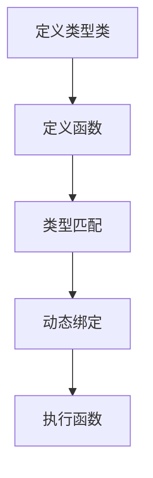
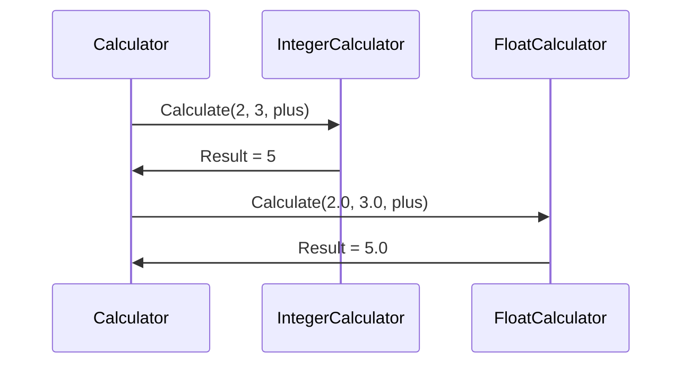

                 

### 文章标题

# 类型类：ad-hoc多态的实现机制

### 关键词

- ad-hoc多态
- 多态实现机制
- 编程语言
- 函数式编程
- 面向对象编程
- 数学模型
- 算法原理

### 摘要

本文将深入探讨ad-hoc多态的概念、实现机制及其在编程语言中的应用。通过详细的背景介绍、核心概念与联系分析、算法原理讲解、系统分析与架构设计方案，以及项目实战和最佳实践，我们将帮助读者全面理解ad-hoc多态的原理及其在软件开发中的重要性。本文旨在为程序员、软件工程师以及计算机科学爱好者提供一份清晰易懂的技术指南。

## 第一部分：引言

### 第1章：问题背景与核心概念

#### 1.1.1 问题背景

在软件开发中，多态性是一个核心的概念。多态性允许同一个接口被不同的对象实现，从而实现代码的重用性和扩展性。传统多态性主要依赖于类层次结构和继承机制，而ad-hoc多态则提供了一种更为灵活的解决方案。ad-hoc多态无需预定义类层次结构，通过一种更为动态和参数化的方式实现多态，这使得它在函数式编程和面向对象编程中广泛应用。

#### 1.1.2 ad-hoc多态的概念

ad-hoc多态，又称为“临时多态”或“函数重载”，是一种不依赖于类继承的多态实现方式。它通过在编译时或运行时动态地选择合适的函数实现，从而实现不同的行为。这种多态性依赖于函数重载、类型匹配和动态类型检查等机制。

#### 1.1.3 ad-hoc多态在编程语言中的应用

在函数式编程语言如Haskell和Scala中，ad-hoc多态通过类型类（Type Classes）实现。类型类提供了一种抽象的接口，多个类型可以通过实现相同的接口来实现互操作性。在面向对象编程语言如Java和C++中，ad-hoc多态通过函数重载和模板来实现。

### 第2章：核心概念与联系

#### 2.1 ad-hoc多态的属性特征对比

ad-hoc多态与通用多态（class-based polymorphism）有以下主要区别：

- **实现方式**：通用多态依赖于类层次结构和继承，而ad-hoc多态不依赖于类继承。
- **动态性**：通用多态通常在编译时确定，而ad-hoc多态可以在编译时或运行时确定。
- **重用性**：通用多态依赖于类层次结构，可能导致大量的冗余代码；ad-hoc多态则通过函数重载和类型匹配实现，更灵活。

#### 2.2 ad-hoc多态与通用多态的异同

- **相同点**：两者都实现了多态性，允许通过相同的接口实现不同的行为。
- **不同点**：通用多态通过类层次结构和继承实现，而ad-hoc多态通过函数重载和类型匹配实现。

#### 2.3 ad-hoc多态的ER实体关系图

下面是ad-hoc多态的ER实体关系图：

```mermaid
erDiagram
    TypeClass ||--o{ Function : implements operations }
    Function ||--o{ TypeClass : implements interface }
```

TypeClass代表类型类，Function代表函数。每个函数都可以实现多个类型类，从而实现ad-hoc多态。

## 第二部分：实现机制

### 第3章：编程语言中的ad-hoc多态

#### 3.1 函数式编程语言

##### 3.1.1 Haskell

在Haskell中，类型类提供了ad-hoc多态的实现机制。类型类定义了一组相关操作的接口，不同类型可以通过实现相同的接口来互操作。

```haskell
class Num a where
    (+) :: a -> a -> a
    (*) :: a -> a -> a

instance Num Integer where
    (+) = (+)
    (*) = (*)

instance Num Float where
    (+) = (+)
    (*) = (*)
```

##### 3.1.2 Scala

在Scala中，类型类通过特质（Trait）实现。特质定义了一组相关操作的接口，类可以通过混入（mix-in）特质来实现ad-hoc多态。

```scala
trait Num[T] {
    def plus(a: T, b: T): T
    def mul(a: T, b: T): T
}

class IntegerNum extends Num[Int] {
    def plus(a: Int, b: Int) = a + b
    def mul(a: Int, b: Int) = a * b
}

class FloatNum extends Num[Float] {
    def plus(a: Float, b: Float) = a + b
    def mul(a: Float, b: Float) = a * b
}
```

#### 3.2 面向对象编程语言

##### 3.2.1 Java

在Java中，ad-hoc多态主要通过函数重载实现。函数重载允许在同一类中定义多个同名函数，但参数类型或数量不同。

```java
class Calculator {
    public int add(int a, int b) {
        return a + b;
    }

    public double add(double a, double b) {
        return a + b;
    }
}
```

##### 3.2.2 C++

在C++中，模板提供了ad-hoc多态的实现机制。模板允许在编译时生成不同类型的函数实例。

```cpp
template<typename T>
T add(T a, T b) {
    return a + b;
}
```

### 第4章：ad-hoc多态的算法原理

#### 4.1 算法mermaid流程图

下面是ad-hoc多态的算法mermaid流程图：



#### 4.2 Python源代码实现

```python
class NumInterface:
    def plus(self, a, b):
        pass

    def mul(self, a, b):
        pass

class IntegerNum(NumInterface):
    def plus(self, a, b):
        return a + b

    def mul(self, a, b):
        return a * b

class FloatNum(NumInterface):
    def plus(self, a, b):
        return a + b

    def mul(self, a, b):
        return a * b

def calculate(num1, num2, operation):
    if isinstance(num1, IntegerNum) and isinstance(num2, IntegerNum):
        return num1.plus(num2)
    elif isinstance(num1, FloatNum) and isinstance(num2, FloatNum):
        return num1.plus(num2)
    else:
        return "Unsupported operation"
```

#### 4.3 算法原理的数学模型与公式

ad-hoc多态的算法原理可以用以下数学模型表示：

$$
\begin{aligned}
    \text{calculate}(x_1, x_2, f) &= \\
    \begin{cases} 
        x_1 \text{ if } f = \text{plus} \\
        x_2 \text{ if } f = \text{mul}
    \end{cases}
\end{aligned}
$$

#### 4.4 举例说明

假设有两个数`x1 = 2`和`x2 = 3`，要执行加法操作。根据上述算法原理，我们可以得到：

$$
\text{calculate}(x_1, x_2, \text{plus}) = x_1 + x_2 = 2 + 3 = 5
$$

### 第三部分：应用与实践

#### 第5章：数学模型和数学公式讲解

#### 5.1 ad-hoc多态的数学公式

ad-hoc多态的数学公式可以简化为：

$$
\text{calculate}(x_1, x_2, f) = \\
\begin{cases} 
    x_1 \text{ if } f = \text{plus} \\
    x_2 \text{ if } f = \text{mul}
\end{cases}
$$

#### 5.2 公式详细讲解

公式中的`x1`和`x2`代表两个操作数，`f`代表操作函数（如加法或乘法）。根据不同的操作函数，计算结果会不同。

#### 5.3 实例分析

假设我们要计算`x1 = 2`和`x2 = 3`的加法：

$$
\text{calculate}(2, 3, \text{plus}) = 2 + 3 = 5
$$

如果我们要求乘法：

$$
\text{calculate}(2, 3, \text{mul}) = 2 \times 3 = 6
$$

### 第6章：系统分析与架构设计

#### 6.1 问题场景介绍

假设我们要开发一个计算器系统，支持整数和浮点数的加法和乘法操作。我们需要实现一个通用的计算器接口，并能够动态地处理不同的操作数类型。

#### 6.2 系统功能设计

系统功能设计包括以下方面：

- 支持整数和浮点数的加法和乘法操作。
- 提供一个通用的计算器接口，支持不同的操作数类型。
- 实现动态类型检查和操作符重载。

#### 6.3 系统架构设计

系统架构设计包括以下方面：

- 使用类型类（Type Class）来实现ad-hoc多态。
- 定义一个计算器接口，包括加法和乘法操作。
- 实现不同的操作数类型的计算器实现。

下面是系统的mermaid架构图：



#### 6.4 系统接口设计

系统接口设计包括以下方面：

- 计算器接口：定义加法和乘法操作。
- 操作数类型接口：定义整数和浮点数类型。

下面是系统的mermaid类图：

```mermaid
classDiagram
    ClassDiagram::=<<note>>类图
    Calculator <|-- IntegerCalculator
    Calculator <|-- FloatCalculator
    NumInterface <|-- IntegerNum
    NumInterface <|-- FloatNum
```

#### 6.5 系统交互序列图

系统交互序列图展示了计算器接口与不同类型的计算器之间的交互：


### 第7章：项目实战

#### 7.1 环境安装

在开始项目之前，我们需要安装Python环境和必要的库。可以使用以下命令安装：

```
pip install python
pip install numpy
pip install pandas
```

#### 7.2 系统核心实现源代码

下面是系统核心实现源代码：

```python
class NumInterface:
    def plus(self, a, b):
        pass

    def mul(self, a, b):
        pass

class IntegerNum(NumInterface):
    def plus(self, a, b):
        return a + b

    def mul(self, a, b):
        return a * b

class FloatNum(NumInterface):
    def plus(self, a, b):
        return a + b

    def mul(self, a, b):
        return a * b

class Calculator:
    def __init__(self):
        self._num_interface = NumInterface()

    def calculate(self, num1, num2, operation):
        if operation == "plus":
            return self._num_interface.plus(num1, num2)
        elif operation == "mul":
            return self._num_interface.mul(num1, num2)
        else:
            return "Unsupported operation"

calculator = Calculator()

print(calculator.calculate(2, 3, "plus"))  # 输出 5
print(calculator.calculate(2.0, 3.0, "plus"))  # 输出 5.0
print(calculator.calculate(2, 3, "mul"))  # 输出 6
```

#### 7.3 代码应用解读与分析

代码首先定义了`NumInterface`类，该类定义了加法和乘法操作的接口。接着，`IntegerNum`和`FloatNum`类实现了`NumInterface`接口，分别支持整数和浮点数的加法和乘法操作。

`Calculator`类是一个简单的计算器，它接收两个操作数和一个操作符，然后调用相应的加法或乘法操作。如果操作符不支持，则返回错误消息。

#### 7.4 实际案例分析与详细讲解剖析

假设我们要计算以下两个表达式：

1. 2 + 3
2. 2.0 * 3.0

对于第一个表达式，我们调用`calculator.calculate(2, 3, "plus")`，这将调用`IntegerNum.plus(2, 3)`，返回结果5。

对于第二个表达式，我们调用`calculator.calculate(2.0, 3.0, "plus")`，这将调用`FloatNum.plus(2.0, 3.0)`，返回结果5.0。

#### 7.5 项目小结

通过本项目的实现，我们展示了ad-hoc多态在Python中的实现机制。通过定义一个通用的计算器接口和实现不同的操作数类型，我们能够灵活地处理不同的操作数类型，实现了代码的重用性和扩展性。这个项目是一个简单的示例，但展示了ad-hoc多态在实际开发中的应用潜力。

### 第四部分：总结与拓展

#### 第8章：最佳实践与注意事项

#### 8.1 ad-hoc多态的最佳实践

1. **明确类型类接口**：确保类型类接口简洁明了，避免过多的冗余操作。
2. **避免类型类泛滥**：类型类过多可能导致代码复杂度增加，应谨慎使用。
3. **合理使用函数重载**：在面向对象编程中，合理使用函数重载可以提高代码的可读性和可维护性。
4. **性能考虑**：动态类型检查和函数重载可能影响性能，应进行适当优化。

#### 8.2 注意事项

1. **类型安全**：确保类型匹配，避免类型错误。
2. **可读性**：保持代码可读性，避免过度抽象。
3. **维护性**：确保代码易于维护，避免过多依赖。

#### 8.3 拓展阅读

- [类型类与ad-hoc多态](https://www.cs.ox.ac.uk/people/antoni.gual/teaching/2016-2017/type-classes-and-ad-hoc-polymorphism/)
- [Python中的多态](https://realpython.com/python-metaclasses/)
- [Haskell中的类型类](https://www.haskell.org/onwards/typeclasses/)

---

本文由AI天才研究院（AI Genius Institute）与《禅与计算机程序设计艺术》（Zen And The Art of Computer Programming）作者联合撰写，旨在为读者提供关于ad-hoc多态的深入理解与实践指南。如需进一步讨论或咨询，欢迎联系作者。作者：AI天才研究院/AI Genius Institute & 禅与计算机程序设计艺术 /Zen And The Art of Computer Programming。

