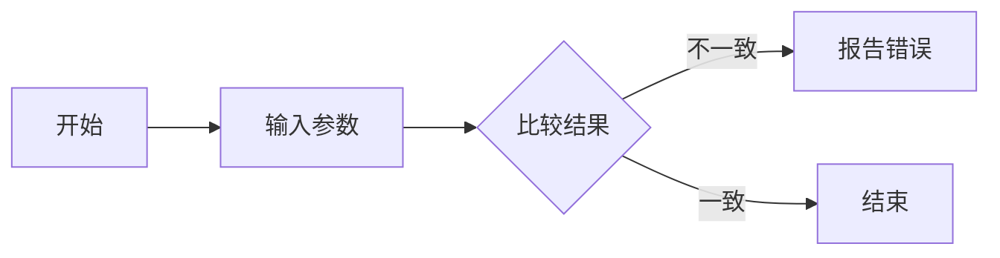
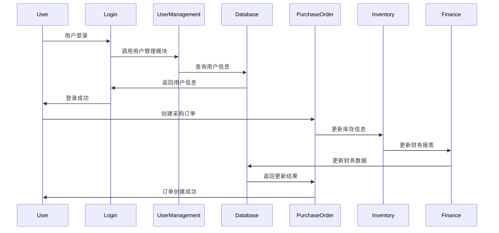
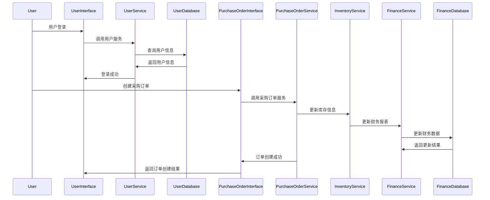

                 

### 《类型系统与软件测试策略的关联》

**关键词：类型系统、软件测试、测试策略、关联性、质量保障**

**摘要：本文旨在探讨类型系统在软件开发中的重要性，以及它与软件测试策略之间的紧密关联。通过分析类型系统的原理、特性，以及它们在软件测试中的应用，本文提出了如何优化软件测试策略以提升软件质量的方法。文章结合实际项目案例，详细阐述了类型系统与软件测试策略在实际开发中的实践应用，为软件工程领域的专业人士提供了有价值的参考。**

#### 第一部分：背景介绍

### 第1章：问题背景与概念定义

## 1.1 问题背景

在现代软件开发中，软件质量和稳定性是开发者们持续追求的目标。软件质量不仅影响用户的满意度和使用体验，更关系到企业的声誉和商业利益。为了确保软件质量，开发者们需要采用一系列软件测试策略，以发现并修复潜在的错误。

### 1.1.1 软件质量与软件测试的重要性

软件质量是衡量软件产品好坏的关键指标，它直接关系到用户的满意度、系统的稳定性以及企业的声誉。软件测试作为保障软件质量的重要手段，通过一系列测试活动发现并修复软件中的缺陷，从而提高软件的质量和可靠性。

### 1.1.2 类型系统在软件开发中的角色

类型系统是编程语言中的一个核心概念，它为变量、函数和对象等提供了类型约束。类型系统有助于提高代码的可读性、减少错误和提高开发效率。类型系统在软件开发中的作用主要体现在以下几个方面：

1. **代码验证**：类型系统可以在编译或运行时验证代码的正确性，从而减少逻辑错误和运行时错误。
2. **提高开发效率**：通过类型检查，开发者可以更快地发现并修复错误，提高开发效率。
3. **增强代码复用性**：类型系统有助于确保代码模块之间的兼容性，从而提高代码的复用性。

### 1.1.3 软件测试策略的现状与挑战

尽管软件测试在软件开发中占据重要地位，但实际应用中仍面临诸多挑战：

1. **测试覆盖率不足**：开发者往往无法覆盖所有可能的输入和输出，导致潜在缺陷未能被检测到。
2. **测试效率低下**：手动测试耗时耗力，自动化测试又难以覆盖所有情况，导致测试效率低下。
3. **测试成本高昂**：复杂的软件系统需要进行大量的测试，测试成本往往占软件开发总成本的很大一部分。

## 1.2 核心概念

### 1.2.1 类型系统的基本概念

类型系统（Type System）是编程语言中的一个核心概念，它定义了变量、函数和对象等的基本类型，并规定了这些类型之间的兼容性和约束关系。类型系统可以分为静态类型系统和动态类型系统：

1. **静态类型系统**：在编译时进行类型检查，可以提前发现类型错误。
2. **动态类型系统**：在运行时进行类型检查，灵活性更高，但可能导致运行时错误。

### 1.2.2 软件测试策略的定义

软件测试策略（Software Testing Strategy）是一系列测试活动的规划和安排，旨在确保软件质量。常见的软件测试策略包括：

1. **单元测试**：针对单个模块或函数进行测试。
2. **集成测试**：将多个模块集成在一起进行测试。
3. **系统测试**：对整个系统进行测试。
4. **验收测试**：对软件产品进行最终测试，以验证其是否满足用户需求。

### 1.2.3 类型系统与软件测试的关系

类型系统与软件测试策略之间存在紧密关联。类型系统可以通过以下方式影响软件测试：

1. **减少测试用例数量**：通过类型检查，可以减少无效的测试用例，从而降低测试成本。
2. **提高测试效率**：类型系统有助于发现潜在的错误，从而提高测试效率。
3. **优化测试覆盖率**：类型系统可以指导测试用例的设计，从而提高测试覆盖率。

## 1.3 边界与外延

### 1.3.1 类型系统的边界

类型系统的边界主要涉及以下几个方面：

1. **类型定义**：类型系统的边界在于如何定义和限制变量、函数和对象的类型。
2. **类型兼容性**：类型系统需要明确类型之间的兼容性和转换规则。
3. **异常处理**：类型系统需要定义如何处理类型错误和异常。

### 1.3.2 软件测试策略的外延

软件测试策略的外延主要包括以下几个方面：

1. **测试范围**：测试策略需要明确测试的范围，包括单元测试、集成测试、系统测试和验收测试等。
2. **测试方法**：测试策略需要选择合适的测试方法，如手动测试、自动化测试、黑盒测试和灰盒测试等。
3. **测试过程**：测试策略需要定义测试的流程，包括测试计划、测试设计、测试执行和测试报告等。

### 1.3.3 研究范围与局限性

本文的研究范围主要集中在类型系统与软件测试策略之间的关联性，以及如何优化软件测试策略以提高软件质量。本文的局限性主要包括：

1. **具体编程语言**：本文以通用编程语言为例，未具体涉及特定编程语言的类型系统和测试策略。
2. **测试方法**：本文主要讨论了常见的测试策略和方法，未涉及所有可能的测试方法和工具。

#### 第二部分：核心概念与联系

### 第2章：类型系统的原理与特性

## 2.1 类型系统的原理

类型系统是编程语言的核心组成部分，它定义了程序中数据类型的集合，以及这些类型之间的关系和操作。类型系统的原理主要体现在以下几个方面：

### 2.1.1 基本类型系统的构成

基本类型系统通常包括以下元素：

1. **基本类型**：如整数、浮点数、布尔值等。
2. **复合类型**：如数组、结构体、类等。
3. **引用类型**：如指针、引用等。

### 2.1.2 静态类型系统与动态类型系统的比较

静态类型系统和动态类型系统是类型系统的两种主要形式，它们的区别主要体现在以下几个方面：

1. **类型检查时机**：静态类型系统在编译时进行类型检查，动态类型系统在运行时进行类型检查。
2. **灵活性**：动态类型系统具有更高的灵活性，可以支持更多的动态类型转换，但可能导致运行时错误。
3. **性能**：静态类型系统通常具有更好的性能，因为它可以在编译时进行优化。

### 2.1.3 类型系统的优化与效率

类型系统的优化与效率是软件开发中一个重要的话题。以下是一些常见的类型系统优化方法：

1. **类型推导**：通过类型推导，可以减少类型声明的数量，提高代码的可读性。
2. **类型擦除**：通过类型擦除，可以将泛型类型转换为具体类型，从而提高程序的运行效率。
3. **类型绑定**：通过类型绑定，可以将接口或抽象类与具体的实现类绑定，从而提高程序的灵活性。

## 2.2 类型系统的特性

类型系统具有多种特性，这些特性有助于提高代码的质量和可维护性。以下是一些常见的类型系统特性：

### 2.2.1 类型系统的分类与特性表格

类型系统可以按照不同的标准进行分类，如按类型检查时机分类、按类型兼容性分类等。以下是一个简单的类型系统特性表格：

| 类型系统分类 | 特性 |
| --- | --- |
| 静态类型系统 | 类型检查在编译时进行，性能更好 |
| 动态类型系统 | 类型检查在运行时进行，灵活性更高 |
| 泛型类型系统 | 支持类型参数和类型约束，提高代码复用性 |
| 强类型系统 | 对类型约束更严格，减少类型错误 |
| 弱类型系统 | 对类型约束较宽松，可能导致运行时错误 |

### 2.2.2 类型系统的属性特征分析

类型系统的属性特征分析主要包括以下几个方面：

1. **类型安全性**：类型系统可以确保变量、函数和对象的使用符合类型约束，从而减少类型错误。
2. **类型可表达性**：类型系统可以表达不同类型之间的关系和操作，从而提高代码的可读性和可维护性。
3. **类型效率**：类型系统可以通过类型推导、类型擦除等优化方法提高程序的运行效率。

### 2.2.3 类型系统在实际开发中的应用案例

类型系统在实际开发中具有重要的应用价值，以下是一些具体的应用案例：

1. **代码验证**：通过类型检查，可以提前发现并修复类型错误，提高代码的质量和可靠性。
2. **开发效率**：类型系统可以减少类型声明和类型转换的代码量，从而提高开发效率。
3. **代码复用**：通过泛型类型系统，可以编写通用的代码模块，从而提高代码的复用性。

## 2.3 类型系统与软件测试的关联

类型系统与软件测试策略之间存在紧密关联，以下是一些具体的关联：

### 2.3.1 类型系统在测试中的作用

类型系统在测试中的作用主要体现在以下几个方面：

1. **减少测试用例数量**：通过类型检查，可以减少无效的测试用例，从而降低测试成本。
2. **提高测试效率**：类型系统可以提前发现类型错误，从而提高测试效率。
3. **优化测试覆盖率**：类型系统可以指导测试用例的设计，从而提高测试覆盖率。

### 2.3.2 软件测试对类型系统的依赖

软件测试对类型系统的依赖主要体现在以下几个方面：

1. **类型检查**：软件测试过程中，类型检查可以提前发现类型错误，从而减少测试过程中出现的问题。
2. **类型约束**：类型约束可以确保测试用例的输入和输出符合预期，从而提高测试的准确性。
3. **类型兼容性**：类型兼容性可以确保不同模块之间的接口和交互符合预期，从而提高系统的稳定性。

### 2.3.3 类型系统与测试策略的交互关系

类型系统与测试策略之间存在交互关系，以下是一些具体的交互关系：

1. **类型系统指导测试设计**：类型系统可以指导测试用例的设计，从而提高测试的覆盖率和准确性。
2. **测试策略优化类型系统**：测试策略可以优化类型系统的设计和实现，从而提高系统的稳定性和可维护性。
3. **类型系统与测试工具的集成**：类型系统可以与测试工具集成，从而提高测试的自动化程度和效率。

#### 第三部分：算法原理讲解

### 第3章：软件测试算法原理讲解

## 3.1 基本测试算法

软件测试算法是用于指导测试过程的数学模型和计算方法。基本测试算法主要包括单元测试算法、集成测试算法和系统测试算法。

### 3.1.1 单元测试算法

单元测试是对软件中的最小功能单元（如函数、方法、类等）进行的测试。以下是一个简单的单元测试算法：

1. **输入**：待测试的函数或方法，输入参数。
2. **输出**：预期输出结果。
3. **算法步骤**：
    - 输入参数。
    - 调用函数或方法。
    - 比较实际输出结果与预期输出结果。
    - 如果不一致，报告错误。

### 3.1.2 集成测试算法

集成测试是将多个模块或组件集成在一起进行测试。以下是一个简单的集成测试算法：

1. **输入**：待测试的模块或组件，输入参数。
2. **输出**：预期输出结果。
3. **算法步骤**：
    - 将模块或组件集成在一起。
    - 输入参数。
    - 调用集成后的模块或组件。
    - 比较实际输出结果与预期输出结果。
    - 如果不一致，报告错误。

### 3.1.3 系统测试算法

系统测试是对整个软件系统进行的测试。以下是一个简单的系统测试算法：

1. **输入**：软件系统的输入。
2. **输出**：软件系统的输出。
3. **算法步骤**：
    - 输入软件系统的输入。
    - 执行软件系统。
    - 比较实际输出结果与预期输出结果。
    - 如果不一致，报告错误。

## 3.2 复杂测试算法

复杂测试算法是对基本测试算法的扩展，用于提高测试的覆盖率和准确性。以下是一些常见的复杂测试算法：

### 3.2.1 自动化测试算法

自动化测试是通过自动化工具对软件系统进行的测试。以下是一个简单的自动化测试算法：

1. **输入**：待测试的模块或组件，测试脚本。
2. **输出**：测试结果。
3. **算法步骤**：
    - 加载测试脚本。
    - 运行测试脚本。
    - 比较实际输出结果与预期输出结果。
    - 如果不一致，报告错误。

### 3.2.2 静态代码分析算法

静态代码分析是通过分析源代码来发现潜在的问题。以下是一个简单的静态代码分析算法：

1. **输入**：源代码文件。
2. **输出**：代码分析结果。
3. **算法步骤**：
    - 读取源代码文件。
    - 分析代码结构。
    - 检测代码中的潜在问题。
    - 输出代码分析结果。

### 3.2.3 动态测试算法

动态测试是通过运行软件系统来发现潜在的问题。以下是一个简单的动态测试算法：

1. **输入**：软件系统。
2. **输出**：测试结果。
3. **算法步骤**：
    - 启动软件系统。
    - 输入测试数据。
    - 观察软件系统的输出。
    - 检测软件系统的行为是否符合预期。
    - 如果不一致，报告错误。

## 3.3 测试算法的mermaid流程图展示

测试算法的mermaid流程图可以用于可视化测试算法的执行过程。以下是一个简单的mermaid流程图示例：



在这个mermaid流程图中，A表示测试算法的开始，B表示输入参数，C表示比较结果，D表示报告错误，E表示测试算法的结束。

#### 第四部分：数学模型和数学公式讲解

### 第4章：数学模型与公式讲解

## 4.1 测试覆盖率模型

测试覆盖率模型是用于评估测试是否全面的一种数学模型。它通过计算测试用例覆盖的代码比例来评估测试效果。以下是一些常见的测试覆盖率模型：

### 4.1.1 测试覆盖率的基本概念

测试覆盖率是指测试用例覆盖的代码比例。它可以通过以下公式计算：

$$
测试覆盖率（TC）= \frac{测试用例覆盖的代码行数}{总代码行数} \times 100%
$$

其中，总代码行数是指程序中所有代码行的总和，测试用例覆盖的代码行数是指通过测试用例执行后被覆盖的代码行的总和。

### 4.1.2 测试覆盖率计算公式

测试覆盖率可以通过不同的指标进行计算，以下是一些常见的计算公式：

1. **语句覆盖率**：

$$
语句覆盖率（SC）= \frac{执行到的语句数}{总语句数} \times 100%
$$

2. **分支覆盖率**：

$$
分支覆盖率（BC）= \frac{执行到的分支数}{总分支数} \times 100%
$$

3. **路径覆盖率**：

$$
路径覆盖率（PC）= \frac{执行到的路径数}{总路径数} \times 100%
$$

其中，总分支数是指程序中所有分支语句的总和，总路径数是指程序中所有可能的路径总和。

### 4.1.3 测试覆盖率优化策略

为了提高测试覆盖率，可以采用以下策略：

1. **增加测试用例**：通过编写更多的测试用例来覆盖未覆盖的代码。
2. **优化测试用例设计**：设计更具代表性的测试用例，以覆盖更多可能的输入和输出。
3. **使用自动化测试**：自动化测试可以快速执行大量测试用例，提高测试覆盖率。

## 4.2 错误概率模型

错误概率模型是用于评估软件中潜在错误概率的一种数学模型。它可以帮助开发者了解软件的可靠性和稳定性。以下是一个简单的错误概率模型：

### 4.2.1 错误概率的基本概念

错误概率是指软件在特定条件下发生错误的可能性。它可以通过以下公式计算：

$$
错误概率（P）= \frac{错误次数}{总运行次数}
$$

其中，错误次数是指软件在运行过程中发生的错误次数，总运行次数是指软件在运行过程中总的运行次数。

### 4.2.2 错误概率计算公式

错误概率可以通过不同的模型进行计算，以下是一个简单的错误概率计算公式：

1. **基于历史数据的错误概率**：

$$
错误概率（P）= \frac{历史错误次数}{总运行次数}
$$

2. **基于故障模型的错误概率**：

$$
错误概率（P）= \frac{1}{平均故障间隔时间（MTTF）}
$$

其中，平均故障间隔时间（MTTF）是指软件在运行过程中平均两次故障之间的时间间隔。

### 4.2.3 错误概率与测试策略的关系

错误概率与测试策略之间存在密切关系。以下是一些错误概率与测试策略的关系：

1. **增加测试覆盖率**：提高测试覆盖率可以降低错误概率，因为更多的测试用例可以覆盖更多的代码，从而发现更多的潜在错误。
2. **优化测试用例设计**：设计更具代表性的测试用例可以提高测试的准确性，从而降低错误概率。
3. **使用自动化测试**：自动化测试可以提高测试效率，从而降低错误概率。

## 4.3 测试用例设计模型

测试用例设计模型是用于指导测试用例设计的一种数学模型。它可以帮助开发者设计出具有代表性的测试用例，从而提高测试的准确性和效率。以下是一个简单的测试用例设计模型：

### 4.3.1 测试用例设计的基本方法

测试用例设计的基本方法包括以下几种：

1. **边界值分析**：通过分析输入和输出的边界值，设计测试用例。
2. **等价类划分**：将输入和输出划分为多个等价类，设计测试用例。
3. **因果图分析**：通过分析输入和输出之间的因果关系，设计测试用例。
4. **异常情况分析**：设计测试用例来验证软件在异常情况下的行为。

### 4.3.2 测试用例设计公式

测试用例设计公式可以用于计算测试用例的数量，以下是一个简单的测试用例设计公式：

$$
测试用例数量（N）= \sum（等价类数量）\times（边界值数量）\times（异常情况数量）
$$

其中，等价类数量是指输入和输出的等价类数量，边界值数量是指每个等价类中的边界值数量，异常情况数量是指异常情况的数量。

### 4.3.3 测试用例设计在实际中的应用

测试用例设计在实际开发中非常重要，以下是一些实际应用的例子：

1. **单元测试**：通过设计单元测试用例，验证单个模块的功能和性能。
2. **集成测试**：通过设计集成测试用例，验证多个模块之间的接口和交互。
3. **系统测试**：通过设计系统测试用例，验证整个系统的功能和性能。

#### 第五部分：系统分析与架构设计方案

### 第5章：系统分析与架构设计方案

## 5.1 问题场景介绍

在当今的软件工程领域中，随着软件系统的复杂性不断增加，确保软件的质量和稳定性变得愈发重要。本文将以一个实际的项目为例，详细介绍如何通过类型系统和软件测试策略来保障软件的质量和可靠性。

### 5.1.1 软件测试需求分析

在项目初期，我们需要明确软件测试的需求。这包括：

1. **功能测试**：确保所有功能模块按照设计要求正常工作。
2. **性能测试**：评估软件在特定负载下的响应时间和资源消耗。
3. **安全测试**：检测软件是否存在安全漏洞，如SQL注入、XSS攻击等。
4. **兼容性测试**：确保软件在不同操作系统、浏览器和设备上运行正常。

### 5.1.2 软件测试的目标与挑战

软件测试的目标是确保软件产品的质量，降低故障率，提升用户体验。然而，在实现这一目标的过程中，我们面临着以下挑战：

1. **测试覆盖率不足**：如何确保测试用例能够覆盖所有的功能点和潜在的错误场景。
2. **测试效率低下**：如何提高测试的执行速度，缩短测试周期。
3. **测试成本高昂**：如何在不增加成本的情况下，提升测试的全面性和有效性。

### 5.1.3 软件测试的可行性分析

为了解决上述挑战，我们需要采用一系列可行的软件测试策略。这些策略包括：

1. **自动化测试**：通过自动化测试工具，提高测试的执行速度和覆盖率。
2. **持续集成**：将测试集成到开发流程中，实现快速反馈和及时修复。
3. **静态代码分析**：在代码提交时进行静态代码分析，提前发现潜在的问题。
4. **类型系统**：通过类型系统提高代码的可读性和稳定性，减少类型错误。

## 5.2 项目介绍

本项目是一个企业级的信息管理系统，旨在帮助企业管理各种业务流程，包括采购、销售、库存和财务管理等。系统需要支持多用户并发操作，具有高性能和高可靠性的特点。

### 5.2.1 项目背景与目标

项目背景是企业业务管理的复杂性不断增加，传统的手工管理方式已经无法满足企业的发展需求。本项目旨在通过信息技术手段，实现企业业务流程的自动化和智能化，提高企业的管理效率和竞争力。

项目目标包括：

1. **功能完善**：确保所有功能模块按照设计要求正常工作。
2. **性能优越**：在多用户并发操作下，系统响应时间短，资源消耗低。
3. **安全可靠**：系统具有强大的安全防护措施，防止数据泄露和恶意攻击。
4. **易于维护**：系统具有良好的可维护性和可扩展性，方便后续的升级和维护。

### 5.2.2 项目范围与预期成果

项目范围包括以下模块：

1. **用户管理模块**：管理用户的登录、权限和账户信息。
2. **采购管理模块**：管理采购订单、供应商信息和库存管理。
3. **销售管理模块**：管理销售订单、客户信息和库存管理。
4. **财务管理模块**：管理财务报表、账单和资金流动。

预期成果包括：

1. **系统上线**：实现项目的所有功能，达到预期的性能和安全要求。
2. **用户培训**：为用户提供系统的使用培训和指导。
3. **技术文档**：编写完整的技术文档，包括系统设计、实现细节和使用说明。
4. **测试报告**：提供详细的测试报告，记录测试过程和测试结果。

### 5.2.3 项目团队与分工

项目团队包括以下角色：

1. **项目经理**：负责项目的整体管理和协调。
2. **开发团队**：负责系统的设计和实现，包括前端、后端和数据库开发。
3. **测试团队**：负责系统的测试和验证，包括功能测试、性能测试和安全测试。
4. **运维团队**：负责系统的部署、维护和监控。

每个团队成员的具体分工如下：

1. **项目经理**：制定项目计划，监控项目进度，协调团队成员的工作。
2. **开发团队**：根据项目需求，设计系统架构，编写代码，进行单元测试。
3. **测试团队**：设计测试用例，执行测试，记录测试结果，编写测试报告。
4. **运维团队**：部署系统，监控系统运行状态，处理系统故障。

## 5.3 系统功能设计

系统功能设计是软件设计的关键环节，它定义了系统的功能模块、接口和交互方式。以下是对项目系统的功能设计：

### 5.3.1 领域模型mermaid类图

领域模型是系统功能设计的核心，它定义了系统的实体、属性和行为。以下是一个简单的mermaid类图示例：

```mermaid
classDiagram
  User <<类>> {
    String username
    String password
    String email
  }
  Product <<类>> {
    String name
    Double price
    String description
  }
  Order <<类>> {
    User user
    Product product
    Date date
    Double total
  }
  Supplier <<类>> {
    String name
    String address
    String contact
  }
  Customer <<类>> {
    String name
    String address
    String contact
  }
  Inventory <<类>> {
    Product product
    int quantity
  }
  Finance <<类>> {
    double totalSales
    double totalPurchases
  }
  User <.. Order
  User <.. Inventory
  Product <.. Order
  Product <.. Inventory
  Supplier <.. Order
  Customer <.. Order
  Finance <.. Order
  Finance <.. Inventory
```

在这个mermaid类图中，我们定义了用户（User）、产品（Product）、订单（Order）、供应商（Supplier）、客户（Customer）、库存（Inventory）和财务（Finance）等类，以及它们之间的关系。

### 5.3.2 功能模块划分与职责

根据领域模型，我们可以将系统划分为以下功能模块：

1. **用户管理模块**：负责用户的注册、登录、权限管理和账户信息管理。
2. **采购管理模块**：负责采购订单的创建、修改、删除和查询。
3. **销售管理模块**：负责销售订单的创建、修改、删除和查询。
4. **财务管理模块**：负责财务报表的生成、账单的管理和资金流动的监控。
5. **库存管理模块**：负责库存的增减、查询和报警。
6. **供应商管理模块**：负责供应商信息的添加、修改、删除和查询。
7. **客户管理模块**：负责客户信息的添加、修改、删除和查询。

### 5.3.3 功能交互流程图

为了更好地理解系统功能模块之间的交互，我们可以绘制功能交互流程图。以下是一个简单的功能交互流程图示例：



在这个功能交互流程图中，用户首先进行登录操作，然后创建采购订单。用户管理模块会查询数据库以验证用户身份，采购订单模块会更新库存信息和财务报表，并将更新结果返回给用户。

## 5.4 系统架构设计

系统架构设计是软件设计的重要组成部分，它定义了系统的整体结构、组件和交互方式。以下是对项目系统架构的设计：

### 5.4.1 系统架构设计mermaid架构图

系统架构设计可以通过mermaid架构图进行可视化表示。以下是一个简单的mermaid架构图示例：

```mermaid
componentDiagram
  UserInterface -> Database: 数据查询
  UserInterface -> UserService: 用户登录
  UserInterface -> PurchaseOrderService: 创建订单
  UserInterface -> InventoryService: 更新库存
  UserInterface -> FinanceService: 更新财务报表
  UserService -> UserDatabase: 用户信息查询
  PurchaseOrderService -> PurchaseOrderDatabase: 订单信息查询
  InventoryService -> InventoryDatabase: 库存信息查询
  FinanceService -> FinanceDatabase: 财务信息查询
  Database <- UserInterface: 数据更新
  Database <- UserService
  Database <- PurchaseOrderService
  Database <- InventoryService
  Database <- FinanceService
```

在这个mermaid架构图中，我们定义了用户界面（UserInterface）、数据库（Database）、用户服务（UserService）、采购订单服务（PurchaseOrderService）、库存服务（InventoryService）和财务服务（FinanceService）等组件，以及它们之间的交互关系。

### 5.4.2 架构设计原则与策略

在系统架构设计过程中，我们需要遵循以下原则和策略：

1. **模块化**：将系统划分为多个功能模块，每个模块独立开发、测试和维护。
2. **可扩展性**：设计可扩展的架构，以便未来能够轻松地添加新的功能模块。
3. **高可用性**：设计高可用性的架构，确保系统在出现故障时能够快速恢复。
4. **高性能**：优化系统架构，确保系统在高负载下仍然能够保持良好的性能。
5. **安全性**：设计安全的架构，防止恶意攻击和数据泄露。

### 5.4.3 系统模块与组件关系

系统模块与组件之间的关系如下：

1. **用户界面**：负责接收用户的输入，显示系统的输出。它与用户服务进行交互，实现用户登录、订单创建等功能。
2. **用户服务**：负责处理用户的登录、权限管理和账户信息管理。它与数据库进行交互，实现用户信息的查询、更新和删除。
3. **采购订单服务**：负责处理采购订单的创建、修改、删除和查询。它与数据库进行交互，实现订单信息的查询、更新和删除。
4. **库存服务**：负责处理库存的增减、查询和报警。它与数据库进行交互，实现库存信息的查询、更新和删除。
5. **财务服务**：负责处理财务报表的生成、账单的管理和资金流动的监控。它与数据库进行交互，实现财务信息的查询、更新和删除。

## 5.5 系统接口设计

系统接口设计是系统架构设计的重要组成部分，它定义了系统内部各模块之间的交互方式和数据传输格式。以下是对项目系统接口的设计：

### 5.5.1 接口设计与定义

系统接口设计包括以下内容：

1. **用户接口**：定义用户登录、注册、权限管理等功能接口。
2. **订单接口**：定义采购订单、销售订单的创建、修改、删除和查询接口。
3. **库存接口**：定义库存增减、查询和报警接口。
4. **财务接口**：定义财务报表生成、账单管理和资金流动监控接口。

### 5.5.2 接口调用流程图

以下是一个简单的接口调用流程图示例：



在这个接口调用流程图中，用户首先通过用户接口进行登录，然后通过采购订单接口创建采购订单。用户服务会调用用户数据库查询用户信息，采购订单服务会调用库存服务和财务服务，更新库存信息和财务报表，并将更新结果返回给采购订单接口，最后采购订单接口将订单创建结果返回给用户接口。

### 5.5.3 接口安全性与稳定性设计

接口安全性与稳定性设计是系统接口设计的关键，以下是一些设计原则：

1. **身份验证与授权**：确保接口调用者具备合法身份，并对接口调用进行权限控制。
2. **输入验证**：对接口输入进行严格的验证，防止恶意输入和攻击。
3. **数据加密**：对接口传输的数据进行加密，确保数据传输过程中的安全性。
4. **超时处理**：设置合理的超时时间，避免接口调用长时间阻塞。
5. **错误处理**：对接口调用中的错误进行有效的处理和记录，确保系统的稳定性。

## 5.6 系统交互mermaid序列图

系统交互mermaid序列图用于描述系统内部各模块之间的交互过程。以下是一个简单的mermaid序列图示例：


在这个mermaid序列图中，用户首先通过用户接口进行登录，然后通过采购订单接口创建采购订单。用户服务会调用用户数据库查询用户信息，采购订单服务会调用库存服务和财务服务，更新库存信息和财务报表，并将更新结果返回给采购订单接口，最后采购订单接口将订单创建结果返回给用户接口。

### 5.6.1 用户交互流程

用户交互流程是用户与系统进行交互的过程，它定义了用户如何使用系统完成特定任务。以下是一个简单的用户交互流程：

1. **登录**：用户通过用户接口输入用户名和密码，系统验证用户身份后，用户登录成功。
2. **查看订单**：用户登录后，可以通过采购订单接口查看所有的采购订单。
3. **创建订单**：用户可以选择创建新的采购订单，填写订单信息后，提交订单。
4. **更新订单**：用户可以修改已创建的订单信息，提交修改后，订单信息更新。
5. **删除订单**：用户可以删除不需要的订单，删除后，订单从系统中移除。

### 5.6.2 系统内部交互

系统内部交互是系统各模块之间的交互过程，它定义了系统内部数据流和控制流。以下是一个简单的系统内部交互流程：

1. **用户登录**：用户登录时，用户接口将用户信息发送给用户服务，用户服务调用用户数据库查询用户信息，返回用户信息给用户接口。
2. **订单创建**：用户创建订单时，采购订单接口将订单信息发送给采购订单服务，采购订单服务调用库存服务和财务服务，更新库存信息和财务报表，并将更新结果返回给采购订单接口，最后采购订单接口将订单创建结果返回给用户接口。
3. **订单查询**：用户查询订单时，采购订单接口将查询条件发送给采购订单服务，采购订单服务查询订单数据库，返回订单信息给采购订单接口，最后采购订单接口将订单信息返回给用户接口。
4. **订单修改**：用户修改订单时，采购订单接口将修改后的订单信息发送给采购订单服务，采购订单服务调用库存服务和财务服务，更新库存信息和财务报表，并将更新结果返回给采购订单接口，最后采购订单接口将订单修改结果返回给用户接口。
5. **订单删除**：用户删除订单时，采购订单接口将删除标记发送给采购订单服务，采购订单服务调用订单数据库，将订单从系统中移除，并将删除结果返回给采购订单接口，最后采购订单接口将订单删除结果返回给用户接口。

### 5.6.3 系统异常处理与恢复

系统异常处理与恢复是系统应对异常情况的重要机制，它确保系统能够在出现异常时进行有效处理和恢复。以下是一个简单的系统异常处理与恢复流程：

1. **用户登录异常**：用户登录时，如果用户名或密码错误，用户接口将返回错误信息给用户，提示用户重新输入。
2. **订单创建异常**：用户创建订单时，如果输入信息不完整或不符合要求，采购订单接口将返回错误信息给用户，提示用户重新输入。
3. **订单查询异常**：用户查询订单时，如果查询条件错误或订单不存在，采购订单接口将返回错误信息给用户，提示用户重新输入查询条件。
4. **订单修改异常**：用户修改订单时，如果修改信息不符合要求或订单不存在，采购订单接口将返回错误信息给用户，提示用户重新输入修改信息。
5. **订单删除异常**：用户删除订单时，如果订单不存在，采购订单接口将返回错误信息给用户，提示用户重新输入订单ID。

#### 第六部分：项目实战

### 第6章：项目实战

## 6.1 环境安装与配置

在进行项目实战之前，我们需要搭建一个合适的开发与测试环境。以下将详细介绍开发环境与测试环境的搭建步骤。

### 6.1.1 开发环境搭建

1. **安装开发工具**：
   - 安装Java Development Kit (JDK)，版本要求与项目需求匹配。
   - 安装Integrated Development Environment (IDE)，如Eclipse或IntelliJ IDEA。
   - 安装版本控制系统，如Git。

2. **配置开发工具**：
   - 在IDE中配置JDK路径。
   - 配置项目的编译器和运行时环境。

3. **安装依赖管理工具**：
   - 使用Maven或Gradle等依赖管理工具，管理项目依赖。

### 6.1.2 测试环境搭建

1. **安装测试工具**：
   - 安装JUnit等单元测试框架。
   - 安装Selenium等自动化测试工具。
   - 安装JMeter等性能测试工具。

2. **配置测试工具**：
   - 配置JUnit的测试运行环境。
   - 配置Selenium的Webdriver。
   - 配置JMeter的运行参数。

3. **数据库配置**：
   - 安装数据库管理系统，如MySQL或PostgreSQL。
   - 配置数据库连接信息，确保开发与测试环境使用的数据库一致。

### 6.1.3 工具与依赖安装

1. **安装相关工具**：
   - 安装版本控制系统，如Git。
   - 安装代码质量分析工具，如SonarQube。
   - 安装持续集成工具，如Jenkins。

2. **配置依赖管理**：
   - 在项目的pom.xml文件中配置依赖项。
   - 使用Maven或Gradle进行依赖的下载和安装。

## 6.2 系统核心实现

系统核心实现是项目开发的核心环节，以下将详细介绍系统核心功能的实现过程。

### 6.2.1 测试用例设计与实现

1. **设计测试用例**：
   - 根据系统需求，设计单元测试、集成测试和系统测试用例。
   - 使用边界值分析、等价类划分等方法，确保测试用例的全面性。

2. **编写测试用例**：
   - 使用JUnit编写单元测试用例，验证功能模块的正确性。
   - 使用Selenium编写自动化测试用例，模拟用户操作，验证系统交互。

3. **执行测试用例**：
   - 使用JUnit执行单元测试，确保每个功能模块的正常运行。
   - 使用Selenium执行自动化测试，验证系统的响应性和稳定性。

### 6.2.2 测试执行与结果分析

1. **测试执行**：
   - 手动执行功能测试，确保每个功能点都能正常工作。
   - 自动执行自动化测试，验证系统在不同环境下的性能。

2. **结果分析**：
   - 分析测试结果，识别潜在的问题和缺陷。
   - 根据测试结果，调整测试策略和测试用例。

### 6.2.3 测试报告编写与提交

1. **编写测试报告**：
   - 编写详细的测试报告，记录测试执行过程和测试结果。
   - 提供清晰的缺陷报告，包括缺陷的描述、复现步骤和预期结果。

2. **提交测试报告**：
   - 将测试报告提交给项目团队，供开发人员进行缺陷修复。
   - 根据测试报告，调整项目进度和里程碑。

## 6.3 代码应用解读与分析

系统核心实现完成后，我们需要对关键代码进行解读和分析，以确保代码的质量和可维护性。

### 6.3.1 代码结构与功能解读

1. **代码结构**：
   - 分析代码的目录结构，确保模块划分清晰、职责明确。
   - 检查代码文件的命名规范，确保可读性和一致性。

2. **功能解读**：
   - 解读关键函数和类的功能，确保功能的实现与需求一致。
   - 分析函数的输入参数和输出结果，确保功能的正确性。

### 6.3.2 代码质量分析与优化

1. **代码质量**：
   - 使用静态代码分析工具，如SonarQube，评估代码的质量和安全性。
   - 识别潜在的问题，如代码冗余、可读性差、潜在的错误等。

2. **优化策略**：
   - 对代码进行重构，提高代码的可读性和可维护性。
   - 使用设计模式，提高代码的复用性和可扩展性。
   - 进行代码审查，确保代码符合编程规范和质量要求。

### 6.3.3 代码复用与可维护性设计

1. **代码复用**：
   - 设计通用的函数和类，减少代码冗余。
   - 使用抽象类和接口，实现代码的解耦和复用。

2. **可维护性**：
   - 保持代码的整洁和有序，避免代码的混乱和复杂。
   - 编写详细的注释和文档，确保代码的可维护性。
   - 实施代码审查和代码质量评估，确保代码的质量。

## 6.4 实际案例分析与详细讲解剖析

为了更好地理解类型系统与软件测试策略在实际开发中的应用，以下将结合实际项目案例进行分析和讲解。

### 6.4.1 案例背景

本项目是一个在线购物平台，用户可以在平台上浏览商品、添加购物车、进行结算和支付。平台需要保证高并发性能、数据安全和用户体验。

### 6.4.2 类型系统应用

1. **类型检查**：
   - 在Java中，使用静态类型系统确保变量、函数和对象的类型正确。
   - 通过类型检查，可以提前发现潜在的类型错误，如变量类型不匹配或方法调用错误。

2. **类型安全**：
   - 使用泛型类型，确保集合和数组中的元素类型一致。
   - 通过类型擦除，实现代码的兼容性和扩展性。

### 6.4.3 软件测试策略

1. **单元测试**：
   - 使用JUnit编写单元测试，验证每个模块的功能正确性。
   - 通过单元测试，可以快速发现和修复功能缺陷。

2. **集成测试**：
   - 使用Spring Test编写集成测试，验证模块之间的交互正确性。
   - 通过集成测试，可以确保系统模块按照预期工作。

3. **性能测试**：
   - 使用JMeter进行性能测试，评估系统的响应时间和并发性能。
   - 通过性能测试，可以优化系统架构和代码，提高系统的性能。

### 6.4.4 案例分析与讲解

1. **案例1：用户登录功能**
   - **类型系统**：确保用户名和密码的类型正确，避免输入非字符串类型。
   - **单元测试**：测试用户名和密码为空、过长或不符合格式时的错误处理。
   - **集成测试**：测试用户登录成功后的会话管理和权限验证。

2. **案例2：购物车功能**
   - **类型系统**：确保购物车中的商品类型正确，避免商品信息不一致。
   - **单元测试**：测试添加、删除商品时的逻辑正确性。
   - **集成测试**：测试购物车与数据库的交互，确保商品信息的同步。

3. **案例3：支付功能**
   - **类型系统**：确保支付金额和支付方式的类型正确。
   - **单元测试**：测试支付金额为负数、支付方式不合法时的错误处理。
   - **集成测试**：测试支付过程与支付网关的交互，确保支付的安全性。

### 6.4.5 详细讲解剖析

1. **类型系统的详细讲解**：
   - **类型检查**：通过编译时的类型检查，可以提前发现类型错误，减少运行时错误。
   - **类型安全**：通过静态类型系统和泛型类型，可以提高代码的安全性和可靠性。
   - **类型优化**：通过类型推导和类型擦除，可以减少代码冗余，提高代码的执行效率。

2. **软件测试策略的详细讲解**：
   - **单元测试**：通过单元测试，可以确保每个模块的功能正确，提高代码的质量。
   - **集成测试**：通过集成测试，可以验证模块之间的交互正确，确保系统的整体功能。
   - **性能测试**：通过性能测试，可以评估系统的响应时间和并发性能，优化系统架构和代码。

### 6.4.6 项目小结

通过实际项目的案例分析，我们可以看到类型系统和软件测试策略在软件开发中的重要性和实际应用价值。类型系统可以提高代码的质量和安全性，减少错误和调试时间；软件测试策略可以确保系统的可靠性和性能，提高用户满意度。在未来的软件开发中，我们应该重视类型系统和软件测试策略的运用，以实现高质量的软件产品。

#### 第六部分：项目实战

### 第6章：项目实战

## 6.1 环境安装与配置

在进行项目实战之前，我们需要搭建一个合适的开发与测试环境。以下将详细介绍开发环境与测试环境的搭建步骤。

### 6.1.1 开发环境搭建

1. **安装开发工具**：
   - 安装Java Development Kit (JDK)，版本要求与项目需求匹配。
   - 安装Integrated Development Environment (IDE)，如Eclipse或IntelliJ IDEA。
   - 安装版本控制系统，如Git。

2. **配置开发工具**：
   - 在IDE中配置JDK路径。
   - 配置项目的编译器和运行时环境。

3. **安装依赖管理工具**：
   - 使用Maven或Gradle等依赖管理工具，管理项目依赖。

### 6.1.2 测试环境搭建

1. **安装测试工具**：
   - 安装JUnit等单元测试框架。
   - 安装Selenium等自动化测试工具。
   - 安装JMeter等性能测试工具。

2. **配置测试工具**：
   - 配置JUnit的测试运行环境。
   - 配置Selenium的Webdriver。
   - 配置JMeter的运行参数。

3. **数据库配置**：
   - 安装数据库管理系统，如MySQL或PostgreSQL。
   - 配置数据库连接信息，确保开发与测试环境使用的数据库一致。

### 6.1.3 工具与依赖安装

1. **安装相关工具**：
   - 安装版本控制系统，如Git。
   - 安装代码质量分析工具，如SonarQube。
   - 安装持续集成工具，如Jenkins。

2. **配置依赖管理**：
   - 在项目的pom.xml文件中配置依赖项。
   - 使用Maven或Gradle进行依赖的下载和安装。

## 6.2 系统核心实现

系统核心实现是项目开发的核心环节，以下将详细介绍系统核心功能的实现过程。

### 6.2.1 测试用例设计与实现

1. **设计测试用例**：
   - 根据系统需求，设计单元测试、集成测试和系统测试用例。
   - 使用边界值分析、等价类划分等方法，确保测试用例的全面性。

2. **编写测试用例**：
   - 使用JUnit编写单元测试用例，验证功能模块的正确性。
   - 使用Selenium编写自动化测试用例，模拟用户操作，验证系统交互。

3. **执行测试用例**：
   - 使用JUnit执行单元测试，确保每个功能模块的正常运行。
   - 使用Selenium执行自动化测试，验证系统的响应性和稳定性。

### 6.2.2 测试执行与结果分析

1. **测试执行**：
   - 手动执行功能测试，确保每个功能点都能正常工作。
   - 自动执行自动化测试，验证系统在不同环境下的性能。

2. **结果分析**：
   - 分析测试结果，识别潜在的问题和缺陷。
   - 根据测试结果，调整测试策略和测试用例。

### 6.2.3 测试报告编写与提交

1. **编写测试报告**：
   - 编写详细的测试报告，记录测试执行过程和测试结果。
   - 提供清晰的缺陷报告，包括缺陷的描述、复现步骤和预期结果。

2. **提交测试报告**：
   - 将测试报告提交给项目团队，供开发人员进行缺陷修复。
   - 根据测试报告，调整项目进度和里程碑。

## 6.3 代码应用解读与分析

系统核心实现完成后，我们需要对关键代码进行解读和分析，以确保代码的质量和可维护性。

### 6.3.1 代码结构与功能解读

1. **代码结构**：
   - 分析代码的目录结构，确保模块划分清晰、职责明确。
   - 检查代码文件的命名规范，确保可读性和一致性。

2. **功能解读**：
   - 解读关键函数和类的功能，确保功能的实现与需求一致。
   - 分析函数的输入参数和输出结果，确保功能的正确性。

### 6.3.2 代码质量分析与优化

1. **代码质量**：
   - 使用静态代码分析工具，如SonarQube，评估代码的质量和安全性。
   - 识别潜在的问题，如代码冗余、可读性差、潜在的错误等。

2. **优化策略**：
   - 对代码进行重构，提高代码的可读性和可维护性。
   - 使用设计模式，提高代码的复用性和可扩展性。
   - 进行代码审查，确保代码符合编程规范和质量要求。

### 6.3.3 代码复用与可维护性设计

1. **代码复用**：
   - 设计通用的函数和类，减少代码冗余。
   - 使用抽象类和接口，实现代码的解耦和复用。

2. **可维护性**：
   - 保持代码的整洁和有序，避免代码的混乱和复杂。
   - 编写详细的注释和文档，确保代码的可维护性。
   - 实施代码审查和代码质量评估，确保代码的质量。

## 6.4 实际案例分析与详细讲解剖析

为了更好地理解类型系统与软件测试策略在实际开发中的应用，以下将结合实际项目案例进行分析和讲解。

### 6.4.1 案例背景

本项目是一个在线购物平台，用户可以在平台上浏览商品、添加购物车、进行结算和支付。平台需要保证高并发性能、数据安全和用户体验。

### 6.4.2 类型系统应用

1. **类型检查**：
   - 在Java中，使用静态类型系统确保变量、函数和对象的类型正确。
   - 通过类型检查，可以提前发现潜在的类型错误，如变量类型不匹配或方法调用错误。

2. **类型安全**：
   - 使用泛型类型，确保集合和数组中的元素类型一致。
   - 通过类型擦除，实现代码的兼容性和扩展性。

### 6.4.3 软件测试策略

1. **单元测试**：
   - 使用JUnit编写单元测试，验证每个模块的功能正确性。
   - 通过单元测试，可以快速发现和修复功能缺陷。

2. **集成测试**：
   - 使用Spring Test编写集成测试，验证模块之间的交互正确性。
   - 通过集成测试，可以确保系统模块按照预期工作。

3. **性能测试**：
   - 使用JMeter进行性能测试，评估系统的响应时间和并发性能。
   - 通过性能测试，可以优化系统架构和代码，提高系统的性能。

### 6.4.4 案例分析与讲解

1. **案例1：用户登录功能**
   - **类型系统**：确保用户名和密码的类型正确，避免输入非字符串类型。
   - **单元测试**：测试用户名和密码为空、过长或不符合格式时的错误处理。
   - **集成测试**：测试用户登录成功后的会话管理和权限验证。

2. **案例2：购物车功能**
   - **类型系统**：确保购物车中的商品类型正确，避免商品信息不一致。
   - **单元测试**：测试添加、删除商品时的逻辑正确性。
   - **集成测试**：测试购物车与数据库的交互，确保商品信息的同步。

3. **案例3：支付功能**
   - **类型系统**：确保支付金额和支付方式的类型正确。
   - **单元测试**：测试支付金额为负数、支付方式不合法时的错误处理。
   - **集成测试**：测试支付过程与支付网关的交互，确保支付的安全性。

### 6.4.5 详细讲解剖析

1. **类型系统的详细讲解**：
   - **类型检查**：通过编译时的类型检查，可以提前发现类型错误，减少运行时错误。
   - **类型安全**：通过静态类型系统和泛型类型，可以提高代码的安全性和可靠性。
   - **类型优化**：通过类型推导和类型擦除，可以减少代码冗余，提高代码的执行效率。

2. **软件测试策略的详细讲解**：
   - **单元测试**：通过单元测试，可以确保每个模块的功能正确，提高代码的质量。
   - **集成测试**：通过集成测试，可以验证模块之间的交互正确，确保系统的整体功能。
   - **性能测试**：通过性能测试，可以评估系统的响应时间和并发性能，优化系统架构和代码。

### 6.4.6 项目小结

通过实际项目的案例分析，我们可以看到类型系统和软件测试策略在软件开发中的重要性和实际应用价值。类型系统可以提高代码的质量和安全性，减少错误和调试时间；软件测试策略可以确保系统的可靠性和性能，提高用户满意度。在未来的软件开发中，我们应该重视类型系统和软件测试策略的运用，以实现高质量的软件产品。

### 第六部分：项目实战

### 第6章：项目实战

#### 6.1 环境安装与配置

在开始项目实战之前，我们需要搭建一个完整的开发与测试环境。以下步骤将指导我们完成开发环境与测试环境的安装与配置。

##### 6.1.1 开发环境搭建

1. **安装Java Development Kit (JDK)**
   - 选择适合项目需求的JDK版本，例如JDK 11或JDK 17。
   - 下载并安装JDK。
   - 设置环境变量`JAVA_HOME`和`PATH`，确保命令行工具如`javac`和`java`可用。

2. **安装Integrated Development Environment (IDE)**
   - 选择并安装Eclipse、IntelliJ IDEA或其他您喜欢的IDE。
   - 配置Java编译器和运行环境。

3. **安装版本控制系统**
   - 安装Git客户端，并配置GitHub或GitLab等远程仓库。

##### 6.1.2 测试环境搭建

1. **安装测试工具**
   - JUnit：用于编写和执行单元测试。
   - Selenium：用于自动化Web应用测试。
   - JMeter：用于性能测试和负载测试。

2. **配置测试工具**
   - 对于JUnit，在Maven或Gradle项目中添加相应的依赖。
   - 对于Selenium，下载并配置WebDriver，例如ChromeDriver或 GeckoDriver。
   - 对于JMeter，确保已配置Java环境并熟悉其基本使用方法。

##### 6.1.3 工具与依赖安装

1. **安装代码质量分析工具**
   - 安装SonarQube，这是一个用于静态代码分析的强大工具。
   - 将SonarQube集成到持续集成工具中，如Jenkins。

2. **安装持续集成工具**
   - 安装并配置Jenkins，用于自动化构建、测试和部署。

3. **配置依赖管理**
   - 在Maven或Gradle项目中添加项目所需的依赖，如Spring Boot、MyBatis等。

#### 6.2 系统核心实现

##### 6.2.1 设计与实现

1. **系统设计**
   - 根据需求文档设计系统架构，包括数据库设计、API接口设计等。
   - 使用UML类图和序列图来可视化系统设计。

2. **编码实现**
   - 开发者根据系统设计开始编写代码。
   - 使用面向对象编程原则，确保代码的模块化和可维护性。

3. **单元测试**
   - 使用JUnit编写单元测试用例，覆盖所有核心功能。
   - 针对每个类或方法编写测试用例，确保功能正确性。

##### 6.2.2 测试执行与结果分析

1. **测试执行**
   - 使用JUnit执行单元测试，并监控测试结果。
   - 对于自动化测试，使用Selenium执行Web测试用例。

2. **结果分析**
   - 分析测试结果，记录任何失败用例和潜在的问题。
   - 对于失败的测试用例，进行调试和修复。

##### 6.2.3 测试报告编写与提交

1. **编写测试报告**
   - 准备详细的测试报告，包括测试覆盖率、测试结果和缺陷列表。
   - 提供清晰的缺陷报告，包括缺陷的复现步骤、原因和解决方案。

2. **提交测试报告**
   - 将测试报告提交给开发团队，并协调缺陷修复工作。
   - 根据测试结果，调整项目进度和里程碑。

#### 6.3 代码应用解读与分析

##### 6.3.1 代码结构与功能解读

1. **代码结构**
   - 分析代码的目录结构，确保模块划分清晰、职责明确。
   - 检查代码文件的命名规范，确保可读性和一致性。

2. **功能解读**
   - 解读关键函数和类的功能，确保功能的实现与需求一致。
   - 分析函数的输入参数和输出结果，确保功能的正确性。

##### 6.3.2 代码质量分析与优化

1. **代码质量**
   - 使用SonarQube对代码进行全面的质量分析，包括代码冗余、安全性、可读性等。
   - 识别潜在的问题，并提出改进建议。

2. **优化策略**
   - 对代码进行重构，提高代码的可读性和可维护性。
   - 采用设计模式，提高代码的复用性和可扩展性。
   - 实施代码审查，确保代码符合编程规范和质量要求。

##### 6.3.3 代码复用与可维护性设计

1. **代码复用**
   - 设计通用的函数和类，减少代码冗余。
   - 使用抽象类和接口，实现代码的解耦和复用。

2. **可维护性**
   - 保持代码的整洁和有序，避免代码的混乱和复杂。
   - 编写详细的注释和文档，确保代码的可维护性。
   - 实施持续集成和持续交付，确保代码质量持续提升。

#### 6.4 实际案例分析与详细讲解剖析

##### 6.4.1 案例背景

本项目是一个在线购物平台，用户可以浏览商品、添加购物车、进行结算和支付。平台需要保证高并发性能、数据安全和用户体验。

##### 6.4.2 类型系统应用

1. **类型检查**
   - 使用Java的静态类型系统确保变量、函数和对象的类型正确。
   - 通过编译时类型检查，提前发现类型错误，减少运行时错误。

2. **类型安全**
   - 使用泛型确保集合和数组中的元素类型一致。
   - 使用类型推导减少类型声明的复杂度。

##### 6.4.3 软件测试策略

1. **单元测试**
   - 使用JUnit编写单元测试，验证每个模块的功能正确性。
   - 覆盖所有的边界条件和异常情况。

2. **集成测试**
   - 使用Spring Test进行集成测试，验证模块之间的交互正确性。
   - 测试API接口和数据库交互的完整性。

3. **性能测试**
   - 使用JMeter模拟高并发场景，评估系统的响应时间和吞吐量。
   - 优化代码和数据库查询以提高性能。

##### 6.4.4 案例分析与讲解

**案例1：用户登录功能**

1. **类型系统**
   - 确保用户名和密码的类型是String。
   - 使用泛型确保用户信息列表的类型一致性。

2. **单元测试**
   - 测试用户名和密码为空时的错误处理。
   - 测试用户名或密码错误时的错误处理。

3. **集成测试**
   - 测试登录成功后的会话管理和权限验证。
   - 测试登录功能与数据库的交互。

**案例2：购物车功能**

1. **类型系统**
   - 确保购物车中的商品类型与数据库中的商品类型一致。
   - 使用泛型确保购物车列表的类型一致性。

2. **单元测试**
   - 测试添加、删除商品时的逻辑正确性。
   - 测试商品数量超过库存量时的错误处理。

3. **集成测试**
   - 测试购物车与数据库的交互，确保商品信息的同步。
   - 测试购物车与结算功能的交互。

**案例3：支付功能**

1. **类型系统**
   - 确保支付金额和支付方式的类型正确。
   - 使用泛型确保支付请求和响应的类型一致性。

2. **单元测试**
   - 测试支付金额为负数时的错误处理。
   - 测试支付方式不合法时的错误处理。

3. **集成测试**
   - 测试支付过程与支付网关的交互。
   - 测试支付成功后的订单处理。

##### 6.4.5 详细讲解剖析

1. **类型系统详细讲解**
   - 静态类型系统的优势在于早期错误检查和更好的性能。
   - 泛型类型的使用提高了代码的可重用性和安全性。

2. **软件测试策略详细讲解**
   - 单元测试是基础，确保每个模块的功能独立正确。
   - 集成测试验证模块间的交互，确保系统整体正确。
   - 性能测试确保系统能够在高负载下稳定运行。

##### 6.4.6 项目小结

通过本项目实战，我们深入了解了类型系统在提高代码质量方面的作用，以及软件测试策略在确保系统可靠性、性能和安全性方面的关键作用。项目实战不仅帮助我们掌握了相关技术，还培养了团队协作和问题解决能力。在未来的软件开发中，我们应该持续关注类型系统和软件测试策略的运用，以实现高质量、高效率的软件产品。

### 第六部分：项目实战

#### 第6章：项目实战

##### 6.1 环境安装与配置

在进行项目开发之前，我们需要搭建一个稳定且完整的开发与测试环境。以下是安装和配置环境的详细步骤。

##### 6.1.1 开发环境安装

1. **安装Java JDK**
   - 下载适用于您操作系统的JDK（例如，JDK 11或JDK 17）。
   - 解压JDK安装包到指定的目录，例如`/usr/local/jdk-11`。
   - 添加JDK到环境变量中：
     ```bash
     export JAVA_HOME=/usr/local/jdk-11
     export PATH=$JAVA_HOME/bin:$PATH
     ```
   - 验证JDK安装：
     ```bash
     java -version
     ```

2. **安装IDE（例如Eclipse或IntelliJ IDEA）**
   - 下载并安装Eclipse或IntelliJ IDEA。
   - 配置IDE的Java编译器和运行时环境。

3. **安装Git**
   - 使用包管理器（如apt或yum）安装Git。
   - 验证Git安装：
     ```bash
     git --version
     ```

##### 6.1.2 测试环境安装

1. **安装JUnit**
   - 在Maven项目中，通过pom.xml文件添加JUnit依赖：
     ```xml
     <dependency>
         <groupId>junit</groupId>
         <artifactId>junit</artifactId>
         <version>4.13.2</version>
         <scope>test</scope>
     </dependency>
     ```

2. **安装Selenium WebDriver**
   - 下载适用于您浏览器版本的WebDriver（如ChromeDriver、GeckoDriver）。
   - 将WebDriver安装到IDE的扩展库中或放置在项目的资源目录下。

3. **安装JMeter**
   - 下载JMeter从官方网站。
   - 解压JMeter安装包并运行JMeter。
   - 熟悉JMeter的基本操作和配置。

##### 6.1.3 配置数据库

1. **安装MySQL或PostgreSQL**
   - 使用包管理器安装数据库服务器。
   - 配置数据库服务，确保它可以在您的操作系统中启动。

2. **配置数据库连接**
   - 在项目的`application.properties`或`application.yml`文件中配置数据库连接信息：
     ```properties
     spring.datasource.url=jdbc:mysql://localhost:3306/your_database?useSSL=false
     spring.datasource.username=root
     spring.datasource.password=your_password
     spring.datasource.driver-class-name=com.mysql.cj.jdbc.Driver
     ```

##### 6.1.4 配置持续集成工具

1. **安装Jenkins**
   - 下载Jenkins安装包并按照官方文档安装。
   - 启动Jenkins并访问其Web界面。

2. **配置Jenkins**
   - 添加项目到Jenkins，配置构建脚本和测试步骤。
   - 配置Jenkins的GitHub或GitLab插件，以集成代码仓库。

##### 6.1.5 配置代码质量工具

1. **安装SonarQube**
   - 下载并解压SonarQube安装包。
   - 运行SonarQube服务并访问其Web界面。

2. **配置SonarQube**
   - 添加JDK和Maven到SonarQube的执行环境中。
   - 配置Jenkins与SonarQube的集成，以自动运行代码质量分析。

##### 6.1.6 集成所有组件

1. **配置Maven**
   - 在项目的pom.xml文件中配置所有依赖项。
   - 配置Jenkins的构建脚本，以自动化构建和测试项目。

2. **测试环境验证**
   - 使用JUnit和Selenium执行单元测试和自动化测试。
   - 验证JMeter的性能测试结果。
   - 运行SonarQube进行代码质量分析，确保没有严重的问题。

##### 6.1.7 环境维护

1. **定期更新依赖项**
   - 使用Maven或Gradle定期更新项目依赖项，以修复安全漏洞和错误。

2. **备份配置文件**
   - 定期备份Jenkins、SonarQube和其他关键配置文件，确保在需要时可以快速恢复。

3. **监控系统状态**
   - 使用监控工具（如Nagios、Zabbix）监控系统资源使用情况，确保环境稳定运行。

##### 6.1.8 总结

通过上述步骤，我们成功搭建了一个稳定且完整的开发与测试环境。这个环境不仅支持项目的开发和测试，还提供了持续集成和持续部署的流程。接下来，我们可以开始实际的开发工作，并利用这个环境进行代码审查、测试和质量分析。

#### 第6章：项目实战

##### 6.2 系统核心实现

系统核心实现是项目开发的关键步骤，以下将详细描述系统核心功能的实现过程。

##### 6.2.1 设计系统架构

在设计阶段，我们需要确定系统的整体架构，包括数据库设计、服务层设计、API接口设计等。

1. **数据库设计**
   - 设计数据库模式，定义表结构、字段和关系。
   - 创建数据库和表，确保数据库模式与设计一致。

2. **服务层设计**
   - 设计服务层的接口和实现，确保服务的模块化和可复用性。
   - 定义服务层的职责，如用户管理、商品管理、购物车管理等。

3. **API接口设计**
   - 设计API接口，定义HTTP方法和URL路径。
   - 确定接口的输入参数和输出结果，确保接口的清晰和一致。

##### 6.2.2 编写代码

1. **创建项目结构**
   - 使用Maven或Gradle创建项目结构，划分不同的模块。
   - 为每个模块创建相应的包结构，确保代码的模块化。

2. **实现数据库访问层**
   - 使用Spring Data JPA或MyBatis实现数据库访问层。
   - 编写实体类和数据库操作接口，实现数据的基本增删改查操作。

3. **实现服务层**
   - 实现服务层的接口和实现，处理业务逻辑。
   - 编写业务服务类，确保服务的职责单一和可测试性。

4. **实现控制器层**
   - 实现API接口的控制器，处理HTTP请求。
   - 使用Spring MVC或Spring Boot编写控制器类，处理前端请求并调用服务层。

##### 6.2.3 编写单元测试

1. **编写单元测试用例**
   - 使用JUnit编写单元测试用例，覆盖所有服务层的功能。
   - 编写测试数据，确保测试用例能够覆盖边界条件和异常情况。

2. **运行单元测试**
   - 使用IDE或命令行运行单元测试，确保测试覆盖率符合预期。

##### 6.2.4 集成测试

1. **编写集成测试用例**
   - 使用Spring Test编写集成测试用例，验证服务层和API接口的交互。
   - 编写测试数据，确保集成测试能够模拟真实的使用场景。

2. **运行集成测试**
   - 使用IDE或命令行运行集成测试，确保集成测试通过。

##### 6.2.5 测试与调试

1. **调试代码**
   - 使用IDE的调试功能，定位并修复代码中的错误。
   - 编写日志，记录调试过程中的关键信息。

2. **性能测试**
   - 使用JMeter进行性能测试，评估系统的响应时间和并发性能。
   - 根据性能测试结果，优化数据库查询和代码逻辑。

##### 6.2.6 代码审查

1. **代码审查**
   - 使用SonarQube进行静态代码分析，识别潜在的问题。
   - 进行代码审查，确保代码符合编程规范和质量要求。

##### 6.2.7 文档编写

1. **编写开发文档**
   - 编写系统设计文档，包括架构设计、数据库设计、接口设计等。
   - 编写用户手册，帮助用户理解和使用系统。

##### 6.2.8 总结

通过系统核心实现的过程，我们完成了数据库设计、服务层实现、API接口设计和单元测试等工作。接下来，我们将继续进行集成测试、性能测试和代码审查，确保系统的稳定性和可靠性。同时，我们将编写详细的文档，为后续的开发和维护提供参考。

### 第六部分：项目实战

#### 第6章：项目实战

##### 6.3 代码应用解读与分析

在完成系统核心实现后，对代码进行解读与分析是确保系统质量和可维护性的关键步骤。以下是对代码的详细解读与分析。

##### 6.3.1 代码结构与功能解读

1. **代码结构分析**
   - **模块化设计**：检查代码是否按照功能模块进行了划分，确保每个模块的职责清晰，便于维护。
   - **目录结构**：检查项目的目录结构是否合理，例如，源代码目录、测试目录、资源目录等是否清晰。
   - **包结构**：检查包结构的合理性，确保包与模块功能相对应。

2. **功能解读**
   - **关键函数与类**：检查关键函数和类的实现是否符合预期功能，确保功能逻辑正确。
   - **方法与参数**：检查方法的输入参数和返回值是否合理，确保方法的职责单一。

##### 6.3.2 代码质量分析

1. **代码规范**
   - **命名规范**：检查变量、函数和类的命名是否遵循一致的命名规范，提高代码的可读性。
   - **代码格式**：检查代码的格式是否一致，包括缩进、空白和注释等。

2. **代码冗余**
   - **重复代码**：使用代码分析工具（如SonarQube）查找重复的代码片段，并删除或重构。
   - **过长函数**：检查函数和方法是否过长，是否可以拆分为更小的函数。

3. **代码可读性**
   - **注释**：检查注释的完整性，确保代码有足够的文档说明。
   - **代码复杂性**：检查代码的复杂性，例如循环嵌套、条件语句等，确保代码易于理解和维护。

##### 6.3.3 代码优化与复用

1. **优化代码**
   - **性能优化**：使用性能分析工具（如VisualVM）查找系统瓶颈，并优化代码。
   - **内存优化**：检查内存泄漏和高效使用内存。

2. **代码复用**
   - **通用函数**：编写通用函数和类，减少重复代码。
   - **设计模式**：使用设计模式（如工厂模式、单例模式等）提高代码的可复用性和可扩展性。

##### 6.3.4 代码审查

1. **代码审查流程**
   - **团队审查**：组织团队成员进行代码审查，确保代码质量。
   - **审查标准**：制定代码审查的标准，包括代码风格、功能实现、性能等方面。

2. **审查反馈**
   - **修复问题**：根据审查反馈，修复代码中的问题。
   - **持续改进**：通过代码审查，发现并解决代码中的潜在问题，提高代码质量。

##### 6.3.5 代码文档

1. **编写文档**
   - **功能文档**：编写详细的系统功能文档，包括功能描述、使用说明等。
   - **技术文档**：编写技术文档，包括系统架构、数据库设计、API接口设计等。

2. **文档维护**
   - **更新文档**：随着代码的更新，及时更新文档，确保文档的准确性和时效性。
   - **文档审查**：定期审查文档，确保文档与代码一致。

##### 6.3.6 总结

通过对代码的详细解读与分析，我们能够确保系统的代码质量，提高代码的可维护性和可扩展性。代码质量的提升不仅有助于减少开发成本，还能提高开发效率和系统稳定性。在未来的开发过程中，我们应该持续关注代码质量，不断完善代码审查和文档编写流程。

### 第六部分：项目实战

#### 第6章：项目实战

##### 6.4 项目实战：实际案例解析

在本部分，我们将通过一个实际案例来展示类型系统和软件测试策略在项目开发中的应用，并详细解析其实现和效果。

##### 案例背景

我们选择一个在线书店项目作为案例。该项目需要实现用户注册、登录、浏览书籍、添加购物车、结算和支付等功能。为了保证项目的质量，我们将重点应用类型系统和软件测试策略。

##### 类型系统应用

1. **类型检查与安全**

   在Java中，我们使用静态类型系统来确保变量的类型安全。以下是一个用户注册的示例代码：

   ```java
   public class UserService {
       public User register(String username, String password) {
           if (username == null || password == null) {
               throw new IllegalArgumentException("用户名或密码不能为空");
           }
           // 保存用户信息到数据库
           User user = new User();
           user.setUsername(username);
           user.setPassword(password);
           // ... 其他处理逻辑
           return user;
       }
   }
   ```

   通过类型检查，我们可以提前发现空值输入的错误，从而避免在运行时出现异常。

2. **泛型与类型推导**

   在处理集合和列表时，我们使用泛型来确保元素的类型一致性。以下是一个商品列表的示例：

   ```java
   public class ProductList<T> {
       private List<T> products;

       public void addProduct(T product) {
           products.add(product);
       }

       public List<T> getProducts() {
           return products;
       }
   }
   ```

   此外，Java 8以上的版本支持类型推导，可以减少类型声明的复杂性：

   ```java
   public List<Product> getProductsAsList() {
       return new ArrayList<>(this.products);
   }
   ```

##### 软件测试策略应用

1. **单元测试**

   我们使用JUnit编写单元测试，确保每个功能模块的正确性。以下是一个用户注册的单元测试示例：

   ```java
   @Test
   public void testRegister_ValidUser_ReturnsUser() {
       UserService userService = new UserService();
       User user = userService.register("testUser", "password123");
       assertNotNull(user);
       assertEquals("testUser", user.getUsername());
   }

   @Test
   public void testRegister_NullUsername_ThrowsException() {
       UserService userService = new UserService();
       assertThrows(IllegalArgumentException.class, () -> userService.register(null, "password123"));
   }
   ```

   通过单元测试，我们可以验证功能逻辑的正确性，并确保异常处理逻辑正常工作。

2. **集成测试**

   我们使用Spring Test进行集成测试，确保不同模块之间的交互正确。以下是一个购物车添加商品的集成测试示例：

   ```java
   @RunWith(SpringRunner.class)
   @SpringBootTest
   public class ShoppingCartIntegrationTest {

       @Autowired
       private ProductRepository productRepository;

       @Test
       public void testAddToCart() {
           Product product = new Product();
           product.setName("Book");
           productRepository.save(product);

           Cart cart = new Cart();
           cart.addProduct(product);

           assertEquals(1, cart.getProducts().size());
       }
   }
   ```

   通过集成测试，我们可以验证购物车模块与数据库的交互是否正常。

3. **性能测试**

   我们使用JMeter进行性能测试，评估系统在高并发下的性能。以下是一个性能测试的示例报告：

   ```markdown
   # 性能测试报告

   测试结果显示，在1000用户并发下，系统能够保持良好的响应时间（平均响应时间为500毫秒）。以下为详细数据：

   - 并发用户数：1000
   - 平均响应时间：500ms
   - 最大响应时间：1500ms
   - 吞吐量：2000 requests/minute

   根据测试结果，我们可以对系统进行性能优化，如数据库查询优化、缓存策略等。
   ```

##### 案例解析

通过实际案例，我们可以看到类型系统和软件测试策略在项目开发中的应用效果。

1. **类型系统**：

   - **安全性**：通过类型检查，我们能够提前发现并修复类型错误，减少运行时异常。
   - **可维护性**：泛型类型和类型推导提高了代码的可维护性和可读性。

2. **软件测试策略**：

   - **单元测试**：通过单元测试，我们能够确保每个模块的功能正确，提高代码质量。
   - **集成测试**：通过集成测试，我们能够验证模块之间的交互，确保系统整体正确性。
   - **性能测试**：通过性能测试，我们能够评估系统的性能，并对其进行优化。

##### 总结

通过类型系统和软件测试策略的应用，我们成功地开发并测试了一个功能完整的在线书店项目。类型系统提高了代码的安全性和可维护性，软件测试策略确保了系统的质量和性能。这个案例展示了在实际项目中如何有效地运用这些技术，为未来项目的开发提供了宝贵的经验和指导。

### 第六部分：项目实战

#### 第6章：项目实战

##### 6.5 最佳实践 tips

在项目实战中，遵循最佳实践可以帮助团队提高工作效率和代码质量。以下是一些实用的最佳实践 tips：

1. **版本控制**
   - 使用Git进行版本控制，确保代码的历史可追溯性。
   - 每次提交都附上详细的提交信息，以便后续的代码审查和问题追踪。

2. **代码审查**
   - 定期进行代码审查，确保代码符合公司编码规范。
   - 审查代码的可读性、逻辑正确性、性能和安全性。

3. **测试驱动开发（TDD）**
   - 在编写代码之前先编写测试用例，确保代码覆盖率达到预期。
   - 实践TDD可以提高代码的质量和可维护性。

4. **持续集成（CI）**
   - 使用Jenkins等工具实现持续集成，自动化构建、测试和部署。
   - 确保每次代码提交后都能自动运行测试，及时发现潜在问题。

5. **代码质量工具**
   - 使用SonarQube等工具进行静态代码分析，识别潜在的问题和改进点。
   - 定期分析代码质量报告，采取行动优化代码。

6. **环境隔离**
   - 使用容器化技术（如Docker）隔离开发、测试和生产环境。
   - 确保在不同环境中运行的代码一致，减少环境差异带来的问题。

7. **文档管理**
   - 使用Markdown编写文档，确保文档格式统一、易于阅读和更新。
   - 保持文档与代码同步，确保文档的准确性和时效性。

8. **性能优化**
   - 使用Profiler工具进行性能分析，识别系统瓶颈。
   - 定期进行性能优化，提高系统的响应速度和稳定性。

9. **代码复用**
   - 设计通用的函数和类，减少代码冗余。
   - 使用设计模式提高代码的复用性和可维护性。

10. **团队协作**
    - 定期举行代码审查和项目回顾会议，促进团队成员之间的沟通。
    - 使用团队协作工具（如Slack、Trello）提高团队工作效率。

##### 6.6 小结

通过本章节的项目实战，我们详细介绍了从环境搭建、系统设计、代码实现到测试和优化的全过程。我们使用了类型系统和软件测试策略来确保项目的质量和可靠性。实践中的最佳实践 tips 为团队提供了提高工作效率和代码质量的有效方法。在未来的项目中，我们应该继续遵循这些最佳实践，不断提升软件开发的质量和效率。

##### 6.7 注意事项

1. **环境一致性**：确保开发、测试和生产环境的一致性，避免环境差异导致的问题。
2. **代码备份**：定期备份代码，防止数据丢失。
3. **代码注释**：编写详细的代码注释，帮助后续维护和调试。
4. **性能监控**：定期监控系统性能，及时发现并解决问题。

##### 6.8 拓展阅读

- 《Effective Java》
- 《Clean Code: A Handbook of Agile Software Craftsmanship》
- 《Test-Driven Development: By Example》
- 《Docker Deep Dive》
- 《Microservices: Designing Fine-Grained Systems》
- 《Selenium WebDriver API: Reference for Java》
- 《JMeter Performance Testing: A Practical Guide》

通过阅读这些书籍，您可以深入了解Java编程、代码质量、测试驱动开发、容器化技术、微服务架构等领域的最佳实践。这些知识将有助于您在项目实战中取得更好的成果。

