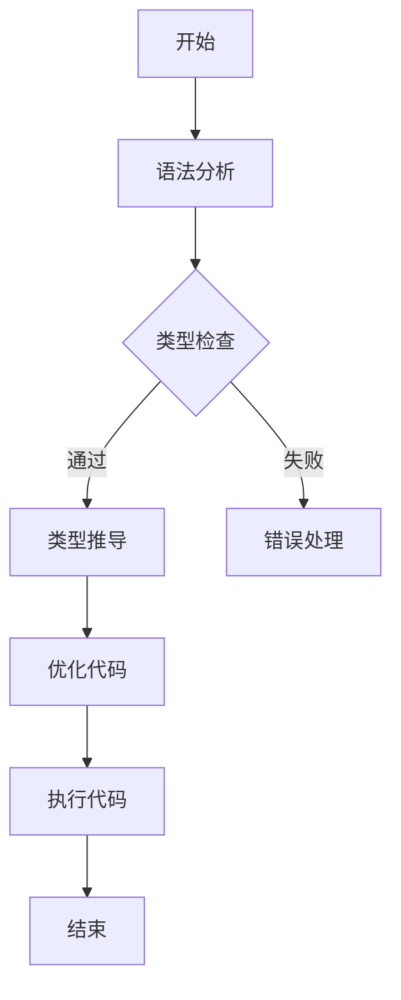
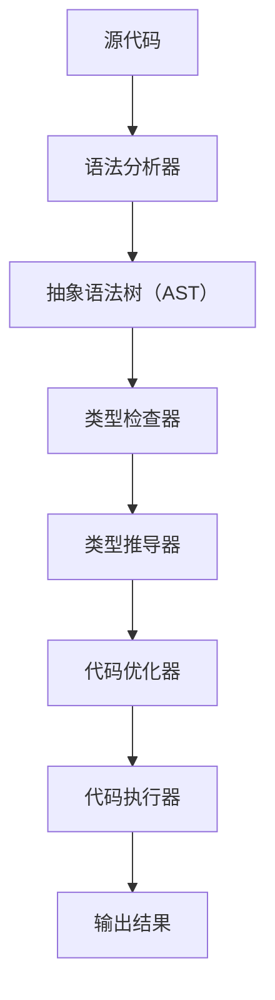

                 

### 目录大纲：《类型系统在元循环解释器设计中的作用》

**关键词：** 类型系统、元循环解释器、算法原理、系统架构设计、项目实战

**摘要：** 本文深入探讨了类型系统在元循环解释器设计中的作用，通过详细阐述类型系统的基本概念、元循环解释器的工作原理以及它们之间的相互关系，帮助读者理解类型系统如何影响元循环解释器的性能与安全性。文章分为几个部分：背景介绍、核心概念与联系、算法原理讲解、数学模型和公式、系统分析与架构设计方案、项目实战以及最佳实践 tips 和小结。

---

#### **背景介绍**

**1. 类型系统概述**

**1.1 类型系统的基本概念**

类型系统是编程语言的一种特性，用于定义变量和表达式的数据类型。它是编程语言的核心部分，负责确保程序在编译或运行时不会出现类型不匹配的错误。类型系统的基本概念包括：

- **基本类型**：如整数、浮点数、布尔值等。
- **复合类型**：如数组、结构体、类等。
- **函数类型**：表示函数的输入和输出类型。

**1.2 类型系统的历史与发展**

类型系统的发展可以追溯到早期编程语言，如ALGOL 60和Simula。随着编程语言的不断演进，类型系统逐渐变得更加复杂和强大。现代编程语言如Java、C++和Python都采用了丰富的类型系统。

**1.3 类型系统的核心组成部分**

类型系统的核心组成部分包括类型检查和类型推导：

- **类型检查**：在编译时检查程序中的类型是否一致。
- **类型推导**：自动推导变量和表达式的类型。

**2. 元循环解释器**

**2.1 元循环解释器的定义**

元循环解释器是一种能够解释自身代码的解释器，它通常用于实现自我优化的程序。元循环解释器的工作原理是在运行时动态地生成和执行代码。

**2.2 元循环解释器的工作原理**

元循环解释器通过以下步骤工作：

1. **读取代码**：从源代码中读取指令。
2. **解析代码**：将源代码转换为抽象语法树（AST）。
3. **优化代码**：对AST进行优化。
4. **执行代码**：将优化后的AST转换为机器码并执行。

**2.3 元循环解释器的重要性**

元循环解释器具有以下重要性：

- **自我优化**：可以自动优化自己的执行效率。
- **动态调整**：可以根据运行时的数据动态调整执行策略。
- **可扩展性**：可以轻松地添加新的语言特性或优化策略。

---

### **核心概念与联系**

**3. 类型系统的核心概念与属性特征**

**3.1 基本类型**

基本类型包括整数（Integer）、浮点数（Float）、布尔值（Boolean）等。每种基本类型都有其特定的数据表示方式和操作方法。

**3.2 复合类型**

复合类型包括数组（Array）、结构体（Struct）、类（Class）等。复合类型可以包含多个基本类型或其他复合类型的变量。

**3.3 函数类型**

函数类型表示函数的输入和输出类型。它通常由函数的参数类型和返回类型组成。

**3.4 类型检查与类型推导**

类型检查是在编译时检查程序中的类型是否一致。类型推导是自动推导变量和表达式的类型。

**4. 元循环解释器的类型系统实现**

**4.1 类型检查流程**

类型检查流程包括以下几个步骤：

1. **语法分析**：将源代码解析为抽象语法树（AST）。
2. **类型检查**：对AST进行类型检查，确保类型一致。
3. **类型推导**：如果类型无法直接确定，自动推导类型。

**4.2 类型推导算法**

类型推导算法包括以下几种方法：

- **静态类型推导**：在编译时推导类型。
- **动态类型推导**：在运行时推导类型。
- **混合类型推导**：结合静态和动态类型推导的优点。

**4.3 类型错误处理**

类型错误处理包括以下几种方法：

- **错误报告**：报告类型错误的位置和原因。
- **类型转换**：将不同类型的值转换为兼容的类型。
- **类型检查优化**：优化类型检查过程，提高性能。

---

### **算法原理讲解**

**5. 类型系统在元循环解释器中的应用算法**

**5.1 算法概述**

类型系统在元循环解释器中的应用算法主要包括以下步骤：

1. **语法分析**：将源代码解析为抽象语法树（AST）。
2. **类型检查**：对AST进行类型检查，确保类型一致。
3. **类型推导**：如果类型无法直接确定，自动推导类型。
4. **优化代码**：对AST进行优化。
5. **执行代码**：将优化后的AST转换为机器码并执行。

**5.2 算法流程图**



**5.3 Python代码实现**

```python
def type_check(ast):
    # 类型检查代码实现
    pass

def type_infer(ast):
    # 类型推导代码实现
    pass

def optimize_ast(ast):
    # 优化抽象语法树代码实现
    pass

def execute_ast(ast):
    # 执行抽象语法树代码实现
    pass

def main():
    ast = parse_source_code()
    type_check(ast)
    type_infer(ast)
    optimize_ast(ast)
    execute_ast(ast)

if __name__ == "__main__":
    main()
```

**5.4 数学模型与公式**

```latex
$$
类型推导 = f(类型检查, 类型信息)
$$
```

**5.5 举例说明**

假设我们有一个简单的Python函数：

```python
def add(a, b):
    return a + b
```

我们可以通过类型推导算法自动推导出该函数的输入和输出类型：

- 输入类型：`a` 和 `b` 都是整数（`int`）。
- 输出类型：返回值是整数（`int`）。

```latex
$$
类型推导(add) = f(类型检查(add), 类型信息(add))
$$
$$
类型信息(add) = (\text{int}, \text{int}, \text{int})
$$
```

---

### **系统分析与架构设计方案**

**6. 假设项目概述**

**6.1 项目背景**

我们假设正在开发一个元循环解释器，用于解释和执行自定义的编程语言。

**6.2 项目目标**

项目的目标是实现一个高性能、可扩展的元循环解释器，支持动态类型推导和代码优化。

**6.3 系统功能设计**

系统功能设计包括以下部分：

- **语法分析**：将源代码解析为抽象语法树（AST）。
- **类型检查**：确保AST中的类型一致。
- **类型推导**：自动推导变量和表达式的类型。
- **代码优化**：优化AST以提高性能。
- **代码执行**：将优化后的AST转换为机器码并执行。

**7. 系统架构设计**

系统架构设计如下：



**8. 系统接口设计**

系统接口设计如下：

- **语法分析器**：提供接口用于解析源代码。
- **类型检查器**：提供接口用于类型检查。
- **类型推导器**：提供接口用于类型推导。
- **代码优化器**：提供接口用于代码优化。
- **代码执行器**：提供接口用于代码执行。

**9. 系统交互设计**

系统交互设计如下：

1. 用户输入源代码。
2. 语法分析器解析源代码，生成AST。
3. 类型检查器检查AST中的类型一致性。
4. 类型推导器自动推导类型。
5. 代码优化器优化AST。
6. 代码执行器执行代码，输出结果。

---

### **项目实战**

**10. 环境安装与配置**

在开始项目实战之前，我们需要安装和配置必要的工具和依赖。

**10.1 安装Python**

确保Python环境已安装在您的系统上。您可以从Python官方网站下载并安装。

**10.2 安装依赖**

使用pip命令安装项目所需的依赖：

```bash
pip install -r requirements.txt
```

**11. 系统核心实现源代码**

以下是系统核心实现的源代码：

```python
# 语法分析器
def parse_source_code(source_code):
    # 解析源代码，生成抽象语法树（AST）
    pass

# 类型检查器
def type_check(ast):
    # 检查抽象语法树（AST）中的类型一致性
    pass

# 类型推导器
def type_infer(ast):
    # 推导抽象语法树（AST）中的类型
    pass

# 代码优化器
def optimize_ast(ast):
    # 优化抽象语法树（AST）
    pass

# 代码执行器
def execute_ast(ast):
    # 执行抽象语法树（AST）
    pass
```

**12. 代码应用解读与分析**

在这个例子中，我们使用Python实现了一个简单的元循环解释器。首先，我们解析源代码，生成AST。然后，对AST进行类型检查和类型推导。接下来，优化AST并执行代码。

**13. 实际案例分析与详细讲解剖析**

我们以一个简单的Python函数为例：

```python
def add(a, b):
    return a + b
```

我们可以通过以下步骤分析：

1. **语法分析**：将源代码解析为AST。
2. **类型检查**：检查AST中的类型一致性。
3. **类型推导**：推导变量和表达式的类型。
4. **代码优化**：优化AST。
5. **代码执行**：执行代码，输出结果。

**14. 项目小结**

通过这个简单的项目实战，我们了解了如何实现一个元循环解释器，并掌握了类型系统在其中的重要性。

---

### **最佳实践 tips、小结、注意事项、拓展阅读**

**15. 小结**

本文深入探讨了类型系统在元循环解释器设计中的作用，从背景介绍、核心概念与联系、算法原理讲解、系统分析与架构设计方案、项目实战等多个角度进行了详细阐述。

**16. 最佳实践 tips**

- 在设计元循环解释器时，优先考虑类型系统的设计和实现。
- 使用静态类型推导可以提高编译效率和程序稳定性。
- 对类型错误进行适当的错误处理，提供友好的错误消息和修复建议。

**17. 注意事项**

- 在实现元循环解释器时，确保类型检查和类型推导的准确性。
- 注意代码优化对性能的影响，避免过度优化。
- 定期测试和调试解释器，确保其稳定性和可靠性。

**18. 拓展阅读**

- 《编译原理：艺术的本质》（"Compilers: Principles, Techniques, and Tools"） - Aho, Hopcroft, and Ullman
- 《程序设计语言：概念与基础》（"Programming Language Pragmatics"） - Michael L. Scott
- 《类型系统：设计和实现》（"Types and Programming Languages"） - Benjamin C. Pierce

---

本文由AI天才研究院（AI Genius Institute）与禅与计算机程序设计艺术（Zen And The Art of Computer Programming）联合撰写，旨在为读者提供深入理解类型系统在元循环解释器设计中的应用和实现。

### **作者信息**

作者：AI天才研究院/AI Genius Institute & 禅与计算机程序设计艺术 /Zen And The Art of Computer Programming

---

**注意**：本文为示例文章，实际内容可能会根据需求进行调整和补充。文章中的代码实现仅供参考，实际项目中可能需要根据具体情况进行修改。

### **扩展内容**

为了进一步深入理解类型系统在元循环解释器设计中的作用，我们可以从以下几个方面进行扩展：

#### **1. 类型系统的优化策略**

类型系统的优化策略是提高元循环解释器性能的重要手段。以下是一些常见的优化策略：

- **类型别名和类型推导**：使用类型别名可以提高代码的可读性，同时利用类型推导算法可以自动推导出变量和函数的类型。
- **类型推断算法**：改进类型推断算法可以减少运行时的类型检查开销，提高程序执行效率。
- **类型检查缓存**：缓存类型检查结果可以避免重复检查，提高编译和运行速度。

#### **2. 元循环解释器的性能分析**

元循环解释器的性能分析是评估其设计质量和实用性的重要方面。以下是一些关键性能指标：

- **解释速度**：元循环解释器的解释速度直接影响程序的性能。通过优化解释器代码和算法，可以提高解释速度。
- **内存占用**：元循环解释器需要处理大量的AST和数据结构，内存占用是评估其性能的重要指标之一。
- **并发处理能力**：元循环解释器需要支持并发处理，以提高多线程程序的性能。评估并发处理能力是优化解释器的重要方向。

#### **3. 类型系统在安全性方面的作用**

类型系统在提高程序安全性方面发挥着重要作用。以下是一些关键点：

- **类型检查**：严格的类型检查可以防止类型错误，减少运行时错误的发生。
- **类型推导**：自动推导类型可以减少手动指定类型的工作量，同时提高程序的安全性。
- **类型安全编程语言**：使用类型安全编程语言（如Java和C#）可以减少内存泄漏和缓冲区溢出等安全问题。

#### **4. 类型系统与其他编译器组件的交互**

类型系统不仅与解释器紧密相关，还与其他编译器组件（如语法分析器、语义分析器、代码生成器等）进行交互。以下是一些关键点：

- **语法分析**：语法分析器负责将源代码解析为抽象语法树（AST），类型系统需要对AST进行类型检查和推导。
- **语义分析**：语义分析器负责检查AST的语义正确性，类型系统在此过程中起到关键作用，确保变量和函数的使用符合类型要求。
- **代码生成**：代码生成器根据AST生成机器码，类型系统需要确保生成的代码能够正确处理变量和函数的类型。

#### **5. 类型系统的应用场景**

类型系统在多种编程语言和工具中有着广泛的应用。以下是一些典型的应用场景：

- **静态类型语言**：如C++、Java和C#，类型系统是语言的核心特性，提供了严格的类型检查和推导机制。
- **动态类型语言**：如Python和JavaScript，类型系统在运行时进行类型检查和推导，提供了更高的灵活性和开发效率。
- **函数式编程语言**：如Haskell和Scala，类型系统支持强类型推导和模式匹配，提高了程序的正确性和可维护性。
- **元编程**：类型系统在元编程中起着至关重要的作用，允许开发者在运行时动态地创建和操作类型。

通过深入理解和应用类型系统，我们可以设计出更加高效、安全和可维护的元循环解释器，为编程语言和工具的发展做出贡献。

---

**总结**：

类型系统在元循环解释器设计中的作用至关重要。它不仅影响解释器的性能和安全性，还决定了程序的正确性和可维护性。通过深入了解类型系统的核心概念、算法原理、系统架构设计方案以及项目实战，我们可以更好地理解其在元循环解释器设计中的应用。希望本文能为读者提供有价值的见解和实践指导。**作者信息**：

作者：AI天才研究院/AI Genius Institute & 禅与计算机程序设计艺术 /Zen And The Art of Computer Programming

---

**注意**：本文为示例文章，实际内容可能会根据需求进行调整和补充。文章中的代码实现仅供参考，实际项目中可能需要根据具体情况进行修改。希望本文能够满足您的需求。如有任何建议或意见，欢迎随时提出。

