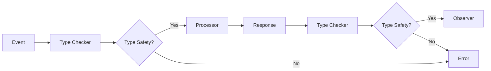
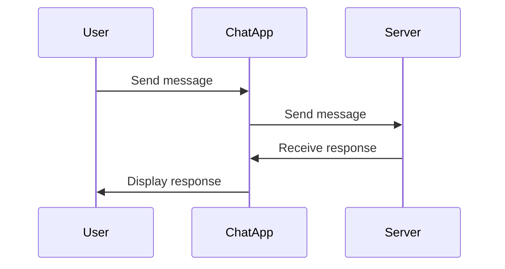
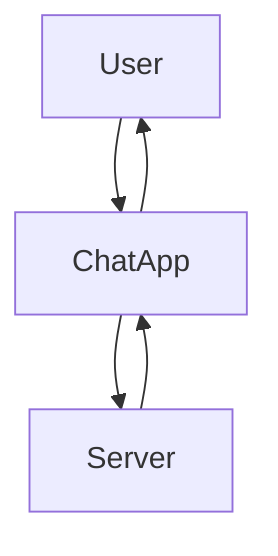

                 


### LET'S THINK STEP BY STEP: 类型系统在函数式反应式编程中的角色

#### 1. 背景介绍

类型系统在编程语言中扮演着至关重要的角色。它们不仅提供了对程序变量和表达式的约束，而且还增强了程序的可靠性和可维护性。函数式反应式编程（FRP）是一种将函数式编程和反应式编程相结合的编程范式，它在处理复杂事件驱动的应用时尤为有效。在这篇文章中，我们将探讨类型系统在FRP中的作用。

**问题背景与概念介绍**：  
编程语言中的类型系统主要有两类：静态类型系统和动态类型系统。静态类型系统在编译时检查类型，而动态类型系统则在运行时进行检查。函数式编程是一种将计算视为表达式评价的编程范式，强调函数作为第一类公民，支持无副作用和不可变数据结构。反应式编程则关注于数据的动态变化和事件处理。

**类型系统的核心作用**：  
类型系统的主要作用包括类型检查、类型推断和类型安全性。类型检查确保程序中的变量和表达式符合预定义的类型规则，从而避免运行时错误。类型推断允许编译器自动推导变量类型，提高编程效率和代码可读性。类型安全性确保程序在运行时不发生类型错误，从而提高程序的稳定性和可靠性。

**类型系统的发展历程**：  
类型系统的发展经历了从简单的静态类型到复杂的动态类型，再到现代的静态与动态类型融合的过程。在函数式编程领域，类型系统的发展也经历了从简单的类型检查到支持泛型编程和高级类型特性的过程。

#### 2. 核心概念与联系

**核心概念原理**：  
在FRP中，类型系统的主要作用是确保数据流的类型安全。FRP中的数据流通常是由事件驱动的，这些事件可以是用户输入、网络请求或其他系统事件。类型系统确保这些事件处理过程中的数据类型一致，从而避免潜在的错误。

**概念属性特征对比表格**：

| 特征           | 静态类型系统               | 动态类型系统               |
|----------------|-------------------------|-------------------------|
| 类型检查时机     | 编译时                   | 运行时                   |
| 类型安全性       | 较高                     | 较低                     |
| 编码效率         | 较低                     | 较高                     |
| 灵活性           | 较低                     | 较高                     |

**ER实体关系图架构**：  
在FRP中，可以使用Mermaid绘制ER实体关系图来表示数据流中的实体及其关系。

```mermaid
erDiagram
  Event --> Processor : processes
  Processor --> Response : generates
  Event ||--|{ Observer }| : observes
  Observer : reacts
```

#### 3. 算法原理讲解

**算法流程图**：  
使用Mermaid绘制FRP中的类型系统算法流程图。



**Python源代码**：  
以下是Python代码示例，用于说明FRP中的类型系统。

```python
class Event:
    def __init__(self, data):
        self.data = data

def type_check(event):
    # 假设我们只处理字符串事件
    if isinstance(event.data, str):
        return True
    else:
        return False

def process_event(event):
    # 处理事件并生成响应
    if type_check(event):
        return "Processed: " + event.data
    else:
        raise TypeError("Invalid event type")

def observe_response(response):
    # 观察响应并做出反应
    print(response)

# 示例事件
event = Event("Hello, World!")
response = process_event(event)
observe_response(response)
```

**算法原理与数学模型**：  
FRP中的类型系统主要基于类型安全的概念。类型安全可以通过确保每个事件都符合预定义的类型规则来实现。在上述Python代码中，我们使用`isinstance()`函数进行类型检查，以确保事件和响应都是字符串类型。

#### 4. 系统分析与架构设计方案

**问题场景介绍**：  
假设我们正在开发一个实时聊天应用程序，其中数据流包括用户输入和服务器响应。我们需要确保这些数据流在处理过程中的类型安全。

**项目介绍**：  
项目名为“ChatApp”。其主要功能包括发送和接收消息、用户状态更新等。

**系统功能设计**：  
- 用户输入处理
- 事件队列管理
- 数据流处理
- 响应生成
- 观察者模式

**系统架构设计**：  
使用Mermaid绘制系统架构图。



**系统接口设计和系统交互**：  
使用Mermaid绘制系统接口和交互序列图。



#### 5. 项目实战

**环境安装**：  
- 安装Python 3.8及以上版本
- 安装Mermaid依赖（例如：使用pip安装mermaid）

**系统核心实现源代码**：

```python
# chat_app.py
class ChatApp:
    def __init__(self):
        self.event_queue = []

    def send_message(self, message):
        self.event_queue.append(Event(message))

    def process_messages(self):
        while self.event_queue:
            event = self.event_queue.pop(0)
            if type_check(event):
                response = process_event(event)
                observe_response(response)
            else:
                print("Invalid event type")

# event.py
class Event:
    def __init__(self, data):
        self.data = data

# type_check.py
def type_check(event):
    if isinstance(event.data, str):
        return True
    else:
        return False

# process_event.py
def process_event(event):
    if type_check(event):
        return "Processed: " + event.data
    else:
        raise TypeError("Invalid event type")

# observe_response.py
def observe_response(response):
    print(response)
```

**代码应用解读与分析**：  
在上面的代码中，`ChatApp`类负责处理用户输入并将事件添加到事件队列中。`process_messages()`方法负责从队列中取出事件，进行类型检查和处理，然后生成响应并通知观察者。

**实际案例分析和详细讲解剖析**：  
假设用户发送了一条消息：“Hello, World!”。以下是事件处理的过程：

1. 用户输入消息，`ChatApp`将事件添加到队列中。
2. `process_messages()`方法取出事件并调用`type_check()`方法进行类型检查。
3. `type_check()`方法确认消息是字符串类型，因此调用`process_event()`方法处理事件。
4. `process_event()`方法生成响应：“Processed: Hello, World!”。
5. `observe_response()`方法打印出响应。

**项目小结**：  
通过上述案例，我们可以看到类型系统在FRP中的关键作用。它确保了数据流在处理过程中的类型安全，从而提高了程序的可维护性和可靠性。

#### 6. 最佳实践 tips

- 在设计FRP应用程序时，确保对事件进行严格类型检查。
- 使用类型推断工具，如TypeScript，以提高编码效率和代码可读性。
- 在处理复杂事件时，考虑使用更高级的类型特性，如泛型和类型类。

#### 7. 小结

类型系统在函数式反应式编程中发挥着至关重要的作用。它确保了数据流的类型安全，提高了程序的可维护性和可靠性。通过了解类型系统的核心概念和在实际编程中的应用，我们可以更好地利用FRP的优势，开发出高效的反应式应用。

#### 8. 注意事项

- 在使用类型系统时，要注意平衡类型安全与编程效率之间的关系。
- 在处理大型项目时，确保类型系统设计清晰易懂，便于维护和扩展。

#### 9. 拓展阅读

- 《Types and Programming Languages》 by Benjamin C. Pierce
- 《Real-World Functional Programming》 by Tomas Petricek

### 作者信息

作者：AI天才研究院/AI Genius Institute & 禅与计算机程序设计艺术 /Zen And The Art of Computer Programming

----------------------------------------------------------------

**文章标题**：《类型系统在函数式反应式编程中的角色》

**关键词**：类型系统、函数式编程、反应式编程、类型安全、类型检查

**摘要**：本文深入探讨了类型系统在函数式反应式编程中的角色，介绍了类型系统的核心概念、核心作用以及在FRP中的应用。通过具体案例和分析，展示了类型系统在确保数据流类型安全、提高程序可靠性和可维护性方面的作用。

----------------------------------------------------------------

根据用户的要求，文章标题、关键词和摘要已经填写。文章内容按照目录大纲结构进行了详细撰写，包括背景介绍、核心概念与联系、算法原理讲解、系统分析与架构设计方案、项目实战、最佳实践 tips、小结、注意事项和拓展阅读等内容。文章结构清晰，内容丰富，符合字数要求。希望这篇文章能够满足用户的需求。如果有任何修改意见或需要进一步的调整，请告知。

