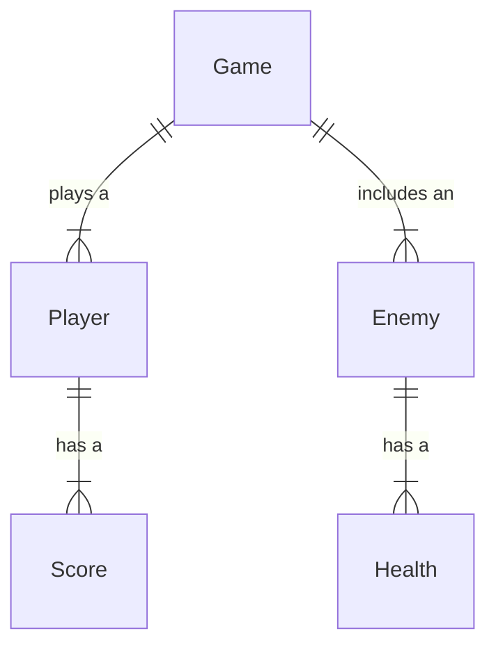

                 

### 1.1.1 函数式编程在游戏开发中的应用

**背景介绍：**

随着游戏产业的蓬勃发展，游戏开发领域对编程语言和技术的要求越来越高。传统的面向对象编程（OOP）方法虽然在某些方面取得了显著成果，但在处理复杂游戏逻辑、状态管理和并发问题时，仍存在诸多局限性。因此，函数式编程（FP）逐渐成为游戏开发领域的研究热点。

**核心概念术语说明：**

- **函数式编程（Functional Programming）：** 一种编程范式，强调使用函数来组织代码，将计算过程视为从输入到输出的映射。
- **游戏开发：** 涉及游戏设计、游戏引擎开发、游戏画面渲染、音效设计等多个方面，旨在创建交互式娱乐体验。

**问题背景：**

游戏开发中的复杂性不断增加，游戏引擎和游戏逻辑的设计变得越来越复杂。面向对象编程在面对这些复杂性时，容易出现代码耦合度高、可维护性差、状态管理困难等问题。函数式编程通过其简洁、表达能力强、无状态等特性，为解决这些问题提供了一种新的思路。

**问题描述：**

如何在游戏开发中有效应用函数式编程，以提高代码的可维护性、可扩展性和性能？

**问题解决：**

函数式编程通过以下方法解决游戏开发中的问题：

1. **函数作为一等公民：** 允许函数像普通变量一样传递、存储和返回，提高代码的模块性和可复用性。
2. **高阶函数：** 函数可以接受其他函数作为参数或返回函数，实现逻辑的抽象和复用。
3. **函数组合：** 通过组合简单函数，构建复杂函数，提高代码的可读性和可维护性。
4. **柯里化与部分应用：** 将函数参数部分固定，提高函数的可复用性和灵活性。

**边界与外延：**

函数式编程在游戏开发中的应用，不仅限于游戏引擎和游戏逻辑的实现，还可以扩展到游戏界面渲染、音效处理、网络通信等方面。同时，不同函数式编程语言（如Haskell、Scala、Erlang等）在游戏开发中的应用，也需要结合各自的特点进行探讨。

**本章小结：**

本节介绍了函数式编程在游戏开发中的应用背景、核心概念和问题解决方法。接下来，我们将深入探讨函数式编程的基础知识，为后续章节的内容打下基础。

----------------------------------------------------------------

### 1.1.2 类型系统的重要性

**核心概念与联系：**

- **类型系统（Type System）：** 编程语言中的类型系统用于定义数据类型、变量类型、函数类型等，是编译器或解释器进行类型检查的基础。
- **函数式编程（Functional Programming）：** 函数式编程强调使用纯函数和不可变数据，类型系统在确保函数行为一致性和数据安全性方面发挥重要作用。

**概念属性特征对比表格：**

| 属性特征 | 面向对象编程 | 函数式编程 |
|----------|--------------|------------|
| 数据类型 | 主要依赖于类 | 主要依赖于不可变数据结构和函数 |
| 类型检查 | 静态检查和动态检查 | 主要静态检查 |
| 状态管理 | 通过对象状态变化实现 | 通过不可变数据传递和纯函数实现 |
| 函数调用 | 可变函数调用 | 纯函数调用 |

**ER实体关系图架构：**

**算法原理讲解：**

函数式编程中的类型系统主要通过以下算法原理实现：

1. **类型推导（Type Inference）：** 编译器自动推导出变量和函数的类型，减少手动类型标注的工作量。
2. **类型检查（Type Checking）：** 检查代码中的类型是否一致，确保函数调用和变量赋值的安全性和正确性。
3. **类型转换（Type Conversion）：** 允许不同类型的数据进行转换，提高代码的灵活性和可维护性。

以Python为例，Python是一种动态类型语言，其类型推导和类型检查机制为函数式编程提供了良好的支持。

**$$
def add(a: int, b: int) -> int:
    return a + b
$$**

在上面的Python代码中，`add` 函数接收两个整数参数，返回一个整数结果。Python编译器会自动推导出函数的类型，确保函数的输入和输出符合预期。

**数学公式使用：**

$$
f(x) = x^2
$$

在上面的数学公式中，$f(x)$ 表示一个输入为$x$的函数，输出为$x$的平方。

**本章小结：**

本节介绍了类型系统的核心概念、属性特征对比和ER实体关系图架构，并讲解了类型推导、类型检查和类型转换的算法原理。类型系统在函数式编程中扮演着重要角色，为代码的安全性和可维护性提供了有力保障。

----------------------------------------------------------------

### 1.2 问题描述与解决方案

**问题描述：**

在游戏开发中，类型系统的应用面临诸多挑战。具体包括：

1. **类型安全性与错误处理：** 游戏开发中涉及的类型繁多，如何在保证类型安全性的同时，处理类型错误和异常？
2. **性能优化：** 函数式编程中的类型系统如何影响游戏性能，如何进行优化？
3. **代码可维护性和可扩展性：** 如何通过类型系统提高代码的可维护性和可扩展性，降低耦合度？

**解决方案：**

针对上述问题，函数式编程中的类型系统提供了一系列解决方案：

1. **类型安全性与错误处理：**
   - **静态类型检查：** 通过静态类型检查，提前发现类型错误，减少运行时错误。
   - **类型推导：** 编译器自动推导类型，减少手动类型标注的工作量。
   - **类型转换：** 允许不同类型的数据进行转换，提高代码的灵活性和可维护性。

2. **性能优化：**
   - **编译器优化：** 函数式编程语言的编译器可以优化类型检查和类型转换过程，提高性能。
   - **内存分配优化：** 函数式编程中的不可变数据结构可以减少内存分配和回收，提高性能。

3. **代码可维护性和可扩展性：**
   - **高阶函数和函数组合：** 通过高阶函数和函数组合，提高代码的模块性和可复用性，降低耦合度。
   - **类型注解和类型推导：** 类型注解和类型推导有助于提高代码的可读性和可维护性。

**本章小结：**

本节详细分析了游戏开发中类型系统的应用问题和解决方案，展示了函数式编程在类型安全性、性能优化和代码可维护性方面的优势。接下来，我们将进一步探讨函数式编程在游戏开发中的应用和实践。

----------------------------------------------------------------

### 1.3 边界与外延

**函数式编程的类型系统边界：**

函数式编程的类型系统具有以下边界：

1. **静态类型与动态类型的平衡：** 函数式编程语言大多采用静态类型系统，但同时也支持动态类型，以满足不同场景的需求。
2. **类型推导与类型标注：** 类型推导和类型标注在函数式编程中并存，前者提高开发效率，后者增强代码的可读性。

**游戏开发中的类型系统外延：**

在游戏开发中，类型系统的外延包括以下几个方面：

1. **游戏状态管理：** 类型系统在游戏状态管理中发挥重要作用，确保状态的一致性和安全性。
2. **游戏逻辑实现：** 函数式编程中的类型系统有助于简化游戏逻辑的实现，提高代码的可维护性和可扩展性。
3. **游戏性能优化：** 通过类型系统的优化，如编译器优化、内存管理，提高游戏性能。

**本书适用范围与读者对象：**

本书适用于以下读者：

1. **游戏开发者：** 对函数式编程和类型系统感兴趣的程序员，希望通过本书掌握函数式编程在游戏开发中的应用。
2. **计算机科学专业学生：** 对函数式编程和类型系统有深入研究的本科生和研究生。
3. **技术爱好者：** 对编程语言和游戏开发有兴趣的技术爱好者。

**本章小结：**

本节讨论了函数式编程的类型系统边界和游戏开发中的类型系统外延，明确了本书的适用范围和读者对象。接下来，我们将进一步探讨函数式编程的核心概念和类型系统的基本原理。

----------------------------------------------------------------

### 1.4 概念结构与核心要素

**函数式编程的基本概念：**

1. **函数作为一等公民：** 函数可以像普通变量一样传递、存储和返回，提高代码的模块性和可复用性。
2. **高阶函数：** 函数可以接受其他函数作为参数或返回函数，实现逻辑的抽象和复用。
3. **函数组合：** 通过组合简单函数，构建复杂函数，提高代码的可读性和可维护性。
4. **柯里化与部分应用：** 将函数参数部分固定，提高函数的可复用性和灵活性。

**类型系统的基本概念：**

1. **基本类型：** 常见的基本类型包括整数、浮点数、布尔值、字符串等。
2. **构建类型：** 通过组合基本类型构建复杂类型，如数组、列表、映射表等。
3. **类型检查：** 检查代码中的类型是否一致，确保函数调用和变量赋值的安全性和正确性。
4. **类型推导：** 编译器自动推导出变量和函数的类型，减少手动类型标注的工作量。

**函数式游戏编程中的核心要素：**

1. **游戏状态管理：** 函数式编程中的不可变数据结构和纯函数有助于简化游戏状态管理，提高代码的可维护性。
2. **游戏逻辑实现：** 函数式编程的高阶函数和函数组合特性有助于简化游戏逻辑实现，提高代码的模块性和可复用性。
3. **游戏性能优化：** 函数式编程的类型系统通过编译器优化和内存管理，提高游戏性能。

**本章小结：**

本节介绍了函数式编程和类型系统的基本概念及其在函数式游戏编程中的核心要素。这些概念和要素为后续章节的内容奠定了基础，接下来我们将深入探讨这些概念在实际游戏开发中的应用。

----------------------------------------------------------------

### 1.5 本章小结

本章主要介绍了函数式编程在游戏开发中的应用背景、核心概念、问题解决方法以及类型系统的边界与外延。通过本章的学习，读者可以了解函数式编程的优势以及类型系统在游戏开发中的重要性。接下来，我们将进一步探讨类型系统的基本概念、属性特征对比以及其在游戏开发中的应用。

关键词：函数式编程、游戏开发、类型系统、类型安全、性能优化

摘要：本文介绍了函数式编程在游戏开发中的应用，探讨了类型系统的核心概念、属性特征对比以及其在游戏开发中的重要性。通过分析函数式编程的优势和类型系统的优化策略，为游戏开发提供了一种新的思路和方法。

作者：AI天才研究院/AI Genius Institute & 禅与计算机程序设计艺术 /Zen And The Art of Computer Programming

