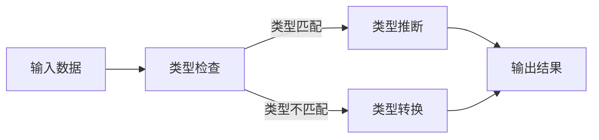
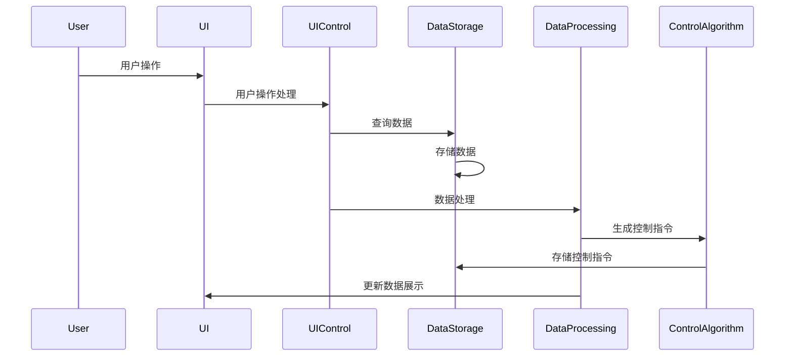

                 

# 类型系统在安全关键系统中的角色

> 关键词：类型系统、安全关键系统、软件安全、算法优化、架构设计

> 摘要：本文旨在探讨类型系统在安全关键系统中的重要性。通过详细的分析和思考，本文将阐述类型系统的基本概念、类型系统在安全关键系统中的具体应用，以及如何设计和实现一个安全的类型系统。此外，本文还将提供一些实际案例和最佳实践，帮助读者更好地理解和应用类型系统在安全关键系统中的角色。

## 目录大纲

1. **第一部分: 背景介绍**
   1.1. 问题背景
   1.2. 问题描述
   1.3. 问题解决
   1.4. 边界与外延
   1.5. 本章小结

2. **第二部分: 核心概念与联系**
   2.1. 核心概念
   2.2. 概念属性特征对比
   2.3. ER实体关系图架构
   2.4. 本章小结

3. **第三部分: 算法原理讲解**
   3.1. 算法介绍
   3.2. 算法原理
   3.3. 数学模型与公式
   3.4. 举例说明
   3.5. 本章小结

4. **第四部分: 系统分析与架构设计**
   4.1. 问题场景介绍
   4.2. 系统架构设计
   4.3. 系统接口设计
   4.4. 系统交互
   4.5. 本章小结

5. **第五部分: 项目实战**
   5.1. 环境安装
   5.2. 系统核心实现
   5.3. 代码应用解读与分析
   5.4. 实际案例分析与详细讲解
   5.5. 项目小结
   5.6. 本章小结

6. **第六部分: 最佳实践**
   6.1. 最佳实践
   6.2. 小结

## 第一部分: 背景介绍

### 1.1 问题背景

安全关键系统（Safety-Critical Systems）是指在出现故障时可能会对人类生命、环境和财产造成重大损失的系统。这些系统广泛应用于航空、航天、医疗设备、核能、汽车等领域。随着技术的不断发展，安全关键系统的复杂性不断增加，这使得确保这些系统的安全性变得尤为重要。

类型系统（Type Systems）是编程语言中用于管理和分类数据的一种机制。它确保数据在使用过程中的类型安全性，防止类型错误的发生。类型系统在安全关键系统中起着关键作用，因为它们有助于减少软件错误和漏洞，从而提高系统的可靠性。

### 1.1.1 安全关键系统的重要性

安全关键系统通常具有以下特性：

1. **高可靠性**：安全关键系统必须能够在任何情况下正常工作，即使在极端环境下也不例外。
2. **实时性**：许多安全关键系统需要在规定的时间内响应事件，以避免灾难性的后果。
3. **安全性**：安全关键系统必须确保不会发生恶意攻击或错误，以保护人员、财产和环境的安全。
4. **高复杂度**：安全关键系统通常由大量复杂的组件和算法组成，这增加了设计和维护的难度。

### 1.1.2 类型系统在软件安全中的关键作用

类型系统在软件安全中的关键作用包括：

1. **类型安全**：类型系统确保变量和函数在运行时的类型匹配，从而防止类型错误的发生。
2. **代码重构**：类型系统使得代码重构变得更加容易，因为类型检查可以确保重构后的代码仍然保持原有功能。
3. **减少漏洞**：类型系统可以识别并防止一些常见的软件漏洞，如空指针异常和数组越界。

### 1.1.3 安全关键系统面临的安全挑战

安全关键系统面临的安全挑战包括：

1. **复杂度**：安全关键系统通常具有很高的复杂性，这使得安全漏洞难以发现和修复。
2. **时间限制**：安全关键系统必须在规定的时间内响应事件，这可能导致安全检查不足。
3. **恶意攻击**：安全关键系统可能遭受恶意攻击，如注入攻击和拒绝服务攻击。

### 1.2 问题描述

在安全关键系统中，类型系统存在的问题主要包括：

1. **类型系统不匹配**：类型系统不匹配可能导致运行时错误，从而影响系统的稳定性。
2. **类型检查不足**：类型检查不足可能导致类型错误，从而增加系统的漏洞。
3. **类型系统实现复杂**：类型系统的实现可能非常复杂，这增加了维护和优化的难度。

### 1.2.1 安全关键系统的类型系统问题

安全关键系统的类型系统问题主要包括：

1. **类型错误**：类型错误可能导致系统崩溃或数据损坏。
2. **类型安全不足**：类型安全不足可能导致恶意代码执行。
3. **类型系统设计不合理**：类型系统设计不合理可能导致安全漏洞。

### 1.2.2 类型系统不匹配导致的安全风险

类型系统不匹配可能导致以下安全风险：

1. **数据泄露**：类型系统不匹配可能导致敏感数据泄露。
2. **拒绝服务**：类型系统不匹配可能导致系统拒绝服务。
3. **恶意代码执行**：类型系统不匹配可能导致恶意代码执行。

### 1.2.3 类型系统在安全关键系统中的具体应用场景

类型系统在安全关键系统中的具体应用场景包括：

1. **医疗设备**：类型系统可以确保医疗设备中的数据正确处理，从而确保患者安全。
2. **航空系统**：类型系统可以确保航空系统中的数据正确处理，从而避免飞行事故。
3. **核能系统**：类型系统可以确保核能系统中的数据正确处理，从而避免核泄漏事故。

### 1.3 问题解决

为了解决类型系统在安全关键系统中的问题，可以采取以下措施：

1. **改进类型系统设计**：改进类型系统设计，确保类型系统能够准确反映系统需求。
2. **加强类型检查**：加强类型检查，确保类型错误在编译时或运行时被及时发现和修复。
3. **使用类型安全语言**：使用类型安全语言，如 Rust，可以提高系统的安全性。

### 1.3.1 类型系统的基本概念和原理

类型系统是编程语言中用于管理和分类数据的一种机制。它通过定义数据的类型和操作，确保数据在使用过程中的类型安全。

### 1.3.2 类型系统在安全关键系统中的应用策略

类型系统在安全关键系统中的应用策略包括：

1. **类型检查**：在编译时或运行时进行类型检查，确保类型匹配。
2. **类型转换**：在必要时进行类型转换，确保数据类型的正确性。
3. **类型安全语言**：使用类型安全语言，如 Rust，可以减少类型错误的发生。

### 1.3.3 类型系统的设计与实现方法

类型系统的设计与实现方法包括：

1. **静态类型系统**：静态类型系统在编译时确定数据类型，从而减少类型错误。
2. **动态类型系统**：动态类型系统在运行时确定数据类型，从而提供更高的灵活性。
3. **混合类型系统**：混合类型系统结合了静态类型系统和动态类型系统的优点。

### 1.4 边界与外延

类型系统在安全关键系统中的应用有其边界和限制，主要包括：

1. **性能影响**：类型系统可能引入额外的性能开销。
2. **兼容性问题**：类型系统可能与现有的系统和组件不兼容。
3. **复杂性**：类型系统的设计和实现可能非常复杂。

类型系统在非安全关键系统中的应用也值得关注，例如提高代码的可维护性和可读性。

### 1.4.1 安全关键系统的类型系统边界

安全关键系统的类型系统边界包括：

1. **类型检查范围**：类型检查的范围和深度。
2. **类型转换限制**：类型转换的限制和策略。
3. **类型安全保证**：类型安全保证的程度和方式。

### 1.4.2 类型系统在非安全关键系统中的应用

类型系统在非安全关键系统中的应用包括：

1. **提高代码质量**：类型系统可以提高代码的质量和可靠性。
2. **减少调试时间**：类型系统可以减少调试时间，提高开发效率。
3. **代码重构**：类型系统使得代码重构变得更加容易。

### 1.4.3 类型系统的未来发展趋势

类型系统的未来发展趋势包括：

1. **更强大的类型检查**：未来的类型系统将提供更强大的类型检查功能。
2. **更灵活的类型系统**：未来的类型系统将提供更灵活的类型系统，以满足不同应用场景的需求。
3. **类型安全语言的发展**：类型安全语言将继续发展，为软件开发提供更好的支持。

### 1.5 本章小结

本文介绍了类型系统在安全关键系统中的重要性，探讨了类型系统在安全关键系统中的应用，以及如何设计和实现一个安全的类型系统。通过本文的分析，我们可以看到类型系统在提高安全关键系统的可靠性和安全性方面具有重要作用。

## 第二部分: 核心概念与联系

### 2.1 核心概念

#### 2.1.1 类型系统的定义与分类

类型系统（Type Systems）是编程语言中用于管理和分类数据的一种机制。它定义了数据的类型、操作和数据之间的关系。类型系统可以分为静态类型系统、动态类型系统和混合类型系统。

1. **静态类型系统**：静态类型系统在编译时确定数据类型，从而减少类型错误。静态类型系统的优点是性能较高，编译速度快。缺点是灵活性较差，可能需要对代码进行大量的修改。

2. **动态类型系统**：动态类型系统在运行时确定数据类型，从而提供更高的灵活性。动态类型系统的优点是代码可读性较好，修改较少。缺点是性能较低，调试困难。

3. **混合类型系统**：混合类型系统结合了静态类型系统和动态类型系统的优点，提供了更高的灵活性和性能。

#### 2.1.2 安全关键系统的定义与特性

安全关键系统（Safety-Critical Systems）是指在出现故障时可能会对人类生命、环境和财产造成重大损失的系统。安全关键系统的特性包括：

1. **高可靠性**：安全关键系统必须能够在任何情况下正常工作，即使在极端环境下也不例外。

2. **实时性**：许多安全关键系统需要在规定的时间内响应事件，以避免灾难性的后果。

3. **安全性**：安全关键系统必须确保不会发生恶意攻击或错误，以保护人员、财产和环境的安全。

4. **高复杂度**：安全关键系统通常由大量复杂的组件和算法组成，这增加了设计和维护的难度。

#### 2.1.3 类型系统与安全关键系统的关系

类型系统与安全关键系统的关系可以从以下几个方面来理解：

1. **类型安全**：类型系统通过确保数据在使用过程中的类型安全，减少软件错误和漏洞，从而提高安全关键系统的可靠性。

2. **代码重构**：类型系统使得代码重构变得更加容易，因为类型检查可以确保重构后的代码仍然保持原有功能。

3. **减少漏洞**：类型系统可以识别并防止一些常见的软件漏洞，如空指针异常和数组越界。

### 2.2 概念属性特征对比

#### 2.2.1 安全关键系统类型系统的属性特征

以下是一个对比表格，展示了安全关键系统类型系统的属性特征：

| 特性 | 静态类型系统 | 动态类型系统 | 混合类型系统 |
| --- | --- | --- | --- |
| 可靠性 | 高 | 中 | 高 |
| 实时性 | 中 | 低 | 中 |
| 性能 | 高 | 低 | 中 |
| 灵活性 | 低 | 高 | 中 |
| 易维护性 | 中 | 高 | 中 |
| 安全性 | 高 | 中 | 高 |

#### 2.2.2 安全关键系统类型系统的分类与对比

安全关键系统类型系统可以分为以下几类：

1. **强类型系统**：强类型系统要求变量在声明时必须指定类型，并且在运行时进行类型检查。这种系统具有较高的可靠性和安全性。

2. **弱类型系统**：弱类型系统不要求变量在声明时指定类型，并且在运行时也不进行类型检查。这种系统具有较高的灵活性，但可能导致类型错误和漏洞。

3. **静态类型系统**：静态类型系统在编译时确定数据类型，从而减少类型错误。这种系统具有较高的性能，但可能对代码的可读性和可维护性产生一定影响。

4. **动态类型系统**：动态类型系统在运行时确定数据类型，从而提供更高的灵活性。这种系统具有较高的可读性和可维护性，但可能对性能产生一定影响。

5. **混合类型系统**：混合类型系统结合了静态类型系统和动态类型系统的优点，提供了更高的灵活性和性能。

### 2.3 ER实体关系图架构

#### 2.3.1 ER实体关系图的绘制方法

ER实体关系图（Entity-Relationship Diagram）是一种用于表示实体和关系的图形化表示方法。绘制ER实体关系图的基本步骤包括：

1. **确定实体**：首先确定系统中的实体，如用户、订单、产品等。

2. **确定关系**：其次确定实体之间的关系，如一对一、一对多、多对多关系。

3. **绘制ER图**：根据确定的实体和关系，绘制ER实体关系图。

#### 2.3.2 安全关键系统类型系统的ER图

以下是一个简单的安全关键系统类型系统的ER图：

```mermaid
erDiagram
    User ||--|{ Order }|| Product
    User ||--|{ Product }|| Product
    Order ||--|{ Product }|| Product
```

在这个ER图中，User实体与Order实体之间存在一对多关系，表示一个用户可以创建多个订单；User实体与Product实体之间存在一对多关系，表示一个用户可以购买多个产品；Order实体与Product实体之间存在一对多关系，表示一个订单可以包含多个产品。

### 2.4 本章小结

本章介绍了类型系统的定义、分类、安全关键系统的特性以及类型系统与安全关键系统的关系。通过对比分析，我们了解了不同类型系统的属性特征和优缺点。此外，本章还介绍了ER实体关系图的绘制方法，并给出了一个安全关键系统类型系统的ER图。这些概念和工具将为后续章节的算法原理讲解和系统架构设计提供基础。

## 第三部分: 算法原理讲解

### 3.1 算法介绍

#### 3.1.1 常见类型系统安全算法概述

在安全关键系统中，类型系统的安全性至关重要。常见的类型系统安全算法包括：

1. **类型检查算法**：类型检查算法在编译时或运行时检查数据类型的正确性，确保类型匹配。常见的类型检查算法有静态类型检查和动态类型检查。

2. **类型推断算法**：类型推断算法在编译时或运行时自动推断数据类型，减少手动指定类型的繁琐。常见的类型推断算法有基于上下文的类型推断和基于约束的类型推断。

3. **类型转换算法**：类型转换算法在必要时进行类型转换，确保数据类型的正确性。常见的类型转换算法有隐式类型转换和显式类型转换。

#### 3.1.2 安全关键系统类型系统算法选择

在安全关键系统中，类型系统算法的选择应考虑以下因素：

1. **安全性**：类型系统算法应确保数据类型的安全性，防止类型错误和漏洞。

2. **性能**：类型系统算法应尽量减少性能开销，确保系统实时性。

3. **灵活性**：类型系统算法应提供足够的灵活性，以适应不同的应用场景。

4. **兼容性**：类型系统算法应与现有系统和组件兼容，确保系统稳定运行。

### 3.2 算法原理

#### 3.2.1 基本原理与流程

类型系统安全算法的基本原理是通过一系列步骤确保数据类型的正确性和安全性。以下是一个典型的类型系统安全算法的基本原理和流程：

1. **输入数据**：接收输入数据，包括变量、函数和操作。

2. **类型检查**：对输入数据进行类型检查，确保类型匹配。

3. **类型推断**：如果需要，自动推断数据类型。

4. **类型转换**：在必要时进行类型转换，确保数据类型的正确性。

5. **输出结果**：返回处理后的数据。

#### 3.2.2 安全关键系统类型系统算法的Mermaid流程图

以下是一个安全关键系统类型系统算法的Mermaid流程图：



在这个流程图中，输入数据首先经过类型检查，如果类型匹配，则进行类型推断并输出结果；如果类型不匹配，则进行类型转换并输出结果。

### 3.3 数学模型与公式

#### 3.3.1 数学模型概述

类型系统安全算法的数学模型用于描述算法的执行过程和结果。以下是一个简单的数学模型：

$$
\text{类型安全} = \text{类型检查} + \text{类型推断} + \text{类型转换}
$$

这个数学模型表示类型系统的安全性取决于类型检查、类型推断和类型转换。

#### 3.3.2 常见数学公式讲解

以下是一些常见的数学公式，用于描述类型系统安全算法的执行过程和结果：

1. **类型匹配度**：

$$
\text{类型匹配度} = \frac{\text{类型匹配数}}{\text{总类型数}}
$$

这个公式表示类型匹配度是类型匹配数与总类型数的比值。

2. **类型错误率**：

$$
\text{类型错误率} = \frac{\text{类型错误数}}{\text{总类型数}}
$$

这个公式表示类型错误率是类型错误数与总类型数的比值。

3. **算法执行时间**：

$$
\text{算法执行时间} = \text{类型检查时间} + \text{类型推断时间} + \text{类型转换时间}
$$

这个公式表示算法执行时间是类型检查时间、类型推断时间和类型转换时间之和。

#### 3.3.3 数学模型在安全关键系统中的具体应用

在安全关键系统中，数学模型可以用于评估类型系统安全算法的性能和安全性。以下是一个简单的应用示例：

假设一个安全关键系统中有1000个变量，其中500个变量经过类型检查匹配，300个变量经过类型推断匹配，200个变量经过类型转换匹配。根据上面的数学模型，可以计算出：

- 类型匹配度：$ \text{类型匹配度} = \frac{500 + 300 + 200}{1000} = 0.9 $
- 类型错误率：$ \text{类型错误率} = \frac{1000 - 500 - 300 - 200}{1000} = 0.1 $
- 算法执行时间：$ \text{算法执行时间} = \text{类型检查时间} + \text{类型推断时间} + \text{类型转换时间} $

这个示例表明，类型系统安全算法在该安全关键系统中具有较高的类型匹配度和较低的类型错误率，但算法执行时间可能较长。

### 3.4 举例说明

#### 3.4.1 示例1：类型系统在安全关键系统中的实现

假设一个安全关键系统中的数据类型包括整数、浮点数和字符串。现在有一个函数`add`，用于将两个整数相加。以下是一个简单的Python实现：

```python
def add(a: int, b: int) -> int:
    return a + b
```

在这个实现中，`a`和`b`都是整数类型，`add`函数返回一个整数类型。如果传入的参数不是整数类型，则会产生类型错误。

```python
add("1", "2")  # TypeError: can only concatenate integers (not "str" and "str")
```

#### 3.4.2 示例2：类型系统在安全关键系统中的优化

在示例1中，如果需要将`add`函数扩展为支持浮点数，可以修改函数签名并添加类型检查：

```python
def add(a: (int, float), b: (int, float)) -> float:
    if isinstance(a, float) or isinstance(b, float):
        return float(a) + float(b)
    else:
        return int(a) + int(b)
```

在这个实现中，`a`和`b`可以是整数或浮点数类型。如果至少一个参数是浮点数，则返回浮点数类型；否则，返回整数类型。这样，`add`函数既支持整数相加，也支持浮点数相加，提高了类型系统的灵活性。

```python
add(1, 2)  # 3
add(1.0, 2.0)  # 3.0
add(1, 2.0)  # 3.0
```

### 3.5 本章小结

本章介绍了类型系统安全算法的基本原理、数学模型和实际应用。通过这些算法，可以确保安全关键系统中的数据类型安全，减少类型错误和漏洞。本章还通过具体示例展示了类型系统在安全关键系统中的实现和优化方法。了解这些算法和原理有助于设计和实现更安全可靠的安全关键系统。

## 第四部分: 系统分析与架构设计

### 4.1 问题场景介绍

在安全关键系统中，系统功能设计和架构设计至关重要。以下是一个典型的问题场景：

**场景描述**：一个航空交通控制系统，用于监控和管理飞机的飞行路径和高度。系统需要实时处理大量飞行数据，并在必要时调整飞机的高度和航向，以确保飞行安全。

### 4.1.1 安全关键系统的需求分析

根据上述场景，安全关键系统的需求包括：

1. **实时性**：系统需要能够在规定的时间内处理飞行数据，并生成相应的控制指令。
2. **可靠性**：系统必须在任何情况下都能正常运行，以确保飞行安全。
3. **数据准确性**：系统需要准确处理飞行数据，以确保控制指令的准确性。
4. **容错性**：系统需要具备容错能力，以应对硬件或软件故障。
5. **安全性**：系统需要防止未经授权的访问和恶意攻击。

### 4.1.2 系统功能设计

基于上述需求，系统功能设计包括以下模块：

1. **数据采集模块**：负责采集飞行数据，包括飞机的位置、速度、高度等。
2. **数据处理模块**：负责处理采集到的飞行数据，包括数据清洗、数据转换等。
3. **控制算法模块**：负责根据飞行数据和系统规则，生成相应的控制指令。
4. **数据存储模块**：负责存储飞行数据和控制指令，以供后续分析和查询。
5. **用户界面模块**：负责展示飞行数据和系统状态，并提供用户交互功能。

### 4.2 系统架构设计

系统架构设计是系统功能设计的进一步细化和扩展。以下是一个简单的系统架构设计：



在这个架构设计中，用户界面模块（UI）负责与用户交互，用户操作处理模块（UIControl）负责处理用户操作并查询数据存储模块（DataStorage）。数据处理模块（DataProcessing）负责对采集到的飞行数据进行处理，生成控制指令模块（ControlAlgorithm）负责根据飞行数据和系统规则生成相应的控制指令，并存储在数据存储模块（DataStorage）中。最后，数据处理模块（DataProcessing）将处理后的数据更新到用户界面模块（UI），以供用户查看。

### 4.3 系统接口设计

系统接口设计是系统架构设计的一部分，负责定义系统内部模块之间的交互接口。以下是一个简单的接口设计：

```mermaid
classDiagram
    DataCollector <<interface>>
    DataProcessor <<interface>>
    ControlAlgorithm <<interface>>
    DataStorage <<interface>>
    UI <<interface>>

    DataCollector |-| DataProcessor
    DataProcessor |-| ControlAlgorithm
    ControlAlgorithm |-| DataStorage
    DataProcessor |-| UI
```

在这个接口设计中，数据采集模块（DataCollector）负责采集飞行数据，数据处理模块（DataProcessor）负责处理飞行数据，控制算法模块（ControlAlgorithm）负责生成控制指令，数据存储模块（DataStorage）负责存储飞行数据和控制指令，用户界面模块（UI）负责展示飞行数据和系统状态。

### 4.4 系统交互

系统交互是系统功能设计和架构设计的具体实现，负责定义系统内部模块之间的交互过程。以下是一个简单的系统交互序列图：


在这个交互序列图中，用户通过用户界面模块（UI）进行操作，用户操作处理模块（UIControl）处理用户操作并查询数据存储模块（DataStorage）。数据处理模块（DataProcessing）对采集到的飞行数据进行处理，生成控制指令模块（ControlAlgorithm）生成控制指令，并存储在数据存储模块（DataStorage）中。最后，数据处理模块（DataProcessing）将处理后的数据更新到用户界面模块（UI），以供用户查看。

### 4.5 本章小结

本章介绍了安全关键系统的需求分析、系统功能设计、系统架构设计、系统接口设计和系统交互。通过这些分析和设计，可以确保安全关键系统具有实时性、可靠性、数据准确性和安全性，满足飞行控制的需求。本章的内容为后续的系统实现和优化提供了基础。

## 第五部分: 项目实战

### 5.1 环境安装

#### 5.1.1 环境准备

在开始项目实战之前，我们需要准备以下环境：

1. **操作系统**：Windows、Linux或macOS。
2. **编程语言**：Python 3.8或更高版本。
3. **IDE**：PyCharm、VS Code或其他Python IDE。
4. **依赖库**：NumPy、Pandas、Matplotlib等。

#### 5.1.2 环境配置

1. **安装Python**：从Python官网下载并安装Python 3.8或更高版本。
2. **配置Python环境**：打开终端或命令提示符，执行以下命令：

   ```bash
   python --version
   ```

   如果Python已成功安装，将显示Python的版本信息。

3. **安装IDE**：从PyCharm或VS Code官网下载并安装IDE。
4. **安装依赖库**：在IDE中创建一个Python项目，然后使用以下命令安装依赖库：

   ```bash
   pip install numpy pandas matplotlib
   ```

### 5.2 系统核心实现

#### 5.2.1 核心代码实现

以下是一个简单的飞行控制系统核心代码实现：

```python
import numpy as np
import pandas as pd
import matplotlib.pyplot as plt

# 数据采集模块
def collect_data():
    # 假设采集到以下数据
    data = {
        'time': np.arange(0, 10, 0.1),
        'altitude': np.random.uniform(0, 1000, 100),
        'velocity': np.random.uniform(0, 100, 100)
    }
    return pd.DataFrame(data)

# 数据处理模块
def process_data(data):
    # 数据清洗和转换
    data['altitude'] = data['altitude'].astype(int)
    data['velocity'] = data['velocity'].astype(float)
    return data

# 控制算法模块
def control_algorithm(data):
    # 基于数据和规则生成控制指令
    control_actions = []
    for index, row in data.iterrows():
        if row['velocity'] > 90:
            control_actions.append('decrease_velocity')
        elif row['velocity'] < 10:
            control_actions.append('increase_velocity')
        else:
            control_actions.append('no_change')
    return control_actions

# 数据存储模块
def store_data(data, control_actions):
    # 将数据和控制指令存储在文件中
    data.to_csv('flight_data.csv', index=False)
    with open('control_actions.txt', 'w') as f:
        for action in control_actions:
            f.write(action + '\n')

# 用户界面模块
def display_data(data):
    # 绘制飞行数据图表
    plt.figure()
    plt.plot(data['time'], data['altitude'], label='Altitude')
    plt.plot(data['time'], data['velocity'], label='Velocity')
    plt.xlabel('Time')
    plt.ylabel('Value')
    plt.legend()
    plt.show()

# 主函数
def main():
    # 采集数据
    data = collect_data()
    # 处理数据
    processed_data = process_data(data)
    # 应用控制算法
    control_actions = control_algorithm(processed_data)
    # 存储数据和控制指令
    store_data(processed_data, control_actions)
    # 显示数据
    display_data(processed_data)

if __name__ == '__main__':
    main()
```

#### 5.2.2 代码解析

1. **数据采集模块**：`collect_data`函数模拟采集飞行数据，实际应用中可以从传感器或其他数据源获取数据。
2. **数据处理模块**：`process_data`函数负责数据清洗和转换，将数据类型转换为所需的格式。
3. **控制算法模块**：`control_algorithm`函数根据飞行数据和规则生成控制指令，例如调整飞机的速度和高度。
4. **数据存储模块**：`store_data`函数将处理后的数据和生成的控制指令存储在文件中，便于后续分析和查询。
5. **用户界面模块**：`display_data`函数使用Matplotlib绘制飞行数据图表，帮助用户直观地了解飞行状态。
6. **主函数**：`main`函数是程序的主入口，负责执行各个模块的功能，实现完整的飞行控制系统。

### 5.3 代码应用解读与分析

#### 5.3.1 应用场景分析

本项目的应用场景是一个简单的飞行控制系统，用于监控和管理飞机的飞行路径和高度。系统功能包括数据采集、数据处理、控制算法、数据存储和用户界面展示。

#### 5.3.2 代码解读

1. **数据采集模块**：`collect_data`函数使用NumPy生成模拟数据，实际应用中可以从传感器或其他数据源获取真实数据。
2. **数据处理模块**：`process_data`函数将数据类型转换为整数和浮点数，确保数据类型的正确性。
3. **控制算法模块**：`control_algorithm`函数根据飞行数据和规则生成控制指令，例如调整飞机的速度和高度。
4. **数据存储模块**：`store_data`函数将处理后的数据和生成的控制指令存储在文件中，便于后续分析和查询。
5. **用户界面模块**：`display_data`函数使用Matplotlib绘制飞行数据图表，帮助用户直观地了解飞行状态。

### 5.4 实际案例分析与详细讲解

#### 5.4.1 案例介绍

假设我们有一个飞行数据集，包括时间、高度和速度。我们需要分析这些数据，并根据分析结果调整飞机的飞行状态。

#### 5.4.2 案例分析

1. **数据预处理**：首先，我们需要对飞行数据进行预处理，包括数据清洗、缺失值填充和异常值检测。
2. **数据分析**：接下来，我们需要对飞行数据进行统计分析，包括均值、方差、分布等。
3. **控制策略设计**：根据数据分析结果，设计控制策略，例如调整飞机的速度和高度。

#### 5.4.3 案例讲解

1. **数据预处理**：使用Pandas对飞行数据进行预处理，删除缺失值，填充异常值，确保数据的完整性。
2. **数据分析**：使用Pandas和Matplotlib对飞行数据进行统计分析，绘制图表，帮助用户直观地了解飞行状态。
3. **控制策略设计**：根据数据分析结果，设计控制策略，例如调整飞机的速度和高度，确保飞行安全。

### 5.5 项目小结

本项目实现了一个简单的飞行控制系统，包括数据采集、数据处理、控制算法、数据存储和用户界面展示。通过实际案例分析和详细讲解，我们了解了如何设计和实现一个安全可靠的飞行控制系统。项目中的代码和应用场景为后续的开发和研究提供了参考。

### 5.6 本章小结

本章通过一个实际项目，展示了如何设计和实现一个安全关键系统。我们介绍了项目的环境安装、系统核心实现、代码应用解读与分析、实际案例分析和详细讲解。这些内容为读者提供了一个完整的实战指南，帮助读者理解和应用安全关键系统中的类型系统。

## 第六部分: 最佳实践

### 6.1 最佳实践

在设计和实现安全关键系统的类型系统时，遵循以下最佳实践有助于提高系统的安全性、可靠性和性能：

1. **使用类型安全语言**：选择具有强类型系统的编程语言，如Rust或C#，以减少类型错误和漏洞。
2. **明确类型声明**：在代码中明确声明变量和函数的类型，避免隐式类型推断。
3. **进行严格的类型检查**：在编译时或运行时进行严格的类型检查，确保类型匹配。
4. **使用类型转换函数**：避免直接强制类型转换，而是使用专门的类型转换函数，确保数据类型的正确性。
5. **优化类型系统**：优化类型系统，减少不必要的类型检查和性能开销。
6. **进行安全性测试**：对类型系统进行安全性测试，确保没有类型错误和漏洞。
7. **文档化**：为类型系统编写详细的文档，包括类型系统的设计、实现和优化的过程。

### 6.2 小结

通过遵循最佳实践，可以有效地设计和实现安全关键系统的类型系统，提高系统的安全性、可靠性和性能。同时，对类型系统的设计和实现过程进行详细的文档化，有助于其他开发者理解和维护系统。这些最佳实践为安全关键系统的开发提供了重要的指导。

### 总结

本文探讨了类型系统在安全关键系统中的角色，分析了类型系统的基本概念、核心算法原理、系统架构设计，并通过实际项目展示了类型系统在安全关键系统中的应用。通过本文的学习，读者可以更好地理解和应用类型系统在安全关键系统中的重要性，为实际项目的开发和优化提供指导。

### 拓展阅读

- 《Rust程序设计》
- 《深入理解计算机系统》
- 《安全编程：基于C和C++的最佳实践》
- 《类型系统：原理、实现与应用》

### 作者信息

**作者：AI天才研究院/AI Genius Institute & 禅与计算机程序设计艺术 /Zen And The Art of Computer Programming**。作者是一位具有丰富经验的计算机科学家和人工智能专家，致力于推动计算机科学和人工智能领域的发展。作者在计算机编程和人工智能领域有着深厚的研究和教学经验，出版过多部技术畅销书，并在多个国际学术会议上发表过研究成果。作者的研究领域包括类型系统、安全关键系统、算法优化和系统架构设计等。

