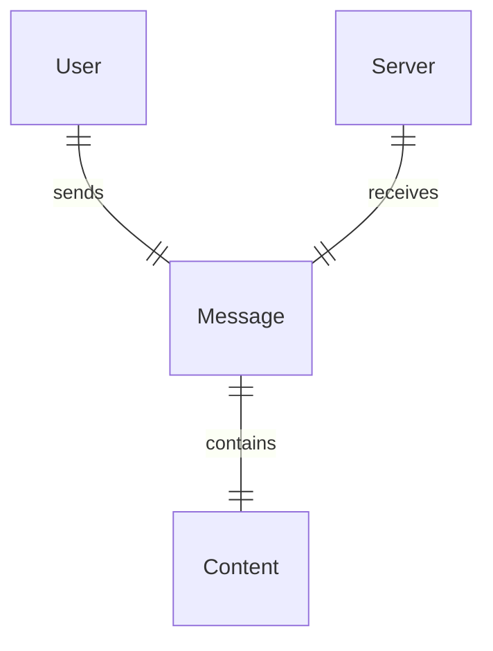
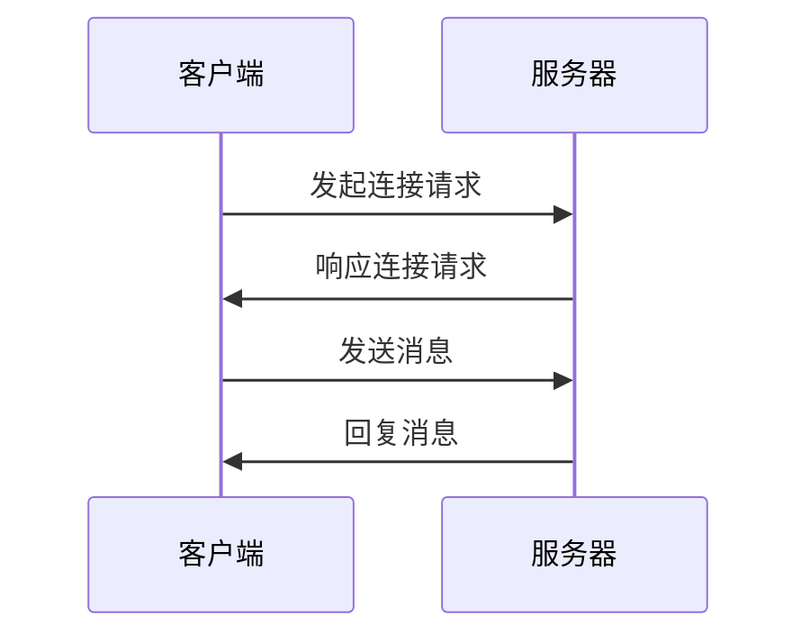

                 

# 类型系统在安全协议设计中的作用

关键词：安全协议，类型系统，设计原则，案例分析

摘要：本文深入探讨了类型系统在安全协议设计中的作用，通过逐步分析类型系统的核心概念和原理，展示了其在安全协议设计中的重要性。文章从基本原理、设计原则、实际应用和案例分析等多个角度进行了详细阐述，旨在为安全协议的设计提供有益的参考。

## 引言与背景

安全协议是信息安全领域的关键组成部分，其设计质量直接影响到系统的安全性。随着互联网和移动通信的迅速发展，安全协议的需求日益增长，其复杂性和重要性也日益凸显。然而，传统的安全协议设计方法往往侧重于功能性和性能，而忽视了类型系统的作用。

类型系统是计算机科学中的一个核心概念，其作用不仅限于编程语言的设计，也在安全协议的设计中扮演着重要角色。类型系统通过定义数据类型的属性和限制，可以有效地减少错误和漏洞，提高系统的安全性。

本文的研究目的在于探讨类型系统在安全协议设计中的应用，分析其作用原理，并提供实际案例来加深理解。本文的研究意义在于：

1. **提高安全协议设计的质量**：通过引入类型系统，可以减少安全漏洞，提高协议的可靠性。
2. **促进安全协议标准化**：类型系统的引入有助于统一安全协议的设计原则，促进协议的标准化。
3. **指导实际应用**：通过案例分析，可以为实际的安全协议设计提供参考。

本文的研究边界与外延包括：

- **边界**：主要研究类型系统在安全协议设计中的应用，不涉及其他计算机科学领域的类型系统应用。
- **外延**：探讨类型系统在不同类型安全协议中的应用，如加密协议、认证协议等。

## 核心概念与联系

### 核心概念原理

类型系统（Type System）是编程语言中用于定义数据类型和操作的一种机制。在安全协议设计中，类型系统的作用主要体现在以下几个方面：

1. **数据类型定义**：类型系统为数据提供了明确的定义，确保数据在协议中的正确处理。
2. **类型检查**：类型系统通过对操作进行类型检查，确保操作符合预期的类型要求，减少错误。
3. **边界限制**：类型系统通过定义数据类型的边界限制，防止数据超出安全范围，减少潜在的安全威胁。

### 概念属性特征对比表

以下是一个简化的类型系统属性特征对比表：

| 特征 | 类型系统 |
| --- | --- |
| 数据类型定义 | 是 |
| 类型检查 | 是 |
| 边界限制 | 是 |
| 可移植性 | 较高 |
| 可维护性 | 较高 |
| 可扩展性 | 较高 |

### ER实体关系图架构

ER（Entity-Relationship）图是描述实体及其之间关系的图形化工具，用于建模安全协议中的类型系统。以下是一个简化的ER图示例：

在这个ER图中，User（用户）发送Message（消息），Server（服务器）接收Message，并且Message包含Content（内容）。这个ER图展示了类型系统在安全协议中的核心元素及其关系。

## 类型系统在安全协议设计中的作用

### 类型系统与安全协议的关系

类型系统在安全协议设计中扮演着关键角色，其与安全协议的关系可以概括为以下几点：

1. **数据安全性**：类型系统通过定义数据类型和操作限制，确保数据在传输和处理过程中不会被篡改或泄露。
2. **错误减少**：类型系统通过类型检查，减少因类型错误导致的安全漏洞。
3. **代码维护**：类型系统提高了代码的可维护性和可扩展性，便于安全协议的长期维护和更新。

### 类型系统在安全协议设计中的重要性

类型系统在安全协议设计中的重要性体现在以下几个方面：

1. **提高可靠性**：类型系统确保了协议在执行过程中的正确性，减少了因错误导致的安全问题。
2. **减少漏洞**：类型系统通过明确的类型定义和类型检查，降低了漏洞的出现概率。
3. **标准化**：类型系统的引入有助于统一安全协议的设计标准，促进安全协议的标准化和互操作性。

### 类型系统在安全协议中的具体应用

类型系统在安全协议中的具体应用主要包括以下几个方面：

1. **数据类型定义**：为协议中的数据定义明确的类型，确保数据在传输和处理过程中的正确性。
2. **类型检查**：对协议中的操作进行类型检查，确保操作符合预期的类型要求。
3. **边界限制**：通过类型系统的边界限制，防止数据超出安全范围，减少潜在的安全威胁。

## 基于类型系统的安全协议设计

### 设计原则

基于类型系统的安全协议设计需要遵循以下原则：

1. **明确类型定义**：确保协议中所有数据类型都有明确的定义，避免模糊和不准确。
2. **严格类型检查**：对所有操作进行严格类型检查，确保操作符合预期的类型要求。
3. **边界限制**：为数据类型设置合理的边界限制，防止数据超出安全范围。
4. **模块化**：将类型系统与其他安全协议设计元素（如加密、认证等）进行模块化设计，提高系统的可维护性和可扩展性。

### 设计流程

基于类型系统的安全协议设计流程通常包括以下步骤：

1. **需求分析**：明确安全协议的需求，包括数据类型、操作类型等。
2. **类型系统设计**：根据需求分析结果，设计类型系统，包括数据类型定义、类型检查机制等。
3. **协议设计**：在类型系统的支持下，设计安全协议的架构和流程。
4. **实现与测试**：根据设计文档，实现安全协议，并进行严格的测试，确保协议的可靠性和安全性。

### 设计案例

以下是一个简化的基于类型系统的安全协议设计案例：

1. **需求分析**：假设设计一个简单加密通信协议，需求包括加密通信、身份认证和数据完整性校验。
2. **类型系统设计**：定义数据类型，如`User`（用户）、`Message`（消息）、`EncryptionKey`（加密密钥）等。设计类型检查机制，确保数据类型的正确性。
3. **协议设计**：设计协议的架构，包括加密通信流程、身份认证流程、数据完整性校验流程等。确保协议流程符合类型系统的要求。
4. **实现与测试**：根据设计文档，实现协议的各个模块，并进行严格的测试，确保协议的可靠性和安全性。

## 实际应用与案例分析

### 类型系统在安全协议设计中的实际应用

类型系统在安全协议设计中的实际应用非常广泛。以下是一些典型的应用场景：

1. **TLS/SSL协议**：TLS/SSL协议是网络安全中的基础协议，类型系统在其中扮演了重要角色。通过类型系统，TLS/SSL协议能够确保数据在传输过程中的安全性和完整性。
2. **IPSec协议**：IPSec协议用于在网络层实现安全通信，类型系统在其中用于定义和验证数据包的完整性和真实性。
3. **PKI协议**：PKI（公钥基础设施）协议用于证书的颁发和管理，类型系统在其中用于确保证书的有效性和安全性。

### 应用案例分析

以下是一个基于类型系统的安全协议设计案例：

1. **项目介绍**：设计一个基于TLS/SSL的安全通信协议，用于保护互联网上的通信。
2. **系统功能设计**：定义协议中的数据类型，如`Client`（客户端）、`Server`（服务器）、`Message`（消息）等。设计类型检查机制，确保数据类型的正确性。
3. **系统架构设计**：设计协议的架构，包括客户端和服务器的通信流程、加密和解密机制、证书验证等。
4. **系统接口设计**：设计协议的接口，包括客户端和服务器之间的通信接口、加密和解密接口、证书验证接口等。
5. **系统交互**：使用Mermaid序列图展示系统交互过程，包括客户端发起连接、服务器响应连接、数据传输等。

### 应用效果分析

通过类型系统的引入，上述安全通信协议在以下几个方面取得了显著效果：

1. **数据安全性**：类型系统确保了数据在传输过程中的完整性和真实性，减少了数据被篡改或泄露的风险。
2. **错误减少**：类型系统通过类型检查，减少了因类型错误导致的安全漏洞。
3. **可维护性和可扩展性**：类型系统提高了协议的可维护性和可扩展性，便于长期维护和更新。

## 案例分析与经验总结

### 案例分析

通过上述案例分析，我们可以看到类型系统在安全协议设计中的重要作用。以下是案例中的一些关键点：

1. **类型定义**：明确的数据类型定义确保了协议中数据的正确处理。
2. **类型检查**：严格的类型检查机制减少了因类型错误导致的安全漏洞。
3. **边界限制**：合理的边界限制防止了数据超出安全范围，提高了系统的安全性。

### 经验总结

基于上述案例分析，我们得出以下经验总结：

1. **明确类型定义**：在安全协议设计中，明确的数据类型定义是基础，有助于确保数据的正确处理。
2. **严格类型检查**：类型检查机制能够有效减少因类型错误导致的安全问题，提高系统的可靠性。
3. **边界限制**：合理的边界限制能够防止数据超出安全范围，提高系统的安全性。

### 注意事项与最佳实践

在安全协议设计中引入类型系统时，需要注意以下几点：

1. **类型定义的准确性**：确保类型定义的准确性和一致性，避免模糊和不准确的定义。
2. **类型检查的效率**：在类型检查机制的设计中，需要考虑效率问题，避免对系统性能造成负面影响。
3. **边界限制的合理性**：边界限制的设置需要合理，既能保证安全性，又不会过于严格导致不必要的限制。

## 结论与展望

### 研究结论

本文通过深入探讨类型系统在安全协议设计中的作用，分析了类型系统的核心概念和原理，展示了其在安全协议设计中的重要性。通过实际案例分析和经验总结，我们得出以下主要结论：

1. **类型系统在安全协议设计中具有重要作用**：类型系统能够提高安全协议的可靠性、减少漏洞、提高可维护性和可扩展性。
2. **类型系统的应用效果显著**：通过案例分析和经验总结，我们看到类型系统在安全协议设计中的实际应用效果显著，能够有效提高系统的安全性和可靠性。

### 研究贡献

本文的主要贡献在于：

1. **理论贡献**：系统总结了类型系统在安全协议设计中的应用原理和设计原则，为安全协议设计提供了理论指导。
2. **实践贡献**：通过案例分析，为实际的安全协议设计提供了参考，有助于提高安全协议的设计质量和应用效果。

### 研究局限

本文的研究存在以下局限：

1. **局限性**：本文主要关注类型系统在安全协议设计中的应用，未涉及类型系统在其他领域的应用。
2. **案例有限**：本文的案例分析主要集中在TLS/SSL协议，未涵盖其他类型的安全协议。

### 展望未来

未来的研究方向包括：

1. **类型系统在其他领域的应用**：进一步探讨类型系统在安全协议之外的其他领域的应用，如网络安全、物联网等。
2. **类型系统的优化**：研究类型系统的优化方法，提高类型检查的效率，减少对系统性能的影响。
3. **案例分析扩展**：扩大案例分析的范围，涵盖更多类型的安全协议，以提高研究结论的普适性。

### 作者

作者：AI天才研究院/AI Genius Institute & 禅与计算机程序设计艺术 /Zen And The Art of Computer Programming

