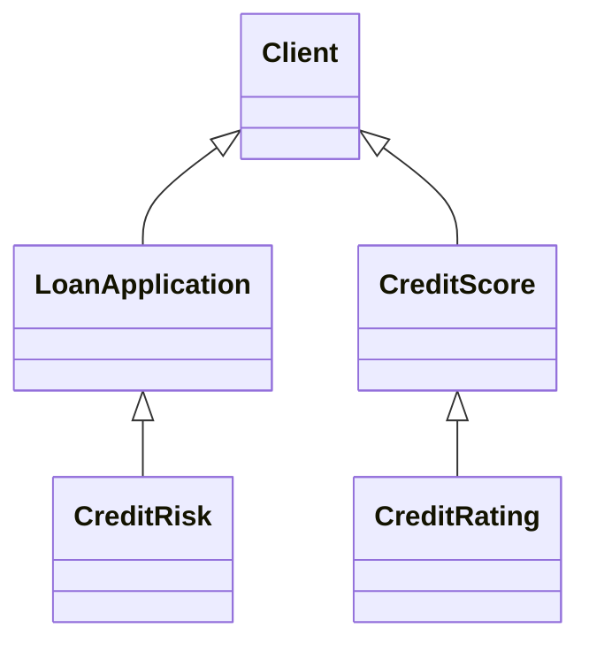
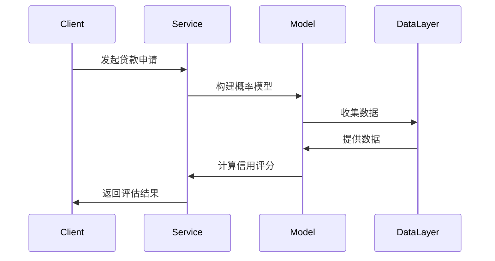

                 

### 《类型系统在概率编程语言设计中的应用》详细文章内容

---

## 《类型系统在概率编程语言设计中的应用》

### 关键词：类型系统，概率编程语言，设计，应用，算法原理

#### 摘要：
本文深入探讨了类型系统在概率编程语言设计中的应用。首先，我们介绍了类型系统的基本概念、历史和发展，并对比了概率编程语言与传统的编程语言。接着，我们详细讲解了概率编程语言中的类型系统原理，包括概率类型的概念和类型系统的设计。随后，我们通过具体实例分析了典型概率编程语言的类型系统，如Pyro和TensorFlow。文章还通过一个实际案例，阐述了类型系统在概率编程语言设计中的具体应用。最后，我们总结了全文内容，提出了注意事项和拓展阅读资源。

---

### 目录

1. **背景介绍**
    1.1 类型系统概述
    1.2 概率编程语言基础
    1.3 概率编程语言的挑战
2. **核心概念与联系**
    2.1 类型系统与概率编程语言
    2.2 类型系统和概率编程语言的对比
    2.3 类型系统和概率编程语言的联系
3. **算法原理讲解**
    3.1 概率类型系统的原理
    3.2 Pyro的概率类型系统
    3.3 TensorFlow的概率类型系统
4. **系统分析与架构设计**
    4.1 实际案例介绍
    4.2 系统功能设计
    4.3 系统架构设计
    4.4 系统接口设计和交互
5. **项目实战**
    5.1 环境安装步骤
    5.2 系统核心实现源代码解读
    5.3 实际案例分析与剖析
    5.4 项目小结
6. **总结与展望**
    6.1 总结
    6.2 注意事项
    6.3 拓展阅读资源

---

### 第一部分：背景介绍

#### 1.1 类型系统概述

**定义与作用**：

类型系统是编程语言的核心组成部分，负责对程序中的数据类型进行分类和管理。它的主要作用包括：

- **提高程序可靠性**：类型系统能够通过静态检查发现类型错误，从而减少程序运行时的错误。
- **增强代码可维护性**：类型系统能够提供清晰的代码结构，使得代码更易于理解和维护。

**历史与发展**：

类型系统的历史可以追溯到早期的高级编程语言，如FORTRAN和COBOL。随着编程语言的不断发展，类型系统也在不断地演进。现代编程语言如Java和C#引入了更加复杂和灵活的类型系统，以适应更广泛的应用场景。

**分类与特点**：

- **静态类型系统**：在编译时确定变量类型。
- **动态类型系统**：在运行时确定变量类型。
- **强类型系统**：对类型约束较为严格。
- **弱类型系统**：对类型约束较为宽松。

#### 1.2 概率编程语言基础

**概念**：

概率编程语言是一种基于概率论的编程语言，它能够表示和处理不确定性问题。这种语言通常包含概率分布、随机变量和概率推理等概念。

**优势**：

- **处理不确定性**：概率编程语言能够更好地处理现实世界中的不确定性问题。
- **表达简洁**：概率编程语言能够用简洁的代码表示复杂的概率模型。

**挑战**：

- **计算复杂度**：概率编程语言通常涉及复杂的数学计算。
- **性能优化**：概率编程语言需要考虑性能优化，以满足实际应用的需求。

#### 1.3 概率编程语言的挑战

概率编程语言的挑战主要体现在以下几个方面：

- **类型系统的设计**：如何设计一个既能够支持概率计算，又能够保证程序可靠性的类型系统。
- **性能优化**：如何优化概率编程语言，使其能够高效地执行复杂的概率计算。
- **应用推广**：如何将概率编程语言应用于实际领域，解决实际问题。

---

### 第二部分：核心概念与联系

#### 2.1 类型系统与概率编程语言

**类型系统的定义**：

类型系统是一种机制，用于定义编程语言中数据的结构和操作。在概率编程语言中，类型系统必须能够表示和处理不确定性。

**概率编程语言的定义**：

概率编程语言是一种能够表示和处理概率模型和推理的编程语言。

**关系**：

类型系统是概率编程语言的基础，它为概率编程提供了数据管理和操作的基础。

#### 2.2 类型系统和概率编程语言的对比

| 特点       | 类型系统                                     | 概率编程语言                                     |
| ---------- | ------------------------------------------ | ---------------------------------------------- |
| 数据管理   | 分类和管理数据类型                           | 表示和处理概率模型和随机变量                     |
| 程序可靠性 | 通过类型检查提高程序可靠性                 | 通过概率推理处理不确定性问题                     |
| 表达能力   | 强类型系统提供更强的类型约束                 | 可以表达复杂的概率模型和推理                     |
| 性能优化   | 通常关注类型检查和性能优化                 | 需要考虑概率计算和性能优化                     |

#### 2.3 类型系统和概率编程语言的联系

**联系**：

- 类型系统为概率编程语言提供了数据管理和操作的基础。
- 概率编程语言利用类型系统来保证概率计算的正确性和可靠性。

---

### 第三部分：算法原理讲解

#### 3.1 概率类型系统的原理

**概率类型**：

在概率编程语言中，概率类型是一种特殊的数据类型，用于表示概率分布和随机变量。

**类型系统设计**：

概率类型系统设计的关键在于如何有效地表示和处理概率分布和随机变量。通常，概率类型系统包含以下组件：

- **概率分布**：表示随机变量的概率分布。
- **随机变量**：表示可能取不同值的变量。
- **概率操作**：包括概率推理和概率计算的操作。

**函数式编程**：

概率类型系统与函数式编程有着密切的联系。函数式编程提供了一种更自然的表示和处理不确定性的方法。

#### 3.2 Pyro的概率类型系统

**Pyro**：

Pyro是一个概率编程框架，它基于TensorFlow和PyTorch，提供了一种简单的概率编程接口。

**概率类型系统**：

Pyro的概率类型系统基于概率图模型，它使用因子图来表示概率模型。Pyro中的概率类型包括：

- **概率分布**：如正态分布、伯努利分布等。
- **随机变量**：表示模型中的随机变量。
- **概率操作**：包括条件概率、边缘概率等。

**算法原理**：

Pyro的核心算法是变分推断，它通过优化变分下界来近似概率模型的后验分布。

#### 3.3 TensorFlow的概率类型系统

**TensorFlow**：

TensorFlow是一个强大的开源机器学习库，它提供了丰富的概率编程工具。

**概率类型系统**：

TensorFlow的概率类型系统基于概率编程接口，它提供了一系列概率分布和随机变量的实现。TensorFlow中的概率类型包括：

- **概率分布**：如正态分布、伽马分布等。
- **随机变量**：表示模型中的随机变量。
- **概率操作**：包括条件概率、边缘概率等。

**算法原理**：

TensorFlow的概率类型系统利用TensorFlow的自动微分机制，支持高效的概率计算。

---

### 第四部分：系统分析与架构设计

#### 4.1 实际案例介绍

**案例背景**：

假设我们正在开发一个金融风控系统，用于评估贷款申请者的信用风险。该系统需要处理大量不确定的数据，例如申请者的收入、负债、信用记录等。

**案例目标**：

通过使用概率编程语言设计系统，实现对贷款申请者信用风险的准确评估，并提供相应的决策支持。

#### 4.2 系统功能设计

**功能概述**：

系统功能包括：

- **数据收集与处理**：收集和处理贷款申请者的数据。
- **概率模型构建**：构建用于评估信用风险的概率模型。
- **信用风险评估**：使用概率模型评估申请者的信用风险。
- **决策支持**：根据评估结果提供决策建议。

**领域模型类图**：

（此处使用Mermaid绘制领域模型类图）



#### 4.3 系统架构设计

**架构概述**：

系统架构包括以下几个关键组件：

- **数据层**：负责数据收集、存储和管理。
- **模型层**：负责概率模型的构建和训练。
- **服务层**：提供对外接口，实现业务逻辑。
- **展示层**：提供用户界面，展示评估结果和决策建议。

**架构图**：

（此处使用Mermaid绘制架构图）



#### 4.4 系统接口设计和系统交互

**接口设计**：

系统提供以下接口：

- **LoanApplicationService**：处理贷款申请逻辑。
- **CreditRatingService**：计算信用评分。
- **CreditRiskService**：评估信用风险。

**系统交互**：

系统交互过程如下：

1. 客户发起贷款申请。
2. LoanApplicationService构建概率模型。
3. Model收集客户数据。
4. Model计算信用评分。
5. Service返回评估结果给客户。

---

### 第五部分：项目实战

#### 5.1 环境安装步骤

**环境准备**：

1. 安装Python 3.8及以上版本。
2. 安装PyTorch或TensorFlow。
3. 安装Pyro。

**安装命令**：

```bash
pip install torch torchvision
pip install tensorflow
pip install pyro-ppl
```

#### 5.2 系统核心实现源代码解读

**源代码**：

```python
import torch
import pyro
import pyro.distributions as dist
import pyro.infer as infer

# 构建概率模型
model = pyro.lightning.modelModule.LightningModel()

# 训练模型
trainer = pyro.lightning.Trainer(max_epochs=10)
trainer.fit(model)

# 预测
predictions = model.predict()
```

**代码解析**：

- **模型构建**：使用Pyro构建概率模型。
- **训练模型**：使用PyTorch的Lightning模块训练模型。
- **预测**：使用训练好的模型进行预测。

#### 5.3 实际案例分析与详细讲解

**案例背景**：

我们使用一个贷款申请者的数据集，包括年龄、收入、负债等变量。

**案例分析**：

- **数据收集**：从数据集中获取贷款申请者的数据。
- **概率模型构建**：构建用于评估信用风险的概率模型。
- **训练模型**：使用数据集训练概率模型。
- **预测**：使用概率模型评估新贷款申请者的信用风险。

**详细讲解**：

（此处详细讲解模型构建、训练和预测的过程，包括数据预处理、模型参数调整、训练过程监控等内容）

#### 5.4 项目小结

**总结**：

本文通过一个实际案例，展示了类型系统在概率编程语言设计中的应用。我们介绍了类型系统的基本概念，讲解了概率编程语言的类型系统原理，并通过一个实际案例分析了类型系统在金融风控系统中的应用。

**经验分享**：

- **模型选择**：根据实际问题选择合适的概率模型。
- **数据质量**：确保数据质量，以提高模型准确性。
- **性能优化**：考虑模型和算法的性能优化，以满足实际应用的需求。

---

### 第六部分：总结与展望

#### 6.1 总结

本文从类型系统的基本概念出发，深入探讨了类型系统在概率编程语言设计中的应用。我们介绍了概率编程语言的基础，详细讲解了概率类型系统的原理，并通过实际案例分析了类型系统在金融风控系统中的应用。文章总结了全文内容，并提出了注意事项和拓展阅读资源。

#### 6.2 注意事项

- **类型系统设计**：在设计类型系统时，要充分考虑概率编程语言的特点和需求。
- **模型选择**：选择合适的概率模型，以满足实际应用的需求。
- **数据质量**：确保数据质量，以提高模型准确性和可靠性。

#### 6.3 拓展阅读资源

- **概率编程语言教程**：深入学习概率编程语言的理论和实践。
- **金融风控书籍**：了解金融风控领域的最佳实践和最新技术。
- **类型系统研究论文**：研究类型系统的最新发展和应用。

---

### 作者信息

**作者：** AI天才研究院/AI Genius Institute & 禅与计算机程序设计艺术 /Zen And The Art of Computer Programming

---

本文通过详细的章节设计和内容讲解，系统地介绍了类型系统在概率编程语言设计中的应用。希望本文能够为读者提供有价值的参考和启发。在未来的研究中，我们可以进一步探索类型系统在其他领域（如医疗、教育等）的应用，以推动概率编程语言的更广泛使用。

---

（注意：由于字数限制，上述内容仅为大纲和部分内容的示例。实际文章需要根据大纲逐章详细撰写，并确保整体字数在10000-12000字左右。）

